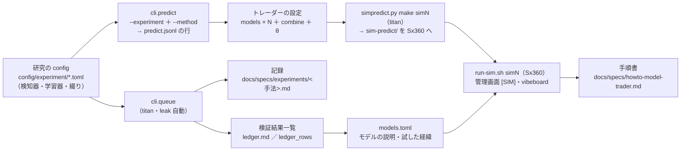
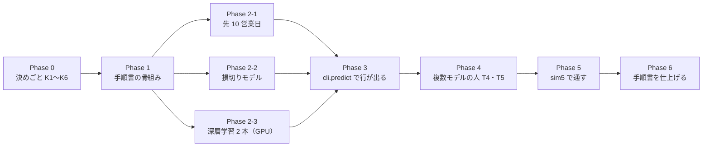
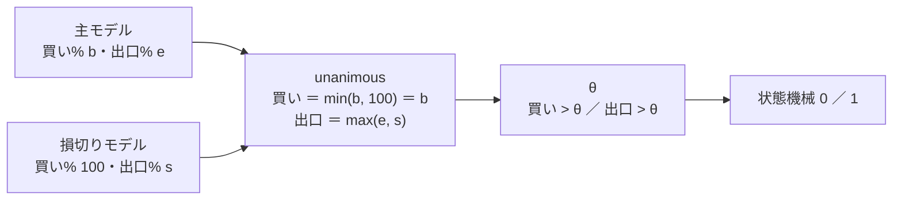
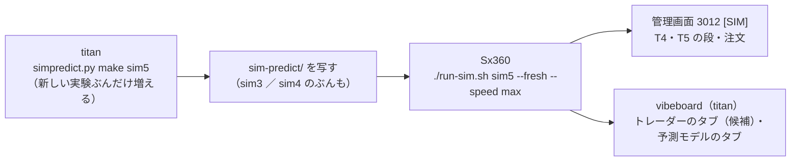

# titan で新しい予測モデルと、複数の予測モデルを持つトレーダーを作る方法を確立する

> 2026-09-27 作成（⚠ Sx360 の Claude が書いた。titan ではない）。利用者の指示（2026-09-27）: **「titanを使って新規の予測モデルと複数の予測モデルを持ったトレーダーを作成する方法を確立させます」**「TODOにある２週間後の予測モデルと、損切りのも含める。損切りは一つのモデルとして考えてもよいかも検証」「『複数のデータから特定の銘柄のトレンドを当てる深層学習を机上で試す』の２つのモデルもこのタスクに含める」
> TODO「titan を使って、新規の予測モデルと、複数の予測モデルを持ったトレーダーを作成する方法を確立する」のプラン。子タスク 4 つ（先 10 営業日 ／ 損切り 2 つ ／ 深層学習 2 本）はこのプランの Phase 2 に置き直した。

## 0. 目的・背景

**作るのは「方法」**＝ 手順書と、それを 1 度通した実例。⚠ **本番に新しい人（トレーダー）やモデルを入れるかは、このプランの外で利用者が決める**（[live-trading.md §0-15](../specs/experiments/live-trading.md) ＝ 10/20 の判定までは執行器を変えない・C11 ＝ いまの人は編集せず新しい識別名の新しい人を作る）。

確立するもの 4 つ（TODO の見立てをそのまま）:

| # | 確立するもの | いまの状態（2026-09-27 に確かめた） |
| --- | --- | --- |
| ① | 新しい予測モデルを titan で作る道（研究の config → `cli.queue` で検証 → 検証結果一覧 → 執行器が読める形 `kind = "experiment"`） | 道はある（T1〜T3 が通った）が、**手順書が無い**。検知器の登録・綴り・`models.toml` の書き方が 4 か所（`rules.md` 10-2・`dashboard.md` §16-3・§17-4・`models.toml` の頭）に散っている |
| ② | 複数モデルを持つトレーダーの作り方（`[[models]]` を 2 本以上 ＋ `combine`） | 執行器に合成規則は 4 つある（`trader.py` の `COMBINE_RULES`）。⚠ **`kind = "experiment"` のモデルを 2 本以上持つ人は 1 人も動かしたことがない**（`sim_c` は `kind = "file"` の m20 ＋ m10 を `mean`。2026-09-17「最初は 1 人 1 モデル・複数モデルは Phase 5 の後」） |
| ③ | 通し方（作り置き → 運転手 → 管理画面と vibeboard に出る） | `sim3` ／ `sim4` の形がある（`simpredict.py make` → `run-sim.sh`）。⚠ **Sx360 に `sim-predict/` が無い**【実測 2026-09-27】＝ いまは sim3 ／ sim4 も Sx360 で回らない（titan から写す） |
| ④ | 手順書（どこに何を書くか・テスト・チェックリスト） | 無い |

**実例**（利用者の指示 2026-09-27）: 新しい予測モデル ＝ **先 10 営業日を当てにいくモデル**・**損切りをモデルとして扱う形**・**深層学習の型 2 本（Chronos-2 zero-shot ＋ 共変量 ／ TimeXer）**。複数モデルの人 ＝ **実例 A: いまの 3 本を平均**（[親プラン §2-2](live-trading-three-models.md) の `T4` の例そのまま）と **実例 B: 主モデル ＋ 損切りモデル**（§2 K1）。

⚠ **守るもの**（変えない）:

- モデル・θ・合成規則・銘柄・`sizing` を替えるのは**新しい検証**（`n_trials` に数える・回すと決めるのは結果を見る前 ＝ [rules.md 14-9・14-10](../specs/experiments/feature-discovery/rules.md)）。基準線を最初から置く（17-7 の教訓）
- **10/20 の判定までは執行器（`run_day.py`・`trader.py`・`signals.py`・`plan.py`）を変えない**。設定・研究側のコード・管理画面・vibeboard は変えてよい。執行器を変えたくなる案は §7 に溜めて、判定の後に回す
- 説明の正本は TOML（`dashboard/models.toml` の `[[model]]`・`traders.toml` の `[nicks]`・`[symbols_why]`）。説明を Python に書かない
- 損益で手法を採らない（CLAUDE.md の 2 つ目の例外）。実例の人の成績は判定に混ぜない（`test = true` の sim の記録）

### 機械の役割（[three-machines.md §1](three-machines.md) のとおり）

| 機械 | このプランでやること | やらないこと |
| --- | --- | --- |
| **titan** | 研究用の `data/` と GPU で回す全部: `cli.queue`・`cli.run`・`cli.predict` の確認・`simpredict.py make`・vibeboard の確認（3010） | 本番の発注（印 `NOT_PRODUCTION` あり） |
| **Sx360** | `sim-predict/` を写して `run-sim.sh simN`・管理画面 3012 の確認・関門（`run-deploy.sh`）・13500t の操作（必要なら bench） | 研究の計算（GPU なし・`torch 2.14.0+cpu`【実測 2026-09-27】） |
| **13500t** | ⚠ **触らない**（本番）。新しい人を入れると利用者が決めた後にだけ、Sx360 の Claude が `bench_predict.py` で予測の時間を測る | — |

## 1. 全体像

> この図の主張: 新しいモデルは「研究の config」から入り、検証結果一覧と `models.toml` を経て `predict.jsonl` の 1 行になる。トレーダーは `[[models]]` でその行を束ねるだけで、執行器は 1 行も変えない。

## 2. 決めること（⚠ 利用者の裁定。Phase 0）

| # | 論点 | 推す案 | 理由 ／ ほかの案 |
| --- | --- | --- | --- |
| K1 | 複数モデルの人の実例をどれにするか | **実例 A（いまの 3 本を `mean`・θ=50・識別名 `T4`）を先に**、**実例 B（主モデル ＋ 損切りモデルを `unanimous`・識別名 `T5`）を Phase 2-2 の後に**。両方やる | A は予測を 1 本も増やさず（`run-live.sh` は同じ実験・手法を 1 度しか回さない）執行器も変えないので、配線の確認に最も安い。B は「損切りをモデルとして扱う」の答えそのもの。⚠ どちらも本番には入れない（配線の確認 ＝ 親プラン §2-2 の位置づけ） ✅ **2026-09-27 利用者決定: 推す案のとおり** |
| K2 | 損切りモデルの「合わせ方」 | **合成規則を足さない**。出口だけを言うモデルは**買い% を常に 100** で返し、`unanimous`（買いは min・出口は max ＝ `trader.py`）で合わせる ＝ 買いは主モデル・売りはどちらかが言ったら | いまの 4 つで作れるので執行器の凍結に触れない（§3 Phase 4 の図）。ほかの案: 規則 `primary`（買いは 1 本目・出口は max）を足す ＝ 執行器の変更 ＝ 10/20 の後（§7）。⚠ `mean` では買い% が半分になるので出口だけのモデルに使えない ＝ 手順書に書く。 ✅ **2026-09-27 利用者決定: 推す案のとおり**（買い% 100 ＋ `unanimous`。形 A・形 B のどちらでも同じ合わせ方） |
| K3 | 損切りモデルの形と数（事前固定） | **形 A（位置を知らない出口%。直近 N 日高値からの下落・値動きの大きさで割った下落）を先に**、**形 B（買値からの下落 x% ＝ 位置を知る）は `simulate` に出口の口を足してから別の検証として**。数は §3 Phase 2-2 の表 | 形 A はいまの検知器の口（入口% ／ 出口% の対 ＝ rules.md 16 章）と `cli.predict` の `exit` の欄にそのまま載り、執行器も読める。形 B は机上で `simulate` の変更（既定は 1 ビットも変えない）が要り、本番では執行器が買値を知る必要がある（＝ 10/20 の後）。 ✅ **2026-09-27 利用者決定: 推す案のとおり。ただし形 B は「別の検証」として後回しにせず、机上（`simulate` の出口の口）は形 A と並行して回す**。本番の口は §7 の道 1（状態を読むモデルの `kind`）。⚠ 利用者の指摘「損切りモデルは購入時の金額も持たせないといけない」＝ 形 A は厳密には損切りではなく「トレンドが崩れたら降りる出口」。買値（`Holding.avg_price`・`opened`）は売買履歴に既にあり、無いのはモデルに渡す口（`signals.collect` は売買履歴を受け取らない・`cli.predict` は日足しか見ない） |
| K4 | 先 10 営業日の試す形と数（事前固定） | 見る数字 3 組（own ／ ownex ／ ownseq の表）× 学習器 2（Ridge ／ LightGBM）× θ 3 ＝ **18 検証**（＋ leak 6 実行）。学習の対象は `y_fwd_10`・損益の対象は 1 日のまま（rules.md 15-3） | TODO の見立てのとおり。⚠ 見込みは高くない（両隣の 5 日・20 日が効いていない・独立な標本が約 1/10）が空白なので回す（rules.md 14-10） ✅ **2026-09-27 利用者決定: 推す案のとおり** |
| K5 | 深層学習 2 本の地平と対照 | 地平は **先 10 日**（K4 と同じラベルに相乗り）。Chronos-2 は **共変量あり ／ なし** の 2 行 × θ 3 ＝ 6・TimeXer は 1 × θ 3 ＝ 3（＋ leak）。依存は titan の `.venv` にだけ足す（`chronos-forecasting`・TimeXer は PatchTST と同じ移植） | 「先読み（学習コーパスの米株）」は leak 対照と「共変量なし」の対で切り分ける。⚠ 13500t のイメージ（g3plus-ops）には入れない（本番に入れると決めるまで） ✅ **2026-09-27 利用者決定: 推す案のとおり** |
| K6 | 新しい人の識別名・呼び名・置き場 | 識別名 `T4`（実例 A）・`T5`（実例 B）。呼び名は意味の無い名前を利用者が選ぶ（候補: ハル ／ ミオ）。置き場は **`config/traders/candidates/multi/<識別名>.toml`**（本番の形）＋ **`config/traders/sim_<識別名>.toml`**（`test = true`。sim 用の写し） | `config/traders/` の直下に置くと 13500t の管理画面と `run-live.sh` の一覧に「本物の人」として出る（`live.traders` は直下だけを読む）。`candidates/` なら vibeboard に「（候補）」で出て、本番には出ない。⚠ vibeboard の読み先を `candidates/notional/` から `candidates/*/` に広げる（管理画面側の小さな変更 ＝ 許される） ✅ **2026-09-27 利用者決定: 推す案のとおり**（呼び名 ＝ `T4` ハル ／ `T5` ミオ） |
| K7 | 本番に入れるときの決めごと（⚠ 入れると決めたときでよい） | 4 人目の予算（執行器の上限 $1,000 ＝ `DEFAULT_MAX_TOTAL_BUDGET`。$300 × 4 ＝ $1,200 は拒まれる）／ 13500t の予測の時間（実例 A は予測が増えない・実例 B は ＋1 本 ＝ `bench_predict.py` で測ってから。線 60 秒・いま 48 秒【実測 §0-12】）／ 深層学習を本番で毎日学び直すのは CPU では無理 ＝ 「重みを写す道」が別に要る（§7） | このプランでは決めない |
| K8 | `over_budget` の扱い（消す ／ 損切りの歯止めに作り替える ／ 残す） | 損切りの設計（Phase 2-2）と一緒に決める。推すのは **残す**（到達できないことをテストが固定している ＝ 変えない理由が無い限り触らない） | 利用者の指示 2026-09-20「1 についてはまとめて実行する」。⚠ 2026-09-27 Phase 2-2 を回した結果、損切りは予算の守り方（買いの丸め）に触れなかった ＝ 推す案「残す」のまま（[記録 §0-7](../specs/experiments/stoploss-as-model.md)）。✅ **2026-09-27 利用者決定: 残す**（何も変えない。`tests/test_sim_limits.py` が「出ないこと」を固定したまま ＝ 番人） |

## 3. 対応方針

> この図の主張: Phase は「手順書 → モデル → 執行器が読める形 → 人 → 通す → 手順書を仕上げる」の一本道で、モデルの 3 系統だけが並ぶ。本番へ入れる段はこのプランに無い。

### Phase 0: 決めごと（⚠ 利用者。K1〜K6。K7・K8 は後でよい）

### Phase 1: 手順書の骨組み（Claude・titan）

`docs/specs/howto-model-trader.md` を**実例より先に**書く（実例で手順を試し、Phase 6 で実測を入れて仕上げる）。中身は §4 の 2 本のチェックリスト。⚠ しくみの説明は書かない（vibeboard の「システム説明」が正本。手順書は「どこに何を書くか」だけ）。`system.toml` の「実際の売買」に 1 行の案内を足す。

### Phase 2: 新しい予測モデルを titan で作る道（① の実例 3 系統）

共通の手順（§4-1）: 事前固定を記録に書く → コード（検知器 ／ 学習器・`bootstrap.py`・`names.toml`）→ config → `cli.queue` → 記録 → 検証結果一覧 → `models.toml` の `[[model]]`。⚠ **回すと決めるのは結果を見る前**・回したものは全部 `n_trials` に数える・leak は queue が足す。

#### 2-1. 先 10 営業日を当てにいく形（CPU・TODO の子「今後 2 週間くらい上がりそう ／ 下がりそう」）

利用者の指示（2026-09-20。「システム説明」の「点に直す」の段への質問）:「短期売買は手数料がかさむのと大きな上昇を見込めないので『明日は上がりそう』という予測は意味がない。『今後 2 週間くらい上がりそう下がりそう』というような予測はできるか？また既にあるか？」

- いまあるもの: config 90 本は全部 `horizon = 1`。先を当てにいくのは 上がり調子の門 D1〜D4（先 20 ／ 60 ／ 200 営業日。⚠ 見ているのは `trend` の 6 列だけ。21 検証で採る 0 ＝ [downtrend-detection.md](../specs/experiments/downtrend-detection.md)）と 条件付き GAN（SPY の先 5 日。落とす ＝ [cgan-scenario.md](../specs/experiments/cgan-scenario.md)）。⚠ **5 日と 20 日のあいだ（10 営業日）と、「いまの 3 本が見ている数字で先の日数を当てにいく形」は空白**
- 作り方: 先 W 本のラベル（`labels.build_scales` の `y_fwd_{W}`・config の `label_scales = [10]`）・ラベルの長さに合わせたパージ（`horizon_min` ＝ 10 本 × 1440 分 × 1.5 ＝ 21,600 分。rules.md 14-7・15-4）・較正の holdout（`date_holdout(label_bars=10)`。15-5）は検知器のために既にある。足すのは **見る数字を替えた検知器 1 つ**（表の特徴量全部を `ctx["model"]` の学習器で `y_fwd_10 > 0` に当て、Platt 較正で買い% を返す。⚠ 既存の `SCALES`・D1〜D4 の登録名は変えない ＝ rules.md 10-1。新しい名前で足す）。**学習の対象（先 10 日）と損益の対象（1 日）を分ける**（15-3。シミュレータ 13-4 は変えない）
- 試す数: K4 のとおり 18 検証（3 表 × 2 学習器 × θ 3）。config は 6 本（`trade_own_fwd10_ridge_a` の形）＋ queue 1 本。作業 半日〜1 日・費用 0・GPU 不要【推測】
- ⚠ 先に書く見立て: 見込みは高くない（先 10 日の答えは毎日 9 日ぶん重なるので独立な標本が約 1/10 に減り、検出限界が上がる ＝ [validation-power.md](../specs/experiments/feature-discovery/validation-power.md)）。それでも空白なので回す
- ⚠ 質問の前提への補足（記録から）: 閾値売買は毎日往復ではなく、点が線の上にあるあいだ持ち続ける（費用は売り買いした日だけ ＝ 13-4）。負けの主因は手数料ではなく、点に中身が無いことと休んだあいだの上げの取り損ね（C3 のコストは負けの 7%【実測】）
- ⚠ **Phase 3 に効く穴**（2026-09-27 に読んで見つけた）: `cli.predict` の `split_asof` は `horizon`（1 日）の `y_elapsed_min` でしか訓練行を落とさない ＝ `y_fwd_10` の行は `asof` の 10 日前まで訓練に入る（答えの端が `asof` の終値に触れる）。研究側（`cli.run`）は `horizon_min` で fold をパージするので机上の検証には効かない。**Phase 3 で `split_asof` を「最長のラベルぶん落とす」に直す**（研究側のコード ＝ 執行器ではない。既定の指紋テスト `tests/test_predict.py` を流す）
- 記録: `docs/specs/experiments/forward10-target.md`（新規）。関連: [entry-timing.md](../specs/experiments/entry-timing.md)
- ✅ **2026-09-27 に回した**（titan の Claude。[記録](../specs/experiments/forward10-target.md)）: 18 検証 ＝ **採る 0 ／ 保留 2 ／ 落とす 16**（保留 2 行は乱択ゲートには勝つが対 B&H は 2/5）・n_trials 667 → 685・leak 6/6 跳ねた・門 6 本とも門前。時間: 表 6 本 3 分 16 秒 ＋ queue 12 本 2 分 44 秒（見積り 1 時間の 1/20）。⚠ 手順書（Phase 6）に足す注意 2 つ ＝ 記録 §5: `label_scales` の表は既存の表を `features_from` で読めない ／ 表の尻が短くなるので基準線の行に「幅」の印が付く。⚠ 「Phase 3 に効く穴」は `cli.predict` で実測（訓練は asof の 10 営業日前まで ＝ 記録 §4 の 7）
- ✅ 2026-09-27 利用者決定「修正」＝ `dashboard/system.toml` の「⑤ 出力スコアに直す」に 1 文と「詳しく」1 行を足した。元のメモ: 「システム説明」の「出力スコアに直す」の段が毎日売り買いするように読める → 「学ぶ対象は明日だが、売り買いは毎日ではなく、点が線の上にあるあいだ持ち続ける。もっと先（20 日〜）を当てにいく型も試したが効かなかった」を足すか

#### 2-2. 損切りを 1 つの予測モデルとして扱えるかを検証する（CPU・TODO の子 2 つ）

利用者の指示（2026-09-27）: **「損切りは一つのモデルとして考えてもよいかも検証」**。子「損切りの手法や対応方法を考える。損切りしたほうが損を多く生む可能性の調査も行う」（「疑問に思ったことを登録し解決していく」から移した）は、この検証の**事前固定（規則の候補と問い）**として先にやる。同じ答えを 2 か所で出さない ＝ 損切りの規則そのものは子・モデルとして合わせる形はここ。

- 考え方: いまのモデルは 1 本で買いと売りの両方を決める（買い% が θ を超えたら買い・出口% が θ を超えたら売る。⚠ 出口% は各モデルの独立した数字で、検知器が返さなければ `cli.predict` が `100 − 買い%` で埋める）。損切りをモデルにする ＝ **持ち株の出口だけを言うモデル**を `[[models]]` の 1 本にして主モデルと合わせる（K2）
- 形（K3）。⚠ 数と規則は回す前に記録の §0 に書く:

  | 形 | 出口% の作り方 | 机上の器 | 本番の器 | 数【推測】 |
  | --- | --- | --- | --- | --- |
  | A-1 規則の出口（位置を知らない） | 直近 N 日高値からの下落 x% ／ 値動きの大きさで割った下落（各 3 水準・事前固定） | 入口 ＝ 主モデル（own Ridge）・出口 ＝ 規則、の**対の検知器**（`ail/detectors/pair.py` の形 `in-x-out-y`。rules.md 16 章。`simulate` は変えない） | いまの執行器で読める（`exit` の欄・`unanimous`） | 規則 2 × 水準 3 × θ 3 ＝ 18 |
  | A-2 学ぶ出口 | 出口% を学ぶ（rules.md 15-3 の「学習の対象と損益の対象を分ける」） | 同じ対の検知器 | 同上 | 1 × θ 3 ＝ 3 |
  | B 位置を知る損切り | 買値からの下落 x%（3 水準） | ⚠ **`simulate` に出口の口を足す**（`opened` からの累積 `y` を見る任意引数。既定は 1 ビットも変えない ＝ `test_trading_run.py` の指紋） | ⚠ 執行器が買値を知る必要 ＝ **10/20 の後**（§7） | 3 × θ 3 ＝ 9 |
  | 基準線（`n_trials` に数えない） | 乱択の出口 ／ 固定日数（5・10 日）の出口 | 同じ対の検知器 | — | — |

- 「損切りしたほうが損を多く生むか」の問いにここで答える: 純利・最大の含み損・回転の数 を 損切りなし ／ 各形 ／ 基準線 で並べる（物差しは回す前に書く。rules.md 14・17 章）
- ⚠ **予算の守り方もここでまとめて見直す**（K8。利用者の指示 2026-09-20「1 についてはまとめて実行する」）: `plan.size_intents` の `over_budget` は**到達できない**【実測 2026-09-20】（予算は `target = min(per_symbol, available)` の丸めで先に守られ、枠で 1 株も買えないときは `too_small`）。いまは「出ないこと」を `tests/test_sim_limits.py` が固定している（[live-trading.md §0-7 (l)](../specs/experiments/live-trading.md)）。作り替えるならそのテストも直す ＝ 執行器の変更 ＝ 10/20 の後
- 守るもの: 実売買の `drawdown_warning`（含み損 20% は警告だけ・止めるのは人）はそのまま
- 記録: `docs/specs/experiments/stoploss-as-model.md`（新規）。関連: [entry-timing.md](../specs/experiments/entry-timing.md)（入口と出口で見る長さを変える。落とす）／ [live-trading.md §0-2](../specs/experiments/live-trading.md)（停止条件・含み損）／ [rules.md 13-4・15-3・16 章](../specs/experiments/feature-discovery/rules.md)
- ✅ **2026-09-27 に回した**（titan の Claude。[記録](../specs/experiments/stoploss-as-model.md)・[rules.md 19 章](../specs/experiments/feature-discovery/rules.md)）: 事前固定 ＝ 入口 1 本（T1 と同じ own 35 列 × Ridge）・出口 L0 損切りなし ／ L1 高値 20 日から −5 ／ 10 ／ 20% ／ L2 σ × 2 ／ 4 ／ 8 ／ L3 先 10 日の下げを学ぶ ／ 形 B 買値から −5 ／ 10 ／ 20%（`simulate` の口）・基準線 固定日数 5 ／ 10 日・合わせ方 max（＝ `unanimous`）。結果 **33 検証とも落とす**・n_trials 703 → 736・leak 全行で跳ねた（＋22,084bp・t 17.4）。**損切りを足した 27 行のうち θ=50 ／ 55 の 18 行が全部 損切りなし より純利が低く、4 行は fold 5/5**。減ったのは最悪の 1 取引と高値からの規則の最大ドローダウンだけで、⚠ **買値からの損切りは最大ドローダウンを悪化させた**。浅い損切りでは費用が負けの半分。時間: 表 64 秒 ／ queue 56 秒 ／ `cli.predict` 32 秒（4 銘柄で `exit` 100）。⚠ **本番に損切りモデルを入れる理由は出ていない**（`T5` は配線の確認 ＝ K1）。K8 は ✅ 2026-09-27 利用者決定「残す」（記録 §0-7）

#### 2-3. 複数のデータから特定の銘柄のトレンドを当てる深層学習（GPU・titan・TODO の子「型 2 本」）

派生元: 利用者の指示（2026-09-26）**「DeepLearnigで複数のデータが入った中から特定の銘柄のトレンドの予測に使えそうなモデルを調べて」** → 調査の結果を受けて「まずは TODO 化のみ」→ 2026-09-27 に「２つのモデルもこのタスクに含める」。

- 調査の結論（2026-09-26。【公表値】の取得日はすべて 2026-09-26）: 「複数のデータ → 特定の銘柄」の深層学習は 4 系統 ＝ A 目的 ＋ 外生（TimeXer・TFT・iTransformer・TiDE ／ TSMixer）／ B 断面・グラフ（MASTER・HIST・TRA・GATs・MTGNN）／ C 基盤モデル zero-shot ＋ 共変量（Chronos-2・Moirai-2・TimesFM-2.5 の XReg）／ D 線形対照（DLinear ＝ この案件では ownex の Ridge がその役）。前回の調査 [ts-trend-ai-survey.md](../specs/experiments/ts-trend-ai-survey.md) は単変量の系列モデルが中心で、多変量の入力はその空白
- ⚠ 外部の一次評価は否定的で揃っている: [QuantBench（arXiv:2504.18600）](https://arxiv.org/abs/2504.18600) ＝ 木 ＋ Alpha101 IC 2.31% ／ Sharpe 0.81 に対し LSTM IC 4.76% ／ Sharpe 0.77・GCN は IC −0.10% ／ 収益 −13.07%・「グラフ構造で一貫した改善は無い」／ [Deep TS Models for Equity Portfolios（arXiv:2606.09420）](https://arxiv.org/abs/2606.09420) ＝ CRSP 2018〜24・15 構造で費用 20bp 後の Sharpe は全モデル負・TS-Ridge が上位と拮抗 ／ [Chronos-2 の多変量金融予測（arXiv:2605.21504）](https://arxiv.org/abs/2605.21504) ＝ Mag-7 の価格水準で共変量あり MAPE 0.0706 ／ 0.0728 対 なし 0.0844 ／ 0.0834（先 21 ／ 63 日）。⚠ 測ったのは水準の誤差で方向でもランダムウォーク対照でもない・著者が学習データに米株が混ざる先読みの可能性を注記・株と金利を混ぜると悪化
- 見送り（理由つき）: 断面・グラフ（外部評価と [feature-discovery §8](../specs/experiments/feature-discovery.md) の両方が不振）／ TFT（TimeXer と同系で重い）／ TimesFM の XReg（線形なので Ridge と同じ）／ iTransformer（内生・外生の区別が無い。TimeXer が落ちたら次の候補）
- 材料は揃っている: ownex の表（own ＋ cs ＋ rel ＋ ex の 6 源）・seq の 60 日の道筋・63 銘柄の日足 2018〜。検知器の口（買い% を直接返す。rules.md 14-1）に PatchTST と同じ形で載せる（`ail/detectors/seqmodel.py` が雛形 ＝ `tsc.window_paths` → 学習器 → Platt 較正 → 買い%）。地平は K5 ＝ 先 10 日（2-1 と同じラベル。⚠ 回す前に固定）
- 2 本:

  | モデル | 形 | 事前固定 | 作業・実行【推測】 | 数 |
  | --- | --- | --- | --- | --- |
  | **Chronos-2 zero-shot ＋ 共変量** | 目的 ＝ 銘柄の終値・共変量 ＝ 他 62 銘柄 ＋ 金利・為替（past-only）。学習しない ＝ 固定するのは文脈長と分位点の読み方だけ。分位点から上がる確率 → 既存の較正・θ・シミュレータ | ⚠ 判定の前に leak 対照と「共変量なし」の行を並べ、共変量の効きと先読みを切り分ける | 半日〜1 日・実行 数分〜数十分の GPU【公表の A10G で 300 系列/秒から】。Apache 2.0・120M・CPU でも動く（[amazon/chronos-2](https://huggingface.co/amazon/chronos-2)・[arXiv:2510.15821](https://arxiv.org/abs/2510.15821)）。依存 `chronos-forecasting` は titan の `.venv` にだけ | 2 行 × θ 3 ＝ 6 |
  | **TimeXer（教師あり）** | 内生 ＝ 目的銘柄の 60 日の道筋・外生 ＝ 他銘柄 ＋ 外部系列。PatchTST と同じ検知器の口・同じ縮小側の大きさ | `ARCH` ／ `TRAIN` を config に事前固定（`model_args` は書かない ＝ PatchTST と同じ） | 1 日・1 fold 20 分前後の GPU【PatchTST の本番 1 時間 37 分 ／ 5 fold【実測】から】。Time-Series-Library（MIT）に実装あり（[NeurIPS 2024](https://proceedings.neurips.cc//paper_files/paper/2024/hash/0113ef4642264adc2e6924a3cbbdf532-Abstract-Conference.html)・[thuml/TimeXer](https://github.com/thuml/TimeXer)） | 1 × θ 3 ＝ 3 |

- 記録: `docs/specs/experiments/exog-deep-models.md`（新規）。関連: [patchtst-threshold.md](../specs/experiments/patchtst-threshold.md)（同じ口。落とす）／ [ts-trend-ai-survey.md §7](../specs/experiments/ts-trend-ai-survey.md)

### Phase 3: 執行器が読める形にする（titan）

- 系統ごとに `cli.predict --experiment <実験名> --method <手法> --asof <日> --out …` が `predict.jsonl` の行（`date・model・method・symbol・buy・exit・proxy_close・input_fingerprint・commit`）を出すことを確かめる（研究用の `data/` で。`data-live/` は触らない）。⚠ **判定が「落とす」でも道は通す**（確立するのは道）
- 2-1 の `split_asof` のパージを直す（研究側）。`tests/test_predict.py`・`test_trading_run.py`（既定の指紋）を流す
- 2-2 の出口だけのモデル: 対の検知器が `(entry, exit, doc)` を返す → `cli.predict` の `exit` に載る。**買い% は常に 100**（K2）。⚠ 出口だけのモデルは**主モデルとは別の実験名**にする（`signals.py` は `(model, symbol)` で行を引くので、**同じ実験名の違う手法を 1 人の中で 2 本持てない** ＝ 手順書に ⚠）。⚠ この「入口 100・出口 ＝ 規則」の実験 config は **`cli.predict` のためだけ**（queue に入れない ＝ 検証ではないので `n_trials` に数えない。机上の検証は 2-2 の「入口 ＝ 主モデル」の対で済んでいる）
- 2-3 は `cli.predict` が通れば十分（本番で毎日学び直す道は K7・§7）

### Phase 4: 複数モデルのトレーダーを作る（titan で書き、Sx360 で通す）

> この図の主張: 出口だけのモデルが買い% 100 を返せば、`unanimous`（買いは min・出口は max）だけで「買いは主モデル・売りはどちらかが言ったら」になり、執行器の合成規則を足さなくてよい。

| Step | 中身 | 担い手 |
| --- | --- | --- |
| 4-1 | vibeboard のトレーダーのタブの読み先を `candidates/notional/` → `candidates/*/` に広げる（`traderview.trader_files`。「（候補）」の印はそのまま）。`dashboard/tests/test_traders_tab.py` に候補の 1 件を足す | Claude |
| 4-2 | **実例 A `T4`**: `candidates/multi/T4.toml`（`[[models]]` ＝ T1・T2・T3 の 3 本・`combine = "mean"`・θ 50・$300・5 本・`shares`）＋ `sim_T4.toml`（`test = true`）。`traders.toml` に `[nicks]`（利用者の選んだ呼び名）・`[symbols_why]` | Claude（呼び名は利用者） |
| 4-3 | **実例 B `T5`**: `candidates/multi/T5.toml`（主モデル ＝ T1 の Ridge ＋ 損切りモデル〔2-2 の形 A〕・`combine = "unanimous"`・θ 50）＋ `sim_T5.toml`。`models.toml` に損切りモデルの `[[model]]`（特性に `basis`・`history.names` は 2-2 の対の検知器のパターン） | Claude |
| 4-4 | `experiments/live-trading/tests/test_trader.py` に「候補の複数モデルの人が読める・`asis` を 2 本で拒む・`unanimous` で買いは主モデルの値」を足す（⚠ テストだけ。執行器は変えない） | Claude |
| 4-5 | `live-trading.md` §0-1 の下に「候補の人」の表を足す（事前固定の記録。⚠ 本番の人ではない） | Claude |

⚠ 実例 A の成績は測らない（配線の確認）。人としての机上の成績は別タスク「予測モデルの検証のようにトレーダーの検証も行う」の器で（このプランでは触れない）。

### Phase 5: 通し方（sim5）

> この図の主張: 作り置きは研究用の `data/` のある titan でしか作れず、通すのは資格情報の無い Sx360。あいだを `sim-predict/` の写しがつなぐ。

| Step | 中身 | 担い手 |
| --- | --- | --- |
| 5-1 | `config/sim/sim5.toml`（`traders = ["sim_T4", "sim_T5"]`。期間・気配は sim3 と同じ・筋書き無し。⚠ 予算の合計 ≤ $1,000 ＝ 2 人で $600） | Claude |
| 5-2 | titan: `simpredict.py make sim5 --jobs 8`（増えるのは損切りモデルの 64 本だけ。sim3 の 192 本は 16 分【実測】） | Claude（titan） |
| 5-3 | `sim-predict/` を Sx360 へ写す（⚠ いま Sx360 に無い ＝ sim3 ／ sim4 のぶんも一緒に） | 利用者 ／ Sx360 の Claude |
| 5-4 | Sx360: `./run-sim.sh sim5 --fresh --speed max` → 管理画面 3012 に `[SIM]`・T4・T5 の段・注文が出る。vibeboard（titan）にトレーダー 2 人（候補）と新しい `[[model]]` | Sx360 の Claude |
| 5-5 | 結果を [live-trading.md §0-7 (k)](../specs/experiments/live-trading.md) に足す（注文の数・出来事の件数。⚠ 黄金の集計値には足さない ＝ `--full` を重くしない） | Claude |

### Phase 6: 手順書を仕上げる

- §4 のチェックリストに実測（コマンド・かかった時間・落ちたテストとその直し方）を入れる
- `./run-tests.sh` と `dashboard` のテストを流す。`ledger.md` の合計と `models.toml` の試した経緯が一致すること（`test_real_history_matches_the_db`）
- TODO の親を `DONE.md` へ・このプランを `archive/` へ。⚠ 残るのは利用者の決定（本番に T4 ／ T5 を入れるか ＝ 実売買の親の Phase 6 の後・K7）

## 4. 手順書の骨組み（Phase 1 で `docs/specs/howto-model-trader.md` に書く）

### 4-1. 新しい予測モデルを足す（titan）

| # | やること | 場所 | 落ちるテスト ／ 止まるもの |
| --- | --- | --- | --- |
| 1 | 事前固定を書く（試す形・数・θ ＝ {50,55,60}・地平・基準線・物差し） | `docs/specs/experiments/<手法>.md` §0 | — （rules.md 14-9・14-10） |
| 2 | 検知器 `@register("detector", 名前)` ／ 学習器 `@register("model", 名前)` を書き、`ail/bootstrap.py` に import を足す | `ail/detectors/<x>.py`・`ail/models/<x>.py` | 「registry に無い」 |
| 3 | 綴りを 1 行足す（`[method]`・`[learner]`。`[a-z0-9-]`・一意） | `config/names.toml` | `tests/test_names.py`・`cli.report --catalog`・queue の検証結果一覧の書き出し |
| 4 | config を書く（`features_from` で表を作り直さない・`thresholds = [50,55,60]`・`horizon = 1`・先を当てるなら `label_scales` ＋ `horizon_min`） | `config/experiment/trade_<表>_<x>_a.toml` | `config.resolve_experiment` |
| 5 | queue を書いて回す（leak と検証結果一覧は自動） | `config/queue/<x>.toml` → `cli.queue --config <x>` | `runs/research.sqlite` の `queue_state`（再開できる） |
| 6 | 記録を書く（結果・判定・`n_trials` の前後） | `docs/specs/experiments/<手法>.md` | — |
| 7 | 執行器が読める形を確かめる | `cli.predict --experiment … --method … --asof …` | `tests/test_predict.py`（必要なら 1 行足す） |
| 8 | 説明を書く（`id`・`name`・`method`・`formal`・`traits`〔`basis` 必須〕・`sees`・`flow`・`sets`・`history.names`・`records`・`configs`） | `dashboard/models.toml` の `[[model]]` | `dashboard/tests/test_models_tab.py`・`test_traders_tab.py`・`test_system_tab.py`（やさしい言葉・比較しない・数字を書かない・試した経緯が DB と一致） |

### 4-2. 複数モデルのトレーダーを足す

| # | やること | 場所 | ⚠ |
| --- | --- | --- | --- |
| 1 | 識別名（新しい・変えない）・呼び名（意味の無い名前・使い回さない）・銘柄を選んだ理由 | `dashboard/traders.toml` の `[nicks]`・`[symbols_why]` | 呼び名は利用者 |
| 2 | 設定を書く: `[[models]]` × N（`kind = "experiment"`・`name`・`method`）・`combine`・`threshold` ≥ 50・`budget_usd`・`symbols`・`sizing` | `config/traders/candidates/<組>/<識別名>.toml` | `asis` は 1 本だけ・`majority` は奇数本・`unanimous` ＝ 買いは min ／ 出口は max・**同じ実験名の違う手法を 2 本持てない**・出口だけのモデルは買い% 100 ＋ `unanimous`・予算の合計 ≤ $1,000 |
| 3 | sim 用の写し（`test = true`・`sim_` 始まり）と筋書き | `config/traders/sim_<識別名>.toml`・`config/sim/simN.toml` | 名前は `sim_` で始める（`simdata` が拒む） |
| 4 | 作り置き → 写す → 通す | titan `simpredict.py make simN` → Sx360 `./run-sim.sh simN --fresh --speed max` | 1 日でも欠けると運転手は rc=2 |
| 5 | 見る | 管理画面 3012（`[SIM]`）・vibeboard トレーダーのタブ（候補）・予測モデルのタブ（いま使っている〔候補〕） | 本番の管理画面（13500t）には出ない |
| 6 | テスト・記録 | `experiments/live-trading/tests/test_trader.py`・`test_simpredict.py`・`dashboard/tests/`・`live-trading.md` §0-7 (k) | — |
| 7 | 本番に入れる（⚠ 利用者の決定。このプランの外） | `config/traders/` 直下へ写す・13500t の `live.env` の `AIL_LIVE_TRADERS`・予算の上限・`bench_predict.py` で予測の時間・`live-trading.md` §0-1 | 10/20 の後・C11・K7 |

## 5. 影響範囲

| 区分 | 変える | 変えない |
| --- | --- | --- |
| 研究側（`experiments/feature-discovery/`） | 検知器 3〜4 本・学習器 1〜2 本（TimeXer・Chronos-2）・`bootstrap.py`・`names.toml`・config 約 12 本・queue 3 本・`cli/predict.py` の `split_asof`（最長のラベルぶん落とす）・形 B のときだけ `ail/validation/simulate.py`（任意引数・既定は同一） | `cli.build.assemble`・`cli.run.fold_buy_pct`（触るなら指紋テスト） |
| 執行器（`experiments/live-trading/`） | **コードは 0**。設定（`candidates/multi/`・`sim_T4`・`sim_T5`・`config/sim/sim5.toml`）とテスト（`test_trader.py` の追加） | `run_day.py`・`trader.py`・`signals.py`・`plan.py`（10/20 まで凍結） |
| 管理画面・vibeboard | `dashboard/traderview.py` の読み先（`candidates/*/`）・`models.toml` に `[[model]]` 4〜5 本・`traders.toml` に 2 人・`system.toml` に案内 1 行 | `dashboard/app/`（本番の面） |
| 文書 | 手順書（新規）・記録 3 本（新規）・`live-trading.md` §0-1（候補の表）・§0-7 (k)（sim5）・`rules.md`（事前固定を書き足す章があれば）・`CLAUDE.md`（手順書への案内 1 行）・`TODO.md` | `ledger.md` は queue が吐く（手で編集しない） |
| 検証結果一覧 | `n_trials` ＋ 48〜57【推測】（2-1: 18 ／ 2-2: 21〔形 B を回すなら 30〕／ 2-3: 9。基準線と leak は数えない） | 既存の行 |
| 本番（13500t） | **0** | — |

## 6. テスト方針

- 研究側: `tests/test_names.py`（綴り）・`tests/test_predict.py`・`tests/test_trading_run.py`（既定の指紋が変わらない）・新しい検知器の単体（leak 対照が跳ねること）
- 執行器: `experiments/live-trading/tests/`（`test_trader.py` の追加・`test_simpredict.py`）。`./run-tests.sh --full` で黄金の集計値が**変わらない**こと（執行器を変えていない証拠）
- 管理画面: `dashboard/tests/test_traders_tab.py`・`test_models_tab.py`・`test_system_tab.py`・`test_vibetab.py`（リンクの実在）。⚠ `test_real_history_matches_the_db` は titan の DB で流す（Sx360 の DB は控え）
- 通し: `run-sim.sh sim5` の運転手の検査（`simctl.py check`）・管理画面 3012 の `[SIM]`・`/api/live` に `mode: sim`
- 関門: `./run-deploy.sh` はこのプランでは流さない（本番に効く道の変更が 0 なのでデプロイの依頼が無い限り `prod` は進めない）

## 7. 10/20 の判定の後に回す案（執行器の変更 ＝ このプランではやらない）

| 案 | 何のため | どこ |
| --- | --- | --- |
| 合成規則 `primary`（買いは 1 本目・出口は max） | 出口だけのモデルに「買い% 100」の約束を課さない形 | `trader.py` の `COMBINE_RULES`・`dashboard/app/live.py` の `COMBINE_LABEL`・`traders.toml` の `combine_*`・`system.toml`・`glossary.toml` |
| 位置を知る損切り（形 B）を本番で | 買値からの下落 x% | ✅ 2026-09-27 利用者決定: **道 1 ＝ 状態を読むモデルの `kind`**（例 `stoploss`。持っていれば 今日の気配 ÷ `avg_price` − 1 が −x% を下回ったら出口% 100・それ以外 0・買い% は常に 100。合成は `unanimous` のまま）。変更は `trader.py`（kind と検証）・`signals.py`（売買履歴を受け取る）・`run_day.py`（呼び方）。⚠ 今日の気配が要るので、合図を集める段より前に気配を読む順番の入れ替えが要る（いまは状態機械の後）。道 2（`plan.decide` に規則を直接書く）は「モデルとして扱う」から外れるので採らない |
| `signals.py` の行の引き方に `method` を足す | 同じ実験の違う手法を 1 人で 2 本持てるように | `signals.py`・`cli.predict` の `write_rows` |
| `over_budget` の扱い（K8） | ✅ 2026-09-27 利用者決定「残す」＝ 変更なし | `plan.size_intents`・`tests/test_sim_limits.py` |
| 深層学習の「重みを写す道」 | 13500t で毎日学び直さず、titan で学んだ重みで予測する | `cli.predict --fitted`（`cli.scenario predict --run` と同じ形）・13500t のイメージ（g3plus-ops） |

## 8. 作業量・費用・期間【推測】

| Phase | 作業（Claude） | 実行（機械） | 費用 |
| --- | ---: | ---: | ---: |
| 0〜1 | 半日 | — | 0 |
| 2-1 | 半日〜1 日 | titan CPU 1〜2 時間 → ✅ **実測 6 分**（表 3 分 16 秒 ＋ queue 2 分 44 秒） | 0 |
| 2-2 | 1 日 | titan CPU 1 時間以内 | 0 |
| 2-3 | 2 日 | titan GPU 2〜3 時間（TimeXer 1.6 時間 ＋ leak・Chronos-2 数十分） | 0（重みは Apache 2.0） |
| 3〜5 | 1 日 | titan 作り置き 10 分・Sx360 通し 10 秒 | 0 |
| 6 | 半日 | — | 0 |

⚠ 2-1〜2-3 の見込みは 3 系統とも高くない（先行の記録が全部「落とす」）。**それでも確立するのは道**で、判定が「落とす」でも Phase 3〜6 は進める。

## 9. やらないこと

- 本番（13500t）に人・モデルを入れる（利用者の決定。10/20 の後）
- 執行器のコードを変える（§7 に溜める）
- 損益で採否を決める・実例の人の成績を検証結果一覧に載せる（人の机上の検証は別タスク）
- 13500t のイメージに深層学習の依存を入れる（入れると決めたときに Sx360 の Claude が g3plus-ops で）
