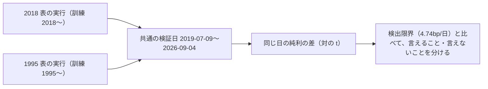

# 疑問「古すぎるトレンドは直近では参考にならないのではないか」に、既存の記録で答える

2026-09-18。利用者の指示「おススメ順でやって」（疑問タスクの子。登録は利用者）。

## 1. 目的・背景

訓練に 1995 年からのデータを入れると、直近（2019〜2026 年）の予測の役に立つのか、邪魔なのか。⚠ **新しい実行はしない**（GAN のキューの後始末で「n_trials 613 のまま」を検算する前なので、`runs/` に足さない）。既にある実行の記録を読むだけで、どこまで言えるかを確かめる。

## 2. 対応方針

**主張: 同じ手法を 2018 年始まりと 1995 年始まりの表で回した対が 1 組あるので、両方が検証している同じ日付の上で比べる。**

- 材料: `runs/` の `trade_own_ridge_a`（2018 表）と `trade_own_1995_ridge_a`（1995 表）の `daily.csv`・`checks.json`。⚠ 読むだけ
- ⚠ **fold の長さを跨いで fold の bp を比べない**（rules.md 14-4）。日次で比べる
- ⚠ 事後の読みであって新しい試行ではない（n_trials は動かない）。採否には使わない（診断）
- 交絡を先に挙げる: 1995 表は fold が 1,324 日なので、直近を当てているモデルは最長 5 年更新されていない（「古いデータを入れた」と「モデルが古い」が分かれない）

## 3. 成果物

`docs/specs/experiments/old-data-relevance.md`（答え・数字・言えないこと・決着をつける実験の案）。TODO の子タスクに答えの要点をメモし、決着の実験を回すかは利用者に聞く（⚠ 疑問タスクの子の追加は利用者の指示）。

## 4. 影響範囲・テスト

文書だけ。コード・`runs/`・台帳は変えない。
