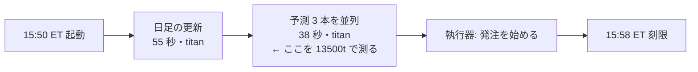
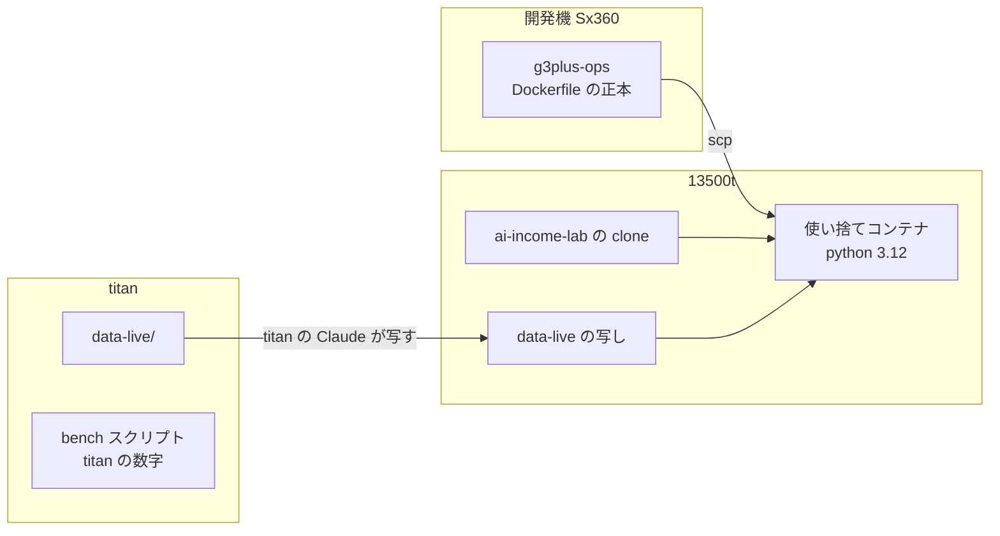
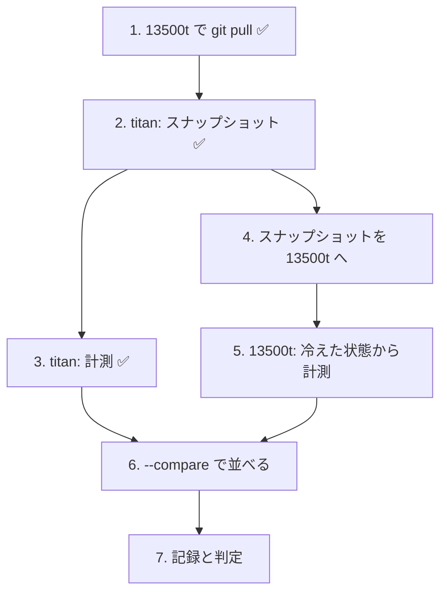

# 13500t で「今日の買い%」の予測にかかる時間を測る

> 2026-09-22 作成。利用者の指示: **`../g3plus-ops` が管理する 13500t にデプロイして速度計測します**。
> TODO「予想の時にg3plusを使った場合の処理時間を計測。遅すぎる場合はtitanで処理を動かすのを考える」を、置き先を 13500t に替えて進める（g3plus は Intel N150 の 4 コアで、2026-09-22 に管理画面ごと撤去済み）。

## 1. 目的・背景

- 実売買の 1 日は `run-live.sh` が **日足の更新 → 予測（3 モデルを並列）→ 執行器** の順に流す。予測は 15:50 ET 過ぎに始まり、発注は 15:58 ET の刻限までに始めなければならない（`run-live.sh` のブレーキ。準備の見積りは `AIL_PREP_SECONDS=120`）
- いまの予測は titan（WSL2・32 スレッド・RTX 3090 Ti）で **3 本並列 36〜38 秒【実測 2026-09-19・09-22】**
- 13500t に売買を移せるかどうか（TODO「`~/g3plus-ops` を使って 13500T に管理画面と毎日の売買を動かす環境を作る」の「決めること」）の材料として、**同じ入力・同じコードで予測の所要時間を測り、titan と比べる**
- ⚠ **測るのは予測だけ**。売買はしない・13500t に資格情報（`.env`）を置かない（下の §3）

13500t の性能は判定の線（§2-3）の中に入るか、それを測る。

## 2. 測る前に決めること（⚠ 結果を見る前に固定する）

### 2-1. 「予想の 1 回」とは

`run-live.sh` の予測の段と同じもの ＝ **3 本の `cli.predict`（T1・T2・T3 の実験 × 手法）を同時に起こしてから、3 本とも終わるまでの経過時間（壁時計）**。

| 項目 | 取り方 |
| --- | --- |
| 主の数字 | 3 本並列の経過時間（`date +%s.%N` の差） |
| 内訳 | 各 `cli.predict` の `--meta-out` にある `seconds.table`（表を作る）・`seconds.fit_predict`（学習 ＋ 予測） |
| 含めないもの | 日足の更新（DXLink。資格情報が要る・回線で決まる）・執行器・Python の依存の入れ直し |

- 日足の更新は 13500t では測らない（資格情報を置かないため）。見積りは titan の **55 秒【実測】をそのまま使う**【推測】（回線と配信側で決まり、CPU にはほぼ依らない見立て）
- 1 回目は numba の JIT のコンパイル（T3 の QUANT が使う `aeon`）が乗るので、**1 回目（冷えた状態）と 2〜6 回目（温まった状態）を分けて出す**。本番は毎日 1 回しか起こさないが、numba のキャッシュがディスクに残るかで 1 回目の意味が変わる → キャッシュの有無も記録する

### 2-2. どのモデルで・どの日で

- モデル: 実際に動かす 3 人のもの（`config/traders/T1〜T3.toml` から `run-live.sh` と同じく拾う）＝ `trade_own_ridge_a` ／ `trade_ownex_lgbm_a` ／ `trade_ownseq_ridge_a`（T3 QUANT（60日窓））
- 日: **asof = 2026-09-18（金）** と **2026-09-22（火）** の 2 日（titan の既存の【実測】と同じ日）
- 入力: titan の `experiments/feature-discovery/data-live/` を**そのまま写したもの**（同じ中身。写した後の指紋を両方で記録する）
- 回数: 各日 6 回（1 回目 ＝ 冷えた状態、2〜6 回目の中央値 ＝ 温まった状態）
- **titan でも同じスクリプトで同じ回数を測り直す**（同じ日の同じ入力で並べる。過去の 36〜38 秒は `run-live.sh` の中での数字なので、そのままは比べない）

### 2-3. 「遅すぎる」の線（⚠ 測る前に固定）

準備の見積り `AIL_PREP_SECONDS=120` ＝ 日足の更新 55 秒 ＋ 予測。予測に使える分は **120 − 55 ＝ 65 秒**。

| 13500t の予測（3 本並列・温まった状態の中央値） | 判定 | 次にすること |
| --- | --- | --- |
| **60 秒以下** | 間に合う | そのまま移す候補にする（titan と同じ起動時刻・同じ `AIL_PREP_SECONDS`） |
| **60 秒超〜 180 秒以下** | 条件つき | 起動を前へずらす（`--wait` の 15:50 ET を早める）か `AIL_PREP_SECONDS` を引き上げる。⚠ 合図が早い時刻の気配になる ＝ 執行の差の定義に触れるので、利用者の裁定 |
| **180 秒超** | 遅すぎる | 予測は titan で動かす（TODO の元の文のとおり） |

- 冷えた状態（1 回目）が温まった状態より 30 秒以上遅いときは、**本番の毎日 1 回は冷えた状態**なので、1 回目の数字で上の表を引き直す（キャッシュがディスクに残らない作りなら 1 回目が本番の数字）
- 予測の中身の一致: 同じ入力の指紋（`input_fingerprint`）で、**titan と 13500t の買い% が全銘柄で一致するか**（小数の丸め誤差まで一致しなくても、売買の判定 ＝ 売買基準値を超えるかが 1 銘柄も変わらないこと）。⚠ ずれたら時間の比較より先に原因を調べる（CPU の命令の違いで LightGBM ／ numba の結果が揺れる可能性）

## 3. 対応方針

13500t に載せるのは**予測のコードと日足だけ**。資格情報・記録（`live.sqlite`）・執行器の本番の起動は載せない。

| 項目 | 方針 | 理由 |
| --- | --- | --- |
| アプリコード | 13500t に `git clone`（`/home/ubuntu/ai-income-lab/`）。更新は `git pull` | g3plus-ops の規約（public リポジトリは clone） |
| Python | **Docker の使い捨てコンテナ**（`python:3.12-slim` ＋ `requirements.txt` ＋ `requirements-nodeps.txt --no-deps`）（§7 で決定） | 13500t のホストの Python は 3.14 で、固定した numpy 2.4.2・numba 0.67 などの wheel が合わない恐れ。コンテナなら titan の venv（3.12.3）とそろえられ、ホストを汚さない。別案はホストに `uv` で 3.12 の venv |
| GPU | 使わない（CPU だけ） | 3 本とも CPU で動く（Ridge・LightGBM・aeon の QUANT）。torch は依存に入っているが 3 本では使わない。13500t の GPU（Maxwell）は torch 2.14 の既定 wheel（CUDA 13）では使えない見込み |
| デプロイ設定（Dockerfile・compose） | **g3plus-ops 側**に置く（例 `ail-predict-bench/`） | CLAUDE.md「デプロイ設定は g3plus-ops（private）側にだけ書く」。このリポジトリには処理時間と機械の仕様だけを残す |
| 測るスクリプト | このリポジトリ（`experiments/feature-discovery/bench_predict.py`） | titan と 13500t で同じものを流すため。`run-live.sh` と同じ規則でモデルを拾い、3 本並列 × N 回・経過時間と meta を JSON で書く |
| データ | titan の `data-live/` を 13500t へ写す（titan の Claude が行う。§7） | 開発機（Sx360）には `data-live/` が無い |
| 資格情報 | **置かない** | 置くと実売買が物理的に起きる機械が増える（TODO の「決めること」は未裁定）。予測は資格情報なしで動く（日足は写したものを読む） |
| ポート・Tunnel | 使わない | 測るだけのコンテナなので公開しない |

## 4. Phase

### Phase 1: 測るスクリプト（このリポジトリ）

- `experiments/feature-discovery/bench_predict.py`: `--asof` × 回数 N で、3 本の `cli.predict` を並列に起こし、経過時間と各 meta（`seconds`・`input_fingerprint`・買い%）を 1 回 1 行の JSON で出力する。出力の置き場は引数（作業用の置き場。⚠ 本物の `live.sqlite` に書かない ＝ `cli.predict` の `--out` は一時ディレクトリ）
- 機械の仕様（CPU の型番・コア数・メモリ・Python と主要パッケージの版・numba のキャッシュの場所）も同じ JSON に書く
- Sx360 では `data-live/` が無いので、研究用の `data/` で**動くことだけ**確かめる（数字は使わない）
- 2 台の結果を並べる `--compare A B`（時間と、売買の判定 ＝ 買い% ／ 出口% が θ を超えるかが 1 銘柄でも変わったら rc=1）

✅ 2026-09-22: `bench_predict.py` ＋ `tests/test_bench_predict.py`（拾い方が `run-live.sh` と同じ・判定が変わったときだけ落ちる）。Sx360 で通した（LightGBM・aeon が無いので T2・T3 は rc=1 で記録される ＝ 失敗の道も確かめた）

### Phase 2: 13500t に載せる（g3plus-ops）

- g3plus-ops に `ail-predict-bench/`（Dockerfile ＋ compose ＋ 手順書 `docs/workflows/ail-predict-bench.md`）
- 13500t に clone → イメージを作る → `data-live/` を写す（titan の Claude）→ コンテナの中で `pytest tests/test_predict.py` が通ることを確かめる
- ⚠ g3plus-ops の既存プラン `docs/plans/ai-income-lab-13500t.md` の「毎日の売買」の (b) 案（使い捨てコンテナを host cron から起こす）の下見を兼ねる

### Phase 3: 測る

- titan と 13500t で `bench_predict.py --asof 2026-09-18,2026-09-22 --repeat 6`（titan の側は titan で起こした Claude が流す）
- ⚠ **titan で測るのは市場時間の外**（15:45〜16:05 ET の執行とぶつけない。`run.lock` は取らないが CPU を奪い合う）
- 13500t で同時に動いているもの（cloudflared だけのはず）を記録する

### Phase 4: 記録と判定

- 記録: `docs/specs/experiments/live-trading.md` に節を足す（機械の仕様・処理時間の表・§2-3 の線での判定・予測の一致）。⚠ ホスト名・IP・Tunnel は書かない
- 判定の結果を TODO「13500T に管理画面と毎日の売買を動かす環境を作る」の「13500T で予測にかかる時間を測る」「13500T の素性」へ写す
- 遅すぎたら TODO の元の文どおり「予測は titan」を「決めること」に書き足す

## 5. 影響範囲

- このリポジトリ: スクリプト 1 本を足すだけ。`cli/predict.py`・`run-live.sh`・執行器は変えない（⚠ `cli.build.assemble`・`cli.run.fold_buy_pct` に触らない）
- g3plus-ops: `ail-predict-bench/` を足す。13500t に初めてアプリのコードが載る（いまは cloudflared だけ）
- 実売買: 影響なし（9/23 の本番投入は titan のまま）

## 6. テスト方針

- `bench_predict.py` の出力する買い% が、同じ入力で `cli.predict` を単独で流したものと一致する（並列にしても中身が変わらない）
- コンテナの中で `tests/test_predict.py` が通る
- titan と 13500t の買い% の一致（§2-3）
- 13500t に `.env` が無いこと・`live.sqlite` を作っていないことを最後に確かめる

## 7. 利用者の裁定（2026-09-22）

| 論点 | 決定 |
| --- | --- |
| Python の入れ方 | **Docker の使い捨てコンテナ**（`python:3.12-slim`。デプロイ設定は g3plus-ops） |
| 「遅すぎる」の線 | **§2-3 のとおり 60 秒 ／ 180 秒** |
| `data-live/` の写しと titan での測り直し | **Claude が titan で行う**（titan で Claude Code を起こして作業する。Sx360 からは titan に鍵なしで入れない） |

## 8. 引き継ぎ（2026-09-22 夜に手順 3 まで済み。次の作業者は手順 4 から）

済んだもの: Phase 0・Phase 1・**Phase 3 の titan 側**（下の手順 1〜3）。残りは **13500t 側（手順 4・5）と突き合わせ（6・7）**。
13500t 側の手順書の正本は g3plus-ops の `docs/workflows/ail-predict-bench.md`（ホスト名・置き場はそちらにだけ書く）。

⚠ **守ること**
- 13500t に tastytrade の `.env` を置かない・`live.sqlite` を作らない（コードは読み取り専用で差し込んである）
- **titan で重い計測を流すのは 12:40〜13:10 PDT を避ける**（9/23 から T1〜T3 の本番の執行がこの時間帯に動く）
- **`data-live/` を直接写さず、先に固定した写し（スナップショット）を作る**。titan の `data-live/` は毎日の `run-live.sh` が書き足す。titan と 13500t で**同じスナップショット**を読ませないと比較にならない
- 結果を見てから §2-3 の線・asof・回数を動かさない

### 次の手順

1. ✅ 2026-09-22 夜に済み（`bda2fcd`・コンテナで `tests/test_bench_predict.py` 2 通過）。コードを更新したときだけやり直す ── **13500t に新しいコードを入れる**（13500t に入れる機械から。Sx360 は入れる）: 13500t の clone（`/home/ubuntu/ai-income-lab`）で `git pull --ff-only`（宛先の書き方は g3plus-ops の手順書の 2）
2. ✅ **2026-09-22 20:01 PDT に titan で済み** ── スナップショット `~/ail-bench/data-live-20260922-2000`（70MB・63 銘柄）。`diff -rq` で元と差分なし。**足は 2026-09-22（火）まで**で、⚠ **最後の足は途中の足**（`adjusted_d.json` の更新は 13:01 PDT ＝ 16:01 ET）。全 63 銘柄とも最終 `time_ms = 1790035200000`
3. ✅ **2026-09-22 20:01〜20:09 PDT に titan で済み**（12 回すべて `ok: true`）── 結果は `~/ail-bench/out/titan-20260922-2000.jsonl`（⚠ git 管理外）

   | asof | 冷えた状態（1 回目） | 温まった状態（2〜6 回目の中央値） | 最小 | 最大 |
   | --- | --- | --- | --- | --- |
   | 2026-09-18 | 39.46 秒 | **37.41 秒** | 36.67 | 37.92 |
   | 2026-09-22 | 37.62 秒 | **37.60 秒** | 37.31 | 38.66 |

   - 機械: AMD Ryzen 9 7950X 16-Core（32 論理・47GiB）・Python 3.12.3・numpy 2.4.2 / pandas 2.3.3 / sklearn 1.7.2 / lightgbm 4.7.0 / numba 0.67.0 / aeon 1.5.0・コンテナ無し
   - ⚠ **冷えた状態の上乗せは 2 秒（§2-3 の「30 秒以上」に当たらない）** ＝ titan では 1 回目でも表を引き直さない。13500t でも同じか確かめる
   - **内訳は表づくりが占める**: `seconds.table` 約 31.8 秒 ／ `seconds.fit_predict` 約 0.12 秒【実測】＝ 機械の速さの差はほぼ表づくりに出る
   - 入力の指紋は 12 回とも同じ（`trade_own_ridge_a` = `ac70e2df0b439b61` ／ `trade_ownex_lgbm_a` = `6eff6b572ae4a61d` ／ `trade_ownseq_ridge_a` = `a3a11a3cb16b2bce`）。titan の中では 6 回とも買い% が完全一致（63 銘柄）
4. **スナップショットを 13500t へ写す** ── ⚠ **titan から直接は入れない**【実測 2026-09-22】: titan の `~/.ssh/config` に 13500t が無い・tailnet に居るのは titan と sx360 の 2 台だけ・`~/g3plus-ops` も titan に無い。**Sx360 を経由する**（プランの当初の代案）。titan 側は固めて置いてある:

   | もの | 道 | 大きさ |
   | --- | --- | --- |
   | 写し（そのまま） | `~/ail-bench/data-live-20260922-2000/` | 70MB |
   | 固めたもの | `~/ail-bench/data-live-20260922-2000.tar.gz` | 24MB |
   | 指紋 | `~/ail-bench/data-live-20260922-2000.tar.gz.sha256` | `863f95b7105bc0ce9f3c915a2ee2c76b341956787a8a7f40547d97121de1dd22` |

   Sx360 から tailnet 越しに引く（titan は `100.82.194.13` ／ sx360 は `100.119.134.116`）→ `sha256sum -c` で確かめる → 13500t の `/home/ubuntu/ail-bench/data-live/` へ展開する。⚠ **展開した後に `adjusted/d/*.csv` の最終 `time_ms` が 63 銘柄とも `1790035200000` であることを確かめる**（途中で切れていたら比較にならない）
5. **13500t で測る**（g3plus-ops の手順書の 5・6。`numba-cache/` を消してから）
6. **並べる**: 2 つの JSONL を 1 台に集めて `bench_predict.py --compare titan-20260922-2000.jsonl 13500t-….jsonl`。⚠ rc=1（判定が変わった銘柄がある）なら時間の比較より先に原因を調べる

   ⚠ **判定が揺れやすい銘柄が実際にある**【実測 titan 2026-09-22】。asof 2026-09-22 は売買基準値のすぐそばに固まっている:

   | asof | 予測モデル | θ | 売買基準値に最も近い銘柄（差） |
   | --- | --- | --- | --- |
   | 2026-09-22 | `trade_own_ridge_a` | 50 | CAT 49.9994（**0.0006**）／ INTC 50.0041 ／ NVDA 50.0169 |
   | 2026-09-22 | `trade_ownseq_ridge_a` | 50 | INTC 50.0061 ／ MRK 50.0364 ／ AMD 50.1465 |
   | 2026-09-18 | `trade_own_ridge_a` | 50 | XLRE 49.9755 ／ NFLX 50.0422 ／ HD 50.1205 |

   ＝ CPU の命令の違いで 0.001 揺れるだけで CAT の買い ／ 見送りが入れ替わる。**rc=1 が出たら、まず「どの銘柄がどれだけ動いたか」を見る**。動いた幅が 0.01 未満で、動いたのが上の表の銘柄なら**丸めの差**（原因は分かったと見てよい）。⚠ **それでも §2-3 の「1 銘柄も変わらないこと」は満たさない** ので、⚠ **時間だけ採って判定の一致を ✅ にしない**（利用者の裁定を仰ぐ）
7. **記録と判定**（Phase 4）: `docs/specs/experiments/live-trading.md` に節を足す（機械の仕様・冷えた ／ 温まった の表・§2-3 の判定・判定の一致・スナップショットの最終日）。TODO の Phase 2〜4 に印、判定を「13500T で予測にかかる時間を測る」へ写す。済んだらこのプランを archive へ

### ⚠ まだ分かっていないこと（手順 5 の前に確かめる）

- 13500t の素性（CPU・コア数・メモリ・常時起動か）。titan は **7950X の 32 論理**で、表づくりが 31.8 秒。⚠ **コア数の少ない機械だと §2-3 の 60 秒を超えうる**
- 13500t はコンテナ（`python:3.12-slim`）で動く ＝ titan は**コンテナ無し**。⚠ この違いも時間に乗る（同じ土俵ではない点を記録に残す）
