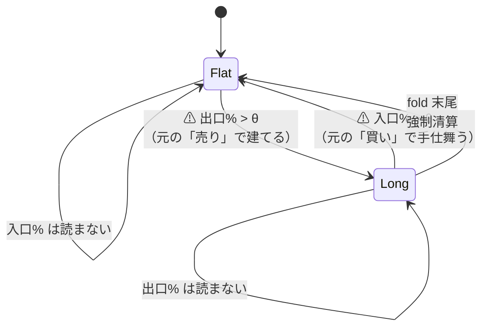
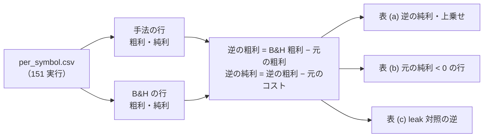
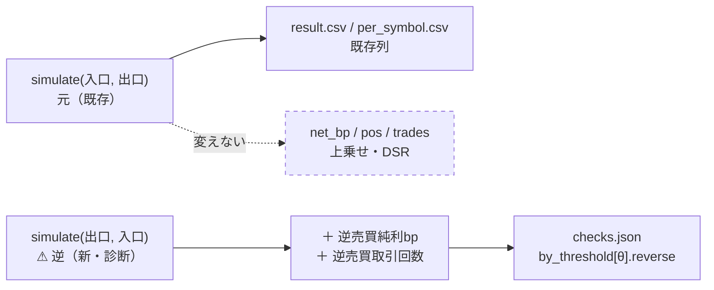

# 逆の売買（買いの合図で手仕舞い・売りの合図で建てる）の数値を確認する

作成: 2026-09-17 ／ 状態: プラン（未着手）
対象: `experiments/feature-discovery/`（`ail/validation/simulate.py`・`cli/run.py`・`ail/validation/checks.py`・`tests/`）、`docs/specs/experiments/feature-discovery/`
派生元: TODO「疑問に思ったことを登録し解決していく」の子タスク「売りの時に買い、買いの時に売りという逆の売買したときの数値を確認する」。⚠ **2026-09-17 に利用者の指示で独立タスク「逆の売買の数値を確認し、通常と逆の 2 つの損益から評価軸を作れるか検討する」になった**（評価軸の問いは §1-5）
関連: [rules.md 13-4](../specs/experiments/feature-discovery/rules.md)（0/1 の状態機械・買い専用）／ [13-5](../specs/experiments/feature-discovery/rules.md)（B&H 基準線）／ [13-7](../specs/experiments/feature-discovery/rules.md)（対 B&H 上乗せ）／ [14-3](../specs/experiments/feature-discovery/rules.md)（診断列は採否に使わない）／ [14-6・15-6](../specs/experiments/feature-discovery/rules.md)（同じ保有日率の乱択ゲート）／ [16-1](../specs/experiments/feature-discovery/rules.md)（入口% と出口%）／ 姉妹プラン [holding-days-distribution.md](holding-days-distribution.md)

## 1. 目的・背景

### 1-1. 疑問

手法の合図を**逆に読んだら**どうなるか。「買い」で手仕舞い、「売り」で建てる。
素朴には「手法が B&H に負けているなら、逆にすれば勝つのではないか」という問いである。

### 1-2. 「逆」の定義 — この枠では 1 つに決まる

シミュレータは **0 か 1 の状態機械・買い専用**（13-4）で、入力は入口% と出口% の 2 本（16-1。1 本しか無い手法は 出口% = 100 − 入口%）。
この枠で「逆の売買」を書けるのは **入口% と出口% を入れ替える**ことだけである。

> この図の主張: 逆売買は、状態機械のコードを変えず **2 本の入力を入れ替えるだけ**で表せる。

| 候補 | この枠で書けるか | 扱い |
| --- | :-: | --- |
| **入替え**（入口% ↔ 出口%） | ✅ `simulate(exit, y, θ, cost, exit_pct=buy)` の 1 呼び出し | **本プランの対象** |
| 確率の鏡（買い% ≤ 100 − θ で建てる） | ✅ 1 出力の契約では入替えと**同じもの**（出口% = 100 − 入口% なので） | 入替えに含まれる |
| 空売り（ポジション −1） | ❌ 13-4 規約 2・16-1 規約 5 が禁じる。状態を 3 つにするのは**検証方式の変更**で、橋渡し対（13-8）と壁の引き直しが要る | ⚠ **回さない。** 算術で見積もるだけ（§2-5） |

### 1-3. ⚠ 先に分かっていること — 逆売買は元の売買の補集合である

θ ≥ 50 では入口と出口の条件が同じ日に立たない（13-3 規約 2）ので、元の状態機械と入替えた状態機械は、
**どちらかが最初に建てた日から先、常に反対の状態にある**（元が Long なら逆は Flat、元が Flat なら逆は Long）。
元が「入口% > θ」で建てる日は逆が「入口% > θ」で手仕舞う日であり、元が「出口% > θ」で手仕舞う日は逆が建てる日だから、⚠ **売買する日も同じ**。

> この図の主張: 逆のポジション系列は **1 − 元のポジション**。違うのは最初の合図が出るまでの区間と fold 末尾の強制清算だけ。

したがって銘柄 × fold ごとに、⚠ **算術だけで**次が成り立つ（最初の合図までの区間を無視した近似。ずれの大きさは Phase 3 で実測する）:

| 量 | 恒等式 | 意味 |
| --- | --- | --- |
| 逆の粗利 | **B&H の粗利 − 元の粗利** | 2 つ合わせて毎日持つ ＝ B&H |
| 逆のコスト | **元のコスト ± 2.5bp**（最初の建てと強制清算の帰属が違うだけ） | 売買日が同じなので、⚠ **コストは 2 回払う** |
| 逆の純利 | B&H 粗利 − 元の粗利 − 元のコスト | |
| **逆の対 B&H 上乗せ** | **− 元の純利 − 2 × 元のコスト ＋ 5bp** | ⚠ **元の上乗せの鏡ではない。** 元の**純利そのもの**の符号を反転し、コストを 2 重に引く |
| 元と逆の上乗せの和 | − B&H 粗利 − 2 × 元のコスト ＋ 10bp | ⚠ **ドリフトの分だけ必ず負**（2 本の補集合を足しても B&H 1 本にしかならないのに、比べる相手は B&H 2 本） |

⚠ **答えの形はここでほぼ決まる**: B&H が正のドリフトを持つ表（2018 表 4.59bp/日 ／ 1995 表 3.49bp/日【実測。rules.md 13 章の表】）では、
⚠ **元の純利が負でない限り、逆売買が B&H を超えることはない。** 元が B&H に負けている（上乗せ < 0）だけでは足りない。

1 実行で手計算した例【実測 2026-09-17。`per_symbol.csv` から §1-3 の恒等式で算出。`2026-09-16T15-21-36_trade_ownseq_mp_a`・F5-3 行列プロファイル・銘柄 × fold の平均】:

| θ | 元の純利 bp | B&H 純利 bp | 元の上乗せ | 保有日率 | **逆の純利 bp（算術）** | **逆の上乗せ** |
| ---: | ---: | ---: | ---: | ---: | ---: | ---: |
| 50 | 1,375.7 | 1,652.8 | −277.1 | 0.70 | 108.9 | −1,543.9 |
| 55 | 1,168.1 | 1,652.8 | −484.7 | 0.60 | 473.2 | −1,179.6 |
| 60 | 694.6 | 1,652.8 | −958.2 | 0.30 | 957.7 | −695.1 |

⚠ **元が B&H に負けているのに、逆はもっと負ける。** 逆が拾えるのは元が休んだ日のドリフトだけで、元が「良い日を選んでいた」分（θ=50 で保有日率 0.70 × B&H 粗利 ≈ 1,160 に対し元の粗利 1,462 ＝ ＋302）は、逆では同じ大きさの**マイナス**になる。

### 1-4. だから何を「確認」するのか

| 問い | 答え方 |
| --- | --- |
| 逆売買の数値はいくらか | **Phase 1**: 既存 151 実行の `per_symbol.csv` から算術で出す（再実行なし） |
| 恒等式はどれだけ正確か（最初の合図まで・強制清算・2 出力の契約で同日に両方立つ場合） | **Phase 2**: シミュレータの単体テストで補集合を縛る ＋ 診断列を 1 つ足す |
| 実際に回すと算術と一致するか・leak 対照で逆が跳ね下がるか | **Phase 3**: 代表 1 構成（＋ leak）を回し、答えを文書にする |
| 逆売買を手法として採れるか | ⚠ **答えない。** §1-3 の恒等式が「元の純利が負のときだけ」と言っており、それは結果を見てから向きを選ぶ後知恵である（下の §2-4） |

### 1-5. 利用者の問い（2026-09-17）— 通常と逆の 2 つの損益から新しい評価軸を作れないか

⚠ **結論: 逆の値は元の値から恒等式で決まるので、2 つを組み合わせても情報は増えない。増えるのは「見え方」だけ。** 見え方として意味が残るのは、ドリフトとコストが相殺される形に限られる。1 実行（§1-3 と同じ `trade_ownseq_mp_a`・F5-3）で候補を数字にした【実測 2026-09-17。銘柄 × fold の平均。保有日率 0 か 1 の行は除く】:

| 候補の軸 | 恒等式で書くと | 消えるもの | θ=50 の値 | 判定 |
| --- | --- | --- | ---: | --- |
| 和（元 ＋ 逆の純利） | B&H 粗利 − 2 × コスト | 腕（手法の情報が消える） | — | ❌ 意味が無い |
| 差（元 − 逆の純利） | 2 × 元の粗利 − B&H 粗利 ＝ (2h − 1) × B&H 粗利 ＋ 2 × S | コスト | ＋1,561bp（うち保有率の項 0.64 × G が大半） | ⚠ 露出の項が混ざる |
| 比（元 ÷ 逆の純利） | — | — | 中央値 −0.20・ばらつき 34.9 | ❌ 分母が 0 や負を跨ぐ |
| 保有日の平均リターン − 見送り日の平均リターン | S ÷ (h(1−h)N) | ドリフト・コスト | −18.7bp/日（見送り日平均 24.0 vs 保有日 5.4） | ⚠ h → 1 で見送り日が数日しか無く、分母が潰れて暴れる |
| **S ＝ 元の粗利 − 保有日率 × B&H 粗利**（露出を揃えた選日の上乗せ） | 逆の同じ量は **−S** | ドリフト・コスト | ＋32.3bp（fold 別 −572 / ＋460 / ＋120 / ＋73 / ＋236） | ✅ 安定。⚠ 14-6 (b) の乱択ゲートの**期待値そのもの**（乱択ゲートの実測 −79.2 は 1 回の乱数の引きを含む） |

h = 保有日率、N = 検証日数、G = B&H 粗利、S = 選日の上乗せ。

- ⚠ **逆売買が軸に足すものは「符号が反転して同じ大きさになる」ことだけ**で、これは配線の検査（leak 対照と同じ役目）であって評価ではない
- 作るなら **S を fold ごとに出して符号を並べる**軸である。乱択ゲート（`random_gate`）と同じ位置づけで、⚠ **乱数を使わず厳密に出せる**のが利点。Phase 2 の `checks.json` に `selection_edge` として **`random_gate` の隣に置く**（§2-3 の 3 に含める）
- ⚠ **採否には使わない**（14-3）。13-7 の物差し（対 B&H 上乗せ）は「露出を減らして逃したドリフト」も手法の責任として数えるが、S はそれを免除する。⚠ **S が正で上乗せが負の手法**（この例の θ=50 がそれ）を「腕はある」と読むのは自由だが、**採る理由にはならない**（買って持つほうが儲かっている）
- ⚠ **軸を増やすほど「良く見える軸で語る」誘惑が増える**（11 章 規約 2）。役目（診断）を結果を見る前にここで固定する

## 2. 対応方針

### 2-1. 3 段で答える

| 段 | 何をする | 再実行 | 得られるもの |
| :-: | --- | :-: | --- |
| **Phase 1** | 既存 151 実行（うち leak 72）【実測 2026-09-17。`per_symbol.csv` を持つ実行の数】の `per_symbol.csv` から、§1-3 の恒等式で **逆売買の純利・上乗せ**を手法 × θ × fold ごとに出す（読むだけ） | 不要 | 全手法の逆売買の数値（算術）。元の純利が負で逆が B&H を超える行が**あるか無いか** |
| **Phase 2** | `simulate()` を入替えで呼んで補集合になることを**テストで縛り**、`result.csv` / `checks.json` に **逆売買の診断列**を足す | ⚠ **数字は変えない**（列を足すだけ） | 以後の実行で逆売買の数値が自動で残る。恒等式からのずれ（最初の合図までの日数）が数字で残る |
| **Phase 3** | 代表 1 構成（＋ leak 対照）を回し直し、算術（Phase 1）と実測（Phase 2 の列）を突き合わせて答えを文書にする | 代表 1 構成だけ | 答え。⚠ 同じ鍵の再実行なので台帳の行は増えない |

### 2-2. Phase 1 — 既存記録からの算術（読むだけ）

集計は scratchpad で回し、⚠ **結果の表だけを文書に残す**（姉妹プランの Phase 1 と同じ扱い。実験の正本にしない）。

| 列 | 定義 | 注意 |
| --- | --- | --- |
| 元のコスト | 粗利 − 純利（銘柄 × fold） | `cost_bp_total` は per_symbol に無い。定義上一致する |
| 逆の粗利 | B&H 行（`基準 常に上（ドリフト）`・同じ θ・fold・銘柄）の粗利 − 元の粗利 | ⚠ B&H 行の粗利は θ に依らず同じ |
| 逆の純利 | 逆の粗利 − 元のコスト | ⚠ 最初の建て・強制清算の ±2.5bp は無視（Phase 3 で実測） |
| 逆の上乗せ | 逆の純利 − B&H 行の純利 | 13-7 と同じ物差し |
| ポートフォリオ | 銘柄を等加重平均して fold ごとに 1 本（13-7） | (B) 銘柄別で飛ばした銘柄は元と同じ集合に揃える |

出す表は 3 つ: (a) 手法 × θ ごとの **逆の純利・上乗せ・fold の符号**、(b) **元の純利が負**の行（逆が B&H を超えうる唯一の場合）の一覧と、そこで逆の上乗せが実際に正になったか、(c) leak 対照の逆（⚠ **大きく負になるはず**。leak の元が跳ね上がる分だけ逆は跳ね下がる ＝ 配線の検査になる。13-10 と同じ向き）。

> この図の主張: Phase 1 は `per_symbol.csv` の中で B&H 行と手法の行を引くだけで、実験コードには触らない。

### 2-3. Phase 2 — 補集合をテストで縛り、診断列を足す

⚠ **rules.md 14-4「名前を変えないなら既定の計算を 1 ビットも変えない」に従う。** `simulate()` 本体は触らない（入替えは呼び出し側の引数の順だけ）。

| # | 変更 | 場所 | 中身 |
| ---: | --- | --- | --- |
| 1 | 補集合のテスト | `tests/test_trading.py` | 合成した入口% 系列で θ ∈ {50, 55, 60} を回し、`simulate(100−b, y, θ, c, exit_pct=b)` の `pos` が **最初の合図の日以降で `1 − pos_元`** に一致・売買日が一致・`trades` の差が ±1 以内。2 出力の契約（`exit_pct` あり）で**同じ日に両方が θ を超える**系列も入れ、遅れて補集合に落ち着くことを確かめる |
| 2 | `evaluate_trading()` に **逆売買の診断列**を足す | `cli/run.py` | 銘柄ループの中で `sim.simulate(ex if ex is not None else 100 − bp, y, th, cost_bp, exit_pct=bp)` を 1 回呼び、`result.csv` に **`逆売買純利bp`・`逆売買取引回数`**、`per_symbol.csv` に **`逆売買純利bp`** を足す。⚠ **乱択ゲート列（14-6 b）と同じ位置づけ**: 既存列の後ろに追加し、既存の値は 1 つも変えない |
| 3 | `checks.json` の `by_threshold[θ]` に **`reverse`** を足す | `ail/validation/checks.py` `compute_trading` | 最良手法の逆売買の純利・対 B&H 上乗せ・fold の符号・**恒等式からのずれ**（算術の逆純利 − 実測の逆純利）。 あわせて **`selection_edge`**（§1-5 の S ＝ 粗利 − 保有日率 × B&H 粗利。fold ごとの値と符号。逆売買では −S になることを併記）を `random_gate` の隣に置く。`random_gate` / `episodes` と同じく **「⚠ 診断。採否には使わない」の注記付き** |
| 4 | 規約に 1 行足す | `rules.md` 14-3（診断列） | 「逆売買（入口% ↔ 出口%）の純利は診断列。⚠ **採否に使わない・試行に数えない。** 逆を手法として採るなら向きを**事前に**書いて新しい試行として数える」 |

> この図の主張: 追加は「状態機械の呼び出し 1 回 → 記録 → 検査」に **列を 1 つ足すだけ**で、既存の矢印は変えない。

### 2-4. ⚠ 逆売買は試行に数えるか — 数えない。ただし採らない

| 立場 | 理由 |
| --- | --- |
| **診断列（採否に使わない・n_trials に数えない）** | 逆売買の数値は §1-3 の恒等式で元の数値から**一意に決まる**。新しい fit も新しい自由度も無い（乱択ゲート・エピソード表と同じ側） |
| ⚠ **だから逆を採ってもいけない** | 「元が負けたから逆を採る」は結果を見て向きを選ぶ後知恵で、13-3 規約 4（結果を見て動かさない）と同じ向きの誤り。⚠ **採るなら、その手法の向きを結果を見る前に書き、別の試行として台帳に載せる**（16 章の出口% と同じ手順） |

### 2-5. ⚠ 空売り版は算術だけ（回さない）

ポジション −1 を許す枠は無い（13-4 規約 2・16-1 規約 5）。それでも問いには算術で答えられる:
空売り版の粗利 = − 元の粗利、コストは元と同じ ＋ 貸株料。つまり **空売り版の純利 = − 元の純利 − 2 × 元のコスト − 貸株料**。
対 B&H の上乗せは、入替え版（§1-3）からさらに **B&H の粗利ぶん**下がる（ドリフトに逆行するため）。
貸株料は【公表値】を取れる場合だけ取得日付きで書く（tastytrade の short stock の料率。取れなければ【推測】のまま）。⚠ **費用の【実測】は取りにいかない**（CLAUDE.md の方針）。

### 2-6. Phase 3 — 代表構成の回し直しと答え

- **どれを回すか**: 台帳の閾値売買で上位にある 1 構成（姉妹プラン holding-days の Phase 3 と**同じ構成を選び、回し直しを 1 回で兼ねる**）と、その leak 対照。⚠ **回すと決めるのは結果を見る前**（14-10）
- **同じ鍵の再実行**なので台帳の行は増えず、既存列が旧実行と**一致する**ことが「1 ビットも変えていない」検算になる
- **答えとして書くもの**（`docs/specs/experiments/feature-discovery/reverse-trading.md`。[dsr.md](../specs/experiments/feature-discovery/dsr.md) と同じ「解説であって規約ではない」形）
  1. §1-3 の恒等式と、その導出（θ ≥ 50 で補集合になる理由）
  2. Phase 1 の表 (a)(b)(c) — 全手法の逆売買の数値と、元の純利が負の行で逆が B&H を超えた例が**あったか無かったか**
  3. Phase 3 の実測と算術の差（最初の合図までの日数・強制清算の帰属）— 算術がどれだけ使えるか
  4. ⚠ **結論の形**（先に書く仮説。⚠ 結果で書き換えるなら理由を残す）: 「正のドリフトの表では、逆売買は元が休んだ日のドリフトしか拾えず、元の**日の選び方**の良し悪しは符号を変えて同じ大きさで現れる。コストは 2 重。よって元が B&H に負けた理由が『休んだ日のドリフトを逃した』ことにある限り、逆にしても勝てない」
  5. ⚠ **答えない**こと: 逆売買を手法として採ること（§2-4）／ 空売り版を回すこと（§2-5）
- TODO の子タスクには答えの要点をメモで残して `DONE.md` へ移す（親の「疑問」タスクは残す）

## 3. 影響範囲

| 場所 | 変更 | 既存の数字への影響 |
| --- | --- | :-: |
| `ail/validation/simulate.py` | ⚠ **触らない**（入替えは引数の順だけ） | なし |
| `cli/run.py` | 銘柄ループで `simulate` を 1 回追加、`result.csv` に 2 列・`per_symbol.csv` に 1 列（末尾） | なし（既存列は同じ値）。⚠ 計算時間は状態機械 1 本ぶん増える（数秒） |
| `ail/validation/checks.py` | `by_threshold[θ].reverse` と最上位への写し | なし（`best` / `edge_vs_bh` / `dsr` は同じ） |
| `rules.md` 14-3 | 診断列に 1 行追記 | — |
| 台帳（`ail/catalog.py`） | ⚠ **触らない**（逆売買は鍵にも判定にも入れない） | なし |
| `dashboard/vibetab.py`・`dashboard/` | ⚠ **今回は列を足さない**（疑問への答えは文書で足りる。足すなら姉妹プランの列と一緒に） | なし |

## 4. テスト方針

| 対象 | テスト | 場所 |
| --- | --- | --- |
| 補集合 | §2-3 の 1（1 出力・2 出力、θ 3 水準、最初の合図の前は両方 0、末尾の強制清算は Long の側だけ） | `tests/test_trading.py` |
| 恒等式 | 合成系列で `逆の粗利 == B&H 粗利 − 元の粗利`（最初の合図以降に限れば厳密に等しい）、`逆のコスト − 元のコスト ∈ {−2.5, 0, +2.5}` | 〃 |
| 既定経路の不変 | 小さな固定パネルで実行前後の `result.csv` / `per_symbol.csv` の既存列・`summary.csv`・`checks.json` の `best` / `edge_vs_bh` / `dsr` が **1 ビットも変わらない**（14-4 の 2 と同じ指紋の照合） | `tests/test_trading_run.py` |
| `checks.json` | `reverse` の値が `per_symbol.csv` の逆売買列から手計算した値と一致。取引 0 回の手法では鍵を省く | `tests/test_checks.py` |
| 台帳 | `n_trials` と判定列が Phase 2 の前後で変わらない | `tests/test_catalog.py` |

## 5. 計算時間【推測】

| 段 | 見込み | 根拠 |
| :-: | --- | --- |
| Phase 1 | 数秒〜1 分 | 151 実行の `per_symbol.csv` を読んで結合するだけ（姉妹プランの Phase 1 と同じ規模） |
| Phase 2 | テストと配線で 1 時間程度 | 状態機械の呼び出し 1 回と列の追加 |
| Phase 3 | 代表構成しだいで 1〜2 分（`trade_own_*` 系）〜2 時間（`ownseq_tsf` 系） | [holding-days-distribution.md §5](holding-days-distribution.md) の実測 |
