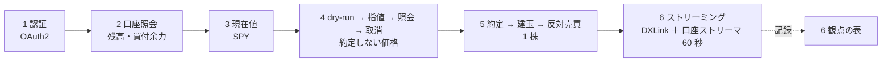
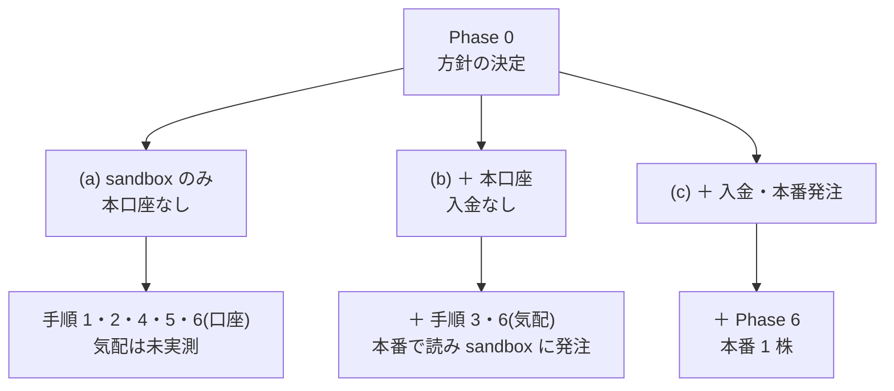
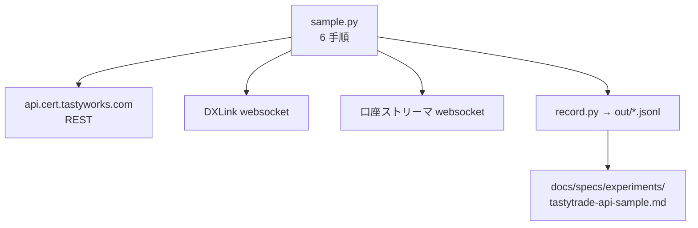
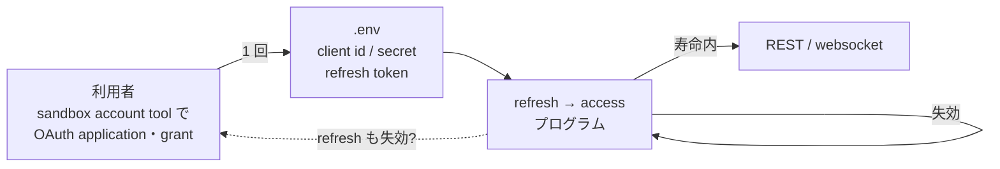
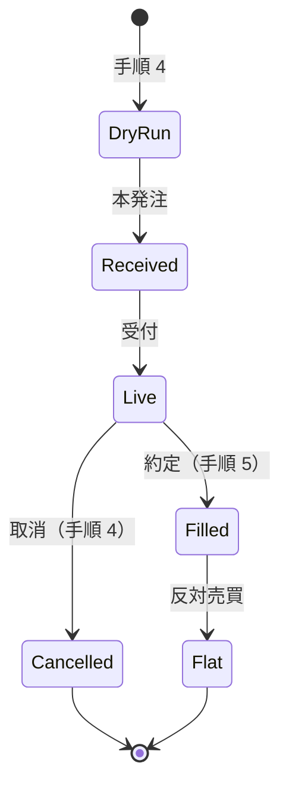
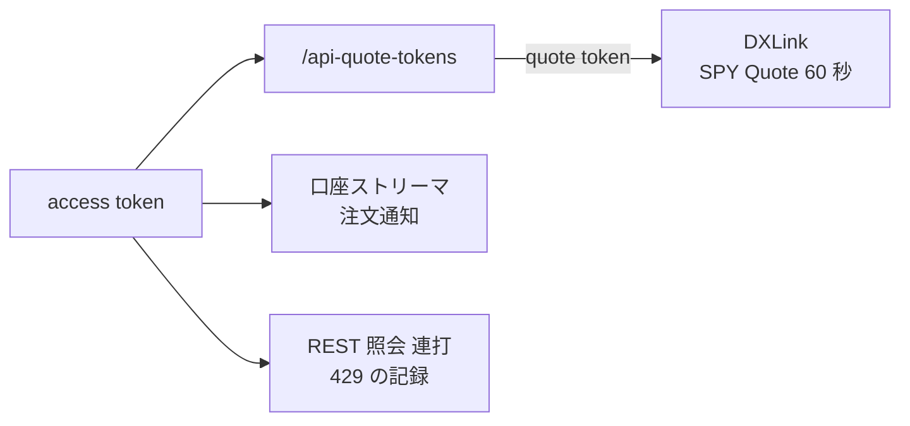
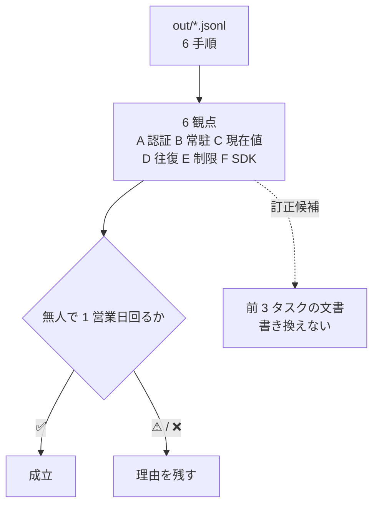

# tastytrade で API 取引のサンプルプログラムを動かす

作成日: 2026-09-04（同日に 3 社 → tastytrade 1 社へ絞った）。
対象: tastytrade（[service-trust-assessment.md](../specs/service-trust-assessment.md) で判定「高」、[trading-fee-comparison.md](../specs/trading-fee-comparison.md) §4 で株 $0・API プレミアム $0、[trading-api-availability.md](../specs/trading-api-availability.md) §6-2 で 51 件中 44 件が通る）。

## 0. 決定と進捗（2026-09-05 追記）

**方針は選択肢 (c)（sandbox ＋ 本口座 ＋ 入金 ＋ 本番で 1 株）を利用者が選択した。**
CLAUDE.md にこの 1 手法だけの例外として追記済み。⚠ 口座開設・入金・本番発注を実行するのは利用者で、
Claude は手順とコードを示すところまで（Phase 6 の発注は Claude が実行しない）。

| Phase | 状態 |
| --- | --- |
| 0 方針の決定と入口の確認 | ✅ 完了。§0-1 に確認結果 |
| 1 環境と記録形式 | ✅ 完了。`experiments/tastytrade-api-sample/`。モックに対して 6 手順が通ることを `selftest.sh` で確認 |
| 2〜4 認証・REST・ストリーミング | ⏸ **利用者の資格情報待ち**（sandbox ユーザーと OAuth application。手順は experiments の README §1） |
| 5 記録と判定 | ⏸ |
| 6 本番で 1 株 | ⏸ 利用者が入金と発注を行う |

記録先: [docs/specs/experiments/tastytrade-api-sample.md](../specs/experiments/tastytrade-api-sample.md)

### 0-1. Phase 0 の残りの確認結果（2026-09-05）

| 残っていた問い | 結果 |
| --- | --- |
| sandbox account tool の OAuth application・grant パネルは動くか（未確定 #4） | ✅ **解消**。「coming next」の記述は古く、ページの JS は `POST /users` → `/sessions` → `/sandbox/customers` → `/sandbox/customers/me/accounts` → `/users/me/oauth/clients` → `/users/me/oauth/grants` を `api.cert.tastyworks.com` に投げている。⚠ これらは公式リファレンス（98 operations）に無い経路 |
| 入金なしの本口座で `api-quote-tokens` が取れるか（未確定 #3） | ✅ **2026-09-05 に実測で解決。取れる。** 残高 0・`pending-cash` 1000 のみの口座で REST の気配・`api-quote-tokens`（level `api`）・DXLink の AUTHORIZED と受信まで通った。要るのは入金ではなく口座の承認。記録は specs 側 §0 |
| 本口座の米国内承認日数の公式値 | ⚠ 公式値は未取得（help center が JS 描画）。ただし**実例として申込から約 1 時間で承認された**（2026-09-05、n=1） |
| Step 0-2 SDK の一次情報（観点 F） | ✅ 公式 **OpenAPI 3.1 を 17 本配布**（`/openapi/*.json`）、AsyncAPI 2.6・Postman collection もある。⚠ 公式 Python SDK `tastytrade-sdk` は **リポジトリが archived**（最終 push 2026-03-13、PyPI 1.2.0 は 2025-05-20）。現役は非公式 `tastytrade`（tastyware、13.2.3 / 2026-08-07、MIT）。**結論: SDK は使わず OpenAPI どおりに直接叩く** |

## 1. 目的と背景

### 1-1. 何を知りたいか

前 3 タスクで「経路があるか」「いくらかかるか」「預けて大丈夫か」は文書で決まった。残っているのは、**その経路が実際にプログラムから動くか**である。前々タスクは「1 社で片付く」と「無人で回る」がずれることを見つけた（§6-2）。tastytrade は OAuth2 で、常駐プロセスは要らないが、認証の更新に人手が要るかは文書では分からない。

この作業は、tastytrade の **cert（sandbox）環境で 6 手順「認証 → 口座照会 → 現在値 → 指値・取消 → 約定・反対売買 → ストリーミング」を動かし**、無人運転の設計に効く 6 観点（§2-2）で記録する。

| 問い | 中身 | どこで分かるか |
| --- | --- | --- |
| **認証は何時間もつか** | access token・refresh token の寿命、更新に人手（ブラウザ）が要るか | 認証を 2 回実行し、失効までの時間を記録 |
| **常駐プロセスが要るか** | REST と websocket だけで完結するか | 環境構築の手順そのもの |
| **現在値はどこから取るか** | ⚠ sandbox は相場データを配信しない（`/market-data` は全経路 502。2026-09-04 確認）。気配は本番口座の quote token でしか取れない | 本番口座があれば本番の DXLink で時刻と遅延を記録。無ければ「未実測」 |
| **発注の往復が通るか** | dry-run → 指値 → 照会 → 取消、約定 → 建玉 → 反対売買 | 発注手順の実行 |
| **レート制限はどこか** | 文書では非公開（429 のみ）。実際にどこで返るか | 照会を連打して 429 の出方を見る |
| **SDK は保守されているか** | 公式 SDK か OpenAPI 仕様があるか、最終リリース日 | パッケージの一次情報 |

> この図の主張: 6 手順を同じ順で通し、観点はその横に記録として出る。手順 4・5 は cert 環境でのみ行う。

### 1-2. なぜ tastytrade 1 社か

候補は判定「高」の tastytrade・moomoo と、経路が最広の IBKR の 3 社だった。1 社に絞るにあたり、次の理由で tastytrade を選んだ。

| 観点 | tastytrade | moomoo（外した） | IBKR（外した） |
| --- | --- | --- | --- |
| 信用判定 | 高 | 高（関連会社に処分提案が係属） | 中（処分歴で降格） |
| 株 40 往復/月 ＋ API プレミアム【推測】 | $0 | $0（プロモ中） | $84.50 ＋ 残高 $500 |
| 動かすのに要るもの | クラウド REST ＋ websocket のみ | OpenD 常駐、SMS ＋ デバイスロック | Gateway の GUI ログイン |
| WSL2 での不確実さ | ほぼ無い | OpenD が Linux ヘッドレスで動くか未確認 | GUI が動くか未確認 |
| sandbox | cert 環境が公式に用意されている | 模擬取引（OpenD 経由） | paper 口座（本口座から作る） |
| 規約 | API Terms が「algorithmic trading systems」を明示的に許容（R3） | Web 規約が robot 禁止（R1） | robot 語なし |

**再開の条件**: 債券・外国株・FX まで同じ口座で試したくなったら IBKR を、PFOF なしの執行を試したくなったら moomoo を、本プランの 6 手順と記録形式のまま足す。記録形式（§2-1）は 2 社を後から足せる形にしておく。

### 1-3. 既に分かっていること（前 3 タスクから引く）

| 項目 | 既知の材料 | 出典 |
| --- | --- | --- |
| 発注 API | A0。REST `api.tastyworks.com`（本番）。株・ETF・オプション（≤4 legs）・先物（CME）。OTC・外国上場は不可。P4 債券は order enum にあるが未確認 | availability 付録 A-1 B4 |
| 現在値 | RT1。DXLink（websocket）が funded account で無償。「No subscriptions.」 | availability A-1、fee 付録 A-1 |
| 認証 | `/sessions` は 2026-02-11 廃止、OAuth2 へ。版廃止は 6 か月猶予。OAuth クライアントは口座内で自己登録【推測。手順ページは JS で未読】。失敗ログインで IP ブロック約 8 時間 | trust 表 4-1B C2、availability A-1 |
| レート制限 | 非公開（429 のみ） | availability A-1 |
| 規約 | API Terms（2023-05-17）"Permitted Purpose … algorithmic trading systems"。第三者が顧客の資格情報を保存することは禁止。Customer Agreement §26 が Open API への第三者接続を明記 | availability 付録 B-1 |
| 手数料 | 株 $0、株式オプション open $1/契約（close $0）、先物 $1 ＋ 清算 $0.30。API・データとも $0 | fee 付録 A-1 |
| 障害・変更 | status critical 2 件（2026-07-14 暗号資産停止、06-05 気配遅延）。2026-06-29 に API 経由の暗号資産取引を停止 | trust 表 4-1B C1 |
| 信用 | 高。FINRA $850K（2026-07-21、最良執行）が閾値の近く。清算は Apex（導入ブローカー）。親 IG Group が strategic review 中（2026-03-19〜） | trust 表 4-1A/B |
| **sandbox の仕様（本プランで確認）** | REST `api.cert.tastyworks.com`・口座ストリーマ `wss://streamer.cert.tastyworks.com`。**sandbox ユーザーは tastytrade の口座とは別**で、ブラウザの sandbox account tool にメール・ユーザー名・12 文字以上のパスワードを入れて作る。同じツールが customer record・入金済み口座・OAuth application・grant を作る（⚠ ページ末尾に「Account creation, funding and OAuth application management are coming next」の記述が残り、パネルの実装状況は着手時に確認）。**相場データは配信されない**（`/market-data`・`/market-metrics` が 502）。約定は疑似で「成行は常に $1 で約定、$3 未満の指値は即約定、$3 以上の指値は Live のまま約定しない」。**環境は 24 時間ごとにリセット**（ユーザー・口座は残る）。OAuth は本番と別で相互に使えない | developer.tastytrade.com/docs/sandbox、/docs/sandbox/tools（取得日 2026-09-04）【公表値】 |
| OAuth の手順（本プランで確認） | 本番は my.tastytrade.com → Manage → My Profile → API → OAuth Applications → New OAuth client → Manage → Create Grant で refresh token を得る。**access token は 15 分、refresh token は無期限**（"Refresh tokens are long-lived and do not expire"） | developer.tastytrade.com/docs/authentication/oauth2（取得日 2026-09-04）【公表値】 |
| 本口座の開設 | オンライン申込（open.tastytrade.com/signup）。国際口座は「3-5 business days」【公表値。support.tastytrade.com 43000473089 の検索抜粋。ページ本体は JS 描画で未読】。米国内は 1〜3 営業日【二次。brokerchooser 等】 | 取得日 2026-09-04 |

### 1-4. 何が新しいか — 【実測】が 1 年ぶりに増える

`docs/specs/overview.md` §7 は「今後【実測】は増えない」と書いている。この作業は **API の挙動（認証の寿命・遅延・レート制限・往復の所要時間）を【実測】として記録する**。金銭の【実測】（収入・費用）は引き続き取らない。§3 で方針との関係を整理し、Phase 0 で利用者が決める。

## 2. 定義

### 2-1. 6 手順と記録形式

| # | 手順 | 入力 | 記録するもの |
| --- | --- | --- | --- |
| 1 | 認証 | client id / secret、refresh token（`.env`） | access token の寿命、refresh の人手の要否、所要時間 |
| 2 | 口座照会 | 口座番号 | 残高・買付余力の取れ方、cert の初期資金 |
| 3 | 現在値 | **SPY** 1 銘柄 | ⚠ sandbox では 502 になる（記録として残す）。本番口座があれば本番の REST で取り、取得時刻と気配の時刻の差（遅延）を記録 |
| 4 | dry-run → 指値 → 照会 → 取消 | 買い 1 株、指値 **$10**（sandbox は $3 以上の指値が Live のまま約定しない） | 注文 ID、状態遷移、取消までの往復時間、dry-run の応答（手数料・買付余力の計算） |
| 5 | 約定 → 建玉 → 反対売買 | 買い 1 株 成行（sandbox は常に $1 で約定）→ 売り 1 株 成行 | 約定の反映時刻、建玉の反映、24 時間リセットの挙動 |
| 6 | ストリーミング | 口座ストリーマの注文通知を 60 秒（sandbox）＋ SPY の Quote を 60 秒（本番の quote token があるときだけ） | 接続方式、メッセージ数、切断・再接続の挙動 |

記録は **JSON Lines** で 1 手順 1 行: 手順番号・環境（cert / prod）・開始時刻・終了時刻・所要 ms・結果・生レスポンスの抜粋（口座番号・トークンはマスク）・SDK の版。会場名の列を持たせ、後で他社を足せるようにする。

⚠ 手順 4・5 は **cert 環境でのみ**行う。本番口座での発注は Phase 6（任意）で、利用者の明示的な指示があるときだけ行う。⚠ 手順 3 と手順 6 の気配は sandbox では取れないので、公式文書が勧める「**本番で読み、sandbox に発注する**」形（資格情報 2 組）を採る。本番の資格情報が無ければ両方とも「未実測」にする。

### 2-2. 判定の観点と成立条件

点数は付けない。次の 6 観点を「✅ / ⚠ / ❌」で記録し、**「無人で 1 営業日回る」を成立条件**とする。

| 観点 | ✅ | ⚠ | ❌ |
| --- | --- | --- | --- |
| A 認証の寿命 | refresh が無人で 1 営業日以上続く | 1 日 1 回の人手（ブラウザ） | 数時間ごとに人手 |
| B 常駐 | 不要（REST ＋ websocket で完結） | 補助プロセスが要る | GUI 必須 |
| C 現在値 | 本番の REST / DXLink で実時間（遅延 < 1 秒） | 遅延あり | 取れない、または本番の資格情報が無く未実測 |
| D 発注の往復 | 4・5 とも通る（sandbox の疑似約定で状態遷移を確認） | 4 のみ通る | 通らない |
| E レート制限 | 1 分に 60 回の照会が通る | 429 が出るが回避できる | 発注が詰まる |
| F SDK | 公式 SDK か OpenAPI 仕様がある | 非公式 SDK のみ、1 年以内に更新 | 保守されていない |

## 3. 方針との関係 — Phase 0 で利用者が決める

CLAUDE.md の 2026-08-27 方針は「**購入・口座開設・出品・登録・リリース**は行わない」。公式文書（2026-09-04 取得）で、**sandbox ユーザーは tastytrade の口座とは別で、本口座なしにブラウザで作れる**ことが確認できた（§1-3）。本口座が要るのは、**相場データ（本番の quote token・DXLink）と本番発注だけ**である。

| 必要な行為 | 方針との関係 | 確認状況 |
| --- | --- | --- |
| sandbox ユーザーの作成（メール・ユーザー名・パスワードをブラウザで入力） | 「登録」に近いが、契約・入金・本人確認を伴わない検証用ユーザー | ✅ 確認済み（本口座不要） |
| sandbox 内での customer record・入金済み口座・OAuth application・grant の作成 | 同上（すべて sandbox 内で完結） | ⚠ ツールのパネルはあるが「coming next」の記述も残る。着手時に確認 |
| tastytrade 本口座の開設（オンライン申込、入金なし） | **口座開設に当たる**。相場データを取るためだけに要る | 承認は米国内 1〜3 営業日【二次】。入金なしで quote token が取れるかは未確認（fee 文書は「DXLink は funded account」） |
| 本口座への入金と本番発注 | 購入に当たる。Phase 6 のみ | — |

選択肢は 3 つ。**推奨は (a)** で、Phase 1 以降は (a) を前提に書く。

| 選択肢 | 内容 | 帰結 |
| --- | --- | --- |
| **(a) sandbox のみ**（推奨） | CLAUDE.md に「検証目的の sandbox ユーザー作成と sandbox の利用は可。**本口座の開設・入金・本番発注は不可**」を追記する | 手順 1・2・4・5 と手順 6 の口座ストリーマを実行できる。**手順 3 と気配の streaming は「未実測」**（観点 C は ❌ 未実測）。費用 0 円、承認待ちなし |
| (b) sandbox ＋ 本口座（入金なし） | (a) に加えて本口座を開設し、本番の資格情報で相場データだけ読む（発注はしない） | 手順 3・6 も実測できる（⚠ 入金なしで quote token が取れる場合）。承認待ち 1〜3 営業日【二次】 |
| (c) 本番発注まで許す | (b) に加え、入金と 1 株の本番発注を許す | 約定品質を【実測】できる。Phase 6 として任意に置く |

方針を変えない場合は、sandbox ユーザーの作成も「登録」と読んで行わず、公開仕様からサンプルを書いてモックに対して動かす。観点 A・C・D・E は未実測のまま。

> この図の主張: sandbox だけで発注の往復まで動き、本口座は相場データのためだけに要る。方針の決定は「どこまで実測するか」を決める。

## 4. 成果物

| 項目 | 内容 |
| --- | --- |
| コード | `experiments/tastytrade-api-sample/`（新規）。`sample.py`（6 手順を順に実行、`--step` で個別実行）、`record.py`（JSONL の書き出しとマスク）、`README.md`（環境構築・実行手順・取得日つきの出典） |
| 記録 | `docs/specs/experiments/tastytrade-api-sample.md`（新規）。6 手順の【実測】、6 観点の判定、成立条件の判断、動かなかった理由、前 3 タスクの文書との食い違い（訂正候補） |
| 資格情報 | `.env` に置き **git 管理外**（`.gitignore` に追加）。ログ・出力は `out/` で同じく管理外 |
| 図 | 各 Phase に最低 1 枚 |

⚠ 前 3 タスクの成果物は書き換えない。

## Phase 0 — 方針の決定と入口の確認（見積もり 1h）

- **Step 0-1**: ✅ 2026-09-04 に実施。developer ポータル（/docs/sandbox、/docs/sandbox/tools、/docs/authentication/oauth2）から、sandbox ユーザーが本口座なしで作れること、cert のエンドポイント、相場データが無いこと、疑似約定の規則、24 時間リセット、access token 15 分・refresh token 無期限、を確認した（§1-3）。**残り**: sandbox account tool の OAuth application・grant パネルが動くか（「coming next」の記述との食い違い）、入金なしの本口座で `api-quote-tokens` が取れるか、本口座の米国内承認日数の公式値（help center が JS 描画で未読）
- **Step 0-2**: SDK の一次情報を確認する（公式 SDK の有無・言語、OpenAPI 仕様の所在、非公式 SDK の最終リリース日）。観点 F の材料
- **Step 0-3**: 利用者に (a) / (b) / (c) を提示し、決定を CLAUDE.md（方針の節）と本プランに書く。**sandbox ユーザーの作成・OAuth application の登録・本口座の開設は利用者が自分で行う**（Claude は手順を示すだけ）

## Phase 1 — 環境と記録形式（見積もり 1h）

- **Step 1-1**: `experiments/tastytrade-api-sample/` を作り、Python 3.12 の venv と `requirements.txt` を置く。SDK は Step 0-2 の結果で選ぶ（公式があれば公式、無ければ `requests` ＋ `websockets` で直接叩く）
- **Step 1-2**: §2-1 の記録形式（JSONL）と `record.py` を書く。口座番号・トークンのマスクを含める
- **Step 1-3**: `.env.example`（`TT_ENV=cert`、client id / secret、refresh token、口座番号）と `.gitignore`（`.env`・`out/`・`*.token`）を用意する。起動時に環境名を表示し、`TT_ENV=prod` なら手順 4・5 を拒否する
- **Step 1-4**: 実行枠を決める。手順 5 は米国市場時間（ET 9:30〜16:00、PT 6:30〜13:00）に行う。cert が時間外にも約定するかは Phase 3 で記録する

> この図の主張: サンプルは REST・DXLink・口座ストリーマの 3 経路を 1 つの記録形式に落とす。常駐プロセスは無い。

## Phase 2 — 認証（OAuth2）（見積もり 1.5h）

- **Step 2-1**: 利用者が sandbox account tool で登録した OAuth application（client id / secret）と grant の refresh token を `.env` に置き、refresh token → access token の交換をプログラムで行う。access token の寿命（公式値 15 分）を、有効期限の応答値と実際に 401 になる時刻の両方で記録する
- **Step 2-2**: refresh token は公式に「無期限」。実際に 1 営業日放置して翌日に再交換できるか、24 時間の環境リセットで grant が消えないかを記録する（Phase 4 と並行）
- **Step 2-3**: ⚠ 失敗ログインの IP ブロック（約 8 時間）を避けるため、認証の再試行はしない。資格情報は起動前に手で確認し、失敗したら原因を直してから 1 回だけ再実行する

> この図の主張: 人手が要るのは sandbox account tool での OAuth application の登録と grant の発行の 1 回だけで、以後は refresh token の交換が無人で回るかが観点 A を決める。

## Phase 3 — REST の 4 手順（見積もり 2h）

- **Step 3-1**: 手順 2。口座一覧・残高・買付余力を取り、sandbox account tool で入れた初期資金が反映されているかを記録する
- **Step 3-2**: 手順 3。sandbox の `/market-data` を 1 回呼び、502 を記録として残す。方針は (c) なので本番の資格情報で SPY の現在値を読み、応答の時刻と取得時刻の差を記録する。⚠ 未確定 #3 の切り分けとして、**入金の前に 1 回 `api-quote-tokens` を叩き**、入金なしで下りるかを記録してから入金する
- **Step 3-3**: 手順 4。dry-run に指値 $10（$3 以上なので Live のまま）を通し、手数料・買付余力の計算を記録する。次に本発注 → 注文照会（Received → Live）→ 取消（Cancelled）。往復の所要 ms を記録する
- **Step 3-4**: 手順 5。成行で 1 株買い（sandbox は $1 で即約定）、建玉の反映を確認し、成行で 1 株売って戻す。状態遷移の時刻と、疑似約定の規則が文書どおりかを記録する。時間外にも約定するかを記録する

> この図の主張: 発注は dry-run → 本発注 → 照会 → 取消/約定の 4 状態で、記録するのは各遷移の時刻である。

## Phase 4 — ストリーミングとレート制限（見積もり 1.5h ＋ 1 営業日の放置）

- **Step 4-1**: 手順 6（気配）。本番の `api-quote-tokens` で DXLink のトークンを取り、SPY の Quote を 60 秒受ける。メッセージ数・遅延・entitlement level を記録する（sandbox は相場データを配信しないので本番でのみ）
- **Step 4-2**: 手順 6（口座）。sandbox の口座ストリーマ `wss://streamer.cert.tastyworks.com` に接続し、手順 4 の指値 → 取消をもう一度行って注文の状態遷移を通知で受ける。REST 照会との時刻差を記録する
- **Step 4-3**: レート制限。口座照会を 1 分に 60 回、次に 1 秒に 10 回投げ、429 の出方（ヘッダ・待ち時間）を記録する。⚠ 発注の連打はしない
- **Step 4-4**: 認証の寿命の実測。Phase 2 の access token と refresh token を 1 営業日放置し、翌営業日に再交換できるかを記録する（観点 A）

> この図の主張: websocket は 2 本あり、気配（DXLink）は quote token、口座通知は access token で認証が分かれる。

## Phase 5 — 記録と判定（見積もり 1h）

- **Step 5-1**: 6 手順の【実測】を `docs/specs/experiments/tastytrade-api-sample.md` にまとめる。各値に実行日時（PT と ET）と環境（cert）を付ける
- **Step 5-2**: §2-2 の 6 観点を ✅ / ⚠ / ❌ で埋め、「無人で 1 営業日回る」の成立を判断する。動かなかった手順は理由を残す
- **Step 5-3**: 前 3 タスクの記述との食い違い（例: 認証の寿命の実値、sandbox に相場データが無いこと、レート制限の実値）を「訂正候補」として列挙する。⚠ 前 3 タスクの文書は書き換えず、候補として残すだけ
- **Step 5-4**: `overview.md` §7 の「【実測】は増えない」を訂正し、CLAUDE.md の「実験コード」節に `experiments/tastytrade-api-sample` の起動手順を追記する。TODO → DONE、プランを archive へ

> この図の主張: 判定は 6 観点から「無人で 1 営業日回るか」を導き、前 3 タスクの文書は訂正候補を受け取るだけで書き換えない。

## Phase 6 — 本番口座で 1 株（方針 (c)。2026-09-05 に選択された）

⚠ **入金と発注は利用者が自分で行う。**内容は手順 3〜5 を本番で 1 回ずつ。記録するのは約定価格と気配の差（約定品質）、本番 DXLink の遅延、本番の認証の寿命。Claude は手順とコードを示すだけで、発注は実行しない。

## 6. 影響範囲

| 対象 | 扱い |
| --- | --- |
| `experiments/tastytrade-api-sample/` | ✅ **新規作成**（コード） |
| `docs/specs/experiments/tastytrade-api-sample.md` | ✅ **新規作成**（記録と判定） |
| `CLAUDE.md` | ✅ Phase 0 で方針の節を改定（(a) or (c) の場合）。Phase 5 で「実験コード」節に起動手順を追記 |
| `docs/specs/overview.md` | ✅ §7 の「【実測】は増えない」を訂正 |
| `.gitignore` | ✅ `.env`・`out/`・トークンを追加 |
| `docs/specs/service-trust-assessment.md`・`trading-fee-comparison.md`・`trading-api-availability.md` | ❌ 書き換えない。食い違いは訂正候補として記録側に置く |
| `TODO.md` / `DONE.md` | ✅ 更新 |

## 7. 検証方針

コードを動かす作業なので、**テスト**と**記録の確からしさ**の両方を持つ。

| # | 検証 | 方法 |
| --- | --- | --- |
| 1 | **記録が再現できる** | 各手順の JSONL に実行日時・環境（cert）・SDK の版を持つ。揺れる項目（遅延・所要 ms）は 2 回分を残す |
| 2 | **資格情報が漏れない** | `.env` と `out/` が git 管理外。ログに口座番号・トークンが出ないことを grep で確認してからコミット |
| 3 | **cert と本番を取り違えない** | エンドポイントを `TT_ENV` から読み、起動時に環境名を表示して `prod` なら手順 4・5 を拒否する |
| 4 | **観点の判定が記録から導ける** | §2-2 の ✅ / ⚠ / ❌ が JSONL の値だけから決まる。「未実測」は理由（方針 (b)、cert の制約、時間外）を書く |
| 5 | **文書との食い違いを消さない** | 前 3 タスクの値と違った項目は「訂正候補」として両方の値と出典を残す |
| 6 | **他社を足せる** | 記録形式に会場名の列を持ち、6 手順の関数名を会場に依存しない名前にする |

## 8. 作業量とコストの見積もり

| Phase | 内容 | 見積もり |
| --- | --- | --- |
| 0 | 方針の決定と入口の確認 | 1h |
| 1 | 環境と記録形式 | 1h |
| 2 | 認証（OAuth2） | 1.5h |
| 3 | REST の 4 手順 | 2h |
| 4 | ストリーミング・レート制限（＋ 1 営業日の放置） | 1.5h |
| 5 | 記録と判定 | 1h |
| | **合計（Phase 6 を除く）** | **約 8h**【推測】＋ 認証寿命の放置 1 営業日 |

| 費目 | 金額 |
| --- | --- |
| 方針 (a) の実施コスト | **0 円**【推測】。sandbox・API とも料金表に課金項目がない（「No subscriptions.」）。承認待ちなし |
| 方針 (b) の追加コスト | **0 円**【推測】。本口座の開設・維持に費用の記載なし。承認待ち 1〜3 営業日【二次】 |
| 方針 (c) の追加コスト | 入金額は利用者が決める。SPY 1 株の往復手数料は $0【公表値。trading-fee-comparison.md §4 P1】＋ 規制費（SEC 31・TAF） |

## 9. 未確定・リスク

| # | 内容 | 扱い |
| --- | --- | --- |
| 1 | ⚠ **sandbox ユーザーの作成も「登録」と読めば方針に触れる**。ただし本口座・契約・入金は伴わない（2026-09-04 確認） | Phase 0 で利用者が決める。行わないならモックで書き、観点 A・C・D・E は未実測 |
| 2 | ⚠ **sandbox は相場データを配信せず、約定は疑似**（成行 $1、$3 未満の指値は即約定、$3 以上は Live のまま）。確定事項 | 観点 D は「状態遷移の確認」として記録し、約定品質は Phase 6 に回す。手順 3・6 の気配は本番の資格情報が無ければ未実測 |
| 3 | ⚠ **本口座を入金なしで開いても quote token が取れるか未確認**（fee 文書は「DXLink は funded account」） | 方針 (b) を選んだときに Phase 0 の残りとして確認。取れなければ (b) は (a) と同じ結果になる |
| 4 | ⚠ **sandbox account tool の OAuth application パネルが未実装の可能性**（ページ末尾に「coming next」） | 動かなければ、sandbox 用の OAuth 登録経路を developer ポータルの FAQ・API Reference（sandbox-management）で探す。無ければ利用者から tastytrade に問い合わせ |
| 10 | ⚠ **sandbox は 24 時間ごとにリセット**され、注文・建玉・取引履歴が消える | 手順 2〜6 は同じ日に通す。ユーザー・口座・grant が残るかは Step 2-2 で記録 |
| 5 | ⚠ 失敗ログインで **IP が約 8 時間ブロック**される | 認証の再試行をしない。資格情報は起動前に手で確認する |
| 6 | ⚠ **認証の寿命の実測に 1 営業日の放置が要る** | Phase 2 の初日に認証し、翌営業日に確認する。Phase 3・4 は放置の間に進める |
| 7 | ⚠ **手順 5 は米国市場時間に限られる**（PT 6:30〜13:00）。cert が時間外に約定するなら制約は消える | Phase 1-4 で実行枠を決め、Phase 3 で cert の約定ルールを記録する |
| 8 | ⚠ tastytrade は **API の版廃止を 6 か月猶予で行う**（`/sessions` 廃止の先例）。サンプルが数か月で動かなくなりうる | 使った版とエンドポイントを README に日付つきで残す |
| 9 | 資格情報の漏えい | `.env`・`out/` を git 管理外にし、コミット前に grep。API Terms の「第三者による資格情報の保存禁止」は自分の口座を自分で使う範囲では該当しない |
