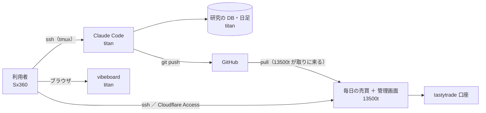
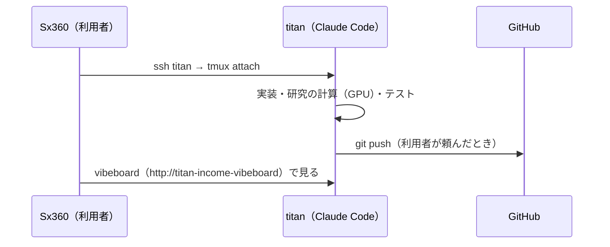
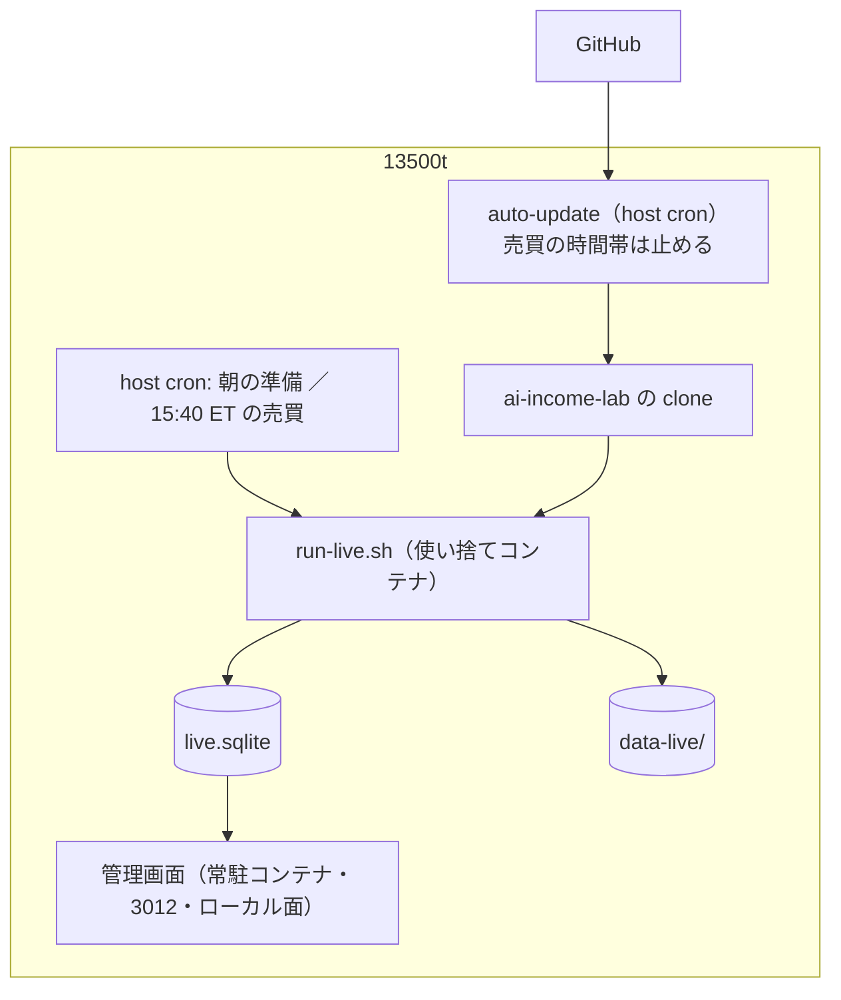
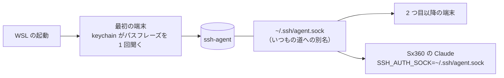
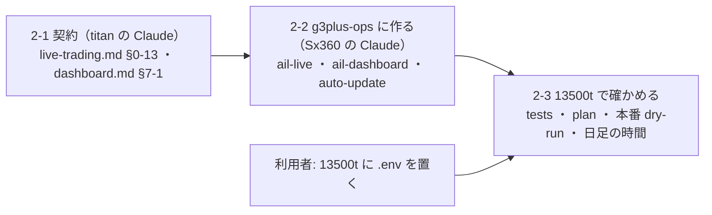
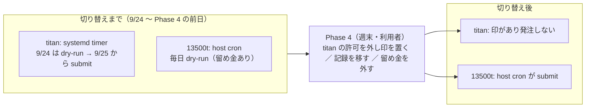

# 3 台の役割分け — Sx360 で作業し、titan で計算し、13500t で本番を動かす

> 2026-09-22 作成。利用者の指示: **「Sx360 で作業をするけど計算などの処理は CPU と GPU が強い titan でやりたい。デプロイは 13500t。そんな環境は作れる？」→「書いて」**
> TODO「`~/g3plus-ops` を使って 13500T に管理画面と毎日の売買を動かす環境を作る」（着手時にプランを作る）のプランを兼ねる。

## 1. 目的・背景

- 作業する機械（Sx360・ノート）と、計算する機械（titan・7950X ＋ RTX 3090 Ti）と、本番の機械（13500t・i5-13500T の家庭サーバ）を分ける
- いまは **titan が全部を兼ねている**（研究の計算・日足の取得・毎日の売買・管理画面・vibeboard）。Sx360 は titan へ ssh する端末で、シミュレーションだけを回す（資格情報を置かない機械。2026-09-19 の利用者決定）
- 13500t は予測を 3 本並列で **約 48 秒【実測 2026-09-22】** で済ませる ＝ 毎日の売買は載せられる（[live-trading.md §0-12](../specs/experiments/live-trading.md)）

> この図の主張: 人は Sx360 の前に座るが、手を動かすのは titan の上の Claude。本番は 13500t だけが口座に触る。



### 役割（案）

| 機械 | 役割 | 置くもの | 置かないもの |
| --- | --- | --- | --- |
| Sx360 | 端末（ssh・ブラウザ）。シミュレーション（いまの決定のまま）。**13500t と g3plus-ops の操作**（K1 の例外） | 鍵・研究 DB の控え | tastytrade の `.env` |
| titan | **Claude Code を動かす場所**・研究の計算（`cli.run`・`cli.queue`・GPU の学習）・研究用の `data/`・`runs/research.sqlite`・vibeboard | コード・研究のデータ | ⚠ 切り替えの後は**本番の発注の許可**（§4 Phase 4） |
| 13500t | **本番**: 毎日の売買（`run-live.sh`）・管理画面・`data-live/`・`live.sqlite` | 本番の `.env`（利用者が置く）・`live.sqlite` | 研究のデータ・GPU の仕事 |

## 2. 決めること（✅ 2026-09-22 に全部決まった）

✅ **利用者の裁定（2026-09-22 夜）: K1〜K9 は「推す案」のとおり**（「案通りでよい」）。K10 は常時起動の回答。以下の表の「推す案」が決定。

| # | 論点 | 決定（推した案） | 理由 ／ ほかの案 |
| --- | --- | --- | --- |
| K1 | Claude Code をどこで動かすか | **titan**（Sx360 から `ssh titan` → tmux の中で `claude`） | コード・データ・GPU・研究の DB が手元にある。Sx360 で動かして毎回 `ssh titan '…'` で計算させる案は、コードとデータが 2 台に分かれて写し違いが起きる（2026-09-22 の計測で、スナップショットを 3 台に写した）。⚠ **例外: 13500t と g3plus-ops の操作は Sx360 の Claude**（K3 で titan から 13500t へ届かない・`~/g3plus-ops` は Sx360 にだけある）。シミュレーションも Sx360（K9）。⚠ Claude のメモリは機械ごとに別 ・ 2 台で同じリポジトリを触るので、書いたら push ／ 始める前に pull |
| K2 | 13500t へのデプロイの形 | **13500t が GitHub から pull する**（g3plus-ops の `daily-ai-music/auto-update.sh` と同じ型・host cron） | titan から 13500t への経路が要らない（いまは届かない【実測】）。⚠ **main への push ＝ 本番に反映**になるので、売買の時間帯（12:30〜13:15 PDT）は pull しない前チェックが要る。⚠ **2026-09-25 追記: 取りに行くのは `main` ではなく本番の目印 `prod`**（関門を通した後に `run-deploy.sh` が進める ＝ [prod-branch.md](prod-branch.md)） |
| K3 | titan から 13500t へ ssh を通すか | **通さない**（K2 で足りる。操作は Sx360 から） | 通すなら (a) 13500t を tailnet に入れる ／ (b) titan に Cloudflare Access の ssh を置く。⚠ どちらも本番に届く経路が増える |
| K4 | ⚠ **二重発注をどう防ぐか**（いちばん重い） | **(a) 売買は 13500t だけ。titan の売買の timer ・許可を外す** | 排他（`MODE`・`run.lock`）は機械の中のファイル。両方が起きると同じ口座に 2 回注文が出る。(b) 口座の側で重複を弾く ＝ 設計から ／ (c) 手で切り替える ＝ 事故が起きる |
| K5 | 管理画面と売買を同じ機械に置くか | **同じ 13500t。ただし公開面（Cloudflare）は出さず、ローカル面だけ**（Sx360 からトンネル） | 公開面のある機械に発注の許可と資格情報が載るのを避ける。公開面も出すなら [dashboard.md §7](../specs/dashboard.md) の「置かない env」を書き換える |
| K6 | 記録（`live.sqlite`）をどうするか | **切り替えの日に titan から 13500t へ移し、titan の側は読むだけの写しにする** | 1 つの口座の記録は 1 か所（「2 か所には置かない」の利用者の裁定と同じ考え）。両方を読む案は管理画面の作りが変わる |
| K7 | 日足の `data-live/` | **13500t が自分で取る**（`.env` があれば DXLink で取れる）。初回だけ titan から写す | 研究用の `data/` とは別物のまま。titan は研究の `data/` だけ |
| K8 | Sx360 から titan の鍵 | **keychain か Windows 側の ssh-agent に預ける**（WSL の再起動で `ssh-add` をやり直さない） | 2026-09-22 に `~/.ssh/agent.sock` が消えていた。パスフレーズなしの鍵にはしない |
| K9 | シミュレーションの機械 | **Sx360 のまま**（いまの決定） | 8 秒で済む軽い仕事・資格情報の無い機械で回す決定がある。titan に寄せるなら `run-sim.sh` の scratch の道（`~/.cache/ai-income-lab-sim`）で回る |
| K10 | 13500t が常に起きているか | ✅ **常時起動**（2026-09-22 利用者の回答） | それでも落ちた日（停電・更新の再起動）は 1 日飛ぶ。titan に戻す手順（Phase 5）で埋める |

## 3. 対応方針

### 3-1. 作業の流れ（Sx360 → titan）

> この図の主張: 作業の出入り口は Sx360 だが、コードを書く・計算する・コミットするのは全部 titan の上。



- tmux のセッションを 1 つ決める（例 `ail`）。切れても計算は続く
- vibeboard の Tasks タブから titan のセッションへ投函できる（いまの仕組みのまま）
- Sx360 の作業ツリーは**読むだけ**にする（`git pull` で追う）。Sx360 で書いたものがあれば push してから titan で pull

### 3-2. 本番（13500t）の器

> この図の主張: 13500t は自分で pull して、自分の時計で売買する。titan とはつながらない。



| 部品 | 形 | 置き場 |
| --- | --- | --- |
| 毎日の売買 | 使い捨てコンテナを host cron から起こす（g3plus-ops の受け入れ準備の (b) 案。`ail-predict-bench` の Dockerfile を土台に `tastytrade-api-sample` の依存を足す） | g3plus-ops `ail-live/` |
| 管理画面 | 常駐コンテナ（§7 の契約。3012） | g3plus-ops `ail-dashboard/`（`5dea5eb` から戻す） |
| 自動デプロイ | `auto-update.sh`（前チェック: 売買の時間帯・`run.lock`・`HALT` のあいだは pull しない） | g3plus-ops |
| 許可 | `.env` と `live.env`（`TT_ALLOW_PROD_ORDERS=1` など）は**利用者が置く** | 13500t のみ |

⚠ デプロイ設定・ホスト名・Tunnel は **g3plus-ops 側にだけ書く**（CLAUDE.md）。このリポジトリには契約（何を置く・置かない）と判定だけ。

## 4. Phase

### Phase 0: 決める（利用者）
- ✅ 2026-09-22: K1〜K9 は推す案のとおり・K10 は常時起動

### Phase 1: 作業の場所を titan に移す（K1・K8）
- Sx360 に鍵を持ち続ける仕組み（keychain か Windows の ssh-agent）を入れる（⚠ 入れるのは利用者）
- titan で tmux ＋ `claude` を起こす段取りを `run-titan-session.sh`（Sx360 で叩く 1 本。`ssh -t titan tmux new -A -s ail`）にする
- CLAUDE.md に「作業は titan の Claude で。Sx360 は端末（13500t と g3plus-ops の操作だけ Sx360 の Claude）」を書く。メモリ（titan-remote-access）も直す

#### 1-1. 済んだもの（2026-09-22 夜・titan の Claude）

- `run-titan-session.sh`（プロジェクト直下。Sx360 で叩く）: 鍵で入れるかを `BatchMode` で先に見る（入れなければ手順を出して止まる）→ `ssh -t titan` → `tmux new-session -A -s ail`。セッションが無ければ `~/ai-income-lab` で `claude` を起こし、抜けてもシェルを残す。`--pull`（新しく作るときだけ `git pull --ff-only`）・`--shell`・`--session`・`--host titan-lan`。titan の上で叩けば ssh しない。tmux の中で叩くと止まる（入れ子）
- CLAUDE.md の「機械の役割」の行に入口（`run-titan-session.sh`）と「書いたら push ／ 始める前に pull」を足した

#### 1-2. 鍵を持ち続ける（K8。⚠ **入れるのは利用者・Sx360 で**）

> この図の主張: 鍵のパスフレーズを入れるのは WSL が起きた最初の端末の 1 回だけ。あとの端末と Claude は同じエージェントを使う。



推す案は **keychain**（apt で入る・鍵はディスクに平文で置かない）。`~/.bashrc` の末尾に:

```bash
# titan の鍵を WSL の起動ごとに 1 回だけ聞く（docs/plans/three-machines.md 1-2）
if command -v keychain >/dev/null 2>&1; then
  eval "$(keychain --eval --quiet --agents ssh titan-ed25519)"
  ln -sfn "$SSH_AUTH_SOCK" ~/.ssh/agent.sock   # いままでの手順（SSH_AUTH_SOCK=~/.ssh/agent.sock）をそのまま使う
fi
```

入れ方: `sudo apt install keychain` → 上を足す → 新しい端末を開いてパスフレーズを 1 回 → `ssh -o BatchMode=yes titan true && echo ok`。

| 案 | WSL を再起動した後 | 手間 | ⚠ |
| --- | --- | --- | --- |
| **keychain（推す）** | 最初の端末で 1 回だけ聞かれる（`ssh-add` を手で叩かない） | apt 1 本 ＋ `.bashrc` 4 行 | Claude が端末より先に起きるとエージェントが無い（端末を 1 つ開けば直る） |
| Windows の ssh-agent ＋ 橋渡し（`wsl2-ssh-agent` など） | 聞かれない（Windows が鍵を覚えている） | Windows のサービスを自動起動・橋渡しの道具を別に入れる | 外の道具を 1 本足す。Windows にログオンしている間は誰でも鍵を使える |

- ⚠ パスフレーズなしの鍵にはしない（K8）
- テスト（§6）: Sx360 の WSL を `wsl --shutdown` → 端末を開いてパスフレーズを 1 回 → 別の端末で `./run-titan-session.sh` がパスフレーズなしで入れる

### Phase 2: 13500t に本番の器を作る — まだ発注しない（K2・K5・K7）
- 依存: 「9/23（水）: 本番投入」（✅ 2026-09-23）＋ titan で数日通ったこと（⚠ 「数日」は **titan の timer が submit で通った日数**で数える ＝ 下の「2026-09-24 の決定」）
- g3plus-ops: `ail-live/`（売買のコンテナ）・`ail-dashboard/` を戻して §7 に追従（`glossary.toml`）・`auto-update.sh`
- 13500t で `--mode plan`（過去の日）→ 本番の dry-run（利用者が `.env` を置いてから）。⚠ **発注の許可はまだ置かない**
- 管理画面はローカル面だけで起動し、Sx360 からトンネルで見る（`run-dashboard-tunnel.sh` の宛先を選べるようにする）

> この図の主張: Phase 2 は「titan で契約を書く → Sx360 の Claude が g3plus-ops に作る → 13500t で確かめる」の順で、⚠ 本番の注文が出る段は無い。



| Step | 中身 | だれ | 依存 |
| --- | --- | --- | --- |
| 2-1 | 器の契約（正本）を書く: 売買 ＝ [live-trading.md §0-13](../specs/experiments/live-trading.md)・管理画面 ＝ [dashboard.md §7-1](../specs/dashboard.md)。`run-dashboard-tunnel.sh` の宛先（`--host 13500t` の案内） | titan の Claude | なし（✅ 2026-09-22 夜） |
| 2-2 | g3plus-ops: `ail-live/`（Dockerfile ＝ `ail-predict-bench` ＋ tastytrade の依存・clone の bind mount・uid・`.venv` の symlink）・`ail-dashboard/` を戻して §7 ・ §7-1 に追従・`auto-update.sh`（pull しない 4 条件）・host cron（`--mode plan` か dry-run だけ） | ⚠ **Sx360 の Claude**（K1 の例外） | 2-1 |
| 2-3 | 13500t で §0-13 の合否 ①〜⑤（tests ／ `--mode plan` の判定が titan と一致 ／ 本番 dry-run ／ 市場時間中の日足 ＋ 予測が 120 秒に収まるか ／ 秘密の grep） | Sx360 の Claude ＋ 利用者（`.env` を置く） | 2-2 ・ ⚠ 本番 dry-run と市場時間中の計測は **9/23 の本番投入の後**（冒頭の依存） |

⚠ **2-1 と 2-2 の器づくりは冒頭の依存（9/23 の本番投入 ＋ titan で数日）を待たなくてよい**（13500t には発注の許可を置かない ＝ titan の実売買に触らない）。待つのは 2-3 の本番の資格情報を使う段だけ。

#### 2-3 の手順（2026-09-23 夜。titan の Claude が書いた。⚠ 実行は Sx360 の Claude ＋ 利用者）

前提【実測 2026-09-23】: titan で本番投入が 1 日通った（[DONE.md](../../DONE.md)）／ refresh token は回っていない（`refresh_token_rotated` は 88 件とも false・`.env` は 9/9 から不変）＝ **同じ `.env` を 2 台で使っても互いのログインを壊さない** ／ 日足の写しは `~/ail-bench/data-live-20260922-2000.tar.gz`（sha256 あり。13500t にも bench で写してある）。

⚠ **守ること**: 13500t には `TT_ALLOW_PROD_ORDERS` も `--i-know-this-is-real-money` も置かない（g3plus-ops の `run.sh` の留め金も外さない）／ titan の売買（12:45 PDT の手動 ／ 9/24 からの timer）には触らない ／ 13500t の記録に入るのは dry-run ／ plan だけ。

| 順 | 何を | だれ | 出口 |
| ---: | --- | --- | --- |
| 0 | titan の今日の変更（DONE・§1 の記録・プランの archive）を push → Sx360 の clone で `git pull` → 13500t の auto-update が pull したことを log で見る | titan の Claude → 利用者 | 3 台とも同じ commit |
| 1 | 13500t の clone に `experiments/tastytrade-api-sample/.env` を置く（titan のものをそのまま。`chmod 600`・持ち主は clone と同じ uid） | ⚠ **利用者** | `.env` がある・`git status --porcelain` が空のまま（git 管理外） |
| 2 | `data-live/` が clone の中に無ければ bench の写し（`data-live-20260922-2000.tar.gz`）を `experiments/feature-discovery/data-live/` に展開し sha256 を確かめる（⚠ 研究用の `data/` は無いので `live_update.sh` の「初回の種」は動かない ＝ 写しが要る） | Sx360 の Claude | `data-live/seed.json` がある・63 銘柄 |
| 3 | ② `run_day` の部分: `./run-live.sh --traders T1,T2,T3 --date 2026-09-22 --mode plan -- --env prod --ignore-window`（コンテナの `run.sh` 経由）。titan の同じ日の `signals.jsonl`（`livefs.py cat experiments/live-trading/out/2026-09-22/signals.jsonl`）と **買い% ／ 出口% を突き合わせる**。⚠ 比べるのは合図（`buy`・`exit`）だけ。意図（intent）は 13500t の売買履歴が空で titan と違って当然（titan の T1・T3 は 9/23 から持ち株がある）。⚠ 口座に 9/23 の持ち株（T 4 ・ PFE 4 ・ NKE 2 ・ VZ 2 ・ BAC 2）が見える ＝ 執行器は「売買履歴の外」として記録するだけで正しい | Sx360 の Claude | 15 行とも買い% の差 ≤ 0.01（§0-12 の T3 の 0.003 と同じ桁） |
| 4 | ③ 本番の dry-run: 市場時間中（9/24 06:30〜13:00 PDT）に `TT_ALLOW_PROD_DRY_RUN=1 ./run-live.sh --traders T1,T2,T3 -- --env prod --allow-prod-dry-run --ignore-window`。⚠ 閉場中は成行の dry-run が `tif_no_after_hours_opening_market_orders` で断られる（cert の【実測 2026-09-17】）ので、閉場中に流して「失敗」と読まない | Sx360 の Claude | `orders.jsonl` の全行が `mode: dry-run`・`submitted` 無し・買付余力の効果が $25〜$60 |
| 5 | ④ 市場時間中の所要: 9/24 12:40 PT の host cron（dry-run）の log から 日足の更新 ＋ 予測 の秒数を読む（titan は 55 ＋ 43 秒【実測 9/23】）。⚠ 12:45 PDT に titan の本物も動く ＝ 同時にログインしても壊れない（前提）が、429 が出たら log に残す | Sx360 の Claude | 更新 ＋ 予測 ≤ 120 秒（超えるなら `AIL_PREP_SECONDS` を増やして刻限 15:58 ET に収まるか） |
| 6 | ⑤ 秘密の grep: 13500t の clone で `python3 experiments/tastytrade-api-sample/livefs.py dump . \| grep -c <値>` を `.env` の 7 項目と `eyJ` で（⚠ `Bearer` は `token_type` の値として出る ＝ トークンではない） | Sx360 の Claude | 全部 0 件 |
| 7 | 管理画面: Sx360 から `./run-dashboard-tunnel.sh --host <13500t>` → 9 ページが 200・`mode: real`・dry-run の起動が出る | Sx360 の Claude | — |
| 8 | 結果を `live-trading.md` §0-13 の下に「合否の結果」として書き、TODO の Step 2-3 を閉じる → **Phase 3 へ**（⚠ Phase 4 の切り替えは titan で数日通ってから・週末に） | Sx360 の Claude（push）→ titan の Claude が pull | — |

✅ **2026-09-23 夜の進み**（Sx360 の Claude）: 順 0 〜 3 ・ 6 ・ 7 は ✅（順 7 は利用者が管理画面を起こし直した後に 9 ページとも 200 ・ `mode: real` ・ plan の起動が出た）、順 4 ・ 5 は 9/24 の市場時間中。結果は [live-trading.md §0-13](../specs/experiments/live-trading.md) の「合否の結果」。⚠ **順 3 の突き合わせ相手は titan の `signals.jsonl` ではなく bench の 9/22**（titan の 9/22 は 15:14 ET の途中の足で計算した予測しか無く〔dry-run は `out_of_window`〕、写しの 16:01 ET の足と違う ＝ 買い% が最大 0.175 ずれる。判定は同じ・bench とは 15 行とも差 0）。

✅ **2026-09-24 12:55 PDT: Step 2-3 の ①〜⑤ が全部 ✅ ＝ Phase 2 済み**（③ 本番 dry-run 10 本・`submitted` 無し ／ ④ 無人の cron で 更新 56 ＋ 予測 44 秒 ＝ 100 秒 ≤ 120 ／ ⑤ 0 件。結果は [live-trading.md §0-13](../specs/experiments/live-trading.md) の「合否の結果」）。同じ 15:50 ET に titan の timer（初日 dry-run）も rc=0 で通り、2 台が同じ資格情報で同時にログインしても 429 は出なかった。⚠ 13500t の 9/24 の記録は dry-run 2 回（11:05 ET 手動・15:51 ET cron）。

⚠ **Phase 3 で titan の Claude がやるもの**（2-3 と並行できる）: 「本番の機械ではない」印（`experiments/live-trading/NOT_PRODUCTION` のような `MODE` と同じ型のファイル）を `run_day.py` が読んで submit を拒む仕組み ＋ テスト ＋ `live-trading.md` の切り替えの手順書。⚠ 印は titan に置くもので、13500t には置かない（取り違えないよう、印の中身に機械名を書かせ、`hostname` と突き合わせる案）。

### 2026-09-24 の決定 — 切り替えまでの運転の形（利用者。「まず titan, 13500t ともに timer で動かすけど、最初は 13500t は dry-run だけで後で切り替える」）

> この図の主張: 発注するのは常に 1 台だけ。切り替えまでは titan の timer、切り替え後は 13500t の cron。13500t はそれまで毎日 dry-run で「無人で起きること」だけを積む。



| 機械 | 9/24（木） | 9/25（金）〜 Phase 4 の前日 | Phase 4（週末。利用者） | 切り替え後 |
| --- | --- | --- | --- | --- |
| titan | **timer を入れる**（`systemd/README.md` の 8 行）。初日は `live.env` が雛形の dry-run | 利用者が `live.env` を submit に書き換え、**timer が本番の発注** | 発注の許可を外し「本番の機械ではない」印を置く（Phase 3 の仕組み） | 発注しない（印で `run_day.py` が submit を拒む） |
| 13500t | host cron の dry-run（Step 2-3 の ③④ ＝ 今日確かめる） | host cron の dry-run のまま（`run.sh` の留め金） | `live.sqlite` と `state/` を受け取り（sha256・Phase 2 の DB は `live.sqlite.phase2-<日付>` に退ける）→ `reconcile.py show` で差 0 → 留め金を外し `live.env` を submit | **host cron が発注** |

- ⚠ **timer の dry-run の日（titan の 9/24）は、同じ日に手動の本番発注を重ねない**。どちらも 15:50 ET に日足の更新（ロック無し）→ 予測 → 執行器と進み、日足を同時に書き、執行器は片方が `run.lock` で拒否される（rc=6）＝ **9/24 は本物の注文なし**（持ち株はそのまま）。⚠ 最初から submit で入れて dry-run の日を省くのは利用者の判断
- Phase 3（印の仕組み ＋ 切り替えの手順書 ＋ cert で 1 往復）は**切り替えの前に必須** ＝ 2026-09-24 から titan の Claude が着手する（Step 2-3 と並行。着手の指示は利用者）
- Phase 4 の時期: **早ければ 9/26〜27**（timer の submit は 9/25 の 1 日だけ）／ 「数日」を守るなら **10/3〜4**。⚠ 利用者の裁定。13500t の cron の dry-run は Phase 4 まで毎日続く（無人で起きた日 ／ 起きなかった日はこの間に数え始める）
- 無人運転の判定（プラン live-trading-three-models.md §2-3 の 2 本柱の 1 つ）は、切り替え後は 13500t の cron のログで測る（起動しなかった日の数え方 ＝ TODO「無人運転」の子タスク）

### Phase 3: 切り替えの手順を決めて試す（K4・K6）
- ✅ 2026-09-24: **着手は titan の Claude・Step 2-3 と並行・切り替えの前に必須**（上の「2026-09-24 の決定」）
- ✅ **2026-09-24 に済んだ**（titan の Claude。プランは [production-switch-mark.md](archive/production-switch-mark.md)・正本は [live-trading.md §0-14](../specs/experiments/live-trading.md)）: 印 `NOT_PRODUCTION`（`notprod.py`。hostname を書き、違えば「この機械の印ではない」と出して拒む ＝ 下の「取り違え」の案のとおり）・`run_day.py`・`sample.py` の rc=7・`run-live.sh` の早見・管理画面の帯・手順書 ①〜⑦・稽古（写しの sha256・`reconcile.py show` 差 0・印で rc=7）。⚠ **印はまだ置いていない**（置くのは Phase 4 の日に利用者）
- 手順書（`live-trading.md` に節を足す）: ① titan の timer を止め、titan の `live.env` から発注の許可を外す → ② `live.sqlite` と `state/` を 13500t へ（sha256 を確かめる）→ ③ 13500t の `reconcile.py show` で口座と売買履歴の差 0 → ④ 13500t の timer を入れる
- ⚠ **「titan で発注しない」を仕組みで守る**: titan に `experiments/live-trading/` の「本番の機械ではない」印を置き、`run_day.py` が submit を拒む（`MODE` と同じ型のファイル）。⚠ 印の有無を 13500t と取り違えない書き方をプランで詰める
- cert（sandbox）で切り替えを 1 往復して確かめる

### Phase 4: 本番を 13500t に切り替える（利用者）
- ✅ **2026-09-25 引け後に ①〜⑥ を済ませた**（利用者の決定「すぐにやってしまう。問題があれば 13500t の方で直す」）。13500t の最初の本番の回は 9/28（月）の cron（⑦）。記録は [live-trading.md §0-14 (f)](../specs/experiments/live-trading.md)
- 市場の外の日（週末）に Phase 3 の手順で。時期は「2026-09-24 の決定」（早ければ 9/26〜27・「数日」なら 10/3〜4。⚠ 利用者の裁定）
- 順: titan の timer を止め `live.env` から発注の許可を外し印を置く → `live.sqlite` と `state/` を 13500t へ（sha256。13500t の Phase 2 の DB は退ける）→ 13500t の `reconcile.py show` で差 0 → 13500t の `run.sh` の留め金を外し `live.env` を submit（発注の許可を置くのは利用者）→ 翌営業日の cron を見る

### Phase 5: 戻し方と見張り（K10）
- 13500t が落ちた日に titan へ戻す手順（Phase 3 の逆）
- 管理画面の監視（`/api/live`）で「今日の起動が無い」を見つけたら知らせる

## 5. 影響範囲

- このリポジトリ: CLAUDE.md（作業の場所・機械の役割）・`live-trading.md`（切り替えの手順・本番の機械の印）・`dashboard.md` §7（K5 で公開面を出すなら）・`run_day.py`（本番の機械の印を読む）・`run-dashboard-tunnel.sh`（宛先）
- g3plus-ops: `ail-live/`・`ail-dashboard/`・`auto-update.sh`・13500t の host cron
- 実売買: ⚠ 切り替えまでは titan のまま。9/23 の本番投入には触らない

## 6. テスト方針

- Phase 1: Sx360 を再起動しても `ssh titan` がパスフレーズなしで通る（エージェントが残る）・tmux から戻れる
- Phase 2: 13500t で `./run-tests.sh --fast` がコンテナで通る・`--mode plan` が titan と同じ計画を出す（同じ日・同じ `data-live/` なら売買の判定が一致。⚠ 指紋は CPU で変わる ＝ §0-12）・管理画面が 200・秘密の grep 0 件
- Phase 3: 「本番の機械ではない」印がある機械で submit が拒まれる（テスト）・cert で切り替えを往復して `reconcile.py` の差 0・`live.sqlite` の sha256 一致
- 全体: 13500t 以外に `TT_ALLOW_PROD_ORDERS` が置かれていないこと

## 7. まだ分かっていないこと

- ~~13500t が常に起きているか~~ → ✅ 常時起動（K10。利用者の回答）。2026-09-22 20:31 PDT の `up 1:25` は、その日にカーネルと GPU ドライバを入れ替えて再起動したため
- 13500t の `data-live/` の日足の取得（DXLink）が市場時間中に何秒かかるか（titan は 54〜55 秒【実測】）。予測 48 秒と足して準備の見積り 120 秒に収まるか ＝ Phase 2 で測る
