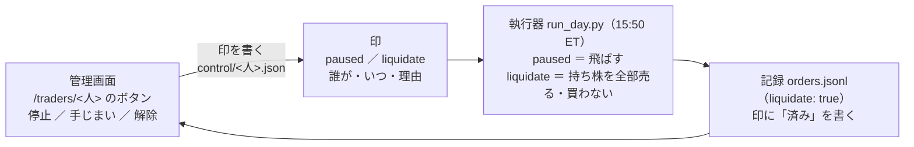

# 管理画面から人ごとに「停止」「手じまい」の印を立て、執行器が翌日以降に実行する

作成 2026-10-05（Sx360 の Claude）。TODO「管理画面からトレーダーごとに自動売買の停止と手じまいの印を立てる」のプラン。

## 0. 目的・背景

- 利用者の指示（2026-10-05）: 「13500tに自動で売りを出す仕組みを入れる。管理画面からトレーダーごとに自動売買の停止と現在のポジションを手じまいするボタンを入れる」→ Claude の検討（管理画面に発注の経路を持たせない 2 段）→ 利用者決定 **「手じまいはフラグを立てるだけで翌日以降に行う事にする。手じまいを行うのは執行機のみ」**
- いまの守り（変えない）: 管理画面に発注の経路は無い（9/18）。発注の許可は執行器と CLI だけ。管理画面が書くのは `HALT` と同じ「印」だけ
- 人を外す・休ませるのに、いまは `live.env` の書き換え（利用者が 13500t で）と `liquidate.py`（CLI）が要る。これを「管理画面で印を立てる → 翌営業日の 15:50 ET の回で執行器が実行」にする
- ⚠ **執行器の凍結（10/20 まで）に触れる**（`run_day.py`・`plan.py` を変える）。いまの 3 人の 20 営業日の記録は 10/2 で閉じ、新しい 3 人は 1 日目から数え直すと決めたので、凍結の目的（執行の差の記録を汚さない）は薄れている ＝ 解くかは利用者の判断

## 1. 形

この図の主張: 管理画面は印を書き、執行器は毎日の回の中で印を読んで「その人を飛ばす」か「その人の持ち株を全部売る」だけをする。売る経路は今までの発注の部品そのもの。

| 印 | 意味 | 執行器の動き | 解除 |
| --- | --- | --- | --- |
| `paused`（停止） | 休ませる。持ち株はそのまま | その人の合図を読まず、売買しない（`events` に `paused`） | 管理画面の解除ボタン |
| `liquidate`（手じまい） | 持ち株を全部売る。売り切った後も買わない | 合図の代わりに「持ち株を全部売る」意図を組む（成行・1 注文 1 トレーダー・`liquidate: true`）。買いは出さない。全部売れたら印に `done`（日付・約定の数）を書き、以後は飛ばす | 管理画面の解除ボタン（解除すると普通の売買に戻る） |

- 置き場: `experiments/tastytrade-api-sample/out/control/<人>.json`（`HALT` と同じ記録ディレクトリの中。⚠ ファイルのまま ＝ `HALT`・`MODE` と同じ扱い。管理画面のコンテナが書けて執行器のコンテナが読める道）。中身は `{"paused": bool, "liquidate": bool, "since", "actor", "reason", "done": {...}}`
- 順: `HALT` ＞ 印。`HALT` がある日は手じまいも動かない（止めてから手じまい、ではなく、`HALT` を解いた翌営業日に手じまいが走る）。発注できる時間帯・許可の 3 段・印（`NOT_PRODUCTION`）・`run.lock` は今までどおり
- 手じまいの売りは、その人の売買履歴の持ち株だけ（口座にあって売買履歴に無い株は売らない ＝ §0-8）。口座と帳尻の合わない銘柄（`position_short`）は売らず、翌日に持ち越す
- 1 日の上限（`--max-day-usd`）は買いの上限なので売りには効かない。予算の合計の上限はそのまま
- 管理画面: トレーダーの詳細（`/traders/<人>`）に 停止 ／ 手じまい ／ 解除 のボタン（確認文の入力つき）と、いまの印・「済み」の表示。概要の段にも印を出す。⚠ ボタンはローカル面と `cloudflare-local`（9/26 の決定 ＝ 公開面もローカル面と同じ機能）。`cloudflare`（監視と停止だけ）には出さない。POST は `/ops/traders/<人>/<paused|liquidate|clear>`。操作した人（Access のメール）を印に残す
- `liquidate.py`（CLI）はそのまま残す（印を待たずにその場で売るとき・テスト）

## 2. Phase と Step

| Phase | 中身 | 担い手 |
| --- | --- | --- |
| 0 | ⚠ 利用者: 執行器の凍結を解く（この変更は `run_day.py`・`plan.py` に入る） ✅ 2026-10-05 利用者決定「凍結を解く」 | 利用者 |
| 1 | 印の読み書き（`control.py`。読む: 執行器・管理画面 ／ 書く: 管理画面・CLI `control.py set|clear`）とテスト | Claude |
| 2 | 執行器: `paused` で飛ばす ／ `liquidate` で持ち株を全部売る（`plan.decide` の前で差し替え。買いは組まない）／ 全部売れたら印に `done` ／ `events`・`orders` の印。テスト（モック・`tests/test_sim_limits.py` の形）・黄金の集計値（`--full`。⚠ 印の無い人は 1 ビットも変わらない） | Claude |
| 3 | 管理画面: ボタン・印の表示・POST・テスト（面の判定・秘密が出ない） | Claude |
| 4 | `./run-tests.sh --full` → コミット → デプロイ（利用者の依頼）→ 13500t で印を 1 度試す（`paused` を立てて翌日の回で飛ぶこと） | Claude ／ 利用者 |

## 3. 影響範囲

- 執行器: `run_day.py`（印を読む・手じまいの意図・`done`）・`plan.py`（持ち株を全部売る意図を組む関数。既存の `decide`・`size_intents` は変えない）・新 `control.py`
- 管理画面: `app/ops.py`（印の読み書き）・`app/main.py`（POST と表示）・`templates/`・`glossary.toml`（語）・`docs/specs/dashboard.md`
- 文書: `live-trading.md` §0-2（停止の項に印を足す）・§0-15 C11（外し方）・`howto-model-trader.md` 2-7・`CLAUDE.md`
- 本番: デプロイが要る。印の無い人の動きは変わらない（黄金の集計値で確かめる）

## 4. テスト方針

- 印の読み書き: 壊れた JSON は「印なし」ではなく「読めない」で止める（`NOT_PRODUCTION` と同じ考え）
- 執行器: `paused` の人は `signals`・`orders` に 1 行も出ない ／ `liquidate` の人は持ち株の数だけ売りが出て買いが出ない・翌日は `done` で飛ぶ ／ `HALT` が優先 ／ 口座が足りない銘柄は売らない ／ 印の無い人は黄金の集計値が変わらない
- 管理画面: ボタンは面ごと（`loopback`・`local`・`cloudflare-local` に出る・`cloudflare` に出ない）・POST は確認文が無いと 400・印に actor が入る・秘密が出ない
