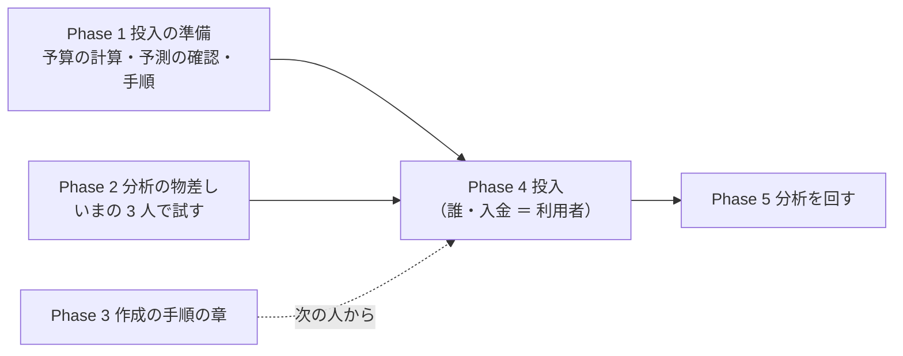

# トレーダーを「作成 → 実践投入 → 分析」のループで回す

作成 2026-10-04（Sx360 の Claude）。TODO「トレーダーを『作成 → 実践投入 → 分析』のループで回す」のプラン。

## 0. 目的・背景

- 利用者の指示（2026-10-01）: **「やりたい事としては 新しいトレーダの実践投入 ／ 投入したトレーダーの分析 ／ 新しいトレーダーの作成」**。ほかの TODO を先に終わらせてから着手（残りは判断待ちと 10/20 待ちだけになった ＝ 2026-10-04 に着手）
- 利用者の決定（2026-10-04）: **「投入の時期は早める」**（10/20 の判定を待たない。⚠ それまでの決めごと「新しい人を入れるのは 10/20 の判定の後」〔[live-trading.md §0-15](../specs/experiments/live-trading.md) C11・[new-model-trader.md](archive/new-model-trader.md) K7〕を利用者が変えた）／ **「予算は必要な金額を計算して可能かどうか判断する」**（計算は Claude・判断は利用者）／ **「誰かはこれから決める」**
- いまあるもの: 候補の人 3 人（`T4` ハル ＝ 3 本の平均 ／ `T5` ミオ ＝ 主モデル ＋ 損切り ／ `T6` ソラ ＝ F2-2 RFE）・作る手順書（[howto-model-trader.md](../specs/howto-model-trader.md)）・6 人をトレーダーと同じ形で机上にかけた表（[trader-shaped-validation.md §5](../specs/experiments/trader-shaped-validation.md)）・実売買の記録 8 営業日（[live-trading.md §1](../specs/experiments/live-trading.md)）

⚠ **守るもの**: 損益で手法を採らない（CLAUDE.md の 2 つ目の例外）／ 執行器のコードは 10/20 まで変えない（人を足すのは設定だけ）／ いまの人は編集しない（C11）／ 本番の許可と起動は利用者。

## 1. 全体像

この図の主張: 投入を早めるので、投入の準備（お金・予測の時間・手順）を先に片づけ、分析の物差しを並行して作る。作成の手順は、次の人を作るときまでに書けばよい。

## 2. Phase と Step

### Phase 0: 決めごと（⚠ 利用者）

| # | 論点 | 状態 |
| --- | --- | --- |
| K1 | 投入の時期 | ✅ 2026-10-04 **早める**（10/20 を待たない） |
| K2 | 予算 | ✅ 計算は §3（Claude）。**可能かどうかの判断と入金は利用者**。✅ 2026-10-04 利用者決定 **「１トレーダー600ドルまで上げる」→「検証は３人だけにします。誰を含めるかはまだ決めていません。３人とも600ドルとする」** ＝ 実売買は **3 人 × $600**（誰かは K3）。必要な入金は §3-1 の下の表（$880〜） |
| K3 | 誰を入れるか | ✅ 2026-10-04 利用者決定 **「既存の１本だけのこして２本は新しいのに変える」** ＝ いまの 3 人のうち 1 人を残し、候補から 2 人を入れる。✅ **「推しのとおりで進めて」（2026-10-04）＝ 残す `T1`・入れる `T4`（ハル）＋ `T6`（ソラ）・外す `T2`・`T3`**（`T5` は買い戻しの扱い〔1-5〕を決めてから次の入れ替えで）。⚠ 外す人は窓の中で持ち株を売り切ってから外す（C11）＝ `T2` は持ち株 0 で何もしなくてよい・`T3` は 5 銘柄（約 $238）／ `T1` は 4 銘柄（約 $204）を売る必要 ＝ 執行器に「全部売る」口は無い（凍結中）ので、利用者が口座の画面で売って `reconcile.py` で売買履歴を合わせる |
| K4 | 執行器の上限の引き上げ | ⏳ `LT_MAX_TOTAL_BUDGET_USD=1900`・`LT_MAX_DAY_USD=1900`（13500t の `live.env`。利用者が書く。§3-1）。⚠ いまの人の予算を $300 → $600 にするのは「編集」なので、C11 を **「予算だけは編集してよい（モデル・θ・銘柄・`sizing` は新しい人）」** に直す ＝ 利用者の決定として `live-trading.md` §0-15 に書いた（2026-10-04） |

### Phase 1: 投入の準備（Claude。⚠ 本番は触らない）

| Step | 中身 | 状態 |
| --- | --- | --- |
| 1-1 | 必要な金額の計算（§3-1） | ✅ 2026-10-04 |
| 1-2 | 候補のモデルが**本番と同じ形の日足**（2018 年から・`data-live/`）で予測を出すか | ✅ 2026-10-04 titan で確かめた（§3-2） |
| 1-3 | 13500t での予測の時間（`bench_predict.py`。線 60 秒） | ✅ 2026-10-04 デプロイ（`prod` 22a13c2）の後に測った: **`T1`・`T4`・`T6` ＝ 予測 4 本並列で温まった状態の中央値 52.6 ／ 52.4 秒**（asof 9/18 ／ 9/22・冷えた状態 49.1 ／ 52.6 秒・4 回ずつ・`ok`）＝ 線 60 秒の内（余裕 約 7 秒。3 本のときは 47.9 ／ 48.4 秒【§0-12】）。`T6` のモデル（`sel_small4_1995`）は 4 本の中でいちばん遅い側（52.5 秒）。結果は 13500t の `/home/ubuntu/trade-predict-bench/out/13500t-T1T4T6-20261004T2046.jsonl` |
| 1-4 | 手順書 2-7「本番に入れる」を具体の手順にする | ✅ 2026-10-04 §3-4 に書いた（⚠ 13500t の `run.sh` は `LT_*` の環境変数をコンテナに渡さない ＝ 上限は `live.env` の `AIL_LIVE_EXTRA` に `--max-total-budget 1900 --max-day-usd 1900` を足す） |
| 1-5 | `T5` を入れるなら「売った翌日に買い戻す」の扱いを先に決める（検知器 `X1` が出口の日は買い% 0 を返す ＝ 研究側の変更 ／ そのまま入れて記録する） | ⏳（`T5` を選んだときだけ） |

### Phase 2: 分析の物差し（Claude が案 → 利用者が確認 → いまの 3 人で試す）

✅ 2026-10-04 案を書き、いまの 3 人の 8 営業日で試した（§3-5）。利用者の確認待ち。

| # | 見るもの | 問い | 出どころ | 判断 |
| ---: | --- | --- | --- | --- |
| A | **執行の差**（差 1 ＝ 合図時の気配 → 約定・bp。正 ＝ 不利） | 合図どおりの値段で売買できているか | `orders.jsonl`（管理画面が計算済み） | 20 営業日の判定と同じ線: 中央値 ≤ 5bp |
| B | **「持ち続ける」との差** ＝ その人の損益（実現 ＋ 含み − 手数料）− 同じ 5 本を初日に同じ株数買って持ち続けた場合の損益 | 売り買いの判断が、何もしないより良かったか（机上の判定の相手と同じ） | `state/<env>/<名前>.json`・初日の約定・合図時の気配 | ⚠ **数字を見るだけ・採否には使わない**（数週間では統計的に判定できない）。向きが机上（[trader-shaped-validation.md §5](../specs/experiments/trader-shaped-validation.md)）と同じかを添える |
| C | **机上との一致** ＝ その日の合図（買い% ／ 出口%）と判断（買い ／ 売り ／ 持つ ／ 見送り）が、同じ設定の机上の規則から出る判断と同じか | 執行器が設定どおりに動いているか（配線） | `signals.jsonl`・`events.jsonl`・`orders.jsonl` | 一致しない日が 0 日 |
| D | **無人運転** ＝ 起動した営業日 ／ 営業日・`end rc=0`・人手の回数・口座 − 売買履歴 の差 | 人がいなくても毎日動くか | `trade.log`・`reconcile.py show`・`check.sh` | 20 営業日の判定と同じ線: 執行できた日 95% 以上・人手 0 回 |

- 出す場所: まず記録（`live-trading.md` §1 の下に 1 人 1 行の表）。管理画面に出すのは、物差しが固まってから（⚠ 本番の管理画面を変えるには「デプロイ」が要る）
- ⚠ 新しい人の日数は、いまの 3 人の 20 営業日とは別に数える（投入日を 1 日目）

### Phase 3: 作成の手順の章（Claude）

✅ 2026-10-07 書いた ＝ [howto-model-trader.md §3](../specs/howto-model-trader.md)。⚠ 未決 1 つ（物差しの決まり 2 と、固定の後に入った〔トレーダー・…〕・合成の行）は §3-1

- 手順書に 3 章「検証結果から選ぶ → トレーダーと同じ形で机上にかける → 候補の人にして sim で通す」を足す（選ぶ物差しは [best-model-trader.md §2 Step 1](archive/best-model-trader.md) の 6 つの決まりを毎回同じものとして固定・机上は rules.md 20 章の config を写す・採る 0 のときに候補を作るかの扱い）

### Phase 4: 投入（⚠ 利用者の決定と作業を含む）

| Step | 担い手 | 中身 |
| --- | --- | --- |
| 4-1 | 利用者 | 誰を入れるか（K3）・入金（K2）・上限（K4） |
| 4-2 | Claude | 候補の設定を `config/traders/` 直下へ写す（識別名・呼び名はそのまま。`candidates/` の原本は残す）・`tests/test_trader.py`・`live-trading.md` §0-1 の表・`traders.toml`・push |
| 4-3 | 利用者 ＋ Sx360 の Claude | 「デプロイ」→ 1-3 の計測 → 管理画面 `/roster` で「開始」（✅ 2026-10-07 から名簿 ＝ [howto-model-trader.md の「2-7 の手順」](../specs/howto-model-trader.md)。⚠ 上限を超えるときだけ `live.env` の `--max-total-budget`）→ 次の営業日の 15:50 ET に無人で動く |
| 4-4 | Sx360 の Claude | 初日の記録（§1 に行を足す・口座 − 売買履歴 ＝ 0） |

### Phase 5: 分析を回す

- Phase 2 の物差しで、投入した人を毎日 ／ 毎週見る。20 営業日の判定（10/20）には、いまの 3 人のぶんだけを使う（新しい人の日数は別に数える）

## 3. 計算と確認（2026-10-04）

### 3-1. 必要な金額【計算。口座は 13500t の 10/2 引け後の記録】

- 口座: 現金 $545.10 ＋ 株 $475.06 ＝ **約 $1,020**【実測】。割り振り済み: 3 人 × $300 ＋ 予備 $100 ＝ $1,000（規模 A）
- 1 人の予算は **$300 が下限に近い**: 5 本（T・PFE・NKE・VZ・BAC）を 1 株ずつ買えるには 1 銘柄の枠がいちばん高い BAC（$53.8）以上 ＝ 予算 ≥ 約 $270。予備の $100 では 1 人分にならない
- 執行器は「全員の予算の合計 ≤ 上限（既定 $1,000）」で起動を拒むので、人を足すぶん上限を上げる（`LT_MAX_TOTAL_BUDGET_USD`）。⚠ 口座の残高 ≥ 上限 にそろえる（§0-2 の前提「予算の合計 ≤ 口座の受渡し済みの現金」）

| 足す人数 | 予算の合計の上限 | 必要な入金【計算】 | 入金後の口座（目安） |
| ---: | ---: | ---: | ---: |
| 1 人 | $1,300 | **$300** | 約 $1,320 |
| 2 人 | $1,600 | **$600** | 約 $1,620 |
| 3 人 | $1,900 | **$900** | 約 $1,920 |

- ⚠ 入金が受渡し済み（買える現金）になるまでの日数は証券会社の規約による【未確認】。初日の買いは 1 人 $300 までなので、1 日の上限（$1,000）は変えなくてよい

**1 人 $600 にした場合【計算。2026-10-04 利用者決定「１トレーダー600ドルまで上げる」】**

| 形 | 予算の合計の上限 | 必要な入金 | ⚠ |
| --- | ---: | ---: | --- |
| 新しい人だけ $600（いまの 3 人は $300 のまま）: 1 人 | $1,600 | **$600** | 1 日の上限 $1,000 はそのまま |
| 同・2 人 | $2,200 | **$1,200** | 初日に 2 人が全部買うと $1,200 ＝ 1 日の上限（$1,000）も上げる |
| 同・3 人 | $2,800 | **$1,800** | 同上 |
| いまの 3 人も $600 に（＋ 新しい人 1 人） | $2,500 | **$1,480** | ⚠ いまの人の予算を変える ＝ C11（編集しない）と 20 営業日の記録に触る ＝ 利用者の決定が要る |

- $600 で 5 本（T・PFE・NKE・VZ・BAC）なら 1 銘柄の枠は $120 ＝ T 4 株・PFE 4 株・NKE 3 株・VZ 2 株・BAC 2 株が買える。銘柄を増やすなら枠は $600 ÷ 本数（10 本で $60 ＝ いまの 5 本の枠と同じ）

**✅ 決定の形 ＝ 3 人 × $600【計算。2026-10-04 利用者決定「検証は３人だけにします。…３人とも600ドルとする」】**

| 項目 | 値 |
| --- | ---: |
| 予算の合計 | 3 × $600 ＝ $1,800 |
| 予備（いまと同じ $100 を残す） | $100 |
| 予算の合計の上限（`LT_MAX_TOTAL_BUDGET_USD`） | **$1,900** |
| 口座（10/2 引け後） | 約 $1,020 |
| **必要な入金** | **$880**（切り上げて $900 なら予備 $120） |
| 1 日の買いの上限（`LT_MAX_DAY_USD`） | **$1,900** に上げる（予算を上げた日・入れ替えた日に 3 人が同時に買うと $1,000 を超えうる） |

- ⚠ 予算を上げた最初の日、いまの人は空いた枠のぶんを買い足す（例 T1 は T 2 株 → 4 株）＝ その日の買いは最大で 3 × $300 ＝ $900 の見込み【推測】
- ⚠ 入金が買える現金になってから予算を上げる（順番: 入金 → 受渡し → 設定と `live.env` → デプロイ）
- ⚠ 規模 B（$10,000）は使わない（実際の取引で使えない可能性がある）

### 3-2. 候補のモデルは本番と同じ形の日足で予測を出すか【実測 2026-10-04・titan の `data-live/`（2018 年から・2026-09-25 まで）・asof 2026-09-25】

| 候補 | 増える予測 | 結果 |
| --- | --- | --- |
| `T4` ハル | 0 本（いまの 3 本を平均するだけ） | 確かめる必要なし |
| `T5` ミオ | ＋1 本（`trade_own_stopexit_a`） | ✅ 63 行・33.9 秒。買い% は全部 100・出口% 100 は 7 銘柄（5 本は 0） |
| `T6` ソラ | ＋1 本（`sel_small4_1995` の F2-2 RFE。⚠ 本番では 2018 年から学ぶ） | ✅ 63 行・34.4 秒。買い% 51.98〜52.21（5 本は 52.03〜52.09）＝ 全銘柄が売買基準値 50 の上 ＝ 買って持ち続ける形（sim6・机上 §5 と同じ） |

- ⚠ 13500t の時間は titan より長い。いま 3 本並列で 45 秒【実測 §0-12】。1 本足したときの実測は 1-3

### 3-4. 投入の手順（手順書 2-7 の具体化。2026-10-04）

⚠ **2026-10-07 から、入れる ／ 外すは管理画面の名簿で行う**（[howto-model-trader.md の「2-7 の手順」](../specs/howto-model-trader.md)・[プラン trader-roster-dashboard.md](trader-roster-dashboard.md)）。下の表は 2026-10-04〜07 に手作業で行った記録として残す（手順 6 の `live.env` と手順 9 の `reconcile.py remove` は、名簿の「開始」と「手じまい → 外す」に置き換わった）。

| 順 | 担い手 | やること | ⚠ |
| ---: | --- | --- | --- |
| 1 | 利用者 | 入金 → 口座に載る（`pending-cash` → `cash-balance`）のを待つ | 10/4 時点では未反映（§3-6） |
| 2 | 利用者 | 3 人を決める（`T1`〜`T6` から） | — |
| 3 | Claude | 設定: 残す人の `budget_usd` を 600 に（`config/traders/T1〜T3.toml`。C11 の緩和）／ 入れる候補を `config/traders/` 直下へ写して `budget_usd = 600`（`candidates/` の原本と `sim_` の写しは残す）／ 外す人の設定は直下に残す（持ち株を売り切るまで `AIL_LIVE_TRADERS` に入れておく） | ✅ 2026-10-04: `T1.toml` $600・`T4.toml`・`T6.toml`（直下）・`test_trader.py` に `test_production_people_2026_10_04`・§0-1 の表・`traders.toml`・`CLAUDE.md` |
| 4 | Claude | `./run-tests.sh --fast` → コミット・push（利用者の依頼で） | — |
| 5 | 利用者 ＋ Sx360 の Claude | **「デプロイ」**（`./run-deploy.sh` ＝ 関門 → `prod` → 13500t が 15 分以内に pull） | 15:00〜16:15 ET は拒む |
| 6 | 利用者（13500t の `live.env`） | `AIL_LIVE_TRADERS=<3 人>`・`AIL_LIVE_EXTRA="--i-know-this-is-real-money --max-total-budget 1900 --max-day-usd 1900"`（⚠ **空白を含む値は引用符で囲む**。10/6 に囲み忘れで `run.sh` が REFUSE し、起動しなかった） | ⚠ `run.sh` は `LT_*` の環境変数をコンテナに渡さないので引数で。⚠ 分類器が止めるので利用者が `!` で |
| 7 | Sx360 の Claude | `bench_predict.py` で予測の時間（予測が増える人を入れたとき。線 60 秒） | ✅ 2026-10-04 済み（1-3）。52.6 ／ 52.4 秒 |
| 8 | Sx360 の Claude | 翌営業日の記録（§1 に行・`reconcile.py show` の差 0・口座の現金） | — |
| 9 | 利用者 ／ Sx360 の Claude | ✅ 2026-10-04 利用者決定「明日は全ての銘柄を手じまいするのに当てる」＝ **10/5（月）に `T1` の 4 本も `T3` の 5 本も全部売る**（3 人が同じ日に現金 $600 から始まる）。外す人: `T2` は持ち株 0 ＝ `AIL_LIVE_TRADERS` から外すだけ ／ `T3` は 5 銘柄（T 2・NKE 1・VZ 1・BAC 1・PFE 2）／ `T1` は 4 銘柄（T 2・PFE 2・VZ 1・BAC 1）を**利用者が口座で売る** → 13500t で `python3 reconcile.py --env prod remove <T1 か T3> <銘柄> <株数> --price <約定> --reason 手じまい` を 9 回（売買履歴に写す）→ `reconcile.py show` で差 0 → `AIL_LIVE_TRADERS` から外す → §1 の記録を閉じる。⚠ **売ったのに `remove` しないと、口座 − 売買履歴の差で全員がその 5 銘柄を売買できなくなる**（`run_day.py` は動かさない人の売買履歴も数える） | C11 |

### 3-5. 分析の物差しをいまの 3 人の 8 営業日（9/23〜10/2）で試した【実測・計算。約定は `orders.jsonl`・時価は 10/2 15:51 ET の中値】

| 人 | A 執行の差（差 1 中央値 ／ 最大・本数） | B 損益 ＝ 実現 ＋ 含み − 手数料 | B 持ち続ける（初日と同じ株数） | B 差 | C 机上との一致 | D 無人運転 |
| --- | --- | ---: | ---: | ---: | --- | --- |
| `T1` | 0.00 ／ +2.36bp・10 本 | −$6.32（−211bp of $300） | −$7.28（−243bp） | **＋$0.97（＋32bp）** | 8 日とも規則どおり（NKE・BAC の売りと買い戻しは買い% が 50 をまたいだ日） | 8 ／ 8 日 rc=0・人手 0・差 0 |
| `T2` | —（注文 0） | $0 | −$7.28 | **＋$7.28（＋243bp）** | 8 日とも `skip`（買い% 49.5〜51.2 < 55） | 同上 |
| `T3` | +0.60 ／ +1.79bp・7 本 | −$6.62（−221bp） | −$7.30（−243bp） | **＋$0.69（＋23bp）** | 8 日とも規則どおり | 同上 |

- 読み: 8 営業日では 5 本が 2.4% 下げ、3 人とも「持ち続ける」よりわずかに良かった（`T2` は何も買っていないぶん）。⚠ **大きさは 1 日の値動きの内で、何も言えない**（机上 §5 の「2a は 1 fold の運に支配される」と同じ）。A と D は判定の線の内（差 1 中央値 ≤ 5bp・執行できた日 100%）
- 向き: 机上 §5 の 2a（持ち続けるとの差が正）と同じ向き。⚠ 8 日の一致は偶然と区別できない

### 3-6. 入金の反映（2026-10-04 に API を読んだ。発注なし）

現金 $545.08・`pending-cash` 0・株 $441.85・合計 $986.93（口座側の更新 10/4 02:15 UTC）。⚠ **入金はまだ載っていない**（日曜。月曜に反映の見込み【推測】）。次に確かめるのは 10/5 の売買の回の記録か、それより前に API を読む。

### 3-3. 候補 3 人の違い（誰を入れるかの材料。⚠ 成績で選ばない）

| 候補 | 動き | 投入のしやすさ | 机上（6 人の表）|
| --- | --- | --- | --- |
| `T4` ハル | 3 本の平均。合図が 50 近辺に寄る | 予測が増えない ＝ 最も軽い | 保留 ／ 保留（fold 3/5） |
| `T5` ミオ | 主モデル ＋ 損切り。⚠ 売った翌日に買い戻す（sim5）＝ 1-5 を先に決める | 予測 ＋1 本 | 保留 ／ 落とす |
| `T6` ソラ | いまの時期は買って持ち続けるだけ | 予測 ＋1 本 | 保留 ／ 落とす |

## 4. 影響範囲

- 変える: `config/traders/` 直下（投入する人の設定を足す）・`tests/test_trader.py`・`live-trading.md` §0-1・§1・`howto-model-trader.md`（2-7 の具体化・3 章）・`TODO.md`
- 変えない: 執行器のコード・いまの 3 人の設定・研究側（1-5 で `X1` を直すときだけ）
- 本番: 設定と `live.env` と `prod` を進めること（デプロイ）。⚠ 全部利用者の依頼で

## 5. テスト方針

- `./run-tests.sh`（執行器・管理画面）・`experiments/live-trading/tests/test_trader.py`（直下の人が読める・合計の予算）・`./run-deploy.sh` の関門
- 投入の初日: 13500t の `trade.log` の `end rc=0`・`orders.jsonl`・`reconcile.py show` の差 0
