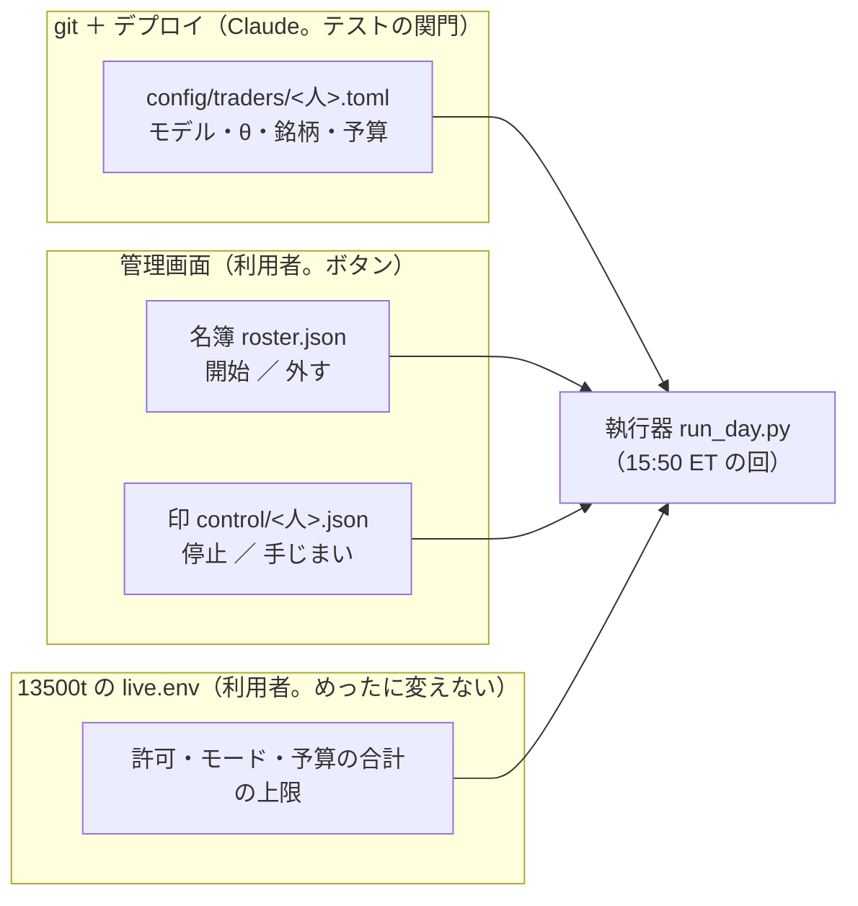
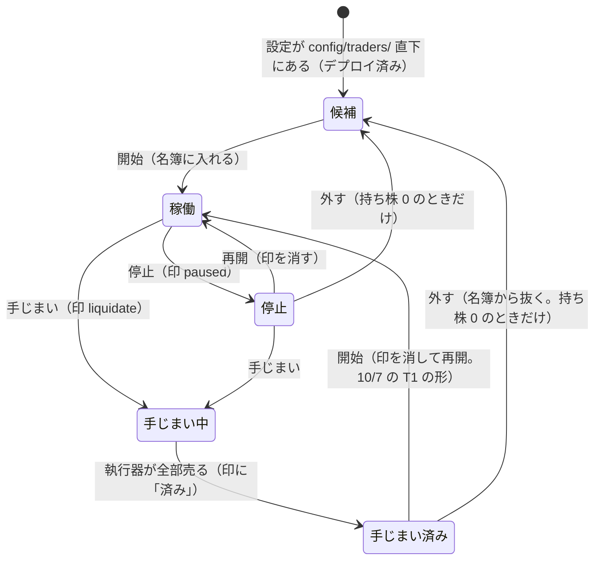
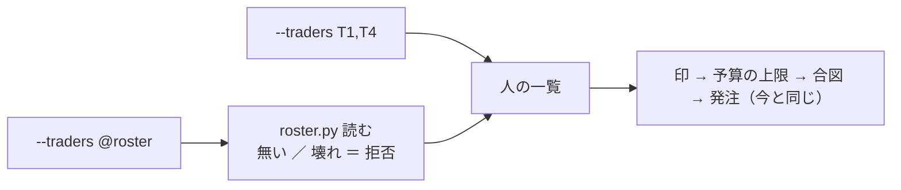
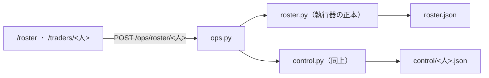
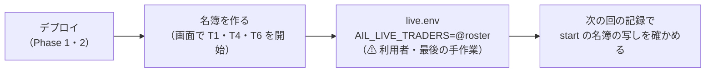

# トレーダーの開始・停止・手じまい・外すを管理画面で行う（名簿）

## 0. 目的・背景

利用者の指示（2026-10-07）: **「トレーダーを「作成 → 実践投入 → 分析」のループで回す」をやっているけど、一連の作業に手元のコマンドがあるのはよくない。必要なくなったトレーダーの停止や手じまいや、新しいトレーダーの開始は管理画面からの操作で行いたい。それを考慮した作りを考えて**

10/4〜10/7 の入れ替え（[trader-loop.md §3-4](trader-loop.md)）で手元のコマンドを打った場面:

| # | 場面 | いまの手段 | 誰が | 起きたこと |
| ---: | --- | --- | --- | --- |
| 1 | 誰を動かすか | 13500t の `live.env` の `AIL_LIVE_TRADERS` を sed | 利用者（`!`） | — |
| 2 | 予算の合計の上限 | 同じ `live.env` の `AIL_LIVE_EXTRA`（`--max-total-budget …`） | 利用者（`!`） | ⚠ 10/6 に引用符を忘れ、`run.sh` が REFUSE ＝ 1 日起動しなかった |
| 3 | 停止 ／ 手じまいの印 | `control.py set` ／ `clear`（10/6 から管理画面にもボタン） | Sx360 の Claude | — |
| 4 | 帳尻の確認 | `reconcile.py --env prod show`（docker compose run） | Sx360 の Claude | — |
| 5 | 手で売ったぶんを写す | `reconcile.py remove` × 9（予定だった。結局使わず） | 利用者 | — |
| 6 | 新しい人の設定 | `config/traders/` 直下へ写す → テスト → デプロイ | Claude | ⚠ これは手元のコマンドで良い（モデル・θ・銘柄を変える ＝ 新しい検証。テストの関門を通す） |

この図の主張: 「いつ・誰を動かすか」は管理画面で、「どんな人か（設定）」は git とデプロイで、と 2 本に分ける。

⚠ **変えない守り**: 管理画面に発注の経路は無いまま（2026-09-18）。画面が書くのは名簿と印だけで、売買は執行器の次の回が行う（10/5 の利用者決定「手じまいはフラグを立てるだけで翌日以降に行う事にする。手じまいを行うのは執行機のみ」と同じ考え方）。本番の許可（`TT_ALLOW_PROD_ORDERS`・確認文）と予算の合計の上限は `live.env` に残し、画面からは変えられない。

## 1. 作りの案

### 1-1. トレーダーの一生（画面に出す状態）

この図の主張: 画面のボタンは 5 つ（開始 ／ 停止 ／ 再開 ／ 手じまい ／ 外す）で、どの状態からどれが押せるかが決まっている。

| 状態 | 名簿 | 印 | 執行器の次の回 |
| --- | --- | --- | --- |
| 候補 | 居ない | — | 読まない（売買履歴があれば帳尻には数える ＝ いまと同じ） |
| 稼働 | 居る | 無し | 合図どおりに売買 |
| 停止 | 居る | `paused` | 飛ばす（持ち株はそのまま） |
| 手じまい中 | 居る | `liquidate` | 持ち株を全部売る・買わない |
| 手じまい済み | 居る | `liquidate`（済み） | 何もしない |

### 1-2. 名簿 `roster.json`（新しい。`HALT` の隣。⚠ 実装で `control/` の外に出した ＝ 印は `control/*.json` を全部読むので、中に置くと「roster」という人の印に見える）

- 中身: `{"traders": [{"name": "T1", "since": "...", "actor": "...", "reason": "..."}], "updated_at": ...}`。読み書きの正本は執行器の側に新しく置く `roster.py`（`control.py` と同じ形 ＝ 管理画面は道で読み込む。形を 2 か所に書かない）
- 執行器: `run_day.py --traders @roster` で名簿から人を引く（⚠ `--traders T1,T4` の明示はそのまま残す ＝ テスト・sim・手で流す回は 1 ビットも変わらない）
- ⚠ **名簿が無い ／ 壊れている ＝ 起動を拒む**（「誰も居ない」と読んで黙って何もしない、をしない。`check.sh` が `rc≠0` で知らせる）
- 名簿が空（全員を外した）＝ 起動して何もしない（`end` に 0 人）
- `live.env` は `AIL_LIVE_TRADERS=@roster` に 1 度だけ書き換える（移行。⚠ 利用者の最後の手作業）

### 1-3. 予算の合計の上限

- 上限そのものは `live.env` のまま（入金と一緒にしか変わらない ＝ 口座の外の作業と同じ日に利用者が書く。画面から上限を上げられると、画面の操作だけで使う額が増える）
- 画面は「前の回の上限」を記録（`events.jsonl` の `start` に上限を足す）から読み、**開始を押す前に** 稼働の人の予算の合計 ＋ 新しい人 ≤ 上限 かを見て、超えるなら書かない
- 執行器の側（⚠ 決めごと K2）: いまは超えると回ごと拒否（rc=2）。名簿で人が増える形では **1 人の追加で全員が止まる** ので、「名簿に後から入った人から外して、残りで回す（`over_total_budget` の事象）」に変える案

### 1-4. 画面

| 場所 | 足すもの |
| --- | --- |
| 新しい面 `/roster`（ローカル面と `cloudflare-local`。公開面は 404） | 全員の一覧（候補も）・状態・予算・持ち株・次の回で起きること・ボタン。上に「予算の合計 ／ 上限（前の回）／ 口座の現金」 |
| トレーダーの詳細 | いまの「この人の印」を「この人の状態」に広げる（開始 ／ 外す を足す） |
| 帳尻（読むだけ） | 執行器が毎回書く 口座 − 売買履歴 と控えの未完を出す（`reconcile.py show` を打たなくてよくする。⚠ 画面から API は叩かない ＝ 記録を読むだけ） |

歯止めは印と同じ: CSRF ／ 確認の欄に識別名を打つ ／ 知らない人は 404 ／ `test = true` の人は本番では開始できない ／ 操作の履歴（`ops/history.jsonl`・Access の email）／ ⚠ **`run.lock` を執行器が持っている間は書かない**（回の途中で名簿が変わらない）／ シミュレーションモードでは sim の木の名簿。

### 1-5. 手元に残るもの（なくさない理由）

| 残るもの | 理由 |
| --- | --- |
| 新しい人の設定（`config/traders/` 直下へ・テスト・デプロイ） | 設定を変える ＝ 新しい検証。テストの関門を通す（画面で設定を書かせない） |
| `live.env` の許可・モード・上限 | 本番の許可を出すのは利用者だけ・上限は画面の操作の外側の守り。⚠ 書き換えるのは入金で上限を変える日だけ |
| `reconcile.py remove` ／ `add` | 口座で手で売買したときの写し。印で手じまいする形ならもう使わない |
| `liquidate.py` | 印を待たずにすぐ売るとき（市場時間中の非常時）。画面には載せない（発注の経路になる） |

## 2. Phase と Step

### Phase 0: 決めごと（⚠ 利用者）

✅ 2026-10-07 利用者決定 **「推す案でok」** ＝ K1〜K5 とも下の推す案。

| # | 決めること | 推す案 |
| --- | --- | --- |
| K1 | 名簿を画面で書く形にするか（この作りでよいか） | 1 章のとおり |
| K2 | 予算の合計が上限を超えたときの執行器 | 後から名簿に入った人から外し、残りで回す（いまは全員を止める） |
| K3 | 開始・外すが効く時刻 | 印と同じく「次の回から」（15:45 ET より前に押せばその日の回）。`run.lock` の間は書かない → ⚠ 実装: 画面は `run.lock` を取れない（一瞬でも取ると本物の執行器が拒否される）ので、**営業日 15:40〜16:10 ET** は書かない（執行器は名簿を回の頭で 1 度だけ読む ＝ 途中で書いてもその回は変わらない） |
| K4 | 予算を画面で変えられるようにするか | ⚠ この作業ではしない（予算は設定ファイルのまま ＝ デプロイ）。要るなら別の作業 |
| K5 | 上限を `live.env` に残すか | 残す（画面から上げられない ＝ 外側の守り） |

### Phase 1: 名簿の正本と執行器（Claude）

この図の主張: 執行器が人を決める道が 1 本増えるだけで、決めた後の道は今と同じ。

- `experiments/live-trading/roster.py`（`show` ／ `add` ／ `remove` の CLI も。テストと非常時用）・`tests/test_roster.py`
- `run_day.py --traders @roster`・`start` の事象に上限と名簿の写し・K2 の形・`tests/test_run_day_roster.py`（モック）
- 帳尻の結果を毎回の記録に残しているかを確かめ、無ければ足す（画面が読む）
- `./run-tests.sh --full`（⚠ 黄金の集計値は変わらないこと ＝ `--traders` を明示する経路は 1 ビットも変えない）

### Phase 2: 管理画面（Claude）

この図の主張: 画面は名簿と印のファイルを書くだけで、執行器の正本の関数を道で読む。

- `/roster`・トレーダーの詳細の「この人の状態」・帳尻の欄・`glossary.toml` の語・`dashboard.md` §13 に節
- テスト: 状態ごとに押せるボタン・上限の事前確認・`run.lock` 中の拒否・公開面 404・CSRF・`test` の人の拒否・POST の経路の番人テスト

### Phase 3: 移行（利用者 ＋ Sx360 の Claude）

この図の主張: 手作業は「名簿を作る → `live.env` を 1 度だけ書き換える」の 2 つで終わり、以後は画面だけ。

- ⚠ 15:00〜16:15 ET を避ける。名簿を作ってから `live.env` を変える（逆だと 1 回起動を拒む）
- `run.sh` は `AIL_LIVE_TRADERS` をそのまま `--traders` に渡すので、g3plus-ops の変更は要らない【読み。`run.sh:75`】

### Phase 4: 手順書を書き直す（Claude）

- [trader-loop.md §3-4](trader-loop.md) の投入の手順・[howto-model-trader.md](../specs/howto-model-trader.md) 2-7・`live-trading.md` §0-2・CLAUDE.md を「画面で開始 ／ 停止 ／ 手じまい ／ 外す」に

## 3. 影響範囲

- 執行器: `run_day.py`（人の決め方・K2）・新しい `roster.py`。⚠ `--traders` を明示する経路は変えない
- 管理画面: `ops.py`・`main`（経路）・templates・`glossary.toml`
- 13500t: `live.env` の 1 行（利用者）。g3plus-ops は変えない
- 文書: `live-trading.md` §0-2・`dashboard.md` §13・手順書・CLAUDE.md

## 4. テスト方針

- 執行器: 名簿の読み書き（無い ／ 壊れ ／ 空）・`@roster` で引いた人が明示と同じ動きをする・K2・`HALT` と印が優先のまま・黄金の集計値が変わらない
- 管理画面: ボタンと状態の対応・上限の事前確認・`run.lock` 中・公開面 404・`test` の人・履歴
- 本番の前に Sx360 のシミュレーション（`sim4` の人で名簿を作り、画面から開始 ／ 停止 ／ 手じまい ／ 外すを 1 巡）

## 5. 作業量・費用【推測】

- Claude の作業: Phase 1 が半日・Phase 2 が半日〜1 日・Phase 4 が 1〜2 時間
- 費用 0（新しい契約・サービスなし）。⚠ 本番の売買に効くので Phase 1・2 は「デプロイ」が要る
