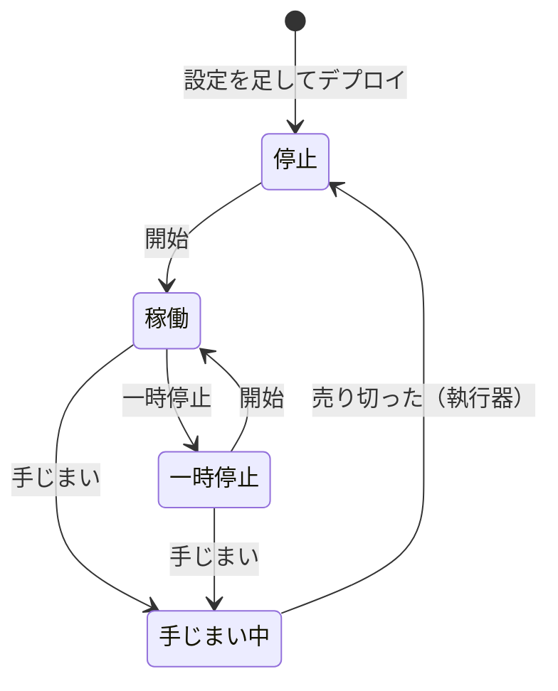
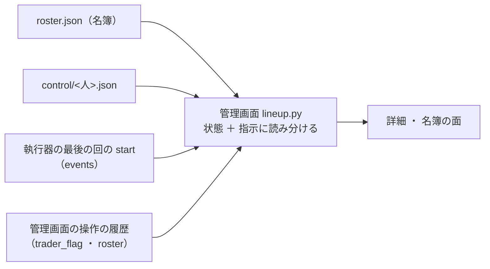

# トレーダーの状態と指示を整理する（「印」「候補」をやめる）

2026-10-08〜09。利用者の指示: 「トレーダーに印を付けるという表現があるけど、印が分かりにくいので別の表現にする」→「状態と状態変更の指示だとどんな感じになる？」→「状態のフローをまとめたい。また『候補』は分かりにくい。『候補』を何もしていないということで『停止』にしたいが既にある。この辺りを整理する」→ ✅ **「その案でよいと思うので書き直して」**（2026-10-09。§1・§2 の形）。

## 0. 目的・背景

今の管理画面のトレーダーの見え方には、分かりにくい点が 4 つある。

| # | いま | 分かりにくさ |
| ---: | --- | --- |
| 1 | 「印」（停止 ／ 手じまい。`control/<人>.json`） | 何をするものか言葉から分からない。中身は状態そのもの（名簿の「状態」は名簿 ＋ 印から決めて出しているだけ ＝ `lineup.status_of`） |
| 2 | 「候補」（設定はあるが名簿の外） | 何かの候補に選ばれたように読める。実際は「動かしていない人」 |
| 3 | 「停止」が 2 種類 | 名簿の「停止」は持ち株を持ったまま休む。名簿の外の人（候補）も実際には止まっている |
| 4 | 「手じまい済み」と「候補」 | どちらも持ち株 0・売買しない。違いは名簿に入っているかだけで、利用者には区別の意味がほとんど無い |

加えて、ボタンを押してから執行器の次の回までは「押したけど、まだ効いていない」が画面で分からない（10/8 の「開始」で同じ種類の分かりにくさがあった）。

## 1. 決めた形: 状態 4 つ ＋ 指示 3 つ（✅ 2026-10-09 利用者決定）

### 1-1. 状態（執行器が今その人をどう動かしているか）

| 状態 | いまの状態 | 中身 | 持ち株 |
| --- | --- | --- | --- |
| **停止** | 候補 ＋ 手じまい済み | 動かしていない | **0**（必ず） |
| **稼働** | 稼働 | 合図を読んで毎日売買する | あり ／ なし |
| **一時停止** | 停止 | 持ち株を持ったまま休む | そのまま |
| **手じまい中** | 手じまい中 | 持ち株を全部売っている途中（売り残りは翌日も続ける）。売り切ると **停止** | 減っていく |

### 1-2. 指示（人がボタンで出す変更。執行器の次の回から効く）

| 指示 | 出せる状態 | 次の回からの状態 |
| --- | --- | --- |
| ▶ **開始** | 停止 ・ 一時停止 | 稼働 |
| ⏸ **一時停止** | 稼働 | 一時停止 |
| 🧹 **手じまい** | 稼働 ・ 一時停止 | 手じまい中 → 売り切ったら停止 |

- 「外す」「再開」のボタンは無くす（外す ＝ 手じまいが済めば停止になる ／ 再開 ＝ 開始と同じ）
- 指示は **次の回を通ったら画面から消え、状態に変わる**。通る前は「指示: … — 次の回（日付 12:50 PDT（15:50 ET））から」と出し、**指示を取り消す** ボタンを置く

### 1-3. 状態のフロー

この図の主張: 人が出す指示は 3 つだけで、執行器が自分で変えるのは「手じまい中 → 停止」だけ。



### 1-4. 画面の例（トレーダーの詳細）

```
状態: 稼働
指示: ⏸ 一時停止 — 10/8 17:25 PDT に出した（理由: 入金待ち）
      → 次の回 10/9 12:50 PDT（15:50 ET）から効く        [指示を取り消す]
```
次の回を通った後:
```
状態: ⏸ 一時停止（10/9 の回から・持ち株はそのまま）
指示: なし                         [▶ 開始] [🧹 手じまい]
```
帯: 「T4 に『一時停止』の指示を出した。次の回（10/9 12:50 PDT）から状態が変わる」

## 2. 中の作り（⚠ 執行器の動きは変えない）

この図の主張: 置き場（名簿・`control/`）と執行器はそのままで、管理画面が「状態」と「指示」に読み分けて見せる。



### 2-1. 状態の決め方（今ある記録から）

| 名簿 | `control/<人>.json` | 状態 |
| --- | --- | --- |
| 外 | （なし） | 停止 |
| 中 | なし | 稼働 |
| 中 | `paused` | 一時停止 |
| 中 | `liquidate`・`done` なし | 手じまい中（⚠ 指示が回を通る前は「指示: 手じまい」・状態は前のまま） |
| 中 | `liquidate`・`done` あり | 停止 |

### 2-2. 指示が「まだ回を通っていない」の決め方

- 指示の時刻（印の `since` ／ 名簿の「いつから」／ 取り消しは操作の履歴の時刻）が、**執行器の最後の回の `start` より後** なら「指示（次の回から）」。前なら状態に入れて、指示は出さない
- ⚠ 執行器の回の間（15:40〜16:10 ET）は今までどおり書かない（ボタンを押せない）

### 2-3. ボタン → 書くもの（置き場の形は変えない）

| 指示 | いまの状態 | 書くもの |
| --- | --- | --- |
| 開始 | 停止（名簿の外） | 名簿に入れる（`roster.py add` と同じ） |
| 開始 | 停止（手じまい済み） | 印を消す ＋ 名簿の「いつから」を今に付け直す（予算の上限で休む順を、後から入った人として扱う） |
| 開始 | 一時停止 | 印を消す |
| 一時停止 | 稼働 | 印 `paused` |
| 手じまい | 稼働 ・ 一時停止 | 印 `liquidate` |
| 指示を取り消す | （回を通る前の指示） | 指示の前の形に戻す（印を消す ／ 戻す・名簿から外す） |

- ⚠ 手じまいが済んだ人（`liquidate` ＋ `done`）は名簿に残したまま「停止」と見せる（名簿から外すのは管理画面が勝手にやらない ＝ 書くのはボタンを押したときだけ）
- ⚠ `HALT`・予算の上限で休む日（`over_total_budget`）・口座と売買履歴が合わない銘柄は、今までどおり状態に出さない（その日の動きの注記）

## 3. 言葉の範囲

| 変える（人が読む文） | 変えない |
| --- | --- |
| 管理画面: 詳細「この人の印」→ 状態 ＋ 指示・名簿の面（列「状態」「いつから ／ 印」・ボタン・確認のダイアログ・説明）・帯（`main.py`）・`lineup.py` の `STATUS` と押せない理由 | 置き場 `roster.json`・`control/<人>.json`・`control.py` ／ `roster.py` のコマンド名・URL（`/ops/traders/<人>/flag`・`/ops/roster/<人>`）・記録の `trader_flag` ／ `paused` ／ `liquidate`・コードの識別子 |
| 用語 `glossary.toml`: 「人ごとの印（停止 ／ 手じまい）」→ **「トレーダーの状態」** と **「状態を変える指示」**（`info(...)` も） | ⚠ 別の意味の言葉: 「本番の機械ではない」印・仮データの印・`HALT` の停止ボタン・vibeboard のトレーダーのタブの「（候補）」（`candidates/*/` に居る人 ＝ 本番の設定に入っていない人） |
| 執行器の人が読む文: `control.py` ／ `roster.py` の表示と help・`run_day.py` の事象の `note`（「停止の印があるので…」→「一時停止中なので…」など） | 過去の記録・済んだプラン・`DONE.md` |
| 文書: `dashboard.md` §13-9・§13-10・`live-trading.md`・`howto-model-trader.md`（2-7 の手順）・CLAUDE.md（言葉の表に 1 行・名簿と人ごとの印の段落） | |

⚠ 用語の名前を変えると `dashboard/tests/test_help.py` が落ちる（`info("…")` と `glossary.toml` を同時に直す）。⚠ `dashboard.md` の見出しを変えたら `where` を grep で拾って直す。⚠ ⚠ 「停止」は `HALT`（機械全体の停止ボタン）にも使っている ＝ 画面ではトレーダーの状態に「停止」、`HALT` は「全体の停止」と書き分ける（帯 ・ `/ops`）。

## 4. Phase と Step

| Phase | 中身 | 誰 |
| --- | --- | --- |
| 0 | 形を決める（§1） | ✅ 利用者（2026-10-09「その案でよいと思うので書き直して」） |
| 1 ✅ | `lineup.py`: 状態 4 つ ＋ 指示の読み分け（§2-1・§2-2）・押せる ／ 押せない理由・`ops.py` ／ `main.py` のボタン → 書くもの（§2-3）・テスト（状態表の全行・指示が回の前後で切り替わる・取り消し・手じまい済みからの開始） | Claude |
| 2 ✅ | 画面: 詳細の「状態 ／ 指示」・名簿の面・帯・`glossary.toml`・`test_help.py` ほかの文字の照合 | Claude |
| 3 ✅ | 執行器の人が読む文（`control.py`・`roster.py`・`run_day.py` の `note`）・執行器のテスト | Claude |
| 4 ✅ | 文書（`dashboard.md`・`live-trading.md`・howto・CLAUDE.md）→ `./run-tests.sh`（＋ `--full` で黄金の集計値が変わらないこと）→ コミット | Claude |
| 5 | 「デプロイ」→ 本番の管理画面で `test_a` を使って 1 度通す（開始 → 指示の表示 → 取り消し） | 利用者の依頼 → Claude ／ 画面の操作は利用者 |

## 5. 影響範囲

- 管理画面（`dashboard/app/lineup.py`・`ops.py`・`main.py`・テンプレート 2 つ・`glossary.toml`）と、執行器が書く `note` ／ CLI の表示の文字
- ⚠ 執行器の判断・発注・記録の項目は変えない（黄金の集計値は変わらない）。置き場の形も変えない ＝ 今の 13500t の `roster.json` ・ `control/T3.json`（手じまい済み）はそのまま読める（`T3` は「停止」と出る）
- 本番に効くのはデプロイの後

## 6. テスト方針

- `dashboard/tests/test_roster.py`・`test_flags.py`: §2-1 の表の全行・§2-2 の前後・§2-3 の各ボタンが書くもの・押せない理由・回の間は書かない
- `experiments/live-trading/tests/test_run_day_flags.py`・`test_roster.py`: 文字の照合だけ（動きは同じ）
- `./run-tests.sh --full`（黄金の集計値が変わらないこと）
- 直した後に `grep -rn "印\|候補" dashboard/app experiments/live-trading/*.py` で、別の意味のものだけが残っていることを目で確かめる

## 7. 作業量・費用【推測】

Claude の作業 半日〜1 日。費用 0。

## 8. 進み具合（2026-10-09 titan）

- Phase 1〜3 ✅・Phase 4 は CLAUDE.md を除いて ✅。`./run-tests.sh --full` 全部 ✅（執行器 202 ／ 管理画面・selftest・mockrun・黄金の集計値 12。黄金は変わらず ＝ 執行器の動きは変えていない）【実測】
- 実装で決めたこと（プランに無かった細部）:
  - 「回を通ったか」は **発注の回**（`start` の `mode = submit`）の `now_et` と比べる（plan ・ dry-run の回では指示を状態に入れない）。発注の回の記録が 30 日に無ければ、指示は待ったまま
  - 指示の前の形（`prev`・`prev_flag`・`prev_entry`・`prev_index`・`roster_touched`）を操作の履歴に残し、取り消しはそれに戻す（`control.restore_flag`・`roster.restore` を足した。置き場の形は同じ）
  - 回を通る前の指示がある人に出せるのは「取り消す」だけ。手じまい中の人は指示なし
  - 開始の上限の確かめは「次の回に買う人」（回を通る前の開始も入る）で見る。一時停止 → 開始も確かめる（前の「再開」は確かめていなかった）
  - CLI（`control.py` ・ `roster.py`）で書いた変更は履歴に残らないので、画面ではすぐ状態として出る
  - シミュレーションモードは仮の時計なので指示を待たせない
  - 概要の札: 名簿がまだ無い機械では、名簿の外の人を「停止」と札にしない
- ✅ 2026-10-09 CLAUDE.md も直してコミット → デプロイ（利用者の依頼）。残り: Phase 5 の `test_a`（画面の操作は利用者）
