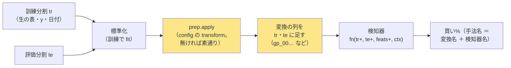

# 変換（GA など 6 本）を検知器の経路にも通す口（2026-10-09 利用者決定「A で進めて」）

派生元: TODO「進化的探索を他のモデル・経路に広げる」の子「検知器に『変換済みの列を受け取る』口を足すか決める」。
利用者の問い（2026-09-16）: **遺伝的アルゴリズムは既存のモデル全てに当てはめることはできる？** → (a) モデル 9 本には当てはまる ／ ⚠ 検知器 23 本には届かない（[evolutionary-search.md §8](../specs/experiments/evolutionary-search.md)）。
2026-10-09 の比較（A 汎用の口 ／ B 足さない ／ C 合成の検知器 1 本）で、利用者の決定 **「検証の幅が広がる汎用的な方」＝ A**。

## 0. 目的・背景

- 変換（`transform`。F4-1 記号回帰〔GA〕・F4-3 tsfresh・F4-4 多項式・F5-1 PCA・F5-3 行列プロファイル・F5-4 ウェーブレットの **6 本**）は、いまは **選別 × モデルの経路**（`fold_buy_pct` の形式 (A)(B) の枝）にしか挟めない
- 検知器（rules.md 15 章。買い% を自分で作って返す手法）の枝は `prep.apply` より**前**にあり、生の表（`tr`・`te`・`feats`）を受け取る ＝ 変換の列が届かない
- 問い: **変換の列は検知器にも効くか**（まずは GA × 順方向の門 `fwd`）。⚠ GA 自身は 18 行 0 勝（[§1・§8・§9](../specs/experiments/evolutionary-search.md)）だが、rules.md 14-10「可能性が低いから回さない」は理由にならない
- ⚠ **幅の上限を先に書く**: 口を足しても **列を自分で選ぶ検知器には届かない**。届くのは**表の全列を読む検知器**だけで、いまは `H1 先10日ゲート（全列・学習）`（`fwd`）の 1 本

| 検知器 | 読む列 | 口から届くか |
| --- | --- | --- |
| `fwd`（H1 先 10 日ゲート） | `feats` の全部（`y_fwd_` 接頭辞を除く） | ✅ 届く |
| `scale`・`pair`（D1〜D4・C1〜C3・入口 ／ 出口の窓） | `own_trend{窓}_` の 6 列固定 | ⚠ 届かない |
| `tsc`・`seqmodel`・`exomodel`（時系列分類器・PatchTST・外生系列モデル） | 観測期間の**配列**（`seq.window_columns`） | ⚠ 届かない |
| `stop`（損切りをモデルにする） | 入口 ＝ `own` 接頭辞・損切り ＝ `own_trend20_` の 2 列 | ⚠ 届かない |

⚠ ここまで広げるには検知器ごとの直し ＝ **別の処置・別の検証**（このプランには入れない）。

## 1. 対応方針

この図の主張: 口は `fold_buy_pct` の検知器の枝の頭に 1 か所。変換の fit は fold の訓練分割の内側で、出力の列を表に**足して**（置き換えない）検知器に渡す。

| # | 決めごと | 中身 |
| ---: | --- | --- |
| 1 | 場所 | `cli/run.py` の `fold_buy_pct`、`if detectors:` の枝の頭。⚠ **config に `transform` が無ければ 1 ビットも変えない**（既存の 21〜23 章と同じ形） |
| 2 | 変換の fit | 訓練分割で `StandardScaler` → `prep.apply(exp, Xtr, Xte, ctx, ytr, ts_tr)`（形式 (A) の枝とまったく同じ呼び方。y と日付は訓練のものだけ） |
| 3 | 列の足し方 | **足す**（置き換えない）。変換が返した列（GA なら `gp_00…`・PCA なら `pc_…`）を `tr`・`te` に同じ名前で足し、`feats + 新しい列` を検知器に渡す。⚠ 既存の列名と重なれば止める。⚠ 置き換えない理由 ＝ 検知器は自分の列を接頭辞で選ぶ（`own_trend…`）ので、元の列が無いと動かない |
| 4 | 標準化の二重 | 検知器は中で自分の列を標準化する。変換の列は既に z 化されている（GA は `conv` で訓練の平均・分散で割る）ので無害 |
| 5 | 手法名（識別項目） | `prep.label(exp, 検知器名)` ＝ **「変換名 ＋ 検知器名」**（GA × LightGBM の §8 と同じ形。先頭の ID で F4 ／ F5 の系統に入る）。`fitness` を替えた行は `〔適合度・…〕` も付く（23 章のまま） |
| 6 | 係数の記録 | `fitted_doc["_transform"]` に変換の係数（式の木・列）。⚠ 次の実行では読み込まない（3 章 B） |
| 7 | 本番の経路 | `cli/predict.py` も `fold_buy_pct` を通る ＝ `transform` ＋ `detectors` を持つ実験なら本番でも同じ列が足される。⚠ いまの本番の 4 本（`trade_own_ridge_a`・`trade_ownex_lgbm_a`・`trade_ownseq_ridge_a`・`sel_small4_1995`）に `transform` は無い ＝ 指紋は動かない |
| 8 | 規約 | rules.md に **24 章「変換を検知器に通す口」**（短く: 場所・足す・届く範囲・数え方）。15-1 に「変換の列が足されて来ることがある」を 1 行 |
| 9 | 数え方 | 閾値売買の行 ＝ θ 1 水準 1 検証（13-9）。**Phase 2 ＝ GA × `fwd` × θ 3 ＝ n_trials ＋3**。leak 対照 1 本（数えない）。Phase 3 の水準は回す前に §3 に書く |

## 2. Phase と Step

| Phase | 誰 | 中身 | 済み |
| --- | --- | --- | --- |
| 0 | Sx360 の Claude | プランと TODO（このファイル） | ✅ 2026-10-09 |
| 1 | titan の Claude | 口の実装（`cli/run.py`）・テスト（§4）・rules.md 24 章 ／ 15-1 の 1 行 | |
| 2 | titan の Claude | **GA × `fwd`** を回す: config `trade_own_fwd10_gp_ridge_a.toml` ＝ `features_from = "trade_own_fwd10_ridge_a"`（`own` 層 ＋ `label_scales = [10]` の既存の表。表は作り直さない ＝ 13-8）・`transform = "F4-1 記号回帰（遺伝的プログラミング）"`・`detectors = ["H1 先10日ゲート（全列・学習）"]`・`model = "Ridge"`・θ 50 ／ 55 ／ 60・種 0。`cli.queue` で本番 1 ＋ leak 1 → 記録 `docs/specs/experiments/transform-into-detectors.md`（§0 事前固定 → §1 結果 → 検算 n_trials ＋3）→ `cli.report --catalog` で検証結果一覧を吐き直す | |
| 3 | ⚠ 利用者の了承 → titan | 残り 5 変換 × `fwd` × θ 3（＋15）。⚠ **水準と費用を §3 に書いて了承を取ってから回す**（tsfresh・行列プロファイルは「手間 大」の実績を見る） | |
| 4 | 利用者 → Sx360 | 「デプロイ」（`cli/run.py` が本番の予測の経路なので）→ TODO の子を DONE へ・プランを archive へ | |

## 3. Phase 3 の水準（⚠ 回す前に書く。まだ書いていない）

Phase 2 の結果を見た**後に**水準を足すことになるので、⚠ **Phase 2 の結果で Phase 3 の水準を選ばない**（6 本全部か、回さないか。間を取らない）。費用は各変換の記録（`ledger-blanks-large-two.md`・`selectors-small-four.md`）の実測から写す。

## 4. テスト方針

| # | テスト | 固定すること |
| ---: | --- | --- |
| 1 | 指紋（既存）`tests/test_trading_run.py::test_default_path_fingerprint_is_unchanged`・`tests/test_predict.py` | `transform` の無い config は選別 × モデルの経路が 1 ビットも変わらない |
| 2 | 指紋（足す） | `transform` の無い検知器の config（`fwd`）の買い% が実装の前後で同じ（前の値を写して固定） |
| 3 | 口が開く | モックの検知器が受け取る `feats` に変換の列が入り、`tr`・`te` にその列がある・元の列も残っている・手法名が「変換名 ＋ 検知器名」 |
| 4 | 先読み（14-11 規約 3 と同型） | 評価分割を差し替えても `fitted["_transform"]` の式が変わらない（検知器の経路で） |
| 5 | leak 対照 | `LEAK_` の列は変換の入力に入る → 上乗せが跳ねる（既存の `test_leak_makes_the_edge_jump…` の形） |
| 6 | 名前の衝突 | 変換の列名が既存の `feats` と重なれば止まる |

## 5. 影響範囲

- 変わる: `experiments/feature-discovery/cli/run.py`（`fold_buy_pct` の検知器の枝）・`tests/`・`rules.md`・`config/experiment/` に 1 本・記録 1 本・`ledger.md`（吐き直し）・`ledger_rows`
- 変わらない: 検知器 7 ファイル・`prep.apply`・`cli/predict.py`・本番 4 本の config・既存の実行と検証結果一覧の行
- ⚠ 本番: `cli/run.py` は 13500t の毎日の予測が通る ＝ Phase 4 でデプロイ（指紋テストが通ってから・15:00〜16:15 ET の外）

## 6. 作業量・費用【推測】

| Phase | 時間 | 費用 |
| --- | ---: | ---: |
| 1 | 半日（titan） | 0 |
| 2 | 回すのは 1〜2 分（GA 1 fold 0.3〜0.9 秒・`fwd` Ridge は数十秒【§6・forward10 の実測から】）＋ 記録 1 時間 | 0 |
| 3 | 変換により数分〜数時間（tsfresh・行列プロファイルは別）。了承の後に書く | 0 |
| 4 | デプロイ 20 分 | 0 |
