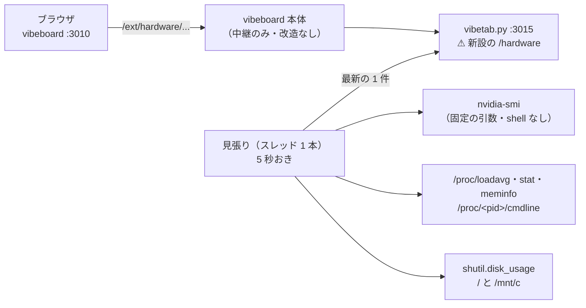
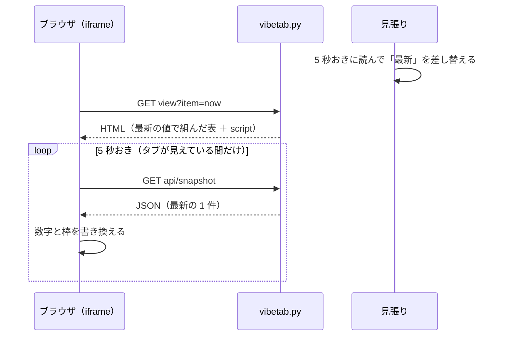
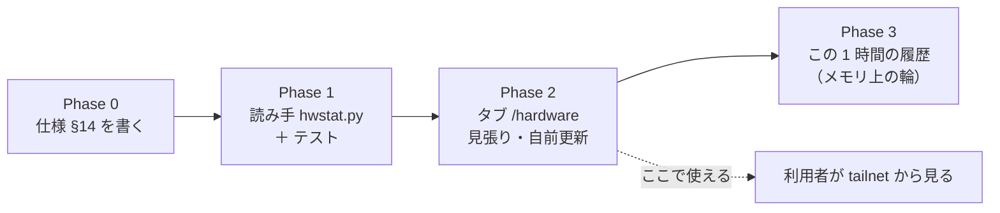

# vibeboard に「ハード」のタブを足す（GPU を含んだ機械の利用状況）

作成日: 2026-09-18。TODO「vibeboard に GPU を含んだハードの利用状況のページを追加」（利用者の指示 2026-09-18）。
利用者の確認（2026-09-18）: ⚠ **vibeboard 本体ではなく、このプロジェクト専用の機能として入れる。**

## 1. 目的・背景

検証（`experiments/feature-discovery/`）は 3090 Ti と 32 スレッドを何時間も使う。
⚠ **いま機械の状態を見るには ssh で入って `nvidia-smi`・`nvtop`・`btop` を叩くしかなく、
tailnet 越しに vibeboard（`http://titan-income-vibeboard`）を見ているときは何も分からない。**

| 知りたいこと | 今どうしているか | ⚠ 困ること |
| --- | --- | --- |
| GPU は回っているか・メモリは足りるか | `nvidia-smi` を端末で叩く | 端末が要る。検証タブで run を見ている横で確かめられない |
| 背景のキューは生きているか | `ps`・`nvidia-smi` の PID を突き合わせる | ⚠ **WSL2 では GPU のプロセス名が `[Not Found]`**【実測 2026-09-18】で、PID から自分で引く必要がある |
| ディスクは足りるか | `df -h` | ⚠ **`C:` は 1.8T / 1.9T ＝ 99%・残り 33G**【実測 2026-09-18】。気付く場所が無い |

作るのは**いまの状態の写し**であって監視システムではない（通知・閾値の警報・長期の記録は持たない）。

### 1-1. 着手前に実測したこと（2026-09-18・titan の WSL2）

| 項目 | 結果【実測】 | プランへの効き方 |
| --- | --- | --- |
| `nvidia-smi --query-gpu=… --format=csv,noheader,nounits` の所要 | **0.058 秒** | 5 秒おきに叩いても 1 コアの約 1% |
| `--query-compute-apps=pid,process_name,used_memory` | `203676, [Not Found], [N/A]` | ⚠ **名前とプロセス別メモリは取れない。PID だけ取れる** |
| その PID を WSL 側で `ps -p` | 引けた（`…/.venv/bin/python -m cli.run --experiment …`） | ⚠ **名前は `/proc/<pid>/cmdline` から引ける** |
| `fan.speed` | `0`（60℃ でも 0） | そのまま写す（0 が本当かは判定しない） |
| `sensors` | 入っていない | ⚠ **CPU 温度は出さない** |
| `psutil`・`pynvml` | 入っていない | 足さない。`/proc` と subprocess で読む |
| `vibeboard/src/ext.ts` の中継 | `/ext/<name>/` 以下の**任意のパス**を baseUrl へ流す（`..` だけ弾く） | ⚠ **3 エンドポイント以外の経路（`api/snapshot`）を足しても本体の改造は要らない** |
| customTabs の契約（`vibeboard/README.md`） | `item-changed` に `"reload": false` を付けると、親は iframe に触れず**プラグインが自前で更新する** | 数秒おきの更新で iframe を作り直さずに済む |

## 2. 対応方針

検証・データ・用語のタブと同じ作り（[vibeboard-experiments-tabs.md](archive/vibeboard-experiments-tabs.md)）に 4 枚目を足す。
⚠ **vibeboard 本体（`vibeboard/`・akiraak/vibeboard）は触らない。** 触るのは `vibeboard.config.json` と `dashboard/` の下だけ。

> この図の主張: ⚠ **値を読むのは sidecar の中の見張り 1 本だけ。** 画面は写しを取りに来るだけで、見る人が増えても `nvidia-smi` を叩く回数は変わらない。

### 2-1. 決めごと（TODO の「着手時に決める」をここで決める）

| # | 決めごと | ⚠ 理由 |
| ---: | --- | --- |
| 1 | ⚠ **このプロジェクト専用。** customTabs に `hardware`（label「ハード」）を足し、中身は `vibetab.py` の 4 本目のタブ | 利用者の確認（2026-09-18）。本体に入れると vendor と本体の二重管理になり、`nvidia-smi`・WSL2 の事情を本体に持ち込むことになる |
| 2 | 読み手は **`dashboard/hwstat.py`** に分ける（標準ライブラリのみ・純関数の parse ＋ 薄い読み出し） | `vibetab.py` は既に約 1,000 行。⚠ **`dashboard/app/` の下には置かない**（`app/` は g3plus に載る。ハードの状態は titan の話で、公開面に出す理由が無い） |
| 3 | **更新は画面が自前で行う**: `view` の HTML に小さな inline script を入れ、`api/snapshot`（JSON）を **5 秒おき**に相対パスで取って数字を書き換える。`document.hidden` の間は止める | `item-changed`（reload）で 5 秒ごとに iframe を作り直すと、ちらつき・スクロール位置の初期化が起きる。README の契約が `reload: false` ＝ 自前更新を認めている |
| 4 | `api/watch`（SSE）は**繋がるだけ**（`: hello` と 30 秒おきの `: ping`）。`sidebar`・`item-changed` は投げない | 契約の 3 エンドポイントは満たす。サイドバーの項目は動かないので投げるものが無い |
| 5 | **値を読むのは見張りのスレッド 1 本**（`main()` で起こす。⚠ **import しただけでは起きない**）。`api/snapshot` は最新の 1 件を返すだけ | ⚠ **CPU 使用率は `/proc/stat` の 2 時点の差**でしか出ない。要求のたびに読むと、見る人数 × 回数だけ `nvidia-smi` が走る |
| 6 | 履歴は **メモリ上の輪（1 時間 ＝ 720 点）だけ**。⚠ **ディスクに書かない**。sidecar を入れ直すと消える（Phase 3） | 知りたいのは「席を外している間 GPU は回っていたか」で、1 時間あれば足りる【推測】。長期の記録は目的の外（§1）。置き場・保持期間・git 管理外の設定が要らなくなる |
| 7 | ⚠ **読めないものは欄を作らず、理由を 1 行書く**: `nvidia-smi` が無い ／ 3 秒で返らない ／ 終了コードが 0 でない → GPU の節に「読めない（理由）」を出し、⚠ **CPU・メモリ・ディスクの節は出し続ける**。値が `[N/A]` の列は「—」 | 「GPU が無い」と「画面が壊れている」を混ぜない（用語タブの規約 6 と同じ立て方）。⚠ **仮の数字で埋めない** |
| 8 | ⚠ **色を付ける閾値を自分で作らない。** GPU は `nvidia-smi` の `clocks_throttle_reasons.*`（熱・電力で絞られているか）をそのまま写す。ディスクだけ **使用率 90% 以上を `warn`** にする | 「83℃ で危険」のような数字に出典が無い。ドライバが言っている事実を写すほうが確か。ディスクの 90% は【推測】の目安で、spec にそう書く |
| 9 | GPU を使っているプロセスは **PID（`nvidia-smi`）→ `/proc/<pid>/cmdline`・経過時間・RSS** で出す。⚠ **cmdline は 160 字で切り、`token`・`secret`・`key`・`password` を含む引数の値は伏せ、HTML は必ず `esc()` を通す** | WSL2 では名前が取れない（§1-1）。⚠ **このタブは tailnet の閲覧者にも見える**ので、引数に秘密が紛れても出さない。プロセス名は他人が決められる文字列なので XSS の入口になる |
| 10 | ⚠ **`memory.used` の合計には Windows 側の使用分が混ざる**ことを画面に 1 行書く。プロセス別の GPU メモリの欄は作らない | WSL2 の制限【実測】。内訳が出ないのに合計だけ見ると「誰が使っているのか」で迷う |
| 11 | `nvidia-smi` は**固定の引数の配列**で起こす（shell を通さない・要求の値を引数に混ぜない）。`api/snapshot` は読むだけ | 中継後はループバック発に見えるので、⚠ **このサーバに「操作」を足さない**（CLAUDE.md の customTabs の注意と同じ理由） |

### 2-2. 画面

サイドバーは 1 項目（`now`「いまの状態」）で始め、Phase 3 で `history`「この 1 時間」を足す。

| 節 | 出す値 | 読む場所 |
| --- | --- | --- |
| GPU | 名前 ／ 使用率 % ／ メモリ 使用・全体（MiB・%）／ 温度 ℃ ／ 電力 W・上限 W ／ ファン % ／ P-state ／ 絞りの理由（立っているものだけ） | `nvidia-smi --query-gpu=name,utilization.gpu,memory.used,memory.total,temperature.gpu,power.draw,power.limit,fan.speed,pstate,clocks_throttle_reasons.active,…` |
| GPU を使っているプロセス | PID ／ 経過 ／ RSS ／ cmdline（切り詰め・伏せ字） | `--query-compute-apps=pid` ＋ `/proc/<pid>/{cmdline,stat,status}` |
| CPU | load average（1・5・15 分）／ 論理スレッド数 ／ 全体の使用率 % ／ スレッド別の使用率（32 個の小さな棒） | `/proc/loadavg`・`/proc/stat`（2 時点の差） |
| メモリ | 使用・空き（`MemAvailable`）・全体 ／ swap の使用・全体 | `/proc/meminfo` |
| ディスク | マウントごとの 使用・全体・%（`/`・`/mnt/c`。無いものは飛ばす） | `shutil.disk_usage` |
| 末尾 | 取得時刻 ／ 見張りの間隔 ／ ⚠ 読めないものの一覧（CPU 温度・プロセス別 GPU メモリ・Windows 側のプロセス） | — |

| 経路 | 中身 |
| --- | --- |
| `/hardware/api/sidebar` | `{"items": [{"id": "now", "label": "いまの状態"}]}`（Phase 3 で `history` を足す） |
| `/hardware/view?item=now` | 節ごとの表 ＋ 自前更新の inline script。知らない id は 404 |
| `/hardware/api/snapshot` | 最新の 1 件（JSON）。見張りがまだ 1 回も読めていなければ、その場で 1 回読んで返す |
| `/hardware/api/watch` | SSE（hello と ping だけ） |

> この図の主張: ⚠ **最初の表示はサーバが組んだ HTML、その後は JSON だけが流れる。** iframe は作り直されない。

## 3. 影響範囲

| ファイル | 変更 |
| --- | --- |
| `dashboard/hwstat.py` | **新規**。parse（純関数）: `parse_gpu_csv`・`parse_compute_apps`・`parse_proc_stat`・`cpu_usage(prev, now)`・`parse_meminfo`・`mask_cmdline`。読み出し: `read_snapshot(run=subprocess.run, proc=Path("/proc"))`（⚠ **実行と `/proc` の場所を引数で差し替えられる形**にして、テストが GPU を要らないようにする）。見張り: `Sampler`（スレッド・最新の 1 件・Phase 3 で輪） |
| `dashboard/vibetab.py` | `/hardware` の 4 経路を足す。`do_GET` のタブ一覧に `hardware`、`main()` で `Sampler` を起こす。⚠ **既存の 3 タブには触らない**。冒頭の docstring の経路一覧に追記 |
| `dashboard/tests/test_hwstat.py` | **新規**（§4） |
| `dashboard/tests/test_vibetab.py` | `/hardware` の HTTP 経路の検査を追加 |
| `vibeboard.config.json` | customTabs に `{"name": "hardware", "label": "ハード", "baseUrl": "http://127.0.0.1:3015/hardware"}`。⚠ **`command` は experiments 側だけ**（sidecar は 1 本） |
| `docs/specs/dashboard.md` | §14「ハードの画面」を書く（§12 と同じく ⚠ **管理画面（3012）には無い**と明記）。§9 更新履歴に 1 行 |
| `dashboard/glossary.toml` | 触らない（用語は増えない） |

⚠ **触らないもの**: `vibeboard/`（vendor）・akiraak/vibeboard（本体）・`dashboard/app/`（g3plus に載る側）・dashboard（3012）の面と契約。
⚠ **CLAUDE.md は触らない**（別セッションからの依頼でプロジェクトの決めごとは変えない）。
「vibeboard のこのプロジェクト固有の運用」の節に 1 行足すかどうかは、Phase 2 の後に利用者が判断する（案は Phase 2 の Step に書く）。

⚠ **踏みやすい罠**（[dashboard.md §12-3](../specs/dashboard.md)）: `vibetab.py` を直しても、⚠ **3015 に古い sidecar が居座っていると新しいものは上がらない**（タブに「接続できません: HTTP 404」）。ポートから引いて落とし、入れ直す。⚠ **3010 には触らない。**

## 4. テスト方針

`cd dashboard && .venv/bin/python -m pytest -q tests`（既存＋追加）。⚠ **テストは GPU・`nvidia-smi`・本物の `/proc` に頼らない**（実行と `/proc` を差し替える）。

| # | 見るもの | ⚠ 固定したいこと |
| ---: | --- | --- |
| 1 | `parse_gpu_csv` に【実測】の 1 行（`40, 1288, 24564, 44, 65.90, 480.00, 0, P3, 0x…01`）を通す | 数値の型・単位。⚠ **`[N/A]`・`[Not Supported]` は `None`**（0 にしない） |
| 2 | `parse_compute_apps` に `203676, [Not Found], [N/A]` を通す | PID だけ取れる。⚠ **プロセスが 0 件（空の出力）で落ちない** |
| 3 | `cpu_usage` に `/proc/stat` の 2 時点を通す | 全体とスレッド別の %。⚠ **差が 0（同じ時点）で 0 除算しない** ／ 1 時点しか無いときは `None` |
| 4 | `parse_meminfo` | `MemAvailable` を使う（`MemFree` ではない）。swap が 0 の機械で落ちない |
| 5 | `mask_cmdline` | `--token=abc`・`API_KEY=abc` の値が伏せられる ／ 160 字で切れる ／ NUL 区切りを空白に直す |
| 6 | `read_snapshot` の失敗の 3 通り（`FileNotFoundError` ／ `TimeoutExpired` ／ 終了コード ≠ 0） | ⚠ **GPU の節だけが「読めない（理由）」になり、CPU・メモリ・ディスクは入っている** |
| 7 | 消えた PID（`/proc/<pid>` が無い） | 行は出るが cmdline は「—」。落ちない |
| 8 | view の HTML に `` という名前のプロセスを流す | ⚠ **エスケープされて出る**（XSS にならない） |
| 9 | HTTP: `/hardware/api/sidebar`・`view?item=now`・`api/snapshot` が 200、`view?item=nope` が 404、⚠ **既存 3 タブの経路が変わっていない** | 経路の追加が他のタブを壊していない |
| 10 | `import vibetab`・`import hwstat` だけではスレッドが起きない | テストと他の import 元で見張りが勝手に走らない |
| 11 | （Phase 3）輪が 720 点で頭打ちになる ／ 空の輪で `history` が 200 | メモリが増え続けない |

手で見るもの（Phase 2 の最後）: `http://127.0.0.1:3010/#hardware/now` で数字が 5 秒おきに動く ／ 別のタブへ移って戻っても動く ／
`http://titan-income-vibeboard` 越しでも同じ ／ `nvidia-smi` を PATH から外して起こすと GPU の節だけが「読めない」になる。

## 5. Phase

> この図の主張: ⚠ **読み手（純関数）を先に固めてからタブに載せる。** 履歴は「いまの状態」が動いた後に足す別の段で、無くても Phase 2 で使える。

### Phase 0: 仕様を書く

1. `docs/specs/dashboard.md` に §14「ハードの画面」を書く: §2-1 の決めごと・§2-2 の節と経路・読めないものの一覧・⚠ **管理画面（3012）には無い**こと
2. `nvidia-smi --help-query-gpu` で、使う列の正確な名前（`clocks_throttle_reasons.*` は新しいドライバで `clocks_event_reasons.*` に改名されている可能性がある【未確認】）を titan の実機で確かめ、§14 に列の一覧を固定する

### Phase 1: 読み手 `dashboard/hwstat.py`

1. parse の純関数とテスト（§4 の 1〜5）
2. `read_snapshot`（実行と `/proc` の差し替え・失敗の 3 通り・消えた PID。§4 の 6・7）
3. 実機で 1 回読んで JSON を目で確かめる（`python3 dashboard/hwstat.py` で 1 件を標準出力に出す）

### Phase 2: タブ `/hardware`

1. `Sampler`（スレッド・5 秒・最新の 1 件・`main()` でだけ起こす。§4 の 10）
2. `vibetab.py` に 4 経路 ＋ `view` の HTML（表 ＋ スレッド別の棒 ＋ inline script。`document.hidden` で止める）。§4 の 8・9
3. `vibeboard.config.json` に `hardware` を足す
4. sidecar を入れ直す（⚠ **3015 をポートから引いて落とす**。§3 の罠）→ 手で見るもの（§4 の末尾）を通す
5. `dashboard.md` §9 更新履歴に 1 行。CLAUDE.md の「vibeboard のこのプロジェクト固有の運用」に足す 1 行の案を利用者に示す（⚠ **足すのは利用者の判断**）

### Phase 3: この 1 時間の履歴

1. `Sampler` に輪（`collections.deque(maxlen=720)`）を足す。持つのは GPU 使用率・GPU メモリ・温度・電力・CPU 全体・メモリの 6 本だけ（スレッド別は持たない）
2. サイドバーに `history`「この 1 時間」、`view?item=history` に 6 本の折れ線（inline SVG・外部リソースなし）。`api/history`（JSON）を自前更新で取る。§4 の 11
3. ⚠ **図を書く前に dataviz の skill を読む**（軸・色・明暗の両対応）
4. §14 に履歴の節を足す（⚠ **メモリ上だけ・sidecar を入れ直すと消える・ディスクに書かない**）

### 後片付け

親タスクを `DONE.md` へ移し、このファイルを `docs/plans/archive/` へ移す。

## 6. 先に指摘しておくこと

- ⚠ **金銭・契約・規約に触れるものは無い**（ローカルの機械の状態を読むだけ。外部サービスに何も送らない）
- ⚠ **tailnet の閲覧者に見える**: `http://titan-income-vibeboard` は tailnet の中なら誰でも開ける。出るのは機械の負荷とプロセスの cmdline（伏せ字つき）で、資格情報・口座・記録は出ない。⚠ **Funnel には出していない**（CLAUDE.md）ので外には出ない
- ⚠ **見張りは vibeboard が動いている間ずっと回る**: `nvidia-smi` 0.058 秒 × 2 本 ÷ 5 秒 ≒ 1 コアの約 2%【実測からの計算】。検証の実行時間に効く大きさではないが、0 ではない。気になれば間隔を `AIL_HW_INTERVAL_S` で伸ばせる形にする
- ⚠ **`C:` の 99% はこのタブでは直らない**（見えるようになるだけ）。WSL の vhdx が `C:` にあるなら `/` に書くほど `C:` が減る。置き場の確認と掃除は別のタスク

## 7. 実施の記録（2026-09-18）

利用者の指示「進めて」で Phase 0〜3 を実装した。⚠ **残るのは利用者が vibeboard を入れ直して、ブラウザと tailnet 越しで見ること**だけ。

| Phase | 結果 |
| --- | --- |
| 0 | [dashboard.md §14](../specs/dashboard.md) を書いた。列名は実機で確かめた: ドライバ 610.62 は `clocks_throttle_reasons.*`（旧名）と `clocks_event_reasons.*`（新名）の両方を受ける【実測】→ 旧名で引く。`temperature.gpu.tlimit` は `[N/A]` なので使わない |
| 1 | `dashboard/hwstat.py` ＋ `tests/test_hwstat.py` 23 件。実機で 1 回読んで値を確かめた（GPU・プロセスの cmdline・スレッド別 CPU） |
| 2 | `vibetab.py` に `/hardware` の経路、`vibeboard.config.json` に `hardware`。HTTP のテスト 2 件（⚠ 生の `<script>` が HTML に出ない・`innerHTML` を使っていない を固定）。全体 140 件が通った（397 秒。遅いのは既存の `test_experiments.py`・`test_live.py`） |
| 3 | 輪 720 点 ＋ `history` の折れ線 6 枚 ＋ 表。dataviz の skill の検査（系列色 `#2a78d6` / `#3987e5` が明・暗とも全項目 PASS）を通し、明・暗の画面を headless で撮って目で見た |

プランから変えたこと:

| 変えたこと | 理由 |
| --- | --- |
| 画面を `dashboard/hwview.py` に分けた（プランでは `vibetab.py` の中） | CSS と script で約 350 行。`vibetab.py`（約 1,000 行）に入れると読めなくなる |
| ⚠ **表はサーバで組まず、JSON を埋めて script が描く**（最初の表示も更新も同じ関数） | Python と JS に同じ表を 2 回書くと必ず食い違う。代償: JavaScript を切ると何も出ない（`<noscript>` に 1 行） |
| `api/history` を足した（プランは `api/snapshot` だけ） | 履歴も自前更新にするため |
| 履歴の横軸は「貯まったぶん」（下限 5 分・上限 1 時間） | 起こした直後に 1 時間の枠へ数点を押し込むと、右端の 1 本の縦線にしか見えなかった【撮って確認】 |
| 乗せた時刻の値は、浮く吹き出しではなく**各枚の見出しに 6 枚ぶん同時に出す**（← → でも動く） | 「その時刻に GPU は何 % で CPU は何 % だったか」を 1 回の操作で読める |
| `/hardware/api/*` の要求を sidecar のログに出さない | 5 秒おきに来るので vibeboard のログが埋まる |
| 見張りの代償は 1 コアの約 2%（プランでは約 1%） | `nvidia-smi` を 1 回ではなく 2 本（GPU の値 ＋ プロセスの PID）起こす【実測 0.058 秒 × 2 ÷ 5 秒からの計算】 |
| 確認は **別ポート（3016）にもう 1 本立てて**行い、3010・3015 には触らなかった（プランでは sidecar を入れ直す） | ⚠ **vibeboard は `vibeboard.config.json` を起動時にしか読まない**ので、sidecar だけ入れ替えてもタブは出ない。3010 は利用者が起こしているもので、止めると見ている画面と Tasks の受信口の登録が切れる |

⚠ **利用者に残る手順**: `./run-vibeboard.sh` を入れ直す（sidecar は子なので一緒に入れ替わる。3015 に古いものが居座ったら [dashboard.md §12-3](../specs/dashboard.md)）→
`http://127.0.0.1:3010/#hardware/now` と `http://titan-income-vibeboard/#hardware/now` で数字が 5 秒おきに動くのを見る。
CLAUDE.md の「vibeboard のこのプロジェクト固有の運用」に足す 1 行の案:

> - **ハードのタブ**（2026-09-18）: `vibeboard.config.json` の customTabs の 4 本目。中身は `dashboard/vibetab.py` の `/hardware`（読み手 `dashboard/hwstat.py`・画面 `dashboard/hwview.py`。標準ライブラリのみ）が `nvidia-smi` と `/proc` を読んで出す。⚠ **vibeboard 本体は改造していない。** ⚠ **値を読むのは sidecar の見張り 1 本**（5 秒おき。`AIL_HW_INTERVAL_S`）。履歴はメモリ上の 1 時間だけ。仕様は `docs/specs/dashboard.md` §14
