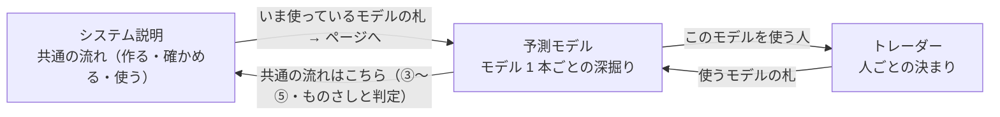
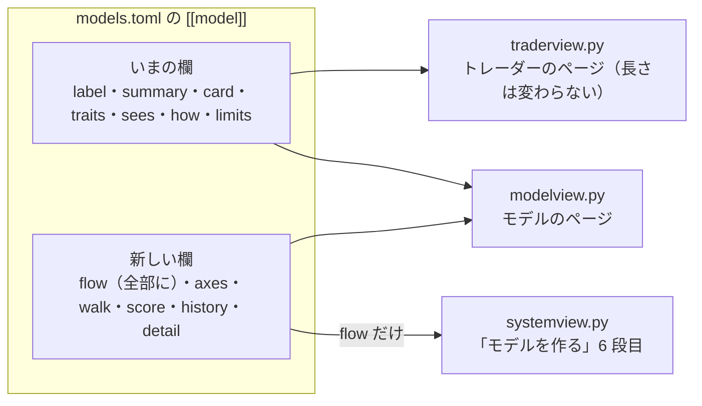

# vibeboard の「予測モデル」タブを、モデルを詳しく解説するものにする

2026-09-20 作成。利用者の指示（2026-09-20）: **「予測モデル」タブを、予測モデルを詳しく解説するものにする（「システム説明」の説明とのバランスをとる）**。
親タスクは「システム全体と予測モデルとトレーダーに関する情報をまとめる」（[TODO.md](../../TODO.md)）。仕様は [dashboard.md §17・§18](../specs/dashboard.md)。

## 1. 目的・背景

いまの「予測モデル」タブ（`dashboard/modelview.py`・正本 `dashboard/models.toml`）は、一覧 ＋ モデル 1 本 1 ページで、**1 項目 1〜2 行の短い紹介**。図が無い。
いっぽう「システム説明」タブ（`dashboard/systemview.py`・正本 `dashboard/system.toml`）は 5 ページ・図つき・「詳しく（用語あり）」の囲みつきで手厚い。

⚠ **逆転がある**: モデル 1 本ごとの図（入れるもの → 計算 → 出力スコア）は、「システム説明」の「モデルを作る」の 6 段目にしか無い（`models.toml` の `flow`。いま使っている 3 本だけ）＝ モデルの話なのに、モデルのページのほうが薄い。

| | システム説明 | 予測モデル（いま） |
| --- | --- | --- |
| 図 | ページごとに 1〜2 枚 ＋ 型ごとの図 3 枚 | 無し |
| 用語つきの説明 | 各段に「詳しく（用語あり）」の囲み（畳まない） | 畳んだ「正式な名前」の表だけ |
| 試した経緯 | 「これまでの経緯」の表（日づけ・何通り・内訳） | 印 ＋ 1〜2 文 |
| 1 段の長さ | 本文 2〜4 行 ＋ 箇条書き ＋ 表 | 1 項目 1〜2 行 |

## 2. 決めること（⚠ 利用者の裁定。推す案に ★）

✅ **2026-09-20 の裁定**（利用者）:

| | 裁定 |
| --- | --- |
| ① 分担 | **B 両方に出す**（モデルのページに図を足し、「システム説明」の 6 段目もそのまま。正本は `models.toml` の `flow` 1 つ） |
| ② 足す中身 | **a〜e の全部**（図 ＋ 軸の表 ／ 出力スコアの出かたと読み方 ／ 試した経緯の表 ／ 計算を小さな例で段を追う）。⚠ **「とにかくこの仕組みは複雑なので分かりやすくするようにする」** ＝ 足すときの物差しは「分かりやすいか」。長くするのが目的ではない |
| ③ 言葉づかい | **A 各段に囲み**（やさしい本文 ＋ 畳まない「詳しく（用語あり）」。「正式な名前」は最後の囲みとして畳まずに出す） |
| ④ 一覧のページ | **全体を作ったあとに考える**（いまは触らない） |

下の案の表は、裁定の前に出したもの（経緯として残す）。

### ① 2 つのタブの分担

> この図の主張: 「システム説明」は全部のモデルに共通の流れ、「予測モデル」はモデル 1 本ごとの深掘りを持ち、同じ説明を二重に書かずにリンクでつなぐ。

| 案 | 型ごとの図の置き場 | 「システム説明」6 段目 | 長所 ／ 短所 |
| --- | --- | --- | --- |
| ★ A 移す | モデルのページ（12 本とも） | 図をやめ、**いま使っているモデルの札**（呼び方 ＋ ひとこと ＋ ページへのリンク）だけにする | 分担がはっきりする・同じ図が 2 か所に出ない ／ 「モデルを作る」のページから図が 3 枚減る |
| B 両方に出す | モデルのページ ＋ 6 段目（いまのまま） | そのまま（見出しだけ TODO の案 1 で直す） | 「モデルを作る」を読む人がその場で具体例を見られる ／ 同じ図と文が 2 か所（正本は 1 つ） |
| C 足さない | 6 段目だけ（いまのまま） | そのまま | 手間が無い ／ 逆転が残る |

- どの案でも**正本は `models.toml` の `flow` 1 つ**（二重に書かない）。
- A を採ると、TODO の「システム説明タブの直し」案 1（6 段目の見出しの直し）は「いま使っているモデル」という見出しに置き換わって不要になる。案 2・3（軸の段・3 人の表）は ② の「軸の表」の裁定と一緒に決まる（§2 ②）。

### ② モデルのページに足す中身

| 記号 | 足すもの | 中身 | 書く手間・注意 |
| --- | --- | --- | --- |
| ★ a | **図**（入れるもの → 計算 → 出力スコア） | `flow` を机上の 9 本にも書く。大見出し 3 の頭に置く | 小。箱は 12 個以内・1 図 1 主張 |
| ★ b | **このモデルの組み立て**（軸の表） | 入力データ ／ 数字の下ごしらえ ／ 計算の仕方 ／ 当てにいく対象 ／ 学習範囲 の 5 行（新しい欄 `axes`）。⚠ 1 本のモデルの中だけの表（モデルどうしを横に並べない） | 小。config とコードから写せる |
| c | **計算を小さな例で、段を追って** | 「数字が 3 つだけなら」のような小さな例で計算を 3〜5 段（新しい欄 `walk`） | ⚠ **大**。型ごとに正確な例を作る必要があり、まちがえやすい。★ 第 2 弾に回す（まず いま使っている 3 本だけ） |
| ★ d | **出力スコアの出かたと読み方** | 幅・癖（まん中に集まる・どの株も同じ、など）と、この型の出力スコアをどう読むか（新しい欄 `score`。印 `basis` つき） | 中。⚠ 記録にある【実測】だけ。無いモデルは「測っていない」と書く |
| ★ e | **試した経緯** | いつ・どの形で・何通り・内訳（採る ／ 保留 ／ 落とす）の小さな表（新しい欄 `history`）。いまの `result`（印 ＋ 1〜2 文）は頭に残す | 中。人が記録から写す（§17-3 と同じ決まり）。bp の数字は本文に書かない |
| ★ f | **「詳しく（用語あり）」の囲み** | 正式な名前・ハイパーパラメータ・コードと config の場所・【実測】の数字と出典（③ で形を決める） | 中 |

### ③ 言葉づかい ＝ 「両方を並べる」にそろえるか

| 案 | 形 |
| --- | --- |
| ★ A 各段に囲み | 「システム説明」と同じ。大見出しごとに、やさしい本文 → 畳まない「詳しく（用語あり）」の囲み（新しい欄 `detail_*`）。いまの畳んだ「正式な名前」は、**最後の囲み「正式な名前と設定」として畳まずに出す** |
| B 最後に 1 つ | 本文はいまのまま。ページの最後に「詳しく（用語あり）」の囲みを 1 つだけ置き、「正式な名前」の表もそこへ入れる |
| C いまのまま | 畳んだ「正式な名前」だけ |

### ④ 一覧のページの形

| 案 | 形 |
| --- | --- |
| ★ A 札 ＋ 前書き | 札はそのまま。頭に「このタブの読み方」（モデルのページの大見出しの意味 ／ 共通の流れは「システム説明」へ、のリンク）を足す。札に小さな図は入れない |
| B いまのまま | 札だけ |

⚠ 一覧に「軸で横に並べた表」は作らない（「見くらべる表や順位を作らない」の決まり ＝ §17-2。置くなら「システム説明」の側 ＝ TODO の案 3）。

## 3. 対応方針（裁定のあとの形）

> この図の主張: 足す中身はどれも `models.toml` の新しい欄で、トレーダーのタブが写す欄（いまの短い文）には触れないので、トレーダーのページは長くならない。

モデル 1 本のページの大見出し:

| # | 大見出し | 中身（**太字**が足すもの） |
| --- | --- | --- |
| 1 | どんなモデルか | ひとこと・見るもの ／ 決め方・使う人 ＋ **このモデルの組み立て（軸の表）** |
| 2 | モデルの特性 | いまのまま（印つき） |
| 3 | 何を見て、どう答えを出すか | **図** → 見ている数字 → 答えの出し方 → **小さな例で段を追う** → **「詳しく」**（コードの場所・ハイパーパラメータ）。共通の流れは「システム説明」へリンク |
| 4 | **出力スコアの出かたと読み方** | **幅・癖（印つき）・読み方** → **「詳しく」**（【実測】の数字と出典） |
| 5 | 過去のデータで試した結果 | 印 ＋ 1〜2 文 ＋ **試した経緯の表** ＋ 記録へのリンク → **「詳しく」**（台帳の鍵・試行の数え方） |
| 6 | 気をつけること | いまのまま |
| （囲み） | **正式な名前と設定** | いまの畳んだ表を、畳まない囲みにする |

守ること（TODO の ⚠ と同じ）:

- 言葉の正本は `dashboard/models.toml` 1 本。説明を Python に書かない。共通の流れを `system.toml` と二重に書かない（リンクにする）
- 本文はやさしい言葉（§16-2 の表。テストの `FORBIDDEN`）・「出力スコア」・ほかのモデルとくらべる文を書かない（`COMPARING`）・実売買の設定の数字と bp を書かない。用語と細かい数字は `detail_*` にだけ（テストの検査の外に置く欄 ＝ `system.toml` の `DETAIL_KEYS` と同じ考え方）
- 特性・出力スコアの癖には「どこまで確かか」の印。**確かめた事実だけ**（記録 `docs/specs/experiments/*.md` とコード `experiments/feature-discovery/ail/` を読んで書く。確かめていない理由は言い切らない）
- 試した結果・経緯は人が記録から写す（§17-3）。売買結果は出さない。`out/`・`state/`・`.env`・`runs/` を開かない
- 図はサーバで組むインライン SVG（`systemview.flow_svg` を使い回す。⚠ `systemview` が `modelview` を import しているので、図の関数は循環しない置き場へ移す）。1 図 1 主張・箱 12 個以内
- 白地に固定・読むだけ・標準ライブラリだけ

## 4. Phase

- ✅ **Phase 0**: このプラン ＋ 裁定（① 〜 ④）
- ✅ **Phase 1（器）**: `modelview.py` に新しい欄の描画（図・軸の表・出力スコアの段・経緯の表・「詳しく」の囲み）。欄が無いモデルは、その部分を出さないだけ（いまの 12 本が欄なしでも壊れない）。テスト（最小の置き場 ＋ 本物の `models.toml` の検査に `detail_*` の除外・`flow` の箱の数・`history` の形を足す）。仕様 §17 を直す
- ✅ **Phase 2（いま使っている 3 本の文）**: `own-ridge`・`ownex-lgbm`・`seq-quant` に `axes`・`score`・`history`・`detail_*` を書く。出どころ ＝ threshold-trading.md・tsc-threshold.md・topk-holdings.md・live-trading.md §0-7 (k) ＋ `ail/models/`・`ail/detectors/tsc.py`・実験の config
- ✅ **Phase 3（机上の 9 本の文）**: `flow` ＋ 同じ欄。出どころは各モデルの `records`
- ✅ **Phase 4（小さな例）**: 計算を小さな例で段を追う（`walk`）。いま使っている 3 本 ＋ 門の入れかわり（`entry-exit-gates`）の 4 本。⚠ 例の数字は作りもの（本物の重みや成績ではない）と画面に明記する
- **Phase 5（一覧のページ）**: ⚠ 利用者の裁定「全体を作ったあとに考える」＝ Phase 1〜4 のあとで案を出す
- ① が B なので「システム説明」の 6 段目は触らない（見出しの直し ＝ TODO の別タスク「システム説明タブの直し」案 1 は裁定待ちのまま）
- 後片付け: `TODO.md` → `DONE.md`・プランを archive へ。⚠ `CLAUDE.md` の vibeboard の節の直しは利用者の了承を待つ（TODO のメモのとおり）

## 5. 影響範囲

- 直す: `dashboard/models.toml`・`dashboard/modelview.py`・（① が A なら）`dashboard/system.toml`・`dashboard/systemview.py`・`dashboard/tests/test_models_tab.py`・`test_system_tab.py`・`test_traders_tab.py`（`_texts` の除外欄）・`docs/specs/dashboard.md` §17・§18
- 直さない: `dashboard/traderview.py` の画面（トレーダーのページの長さは変えない）・`dashboard/app/`（管理画面。g3plus に載る側）・vibeboard 本体・`vibeboard.config.json`
- 反映: 文だけなら保存して 5 秒。`modelview.py` を直すので **sidecar（3015）の入れ直しが要る**（⚠ 利用者。`./run-vibeboard.sh`。§12-3 の罠）

## 6. テスト方針

- `cd dashboard && .venv/bin/python -m pytest -q tests`（全部。いま 183 本＋）
- 足す検査: 新しい欄の本文がやさしい言葉・くらべる文なし ／ `detail_*` だけが検査の外 ／ 「詳しく」の囲みは `
` でない ／ 図の箱は 12 個以内・`claim` が図の直前 ／ `history` の内訳が印（`result.verdict` ＝ いちばん良かった形）と食い違わない ／ `score` の項目に `basis` ／ 欄の無いモデルのページが壊れない ／ トレーダーのページに新しい欄の文が出ない ／ TOML しか開かない
- 手元で見る: `python3 dashboard/vibetab.py --port 3016` → `http://127.0.0.1:3016/models/view?item=own-ridge`（3010・3015 に触らない）

## 7. 書いて分かったこと（2026-09-20）

書く前に、4 本の調べ（読むだけ・実験は回さない）でコードと記録を読み直した。⚠ **いまの文に誤りが 10 か所あまりあった**（トレーダーのタブ・「システム説明」にも同じ文が出ていた）。全部直した。

| モデル | いままでの文 | 本当のこと（出典） |
| --- | --- | --- |
| 60 日の線の 4 本 ＋ 「システム説明」の表 | 「毎日の上がり下がりを 60 日ぶん並べたもの」 | 今日の値段を 0 とした**値段の道すじ**（上がり下がりをつみ上げたもの。`ail/detectors/tsc.py:36-50`） |
| `minirocket` | 「約 1 万枚の型紙」「型紙は学ばない」 | 型紙は **84 種類**（約 1 万は数字の数 9,996）。「強く当てはまった」とみなす高さは学ぶ期間から決める（aeon `_minirocket.py`） |
| `seq-quant` | 「高いほうの値・低いほうの値を測る」 | 区間ごとに小さい順に並べた**決まった位置の値**（短い区間はまん中の値）を、4 つの見方（道すじ・上がり下がり・その変わり方・波の強さ）で読む。653 個 |
| `seq-quant` | 「日ごとに急には動きにくい」（試し運転） | 測った記録なし。見えていたのは「初日に全部買い、最後の日も全部持つ」（sim3）と「過去の試しでは 1 回の持ち続けは中央値 7 日・1 日で手放すのが 2 割」 |
| `gan-augment`・`ownex-lgbm` | 「同じ設定で回し直すたびに成績が大きくぶれた」 | **逆**。同じ入力なら 1 桁も違わず同じ。動いたのは入力（外の数字）を直したとき |
| `gan-augment` | 「にせの日」「一度に見る日の数」 | 1 行 ＝ ある株のある 1 日ぶん（数字 ＋ 次の日の上がり下がり）。「一度に見る行の数」 |
| `symbolic-regression` | 「生き残った式の先頭に曜日」 | 5 つの期間のうち **4 つ**（2 つ目には無い） |
| `patchtst` | 「10 回とも『明日は動かない』と変わらない」 | 5 期間 × 2 回（本番・0〜100 に直す用）の 10 回で、**それより悪い**（1.05〜1.29 倍） |
| `mlp` | 「線の引き方を 2 通り」 | **学習範囲**が 2 通り（全部の株でまとめて ／ 株ごと）。0〜100 に直す式は 1 通り |
| `trend-gates` | 「下げを避けたが戻りを取りそこねた」「長い門ほど負けが小さい」 | どちらも**昔からある決まりの門だけ**。過去から学ぶ門はほとんど休まなかった（持っていた日が 9 割以上） |
| `trend-gates` | 「株はどれも戻っている」／ 結果「18 落とす・3 保留」 | 記録にあるのは「大きな下げ 12 回がどれも戻った」まで ／ **計算を直したあとは 17 と 4**（いまのコードの行で決める ＝ §17-3） |
| `entry-exit-gates` | 「売る側の出力スコアがせまい幅に固まった」 | 幅がせまかったのは直す前の 20 日の門だけ。本当の理由は、売る側の出力スコアがまん中より下（30〜40）にかたよって**売る線に届かなかった**こと |
| `ownex-lgbm` | 「天気や地震が 8 日より古いと、その日は何もしない」 | 為替・金利もふくむ**外の数字の全部**。実売買では予測が失敗し、`run-live.sh` が執行器を起こさない ＝ **その日の売り買いの全部が止まる** |

新しく見つかって特性に足したこと:

- ⚠ **0〜100 に直す式の向きが逆になる期間がある**（`own-ridge`: 過去の 5 期間のうち 2 つ・試し運転の 64 日は毎日 ／ `ownex-lgbm`: 5 期間のうち 2 つ・64 日のうち 48 日）。取り分けた日で当たった向きに合わせるので、生の見こみが高いほど出力スコアが低くなる。⚠ 64 日の数字は `live-trading/sim-predict/` を読んで数えたもの（文書には無い）
- 経緯の表には、ちがう売り買いの決まり（上位 K）や前のものさし（毎日往復）での試しも、**いまの印に数えない行**（`aside`）として薄く載せた

確認【実測】: 管理画面の pytest 218 本。3016 に sidecar を起こし、ヘッドレスの Chromium で `own-ridge`・`seq-quant`・`entry-exit-gates`・トレーダー `T2` のページを撮って読んだ（3010・3015 には触っていない）。

