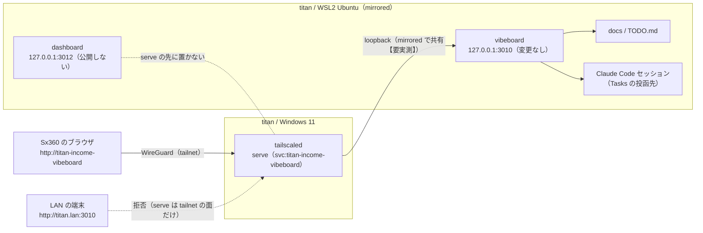

# titan で動かした vibeboard を外（tailnet）から見る（tailscale serve ＋ Tailscale Services）

作成: 2026-09-10（同日、サービス名の URL を追記。dashboard は公開しないと決定）

## 目的・背景

Sx360 から `ssh titan` で入り、titan の `ai-income-lab` で `./run-vibeboard.sh`（開発管理画面、3010）を動かしたとき、そのページを Sx360（や自分の他の端末）のブラウザで開けるようにする。URL は `http://titan-income-vibeboard` のように**サービス名が入る形**にする。

利用者の指示（2026-09-10）: **titan に client から ssh 接続して run-vibeboard.sh を動かしたときに外部からページが見れるようにする** ／ 同日追記: **アクセスする URL は `http://titan-income` のようなサービス名が URL に入る形にできないか検討する** → サービス名は **`titan-income-vibeboard`** に決定 ／ **`run-server.sh`（dashboard）は危険なので公開しない**（下の「対象外」）

派生元は「自宅の外から SSH で GPU 機（WSL2）に入れるようにする（Tailscale）」（2026-09-10 完了。[運用メモ](archive/remote-ssh-tailscale.md)）。SSH の経路はできているので、**その上に HTTP を 1 本通す**のがこのタスク。

2026-09-10 に確認した現状:

| 項目 | 状態 |
|---|---|
| vibeboard の待ち受け | `127.0.0.1` に固定（`vibeboard/src/config.ts` の `host: '127.0.0.1'`）。`--host` も `vibeboard.config.json` の `host` も無い。`run-vibeboard.sh` は `--port` しか通さない |
| Tasks タブの登録先 | `vibeboard/scripts/session-hook.mjs` が `127.0.0.1:<VIBEBOARD_PORT → config の port → 3010>` に POST する。**ポートを変えると Claude セッション側にも `VIBEBOARD_PORT` が要る** |
| ポートの取り合い | 同じ root の vibeboard を起動し直すと portGuard が前のプロセスを止めて置き換える。別 root なら止まる |
| titan のネットワーク | WSL2 mirrored（Windows と同一ポート空間）。Windows 側の Tailscale は `--unattended` 済み。Tailscale の面は WSL に `eth2` として映る |
| titan への到達 | tailnet `titan.tail061b58.ts.net`（100.82.194.13）／ LAN `titan.lan`（10.0.1.81）。22 番は Windows FW と Hyper-V FW で許可済み（**Hyper-V FW の既定 inbound は Block**） |
| WezTerm | `wezterm connect titan` の mux ドメイン。ペインの中のプロセスは切断しても titan に残る |
| vibeboard の出自 | upstream `akiraak/vibeboard` の vendor。改造は upstream に入れて `vibeboard update --from` で配る |

### 対象外: dashboard（`run-server.sh`）は公開しない（2026-09-10 決定）

dashboard は接続元 IP で面を決めていて（`dashboard/app/access.py`）、ループバックなら無条件にローカル面（cert の発注・解除・鍵・開発）を開く。`tailscale serve` は titan の tailscaled が接続を終端して**ループバックから**アプリに繋ぐので、tailnet のどの端末から来ても全部ループバックに見え、**serve の先に置いた瞬間に発注の面が無認証で開く**。公開面を別に作れば出せるが（`Tailscale-User-Login` を照合する 4 つ目のモード）、**利用者の判断で公開しない**ことにした。

- ⚠ **titan の tailscaled に 3012 の serve も Services の端点も作らない**（テスト T14 で「無いこと」を確認する）
- 外から dashboard を見たいときは `ssh -L 3013:127.0.0.1:3012 titan` で手元の `http://localhost:3013` を開く（ssh の鍵の内側なのでローカル面が出てよい）

## 対応方針

**経路は `tailscale serve`、名前は Tailscale Services で付ける。** titan の Windows 側 tailscaled が tailnet からの接続を終端し、WSL の `127.0.0.1:3010` へ渡す。vibeboard と `run-vibeboard.sh` は**変更しない**。

### 2-1. 経路の 3 候補（TODO の候補をここで 1 つに絞った）

| 候補 | コード変更 | FW 変更 | 見える範囲 | ssh を切ると | 判定 |
|---|---|---|---|---|---|
| (a) `ssh -L` で手元に引く | なし | なし | その ssh を張った端末だけ | 消える。WezTerm の mux ドメインは `-L` を張れない【推測】ので別の `ssh -N` が常に要る | **逃げ道**（最初の 1 分で使える） |
| (b) vibeboard に `--host` を足して Tailscale の面に bind | upstream 改造 ＋ 2 プロジェクトへ配布 | Hyper-V FW に 3010 の許可 | bind 先しだい（100.x に限れば tailnet） | 残る | **落とす**。(c) に無い利点が無く、手数だけ多い |
| (c) `tailscale serve` | なし | なし（tailscaled が終端して loopback へ渡す） | tailnet の全端末（LAN には出ない） | 残る。titan の再起動もまたぐ | **採る** |

【公表値】`tailscale serve --bg` は無効化するまで常駐し、**端末の再起動や `tailscale down` / `up` のあとも自動で再開する**。`--http=<port>` は平文 HTTP を張る指定で、`http://<ノード名>` の短い MagicDNS 名で開ける。制限があるのは macOS（App Store 版）だけで Windows の記載はない。serve は tailnet の中だけに出る（インターネットに出すのは Funnel）（出典: https://tailscale.com/kb/1242/tailscale-serve 、2026-09-10 取得）

ポートは **3010 のまま**にする。理由は hook の既定が 3010 で、変えると Claude セッション側の設定も要るから。同じ root の起動し直しは portGuard が前のを置き換えるが、それを叩くのは利用者自身なので問題にしない。TODO のメモにある「3011 など別ポート」は、**逃げ道 (a) で Sx360 の手元ポートを選ぶときだけ**の話（Sx360 の 3010 は Sx360 自身の vibeboard が使う）。

### 2-2. URL にサービス名を入れる: Tailscale Services

`http://titan:3010` の形は「ノード名 ＋ ポート」で、サービス名は入らない。サービス名を入れる方法を 4 つ比べた:

| 方法 | URL の形 | 仕組み | 判定 |
|---|---|---|---|
| ノード名 ＋ ポート | `http://titan:3010` | serve `--http=3010` | Phase 1〜2 の**足場**（名前が付くまでの形） |
| ノード名 ＋ パス | `http://titan/vibeboard` | serve `--set-path` | **落とす**。vibeboard は `/api/...` `/files` の絶対パスで組んであり、パスの下に置くと壊れる |
| 自前 DNS ＋ 逆 proxy | `http://titan-income-vibeboard` | tailnet の DNS 設定に自前のネームサーバ、WSL に Caddy 等で Host 振り分け | **落とす**。serve は Host ヘッダで振り分けないので常駐が 2 つ増える |
| **Tailscale Services** | `http://titan-income-vibeboard.tail061b58.ts.net`（短い `http://titan-income-vibeboard` は【要実測】） | サービスに **MagicDNS 名と専用の仮想 IP** が付く。titan が `tailscale serve --service=svc:titan-income-vibeboard --http=80 3010` で広告し、管理画面で承認 | **採る** |

【公表値】Tailscale Services は「MagicDNS 名・TailVIP（仮想 IP）・リソース定義・1 つ以上のホスト」の組。**管理画面でサービスを先に定義**し、ホストは `tailscale serve --service=svc:web-server --http=80 3000` の形で端点を広告する（**自動で background モード**になる）。ホストは **v1.86.0 以上**、アクセスする側は **v1.94 以上なら `accept-routes` が不要**。Layer 3 の端点だけ Linux 限定で、Layer 4 / 7（serve）に OS の制限は書かれていない。TCP のみ。方針ファイルの `grants` で `"dst": ["svc:web-server"]` を許し、`autoApprovers.services` で承認を自動化できる（出典: https://tailscale.com/kb/1552/tailscale-services 、2026-09-10 取得）

- サービス名は **`titan-income-vibeboard`**（利用者の指定、2026-09-10）。端点は `tcp:80` の 1 つで、URL にポートを入れない
- ⚠ **短い名前 `http://titan-income-vibeboard` で引けるかは docs に記載がない**（例は全部 FQDN）。ノードは検索ドメインで短い名前が引けるので同じ zone のサービスも引ける【推測】→ Phase 3 で実測し、引けなければ FQDN で使う
- Services が使えない（版が古い・承認が通らない）場合は、ノード名 ＋ ポートの形（Phase 1〜2）で運用する

経路は tailnet → Windows の tailscaled が終端 → loopback → WSL の vibeboard で、**vibeboard は 127.0.0.1 から動かさず、dashboard は serve の先に置かない**:

⚠ **分岐点は「Windows 側の loopback から WSL の 127.0.0.1:3010 に届くか」**（Phase 1 Step 1-2）。mirrored モードで Windows → Linux の localhost が通るのは 0.0.0.0 に bind した場合が確実で、127.0.0.1 だけに bind した場合は【推測】。届かなければ「失敗時の代替」に落とす。

## 影響範囲

- **このリポジトリのコードは変更しない**（`vibeboard/`・`run-vibeboard.sh`・`dashboard/`・`run-server.sh` とも触らない）。文書だけ: `CLAUDE.md` の vibeboard 節に 1 行、`DONE.md`、このプランの archive 移動
- titan の Windows: tailscaled の serve 設定（再起動をまたぐ）
- titan の WSL: 何も変えない（vibeboard を起動するだけ）
- Sx360: 何も変えない（ブラウザで開くだけ。逃げ道 (a) のときだけ ssh の `-L`）
- Tailscale の管理画面（利用者）: Service を 1 つ定義・ホストの承認・`grants` に 1 項目。HTTPS 証明書は有効化しない（今回は平文 HTTP。tailnet 内は WireGuard で暗号化済み）

## Phase

### Phase 0: 決めごと（このプランで決定。利用者の確認だけ）

- 経路は (c)、名前は Tailscale Services で `titan-income-vibeboard`、ポートは 3010 のまま、**dashboard は公開しない**、**Funnel（インターネット公開）は使わない**、HTTPS は見送り
- ⚠ **vibeboard は Files の編集と Tasks の投函を持つ ＝ titan で任意の作業を走らせられる面**。tailnet に出すと、自分の Tailscale アカウントに入っている全端末から鍵なしで届く。SSH と同じ信頼境界（アカウントは 2 段階認証済み）だが、この点を利用者が了解してから Phase 1 に進む

### Phase 1: vibeboard を titan のノード名で出す（Claude が `ssh titan` で実行）

⚠ 先に `SSH_AUTH_SOCK=~/.ssh/agent.sock ssh-add -l` で鍵が載っているかを見る（無ければ利用者に `ssh-add`。[運用メモ](archive/remote-ssh-tailscale.md)）

- Step 1-1: titan で vibeboard を起動し、WSL の loopback で 200 を取る
  - `cd ~/ai-income-lab && nohup ./run-vibeboard.sh > /tmp/vibeboard-3010.log 2>&1 &`（利用者が WezTerm のペインで叩く形でもよい。mux ドメインなので切断しても残る）
  - `curl -s -o /dev/null -w '%{http_code}\n' http://127.0.0.1:3010/` → `200`
  - ⚠ titan に別 root の vibeboard が 3010 を掴んでいると起動が止まる。`ss -ltnp 'sport = :3010'` で見て、**ポートから引いたプロセスを止める**（`pgrep -f` は自分に当たる）
- Step 1-2: **分岐点**。Windows 側の loopback から WSL の vibeboard に届くか
  - `/mnt/c/Windows/System32/curl.exe -s -o NUL -w "%{http_code}" http://127.0.0.1:3010/` → `200` なら先へ
  - ❌（接続拒否・タイムアウト）なら「失敗時の代替」の 2 か 3 へ
- Step 1-3: serve を張る（Windows の CLI を WSL の interop から叩く。`tailscale set --unattended` を通した経路と同じ）
  - `"/mnt/c/Program Files/Tailscale/tailscale.exe" serve --bg --http=3010 http://127.0.0.1:3010`
  - `tailscale.exe serve status` に `http://titan.tail061b58.ts.net:3010 → http://127.0.0.1:3010` が出る
  - ⚠ 権限で弾かれたら、利用者が Windows の PowerShell で同じコマンドを叩く
  - ⚠ **`funnel` は使わない**。`tailscale.exe funnel status` が空のままであること
- Step 1-4: titan の中から面ごとに確認
  - tailnet の面: `curl -s -o /dev/null -w '%{http_code}\n' http://100.82.194.13:3010/` → `200`
  - LAN の面: `curl -m 3 -s -o /dev/null -w '%{http_code}\n' http://10.0.1.81:3010/` → 接続拒否（vibeboard は loopback だけ、serve は tailnet の面だけ）

### Phase 2: Sx360 からの接続試験（curl は Claude、ブラウザと外の回線は利用者）

- Step 2-1: Sx360 の WSL から `curl -s -o /dev/null -w '%{http_code}\n' http://titan:3010/` → `200`。`http://titan.lan:3010/` → 接続拒否
- Step 2-2: ブラウザで `http://titan:3010`。docs / Files / Tasks の各タブが出る
  - SSE の確認: titan 側で `touch ~/ai-income-lab/TODO.md` → 画面が即時に更新される（serve が `text/event-stream` をそのまま通すか【要実測】。通らなければ 2 秒ポーリングに落ちるだけで壊れはしない）
- Step 2-3: Tasks タブに titan の Claude セッションが出る（`ssh titan` で `claude` を起動しておく。hook が `127.0.0.1:3010` に登録する）
  - ⚠ 投函は実際の作業を走らせるので、試すのは「説明」だけにする
- Step 2-4: 外の回線（スマホのテザリング）から同じ URL（利用者）。⚠ 繋ぎ始めは DERP 中継で遅い（前回【実測】: 往復 200ms 超 → 数往復で直結 78ms）

### Phase 3: 名前を付ける（Tailscale Services）

- Step 3-1: 版の確認。titan: `tailscale.exe version` が **1.86.0 以上**（2026-09-09 に winget で入れたので満たす見込み【推測】）。Sx360: v1.102.3（≥ 1.94 ✅）
- Step 3-2（利用者・管理画面）: Services に `titan-income-vibeboard`（端点 `tcp:80`）を定義。方針ファイルに `{"src": ["autogroup:member"], "dst": ["svc:titan-income-vibeboard"], "ip": ["80"]}` を足す。⚠ `autoApprovers` は tag 付きノード向けなので、titan（利用者所有）は手で承認する
- Step 3-3（titan）: `tailscale.exe serve --service=svc:titan-income-vibeboard --http=80 http://127.0.0.1:3010`。管理画面に「承認待ち」が出るので利用者が承認
- Step 3-4（Sx360）: `curl -s -o /dev/null -w '%{http_code}\n' http://titan-income-vibeboard.tail061b58.ts.net/` → `200`。**短い名前** `http://titan-income-vibeboard/` も試す（【要実測】。引けなければ FQDN で運用し、CLAUDE.md にはそう書く）。ブラウザで Step 2-2 / 2-3 をもう一度（SSE と Tasks が Services の proxy でも動くこと）
- Step 3-5: 名前で通ったら、ノード名 ＋ ポートの serve（3010）は **外す**（`tailscale.exe serve --http=3010 off`）。扉を 2 重に開けておかない

### Phase 4: 仕上げ

- Step 4-1: 再起動をまたぐ確認。titan を再起動 → `tailscale.exe serve status` に Service が残っている → `ssh titan` で入って `./run-vibeboard.sh` → `http://titan-income-vibeboard` が開く
  - vibeboard 自体は再起動で消える。**ssh で入って叩き直すのが今回の要件**なので、無人起動（`wsl-autostart` に足す）は別タスクにする
- Step 4-2: `CLAUDE.md` の vibeboard 節に「titan では `http://titan-income-vibeboard`（Tailscale Services、Funnel なし。dashboard は出さない）」を 1 行。切り分けの型をこのプランの「運用メモ」に書き、`DONE.md` へ移して archive する

## テスト方針

各面で 200 と拒否の両方を取る。**拒否の確認（LAN・Funnel・dashboard が出ていないこと）を省かない**。

| # | どこから | 何を | 期待 |
|---|---|---|---|
| T1 | titan の WSL | `http://127.0.0.1:3010/` | 200 |
| T2 | titan の Windows（curl.exe） | `http://127.0.0.1:3010/` | 200（**分岐点**） |
| T3 | titan の WSL | `http://100.82.194.13:3010/` | 200 |
| T4 | titan の WSL | `http://10.0.1.81:3010/` | 接続拒否 |
| T5 | Sx360 の WSL | `http://titan:3010/` | 200 |
| T6 | Sx360 の WSL | `http://titan.lan:3010/` | 接続拒否 |
| T7 | titan | `tailscale.exe funnel status` | 空 |
| T8 | Sx360 のブラウザ | TODO.md を titan で touch | 画面が即時更新（SSE） |
| T9 | Sx360 のブラウザ | Tasks タブ | titan の Claude セッションが並ぶ |
| T10 | 外の回線 | `http://titan-income-vibeboard` | 開く（利用者） |
| T11 | Sx360 の WSL | `http://titan-income-vibeboard.tail061b58.ts.net/` と `http://titan-income-vibeboard/` | 200（短い名前は【要実測】） |
| T12 | Sx360 の WSL | Phase 3-5 のあと `http://titan:3010/` | 接続拒否（ノード名 ＋ ポートは外した） |
| T13 | Sx360 の WSL | `http://titan:3012/` | 接続拒否（dashboard は出していない） |
| T14 | titan | `tailscale.exe serve status` | 3012 の serve も端点も無い |

## セキュリティ上の注意

- **Funnel は使わない**（T7）。serve も Services も tailnet の中にしか出ない
- **dashboard（3012）は serve の先に置かない**（T13 / T14）。serve 経由は全部ループバックに見えるので、置いた瞬間に発注の面が無認証で開く
- tailnet に出す ＝ 自分の Tailscale アカウントの全端末から**鍵なし**で届く。端末を失くしたら Tailscale の管理画面でその端末を外す
- 他人の端末を tailnet に共有する日が来たら、`grants` の `src` を `sx360` 等に絞る（Services なら `dst` がサービス名なので絞りやすい）
- vibeboard の `/files` は dotfiles 403 だけの守り（`.env` は読めない）。それ以外のリポジトリ内容は見える ＝ ssh で入れる範囲と同じ
- HTTPS にするなら serve / Services とも `--https=443` ＋ 管理画面で HTTPS Certificates。⚠ Let's Encrypt の証明書なので **ホスト名が公開の CT ログに載る**。今回は見送る

## 失敗時の代替

1. **すぐ凌ぐ: (a) `ssh -L`**。Sx360 で `ssh -N -L 3011:127.0.0.1:3010 titan` → `http://localhost:3011`。⚠ Sx360 の 3010 は Sx360 自身の vibeboard が使うので手元は 3011。`~/.ssh/config` の `Host titan` に `LocalForward 3011 127.0.0.1:3010` を足せば `ssh titan` のたびに張れる（WezTerm の mux ドメインは張らない【推測】。`ssh -N` を別に回す）。dashboard を見たいときも同じ形（`-L 3013:127.0.0.1:3012`）で、これが dashboard の唯一の外からの経路
2. **Step 1-2 で loopback が届かない場合: vibeboard を `0.0.0.0` に bind して serve に渡す**。upstream に `--host` / `VIBEBOARD_HOST` を足し（(b) の改造）、`run-vibeboard.sh` から `VIBEBOARD_HOST=0.0.0.0` で起動。Windows → Linux の localhost は 0.0.0.0 bind なら通る。**Hyper-V FW の既定 inbound が Block なので、LAN と tailnet の面には直接は届かず serve 経由だけになる**【推測。T4 / T6 で確かめる】
3. **コードを触らずに 2 と同じことをする: WSL 内の `socat`** で `TCP-LISTEN:3010,bind=100.82.194.13,fork TCP:127.0.0.1:3010` を回し、Hyper-V FW に 3010 の許可を足す（22 番と同じ形）。常駐プロセスが 1 つ増えるので 2 より劣る
4. Services が使えない（titan の版が古い・承認が通らない・短い名前が引けない）: ノード名 ＋ ポート（`http://titan:3010`）のまま運用し、名前は次の機会に回す
5. serve の権限で弾かれる: 利用者が Windows の PowerShell で同じコマンドを叩く

## 運用メモ

（完了時に書く: `serve status` の見方、切り分けの型〔`tailscale status` → `serve status` → titan の `ss -ltnp` の順〕、再起動後の手順）
