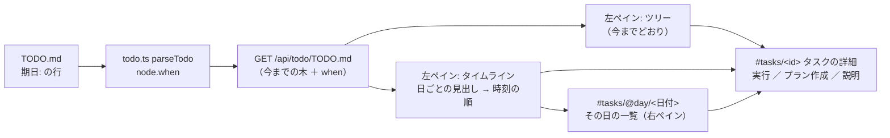
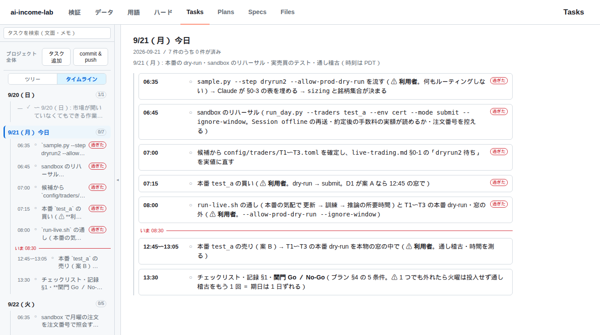

# vibeboard の Tasks をタイムラインで見る

利用者の指示（2026-09-20）: **vibeboard の Tasks をタイムラインで表示するようなものを作る**
派生元: 「2026-09-22（火）までに実運用へ: 日ごとの段取り」— 日ごと・時刻ごとの子タスクをツリーに並べたが、時間の並びとしては読みにくい。

## 0. 目的

`TODO.md` に書いた「いつやるか」を、Tasks タブの中で**時間の順に読める**ようにする。最初の使い道は 9/21（月）・9/22（火）の段取り（いつ・何を・済んだか）。

## 1. 決まったこと（✅ 2026-09-20 利用者の裁定）

| # | 決めること | 裁定 | 効くところ |
| --- | --- | --- | --- |
| Q1 | どこに作るか | **vibeboard 本体の Tasks タブ**（customTabs ではない） | vendor（`./vibeboard/`）を直し、同じ差分を akiraak/vibeboard（`~/src/vibeboard`）へ入れる。⚠ vendor だけ直すと `vibeboard update` で消える。✅ 着手時点で vendor と本体（origin/main `5dbe51a`）は `diff -rq` で一致 |
| Q2 | 何を時間軸に置くか | **予定だけ**（`DONE.md` の完了日は置かない） | 読むのは `TODO.md` だけ |
| Q3 | 日付の書き方 | **新しい欄を足す**（`期日:` の行。`依存:` ／ `関連:` と同じくタスクの下に字下げ） | `todo.ts` の読み手・`CLAUDE.md` のタスク管理ルール・いまの段取りの行に `期日:` を足す |

## 2. `期日:` の書き方（規約。vibeboard の README と CLAUDE.md の雛形にも書く）

```markdown
- [ ] 9/21（月）: 本番の dry-run・sandbox のリハーサル
  期日: 2026-09-21
  - [ ] `dryrun2` を流す
    期日: 06:35
  - [ ] 本番 `test_a` の売り
    期日: 12:45〜13:05
  - [ ] 関門 Go ／ No-Go
    期日: 2026-09-21 13:30
```

| 形 | 例 | 読み |
| --- | --- | --- |
| 日付だけ | `期日: 2026-09-21` | その日（時刻なし） |
| 日付 ＋ 時刻 | `期日: 2026-09-21 06:35` | その日のその時刻 |
| 日付 ＋ 時刻の幅 | `期日: 2026-09-21 12:45〜13:05`（`~`・`-` も可） | 始まりと終わり |
| 時刻だけ | `期日: 06:35` ／ `期日: 12:45〜13:05` | 日付は**親をさかのぼって最初に見つかる `期日:` の日付**を借りる。見つからなければ読まない |
| 後ろの文字 | `期日: 2026-09-21 06:35 PDT` | 残りは添え書きとしてそのまま出す（時差の計算はしない） |

- ラベルは `期日` を正とし、`予定`・`日時`・`due`・`when` も同じに読む（関係行と同じく `:` ／ `：`）
- ⚠ **読めない書き方は捨てない** ＝ ふつうのメモとして残り、タイムラインに出ないだけ（`todo.ts` の「書式は決め打ちしない」のとおり）
- 時刻は書いたままの土地の時刻（vibeboard は時差を持たない。ブラウザの時計と比べて「いま」「過ぎた」を出す）
- 1 タスクに `期日:` が 2 行あれば最初の 1 行

## 3. 画面

> この図の主張: タイムラインはツリーと同じ木を別の並べ方で見せるだけで、タスクを選んだ後（詳細・実行・プラン作成）は今までと同じ経路を通る。



| 部品 | 中身 |
| --- | --- |
| 切り替え | 左ペインの「プロジェクト全体」の下に `ツリー ｜ タイムライン`。選んだ方を `localStorage` に覚える。⚠ `期日:` が 1 本も無ければ切り替え自体を出さない（今までの見た目のまま） |
| 左ペイン（タイムライン） | 日ごとの見出し（`9/21（月）`・今日は「今日」の印・済 ／ 全部）→ 時刻の順（時刻の無い行は書かれた場所に置く）。各行 ＝ 時刻・状態の記号・文面（2 行まで）。⚠ **済んだタスクも出す**（薄く。1 日の進み具合を読むため。ツリーは今までどおり出さない）。過ぎたのに未完の行に「過ぎた」の印（色だけにしない）。今日の見出しの中に「いま」の線。末尾に「期日なし N 件」 |
| 右ペイン（その日の一覧） | 日の見出しを押すと `#tasks/@day/2026-09-21`: その日の札を全文で（時刻の幅・状態・文面・親の文面・添え書き）。札を押すとタスクの詳細へ |
| タスクの詳細 | 見出しの下に `期日` のチップ（日付・時刻） |
| 検索 | 検索語があるときは今までの平らな結果（タイムラインより検索が勝つ） |

- 「いま」と「過ぎた」は 1 分おきに描き直す（タブが見えているときだけ）
- 時刻の間隔を長さに写さない（一覧であって図ではない）

## 4. 影響範囲

| 場所 | 変更 |
| --- | --- |
| `vibeboard/src/todo.ts` | `TodoWhen`・`parseWhenLine()`・`node.when`（親から日付を借りる）。⚠ 既存の欄・id・関係の読みは変えない |
| `vibeboard/src/web/app.js`・`style.css` | 切り替え・タイムラインの左ペイン・その日の一覧・詳細のチップ |
| `vibeboard/test/todo.test.js` | §5 |
| `vibeboard/README.md`・`src/templates/claude-md-snippet.md` | `期日:` の規約（⚠ 雛形を変えると `vibeboard init` が CLAUDE.md のマーカー内を書き換える ＝ それでよい） |
| `~/src/vibeboard`（akiraak/vibeboard） | 同じ差分・`npm test`。⚠ **commit と push は利用者に確かめてから** |
| `TODO.md` | 9/21・9/22 の段取りの行に `期日:` を足す（文面は変えない ＝ 他のタスクからの「」参照が切れない） |
| `CLAUDE.md` | タスク管理ルールに `期日:`（マーカー内は `init` が入れる）・vibeboard 固有の運用に 1 行 |
| ⚠ 触らない | `dashboard/`・`vibeboard.config.json`・動いている vibeboard（3010）。確認は別のポート（3011）で起こす |

## 5. テスト方針

- `todo.test.js`: 5 つの形・ラベルの別名・全角コロン・幅の記号 3 種・時刻だけ → 親の日付を借りる（孫も）・借りる先が無ければ `when` なし・ありえない日付（`2026-13-40`・`25:00`）は読まない・読めない行がメモに残る・2 行あれば最初・既存のテストが全部通る（id が動かない）
- いまの `TODO.md` を読ませて、9/21 に 7 本・9/22 に 5 本が時刻の順に並ぶこと（3011 の `/api/todo/TODO.md` で）
- 画面: 3011 に起こしてヘッドレスのブラウザで ツリー ／ タイムライン ／ その日の一覧 のスクリーンショットを見る。`期日:` の無い `sample/` で切り替えが出ないこと
- vendor と本体で `npm test`・`diff -rq vibeboard/src ~/src/vibeboard/src`（`test` も）が空

## 6. 段取り

- [x] Step 0: Q1〜Q3 の裁定（✅ 2026-09-20）
- [x] Step 1: `todo.ts` の `期日:` ＋ テスト（✅ `parseWhenLine`・`node.when`。テスト 7 本）
- [x] Step 2: 左ペインの切り替えとタイムライン・詳細のチップ
- [x] Step 3: その日の一覧（右ペイン）
- [x] Step 4: `TODO.md` の段取りに `期日:` を足し、3011 で見て直す（スクリーンショット）
- [~] Step 5: README・雛形・本体（`~/src/vibeboard`）へ同じ差分・`CLAUDE.md`・片付け
  - ✅ README・雛形・`CLAUDE.md`・本体の作業ツリーへ同じ差分（`diff -rq` は空）
  - ⚠ **残り（利用者に確かめてから）**: 本体の commit と push ／ 動いている vibeboard（3010）の入れ直し（`todo.ts` の読み手は起動時に読み込まれるので、入れ直すまで切り替えは出ない）

## 7. 結果（2026-09-20）



- いまの `TODO.md`: 期日のあるタスク 15 本 ＝ 9/20 に 1 本（済）・9/21 に 7 本・9/22 に 5 本 ＋ 日の入れ物 2 本（行にしない）。期日なしは 63 件【実測。3011 の `/api/todo/TODO.md` と画面】
- 確かめたこと【実測。ヘッドレスのブラウザ】: 切り替えが出る ／ 日の見出し → その日の一覧 ／ 行 → タスクの詳細に期日のチップ ／ 時計を固定して「今日」・「いま 08:30」の線（08:00 と 12:45 の間）・「過ぎた」5 本 ／ `期日:` の無い `sample/` では切り替えが出ない ／ 画面のエラー 0 件
- `npm test` 104 本（97 ＋ 新 7）が vendor で通る。⚠ 動いている 3010・3015 には触れていない（確認は 3011・3017 に起こして、ポートから引いて止めた）
- 見て直したもの: 文面の頭の時刻が期日と同じなら表示では落とす（時刻の列と二重）／ 札は inline の HTML で描く（中のリンクは文字にする ＝ 入れ子のリンクにしない）／ 札の親の列は、その日の全行に共通する部分を省く ／ 時刻の無い行（「朝」「引け後」）は末尾ではなく書かれた場所に置く ／ 終わりの無い時刻の行は、着手済み（`[~]`）ならその日のうちは「過ぎた」にしない
- 限界: 時差を持たない（別の時間帯のブラウザで見ると「いま」「過ぎた」がずれる）／ 切り替えた瞬間は選択中のタスクのまま（今日の一覧へは飛ばない。未選択で開いたときだけ今日へ）／ 繰り返しの予定・期間が日をまたぐ予定は書けない
