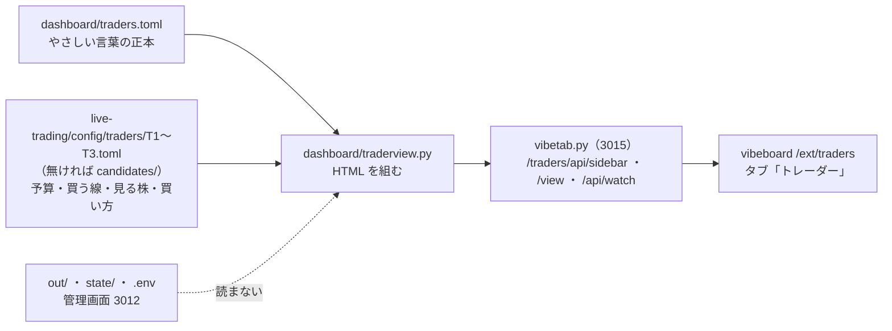
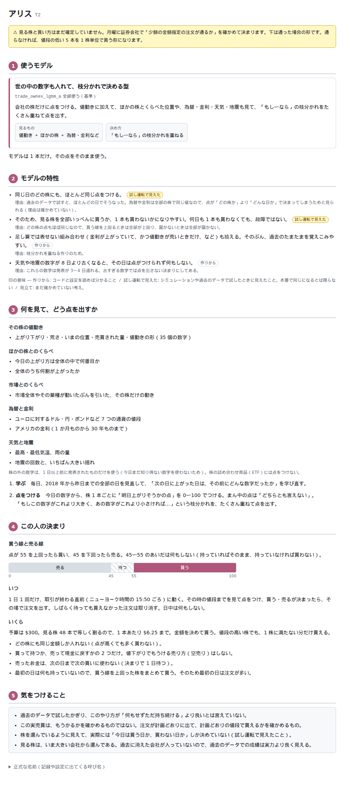

# vibeboard のタブに「トレーダー」を足す — まずはモデルの性質を、やさしい言葉で

利用者の指示（2026-09-20）:
- **vibeboard のタブにトレーダーを追加**
- **必要なのは実際の売買でどのような取引を行うか**
- **まずはモデルの性質を出す。売買結果などは出さない**
- **専門用語は使わずに分かりやすい言葉を使う**

## 0. 目的

実売買に出す 3 人（`T1`〜`T3`）が「何を見て・どう決めて・どんな売り買いをする人なのか」を、用語を知らなくても読める 1 枚にする。
火曜の投入の前後に、動いている注文を見て「この人はこういう性質だからこう動く」と読めるようにするのが使い道。

⚠ **出さないもの**: 損益・注文・約定・持ち高・差 1〜4 などの売買結果（管理画面 `dashboard/` の役目。後で足すかは利用者の指示を待つ）。
⚠ このプランは**プランの作成まで**。実装は着手の指示を受けてから。

## 1. 出すもの（1 人 1 ページ ＋ 見くらべる 1 ページ）

| 段 | 中身 | 例（`T2` の下書き。⚠ Step 1 で中身を確かめてから確定） |
| --- | --- | --- |
| ひとことで | その人を 1〜2 文で | 「会社の株 48 本だけを見る人。値動きに加えて、為替や金利など株の外の数字も見て決める」 |
| 何を見ているか | 入力を言葉で（列の名前は出さない） | その株の最近の値動き ／ 同じ日のほかの株とくらべた位置 ／ 市場全体とくらべた強さ ／ 為替・金利・天気・地震（1 日以上前に出た数字だけ） |
| どうやって決めるか | 学び方と、点数から売り買いへの変わり方 | 「毎日、過去の全部の日を見直して『次の日に上がりやすいのはどんな日か』を学び直す。今日の各株に 0〜100 の点をつけ、55 点以上なら買う・持っている株が線を下回ったら売る」 |
| いつ・どれだけ売買するか | 時刻・回数・1 本あたりの金額・持てる本数 | 「1 日 1 回、取引が終わる直前（ニューヨーク 15:50 ごろ）。予算 $300 を 48 本で割った $6.25 ずつ」 |
| 取引の癖 | 性質から来る動き方 | 「同じ日のどの株にもほとんど同じ点をつける。だから全部いっぺんに買うか、1 本も買わないかになりやすい。何日も 1 本も買わなくても故障ではない」 |
| 分かっていること・苦手なこと | 机上で分かった限界を正直に 1〜3 行 | §2 の Q2 |
| 正式な名前 | 実験名・手法・設定のファイル（ここだけ用語を使う。用語タブへリンク） | `trade_ownex_lgbm_a`・θ=55 … |

「見くらべる」は 3 人を同じ段で横に並べた 1 枚の表（何を見るか ／ 決め方 ／ 買う線 ／ 見る株の数 ／ 1 本の金額 ／ 癖）。

## 2. 決めること（⚠ 利用者。推奨で下書きを進め、裁定で直す）

| # | 決めること | 候補 | 推奨と理由 |
| --- | --- | --- | --- |
| Q1 | 「取引の癖」に数字を添えるか（売買の頻度・同時に持つ本数など。出どころはシミュレーション `sim3` と机上の検証） | (a) 言葉だけ ／ (b) 回数・本数だけ添える（お金の数字は出さない） | **(a) で始める**。「売買結果は出さない」との線引きがあいまいになるので、最初は言葉だけ。添えるなら (b) まで |
| Q2 | 「分かっていること」に机上の検証の結論を 1 行入れるか（例:「過去のデータで試したかぎり、ただ持ち続けるより良いとは言えていない。この実売買は儲けを確かめるためではなく、注文が計画どおりに通るかを確かめるためのもの」） | 入れる ／ 入れない | **入れる**。やさしい言葉だけの紹介は「うまくいくモデル」に読めてしまう。⚠ 実売買の判定は執行の差であって損益ではない（CLAUDE.md の 2 つ目の例外）ことを、この画面だけ見た人にも伝える。売買結果ではなく性質（限界）の説明 |
| Q3 | だれを出すか | `T1`〜`T3` だけ ／ 試験用 `test_a` も ／ シミュレーションの `sim_*` も | **`T1`〜`T3` だけ**（`test_a` は「決まった合図をそのまま出すだけの試験用」と 1 行で足してもよい）。`sim_*` は本物と混ぜない |

## 3. やさしい言葉の決まり

⚠ **本文（「正式な名前」以外の段）では下の左の語を使わない。** テストで機械的に確かめる（§6）。

| 使わない語 | 言い換え |
| --- | --- |
| 買い%・出口% | 「上がりそうかの点（0〜100）」・「手放す点」 |
| θ・閾値 | 「買う線（50 点 ／ 55 点）」 |
| 特徴量・列・層・`own`・`cs`・`rel`・`ex`・`seq` | 「見ている数字」— その株の最近の値動き ／ ほかの株とくらべた位置 ／ 市場全体とくらべた強さ ／ 株の外の数字 ／ 過去 60 日の値動きの形 |
| Ridge・線形・LightGBM・木・時系列分類器・QUANT | 「足し算で点を出すやり方」・「『もし〜なら』の枝分かれをたくさん重ねるやり方」・「過去 60 日の値動きの形を、いくつもの区間の高い・低いに分けて読むやり方」 |
| fit・訓練・較正・fold・walk-forward | 「毎日、過去を全部見直して学び直す」・「点を 0〜100 にそろえる」 |
| universe・`us63`・`company` | 「見る株（63 本 ＝ 会社の株 48 ＋ 指数などの詰め合わせ 15）」 |
| `sizing`・`notional`・端株 | 「金額で買う（1 株に満たない分も買う）」／「1 株単位で買う」 |
| 成行・執行の窓 | 「その時の値段ですぐ買う」・「取引が終わる直前の 20 分」 |
| B&H・n_trials・DSR・bp | 「ただ持ち続ける」。ほかは使わない（bp が要るなら「1 万分の 1」） |

- 1 文は短く。数字には単位。たとえ話は 1 段に 1 つまで（正確さを優先）
- 用語を知りたい人のために、「正式な名前」の段だけは用語のまま書き、用語タブへリンクする

## 4. つくり

> この図の主張: 言葉の正本は 1 本の TOML、数字は設定から写すだけで、売買の記録にも管理画面（3012）にも触れない。

| 部品 | 中身 |
| --- | --- |
| `dashboard/traders.toml`（新） | 言葉の正本（`glossary.toml` と同じ考え方 ＝ 説明を Python や HTML に書かない）。1 人 ＝ `[[trader]]`（`name`・各段の文）。利用者がそのまま直せる |
| 設定から写す数字 | 予算・買う線・見る株の本数・1 本あたりの金額・買い方・モデルの正式な名前。`config/traders/<名前>.toml` を読み、無ければ `candidates/notional/` を読んで「⚠ まだ確定していない（月曜の確認で決まる）」の印を出す。⚠ 同じ数字を TOML に二重に書かない |
| `dashboard/traderview.py`（新）・`vibetab.py` | 5 本目のタブ `traders`（サイドバー ＝ 見くらべる ／ T1 ／ T2 ／ T3）。標準ライブラリだけ・読むだけ。見張りは 2 種類のファイルの mtime |
| `vibeboard.config.json` | customTabs に `traders`（ラベル「トレーダー」） |

⚠ **守ること**: 読むだけ・操作を足さない（tailnet の閲覧者にも見える）／ baseUrl に dashboard（3012）を指定しない ／ `out/`・`state/`・`.env` を読まない ／ vibeboard 本体と `dashboard/app/`（g3plus に載る側）は変えない。

## 5. 影響範囲

| 場所 | 変更 |
| --- | --- |
| `dashboard/traders.toml`・`dashboard/traderview.py`（新） | 言葉の正本と画面 |
| `dashboard/vibetab.py`・`vibeboard.config.json` | タブの経路（既存 4 タブの動きは変えない） |
| `dashboard/tests/test_traders_tab.py`（新） | §6 |
| `docs/specs/dashboard.md`（§14 の後ろに節）・`CLAUDE.md`（vibeboard 固有の運用に 1 項目） | 仕様と決まり |
| ⚠ 触らない | `experiments/live-trading/` のコードと設定（読むだけ）・`experiments/feature-discovery/`（火曜まで凍結の範囲）・vibeboard 本体 |

## 6. テスト方針

- **やさしい言葉**: `traders.toml` の本文の段に §3 の「使わない語」が 1 つも無い（「正式な名前」の段は除く）。⚠ 語の一覧はテストが持ち、足すときは §3 の表と一緒に直す
- **設定とのずれ**: `traders.toml` の `name` が設定のトレーダーと 1 対 1 ／ 本文に書いた数字（買う線・本数・金額）を持たせない（設定から写したものだけが画面に出る）ので、設定を変えれば画面が変わること
- **出さないもの**: 応答に `out/`・`state/` 由来の値が無い（読み手がその場所を開かないことを、場所を空の tmp に向けても同じ HTML が出ることで確かめる）
- `vibetab`: `/traders/api/sidebar`・`/traders/view?item=T1`・知らない item は 404・既存 4 タブの応答が変わらない・HTML は `esc()` を通す
- 仕上げに vibeboard 越し（`/ext/traders`）で開いてスクリーンショットを見る

## 7. 段取り

- [x] Step 0: Q1〜Q3 ＝ 推奨のまま（✅ 2026-09-20。利用者「vibeboard にトレーダーを入れる」で着手。Q1 言葉だけ ／ Q2 限界の 1 行を入れる ／ Q3 `T1`〜`T3` だけ。⚠ 裁定で変わったら `traders.toml` と §16 を直す）
- [x] Step 1: 性質を確かめて、やさしい言葉の下書きを書く（`dashboard/traders.toml`。⚠ 利用者が読んで直す）
- [x] Step 2: `traders.toml`・`traderview.py`・`vibetab.py` の経路・`vibeboard.config.json` ＋ テスト 11 本
- [~] Step 3: 見て直す — ✅ 新しい sidecar を別のポート（3016）に起こして `T2` と「見くらべる」を撮って読んだ ／ ⚠ **残り（利用者）**: vibeboard と sidecar（3015）の入れ直し → `/ext/traders` 越しに見る
- [x] Step 4: 仕様（[dashboard.md §16](../specs/dashboard.md)）・`CLAUDE.md`

## 8. 結果（2026-09-20）

- 確かめた性質の出どころ: 見ている数字 ＝ `ail/features/own.py`（35 本 ＝ 上がり下がり 7・荒さ 6・位置 6・売買の量 4・形 5・足の形 3・暦 3・足の間隔 1）・`cross.py`・`relative.py`・`config/dataset/exog_live.toml`（為替 7・金利 7・天気 3・地震 2）・`seq.py`（60 日の窓）／ 決め方 ＝ 実験の config（3 本とも 2018-01-31 から・1 日先）・`detectors/tsc.py`（QUANT 653 本 → 同じ頭）・rules.md 13-3（買い% > θ で買い・買い% < 100 − θ で売り・買い専用）／ 癖 ＝ `sim3` の人ごとの本数（T1 買い 399 ／ 売り 343・T2 48 ／ 0・T3 85 ／ 22【実測・モック】）と topk-holdings.md（T2 は 96% の日で全銘柄が同点）。⚠ 画面には回数を出していない（Q1）
- テスト【実測】: 新 11 本（やさしい言葉・設定の数字を書かない・設定を変えれば画面が変わる・候補は「未確定」・escape・売買の記録を開かない・経路）／ 管理画面の pytest 178 本（167 ＋ 11）
- ⚠ 原因まで確かめていない癖（T2 の同点の理由・T3 の売り買いが少ない理由）は「〜と見られる」と書いた

## 9. 組み直し（2026-09-20。利用者の指示）

利用者:「デザインと構成が見づらい。まず黒背景はやめる。そのうえで全体の大見出しを決めて、そこに分かりやすい内容を入れる。まず構成を考えて」→ 構成案を出し、呼び名の決定（下）を受けて実装した。

- 見づらかった原因: 黒背景（OS の設定に合わせていた）／ 見出しが小さく、下が長文 ／ 本題（どんな売り買いになるか）が 4 番目に埋もれていた ／ 「見くらべる」の表の 1 マスが長文
- 直し: 白地に固定 ／ 左の一覧を「はじめに」（3 人のちがい・1 日の流れ）と「トレーダー」に分ける ／ 1 人のページは番号つきの大見出し 5 つ（全員同じ順。本題を 2 番目へ）／ 3 人の札（4 行だけ）／ **点のものさし**（買う線・売る線を 0〜100 の帯で。幅は設定から）／ 1 項目 1〜2 行・理由は小さい字 ／ 正式な名前は畳む ／ 全員に共通の文は「1 日の流れ」に集める。§1・§3 の段の名前はこの節が正（仕様は [dashboard.md §16-1](../specs/dashboard.md)）
- **呼び名**（利用者の決定）: `T1` ＝ アキ ／ `T2` ＝ アリス ／ `T3` ＝ カエデ。⚠ 意味の無い名前にする（「意味があるものにしたら次に少し違うタイプのトレーダーを作れないのでダメ。どうでもいい名前にして」）。鍵は `T1`〜`T3` のまま
- テスト【実測】: 13 本（大見出しの順・札に長文を置かない・ものさしの幅・白地の固定・呼び名 を足した）／ 管理画面の pytest 180 本

## 10. もう一度組み直し — 主役はモデル・1 人 1 ページだけ（2026-09-20。利用者の指示）

利用者:「使用するモデルを表示して、それの特性を書くかたちにする。今書かれてる文章は全部嘘？」「『3 人の中で』とか書いてあるけど、トレーダーは常に変わるし 1 人になるときもあれば 10 人になるときもあるので無駄な比較の文章はいらない」「トレーダーの人数は数えなくていい。3 人の違いのページはいらない。一人一人のトレーダーに関して書けばいい」

- 「全部嘘か」への答え: 作りから言えること（何を見るか・学び方・線とのくらべ方・お金の決まり）はコードと設定で確認済み ／ 売り買いの癖は試し運転（64 営業日のシミュレーション・机上の検証）で見えただけ ／ 癖の「理由」は見立て（1 つは言い切っていた）／ ⚠ **誤りが 1 つ** ＝「T1 は初日の注文がいちばん多い」（試し運転の初日は T3 63 本 ／ T1 60 本）。原因は比較の文を作ろうとしたこと
- 直し: §9 の「3 人のちがい」「1 日の流れ」のページを消し、**左の一覧はトレーダーだけ**（設定から引く・人数を数えない）／ 特性は `[[model]]` に書き、ページは設定の `[[models]]` から引いて写す（実験名と手法の両方が同じものだけ）／ 特性に**どこまで確かかの印**（作りから ／ 試し運転で見えた ／ 見立て。印が無ければ見立て）／ くらべる文をテストで弾く ／ 呼び名は `[nicks]`（鍵 → 呼び名）。いまの構成の正は [dashboard.md §16-1](../specs/dashboard.md)（§1・§9 の段の名前は古い）
- テスト【実測】: 16 本（くらべる文が無い・全部の特性に印・だれが居るかは設定から・試験用を出さない・手法が違えば別のモデル・モデルが複数の人 を足した）／ 管理画面の pytest 183 本

