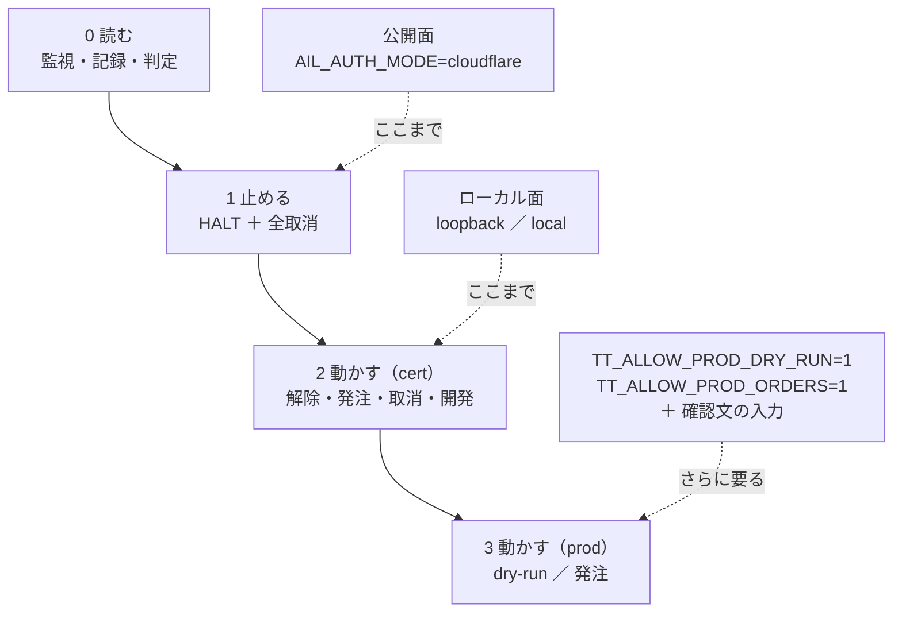
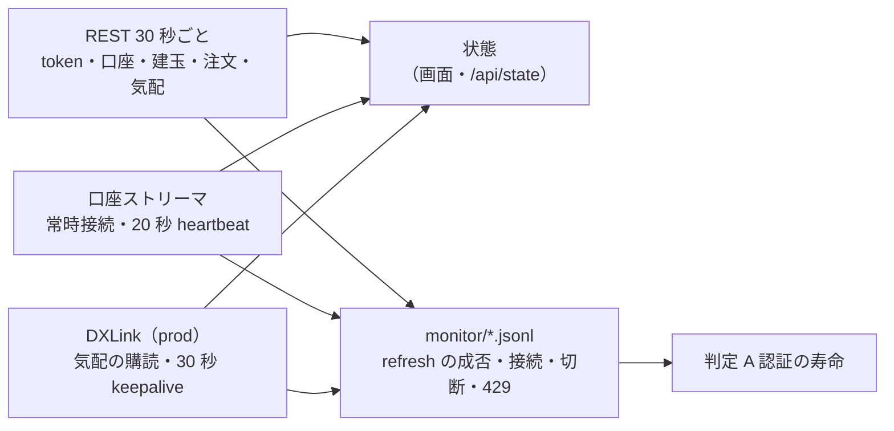
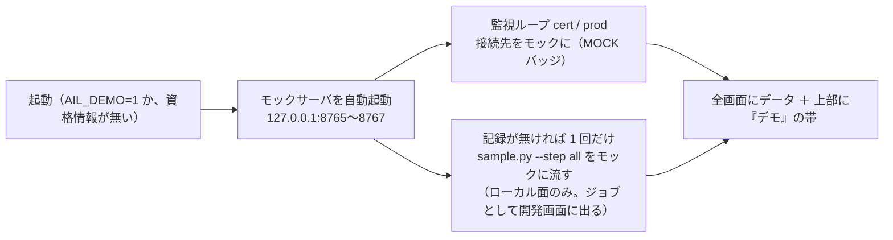
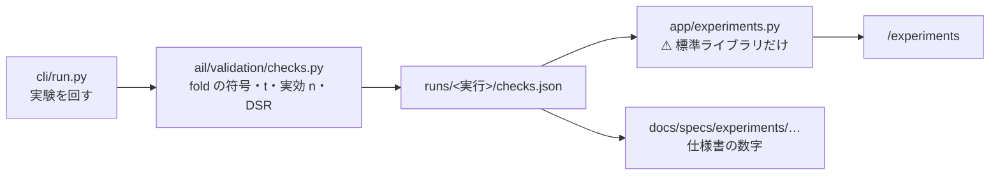
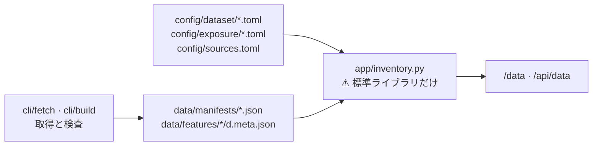

# 管理画面（dashboard/）— 仕様とデプロイ契約

作成: 2026-09-05 / プラン: [docs/plans/archive/dashboard.md](../plans/archive/dashboard.md) / コード: [dashboard/](../../dashboard/)

売買システムの管理画面。**実運用の監視**（口座・注文・認証の残り時間・websocket の状態）と、
**開発時の検証**（記録の閲覧・差分・6 観点の自動判定・モックと手順の実行）を 1 つのアプリで持つ。
このプロジェクト最初のアプリ実装で、[tastytrade の API 検証](experiments/tastytrade-api-sample.md)の記録と
クライアント（`experiments/tastytrade-api-sample/`）の上に載る。

⚠ [vibeboard](../../vibeboard/) とは別物（あちらは `docs/` と `TODO.md` を見るローカル開発用）。

## 1. 画面

| 画面 | パス | 面 | 中身 |
| --- | --- | --- | --- |
| 監視 | `/` | 両方 | 環境ごと（cert / prod）に: 認証の残り秒数と scope・refresh の成否、口座・残高・買付余力、建玉、働いている注文、現在値と遅延、口座ストリーマと DXLink の接続状態・最終受信・切断と再接続の回数、エラーと 429 の回数。5 秒ごとに部分更新 |
| 記録 | `/records`、`/records/<run_id>`、`/records/diff?a=&b=` | 両方 | 実行記録（JSONL）の一覧・1 実行の詳細（手順ごとの detail）・**実行間の差分**（所要 ms と状態遷移の時刻を項目ごとに並べ、B − A を出す） |
| 判定 | `/judge` | 両方 | **6 観点 × 会場**の表を記録から自動生成。根拠の run_id と手順つき。モックの記録は除外 |
| **検証** | `/experiments`、`/experiments/<run_id>` | 両方 | **特徴量の発見手法の検証**を、種類ごとのタイトルと**比較できるスコア**で並べる（§10）。⚠ **先読みの対照実験は一覧から外して別枠に出す** |
| **データ** | `/data` | 両方 | **実験（feature-discovery）が保持しているデータの在庫**（§11）。層・取得元・枠（本命 ／ 偽薬）・系列数・行数・期間・ずらし幅・規約の判定・割り当て |
| 操作 | `/ops` | ローカルのみ | 停止 / 解除、cert の dry-run → 発注 → 取消 → 後片付け、prod の 2 段ロック、操作の履歴 |
| 開発 | `/dev`、`/dev/jobs/<id>` | ローカルのみ | モックの起動・停止、`selftest.sh` の実行、手順を選んで `sample.py` を実行（出力を逐次表示） |
| JSON | `/api/state`、`/api/records`、`/api/judge`、`/api/experiments`、`/api/data`、`/api/events` | 両方 | 画面と同じ内容（マスク済み）。読み取りだけ |

ヘッダには常に **環境バッジ（CERT 緑 / PROD 赤 / MOCK 紫）と scope**、面（公開 / ローカル）、**停止ボタン**が出る。
停止中は赤い帯が全画面に出る。

## 2. 権限の設計

> この図の主張: 権限は 4 段で、公開面は 2 段目（読む・止める）で止まる。発注の経路は公開面には存在しない（404）。



| `AIL_AUTH_MODE` | 通す接続元 | 認証 | 面 |
| --- | --- | --- | --- |
| `loopback`（**既定**） | ループバックのみ | なし | ローカル |
| `local` | ループバック ＋ RFC1918 | なし（ヘッダに「認証なし」と出す） | ローカル |
| `cloudflare` | ループバックは免除。それ以外は **全リクエスト（GET 含む）で `Cf-Access-Jwt-Assertion` を検証**（JWKS で RS256、aud・iss・email を照合） | Cloudflare Access | 公開 |

- `cloudflare` は `CF_ACCESS_TEAM` / `CF_ACCESS_AUD` / `CF_ACCESS_EMAIL` が**全部そろわないと起動しない**。他のモードで CF_* が置かれていても起動しない（中途半端な設定で素通りさせない）
- `X-Forwarded-For` は見ない。接続元は cloudflared のコンテナで、そこから先は JWT で決める
- 無認証の `/health` は無い（コンテナの healthcheck はループバックから叩く）
- POST は同一プロセスの CSRF トークン（cookie `SameSite=Strict` ＋ hidden）を要求する

### 停止ボタンの中身

1. `HALT` フラグ（記録ディレクトリの `HALT`、JSON で時刻・誰が・理由）を書く。**`sample.py` はこのファイルがあると発注系の手順（4・5・5limit・6）を拒否する**（exit 3）。`cleanup` は通る
2. 監視している環境ごとに、働いている注文（Received / Routed / In Flight / Live / Contingent）を全部取り消す。
   cert は常に可。**prod は資格情報の scope に `trade` があるときだけ**（無ければ「取消は不可」と結果に出す）
3. 解除はローカル面だけ

### 本番の鍵（`ttclient.py` と同じ 3 段）

| 操作 | cert | prod |
| --- | --- | --- |
| dry-run | 可 | `TT_ALLOW_PROD_DRY_RUN=1` |
| 取消 | 可 | `allow_prod_cancel`（停止ボタンと取消ボタンが使う。**この鍵で発注は開かない**。2026-09-05 に `ttclient.py` へ追加） |
| 発注 | 可（dry-run を必ず先に通す） | `TT_ALLOW_PROD_ORDERS=1` **＋ 確認文 `i-know-this-is-real-money` の入力** ＋ 停止中でない |

画面から本番に出せる注文は 1〜10 株の株式 1 レッグだけ。Phase 6（本番で 1 株）は利用者が CLI で行う前提で、
画面の開発機能は prod に対して `probe` と `dryrun` しか通さない。

## 3. 秘密の扱い

- client secret・refresh token・access token・id token・quote token・口座番号は**ブラウザに送らない**
- すべての画面・JSON は `Redactor`（`record.py` の `Masker` ＋ 口座番号のラベル化）を通す。口座番号は `acct-<sha256 の先頭 4 桁>`
- 未登録の JWT も正規表現で落とす。ジョブの標準出力もマスクしてから保持する
- `Cache-Control: no-store`、CSP `default-src 'self'`、外部リソースなし、`X-Frame-Options: DENY`
- テスト（`dashboard/tests/test_app.py`）は偽の秘密を仕込んで全ページ・全 JSON を grep し、0 件であることを固定している

## 4. 監視ループ

> この図の主張: 環境ごとに REST 1 本と websocket 2 本を持ち、出口は画面の状態と monitor/*.jsonl の 2 つ。



| 何を | どう |
| --- | --- |
| 認証 | 失効 60 秒前に refresh。失敗は指数バックオフ（15 分 → 30 分 → …）、**3 連続で止める**（IP ブロック回避。再試行はローカル面のボタン）。token 応答の `scope` を保持し、ヘッダに出す |
| 口座 | `AIL_POLL_SECONDS`（既定 30）ごとに残高・建玉・働いている注文。口座番号は最初の照会で決める（`TT_ACCOUNT_NUMBER` があればそれ） |
| 現在値 | prod（とモック）だけ `AIL_SYMBOL`（既定 SPY）の REST 気配。`updated-at` との差を遅延として出す |
| 口座ストリーマ | `Bearer` 付きで connect、heartbeat には最新の access token を載せる。切れたら 5 秒 → 最大 120 秒のバックオフで再接続。通知（Order / AccountBalance / CurrentPosition）は直近 50 件 |
| DXLink | `GET /api-quote-tokens` の `dxlink-url` に繋ぐ。23 時間でトークンを取り直す。Quote / Trade の最新値と件数 |
| イベント | `monitor/<venue>-<env>-<UTC 日付>.jsonl` に `refresh_ok` / `refresh_fail` / `ws_connect` / `ws_disconnect` / `api_error` / `http_429` / `halt` / `resume` を追記 |

## 5. 判定の規則（記録の値だけから）

| 観点 | ✅ | ⚠ | ⏳ 未実測 |
| --- | --- | --- | --- |
| A 認証の寿命 | 手順 1 の成功と監視ログの `refresh_ok` が **2 営業日以上**にまたがる | またがるが `refresh_fail` もある | 同じ営業日の成功しか無い |
| B 常駐 | 同じ実行で手順 1・2・6 が ok | 1・2 だけ ok | 記録なし |
| C 現在値 | prod の手順 3 が**市場時間内**（ET 平日 9:30〜16:00）で `delay_s` < 1 | 市場時間内で 1 秒以上 | 時間外の記録しか無い（遅延は参考値と明記）／本番の資格情報なし |
| D 発注の往復 | 手順 4 と 5（または 51）が ok | 4 だけ ok | 記録なし（4 が失敗なら ❌） |
| E レート制限 | 手順 7 で 60 回/分が通り 429 なし | 429 が出た／60 回に達していない | 記録なし |
| F SDK | 記録の `sdk` 欄が「直接叩き」（OpenAPI 仕様がある） | SDK を使っている | 記録なし |

`mock: true` の行を含む実行は判定に使わない。会場（`venue`）ごとに列を並べる。

## 6. データの置き場

```
<AIL_DATA_DIR>/                  既定 dashboard/data、Docker では /app/data（volume）
├── records/                     実行記録 *.jsonl（AIL_RECORDS_DIR で別の場所も可。開発機の既定はサンプルの out/）
│   └── HALT                     停止フラグ（sample.py の TT_HALT_FILE の既定と同じ場所）
├── monitor/<venue>-<env>-<日付>.jsonl   監視イベント
├── ops/history.jsonl            操作の履歴（マスク済み）
└── jobs/history.jsonl, mock.log ジョブの履歴とモックのログ
```

⚠ **検証（§10）とデータ（§11）だけは `<AIL_DATA_DIR>` の外を読む。**

| | 既定 | 中身 |
| --- | --- | --- |
| `AIL_RUNS_DIR` | `experiments/feature-discovery/runs/` | ⚠ **読むだけ。** 管理画面は 1 バイトも書かない。⚠ **git 管理外なので、別環境では空でよい**（画面は空でも 200 を返す） |
| `AIL_EXP_DIR` | `experiments/feature-discovery/` | ⚠ **読むだけ**（§11 が `data/manifests/`・`data/features/*/…meta.json`・`config/` を読む）。⚠ **無くても画面は 200 を返す** |

## 6-2. デモ（鍵なしで動かす。2026-09-08）

資格情報が 1 つも無いとき、または `AIL_DEMO=1` のとき、本物には繋がず**モックサーバのデータで全画面を出す**。
デザイン確認と、鍵を置く前のサーバ起動のため。この図の主張: **デモは「資格情報の代わりにモックを差す」だけで、画面・監視ループ・記録の経路は本物と同じものを通す**。



| 項目 | 内容 |
| --- | --- |
| 判定 | 通常はモックの記録を除外するが、デモでは含めて表を組み立てる（見出しに DEMO バッジ。本物の判定には使わない） |
| データの置き場 | `data/demo/` 配下（記録・監視ログ・ジョブ・操作履歴）。本物の記録（`out/`・`data/records`）と混ぜない |
| 資格情報があるとき | `AIL_DEMO=1` なら本物には一切繋がない（監視は cert / prod ともモック）。`AIL_DEMO=0` で強制オフ |
| 面の規則 | 変えない。公開面（cloudflare）では操作・開発は出ない。g3plus は `.env` の資格情報が空なら自動でデモになる |

## 7. デプロイ契約（正本）

g3plus-ops 側の `ail-dashboard/`（Dockerfile・compose・手順書）はここに従う。契約が変わったらあちらを追従させる。

| 項目 | 値 |
| --- | --- |
| ベース | `python:3.12-slim`。ネイティブビルドなし（依存は `dashboard/requirements.txt` の 7 つ。`cryptography` は wheel） |
| build context | リポジトリの clone（public なので `git clone` → `git pull`）。COPY するのは `dashboard/app/`・`dashboard/requirements.txt`・`experiments/tastytrade-api-sample/*.py` と `*.sh` |
| 起動 | `cd /app/dashboard && python -m app.main`（uvicorn。`AIL_BIND=0.0.0.0`、`AIL_PORT=3012`） |
| ポート | **3012**。`ports:` でホスト公開しない（到達できるのは同じ docker network の cloudflared だけ） |
| 必須 env | `AIL_AUTH_MODE`（公開時 `cloudflare` ＋ `CF_ACCESS_TEAM` / `CF_ACCESS_AUD` / `CF_ACCESS_EMAIL`）、監視したい環境の資格情報（`TT_PROD_*` は **read スコープの grant を別に切って渡す**のが既定。cert の `TT_*` は任意） |
| 置かない env | `TT_ALLOW_PROD_ORDERS` / `TT_ALLOW_PROD_DRY_RUN`（公開面には発注経路が無いので意味を持たないが、置かない） |
| 永続化 | `/app/data`（§6）。**唯一の永続化対象** |
| 検証の画面 | ⚠ **`experiments/feature-discovery/runs/` は COPY しないので、g3plus では空になる**（画面は空でも 200）。見せたいときだけ `AIL_RUNS_DIR` を volume で差す。⚠ **読み取り専用でよい** |
| データの画面 | ⚠ **`experiments/feature-discovery/` も COPY しないので、g3plus では空になる**（画面は空でも 200）。見せたいときだけ `AIL_EXP_DIR` を volume で差す。⚠ **読み取り専用でよい** |
| TZ | `America/Los_Angeles` |
| healthcheck | コンテナ内ループバックで `GET /` が 200（`python -c "urllib.request.urlopen('http://127.0.0.1:3012/')"`） |
| 外向き通信 | `api.tastyworks.com` / `api.cert.tastyworks.com`（REST）、`streamer.tastyworks.com` / `streamer.cert.tastyworks.com`（口座 websocket）、`*.dxfeed.com`（DXLink。URL は応答の `dxlink-url`）、`<team>.cloudflareaccess.com`（JWKS） |
| 段階的な有効化 | Access の AUD が無いうちは `AIL_AUTH_MODE=loopback`（非ループバックは全部 403 = fail-safe）で起動しておき、Access アプリ → `.env` に 3 変数と `cloudflare` → Tunnel hostname の順で開ける |
| エッジキャッシュ | ホスト全体 Bypass の Cache Rule を入れる（キャッシュ HIT は認証評価前に配信される。アプリ側も `no-store` を返す） |

## 8. 検証（2026-09-05）

| # | 検証 | 結果 |
| --- | --- | --- |
| 1 | 秘密がブラウザに出ない | ✅ `tests/test_app.py`: 偽の client secret・refresh・access token・口座番号を仕込み、12 経路の応答を grep して 0 件。モックに対する実機の全ページでも 0 件 |
| 2 | 面の判定 | ✅ `tests/test_access.py`: loopback / local / cloudflare の 3 モード、JWT の aud・iss・email・署名鍵の不一致で 403、cookie でも通る。公開面で `/ops` `/dev` が 404、停止だけ 303 |
| 3 | 本番ガードの 3 つの鍵 | ✅ `experiments/tastytrade-api-sample/test_guard.py`（selftest.sh に組み込み）: dry-run の鍵・取消の鍵で発注が開かない |
| 4 | HALT | ✅ selftest.sh: フラグがあると `sample.py --step 4` が exit 3、`cleanup` は通る。画面: 停止中の発注は拒否、解除で消える |
| 5 | 判定の再現性 | ✅ `tests/test_records_judge.py`: 市場時間内の成功記録 2 営業日で A〜F すべて ✅、モック除外、部分記録で ⏳ / ⚠ / ❌ |
| 6 | 配線（監視ループ） | ✅ モック（`--market-data`）に対して cert / prod の 2 環境で認証・照会・口座ストリーマ・DXLink が繋がり、dry-run → 発注 → 停止（取消 1 件）→ 解除 → 後片付け、selftest ジョブの実行まで通した |
| 7 | Docker | ✅ 開発機で `docker build`（context = リポジトリ、165 MB）→ 起動（既定 loopback）: コンテナ内ループバックの `/` が 200、ホストから公開ポート経由（非ループバック）は 403、`AIL_AUTH_MODE=cloudflare` で AUD 欠けは `ConfigError` で起動せず、healthcheck は healthy |

## 10. 検証の画面（2026-09-08）

⚠ **`/judge` は「tastytrade の API が使えるか」の判定、`/experiments` は「分析手法の検証」で別物。**
材料も別で、こちらは `experiments/feature-discovery/runs/` を読む。

> この図の主張: ⚠ **重い計算は実験を回すときに 1 度だけ。管理画面は読むだけにする。** だから仕様書の数字と画面の数字がずれない。



⚠ **管理画面に pandas / scipy を入れない**（`requirements.txt` は増やさない）。

### 10-1. 検証の種類とタイトル

⚠ **タイトルは付けずに設定から組み立てる。** 手で名前を書くと実行のたびにずれる。

| 部品 | どこから | 値 |
| --- | --- | --- |
| 種類 | `feature_layers` に `cs` `rel` `ll` があるか | **プーリング** ／ **断面** |
| 粒度 | `bar_minutes` | 日足 ／ 1 分足 |
| 地平 | `horizon` × `bar_minutes` | 1 日先 ／ 1 取引日先 |
| データの層 | 記録の `layer`（`cli/build.py` が書く sidecar が正） | 調整後 ／ ⚠ **調整前** |
| 対照実験 | 実行名の `_leak` | ⚠ **（先読みの検査）を後ろに付ける** |

⚠ **例**: `2026-09-08T19-42-54_cross_section_h1` → **「断面・日足・1 日先・調整後」**。
⚠ **先読みの実行も「断面・…（先読みの検査）」と書く**（どの検証の対照かが読めないと意味が無い）。

### 10-2. スコア

⚠ **スコア = 最良手法（基準線を除く）の純利 bp**（利用者が 2026-09-08 に決めた）。降順に並べる。

| # | 規約 | ⚠ 理由 |
| ---: | --- | --- |
| 1 | ⚠ **基準線をスコアにしない**（「常に上」「直前リターンの符号」「全部使う」「乱択」） | ⚠ **「常に上」が 1 位になると比較の意味が消える。** 基準線は比べる相手であって採否の対象ではない |
| 2 | ⚠ **先読みの対照実験を一覧に入れない。** 別表に出す | ⚠ **的中率 99% の検証がスコア 1 位に出ると、一覧全体が嘘になる** |
| 3 | ⚠ **検査の 5 列を必ず横に並べる** | ⚠ **スコアは 1 つの数字なので、fold の偏りも多重検定も数字自体には出ない** |
| 4 | ⚠ **検査が無い実行は ⏳。** 0 や ✅ で埋めない | ⚠ **「計算していない」と「通らなかった」は別物** |

### 10-3. 横に並べる 5 列（✅ の条件）

| 列 | ✅ | ⚠ | ⏳ |
| --- | --- | --- | --- |
| **層** | `adjusted`（調整後） | ⚠ **日足 × `raw`**（分割調整の誤りを含む＝ 無効） | 1 分足 × `raw`（誤りは日足にしか無い） |
| **純利** | 往復コストを引いて正 | 0 以下 | スコアが無い |
| **fold** | ⚠ **全 fold で正** | 符号が割れる | fold の記録が無い |
| **上乗せ** | 「常に上」への上乗せの **t > 3.0** | 3.0 以下 | 上乗せを測れない |
| **DSR** | ⚠ **実効標本数で割り引いた**デフレーテッド SR > 0.95 | 0.95 以下 | パネルを確かめられず未計算 |

⚠ **DSR は「SR > 0」の検定であって「基準線を超えたか」ではない。** その比較は「上乗せ」の列が担う。
⚠ **`n_trials` は増えていく。** 画面には**そのときの試行数**を出し、正本は
[台帳](experiments/feature-discovery/ledger.md)のままにする。

### 10-4. ⚠ この画面で埋まらないもの

| # | 限界 | ⚠ 効き方 |
| ---: | --- | --- |
| 1 | ⚠ **スコアは 1 つの数字。** fold 1 だけで作られた数字も高く出る | ⚠ **検査の 5 列と、画面の注記で補う。** 隠さない |
| 2 | ⚠ **無効な検証（日足 × `raw`）もスコア順では上に来る** | ⚠ **層の列が ⚠ になるが、並び順では下がらない** |
| 3 | 検証どうしは条件が違う（粒度・地平・層・列の数） | ⚠ **スコアの差が手法の差とは限らない。** 条件を同じ行に出す |
| 4 | ⚠ **後から `checks.json` を書くとき、当時のパネルが残っていないと実効標本数と DSR は出せない** | ⚠ **層と行数の両方が一致する実行だけ計算し、それ以外は鍵ごと省く** |

⚠ **デモ（§6-2）はこの画面に効かない。** 検証の数字は `AIL_RUNS_DIR` の記録をそのまま読むので、
⚠ **デモ中でも本物である。** ⚠ **デモの帯は「モックのデータを表示している」と書くので、この画面では
そのままだと嘘になる**（2026-09-08 に踏んだ）。帯に「この画面はデモの対象外」と足し、
フッタの出所も `records/` ではなく `runs/` を出す。

### 10-5. 閾値つき売買の実行（2026-09-10）

検証方式が**閾値つき売買**（[rules.md 13 章](experiments/feature-discovery/rules.md)）の実行は、
`checks.json` に `style: "threshold"` が付く。⚠ **画面は写しを出すだけ**の原則はそのまま。

| 変わるもの | 中身 |
| --- | --- |
| タイトル | 末尾に **「閾値売買・共通」／「閾値売買・銘柄別」** が付く（形式 (A)(B) を見分ける） |
| 上乗せの列 | ⚠ **相手が「常に上」（粗利）ではなく B&H（純利）**（`edge_vs_bh`。rules 13-7）。✅ の条件（t > 3.0）は同じ |
| fold の列 | ⚠ **fold の符号は対 B&H の上乗せの符号**（純利の符号では「買って持っただけ」と区別できない） |
| 詳細ページ | **「閾値ごとの成績」**を 3 水準とも出す（θ・最良手法・純利・B&H 純利・上乗せ・DSR・**取引回数・保有日率**・銘柄別 bp の要約）。⚠ **良かった閾値だけ出さない**（rules 13-3）。⚠ **取引回数を必ず横に置く**（「θ が高いほど良い」＝「取引しないだけ」を見抜くため。rules 13-10） |
| 一覧のスコア | 最良手法 × 最良閾値のポートフォリオ純利 bp（`best.閾値` を併記）。⚠ **3 水準の全体は詳細ページが持つ** |

⚠ **銘柄別 bp（`per_symbol.csv`）は要約（中央値・四分位・勝ち銘柄数）だけ出す。**
成果物であって採否には使わない（rules 13-7）。vibeboard の検証タブ（`vibetab.py`）も同じ写しを出す。

## 11. データの画面（2026-09-09）

実験（`experiments/feature-discovery/`）が**何をどれだけ持っているか**を 1 画面にする
（プラン: [docs/plans/archive/dashboard-data-inventory.md](../plans/archive/dashboard-data-inventory.md)）。
§10 と同じ立て方で、⚠ **実験側が書いたものを読むだけ**。CSV / parquet を開いて数え直さない。

> この図の主張: ⚠ **数字は実験側が取得時に書き、画面は読むだけ。** だから manifest と画面の数字がずれない。



### 11-1. 何をどこから写すか

| 見せるもの | 正本 | ⚠ 規約 |
| --- | --- | --- |
| 系列数・行数・最古と最新の日・検査の引っかかり | `data/manifests/<層>_<粒度>.json` | ⚠ **manifest の値をそのまま出す**（数え直さない。rules.md 5 章の指紋が正） |
| 特徴量の表（行数・列数・元の層） | `data/features/<実験>/<粒度>.meta.json`（`cli/build.py` の sidecar） | ⚠ **先読み検査用（`_leak`）は別枠に出す** |
| 枠（本命 ／ 偽薬）・仮説 | `config/dataset/*.toml` の `role` `hypothesis` | ⚠ **取得の前の宣言を写すだけ。結果を見て分類しない。** manifest の枠（取得時の写し）と食い違ったら ⚠ を立てて見せる（黙ってどちらかを選ばない） |
| 銘柄の種別（会社株 ／ ETF ／ 実質は株の ETF） | `config/universe/*.toml` の `groups` | ⚠ **宣言を銘柄名で引くだけ**（画面が銘柄名から推測しない）。⚠ **宣言に無い銘柄は「分類なし」で見せる**（黙ってどちらかに寄せない）。集合の限界（生存バイアス・選定日）も一緒に出す |
| ずらし幅・公表の遅れ・規約の判定 | `config/sources.toml`（2026-09-09 新設） | ⚠ **実効値は `ail/features/exog.py` / `impact.py` が持つ。** 一致は実験側の `tests/test_sources_decl.py` が固定する（同じ数字を 2 か所で手管理しない） |
| 割り当て（災害 → 銘柄の重み） | `config/exposure/*.toml` | ⚠ **全部【推測】・後知恵あり（`hindsight`）を画面に明示する**（宣言の写し） |

### 11-2. 規約の判定は 3 分類

| 判定 | 意味 | 例 |
| --- | --- | --- |
| 公有 | 米政府の著作物（17 U.S.C. §105） | 財務省・NOAA・USGS・NCEI |
| robots | robots.txt と規約を実測して問題なし | ECB・EPU・IEM（`Crawl-delay: 120` を守る） |
| 契約 | 口座の規約の範囲で使う | tastytrade |

⚠ **「要判断」の取得元（FRED・Open-Meteo・SILSO）はデータを持っていないので画面に出さない**
（[daily-data-sources.md §2・§4](experiments/daily-data-sources.md) が正本）。

### 11-3. 面とデモ

- 読むだけ・秘密なし（外部系列と足は公開データ）なので**公開面にも出す**。応答は他の画面と同じく `Redactor` を通す
- ⚠ **デモ（§6-2）の対象外**（§10-4 と同じ理由）。帯に「この画面はデモの対象外」と足し、フッタの出所は `AIL_EXP_DIR` を出す
- ⚠ **`AIL_EXP_DIR` が無い・壊れた JSON / TOML でも 200 を返す**（g3plus には COPY しない。§7）

## 9. 更新履歴

- 2026-09-05: 初版（Phase 1〜4 の実装、デプロイ契約）
- 2026-09-07: g3plus で初回起動（§7 の契約どおり。loopback 面・資格情報なしで healthy、ホストポート非公開、非ループバック 403）。資格情報と Cloudflare は未（利用者）
- 2026-09-08: デモ（§6-2）。鍵なしでモックのデータを全画面に出す。pytest 24 件（デモ 5 件を追加）
- 2026-09-08: **検証の画面**（§10）。`/experiments` に特徴量の発見手法の検証を、種類ごとのタイトルと比較できるスコア（最良手法の純利 bp）で並べる。検査（fold の符号・上乗せ t・実効標本数・デフレーテッド SR）は**実験側が `checks.json` に書いたものを読むだけ**。プランは [docs/plans/archive/dashboard-experiments.md](../plans/archive/dashboard-experiments.md)
- 2026-09-08: 黒ベースに作り直し（`app/static/app.css` 全面。環境の色 cert 緑 / prod 赤 / MOCK 紫 と、状態の色 ok / warn / ng の 2 系統。監視は幅があれば cert と prod を横に並べ、注文表は折り返さず、口座ストリーマの通知は枠の中でスクロール）。プランと画面は [docs/plans/archive/dashboard-dark-design.md](../plans/archive/dashboard-dark-design.md)
- 2026-09-09: **データの画面**（§11）。`/data` に実験が保持しているデータの在庫（足・外部系列・特徴量・規約・割り当て）を出す。数字は実験側の manifest / config の写しで、ずらし幅と規約の判定は `config/sources.toml`（新設。コードとの一致は実験側のテストが固定）。プランは [docs/plans/archive/dashboard-data-inventory.md](../plans/archive/dashboard-data-inventory.md)
