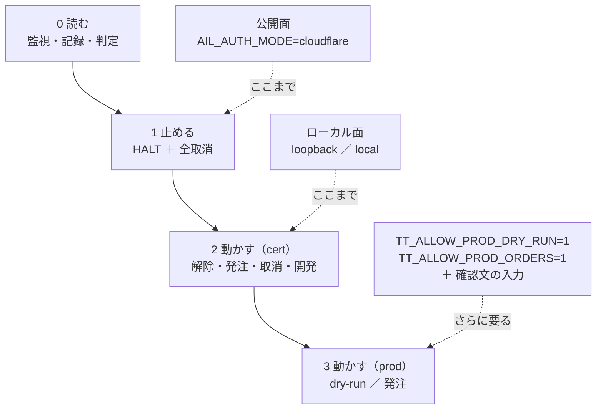
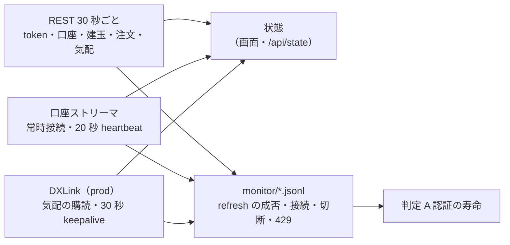
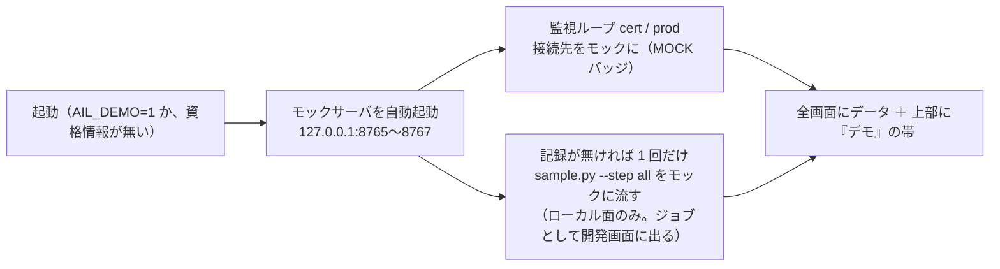

# 管理画面（dashboard/）— 仕様とデプロイ契約

作成: 2026-09-05 / プラン: [docs/plans/dashboard.md](../plans/dashboard.md) / コード: [dashboard/](../../dashboard/)

売買システムの管理画面。**実運用の監視**（口座・注文・認証の残り時間・websocket の状態）と、
**開発時の検証**（記録の閲覧・差分・6 観点の自動判定・モックと手順の実行）を 1 つのアプリで持つ。
このプロジェクト最初のアプリ実装で、[tastytrade の API 検証](experiments/tastytrade-api-sample.md)の記録と
クライアント（`experiments/tastytrade-api-sample/`）の上に載る。

⚠ [vibeboard](../../vibeboard/) とは別物（あちらは `docs/` と `TODO.md` を見るローカル開発用）。

## 1. 画面

| 画面 | パス | 面 | 中身 |
| --- | --- | --- | --- |
| 監視 | `/` | 両方 | 環境ごと（cert / prod）に: 認証の残り秒数と scope・refresh の成否、口座・残高・買付余力、建玉、働いている注文、現在値と遅延、口座ストリーマと DXLink の接続状態・最終受信・切断と再接続の回数、エラーと 429 の回数。5 秒ごとに部分更新 |
| 記録 | `/records`、`/records/<run_id>`、`/records/diff?a=&b=` | 両方 | 実行記録（JSONL）の一覧・1 実行の詳細（手順ごとの detail）・**実行間の差分**（所要 ms と状態遷移の時刻を項目ごとに並べ、B − A を出す） |
| 判定 | `/judge` | 両方 | **6 観点 × 会場**の表を記録から自動生成。根拠の run_id と手順つき。モックの記録は除外 |
| 操作 | `/ops` | ローカルのみ | 停止 / 解除、cert の dry-run → 発注 → 取消 → 後片付け、prod の 2 段ロック、操作の履歴 |
| 開発 | `/dev`、`/dev/jobs/<id>` | ローカルのみ | モックの起動・停止、`selftest.sh` の実行、手順を選んで `sample.py` を実行（出力を逐次表示） |
| JSON | `/api/state`、`/api/records`、`/api/judge`、`/api/events` | 両方 | 画面と同じ内容（マスク済み）。読み取りだけ |

ヘッダには常に **環境バッジ（CERT 緑 / PROD 赤 / MOCK 紫）と scope**、面（公開 / ローカル）、**停止ボタン**が出る。
停止中は赤い帯が全画面に出る。

## 2. 権限の設計

> この図の主張: 権限は 4 段で、公開面は 2 段目（読む・止める）で止まる。発注の経路は公開面には存在しない（404）。



| `AIL_AUTH_MODE` | 通す接続元 | 認証 | 面 |
| --- | --- | --- | --- |
| `loopback`（**既定**） | ループバックのみ | なし | ローカル |
| `local` | ループバック ＋ RFC1918 | なし（ヘッダに「認証なし」と出す） | ローカル |
| `cloudflare` | ループバックは免除。それ以外は **全リクエスト（GET 含む）で `Cf-Access-Jwt-Assertion` を検証**（JWKS で RS256、aud・iss・email を照合） | Cloudflare Access | 公開 |

- `cloudflare` は `CF_ACCESS_TEAM` / `CF_ACCESS_AUD` / `CF_ACCESS_EMAIL` が**全部そろわないと起動しない**。他のモードで CF_* が置かれていても起動しない（中途半端な設定で素通りさせない）
- `X-Forwarded-For` は見ない。接続元は cloudflared のコンテナで、そこから先は JWT で決める
- 無認証の `/health` は無い（コンテナの healthcheck はループバックから叩く）
- POST は同一プロセスの CSRF トークン（cookie `SameSite=Strict` ＋ hidden）を要求する

### 停止ボタンの中身

1. `HALT` フラグ（記録ディレクトリの `HALT`、JSON で時刻・誰が・理由）を書く。**`sample.py` はこのファイルがあると発注系の手順（4・5・5limit・6）を拒否する**（exit 3）。`cleanup` は通る
2. 監視している環境ごとに、働いている注文（Received / Routed / In Flight / Live / Contingent）を全部取り消す。
   cert は常に可。**prod は資格情報の scope に `trade` があるときだけ**（無ければ「取消は不可」と結果に出す）
3. 解除はローカル面だけ

### 本番の鍵（`ttclient.py` と同じ 3 段）

| 操作 | cert | prod |
| --- | --- | --- |
| dry-run | 可 | `TT_ALLOW_PROD_DRY_RUN=1` |
| 取消 | 可 | `allow_prod_cancel`（停止ボタンと取消ボタンが使う。**この鍵で発注は開かない**。2026-09-05 に `ttclient.py` へ追加） |
| 発注 | 可（dry-run を必ず先に通す） | `TT_ALLOW_PROD_ORDERS=1` **＋ 確認文 `i-know-this-is-real-money` の入力** ＋ 停止中でない |

画面から本番に出せる注文は 1〜10 株の株式 1 レッグだけ。Phase 6（本番で 1 株）は利用者が CLI で行う前提で、
画面の開発機能は prod に対して `probe` と `dryrun` しか通さない。

## 3. 秘密の扱い

- client secret・refresh token・access token・id token・quote token・口座番号は**ブラウザに送らない**
- すべての画面・JSON は `Redactor`（`record.py` の `Masker` ＋ 口座番号のラベル化）を通す。口座番号は `acct-<sha256 の先頭 4 桁>`
- 未登録の JWT も正規表現で落とす。ジョブの標準出力もマスクしてから保持する
- `Cache-Control: no-store`、CSP `default-src 'self'`、外部リソースなし、`X-Frame-Options: DENY`
- テスト（`dashboard/tests/test_app.py`）は偽の秘密を仕込んで全ページ・全 JSON を grep し、0 件であることを固定している

## 4. 監視ループ

> この図の主張: 環境ごとに REST 1 本と websocket 2 本を持ち、出口は画面の状態と monitor/*.jsonl の 2 つ。



| 何を | どう |
| --- | --- |
| 認証 | 失効 60 秒前に refresh。失敗は指数バックオフ（15 分 → 30 分 → …）、**3 連続で止める**（IP ブロック回避。再試行はローカル面のボタン）。token 応答の `scope` を保持し、ヘッダに出す |
| 口座 | `AIL_POLL_SECONDS`（既定 30）ごとに残高・建玉・働いている注文。口座番号は最初の照会で決める（`TT_ACCOUNT_NUMBER` があればそれ） |
| 現在値 | prod（とモック）だけ `AIL_SYMBOL`（既定 SPY）の REST 気配。`updated-at` との差を遅延として出す |
| 口座ストリーマ | `Bearer` 付きで connect、heartbeat には最新の access token を載せる。切れたら 5 秒 → 最大 120 秒のバックオフで再接続。通知（Order / AccountBalance / CurrentPosition）は直近 50 件 |
| DXLink | `GET /api-quote-tokens` の `dxlink-url` に繋ぐ。23 時間でトークンを取り直す。Quote / Trade の最新値と件数 |
| イベント | `monitor/<venue>-<env>-<UTC 日付>.jsonl` に `refresh_ok` / `refresh_fail` / `ws_connect` / `ws_disconnect` / `api_error` / `http_429` / `halt` / `resume` を追記 |

## 5. 判定の規則（記録の値だけから）

| 観点 | ✅ | ⚠ | ⏳ 未実測 |
| --- | --- | --- | --- |
| A 認証の寿命 | 手順 1 の成功と監視ログの `refresh_ok` が **2 営業日以上**にまたがる | またがるが `refresh_fail` もある | 同じ営業日の成功しか無い |
| B 常駐 | 同じ実行で手順 1・2・6 が ok | 1・2 だけ ok | 記録なし |
| C 現在値 | prod の手順 3 が**市場時間内**（ET 平日 9:30〜16:00）で `delay_s` < 1 | 市場時間内で 1 秒以上 | 時間外の記録しか無い（遅延は参考値と明記）／本番の資格情報なし |
| D 発注の往復 | 手順 4 と 5（または 51）が ok | 4 だけ ok | 記録なし（4 が失敗なら ❌） |
| E レート制限 | 手順 7 で 60 回/分が通り 429 なし | 429 が出た／60 回に達していない | 記録なし |
| F SDK | 記録の `sdk` 欄が「直接叩き」（OpenAPI 仕様がある） | SDK を使っている | 記録なし |

`mock: true` の行を含む実行は判定に使わない。会場（`venue`）ごとに列を並べる。

## 6. データの置き場

```
<AIL_DATA_DIR>/                  既定 dashboard/data、Docker では /app/data（volume）
├── records/                     実行記録 *.jsonl（AIL_RECORDS_DIR で別の場所も可。開発機の既定はサンプルの out/）
│   └── HALT                     停止フラグ（sample.py の TT_HALT_FILE の既定と同じ場所）
├── monitor/<venue>-<env>-<日付>.jsonl   監視イベント
├── ops/history.jsonl            操作の履歴（マスク済み）
└── jobs/history.jsonl, mock.log ジョブの履歴とモックのログ
```

## 6-2. デモ（鍵なしで動かす。2026-09-08）

資格情報が 1 つも無いとき、または `AIL_DEMO=1` のとき、本物には繋がず**モックサーバのデータで全画面を出す**。
デザイン確認と、鍵を置く前のサーバ起動のため。この図の主張: **デモは「資格情報の代わりにモックを差す」だけで、画面・監視ループ・記録の経路は本物と同じものを通す**。



| 項目 | 内容 |
| --- | --- |
| 判定 | 通常はモックの記録を除外するが、デモでは含めて表を組み立てる（見出しに DEMO バッジ。本物の判定には使わない） |
| データの置き場 | `data/demo/` 配下（記録・監視ログ・ジョブ・操作履歴）。本物の記録（`out/`・`data/records`）と混ぜない |
| 資格情報があるとき | `AIL_DEMO=1` なら本物には一切繋がない（監視は cert / prod ともモック）。`AIL_DEMO=0` で強制オフ |
| 面の規則 | 変えない。公開面（cloudflare）では操作・開発は出ない。g3plus は `.env` の資格情報が空なら自動でデモになる |

## 7. デプロイ契約（正本）

g3plus-ops 側の `ail-dashboard/`（Dockerfile・compose・手順書）はここに従う。契約が変わったらあちらを追従させる。

| 項目 | 値 |
| --- | --- |
| ベース | `python:3.12-slim`。ネイティブビルドなし（依存は `dashboard/requirements.txt` の 7 つ。`cryptography` は wheel） |
| build context | リポジトリの clone（public なので `git clone` → `git pull`）。COPY するのは `dashboard/app/`・`dashboard/requirements.txt`・`experiments/tastytrade-api-sample/*.py` と `*.sh` |
| 起動 | `cd /app/dashboard && python -m app.main`（uvicorn。`AIL_BIND=0.0.0.0`、`AIL_PORT=3012`） |
| ポート | **3012**。`ports:` でホスト公開しない（到達できるのは同じ docker network の cloudflared だけ） |
| 必須 env | `AIL_AUTH_MODE`（公開時 `cloudflare` ＋ `CF_ACCESS_TEAM` / `CF_ACCESS_AUD` / `CF_ACCESS_EMAIL`）、監視したい環境の資格情報（`TT_PROD_*` は **read スコープの grant を別に切って渡す**のが既定。cert の `TT_*` は任意） |
| 置かない env | `TT_ALLOW_PROD_ORDERS` / `TT_ALLOW_PROD_DRY_RUN`（公開面には発注経路が無いので意味を持たないが、置かない） |
| 永続化 | `/app/data`（§6）。**唯一の永続化対象** |
| TZ | `America/Los_Angeles` |
| healthcheck | コンテナ内ループバックで `GET /` が 200（`python -c "urllib.request.urlopen('http://127.0.0.1:3012/')"`） |
| 外向き通信 | `api.tastyworks.com` / `api.cert.tastyworks.com`（REST）、`streamer.tastyworks.com` / `streamer.cert.tastyworks.com`（口座 websocket）、`*.dxfeed.com`（DXLink。URL は応答の `dxlink-url`）、`<team>.cloudflareaccess.com`（JWKS） |
| 段階的な有効化 | Access の AUD が無いうちは `AIL_AUTH_MODE=loopback`（非ループバックは全部 403 = fail-safe）で起動しておき、Access アプリ → `.env` に 3 変数と `cloudflare` → Tunnel hostname の順で開ける |
| エッジキャッシュ | ホスト全体 Bypass の Cache Rule を入れる（キャッシュ HIT は認証評価前に配信される。アプリ側も `no-store` を返す） |

## 8. 検証（2026-09-05）

| # | 検証 | 結果 |
| --- | --- | --- |
| 1 | 秘密がブラウザに出ない | ✅ `tests/test_app.py`: 偽の client secret・refresh・access token・口座番号を仕込み、12 経路の応答を grep して 0 件。モックに対する実機の全ページでも 0 件 |
| 2 | 面の判定 | ✅ `tests/test_access.py`: loopback / local / cloudflare の 3 モード、JWT の aud・iss・email・署名鍵の不一致で 403、cookie でも通る。公開面で `/ops` `/dev` が 404、停止だけ 303 |
| 3 | 本番ガードの 3 つの鍵 | ✅ `experiments/tastytrade-api-sample/test_guard.py`（selftest.sh に組み込み）: dry-run の鍵・取消の鍵で発注が開かない |
| 4 | HALT | ✅ selftest.sh: フラグがあると `sample.py --step 4` が exit 3、`cleanup` は通る。画面: 停止中の発注は拒否、解除で消える |
| 5 | 判定の再現性 | ✅ `tests/test_records_judge.py`: 市場時間内の成功記録 2 営業日で A〜F すべて ✅、モック除外、部分記録で ⏳ / ⚠ / ❌ |
| 6 | 配線（監視ループ） | ✅ モック（`--market-data`）に対して cert / prod の 2 環境で認証・照会・口座ストリーマ・DXLink が繋がり、dry-run → 発注 → 停止（取消 1 件）→ 解除 → 後片付け、selftest ジョブの実行まで通した |
| 7 | Docker | ✅ 開発機で `docker build`（context = リポジトリ、165 MB）→ 起動（既定 loopback）: コンテナ内ループバックの `/` が 200、ホストから公開ポート経由（非ループバック）は 403、`AIL_AUTH_MODE=cloudflare` で AUD 欠けは `ConfigError` で起動せず、healthcheck は healthy |

## 9. 更新履歴

- 2026-09-05: 初版（Phase 1〜4 の実装、デプロイ契約）
- 2026-09-07: g3plus で初回起動（§7 の契約どおり。loopback 面・資格情報なしで healthy、ホストポート非公開、非ループバック 403）。資格情報と Cloudflare は未（利用者）
- 2026-09-08: デモ（§6-2）。鍵なしでモックのデータを全画面に出す。pytest 24 件（デモ 5 件を追加）
- 2026-09-08: 黒ベースに作り直し（`app/static/app.css` 全面。環境の色 cert 緑 / prod 赤 / MOCK 紫 と、状態の色 ok / warn / ng の 2 系統。監視は幅があれば cert と prod を横に並べ、注文表は折り返さず、口座ストリーマの通知は枠の中でスクロール）。プランと画面は [docs/plans/archive/dashboard-dark-design.md](../plans/archive/dashboard-dark-design.md)
