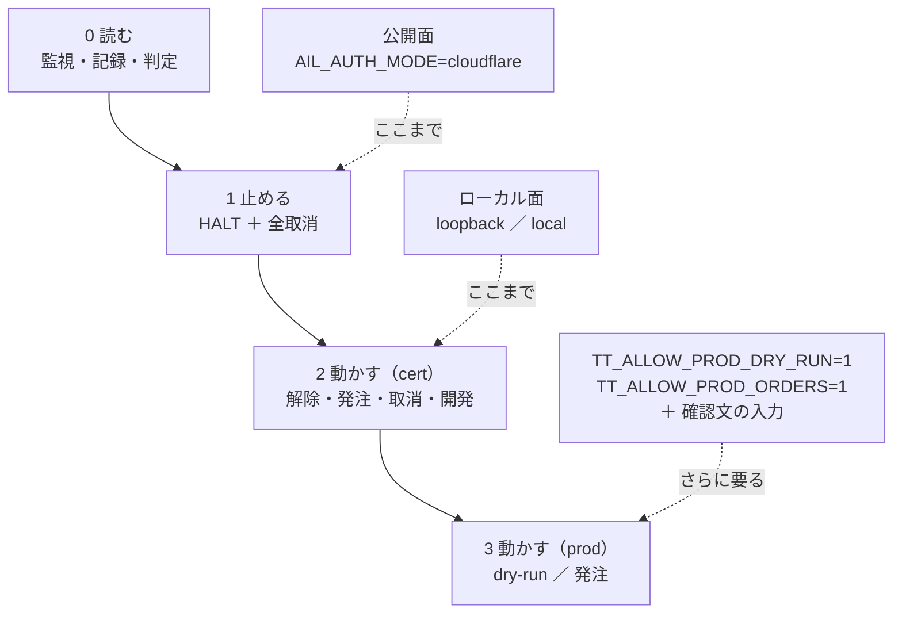
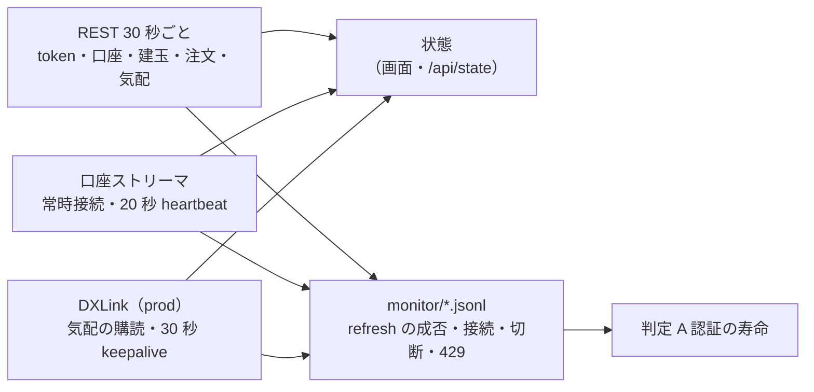
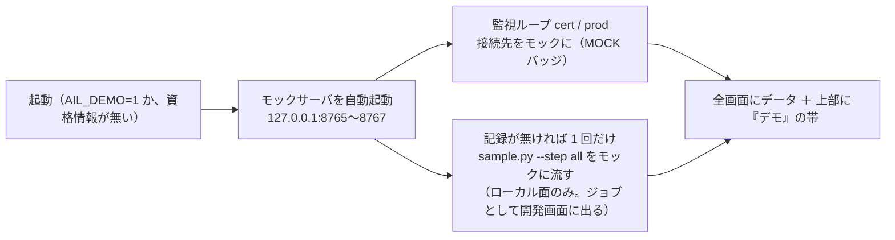
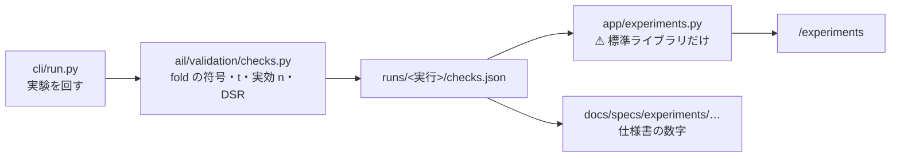
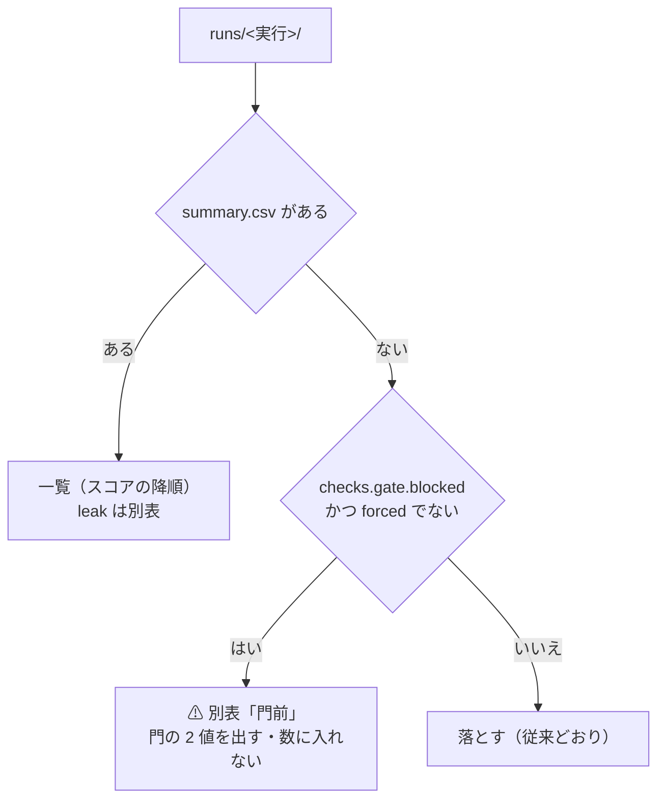
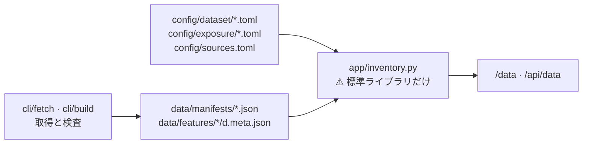
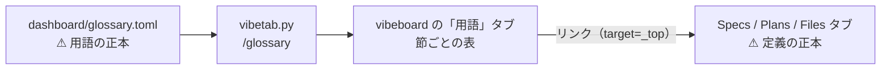
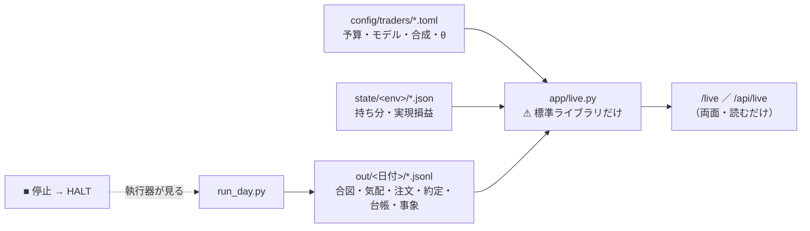
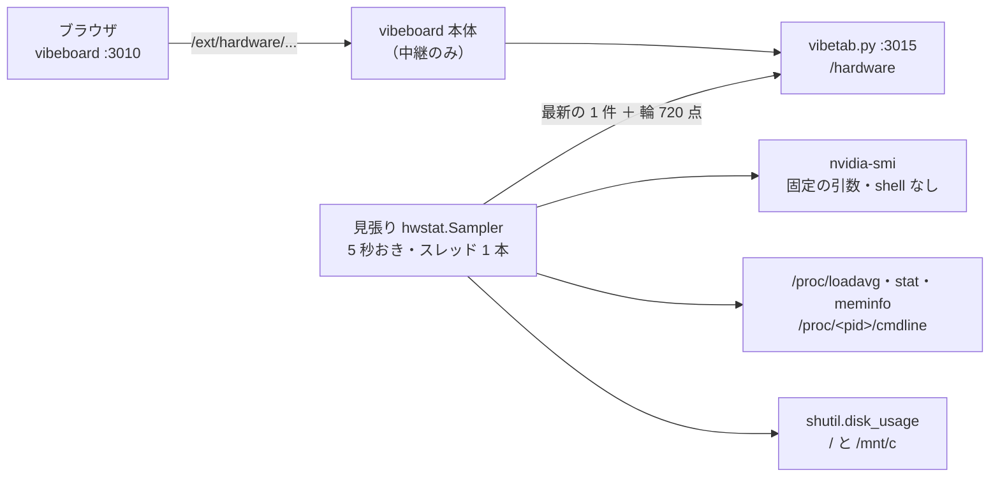

# 管理画面（dashboard/）— 仕様とデプロイ契約

作成: 2026-09-05 / プラン: [docs/plans/archive/dashboard.md](../plans/archive/dashboard.md) / コード: [dashboard/](../../dashboard/)

売買システムの管理画面。**実運用の監視**（口座・注文・認証の残り時間・websocket の状態）と、
**開発時の検証**（記録の閲覧・差分・6 観点の自動判定・モックと手順の実行）を 1 つのアプリで持つ。
このプロジェクト最初のアプリ実装で、[tastytrade の API 検証](experiments/tastytrade-api-sample.md)の記録と
クライアント（`experiments/tastytrade-api-sample/`）の上に載る。

⚠ [vibeboard](../../vibeboard/) とは別物（あちらは `docs/` と `TODO.md` を見るローカル開発用）。

## 1. 画面

| 画面 | パス | 面 | 中身 |
| --- | --- | --- | --- |
| 監視 | `/` | 両方 | 環境ごと（cert / prod）に: 認証の残り秒数と scope・refresh の成否、口座・残高・買付余力、建玉、働いている注文、現在値と遅延、口座ストリーマと DXLink の接続状態・最終受信・切断と再接続の回数、エラーと 429 の回数。5 秒ごとに部分更新 |
| 記録 | `/records`、`/records/<run_id>`、`/records/diff?a=&b=` | 両方 | 実行記録（JSONL）の一覧・1 実行の詳細（手順ごとの detail）・**実行間の差分**（所要 ms と状態遷移の時刻を項目ごとに並べ、B − A を出す） |
| 判定 | `/judge` | 両方 | **6 観点 × 会場**の表を記録から自動生成。根拠の run_id と手順つき。モックの記録は除外 |
| **検証** | `/experiments`、`/experiments/<run_id>` | 両方 | **特徴量の発見手法の検証**を、種類ごとのタイトルと**比較できるスコア**で並べる（§10）。⚠ **先読みの対照実験は一覧から外して別枠に出す** |
| **データ** | `/data` | 両方 | **実験（feature-discovery）が保持しているデータの在庫**（§11）。層・取得元・枠（本命 ／ 偽薬）・系列数・行数・期間・ずらし幅・規約の判定・割り当て |
| **実売買** | `/live` | 両方 | **トレーダー別の予算・モデル・建玉・損益と、執行の差（差 1〜4）の直近 20 営業日**（§13）。⚠ **読むだけ。発注は画面から出さない**。停止は既存の停止ボタン |
| 操作 | `/ops` | ローカルのみ | 停止 / 解除、cert の dry-run → 発注 → 取消 → 後片付け、prod の 2 段ロック、操作の履歴 |
| 開発 | `/dev`、`/dev/jobs/<id>` | ローカルのみ | モックの起動・停止、`selftest.sh` の実行、手順を選んで `sample.py` を実行（出力を逐次表示） |
| JSON | `/api/state`、`/api/records`、`/api/judge`、`/api/experiments`、`/api/data`、`/api/live`、`/api/events` | 両方 | 画面と同じ内容（マスク済み）。読み取りだけ |

ヘッダには常に **環境バッジ（CERT 緑 / PROD 赤 / MOCK 紫）と scope**、面（公開 / ローカル）、**停止ボタン**が出る。
停止中は赤い帯が全画面に出る。

## 2. 権限の設計

> この図の主張: 権限は 4 段で、公開面は 2 段目（読む・止める）で止まる。発注の経路は公開面には存在しない（404）。



| `AIL_AUTH_MODE` | 通す接続元 | 認証 | 面 |
| --- | --- | --- | --- |
| `loopback`（**既定**） | ループバックのみ | なし | ローカル |
| `local` | ループバック ＋ RFC1918 | なし（ヘッダに「認証なし」と出す） | ローカル |
| `cloudflare` | ループバックは免除。それ以外は **全リクエスト（GET 含む）で `Cf-Access-Jwt-Assertion` を検証**（JWKS で RS256、aud・iss・email を照合） | Cloudflare Access | 公開 |

- `cloudflare` は `CF_ACCESS_TEAM` / `CF_ACCESS_AUD` / `CF_ACCESS_EMAIL` が**全部そろわないと起動しない**。他のモードで CF_* が置かれていても起動しない（中途半端な設定で素通りさせない）
- `X-Forwarded-For` は見ない。接続元は cloudflared のコンテナで、そこから先は JWT で決める
- 無認証の `/health` は無い（コンテナの healthcheck はループバックから叩く）
- POST は同一プロセスの CSRF トークン（cookie `SameSite=Strict` ＋ hidden）を要求する

### 停止ボタンの中身

1. `HALT` フラグ（記録ディレクトリの `HALT`、JSON で時刻・誰が・理由）を書く。**`sample.py` はこのファイルがあると発注系の手順（4・5・5limit・6）を拒否する**（exit 3）。`cleanup` は通る
2. 監視している環境ごとに、働いている注文（Received / Routed / In Flight / Live / Contingent）を全部取り消す。
   cert は常に可。**prod は資格情報の scope に `trade` があるときだけ**（無ければ「取消は不可」と結果に出す）
3. 解除はローカル面だけ

### 本番の鍵（`ttclient.py` と同じ 3 段）

| 操作 | cert | prod |
| --- | --- | --- |
| dry-run | 可 | `TT_ALLOW_PROD_DRY_RUN=1` |
| 取消 | 可 | `allow_prod_cancel`（停止ボタンと取消ボタンが使う。**この鍵で発注は開かない**。2026-09-05 に `ttclient.py` へ追加） |
| 発注 | 可（dry-run を必ず先に通す） | `TT_ALLOW_PROD_ORDERS=1` **＋ 確認文 `i-know-this-is-real-money` の入力** ＋ 停止中でない |

画面から本番に出せる注文は 1〜10 株の株式 1 レッグだけ。Phase 6（本番で 1 株）は利用者が CLI で行う前提で、
画面の開発機能は prod に対して `probe` と `dryrun` しか通さない。

## 3. 秘密の扱い

- client secret・refresh token・access token・id token・quote token・口座番号は**ブラウザに送らない**
- すべての画面・JSON は `Redactor`（`record.py` の `Masker` ＋ 口座番号のラベル化）を通す。口座番号は `acct-<sha256 の先頭 4 桁>`
- 未登録の JWT も正規表現で落とす。ジョブの標準出力もマスクしてから保持する
- `Cache-Control: no-store`、CSP `default-src 'self'`、外部リソースなし、`X-Frame-Options: DENY`
- テスト（`dashboard/tests/test_app.py`）は偽の秘密を仕込んで全ページ・全 JSON を grep し、0 件であることを固定している

## 4. 監視ループ

> この図の主張: 環境ごとに REST 1 本と websocket 2 本を持ち、出口は画面の状態と monitor/*.jsonl の 2 つ。



| 何を | どう |
| --- | --- |
| 認証 | 失効 60 秒前に refresh。失敗は指数バックオフ（15 分 → 30 分 → …）、**3 連続で止める**（IP ブロック回避。再試行はローカル面のボタン）。token 応答の `scope` を保持し、ヘッダに出す |
| 口座 | `AIL_POLL_SECONDS`（既定 30）ごとに残高・建玉・働いている注文。口座番号は最初の照会で決める（`TT_ACCOUNT_NUMBER` があればそれ） |
| 現在値 | prod（とモック）だけ `AIL_SYMBOL`（既定 SPY）の REST 気配。`updated-at` との差を遅延として出す |
| 口座ストリーマ | `Bearer` 付きで connect、heartbeat には最新の access token を載せる。切れたら 5 秒 → 最大 120 秒のバックオフで再接続。通知（Order / AccountBalance / CurrentPosition）は直近 50 件 |
| DXLink | `GET /api-quote-tokens` の `dxlink-url` に繋ぐ。23 時間でトークンを取り直す。Quote / Trade の最新値と件数 |
| イベント | `monitor/<venue>-<env>-<UTC 日付>.jsonl` に `refresh_ok` / `refresh_fail` / `ws_connect` / `ws_disconnect` / `api_error` / `http_429` / `halt` / `resume` を追記 |

## 5. 判定の規則（記録の値だけから）

| 観点 | ✅ | ⚠ | ⏳ 未実測 |
| --- | --- | --- | --- |
| A 認証の寿命 | 手順 1 の成功と監視ログの `refresh_ok` が **2 営業日以上**にまたがる | またがるが `refresh_fail` もある | 同じ営業日の成功しか無い |
| B 常駐 | 同じ実行で手順 1・2・6 が ok | 1・2 だけ ok | 記録なし |
| C 現在値 | prod の手順 3 が**市場時間内**（ET 平日 9:30〜16:00）で `delay_s` < 1 | 市場時間内で 1 秒以上 | 時間外の記録しか無い（遅延は参考値と明記）／本番の資格情報なし |
| D 発注の往復 | 手順 4 と 5（または 51）が ok | 4 だけ ok | 記録なし（4 が失敗なら ❌） |
| E レート制限 | 手順 7 で 60 回/分が通り 429 なし | 429 が出た／60 回に達していない | 記録なし |
| F SDK | 記録の `sdk` 欄が「直接叩き」（OpenAPI 仕様がある） | SDK を使っている | 記録なし |

`mock: true` の行を含む実行は判定に使わない。会場（`venue`）ごとに列を並べる。

## 6. データの置き場

```
<AIL_DATA_DIR>/                  既定 dashboard/data、Docker では /app/data（volume）
├── records/                     実行記録 *.jsonl（AIL_RECORDS_DIR で別の場所も可。開発機の既定はサンプルの out/）
│   └── HALT                     停止フラグ（sample.py の TT_HALT_FILE の既定と同じ場所）
├── monitor/<venue>-<env>-<日付>.jsonl   監視イベント
├── ops/history.jsonl            操作の履歴（マスク済み）
└── jobs/history.jsonl, mock.log ジョブの履歴とモックのログ
```

⚠ **検証（§10）とデータ（§11）だけは `<AIL_DATA_DIR>` の外を読む。**

| | 既定 | 中身 |
| --- | --- | --- |
| `AIL_RUNS_DIR` | `experiments/feature-discovery/runs/` | ⚠ **読むだけ。** 管理画面は 1 バイトも書かない。⚠ **git 管理外なので、別環境では空でよい**（画面は空でも 200 を返す） |
| `AIL_EXP_DIR` | `experiments/feature-discovery/` | ⚠ **読むだけ**（§11 が `data/manifests/`・`data/features/*/…meta.json`・`config/` を読む）。⚠ **無くても画面は 200 を返す** |

## 6-2. デモ（鍵なしで動かす。2026-09-08）

資格情報が 1 つも無いとき、または `AIL_DEMO=1` のとき、本物には繋がず**モックサーバのデータで全画面を出す**。
デザイン確認と、鍵を置く前のサーバ起動のため。この図の主張: **デモは「資格情報の代わりにモックを差す」だけで、画面・監視ループ・記録の経路は本物と同じものを通す**。



| 項目 | 内容 |
| --- | --- |
| 判定 | 通常はモックの記録を除外するが、デモでは含めて表を組み立てる（見出しに DEMO バッジ。本物の判定には使わない） |
| データの置き場 | `data/demo/` 配下（記録・監視ログ・ジョブ・操作履歴）。本物の記録（`out/`・`data/records`）と混ぜない |
| 資格情報があるとき | `AIL_DEMO=1` なら本物には一切繋がない（監視は cert / prod ともモック）。`AIL_DEMO=0` で強制オフ |
| 面の規則 | 変えない。公開面（cloudflare）では操作・開発は出ない。g3plus は `.env` の資格情報が空なら自動でデモになる |

## 7. デプロイ契約（正本）

g3plus-ops 側の `ail-dashboard/`（Dockerfile・compose・手順書）はここに従う。契約が変わったらあちらを追従させる。

| 項目 | 値 |
| --- | --- |
| ベース | `python:3.12-slim`。ネイティブビルドなし（依存は `dashboard/requirements.txt` の 7 つ。`cryptography` は wheel） |
| build context | リポジトリの clone（public なので `git clone` → `git pull`）。COPY するのは `dashboard/app/`・`dashboard/requirements.txt`・`experiments/tastytrade-api-sample/*.py` と `*.sh` |
| 起動 | `cd /app/dashboard && python -m app.main`（uvicorn。`AIL_BIND=0.0.0.0`、`AIL_PORT=3012`） |
| ポート | **3012**。`ports:` でホスト公開しない（到達できるのは同じ docker network の cloudflared だけ） |
| 必須 env | `AIL_AUTH_MODE`（公開時 `cloudflare` ＋ `CF_ACCESS_TEAM` / `CF_ACCESS_AUD` / `CF_ACCESS_EMAIL`）、監視したい環境の資格情報（`TT_PROD_*` は **read スコープの grant を別に切って渡す**のが既定。cert の `TT_*` は任意） |
| 置かない env | `TT_ALLOW_PROD_ORDERS` / `TT_ALLOW_PROD_DRY_RUN`（公開面には発注経路が無いので意味を持たないが、置かない） |
| 永続化 | `/app/data`（§6）。**唯一の永続化対象** |
| 検証の画面 | ⚠ **`experiments/feature-discovery/runs/` は COPY しないので、g3plus では空になる**（画面は空でも 200）。見せたいときだけ `AIL_RUNS_DIR` を volume で差す。⚠ **読み取り専用でよい** |
| データの画面 | ⚠ **`experiments/feature-discovery/` も COPY しないので、g3plus では空になる**（画面は空でも 200）。見せたいときだけ `AIL_EXP_DIR` を volume で差す。⚠ **読み取り専用でよい** |
| TZ | `America/Los_Angeles` |
| healthcheck | コンテナ内ループバックで `GET /` が 200（`python -c "urllib.request.urlopen('http://127.0.0.1:3012/')"`） |
| 外向き通信 | `api.tastyworks.com` / `api.cert.tastyworks.com`（REST）、`streamer.tastyworks.com` / `streamer.cert.tastyworks.com`（口座 websocket）、`*.dxfeed.com`（DXLink。URL は応答の `dxlink-url`）、`<team>.cloudflareaccess.com`（JWKS） |
| 段階的な有効化 | Access の AUD が無いうちは `AIL_AUTH_MODE=loopback`（非ループバックは全部 403 = fail-safe）で起動しておき、Access アプリ → `.env` に 3 変数と `cloudflare` → Tunnel hostname の順で開ける |
| エッジキャッシュ | ホスト全体 Bypass の Cache Rule を入れる（キャッシュ HIT は認証評価前に配信される。アプリ側も `no-store` を返す） |

## 8. 検証（2026-09-05）

| # | 検証 | 結果 |
| --- | --- | --- |
| 1 | 秘密がブラウザに出ない | ✅ `tests/test_app.py`: 偽の client secret・refresh・access token・口座番号を仕込み、12 経路の応答を grep して 0 件。モックに対する実機の全ページでも 0 件 |
| 2 | 面の判定 | ✅ `tests/test_access.py`: loopback / local / cloudflare の 3 モード、JWT の aud・iss・email・署名鍵の不一致で 403、cookie でも通る。公開面で `/ops` `/dev` が 404、停止だけ 303 |
| 3 | 本番ガードの 3 つの鍵 | ✅ `experiments/tastytrade-api-sample/test_guard.py`（selftest.sh に組み込み）: dry-run の鍵・取消の鍵で発注が開かない |
| 4 | HALT | ✅ selftest.sh: フラグがあると `sample.py --step 4` が exit 3、`cleanup` は通る。画面: 停止中の発注は拒否、解除で消える |
| 5 | 判定の再現性 | ✅ `tests/test_records_judge.py`: 市場時間内の成功記録 2 営業日で A〜F すべて ✅、モック除外、部分記録で ⏳ / ⚠ / ❌ |
| 6 | 配線（監視ループ） | ✅ モック（`--market-data`）に対して cert / prod の 2 環境で認証・照会・口座ストリーマ・DXLink が繋がり、dry-run → 発注 → 停止（取消 1 件）→ 解除 → 後片付け、selftest ジョブの実行まで通した |
| 7 | Docker | ✅ 開発機で `docker build`（context = リポジトリ、165 MB）→ 起動（既定 loopback）: コンテナ内ループバックの `/` が 200、ホストから公開ポート経由（非ループバック）は 403、`AIL_AUTH_MODE=cloudflare` で AUD 欠けは `ConfigError` で起動せず、healthcheck は healthy |

## 10. 検証の画面（2026-09-08）

⚠ **`/judge` は「tastytrade の API が使えるか」の判定、`/experiments` は「分析手法の検証」で別物。**
材料も別で、こちらは `experiments/feature-discovery/runs/` を読む。

> この図の主張: ⚠ **重い計算は実験を回すときに 1 度だけ。管理画面は読むだけにする。** だから仕様書の数字と画面の数字がずれない。



⚠ **管理画面に pandas / scipy を入れない**（`requirements.txt` は増やさない）。

### 10-1. 検証の種類とタイトル

⚠ **タイトルは付けずに設定から組み立てる。** 手で名前を書くと実行のたびにずれる。

| 部品 | どこから | 値 |
| --- | --- | --- |
| 種類 | `feature_layers` に `cs` `rel` `ll` があるか | **プーリング** ／ **断面** |
| 粒度 | `bar_minutes` | 日足 ／ 1 分足 |
| 地平 | `horizon` × `bar_minutes` | 1 日先 ／ 1 取引日先 |
| データの層 | 記録の `layer`（`cli/build.py` が書く sidecar が正） | 調整後 ／ ⚠ **調整前** |
| 対照実験 | 実行名の `_leak` | ⚠ **（先読みの検査）を後ろに付ける** |
| 偽薬 | 実行名の `_shift<S>` か config の `features.ex_shift_days`（2026-09-16） | ⚠ **（偽薬: 日付 −S 日）を後ろに付け、種類は「偽薬（日付ずらし）」** |

⚠ **例**: `2026-09-08T19-42-54_cross_section_h1` → **「断面・日足・1 日先・調整後」**。
⚠ **先読みの実行も「断面・…（先読みの検査）」と書く**（どの検証の対照かが読めないと意味が無い）。

### 10-2. スコア

⚠ **スコア = 最良手法（基準線を除く）の純利 bp**（利用者が 2026-09-08 に決めた）。降順に並べる。

| # | 規約 | ⚠ 理由 |
| ---: | --- | --- |
| 1 | ⚠ **基準線をスコアにしない**（「常に上」「直前リターンの符号」「全部使う」「乱択」） | ⚠ **「常に上」が 1 位になると比較の意味が消える。** 基準線は比べる相手であって採否の対象ではない |
| 2 | ⚠ **先読みの対照実験を一覧に入れない。** 別表に出す | ⚠ **的中率 99% の検証がスコア 1 位に出ると、一覧全体が嘘になる** |
| 2-2 | ⚠ **日付をずらした偽薬も一覧に入れない。** 別表に出す（2026-09-16） | ⚠ **本物と同じ設定・同じタイトルなので、混ぜると同じ名前の行が何十本も並んで本物が埋もれる**（[plan](../plans/archive/exog-shift-placebo.md)） |
| 3 | ⚠ **検査の 5 列を必ず横に並べる** | ⚠ **スコアは 1 つの数字なので、fold の偏りも多重検定も数字自体には出ない** |
| 4 | ⚠ **検査が無い実行は ⏳。** 0 や ✅ で埋めない | ⚠ **「計算していない」と「通らなかった」は別物** |

### 10-3. 横に並べる 5 列（✅ の条件）

| 列 | ✅ | ⚠ | ⏳ |
| --- | --- | --- | --- |
| **層** | `adjusted`（調整後） | ⚠ **日足 × `raw`**（分割調整の誤りを含む＝ 無効） | 1 分足 × `raw`（誤りは日足にしか無い） |
| **純利** | 往復コストを引いて正 | 0 以下 | スコアが無い |
| **fold** | ⚠ **全 fold で正** | 符号が割れる | fold の記録が無い |
| **上乗せ** | 「常に上」への上乗せの **t > 3.0** | 3.0 以下 | 上乗せを測れない |
| **DSR** | ⚠ **実効標本数で割り引いた**デフレーテッド SR > 0.95 | 0.95 以下 | パネルを確かめられず未計算 |

⚠ **DSR は「SR > 0」の検定であって「基準線を超えたか」ではない。** その比較は「上乗せ」の列が担う。
⚠ **`n_trials` は増えていく。** 画面には**そのときの試行数**を出し、正本は
[台帳](experiments/feature-discovery/ledger.md)のままにする。

### 10-4. ⚠ この画面で埋まらないもの

| # | 限界 | ⚠ 効き方 |
| ---: | --- | --- |
| 1 | ⚠ **スコアは 1 つの数字。** fold 1 だけで作られた数字も高く出る | ⚠ **検査の 5 列と、画面の注記で補う。** 隠さない |
| 2 | ⚠ **無効な検証（日足 × `raw`）もスコア順では上に来る** | ⚠ **層の列が ⚠ になるが、並び順では下がらない** |
| 3 | 検証どうしは条件が違う（粒度・地平・層・列の数） | ⚠ **スコアの差が手法の差とは限らない。** 条件を同じ行に出す |
| 4 | ⚠ **後から `checks.json` を書くとき、当時のパネルが残っていないと実効標本数と DSR は出せない** | ⚠ **層と行数の両方が一致する実行だけ計算し、それ以外は鍵ごと省く** |

⚠ **デモ（§6-2）はこの画面に効かない。** 検証の数字は `AIL_RUNS_DIR` の記録をそのまま読むので、
⚠ **デモ中でも本物である。** ⚠ **デモの帯は「モックのデータを表示している」と書くので、この画面では
そのままだと嘘になる**（2026-09-08 に踏んだ）。帯に「この画面はデモの対象外」と足し、
フッタの出所も `records/` ではなく `runs/` を出す。

### 10-5. 閾値つき売買の実行（2026-09-10）

検証方式が**閾値つき売買**（[rules.md 13 章](experiments/feature-discovery/rules.md)）の実行は、
`checks.json` に `style: "threshold"` が付く。⚠ **画面は写しを出すだけ**の原則はそのまま。

| 変わるもの | 中身 |
| --- | --- |
| タイトル | 末尾に **「閾値売買・共通」／「閾値売買・銘柄別」** が付く（形式 (A)(B) を見分ける） |
| 上乗せの列 | ⚠ **相手が「常に上」（粗利）ではなく B&H（純利）**（`edge_vs_bh`。rules 13-7）。✅ の条件（t > 3.0）は同じ |
| fold の列 | ⚠ **fold の符号は対 B&H の上乗せの符号**（純利の符号では「買って持っただけ」と区別できない） |
| 詳細ページ | **「閾値ごとの成績」**を 3 水準とも出す（θ・最良手法・純利・B&H 純利・上乗せ・DSR・**取引回数・保有日率**・**保有日数 中央値（p25–p75）**（2026-09-17。`by_threshold[θ].holding` の写し。1 取引ごとの分布で強制清算を含む。鍵の無い旧実行は「—」。⚠ **採否には使わない**。rules 13-4 の 6）・銘柄別 bp の要約）。⚠ **良かった閾値だけ出さない**（rules 13-3）。⚠ **取引回数を必ず横に置く**（「θ が高いほど良い」＝「取引しないだけ」を見抜くため。rules 13-10） |
| 一覧のスコア | 最良手法 × 最良閾値のポートフォリオ純利 bp（`best.閾値` を併記）。⚠ **3 水準の全体は詳細ページが持つ** |

⚠ **銘柄別 bp（`per_symbol.csv`）は要約（中央値・四分位・勝ち銘柄数）だけ出す。**
成果物であって採否には使わない（rules 13-7）。vibeboard の検証タブ（`vibetab.py`）も同じ写しを出す。

### 10-6. 門前の実行（2026-09-11）

前置きの門（[rules.md 14-5](experiments/feature-discovery/rules.md)）を通らなかった手法は**閾値売買を回さない**。
全手法が門前の実行は `summary.csv` を持たず、`checks.json` に `gate` だけが残る。

> この図の主張: ⚠ **実行は 3 つに分かれる。** 落とすのは「summary も門前の記録も無い」ものだけ。



| # | 規約 | ⚠ 理由 |
| ---: | --- | --- |
| 1 | ⚠ **門前の実行を画面から落とさない**（`index` の `gated_runs`） | ⚠ **台帳には「門前」の行で残るのに画面から消えると、画面を見て実行の有無を判断できない**（2026-09-11 に踏んだ） |
| 2 | ⚠ **一覧（スコアの降順）には混ぜず、別表に出す。** `total` / `positive` / `kinds` にも数えない | ⚠ **検証を回していないので「検証 N 件」に足すと水増しになる**（n_trials に数えないのと同じ扱い。14-5） |
| 3 | ⚠ **判定の 5 列（§10-3）は出さない** | ⚠ **⏳ を 5 つ並べると「計算待ち」に見える。** 門前は計算していないのではなく**回していない**（§10-2 の規約 4 とはここが違う） |
| 4 | 代わりに**門の 2 値と水準**（訓練内 holdout の AUC・買い% 幅、`auc_min` / `width_min_pt`）を写して出す | 画面だけで「なぜ回っていないか」が読める。⚠ **画面で門を判定し直さない**（`checks.json` の `gate` の写し） |
| 5 | ⚠ **`forced`（門前の手法も回した印）で summary が無い実行は従来どおり落とす**。⚠ **2026-09-14 から門は既定で止めない**ので、門前があれば既定の実行でも `forced` が立つ（`--ignore-gate` は既定の別名）。⚠ **門前の実行が生まれるのは `--gate` で足切りしたときだけ**（rules.md 14-10 規約 2） | ⚠ **「回したのに結果が無い」を門前と混同しない**（拾う条件は台帳 `ail/catalog.py` と同じ） |
| 6 | 一部の手法だけ門前（`summary` あり）の実行は**一覧に残し**、詳細に「回していない手法」の節を出す | ⚠ **一覧のスコアは回した手法のもので正しい。** 隠れるのは回さなかった手法なので、詳細で補う |

⚠ **門前の実行の詳細ページはスコアの 4 枚のカードを出さない**（すべて「—」になるため）。
代わりに帯（回していないこと）・条件・**門の表**（手法ごとの AUC・幅・fold ごとの値・通過 / 門前）を出す。
vibeboard の検証タブ（`vibetab.py`）も同じ写しを出す（目次の「⚠ 門前」・まとめの件数と表・実行ページの門の節）。

## 11. データの画面（2026-09-09）

実験（`experiments/feature-discovery/`）が**何をどれだけ持っているか**を 1 画面にする
（プラン: [docs/plans/archive/dashboard-data-inventory.md](../plans/archive/dashboard-data-inventory.md)）。
§10 と同じ立て方で、⚠ **実験側が書いたものを読むだけ**。CSV / parquet を開いて数え直さない。

> この図の主張: ⚠ **数字は実験側が取得時に書き、画面は読むだけ。** だから manifest と画面の数字がずれない。



### 11-1. 何をどこから写すか

| 見せるもの | 正本 | ⚠ 規約 |
| --- | --- | --- |
| 系列数・行数・最古と最新の日・検査の引っかかり | `data/manifests/<層>_<粒度>.json` | ⚠ **manifest の値をそのまま出す**（数え直さない。rules.md 5 章の指紋が正） |
| 特徴量の表（行数・列数・元の層） | `data/features/<実験>/<粒度>.meta.json`（`cli/build.py` の sidecar） | ⚠ **先読み検査用（`_leak`）は別枠に出す** |
| 枠（本命 ／ 偽薬）・仮説 | `config/dataset/*.toml` の `role` `hypothesis` | ⚠ **取得の前の宣言を写すだけ。結果を見て分類しない。** manifest の枠（取得時の写し）と食い違ったら ⚠ を立てて見せる（黙ってどちらかを選ばない） |
| 銘柄の種別（会社株 ／ ETF ／ 実質は株の ETF） | `config/universe/*.toml` の `groups` | ⚠ **宣言を銘柄名で引くだけ**（画面が銘柄名から推測しない）。⚠ **宣言に無い銘柄は「分類なし」で見せる**（黙ってどちらかに寄せない）。集合の限界（生存バイアス・選定日）も一緒に出す |
| ずらし幅・公表の遅れ・規約の判定 | `config/sources.toml`（2026-09-09 新設） | ⚠ **実効値は `ail/features/exog.py` / `impact.py` が持つ。** 一致は実験側の `tests/test_sources_decl.py` が固定する（同じ数字を 2 か所で手管理しない） |
| 割り当て（災害 → 銘柄の重み） | `config/exposure/*.toml` | ⚠ **全部【推測】・後知恵あり（`hindsight`）を画面に明示する**（宣言の写し） |

### 11-2. 規約の判定は 3 分類

| 判定 | 意味 | 例 |
| --- | --- | --- |
| 公有 | 米政府の著作物（17 U.S.C. §105） | 財務省・NOAA・USGS・NCEI |
| robots | robots.txt と規約を実測して問題なし | ECB・EPU・IEM（`Crawl-delay: 120` を守る） |
| 契約 | 口座の規約の範囲で使う | tastytrade |

⚠ **「要判断」の取得元（FRED・Open-Meteo・SILSO）はデータを持っていないので画面に出さない**
（[daily-data-sources.md §2・§4](experiments/daily-data-sources.md) が正本）。

### 11-3. 面とデモ

- 読むだけ・秘密なし（外部系列と足は公開データ）なので**公開面にも出す**。応答は他の画面と同じく `Redactor` を通す
- ⚠ **デモ（§6-2）の対象外**（§10-4 と同じ理由）。帯に「この画面はデモの対象外」と足し、フッタの出所は `AIL_EXP_DIR` を出す
- ⚠ **`AIL_EXP_DIR` が無い・壊れた JSON / TOML でも 200 を返す**（g3plus には COPY しない。§7）

## 12. 用語の画面（2026-09-12）

vibeboard の**用語**タブ（`/ext/glossary`）。⚠ **索引であって解説書ではない。**
1 語 1〜2 行の意味と、⚠ **詳しい定義がある文書へのリンク**だけを出す
（プラン: [docs/plans/archive/vibeboard-glossary.md](../plans/archive/vibeboard-glossary.md)）。

⚠ **この画面は管理画面（3012）には無い。** `vibetab.py` の 3 本目のタブで、
§10・§11 と同じく **vibeboard 本体が `/ext/<name>` で中継する**。

> この図の主張: ⚠ **説明はコードにも画面にも持たない。** 正本は TOML 1 本で、画面はその写しを出すだけ。



### 12-1. 規約

| # | 規約 | ⚠ 理由 |
| ---: | --- | --- |
| 1 | ⚠ **用語の正本は `dashboard/glossary.toml`**（`tomllib`。画面は写し） | ⚠ **説明を Python に埋めない。** §10-2 の「画面は読むだけ」と同じ立て方 |
| 2 | ⚠ **1 語 1〜2 行。詳しい定義を書かない**（テストが長さを固定する） | 定義が 2 か所にあると必ず食い違う。⚠ **食い違ったらリンク先が勝つ** |
| 3 | ⚠ **動く数字を書かない**（試行数・DSR の値・行数） | ⚠ **数字は動く。** 用語表に残ると嘘になる。数字は検証タブ（§10）と spec が持つ |
| 4 | リンクは vibeboard の hash URL（`/#specs/…`・`/#plans/…`・`/#files/…`）へ `target="_top"` | ⚠ **同じ画面の中で定義まで辿れる**。⚠ **節（§）へは飛べない**ので、節は文字で横に置く |
| 5 | ⚠ **リンク先の実在をテストで固定する**（`tests/test_vibetab.py`） | ⚠ **リンク切れは索引の価値を消す。** 文書を移したら赤くなる |
| 6 | 読めない・壊れているときは空で 200（仮の説明で埋めない） | 「用語が無い」と「壊れている」を混ぜない |

### 12-2. 画面

| 経路 | 中身 |
| --- | --- |
| `/glossary/api/sidebar` | 先頭が **すべての用語**（全語を 1 ページに出す。⚠ **ブラウザの検索で引くため**）、以下は分野ごとの節 |
| `/glossary/view?item=<節 id\|all>` | 節の表（用語・意味・詳しく）。知らない id は 404 |
| `/glossary/api/watch` | `glossary.toml` の mtime を見て、編集したらタブが自分で追いつく |

分野は 8 つ（進め方 ／ 検証の単位と台帳 ／ 統計の検査 ／ 閾値つき売買 ／ データ ／ 手法とモデル ／ 口座と API ／ 収入の体系）。
⚠ **語を足すのは TOML だけ**で、画面もサイドバーも追従する。

### 12-3. ⚠ sidecar は vibeboard を再起動しても入れ替わらない（2026-09-12 に踏んだ）

まっさらな状態なら **`./run-vibeboard.sh` だけで 3 タブとも上がる**【実測 2026-09-12】。
sidecar（`vibetab.py`）は customTabs の `command`（**検証の 1 件だけが持つ**。3 タブとも同じ 1 プロセスが出す）で
vibeboard の**子**として起き、⚠ **vibeboard を止めると一緒に止まる。**

⚠ **例外が 1 つあり、そこを踏んだ。** タブに **「接続できません: HTTP 404」** が出たら、⚠ **3015 に古い `vibetab.py` が居座っている。**

| 何が起きるか | なぜ |
| --- | --- |
| vibeboard を入れ直してもタブが 404 | vibeboard は `command` を実行する前に **baseUrl が応答するかを見て、応答したら起動しない**（`vibeboard/src/sidecar.ts` の `startOne`）。⚠ **古い sidecar が答えるので、新しいものは上がらない** |
| 古い sidecar が生き残る | `vibetab.py` は bind できないとき ⚠ **静かに引く**（二重起動を避ける設計）。前の vibeboard の子は親が落ちても残ることがある |

直し方: ⚠ **ポートから引いて**（`pgrep -f` は自分にも当たる）落とし、入れ直す。⚠ **3010 には触らない。**

```bash
pid=$(ss -ltnp | grep ":3015 " | grep -o 'pid=[0-9]*' | cut -d= -f2 | head -1) && kill "$pid"
nohup python3 dashboard/vibetab.py &                   # 3 タブとも同じ 1 プロセスが出す
```

⚠ **この罠は用語タブに限らない**（検証・データも同じ 1 プロセスが出している）。⚠ **`vibetab.py` を直したら sidecar を入れ直す**。

## 13. 実売買の画面（2026-09-18）

⚠ **`/live` は「トレーダー 3 人の実売買」（[プラン](../plans/live-trading-three-models.md)・[記録](experiments/live-trading.md)）の監視で、
`/judge`（API が使えるか）・`/experiments`（分析手法の検証）とは別物。** 材料も別で、`experiments/live-trading/` を読む。

> この図の主張: ⚠ **執行器が書いたものを写すだけ。画面は数え直さない・書かない・発注しない。** 停止だけは既存の停止ボタン（`HALT`）で、執行器がそれを見る。



### 13-1. 何をどこから写すか

| 画面の項目 | 正本 | ⚠ 注意 |
| --- | --- | --- |
| トレーダー（名前・予算・銘柄集合・モデルの一覧・合成規則・θ・株数の決め方・試験用） | `config/traders/<名前>.toml` | `test = true` のトレーダーは TEST バッジ。⚠ **実際に動かすトレーダーが 0 人なら「属性はまだ設定していない」と出す**（2026-09-17 の利用者決定） |
| 建玉・原価・実現損益・最終日 | `state/<env>/<名前>.json` | env（cert ／ prod）ごとに別の台帳。cert のリハーサルと本番を混ぜない |
| 原価 ／ 実現 ／ 含み・含み損の割合 | `out/<日付>/ledger.jsonl` の最新行 | ⚠ **含み損が予算の 20% を超えたら赤で「停止条件」と出す**（`live-trading.md` §0-2。⚠ 自動では止めない。止めるのは人） |
| 合図（トレーダー × 銘柄の買い% ／ 出口% と入力のモデル） | `out/<日付>/signals.jsonl` | 合成後の値。モデル別は `predict.jsonl`（Phase 1 の後） |
| 注文（数量・誰の分・合図時の気配・約定・状態・試行回数・手数料・所要・エラー） | `out/<日付>/orders.jsonl` | 手数料は dry-run の `fee-calculation` の写し（差 2 の材料。⚠ 実際の規制費は口座の取引履歴でしか確定しない） |
| 内部移転・残高 | `transfers.jsonl` ／ `balances.jsonl` | 内部移転は口座に出ない（差 3 のコスト 0） |
| 日次（1 日 1 行）: 合図・注文・約定・問題・再送・差 1 の中央値と最大・見送り・事象 | 上の全部 | 新しい順に 20 日 |

### 13-2. 画面で計算する唯一の数字 — 差 1

記録には価格しか無いので、**差 1（合図時の気配 → 約定）だけ画面で bp に直す**。買いは (約定 − mid) ÷ mid、売りは (mid − 約定) ÷ mid。⚠ **正 ＝ 不利**。
色は `live-trading.md` §0-2 の閾値（中央値 ✅ ≤ 5bp ／ ⚠ 5〜10 ／ ❌ ＞ 10）。差 2 は dry-run の手数料の写し、差 3 は Phase 3（紙上の対照）の後で埋まる、差 4（無人運転）は問題のあった日と再送の回数。

### 13-3. 面とデモ

| 項目 | 内容 |
| --- | --- |
| 面 | **両面**（公開面でも読める）。POST の経路は無い（405）。停止は既存の `/ops/halt` |
| デモ | ⚠ **対象外**（検証・データと同じ）。執行器の記録（`AIL_LIVE_DIR`。既定 `experiments/live-trading/`）をそのまま読む。無ければ空のまま 200（g3plus には記録を置かない） |
| 秘密 | 記録は執行器が `Masker` を通して書き、画面の応答はさらに `Redactor` を通す。テストは口座番号・JWT の不在を固定 |
| 更新 | リクエストごとに読む（監視ループには載せない。1 日 1 回しか増えない） |

### 13-4. ⚠ この画面で埋まらないもの

- 紙上の対照（差 3）と B&H。Phase 3 で `daily.csv` ができたら列を足す（⚠ **新しいキーと列の対応を確かめる**。§10 の手順と同じ）
- 「儲かったか」の判定。損益は出すが色を付けない（判定は執行の差と無人運転だけ）
- 執行器の起動。画面からは動かさない（titan の timer ／ cron。`live-trading.md` §0-5）

## 14. ハードの画面（2026-09-18）

vibeboard の**ハード**タブ（`/ext/hardware`）。検証が何時間も使う機械（titan ＝ WSL2 ＋ RTX 3090 Ti ＋ 32 スレッド）の
⚠ **いまの状態の写し**を出す。⚠ **監視システムではない**（通知・警報・長期の記録は持たない）
（プラン: [docs/plans/vibeboard-hardware-tab.md](../plans/vibeboard-hardware-tab.md)）。

⚠ **この画面は管理画面（3012）には無い。** `vibetab.py` の 4 本目のタブで、§10〜§12 と同じく
**vibeboard 本体が `/ext/<name>` で中継する**。⚠ **vibeboard 本体は改造していない**（このプロジェクト専用）。
⚠ 読み手 `dashboard/hwstat.py` と画面 `dashboard/hwview.py` は **`dashboard/app/` の外**に置く（`app/` は g3plus に載る。これは開発機の話）。

> この図の主張: ⚠ **値を読むのは sidecar の中の見張り 1 本だけ。** 画面は写しを取りに来るだけで、見る人が増えても `nvidia-smi` を叩く回数は変わらない。



### 14-1. 規約

| # | 規約 | ⚠ 理由 |
| ---: | --- | --- |
| 1 | ⚠ **読むだけ・写すだけ。** `nvidia-smi` は固定の引数の配列で起こす（shell を通さない・要求の値を混ぜない）。このサーバに「操作」を足さない | 中継後はループバック発に見える（CLAUDE.md の customTabs の注意）。読むだけなら、それで開く面が無い |
| 2 | **値を読むのは見張り（`hwstat.Sampler`）1 本**。`vibetab.py` の `main()` が bind できた後で起こす。⚠ **import しただけ・handler を作っただけでは起きない**（止まっている間は要求のたびにその場で読む） | ⚠ **CPU 使用率は `/proc/stat` の 2 時点の差**でしか出ない。要求のたびに読むと見る人数 × 回数だけ `nvidia-smi` が走る |
| 3 | **更新は画面が自前で行う**: `view` の script が `api/snapshot`・`api/history` を間隔ごとに相対パスで取り、描き直す。`document.hidden` の間は取りに行かない。`api/watch`（SSE）は繋がるだけで何も投げない | `item-changed` で数秒ごとに iframe を作り直すと、ちらつきとスクロール位置の初期化が起きる。vibeboard の README の契約が自前更新を認めている |
| 4 | ⚠ **描く経路は 1 本**: 値は `<script type="application/json">` に埋め（`<` は `\u003c` に逃がす）、最初の表示も更新も同じ関数が描く。⚠ **文字は `textContent` だけで入れる（`innerHTML` に連結しない）** | プロセスの cmdline は他人が決められる文字列で、XSS の入口になる。テストが「生の `<script>` が HTML に出ない」「`innerHTML` を使っていない」を固定する |
| 5 | ⚠ **読めないものは欄を作らず、理由を 1 行書く。** `nvidia-smi` が無い ／ 3 秒で返らない ／ 終了コード ≠ 0 → GPU の節が「読めない（理由）」になり、⚠ **CPU・メモリ・ディスクは出し続ける**。`[N/A]`・`[Not Supported]` は `None`（「—」）で、⚠ **0 にしない** | 「GPU が無い」と「画面が壊れている」を混ぜない（§12-1 の規約 6 と同じ立て方）。仮の数字で埋めない |
| 6 | ⚠ **色を付ける閾値を自分で作らない。** GPU の異常は `nvidia-smi` の `clocks_throttle_reasons.*`（熱・電力で絞られているか）を写す。例外はディスクだけで、**使用率 90% 以上を警告色 ＋「⚠ 残りわずか」の文字**にする（⚠ 90% は【推測】の目安で、出典は無い） | 「83℃ で危険」のような数字に出典が無い。ドライバが言っている事実を写すほうが確か。警告は色だけに頼らない |
| 7 | ⚠ **cmdline は 160 字で切り、`token`・`secret`・`passw`・`credential`・`key` を含む引数は値を伏せる**（`--token=x`・`API_KEY=x`・`--password x`） | ⚠ **このタブは tailnet の閲覧者にも見える**（`http://titan-income-vibeboard`）。引数に秘密が紛れても出さない |
| 8 | 履歴は ⚠ **メモリ上の輪だけ**（720 点 ＝ 5 秒 × 1 時間）。⚠ **ディスクに書かない。** sidecar を入れ直すと消える | 知りたいのは「席を外している間 GPU は回っていたか」。置き場・保持期間・git 管理外の設定が要らない |
| 9 | 間隔は `AIL_HW_INTERVAL_S`（既定 5 秒・下限 1 秒） | `nvidia-smi` 1 回 0.058 秒【実測 2026-09-18】× 2 本 ÷ 5 秒 ≒ 1 コアの約 2%【実測からの計算】。0 ではないので伸ばせる形にしておく |
| 10 | 画面の `api/snapshot`・`api/history` の要求は sidecar のログに出さない | 数秒おきに来るので、vibeboard のログが埋まる |

### 14-2. 何をどこから写すか

| 節 | 出す値 | 読む場所 |
| --- | --- | --- |
| GPU | 使用率 % ／ メモリ（使用・全体 MiB・%）／ 温度 ℃ ／ 電力 W と上限 ／ ファン % ／ P-state ／ 絞りの理由（立っているものだけ） | `nvidia-smi --query-gpu=index,name,utilization.gpu,memory.used,memory.total,temperature.gpu,power.draw,power.limit,fan.speed,pstate,clocks_throttle_reasons.{hw_slowdown,hw_thermal_slowdown,sw_thermal_slowdown,hw_power_brake_slowdown,sw_power_cap} --format=csv,noheader,nounits` |
| GPU を使っているプロセス | PID ／ 経過 ／ RSS ／ cmdline（規約 7） | `nvidia-smi --query-compute-apps=pid` ＋ `/proc/<pid>/{cmdline,stat,status}`・`/proc/uptime` |
| CPU | 全体の使用率 % ／ load average ／ スレッド別の使用率（細い縦棒 ＋ 表） | `/proc/stat`（2 時点の差。busy ＝ total − idle − iowait）・`/proc/loadavg` |
| メモリ | 使用（＝ 全体 − `MemAvailable`）／ 空き ／ swap | `/proc/meminfo`。⚠ **`MemFree` は使わない**（キャッシュを空きに数えない） |
| ディスク | マウントごとの 使用 %・使用・空き・全体（`/`・`/mnt/c`。無いものは飛ばす） | `shutil.disk_usage` |
| この 1 時間（`history`） | GPU 使用率・GPU メモリ %・GPU 温度・GPU 電力・CPU 使用率・メモリ % の 6 本。⚠ **1 系列 1 枚**（単位が違うものを 1 枚に重ねない ＝ 縦軸を 2 本にしない）。横軸は貯まったぶん（下限 5 分）。値の無い回は線を切る（直線で埋めない）。表（最新・最小・平均・最大）を併置 | 見張りの輪 |

⚠ **列名は旧名 `clocks_throttle_reasons.*` で引く。** ドライバ 610.62 は新名 `clocks_event_reasons.*` と両方を受ける【実測 2026-09-18】。古いドライバは旧名しか知らない。

| 経路 | 中身 |
| --- | --- |
| `/hardware/api/sidebar` | `now`「いまの状態」・`history`「この 1 時間」 |
| `/hardware/view?item=<now\|history>` | 枠 ＋ 埋め込みの JSON ＋ script。知らない id は 404 |
| `/hardware/api/snapshot` | 最新の 1 件（JSON） |
| `/hardware/api/history` | 輪の中身（JSON。系列の定義と点） |
| `/hardware/api/watch` | SSE（hello と ping だけ） |

### 14-3. ⚠ この画面で読めないもの（WSL2 の制限。【実測 2026-09-18】）

| 読めないもの | なぜ | 代わり |
| --- | --- | --- |
| プロセス別の GPU メモリ | `--query-compute-apps` の `used_memory` が `[N/A]` | 合計（`memory.used`）だけ出す。⚠ **合計には Windows 側の使用分も混ざる**と画面に書く |
| GPU のプロセス名 | 同じく `process_name` が `[Not Found]` | ⚠ **PID は WSL 側の PID と一致する**ので `/proc/<pid>/cmdline` から引く |
| Windows 側で GPU を使っているプロセス | WSL からは見えない | Windows のタスクマネージャー |
| CPU の温度 | WSL2 に `sensors` が無い | Windows 側の HWiNFO など |
| `temperature.gpu.tlimit`（熱の上限までの余裕） | `[N/A]` | 絞りの理由（規約 6）を写す |

### 14-4. ⚠ 反映には vibeboard の入れ直しが要る

vibeboard は `vibeboard.config.json` を**起動時にしか読まない**。タブを足した・`vibetab.py` / `hwstat.py` / `hwview.py` を直したときは
`./run-vibeboard.sh` を入れ直す（sidecar は vibeboard の子なので一緒に入れ替わる）。⚠ **3015 に古い sidecar が居座る罠は §12-3 と同じ**。
手元で確かめるだけなら、別のポートにもう 1 本立てれば 3010・3015 に触らずに済む。

```bash
python3 dashboard/vibetab.py --port 3016               # http://127.0.0.1:3016/hardware/view?item=now
python3 dashboard/hwstat.py                            # 読み手だけを 1 回（JSON を標準出力へ）
```

## 9. 更新履歴

- 2026-09-05: 初版（Phase 1〜4 の実装、デプロイ契約）
- 2026-09-07: g3plus で初回起動（§7 の契約どおり。loopback 面・資格情報なしで healthy、ホストポート非公開、非ループバック 403）。資格情報と Cloudflare は未（利用者）
- 2026-09-08: デモ（§6-2）。鍵なしでモックのデータを全画面に出す。pytest 24 件（デモ 5 件を追加）
- 2026-09-08: **検証の画面**（§10）。`/experiments` に特徴量の発見手法の検証を、種類ごとのタイトルと比較できるスコア（最良手法の純利 bp）で並べる。検査（fold の符号・上乗せ t・実効標本数・デフレーテッド SR）は**実験側が `checks.json` に書いたものを読むだけ**。プランは [docs/plans/archive/dashboard-experiments.md](../plans/archive/dashboard-experiments.md)
- 2026-09-08: 黒ベースに作り直し（`app/static/app.css` 全面。環境の色 cert 緑 / prod 赤 / MOCK 紫 と、状態の色 ok / warn / ng の 2 系統。監視は幅があれば cert と prod を横に並べ、注文表は折り返さず、口座ストリーマの通知は枠の中でスクロール）。プランと画面は [docs/plans/archive/dashboard-dark-design.md](../plans/archive/dashboard-dark-design.md)
- 2026-09-09: **データの画面**（§11）。`/data` に実験が保持しているデータの在庫（足・外部系列・特徴量・規約・割り当て）を出す。数字は実験側の manifest / config の写しで、ずらし幅と規約の判定は `config/sources.toml`（新設。コードとの一致は実験側のテストが固定）。プランは [docs/plans/archive/dashboard-data-inventory.md](../plans/archive/dashboard-data-inventory.md)
- 2026-09-18: **実売買の画面**（§13）。`/live` にトレーダー別の予算・モデル・建玉・損益と、執行の差（差 1〜4）の直近 20 営業日を出す。執行器（`experiments/live-trading/`）の記録を写すだけで、画面で計算するのは差 1 の bp だけ。両面で読める・POST は無い。pytest 7 件
- 2026-09-12: **用語の画面**（§12）。vibeboard に「用語」タブを足し、8 分野 87 語の索引を出す。⚠ **正本は `dashboard/glossary.toml`** で、画面は写し。語からその定義がある spec へ `target="_top"` のリンクで飛ぶ（⚠ **節へは飛べないので節は文字で併記**）。⚠ **リンク先の実在はテストが固定する**。プランは [docs/plans/archive/vibeboard-glossary.md](../plans/archive/vibeboard-glossary.md)
- 2026-09-18: **ハードの画面**（§14）。vibeboard に「ハード」タブを足し、GPU（`nvidia-smi`）・CPU・メモリ・ディスクのいまの状態と、この 1 時間の折れ線 6 枚を出す。⚠ **値を読むのは sidecar の見張り 1 本**で、画面は JSON を自前で取りに来る（iframe を作り直さない）。⚠ **vibeboard 本体は改造していない**。読み手は `dashboard/hwstat.py`・画面は `dashboard/hwview.py`（`app/` の外）。pytest 25 件（読み手 23 ＋ HTTP 2）
