# 管理画面（dashboard/）— 仕様とデプロイ契約

作成: 2026-09-05 / プラン: [docs/plans/archive/dashboard.md](../plans/archive/dashboard.md) / コード: [dashboard/](../../dashboard/)

売買システムの管理画面。**実運用の監視**（口座・注文・認証の残り時間・websocket の状態）と、
**開発時の検証**（記録の閲覧・差分・6 観点の自動判定・モックと手順の実行）を 1 つのアプリで持つ。
このプロジェクト最初のアプリ実装で、[tastytrade の API 検証](experiments/tastytrade-api-sample.md)の記録と
クライアント（`experiments/tastytrade-api-sample/`）の上に載る。

⚠ [vibeboard](../../vibeboard/) とは別物（あちらは `docs/` と `TODO.md` を見るローカル開発用）。

## 1. 画面

| 画面 | パス | 面 | 中身 |
| --- | --- | --- | --- |
| **概要** | `/` | 両方 | ⚠ **入口**（2026-09-18。§13・§15）。監視の帯（認証・接続・口座・働いている注文・事象。5 秒ごとに部分更新）・大きな数字（全トレーダーの損益 1 つ・色なし）と差 1・約定・起動しなかった日・損益の推移・執行の差・**トレーダーの段**（1 人 1 段。損益と行動を同じ時間の軸で揃える） |
| **全体の詳細** | `/overall` | 両方 | 日次（起動しなかった日も行を出す）・注文の履歴（全トレーダー）・**口座と接続**（環境ごとに認証の残り秒数と scope・refresh の成否、口座・残高・買付余力、建玉、働いている注文、現在値と遅延、口座ストリーマと DXLink の接続状態・切断と再接続の回数、エラーと 429 の回数、監視のイベント。5 秒ごとに部分更新） |
| **トレーダーの詳細** | `/traders/<name>` | 両方 | 損益の推移（実物 ＋ 紙上 ⚠ 仮データ）・差 1 の推移・行動のマス目（銘柄 × 日）・注文の履歴・設定 |
| 記録 | `/records`、`/records/<run_id>`、`/records/diff?a=&b=` | 両方 | 実行記録（JSONL）の一覧・1 実行の詳細（手順ごとの detail）・**実行間の差分**（所要 ms と状態遷移の時刻を項目ごとに並べ、B − A を出す） |
| 判定 | `/judge` | 両方 | **6 観点 × 会場**の表を記録から自動生成。根拠の run_id と手順つき。モックの記録は除外 |
| 実売買 | `/live` | 両方 | ⚠ **`/` へ転送**（2026-09-18 に概要へ移した。プランや手順書が名指ししているので経路だけ残す） |
| 操作 | `/ops` | ローカルのみ | **停止 ／ 解除と操作の履歴だけ**（2026-09-18 に手動の注文 ＝ dry-run・発注・取消・後片付けを外した。§9）。認証の再検証（`POST /ops/retry-auth`）は全体の詳細から |
| JSON | `/api/state`、`/api/records`、`/api/judge`、`/api/live`、`/api/events` | 両方 | 画面と同じ内容（マスク済み）。読み取りだけ |

⚠ **2026-09-18 に外した画面**（決定は [dashboard-required-features.md](../plans/archive/dashboard-required-features.md) 3-1・4-1・4-2。経路ごと無い ＝ ローカル面でも 404）: 実行の一覧（`/experiments`）・データ（`/data`）＝ vibeboard のタブで見る（§10・§11 は部品 `app/experiments.py`・`app/inventory.py` と vibeboard のタブの仕様として読む）／ 手動の注文（`/ops/dry-run`・`submit`・`cancel`・`cleanup`）／ 開発（`/dev/*`。部品 `devtools.MockServer`・`run_step` はデモが使うので残る。`selftest.sh` はターミナルで回す）。

⚠ **ナビは左ペイン**（2026-09-18。§15-6）: 見る（概要・全体の詳細）／ トレーダー（設定の順・系列の色の点）／ API 検証（観点 A まで。記録・判定）／ ローカル面だけ（操作）。⚠ **実行の一覧・データ・開発は左ペインに出さない**（外すと決めた。経路とコードの削除は別タスク）。
右の上には常に **環境バッジ（CERT 緑 / PROD 赤 / MOCK 紫）と scope**、**停止ボタン**が出る（面は左ペインの下）。停止中は赤い帯が全画面に出る。

⚠ **2026-09-18 に要不要と画面の形を決め、同日に実装した**（構成・左ペイン・デザイン 3「数字とグラフが主役」。決定は [dashboard-required-features.md](../plans/archive/dashboard-required-features.md)、実装は [dashboard-design-implement.md](../plans/dashboard-design-implement.md)）。⚠ **外すと決めた 11 行（実行の一覧・データ・手動の注文・開発）は左ペインから外しただけで、経路とコードはまだある**（別タスク）

## 2. 権限の設計

> この図の主張: 権限は 4 段で、公開面は 2 段目（読む・止める）で止まる。⚠ **発注の経路は管理画面のどの面にも存在しない**（2026-09-18 に手動の注文を外した。発注するのは執行器と CLI だけ）。

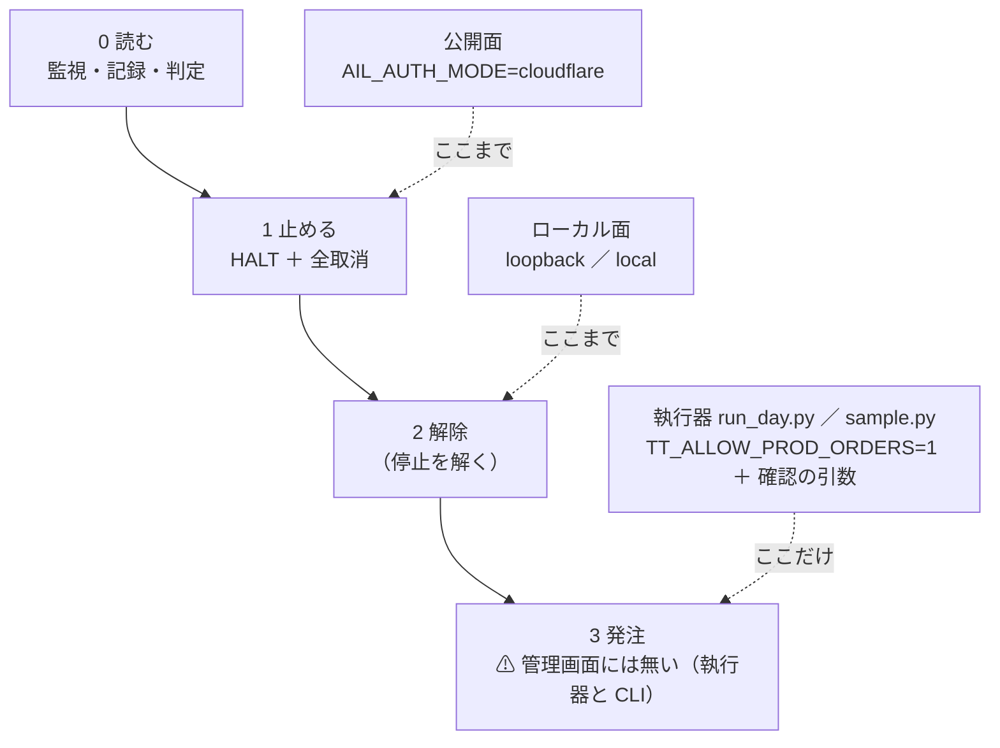
```mermaid
flowchart TB
  T0["0 読む<br/>監視・記録・判定"] --> T1["1 止める<br/>HALT ＋ 全取消"]
  T1 --> T2["2 解除<br/>（停止を解く）"]
  T2 --> T3["3 発注<br/>⚠ 管理画面には無い（執行器と CLI）"]
  P["公開面<br/>AIL_AUTH_MODE=cloudflare"] -.->|ここまで| T1
  L["ローカル面<br/>loopback ／ local"] -.->|ここまで| T2
  K["執行器 run_day.py ／ sample.py<br/>TT_ALLOW_PROD_ORDERS=1 ＋ 確認の引数"] -.->|ここだけ| T3
```

| `AIL_AUTH_MODE` | 通す接続元 | 認証 | 面 |
| --- | --- | --- | --- |
| `loopback`（**既定**） | ループバックのみ | なし | ローカル |
| `local` | ループバック ＋ RFC1918 | なし（ヘッダに「認証なし」と出す） | ローカル |
| `cloudflare` | ループバックは免除。それ以外は **全リクエスト（GET 含む）で `Cf-Access-Jwt-Assertion` を検証**（JWKS で RS256、aud・iss・email を照合） | Cloudflare Access | 公開 |

- `cloudflare` は `CF_ACCESS_TEAM` / `CF_ACCESS_AUD` / `CF_ACCESS_EMAIL` が**全部そろわないと起動しない**。他のモードで CF_* が置かれていても起動しない（中途半端な設定で素通りさせない）
- `X-Forwarded-For` は見ない。接続元は cloudflared のコンテナで、そこから先は JWT で決める
- 無認証の `/health` は無い（コンテナの healthcheck はループバックから叩く）
- POST は同一プロセスの CSRF トークン（cookie `SameSite=Strict` ＋ hidden）を要求する

### 停止ボタンの中身

1. `HALT` フラグ（記録ディレクトリの `HALT`、JSON で時刻・誰が・理由）を書く。**`sample.py` はこのファイルがあると発注系の手順（4・5・5limit・6）を拒否する**（exit 3）。`cleanup` は通る
2. 監視している環境ごとに、働いている注文（Received / Routed / In Flight / Live / Contingent）を全部取り消す。
   cert は常に可。**prod は資格情報の scope に `trade` があるときだけ**（無ければ「取消は不可」と結果に出す）
3. 解除はローカル面だけ

### 本番の許可（`ttclient.py` と同じ 3 段）

| 操作 | 管理画面 | 許可 |
| --- | --- | --- |
| dry-run | ⚠ **画面からは出せない**（2026-09-18 に外した）。部品 `devtools.run_step`（デモの種まき）だけが prod の `probe`・`dryrun` を通せる | `TT_ALLOW_PROD_DRY_RUN=1` |
| 取消 | ✅ **停止ボタン（働いている注文を全部取消）だけ** | `allow_prod_cancel`（**この許可では発注できない**。2026-09-05 に `ttclient.py` へ追加）。⚠ **`ops.py` が作るクライアントはこの許可しか持たない**（テストで固定） |
| 発注 | ⚠ **管理画面には無い** | 執行器（`experiments/live-trading/run_day.py`）と `sample.py` が `TT_ALLOW_PROD_ORDERS=1` ＋ `--i-know-this-is-real-money` で開ける。管理画面の設定は `TT_ALLOW_PROD_ORDERS` を読まない |

## 3. 秘密の扱い

- client secret・refresh token・access token・id token・quote token・口座番号は**ブラウザに送らない**
- すべての画面・JSON は `Redactor`（`record.py` の `Masker` ＋ 口座番号のラベル化）を通す。口座番号は `acct-<sha256 の先頭 4 桁>`
- 未登録の JWT も正規表現で落とす。ジョブの標準出力もマスクしてから保持する
- `Cache-Control: no-store`、CSP `default-src 'self'`、外部リソースなし、`X-Frame-Options: DENY`
- テスト（`dashboard/tests/test_app.py`）は偽の秘密を仕込んで全ページ・全 JSON を grep し、0 件であることを固定している

## 4. 監視ループ

> この図の主張: 環境ごとに REST 1 本と websocket 2 本を持ち、出口は画面の状態と monitor/*.jsonl の 2 つ。

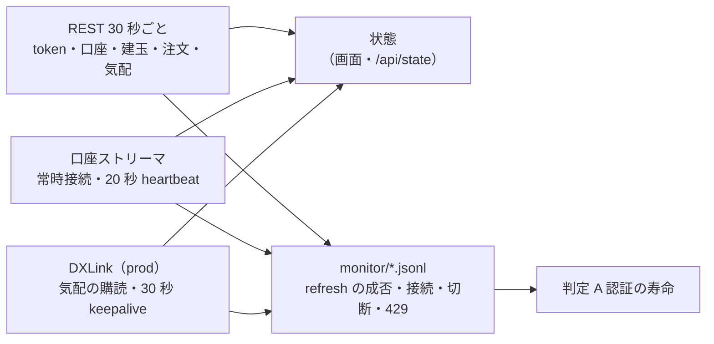
```mermaid
flowchart LR
  R["REST 30 秒ごと<br/>token・口座・建玉・注文・気配"] --> S["状態<br/>（画面・/api/state）"]
  A["口座ストリーマ<br/>常時接続・20 秒 heartbeat"] --> S
  D["DXLink（prod）<br/>気配の購読・30 秒 keepalive"] --> S
  R --> E["monitor/*.jsonl<br/>refresh の成否・接続・切断・429"]
  A --> E
  D --> E
  E --> J["判定 A 認証の寿命"]
```

| 何を | どう |
| --- | --- |
| 認証 | 失効 60 秒前に refresh。失敗は指数バックオフ（15 分 → 30 分 → …）、**3 連続で止める**（IP ブロック回避。再検証はローカル面のボタン）。token 応答の `scope` を保持し、ヘッダに出す |
| 口座 | `AIL_POLL_SECONDS`（既定 30）ごとに残高・建玉・働いている注文。口座番号は最初の照会で決める（`TT_ACCOUNT_NUMBER` があればそれ） |
| 現在値 | prod（とモック）だけ `AIL_SYMBOL`（既定 SPY）の REST 気配。`updated-at` との差を遅延として出す |
| 口座ストリーマ | `Bearer` 付きで connect、heartbeat には最新の access token を載せる。切れたら 5 秒 → 最大 120 秒のバックオフで再接続。通知（Order / AccountBalance / CurrentPosition）は直近 50 件 |
| DXLink | `GET /api-quote-tokens` の `dxlink-url` に繋ぐ。23 時間でトークンを取り直す。Quote / Trade の最新値と件数 |
| イベント | `monitor/<venue>-<env>-<UTC 日付>.jsonl` に `refresh_ok` / `refresh_fail` / `ws_connect` / `ws_disconnect` / `api_error` / `http_429` / `halt` / `resume` を追記 |

## 5. 判定の規則（記録の値だけから）

| 観点 | ✅ | ⚠ | ⏳ 未実測 |
| --- | --- | --- | --- |
| A 認証の寿命 | 手順 1 の成功と監視ログの `refresh_ok` が **2 営業日以上**にまたがる | またがるが `refresh_fail` もある | 同じ営業日の成功しか無い |
| B 常駐 | 同じ実行で手順 1・2・6 が ok | 1・2 だけ ok | 記録なし |
| C 現在値 | prod の手順 3 が**市場時間内**（ET 平日 9:30〜16:00）で `delay_s` < 1 | 市場時間内で 1 秒以上 | 時間外の記録しか無い（遅延は参考値と明記）／本番の資格情報なし |
| D 発注の往復 | 手順 4 と 5（または 51）が ok | 4 だけ ok | 記録なし（4 が失敗なら ❌） |
| E レート制限 | 手順 7 で 60 回/分が通り 429 なし | 429 が出た／60 回に達していない | 記録なし |
| F SDK | 記録の `sdk` 欄が「直接叩き」（OpenAPI 仕様がある） | SDK を使っている | 記録なし |

`mock: true` の行を含む実行は判定に使わない。会場（`venue`）ごとに列を並べる。

## 6. データの置き場

```
<AIL_DATA_DIR>/                  既定 dashboard/data、Docker では /app/data（volume）
├── records/                     実行記録 *.jsonl（AIL_RECORDS_DIR で別の場所も可。開発機の既定はサンプルの out/）
│   └── HALT                     停止フラグ（sample.py の TT_HALT_FILE の既定と同じ場所）
├── monitor/<venue>-<env>-<日付>.jsonl   監視イベント
├── ops/history.jsonl            操作の履歴（マスク済み）
└── jobs/history.jsonl, mock.log ジョブの履歴とモックのログ
```

⚠ **実行の一覧（§10）とデータ（§11）だけは `<AIL_DATA_DIR>` の外を読む。**

| | 既定 | 中身 |
| --- | --- | --- |
| `AIL_RUNS_DIR` | `experiments/feature-discovery/runs/`（中の `research.sqlite` を読む。2026-09-21 からディレクトリではなく DB） | ⚠ **読むだけ**（`mode=ro` で開く）。管理画面は 1 バイトも書かない。⚠ **git 管理外なので、別環境では空でよい**（画面は空でも 200 を返す） |
| `AIL_EXP_DIR` | `experiments/feature-discovery/` | ⚠ **読むだけ**（§11 が `data/manifests/`・`data/features/*/…meta.json`・`config/` を読む）。⚠ **無くても画面は 200 を返す** |

## 6-2. デモ（資格情報なしで動かす。2026-09-08）

資格情報が 1 つも無いとき、または `AIL_DEMO=1` のとき、本物には繋がず**モックサーバのデータで全画面を出す**。
デザイン確認と、資格情報を置く前のサーバ起動のため。この図の主張: **デモは「資格情報の代わりにモックを差す」だけで、画面・監視ループ・記録の経路は本物と同じものを通す**。

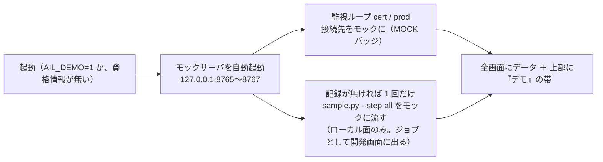
```mermaid
flowchart LR
  S["起動（AIL_DEMO=1 か、資格情報が無い）"] --> M["モックサーバを自動起動<br/>127.0.0.1:8765〜8767"]
  M --> MON["監視ループ cert / prod<br/>接続先をモックに（MOCK バッジ）"]
  M --> SEED["記録が無ければ 1 回だけ<br/>sample.py --step all をモックに流す<br/>（ローカル面のみ。ジョブとして開発画面に出る）"]
  MON & SEED --> UI["全画面にデータ ＋ 上部に『デモ』の帯"]
```

| 項目 | 内容 |
| --- | --- |
| 判定 | 通常はモックの記録を除外するが、デモでは含めて表を組み立てる（見出しに DEMO バッジ。本物の判定には使わない） |
| データの置き場 | `data/demo/` 配下（記録・監視ログ・ジョブ・操作履歴）。本物の記録（`out/`・`data/records`）と混ぜない |
| 実売買（概要・全体の詳細・トレーダーの詳細） | ⚠ **2026-09-18 から**、`AIL_LIVE_DIR` を指定しなければ**執行器のモックの記録**（`dashboard/demo/live/`。3 人 × 20 営業日・10-19 は起動しない・`mock: true`）を読む（§13-3） |
| 資格情報があるとき | `AIL_DEMO=1` なら本物には一切繋がない（監視は cert / prod ともモック）。`AIL_DEMO=0` で強制オフ |
| 面の規則 | 変えない。公開面（cloudflare）では操作・開発は出ない。g3plus は `.env` の資格情報が空なら自動でデモになる |

## 7. デプロイ契約（正本）

g3plus-ops 側の `ail-dashboard/`（Dockerfile・compose・手順書）はここに従う。契約が変わったらあちらを追従させる。

| 項目 | 値 |
| --- | --- |
| ベース | `python:3.12-slim`。ネイティブビルドなし（依存は `dashboard/requirements.txt` の 7 つ。`cryptography` は wheel） |
| build context | リポジトリの clone（public なので `git clone` → `git pull`）。COPY するのは `dashboard/app/`・`dashboard/requirements.txt`・⚠ **`dashboard/glossary.toml`**（2026-09-18 に追加。i マークの文面の正本。§15-10。⚠ **g3plus-ops 側の追従が要る** ＝ 追従までは i マークが出ず、フッタに「用語の正本が読めない」と出る）・`experiments/tastytrade-api-sample/*.py` と `*.sh` |
| 起動 | `cd /app/dashboard && python -m app.main`（uvicorn。`AIL_BIND=0.0.0.0`、`AIL_PORT=3012`） |
| ポート | **3012**。`ports:` でホスト公開しない（到達できるのは同じ docker network の cloudflared だけ） |
| 必須 env | `AIL_AUTH_MODE`（公開時 `cloudflare` ＋ `CF_ACCESS_TEAM` / `CF_ACCESS_AUD` / `CF_ACCESS_EMAIL`）、監視したい環境の資格情報（`TT_PROD_*` は **read スコープの grant を別に切って渡す**のが既定。cert の `TT_*` は任意） |
| 置かない env | `TT_ALLOW_PROD_ORDERS` / `TT_ALLOW_PROD_DRY_RUN`（公開面には発注経路が無いので意味を持たないが、置かない） |
| 永続化 | `/app/data`（§6）。**唯一の永続化対象** |
| 実行の画面 | ⚠ **`experiments/feature-discovery/runs/` は COPY しないので、g3plus では空になる**（画面は空でも 200）。見せたいときだけ `AIL_RUNS_DIR` を volume で差す。⚠ **読み取り専用でよい** |
| データの画面 | ⚠ **`experiments/feature-discovery/` も COPY しないので、g3plus では空になる**（画面は空でも 200）。見せたいときだけ `AIL_EXP_DIR` を volume で差す。⚠ **読み取り専用でよい** |
| 実売買の画面（概要・全体の詳細・トレーダーの詳細） | ⚠ **`experiments/live-trading/` も `dashboard/demo/` も COPY しないので、g3plus では空になる**（画面は空でも 200。デモでも空）。見せるには g3plus へ執行器の記録を届ける経路が要る（F21。未定） |
| TZ | `America/Los_Angeles` |
| healthcheck | コンテナ内ループバックで `GET /` が 200（`python -c "urllib.request.urlopen('http://127.0.0.1:3012/')"`） |
| 外向き通信 | `api.tastyworks.com` / `api.cert.tastyworks.com`（REST）、`streamer.tastyworks.com` / `streamer.cert.tastyworks.com`（口座 websocket）、`*.dxfeed.com`（DXLink。URL は応答の `dxlink-url`）、`<team>.cloudflareaccess.com`（JWKS） |
| 段階的な有効化 | Access の AUD が無いうちは `AIL_AUTH_MODE=loopback`（非ループバックは全部 403 = fail-safe）で起動しておき、Access アプリ → `.env` に 3 変数と `cloudflare` → Tunnel hostname の順で開ける |
| エッジキャッシュ | ホスト全体 Bypass の Cache Rule を入れる（キャッシュ HIT は認証評価前に配信される。アプリ側も `no-store` を返す） |

### 7-1. 13500t のローカル面（2026-09-22 夜。[プラン](../plans/three-machines.md) K5・Phase 2）

13500t では毎日の売買と**同じ機械**に管理画面を置く（K5）。⚠ **公開面（Cloudflare）は出さず、ローカル面だけ**（Sx360 から `run-dashboard-tunnel.sh --host <13500t の ssh 名>` で見る）＝ 上の表の「置かない env」はそのまま守られる（この面にも発注の経路は無い）。上の表との差だけを書く。

| 項目 | 13500t の値 | 上の表との差の理由 |
| --- | --- | --- |
| build context ／ 置き場 | 売買と**同じ clone を bind mount**（[live-trading.md §0-13](experiments/live-trading.md)）。COPY しない | 実売買の画面が読む `live.sqlite`・`experiments/live-trading/`・停止ボタンが書く `experiments/tastytrade-api-sample/out/HALT` を売買と共有する（F21 の「記録を届ける経路」が要らなくなる） |
| 面 | `AIL_AUTH_MODE=loopback` | 公開面を出さない（K5） |
| ネットワーク | ⚠ **`network_mode: host` ＋ `AIL_BIND=127.0.0.1`** | ⚠ `ports: 127.0.0.1:3012:3012` の形だと、要求は docker のブリッジの IP から届く ＝ ループバックに見えず**全部 403**（loopback 面は接続元で判定する）。host のループバックに直に口を開ける |
| uid | clone の持ち主と同じ | 停止ボタンが書く `HALT` と記録の DB を root の持ち物にしない |
| 資格情報 | 売買と同じ `experiments/tastytrade-api-sample/.env`（`config.py` が既定で読む） | 取消の許可（停止ボタン）は `ops.py` が開ける。⚠ dry-run ・ 発注の許可はこの面に渡らない（いまのとおり） |
| 実行・データの画面 | 空のまま（研究のデータは 13500t に置かない） | 研究は titan |
| 常駐 | 常駐コンテナ（`restart: unless-stopped`）・healthcheck は上の表のまま | — |
| イメージ | ⚠ **売買の `ail-live` のイメージを共用**（`/opt/venv` に研究・tastytrade・管理画面の依存。上の表の「依存 7 つの `python:3.12-slim`」ではない。2026-09-22 夜 Step 2-2） | [live-trading.md §0-13](experiments/live-trading.md) の合否 ①（`run-tests.sh --fast`）が `dashboard/.venv` と研究の `.venv` を同じ環境で要る。build は 1 本で済む |

## 8. 検証（2026-09-05）

| # | 検証 | 結果 |
| --- | --- | --- |
| 1 | 秘密がブラウザに出ない | ✅ `tests/test_app.py`: 偽の client secret・refresh・access token・口座番号を仕込み、12 経路の応答を grep して 0 件。モックに対する実機の全ページでも 0 件 |
| 2 | 面の判定 | ✅ `tests/test_access.py`: loopback / local / cloudflare の 3 モード、JWT の aud・iss・email・署名鍵の不一致で 403、cookie でも通る。公開面で `/ops` `/dev` が 404、停止だけ 303 |
| 3 | 本番ガードの 3 つの許可 | ✅ `experiments/tastytrade-api-sample/test_guard.py`（selftest.sh に組み込み）: dry-run の許可・取消の許可では発注できない |
| 4 | HALT | ✅ selftest.sh: フラグがあると `sample.py --step 4` が exit 3、`cleanup` は通る。画面: 停止中の発注は拒否、解除で消える |
| 5 | 判定の再現性 | ✅ `tests/test_records_judge.py`: 市場時間内の成功記録 2 営業日で A〜F すべて ✅、モック除外、部分記録で ⏳ / ⚠ / ❌ |
| 6 | 配線（監視ループ） | ✅ モック（`--market-data`）に対して cert / prod の 2 環境で認証・照会・口座ストリーマ・DXLink が繋がり、dry-run → 発注 → 停止（取消 1 件）→ 解除 → 後片付け、selftest ジョブの実行まで通した |
| 7 | Docker | ✅ 開発機で `docker build`（context = リポジトリ、165 MB）→ 起動（既定 loopback）: コンテナ内ループバックの `/` が 200、ホストから公開ポート経由（非ループバック）は 403、`AIL_AUTH_MODE=cloudflare` で AUD 欠けは `ConfigError` で起動せず、healthcheck は healthy |

## 10. 実行の画面（2026-09-08）

⚠ **2026-09-18 に管理画面の `/experiments` は外した**。この節は、vibeboard の実行タブ（`dashboard/vibetab.py`）と、それが import する部品 `app/experiments.py` の仕様として読む（スコアの規約・検査の写し方は同じ）。

⚠ **`/judge` は「tastytrade の API が使えるか」の判定、`/experiments` は「分析手法の検証」で別物。**
材料も別で、こちらは実行の記録 `experiments/feature-discovery/runs/research.sqlite` を読む（⚠ 2026-09-21 にディレクトリから DB へ移した ＝ rules.md 10 章。実行の名前・中のファイルの道・中身は同じ。読み手は `app/experiments.py` の `Store`・読み取り専用・標準ライブラリの `sqlite3`。見張りの指紋は 5 ファイルの sha256 から作る）。

> この図の主張: ⚠ **重い計算は実験を回すときに 1 度だけ。管理画面は読むだけにする。** だから仕様書の数字と画面の数字がずれない。

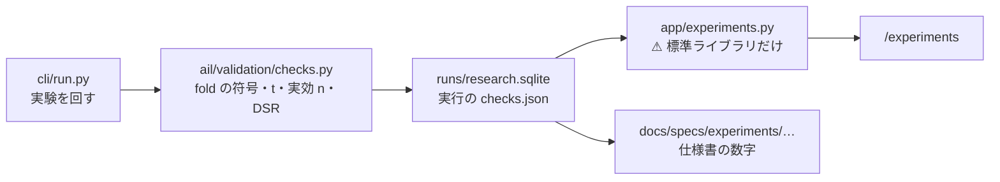
```mermaid
flowchart LR
  R["cli/run.py<br/>実験を回す"] --> C["ail/validation/checks.py<br/>fold の符号・t・実効 n・DSR"]
  C --> J["runs/research.sqlite<br/>実行の checks.json"]
  J --> D["app/experiments.py<br/>⚠ 標準ライブラリだけ"]
  D --> V["/experiments"]
  J --> S["docs/specs/experiments/…<br/>仕様書の数字"]
```

⚠ **管理画面に pandas / scipy を入れない**（`requirements.txt` は増やさない）。

### 10-1. 実行の種類とタイトル

⚠ **タイトルは付けずに設定から組み立てる。** 手で名前を書くと実行のたびにずれる。

| 部品 | どこから | 値 |
| --- | --- | --- |
| 種類 | `feature_layers` に `cs` `rel` `ll` があるか | **プーリング** ／ **断面** |
| 粒度 | `bar_minutes` | 日足 ／ 1 分足 |
| 地平 | `horizon` × `bar_minutes` | 1 日先 ／ 1 取引日先 |
| データの層 | 記録の `layer`（`cli/build.py` が書く sidecar が正） | 調整後 ／ ⚠ **調整前** |
| 対照実験 | 実行名の `_leak` | ⚠ **（先読みの検査）を後ろに付ける** |
| 偽薬 | 実行名の `_shift<S>` か config の `features.ex_shift_days`（2026-09-16） | ⚠ **（偽薬: 日付 −S 日）を後ろに付け、種類は「偽薬（日付ずらし）」** |

⚠ **例**: `2026-09-08T19-42-54_cross_section_h1` → **「断面・日足・1 日先・調整後」**。
⚠ **先読みの実行も「断面・…（先読みの検査）」と書く**（どの実行の対照かが読めないと意味が無い）。

### 10-2. スコア

⚠ **スコア = 最良手法（基準線を除く）の純利 bp**（利用者が 2026-09-08 に決めた）。降順に並べる。

| # | 規約 | ⚠ 理由 |
| ---: | --- | --- |
| 1 | ⚠ **基準線をスコアにしない**（「常に上」「直前リターンの符号」「全部使う」「乱択」） | ⚠ **「常に上」が 1 位になると比較の意味が消える。** 基準線は比べる相手であって採否の対象ではない |
| 2 | ⚠ **先読みの対照実験を一覧に入れない。** 別表に出す | ⚠ **的中率 99% の検証がスコア 1 位に出ると、一覧全体が嘘になる** |
| 2-2 | ⚠ **日付をずらした偽薬も一覧に入れない。** 別表に出す（2026-09-16） | ⚠ **本物と同じ設定・同じタイトルなので、混ぜると同じ名前の行が何十本も並んで本物が埋もれる**（[plan](../plans/archive/exog-shift-placebo.md)） |
| 3 | ⚠ **検査の 5 列を必ず横に並べる** | ⚠ **スコアは 1 つの数字なので、fold の偏りも多重検定も数字自体には出ない** |
| 4 | ⚠ **検査が無い実行は ⏳。** 0 や ✅ で埋めない | ⚠ **「計算していない」と「通らなかった」は別物** |

### 10-3. 横に並べる 5 列（✅ の条件）

| 列 | ✅ | ⚠ | ⏳ |
| --- | --- | --- | --- |
| **層** | `adjusted`（調整後） | ⚠ **日足 × `raw`**（分割調整の誤りを含む＝ 無効） | 1 分足 × `raw`（誤りは日足にしか無い） |
| **純利** | 往復コストを引いて正 | 0 以下 | スコアが無い |
| **fold** | ⚠ **全 fold で正** | 符号が割れる | fold の記録が無い |
| **上乗せ** | 「常に上」への上乗せの **t > 3.0** | 3.0 以下 | 上乗せを測れない |
| **DSR** | ⚠ **実効標本数で割り引いた**デフレーテッド SR > 0.95 | 0.95 以下 | パネルを確かめられず未計算 |

⚠ **DSR は「SR > 0」の検定であって「基準線を超えたか」ではない。** その比較は「上乗せ」の列が担う。
⚠ **`n_trials` は増えていく。** 画面には**そのときの検証数**を出し、正本は
[検証結果一覧](experiments/feature-discovery/ledger.md)のままにする。

### 10-4. ⚠ この画面で埋まらないもの

| # | 限界 | ⚠ 効き方 |
| ---: | --- | --- |
| 1 | ⚠ **スコアは 1 つの数字。** fold 1 だけで作られた数字も高く出る | ⚠ **検査の 5 列と、画面の注記で補う。** 隠さない |
| 2 | ⚠ **無効な実行（日足 × `raw`）もスコア順では上に来る** | ⚠ **層の列が ⚠ になるが、並び順では下がらない** |
| 3 | 実行どうしは条件が違う（粒度・地平・層・列の数） | ⚠ **スコアの差が手法の差とは限らない。** 条件を同じ行に出す |
| 4 | ⚠ **後から `checks.json` を書くとき、当時のパネルが残っていないと実効標本数と DSR は出せない** | ⚠ **層と行数の両方が一致する実行だけ計算し、それ以外は項目ごと省く** |

⚠ **デモ（§6-2）はこの画面に効かない。** 実行の数字は `AIL_RUNS_DIR` の記録をそのまま読むので、
⚠ **デモ中でも本物である。** ⚠ **デモの帯は「モックのデータを表示している」と書くので、この画面では
そのままだと嘘になる**（2026-09-08 に踏んだ）。帯に「この画面はデモの対象外」と足し、
フッタの出所も `records/` ではなく `runs/` を出す。

### 10-5. 閾値つき売買の実行（2026-09-10）

検証方式が**閾値つき売買**（[rules.md 13 章](experiments/feature-discovery/rules.md)）の実行は、
`checks.json` に `style: "threshold"` が付く。⚠ **画面は写しを出すだけ**の原則はそのまま。

| 変わるもの | 中身 |
| --- | --- |
| タイトル | 末尾に **「閾値売買・共通」／「閾値売買・銘柄別」** が付く（形式 (A)(B) を見分ける） |
| 上乗せの列 | ⚠ **相手が「常に上」（粗利）ではなく B&H（純利）**（`edge_vs_bh`。rules 13-7）。✅ の条件（t > 3.0）は同じ |
| fold の列 | ⚠ **fold の符号は対 B&H の上乗せの符号**（純利の符号では「買って持っただけ」と区別できない） |
| 詳細ページ | **「閾値ごとの成績」**を 3 水準とも出す（θ・最良手法・純利・B&H 純利・上乗せ・DSR・**取引回数・保有日率**・**保有日数 中央値（p25–p75）**（2026-09-17。`by_threshold[θ].holding` の写し。1 取引ごとの分布で強制清算を含む。項目の無い旧実行は「—」。⚠ **採否には使わない**。rules 13-4 の 6）・銘柄別 bp の要約）。⚠ **良かった閾値だけ出さない**（rules 13-3）。⚠ **取引回数を必ず横に置く**（「θ が高いほど良い」＝「取引しないだけ」を見抜くため。rules 13-10） |
| 一覧のスコア | 最良手法 × 最良閾値のポートフォリオ純利 bp（`best.閾値` を併記）。⚠ **3 水準の全体は詳細ページが持つ** |

⚠ **銘柄別 bp（`per_symbol.csv`）は要約（中央値・四分位・勝ち銘柄数）だけ出す。**
成果物であって採否には使わない（rules 13-7）。vibeboard の実行タブ（`vibetab.py`）も同じ写しを出す。

### 10-6. 門前の実行（2026-09-11）

前置きの門（[rules.md 14-5](experiments/feature-discovery/rules.md)）を通らなかった手法は**閾値売買を回さない**。
全手法が門前の実行は `summary.csv` を持たず、`checks.json` に `gate` だけが残る。

> この図の主張: ⚠ **実行は 3 つに分かれる。** 落とすのは「summary も門前の記録も無い」ものだけ。

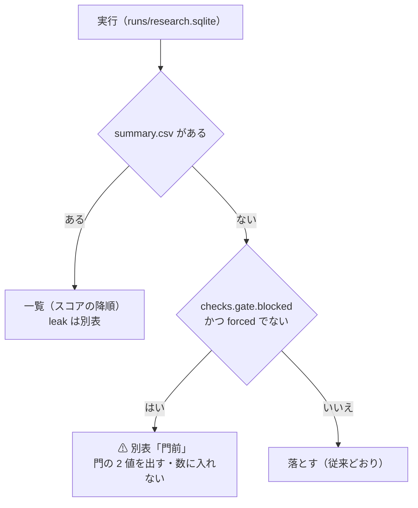
```mermaid
flowchart TB
  A["実行（runs/research.sqlite）"] --> Q1{"summary.csv がある"}
  Q1 -->|"ある"| N["一覧（スコアの降順）<br/>leak は別表"]
  Q1 -->|"ない"| Q2{"checks.gate.blocked<br/>かつ forced でない"}
  Q2 -->|"はい"| G["⚠ 別表「門前」<br/>門の 2 値を出す・数に入れない"]
  Q2 -->|"いいえ"| X["落とす（従来どおり）"]
```

| # | 規約 | ⚠ 理由 |
| ---: | --- | --- |
| 1 | ⚠ **門前の実行を画面から落とさない**（`index` の `gated_runs`） | ⚠ **検証結果一覧には「門前」の行で残るのに画面から消えると、画面を見て実行の有無を判断できない**（2026-09-11 に踏んだ） |
| 2 | ⚠ **一覧（スコアの降順）には混ぜず、別表に出す。** `total` / `positive` / `kinds` にも数えない | ⚠ **検証を回していないので「実行 N 件」に足すと水増しになる**（n_trials に数えないのと同じ扱い。14-5） |
| 3 | ⚠ **判定の 5 列（§10-3）は出さない** | ⚠ **⏳ を 5 つ並べると「計算待ち」に見える。** 門前は計算していないのではなく**回していない**（§10-2 の規約 4 とはここが違う） |
| 4 | 代わりに**門の 2 値と水準**（訓練内 holdout の AUC・買い% 幅、`auc_min` / `width_min_pt`）を写して出す | 画面だけで「なぜ回っていないか」が読める。⚠ **画面で門を判定し直さない**（`checks.json` の `gate` の写し） |
| 5 | ⚠ **`forced`（門前の手法も回した印）で summary が無い実行は従来どおり落とす**。⚠ **2026-09-14 から門は既定で止めない**ので、門前があれば既定の実行でも `forced` が立つ（`--ignore-gate` は既定の別名）。⚠ **門前の実行が生まれるのは `--gate` で足切りしたときだけ**（rules.md 14-10 規約 2） | ⚠ **「回したのに結果が無い」を門前と混同しない**（拾う条件は検証結果一覧 `ail/catalog.py` と同じ） |
| 6 | 一部の手法だけ門前（`summary` あり）の実行は**一覧に残し**、詳細に「回していない手法」の節を出す | ⚠ **一覧のスコアは回した手法のもので正しい。** 隠れるのは回さなかった手法なので、詳細で補う |

⚠ **門前の実行の詳細ページはスコアの 4 枚のカードを出さない**（すべて「—」になるため）。
代わりに帯（回していないこと）・条件・**門の表**（手法ごとの AUC・幅・fold ごとの値・通過 / 門前）を出す。
vibeboard の実行タブ（`vibetab.py`）も同じ写しを出す（目次の「⚠ 門前」・まとめの件数と表・実行ページの門の節）。

## 11. データの画面（2026-09-09）

⚠ **2026-09-18 に管理画面の `/data` は外した**。この節は、vibeboard のデータタブと部品 `app/inventory.py` の仕様として読む。

実験（`experiments/feature-discovery/`）が**何をどれだけ持っているか**を 1 画面にする
（プラン: [docs/plans/archive/dashboard-data-inventory.md](../plans/archive/dashboard-data-inventory.md)）。
§10 と同じ立て方で、⚠ **実験側が書いたものを読むだけ**。CSV / parquet を開いて数え直さない。

> この図の主張: ⚠ **数字は実験側が取得時に書き、画面は読むだけ。** だから manifest と画面の数字がずれない。

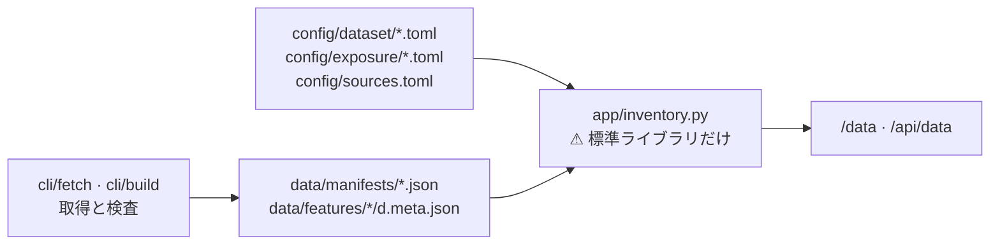
```mermaid
flowchart LR
  F["cli/fetch · cli/build<br/>取得と検査"] --> M["data/manifests/*.json<br/>data/features/*/d.meta.json"]
  C["config/dataset/*.toml<br/>config/exposure/*.toml<br/>config/sources.toml"] --> I
  M --> I["app/inventory.py<br/>⚠ 標準ライブラリだけ"]
  I --> V["/data · /api/data"]
```

### 11-1. 何をどこから写すか

| 見せるもの | 正本 | ⚠ 規約 |
| --- | --- | --- |
| 系列数・行数・最古と最新の日・検査の引っかかり | `data/manifests/<層>_<粒度>.json` | ⚠ **manifest の値をそのまま出す**（数え直さない。rules.md 5 章の指紋が正） |
| 特徴量の表（行数・列数・元の層） | `data/features/<実験>/<粒度>.meta.json`（`cli/build.py` の sidecar） | ⚠ **先読み検査用（`_leak`）は別枠に出す** |
| 枠（本命 ／ 偽薬）・仮説 | `config/dataset/*.toml` の `role` `hypothesis` | ⚠ **取得の前の宣言を写すだけ。結果を見て分類しない。** manifest の枠（取得時の写し）と食い違ったら ⚠ を立てて見せる（黙ってどちらかを選ばない） |
| 銘柄の種別（会社株 ／ ETF ／ 実質は株の ETF） | `config/universe/*.toml` の `groups` | ⚠ **宣言を銘柄名で引くだけ**（画面が銘柄名から推測しない）。⚠ **宣言に無い銘柄は「分類なし」で見せる**（黙ってどちらかに寄せない）。集合の限界（生存バイアス・選定日）も一緒に出す |
| **銘柄の集合の一覧表**（集合 × 対象の銘柄と内訳 × その他 × 日足あり × 1 分足あり × データセット × 実験の設定 × 選定日 ＋ 重複を除いた合計。2026-09-18） | `config/universe/*.toml`（銘柄・種別・材料 `inputs_*`）／ `config/dataset/*.toml` の `universe` ／ `config/experiment/*.toml` の `dataset`・`targets` ／ 調整後の manifest の銘柄名 | ⚠ **対象 ＝ `etf` ＋ `company`（実験側の `symbols_of` と同じ）から、材料と宣言された銘柄を除いたもの**（midcap48 は先行銘柄として読ませるために材料 63 本を `etf` に置いている）。⚠ **足の有無は manifest の銘柄名との突き合わせ**（CSV を開かない・ディレクトリを数えない）。⚠ 実験の設定は宣言の数で、実行の数ではない。組むのは `inventory.universe_table`、出すのは vibeboard のデータタブの**概要の先頭**と「銘柄の集合」の先頭（管理画面の `/data` には足していない ＝ 消す予定の画面） |
| ずらし幅・公表の遅れ・規約の判定 | `config/sources.toml`（2026-09-09 新設） | ⚠ **実効値は `ail/features/exog.py` / `impact.py` が持つ。** 一致は実験側の `tests/test_sources_decl.py` が固定する（同じ数字を 2 か所で手管理しない） |
| 割り当て（災害 → 銘柄の重み） | `config/exposure/*.toml` | ⚠ **全部【推測】・後知恵あり（`hindsight`）を画面に明示する**（宣言の写し） |

### 11-2. 規約の判定は 3 分類

| 判定 | 意味 | 例 |
| --- | --- | --- |
| 公有 | 米政府の著作物（17 U.S.C. §105） | 財務省・NOAA・USGS・NCEI |
| robots | robots.txt と規約を実測して問題なし | ECB・EPU・IEM（`Crawl-delay: 120` を守る） |
| 契約 | 口座の規約の範囲で使う | tastytrade |

⚠ **「要判断」の取得元（FRED・Open-Meteo・SILSO）はデータを持っていないので画面に出さない**
（[daily-data-sources.md §2・§4](experiments/daily-data-sources.md) が正本）。

### 11-3. 面とデモ

- 読むだけ・秘密なし（外部系列と足は公開データ）なので**公開面にも出す**。応答は他の画面と同じく `Redactor` を通す
- ⚠ **デモ（§6-2）の対象外**（§10-4 と同じ理由）。帯に「この画面はデモの対象外」と足し、フッタの出所は `AIL_EXP_DIR` を出す
- ⚠ **`AIL_EXP_DIR` が無い・壊れた JSON / TOML でも 200 を返す**（g3plus には COPY しない。§7）

## 12. 用語の画面（2026-09-12）

vibeboard の**用語**タブ（`/ext/glossary`）。⚠ **索引であって解説書ではない。**
1 語 1〜2 行の意味と、⚠ **詳しい定義がある文書へのリンク**だけを出す
（プラン: [docs/plans/archive/vibeboard-glossary.md](../plans/archive/vibeboard-glossary.md)）。

⚠ **この画面は管理画面（3012）には無い。** `vibetab.py` の 3 本目のタブで、
§10・§11 と同じく **vibeboard 本体が `/ext/<name>` で中継する**。

> この図の主張: ⚠ **説明はコードにも画面にも持たない。** 正本は TOML 1 本で、画面はその写しを出すだけ。

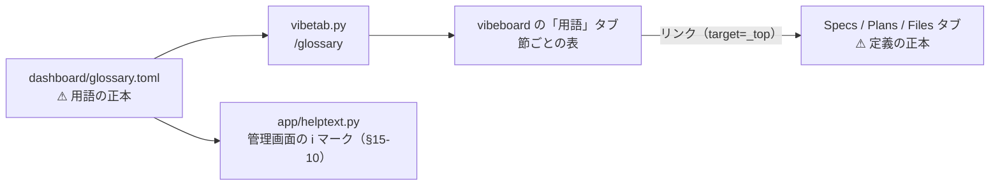
```mermaid
flowchart LR
  T["dashboard/glossary.toml<br/>⚠ 用語の正本"] --> V["vibetab.py<br/>/glossary"]
  T --> H["app/helptext.py<br/>管理画面の i マーク（§15-10）"]
  V --> TAB["vibeboard の「用語」タブ<br/>節ごとの表"]
  TAB -->|"リンク（target=_top）"| DOC["Specs / Plans / Files タブ<br/>⚠ 定義の正本"]
```

### 12-1. 規約

| # | 規約 | ⚠ 理由 |
| ---: | --- | --- |
| 1 | ⚠ **用語の正本は `dashboard/glossary.toml`**（`tomllib`。画面は写し。⚠ **読み手は 2 つ**: 用語タブ ＋ 管理画面の i マーク。2026-09-18） | ⚠ **説明を Python に埋めない。** §10-2 の「画面は読むだけ」と同じ立て方 |
| 2 | ⚠ **1 語 1〜2 行。詳しい定義を書かない**（テストが長さを固定する） | 定義が 2 か所にあると必ず食い違う。⚠ **食い違ったらリンク先が勝つ** |
| 3 | ⚠ **動く数字を書かない**（検証数・DSR の値・行数） | ⚠ **数字は動く。** 用語表に残ると嘘になる。数字は実行タブ（§10）と spec が持つ |
| 4 | リンクは vibeboard の hash URL（`/#specs/…`・`/#plans/…`・`/#files/…`）へ `target="_top"` | ⚠ **同じ画面の中で定義まで辿れる**。⚠ **節（§）へは飛べない**ので、節は文字で横に置く |
| 5 | ⚠ **リンク先の実在をテストで固定する**（`tests/test_vibetab.py`） | ⚠ **リンク切れは索引の価値を消す。** 文書を移したら赤くなる |
| 6 | 読めない・壊れているときは空で 200（仮の説明で埋めない） | 「用語が無い」と「壊れている」を混ぜない |

### 12-2. 画面

| 経路 | 中身 |
| --- | --- |
| `/glossary/api/sidebar` | 先頭が **すべての用語**（全語を 1 ページに出す。⚠ **ブラウザの検索で引くため**）、以下は分野ごとの節 |
| `/glossary/view?item=<節 id\|all>` | 節の表（用語・意味・詳しく）。知らない id は 404 |
| `/glossary/api/watch` | `glossary.toml` の mtime を見て、編集したらタブが自分で追いつく |

分野は 10（進め方 ／ 検証結果一覧の単位 ／ 統計の検査 ／ 閾値つき売買 ／ データ ／ 手法とモデル ／ 口座と API ／ 収入の体系 ／ ⚠ **実売買 ／ 管理画面（監視と記録）** ＝ 2026-09-18 に i マーク用に足した 2 つ）。
⚠ **語の `name` は管理画面の templates が識別名として指している**（§15-10）。名前を変える・消すときは `dashboard/tests/test_help.py` が赤くなるので、templates の `info("…")` も一緒に直す。
⚠ **語を足すのは TOML だけ**で、画面もサイドバーも追従する。

### 12-3. ⚠ sidecar は vibeboard を再起動しても入れ替わらない（2026-09-12 に踏んだ）

まっさらな状態なら **`./run-vibeboard.sh` だけで 3 タブとも上がる**【実測 2026-09-12】。
sidecar（`vibetab.py`）は customTabs の `command`（**実行タブの 1 件だけが持つ**。3 タブとも同じ 1 プロセスが出す）で
vibeboard の**子**として起き、⚠ **vibeboard を止めると一緒に止まる。**

⚠ **例外が 1 つあり、そこを踏んだ。** タブに **「接続できません: HTTP 404」** が出たら、⚠ **3015 に古い `vibetab.py` が居座っている。**

| 何が起きるか | なぜ |
| --- | --- |
| vibeboard を入れ直してもタブが 404 | vibeboard は `command` を実行する前に **baseUrl が応答するかを見て、応答したら起動しない**（`vibeboard/src/sidecar.ts` の `startOne`）。⚠ **古い sidecar が答えるので、新しいものは上がらない** |
| 古い sidecar が生き残る | `vibetab.py` は bind できないとき ⚠ **静かに引く**（二重起動を避ける設計）。前の vibeboard の子は親が落ちても残ることがある |

直し方: ⚠ **ポートから引いて**（`pgrep -f` は自分にも当たる）落とし、入れ直す。⚠ **3010 には触らない。**

```bash
pid=$(ss -ltnp | grep ":3015 " | grep -o 'pid=[0-9]*' | cut -d= -f2 | head -1) && kill "$pid"
nohup python3 dashboard/vibetab.py &                   # 3 タブとも同じ 1 プロセスが出す
```

⚠ **この罠は用語タブに限らない**（実行・データも同じ 1 プロセスが出している）。⚠ **`vibetab.py` を直したら sidecar を入れ直す**。

## 13. 実売買の画面（2026-09-18）— 概要 ・ 全体の詳細 ・ トレーダーの詳細

⚠ **2026-09-18 に `/live` 1 枚から 3 画面に作り直した**（`/` 概要・`/overall` 全体の詳細・`/traders/<name>`。`/live` は `/` へ転送）。データは `app/live.py` の `board()`（トレーダー別の推移・行動のマス目・差 1・起動しなかった日）、図は `app/charts.py`（§15-5）。`/api/live` は今までどおり `index()`。

⚠ **`/live` は「トレーダー 3 人の実売買」（[プラン](../plans/live-trading-three-models.md)・[記録](experiments/live-trading.md)）の監視で、
`/judge`（API が使えるか）・`/experiments`（分析手法の検証）とは別物。** 材料も別で、`experiments/live-trading/` を読む。

> この図の主張: ⚠ **執行器が書いたものを写すだけ。画面は数え直さない・書かない・発注しない。** 停止だけは既存の停止ボタン（`HALT`）で、執行器がそれを見る。

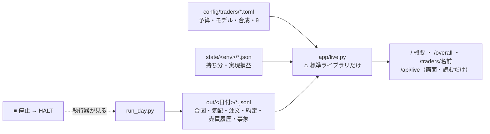
```mermaid
flowchart LR
  T["config/traders/*.toml<br/>予算・モデル・合成・θ"] --> L["app/live.py<br/>⚠ 標準ライブラリだけ"]
  S["state/&lt;env&gt;/*.json<br/>持ち分・実現損益"] --> L
  O["out/&lt;日付&gt;/*.jsonl<br/>合図・気配・注文・約定・売買履歴・事象"] --> L
  L --> V["/ 概要 ・ /overall ・ /traders/名前<br/>/api/live（両面・読むだけ）"]
  H["■ 停止 → HALT"] -.->|執行器が見る| R["run_day.py"]
  R --> O
```

### 13-1. 何をどこから写すか

⚠ **2026-09-21 から、下の表の道はそのままで中身は DB**（`experiments/tastytrade-api-sample/livefs.py`。本物はリポジトリ直下の `live.sqlite`・シミュレーションは木の `sim.sqlite`・デモは `dashboard/demo/live/` のファイルを起動のたびに入れる `demo.sqlite`。[live-trading.md §0-11](experiments/live-trading.md)）。管理画面の読みは無くても落とさない（`missing_ok=True`）。API 検証の記録（`/records`・`/judge`）と監視・操作の履歴（`data/`）も同じ DB。⚠ g3plus（Docker・`AIL_DATA_DIR`）では置き場の中に自分の `live.sqlite` を作る ＝ ⚠ **g3plus を更新するときは、いまの `/data` のファイルを `livefs.py import` で取り込んでから**（g3plus-ops の側の手順）。

| 画面の項目 | 正本 | ⚠ 注意 |
| --- | --- | --- |
| トレーダー（名前・予算・銘柄集合・モデルの一覧・合成規則・θ・株数の決め方・試験用） | `config/traders/<名前>.toml` ＋ 呼び名は `dashboard/traders.toml` の `[nicks]`（§16 と同じ 1 本） | 名前は **`呼び名（識別名）`**（例 アキ（T1）。呼び名が無い人は識別名だけ。URL・記録・`name` は識別名。2026-09-23 利用者の指示「呼び名を表示する。T1,T2 なども併記」）。`test = true` のトレーダーは TEST バッジ。⚠ **2026-09-23「テストトレーダーは削除」＝ 本物のモード・デモでない・本物の人が 1 人以上のときは、試験用を一覧（左ペイン・概要の段と凡例・`/api/live` の `traders`）に出さない**（`live.show_test_traders`。`test_traders` は返す・`/traders/<名前>` を直接開けば TEST バッジつきで見える・sim と デモ と 本物の人が 0 人のときは今までどおり出す。設定ファイルは消さない）。⚠ **実際に動かすトレーダーが 0 人なら「属性はまだ設定していない」と出す**（2026-09-17 の利用者決定） |
| 建玉・原価・実現損益・最終日 | `state/<env>/<名前>.json` | env（cert ／ prod）ごとに別の売買履歴。cert のリハーサルと本番を混ぜない |
| 原価 ／ 実現 ／ 含み・含み損の割合 | `out/<日付>/ledger.jsonl` の最新行 | ⚠ **含み損が予算の 20% を超えたら赤で「停止条件」と出す**（`live-trading.md` §0-2。⚠ 自動では止めない。止めるのは人） |
| 合図（トレーダー × 銘柄の買い% ／ 出口% と入力のモデル） | `out/<日付>/signals.jsonl` | 合成後の値。モデル別は `predict.jsonl`（Phase 1 の後） |
| 注文（数量・誰の分・合図時の気配・約定・状態・検証回数・手数料・所要・エラー） | `out/<日付>/orders.jsonl` | 手数料は dry-run の `fee-calculation` の写し（差 2 の材料。⚠ 実際の規制費は口座の取引履歴でしか確定しない） |
| 内部移転・残高 | `transfers.jsonl` ／ `balances.jsonl` | 内部移転は口座に出ない（差 3 のコスト 0） |
| 日次（1 日 1 行）: 合図・注文・約定・問題・再送・差 1 の中央値と最大・見送り・事象 | 上の全部 | 新しい順に 20 日 |

### 13-2. 画面で計算する唯一の数字 — 差 1

記録には価格しか無いので、**差 1（合図時の気配 → 約定）だけ画面で bp に直す**。買いは (約定 − mid) ÷ mid、売りは (mid − 約定) ÷ mid。⚠ **正 ＝ 不利**。
色は `live-trading.md` §0-2 の閾値（中央値 ✅ ≤ 5bp ／ ⚠ 5〜10 ／ ❌ ＞ 10）。差 2 は dry-run の手数料の写し、差 3 は Phase 3（紙上の対照）の後で埋まる、差 4（無人運転）は問題のあった日と再送の回数。

### 13-3. 面とデモ

| 項目 | 内容 |
| --- | --- |
| 面 | **両面**（公開面でも読める）。POST の経路は無い（405）。停止は既存の `/ops/halt` |
| デモ | ⚠ **2026-09-18 から対象に入れた**: デモ（`AIL_DEMO=1` か資格情報なし）で `AIL_LIVE_DIR` を指定しなければ、**執行器のモックの記録**（`dashboard/demo/live/`。3 人 × 20 営業日・10-19 は起動しない・`mock: true`）を読む。`AIL_LIVE_DIR` を指定したときはそれを読む。無ければ空のまま 200（g3plus には `dashboard/demo/` を COPY しないので空。§7） |
| 秘密 | 記録は執行器が `Masker` を通して書き、画面の応答はさらに `Redactor` を通す。テストは口座番号・JWT の不在を固定 |
| 更新 | リクエストごとに読む（監視ループには載せない。1 日 1 回しか増えない） |

### 13-4. ⚠ この画面で埋まらないもの

- ✅ **紙上の対照（差 3）と B&H（2026-09-20）**: 執行器の `paper.py` が書く `out/daily.csv`（[live-trading.md §0-10](experiments/live-trading.md)）を `live.daily_rows()` が**読むだけ**（画面で計算しない）。ある人は、トレーダーの詳細の点線（紙上の累計 %）・差 3 のタイル（累計と日次の中央値）・「紙上の対照（日次）」の表（紙上 ／ 実物 ／ 差 3 ／ B&H ／ 執行できず ／ 差 1）と、概要の差 3 が本物になり、`/api/live` に `daily` が出る。⚠ **`daily.csv` が無い ／ 読めない人は仮データのまま**（§15-8 の印。`/api/live` には出さない）。⚠ 終値が気配の代役（モック ／ シミュレーション。`close_source = quotes`）のときは「終値は気配の代役」の印。キーと列の対応は `tests/test_live.py` の `test_real_paper_control_replaces_the_placeholder_when_daily_csv_exists`
- ✅ 休場日の暦は 2026-09-18 に入れた（NYSE の公表 2026〜2028 年。§15-8）。⚠ **暦に載っていない年だけ「平日＝営業日」に戻り、「仮」の印が出る**
- 「儲かったか」の判定。損益は出すが色を付けない（判定は執行の差と無人運転だけ）
- 執行器の起動。画面からは動かさない（titan の timer ／ cron。`live-trading.md` §0-5）

### 13-5. 画面（2026-09-18、幅 1280px。デモ）

⚠ **写っている数字はモックの値で、【実測】ではない**（`dashboard/demo/live/`。執行器のモックを 3 人で 20 営業日。約定は `--fill-noise 0.003` で気配から散らしたもの ＝ 差 1 が ❌ ばかりなのはそのせい）。

**概要**（`/`）

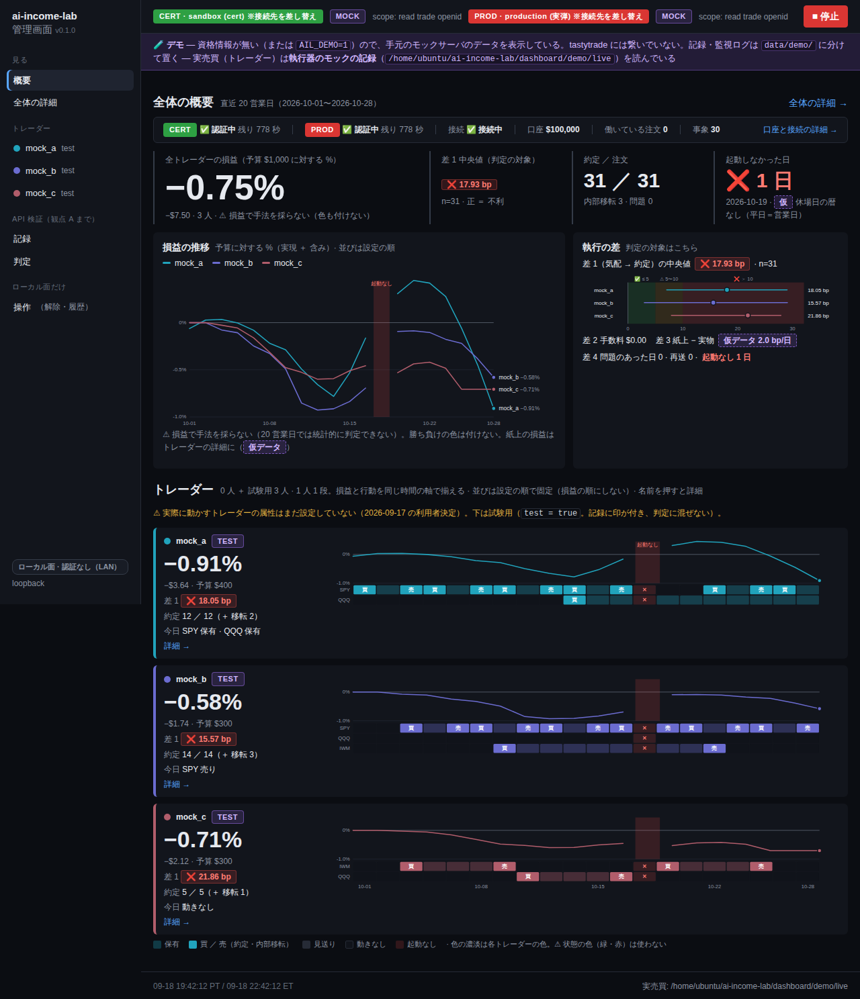

**全体の詳細**（`/overall`。上側）

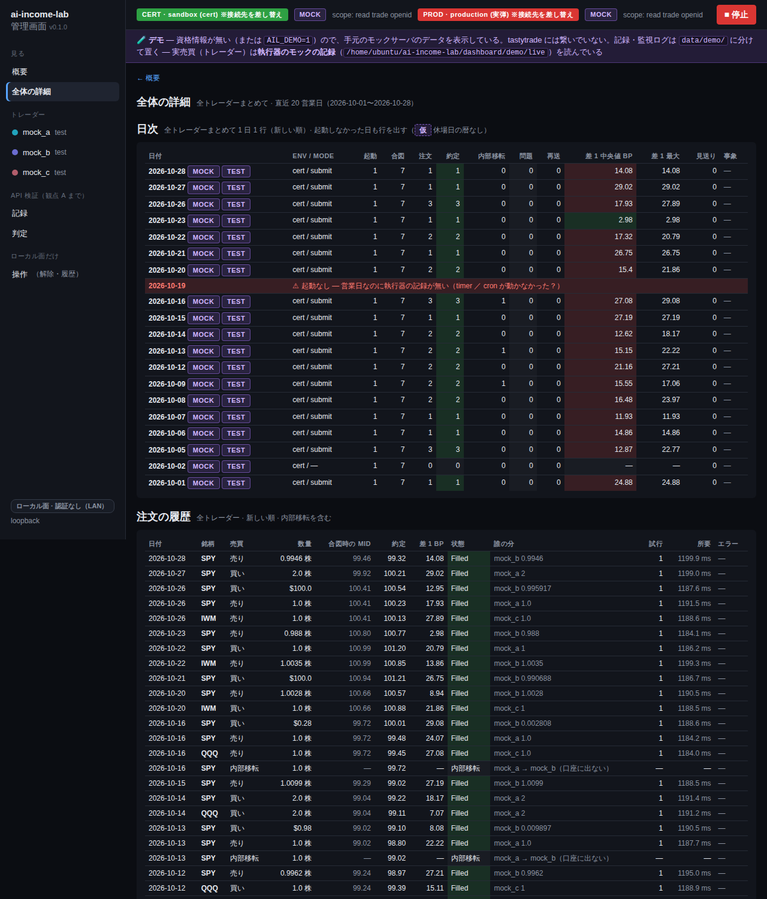

**トレーダーの詳細**（`/traders/mock_a`）

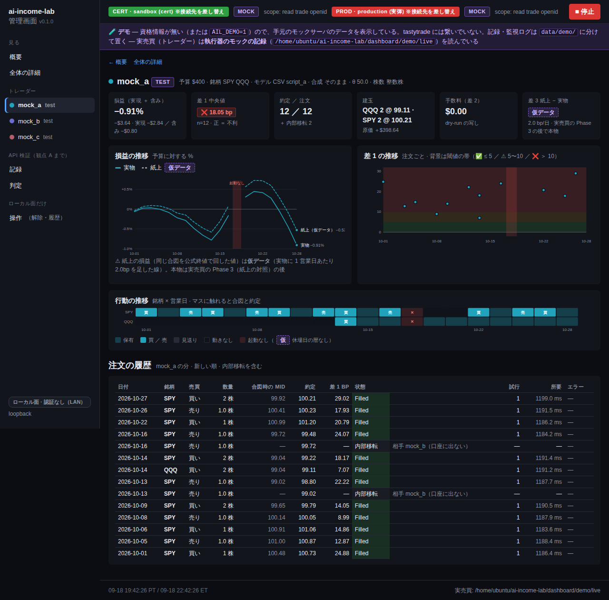

撮り方（3012 は触らない）:

```bash
cd dashboard && AIL_DEMO=1 AIL_PORT=3019 .venv/bin/python -m app.main     # デモは dashboard/demo/live を読む
# playwright（node）で幅 1280・fullPage。5 秒ごとの部分更新を 1 回通してから撮る
```

- ✅ **titan で pytest が極端に遅かった（144 件で 487 秒【実測 2026-09-18】）のは直した（146 件で 7.7 秒【実測】）**。デモのせいではなかった（当初の「デモがポートを取り合う」は誤り）。原因【実測】: titan の WSL2 は `networkingMode=mirrored` で、⚠ **閉じたループバックのポートへの接続が拒否されずタイムアウトする**（`127.0.0.1:9` へ繋ぐと `timed out`）。監視を要らないテスト 16 本が `create_app(settings)` のまま `TestClient` を開いて監視を起こし、`TT_REST_BASE=http://127.0.0.1:1` への認証で `ttclient` の 30 秒を 1 本ずつ待ち切っていた。直し方: 16 本を `start_monitors=False` にし、⚠ **`tests/conftest.py` に番人を置いた（テストで監視を起こすと落ちる）**。停止のテストだけは取消を実際に送るので、テストの client の待ちを 0.5 秒にした（操作のクライアントは待ち時間を監視のものから借りる。⚠ **`ttclient` の既定 30 秒 ＝ 実運用の値は変えていない**）
- ✅・❌・🧪 が □ で写るのは撮影機に絵文字フォントが無いとき（titan は無い。Sx360 は `fonts-noto-color-emoji` があり、そのまま写る）
- ✅ **CSP 違反は全画面で 0 件【実測 2026-09-18】**（概要・全体の詳細・記録・判定・操作・開発。`tests/browser/confirm.mjs`）。当初は操作（`/ops`）ほかにインラインの style が 9 か所・確認ダイアログの `onsubmit` が 5 か所あり、CSP に止められていた（§15-9 で直した）

### 13-6. シミュレーションモード（2026-09-19）— 表示だけ。実売買の数字と混ぜない

決めごとの正本は [live-trading.md §0-7](experiments/live-trading.md)。⚠ **実売買とシミュレーションは排他**で、機械のモード（`experiments/live-trading/MODE`。無ければ real）は 1 つ。管理画面はそれを**リクエストのたびに読む**（動かしたまま CLI で切り替わる）。

> この図の主張: 画面が読む記録の木はモードから 1 つに決まり、食い違うときは数字を出さない。操作は足さない（切り替え・速さ・停止は CLI の `simctl.py`）。

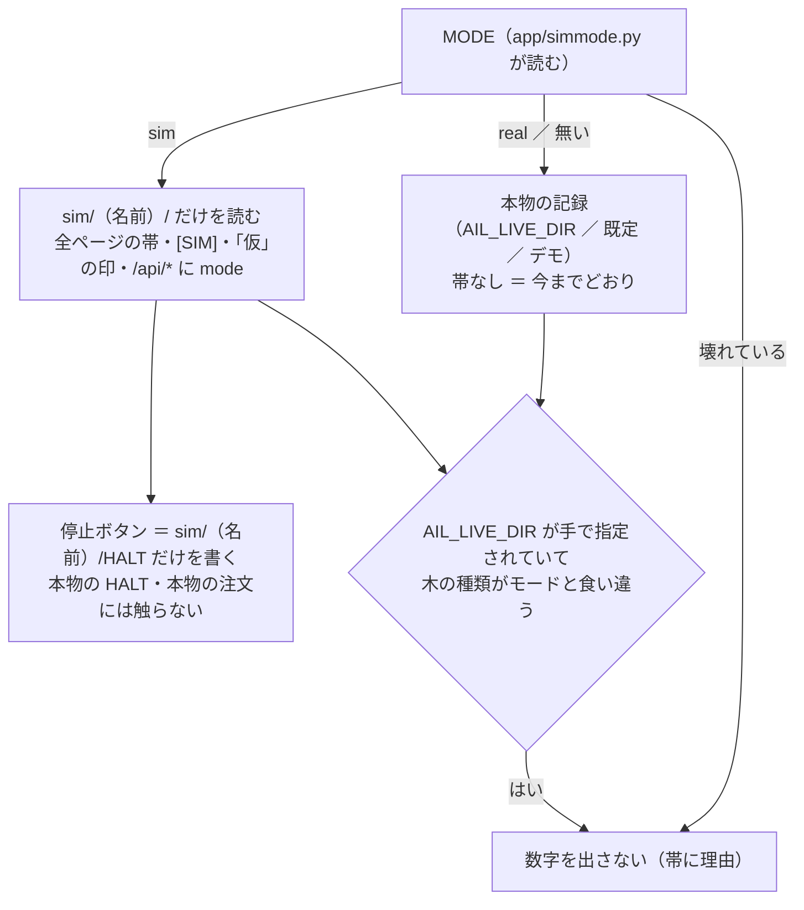
```mermaid
flowchart TD
  M["MODE（app/simmode.py が読む）"] -->|real ／ 無い| R["本物の記録（AIL_LIVE_DIR ／ 既定 ／ デモ）<br/>帯なし ＝ 今までどおり"]
  M -->|sim| S["sim/（名前）/ だけを読む<br/>全ページの帯・[SIM]・「仮」の印・/api/* に mode"]
  M -->|壊れている| X["数字を出さない（帯に理由）"]
  S --> H["停止ボタン ＝ sim/（名前）/HALT だけを書く<br/>本物の HALT・本物の注文には触らない"]
  R --> C{"AIL_LIVE_DIR が手で指定されていて<br/>木の種類がモードと食い違う"}
  S --> C
  C -->|はい| X
```

| 項目 | 内容 |
| --- | --- |
| 読む場所 | `AIL_MODE_DIR`（既定 `experiments/live-trading`）の `MODE`・`sim/<名前>/{config,state,out}`・`sim/<名前>/sim/{control,status}.json`。⚠ **公開面（cloudflare）は `MODE` を読まない** ＝ 常に実売買の側だけ（g3plus には `MODE` も `sim/` も載せない） |
| 帯 | 全ページの最上部・`position: sticky`・**部分更新の外**（消せない）。「[SIM] シミュレーション <名前> — 仮データ・仮の時計。実売買ではない」＋ 仮の時刻 ／ 速さ ／ 停止中 ／ 何日目 ／ 運転手の状態（ここだけ 1 秒おきに `/?partial=simclock` で取り直す）。`<title>` の頭に `[SIM]`、左ペインの銘の下にも `[SIM] <名前>`。見た目は §15-11 |
| 「本番の機械ではない」印（2026-09-24） | 執行器の `NOT_PRODUCTION`（[live-trading.md §0-14](experiments/live-trading.md)）があると、全ページの最上部に**灰の縞の帯**「本番の機械ではない — この機械では執行器が本番の発注を拒む」・`/api/*` に `not_production`（`machine`・`host`・`matches_host`・`since`・`error`）。印の hostname が違えば「この機械の印ではない」、壊れていれば「読めない」と出す（執行器と同じく「ある」側に倒す）。⚠ 表示だけ・`MODE` と同じく公開面は読まない（`mode_dir` なし）。`app/simmode.read_not_production` |
| 「仮」の印 | 概要・全体の詳細・トレーダーの詳細の見出しと大きな数字に `.chip.placeholder.sim-mark`（テンプレートの `simmark(machine)`） |
| 流れている途中を眺める | シミュレーションモードの概要・全体の詳細・トレーダーの詳細だけ、`<main data-poll-self="3000">` ＝ いまの URL を取り直して `main` の中身を差し替える（`app.js`。帯は `main` の外なので差し替わらない。ヘルプを開いている間は止まる） |
| 「今日」 | 暦の残り日数は仮の今日で数える（`board(today=…)`）。記録の日付はもともと記録から来る |
| `/api/*` | `/api/state`・`/api/events`・`/api/records`・`/api/live`・`/api/judge` の全部に `"mode"`。sim のときは `"sim": {名前・速さ・仮の時刻・何日目…}`、食い違いは `"mode_mismatch"`。⚠ **1 つの応答に本物とシミュレーションの行を混ぜない** |
| 停止ボタン | `Settings.halt_file` がモードを見る: sim のときは `sim/<名前>/HALT`（執行器が仮の時計のとき見るのと同じファイル）。⚠ **sim のときは本物の口座への取消を 1 本も出さない**（通し稽古）。操作の履歴の各行に `mode` |
| ⚠ 操作は足さない | POST の経路は `/ops/halt`・`/ops/resume`・`/ops/retry-auth` のまま（テストで固定）。管理画面が `sim/` の下に書くのは `HALT` だけ。§3 の権限の表は変えない |
| デモとの関係 | デモ（資格情報なし ／ `AIL_DEMO=1`）の帯は今までどおり別に出る（排他の対象外）。⚠ **Sx360 は資格情報が無いので常にデモの帯も出る**が、モードが sim なら実売買の 3 画面はシミュレーションの記録を読む |
| テスト | `tests/test_mode_banner.py`（`MODE` が無ければ 1 つも出ない ／ sim で全ページに帯と `[SIM]` ／ `/api/*` の `mode` ／ 食い違いは数字なし ／ 公開面は読まない ／ POST が増えていない ／ 停止ボタンは sim の `HALT` だけ）。ブラウザ確認（帯が最上部・スクロールしても見える・仮の時刻が進む・開いたまま数字が進む・CSP 違反 0 件）は 2026-09-19 に手で行った |

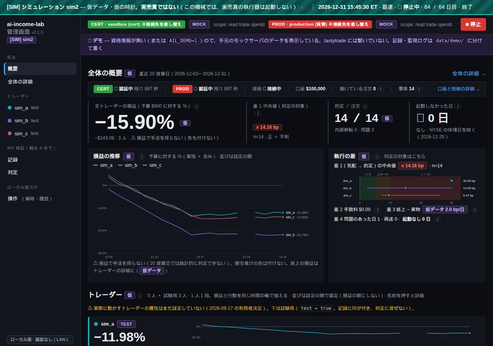

⚠ **写っている数字は仮データ**（過去の日足の再生 ＋ 筋書きの `drawdown`）。損益にも差 1 にも意味は無い。

### 13-7. 面ごとの期間（2026-09-20）— 1 人を縦に追う面だけ全期間

利用者の指示（2026-09-20）: **「管理画面のトレーダーの詳細に履歴は全て出すようにしてください。長すぎると見づらいので手法を考えます」**。
⚠ **きっかけ**: `sim2`（64 営業日）で `sim_a` は全期間に 8 件注文したのに、画面は**直近 20 営業日しか読まないので「注文 0」**に見えた【実測 2026-09-20】。
損益の線だけが落ちていき、それを作った注文が表に無い ＝ 画面だけでは理由を辿れなかった。

> この図の主張: 期間は面の役割で決まる。横に比べる面は全員同じ発注できる時間帯、縦に追う面は全期間。

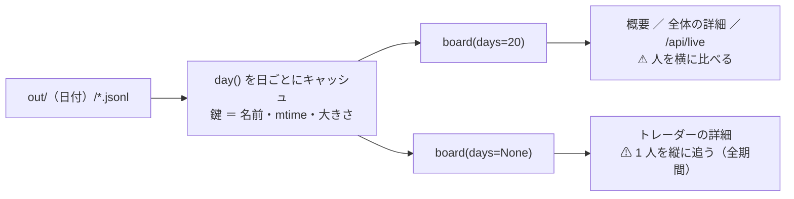
```mermaid
flowchart LR
  R["out/（日付）/*.jsonl"] --> C["day() を日ごとにキャッシュ<br/>鍵 ＝ 名前・mtime・大きさ"]
  C --> B20["board(days=20)"]
  C --> BALL["board(days=None)"]
  B20 --> P1["概要 ／ 全体の詳細 ／ /api/live<br/>⚠ 人を横に比べる"]
  BALL --> P2["トレーダーの詳細<br/>⚠ 1 人を縦に追う（全期間）"]
```

| 決めごと | 中身 |
| --- | --- |
| 期間 | トレーダーの詳細（`/traders/<名前>`）＝ **全期間**（`board(days=None)`）／ 概要・全体の詳細・`/api/live` ＝ **直近 20 営業日**（`DAYS = 20`。⚠ **動かさない**） |
| ⚠ 見出しに期間を書く | 全部の画面が `b.period.label`（「全期間（N 営業日）」／「直近 20 営業日」）を見出しと数字の下に出す。⚠ **期間の違う数字を、印なしで並べない** |
| 注文の履歴 | **月ごとに `<details class="hist">` でたたむ**（最新の月だけ開く）。月の見出しに小計 ＝ 件数 ／ 約定 ／ 買いと売りの代金 ／ 差 1 の中央値 ／ error と取消（あるときだけ色を付ける）。⚠ **損益は出さない**（正本は台帳）。⚠ 全体の詳細の履歴は**直近 20 営業日のまま**（利用者決定 2026-09-20: 「全体の詳細に各トレーダーの履歴を出しても評価しようがないので必要ありません」） |
| 行動のマス目 | 1 日 **18px**（`charts.MIN_CELL_W`）を割ったら**図を縮めずに横へ伸ばし**、`.scroll-x` に入れる。銘柄の名前は左の別 SVG（`.gridlabels`）に固定。既定の見え位置は右端（最新の日）＝ `app.js` の `alignGrids`。⚠ 64 営業日で 17.9px ＝ すでに横スクロール |
| x 軸のラベル | `charts.x_ticks()` が**重ならない本数まで間引く**（`X_LABEL_PX = 42`）。最後の日は必ず出し、近すぎるときは 1 つ手前を落とす（⚠ 2026-09-20 に 64 日で「12-2812-31」と重なった） |
| 部分更新 | シミュレーション中に 3 秒ごとに取り直すのは**数字と図だけ**（`/traders/<名前>?partial=live`。GET のみ）。⚠ **注文の履歴はその外**（開いた月が閉じない・長い HTML を 3 秒ごとに送らない）。⚠ 概要・全体の詳細は今までどおり `main` ごと |
| 読み込み | `day()` を日ごとにキャッシュ（鍵 ＝ ファイル名・mtime・大きさ。上限 `DAY_CACHE_MAX = 400` 日）。⚠ **過ぎた日の記録は変わらない**ので 2 回目以降は開かない。64 営業日 ＝ 53.7ms・1 年 ＝ 210ms【推測】・キャッシュ後はほぼ 0 |
| テスト | `tests/test_live.py`（20 日より古い注文が出る ／ 他の面は 20 日のまま ／ 月ごとのたたみと小計 ／ トレーダーで絞る ／ マス目の横スクロールと 64 日の境目 ／ ラベルの間引き ／ `?partial=live` に履歴が無い・POST は 405 ／ キャッシュ）。⚠ `tests/test_demo.py` の `AIL_MODE_DIR` を tmp に向けた（この機械が sim のときデモではなく `sim/` を読んでいた） |

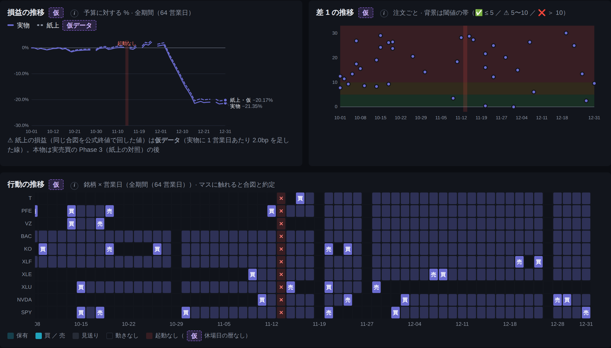

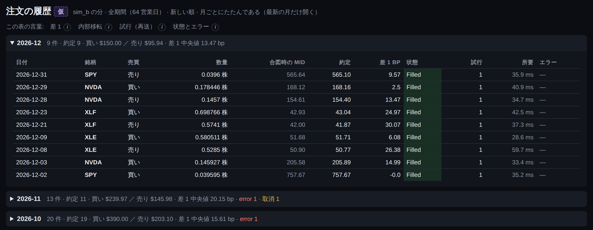

⚠ **写っている数字は仮データ**（`sim2` の日足の再生 ＋ 筋書き）。⚠ 月の小計の error 1・取消 1 は筋書き（429・未約定）がそのまま出たもの。

## 14. ハードの画面（2026-09-18）

vibeboard の**ハード**タブ（`/ext/hardware`）。検証が何時間も使う機械（titan ＝ WSL2 ＋ RTX 3090 Ti ＋ 32 スレッド）の
⚠ **いまの状態の写し**を出す。⚠ **監視システムではない**（通知・警報・長期の記録は持たない）
（プラン: [docs/plans/archive/vibeboard-hardware-tab.md](../plans/archive/vibeboard-hardware-tab.md)）。

⚠ **この画面は管理画面（3012）には無い。** `vibetab.py` の 4 本目のタブで、§10〜§12 と同じく
**vibeboard 本体が `/ext/<name>` で中継する**。⚠ **vibeboard 本体は改造していない**（このプロジェクト専用）。
⚠ 読み手 `dashboard/hwstat.py` と画面 `dashboard/hwview.py` は **`dashboard/app/` の外**に置く（`app/` は g3plus に載る。これは開発機の話）。

> この図の主張: ⚠ **値を読むのは sidecar の中の見張り 1 本だけ。** 画面は写しを取りに来るだけで、見る人が増えても `nvidia-smi` を叩く回数は変わらない。

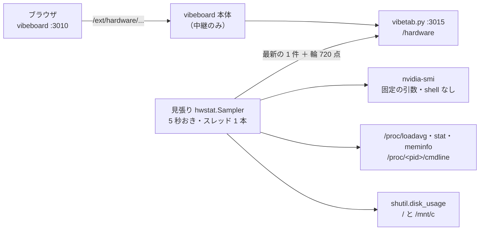
```mermaid
flowchart LR
  B["ブラウザ<br/>vibeboard :3010"] -->|"/ext/hardware/..."| V["vibeboard 本体<br/>（中継のみ）"]
  V --> T["vibetab.py :3015<br/>/hardware"]
  S["見張り hwstat.Sampler<br/>5 秒おき・スレッド 1 本"] -->|"最新の 1 件 ＋ 輪 720 点"| T
  S --> N["nvidia-smi<br/>固定の引数・shell なし"]
  S --> P["/proc/loadavg・stat・meminfo<br/>/proc/&lt;pid&gt;/cmdline"]
  S --> D["shutil.disk_usage<br/>/ と /mnt/c"]
```

### 14-1. 規約

| # | 規約 | ⚠ 理由 |
| ---: | --- | --- |
| 1 | ⚠ **読むだけ・写すだけ。** `nvidia-smi` は固定の引数の配列で起こす（shell を通さない・要求の値を混ぜない）。このサーバに「操作」を足さない | 中継後はループバック発に見える（CLAUDE.md の customTabs の注意）。読むだけなら、それで開く面が無い |
| 2 | **値を読むのは見張り（`hwstat.Sampler`）1 本**。`vibetab.py` の `main()` が bind できた後で起こす。⚠ **import しただけ・handler を作っただけでは起きない**（止まっている間は要求のたびにその場で読む） | ⚠ **CPU 使用率は `/proc/stat` の 2 時点の差**でしか出ない。要求のたびに読むと見る人数 × 回数だけ `nvidia-smi` が走る |
| 3 | **更新は画面が自前で行う**: `view` の script が `api/snapshot`・`api/history` を間隔ごとに相対パスで取り、描き直す。`document.hidden` の間は取りに行かない。`api/watch`（SSE）は繋がるだけで何も投げない | `item-changed` で数秒ごとに iframe を作り直すと、ちらつきとスクロール位置の初期化が起きる。vibeboard の README の契約が自前更新を認めている |
| 4 | ⚠ **描く経路は 1 本**: 値は `<script type="application/json">` に埋め（`<` は `\u003c` に逃がす）、最初の表示も更新も同じ関数が描く。⚠ **文字は `textContent` だけで入れる（`innerHTML` に連結しない）** | プロセスの cmdline は他人が決められる文字列で、XSS の入口になる。テストが「生の `<script>` が HTML に出ない」「`innerHTML` を使っていない」を固定する |
| 5 | ⚠ **読めないものは欄を作らず、理由を 1 行書く。** `nvidia-smi` が無い ／ 3 秒で返らない ／ 終了コード ≠ 0 → GPU の節が「読めない（理由）」になり、⚠ **CPU・メモリ・ディスクは出し続ける**。`[N/A]`・`[Not Supported]` は `None`（「—」）で、⚠ **0 にしない** | 「GPU が無い」と「画面が壊れている」を混ぜない（§12-1 の規約 6 と同じ立て方）。仮の数字で埋めない |
| 6 | ⚠ **色を付ける閾値を自分で作らない。** GPU の異常は `nvidia-smi` の `clocks_throttle_reasons.*`（熱・電力で絞られているか）を写す。例外はディスクだけで、**使用率 90% 以上を警告色 ＋「⚠ 残りわずか」の文字**にする（⚠ 90% は【推測】の目安で、出典は無い） | 「83℃ で危険」のような数字に出典が無い。ドライバが言っている事実を写すほうが確か。警告は色だけに頼らない |
| 7 | ⚠ **cmdline は 160 字で切り、`token`・`secret`・`passw`・`credential`・`key` を含む引数は値を伏せる**（`--token=x`・`API_KEY=x`・`--password x`） | ⚠ **このタブは tailnet の閲覧者にも見える**（`http://titan-income-vibeboard`）。引数に秘密が紛れても出さない |
| 8 | 履歴は ⚠ **メモリ上の輪だけ**（720 点 ＝ 5 秒 × 1 時間）。⚠ **ディスクに書かない。** sidecar を入れ直すと消える | 知りたいのは「席を外している間 GPU は回っていたか」。置き場・保持期間・git 管理外の設定が要らない |
| 9 | 間隔は `AIL_HW_INTERVAL_S`（既定 5 秒・下限 1 秒） | `nvidia-smi` 1 回 0.058 秒【実測 2026-09-18】× 2 本 ÷ 5 秒 ≒ 1 コアの約 2%【実測からの計算】。0 ではないので伸ばせる形にしておく |
| 10 | 画面の `api/snapshot`・`api/history` の要求は sidecar のログに出さない | 数秒おきに来るので、vibeboard のログが埋まる |

### 14-2. 何をどこから写すか

| 節 | 出す値 | 読む場所 |
| --- | --- | --- |
| GPU | 使用率 % ／ メモリ（使用・全体 MiB・%）／ 温度 ℃ ／ 電力 W と上限 ／ ファン % ／ P-state ／ 絞りの理由（立っているものだけ） | `nvidia-smi --query-gpu=index,name,utilization.gpu,memory.used,memory.total,temperature.gpu,power.draw,power.limit,fan.speed,pstate,clocks_throttle_reasons.{hw_slowdown,hw_thermal_slowdown,sw_thermal_slowdown,hw_power_brake_slowdown,sw_power_cap} --format=csv,noheader,nounits` |
| GPU を使っているプロセス | PID ／ 経過 ／ RSS ／ cmdline（規約 7） | `nvidia-smi --query-compute-apps=pid` ＋ `/proc/<pid>/{cmdline,stat,status}`・`/proc/uptime` |
| CPU | 全体の使用率 % ／ load average ／ スレッド別の使用率（細い縦棒 ＋ 表） | `/proc/stat`（2 時点の差。busy ＝ total − idle − iowait）・`/proc/loadavg` |
| メモリ | 使用（＝ 全体 − `MemAvailable`）／ 空き ／ swap | `/proc/meminfo`。⚠ **`MemFree` は使わない**（キャッシュを空きに数えない） |
| ディスク | マウントごとの 使用 %・使用・空き・全体（`/`・`/mnt/c`。無いものは飛ばす） | `shutil.disk_usage` |
| この 1 時間（`history`） | GPU 使用率・GPU メモリ %・GPU 温度・GPU 電力・CPU 使用率・メモリ % の 6 本。⚠ **1 系列 1 枚**（単位が違うものを 1 枚に重ねない ＝ 縦軸を 2 本にしない）。横軸は貯まったぶん（下限 5 分）。値の無い回は線を切る（直線で埋めない）。表（最新・最小・平均・最大）を併置 | 見張りの輪 |

⚠ **列名は旧名 `clocks_throttle_reasons.*` で引く。** ドライバ 610.62 は新名 `clocks_event_reasons.*` と両方を受ける【実測 2026-09-18】。古いドライバは旧名しか知らない。

| 経路 | 中身 |
| --- | --- |
| `/hardware/api/sidebar` | `now`「いまの状態」・`history`「この 1 時間」 |
| `/hardware/view?item=<now\|history>` | 枠 ＋ 埋め込みの JSON ＋ script。知らない id は 404 |
| `/hardware/api/snapshot` | 最新の 1 件（JSON） |
| `/hardware/api/history` | 輪の中身（JSON。系列の定義と点） |
| `/hardware/api/watch` | SSE（hello と ping だけ） |

### 14-3. ⚠ この画面で読めないもの（WSL2 の制限。【実測 2026-09-18】）

| 読めないもの | なぜ | 代わり |
| --- | --- | --- |
| プロセス別の GPU メモリ | `--query-compute-apps` の `used_memory` が `[N/A]` | 合計（`memory.used`）だけ出す。⚠ **合計には Windows 側の使用分も混ざる**と画面に書く |
| GPU のプロセス名 | 同じく `process_name` が `[Not Found]` | ⚠ **PID は WSL 側の PID と一致する**ので `/proc/<pid>/cmdline` から引く |
| Windows 側で GPU を使っているプロセス | WSL からは見えない | Windows のタスクマネージャー |
| CPU の温度 | WSL2 に `sensors` が無い | Windows 側の HWiNFO など |
| `temperature.gpu.tlimit`（熱の上限までの余裕） | `[N/A]` | 絞りの理由（規約 6）を写す |

### 14-4. ⚠ 反映には vibeboard の入れ直しが要る

vibeboard は `vibeboard.config.json` を**起動時にしか読まない**。タブを足した・`vibetab.py` / `hwstat.py` / `hwview.py` を直したときは
`./run-vibeboard.sh` を入れ直す（sidecar は vibeboard の子なので一緒に入れ替わる）。⚠ **3015 に古い sidecar が居座る罠は §12-3 と同じ**。
手元で確かめるだけなら、別のポートにもう 1 本立てれば 3010・3015 に触らずに済む。

```bash
python3 dashboard/vibetab.py --port 3016               # http://127.0.0.1:3016/hardware/view?item=now
python3 dashboard/hwstat.py                            # 読み手だけを 1 回（JSON を標準出力へ）
```

## 15. デザイン規約（2026-09-18）

⚠ **管理画面の見た目の決めごとの正本は本節である。** 黒ベースに作り直した経緯と当時の 5 画面は [dashboard-dark-design.md](../plans/archive/dashboard-dark-design.md) に残す（経緯であって正本ではない）。
⚠ **値は `app/static/app.css` の変数名で書く**（色コードを本節に写さない。食い違ったらコードが正で、本節の変数名を直す）。

> この図の主張: ⚠ **意味を持つ色は「環境」と「状態」の 2 系統で、互いに流用しない。トレーダーを見分ける系列の色（§15-2 の 5）はそのどちらとも取り違えない色相から取る。** それ以外の区別は枠や影ではなく、面の明るさの段で付ける。

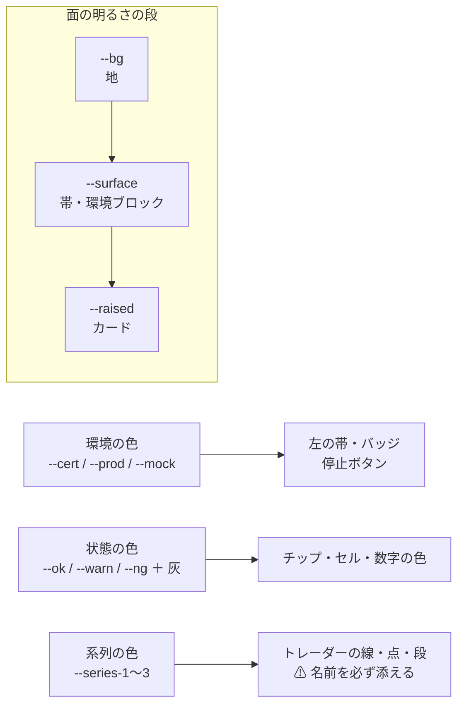
```mermaid
flowchart LR
  subgraph layers["面の明るさの段"]
    BG["--bg<br/>地"] --> SF["--surface<br/>帯・環境ブロック"] --> RS["--raised<br/>カード"]
  end
  ENV["環境の色<br/>--cert / --prod / --mock"] --> E1["左の帯・バッジ<br/>停止ボタン"]
  ST["状態の色<br/>--ok / --warn / --ng ＋ 灰"] --> S1["チップ・セル・数字の色"]
  SR["系列の色<br/>--series-1〜3"] --> R1["トレーダーの線・点・段<br/>⚠ 名前を必ず添える"]
```

### 15-1. 面と文字

| 変数 | 用途 |
| --- | --- |
| `--bg` | 画面の地・上部の帯。`code` ／ `pre` の地も同じ段 |
| `--surface` | 環境の帯（`.envbar`）・環境ブロック（`.env`） |
| `--raised` | カード（`.card`）・スクロール枠の固定見出し |
| `--hover` | 行のホバー・灰のチップ |
| `--line` ／ `--line-strong` | 罫線 ／ 強い罫線（ボタン・入力の枠・環境ブロックの帯の既定） |
| `--ink` ／ `--muted` ／ `--sub` | 文字 ／ 薄い文字（表の見出し・補足） ／ さらに薄い文字（フッタ・版） |
| `--accent` ／ `--accent-bg` | リンク・選択中のナビ・`/experiments` の最良の行 ／ 主ボタン。⚠ **状態の意味を持たせない**（青は「押せる」「選ばれている」だけ） |
| `--mono` | 等幅（`code`・口座の項目名・事象名） |

### 15-2. 色の 2 系統（＋ トレーダーの系列の色）

| 系統 | 変数 | 部品（クラス） | 意味 |
| --- | --- | --- | --- |
| 環境 | `--cert`（`--cert-bg`） | `.badge-cert`・`.env-cert`（左の帯 4px ＋ 見出しの地） | sandbox（cert） |
| 環境 | `--prod`（`--prod-bg`） | `.badge-prod`・`.env-prod`・`.btn-danger`（■ 停止） | 本番（実弾）。⚠ **停止ボタンも同じ赤** |
| 環境 | `--mock`（`--mock-bg`） | `.badge-mock`（MOCK ／ TEST）・`.demobar` | 実物ではない（接続先を差し替えた記録・デモ・試験用のトレーダー） |
| 状態 | `--ok`（`--ok-bg` ／ `--ok-ink`） | `.st-*` のチップ・`.cell-ok`・`.ok` | 良い・通った・つながっている |
| 状態 | `--warn`（同） | `.cell-warn`・`.warn`・`.note`・`.flash`・`.badge-gate`（門前） | 注意・途中 |
| 状態 | `--ng`（同） | `.cell-ng`・`.ng`・`.danger` | 悪い・失敗・停止条件 |
| 状態 | 灰（`--hover`・`.cell-na` の薄い白） | `.st-off` ／ `.st-Cancelled` ／ `.st-done`・`.cell-na` | 該当なし・取消・対象外 |

1. ⚠ **環境の色を状態に使わない。状態の色を環境に使わない。** `--prod` と `--ng` はどちらも赤だが別の変数で、意味が違う（prod ＝ どこに繋がっているか、ng ＝ 結果が悪い）
2. 状態の色は **半透明の地（`-bg`）＋ 明るい文字（`-ink`）** で使う。塗りつぶすのは環境のバッジと停止ボタンだけ
3. 門前（`.badge-gate`）は琥珀。⚠ **紫（MOCK・配線の検査）と取り違えない**
4. 損益の色: ⚠ **実売買の画面（概要・トレーダーの詳細）の損益には色を付けない**（§13-4。判定は執行の差と無人運転）。`/experiments` のスコアは正を `--ok-ink`、負を `--muted` にする（⚠ 負を赤にしない）

5. ⚠ **系列の色（トレーダー。2026-09-18）**: `--series-1` 水色 ／ `--series-2` 藍 ／ `--series-3` くすんだ薔薇。**状態（緑・琥珀・赤）・環境（cert 緑・prod 赤・MOCK 紫）・アクセントの青と取り違えない色相**から総当たりで選び、dataviz の `validate_palette.js --pairs all`（面 `--surface`）で全項目 PASS【実測】。⚠ 予約色との差は正常視で 10 前後しか取れないので、⚠ **名前を必ず添える**（凡例・端のラベル・段の見出し）。⚠ **この条件で見分けられるのは 3 色まで** → 4 人目からは同じ色を線の形（`.dash`）で分ける。並び順は設定の順（色は順に付く。損益の順にしない）
6. ⚠ **仮データ（2026-09-18）**: 本物の数字ではないものは `.chip.placeholder` ／ `.badge-placeholder`（紫の破線の枠。MOCK と同じ「実物ではない」）と点線で示す（§15-8）

### 15-3. 数字と表

| 項目 | 決め | クラス |
| --- | --- | --- |
| 等幅数字 | 数字は `tabular-nums` で桁を揃える | `.num`・`td.num`・`.kvt`・`.exp-cards .v` |
| 右寄せ | 数量・価格・bp・件数は右寄せ | `td.num` ／ `th.num` |
| 折り返し（表全体） | 1 行 1 件で横に読む表（注文・日次）は折り返さない | `table.orders` |
| 折り返し（列だけ） | 短い値の列（予算・合成・株数・損益・最終日）だけ止める | `td.nw` ／ `th.nw` |
| 横にはみ出す表 | 折り返さない表は横スクロールの枠に入れる | `.scroll-x` |
| 縦に伸びる一覧 | 通知・事象は高さ 240px の枠でスクロールし、見出しを固定する | `.scroll` |
| 数字のカード | 項目名（小さい大文字）・値（24px）・補足の 3 段 | `.exp-cards .card` の `.k` ／ `.v` ／ `.small` |
| 見出しの中の項目 | 監視の環境ブロックの見出しの中だけで使う（inline-flex） | `.kv`。⚠ **表やカードの中で使わない**（§15-4） |

### 15-4. 実売買の画面のクラスと差 1 の色分け（2026-09-18 に 3 画面へ作り直した）

⚠ **差 1 の閾値の正本は [プラン §2-4](../plans/live-trading-three-models.md) の表（[live-trading.md §0-2](experiments/live-trading.md) の「判定の閾値」が参照するもの）。本節は「どのクラスに写すか」だけを書く。**

| 部品 | クラス | 規則 |
| --- | --- | --- |
| 監視の帯（概要） | `.strip`（`strip_panel.html`） | 5 秒ごとに `/?partial=strip` で差し替え。詳しくは全体の詳細の「口座と接続」 |
| 大きな数字 ＋ 3 つの数字（概要） | `.hero-row` の `.hero` ／ `.stat` | ⚠ **大きな数字は 1 画面に 1 つだけ**（全トレーダーの損益。色なし）。差 1 は `.chip` の状態の色 |
| 損益の推移（概要） | `.panel` ＋ `charts.pnl_overview` | 凡例 ＋ 端のラベル（名前つき）。0 の基準線。勝ち負けの色なし |
| 執行の差（概要） | `.panel` ＋ `charts.diff1_dots` | 背景は閾値の帯（状態の色）。点はトレーダーの色。差 3 は `.chip.placeholder`（仮データ） |
| トレーダーの段（概要） | `.lanes` ／ `.lane.bl-s*`（左の帯がトレーダーの色）＋ `charts.pnl_lane` ＋ `charts.action_grid` | ⚠ **縦軸は全員で揃える**。時間の軸も段どうしで揃える。試験用は `.badge-mock`「TEST」 |
| 行動のマス目 | `c-hold` ／ `c-buy` ／ `c-sell`（トレーダーの色の濃淡 ＋ 「買」「売」）・`c-skip`（見）・`c-none`・`c-nostart`（✕。状態の赤） | ⚠ **買い・売りに状態の色を使わない**（良い悪いではない） |
| 日次の表（全体の詳細） | `table.small.orders` ・起動しなかった日は `tr.row-missing` | 約定: 全部約定 `cell-ok` ／ 一部 `cell-warn` ／ 注文なし `cell-na`。問題: 1 件以上 `cell-ng` ／ 0 件 `cell-na`。差 1 中央値: 下の表 |
| 注文の履歴（全体の詳細・トレーダーの詳細） | `orders_history.html` | 状態のセルは `cell-*`。対応は `live.py` の `STATUS_CLASS`（Filled → ok ／ Cancelled・Expired・guarded・halted → warn ／ Rejected・error・not_submitted → ng ／ dry-run・planned → na）。内部移転は `cell-na` |
| トレーダーの詳細のタイル | `.tiles` ／ `.tile` | 差 3 は `.chip.placeholder`（仮データ） |
| 含み損が予算の 20% 超（トレーダーの詳細） | `.danger`「⚠ 含み損 …（停止条件）」 | 損益そのものには色を付けない（§15-2 の 4） |

| 差 1 の中央値 m（bp。⚠ 正 ＝ 不利） | カード（`.v`） | 日次のセル |
| --- | --- | --- |
| m ≤ 5 | `ok`（✅） | `cell-ok` |
| 5 ＜ m ≤ 10 | `warn`（⚠） | `cell-warn` |
| m ＞ 10 | `ng`（❌） | `cell-ng` |
| 無い（約定が無い日） | 色なし（「—」） | `cell-na` |

- ⚠ **色を付けるのは中央値だけ**（1 件ごとの差 1 と日次の「差 1 最大」には付けない）。判定の閾値が中央値に対するものだから
- ⚠ **閾値の 5 と 10 はテンプレートに直に書いてある**（`overview.html`・`overall.html`・`trader.html`・`charts.py` の帯）。変えるときは プラン §2-4 → §13-2 → テンプレートと `charts.py` の順に直す
- `kv`（inline-flex）は監視の環境ブロックの見出しの中だけで使う（表やカードの中では項目名と値がくっついて崩れた。2026-09-18）

### 15-5. グラフ（サーバで組む SVG。2026-09-18）

| 決め | 中身 |
| --- | --- |
| 描き方 | ⚠ **`app/charts.py` がサーバで `<svg>` を組む**。スクリプトもインラインの style も使わない（CSP の内。幾何は SVG の属性、色はクラス） |
| 呼び方 | テンプレートから Jinja の関数（`charts.*`）として呼ぶ。⚠ **`Redactor` を通した後のデータから描く** |
| hover | SVG の `<title>` だけ（日ごとの透明な帯に全系列の値。十字線は無い） |
| 軸 | ⚠ **1 軸だけ**。トレーダーを並べる小さな図は縦軸を揃える（`pnl_domain`）。損益は予算に対する %（$ はツールチップと見出し） |
| 欠けた日 | 起動しなかった日は線を切り、`--ng-bg` の帯で示す |
| 見本 | `docs/plans/assets/dashboard-patterns/`（`build.py` の関数を移した） |

### 15-6. 左ペイン（2026-09-18）

`.shell`（2 列の grid）・`.side`（上に張り付く縦のナビ）・`.side-nav .grp`（見出し）・`.side-nav a.on`（いまのページ。左に `--accent` の線）。
トレーダーは系列の色の点つきで並べ、押すと `/traders/<name>`。名前は `呼び名（識別名）`（§13-1）。⚠ 試験用の人は本物の人がいれば並べない（§13-1。色は全員の並びで決めるので、段と左ペインの色は一致する）。⚠ **ローカル面だけの項目（操作）は公開面では出さない**。停止ボタンは右の上（`.envbar`）に残す。

### 15-7. 監視の帯と大きな数字（2026-09-18）

- 監視のタイル 6 枚は、概要では **帯 1 本**（`.strip`）に畳む。⚠ 異常のときに目立ちにくいので、未認証・切断は ⚠ ／ ❌ の記号と文字で出す
- 大きな数字（`.hero .v` 52px）は 1 画面に 1 つだけ。並べる数字は `.stat .v`（30px）。大きな数字は proportional の数字、表の列だけ `tabular-nums`

### 15-8. 仮データの印（2026-09-18。利用者の指示「データが無いものは仮データを入れ、後で実装する」）

| 項目 | 仮データ | 印 | 本物にするタスク |
| --- | --- | --- | --- |
| 紙上の損益（トレーダーの詳細） | 実物の損益に 1 営業日あたり 2bp（予算に対して）を足した線（`live.PAPER_PLACEHOLDER_BP_PER_DAY`） | 点線 ＋ 凡例「紙上 仮データ」＋ 端のラベル「紙上・仮」 | 「紙上の損益と差 3 を本物にする」 |
| 差 3 紙上 − 実物（概要・トレーダーの詳細） | 上の傾き（2.0 bp/日） | `.chip.placeholder`「仮データ」。⚠ **状態の色（✅ など）を付けない** | 同上 |
| 営業日の暦（起動しなかった日） | ✅ **2026-09-18 に本物にした**（下の「営業日の暦」）。⚠ 暦に載っていない年だけ、平日をすべて営業日とみなす | 暦の外のときだけ `.chip.placeholder`「仮」＋「休場日の暦の外」 | —（年に 1 度、次の年を足す） |

⚠ **仮データは `/api/live` に出さない**（`board()` だけが持つ。テストで固定）。⚠ 本物に差し替えたら印を外す。

**営業日の暦（2026-09-18）。主張: 暦は 1 つのファイルに持ち、管理画面と執行器が同じ読み手を通して使う。**

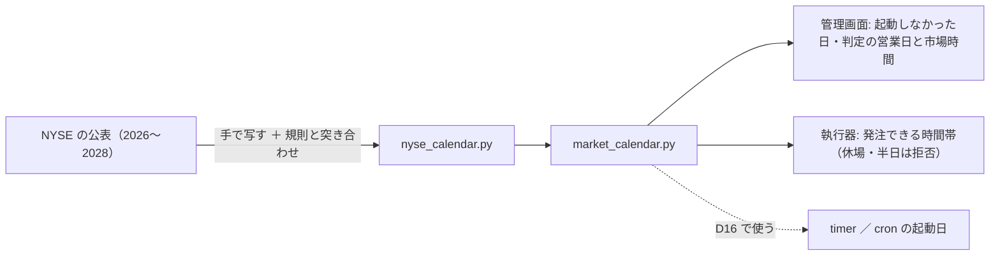
```mermaid
flowchart LR
  N["NYSE の公表（2026〜2028）"] -->|"手で写す ＋ 規則と突き合わせ"| T["nyse_calendar.py"]
  T --> M["market_calendar.py"]
  M --> D["管理画面: 起動しなかった日・判定の営業日と市場時間"]
  M --> E["執行器: 発注できる時間帯（休場・半日は拒否）"]
  M -.->|"D16 で使う"| C["timer ／ cron の起動日"]
```

- 正本は `experiments/tastytrade-api-sample/nyse_calendar.py`【公表値】NYSE "Holidays & Trading Hours"（https://www.nyse.com/markets/hours-calendars 。取得 2026-09-18）。休場 29 日（2026 年 10・2027 年 10・2028 年 9。⚠ 2028-01-01 は土曜で振替なし）と半日立会 5 日（13:00 ET 引け）
- ⚠ **データを `.py` に置くのは §7 の契約のため**（コンテナはサンプルの `*.py` と `*.sh` しか COPY しない。`.toml` にすると公開面に載らない）
- 読み手は同じ場所の `market_calendar.py`（標準ライブラリだけ）。管理画面は `live.business_days`・`live.calendar_info`・`judge.in_market_hours`・`judge.business_date` から、執行器は `run_day.window_refusal` から使う
- ⚠ **手で写した**ので、テスト（`tests/test_market_calendar.py`）が規則（第 n 月曜・聖金曜日・土日の振替）から独立に計算した日付と突き合わせる。⚠ **WebFetch の要約は誤っていた**（2026-07-03 を半日・2026-12-25 を欠落など）ので、生の HTML の表と脚注を読んだ
- ⚠ **年に 1 度、次の年を足す**。暦の終わり（2028-12-31）まで 90 日を切ると、全体の詳細に注意が出る（`live.CALENDAR_WARN_DAYS`）。切れた年は「仮」の印つきで平日扱いに戻る（⚠ 黙って戻さない）
- ⚠ 暦の情報（`board()["calendar"]`）も `/api/live` には出さない


### 15-9. インラインを書かない（2026-09-18）

**主張: CSP は緩めない。スクリプトは `app.js`、見た目は `app.css` に置き、templates には属性で意図だけを書く。**

CSP は `script-src 'self'; style-src 'self'`（`app/main.py` の `SecurityHeaders`）。⚠ **templates に `on*="…"` や `style="…"` を書くと、ブラウザが黙って止める**（画面は崩れず、エラーはコンソールにしか出ない）。2026-09-18 までは確認ダイアログ 5 か所（停止 × 2・解除・発注・後片付け）が `onsubmit="return confirm(…)"` で書かれており、⚠ **押すと確かめずに送られていた**。

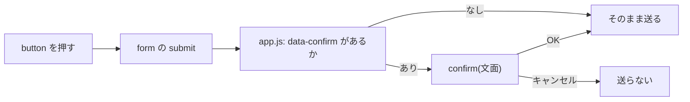
```mermaid
flowchart LR
  B["button を押す"] --> E["form の submit"]
  E --> J["app.js: data-confirm があるか"]
  J -->|"なし"| G["そのまま送る"]
  J -->|"あり"| D["confirm(文面)"]
  D -->|"OK"| G
  D -->|"キャンセル"| X["送らない"]
```

| 書きたいもの | 書き方 |
| --- | --- |
| 送る前に確かめる | form に `data-confirm="文面"`（`app.js` が `document` の `submit` で捕まえる。⚠ 部分更新で差し替わった form にも効く） |
| 余白・枠・幅 | `app.css` のクラス（`.mt-12`・`.mb-10`・`.card-thick`・`th.w-40`。足りなければクラスを足す） |
| グラフ | サーバで組む SVG（§15-5。属性だけで描く。`style=` を使わない） |

- ⚠ **確認ダイアログは 2 つ目の歯止め**（押し間違いを防ぐ）。1 つ目はサーバ側（CSRF・面の規則・本番の発注の確認文）で、こちらは変えていない
- テスト: pytest が templates の全ファイルと描画した画面を走査し、インラインが 1 つでもあれば落ちる（`test_app.py`）。ブラウザでの動き（出る ／ 断ると送られない ／ 受けると送られる ／ CSP 違反 0 件）は `tests/browser/confirm.mjs`（playwright・node。⚠ **pytest には入れない** ＝ dashboard の依存に playwright を足さない。⚠ **POST はブラウザ側で止める**ので `HALT` は書かれない）


### 15-10. i マークのヘルプ（2026-09-18。利用者の指示「i マークを付けて、ヘルプを表示する」）

**主張: 説明の正本は `dashboard/glossary.toml` 1 本のまま。templates は語の名前で指すだけで、用語タブ（§12）と同じ文面が出る。**（プラン: [dashboard-help-icons.md](../plans/archive/dashboard-help-icons.md)）

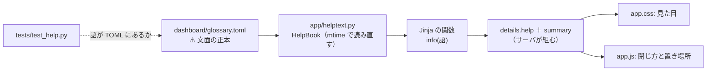
```mermaid
flowchart LR
  T["dashboard/glossary.toml<br/>⚠ 文面の正本"] --> H["app/helptext.py<br/>HelpBook（mtime で読み直す）"]
  H --> J["Jinja の関数<br/>info(語)"]
  J --> P["details.help ＋ summary<br/>（サーバが組む）"]
  P --> C["app.css: 見た目"]
  P --> S["app.js: 閉じ方と置き場所"]
  K["tests/test_help.py"] -.->|"語が TOML にあるか"| T
```

| 決め | 中身 |
| --- | --- |
| 書き方 | 見出しの横に `{{ info("語") }}`。語は `glossary.toml` の `name` そのまま。⚠ **説明を templates や Python に書かない**（§12-1 の規約 1） |
| 部品 | `<details class="help">` ＋ `<summary aria-label="「語」の説明">`（丸に i。`.help-i`）。吹き出し `.help-pop`（`role="note"`）は 語（`.help-t`）・1〜2 行（`.help-b`）・「詳しく: 文書のパス ＋ 節」（`.help-d`。⚠ **文字だけ。リンクにしない** ＝ 管理画面から vibeboard の hash URL へは飛べない。面が別） |
| 開く ／ 閉じる | ⚠ **`<details>` の素の動き**（スクリプト無しでも開く。Tab で届き Enter ／ Space で開く）。`app.js` は足し算だけ: 1 つだけ開く ／ 外を押すか Escape で閉じ、Escape は `summary` に戻る ／ 右端・下端を越えたら `.help-left` ・`.help-up` で倒す（⚠ `style` は書かない）／ ⚠ **開いている間はその枠の部分更新（`data-poll`）を飛ばす** |
| 色 | 丸は `--line-strong` ／ `--muted`、触れたとき・開いているときだけ `--accent`（「押せる」の色。§15-1）。吹き出しの地は `--hover`。⚠ **状態・環境の色を使わない** |
| 置く場所 | 数字や用語の見出し（大きな数字・タイル・パネルと節の見出し）。表の列は、表の上の「この表の言葉」の行（`.helprow`）にまとめる |
| ⚠ 置かない場所 | **`<p>` の中**（`<details>` の開始タグは `<p>` を閉じる ＝ 崩れる。テストで固定）／ **横スクロールの枠（`.scroll-x`）と左ペイン（`.side`）の中**（吹き出しが切れる）／ **停止ボタンの横**（押し間違いの元。HALT の説明は停止中の帯と `/ops` に置く） |
| 語が無い | 実行時は 500 にしない（⚠ 停止ボタンのある画面をヘルプの不備で落とさない）: 「i?」（`.help-missing`）＋ 警告ログ。⚠ **静かに欠けないのはテストの側**（templates の `info("…")` を全部拾い、実物の TOML に無ければ落ちる） |
| TOML が読めない | i マークを出さず（空の吹き出しを出さない）、フッタに「⚠ 用語の正本（glossary.toml）が読めない」。場所は `AIL_GLOSSARY_FILE` で変えられる（既定は `dashboard/glossary.toml`。コンテナでは §7 の COPY が要る） |
| 秘密 | 文面は公開面でも見える。⚠ **口座番号・トークン・公開ホスト名を用語に書かない**（口座番号とトークンの形はテストが見張る）。文面は `Redactor.text` を通してから出す |

**手順 — 新しい数字の見出しを足したら**（⚠ 手順が無いと見出しだけ増えて説明が付かない）:

1. `glossary.toml` に語があるか見る。無ければ足す（1 語 1〜2 行・90 字以内・動く数字を書かない・`doc` は実在する文書。§12-1）
2. 見出しの横に `{{ info("語") }}` を書く（⚠ `<p>`・`.scroll-x`・`.side` の中に置かない）
3. `cd dashboard && .venv/bin/python -m pytest -q tests/test_help.py tests/test_vibetab.py`（語の実在・長さ・リンク先・`<p>` の中に無いこと）
4. 見た目を変えたらブラウザでも見る: `tests/browser/help.mjs`（playwright・node。⚠ pytest には入れない。§15-9 と同じ）。用語タブ（vibeboard）は TOML の mtime を見て自分で追いつく（sidecar の入れ直しは要らない）

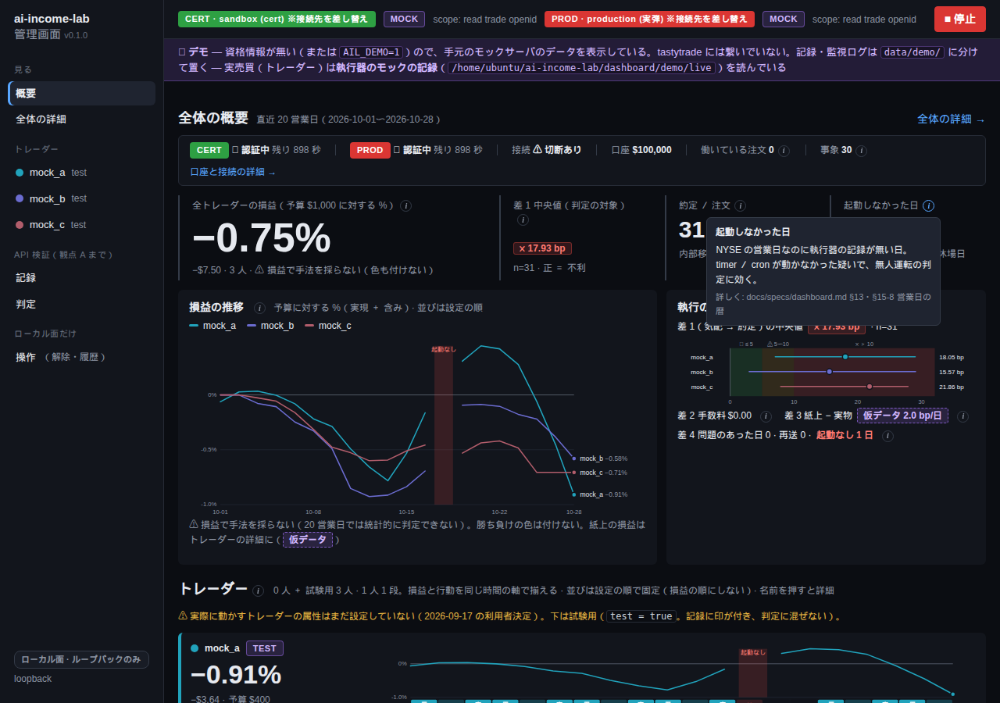


### 15-11. シミュレーションモードの帯（2026-09-19）

| 項目 | 決めごと |
| --- | --- |
| 色 | **青緑の斜めの縞**（`.simbar`。`#0f5e5a` ／ `#0b4a47`・下線 `#2dd4bf`）。⚠ 環境の色（cert 緑・prod 赤・MOCK 紫）とも状態の色（ok ／ warn ／ ng）とも取り違えない色を 1 つ、この帯のためだけに使う（実売買の画面では使わない） |
| 置き場 | `<body>` の先頭（`.shell` の外）・`position: sticky; top: 0`。⚠ 部分更新（`data-poll`）の外 ＝ 消せない。取り直すのは中の `#simclock` だけ |
| 食い違い | `.simbar-ng`（茶）で「モードと記録が食い違っている」。数字は出さない |
| 「仮」の印 | §15-8 の `.chip.placeholder` と同じ見た目（紫の点線）＋ `.sim-mark`。⚠ 状態の色を付けない |
| i マーク | 帯の中に `info("シミュレーションモード")`（`<div>` の中。`<p>` ではない）。語は `glossary.toml` の「実売買」の分野に 3 つ（シミュレーションモード ／ 仮の時計 ／ 仮データ（日足の再生）） |

### 15-12. 長い期間の見せ方（2026-09-20）

| 項目 | 決めごと |
| --- | --- |
| 月のたたみ | `details.hist`（⚠ **i マークの `details.help` とは別物**。`app.js` の「開いているヘルプを閉じない」規則に巻き込まない）。見出しは `summary`（`--raised` の帯・角丸、開くと下の `.panel` と繋がる） |
| マス目の横スクロール | `.gridwrap`（flex）＝ 左に `svg.gridlabels`（銘柄名・固定）＋ 右に `.scroll-x.gridscroll`（`svg.chart-wide`）。⚠ **`svg.chart` の `width:100%` を外す**（`width:auto` ＋ 属性の大きさ）。外し忘れると図が枠に合わせて縮み、**左の銘柄名と行の高さがずれる**（2026-09-20 に踏んだ） |
| 見え位置 | 既定は右端（最新の日）。部分更新のときは**その前の位置を保つ**（`app.js` の `alignGrids` / `gridScrollLeft`。⚠ 3 秒ごとに右端へ引き戻さない） |
| ⚠ i マーク | `.scroll-x` の中と横には置かない（§15-10 のまま）。マス目の見出し（`h3`）に置く |

## 9. 更新履歴

- 2026-09-05: 初版（Phase 1〜4 の実装、デプロイ契約）
- 2026-09-07: g3plus で初回起動（§7 の契約どおり。loopback 面・資格情報なしで healthy、ホストポート非公開、非ループバック 403）。資格情報と Cloudflare は未（利用者）
- 2026-09-08: デモ（§6-2）。資格情報なしでモックのデータを全画面に出す。pytest 24 件（デモ 5 件を追加）
- 2026-09-08: **実行の画面**（§10）。`/experiments` に特徴量の発見手法の検証を、種類ごとのタイトルと比較できるスコア（最良手法の純利 bp）で並べる。検査（fold の符号・上乗せ t・実効標本数・デフレーテッド SR）は**実験側が `checks.json` に書いたものを読むだけ**。プランは [docs/plans/archive/dashboard-experiments.md](../plans/archive/dashboard-experiments.md)
- 2026-09-08: 黒ベースに作り直し（`app/static/app.css` 全面。環境の色 cert 緑 / prod 赤 / MOCK 紫 と、状態の色 ok / warn / ng の 2 系統。監視は幅があれば cert と prod を横に並べ、注文表は折り返さず、口座ストリーマの通知は枠の中でスクロール）。プランと画面は [docs/plans/archive/dashboard-dark-design.md](../plans/archive/dashboard-dark-design.md)
- 2026-09-09: **データの画面**（§11）。`/data` に実験が保持しているデータの在庫（足・外部系列・特徴量・規約・割り当て）を出す。数字は実験側の manifest / config の写しで、ずらし幅と規約の判定は `config/sources.toml`（新設。コードとの一致は実験側のテストが固定）。プランは [docs/plans/archive/dashboard-data-inventory.md](../plans/archive/dashboard-data-inventory.md)
- 2026-09-18: **実売買の画面**（§13）。`/live` にトレーダー別の予算・モデル・建玉・損益と、執行の差（差 1〜4）の直近 20 営業日を出す。執行器（`experiments/live-trading/`）の記録を写すだけで、画面で計算するのは差 1 の bp だけ。両面で読める・POST は無い。pytest 7 件
- 2026-09-12: **用語の画面**（§12）。vibeboard に「用語」タブを足し、8 分野 87 語の索引を出す。⚠ **正本は `dashboard/glossary.toml`** で、画面は写し。語からその定義がある spec へ `target="_top"` のリンクで飛ぶ（⚠ **節へは飛べないので節は文字で併記**）。⚠ **リンク先の実在はテストが固定する**。プランは [docs/plans/archive/vibeboard-glossary.md](../plans/archive/vibeboard-glossary.md)
- 2026-09-18: **ハードの画面**（§14）。vibeboard に「ハード」タブを足し、GPU（`nvidia-smi`）・CPU・メモリ・ディスクのいまの状態と、この 1 時間の折れ線 6 枚を出す。⚠ **値を読むのは sidecar の見張り 1 本**で、画面は JSON を自前で取りに来る（iframe を作り直さない）。⚠ **vibeboard 本体は改造していない**。読み手は `dashboard/hwstat.py`・画面は `dashboard/hwview.py`（`app/` の外）。pytest 25 件（読み手 23 ＋ HTTP 2）
- 2026-09-18: **デザイン規約**（§15）。黒ベースの決めごとをアーカイブしたプランから移し、正本を本節にした（⚠ 値は `app.css` の変数名で書く。コードが正）。`/live` を撮って崩れ 3 つを直し（差 1 中央値の二進の端数を 0.01bp に丸める・「執行の差」を `kv` から `exp-cards` の 5 枚へ・短い列と注文 ／ 日次の表を折り返さない）、画面を §13-5 に貼った。`/live` のクラスと差 1 の色分けは §15-4。プランは [docs/plans/archive/dashboard-design-spec.md](../plans/archive/dashboard-design-spec.md)
- 2026-09-18: **画面を作り直した**（§1・§13・§15-4〜15-8）。入口を概要（`/`。監視の帯・大きな数字・損益の推移・執行の差・トレーダーの段）にし、`/overall`（全体の詳細: 日次・注文の履歴・口座と接続）と `/traders/<name>`（トレーダーの詳細）を足した。`/live` は `/` へ転送。ナビは左ペイン。見た目はデザイン 3「数字とグラフが主役」。図は `app/charts.py`（サーバで組む SVG）、データは `live.board()`。⚠ **紙上の損益・差 3・休場日の暦は仮データ**（印を付け、`/api/live` に出さない）。デモは執行器のモックの記録を読む。監視の 1 件取消のボタンを外した。pytest 144 件（新しい画面・転送・仮データの印・起動しなかった日・公開面・デモの記録）。プランは [dashboard-design-implement.md](../plans/dashboard-design-implement.md)
- 2026-09-18: **g3plus を `809104f` に更新した**（前回は `eec106c`・2026-09-10。titan から `ssh -i ~/.ssh/id_rsa_nopass g3plus` で pull → `docker compose build` → `up -d`。前のイメージは `ail-dashboard-ail-dashboard:prev` に残した）。確認【実測】: healthy ／ コンテナ内で `/`・`/overall`・`/records`・`/judge`・`/api/live`・`/api/state` が 200、`/live` は `/` へ 302、`/ops` は 404（公開面）／ docker network 越しの JWT なしは 403 ／ 監視は cert に再接続（refresh 1 回成功・エラー 0）。⚠ 実売買の部分は契約（§7）どおり空
- 2026-09-18: **確認ダイアログとインラインの style を直した**（§15-9）。`onsubmit="return confirm(…)"` 5 か所が CSP（`script-src 'self'`）に止められ、停止・解除・発注・後片付けが確かめずに送られていた → `data-confirm` ＋ `app.js`。インラインの `style=` 9 か所は `app.css` のクラスへ。⚠ CSP は緩めていない。ブラウザで 3 つの form（概要の停止・操作の停止・後片付け）が「出る ／ 断ると送られない ／ 受けると送られる」・CSP 違反 0 件【実測】。**pytest の 487 秒も直した**（146 件で 7.7 秒。§13-5。監視を要らないテスト 16 本が監視を起こしていた。`conftest.py` に番人）。⚠ **g3plus は未デプロイ**（停止ボタンは公開面にもある）。プランは [dashboard-pytest-speed-and-confirm.md](../plans/archive/dashboard-pytest-speed-and-confirm.md)
- 2026-09-18: **休場日の暦を入れた**（§15-8「営業日の暦」）。起動しなかった日の「平日＝営業日」の仮を外し、NYSE の公表（2026〜2028 年）を `experiments/tastytrade-api-sample/nyse_calendar.py` に持った。読み手 `market_calendar.py` は管理画面（起動しなかった日・判定の営業日と市場時間）と執行器（発注できる時間帯）が共有する。⚠ 暦の外の年だけ「仮」の印に戻る。pytest 151 件。プランは [nyse-calendar.md](../plans/archive/nyse-calendar.md)
- 2026-09-18: **銘柄の集合の一覧表**（§11-1）。vibeboard のデータタブの概要の先頭に、集合を横に比べる表と重複を除いた合計を出した（利用者の指示 2026-09-17）。4 つの正本（universe・dataset・experiment の config と調整後の manifest）を写して組む ＝ 集合や足を増やすと表が自動で変わる。実データで和集合 136・日足あり 136・1 分足あり 63【実測】（手で数えた 2026-09-17 の値と一致）。pytest 154 件。プランは [universe-table.md](../plans/archive/universe-table.md)
- 2026-09-18: **外すと決めた 11 行 ＋ 1 件取消を消した**（§1・§3）。実行の一覧（`/experiments`）・データ（`/data`）・手動の注文（`/ops/dry-run`・`submit`・`cancel`・`cleanup`）・開発（`/dev/*`）の経路・テンプレート 6 枚・画面のテストを削除。⚠ **管理画面に発注の経路は無くなった**（`ops.py` のクライアントは取消の許可だけ。設定も `TT_ALLOW_PROD_ORDERS` を読まない）。残した部品: `app/experiments.py`・`app/inventory.py`（vibeboard のタブ）・`devtools.MockServer`・`run_step`（デモ）。停止 ／ 解除 ／ 履歴 ／ 記録と判定はそのまま。pytest 145 件・ブラウザで停止 2 か所の確認ダイアログと CSP 違反 0 件・外した画面が 404【実測】。⚠ g3plus は未デプロイ。プランは [dashboard-remove-dropped.md](../plans/archive/dashboard-remove-dropped.md)
- 2026-09-18: **i マークのヘルプ**（§15-10）。見出しの横の i を押すと 1〜2 行の説明と「詳しく」の文書名が出る。⚠ **文面の正本は `dashboard/glossary.toml`**（用語タブと同じ 1 本。節「実売買」「管理画面（監視と記録）」26 語を足した）で、templates は `info("語")` と名前で指すだけ。`<details>` の素の動き ＋ `app.js` の足し算（CSP はそのまま・違反 0 件【実測】）。⚠ **デプロイ契約（§7）の COPY に `dashboard/glossary.toml` を足した**（g3plus-ops の追従が要る）。pytest 157 件（`test_help.py` 12 件を追加）・ブラウザの検査 `tests/browser/help.mjs` 25 項目
- 2026-09-19: **シミュレーションモード**（§13-6・§15-11）。機械のモード（`MODE`）が sim の間、全ページに帯と `[SIM]`・数字に「仮」の印・`/api/*` に `mode`。読む記録はモードから決まり（`app/simmode.py`）、食い違えば数字を出さない。停止ボタンはシミュレーションの木の `HALT` だけを書く。⚠ **表示だけ・POST の経路は増やしていない**。pytest 8 件。プランは [docs/plans/archive/live-trading-sim-clock.md](../plans/archive/live-trading-sim-clock.md)
- 2026-09-20: **トレーダーの詳細を全期間にした**（§13-7・§15-12）。1 人を縦に追う面だけ `board(days=None)` で全期間を読み、注文の履歴は月ごとにたたむ（最新の月だけ開く・月の小計）。行動のマス目は 1 日 18px を割ったら横スクロール（銘柄名は左に固定・既定は右端）、x 軸のラベルは重ならない本数まで間引く。3 秒ごとの部分更新は数字と図だけ（`?partial=live`。⚠ POST は増やしていない）。`day()` を日ごとにキャッシュ（上限 400 日）。pytest 174 件（新規 8 件）。プランは [docs/plans/archive/dashboard-trader-full-history.md](../plans/archive/dashboard-trader-full-history.md)
- 2026-09-20: **予測モデルのタブ**（§17）。vibeboard に「予測モデル」タブを足し、モデルの型ごとの一覧と 1 本ずつの解説（どんなモデルか ／ 特性 ／ 何を見てどう答えを出すか ／ 過去のデータで試した結果 ／ 気をつけること）を出す。⚠ **モデルの言葉の正本を `dashboard/models.toml` に分け、トレーダーのタブ（§16）もそこから写す**（`traders.toml` の `[[model]]` を移した）。「いま使っている」の束は実売買の設定から引く。⚠ **試した結果の印は人が記録から写したもの**（検証結果一覧からは機械で引けない）。管理画面の pytest 196 本
- 2026-09-20: **システム説明のタブ**（§18）。vibeboard の**先頭**に「システム説明」タブを足し、このシステムの説明を出す（全体は簡単に・モデルを作る ／ 過去のデータで確かめる ／ 実際の売買で使う は手厚く・名前と識別名）。各段はやさしい言葉の本文 ＋ 「詳しく（用語あり）」の囲み。⚠ **言葉の正本は `dashboard/system.toml`**・図はサーバで組む SVG（1 図 1 主張・箱 12 個以内）・型ごとの文は `models.toml` から・検証結果一覧の合計は `ledger.md` から読む。管理画面の pytest 212 本
- 2026-09-21: **「買う線」「売る線」を「売買基準値」に**（θ。利用者の決定「意味が分からない」。§16-2 の表）。予測モデル・トレーダー・システム説明のタブの文と、トレーダーのページの見出し「売買基準値」・表「売買基準値（θ）」
- 2026-09-21: **「システム説明」を概要だけにし、モデルのしくみ 4 ページを予測モデルのタブへ**（§17-7・§18）。管理画面の pytest 225 本
- 2026-09-21: **実売買・API 検証・管理画面の記録を DB へ**（§13-1。道はそのまま・中身は `live.sqlite`。デモは `demo.sqlite`）。管理画面の pytest 222 本
- 2026-09-21: **「詳しく」の門の数字と較正の係数を実行の記録から差し込む**（§17-3。`{{gate|…}}`・`{{calib|…}}`。32 か所・控えは DB と全部同じ）。管理画面の pytest 222 本
- 2026-09-21: **予測モデルのタブの試した経緯の数を研究の DB から数える**（§17-3）。実験側が検証結果一覧を吐き直すたびに同じ行と判定を `ledger_rows` に入れ、`modelview.py` が読み取り専用で引く（経緯の行の `names` ＝ 予測モデル名のパターン）。DB の無い機械では人が写した数。人が写した 24 行は DB の数と全部同じだった。同じ日に実行ディレクトリ 255 を消した（記録の正本は DB だけ ＝ §10）。管理画面の pytest 220 本

## 16. トレーダーのタブ（vibeboard。2026-09-20）

利用者の指示（2026-09-20）: **vibeboard のタブにトレーダーを追加 ／ 必要なのは実際の売買でどのような取引を行うか ／ まずはモデルの性質を出す。売買結果などは出さない ／ 専門用語は使わずに分かりやすい言葉を使う**。プランは [vibeboard-traders-tab.md](../plans/vibeboard-traders-tab.md)。

実売買に出す 3 人（`T1`〜`T3`）が「何を見て・どう決めて・どんな売り買いをする人か」を、用語を知らなくても読める形で出す。§14 のハードのタブと同じく **vibeboard の customTabs**（`dashboard/vibetab.py` の 5 本目・標準ライブラリだけ・読むだけ）で、管理画面（`dashboard/app/`。g3plus に載る側）とは別物。

⚠ **2026-09-20: モデルの解説（`[[model]]`・印の文）は `dashboard/models.toml` へ移した**（§17 の「予測モデル」タブと同じ 1 本 ＝ 正本を 2 つにしない）。`traders.toml` に残るのは人の側の言葉（呼び名 `[nicks]`・いつ ／ いくら ／ 売買基準値の文・共通の注意）。下の節で「`traders.toml` の `[[model]]`」と書いてあるところは `models.toml` の `[[model]]` と読む。「使うモデル」の札には、予測モデルのタブのそのモデルのページへのリンクが付く。

> この図の主張: 言葉の正本は TOML（人の側 1 本 ＋ モデルの側 1 本）、数字は実売買の設定から写すだけで、売買の記録にも管理画面（3012）にも触れない。

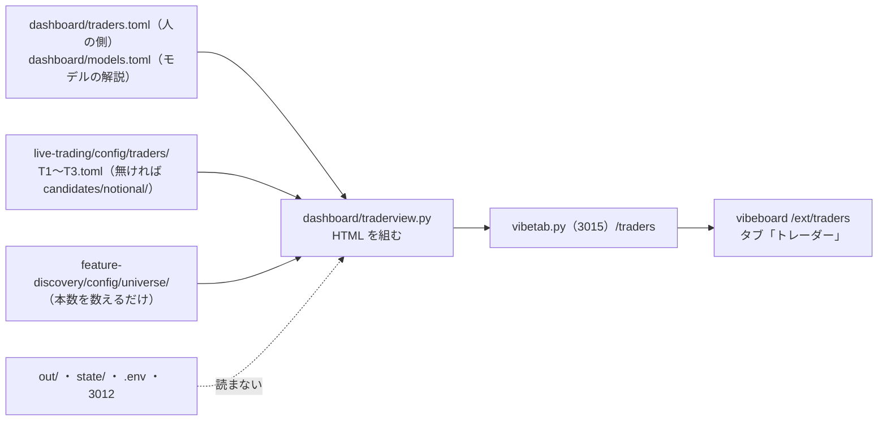
```mermaid
flowchart LR
  W["dashboard/traders.toml（人の側）<br/>dashboard/models.toml（モデルの解説）"] --> V["dashboard/traderview.py<br/>HTML を組む"]
  C["live-trading/config/traders/<br/>T1〜T3.toml（無ければ candidates/notional/）"] --> V
  U["feature-discovery/config/universe/<br/>（本数を数えるだけ）"] --> V
  V --> S["vibetab.py（3015）/traders"]
  S --> B["vibeboard /ext/traders<br/>タブ「トレーダー」"]
  X["out/ ・ state/ ・ .env ・ 3012"] -. "読まない" .-> V
```

### 16-1. 構成 — 1 人 1 ページ・主役はモデル（2026-09-20 に 2 度組み直した）

利用者の指示（2026-09-20）:
- **デザインと構成が見づらい。まず黒背景はやめる。全体の大見出しを決めて、そこに分かりやすい内容を入れる**
- **使用するモデルを表示して、それの特性を書くかたちにする**
- **「3 人の中で」とか書いてあるけど、トレーダーは常に変わるし 1 人になるときもあれば 10 人になるときもあるので無駄な比較の文章はいらない**
- **トレーダーの人数は数えなくていい。3 人の違いのページはいらない。一人一人のトレーダーに関して書けばいい**

左の一覧は**トレーダーだけ**（見くらべるページ・共通のページは無い）。⚠ **だれが居るかは実売買の設定から引く** ＝ `config/traders/*.toml` の試験用（`test = true`）でない人 ＋ 直下にまだ居ない `candidates/notional/` の人（「未確定」の印）。⚠ **人数を数えない**（1 人でも 10 人でも同じ画面。人を足せば `traders.toml` を触らなくても一覧に出る）。

1 人のページの大見出しは**全員同じ順・同じ名前・番号つき**（テストが順番を確かめる）:

| # | 大見出し | 中身 | 出どころ |
| --- | --- | --- | --- |
| 1 | 使うモデル | モデルごとの札: やさしい呼び方・**正式な名前（実験名と手法）**・ひとこと・見るもの ／ 決め方。モデルが複数なら、出力スコアの合わせ方（平均・多数決など）を 1 文 | 設定の `[[models]]` → `traders.toml` の `[[model]]`（⚠ **実験名と手法の両方が同じもの**だけを当てる。無ければ「説明はまだ」） |
| 2 | モデルの特性 | 1 項目 1 行 ＋ **どこまで確かかの印** ＋ 理由（小さい字。空なら出さない） | `[[model]]` の `traits`（`text`・`why`・`basis`） |
| 3 | 何を見て、どう出力スコアを計算するか | 見ている数字（小見出しつきのまとまり）＋ 学ぶ → 出力スコアをつける の 2 手順 | `[[model]]` の `sees`・`how` ＋ `[common]` |
| 4 | この人の決まり | 売買基準値（文 ＋ **出力スコアのものさし**）／ いつ ／ いくら（予算・1 本あたり・買い方・お金の決まり） | 設定の数字 ＋ `[common]` |
| 5 | 気をつけること | 共通の限界 ＋ モデルの苦手なこと | `[common]` ＋ `[[model]]` の `limits` |
| （畳む） | 正式な名前 | 実験名・θ・合成規則・銘柄集合・`sizing`・設定のファイル。`<details>` で閉じておく | 設定から写す |

- ⚠ **どこまで確かかの印**（`basis`。利用者「今書かれてる文章は全部嘘？」への答え）: `build` ＝ **作りから**（コードと設定を読めば分かる）／ `trial` ＝ **試し運転で見えた**（シミュレーションと過去のデータでの試し。本番で同じとは限らない）／ `guess` ＝ **見立て**（確かめていない）。⚠ **印の無い文は「見立て」として出す**。⚠ **確かめていない理由を言い切らない**（「〜と見られる（理由は確かめていない）」）。経緯: 最初の版は比較の文を作ろうとして「T1 は初日の注文がいちばん多い」と書いたが、試し運転の初日は T3 63 本 ／ T1 60 本で**誤りだった**
- ⚠ **ほかの人・ほかのモデルとくらべる文を書かない**（「◯ 人の中で」「いちばん多い」「〜より少ない」・呼び名や `T1` を文に入れる）。テスト（`COMPARING`）が弾く。1 つのモデルだけを読んで分かる文にする
- **出力スコアのものさし**: 0〜100 の帯を 売る ／ 何もしない ／ 買う に塗り分ける。⚠ **幅は設定の売買基準値から出す**（θ=55 なら 45 ／ 10 ／ 45。θ=50 なら 2 帯で「何もしない」が無い）。狭い帯には短い札（`ruler_wait_short`）
- **呼び名**（`[nicks]`。識別名 → 呼び名）: `T1` ＝ アキ ／ `T2` ＝ アリス ／ `T3` ＝ カエデ。⚠ **意味の無い名前にする**（利用者の決定 2026-09-20「意味があるものにしたら、次に少し違うタイプのトレーダーを作れない」）。⚠ **記録と設定の識別名は変えない**（呼び名は画面だけ。無い人は識別名のまま出る）。⚠ 一度付けたら変えない・使い回さない。モデルや θ を替えるのは新しい人（新しい識別名 ＋ 新しい呼び名）
- **見た目**: ⚠ **白地・濃い字に固定**（`traderview.CSS` が `color-scheme: light` と背景を上書きする。OS が暗くても黒背景にしない ＝ テストが見る）。大見出し 18px・番号の丸・人ごとに 1 色（モデルの札の線と、ものさしの「買う」の帯）。黄色は「まだ確定していない」の帯と「試し運転で見えた」の印だけ
- ⚠ **出さないもの**: 損益・注文・約定・持ち高・回数・差 1〜4 などの売買結果（それは管理画面の役目）。⚠ **`out/`・`state/`・`.env` を開かない**（テストが `open` を見張る）
- ⚠ **「気をつけること」の頭の 2 行は必ず出す**: 「過去のデータで試したかぎり、ただ持ち続けるより良いとは言えていない」「この実売買は、もうかるかではなく、注文が計画どおりに出て計画どおりの値段で買えるかを確かめるもの」
- 特性の出どころ: 机上の検証とシミュレーション（[live-trading.md §0-7 (k)](experiments/live-trading.md)・[topk-holdings.md](experiments/topk-holdings.md)）・特徴量と検知器のコード（`ail/features/`・`ail/detectors/tsc.py`）・実験の config

### 16-2. やさしい言葉の決まり

⚠ **`traders.toml`・`models.toml` の本文では下の左の語を使わない**（`tests/test_traders_tab.py` の `FORBIDDEN` が機械的に確かめる。⚠ **語を足すときはこの表とテストを一緒に直す**）。

| 使わない語 | 言い換え |
| --- | --- |
| 買い%・出口%・合図・シグナル | **「出力スコア」**（明日上がりそうかを 0〜100 で表した数。高いほど上がりそう）。⚠ **2026-09-20 の利用者の決定**: それまでの「点」は分かりにくい（場所の 1 点・幅の単位とも紛れる）ので、モデルが最後に出す値を素直に「出力スコア」と呼ぶ。⚠ 本文で「点」と裸の「スコア」を使わない（実行タブの「スコア」＝ 最良手法の純利 bp と紛れる。テストが見る）。内部の名前（買い%・`buy`）は変えない |
| θ・閾値 | 「売買基準値」（売りは「100 − 売買基準値」。2026-09-21 の利用者の決定。それまでは「買う線」「売る線」） |
| 特徴量・`own`・`cs_`・`rel_`・`ex_`・`seq` | 「見ている数字」— その株の最近の値動き ／ ほかの株とくらべた位置 ／ 市場全体とくらべた強さ ／ 株の外の数字 ／ 過去 60 日の線 |
| Ridge・線形・LightGBM・決定木・勾配・時系列分類器・QUANT | 「重みをかけて足し合わせる」・「枝分かれをたくさん重ねる」・「60 日の線を区切って高い・低いを測る」 |
| fit・訓練・較正・fold・walk・過学習・バックテスト・パラメータ | 「毎日、過去を全部見直して学び直す」・「過去のたまたまを覚えこむ」・「過去のデータで試す」 |
| universe・`us63`・`company`・`sizing`・`notional`・端株 | 「見る株」・「金額を決めて買う（1 株に満たない分も買える）」・「1 株単位で買う」 |
| 成行・執行 | 「その場で注文を出す」 |
| ボラティリティ・リターン | 「値動きの荒さ」・「上がり下がり」 |
| B&H・n_trials・DSR・bp | 「ただ持ち続ける」。ほかは使わない |

- ⚠ **設定の数字（予算・売買基準値・本数・1 本あたりの金額）を `traders.toml` に書かない**（テストが `$` と 63・48・55・45 を弾く）。設定を変えれば画面が変わる
- 1 項目は 1〜2 行まで。長くなる説明は `why`（理由）に分ける。たとえ話は 1 段に 1 つまで（正確さを優先）

### 16-3. 文を直す・人やモデルを足す手順

1. 文を直す ＝ モデルの文は `dashboard/models.toml`、人の側の文は `dashboard/traders.toml` を直す（sidecar の入れ直しは要らない。見張りが 5 秒おきに mtime を見て画面を入れ替える）
2. **人を足す ＝ 実売買の設定を置くだけ**（`config/traders/<識別名>.toml`。一覧に出る）。呼び名を付けるなら `[nicks]` に 1 行（⚠ 意味の無い名前・使い回さない）
3. **新しいモデルを使う人を足す ＝ `models.toml` に `[[model]]` を 1 つ書く**（`id` も付ける ＝ §17。`name`・`method` は設定と同じ綴り。`traits` には必ず `basis`）。書くまでは「このモデルの説明はまだ書かれていません」と出る。⚠ モデルや θ を替えるのは新しい検証（CLAUDE.md）なので、先にそちらの決めごと
4. `cd dashboard && .venv/bin/python -m pytest -q tests/test_traders_tab.py tests/test_models_tab.py`（いま設定に居る人の全部のモデルに説明があること・やさしい言葉・くらべる文が無いこと・印）

### 16-4. 限界

- 特性の文は人が書いたもので、モデルの中身を変えても自動では変わらない（自動なのは、だれが居るか・どのモデルを使うか・設定の数字）。⚠ モデルの中身を替えたら `[[model]]` を読み直す
- 「試し運転で見えた」の印の特性は、64 営業日のシミュレーションと机上の検証から読んだもので、本番で同じになるとは限らない（印がそう言う）。⚠ 売買基準値しだいで変わる特性（売り買いの回数など）は「売買基準値がまん中にあると」のように条件つきで書く
- タブが出るのは vibeboard と sidecar（3015）を入れ直した後（`vibeboard.config.json` の customTabs と `vibetab.py` の経路は起動時に読む）


## 17. 予測モデルのタブ（vibeboard。2026-09-20）

利用者の指示（2026-09-20）: **vibeboard のタブに予測モデルを追加。予測モデル一覧と分かりやすい解説を付ける**。プランは [vibeboard-models-tab.md](../plans/archive/vibeboard-models-tab.md)。

§16 のトレーダーのタブは「人」から入り、その人が使うモデルしか出ない。こちらは「モデル」から入り、机上で試しただけのモデルも載る。**vibeboard の customTabs の 6 本目**（`dashboard/vibetab.py` の `/models`・画面 `dashboard/modelview.py`・標準ライブラリだけ・読むだけ）。⚠ **決まりは §16 と同じ**: やさしい言葉（§16-2 の表）／ 特性には「どこまで確かか」の印 ／ ほかのモデルとくらべる文を書かない ／ 白地に固定 ／ 数字は設定から写すだけ ／ 売買結果は出さない。

> この図の主張: モデルの言葉の正本は `models.toml` 1 本で、予測モデルのタブとトレーダーのタブの両方がそこから写し、互いのページへ飛べる。試した経緯の数だけは研究の DB（検証結果一覧の生成物 `ledger_rows`）から数える（2026-09-21。§17-3）。

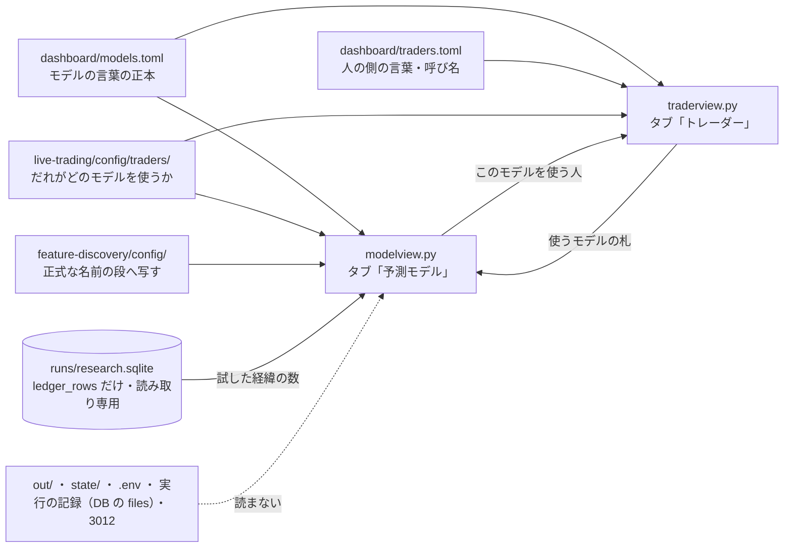
```mermaid
flowchart LR
  M["dashboard/models.toml<br/>モデルの言葉の正本"] --> MV["modelview.py<br/>タブ「予測モデル」"]
  M --> TV["traderview.py<br/>タブ「トレーダー」"]
  W["dashboard/traders.toml<br/>人の側の言葉・呼び名"] --> TV
  C["live-trading/config/traders/<br/>だれがどのモデルを使うか"] --> TV
  C --> MV
  E["feature-discovery/config/<br/>正式な名前の段へ写す"] --> MV
  TV -- "使うモデルの札" --> MV
  MV -- "このモデルを使う人" --> TV
  D[("runs/research.sqlite<br/>ledger_rows だけ・読み取り専用")] -- "試した経緯の数" --> MV
  X["out/ ・ state/ ・ .env ・ 実行の記録（DB の files）・ 3012"] -. "読まない" .-> MV
```

### 17-1. 何を載せるか（2026-09-20 の決め。⚠ 利用者の裁定で直す）

| 決めること | 決めた形 | 理由 |
| --- | --- | --- |
| 一覧の単位 | **モデルの「型」を 1 ページ**（config 90 本・実行 256 本の単位ではない）。GAN 増強 6 種・検知器 7 本・入口と出口の対 12 本は、それぞれ 1 ページにまとめる | config や実行の単位では同じモデルが何度も出て、一覧にならない |
| 束 | **いま使っている ／ 机上で試した** の 2 つ。⚠ **どちらに入るかは実売買の設定から引く**（設定の `[[models]]` と `name`・`method` が合う `[[model]]`。人が書かない ＝ 使う人が居なくなれば自動で「机上で試した」へ移る） | 検証結果一覧に「採る」は 1 件も無いので、判定で分けると全部が同じ束になる |
| 最初に載せた 12 ページ | いまの 3 本（`own-ridge`・`ownex-lgbm`・`seq-quant`）＋ `mlp` ／ `gan-augment` ／ `symbolic-regression`（利用者の言う「対決と進化」）／ `trend-gates` ／ `entry-exit-gates` ／ `minirocket` ／ `hydra` ／ `patchtst` ／ `cgan-scenario` | タスクが名指ししたもの ＋ 記号回帰 |
| ⚠ 載せていないもの | 選別 19 手法・変換 5 本（多項式・tsfresh・行列プロファイル・ウェーブレット・PCA）・上位 K・基準線 | モデルではなく前段や売買の規則。足すなら `[[model]]` を 1 つ書くだけ |
| 「落とす」のモデル | **隠さない・同じ形のページで出す** | 「試して駄目だった」も成果物 |
| 机上の検証の結論 | **出す**（大見出し 4 ＋ 一覧と左の一覧の印）。⚠ **bp などの細かい数字は書かない**（記録と実行タブにある）。消すのは `[common] show_result = false` の 1 行 | やさしい言葉だけの紹介は「うまくいくモデル」に読めてしまう（§16 の「気をつけること」の頭の 2 行と同じ理由）。⚠ 机上の試しの結論であって、実売買の損益ではない |

### 17-2. 画面

左の一覧: `予測モデルの一覧` ／ 束「いま使っている」／ 束「机上で試した」（束の中は `models.toml` に書いた順）。⚠ **本数を数えない・見くらべる表や順位を作らない**（§16 と同じ理由。テストが見る）。

`一覧`（`#models/all`）＝ モデル 1 本 1 枚の札（やさしい呼び方・試した結果の印・ひとこと・見るもの ／ 決め方）。押すとそのモデルのページ。

モデル 1 本のページの大見出しは**全部同じ順・番号つき**。⚠ **2026-09-20 に手厚くした**（利用者の指示「予測モデルを詳しく解説するものにする（「システム説明」の説明とのバランスをとる）」・裁定「とにかくこの仕組みは複雑なので分かりやすくするようにする」。プランは [vibeboard-models-tab-deep.md](../plans/vibeboard-models-tab-deep.md)）。欄の無いモデルは、その部分を出さないだけ（見出しの番号は詰める）:

| # | 大見出し | 中身 | 出どころ |
| --- | --- | --- | --- |
| 1 | どんなモデルか | ひとこと・見るもの ／ 決め方・**このモデルを使う人**（トレーダーのページへのリンク。候補の人には「未確定」。居なければ「過去のデータで試しただけ」）・**このモデルの組み立て**（入力データ ／ 数字の下ごしらえ ／ 計算の仕方 ／ 当てにいく対象 ／ 学習範囲 の表。⚠ 1 本のモデルの中だけ ＝ モデルどうしを横に並べない）→ 詳しく | `[[model]]` ＋ 実売買の設定・`axes`・`detail.about` |
| 2 | モデルの特性 | 1 項目 1 行 ＋ どこまで確かかの印 ＋ 理由 | `traits` |
| 3 | 何を見て、どう答えを出すか | **図**（入れるもの → 計算 → 出力スコア。主張が直前）→ 見ている数字のまとまり → 答えの出し方 → **小さな例で、段を追って**（⚠ 数字は作りもの ＝ 注が必ず付く）→ 共通の流れは「システム説明」へのリンク → 詳しく | `flow`・`sees`・`sees_note`・`how`・`walk`・`detail.how` |
| 4 | 出力スコアの出かたと読み方 | 出かた（幅・癖。印つき）→ 読み方 → 「出力スコアが注文になるまで」へのリンク → 詳しく（【実測】の数字と出典） | `score`・`detail.score` |
| 5 | 過去のデータで試した結果 | 印（採る ／ 保留 ／ 落とす）＋ 1〜2 文 ＋ 理由 ＋ **試した経緯の表**（いつ ／ 何を試したか ／ 何通り ／ 内訳。計算を直す前の試しは薄く）＋ 記録へのリンク ＋ 印の意味 → 詳しく | `result`・`history`・`records`・`detail.result` ＋ `[common]` |
| 6 | 気をつけること | モデルの苦手なこと ＋ 「実際の売買の結果ではない・試した数が多い」＋ 消えた会社が入っていない ＋ 終わりの値段で必ず買える前提（後ろの 2 つは `stocks = false` のモデルでは出さない） | `limits` ＋ `[common]` |
| （囲み） | 正式な名前と設定（用語あり） | 正式な名前・実売買の設定での綴り・実験の config の道と、そこから写した `model`・`feature_layers`・`detectors`・`transform`・`selectors`・`symbol`（平の値だけ）。⚠ **畳まない**（2026-09-20 の裁定。それまでは `<details>`） | `formal`・`name`／`method`・`configs` ＋ `feature-discovery/config/` |

> この図の主張: 足した中身はどれも `models.toml` の新しい欄で、トレーダーのタブが写す欄には触れないので、トレーダーのページは長くならない。

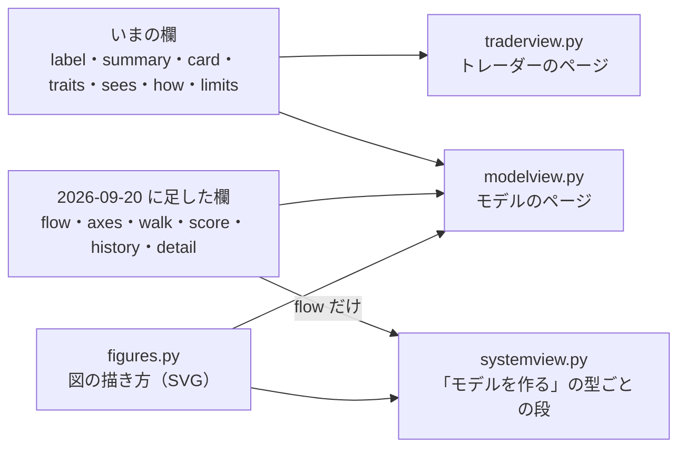
```mermaid
flowchart LR
  OLD["いまの欄<br/>label・summary・card・traits・sees・how・limits"] --> TV["traderview.py<br/>トレーダーのページ"]
  OLD --> MV["modelview.py<br/>モデルのページ"]
  NEW["2026-09-20 に足した欄<br/>flow・axes・walk・score・history・detail"] --> MV
  NEW -- "flow だけ" --> SV["systemview.py<br/>「モデルを作る」の型ごとの段"]
  F["figures.py<br/>図の描き方（SVG）"] --> MV
  F --> SV
```

- ⚠ **「詳しく（用語あり）」の囲み**（`[model.detail.<about|how|score|result>]` の `text`・`points`・`links`）は「システム説明」（§18）と同じく**畳まない**。用語・正式な名前・ハイパーパラメータ・コードと config の場所・【実測】の数字と出典は**ここにだけ**書く（テストの `DETAIL_KEYS`）
- ⚠ **図は「システム説明」の型ごとの段と同じ `flow`**（正本は 1 つ。裁定 ① ＝ 両方に出す）。描き方は `dashboard/figures.py`（`systemview` と `modelview` の両方が使う ＝ 循環しない置き場）。1 図 1 主張・箱は 12 個以内。⚠ **全部のモデルに `flow` が要る**（テスト）
- ⚠ **試した経緯の表**（`history`）の数は、2026-09-21 から研究の DB から数える（行の `names` ＝ 予測モデル名のパターン。§17-3）。`when`・`what`・`note` は人が書く。`old = true` ＝ 計算を直す前の試し（薄く出し、いまの印には数えない）。⚠ **`old` を除いたいちばん良い印は `result.verdict` と同じ**（テストの `best_verdict`。DB がある機械では DB の数で）
- ⚠ **小さな例**（`walk`）の数字は作りもの。画面には必ず「本物の重みや値動きではない」の注（`walk_caution`）が付く。⚠ 実売買の設定の数字（63・48・55・45 など）を例に使わない（テスト）
- ⚠ **出力スコアの癖**（`score.items`）にも「どこまで確かか」の印（`basis`）。【実測】の数字は `detail.score` に出典つきで
- `[[model]]` の欄: `id`（ページの識別名。英数と `-`。⚠ **一度付けたら変えない** ＝ リンクが切れる。`all` は使えない）／ `name`・`method`（実売買の設定と同じ綴り。これが合う人が居れば「いま使っている」）／ `formal` ／ `configs`（`config/` からの道。省けば `experiment/<name>.toml`。⚠ `config/` の外は開かない）／ `label`・`summary`・`card`・`traits`・`sees`・`how`・`limits` ／ `result`（`verdict` ＝ `adopt`・`hold`・`drop`、`text`、`why`）／ `records` ／ `stocks` ／ 2026-09-20 に足した `flow`・`axes`・`walk`・`score`・`history`・`detail`（上の表）
- ⚠ **用語を書いてよいのは `id`・`name`・`method`・`formal`・`configs`・`records`（`FORMAL_KEYS`。画面では「正式な名前と設定」の囲み）と `detail`（`DETAIL_KEYS`。「詳しく」の囲み）だけ**。ほかの欄は §16-2 の表の検査を受ける
- 見張りは `models.toml`・`traders.toml`・実売買の設定の mtime ＋ 研究の DB の `meta.ledger_built_at`（検証結果一覧を入れ直した時刻）（5 秒おき）。文を直すだけなら sidecar の入れ直しは要らない

### 17-3. ⚠ 「試した結果」の印と文は人が書き、試した経緯の数は DB から数える

⚠ **2026-09-21 から、試した経緯の数（何通り・内訳）は研究の DB から機械で数える**（プラン [db-model-facts.md](../plans/db-model-facts.md) の Phase 3。利用者の裁定「予測モデルの解説と DB での永続化を同時にやった方が良い」「予測モデルの命名規則を作らないと解説に使えない」・`ledger_rows` を書くことの了承）。

> この図の主張: 判定は今までどおり `catalog.py` の 1 か所で作り、同じ結果を `ledger.md` と DB の `ledger_rows` の 2 つに吐く。タブは `ledger_rows` を予測モデル名のパターンで引いて数えるだけ。

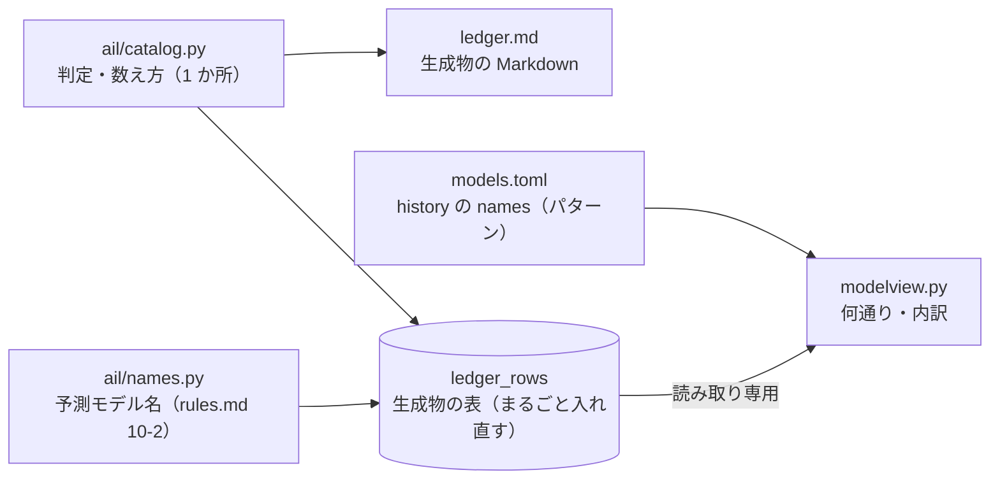
```mermaid
flowchart LR
  C["ail/catalog.py<br/>判定・数え方（1 か所）"] --> L["ledger.md<br/>生成物の Markdown"]
  C --> R[("ledger_rows<br/>生成物の表（まるごと入れ直す）")]
  N["ail/names.py<br/>予測モデル名（rules.md 10-2）"] --> R
  T["models.toml<br/>history の names（パターン）"] --> MV["modelview.py<br/>何通り・内訳"]
  R -- "読み取り専用" --> MV
```

| 部品 | 形 |
| --- | --- |
| 書き手 | `cli.report --catalog` と `cli.queue` の検証結果一覧の吐き直し（`cli/ledger.py` の `store`）が、`ledger.md` と同じ `catalog.ledger()` の結果を `ledger_rows` にまるごと入れ直す（1 つのトランザクション）。列 ＝ leak ／ 検証名 ／ 予測モデル名 ／ `is_trial` ／ 判定 ／ 閉じる ／ 実行の最初と最後の日 ／ 実行一覧 ／ 行まるごと（JSON）。`meta` に `ledger_built_at`・`ledger_n_trials` |
| 読み手 | `modelview.py` が標準ライブラリの `sqlite3` で**読み取り専用**に開き（無い DB は作らない）、`n_trials` に数える行（`is_trial = 1`・leak でない）だけを読む。経緯の行の `names`（`fnmatch` のパターン。θ はまとめて数える）に当たる行の判定を数える |
| DB の置き場 | 実行タブと同じ（vibetab の `--runs-dir` ／ `AIL_RUNS_DIR` の中の `research.sqlite`） |
| DB が無い機械 ・ `names` の無い行 | TOML に書いた数を出す（DB がある機械では、`names` の無い行に「人が写した数」の印）。表の下の注も「機械で数えた」／「人が写した」で入れ替わる |
| テスト | `tests/test_models_tab.py` の `test_real_history_matches_the_db`: 本物の DB があれば、`names` がどれも 1 行以上に当たる ・ TOML の数（控え）が DB の数と同じ ・ `when` の日が DB の実行の日の範囲に入る ・ `result.verdict` が DB の数でのいちばん良い印と同じ。⚠ **新しい実験で数が変わると落ちる** ＝ そのとき記録で確かめて `models.toml` を直す |

⚠ **「詳しく」の門の数字と較正の係数も、2026-09-21 から実行の記録から差し込む**（プランの Phase 4）。`models.toml` の `[model.detail.*]` の文に `{{gate|<実行>|<数字の選び方・作り方>|<項目>|<桁>|<控え>}}`（`checks.json` の `gate.methods[…]` の auc ／ width_pt ／ auc_folds ／ width_folds）・`{{calib|…|a または b|…}}`（`fitted/calibration_f1..N.json` を fold の順に）を書く。DB がある機械では DB の値を点線の下線で出し、指すと出どころの実行の識別名が出る（囲みの下に「機械で引いた値」の注）。DB の無い機械では控え（人が写した文字）。⚠ **控えは DB の値と同じ文字でないとテストが落ちる**（`test_real_detail_plugs_match_the_db`。`{{` の書き損じも見つける）。範囲（「0.491〜0.512」）・桁のそろわない並び・いくつもの実行にまたがる数字は差し込めないので人が写したまま。⚠ 2026-09-21 に差し込みにした 32 か所の控えは、DB の値と**全部同じ**だった（食い違い 0）。読み手は `modelview.RunFacts`（読み取り専用・引くのは `checks.json` と `fitted/calibration_f*.json` だけ）

⚠ **`names` を書けない行**: 回し直しは検証結果一覧で 1 行にまとまる（識別項目が同じ）ので、「直す前の回し直し」と「直した後の回し直し」を分けた行は DB から数えられない（`ownex-lgbm` の 2026-09-13 の行）。検証結果一覧の外の物差しのモデル（`cgan-scenario`）も同じ。この 2 行は人が写した数のまま。

⚠ **2026-09-21 に突き合わせた結果**: `names` を付けた 24 行の数は、人が写した数と**全部同じ**だった（食い違い 0）。⚠ ただし経緯の表に**載っていない試し**がある（数の誤りではない。載せるかは `models.toml` を読む利用者が決める）: `trend-gates` の計算を直す前の「見る株の組を変えた 2 つ」（42 検証。2026-09-12）／ `own-ridge` の期間や見る株を変えた形（1995 年から・48 本など）。

以下は 2026-09-20 に確かめたこと（経緯として残す。この時点では判定を機械で引く経路が無かった）。

| 確かめたこと（2026-09-20） | 分かったこと |
| --- | --- |
| 実行タブの読み手（`app/experiments.py`）が使えるか | ⚠ **使えない**。実行 1 本の `summary.csv`・`checks.json` を写す読み手で、採る ／ 保留 ／ 落とす を持っていない（`checks.json` にも判定の項目は無い） |
| 判定が機械で読める形で残っているか | ⚠ **検証結果一覧（`ledger.md`。生成物の Markdown）にしか無い**。行の識別項目は 手法 × モデル × 層 × θ × 較正 で、**モデル 1 つに 1 つの判定は引けない**（例: `T1` の構成は較正「旧」の行では保留・いまのコードの行では落とす）。例外は条件付き GAN の `verdict.json` だけ |

だから `result` は人が記録（`records` の文書）と検証結果一覧から写す。決まり:

- 印 ＝ **いくつもの形（売買基準値・その置き方・見る数字）で試したモデルは、いちばん良かった形の印**を付け、内訳を文に書く（「21 通りのうち 18 通りは落とす・3 通りは保留」）。⚠ **いまのコードで回した行で決める**（`own-ridge` は較正を直す前の「保留」ではなく「落とす」。経緯は `why` に書く）
- ⚠ **実売買で使っているのに「落とす」「保留」なのは誤りではない**（[live-trading.md §0-1](experiments/live-trading.md): 選んだ基準は型の違いで、成績ではない。実売買で見るのは執行の差）。ページはそれを隠さない
- ⚠ 印の意味の文（`result_note`）は閾値売買の判定（rules.md 13-7）の言い換え。条件付き GAN は物差しが違う（事前に決めた 5 条件）ので、そのモデルの `text` に書く
- ⚠ **新しい試しで判定が変わったら `result` を読み直す**（印と文は自動では変わらない。数が変わればテストが落ちて知らせる ＝ 2026-09-21）

### 17-4. 文を直す・モデルを足す手順

1. 文を直す ＝ `dashboard/models.toml` だけを直す（トレーダーのタブにも同じ文が出る）
2. モデルを足す ＝ `[[model]]` を 1 つ書く（コードは触らない）。特性には必ず `basis`・確かめていない理由は言い切らない・`records` と `configs` は在るファイル
3. `cd dashboard && .venv/bin/python -m pytest -q tests/test_models_tab.py tests/test_traders_tab.py`（やさしい言葉・くらべる文・設定の数字・`id`・印・ファイルの有無・いま設定に居る人のモデルが「いま使っている」に出ること）
4. 手元で見る ＝ `python3 dashboard/vibetab.py --port 3016` → `http://127.0.0.1:3016/models/view?item=all`（3010・3015 に触らない）

### 17-5. 限界

- 文と印は人が書いたもので、モデルの中身や検証結果一覧を変えても自動では変わらない（自動なのは、束・使う人・「正式な名前」の段・試した経緯の数〔DB がある機械で `names` のある行。2026-09-21〕）
- ⚠ 試した経緯の数が DB から出るのは、研究の DB のある機械（titan）だけ。ほかの機械では人が写した数（注が入れ替わる）
- 「型」でまとめたページ（GAN 増強・検知器）の「正式な名前」の段は、代表の config だけを並べている（試した config の全部ではない。全部は実行タブと検証結果一覧）
- タブが出るのは vibeboard を入れ直した後（`vibeboard.config.json` の customTabs は起動時に読む。⚠ 3015 に古い sidecar が居座る罠は §12-3）
- ⚠ **`modelview.py`・`figures.py` を直したときは sidecar（3015）の入れ直しが要る**（文だけなら 5 秒で入れ替わる。コードは起動時に読む）

### 17-6. ⚠ 2026-09-20 の書き直しで直した誤り

手厚くする前に、12 本の文をコードと記録で読み直した（読むだけ・実験は回さない）。⚠ **10 か所あまりが誤りか言い過ぎだった**（トレーダーのタブと「システム説明」にも同じ文が出ていた）。一覧は [プラン §7](../plans/vibeboard-models-tab-deep.md)。主なもの:

- 60 日の線は「毎日の上がり下がりを並べたもの」ではなく、**今日の値段を 0 とした値段の道すじ**（`system.toml` の表も直した）
- 「同じ設定で回し直すと成績がぶれた」（GAN 増強・`ownex-lgbm`）は**逆**。同じ入力なら 1 桁も違わない。動いたのは入力を直したとき
- MiniRocket の型紙は 84 種類（約 1 万は数字の数）。trend 系の「下げを避けたが戻りを逃した」は昔からある決まりの門だけ
- 新しく足した特性: ⚠ **0〜100 に直す式の向きが逆になる期間がある**（`own-ridge`・`ownex-lgbm`）

⚠ **教訓**: 特性の文は「どこまで確かか」の印を付けても、書いた時点で記録と突き合わせていなければ誤る。**文を足す・直すときは、出典（ファイルと節・行）を `detail` に書く**（書けない文は「見立て」にする）。

### 17-7. しくみのページ（2026-09-21。「システム説明」から移した）

利用者の指示（2026-09-21 夜）で、「システム説明」の モデルを作る ／ 過去のデータで確かめる ／ 実際の売買で使う（モデルの話の段）／ 名前と識別名 をこのタブへ移した（§18 は概要だけ）。

> この図の主張: このタブの左の一覧は、一覧 → どのモデルにも共通のしくみ → モデル 1 本ずつ の順に並び、しくみのページはモデルのページとつながる。

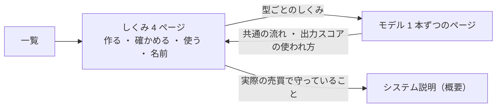
```mermaid
flowchart LR
  A["一覧"] --> G["しくみ 4 ページ<br/>作る ・ 確かめる ・ 使う ・ 名前"]
  G -- "型ごとのしくみ" --> M["モデル 1 本ずつのページ"]
  M -- "共通の流れ ・ 出力スコアの使われ方" --> G
  G -- "実際の売買で守っていること" --> S["システム説明（概要）"]
```

| 決めたこと | 形 |
| --- | --- |
| 言葉の正本 | `dashboard/models.toml` の `[[page]]`（このタブの言葉は 1 本のまま）。形は §18 と同じ（`[[page]]` → `[[page.section]]` → 図 ／ 表 ／ `detail_table`）。⚠ `id`（`build`・`verify`・`live`・`names`）は `[[model]]` の `id` と重ねない（テスト） |
| 左の一覧 | 一覧 → しくみ（束「どのモデルにも共通のしくみ」）→ いま使っている → 机上で試した |
| 描き方 | `modelview.page_body`（段・図・表・「詳しく」・検証結果一覧の合計 `ledger = true`・型ごとのしくみ `models = true`）。「システム説明」の概要も同じものを使う |
| 実際の売買で使う | モデルの話の段だけ ＝ トレーダー ＝ モデル ＋ 売買基準値 ＋ 予算 ／ 1 日の流れ ／ **モデルに入るものと出てくるもの**（2026-09-23。いつ学び直すか ・ 入るもの ・ 出るもの ・ トレーダーの使い方。用語と `predict.jsonl` の項目は「詳しく」の表 ＝ 正本は [live-trading.md §0-9 (f)](experiments/live-trading.md)）／ 出力スコアから注文へ（モデルの話の点だけ）／ 出力スコアの読み方。帳面と口座・安全の仕掛け・何を見て判定するか は「システム説明」の概要へ（テストが見る） |
| 名前と識別名 | 2026-09-21 の予測モデル名（rules.md 10-2。学習範囲は `shared` ／ `each`）を「詳しく」と表に足した |
| 決まり | §17 と §18 と同じ（本文はやさしい言葉 ／ 用語は「詳しく」だけ ／ 図は 1 図 1 主張・箱 12 個以内 ／ 読むだけ ／ 白地） |

## 18. システム説明のタブ（vibeboard の先頭。2026-09-20）

⚠ **2026-09-21 から概要の 1 ページだけ**（利用者の指示「vibeboard の予測モデルタブにシステム説明のモデルを作る、過去のデータを確かめる、実際の売買で使うのモデル関連の部分を書く。システム説明は概要だけにする」。プランは [vibeboard-system-overview-only.md](../plans/archive/vibeboard-system-overview-only.md)）。モデルを作る ／ 過去のデータで確かめる ／ 実際の売買で使う（モデルの話の段）／ 名前と識別名 は **予測モデルのタブのしくみのページ**（§17-7）へ移した。実際の売買のうちモデルでない話（帳面と口座・注文の出し方と予算・安全の仕掛け・シミュレーション・何を見て判定するか）は、概要の段「実際の売買で守っていること」に短く残した。ページの描き方は `modelview.py`（予測モデルのタブと同じもの）・図は `figures.py`。以下の §18-1 の表のうち `build`・`verify`・`live`・`names` の行は 2026-09-20 の形（経緯として残す）。

利用者の指示（2026-09-20）: **モデルに追加解説するページを vibeboard にタブ追加** → 裁定 **新規タブを先頭に作り、このシステムの説明にする。全体の説明はまず簡単にして、モデルの生成と検証と実際に使われるところの説明は手厚くする**。中身は 仕組みを図つきで深く ／ 技術的な定義 ／ 検証の経緯と数字 ／ 読み方・使いどころ の 4 つとも。言葉づかいは**両方を並べる**。プランは [vibeboard-system-tab.md](../plans/archive/vibeboard-system-tab.md)。

vibeboard を開いた人が最初に読む入口。**customTabs の先頭**（`system`・ラベル「システム説明」・`dashboard/vibetab.py` の `/system`・画面と図 `dashboard/systemview.py`・標準ライブラリだけ・読むだけ）。

> この図の主張: 説明の言葉は `system.toml`、型ごとの文は `models.toml`、検証結果一覧の合計は `ledger.md` から来て、システム説明のタブはどれも写すだけ。

```mermaid
flowchart LR
  S["dashboard/system.toml<br/>説明の言葉の正本"] --> V["systemview.py<br/>ページ ＋ SVG の図"]
  M["dashboard/models.toml<br/>型ごとの文と図の箱（flow）"] --> V
  C["live-trading/config/traders/<br/>いま使っているモデル"] --> V
  L["feature-discovery/ledger.md<br/>§0 の合計"] --> V
  V --> T["vibetab.py（3015）/system<br/>タブ「システム説明」（先頭）"]
  X["out/ ・ state/ ・ .env ・ runs/ ・ 3012"] -. "読まない" .-> V
```

### 18-1. ページ

| ページ（`id`） | 中身 | 手厚さ |
| --- | --- | --- |
| 全体のしくみ（`overview`） | 何をするシステムか ／ 全体の流れ（図 1 枚）。⚠ 「いまの結論」「どのタブで何が見えるか」の段は利用者の指示（2026-09-20）で消した ＝ 足し直さない（検証結果一覧の合計は `verify` のページにある） | 簡単に |
| モデルを作る（`build`） | 作る流れ（5 段の図）／ 集める・目盛りを直す ／ 見ている数字 ／ 学ぶ ／ 出力スコアに直す ／ **型ごとのしくみ**（いま使っているモデルごとの図）／ 新しいモデルを足すとき | 手厚く |
| 過去のデータで確かめる（`verify`） | 期間を分けて先へ進みながら試す（図）／ 売り買いのまねごと ／ ものさしと判定 ／ 配線の検査 ／ 試した数を数える（検証結果一覧の合計）／ **これまでの経緯**（日づけ・試したもの・結果）／ 限界 | 手厚く |
| 実際の売買で使う（`live`） | トレーダー ＝ モデル ＋ 売買基準値 ＋ 予算 ／ 1 日の流れ（図）／ 出力スコアから注文へ ／ 帳面と口座を合わせる ／ 安全の仕掛け ／ 出力スコアの読み方 ／ 何を見て判定するか | 手厚く |
| 名前と識別名（`names`） | モデル 1 本 ＝ 設定の名前 × 手法の名前 ／ 部品の名前と検証結果一覧の識別項目（rules.md 10-1） | 技術的な定義 |
| ⚠ 2026-09-21 から | **全体のしくみ（`overview`）だけ** ＝ 何をするシステムか ／ 全体の流れ（図 1 枚。リンクは予測モデルのタブのしくみの 4 ページへ）／ **実際の売買で守っていること**（箇条書きだけ・表なし） | 概要 |

各段 ＝ 番号つきの大見出し → **やさしい言葉の本文**（`text`・`points`）→ 図（主張が直前）→ 図のあとの文（`after`）→ 表 → 型ごとの段 ／ 検証結果一覧の合計 → 注意（`note`）→ リンク → **「詳しく（用語あり）」の囲み**（`detail`・`detail_points`・`detail_table`・`detail_links`）。ページの下に、ほかのページへの案内。

### 18-2. 決まり

- ⚠ **タブの並びは先頭から「システム説明」→「予測モデル」→「トレーダー」**（利用者の指示 2026-09-20。その後ろは 実行 ／ データ ／ 用語 ／ ハード。`vibeboard.config.json` の customTabs の配列順 ＝ テストが見る。⚠ §16「5 本目」・§17「6 本目」は足した順の話で、並びではない。⚠ sidecar を起こす `command` は実行タブの項に付けたまま ＝ 並びを変えても動く）
- ⚠ **タブの名前は「システム説明」・囲みの札は「詳しく（用語あり）」・囲みは畳まない**（利用者の指示 2026-09-20。最初は「しくみ」・「くわしく」・`<details>` で畳んでいた）。`<details>` にしない ＝ いつも開いている（テストが見る）。内部の識別名 `system`（URL の `#system/…`）は変えない
- ⚠ **言葉の正本は `dashboard/system.toml`**（説明を Python に書かない）。形は `[[page]]` → `[[page.section]]` → `[page.section.figure]` ／ `[page.section.table]` ／ `[page.section.detail_table]`。⚠ TOML の決まりで、段の平の項目は小さな表より上に書く
- ⚠ **両方を並べる**: 本文（`lead`・`text`・`points`・`after`・`note`・`table`・図の箱・リンクの札）は §16-2 の表の検査を受ける。**用語・正式な名前・コードの場所・細かい数字と出典は `detail*` にだけ**書く（テストの `DETAIL_KEYS`）
- ⚠ **本文に実売買の設定の数字（予算・売買基準値・見る株の本数）と `$`・bp の数字を書かない**（テストが弾く）。`detail` には書いてよい（【実測】と出典を添える）
- ⚠ **型ごとのしくみ（`models = true` の段）の文は `models.toml` から写す**（呼び方・ひとこと・答えの出し方）。図の箱だけ `[[model]]` の `flow` に書く。⚠ **どの型が出るかは実売買の設定から引く**（§17 の「いま使っている」と同じ読み手）。いま使っている型には `flow` が要る（テスト）
- ⚠ **検証結果一覧の合計（`ledger = true` の段）は描くたびに `ledger.md` の頭 60 行から読む**（生成日・検証の行数・採る ／ 保留 ／ 落とす）。⚠ 検証結果一覧の文の形が変わって読めなければ、その段を出さない（嘘の数字を出さない）。`system.toml` に書き写さない
- **図はサーバで組むインライン SVG**（sidecar のページは外部リソースなし ＝ Mermaid は使えない。箱と矢印の描き方は `dashboard/figures.py` ＝ §17 と共有）。`flow` ＝ 箱と矢印（`per_row` 個で折り返す）／ `folds` ＝ 期間を分けて試す図。⚠ **1 図 1 主張（`claim` が図の直前に出る）・箱は 12 個以内**（`MAX_NODES`。超えたぶんは描かない）
- 「これまでの経緯」の表（何通り・採る ／ 保留 ／ 落とす の内訳）と `detail_table` の数字は**人が記録から写したもの**（閉じた実験なので動かない。出典の文書を `detail_links` に並べる）
- ⚠ **出さないもの**: 売買結果（損益・注文・約定・持ち高）。⚠ **開くのは TOML と `ledger.md` だけ**（テストが `open` を見張る）。白地に固定（§16 と同じ CSS が土台）
- リンク: `{ label, doc }`（文書 → Specs ／ Plans ／ Files タブ）か `{ label, tab, item }`（`system`・`models`・`traders`・`glossary`・`experiments`・`data`。`item` を省くとタブの頭）。テストがリンク先の有無を見る

### 18-3. 直す手順

1. 文を直す ＝ 概要は `dashboard/system.toml`・モデルの話（しくみの 4 ページ）は `dashboard/models.toml` の `[[page]]`。見張りが 5 秒おきに mtime を見て画面を入れ替える
2. ⚠ **仕組みを変えたら該当の段を読み直す**（説明は自動では変わらない。自動なのは、いま使っているモデルの束と検証結果一覧の合計だけ）
3. `cd dashboard && .venv/bin/python -m pytest -q tests/test_system_tab.py`
4. 手元で見る ＝ `python3 dashboard/vibetab.py --port 3016` → `http://127.0.0.1:3016/system/view?item=overview`

### 18-4. 限界

- 説明の文と経緯の表は人が書いたもの（§18-3 の 2）
- タブが出るのは vibeboard の入れ直しの後（`vibeboard.config.json` は起動時に読む。⚠ 3015 に古い sidecar が居座る罠は §12-3）
