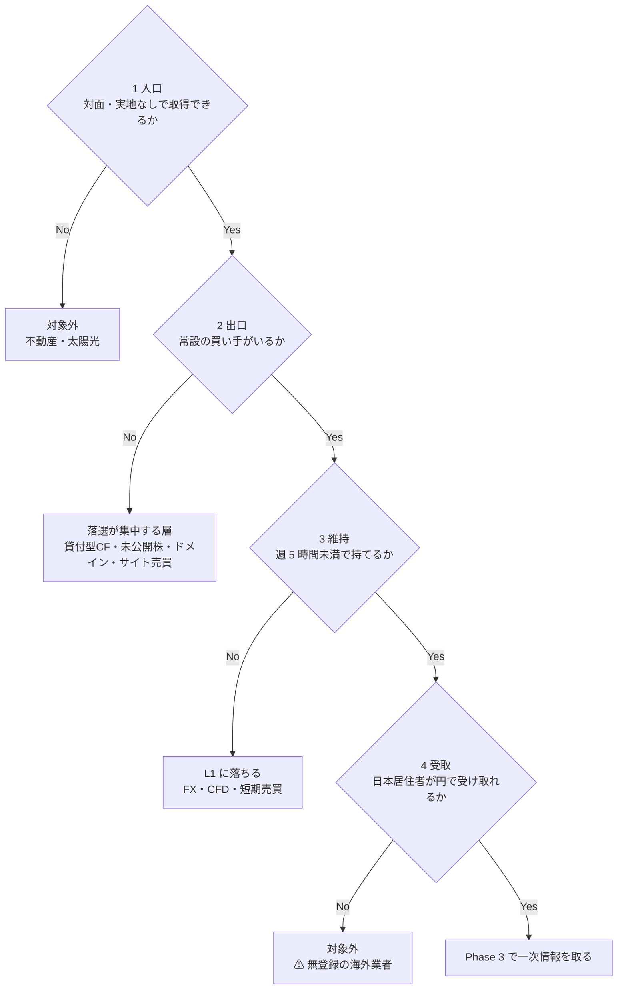
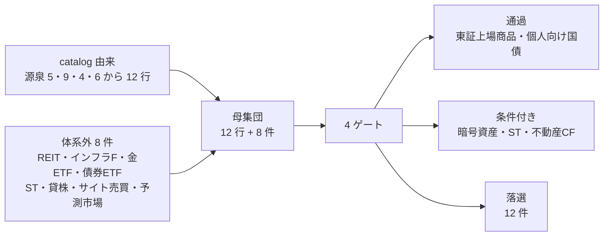
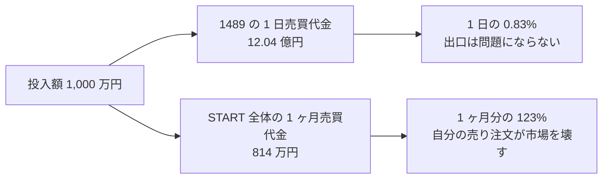
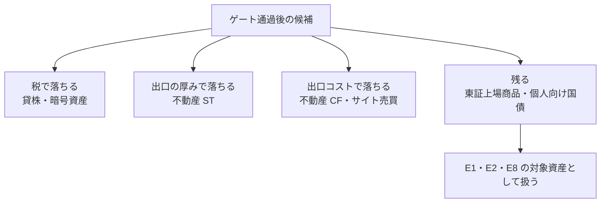
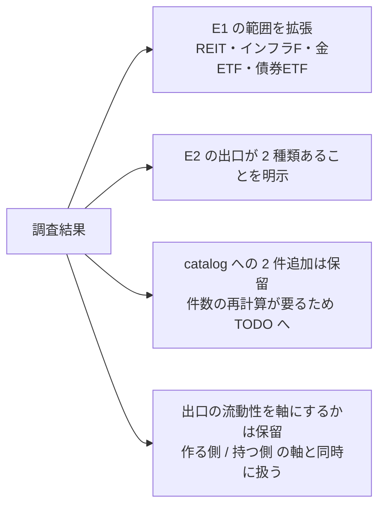

# オンラインで売買が完結する資産の洗い出し（横断調査・日本居住前提・旧版）

> ⚠ **本書は 2026-08-28 に米国基準へ差し替えられた旧版である。現行版は
> [../online-tradable-assets.md](../online-tradable-assets.md)。**
> 体系の前提となる税務上の居住地が米国（WA 州シアトル）に確定したため、本書の数値・出典・規制・税務の結論は**もう使えない**。
> 保存している理由は 2 つ: (1) 4 ゲート・出口の 2 型・「投入額 vs 市場の厚み」という**判定の枠組みはここで作られた**、
> (2) **どの結論が居住地で反転したか**を追うには、反転前の記述が要る。差分の一覧は現行版の §7 にある。

調査日: 2026-08-28。プラン: `docs/plans/archive/online-tradable-assets.md`。
**実行はしていない**（口座開設・入金・売買・登録を行わず、一次情報と試算で判定した）。

手法 ID を接頭辞に付けないのは、これが 1 手法の検証ではなく **E1・E2・E8 が属する枠そのものの検証**だから。

> ⚠ 本書は銘柄・商品の推奨ではない。確定セグメント（資金 大 1,000 万円〜 × 週 5〜15 時間 × 回収 6 ヶ月〜1 年）で
> **その手法が成立するか**を一次情報と試算で判定した記録である（⚠ 金融商品取引法の投資助言・代理業に当たる行為は行わない）。

## 0. 結論

**E1・E2・E8 は「たまたま残った 3 件」ではなく、4 ゲートを通る母集団のほぼ全部だった。**

新しい手法は 1 件も追加できなかった。追加できたのは E1・E2・E8 の**対象資産の範囲**（J-REIT・インフラファンド・金 ETF・債券 ETF）だけで、
これらは入口・出口・手数料・課税がすべて E1 と同一の経路に載る。**別の手法ではなく、同じ手法の銘柄違い**である。

| 判定 | 候補 | 決め手 |
| --- | --- | --- |
| **E1 の範囲に含める** | J-REIT・インフラファンド・金 ETF（1540）・債券 ETF（2621） | 東証上場。売買手数料 0 円・申告分離 20.315% まで E1 と完全に同一 |
| **採らない** | 貸株 | 利回り 0.1% のために ⚠ 総合課税の雑所得へ落ち、⚠ 分別保管・投資者保護基金の対象外になる。**E1 の上乗せではなく劣化** |
| **採らない** | 暗号資産 | ⚠ 現行は雑所得・総合課税（最大約 55%）。20% 申告分離への移行は**適用 2028 年見込み**で、回収 1 年の窓に入らない |
| **採らない** | セキュリティトークン（不動産 ST） | 市場全体の 1 日平均売買代金が 37 万円。**投入額 1,000 万円が市場 1.2 ヶ月分**に相当し、自分の売り注文が出口を壊す |
| **採らない** | サイト・事業売買 | 出口が個別交渉で常設でない。1 件平均 67 万円で、1,000 万円を置くには 15 件必要 |
| **採らない** | 貸付型 CF・不動産 CF | 出口が無いか、あっても事務手数料 3.3%。**出口コストが 1 年分の利回りに匹敵する** |
| **対象外** | 予測市場・ゲームアイテム・無登録の海外業者 | ⚠ 賭博罪（刑法 185・186 条）、規約違反、無登録営業 |

**副次的な発見が 2 つある。**

1. **出口の常設性には 2 種類ある** — 板（価格変動を受け入れて即時に売る）と、発行体の買取保証（額面で戻るが調整額を引かれる）。
   個人向け国債は板を持たないが後者で出口が保証されており、**「板がない＝出口がない」ではない**。
2. **「オンラインで売買が完結する」は L3 を意味しない。** ゲート 3（維持工数）で FX・CFD・暗号資産の短期売買が落ちる。
   E8 も実現ルールを決めなければ L1 に落ちる。

## 1. Phase 1 — 定義と 4 ゲート

「オンラインで買えるか」で判定すると、貸付型 CF も未公開株も通ってしまう。**入口ではなく出口で定義する**。

| # | ゲート | 判定基準 | 落ちる例 |
| --- | --- | --- | --- |
| 1 | 入口 | 対面・実地確認・原本郵送なしで取得できるか。口座開設時の eKYC は一度きりなので入口に含める | I1 不動産（内見・重要事項説明）、I4 太陽光 |
| 2 | **出口** | **常設の買い手がいるか**。板があるか、発行体・運営が常時買い取るか。「売れることがある」は不可 | E3 貸付型 CF、E5 未公開株、I6 ドメイン、D6 権利の買取 |
| 3 | 維持 | 保有中の作業が週 5 時間未満に収まるか。継続的な判断を求められるものは L1 と判定する | FX・CFD、暗号資産の短期売買、F3 裁定取引 |
| 4 | 受取 | 日本居住者が本人確認を通せて、円で受け取れるか | ⚠ 無登録の海外業者 |

既知の 3 件（E1・E2・E8）に当てたところ全件が通った。定義は既知の候補と矛盾しない。

この図の主張: 4 ゲートは順に効くが、**落とすのはほぼゲート 2（出口）**である。入口はどれも開いている。

### 出口は 1 種類ではない

調査中に判明した区別。**ゲート 2 を「板があるか」で書くと個人向け国債が落ちてしまう**ため、定義を「常設の買い手」に広げた。

| 型 | 仕組み | 売却価格 | 例 |
| --- | --- | --- | --- |
| **板型** | 市場で他の参加者と付け合わせる | 時価。**自分の注文量が価格を動かす** | 上場株・ETF・REIT・暗号資産・ST |
| **買取保証型** | 発行体・運営が定めた条件で買い取る | 額面など既定の式。**量に依存しない** | 個人向け国債、不動産 CF の買取申込 |

板型は「いくらで売れるか」が読めず、買取保証型は「いくら引かれるか」が事前に読める。
**投入額 1,000 万円という条件では、板型は市場の厚みを、買取保証型は出口手数料を見る**ことになる。

## 2. Phase 2 — 母集団

catalog 由来と体系外由来の 2 系統で作った。体系化は 2026-08-25 時点の知識で行っており、デジタル証券のような後発の経路が入っていないため。

この図の主張: 母集団のうち、ゲートを通ったのは**東証上場商品と個人向け国債だけ**だった。

### catalog 由来（12 行。近い手法は 1 行にまとめた）

| ID | 手法 | ゲート判定 | 落ちた理由 |
| --- | --- | --- | --- |
| E1 | 上場株・ETF の配当 | **通過** | — |
| E2 | 債券・社債の利子 | **通過** | 個人向け国債は買取保証型、債券 ETF は板型で出口が 2 系統ある |
| E8 | 保有資産の譲渡益 | **通過** | ⚠ ただし実現ルールが無いとゲート 3 で L1 に落ちる |
| E3 | 貸付・ソーシャルレンディング | 落選（2） | Funds は運用期間中の途中解約ができない |
| E4 | 暗号資産のステーキング等 | 条件付き | ゲート 1・2・4 は通るが、⚠ 課税で Phase 4 で落ちる |
| E5 | 未公開株への出資 | 落選（2） | 流動性がなく数年拘束される |
| E6/E7 | 事業買収 | 落選（1・2） | デューデリジェンスが実地。出口は個別交渉 |
| F2 | オプション売り | 落選（3） | 継続的な建玉管理が要る |
| F3 | 裁定取引の自動運用 | 落選（3） | 監視・再調整が要り、catalog の L3 表記より重い |
| I6 | ドメインの運用・売却 | 落選（2） | 出品はできるが常設の買い手がいない。落札から着金まで 1 週間〜2 週間 |
| D6 | 権利の買取 | 落選（2） | 二次流通が個別交渉 |
| I7/I8 等 | （5 資本・9 資源の残り） | 落選（1） | 物理設置・納品が要る |

### 体系外（8 件）

| 候補 | ゲート判定 | 備考 |
| --- | --- | --- |
| J-REIT | **通過** | 東証上場。E1 と同一経路 |
| インフラファンド | **通過** | 同上。ただし上場銘柄数が少なく市場が小さい（銘柄数・利回りは未取得） |
| 金 ETF（1540） | **通過** | 分配金が無く、収入は E8（譲渡益）としてのみ発生する |
| 債券 ETF（2621） | **通過** | 東証マーケットメイク制度の対象 |
| セキュリティトークン（不動産 ST） | 条件付き | 二次流通市場は実在するが、Phase 3 で流動性が問題になる |
| 貸株 | 条件付き | ゲートは全通過。Phase 3 の課税・保全で落ちる |
| サイト・事業売買（ラッコM&A 等） | 落選（2・3） | 出口が個別交渉。買い手審査・引継ぎに稼働が要る |
| 予測市場（Polymarket・Kalshi） | **対象外** | ⚠ 日本国内からの参加は賭博罪（刑法 185・186 条）に触れうる |

### 対象外にしたもの（ゲート以前の理由）

| 候補 | 理由 |
| --- | --- |
| 予測市場 | ⚠ 形はゲートを全通過するが、日本居住者の参加は賭博罪に触れうる |
| ゲームアイテム・アカウント売買 | 各サービスの利用規約で禁止されていることが多い |
| ⚠ 無登録の海外業者（海外 FX・一部の海外取引所） | 日本居住者への勧誘が金商法違反にあたりうる。ゲート 4 で落とす |

## 3. Phase 3 — 一次情報

### 3-1. 入口と出口のコストは、国内上場商品ではゼロ

| 項目 | 値 | 根拠 |
| --- | --- | --- |
| 国内株式・ETF・REIT・インフラファンドの売買手数料 | **0 円**（現物・信用、約定代金にかかわらず） | 【公表値】SBI 証券「ゼロ革命」。各種交付書面を電子交付に設定することが条件 |
| 米ドル/円の為替手数料（円貨決済） | **0 銭**（2026-04 時点） | 【Web 確認済（二次）】 |
| 米国株式の売買手数料 | 約定代金の 0.33%（税込）、上限 16.5 米ドル | 【Web 確認済（二次）】 |

**入口と出口のコストがゼロなので、国内上場商品どうしの比較は「利回り」と「税」だけで決まる。**
これは他の候補（ST・不動産 CF・サイト売買）が手数料を持つのと対照的で、Phase 4 の順位を実質的に決めている。

### 3-2. 候補ごとの一次情報

| 候補 | 表面利回り | 保有コスト | 最低単位 | 出口 | 課税 |
| --- | --- | --- | --- | --- | --- |
| **1489**（日経高配当株 50 ETF） | 分配金利回り **2.65%**（基準日 2026-08-27）【公表値】 | 信託報酬 0.308%【公表値】 | 1 口 3,578 円 | 板型・東証 | 申告分離 20.315% |
| **J-REIT 平均** | 分配金利回り **5.02%**（2026-08-27）【Web 確認済（二次）】 | 銘柄ごと | 銘柄ごと | 板型・東証 | 申告分離 20.315% |
| **1540**（純金上場信託） | 分配金 **なし** | 信託報酬 0.539%【Web 確認済（二次）】 | 1 口 | 板型・東証 | 譲渡益のみ（E8） |
| **2621**（米国債 20 年超・ヘッジあり） | 利回り**不明**（未取得） | 信託報酬 0.154%【Web 確認済（二次）】 | 1 口 1,113 円 | 板型・東証（マーケットメイク対象） | 申告分離 20.315% |
| **個人向け国債 変動 10 年** | 初回適用利率 **年 1.87%**（2026 年 8 月募集分）【Web 確認済（二次）】 | なし | **1 万円単位**【公表値】 | 買取保証型。**発行後 1 年経過すればいつでも中途換金**、受取額＝額面＋経過利子−中途換金調整額【公表値】 | 20.315% |
| **貸株**（SBI） | 標準 0.1% 前後。取扱 4,220 銘柄中、1% 以上は 289 銘柄（2026-08-26）【Web 確認済（二次）】 | なし | 1 単元 | 原資産は板型 | ⚠ **総合課税の雑所得**【公表値】 |
| **不動産 ST（START）** | 銘柄ごと | 銘柄ごと | 1 口 約 7〜10 万円（基準価格）【公表値】 | 板型だが薄い（3-3） | 20.315% |
| **不動産 CF（COZUCHI）** | 未取得 | — | 1 万円〜 | 買取保証型。**事務手数料 3.3%**、着金まで約 1 ヶ月【Web 確認済（二次）】 | 雑所得 |
| **サイト・事業売買（ラッコM&A）** | 案件ごと | — | 案件ごと | 個別交渉。売主手数料 **無料**、買主 5%（最低 55,000 円）【公表値】 | 譲渡所得・事業所得 |

### 3-3. 出口の流動性 — ここで 3 桁の差が出る

**「売買が成立する仕組みがある」と「1,000 万円を売れる」は別物**なので、実際の売買代金を取った。

| 市場・銘柄 | 1 日平均売買代金 | 基準 | 出典 |
| --- | ---: | --- | --- |
| **1489**（ETF 1 銘柄） | **12.04 億円** | 2026-08-28 終値時点 | 【公表値】 |
| **START**（不動産 ST 市場 **全 7 銘柄の合計**） | **37.0 万円** | 2026 年 7 月 | 【公表値】ODX 月次レポート |

**差は約 3,250 倍。** 同じ「オンラインで売買が完結する」形をしていても、出口の実体はこれだけ違う。

START の 2026 年 7 月実績【公表値】:

| 項目 | 値 |
| --- | ---: |
| 月間売買代金 | 8,144,330 円 |
| 月間売買高 | 98 口 |
| 1 日平均売買代金 | 370,196 円 |
| 取扱銘柄数 | 7 銘柄（うち 1 銘柄は月間売買代金 0 円） |
| START 時価総額 | 207.5 億円 |

この図の主張: 投入額 1,000 万円を出口の厚みと突き合わせると、**同じ金額が片方では 1 日の 1% 未満、もう片方では 1 ヶ月分を超える**。

ODX 自身が、取扱銘柄について次のように書いている【公表値】。

> 当該銘柄の流動性等については、上場有価証券とは異なるリスクが存在します。

**運営者が一次資料で流動性リスクを明示している市場に、市場 1.2 ヶ月分の資金を置く判断はできない。**
これは「制度が無い」のではなく「制度はあるが規模が 2 桁足りない」という落ち方で、I7（実例ゼロ）や I8（単価が届かない）とは別の失敗の形である。

### 3-4. 課税 — 順位を最後にひっくり返す段

| 区分 | 税率 | 損益通算 | 繰越控除 | 根拠 |
| --- | --- | --- | --- | --- |
| 上場株式等の配当・譲渡益 | **20.315%**（申告分離） | 上場株式等の譲渡損と配当所得（申告分離を選択したもの）で可 | 翌年以後 **3 年** | 【公表値】国税庁 No.1331 / No.1474 |
| 貸株料・配当金相当額 | **総合課税の雑所得** | ⚠ 株式等の譲渡損と通算**できない**。⚠ 配当控除の対象**外** | — | 【公表値】SBI 証券 FAQ |
| 暗号資産（現行） | **総合課税の雑所得**（最大約 55%） | 不可 | — | 【公表値】国税庁 No.1524 |
| 暗号資産（改正後） | 20.315%（申告分離）へ。**適用は 2028 年見込み** | 上場株式等とは通算不可 | 3 年 | 【Web 確認済（二次）】 |

### 3-5. 貸株は「上乗せ」ではなく「劣化」だった

貸株は E1 と同じ在庫のまま追加収入が得られるため、最も有望に見えた候補だった。一次情報で 2 点が判明した。

- ⚠ **課税区分が落ちる**: 貸株料・配当金相当額は総合課税の雑所得。配当控除の対象外で、株式等の譲渡損とも通算できない【公表値】
- ⚠ **保全の外に出る**: 貸出した株券は分別保管の対象とならず、証券会社が倒産した場合に投資者保護基金の保護対象とならない【公表値】

**年 0.1% の金利のために、20.315% の分離課税と投資者保護基金の保護を同時に手放す。** 配当を取る戦略とは両立しない。

## 4. Phase 4 — 確定セグメントでの試算と判定

前提: 投入額 1,000 万円、保有期間 1 年、特定口座（NISA 枠は考慮しない）、売買手数料 0 円、利回りは 3-2 の【公表値】を据え置き。すべて【推測】。

| 候補 | 表面利回り | 年間収入 | 税引後【推測】 | 出口 | 判定 |
| --- | ---: | ---: | ---: | --- | --- |
| **J-REIT（平均利回り）** | 5.02% | 50.2 万円 | **40.0 万円** | 板型・厚い | **E1 の範囲に含める** |
| **1489 高配当 ETF** | 2.65% | 26.5 万円 | **21.1 万円** | 板型・厚い | **E1 の範囲に含める** |
| **個人向け国債 変動 10 年** | 1.87% | 18.7 万円 | **14.9 万円** | 買取保証型・額面 | **E2 の本命** |
| 貸株（E1 に上乗せ） | 0.1% | 1.0 万円 | **0.6〜0.8 万円** | 原資産は板型 | **採らない**（⚠ 雑所得・保護対象外） |
| 暗号資産 | 値動きのみ | — | ⚠ 総合課税で最大約 45% 課税 | 板型・24 時間 | **採らない**（税制の適用が 2028 年見込み） |
| 不動産 ST | 銘柄ごと | — | — | **市場 1.2 ヶ月分** | **採らない**（流動性） |
| 不動産 CF | 未取得 | — | 出口で元本の 3.3% | 買取保証型 | **採らない**（出口コスト） |
| サイト・事業売買 | 案件ごと | — | — | 個別交渉 | **採らない**（出口が常設でない） |

**貸株の税引後 0.6〜0.8 万円**は、総合課税の限界税率を 20〜33%（＋住民税 10%）と置いた場合の幅【推測】。
収入が課税区分を悪化させる副作用まで含めると、金額の議論に入る前に落ちる。

この図の主張: 落ち方は 3 通りに分かれる。**同じ「オンラインで売買が完結する」形をしていても、壊れる場所が違う。**

### 着手順への影響

E1・E2・E8 の順序は変わらない。ただし **E1 の中身は変わる**。

- E1 を「上場株・ETF の配当」から **「東証上場商品（株・ETF・REIT・インフラファンド）の分配金」**として扱う。
  2026-08-27 時点で J-REIT 平均の分配金利回り 5.02% は、代表的な高配当株 ETF（1489）の 2.65% の約 1.9 倍【公表値】。
  **E1 を株だけで分析すると、同じ経路・同じ税率で利回りが倍近い層を見落とす。**
- E2 は「出口が 2 種類ある」ことを前提に分析する。個人向け国債（買取保証型・元本が戻る）と債券 ETF（板型・価格変動あり）は、
  利回りだけでなく出口の型が違う。
- E8 の対象資産に金 ETF（1540）が入る。分配金が無いため、E1 ではなく E8 でしか収入にならない。

## 5. Phase 5 — 体系へのフィードバック

### 反映したもの

| 反映先 | 内容 |
| --- | --- |
| [catalog.md](../../income-taxonomy/catalog.md) | E1・E2・E8 の備考へ、対象資産の範囲と本調査へのリンクを追記 |
| [shortlist.md](../../income-taxonomy/shortlist.md) | 「時間を使わない枠」に、母集団がほぼ全部だったという判定を追記 |
| [overview.md](../../overview.md) | ファイル早見表と §6 現在地に本調査を追加 |

### 残した宿題

- **catalog に 2 件を追加するかの判断**（貸株・デジタル証券）。どちらも実在し、4 ゲートを通り、判定は「採らない」だが、
  体系の網羅性としては catalog に載るべき手法。ただし追加すると 64 件 →66 件となり、
  ai-delta の判定・shortlist の母集団 51 件・各所の集計をすべて再計算する必要がある。
  **本調査の範囲を超えるため、「体系の保守」タスクとして TODO へ起票した。**
- **「出口の流動性」を軸・属性に足すか**。本調査で判定を決めたのは AI 差分でも関与度でもなく出口の厚みだった。
  ただし [TODO](../../../../TODO.md) の「作る側 / 在庫を持つ側」の軸と同時に扱うべきなので、単独では入れない。

この図の主張: 本調査が体系に返すのは新しい候補ではなく、**既存 3 件の輪郭**と、**軸をもう 1 本足すかという宿題**である。

## 6. この調査の限界

1. **利回りは 1 時点の値**。2026-08-27〜28 に取得した分配金利回りをそのまま 1 年間据え置いて試算しており、減配・価格変動は織り込んでいない
2. **2621 の分配金利回りと、インフラファンドの銘柄数・利回りは取得できていない**（JPX の月次レポート PDF が 403 で取れなかった）。E2 の比較はこの分だけ不完全
3. **COZUCHI の想定利回りは未取得**。出口手数料 3.3% だけで判定しており、利回りが十分高ければ結論は変わりうる
4. **暗号資産の税制改正は二次情報のみ**。成立日・適用開始時期を一次情報（金融庁・国税庁）で取れていない。ただし「回収 1 年の窓では現行税制」という判定は、適用が 2027 年以降である限り変わらない
5. **銘柄選定は行っていない**。J-REIT 5.02% は市場平均であり、その利回りで買える保証はない

## 7. 出典

すべて 2026-08-28 取得。

**一次情報（公表ページ）**

| # | 内容 | URL |
| --- | --- | --- |
| 1 | 個人向け国債の中途換金・最低単位 | https://www.mof.go.jp/jgbs/individual/kojinmuke/main/outline/ |
| 2 | 同上・中途換金調整額の計算 | https://www.mof.go.jp/jgbs/individual/kojinmuke/main/qa/answer_qd.html |
| 3 | START 月次レポート 2026 年 7 月（売買代金・銘柄一覧・流動性リスクの注記） | https://www.odx.co.jp/st/ja/market_info/market_report/ |
| 4 | 1489 の分配金利回り・信託報酬・純資産（基準日 2026-08-27） | https://nextfunds.jp/lineup/1489/ |
| 5 | 1489 の出来高・売買代金（2026-08-28） | https://finance.yahoo.co.jp/quote/1489.T |
| 6 | SBI 証券 ゼロ革命（国内株式手数料無料の対象商品） | https://faq.sbisec.co.jp/answer/64f19d2a7959221c5a6a57fb/ |
| 7 | 貸株料・配当金相当額の課税区分 | https://faq.sbisec.co.jp/answer/5ee0768750df50001220718d/ |
| 8 | 貸株サービスの概要（分別保管・投資者保護基金の対象外） | https://www.sbisec.co.jp/ETGate/WPLETmgR001Control?OutSide=on&getFlg=on&burl=search_domestic&cat1=domestic&cat2=stocklending&dir=stocklending&file=domestic_stocklending_01_02.html |
| 9 | 上場株式等の配当等に係る申告分離課税制度（20.315%） | https://www.nta.go.jp/taxes/shiraberu/taxanswer/shotoku/1331.htm |
| 10 | 上場株式等に係る譲渡損失の損益通算及び繰越控除（3 年） | https://www.nta.go.jp/taxes/shiraberu/taxanswer/shotoku/1474.htm |
| 11 | 暗号資産を使用することにより利益が生じた場合の課税関係（雑所得） | https://www.nta.go.jp/taxes/shiraberu/taxanswer/shotoku/1524.htm |
| 12 | ラッコM&A の手数料（売主無料・買主 5%）と累計成約 | https://rakkoma.com/ |

**二次情報（集計サイト・解説記事。一次で裏が取れていない）**

| # | 内容 | URL |
| --- | --- | --- |
| 13 | J-REIT 平均分配金利回り 5.02%・東証 REIT 指数（2026-08-27） | https://stock-marketdata.com/reit.html |
| 14 | 個人向け国債 2026 年 8 月募集分の適用利率（変動 10 年 1.87%） | https://shisan12.com/government-bonds-trend/ |
| 15 | SBI 証券の貸株金利分布（4,220 銘柄中 1% 以上が 289 銘柄、2026-08-26） | https://kashikabu.net/securities/sbi/ |
| 16 | 1540 の信託報酬 0.539% | https://finance.matsui.co.jp/stock/1540/index |
| 17 | 2621 の信託報酬 0.154%・マーケットメイク対象 | https://money-bu-jpx.com/search/2621/ |
| 18 | 暗号資産の 20% 申告分離課税（適用 2028 年見込み） | https://www.dir.co.jp/report/research/law-research/tax/20260206_025575.html |
| 19 | COZUCHI の中途換金と事務手数料 3.3%（2026-05 時点） | https://www.bluebox.co.jp/article/cozuchi-kaikata/ |
| 20 | Polymarket への日本国内からの参加と賭博罪 | https://data-engineering.jp/polymarket/ |
| 21 | SBI 証券の米ドル/円 為替手数料 0 銭（2026-04 時点） | https://www.sbisec.co.jp/visitor/zero-revolution |
