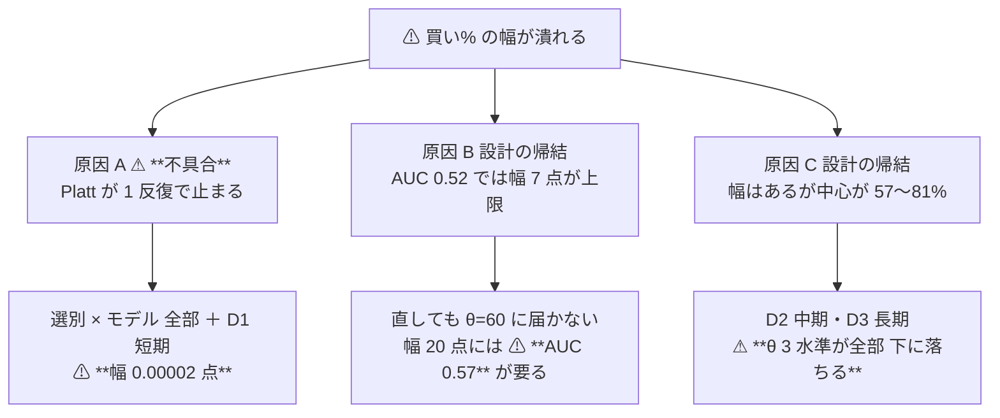
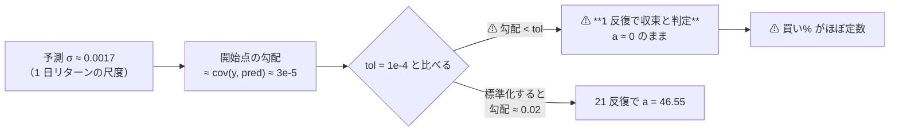
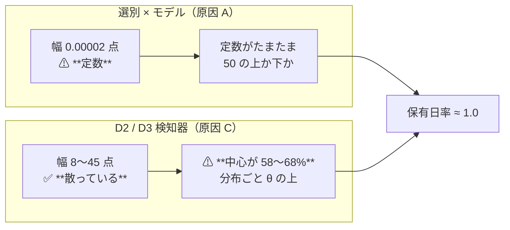

# 買い% の幅が潰れる原因の切り分けと処置

調査日: 2026-09-12（**完了**）。派生元: [DONE の同名タスク](../../../DONE.md)。
プラン: [buy-pct-width-collapse.md](../../plans/archive/buy-pct-width-collapse.md) ／ 規約: [rules.md 13-2 の 6](feature-discovery/rules.md)（正本）。
コード: `experiments/feature-discovery/cli/calibdiag.py`（⚠ **診断専用。`runs/` に書かない**）／ `ail/models/calibrate.py`（処置）。

> ⚠ **これは投資助言ではなく調査資料である。** ⚠ **資金は動かしていない**（2026-08-27 の方針）。
> ⚠ **数字はすべて【実測 2026-09-12】。**
> ⚠ **§1〜§6 は診断（Phase 1）で、そこに出てくる「現行」は処置前の姿である。** 処置と回し直しは §8。
> ⚠ **診断そのものは `runs/` に 1 バイトも書いていないので `n_trials` を動かしていない**（265 のまま）。
> ⚠ **`n_trials` が 337 に増えたのは §8-2 の回し直しのぶんである。**

## 0. ここまでで分かったこと

⚠ **原因は 1 つではなく 3 つある。** ⚠ **そのうち 1 つは実装の不具合で、2 つは設計の帰結である。**

> この図の主張: ⚠ **「幅が出ない」は 3 つの別々の故障の合流点であり、処置も代償も全部違う。**

| 問い | 答え |
| --- | --- |
| 較正は壊れているか | ⚠ **壊れている。** `Platt` の数値解が **1 反復で停止**し、傾き `a` が初期値 0 からほとんど動かない。⚠ **25 行のうち 22 行**で、解き直すと対数尤度が上がった（§2） |
| ⚠ **2026-09-10 の「較正の不具合ではない」は正しかったか** | ⚠ **誤り。訂正する。**（[threshold-trading.md §2](threshold-trading.md)）。根拠だった「leak では同じ較正が振り切れる」は ⚠ **反証になっていない** — leak でも同じ不具合は起きており、信号が強すぎて結果に出ないだけだった（§2-3） |
| 直せば幅 20 点（門の水準）に届くか | ⚠ **届かない。** 直した幅は fold 中央値 **4.43 点**・最大 13.07 点。⚠ **幅 20 点は AUC ≈ 0.57 を要求する**が、実測の AUC は 0.489〜0.561（§3） |
| 直せば手法の差は売買に出るか | ✅ **出る。** θ=50 の保有日率が、現行の「5 fold 中 4 fold で 1.000」から ⚠ **0.667〜0.999 に散り、手法ごと・乱択との差も付く**（§2-2） |
| 検知器（D 系）も同じ原因か | ⚠ **違う。** D2 中期・D3 長期は ⚠ **正しく解けており幅も 8〜45 点ある。** ⚠ **潰れているのは中心の位置**（買い% の中央値 58.5 / 68.4）で、θ ∈ {50,55,60} が全部その下に落ちる（§4） |
| C 古典フィルタが健全なことは何を証明したか | ⚠ **θ より下流（状態機械・コスト・物差し）が動くことだけ。** ⚠ **C の「幅 100 点」は 0/100 しか返さない規則の構造であって、予測力の証明ではない**（§4-2） |
| 影響を受ける試行はいくつか | ⚠ **265 試行のうち 144 が閾値売買**（残り 121 の毎日往復は較正を通らない）。⚠ **うち直接の不具合を踏むのは 選別 × モデル 81 ＋ D1 短期**。C 古典フィルタ 27 は無関係（§5） |

## 1. 何を測ったか

⚠ **動かした軸はゼロ。** 既存の config・表・fold・種・特徴量をそのまま使い、⚠ **途中の量を書き出しただけ**である。

| 対象 | 実行 | 行 × 列 | ねらい |
| --- | --- | ---: | --- |
| 選別 × モデル | `sel_small4_1995` | 431,759 × 35 | 幅 0.0 の 4 手法 ＋ 乱択 |
| 検知器 D / C | `trend_scales_1995` | 410,404 × 56 | ⚠ **D と C を同じ表で比べられる唯一の実行** |
| leak 対照 | `sel_small4_1995 --leak` | 431,759 × 36 | ⚠ **2026-09-10 の反証が成立するか** |
| AUC → 幅 | `--curve`（合成） | 3,000 × 21 水準 | ⚠ **正しく較正したときの幅の上限** |

測った量（`out/diag/<時刻>/folds.csv`）:

| 容疑 | 列 | 効いていると言える形 |
| --- | --- | --- |
| 1 予測に散らばりが無い | `pred_std` | 0 に近い |
| 2 ⚠ **最尤解に届いていない** | `dll = ll_std − ll_now` | ⚠ **正**（同じ目的関数なので、届いていれば 0） |
| 3 直しても幅が出ない | `width_te_std` | 20 点に届かない |

⚠ **容疑 2 の検定だけは決定的である。** ⚠ **同じモデル・同じ標本・同じ目的関数で、変えたのは解き方だけ**なので、
⚠ **尤度が上がったら「情報が無い」のではなく「解けていない」ことの証明になる。**

## 2. 原因 A: ⚠ **Platt の数値解が 1 反復で止まる**（不具合）

### 2-1. 症状

`sel_small4_1995`（選別 4 本 ＋ 乱択 × 5 fold ＝ 25 行）:

| 量 | 現行 | ⚠ 標準化して解き直し |
| --- | ---: | ---: |
| 傾き `a` の典型値 | ⚠ **0.0001 〜 0.0005** | **24 〜 87** |
| 検証 fold での買い% の幅（中央値） | ⚠ **0.000021 点** | **4.43 点** |
| 対数尤度が改善した行 | — | ⚠ **22 / 25 行** |

⚠ **`a` は「50〜80」か「0.0003 前後」の 2 つしか無く、中間が無い。** ⚠ **5 桁の断絶は信号の強弱では説明できない。**

| fold | 手法 | `a`（現行） | `a`（解き直し） | `dll` | 幅（現行） | 幅（解き直し） |
| ---: | --- | ---: | ---: | ---: | ---: | ---: |
| 1 | F2-2 RFE | **74.23** | 74.29 | 2.7e-09 | 13.06 | 13.07 |
| 1 | F1-7 IC の安定性 | ⚠ **0.00049** | **65.32** | ⚠ **2.3e-03** | ⚠ **0.000075** | **9.94** |
| 1 | F1-4 分散しきい値 | **54.97** | 54.51 | 1.9e-07 | 10.00 | 9.92 |
| 2 | F2-2 RFE | ⚠ **0.00036** | **59.21** | ⚠ **1.2e-03** | ⚠ **0.000052** | **8.52** |
| 3 | F1-7 IC の安定性 | ⚠ **0.00045** | **86.67** | ⚠ **2.3e-03** | ⚠ **0.000055** | **10.58** |
| 4 | F1-4 分散しきい値 | ⚠ **−0.000077** | **−19.94** | 1.0e-04 | 0.0000087 | 2.24 |
| 5 | F2-2 RFE | ⚠ **0.00021** | **45.06** | 4.3e-04 | 0.000021 | 4.43 |

⚠ **fold 1 の RFE と F1-4 だけが正しく解けている**（`dll` ≈ 0）。⚠ **同じ fold の F1-7 は解けていない。**

### 2-2. ⚠ **仕組みは特定できた** — `tol` が予測のスケールに依存する

`ail/models/calibrate.py` の `_platt` は `LogisticRegression(C=1e6, solver="lbfgs", max_iter=1000)` を使う。
⚠ **`tol`（既定 1e-4）は L-BFGS-B の `gtol` に渡り、平均対数損失の勾配の最大成分で収束を判定する。**
⚠ **開始点で傾きの勾配は `≈ cov(y, pred)` であり、予測のスケールにそのまま比例する。**

⚠ **1 日リターンの予測は σ ≈ 0.0017 なので、勾配は 3e-5 ＝ `tol` の 1/3 になり、`a` が動く前に「収束」と判定される。**

再現（scikit-learn 1.7.2 / scipy 1.17.1・n = 34,500・σ(pred) = 0.0017・AUC ≈ 0.52）【実測】:

| 解き方 | 反復 | `a` |
| --- | ---: | ---: |
| 現行（生の予測・`tol=1e-4`） | ⚠ **1** | ⚠ **0.00013** |
| 生の予測・`tol=1e-10` | 21 | **46.55** |
| ⚠ **標準化してから解く**（`tol=1e-4` のまま） | 2 | **46.54**（元のスケールに戻した値） |

⚠ **`iter=1` が動かぬ証拠である。** ⚠ **最適化が始まってすらいない。**

> この図の主張: ⚠ **同じデータ・同じ目的関数でも、予測のスケールが小さいだけで解が出ない。**

### 2-3. ⚠ **売買はこう潰れていた** — θ の上に居る日の割合

⚠ **幅ではなく「θ を超える日が何割か」で見ると、状態機械が何をしていたかがそのまま出る。**

`sel_small4_1995` の θ=50（保有日率にほぼ等しい）:

| fold | 現行（全 4 手法 ＋ 乱択） | ⚠ 解き直し（手法ごとに散る） |
| ---: | --- | --- |
| 1 | 0.000 〜 0.199 | 0.014 〜 0.271 |
| 2 | ⚠ **全部 1.000** | 0.667 / 0.676 / 0.719 ／ 乱択 **0.986** |
| 3 | ⚠ **全部 1.000** | 0.786 / 0.797 / 0.829 ／ 乱択 **0.998** |
| 4 | ⚠ **全部 1.000** | 0.840 / 0.856 / 0.981 ／ 乱択 **0.998** |
| 5 | ⚠ **全部 1.000** | 0.994 / 0.996 / 0.999 ／ 乱択 **1.000** |

θ=55 は ⚠ **現行では 5 fold 中 4 fold が 0.000（取引ゼロ）**、解き直すと **0.018〜0.216** になる。

✅ **これが「手法が違っても売買が 1 ビットも違わない」の正体である**（[selectors-small-four.md §2-1](selectors-small-four.md)）。
✅ **解き直すと、手法どうしの差も、乱択との差も付く。**
⚠ **ただし「良くなる」とは言っていない。** ⚠ **散るようになるだけで、上乗せが正になるかは回してみないと分からない。**

### 2-4. ⚠ **leak 対照は反証になっていなかった**

2026-09-10 は「leak では同じ較正が買い% 0/100 に振り切れる」を根拠に ⚠ **「較正の不具合ではない」と結論した**。
⚠ **その論法は成り立たない。** leak でも同じ不具合は起きている【実測】:

| leak 実行 fold 3 | `a`（現行） | `a`（解き直し） | `dll` | 幅（現行） | 幅（解き直し） |
| --- | ---: | ---: | ---: | ---: | ---: |
| F2-2 RFE（leak 列あり） | 10,497 | ⚠ **139,520** | ⚠ **5.9e-03** | 100.0 | 100.0 |
| ⚠ **乱択（基準・leak 列を選ばない）** | ⚠ **0.00016** | **47.63** | 4.2e-04 | ⚠ **0.000015** | **4.31** |

⚠ **leak は「信号が強すぎて、途中で止まっても幅 100 点に達してしまう」だけだった。**
⚠ **同じ実行の中で、leak 列を選ばない乱択だけが本番とまったく同じ形で潰れている**のが決定的である。

## 3. 原因 B: ⚠ **直しても幅 20 点には届かない**（設計の帰結）

⚠ **正しく較正した買い% の幅は、信号の強さで決まる。** 合成データで AUC だけを振った実測【実測】:

| AUC | 買い% の幅 | p05 〜 p95 | θ=50 を跨ぐ | θ=55 | θ=60 |
| ---: | ---: | --- | :---: | :---: | :---: |
| 0.504 | 1.80 点 | 49.2 〜 51.0 | ○ | × | × |
| **0.522** | **7.42 点** | 46.8 〜 54.2 | ○ | ○ | × |
| 0.546 | 12.60 点 | 43.5 〜 56.1 | ○ | ○ | ○ |
| **0.568** | **19.35 点** | 40.5 〜 59.8 | ○ | ○ | ○ |
| 0.588 | 26.54 点 | 37.1 〜 63.6 | ○ | ○ | ○ |

⚠ **門の水準「AUC ≥ 0.52 かつ 幅 ≥ 20 点」（[rules.md 14-5](feature-discovery/rules.md)）は、2 つの条件が整合していない。**
⚠ **幅 20 点は実質 AUC ≈ 0.57 の要求であり、AUC 0.52 の条件は何も足していない。**
⚠ **これは合成データでの上限**（実データの予測は正規より裾が重く、幅はもっと出にくい）。

実測の AUC は **0.489〜0.561**（`sel_small4_1995`）なので、⚠ **どのみち幅は 20 点に届かない。**

## 4. 原因 C: ⚠ **検知器は幅ではなく「中心」で潰れている**

### 4-1. D 学習ゲート

| 手法 | `pred_std` | `dll > 1e-6` の fold | 幅（現行） | 幅（解き直し） | ⚠ **買い% の中央値** |
| --- | ---: | ---: | ---: | ---: | ---: |
| D1 短期 20 日 | 0.0043 | ⚠ **5 / 5** | ⚠ **0.0011** | 3.39 | 57.5 |
| D2 中期 60 日 | 0.0164 | **0 / 5** | 8.30 | 8.27 | ⚠ **58.5** |
| D3 長期 200 日 | 0.0452 | 1 / 5 | 9.74 | 9.73 | ⚠ **68.4** |

- ⚠ **D2・D3 は正しく解けている**（`dll` ≈ 1e-8）。⚠ **予測のスケールが 10〜30 倍大きいから**で、
  ⚠ **60 日・200 日の累積リターンをラベルにした結果である**（原因 A を偶然に免れている）
- ⚠ **それでも売買は潰れる。** 買い% の中心が **58.5 / 68.4** にあり、⚠ **θ ∈ {50,55,60} が全部その下に落ちる**
- fold 2〜5 の θ=50 の保有日率は **0.982〜1.000**、θ=55 でも **0.891〜1.000**

✅ **これが [entry-timing.md](entry-timing.md) の「D 系は保有日率 0.987〜0.998」の正体である。**
⚠ **そして中心が高いこと自体は正しい** — 200 営業日先が上がる確率は本当に高い（ドリフト）。
⚠ **較正は正しく、θ の置き方が信号に合っていない。**

> この図の主張: ⚠ **同じ「ずっと持つ」でも、選別系と検知器では壊れ方が逆である。**

### 4-2. ⚠ **C 古典フィルタは対照として弱い**

`classic_filter` は **移動平均の上なら 100・下なら 0** を返すだけで、⚠ **予測力が無くても幅は必ず 100 点になる。**
⚠ **さらに θ の 3 水準で結果が完全に同じ**（上に居る日の割合が θ=50・55・60 で 0.527 / 0.548 / … と 1 つの値）。

⚠ **C が証明したのは「θ より下流（状態機械・コスト・物差し）が動くこと」だけであり、「較正が壊れていないこと」ではない。**
⚠ **TODO に書いた「C が幅 100 点を出しているから較正が犯人」という読みは、結論は当たっていたが根拠としては弱かった。**

## 5. ⚠ 影響範囲（処置したときに動く数）

| 区分 | 試行 | 原因 A（不具合） | ⚠ 処置したら数字が動くか |
| --- | ---: | --- | --- |
| 毎日往復（旧方式） | **121** | ⚠ **無関係**（`sign(pred)` で較正を通らない） | ⚠ **動かない** |
| 閾値売買 / 選別 × モデル | **81** | ⚠ **全部踏んでいる** | ⚠ **動く** |
| 閾値売買 / D 学習ゲート | **36** | D1 短期は踏む・D2 D3 はほぼ免れる | ⚠ **一部動く** |
| 閾値売買 / C 古典フィルタ | **27** | ⚠ **無関係**（学習しない） | ⚠ **動かない** |
| 合計 | **265** | — | ⚠ **おおむね 90 前後が動く**【推測】 |

⚠ **「動く」は「良くなる」ではない。** ⚠ **上乗せが正に転じる保証は無く、負の方向に大きく動くこともある。**

## 6. ⚠ Phase 1 の限界（測っていないこと）

| # | 限界 |
| ---: | --- |
| 1 | ⚠ **処置後の上乗せ・fold の符号・DSR は測っていない。** 回していないので分からない |
| 2 | ⚠ **`--curve` は合成データ**（正規の点数）。実データの予測は裾が重く、⚠ **同じ AUC でも幅はこれより出にくい** |
| 3 | ⚠ **診断は 3 実行だけ。** 144 試行すべてで `dll > 0` を確かめたわけではない |
| 4 | ⚠ **LightGBM・MLP・GPU 系では測っていない。** 予測のスケールが違えば踏み方も違う【推測】 |
| 5 | ⚠ **原因 C の処置（θ の置き方）は [rules.md 13-3](feature-discovery/rules.md) の事前固定に触れる。** ⚠ **結果を見てから水準を動かすことになるので、扱いは慎重に** |

## 7. 利用者の裁定（2026-09-12）

| # | 裁定 | 中身 |
| ---: | --- | --- |
| 1 | ✅ **原因 A（不具合）を直す** | 予測を標準化してから解き、係数を元のスケールへ戻す。⚠ **モデル・標本・目的関数は変えない**ので [rules.md 13-2](feature-discovery/rules.md) の定義は開かない |
| 2 | ✅ **旧行は残し、回し直しを別試行として足す** | ⚠ **台帳の鍵に「較正」を足す**（旧 / std / —）。⚠ **旧行は再計算しない・消さない**。⚠ **数え落とさない側 ＝ DSR が厳しくなる向き** |
| 3 | ✅ **原因 B・C（門の水準と θ の置き方）には触らない** | ⚠ **結果を見てから水準を動かさない**（13-3 規約 4）。別タスクにする |

## 8. Phase 3: 処置と検算【実測 2026-09-12】

### 8-1. 変えたもの

| 場所 | 変更 |
| --- | --- |
| `ail/models/calibrate.py` の `_platt` | ⚠ **標準化してから解き、`a/σ`・`b − a·μ/σ` で元のスケールへ戻す。** ⚠ **`VERSION = "std"` を足した** |
| `ail/validation/checks.py` | 閾値売買の `checks.json` に `calibration` を残す |
| `ail/catalog.py` / `cli/ledger.py` | ⚠ **鍵に「較正」を足した。** 記録の無い実行は「旧」・毎日往復は「—」 |
| `tests/test_trading.py` | ⚠ **スケール不変性**と**尤度が最大であること**の 2 本を足した（⚠ **この不具合を将来に残さないための検査**） |
| `tests/test_trading_run.py` | 雑音の表の上乗せの上限を 50 → 500bp に。⚠ **緩める前は「上乗せがちょうど 0」だった**（買い% が定数に潰れていたから）。⚠ **符号 5/5 が揃わないことの検査を足して、中身は緩めていない** |

⚠ **触っていないもの**: `simulate.py`（状態機械）・`scale.py` の C 系・θ の 3 水準・門の 2 水準・既存の台帳の行。

### 8-2. ⚠ **回し直した 5 対の前後**（同じ config・同じ表・同じ種）

| 実験 | θ | 旧 上乗せ | 旧 取引/fold | ⚠ std 上乗せ | ⚠ std 取引/fold |
| --- | ---: | ---: | ---: | ---: | ---: |
| sel_small4_1995 | 50 | ＋527.4 | 1,505 | **＋728.5** | **9,202** |
| sel_small4_1995 | 55 | −4,392.6 | 147 | **−1,578.1** | **311** |
| sel_small4_1995 | 60 | −4,600.9 | 28 | **−2,927.2** | **65** |
| pca_1995 | 50 | −62.1 | 49 | −149.4 | ⚠ **6,608** |
| pca_1995 | 55 | −4,615.9 | ⚠ **0** | −1,799.9 | **115** |
| pca_1995 | 60 | −4,615.9 | ⚠ **0** | −3,028.7 | **32** |
| trade_own_1995_ridge_a | 50 | ＋384.1 | 1,133 | −4.4 | ⚠ **7,378** |
| trend_scales_1995（検知器） | 55 | ＋101.3 | 92 | ＋100.6 | 92 |
| trend_pairs_1995（検知器） | 50 | ＋29.6 | 59 | ＋19.8 | 64 |

- ✅ **予測どおりに動いた**: ⚠ **選別系は取引が 2 桁増えた**（`pca_1995` θ=55・60 は ⚠ **取引 0 回 → 115・32 回**）。
  ⚠ **検知器系はほとんど動かない**（D2・D3 は元から正しく解けていた ＝ §4 の診断と一致）
- ⚠ **良くはなっていない。** ⚠ **「採る」は 0 件のまま**で、θ=55・60 の上乗せは依然として大きく負
- ⚠ **θ=50 の上乗せが正でも t は 0.47** ＝ 検出限界（14-2）の 1 桁下

### 8-3. 検算

| # | 検査 | 結果 |
| ---: | --- | --- |
| 1 | テスト | ✅ **276 件 pass**（新しい 2 本を含む） |
| 2 | ⚠ **既存の台帳が変わっていないこと** | ✅ **HEAD の 412 行が 1 行も消えず、較正の列を除けば 1 バイトも変わらない**（足されたのは 87 行だけ） |
| 3 | `n_trials` | **265 → 337**（＋72。⚠ **回し直した 5 実行 × 手法 × θ**。⚠ **数え落とさない側**） |
| 4 | ⚠ **leak 対照** | ✅ **4 対とも跳ねた** — 選別系 ⚠ **上乗せ ＋81,343〜81,365bp・t 11.30** ／ 検知器系 ＋12,903〜16,860bp・t 7.21〜8.17 |
| 5 | 診断が台帳に触れないこと | ✅ 診断は `out/diag/` にしか書かない（`runs/` に `config.json` を作らないので `catalog._read_run` が拾わない） |

## 9. ⚠ 残っていること

| # | 残件 | ⚠ 注意 |
| ---: | --- | --- |
| 1 | ~~⚠ **2018 表・LightGBM・GPU 系の回し直し**~~ | ✅ **2026-09-13 に完了**（[calibration-rerun.md](calibration-rerun.md)）。⚠ **回したのは閾値売買 × 較正「旧」の 12 実行で、`n_trials` 337 → 409。** ⚠ **`gpu_*` の 5 実行は毎日往復なので較正を通らず、対象ではなかった。** ⚠ **LightGBM は Ridge より深く踏んでいた**（(A) 共通で 10/10 の解が止まっていた）。⚠ **「採る」は 0 件のまま** |
| 2 | ⚠ **原因 B（門の 2 条件が不整合）** | ⚠ **幅 20 点は実質 AUC 0.57 の要求。** 門は 14-10 で診断に降格済みなので採否には効かないが、記録される値の意味は歪んだまま |
| 3 | ⚠ **原因 C（θ を絶対値で置いている）** | ⚠ **D2・D3 は買い% の中心が 58〜68% にあり、θ ∈ {50,55,60} が全部下に落ちる。** 13-3 の事前固定に触るので別タスク |
| 4 | ⚠ **`threshold-trading.md` 以下の数字** | ⚠ **不具合を含んだまま出たものである。** ⚠ **訂正の注記は入れたが、数字は 1 つも書き換えていない** |
