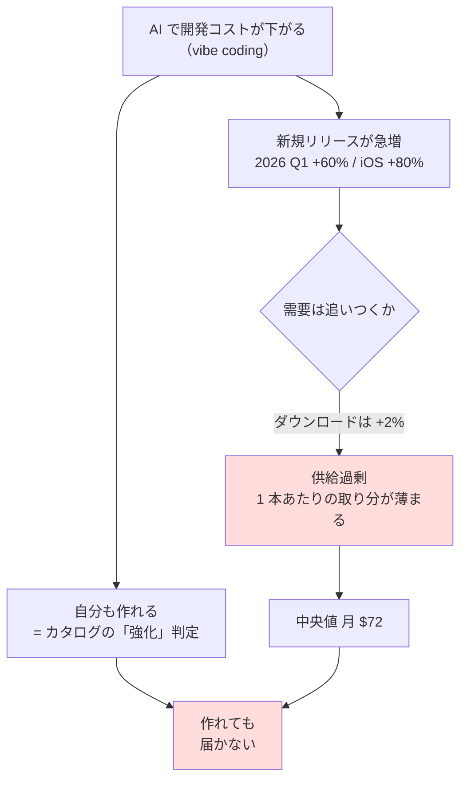

# C4/C5 買い切りアプリ・SaaS — 調査と試算

調査日: 2026-08-27 / プラン: [docs/plans/archive/c4c5-app-saas.md](../../plans/archive/c4c5-app-saas.md)
方針: 机上調査のみ。開発・リリース・課金設定は行っていない。
読み方: [../overview.md](../overview.md) ／ 体系: [../income-taxonomy.md](../income-taxonomy.md)

## 結論: **打ち切り**（I8 とは理由の質が違う）

I8 は物理的に不可能だった。C4/C5 は**可能だが期待値が条件を満たさない**。
中央値で見ると機会費用の回収に 57〜170 ヶ月かかり、条件（6 ヶ月〜1 年）を大きく外す。

さらに、このセグメントの持ち札である**資金 大がまったく効かない**どころか、
有料獲得に使うと**赤字が拡大する**（CAC > LTV）。時間の使い道としても他候補に劣る。

### 判定条件との照合

| # | 条件 | 結果 |
| --- | --- | --- |
| 1 | 投下時間の機会費用を 6 ヶ月〜1 年で回収 | **× 中央値で 57〜170 ヶ月**。上位 25% でも週 5 時間の場合のみ 9.5 ヶ月で収まる |
| 2 | 維持工数が週 15 時間に収まる | 未検証（条件 1 で落ちたため） |
| 3 | 中央値で判断する（成功事例を使わない） | 適用済み。中央値は**発売 1 年後で月 $72**（115,000 アプリ） |
| 4 | 資金 大の優位が働く経路があるか | **× 無い**。CPI と課金転換率から出る CAC $30〜250 に対し、Y1 の課金者あたり収益は $23〜32。**広告費を投じるほど損失が増える** |

## 試算

機会費用 = 投下時間 × フリーランスエンジニアの時給 5,000 円【公表値: 相場 4,000〜6,000 円】× 26 週。
収益は RevenueCat の発売 1 年後の月間収益分布【公表値】。1$ = 159.38 円。

| 週あたり | 機会費用 | 中央値（$72/月） | 上位 25%（$429/月） | 上位 10%（$2,574/月） |
| --- | ---: | ---: | ---: | ---: |
| 週 5 時間 | 650,000 円 | 56.6 ヶ月 × | **9.5 ヶ月 ○** | 1.6 ヶ月 |
| 週 10 時間 | 1,300,000 円 | 113.3 ヶ月 × | 19.0 ヶ月 × | 3.2 ヶ月 |
| 週 15 時間 | 1,950,000 円 | 169.9 ヶ月 × | 28.5 ヶ月 × | 4.8 ヶ月 |

条件を満たすのは**上位 25% かつ週 5 時間**の 1 マスのみ。時間を多く注ぐほど条件から遠ざかる
（収益は投下時間に比例しないのに、機会費用は比例するため）。**このセグメントの「週 5〜15 時間」とは逆向きの構造**になっている。

再計算スクリプト: `experiments/c4c5-app-saas/calc.py`

### 資金 大の優位が効かない（条件 4）

| CPI【公表値】 | 課金転換率【公表値】 | CAC（課金 1 人あたり） | Y1 RLTV/payer【公表値】 | 判定 |
| ---: | ---: | ---: | ---: | --- |
| $1.50 | 5% | $30 | $23〜32 | 辛うじて回収可 |
| $1.50 | 2% | $75 | $23〜32 | **回収不能** |
| $5.00 | 5% | $100 | $23〜32 | **回収不能** |
| $5.00 | 2% | $250 | $23〜32 | **回収不能** |

4 ケース中 3 ケースで CAC が LTV を上回る。**資金は投入先が無い**。
資金で買えるのは既存プロダクトの買収だが、それは C4/C5 ではなく E6（事業買収）の話になる。

### 同じ時間を他候補に充てた場合

| 週あたり | B14（AI 開発者向け受託、$31〜65/時）【公表値】 | C4/C5 中央値 | 倍率 |
| --- | ---: | ---: | ---: |
| 週 5 時間 | 月 106,968〜224,288 円 | 月 11,475 円 | 9.3〜19.5 倍 |
| 週 10 時間 | 月 213,936〜448,575 円 | 月 11,475 円 | 18.6〜39.1 倍 |
| 週 15 時間 | 月 320,904〜672,863 円 | 月 11,475 円 | 28.0〜58.6 倍 |

⚠ B14 は L1（労働）で資産が残らないため、体系の目的（関与度を下げる）には反する。
ただし**期待値では 1〜2 桁上回る**。C4/C5 を選ぶなら「期待値ではなく分布の上側を取りに行く賭け」だと自覚した上での選択になる。

## なぜ中央値がここまで低いか（構造的理由）

AI で作れるようになったのは**自分だけではない**。参入障壁の低下は全員に等しく効くため、
供給が跳ね上がり、需要が追いつかない。**体系で C1（文章コンテンツ直販）を「消滅」と判定した力学と同じ**。

裏付けとなる【公表値】:

| 事実 | 数値 | 含意 |
| --- | --- | --- |
| 新規リリース数 | 2026 Q1 で前年比 **+60%**（iOS +80%、4 月は +104%）。上半期で約 56 万本 ≒ 2025 年通年 | 供給が倍増ペース |
| ダウンロード数 | 上半期で前年比 **+2%** | 需要はほぼ横ばい |
| 収益の分布 | 2020 年以前ローンチのアプリが**サブスク収益の 69%**、2025 年以降ローンチは **3%** | ⚠ 新規参入が構造的に不利。**自分では変えられない要因** |
| 到達率 | 2 年以内に $1K MRR に届くのは **17.3%**、$10K は **4.6%**、$25K は **1.7%** | 上側は薄い |
| 集中度 | 上位 1% の publisher が store 収益の約 90% | 平均値は使えない |
| 継続率（Y1 中央値） | 年額プラン **44.1%**、月額 **17.0%**、週次 **3.4%**。年額の約 30% は初月に解約 | 月額課金は 1 年でほぼ残らない |
| self-serve SaaS の解約率 | 月次 5〜7%、ARPA $25 未満で月次 **6.1%**（ChartMogul） | 小規模・低単価ほど解約が重い |

**上位 25% に入る条件を自分で作れるか**が最後の分岐だが、最大の要因である「ローンチ時期」は変えられず、
供給過剰は進行中（中央値は今後も下がる方向）。カテゴリ選択（Photo & Video は $1K 到達 27.57%）と品質は
コントロールできるが、それだけで分布の上側に入れる根拠は見つからなかった。

## AI による開発高速化の実像（⚠ 主張が割れる論点）

カタログの「AI で個人が作れる規模が最も上がった」を裏取りしたところ、**測定は一貫していない**。

| 出典 | 測定 | 内容 |
| --- | --- | --- |
| METR（2025-07） | RCT（開発者 16 名・実課題 246 件） | 経験豊富な開発者は AI 利用時に **19% 遅くなった**。本人たちは 20% 速くなったと感じていた |
| METR（2026 初） | 同一コホートの再測定 | 約 **18% の高速化**に転じた。ツール改善と**習熟**が理由とされる |

→ 高速化は実在するが**習熟後に初めて出る**。かつ、それは全参入者に及ぶ。
**開発速度は競争優位にならず、供給増の駆動力にしかなっていない**というのが本調査の読み。

## C5（SaaS）固有の追加リスク

- AI 機能を持つ SaaS の粗利は **50〜65%** に圧縮される（従来型 SaaS の 70%+ から）。推論原価が**変動費**として売上に比例する
- ヘビーユーザーはライトユーザーの **50〜100 倍**のコストを発生させる。定額課金では上振れを吸収できない
- 参考: OpenAI は 2025 年に売上 130 億ドルに対し推論費 88 億ドル、粗利率は 40% → 33% に低下

→ C5 は「作った後は原価がほぼゼロ」という従来の L2 の前提が崩れており、**カタログの想定より不利**。

## C4（買い切り）についての注記

本調査で得られた分布データは主に**サブスクリプションアプリ**のもの（RevenueCat）。
買い切りアプリ単独の収益分布は、中央値・分位点の取れる一次情報を見つけられなかった。—**分布不明**

ただし、供給過剰（+60% vs +2%）と収益集中（上位 1% が 90%）は store 全体の構造であり、
買い切りが有利になる根拠も見つからない。**C4 を別扱いする理由は無い**と判断した。

## 体系へのフィードバック

ai-delta は C4/C5 について、すでに **「作る速度は上がるが、競合も増えるため純増は不明」**（C4）、
**「作れる人が増えるため競争は激化」**（C5）と書いて判断を保留していた。
**この調査は、その「不明」に数値を入れたことになる。**

| 論点 | 体系の記述（保留時） | 本調査で埋まった値 |
| --- | --- | --- |
| 作る速度 | 「上がる」 | ○ 上がる。ただし習熟後（METR: 2025 年 −19% → 2026 年 +18%） |
| 競合の増加 | 「増える」 | ○ 増える。新規リリース +60%、需要は +2% |
| **純増か純減か** | **「不明」** | **純減**。中央値は発売 1 年後で月 $72、新規参入の取り分は収益全体の 3% |

- 判定「強化」を**消滅に変える必要はない**。作る側のコストは実際に下がっており、C1 のような単価そのものの崩壊とは違う。
  下がったのは**単価ではなく到達確率**（$1K MRR 到達 17.3%）
- ただしカタログ・shortlist で C4/C5 を「AI で個人が作れる規模が最も上がった層」として**上位に置く根拠は弱まった**。
  作れることと、収入になることが分離している
- **反映すべき点**: ai-delta の「純増は不明」を、本調査の数値で更新する。C4/C5 は
  「強化（作る側）だが、期待収益は純減（売る側）」という**両面併記**が実態に合う

## 出典（すべて 2026-08-27 取得）

- [RevenueCat — State of Subscription Apps 2026](https://www.revenuecat.com/state-of-subscription-apps)
- [RevenueCat — State of Subscription Apps 2025](https://www.revenuecat.com/state-of-subscription-apps-2025)
- [Subscription Insider — RevenueCat Data Shows Subscription App Growth Concentrating at the Top](https://www.subscriptioninsider.com/article-type/news/revenuecat-data-shows-subscription-app-growth-concentrating-at-the-top)
- [TechCrunch — The App Store is booming again, and AI may be why](https://techcrunch.com/2026/04/18/the-app-store-is-booming-again-and-ai-may-be-why/)
- [Digital Trends — AI boom fuels surge in new app launches](https://www.digitaltrends.com/phones/ai-boom-fuels-surge-in-new-app-launches-across-app-store-and-google-play/)
- [METR — Measuring the Impact of Early-2025 AI on Experienced Open-Source Developer Productivity](https://metr.org/blog/2025-07-10-early-2025-ai-experienced-os-dev-study/)
- [valueaddvc — AI Coding Productivity Study Data: What METR, McKinsey and GitHub actually found in 2026](https://valueaddvc.com/blog/ai-coding-productivity-study-data-what-metr-mckinsey-and-github-actually-found-in-2026)
- [ChurnCost — B2B SaaS Churn Benchmarks 2026](https://churncost.com/b2b-saas-churn-benchmarks-2026)
- [SaaS Flywheel — SaaS Churn Rate Benchmarks 2026](https://saasflywheel.io/blog/saas-churn-rate-benchmarks-2026)
- [Business of Apps — Cost Per Install (CPI) Rates](https://www.businessofapps.com/ads/cpi/research/cost-per-install/)
- [adaction — Mobile App User Acquisition Cost: Benchmarks, Formula & Why Intent Matters (2026)](https://www.adaction.com/blog/mobile-app-user-acquisition-cost)
- [SaaS Mag — The AI COGS Problem: SaaS Gross Margin Compression 2026](https://www.saasmag.com/ai-cogs-saas-gross-margin-compression/)
- [The SaaS Academy — How AI Changes SaaS Gross Margin](https://www.thesaasacademy.com/blog/how-ai-changes-saas-pnl-gross-margin)
- [PE-BANK — フリーランスエンジニアの単価相場（2026年版）](https://pe-bank.jp/guide/freelance/freelance_unit_price/)
- [bizdev-tech — フリーランスエンジニアの時給相場は 4,000〜6,000 円（2026年版）](https://bizdev-tech.jp/freelance-dev-hourly/)
