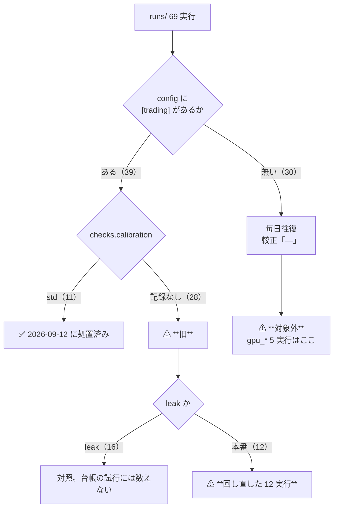
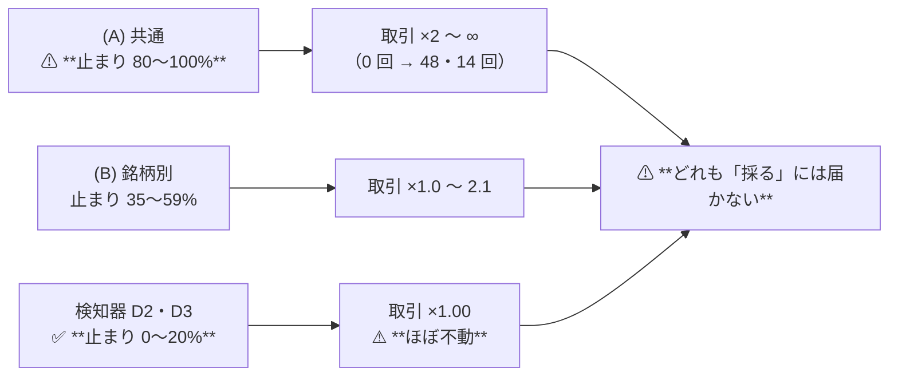

# 直した較正で残りの実行を回し直した

実施日: 2026-09-13（**完了**）。派生元: [buy-pct-width-collapse.md §9](buy-pct-width-collapse.md) の残件 1。
プラン: [calibration-rerun.md](../../plans/archive/calibration-rerun.md) ／ 規約: [rules.md 13-2 の 6](feature-discovery/rules.md)（正本）。

> ⚠ **これは投資助言ではなく調査資料である。** ⚠ **資金は動かしていない**（2026-08-27 の方針）。
> ⚠ **数字はすべて【実測 2026-09-13】。**
> ⚠ **本番の較正コード（`ail/models/calibrate.py`）は 1 バイトも変えていない。** ⚠ **変えたのは「どの実行を回すか」だけである。**
> ⚠ **旧行は 1 行も消していない**（検算 §5 の 2）。

## 0. ここまでで分かったこと

| 問い | 答え |
| --- | --- |
| 何を回したか | ⚠ **閾値売買 × 較正「旧」の 12 実行**（＋ leak 12）。⚠ **`n_trials` 337 → 409**（＋72） |
| ⚠ **TODO の「GPU 系」は回したか** | ⚠ **回していない。回す対象ではなかった。** ⚠ **`gpu_*` の 5 実行は毎日往復で、Platt を 1 度も通っていない**（§1-2） |
| LightGBM は不具合を踏んでいたか | ⚠ **踏んでいた。しかも Ridge より深く。** ⚠ **(A) 共通では 10 / 10 の fold × 手法で解が止まっていた**（Ridge は 8 / 10。§2） |
| 直したら売買は変わったか | ✅ **変わった。** ⚠ **止まっていた割合がそのまま効き**、(A) 共通は取引 ×2〜∞、(B) 銘柄別は ×1.0〜2.1、⚠ **検知器はほぼ不動**（§3-2） |
| ⚠ **良くなったか** | ⚠ **なっていない。「採る」は 0 件のまま。** ⚠ **36 個の（実験 × θ）のうち上乗せが正に転じたのは 1 つだけ**で、それも fold 2/5 で保留（§3-1） |
| ⚠ **診断の道具は信用できたか** | ⚠ **できなかった。** ⚠ **`cli/calibdiag.py` は処置の後「直した解 vs 直した解」を比べており、`dll` が 0 に潰れて「元から解けていた」と読めていた。** ⚠ **2026-09-13 に直した**（§2-1） |
| 代償 | ⚠ **SR0 0.036833 → 0.037584（＋2.0%）。** 強い手法の DSR は 0.908 → 0.898（§5 の 3） |

## 1. 対象をどう決めたか

⚠ **TODO の「2018 表・LightGBM・GPU 系」は、実際に較正を通る実行と 1 対 1 で対応していなかった。**
`runs/` 全 69 実行の `config.json`（`[trading]` の有無）と `checks.json`（`calibration`）を突き合わせて確定させた。

> この図の主張: ⚠ **較正を通るのは閾値売買の経路だけである。** ⚠ **毎日往復は `sign(pred)` で張るので、不具合を踏みようがない。**

### 1-1. 回し直した 12 実行

| # | 実験 | 期間・銘柄 | モデル | 形式 | 手法 | 旧実行 | 新実行 |
| ---: | --- | --- | --- | :-: | ---: | --- | --- |
| 1 | `trade_own_ridge_a` | 2018・63 | Ridge | 共通 | 1 | `09-10T20-04-53` | `09-13T08-57-34` |
| 2 | `trade_own_ridge_b` | 2018・63 | Ridge | 銘柄別 | 1 | `09-10T20-05-08` | `09-13T08-57-41` |
| 3 | `trade_own_lgbm_a` | 2018・63 | **LightGBM** | 共通 | 1 | `09-10T20-05-14` | `09-13T08-57-48` |
| 4 | `trade_own_lgbm_b` | 2018・63 | **LightGBM** | 銘柄別 | 1 | `09-10T20-05-20` | `09-13T08-57-55` |
| 5 | `trade_ownex_ridge_a` | 2018・48 | Ridge | 共通 | 1 | `09-10T20-05-45` | `09-13T08-58-28` |
| 6 | `trade_ownex_ridge_b` | 2018・48 | Ridge | 銘柄別 | 1 | `09-10T20-05-49` | `09-13T08-58-34` |
| 7 | `trade_ownex_lgbm_a` | 2018・48 | **LightGBM** | 共通 | 1 | `09-10T20-05-56` | `09-13T08-58-42` |
| 8 | `trade_ownex_lgbm_b` | 2018・48 | **LightGBM** | 銘柄別 | 1 | `09-10T20-06-03` | `09-13T08-58-52` |
| 9 | `trend_scales_1995_us74` | 1995・**74** | Ridge | 共通 | 7 | `09-12T17-35-16` | `09-13T09-02-03` |
| 10 | `trend_scales_1995_us70` | 1995・**70** | Ridge | 共通 | 7 | `09-12T17-55-31` | `09-13T09-02-27` |
| 11 | `midcap_own` | 2018・48 | Ridge | 共通 | 1 | `09-12T18-15-02` | `09-13T09-02-50` |
| 12 | `midcap_cs` | 2018・48 | Ridge | 共通 | 1 | `09-12T18-15-15` | `09-13T09-02-55` |

⚠ **動かした軸はゼロ。** config・表・fold・種・θ・コスト・手法はすべて旧実行と同じで、⚠ **違うのは `calibrate.VERSION` だけ**である。
⚠ **12 本とも `--ignore-gate` で回した**（門は [rules.md 14-10](feature-discovery/rules.md) 規約 2 で診断に降格済み）。

### 1-2. ⚠ **GPU 系は対象ではなかった**（TODO の読みを 1 つ訂正する）

| 実行 | 検証方式 | 較正 | ⚠ 回し直すと変わるか |
| --- | --- | :-: | --- |
| `gpu_lgbm_2018` ／ `gpu_mlp_2018` ／ `gpu_lgbm_cs` | 毎日往復 | **—** | ⚠ **1 ビットも変わらない** |
| `gpu_ridge_gan_2018` ／ `gpu_lgbm_gan_2018` | 毎日往復 | **—** | ⚠ **1 ビットも変わらない** |

⚠ **根拠は配線である。** `cli/run.py` で `calibrate.fit` を呼ぶのは `evaluate_trading`（閾値売買）だけで、
⚠ **`evaluate`（毎日往復）は予測の符号でそのまま張る。** ⚠ **`gpu_*` の 5 実行はどれも `[trading]` を持たない。**
⚠ **回さなかった理由は「可能性が低いから」ではなく「較正を通らないから」であり、14-10 規約 1 に反しない。**

⚠ **「GPU 系」で実際に効いたのは、GPU で回した LightGBM が閾値売買に入っている 4 本**（#3・#4・#7・#8）である。
⚠ **MLP × 閾値売買は 1 度も回っていない**ので、こちらは「回し直し」ではなく新規の試行になる（§6 の残件 1）。

## 2. Phase 0: ⚠ 回す前に測った — そして診断の道具が壊れていた

### 2-1. ⚠ **`cli/calibdiag.py` は「直した解 vs 直した解」を比べていた**

⚠ **TODO は「回す前に `cli/calibdiag.py` で 1 本測ると、動くかどうかが先に分かる」と指示していた。**
⚠ **そのとおりに測ったら、LightGBM の `dll` が 1e-10〜1e-12 と出た** — ⚠ **「元から解けていた」と読める値である。**

⚠ **これは誤りだった。** 診断は 2026-09-12 の処置**より前**に書かれており、比較の相手を
`ail/models/calibrate.fit_from_predictions` から取っている。⚠ **処置後はその `calibrate` 自身が標準化して解く**ので、
⚠ **「現行」も「解き直し」も同じ解になり、`dll` が構造的に 0 へ潰れる。**

| | 診断が比べていたもの | ⚠ 比べるべきもの |
| --- | --- | --- |
| 2026-09-12（処置の前） | 旧（生のまま） vs 標準化 | ✅ 正しかった |
| 2026-09-12〜13（処置の後） | ⚠ **標準化 vs 標準化** | ⚠ **旧（生のまま） vs 標準化** |

⚠ **処置**: `_platt_legacy`（生の予測・`tol` 既定 1e-4）を診断に足し、比較の相手をそちらへ移した。
⚠ **列名も `*_now` → `*_旧` に改めた**（`dll`・`pred_std`・`width_*_std` の意味は変えていない）。
⚠ **`反復_旧` を足した** — ⚠ **2 で止まっていたら最適化が始まってすらいない**（scikit-learn は開始点を 1 回目に数える）。

⚠ **この道具は `out/diag/` にしか書かないので、`n_trials` は動いていない。**

### 2-2. 測った結果 — ⚠ **LightGBM は Ridge より深く踏んでいた**

`反復_旧 = 2`（＝ 止まっている）の割合【実測】:

| 対象 | 止まった fold × 手法 | `pred_std` の範囲 | ⚠ 直すと動くか |
| --- | ---: | --- | --- |
| 2018 表 × Ridge × (A) | **8 / 10** | 0.0019 〜 0.0044 | ⚠ **動く** |
| 2018 表 × **LightGBM** × (A) | ⚠ **10 / 10** | ⚠ **0.00009 〜 0.0024** | ⚠ **全部動く** |
| us74 検知器 **D1 短期 20 日** | **5 / 5** | 0.0029 〜 0.0071 | ⚠ **動く** |
| us74 検知器 **D2 中期 60 日** | 1 / 5 | 0.0090 〜 0.033 | ほぼ動かない |
| us74 検知器 **D3 長期 200 日** | **0 / 5** | 0.019 〜 0.084 | ⚠ **動かない** |

✅ **1995 表（[buy-pct-width-collapse.md §4](buy-pct-width-collapse.md)）と同じ形が 2018 表でも出た。**
⚠ **LightGBM の `pred_std` は Ridge より 1 桁小さい fold がある**（fold 4 で 0.00012）。⚠ **予測が小さいほど深く踏む**という §2-2 の仕組みそのままである。

### 2-3. ⚠ 実行の記録から見た踏み方（`fitted/` の傾き）

⚠ **診断は (A) プール形式しかなぞれない**ので、(B) 銘柄別は ⚠ **実行が残した `fitted/calibration_f*.json` の傾き `a` を直接数えた**【実測】:

| 実行 | `|a|` の中央値（旧 → std） | ⚠ `|a| < 0.01`（止まっていた）の割合 |
| --- | --- | ---: |
| (A) own × Ridge | 0.00046 → **23.98** | ⚠ **8 / 10（80%）** |
| (A) own × LightGBM | 0.00004 → **55.92** | ⚠ **10 / 10（100%）** |
| (A) ownex × LightGBM | 0.00012 → **50.22** | ⚠ **10 / 10（100%）** |
| (B) own × Ridge | 29.34 → 39.47 | **219 / 630（35%）** |
| (B) own × LightGBM | 0.00036 → **167.7** | **373 / 630（59%）** |
| (B) ownex × LightGBM | 0.00047 → **149.6** | **277 / 480（58%）** |

⚠ **(B) 銘柄別は踏み方が浅い。** ⚠ **銘柄ごとに fit するので標本が小さく、予測の散らばりが相対的に大きくなる**【推測。仕組みは測っていない】。
✅ **この割合が、次節の「どれだけ動いたか」をそのまま説明する。**

## 3. 回し直しの前後

### 3-1. ⚠ 36 個の（実験 × θ）の全部

| 実験 | θ | 旧 上乗せ | ⚠ std 上乗せ | 旧 取引/fold | ⚠ std 取引/fold | 旧 fold符号 | std fold符号 |
| --- | ---: | ---: | ---: | ---: | ---: | :-: | :-: |
| `trade_own_ridge_a` | 50 | ＋12.8 | **−270.9** | 182 | **1,089** | 1/5 0＋−00 | 2/5 −＋−−＋ |
| `trade_own_ridge_a` | 55 | −954.7 | **−540.2** | 34 | **102** | 1/5 0＋−−− | 1/5 −＋−−− |
| `trade_own_ridge_a` | 60 | −1,656.4 | **−943.7** | ⚠ **4** | **35** | 0/5 −−−−− | 1/5 ＋−−−− |
| `trade_own_ridge_b` | 50 | −866.7 | −894.1 | 1,173 | 1,432 | 0/5 −−−−− | 0/5 −−−−− |
| `trade_own_ridge_b` | 55 | −975.9 | −884.5 | 353 | 366 | 0/5 −−−−− | 0/5 −−−−− |
| `trade_own_ridge_b` | 60 | −1,144.6 | −1,104.8 | 174 | 178 | 0/5 −−−−− | 0/5 −−−−− |
| `trade_own_lgbm_a` | 50 | −54.8 | **−142.1** | 50 | **353** | 0/5 00−00 | 1/5 0＋−−− |
| `trade_own_lgbm_a` | 55 | −1,161.0 | **−417.3** | 13 | **110** | 0/5 0−−−− | 2/5 0＋−−＋ |
| `trade_own_lgbm_a` | 60 | −1,652.0 | **−1,254.6** | ⚠ **0** | **48** | 0/5 −−−−− | 0/5 −−−−− |
| `trade_own_lgbm_b` | 50 | −872.2 | −915.2 | 772 | **1,647** | 0/5 −−−−− | 0/5 −−−−− |
| `trade_own_lgbm_b` | 55 | −1,194.7 | −961.8 | 567 | 908 | 0/5 −−−−− | 0/5 −−−−− |
| `trade_own_lgbm_b` | 60 | −1,387.9 | −1,113.2 | 447 | 670 | 0/5 −−−−− | 0/5 −−−−− |
| `trade_ownex_ridge_a` | 50 | −477.4 | −461.3 | 1,705 | 1,714 | 1/5 0＋−−0 | 2/5 ＋＋−−0 |
| `trade_ownex_ridge_a` | 55 | −555.1 | −555.4 | 223 | 221 | 0/5 0−−−− | 0/5 0−−−− |
| `trade_ownex_ridge_a` | 60 | −1,543.7 | **−837.9** | 33 | 42 | 0/5 −−−−− | 1/5 ＋−−−− |
| `trade_ownex_ridge_b` | 50 | −665.6 | −638.5 | 989 | 1,036 | 0/5 −−−−− | 0/5 −−−−− |
| `trade_ownex_ridge_b` | 55 | −692.8 | −610.0 | 394 | 394 | 0/5 −−−−− | 0/5 −−−−− |
| `trade_ownex_ridge_b` | 60 | −950.2 | −904.5 | 265 | 265 | 0/5 −−−−− | 0/5 −−−−− |
| ⚠ **`trade_ownex_lgbm_a`** | **50** | −67.6 | ⚠ **＋68.7** | 38 | **256** | 0/5 00−00 | **2/5 0＋−＋−** |
| `trade_ownex_lgbm_a` | 55 | −1,097.7 | **−74.7** | 10 | **61** | 0/5 0−−−− | 1/5 0−−−＋ |
| `trade_ownex_lgbm_a` | 60 | −1,650.6 | **−1,141.8** | ⚠ **0** | **14** | 0/5 −−−−− | 0/5 −−−−− |
| `trade_ownex_lgbm_b` | 50 | −592.2 | −627.9 | 759 | **1,532** | 0/5 −−−−− | 0/5 −−−−− |
| `trade_ownex_lgbm_b` | 55 | −978.6 | −716.5 | 578 | 867 | 0/5 −−−−− | 0/5 −−−−− |
| `trade_ownex_lgbm_b` | 60 | −1,165.4 | −922.5 | 484 | 624 | 0/5 −−−−− | 0/5 −−−−− |
| `trend_scales_1995_us74` | 50 | ＋48.9 | ＋34.0 | 204 | 199 | 3/5 ＋＋00＋ | 3/5 ＋＋00＋ |
| `trend_scales_1995_us74` | 55 | ＋126.5 | ＋120.9 | 105 | 105 | 3/5 ＋−0＋＋ | 3/5 ＋−0＋＋ |
| `trend_scales_1995_us74` | 60 | −42.6 | −41.3 | 68 | 68 | 1/5 ＋−00− | 1/5 ＋−00− |
| `trend_scales_1995_us70` | 50 | ＋39.4 | ＋28.8 | 199 | 194 | 2/5 ＋＋000 | 2/5 ＋＋000 |
| `trend_scales_1995_us70` | 55 | ＋101.0 | ＋97.9 | 98 | 98 | 3/5 ＋−＋0＋ | 3/5 ＋−＋0＋ |
| `trend_scales_1995_us70` | 60 | −32.9 | −31.0 | 65 | 65 | 1/5 ＋−−00 | 1/5 ＋−−00 |
| `midcap_own` | 50 | −553.6 | −615.6 | 454 | 521 | 0/5 −0000 | 0/5 −−−−0 |
| `midcap_own` | 55 | −955.7 | −969.2 | 71 | 91 | 0/5 −−−−− | 0/5 −−−−− |
| `midcap_own` | 60 | −863.8 | −787.4 | 23 | 27 | 0/5 −−−−− | 0/5 −−−−− |
| `midcap_cs` | 50 | ＋119.9 | ＋149.1 | 1,625 | 1,636 | 2/5 ＋＋−0− | 3/5 ＋＋−＋− |
| `midcap_cs` | 55 | −340.6 | −319.2 | 77 | 87 | 2/5 ＋＋−−− | 2/5 ＋＋−−− |
| `midcap_cs` | 60 | −1,044.6 | −1,044.6 | 19 | 19 | 0/5 −−−−− | 0/5 −−−−− |

⚠ **上乗せが正に転じたのは 36 個中 1 つだけ**（`trade_ownex_lgbm_a` θ=50: −67.6 → ＋68.7）。
⚠ **それも fold の符号が 2/5 なので判定は「保留」であり、「採る」は 0 件のままである**（[rules.md 13-7](feature-discovery/rules.md)）。
⚠ **上乗せが正の 6 個のうち 5 個は元から正**（検知器 4・midcap_cs 1）で、⚠ **どれも fold の符号が割れている。**

### 3-2. ⚠ **止まっていた割合が、そのまま動いた量である**

> この図の主張: ⚠ **「どれだけ動くか」は手法の良し悪しではなく、旧の解が何割止まっていたかで決まる。**

| 系統 | 止まっていた割合 | 取引の倍率 | 上乗せの向き |
| --- | ---: | --- | --- |
| (A) 共通 × 選別 × モデル | **80〜100%** | ⚠ **×2 〜 ∞**（θ=60 で 0 回 → 14・35・48 回） | ⚠ **θ=50 は悪化・θ=55/60 は改善**（下） |
| (B) 銘柄別 | 35〜59% | ×1.0 〜 2.1 | ほぼ横ばい（＋4 〜 ＋233bp） |
| 検知器（us74・us70） | 0〜20% | ×0.97 〜 1.00 | ⚠ **ほぼ不動**（差は 1〜15bp） |

⚠ **θ の水準で向きが分かれる。** ⚠ **θ=50 は「ずっと持つ」に潰れていたので B&H に近く、散らすと B&H から離れて悪化する**（4 実験で悪化）。
⚠ **θ=55・60 は「取引ゼロ／ごく僅か」に潰れていたので、動けるようになったぶん改善する**（8 実験で改善。⚠ **改善しても全部まだ負である**）。
✅ **これは 1995 表の §8-2 と同じ形である。**

### 3-3. leak 対照 — ⚠ **12 対とも跳ねた**

| 対象 | 上乗せ bp | t | fold | DSR |
| --- | ---: | ---: | :-: | ---: |
| `trade_own_*`（4 本） | ＋22,015 〜 ＋22,195 | 17.1 〜 17.7 | 5/5 | 1.000 |
| `trade_ownex_*`（4 本） | ＋22,940 〜 ＋23,870 | 19.3 〜 27.0 | 5/5 | 1.000 |
| `trend_scales_1995_us74` / `us70` | ＋16,108 〜 ＋16,414 | 7.9 〜 8.4 | 5/5 | 1.000 |
| `midcap_own` / `midcap_cs` | ＋24,915 〜 ＋25,131 | 17.0 〜 17.3 | 5/5 | 1.000 |

✅ **較正 → 閾値 → 状態機械の配線は健全**（[rules.md 13-10](feature-discovery/rules.md)）。
⚠ **`trade_ownex_*` の leak 表は今回はじめて作った**（`data/features/trade_ownex_ridge_a_leak/`）。⚠ **旧実行に leak 対照は無いので、新旧の leak は比べられない。**

## 4. ⚠ 台帳の側で 1 つ直した — `[[closed]]` が 2 行に当たった

⚠ **回し直すと `2018-01-31 × 全部使う × Ridge × 共通 × θ=50` の鍵が 旧 / std に割れ、
2026-09-11 に「閉じる」と決めた注記が 2 行に一致してテストが落ちた**（`_apply_closed` は「ちょうど 1 行」を要求する）。

| 場所 | 変更 |
| --- | --- |
| `ail/catalog.py` の `_CLOSED_FIELDS` | ⚠ **`calibration`（＝「較正」）を照合キーに足した。** ⚠ **`KEY` には入っていたのに照合できなかった** |
| `config/catalog_notes.toml` | 当該 `[[closed]]` に `calibration = "旧"` を足して**旧の行に釘付け**した |

⚠ **意味の上でもこれが正しい。** ⚠ **「閉じる（再測しない）」は 2026-09-11 に旧の行について決めたことであり、
⚠ **回し直した std の行は新しく回した試行なので、普通に判定させる**（[rules.md 14-10](feature-discovery/rules.md) 規約 2）。
✅ **2026-09-11 に「期間」を鍵に足したときとまったく同じ手当てである**（同じ注記が既に `period = "2018-01-31"` で釘付けされている）。

## 5. 検算

| # | 検査 | 結果 |
| ---: | --- | --- |
| 1 | テスト | ✅ **276 件 pass**（件数は 2026-09-12 から減っていない） |
| 2 | ⚠ **既存の台帳が変わっていないこと** | ✅ **回し直す前の 500 行が 1 行も消えず、1 バイトも変わっていない**（足されたのは 150 行だけ） |
| 3 | `n_trials` | **337 → 409**（＋72。⚠ **見積りどおり**）。⚠ **SR0 0.036833 → 0.037584（＋2.0%）** ／ 強い手法（年率 0.85）の DSR **0.908 → 0.898** |
| 4 | ⚠ **leak 対照** | ✅ **12 対とも跳ねた**（§3-3） |
| 5 | 較正の列 | ✅ **新しい 24 実行すべてが `checks.calibration = "std"`** |
| 6 | 判定の内訳 | 落とす 269 → **333** ／ 保留 68 → **76** ／ ⚠ **採る 0 → 0** |
| 7 | 診断が台帳に触れないこと | ✅ `cli/calibdiag.py` は `out/diag/` にしか書かない（`config.json` を作らないので `catalog._read_run` が拾わない） |

## 6. ⚠ 残っていること

| # | 残件 | ⚠ 注意 |
| ---: | --- | --- |
| 1 | ⚠ **GPU 系に閾値売買の対が無い** | ⚠ **`gpu_*` が本タスクの対象外だったのは「毎日往復だから」なので、⚠ その前提のほうを埋める話が残る。** ⚠ **モデルの軸では MLP・GAN 増強 3 種が、選別の軸では 13 手法が毎日往復にしか無い**【実測 2026-09-13】。⚠ **利用者の指示（2026-09-13）で TODO に積んだ**。⚠ **「回し直し」ではなく新規の試行**なので、回すなら普通に `n_trials` に足す（＋40〜50【推測】） |
| 2 | ⚠ **原因 B（門の 2 条件が不整合）** | ⚠ **幅 20 点は実質 AUC 0.57 の要求。** 門は診断に降格済みだが、記録される値の意味は歪んだまま |
| 3 | ⚠ **原因 C（θ の置き方）** | ⚠ **2026-09-13 に 3 案とも落とした**（[theta-placement.md](theta-placement.md)）。器を作り直すなら θ ではなく出力の契約かラベル |
| 4 | ⚠ **`threshold-trading.md` 以下の数字** | ⚠ **不具合を含んだまま出たものである。** ⚠ **本書が std 側の対を持ったので、§3-1 の表と突き合わせて読む。数字は 1 つも書き換えていない** |
| 5 | ⚠ **(B) 銘柄別の踏み方が浅い仕組み** | ⚠ **測っていない**（§2-3 は【推測】）。⚠ **診断は (A) プール形式しかなぞれない** |
