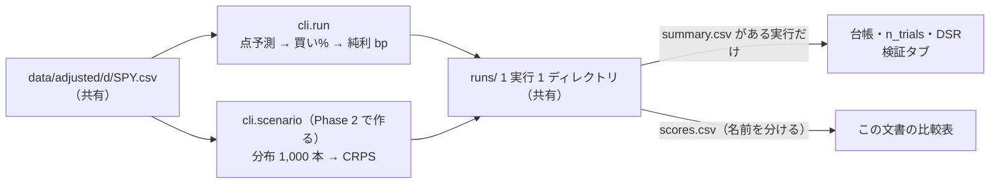
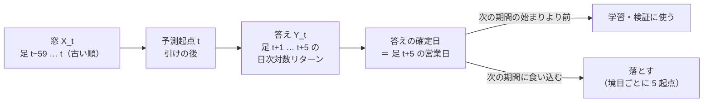
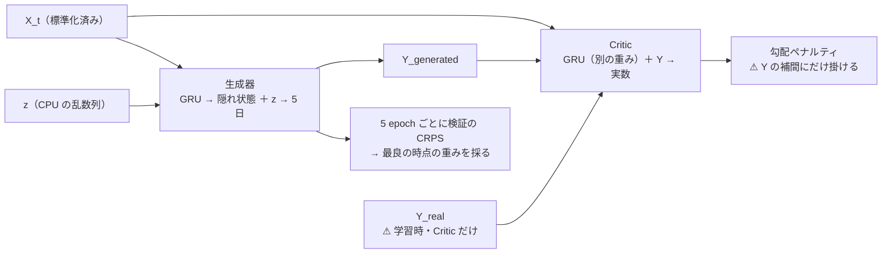
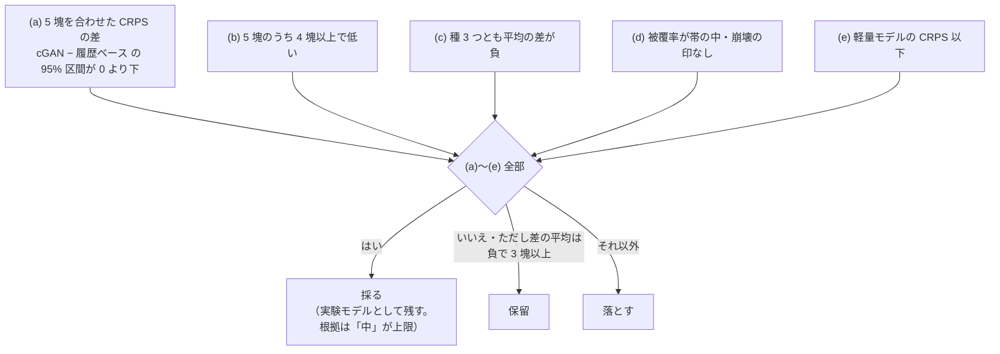
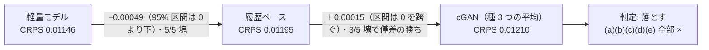
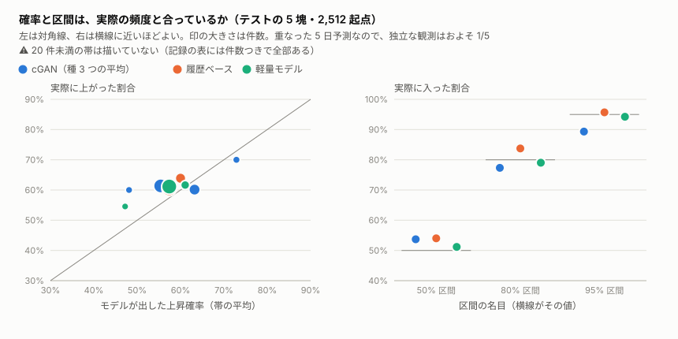
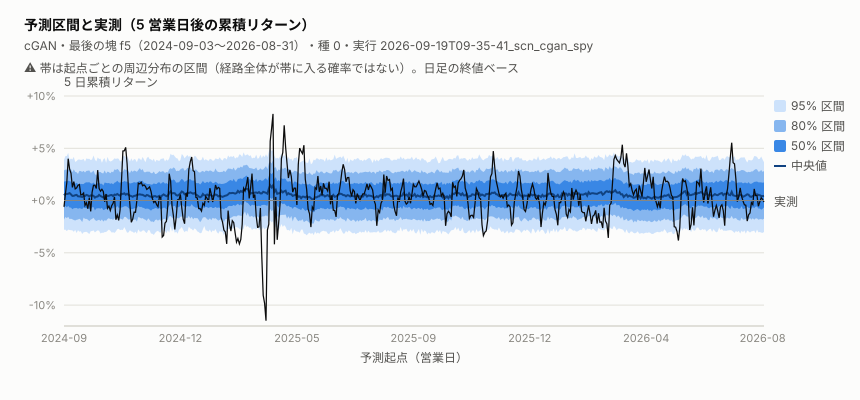

# 条件付き GAN による株価シナリオ予測（ChatGPT 案）

利用者の指示（2026-09-10）「ChatGPT からの GAN 案の実装」。[プラン](../../plans/archive/cgan-scenario-forecast.md)（指示書の全文はプラン §1 以降）。

> ⚠ **資金は動かさない。** 取得済みの日足だけを使う机上の検証。⚠ **採用・収益性を前提にしない**（ベースラインに負けても、検証を完了して結果を明示すれば完了。プラン §9）。

## 状態

**2026-09-19: Phase 0〜5 が済んだ。判定は「落とす」**（事前登録した 5 条件を全部満たさなかった。§4）。5 塊 2,512 起点の CRPS（低いほどよい）は cGAN 0.01210 ／ 履歴ベース 0.01195 ／ 軽量モデル 0.01146。⚠ **ベースラインに負けたが、検証を完了して結果を明示したので、タスクとしては完了**（プラン §9）。

| Phase | 状態 | 区別（プラン §9） |
| --- | --- | --- |
| 0 設計決定 | ✅ 2026-09-18（§0） | — |
| 1 データと特徴量 | ✅ 2026-09-18（§1） | 実装済み・動作確認済み（合成の足のテスト 10 本 ＋ SPY の実データで窓と分割を組んだ） |
| 2 条件付き WGAN-GP | ✅ 2026-09-19（§2） | 実装済み・動作確認済み・実データ評価済み |
| 3 分割とベースライン 3 種 | ✅ 2026-09-19（§3。⚠ 採用基準はテストの成績を見る前に登録） | 同上 |
| 4 評価と予測出力 | ✅ 2026-09-19（§4・`predict` の JSON・図 2 枚） | 同上 |
| 5 再現性とレポート | ✅ 2026-09-19（§5） | 保存 → 読込 → 再現を実データで確認 |

## 0. 設計決定（Phase 0・2026-09-18・結果を見る前）

**主張: 既存の検証の配線（`cli.run` → 台帳）には載せず、入口・設定・試行の勘定を分ける。共有するのは足と実行記録の形だけ。**



### 0-1. 決定と理由

| # | 決めること | 決定 | 理由 |
| ---: | --- | --- | --- |
| 1 | 統合位置 | **専用の入口 `cli/scenario.py`（学習・評価・指定日の予測・最新日の予測）＋ パッケージ `ail/scenario/`**。`cli.run` には載せない・registry に登録しない | `cli.run` の契約は「行ごとの点予測 → 較正 → 閾値 → 状態機械 → 純利 bp」（rules.md 13 章・14-1）。⚠ **分布を点に潰して載せると、主指標（CRPS）が測れず、指示書 §5 の「決定的な点予測を無理に確率モデルとして扱わない」の逆をやることになる** |
| 2 | 対象銘柄 | **SPY**・`data/adjusted/d/`（1994-11-21〜2026-09-08・8,000 本【実測】） | 指示書 §2 の「流動性の高い ETF 1 銘柄」。us63 の市場代表で日足は取得済み。⚠ 分割が 1 度も無いので、調整の誤りが混ざる余地が一番小さい（manifest の `breaks_found` 0【実測】） |
| 3 | 市場全体のリターン（特徴量 5） | **外す**（対象が市場代表そのものなので）。設定の `market` が対象と違う銘柄のときだけ `mkt_ret_1` を足す | SPY の市場リターンは特徴量 1（日次対数リターン）と同じ列。⚠ **別の指数（債券・VIX の ETF など）に差し替えるのは「市場全体のリターン」ではなく新しい特徴量**で、指示書 §3 の「大量に追加する前に最小構成を評価する」に反する。⚠ **最小構成は 6 列** |
| 4 | 既存 `ail/models/gan.py` の再利用 | **関数は使わない。** 使うのは `ail/models/deep.py` の `torch_device`（`AIL_TORCH_DEVICE`・空き VRAM の判定）と `_seed_all` だけ | 増強 GAN は (X, y) の**同時分布**を行単位の MLP で学ぶ・条件が無い・checkpoint を選ばない・重みを保存しない。⚠ **勾配ペナルティの取り方も違う**（こちらは同じ X_t の下で未来系列 Y だけを補間し、Y に関する勾配に掛ける。プラン §4 の 3）。⚠ `gan.py` は 1 行も変えない（台帳の GAN 増強 6 モデルの再現を壊さない） |
| 5 | 設定の分離 | **`config/scenario/cgan_spy.toml`**（`ail/config.py` に `scenario()` を足した）。学習率・latent_dim・隠れ層・Critic 更新回数・勾配ペナルティ係数・batch・seed・学習上限・分割の境目を全部ここに書く | プラン §4 の 5。⚠ `config/experiment/` に置くと `cli.run`・`cli.queue` の設定と取り違える |
| 6 | 実行の記録 | **`runs/<時刻>_scn_<名前>/`**（`ail/runs.Run` をそのまま使う。config・入力の指紋・env・ログ・`fitted/`）。⚠ **成績のファイル名は `scores.csv`**（`summary.csv` にしない） | rules.md 10 章（1 実行 1 ディレクトリ）。⚠ **台帳（`catalog._read_run`）と検証タブ（`app/experiments.py`）は `summary.csv` の無い実行を読み飛ばす**【コードで確認】ので、純利 bp の一覧に CRPS が混ざらない（rules.md 13-8「別の物差しの数字を直接比べない」） |
| 7 | 重みの保存と読み込み | 重み（`.pt`）・scaler・特徴量の順序を `fitted/` に残し、**予測の入口はそれを読む** | 指示書 §8（保存 → 再読込 → 再現）。⚠ rules.md 10 章の「`fitted/` は次の実行で読み込まない」は**検証の実行**が前の実行の係数を引き継がないための規約。予測（推論）は検証ではないので当たらない。⚠ **評価の実行は毎回学習し直す** |
| 8 | 予測時点とデータ利用可能時刻 | **予測起点 t ＝ 足 t の終値が確定した後**（NYSE の引け 16:00 ET。半日立会は 13:00 ET）。`as_of` ＝ 起点の営業日・`data_cutoff` ＝ 足 t | 日足の `ts` は営業日の 00:00 UTC（足の開始時刻。rules.md 4 章）で、終値が使えるのは引けの後。⚠ **当日終値を見た後、同じ終値で買えるとは仮定しない**（プラン §6）。売買の評価はしない（決定 9） |
| 9 | 売買バックテスト（指示書 §6 の任意項目） | **使わない** | 任意項目。⚠ 使うと「買い%」を経由して台帳の物差し（純利 bp・DSR）に入るので、`n_trials` に数える新しい試行になる。やるなら別に事前登録する |
| 10 | リターンの定義 | **価格リターン**（分割は調整済み・⚠ **配当は未調整**。manifest の `dividend_adjusted: false`【実測】）。出力の `return_basis` は `"price_return_split_adjusted"` | rules.md 2-3 規約 7。⚠ **SPY は四半期ごとの配当落ち日に約 0.3%【推測】下がる**。これは実際の値段の動きなので消さないが、5 日リターンの分布の左側に小さく効く |
| 11 | 欠損の扱い | **埋めない。** 助走や足の欠けで NaN が入った窓は起点ごと落とす | プラン §3 の条件 1（未来方向の補間・未来のデータによる欠損補完は禁止）。前の値で埋めるのは先読みではないが、SPY には欠損が無い【実測】ので規則を持たない |
| 12 | 比較対象 3「既存モデル」 | **Ridge**（同じ 6 列 × 60 日を平らにした 360 列 → 5 日累積リターンの点予測）。⚠ **CRPS・被覆率・Brier は「対象外」**、中央値の MAE だけ比べる | 指示書 §5「モデルが出せない指標は対象外とする」。Ridge は台帳の主力モデル。LightGBM まで足すかは Phase 3 の頭で決めて §3 に書く（⚠ 結果を見る前に） |

### 0-2. 事前固定した数値

⚠ **全部 2026-09-18 に、モデルを 1 回も学習させる前に決めた**（rules.md 14-9）。正本は `config/scenario/cgan_spy.toml`（テスト `test_config_is_fixed_as_registered` が写しを持つ）。

| 項目 | 値 | 由来 |
| --- | --- | --- |
| 入力・出力・生成数 | 60 営業日 ・ 5 営業日 ・ 1,000 本 | 指示書 §2 |
| 種 | 0・1・2 | 指示書 §5（3 つの seed）。⚠ 種は再現の幅で、試行ではない |
| テストの塊 | 起点が 2016-09-01 ／ 2018-09-01 ／ 2020-09-01 ／ 2022-09-01 ／ 2024-09-01 から 2 年ずつ（最後は 2026-09-01 の前まで） | 足の末尾（2026-09-08）から 2 年刻みで 10 年。⚠ 手で選んだのは「2 年 × 5」だけ |
| 検証 | 各テストの直前 2 年。**checkpoint を選ぶだけ**（ハイパラは動かさない） | 指示書 §4 の 6・rules.md 11 章 規約 4 |
| 学習 | 検証の始まりより前の全部（増えていく窓）。塊ごとに学習し直す ＝ 再学習は 2 年に 1 度 | 指示書 §5（再学習頻度・窓の取り方を事前に設定） |
| エンコーダ | GRU 1 層・隠れ 64（生成器と Critic で重みは別） | 指示書 §4「小規模な GRU」 |
| latent_dim ・ batch | 16 ・ 256 | 小さく始める |
| 学習率・β | 1e-4 ・ (0.5, 0.9) | WGAN-GP の原論文の既定 [出典 1]・増強 GAN と同じ |
| Critic 更新回数・λ | 5 ・ 10 | 同上 |
| 学習の上限 | 200 epoch。5 epoch ごとに検証の CRPS（200 本）を測り、8 回続けて良くならなければ止める | checkpoint は検証の CRPS で選ぶ（敵対的損失では選ばない） |
| 補助損失 | なし | 指示書 §4（MSE は分布を縮める）。⚠ 入れるなら有無の比較を新しい試行として足す |

### 0-3. 試行の数え方

**主張: この検証は台帳の `n_trials`（2026-09-18 時点で 613。2026-09-19 に曜日の検証で 622）を動かさない。代わりに、試した構成をここに全部数える。**

| 規約 | 理由 |
| --- | --- |
| 台帳の `n_trials` には入れない | `n_trials` は純利 bp の Sharpe を割り引く DSR の分母（rules.md 11 章 規約 3・4）。⚠ **CRPS の比較は別の物差しで、DSR を通らない**。入れると台帳の判定だけが理由なく厳しくなる |
| ⚠ **代わりに、この表に 1 構成 1 行で全部書く**（回すと決めるのは結果を見る前・回したものは落とさない） | 数え落とすと必ず甘くなるのは同じ（11 章 規約 4） |
| ⚠ **良い数字の根拠は「中」が上限**（11 章 規約 2）。重なった 5 日予測は独立ではないので、ブロック再標本化か 5 営業日おきの起点で不確実性を出す | 指示書 §5 |

| # | 構成 | 登録日 | 状態 |
| ---: | --- | --- | --- |
| 1 | `cgan_spy`（§0-2 のとおり・種 3 つ） | 2026-09-18 | ✅ 2026-09-19 実行 ＝ **落とす**（§4） |

比較対象 3 種（履歴ベース・軽量モデル・Ridge）は基準線なので数えない（rules.md 13-9 規約 4 と同じ線引き）。

## 1. データと特徴量（Phase 1・2026-09-18）

**主張: 起点 t の窓は足 t までしか見ない。学習に使ってよいかは、起点の日付ではなく「答えの確定日」で決める。**



### 1-1. 実装

| 場所 | 中身 |
| --- | --- |
| `ail/scenario/data.py` | `build_features`（特徴量の表）・`build_samples`（窓と答え・確定日）・`split`（時間順の分割）・`Scaler`（学習区間だけで fit）・`quality_flags`（足の検査）・`fingerprint`（入力の指紋）・`load` |
| `config/scenario/cgan_spy.toml` | §0-2 の数値 |
| `ail/config.py` | `scenario()` を足した（既存の関数は変えていない） |
| `tests/test_scenario_data.py` | 10 本（下） |

特徴量（足 i の列は足 i までしか見ない。`rolling` は後ろ向きだけ）:

| 列 | 式 | 指示書 §3 |
| --- | --- | --- |
| `ret_1` | log(c[i] / c[i−1]) | 1 |
| `vol_rel20` | log(v[i]) − log(mean(v[i−20 … i−1]))。⚠ 平均に当日を入れない | 2 |
| `rv_5`・`rv_20` | sqrt(mean(r² の直近 5・20 本))。平均は引かない | 3 |
| `cum_5`・`cum_20` | r の直近 5・20 本の和 | 4 |
| `mkt_ret_1` | 市場代表の日次対数リターン。⚠ **対象が SPY のときは無い**（決定 3） | 5 |

⚠ **決算までの日数は入れない**（SPY は ETF。個別株に広げるときも、予測時点で公表されていた予定が取れる場合だけ。指示書 §3）。

### 1-2. SPY の足の検査【実測 2026-09-18】

`quality_flags` の出力（⚠ 数えるだけ。直すのは `cli.adjust`）:

| 項目 | 値 |
| --- | --- |
| 行数・期間 | 8,000 本・1994-11-21〜2026-09-08（取得 2026-09-12・tastytrade・sha256 `0126de424019a5c7`） |
| 日付の重複・逆順・土日の足・NaN・0 以下の価格・出来高 0 | 全部 0 |
| \|日次リターン\| > 20%（分割の取りこぼしの疑い） | 0（最大は 2008-10-13 の 13.6%。7% 超は 15 日で、1997-10・1998-08・2008 年秋・2020-03・2025-04-09 ＝ どれも実在の急変） |
| 5 日を超える空き | 2001-09-17 の 1 回（同時多発テロの休場明け） |
| 平日のうち足が無い日 | 297 日 ／ 31.8 年 ＝ 年 9.3 日（NYSE の休場日の数と合う） |
| 鮮度 | 最後の足は 10 日前。⚠ **最新日の予測を出す前に `cli.fetch` で足を足す**（出力の `data_quality_flags` に `stale_days` を出す） |

⚠ **調整済み系列の制約**（指示書 §3 の条件 5）: 足は 2026-09-12 に取った「いまから遡って調整した」系列。⚠ **価格の水準は特徴量に入れていない**（6 列ともリターン・比・ボラ ＝ 目盛りに依らない）ので、将来の分割で水準が変わっても特徴量は変わらない。出来高も前 20 日との比だけを使う。

### 1-3. 窓と分割【実測 2026-09-18】

窓は 7,921 個（最初の起点 1995-03-16 ＝ 助走 20 ＋ 窓 60）。答えが確定しているのは 7,916 個（最後の起点 2026-08-31・確定日 2026-09-08）。残り 5 個は予測にだけ使える。形は `[7921, 60, 6]`。

| fold | 学習（起点） | 検証 | テスト | 答えの尺度（学習区間の `ret_1` の σ） |
| --- | --- | --- | --- | ---: |
| f1 | 4,895（1995-03-16〜2014-08-22） | 499（2014-09-02〜2016-08-24） | 504（2016-09-01〜2018-08-31） | 0.01248 |
| f2 | 5,399（〜2016-08-24） | 499（2016-09-01〜2018-08-24） | 502（2018-09-04〜2020-08-31） | 0.01222 |
| f3 | 5,903（〜2018-08-24） | 497（2018-09-04〜2020-08-24） | 504（2020-09-01〜2022-08-31） | 0.01185 |
| f4 | 6,405（〜2020-08-24） | 499（2020-09-01〜2022-08-24） | 502（2022-09-01〜2024-08-30） | 0.01225 |
| f5 | 6,909（〜2022-08-24） | 497（2022-09-01〜2024-08-23） | 500（2024-09-03〜2026-08-31） | 0.01219 |

境目ごとに 5 起点が落ちている（例: f1 の学習は 2014-08-22 まで・検証は 2014-09-02 から）。テストは 5 塊で 2,512 起点。⚠ **重なった 5 日予測なので、独立な観測は多くても 2,512 ÷ 5 ≒ 500 個**（指示書 §5）。

⚠ **正直に書いておくこと**: 分割を確かめるときに、テスト期間の**答えの基礎統計**を見た（5 日累積リターンが正の割合 0.57〜0.64・「5 日以内に終値が起点から 5% 以上下落」の件数 6 ／ 39 ／ 20 ／ 9 ／ 6）。モデルの成績ではなく、設定（§0-2）はこれを見る前に固定してあり、見た後に何も動かしていない。
⚠ **下落事象は塊あたり 6〜39 起点しかなく、しかも連続した起点に固まる**（2020-03 など）。⚠ **下落リスクの Brier score は「精度を断定しない」側に倒す**（指示書 §6）。

### 1-4. テスト（`tests/test_scenario_data.py`・10 本・全部通る）

| 指示書 §8 | テスト | 確かめること |
| ---: | --- | --- |
| 1 | `test_future_prices_do_not_change_past_features_windows_or_scaler` | 足 cut より後ろの価格・出来高・市場の足を書き換えても、cut までの特徴量・窓・確定済みの答え・標準化が 1 ビットも変わらない。⚠ 逆に、答えが cut を跨ぐ 5 起点は変わる（＝ 本当に未来を書き換えている証拠） |
| 2 | `test_split_cuts_by_label_end_not_by_origin` | 学習・検証の答えの確定日が次の期間の始まりより前・境目の 5 起点はどこにも入らない・学習は増えていく窓・テストの塊は重ならない |
| 3 | `test_inference_needs_no_future_labels` | 最後の 5 起点は答えが無くても窓が組める。足を 5 本切り落としても同じ窓になる |
| — | `test_x_and_y_are_aligned_to_the_origin` | 窓の最後 ＝ 起点の足・答え ＝ 次の足から 5 本（X と Y の時点の取り違え） |
| — | `test_scaler_fits_inside_train_and_roundtrips` | 標準化は学習の最後の起点までの行だけ・保存 → 読込で同じ変換・特徴量の順序が違う scaler は拒否 |
| — | ほか 5 本 | 助走を埋めていない ／ 悪い境目を拒否 ／ 市場の列は対象が市場代表でないときだけ ／ 足の検査は数えるだけ ／ 事前固定した設定の写し |

⚠ **テストが見つけた配線の誤り 1 件**（直した）: 市場の足だけで差を取っていたので、市場の足が 1 日欠けると翌日の「1 日リターン」が 2 日ぶんになっていた。対象の営業日へ並べてから差を取る形に直した（SPY が対象のときは市場の列が無いので、今回の実データには効いていない）。

既存のテストを含む全体: `../feature-discovery/.venv/bin/python -m pytest -q tests` ＝ **424 本通過**【実測 2026-09-18。414 ＋ 10】。GPU は使っていない（GAN × ownex のキューが回っている間に CPU だけで済ませた）。

### 1-5. 実行コマンド

```bash
cd experiments/feature-discovery
.venv/bin/python -m pytest -q tests/test_scenario_data.py      # リーク防止テスト 10 本
.venv/bin/python - <<'EOF'                                     # 窓と分割を SPY の実データで組む（§1-2・§1-3 の数字）
from ail import config
from ail.scenario import data
c = config.scenario("cgan_spy")
bars, feats, names = data.load(c)
s = data.build_samples(feats, names, c["window"], c["horizon"])
print(data.quality_flags(bars), len(s), [(f.name, len(f.train), len(f.val), len(f.test)) for f in data.split(s, **c["split"])])
EOF
```

## 2. 条件付き WGAN-GP（Phase 2・2026-09-18 にコードとテストまで）

**主張: 生成器は過去と乱数しか受け取らない。実測の未来を見るのは学習時の Critic だけで、どの時点の重みを採るかは検証期間の CRPS が決める。**



| 場所 | 中身 |
| --- | --- |
| `ail/scenario/model.py` | `build`（生成器・Critic。⚠ Critic に sigmoid・BatchNorm なし）・`gradient_penalty`（同じ X_t の下で Y だけ補間）・`fit`（Critic 5 回：生成器 1 回。Critic の更新では生成を detach）・`generate`（起点ごとに n 本）・`diagnose`（モード崩壊と極端な値）・`save` ／ `load`（重み ＋ scaler ＋ 特徴量の順序 ＋ 設定を 1 ファイル） |
| `ail/scenario/metrics.py` | `cumulative_returns`（`exp(sum r) − 1`）・`crps_samples`（標本からの CRPS。並べ替えで O(m log m)）・`crps_5d`（主指標）。被覆率・Brier は Phase 4 で足す |
| `tests/test_scenario_model.py` | 7 本（下） |

モード崩壊の見張り（⚠ 診断。checkpoint の選択には使わない。数値は 2026-09-18 に事前固定）:

| 印 | 定義 |
| --- | --- |
| 崩壊 | 多様性 ＝ シナリオ間の 5 日累積リターンの σ（起点の平均）÷ 学習区間の実測の 5 日累積リターンの σ が **0.1 未満** |
| 極端な値 | 生成した日次リターンのうち、学習区間の σ の **10 倍**を超えるものが **1% 超** |

テスト（指示書 §8 の 4〜7 のうちモデルの分。⚠ 合成データ・数 epoch・CPU ＝ 配線の検査であって品質の保証ではない）:

| 指示書 §8 | 確かめること |
| ---: | --- |
| 4（一部） | 累積リターンの定義 ／ CRPS が既知の値・総当たりの式と一致し、真の分布の標本のほうが低い。⚠ 分位点・下落事象は Phase 4 |
| 5 | 形 `[起点, 本数, 5]`・有限・同じ条件でも z が違えば違う未来・同じ種なら同じ・刻み方を変えても同じ |
| — | Critic は確率ではなく実数を返す ／ 勾配ペナルティは Critic の重みまで届き、detach した生成器には届かない |
| — | 崩壊（z を変えても同じ未来）と極端な値に印が付く |
| 6・7 | 学習 → 検証の CRPS が最小の時点を採る（損失では選ばない）→ 同じ種で学習が再現する（CPU）→ 保存 → 読込 → 同じ予測 → 評価 |

既存のテストを含む全体: `AIL_TORCH_DEVICE=cpu .venv/bin/python -m pytest -q tests` ＝ **431 本通過**【実測 2026-09-18。424 ＋ 7】。

所要時間【実測 2026-09-18・CPU 4 スレッド】: SPY の fold 1（学習 4,895 起点）で **2 epoch ＋ 検証 1 回 ＝ 25.1 秒 ≒ 12.5 秒 / epoch**。上限の 200 epoch まで回ると 1 fit 約 42 分、5 fold × 種 3 ＝ 15 fit で約 10 時間【推測。早期打ち切りが効けば短い】。⚠ **GPU が空いてから回す**（GAN × ownex のキューが使っている間は回さない。GPU での 1 epoch はまだ測っていない）。
⚠ この計時で見えた数字は学習 2 epoch 目の検証 CRPS 1 つだけ（0.0133・多様性 0.10 ＝ 学習の初めなので崩壊の印が付く）。⚠ **テスト期間の成績は 1 つも見ていない。**

**2026-09-19 に残りを書いた**: 入口 `cli/scenario.py`（`run` ＝ 学習 → テストの塊を評価 → 判定 ／ `predict --asof` ／ `predict --latest`）。§3 の採用基準を書いた後に GPU で回した（結果は §4）。
所要時間【実測 2026-09-19・GPU 3090 Ti】: 4 epoch ＋ 検証 2 回 ＝ 3.6 秒 ≒ **0.9 秒 / epoch（CPU の約 14 倍）**。⚠ **2 epoch 目の検証 CRPS は CPU と GPU で 6 桁まで一致した**（0.013301。z・並べ替え・ε を CPU の乱数列から作っているため）。

## 3. 比較対象と採用基準（Phase 3 の事前登録・2026-09-19）

⚠ **この節は、テストの 5 塊の成績を 1 つも見る前に書いた。実行の後に書き換えない**（結果は §4 以降に足す）。この時点で見た数字は、学習 2 epoch 目の検証 CRPS 1 つ（§2）と、テスト期間の答えの基礎統計（§1-3）だけ。

**主張: 「採る」は 5 条件の全部が要る。1 つでも欠けたら保留か落とすで、どの場合も既存モデルは置き換えない。**



### 3-1. 比較対象 3 種（基準線。試行には数えない）

情報の利用可能時点・予測期間・テスト期間は cGAN と同じ（同じ `Samples`・同じ `split`）。

| # | 比較対象 | 中身（事前固定） | 出せる指標 |
| ---: | --- | --- | --- |
| 1 | 履歴ベース | 答えがテストの始まりより前に確定した起点（学習 ∪ 検証）の **連続 5 日のリターンの塊**から、1,000 本を復元抽出（塊の中の順番は保つ・種 0）。条件は見ない ＝ どの起点にも同じ分布。⚠ **検証期間も使わせる**（選ぶ checkpoint が無いので、使わせないと不当に弱い基準線になる ＝ cGAN に厳しい側に倒す） | 全部 |
| 2 | 軽量モデル | 入力は **起点の足の 6 列**（窓の最後の 1 行。標準化は同じ `Scaler`）。上昇確率 ＝ ロジスティック回帰（L2・C=1）。5 日累積リターンの分位点 ＝ 線形の分位点回帰（2.5%・5%〜95% を 5% 刻み・97.5% の 21 本。交差したら並べ替える）。学習 ∪ 検証で fit。⚠ **CRPS は分位点を線形につないだ分位関数から 1,000 点を取った近似**（2.5% より外・97.5% より外は端の値で打ち切る）と明記する | 全部（CRPS は近似） |
| 3 | 既存モデル | Ridge（α=1。6 列 × 60 日を平らにした 360 列 → 5 日累積リターンの点予測。学習 ∪ 検証で fit）。⚠ **LightGBM は足さない**（点予測が出せるのは中央値の MAE だけで、2 本並べても判断材料が増えない） | 中央値の MAE だけ。⚠ **CRPS・被覆率・Brier は「対象外」** |

### 3-2. 採用基準（数値の正本は `config/scenario/cgan_spy.toml` の `[eval]`）

主指標は 5 営業日後の累積単純リターンの CRPS（⚠ **低いほどよい**）。起点ごとの差 d ＝ CRPS(cGAN) − CRPS(履歴ベース)。cGAN の値は種 3 つの平均（起点ごと）。

| # | 条件 | 数値 | 何を潰すか |
| ---: | --- | --- | --- |
| (a) | 5 塊 2,512 起点を合わせた d の平均が負で、**移動ブロック再標本化の 95% 区間の上端が 0 より下** | 塊 10 営業日・2,000 回・種 0 | ⚠ **重なった 5 日予測を独立な 2,512 個と数える誤り**（指示書 §5）。補助として 5 営業日おきの重ならない起点でも同じ差を出す |
| (b) | テストの 5 塊のうち d の平均が負の塊 | 4 塊以上 | 1 つの期間（例: 2020-03 を含む塊）だけで勝つこと（rules.md 11 章 規約 5 と同じ考え） |
| (c) | 種ごとに出した d の平均 | 3 つとも負 | 種の当たり外れ |
| (d) | 確率と区間の整合性: 80% 区間の被覆率が 0.72〜0.88・95% 区間が 0.90〜0.99（5 塊を合わせて・種の平均）。かつ、選ばれた checkpoint に崩壊・極端な値の印が無い | 左のとおり | 区間を広げるだけ・狭めるだけで CRPS を稼ぐこと ／ モード崩壊 |
| (e) | 5 塊を合わせた CRPS の平均が軽量モデル（近似）以下 | 点推定で比べる | 「条件を見れば線形でも出る改善」を GAN の手柄にすること |

| 判定 | 規則 |
| --- | --- |
| 採る | (a)〜(e) の全部。⚠ **それでも「実験モデルとして残す」まで**で、既存モデルを置き換えない・台帳にも売買にも載せない。⚠ **良い数字の根拠は「中」が上限**（rules.md 11 章 規約 2） |
| 保留 | d の平均は負・(b) が 3 塊以上、ただし (a) の区間が 0 を跨ぐか (c)(d)(e) のどれかが欠ける |
| 落とす | それ以外（d の平均が 0 以上、または負でも 2 塊以下） |

⚠ **判定に使わないが必ず出すもの**（指示書 §6）: 上昇確率の Brier と確率帯別の実際の上昇率・各帯の件数 ／ 50%・80%・95% 区間の被覆率と平均幅 ／ 中央値の MAE ／ 下落リスク（5 日以内に終値が起点から 5% 以上下落）の Brier と実件数（⚠ 塊あたり 6〜39 起点しかないので精度を断定しない。§1-3）／ 生成品質（分散・裾・日次と絶対リターンの自己相関・多様性。⚠ 予測精度とは別の表）。
⚠ **先に書いておく見込み**: 日次リターンの向きは既存の検証で 1 度も基準線を超えていない（台帳 613 試行）。⚠ **cGAN が勝てるとすれば「ボラティリティの条件付け」（荒れているときに分布を広げる）で、向きの予測ではない**【推測】。その場合も軽量モデル（分位点回帰は `rv_5`・`rv_20` を見る）が同じことをできるので、(e) が効く。

### 3-3. 実装（2026-09-19）

| 場所 | 中身 |
| --- | --- |
| `ail/scenario/baselines.py` | 比較対象 3 種（§3-1 のとおり） |
| `ail/scenario/metrics.py` | 被覆率と平均幅・Brier・確率帯別の表（件数つき）・下落事象（⚠ 終値ベース）・予測出力のまとめ・生成品質・移動ブロック再標本化 |
| `ail/scenario/evaluate.py` | 起点ごとの表（1 行 ＝ fold × 起点 × モデル × 種。出せない指標は NaN ＝ 対象外）・まとめ・⚠ **判定 `judge`（§3-2 の規則そのまま）** |
| `cli/scenario.py` | `run`（1 実行 1 ディレクトリ `runs/<時刻>_scn_<名前>/`。`origins.csv`・`scores.csv`・`history.csv`・`quality.csv`・`verdict.json`・`fitted/*.pt`。⚠ `summary.csv` は書かない）／ `predict`（プラン §7 の JSON）。⚠ **`--folds`・`--seeds`・`--max-epochs` で絞った実行は名前に `_partial` が付き、判定を出さない** |
| `tests/test_scenario_eval.py` | 8 本: 既知の短い系列で累積リターン・分位点・下落事象（−4.96% は事象ではない）／ 被覆率・Brier・確率帯 ／ ブロック再標本化が依存のある系列で素朴な区間より広い ／ 比較対象の形 ／ ⚠ **判定が事前登録の規則どおり**（良い → 採る・悪い → 落とす・印つき → 保留・区間が狭すぎ → 保留）／ 入口の通し（学習 → 保存 → 読込 → 予測 → 評価・同じ種で同じ予測・使える重みが無い起点は拒否） |

⚠ **`predict` は「起点より前に学習を終えた重みのうち一番新しい塊のもの」を使う**（未来の答えで学習した重みを過去の起点に使わない）。⚠ **最新日の予測に使われる f5 の重みは、学習が 2022-08・checkpoint の選択が 2024-08 までの答えで止まっている**（評価した構成のまま。運用するなら学習し直す頻度を決める必要がある ＝ この検証の範囲外）。
⚠ **未コミットのコードで回しても後から確かめられるように、`inputs.json` の `code` に使ったファイルの sha256 を残す。**

全体のテスト: **439 本通過**【実測 2026-09-19。431 ＋ 8】。

## 4. 結果【実測 2026-09-19】

実行 `runs/2026-09-19T09-35-41_scn_cgan_spy`（09:35〜09:50・GPU 3090 Ti・torch 2.14.0。15 fit の学習は合計 753 秒 ＝ 1 fit 39〜59 秒。早期打ち切りで 70〜95 epoch で止まり、採った checkpoint は 30〜55 epoch）。commit `3b28a31` ＋ 未コミットのコード（sha256 は `inputs.json` の `code`）。

**判定（§3-2 の規則どおり）: 落とす。** (a)〜(e) の 5 条件とも満たさなかった。

**主張: cGAN は履歴ベース（条件を見ない再標本化）と区別がつかず、同じ 6 列を線形に使う軽量モデルには全部の塊で負けた。**



### 4-1. 採用基準の 5 条件

| # | 条件 | 実測 | 結果 |
| ---: | --- | --- | --- |
| (a) | d ＝ CRPS(cGAN) − CRPS(履歴ベース) の平均が負・95% 区間の上端が 0 より下 | **＋0.000151**（ブロック再標本化の 95% 区間 −0.000013 〜 ＋0.000334）。補助: 5 営業日おきの重ならない 503 起点でも ＋0.000144（t ＋1.50） | × |
| (b) | 5 塊のうち d が負の塊が 4 以上 | 3 塊（f1 −0.000093・f4 −0.000046・f5 −0.000011 ／ f2 **＋0.000870**・f3 ＋0.000038） | × |
| (c) | 種 3 つとも d の平均が負 | 3 つとも正（＋0.000205・＋0.000041・＋0.000207） | × |
| (d) | 被覆率 80% が 0.72〜0.88・95% が 0.90〜0.99・崩壊の印なし | 80% ＝ 0.773（帯の中）・⚠ **95% ＝ 0.893（帯の外 ＝ 裾が足りない）**・印は 0 件 | × |
| (e) | CRPS が軽量モデル以下 | 0.01210 対 0.01146 | × |

### 4-2. 5 塊を合わせた成績（2,512 起点。⚠ CRPS・Brier・MAE は低いほどよい。「対象外」＝ そのモデルが出せない指標）

| モデル | CRPS | 上昇確率の Brier | 中央値の MAE | 下落リスクの Brier | 被覆率 50 ／ 80 ／ 95% | 幅 80 ／ 95% |
| --- | ---: | ---: | ---: | ---: | --- | --- |
| cGAN（種の平均。種ごとは 0.01215 ／ 0.01199 ／ 0.01216） | 0.01210 | 0.2424 | 0.01599 | 0.03163 | 0.537 ／ 0.773 ／ 0.893 | 0.0470 ／ 0.0711 |
| 履歴ベース | 0.01195 | 0.2386 | 0.01596 | 0.03098 | 0.540 ／ 0.838 ／ 0.957 | 0.0555 ／ 0.0981 |
| 軽量モデル（CRPS は近似） | **0.01146** | 0.2398 | **0.01587** | 対象外 | 0.512 ／ 0.790 ／ 0.942 | 0.0502 ／ 0.0802 |
| Ridge（点予測） | 対象外 | 対象外 | 0.01670 | 対象外 | 対象外 | 対象外 |

⚠ **上昇確率の Brier は 3 モデルとも 0.24 前後 ＝「いつも 60% と言う」のとほぼ同じ**（実際の上昇率は 0.57〜0.64。§1-3）。向きの予測はどのモデルにも無い。⚠ **下落事象は 80 起点だけ**（塊あたり 6〜39。連続した起点に固まる）なので、下落リスクの Brier の差（0.0316 対 0.0310）からは何も言わない。
⚠ **Ridge は中央値の MAE で一番悪い**（360 列の線形回帰は過学習の側。条件を見ない履歴ベースの中央値より悪い）。

### 4-3. 塊ごとの CRPS

| 塊（テストの期間） | cGAN | 履歴ベース | 軽量モデル | cGAN の被覆率 80 ／ 95% | 採った epoch（種 0・1・2）と多様性 |
| --- | ---: | ---: | ---: | --- | --- |
| f1（2016-09〜2018-08） | 0.00770 | 0.00780 | 0.00727 | 0.945 ／ 0.979 | 50・40・55 ／ 0.69〜0.78 |
| f2（2018-09〜2020-08） | ⚠ **0.01637** | 0.01550 | 0.01471 | ⚠ **0.587 ／ 0.731** | 35・30・35 ／ ⚠ 0.47〜0.53 |
| f3（2020-09〜2022-08） | 0.01383 | 0.01380 | 0.01351 | 0.749 ／ 0.901 | 45・45・50 ／ 0.83〜0.90 |
| f4（2022-09〜2024-08） | 0.01154 | 0.01159 | 0.01122 | 0.812 ／ 0.944 | 45・40・45 ／ 0.79〜0.86 |
| f5（2024-09〜2026-08） | 0.01106 | 0.01107 | 0.01058 | 0.772 ／ 0.910 | 35・35・35 ／ 0.61〜0.84 |

⚠ **負けの大半は f2 で出た。** f2 の checkpoint を選んだ検証期間（2016-09〜2018-08）は静かな相場で、⚠ **検証の CRPS を最小にする分布は「狭い」分布だった**（多様性 0.47〜0.53 ＝ 実測の 5 日リターンの σ の半分）。その狭い分布でテスト（2020-03 の急落を含む）に入ったので、80% 区間に 59% しか入らなかった。⚠ **「checkpoint を直前 2 年の検証で選ぶ」という事前固定の設計が、相場の荒れ方が変わる境目で裏目に出る形**で、条件（`rv_5`・`rv_20`）から幅を広げることは学べていない。逆に f1 は広すぎた（80% 区間に 95% 入る）。

### 4-4. 確率の校正と予測区間



上昇確率の帯ごとの「予想 → 実際」（cGAN は起点ごとに種の平均を取ってから帯に分けた。⚠ 20 件未満の帯は図に描いていない）:

| 帯 | cGAN 件数 | 予想 → 実際 | 履歴ベース 件数 | 予想 → 実際 | 軽量モデル 件数 | 予想 → 実際 |
| --- | ---: | --- | ---: | --- | ---: | --- |
| 0.0–0.4 | 1 | 0.395 → 1.000 | 0 | — | 7 | 0.359 → 0.714 |
| 0.4–0.5 | 30 | 0.481 → 0.600 | 0 | — | 22 | 0.472 → 0.545 |
| 0.5–0.6 | 1,721 | 0.554 → 0.614 | 2,008 | 0.574 → 0.605 | 2,276 | 0.574 → 0.612 |
| 0.6–0.7 | 720 | 0.632 → 0.601 | 504 | 0.600 → 0.639 | 206 | 0.611 → 0.617 |
| 0.7–1.0 | 40 | 0.729 → 0.700 | 0 | — | 1 | 0.723 → 0.000 |

⚠ **cGAN は確率を 0.48〜0.73 に散らしたが、実際の上昇率は帯によらず 0.60 前後**（0.5–0.6 の帯で 0.614・0.6–0.7 の帯で 0.601 ＝ 高い確率を出した起点のほうが上がっていない）。散らしたぶんだけ Brier が悪い。70% 超の 40 件（実際 0.700）は件数が少なく、重なった起点なので読まない。



⚠ **帯の幅が起点でほとんど変わらない**（2025-04 の急変の前後でも広がらない）。cGAN が学んだのは、ほぼ「条件を見ない 1 つの分布」である。

### 4-5. 生成品質（⚠ 予測精度とは別の話。5 塊の平均）

| | 日次 σ | 5 日 σ | 歪度 | 尖度 | \|r\| > 3σ の割合 | 自己相関(1) r | 自己相関(1) \|r\| |
| --- | ---: | ---: | ---: | ---: | ---: | ---: | ---: |
| 実測（テスト期間） | 0.0109 | 0.0226 | −0.35 | 8.79 | 1.57% | −0.08 | **0.26** |
| 履歴ベース（実測の塊そのもの） | 0.0124 | 0.0251 | −0.31 | 11.07 | 1.45% | −0.10 | 0.27 |
| cGAN | 0.0103 | 0.0184 | −0.06 | ⚠ **0.15** | 0.36% | −0.07 | ⚠ **0.03** |

⚠ **cGAN の生成物は「ほぼ正規分布・裾が無い・ボラティリティの固まりが無い」。** 実測の特徴（尖度 8.8・絶対リターンの自己相関 0.26）を再現していない ＝「本物らしいチャートを生成できること」の側でも足りていない。崩壊（z を変えても同じ未来）はしていない（多様性 0.47〜0.90）。

### 4-6. ⚠ 事前登録に無い比較（探索。根拠は「中」より下）

判定の後に見たもの。⚠ **事前登録していないので、採否には使わない。**

| 比較 | CRPS の差（ブロック再標本化の 95% 区間） | 塊 |
| --- | --- | --- |
| 軽量モデル − 履歴ベース | **−0.000494**（−0.000684 〜 −0.000330） | 5/5 で負 |
| cGAN − 軽量モデル | ＋0.000645（＋0.000430 〜 ＋0.000908） | — |

⚠ **§3-2 に書いた見込み（勝てるとすればボラティリティの条件付け・それは線形でもできる）のとおりになった**: 起点の足の 6 列を線形の分位点回帰に入れるだけで、履歴ベースに対して CRPS が 4% 良くなる。⚠ **これは「分布の幅」の予測であって、向きの予測ではない**（上昇確率の Brier は 0.2398 で履歴ベースの 0.2386 より悪い）。⚠ **軽量モデルの CRPS は分位点 21 本からの近似**なので、この差をそのまま確定値として読まない。

## 5. 再現性・納品物・採用判断（Phase 5・2026-09-19）

### 5-1. 再現の確認【実測】

| 確認 | 結果 |
| --- | --- |
| 保存した重み（`fitted/f5_seed0.pt`）を読み直し、同じ種で 500 起点 × 1,000 本を作り直す | 起点ごとの CRPS の差の最大 **9.8e-17**（平均 0.01101370 → 0.01101370。GPU） |
| CPU と GPU で同じ学習になるか | 2 epoch 目の検証 CRPS が 6 桁まで一致（0.013301。§2）。⚠ それ以上の epoch・全 fit では確かめていない ＝ **GPU の非決定性が残る可能性はある**（cuDNN の GRU）。再現の許容差は「同じ機械・同じ版で、保存した重みからの予測が 1e-9 以内」とする |
| 合成データでの通し（学習 → 保存 → 読込 → 予測 → 評価 → 図） | `tests/test_scenario_eval.py`（CPU では 1 ビットも違わない） |

### 5-2. 実行コマンド

```bash
cd experiments/feature-discovery
.venv/bin/python -m pytest -q tests/test_scenario_data.py tests/test_scenario_model.py tests/test_scenario_eval.py   # 25 本
.venv/bin/python -m cli.scenario run --config cgan_spy                          # 学習 → 評価 → 判定（GPU で約 15 分【実測】）
.venv/bin/python -m cli.scenario_report --run runs/<実行> --out ../../docs/specs/experiments/assets   # 表・再現の確認・図
.venv/bin/python -m cli.scenario predict --run runs/<実行> --latest             # 最新日の予測（JSON）
.venv/bin/python -m cli.scenario predict --run runs/<実行> --asof 2025-03-14    # 指定日の予測
```

必要なデータは `data/adjusted/d/SPY.csv`（`cli.fetch` → `cli.adjust`）だけ。

### 5-3. 納品物（プラン §9）

| # | 納品物 | 場所 | 区別 |
| ---: | --- | --- | --- |
| 1 | 統合した実装と設定例 | `ail/scenario/`・`cli/scenario.py`・`cli/scenario_report.py`・`config/scenario/cgan_spy.toml` | 実装済み |
| 2 | 実行コマンドと必要データ | §5-2 | 動作確認済み |
| 3 | 重要なテストと実行結果 | `tests/test_scenario_{data,model,eval}.py` 25 本（指示書 §8 の 1〜7 を全部含む）。全体 439 本通過 | 動作確認済み |
| 4 | 比較表・期間別・seed 別・校正図・予測区間図 | §4-2〜§4-4・`assets/cgan-*.svg`・実行の `scores.csv`・`origins.csv` | 実データ評価済み |
| 5 | 制約・計算時間・採用判断 | §4・§5-4・§5-5 | — |

### 5-4. 採用判断

**落とす。既存モデルは置き換えない。実装は実験モデルとして残す（台帳・売買には載せない）。**

| 根拠 | 中身 |
| --- | --- |
| 事前登録の 5 条件 | 全部 ×（§4-1） |
| 期間・種のばらつき | 種 3 つとも履歴ベースより悪い。塊は 3/5 で僅差の勝ち（0.1〜1.2% 差）・f2 で大きく負け（5.6% 差） |
| 確率と区間の整合性 | 95% 区間の被覆率 0.893（名目より狭い）。上昇確率は散らしたぶんだけ悪い |
| 増強 GAN の前例 | 同じ価格系列で 2026-09-09 に「落とす」（[gpu-models.md §4](gpu-models.md)）。役割は違うが、同じ向きの結果になった（プラン §0-1） |

⚠ **悪い数字は結論として扱う**（rules.md 11 章 規約 2）。⚠ **ここで構成を動かして回し直さない**（ハイパラ・checkpoint の選び方・補助損失を結果を見てから変えると、テストの 5 塊がもう「見ていないデータ」ではなくなる）。変えて試すなら、§0-3 に新しい構成として先に登録し、⚠ **テストの塊は既に 1 度見たものとして読む**。

試した構成（§0-3 の表の更新）: `cgan_spy` ＝ **落とす**（2026-09-19）。台帳の `n_trials`（622）は動かしていない。

### 5-5. 既知の制約

- 対象は SPY 1 銘柄・日足・2016-09〜2026-08 のテスト 10 年。⚠ **他の銘柄・他の期間に一般化しない**
- 重なった 5 日予測なので、独立な観測は約 500 個。区間はブロック再標本化（塊 10 営業日）で出した
- 価格リターン（配当は未調整）。配当落ち日の下げは分布に入っている
- 調整済み系列は 2026-09-12 に取得したもの。特徴量は目盛りに依らない量だけ（§1-2）
- `predict --latest` が使う重みは、学習が 2022-08・checkpoint の選択が 2024-08 までの答えで止まっている（§3-3）。足は 2026-09-08 まで（最新日の予測の前に `cli.fetch`）
- 確率の補正（calibration）は実装していない。出力の確率は「モデル推定の」生成割合そのまま
- 下落リスクは日足の終値ベース（日中の安値・ストップ注文の約定確率ではない）
- 軽量モデルの CRPS は分位点 21 本からの近似

## 出典

| # | 資料 | 位置づけ |
| ---: | --- | --- |
| 1 | Gulrajani, Ahmed, Arjovsky, Dumoulin, Courville「Improved Training of Wasserstein GANs」arXiv:1704.00028（2017-03-31 投稿）<https://arxiv.org/abs/1704.00028>（取得 2026-09-18） | WGAN-GP の原論文。重みの切り詰めの代わりに、Critic の**入力に関する勾配のノルム**に罰則を掛ける【公表値: 要旨】 |
| 2 | Fu, Chen, Zeng, Zhuang, Sudjianto「Time Series Simulation by Conditional Generative Adversarial Net」arXiv:1904.11419（2019-04-25 投稿）<https://arxiv.org/abs/1904.11419>（取得 2026-09-18） | 条件付き GAN で時系列の条件付き分布を生成し、VaR・ES の計算で履歴シミュレーションと比べた【公表値: 要旨】。⚠ **株価の予測の優位性や売買の利益は主張していない** ＝ この検証の構成（60 日 → 5 日・1,000 本）の成績を保証するものではない（プラン §10） |
