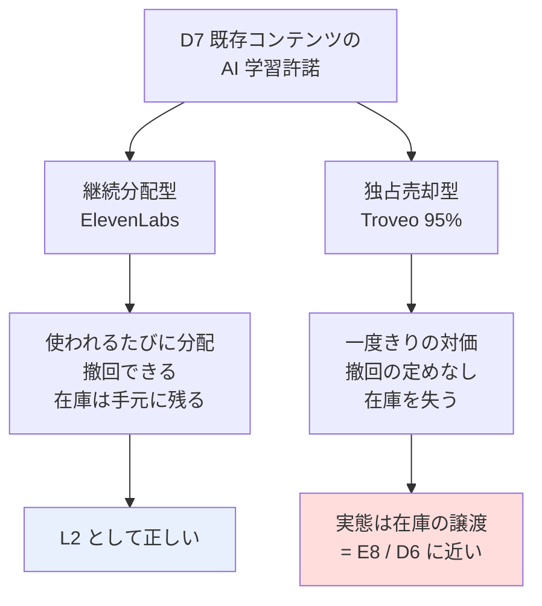

# D7 既存コンテンツの AI 学習許諾 — 調査と試算

調査日: 2026-08-27 / プラン: [docs/plans/archive/d7-content-licensing.md](../../plans/archive/d7-content-licensing.md)
方針: 机上調査のみ。登録・アップロード・許諾は行っていない。
読み方: [../overview.md](../overview.md) ／ 体系: [../income-taxonomy.md](../income-taxonomy.md)

## 結論: **声（ElevenLabs）は成立。動画（Troveo）は保留。写真は不成立**

> 2026-08-27 追記（残り論点の調査）: **ElevenLabs は日本が対応国リストに明示されていることを一次情報で確認**した。
> 同時に、初版で書いた Troveo の「独占＝在庫を失う」は**行き過ぎた解釈だったため訂正**する（詳細は権利条件の節）。

I7・I8・C4/C5 と違い、**時間あたりの収入は判定条件を満たす**。声・動画のどちらも、
投下時間あたりで B14（AI 開発者向け受託 $31〜65/時）を上回る。

### 判定条件との照合

| # | 条件 | 結果 |
| --- | --- | --- |
| 1 | 時間あたりで B14（$31〜65/時）を上回るか | **○ 上回る**。声 $96〜1,280/時、動画 $236/時。ただし**写真は不成立**（$0.0069/枚） |
| 2 | 日本から実際に受け取れるか | **声 ○ / 動画 ⚠**。ElevenLabs は対応 56 か国のリストに **Japan を明示**。Troveo は対応国・支払方法とも**依然として非公表** |
| 3 | ⚠ 許諾の不可逆性・独占性が許容できるか | **声 ○ 条件付き**（撤回可、ただし Notice Period との引き換え）。**動画は確定できない**（後述の訂正） |
| 4 | 継続収入か一度きりか | **どちらも継続分配**。Troveo も所有権保持のロイヤリティ方式と公式に明記されている（初版の記述を訂正） |

**種類別の結論**

| 種類 | 判定 | 残る条件 |
| --- | --- | --- |
| 声（ElevenLabs） | **成立** | 有料プラン（Starter 以上）の維持が必須。30 分の音声と voice captcha による本人確認。⚠ 日本語需要の裏付けは無い |
| 動画（Troveo） | **保留** | 対応国・支払方法・単価・最低要件が**すべて非公表**。契約は NDA 下のパートナーシップ契約で、条件が事前に見えない |
| 写真 | **不成立** | — |

## 試算

比較対象は B14（$31〜65/時）。1$ = 159.38 円。再計算: `experiments/d7-content-licensing/calc.py`

### 【声】ElevenLabs Voice Library — 成立する

前提: 月 $80〜320（稼いでいる creator の典型レンジ、第三者情報）。録音・登録は一度きり。

| 登録に要する時間 | 初年度収入 | 時間あたり | 判定 |
| ---: | ---: | ---: | :--: |
| 3 時間 | $960〜3,840 | $320〜1,280 | ○ |
| 10 時間 | $960〜3,840 | $96〜384 | ○ |
| 30 時間 | $960〜3,840 | $32〜128 | △（下限が B14 と拮抗） |

2 年目以降は**追加作業ゼロで継続**するため、時間あたりはさらに上がる。L2 の定義に合う。

### 【動画】Troveo — 数字は成立するが、在庫を失う

前提: 個人例 1,400 時間で $33,000/年 = **$23.6/時間・年**。作業を在庫 10 時間あたり 1 時間と仮定。

| 在庫 | 年収入 | 作業 | 時間あたり | 判定 |
| ---: | ---: | ---: | ---: | :--: |
| 10 時間 | $236（37,568 円） | 1.0h | $236 | ○ |
| 50 時間 | $1,179（187,841 円） | 5.0h | $236 | ○ |
| 100 時間 | $2,357（375,681 円） | 10.0h | $236 | ○ |
| 500 時間 | $11,786（1,878,407 円） | 50.0h | $236 | ○ |

収入も作業も在庫量に比例するため、**時間あたりは在庫量に依存しない**。少量でも比率は同じ。

**単価の乖離を検証した**: 第三者情報の $1〜4/分（= $60〜240/時間）と、個人例からの逆算 $23.6/時間・年 は
10 倍以上ずれる。これは**採用率**（提出したうち実際にライセンスされる割合）で説明がつく。

| 想定単価 | 説明に必要な採用率 | 妥当性 |
| --- | ---: | --- |
| $1/分 | 39.3% | 妥当な範囲 |
| $2/分 | 19.6% | 妥当な範囲 |
| $4/分 | 9.8% | 妥当な範囲 |

→ **在庫の 1〜4 割しか売れない**前提で見るべき。上表の $23.6/時間・年は採用率込みの実効値なので、そのまま使える。

### 【写真】Shutterstock / Wirestock — 不成立

| 枚数 | 累計収入 | 判定 |
| ---: | ---: | :--: |
| 1,000 枚 | $6.90（1,100 円） | × |
| 10,000 枚 | $69.00（10,997 円） | × |
| 100,000 枚 | $690.00（109,972 円） | △ |

⚠ Wirestock の最低支払額は PayPal $30 / Payoneer $50。**上表の多くは支払い閾値にすら届かない**。
時間あたり $31 に達するには 1 時間で 4,492 枚の登録が必要で、不可能。

## ⚠ 権利条件（一次情報で確認）

### ElevenLabs Voice Library Addendum — 撤回できるが、完全には戻らない

| 論点 | 規約の記述 |
| --- | --- |
| 撤回 | 「You may choose to remove a User Voice Model you shared through the Voice Library Service **at any time**」 |
| ただし | 「any Outputs generated using your User Voice Model **prior to the end of the Notice Period will continue to exist and remain available for use thereafter**」 |
| ただし | Notice Period 中は、削除前に追加した他ユーザーのアカウントで**引き続き利用可能** |
| ⚠ トレードオフ | **Notice Period を長く設定するほど報酬レートが上がる**。撤回しにくさと報酬が引き換えになっている |
| 報酬の決まり方 | 「rewards are calculated based on **factors that we determine**」= レートは**事業者裁量**。$0.03/1,000 文字はブログの公表値であって規約上の保証ではない |
| 独占性 | **記載なし** |
| ⚠ 学習利用 | **記載なし**。ElevenLabs 自身がモデル学習に使うかは規約から読み取れない |
| 悪用防止 | 「Live Moderation」は任意機能で、「**not guaranteed to, stop users**」と明記 |
| 国 | イリノイ州居住者を除外（生体情報保護法対応）。**日本は対応国リスト（56 か国）に明示あり**（2026-08-27 確認） |
| 税 | 「You are responsible for reporting and paying any applicable taxes」 |
| ⚠ 参加要件 | **有料プラン（Starter 以上）の維持が必須**。ほか 30 分の音声と voice captcha による本人確認 |
| 支払い | Stripe Connect。最低 $10、6〜8 日ごとに自動処理。通貨は USD（EEA・英国・スイスは現地通貨） |

→ ⚠ **ElevenLabs は「AI 学習許諾」ではなく「声モデルの貸出」**。D7 の定義とずれる（後述）。

### Troveo — 独占の意味が公開情報では確定できない（初版の記述を訂正）

⚠ **初版で「95% が独占契約 → 在庫を失う → 実質一度きりの売却」と書いたのは、行き過ぎた解釈だった。**
公式ページを当たったところ、逆の記述がある。

| 論点 | 内容 | 出所 |
| --- | --- | --- |
| 所有権 | 「**you retain full ownership**」「**you keep full ownership**」 | Troveo 公式（content-owners） |
| ライセンス回数 | 「retain full ownership rights, and an ability to **license their content an unlimited number of times**」 | Troveo 公式 |
| 収入の形 | オンボーディングは「パートナーシップ契約 → アップロード → 処理 1〜2 週間 → **AI ラボへライセンスされた際にロイヤリティ**」 | Troveo 公式 |
| 独占性 | 「7,000 ライセンサーのうち **95% が独占（exclusively）**」 | Morningstar / BusinessWire 経由のプレスリリース |
| 独占の定義 | 「an exclusive license means the rights holder **will not license the same data to others**」 | Troveo 公式（AI Data Licensing） |
| 付与する権利 | 「permission to **reproduce and process the content to train, fine-tune, and evaluate** machine learning models」 | Troveo 公式 |
| 撤回 | **明示なし** | — |
| 単価・対応国・最低要件 | **すべて非公表**。契約は NDA 下 | — |

**この 2 つは矛盾して見える。** 考えられる読みは 2 つある。

1. 「独占」は **Troveo を唯一の窓口にする**という意味（他の集約サービスに出さない）。所有権も他用途の利用も残る
2. 「独占」は **そのデータを他ラボにライセンスしない**という意味（Troveo 自身の定義がこちら）。この場合、
   Troveo 経由でも 1 社にしか売れないことになり、「unlimited number of times」と整合しない

**公開情報では確定できない。** 契約書は NDA 下のパートナーシップ契約で、条件は事前に見えない。

→ 訂正の要点: **在庫を失うとは言えない**（所有権保持は公式が明記）。一方で独占条件は不明のままなので、
リスクは「在庫の喪失」ではなく「**条件が事前に分からないまま契約する**」ことにある。

## ⚠ 未確認のまま残った論点

| 論点 | 状態 | なぜ重要か |
| --- | --- | --- |
| ~~日本からの受取可否（声）~~ | **解決（2026-08-27）**。ElevenLabs の対応 56 か国に Japan が明示 | — |
| 日本からの受取可否（動画） | **未確認**。Troveo は対応国・支払方法とも非公表 | 受け取れなければ全部が無意味 |
| 日本語音声の需要 | **不明** | 月 $80〜320 は英語圏の値。日本語は 32 言語の 1 つで、需要規模の裏付けがない |
| 日本語話者の実例 | **見つからず**（再調査でも発見できず） | ⚠ I7 で「実例ゼロ」が打ち切りの決め手になった。**同じ警戒が要る** |
| ElevenLabs 分配の中央値 | **分布不明** | 10,400 人は「稼いでいる creator」の数。登録したが稼げていない人は分母に入っていない可能性 |
| Troveo の独占条件 | **確定できない** | 公式の「所有権保持・無制限ライセンス」と「95% が独占」が整合しない。契約は NDA 下 |
| AILAS（国内の窓口） | 収益還元は「契約条件に従って」で**額は非公開**、実績も不明 | 国内経路の有無 |

### ⚠ 声で固定費が発生する（新たに判明）

ElevenLabs は**有料プラン（Starter 以上）の維持が受取の条件**。Starter は **$6/月（年払い $60）**。

| 項目 | 値 |
| --- | ---: |
| 年間の固定費 | $60（年払い時） |
| 分岐点（$0.03/1,000 文字 の既定レート時） | 年 **200 万文字** = 月 約 167,000 文字 |
| 音声に換算すると（1,000 文字 ≒ 90 秒） | 月 **約 4.2 時間**、自分の声が有料ユーザーに使われれば黒字 |

→ 月 $80〜320 稼ぐ層なら固定費は誤差。ただし**まったく使われなければ年 $60 の赤字**になる。
「在庫があれば追加労働ほぼゼロ」は正しいが、**コストはゼロではない**。

## 体系へのフィードバック: D7 は 2 つの形が混在している

調査の結果、D7 に分類した 2 つの経路は**関与度も収入の形も違う**ことが分かった。

> **訂正（2026-08-27）**: 初版はここで「継続分配型と独占売却型が混在している」としたが、
> Troveo も公式には**所有権保持のロイヤリティ方式**であり、**どちらも継続分配型**だった。分割の根拠は弱い。

- **継続分配型**（ElevenLabs）は L2 の定義に合う。初回だけ関与し、以後は使われた分が入る
- **Troveo も同じくロイヤリティ方式**。ただし「95% が独占」の意味が確定できないため、
  実態が継続分配のままなのか、独占により 1 社への売り切りに近づくのかは**公開情報では判別できない**
- したがって **D7 の分割は保留**する。分けるべきは「継続 / 売却」ではなく、
  **条件が事前に見えるか（ElevenLabs = 規約公開）／見えないか（Troveo = NDA 下の個別契約）**かもしれない

**残る体系上の論点**: ElevenLabs は規約上「声モデルの貸出」であって、
ElevenLabs 自身がモデル学習に使うかは規約から読み取れない。
D7 を「AI 学習許諾」と定義したが、実際に売っているものは**学習データとは限らない**。
**D7 の定義（何を許諾しているのか）は依然として詰め直す必要がある。**

## 次のアクション

| # | 内容 | 状態 |
| --- | --- | --- |
| 1 | ElevenLabs の対応国確認 | **完了（2026-08-27）**。Japan は対応 56 か国に含まれる |
| 2 | 日本語音声・日本の映像の**実例**を探す | **完了・見つからず**。⚠ I7 と同じ形として警戒が要る |
| 3 | Troveo の対応国・支払方法 | **未完了**。公開情報に無いため、問い合わせないと確定しない（登録は不要） |
| 4 | 手持ちの**声・動画**の在庫量を数える | **未完了**（写真は除外してよい） |

**判断が要る点**: 声は日本から受け取れることが確定し、固定費も年 $60 と小さい。
一方で**日本語話者の実例が 1 件も見つかっていない**。これは I7 を打ち切った理由と同じ形であり、
月 $80〜320 という数字が日本語話者に当てはまる保証はどこにもない。

→ 実例が無いまま進めるかどうかは、**投じるものが小さい**（年 $60 + 録音数時間）ことをどう見るかによる。
I7（打ち切り）との違いは、**ここでは失敗しても失うものがほぼ無い**点にある。

## 出典（すべて 2026-08-27 取得）

- [ElevenLabs — The ElevenLabs Voice Library Addendum（規約一次情報）](https://elevenlabs.io/vla)
- [ElevenLabs — What are Voice Actor Payouts?（docs）](https://elevenlabs.io/docs/help-center/product/monetization-business/payouts/what-are-voice-actor-payouts)
- [ElevenLabs — $22M earned by voice creators, doubling in 6 months](https://elevenlabs.io/blog/22-million-earned-by-voice-creators-on-elevenlabs)
- [ElevenLabs — How to monetize your voice with ElevenLabs Voice Library](https://elevenlabs.io/blog/monetize-your-voice-with-elevenlabs-voice-library-and-create-passive-income)
- [ElevenLabs — Voice Library（product guide）](https://elevenlabs.io/docs/product-guides/voices/voice-library)
- [ElevenLabs — How do I delete a voice I've shared with the Voice Library?](https://help.elevenlabs.io/hc/en-us/articles/27948860521745-How-do-I-delete-a-voice-I-ve-shared-with-the-Voice-Library)
- [Troveo — AI Data Licensing in 2026: How Deals Work and What Data Costs](https://www.troveo.ai/resources/ai-data-licensing)
- [Morningstar — Troveo Announces $20 Million in Payouts（7,000 ライセンサー、95% 独占）](https://www.morningstar.com/news/business-wire/20260428319383/troveo-accelerates-ai-model-development-expands-ai-training-data-platform-to-five-new-categories-announces-20-million-in-payouts)
- [The Seattle Times — YouTubers profit as AI companies search for unused video footage](https://www.seattletimes.com/business/youtubers-profit-as-ai-companies-search-for-unused-video-footage/)
- [ElevenLabs — Payouts（対応 56 か国のリスト。Japan を含む）](https://elevenlabs.io/docs/eleven-creative/voices/payouts)
- [ElevenLabs — What countries do you support for Voice Actor Payouts with Stripe Connect?](https://help.elevenlabs.io/hc/en-us/articles/22975638535185-What-countries-do-you-support-for-Voice-Actor-Payouts-with-Stripe-Connect)
- [ElevenLabs — Earn with Your Voice（30 分の音声・voice captcha）](https://elevenlabs.io/payouts)
- [Troveo — License Your Content to Top AI Companies（所有権保持の明記）](https://www.troveo.ai/content-owners)
- [Wirestock — Terms of Use](https://wirestock.io/docs/terms-of-use)
- [AILAS 公式サイト](https://ailas.or.jp/)
- [PC Watch — AI 学習用音声の管理/追跡するシステム構築に向けた団体「AILAS」設立](https://pc.watch.impress.co.jp/docs/news/1603695.html)
- 単価・分配の一部は [i7-dataset.md 1-B](i7-dataset.md) の 2026-08-26 時点の調査を再利用
