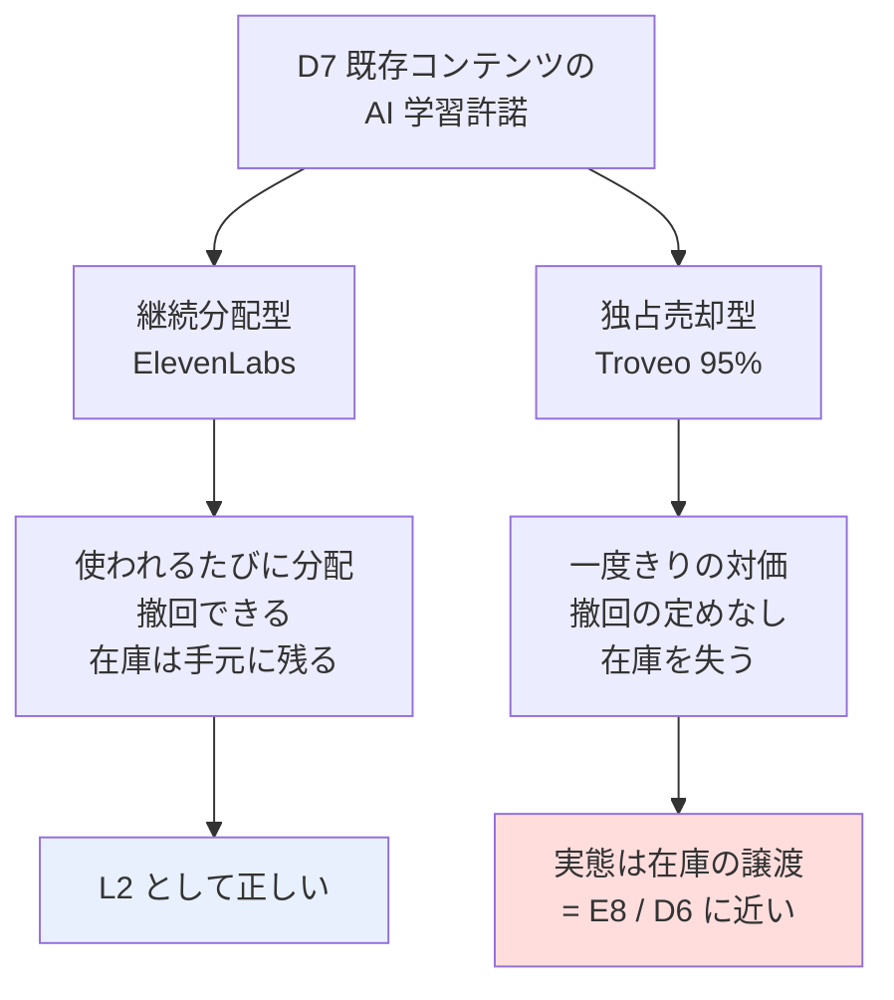

# D7 既存コンテンツの AI 学習許諾 — 調査と試算

調査日: 2026-08-27 / プラン: [docs/plans/archive/d7-content-licensing.md](../../plans/archive/d7-content-licensing.md)
方針: 机上調査のみ。登録・アップロード・許諾は行っていない。

## 結論: **条件付きで成立**（打ち切りではない）

I7・I8・C4/C5 と違い、**時間あたりの収入は判定条件を満たす**。声・動画のどちらも、
投下時間あたりで B14（AI 開発者向け受託 $31〜65/時）を上回る。

ただし採否は確定しない。**日本からの受取可否が、一次情報で確認できなかった**ため。
これは着手前に潰せる論点なので、次のアクションとして残す。

### 判定条件との照合

| # | 条件 | 結果 |
| --- | --- | --- |
| 1 | 時間あたりで B14（$31〜65/時）を上回るか | **○ 上回る**。声 $96〜1,280/時、動画 $236/時。ただし**写真は不成立**（$0.0069/枚） |
| 2 | 日本から実際に受け取れるか | **⚠ 未確認**。ElevenLabs は Stripe Connect 経由だが対応国の明記なし。Troveo は対応国・支払方法とも**完全非公表** |
| 3 | ⚠ 許諾の不可逆性・独占性が許容できるか | **種類による**。ElevenLabs は撤回可（条件付き）。**Troveo は 95% が独占契約**で在庫を失う |
| 4 | 継続収入か一度きりか | **混在している**。ElevenLabs は継続分配、Troveo の独占は実質一度きりの売却 → 体系上の問題（後述） |

## 試算

比較対象は B14（$31〜65/時）。1$ = 159.38 円。再計算: `experiments/d7-content-licensing/calc.py`

### 【声】ElevenLabs Voice Library — 成立する

前提: 月 $80〜320（稼いでいる creator の典型レンジ、第三者情報）。録音・登録は一度きり。

| 登録に要する時間 | 初年度収入 | 時間あたり | 判定 |
| ---: | ---: | ---: | :--: |
| 3 時間 | $960〜3,840 | $320〜1,280 | ○ |
| 10 時間 | $960〜3,840 | $96〜384 | ○ |
| 30 時間 | $960〜3,840 | $32〜128 | △（下限が B14 と拮抗） |

2 年目以降は**追加作業ゼロで継続**するため、時間あたりはさらに上がる。L2 の定義に合う。

### 【動画】Troveo — 数字は成立するが、在庫を失う

前提: 個人例 1,400 時間で $33,000/年 = **$23.6/時間・年**。作業を在庫 10 時間あたり 1 時間と仮定。

| 在庫 | 年収入 | 作業 | 時間あたり | 判定 |
| ---: | ---: | ---: | ---: | :--: |
| 10 時間 | $236（37,568 円） | 1.0h | $236 | ○ |
| 50 時間 | $1,179（187,841 円） | 5.0h | $236 | ○ |
| 100 時間 | $2,357（375,681 円） | 10.0h | $236 | ○ |
| 500 時間 | $11,786（1,878,407 円） | 50.0h | $236 | ○ |

収入も作業も在庫量に比例するため、**時間あたりは在庫量に依存しない**。少量でも比率は同じ。

**単価の乖離を検証した**: 第三者情報の $1〜4/分（= $60〜240/時間）と、個人例からの逆算 $23.6/時間・年 は
10 倍以上ずれる。これは**採用率**（提出したうち実際にライセンスされる割合）で説明がつく。

| 想定単価 | 説明に必要な採用率 | 妥当性 |
| --- | ---: | --- |
| $1/分 | 39.3% | 妥当な範囲 |
| $2/分 | 19.6% | 妥当な範囲 |
| $4/分 | 9.8% | 妥当な範囲 |

→ **在庫の 1〜4 割しか売れない**前提で見るべき。上表の $23.6/時間・年は採用率込みの実効値なので、そのまま使える。

### 【写真】Shutterstock / Wirestock — 不成立

| 枚数 | 累計収入 | 判定 |
| ---: | ---: | :--: |
| 1,000 枚 | $6.90（1,100 円） | × |
| 10,000 枚 | $69.00（10,997 円） | × |
| 100,000 枚 | $690.00（109,972 円） | △ |

⚠ Wirestock の最低支払額は PayPal $30 / Payoneer $50。**上表の多くは支払い閾値にすら届かない**。
時間あたり $31 に達するには 1 時間で 4,492 枚の登録が必要で、不可能。

## ⚠ 権利条件（一次情報で確認）

### ElevenLabs Voice Library Addendum — 撤回できるが、完全には戻らない

| 論点 | 規約の記述 |
| --- | --- |
| 撤回 | 「You may choose to remove a User Voice Model you shared through the Voice Library Service **at any time**」 |
| ただし | 「any Outputs generated using your User Voice Model **prior to the end of the Notice Period will continue to exist and remain available for use thereafter**」 |
| ただし | Notice Period 中は、削除前に追加した他ユーザーのアカウントで**引き続き利用可能** |
| ⚠ トレードオフ | **Notice Period を長く設定するほど報酬レートが上がる**。撤回しにくさと報酬が引き換えになっている |
| 報酬の決まり方 | 「rewards are calculated based on **factors that we determine**」= レートは**事業者裁量**。$0.03/1,000 文字はブログの公表値であって規約上の保証ではない |
| 独占性 | **記載なし** |
| ⚠ 学習利用 | **記載なし**。ElevenLabs 自身がモデル学習に使うかは規約から読み取れない |
| 悪用防止 | 「Live Moderation」は任意機能で、「**not guaranteed to, stop users**」と明記 |
| 国 | イリノイ州居住者を除外（生体情報保護法対応）。**日本の可否は記載なし** |
| 税 | 「You are responsible for reporting and paying any applicable taxes」 |

→ ⚠ **ElevenLabs は「AI 学習許諾」ではなく「声モデルの貸出」**。D7 の定義とずれる（後述）。

### Troveo — 独占が既定路線

| 論点 | 内容 |
| --- | --- |
| 独占性 | **7,000 ライセンサーのうち 95% が独占契約**。非独占は「より安い」 |
| 付与する権利 | 「permission to **reproduce and process the content to train, fine-tune, and evaluate** machine learning models」 |
| 撤回 | **明示なし**。契約期間満了時に「既に学習済みのモデルが影響を受けるか」を定める例が増えている、という記述にとどまる |
| 単価・対応国・最低要件 | **一次情報ではすべて非公表** |

→ こちらは定義通りの「AI 学習許諾」。ただし**独占＝その素材を以後自分で使えない**。金額以前の判断が要る。

## ⚠ 未確認のまま残った論点

| 論点 | 状態 | なぜ重要か |
| --- | --- | --- |
| 日本からの受取可否 | **未確認**（ElevenLabs・Troveo とも対応国の明記なし） | 受け取れなければ全部が無意味 |
| 日本語音声の需要 | **不明** | 月 $80〜320 は英語圏の値。日本語は 32 言語の 1 つで、需要規模の裏付けがない |
| 日本語話者の実例 | **見つからず** | I7 で「実例ゼロ」が打ち切りの決め手になった。同じ警戒が要る |
| ElevenLabs 分配の中央値 | **分布不明** | 10,400 人は「稼いでいる creator」の数。登録したが稼げていない人は分母に入っていない可能性 |
| AILAS（国内の窓口） | 収益還元は「契約条件に従って」で**額は非公開**、実績も不明 | 国内経路の有無 |

## 体系へのフィードバック: D7 は 2 つの形が混在している

調査の結果、D7 に分類した 2 つの経路は**関与度も収入の形も違う**ことが分かった。

- **継続分配型**（ElevenLabs）は L2 の定義に合う。初回だけ関与し、以後は使われた分が入る
- **独占売却型**（Troveo）は L2 ではない。**在庫を手放して一度きりの対価を得る**ので、
  体系上は E8（保有資産の譲渡益）や D6（権利の買取）と同じ形をしている
- I7 を B14（受託）と D7（許諾）に分割したときと**同じ構造の見落とし**。
  「許諾」という言葉が、継続分配と譲渡という別の取引を覆い隠していた
- 起票: D7 の分割（または備考での明示）を体系の保守タスクへ

なお、ElevenLabs は規約上「モデルの貸出」であって学習許諾かどうかも読み取れない。
**D7 の定義自体（何を許諾しているのか）を詰め直す必要がある。**

## 次のアクション（着手前に潰せる）

1. ElevenLabs / Troveo の**対応国リストと支払い方法**を確認する（サポートへの問い合わせで確定する。登録は不要）
2. 日本語音声・日本の映像で**実際に分配を受けた実例**を探す。見つからなければ I7 と同じ形として警戒する
3. 手持ちの在庫量を数える（**写真は除外してよい**。声と動画のみ）

## 出典（すべて 2026-08-27 取得）

- [ElevenLabs — The ElevenLabs Voice Library Addendum（規約一次情報）](https://elevenlabs.io/vla)
- [ElevenLabs — What are Voice Actor Payouts?（docs）](https://elevenlabs.io/docs/help-center/product/monetization-business/payouts/what-are-voice-actor-payouts)
- [ElevenLabs — $22M earned by voice creators, doubling in 6 months](https://elevenlabs.io/blog/22-million-earned-by-voice-creators-on-elevenlabs)
- [ElevenLabs — How to monetize your voice with ElevenLabs Voice Library](https://elevenlabs.io/blog/monetize-your-voice-with-elevenlabs-voice-library-and-create-passive-income)
- [ElevenLabs — Voice Library（product guide）](https://elevenlabs.io/docs/product-guides/voices/voice-library)
- [ElevenLabs — How do I delete a voice I've shared with the Voice Library?](https://help.elevenlabs.io/hc/en-us/articles/27948860521745-How-do-I-delete-a-voice-I-ve-shared-with-the-Voice-Library)
- [Troveo — AI Data Licensing in 2026: How Deals Work and What Data Costs](https://www.troveo.ai/resources/ai-data-licensing)
- [Morningstar — Troveo Announces $20 Million in Payouts（7,000 ライセンサー、95% 独占）](https://www.morningstar.com/news/business-wire/20260428319383/troveo-accelerates-ai-model-development-expands-ai-training-data-platform-to-five-new-categories-announces-20-million-in-payouts)
- [The Seattle Times — YouTubers profit as AI companies search for unused video footage](https://www.seattletimes.com/business/youtubers-profit-as-ai-companies-search-for-unused-video-footage/)
- [Wirestock — Terms of Use](https://wirestock.io/docs/terms-of-use)
- [AILAS 公式サイト](https://ailas.or.jp/)
- [PC Watch — AI 学習用音声の管理/追跡するシステム構築に向けた団体「AILAS」設立](https://pc.watch.impress.co.jp/docs/news/1603695.html)
- 単価・分配の一部は [i7-dataset.md 1-B](i7-dataset.md) の 2026-08-26 時点の調査を再利用
