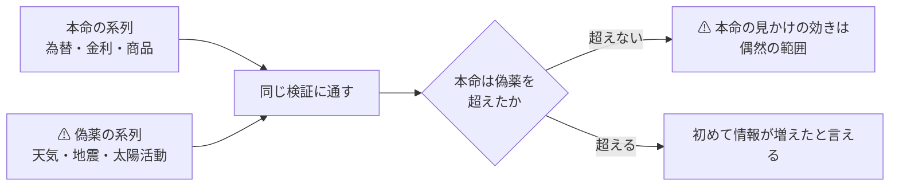

# 日次データの取得元（為替 ＋ 無関係に見えるものも含めて）

調査日: 2026-09-08（**進行中**）。プラン: [docs/plans/daily-data-sources.md](../../plans/daily-data-sources.md)
派生元: [特徴量を見つけ出す手法の検証 §9-2](feature-discovery.md)（**次に変えるなら推定器ではなく入力**）
関連: [market-data-availability.md](../market-data-availability.md)（2026-09-01 の 96 件）／ [rules.md](feature-discovery/rules.md)

> ⚠ **これは投資助言ではなく調査資料である。**
> ⚠ **資金は動かしていない**（2026-08-27 の方針）。有償のデータは購読していない。

## 0. ここまでで分かったこと

⚠ **一番大きい発見は「取れるか」ではなく「取ってよいか」のほうに出た。**

| # | 分かったこと |
| ---: | --- |
| 1 | ⚠ **FRED の規約は「データマイニング・スクレイピング・抽出をするな」と書いている。** ⚠ **正規の経路は無料 API（鍵が要る）**であり、⚠ **本プロジェクトが 2026-09-01 に採用した `fredgraph.csv` の直叩きは規約の側から見て正規の経路ではない**（§2-1） |
| 2 | ⚠ **天気は Open-Meteo ではなく NOAA を採る。** Open-Meteo は **CC BY-NC 4.0（非商用のみ）**だが、⚠ **NOAA は米政府の著作物で制限が無い**（§2-2） |
| 3 | ⚠ **為替は ECB から鍵なしで日次・1999 年から取れた**（§3-1）。FRED を経由しなくてよい |
| 3-2 | ⚠ **判断の外側の 4 経路・25 系列を取得して層に置いた**（§3-4）。⚠ **これで情報源が価格 1 種類だけではなくなった** |
| 4 | ⚠ **「無関係に見える」系列は実際に取れる。** 地震・太陽黒点・気象はいずれも日次で長期が揃う（§3-2） |
| 5 | ⚠ **利用者の判断が要るものが 2 件ある**（§4）。⚠ **どちらも「取れない」ではなく「本プロジェクトが非商用と言えるか」の問題** |

## 1. なぜ「無関係に見えるもの」を入れるのか

⚠ **前のタスクは価格だけで方向が出ずに閉じた。** だから入力を増やす。
⚠ **ただし系列をたくさん足すのは、そのままだと多重検定の温床である**（[rules.md 11 章](feature-discovery/rules.md) 規約 4）。

> この図の主張: ⚠ **無関係な系列は「捨てる候補」ではなく「物差し」である。** 本命がそれを超えられないなら、本命も偶然である。



⚠ **取得の時点で本命 / 偽薬を宣言する。** ⚠ **結果を見てから分類すると、ただの後付けになる。**

## 2. 規約の判定（Phase 1）

⚠ **「取れるか」より先に「取ってよいか」で落ちる。** ここを飛ばすと後で全部やり直しになる。

| 取得元 | robots.txt【実測 2026-09-08】 | 規約 | 判定 |
| --- | --- | --- | :-: |
| **FRED** | ⚠ **禁止は `/graph/fredgraph.png`（画像）など 6 パス。** ⚠ **CSV は対象外**。`User-agent: *` に `Crawl-delay: 1` | ⚠ **「Don't do any data mining, scraping or extraction of FRED data.」／「Make a sweet app using our FRED through our free API」** | ⚠ **要判断** |
| **ECB**（`data-api.ecb.europa.eu`） | 一般的なもの（API パスの禁止なし） | 公開データの配信 API | ✅ |
| **NOAA NCEI**（気象） | 無し（404） | ⚠ **米政府の著作物**（17 U.S.C. §105） | ✅ |
| **NOAA SWPC**（太陽・地磁気） | 無し（404） | 同上 | ✅ |
| **USGS**（地震） | 無し（404） | 同上 | ✅ |
| **米財務省**（イールド） | — | 同上 | ✅ |
| **連邦準備制度**（H.10） | 無し（404） | 同上 | ✅ |
| **Open-Meteo** | ⚠ **API ホストは `Disallow: /`**。本体サイトは `Allow: /` | ⚠ **CC BY-NC 4.0。非商用のみ**。⚠ **API の利用そのものは規約が明示的に許可**（10,000 回/日・5,000 回/時・600 回/分） | ⚠ **要判断** |
| **SILSO**（黒点） | — | ⚠ **CC BY-NC 4.0** ＋ 出典表示の要請 | ⚠ **要判断** |
| **EIA**（電力） | — | ⚠ **無料の鍵が要る**（`API_KEY_MISSING`） | 保留 |
| **GDELT**（ニュース量） | 無し（404） | 未確認 | 保留 |

### 2-1. ⚠ FRED — 既に採用している経路が、規約の側から見て正規ではない

⚠ **[market-data-availability.md §3-1](../market-data-availability.md) は `fredgraph.csv` を「実測できた 7 経路」の 1 番目に置いている。**
⚠ **技術的には取れるし、`robots.txt` も CSV を禁じていない。** ⚠ **しかし規約の FAQ にはこう書いてある。**

| 場所 | 文面【公表値 2026-09-08 取得】 |
| --- | --- |
| FRED FAQ「What can I do with FRED data?」 | 「Make a sweet app using our FRED through our **free API**」 |
| FRED FAQ「What can't I do with FRED data?」 | ⚠ **「Don't do any data mining, scraping or extraction of FRED data.」** |
| 同 | ⚠ **著作権表示のある系列は第三者のもので、個人利用を超えるなら権利者の許諾が要る**（セントルイス連銀は許諾を与えられない） |

⚠ **本調査では、この文面を読んだ時点で FRED の実測（23 系列の予定）を途中で止めた。**
⚠ **`robots.txt` が許していても、規約が別のことを言っているなら規約が上である**（Stooq のときと同じ立て方）。

**取りうる道は 3 つ。**

| 道 | 中身 | ⚠ 効き方 |
| --- | --- | --- |
| **A** | ⚠ **無料の API キーを取り、公式 API を使う** | ⚠ **規約が名指しで勧めている経路。** 登録は無料・読み取り専用で、⚠ **売買口座の登録とは別物** |
| **B** | ⚠ **FRED を経由せず一次情報から取る** | ⚠ **為替は ECB と連邦準備制度から直接取れる**（§3-1）。⚠ **FRED は集約者であって発表元ではない** |
| **C** | FRED を使わない | 金利・商品・信用スプレッドの手軽な経路を失う |

⚠ **本調査は B を既定にした**（§3-1 は ECB で実測した）。⚠ **A を採るかは利用者の判断**（§4）。

### 2-2. ⚠ 天気 — Open-Meteo ではなく NOAA を採った

⚠ **Open-Meteo の API ホストは `robots.txt` で `Disallow: /` を返す。** ⚠ **ただしこれだけで「採らない」とはしない。**
規約が **API の利用を明示的に許可している**からで、⚠ **Stooq のように 3 つの意思表示が同じ向きを指す状況ではない。**

⚠ **落ちるとすれば別の理由である。** ⚠ **CC BY-NC 4.0 の「非商用のみ」**で、
⚠ **本プロジェクトは「AI を使って収入を稼ぐ方法を体系化する」ことを目的に掲げている**（[CLAUDE.md](../../../CLAUDE.md)）。
⚠ **クリエイティブ・コモンズの非商用の定義は「主として商業的利益または金銭的報酬に向けられていないこと」**なので、⚠ **本プロジェクトが非商用だと言い切れない。**

⚠ **NOAA なら、この判断そのものが要らない。** ⚠ **米政府の著作物には著作権が無い**ので、非商用の条件が付かない。
⚠ **同じ理由で、太陽黒点も SILSO（CC BY-NC）より NOAA / NASA 側の系列を探すほうがよい**（§5 の残作業）。

## 3. 実測（Phase 2）

⚠ **いずれも 2026-09-08 に 1 回だけ取得し、行数・期間・粒度を目視で確かめた。**

### 3-1. 為替（利用者の指名）

| 経路 | 実測【2026-09-08】 | 鍵 | 判定 |
| --- | --- | :-: | :-: |
| **ECB `data-api.ecb.europa.eu`** | ⚠ **EUR/JPY 日次 7,150 行・1999-01-04 〜 2026-09-08**（当日ぶんまで）。CSV・8 列 | ⚠ **不要** | ✅ |
| 連邦準備制度 H.10 | 入口の HTML は取れた（81KB）。⚠ **データ本体は Data Download Program 経由で、URL の組み立てが未確定** | 不要 | ⏳ |
| FRED `DEX*` 系列 | ⚠ **規約により実測を中止**（§2-1） | — | ⚠ |

⚠ **ECB は「ユーロを軸にした参照相場」である。** USD/JPY が要るなら EUR/USD と EUR/JPY から組む。
⚠ **参照相場は 1 日 1 回（中央欧州時間 14:15 ごろ）の値で、取引の終値ではない。** ⚠ **日中の値動きは入っていない。**

### 3-2. ⚠ 偽薬（値動きと因果が想定できないもの）

| 系列 | 経路 | 実測【2026-09-08】 | 権利 | 判定 |
| --- | --- | --- | --- | :-: |
| **気象**（最高・最低気温、降水） | NOAA NCEI GHCN-Daily | ⚠ **3,166 日・2018-01-01 〜 2026-09-01**（ニューヨーク 1 地点）。列は `STATION,DATE,PRCP,TMAX,TMIN` | 米政府の公有 | ✅ |
| **地震** | USGS FDSN | ⚠ **M5 以上が 2018-01-01 〜 2026-09-01 で 15,621 件。** 1 回の要求で件数が取れ、日次に畳める | 米政府の公有 | ✅ |
| **太陽黒点**（日次） | SILSO | ⚠ **76,214 行・1818-01-01 〜 2026-08-31** | ⚠ **CC BY-NC** | ⚠ 要判断 |
| 太陽活動（月次） | NOAA SWPC | 3,332 点。⚠ **月次なので日次の検証には使えない** | 米政府の公有 | ❌ 粒度 |
| **地磁気**（Kp 指数） | NOAA SWPC | ⚠ **直近 30 日だけ。** 長期は別経路（GFZ 等）が要る | 米政府の公有 | ⏳ |
| 月齢 | ⚠ **取得不要** | 暦から計算で出る | — | ✅ |

### 3-3. 本命（値動きと因果が想定できるもの）

| 系列 | 経路 | 実測【2026-09-08】 | 判定 |
| --- | --- | --- | :-: |
| 米国債イールド（日次・全年限） | 米財務省 | ⚠ **250 営業日/年・14 列**（2024 年ぶん） | ✅ |
| 金（LBMA 建値） | LBMA | 14,673 件・1968-04-01 〜（[2026-09-01 の実測](../market-data-availability.md)） | ✅ |
| 暗号資産 | Kraken | 約定 1 本ずつ（[同上](../market-data-availability.md)） | ✅ |
| ニュースの量 | GDELT | 1 か月の要求で 32 点（日次相当）。⚠ **規約は未確認** | ⏳ |
| 金利・商品・信用スプレッド | ⚠ **FRED しか手軽な経路が無い** | §2-1 の判断待ち | ⚠ |

## 3-4. 取得した結果【実測 2026-09-08】

⚠ **判断の外側にある 4 経路・25 系列を `data/raw/<取得元>/series/` に置いた**（[rules.md 1 章](feature-discovery/rules.md) の層）。

```bash
python3 -m cli.fetch --exog exog_daily
```

| 取得元 | 枠 | 系列 | 1 系列の行 | 期間 |
| --- | :-: | ---: | ---: | --- |
| **ECB**（為替・対ユーロ） | 本命 | **7** | **7,088**（CNY のみ 6,821） | 1999-01-04 〜 2026-09-08 |
| **米財務省**（イールドカーブ） | 本命 | **7** | **2,171** | 2018-01-02 〜 2026-09-08 |
| **NOAA**（気象・3 地点 × 3 要素） | ⚠ **偽薬** | **9** | **3,166** | 2018-01-01 〜 2026-09-01 |
| **USGS**（地震） | ⚠ **偽薬** | **2** | **3,094** | 2018-01-02 〜 2026-08-31 |
| | | **25** | | |

⚠ **値の妥当性を目視で確かめた**: EUR/USD 0.83〜1.60（最新 1.16）／ 米 10 年 0.52〜4.98%（最新 4.80%。
[2026-09-01 の実測 4.79%](../market-data-availability.md) と整合）／ 気温は 10 分の 1 度で
ニューヨーク −10.5〜37.8℃・シカゴ −23.2〜37.8℃・ロサンゼルス 11.1〜38.9℃ ／ 地震は 1 日 1〜143 件・最大 M8.8。

### 3-5. ⚠ 地震だけ「行が無い日」の意味が違う

| | |
| --- | ---: |
| 期間の日数 | 3,165 |
| 行 | 3,094 |
| ⚠ **行が無い日** | ⚠ **71** |

⚠ **これは「値が不明な日」ではなく「M5 以上が 0 件だった日」である**（最小値が 1 で、0 の行が存在しない）。
⚠ **特徴量にするときは 0 で埋める。** ⚠ **前方埋めや欠損扱いにすると、地震が起きなかった日に前日の件数が入る。**
⚠ **他の 3 経路は休日で行が無いだけなので、こちらは埋めてはいけない。** 埋め方が系列で違う。

## 4. ⚠ 利用者の判断が要る 2 件

⚠ **どちらも「取れない」ではない。** ⚠ **本プロジェクトをどう位置づけるかで決まる。**

| # | 問い | 影響する取得元 | ⚠ 補足 |
| ---: | --- | --- | --- |
| 1 | ⚠ **FRED の無料 API キーを取るか** | FRED（金利・商品・信用スプレッド・指数） | ⚠ **登録は無料・読み取り専用で、売買口座の登録とは別物。** 規約が名指しで勧めている経路。⚠ **取らないなら一次情報を個別に当たることになり、手間は増えるが権利関係は明快** |
| 2 | ⚠ **本プロジェクトを「非商用」と言えるか** | Open-Meteo（天気）・SILSO（黒点） | ⚠ **プロジェクトの目的は「収入を稼ぐ方法の体系化」**なので、言い切れない。⚠ **言えないなら NOAA など公有の経路だけを使う**（天気は代替がある。黒点は代替を探す必要がある） |

⚠ **1 と 2 のどちらも「No」でも調査は進む。** ⚠ **為替（ECB）・気象（NOAA）・地震（USGS）・イールド（財務省）は判断の外側で、すでに使える。**

## 5. 残っている作業

| # | 残作業 | ⚠ 注意 |
| ---: | --- | --- |
| 1 | 連邦準備制度 H.10 の Data Download Program の URL を確定する | ⚠ **推測で組んだ URL は失敗した。** 一次情報から組み立てる |
| 2 | 地磁気（Kp）の長期履歴の経路 | NOAA は直近 30 日だけ |
| 3 | 太陽黒点の**公有**の日次経路 | SILSO は CC BY-NC |
| 4 | GDELT の規約確認 | 未確認のまま使わない |
| 5 | ⚠ **`ex_` 層の実装**（外部系列を特徴量にする） | ⚠ **必ず 1 日以上ずらす**（[プラン §2-4](../../plans/daily-data-sources.md)） |

## 6. ⚠ この調査の限界

| # | 限界 | ⚠ 効き方 |
| ---: | --- | --- |
| 1 | ⚠ **改定される系列は「その時に知り得た値」ではない** | ⚠ **改定履歴を持たない限り、過去の検証は楽観的になる** |
| 2 | ⚠ **発表の遅れを測っていない** | ⚠ **「その日のデータ」が「その日に手に入る」とは限らない。** 既定で 1 日ずらす |
| 3 | ⚠ **無登録で取れるものに偏っている** | ⚠ **「効くデータが無い」ではなく「方針の内側では取れない」** |
| 4 | 気象は 1 地点しか測っていない | 地点を増やすと系列数が増え、多重検定が厳しくなる |
| 5 | ⚠ **系列を足すほど `n_trials` が増える** | ⚠ **偽薬を置いても補正そのものは免除されない。** 25 系列を足した時点で試行数は 36 から増える |
| 6 | ⚠ **欠けた日の意味が系列で違う**（§3-5） | ⚠ **地震は 0 埋め、他は休日として穴のまま。** 一律に埋めると嘘になる |
| 7 | ⚠ **ECB は対ユーロの参照相場**（1 日 1 回の値） | ⚠ **取引の終値ではなく、日中の値動きも入っていない。** USD/JPY は 2 本から組む |

## 7. 銘柄を増やす — 相関の低いものを選ぶ【実測 2026-09-09】

### 7-1. ⚠ 銘柄数を増やしても標本はほとんど増えない

⚠ **会社株どうしの相関は 0.341。** ⚠ **同じ大型株を何本足しても、実効系列数は頭打ちになる。**

| 銘柄数 | 実効系列数 | 1 銘柄あたり |
| ---: | ---: | ---: |
| 5 | 3.34 | 0.667 |
| 10 | 4.48 | 0.448 |
| 20 | 5.63 | 0.281 |
| 48 | **6.47** | **0.135** |

⚠ **相関が一様に ρ = 0.346 なら、銘柄数を無限にしたときの上限は 1/ρ² = 8.35 本。**
⚠ **48 銘柄で既に上限の 77% に達している。** 500 銘柄まで増やしても 8.23 本（×1.27）にしかならない。

⚠ **t 値はこの平方根で効く**ので、⚠ **銘柄を 10 倍にしても t は 1.13 倍**である。
⚠ **検出力を上げる手段として、大型株を足すのは効率が悪い。**

### 7-2. ⚠ 相関の低い 23 本を取って測った — 当たったのは 12 本

⚠ **資産クラスで事前に候補を決め、取ってから相関を測った**（`config/universe/lowcorr.toml`）。

| |相関| の帯 | 銘柄 | 何だったか |
| --- | --- | --- |
| **0.04〜0.14** | SHY TIP UNG IEF GLD UUP TLT | ⚠ **債券・金・ドル・天然ガス。狙いどおり** |
| 0.24〜0.33 | USO GDX SLV DBC LQD | 原油・金鉱株・銀・商品指数・投資適格債 |
| **0.49〜0.84** | FXI EWZ INDA XBI EWJ VNQ EEM HYG IJR EFA | ⚠ **国際株・小型株・REIT・バイオ。実質は株そのもの** |
| −0.605 | VXX | ⚠ **強い逆相関。独立ではない**（符号が逆なだけ） |

⚠ **狙いが当たったのは 23 本中 12 本だけだった。** ⚠ **「国際株なら別の市場だから相関が低い」は外れ**で、
EFA（先進国株）は 0.843、IJR（小型株）は 0.839 と、⚠ **会社株どうしの 0.341 よりずっと高い。**

⚠ **一番効いた発見は HYG である。** ⚠ **名前は債券 ETF だが相関 0.776 で、ハイイールド債は株のように動く。**
⚠ **資産クラスの名前だけで相関を決めてはいけない。**

### 7-3. ⚠ 全部足すより、絞ったほうが実効系列数が多い

| 組み合わせ | 銘柄 | 実効系列数 | 1 銘柄あたり | t の伸び |
| --- | ---: | ---: | ---: | ---: |
| 会社株だけ | 48 | 6.62 | 0.138 | 1.000 |
| ＋ 23 本ぜんぶ | 71 | 7.81 | 0.110 | 1.086 |
| ⚠ **＋ 相関の低い 12 本だけ** | **60** | ⚠ **9.06** | **0.151** | ⚠ **1.170** |
| ＋ さらに絞って 7 本 | 55 | 8.24 | 0.150 | 1.116 |

⚠ **23 本ぜんぶ足すより、12 本に絞ったほうが実効系列数が多い**（7.81 → 9.06）。
⚠ **株に近い 11 本は、列を増やす（＝ 多重検定を厳しくする）だけで、独立な情報を足していない。**

⚠ **ただし断り書きが要る。** 実効系列数は参加率（正規化された指標）なので、
⚠ **相関の高い系列を足すと、情報が減っていなくても値が下がる。** ⚠ **「11 本が有害」の証明ではない。**
⚠ **列が増えるぶん多重検定が厳しくなるのは確かなので、予測には使わない**という判断にした。

### 7-4. ⚠ 選び方は資産クラスで引いた（測った相関では引いていない）

⚠ **測った相関で銘柄を選ぶと、全期間の情報を使って選ぶことになる。**
⚠ **市場との相関は「無条件の性質」なのでラベルは漏れないが、分割の外で選んだことに変わりはない。**

⚠ **だから線引きは「株かそうでないか」で引いた。** ⚠ **これは取得の前に決められる。**
⚠ **2 か所で判断が食い違ったので、そのまま書いておく。**

| 銘柄 | 資産クラスでの判断 | 測った相関 | 扱い |
| --- | --- | ---: | --- |
| **HYG** | 債券 → 使う | ⚠ **0.776** | ⚠ **別枠に回した**（実質は株） |
| **GDX** | 株（金鉱株）→ 別枠 | 0.245 | ⚠ **別枠のまま**（相関は低いが株である） |

⚠ **取ったものは消していない。** ⚠ **`raw/` は書き換えない**（[rules.md 1 章](feature-discovery/rules.md)）ので、
23 本すべてが層に残っている。使うかどうかは `config/universe/` の側で決める。

### 7-5. 取得の結果

| | |
| --- | ---: |
| 取得した銘柄 | **23** |
| 日足の行（86 銘柄の合計） | **561,204** |
| ⚠ **既存 63 銘柄の調整結果** | ⚠ **1 バイトも変わっていない**（指紋で確認） |
| 予測に使う候補 | **11**（債券 5・商品 5・通貨 1） |
| 株に近いので別枠 | **12** |

⚠ **1 つの venv で取得まで通るようにした**（`websockets` と `requests` を足した）。
⚠ **以前は「取得はサンプル側の venv で」と書いてあったが、そちらに pandas が無いので実際には通らなかった。**

## 8. `ex_` 層【2026-09-09】

⚠ **価格の外から作る最初の特徴量の層。** コード: `ail/features/exog.py`。

| | |
| --- | ---: |
| 系列 | **25**（為替 7・イールド 7・気象 9・地震 2） |
| 変換 | **2**（`d1` 前日からの変化 ／ `z20` 20 日の窓での z 値） |
| ⚠ **列** | ⚠ **50** |

⚠ **水準（`lvl`）は既定に入れていない。** 為替や金利の水準は非定常で、
⚠ **訓練期間の水準をそのまま検証期間に当てると意味が変わる**ためである。

### 8-1. ⚠ 他の層と違う 4 点

| # | 違い | ⚠ 理由 |
| ---: | --- | --- |
| 1 | ⚠ **必ず 1 日以上ずらす**（`ex_lag_days`、既定 1） | ⚠ **発表の遅れ。** ⚠ **0 以下は `ValueError` で落とす** |
| 2 | ⚠ **欠けた日の埋め方が系列で違う** | ⚠ **地震は「行が無い日 = 0 件」なので 0 で埋める。** 為替・金利は休場なので前の値のまま |
| 3 | ⚠ **引き継いでよい日数に上限を置く**（既定 7 日） | ⚠ **上限が無いと、系列が止まっても古い値が永久に貼られ、定数の特徴量になる**（§8-3） |
| 4 | ⚠ **全銘柄で同じ値になる** | ⚠ **断面では銘柄を区別できない。** 方向には効きうるが、相対の順位には効かない |

⚠ **前の値を使うのは先読みではない。** 「その時点で公表されている最新の値」であり、未来は構造的に入らない。

### 8-2. ⚠ ずらしが本物であることの確認【実測 2026-09-09】

| 検査 | 結果 |
| --- | --- |
| 貼られた値が「1 日前までの最新」と一致するか（EURTOUSD、直近 200 行） | ⚠ **食い違い 0 件** |
| ⚠ **当日の値が混ざっていないか** | ⚠ **0 件** |
| 系列の未来を切り落としても過去の行が変わらないか | ✅（`tests/test_exog.py`） |
| 定数・全欠損の列 | 0 本 |

### 8-3. ⚠ 作りながら踏んだもの — 系列が止まると定数の列になる

⚠ **最初の実装には引き継ぎの上限が無かった。** 気象の取得が 2026-09-01 で止まっていたため、
⚠ **09-02 以降の行に同じ値が並んだ。** ⚠ **列としては「定数」になり、系列が止まったことが見えなくなる。**

⚠ **上限（既定 7 日）を超えたら欠損にするようにした。** 連休で 2〜4 日空くのは通し、
⚠ **取得が止まったことは欠損として表に出る。**

### 8-4. できた表

| | |
| --- | ---: |
| 実験 | `exog_h1`（`own` 35 ＋ `ex` 50 = **85 本**） |
| 行 | **135,962** |
| 期間 | ⚠ **2018-01-31 〜 2026-09-04** |

⚠ **行が 435,548 → 135,962 に減るのは、外部系列が 2018 年からしか無いため**（イールド・気象・地震）。
⚠ **価格だけなら 1994 年から使えるので、外部系列を入れると標本が 3 分の 1 になる。** これは交換条件である。
