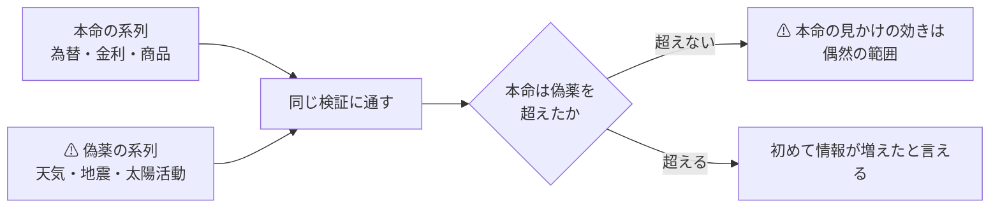
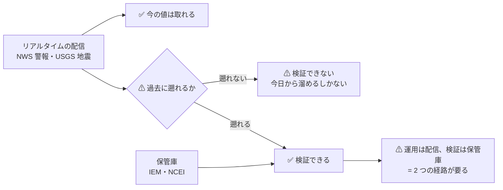
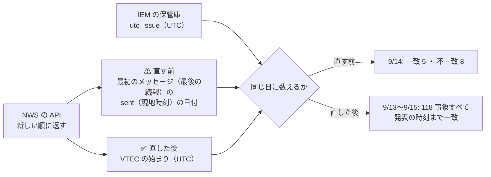
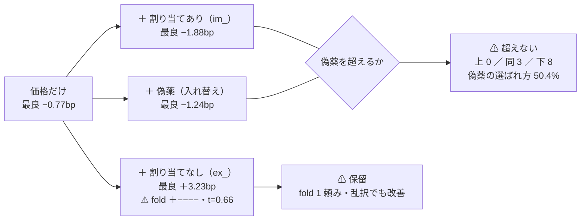
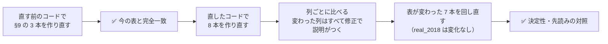

# 日次データの取得元（為替 ＋ 無関係に見えるものも含めて）

調査日: 2026-09-08（**進行中**）。プラン: [docs/plans/archive/daily-data-sources.md](../../plans/archive/daily-data-sources.md)
派生元: [特徴量を見つけ出す手法の検証 §9-2](feature-discovery.md)（**次に変えるなら推定器ではなく入力**）
関連: [market-data-availability.md](../market-data-availability.md)（2026-09-01 の 96 件）／ [rules.md](feature-discovery/rules.md)

> ⚠ **これは投資助言ではなく調査資料である。**
> ⚠ **資金は動かしていない**（2026-08-27 の方針）。有償のデータは購読していない。

## 0. ここまでで分かったこと

⚠ **一番大きい発見は「取れるか」ではなく「取ってよいか」のほうに出た。**

| # | 分かったこと |
| ---: | --- |
| 1 | ⚠ **FRED の規約は「データマイニング・スクレイピング・抽出をするな」と書いている。** ⚠ **正規の経路は無料 API（鍵が要る）**であり、⚠ **本プロジェクトが 2026-09-01 に採用した `fredgraph.csv` の直叩きは規約の側から見て正規の経路ではない**（§2-1） |
| 2 | ⚠ **天気は Open-Meteo ではなく NOAA を採る。** Open-Meteo は **CC BY-NC 4.0（非商用のみ）**だが、⚠ **NOAA は米政府の著作物で制限が無い**（§2-2） |
| 3 | ⚠ **為替は ECB から鍵なしで日次・1999 年から取れた**（§3-1）。FRED を経由しなくてよい |
| 3-2 | ⚠ **判断の外側の 4 経路・25 系列を取得して層に置いた**（§3-4）。⚠ **これで情報源が価格 1 種類だけではなくなった** |
| 4 | ⚠ **「無関係に見える」系列は実際に取れる。** 地震・太陽黒点・気象はいずれも日次で長期が揃う（§3-2） |
| 5 | ⚠ **利用者の判断が要るものが 2 件ある**（§4）。⚠ **どちらも「取れない」ではなく「本プロジェクトが非商用と言えるか」の問題** |
| 6 | ⚠ **警報の保管庫（IEM）と配信（NWS の API）は事象の単位で一致した**（9/13〜9/15 の 118 事象）。⚠ **配信は 7 日しか持たないので、運用では毎日取る**（§12-5） |
| 7 | ⚠ **災害を地域・業種へ割り当てても効かなかった**（偽薬を上回った手法は 0）。⚠ **割り当てない層は良く見えたが、fold 1 頼みで検査を通らず保留**（§13） |
| 8 | ⚠ **`ex_` / `im_` 層の穴 2 つ（まばらな系列の `z20` が古い値を引きずる ／ 0 埋めが系列ごと）を塞いだ。** ⚠ **§9 と §13 の結論は変わらなかった**（§14） |

## 1. なぜ「無関係に見えるもの」を入れるのか

⚠ **前のタスクは価格だけで方向が出ずに閉じた。** だから入力を増やす。
⚠ **ただし系列をたくさん足すのは、そのままだと多重検定の温床である**（[rules.md 11 章](feature-discovery/rules.md) 規約 4）。

> この図の主張: ⚠ **無関係な系列は「捨てる候補」ではなく「物差し」である。** 本命がそれを超えられないなら、本命も偶然である。



⚠ **取得の時点で本命 / 偽薬を宣言する。** ⚠ **結果を見てから分類すると、ただの後付けになる。**

## 2. 規約の判定（Phase 1）

⚠ **「取れるか」より先に「取ってよいか」で落ちる。** ここを飛ばすと後で全部やり直しになる。

| 取得元 | robots.txt【実測 2026-09-08】 | 規約 | 判定 |
| --- | --- | --- | :-: |
| **FRED** | ⚠ **禁止は `/graph/fredgraph.png`（画像）など 6 パス。** ⚠ **CSV は対象外**。`User-agent: *` に `Crawl-delay: 1` | ⚠ **「Don't do any data mining, scraping or extraction of FRED data.」／「Make a sweet app using our FRED through our free API」** | ⚠ **要判断** |
| **ECB**（`data-api.ecb.europa.eu`） | 一般的なもの（API パスの禁止なし） | 公開データの配信 API | ✅ |
| **NOAA NCEI**（気象） | 無し（404） | ⚠ **米政府の著作物**（17 U.S.C. §105） | ✅ |
| **NOAA SWPC**（太陽・地磁気） | 無し（404） | 同上 | ✅ |
| **USGS**（地震） | 無し（404） | 同上 | ✅ |
| **米財務省**（イールド） | — | 同上 | ✅ |
| **連邦準備制度**（H.10） | 無し（404） | 同上 | ✅ |
| **Open-Meteo** | ⚠ **API ホストは `Disallow: /`**。本体サイトは `Allow: /` | ⚠ **CC BY-NC 4.0。非商用のみ**。⚠ **API の利用そのものは規約が明示的に許可**（10,000 回/日・5,000 回/時・600 回/分） | ⚠ **要判断** |
| **SILSO**（黒点） | — | ⚠ **CC BY-NC 4.0** ＋ 出典表示の要請 | ⚠ **要判断** |
| **EIA**（電力） | — | ⚠ **無料の鍵が要る**（`API_KEY_MISSING`） | 保留 |
| **GDELT**（ニュース量） | 無し（404） | 未確認 | 保留 |

### 2-1. ⚠ FRED — 既に採用している経路が、規約の側から見て正規ではない

⚠ **[market-data-availability.md §3-1](../market-data-availability.md) は `fredgraph.csv` を「実測できた 7 経路」の 1 番目に置いている。**
⚠ **技術的には取れるし、`robots.txt` も CSV を禁じていない。** ⚠ **しかし規約の FAQ にはこう書いてある。**

| 場所 | 文面【公表値 2026-09-08 取得】 |
| --- | --- |
| FRED FAQ「What can I do with FRED data?」 | 「Make a sweet app using our FRED through our **free API**」 |
| FRED FAQ「What can't I do with FRED data?」 | ⚠ **「Don't do any data mining, scraping or extraction of FRED data.」** |
| 同 | ⚠ **著作権表示のある系列は第三者のもので、個人利用を超えるなら権利者の許諾が要る**（セントルイス連銀は許諾を与えられない） |

⚠ **本調査では、この文面を読んだ時点で FRED の実測（23 系列の予定）を途中で止めた。**
⚠ **`robots.txt` が許していても、規約が別のことを言っているなら規約が上である**（Stooq のときと同じ立て方）。

**取りうる道は 3 つ。**

| 道 | 中身 | ⚠ 効き方 |
| --- | --- | --- |
| **A** | ⚠ **無料の API キーを取り、公式 API を使う** | ⚠ **規約が名指しで勧めている経路。** 登録は無料・読み取り専用で、⚠ **売買口座の登録とは別物** |
| **B** | ⚠ **FRED を経由せず一次情報から取る** | ⚠ **為替は ECB と連邦準備制度から直接取れる**（§3-1）。⚠ **FRED は集約者であって発表元ではない** |
| **C** | FRED を使わない | 金利・商品・信用スプレッドの手軽な経路を失う |

⚠ **本調査は B を既定にした**（§3-1 は ECB で実測した）。⚠ **A を採るかは利用者の判断**（§4）。

### 2-2. ⚠ 天気 — Open-Meteo ではなく NOAA を採った

⚠ **Open-Meteo の API ホストは `robots.txt` で `Disallow: /` を返す。** ⚠ **ただしこれだけで「採らない」とはしない。**
規約が **API の利用を明示的に許可している**からで、⚠ **Stooq のように 3 つの意思表示が同じ向きを指す状況ではない。**

⚠ **落ちるとすれば別の理由である。** ⚠ **CC BY-NC 4.0 の「非商用のみ」**で、
⚠ **本プロジェクトは「AI を使って収入を稼ぐ方法を体系化する」ことを目的に掲げている**（[CLAUDE.md](../../../CLAUDE.md)）。
⚠ **クリエイティブ・コモンズの非商用の定義は「主として商業的利益または金銭的報酬に向けられていないこと」**なので、⚠ **本プロジェクトが非商用だと言い切れない。**

⚠ **NOAA なら、この判断そのものが要らない。** ⚠ **米政府の著作物には著作権が無い**ので、非商用の条件が付かない。
⚠ **同じ理由で、太陽黒点も SILSO（CC BY-NC）より NOAA / NASA 側の系列を探すほうがよい**（§5 の残作業）。

## 3. 実測（Phase 2）

⚠ **いずれも 2026-09-08 に 1 回だけ取得し、行数・期間・粒度を目視で確かめた。**

### 3-1. 為替（利用者の指名）

| 経路 | 実測【2026-09-08】 | 鍵 | 判定 |
| --- | --- | :-: | :-: |
| **ECB `data-api.ecb.europa.eu`** | ⚠ **EUR/JPY 日次 7,150 行・1999-01-04 〜 2026-09-08**（当日ぶんまで）。CSV・8 列 | ⚠ **不要** | ✅ |
| 連邦準備制度 H.10 | 入口の HTML は取れた（81KB）。⚠ **データ本体は Data Download Program 経由で、URL の組み立てが未確定** | 不要 | ⏳ |
| FRED `DEX*` 系列 | ⚠ **規約により実測を中止**（§2-1） | — | ⚠ |

⚠ **ECB は「ユーロを軸にした参照相場」である。** USD/JPY が要るなら EUR/USD と EUR/JPY から組む。
⚠ **参照相場は 1 日 1 回（中央欧州時間 14:15 ごろ）の値で、取引の終値ではない。** ⚠ **日中の値動きは入っていない。**

### 3-2. ⚠ 偽薬（値動きと因果が想定できないもの）

| 系列 | 経路 | 実測【2026-09-08】 | 権利 | 判定 |
| --- | --- | --- | --- | :-: |
| **気象**（最高・最低気温、降水） | NOAA NCEI GHCN-Daily | ⚠ **3,166 日・2018-01-01 〜 2026-09-01**（ニューヨーク 1 地点）。列は `STATION,DATE,PRCP,TMAX,TMIN` | 米政府の公有 | ✅ |
| **地震** | USGS FDSN | ⚠ **M5 以上が 2018-01-01 〜 2026-09-01 で 15,621 件。** 1 回の要求で件数が取れ、日次に畳める | 米政府の公有 | ✅ |
| **太陽黒点**（日次） | SILSO | ⚠ **76,214 行・1818-01-01 〜 2026-08-31** | ⚠ **CC BY-NC** | ⚠ 要判断 |
| 太陽活動（月次） | NOAA SWPC | 3,332 点。⚠ **月次なので日次の検証には使えない** | 米政府の公有 | ❌ 粒度 |
| **地磁気**（Kp 指数） | NOAA SWPC | ⚠ **直近 30 日だけ。** 長期は別経路（GFZ 等）が要る | 米政府の公有 | ⏳ |
| 月齢 | ⚠ **取得不要** | 暦から計算で出る | — | ✅ |

### 3-3. 本命（値動きと因果が想定できるもの）

| 系列 | 経路 | 実測【2026-09-08】 | 判定 |
| --- | --- | --- | :-: |
| 米国債イールド（日次・全年限） | 米財務省 | ⚠ **250 営業日/年・14 列**（2024 年ぶん） | ✅ |
| 金（LBMA 建値） | LBMA | 14,673 件・1968-04-01 〜（[2026-09-01 の実測](../market-data-availability.md)） | ✅ |
| 暗号資産 | Kraken | 約定 1 本ずつ（[同上](../market-data-availability.md)） | ✅ |
| ニュースの量 | GDELT | 1 か月の要求で 32 点（日次相当）。⚠ **規約は未確認** | ⏳ |
| 金利・商品・信用スプレッド | ⚠ **FRED しか手軽な経路が無い** | §2-1 の判断待ち | ⚠ |

## 3-4. 取得した結果【実測 2026-09-08】

⚠ **判断の外側にある 4 経路・25 系列を `data/raw/<取得元>/series/` に置いた**（[rules.md 1 章](feature-discovery/rules.md) の層）。

```bash
python3 -m cli.fetch --exog exog_daily
```

| 取得元 | 枠 | 系列 | 1 系列の行 | 期間 |
| --- | :-: | ---: | ---: | --- |
| **ECB**（為替・対ユーロ） | 本命 | **7** | **7,088**（CNY のみ 6,821） | 1999-01-04 〜 2026-09-08 |
| **米財務省**（イールドカーブ） | 本命 | **7** | **2,171** | 2018-01-02 〜 2026-09-08 |
| **NOAA**（気象・3 地点 × 3 要素） | ⚠ **偽薬** | **9** | **3,166** | 2018-01-01 〜 2026-09-01 |
| **USGS**（地震） | ⚠ **偽薬** | **2** | **3,094** | 2018-01-02 〜 2026-08-31 |
| | | **25** | | |

⚠ **値の妥当性を目視で確かめた**: EUR/USD 0.83〜1.60（最新 1.16）／ 米 10 年 0.52〜4.98%（最新 4.80%。
[2026-09-01 の実測 4.79%](../market-data-availability.md) と整合）／ 気温は 10 分の 1 度で
ニューヨーク −10.5〜37.8℃・シカゴ −23.2〜37.8℃・ロサンゼルス 11.1〜38.9℃ ／ 地震は 1 日 1〜143 件・最大 M8.8。

### 3-5. ⚠ 地震だけ「行が無い日」の意味が違う

| | |
| --- | ---: |
| 期間の日数 | 3,165 |
| 行 | 3,094 |
| ⚠ **行が無い日** | ⚠ **71** |

⚠ **これは「値が不明な日」ではなく「M5 以上が 0 件だった日」である**（最小値が 1 で、0 の行が存在しない）。
⚠ **特徴量にするときは 0 で埋める。** ⚠ **前方埋めや欠損扱いにすると、地震が起きなかった日に前日の件数が入る。**
⚠ **他の 3 経路は休日で行が無いだけなので、こちらは埋めてはいけない。** 埋め方が系列で違う。

## 4. ⚠ 利用者の判断が要る 2 件

⚠ **どちらも「取れない」ではない。** ⚠ **本プロジェクトをどう位置づけるかで決まる。**

| # | 問い | 影響する取得元 | ⚠ 補足 |
| ---: | --- | --- | --- |
| 1 | ⚠ **FRED の無料 API キーを取るか** | FRED（金利・商品・信用スプレッド・指数） | ⚠ **登録は無料・読み取り専用で、売買口座の登録とは別物。** 規約が名指しで勧めている経路。⚠ **取らないなら一次情報を個別に当たることになり、手間は増えるが権利関係は明快** |
| 2 | ⚠ **本プロジェクトを「非商用」と言えるか** | Open-Meteo（天気）・SILSO（黒点） | ⚠ **プロジェクトの目的は「収入を稼ぐ方法の体系化」**なので、言い切れない。⚠ **言えないなら NOAA など公有の経路だけを使う**（天気は代替がある。黒点は代替を探す必要がある） |

⚠ **1 と 2 のどちらも「No」でも調査は進む。** ⚠ **為替（ECB）・気象（NOAA）・地震（USGS）・イールド（財務省）は判断の外側で、すでに使える。**

## 5. 残っている作業

| # | 残作業 | ⚠ 注意 |
| ---: | --- | --- |
| 1 | 連邦準備制度 H.10 の Data Download Program の URL を確定する | ⚠ **推測で組んだ URL は失敗した。** 一次情報から組み立てる |
| 2 | 地磁気（Kp）の長期履歴の経路 | NOAA は直近 30 日だけ |
| 3 | 太陽黒点の**公有**の日次経路 | SILSO は CC BY-NC |
| 4 | GDELT の規約確認 | 未確認のまま使わない |
| 5 | ⚠ **`ex_` 層の実装**（外部系列を特徴量にする） | ⚠ **必ず 1 日以上ずらす**（[プラン §2-4](../../plans/archive/daily-data-sources.md)） |

## 6. ⚠ この調査の限界

| # | 限界 | ⚠ 効き方 |
| ---: | --- | --- |
| 1 | ⚠ **改定される系列は「その時に知り得た値」ではない** | ⚠ **改定履歴を持たない限り、過去の検証は楽観的になる** |
| 2 | ⚠ **発表の遅れを測っていない** | ⚠ **「その日のデータ」が「その日に手に入る」とは限らない。** 既定で 1 日ずらす |
| 3 | ⚠ **無登録で取れるものに偏っている** | ⚠ **「効くデータが無い」ではなく「方針の内側では取れない」** |
| 4 | 気象は 1 地点しか測っていない | 地点を増やすと系列数が増え、多重検定が厳しくなる |
| 5 | ⚠ **系列を足すほど `n_trials` が増える** | ⚠ **偽薬を置いても補正そのものは免除されない。** 25 系列を足した時点で試行数は 36 から増える |
| 6 | ⚠ **欠けた日の意味が系列で違う**（§3-5） | ⚠ **地震は 0 埋め、他は休日として穴のまま。** 一律に埋めると嘘になる |
| 7 | ⚠ **ECB は対ユーロの参照相場**（1 日 1 回の値） | ⚠ **取引の終値ではなく、日中の値動きも入っていない。** USD/JPY は 2 本から組む |

## 7. 銘柄を増やす — 相関の低いものを選ぶ【実測 2026-09-09】

### 7-1. ⚠ 銘柄数を増やしても標本はほとんど増えない

⚠ **会社株どうしの相関は 0.341。** ⚠ **同じ大型株を何本足しても、実効系列数は頭打ちになる。**

| 銘柄数 | 実効系列数 | 1 銘柄あたり |
| ---: | ---: | ---: |
| 5 | 3.34 | 0.667 |
| 10 | 4.48 | 0.448 |
| 20 | 5.63 | 0.281 |
| 48 | **6.47** | **0.135** |

⚠ **相関が一様に ρ = 0.346 なら、銘柄数を無限にしたときの上限は 1/ρ² = 8.35 本。**
⚠ **48 銘柄で既に上限の 77% に達している。** 500 銘柄まで増やしても 8.23 本（×1.27）にしかならない。

⚠ **t 値はこの平方根で効く**ので、⚠ **銘柄を 10 倍にしても t は 1.13 倍**である。
⚠ **検出力を上げる手段として、大型株を足すのは効率が悪い。**

### 7-2. ⚠ 相関の低い 23 本を取って測った — 当たったのは 12 本

⚠ **資産クラスで事前に候補を決め、取ってから相関を測った**（`config/universe/lowcorr.toml`）。

| |相関| の帯 | 銘柄 | 何だったか |
| --- | --- | --- |
| **0.04〜0.14** | SHY TIP UNG IEF GLD UUP TLT | ⚠ **債券・金・ドル・天然ガス。狙いどおり** |
| 0.24〜0.33 | USO GDX SLV DBC LQD | 原油・金鉱株・銀・商品指数・投資適格債 |
| **0.49〜0.84** | FXI EWZ INDA XBI EWJ VNQ EEM HYG IJR EFA | ⚠ **国際株・小型株・REIT・バイオ。実質は株そのもの** |
| −0.605 | VXX | ⚠ **強い逆相関。独立ではない**（符号が逆なだけ） |

⚠ **狙いが当たったのは 23 本中 12 本だけだった。** ⚠ **「国際株なら別の市場だから相関が低い」は外れ**で、
EFA（先進国株）は 0.843、IJR（小型株）は 0.839 と、⚠ **会社株どうしの 0.341 よりずっと高い。**

⚠ **一番効いた発見は HYG である。** ⚠ **名前は債券 ETF だが相関 0.776 で、ハイイールド債は株のように動く。**
⚠ **資産クラスの名前だけで相関を決めてはいけない。**

### 7-3. ⚠ 全部足すより、絞ったほうが実効系列数が多い

| 組み合わせ | 銘柄 | 実効系列数 | 1 銘柄あたり | t の伸び |
| --- | ---: | ---: | ---: | ---: |
| 会社株だけ | 48 | 6.62 | 0.138 | 1.000 |
| ＋ 23 本ぜんぶ | 71 | 7.81 | 0.110 | 1.086 |
| ⚠ **＋ 相関の低い 12 本だけ** | **60** | ⚠ **9.06** | **0.151** | ⚠ **1.170** |
| ＋ さらに絞って 7 本 | 55 | 8.24 | 0.150 | 1.116 |

⚠ **23 本ぜんぶ足すより、12 本に絞ったほうが実効系列数が多い**（7.81 → 9.06）。
⚠ **株に近い 11 本は、列を増やす（＝ 多重検定を厳しくする）だけで、独立な情報を足していない。**

⚠ **ただし断り書きが要る。** 実効系列数は参加率（正規化された指標）なので、
⚠ **相関の高い系列を足すと、情報が減っていなくても値が下がる。** ⚠ **「11 本が有害」の証明ではない。**
⚠ **列が増えるぶん多重検定が厳しくなるのは確かなので、予測には使わない**という判断にした。

### 7-4. ⚠ 選び方は資産クラスで引いた（測った相関では引いていない）

⚠ **測った相関で銘柄を選ぶと、全期間の情報を使って選ぶことになる。**
⚠ **市場との相関は「無条件の性質」なのでラベルは漏れないが、分割の外で選んだことに変わりはない。**

⚠ **だから線引きは「株かそうでないか」で引いた。** ⚠ **これは取得の前に決められる。**
⚠ **2 か所で判断が食い違ったので、そのまま書いておく。**

| 銘柄 | 資産クラスでの判断 | 測った相関 | 扱い |
| --- | --- | ---: | --- |
| **HYG** | 債券 → 使う | ⚠ **0.776** | ⚠ **別枠に回した**（実質は株） |
| **GDX** | 株（金鉱株）→ 別枠 | 0.245 | ⚠ **別枠のまま**（相関は低いが株である） |

⚠ **取ったものは消していない。** ⚠ **`raw/` は書き換えない**（[rules.md 1 章](feature-discovery/rules.md)）ので、
23 本すべてが層に残っている。使うかどうかは `config/universe/` の側で決める。

### 7-5. 取得の結果

| | |
| --- | ---: |
| 取得した銘柄 | **23** |
| 日足の行（86 銘柄の合計） | **561,204** |
| ⚠ **既存 63 銘柄の調整結果** | ⚠ **1 バイトも変わっていない**（指紋で確認） |
| 予測に使う候補 | **11**（債券 5・商品 5・通貨 1） |
| 株に近いので別枠 | **12** |

⚠ **1 つの venv で取得まで通るようにした**（`websockets` と `requests` を足した）。
⚠ **以前は「取得はサンプル側の venv で」と書いてあったが、そちらに pandas が無いので実際には通らなかった。**

## 8. `ex_` 層【2026-09-09】

⚠ **価格の外から作る最初の特徴量の層。** コード: `ail/features/exog.py`。

| | |
| --- | ---: |
| 系列 | **25**（為替 7・イールド 7・気象 9・地震 2） |
| 変換 | **2**（`d1` 前日からの変化 ／ `z20` 20 日の窓での z 値） |
| ⚠ **列** | ⚠ **50** |

⚠ **水準（`lvl`）は既定に入れていない。** 為替や金利の水準は非定常で、
⚠ **訓練期間の水準をそのまま検証期間に当てると意味が変わる**ためである。

### 8-1. ⚠ 他の層と違う 4 点

| # | 違い | ⚠ 理由 |
| ---: | --- | --- |
| 1 | ⚠ **必ず 1 日以上ずらす**（`ex_lag_days`、既定 1） | ⚠ **発表の遅れ。** ⚠ **0 以下は `ValueError` で落とす** |
| 2 | ⚠ **欠けた日の埋め方が系列で違う** | ⚠ **地震は「行が無い日 = 0 件」なので 0 で埋める。** 為替・金利は休場なので前の値のまま |
| 3 | ⚠ **引き継いでよい日数に上限を置く**（既定 7 日） | ⚠ **上限が無いと、系列が止まっても古い値が永久に貼られ、定数の特徴量になる**（§8-3） |
| 4 | ⚠ **全銘柄で同じ値になる** | ⚠ **断面では銘柄を区別できない。** 方向には効きうるが、相対の順位には効かない |

⚠ **前の値を使うのは先読みではない。** 「その時点で公表されている最新の値」であり、未来は構造的に入らない。

### 8-2. ⚠ ずらしが本物であることの確認【実測 2026-09-09】

| 検査 | 結果 |
| --- | --- |
| 貼られた値が「1 日前までの最新」と一致するか（EURTOUSD、直近 200 行） | ⚠ **食い違い 0 件** |
| ⚠ **当日の値が混ざっていないか** | ⚠ **0 件** |
| 系列の未来を切り落としても過去の行が変わらないか | ✅（`tests/test_exog.py`） |
| 定数・全欠損の列 | 0 本 |

### 8-3. ⚠ 作りながら踏んだもの — 系列が止まると定数の列になる

⚠ **最初の実装には引き継ぎの上限が無かった。** 気象の取得が 2026-09-01 で止まっていたため、
⚠ **09-02 以降の行に同じ値が並んだ。** ⚠ **列としては「定数」になり、系列が止まったことが見えなくなる。**

⚠ **上限（既定 7 日）を超えたら欠損にするようにした。** 連休で 2〜4 日空くのは通し、
⚠ **取得が止まったことは欠損として表に出る。**

### 8-4. できた表

| | |
| --- | ---: |
| 実験 | `exog_h1`（`own` 35 ＋ `ex` 50 = **85 本**） |
| 行 | **135,962** |
| 期間 | ⚠ **2018-01-31 〜 2026-09-04** |

⚠ **行が 435,548 → 135,962 に減るのは、外部系列が 2018 年からしか無いため**（イールド・気象・地震）。
⚠ **価格だけなら 1994 年から使えるので、外部系列を入れると標本が 3 分の 1 になる。** これは交換条件である。

## 9. 検証（Phase 5）— ⚠ 本命は偽薬を超えなかった【実測 2026-09-09】

⚠ **[§1](#1-なぜ無関係に見えるものを入れるのか) で決めた通りに測った。** ⚠ **本命が偽薬を超えられないなら、本命の見かけの効きは偶然の範囲である。**

### 9-1. 3 本を同じ条件で並べた

⚠ **期間・行数・ラベル・粒度・地平・k・種をすべて揃えた。** ⚠ **違うのは特徴量の層だけである。**

| 実験 | 特徴量 | 中身 |
| --- | ---: | --- |
| `own_2018` | 35 | 価格だけ |
| `real_2018` | 63 | ＋ **本命**（為替 7・イールド 7 × 2 変換 = 28 列） |
| `placebo_2018` | 57 | ＋ ⚠ **偽薬**（気象 9・地震 2 × 2 変換 = 22 列） |

3 本とも **135,962 行・2018-01-31 〜 2026-09-04**。⚠ **ラベルの平均も標準偏差も 1 桁まで一致している。**
（⚠ **期間を揃えるために `start_date` を実験の設定に足した**。揃えないと、比べているのが層の差か期間の差か分からない）

### 9-2. 結果【実測 2026-09-09】

**純利 bp（コスト 5bp 後）**

| 手法 | 価格だけ | ＋ 本命 | ＋ 偽薬 | 本命 − 価格 | ⚠ 偽薬 − 価格 |
| --- | ---: | ---: | ---: | ---: | ---: |
| F3-1 Lasso | **＋0.61** | −2.22 | **＋0.61** | −2.83 | 0.00 |
| 基準 常に上（ドリフト） | −0.38 | −0.38 | −0.38 | 0.00 | 0.00 |
| F3-3 並べ替え（MDA） | −3.29 | −1.52 | −1.86 | ＋1.77 | ＋1.43 |
| F2-3 Boruta | −3.81 | −2.81 | −1.81 | ＋1.00 | ＋2.00 |
| **乱択（基準）** | −3.99 | −4.56 | −4.12 | −0.57 | −0.13 |
| **全部使う（基準）** | −4.10 | −5.77 | −2.39 | −1.67 | ＋1.71 |
| F1-2 相互情報量 | −4.17 | −1.75 | −1.36 | ＋2.42 | ＋2.81 |
| F3-2 木の重要度（MDI） | −4.19 | −4.33 | −1.26 | −0.14 | ＋2.93 |
| F1-3 mRMR | −4.35 | −2.43 | −4.38 | ＋1.92 | −0.03 |
| F3-5 クラスタ化 MDA | −4.58 | −3.94 | −1.99 | ＋0.64 | ＋2.59 |
| F1-5 単変量検定 ＋ FDR | −4.59 | −2.77 | −4.02 | ＋1.82 | ＋0.57 |
| F1-1 相関 | −5.40 | −2.87 | −3.26 | ＋2.53 | ＋2.13 |
| 基準 直前リターンの符号 | −8.03 | −8.03 | −8.03 | 0.00 | 0.00 |

⚠ **2026-09-16 に偽薬の列を訂正した**（[§14](#14-ex_--im_-層の穴を塞いだ実測-2026-09-16)。⚠ **降水の `z20` が、雨の無い日が 20 日続くと古い値を引きずっていた**）。
⚠ **変わったのは偽薬の 8 行で、最大 0.77bp**（クラスタ化 MDA −1.22 → −1.99）。⚠ **下の読み方 1〜5 と §9-4 の判定は変わらない。**
訂正後の偽薬の実行: `runs/2026-09-16T22-50-09_placebo_2018`（価格だけ・本命は表が変わらないので 09-09 の実行のまま）。

⚠ **読み方**

| # | 何が言えるか |
| ---: | --- |
| 1 | ⚠ **13 行すべてが、どの構成でもコスト後で負け。** 最良は「価格だけ」の ＋0.61bp で、⚠ **外部データを足しても超えていない** |
| 2 | ⚠ **偽薬のほうが多くの手法で価格だけを上回った**（偽薬 8/13 対 本命 7/13）。⚠ **気象と地震を足すほうが、為替と金利を足すより「効いて見える」** |
| 3 | ⚠ **本命が偽薬を上回ったのは 13 手法中 4 つだけ** |
| 4 | ⚠ **最良の手法（Lasso）は、偽薬を足しても数字が 1 桁も動かなかった**（＋0.61 で一致）。⚠ **偽薬の 22 列を 1 本も選ばなかったということである** |
| 5 | ⚠ **本命を足すと Lasso は ＋0.61 → −2.22bp に悪化した。** ⚠ **足した情報が役に立つどころか、選別を惑わせている** |

### 9-3. ⚠ 偽発見率の実測 — 何が選ばれたか

⚠ **85 本（価格 35 ＋ 本命 28 ＋ 偽薬 22）から選ばせて、選ばれた列を記録した**
（`runs/<実行>/selected.csv`。⚠ **この記録のために `cli/run.py` に選択の保存を足した**）。

| 枠 | 置いた列 | 選ばれた延べ | 1 列あたり |
| --- | ---: | ---: | ---: |
| 価格（`own_`） | 35 | 562 | 16.1 |
| 本命（為替・イールド） | 28 | 598 | **21.4** |
| ⚠ **偽薬（気象・地震）** | 22 | 323 | **14.7** |

（2026-09-16 に訂正。[§14](#14-ex_--im_-層の穴を塞いだ実測-2026-09-16)。訂正前は 563 ／ 596 ／ 322。実行は `runs/2026-09-16T22-56-17_exog_h1`）

⚠ **外部系列の選択のうち、偽薬は 35.1%**（列の数の比は 22/50 = 44.0%）。
⚠ **本命のほうがやや選ばれているが、それが成績に変わっていない**（§9-2 で本命は偽薬に負けている）。

**手法ごとの偽薬の割合**（外部系列の選択のうち）

| 手法 | 偽薬 / 外部 | 割合 |
| --- | ---: | ---: |
| F1-3 mRMR | 24/40 | **60.0%** |
| ⚠ **F1-5 単変量検定 ＋ FDR** | 82/178 | ⚠ **46.1%** |
| 全部使う（基準） | 110/250 | 44.0%（列の数どおり） |
| F1-1 相関 | 20/57 | 35.1% |
| **乱択（基準）** | 15/50 | **30.0%** |
| F2-3 Boruta | 39/125 | 31.2% |
| F3-3 並べ替え（MDA） | 12/47 | 25.5% |
| F3-2 木の重要度 | 13/54 | 24.1% |
| F1-2 相互情報量 | 8/60 | 13.3% |
| ⚠ **F3-5 クラスタ化 MDA** | 0/60 | ⚠ **0.0%** |

⚠ **一番効く読み方は F1-5 である。** ⚠ **偽発見率を制御するために作られた手法（Benjamini-Yekutieli）が、
偽薬を 46.1% 選んでいる。** ⚠ **列の数の比（44.0%）とほぼ同じで、雑音を落とせていない。**

⚠ **逆に F3-5 クラスタ化 MDA は偽薬を 1 本も選ばなかった。** ⚠ **ただし [§3-2](feature-discovery.md) で
「単独で圧倒的に効く列も落とす」ことが分かっている手法**なので、⚠ **慎重さの表れであって選別の腕ではない。**

⚠ **延べ回数を独立な試行として検定してはいけない**（921 回の選択は 50 本の列の繰り返しで、
手法どうし・fold どうしも独立ではない）。⚠ **ここでは割合を並べるところまでにする。**

### 9-4. 判定

| 問い | 答え |
| --- | --- |
| ⚠ **本命は偽薬を超えたか** | ⚠ **超えなかった。** 上回ったのは 13 手法中 4 つで、⚠ **価格だけを上回った回数は偽薬のほうが多い**（8 対 7） |
| 外部の日次データで情報は増えたか | ⚠ **増えたと言えない。** 最良は「価格だけ」の ＋0.61bp のままで、⚠ **本命を足すと −2.22bp に悪化した** |
| ⚠ **偽薬を置いた意味はあったか** | ⚠ **あった。** ⚠ **置かなければ「本命を足したら 7 手法で改善した」と読めてしまう。** 偽薬が 8 手法で改善したことで、⚠ **その改善が雑音だと分かる** |
| 何が足りなかったのか | ⚠ **この層は全銘柄で同じ値になる**（[§8-1](#8-1--他の層と違う-4-点)）。⚠ **市場全体の方向にしか効きようがなく、銘柄の選択には効かない** |
| E8 のどの型か | **X12（方向を当てていない）**。⚠ **E8 で最多だった型に、自前の実測でも当たった** |
| 根拠の強さ | ⚠ **「悪い数字」なのでそのまま結論にしてよい**（[rules.md 11 章](feature-discovery/rules.md) 規約 2） |

⚠ **次に試すなら、全銘柄で同じ値にならないものである。** 決算・銘柄ごとのニュース・空売り残高など、
⚠ **銘柄を区別できる情報**でなければ、断面の予測は動かない。

## 10. 社会にインパクトを与えそうなデータ【2026-09-09】

⚠ **[§9](#9-検証phase-5--本命は偽薬を超えなかった実測-2026-09-09) の続き。** ⚠ **気象と地震は偽薬のまま残し**、
新しく取るものを本命として足した（[プラン §2-1](../../plans/archive/impact-data.md)）。
⚠ **結果を見てから枠を移すと、§9 の結論を自分で崩すことになる。**

### 10-1. 規約 — SPC は使えない

| 取得元 | robots.txt【実測 2026-09-09】 | 判定 |
| --- | --- | :-: |
| ⚠ **NOAA SPC**（`www.spc.noaa.gov`） | ⚠ **`User-agent: * Disallow: /`** | ⚠ **採らない**（Stooq と同じ扱い） |
| **NOAA NCEI**（`/pub/`） | `Disallow: /data*` `/orders*` ＋ `/access/crn/*`。⚠ **`/pub/` と `/access/services/` は対象外** | ✅ |
| **NOAA NHC** | `User-agent: * Disallow:`（空 ＝ 全許可） | ✅ |
| **policyuncertainty.com** | 無し（404） | ✅ |

⚠ **SPC が落ちても同じ事象は取れる。** ⚠ **NCEI が公式の保管庫**で、そちらは禁止の対象外である。
⚠ **ついでに [§3-4](#3-4-取得した結果実測-2026-09-08) で使った `/access/services/data/v1` も禁止に含まれないことを確認した。**

### 10-2. 取得した結果【実測 2026-09-09】

```bash
python3 -m cli.fetch --exog impact_daily
```

| 取得元 | 枠 | 系列 | 中身 |
| --- | :-: | ---: | --- |
| **NCEI Storm Events** | **本命** | **13** | 全国 3（件数・被害額・死者）／ 種類 6（竜巻・雹・洪水・山火事・冬季・熱）／ ⚠ **地域 4 の被害額**（湾岸・西部・中西部・北東部） |
| **EPU 日次** | **本命** | **1** | 経済政策の不確実性（15,226 行・1985〜） |

⚠ **仮説を取得の前に書いた**（`config/dataset/impact_daily.toml`）。
災害は「⚠ **保険の支払いと操業停止を通じて業績に効く**」、EPU は「⚠ **不確実性が上がると企業が投資を控える**」。
⚠ **仮説が書けないものは本命にしない。**

⚠ **地域で分けたのは §9-4 の判定に対応するため。** ⚠ **全銘柄で同じ値では市場全体の方向にしか効かない**ので、
⚠ **湾岸 → 保険・製油、西部 → 公益・山火事のように銘柄へ割り当てられる形で取った**（割り当て自体は次の Phase）。

**値の妥当性【実測】**: 1 日の事象は最大 1,584 件（中央値 123）／ 被害額は最大 **170 億ドル**（西部の 1 日）、
湾岸は最大 **164 億ドル** ／ 死者は最大 160 人。⚠ **桁として災害の規模と整合する。**

### 10-3. ⚠ 一番大きい発見 — 公表が 101 日遅れる

| 取得元 | 最新の日 | ⚠ 今日（2026-09-09）からの遅れ |
| --- | --- | ---: |
| EPU | 2026-09-08 | 1 日 |
| ⚠ **NCEI Storm Events** | ⚠ **2026-05-31** | ⚠ **101 日** |

⚠ **一律 1 日ずらしのままだと、まだ公表されていない値で過去を当てにいくことになる**（先読み）。
⚠ **`ex_` 層のずらし幅を取得元ごとに変えられるようにした**（`ail/features/exog.py`）。

| 取得元 | ずらし幅 | ⚠ 根拠 |
| --- | ---: | --- |
| 既定（為替・イールド・気象・地震・EPU） | **1 日** | 翌日には出る |
| ⚠ **NCEI Storm Events** | ⚠ **120 日** | ⚠ **実測 101 日 ＋ 余裕。** ⚠ **短く見積もるほうが危ない**（先読みになる） |

⚠ **実データで確かめた**（2026-09-08 の足）: 為替と EPU は 09-07 の値、⚠ **Storm Events は 05-11 の値**を指している。

### 10-4. ⚠ 事象が無い日の扱い

| 系列 | 行 | ⚠ 行が無い日 |
| --- | ---: | ---: |
| 全事象の件数 | 3,072 | 1 |
| 竜巻の件数 | 1,466 | ⚠ **1,607** |
| 山火事の件数 | 1,160 | ⚠ **1,913** |

⚠ **地震と同じ形である。** ⚠ **行が無い日は「その事象が 0 件だった日」**なので 0 で埋める。
⚠ **前方埋めをすると、竜巻が起きなかった日に前回の件数が入る。**

### 10-5. いま持っている外部系列

| 枠 | 取得元 | 系列 |
| --- | --- | ---: |
| 本命 | ECB 為替 ／ 米財務省イールド ／ ⚠ **NCEI Storm Events** ／ ⚠ **EPU** | **28** |
| ⚠ **偽薬** | NOAA 気象 ／ USGS 地震 | **11** |
| | | **39** |

⚠ **偽薬は §9 のまま動かしていない。** ⚠ **本命だけが増えたので、次の検証では「本命が偽薬を超えるか」を同じ形でもう一度見る。**

## 11. リアルタイムで取れる経路【2026-09-09】

⚠ **[§10-3](#10-3--一番大きい発見--公表が-101-日遅れる) の公表 101 日遅れを受けて探した。**

### 11-1. ⚠ 「今の値が取れる」と「検証に使える」は別物

> この図の主張: ⚠ **リアルタイムの配信は、たいてい過去を持っていない。** ⚠ **検証には両方が要る。**



⚠ **この区別を先にしないと、「リアルタイムで取れた」で満足して検証できないものを集めることになる。**

### 11-2. 実測【2026-09-09】

| 経路 | 今の値 | ⚠ 遡れる範囲 | 規約 | 判定 |
| --- | :-: | --- | --- | :-: |
| **NWS 警報 API**（`api.weather.gov`） | ✅ **343 件が有効**（更新 18:47） | ⚠ **7〜14 日** | ⚠ **`robots.txt` は `Disallow: /` だが、API の規約が「合衆国政府の公開データ。あらゆる目的に自由に使える」と明記** | ⚠ **運用向け** |
| **USGS 地震** | ✅ 直近 1 時間で 10 件 | ✅ **1900 年代から** | 米政府の公有 | ✅ **両方いける** |
| ⚠ **IEM 警報の保管庫**（`mesonet.agron.iastate.edu`） | — | ✅ **2019 年の 1 日で 2,316 行**（数十年ぶん） | ⚠ **`robots.txt` に `Crawl-delay: 120`**（2 分間隔） | ✅ **検証向け** |
| **NCEI Storm Events** | ❌ | ✅ 1950 年から | 米政府の公有 | ⚠ **101 日遅れ** |
| GDELT | ✅ | ✅ | 未確認。⚠ **429 が出た**ので間隔を空ける | ⏳ |

⚠ **NWS の API は `robots.txt` が `Disallow: /` だが、Open-Meteo と同じ立て方で採る。**
⚠ **API の規約が明示的に許可しており、しかも Open-Meteo と違って非商用の縛りが無い**
（「open data, free to use for any purpose」「we do not charge any fees」）。
⚠ **`User-Agent` に連絡先を入れることを求めている**ので、そのとおりにする。

### 11-3. ⚠ 組み合わせが要る

| 用途 | 経路 | ⚠ 理由 |
| --- | --- | --- |
| **検証（過去）** | ⚠ **IEM の保管庫** | ⚠ **NWS の API は 7〜14 日しか持たない。** NCEI は 101 日遅れる |
| **運用（今）** | ⚠ **NWS の API** | ⚠ **IEM は保管庫であって配信ではない**（`Crawl-delay: 120` で 2 分間隔） |
| 地震 | USGS 1 本で足りる | ⚠ **配信と保管庫が同じ経路にある稀な例** |

⚠ **2 つの経路を使うと「検証で見た値」と「運用で見る値」が同じである保証が要る。**
⚠ **同じ日を両方から取って突き合わせる検査が要る**（未実施。次の作業）。

### 11-4. ⚠ 分かったことと、まだ埋まらないもの

| # | |
| ---: | --- |
| 1 | ⚠ **災害は「今」なら取れるが、「当時の今」は保管庫からしか取れない** |
| 2 | ⚠ **NCEI の 101 日遅れは、保管庫（IEM）を使えば 0 日にできる。** ⚠ **ただし IEM は警報であって被害額ではない**（被害額は NCEI にしか無い） |
| 3 | ⚠ **警報と実際の被害は別物。** 警報は「起きるかもしれない」で、被害額は「起きた結果」。⚠ **予測に使うなら警報のほうが先に出る** |
| 4 | ⚠ **`Crawl-delay: 120` は重い。** 8 年ぶんを日ごとに取ると 3,000 回 × 2 分 = 100 時間。⚠ **期間をまとめて 1 回で取る形にしないと現実的でない** |

## 12. 警報の保管庫を取る（Phase 2-3）【2026-09-09】

⚠ **[§11](#11-リアルタイムで取れる経路2026-09-09) で「検証は保管庫・運用は配信」と分けた。** ここでその保管庫を実際に取った。

### 12-1. ⚠ 取り方 — 期間をまとめて 1 回

⚠ **`robots.txt` の `Crawl-delay: 120`（2 分間隔）が設計をそのまま決めた。**

| 取り方 | 要求の回数 | かかる時間 |
| --- | ---: | ---: |
| 日ごと | 3,174 回 | ⚠ **106 時間** |
| ⚠ **年ごと**（採用） | ⚠ **9 回** | ⚠ **30 分** |

⚠ **1 年ぶんを丸ごとメモリに載せない**（80 万行になる）ので、⚠ **流しながら読んで日次の件数に足し込む。**

### 12-2. ⚠ 同じ事象が 2 回出てくる

⚠ **1 日を取って中身を見て初めて分かった**【実測 2026-09-09。2019-05-20 の 2,316 行】。

| 行の種類 | 中身 | 州が付くか |
| --- | --- | :-: |
| `C`（県ごと） | 2,010 行 | ✅ UGC の先頭 2 文字 |
| `P`（多角形） | 306 行 | ❌ |

⚠ **429 事象のうち 288 が `C` と `P` の両方で出ていた。** ⚠ **行を数えると 1.7 倍に膨らむ**ので、
⚠ **VTEC の鍵（年・気象台・現象・重大度・事象番号）で畳んでから数える。**
⚠ **多角形だけの事象 18 件は州を持たない**ので、全国には入るが地域の集計には入らない。

### 12-3. ⚠ 途中で切られる — 取れた年はその場で保管する

⚠ **7 年目（2024 年の塊）でサーバが応答を途中で切った**【実測 2026-09-09。`IncompleteRead`】。
⚠ **6 年ぶん・20 分の取得を書き出す前に失った。**

| 前 | 後 |
| --- | --- |
| 全期間を取り終えてから書く | ⚠ **丸 1 年の塊は畳んだ事象を `raw/iem/events/<年>.jsonl` に即保管**し、次からは読むだけ |
| 失敗したら例外で終わる | ⚠ **間隔を空けて取り直し、それでも駄目なら塊を半分に割る** |

⚠ **2 分間隔の取得は、失敗のたびに全部やり直せるものではない。** ⚠ **年の途中までの塊（今年）だけは毎回取り直す**（伸びるので）。

### 12-4. 熱の取り直し【実測 2026-09-16】

⚠ **NWS は熱の警報のコードを `EH`（Excessive Heat）から `XH`（Extreme Heat）へ替えていた。** 取り直す前は熱の系列が 2024-10-24 で止まっていた。

| | 前（2026-09-09） | 後（2026-09-16） |
| --- | ---: | ---: |
| `WW_CNT_熱` の行 | 494（〜2024-10-24） | ⚠ **633（〜2026-09-08）** |
| 2025 年の事象 | 14,382 | 14,565（⚠ **＋183 はすべて `XH`**） |
| 全期間の事象 | 130,820 | 131,313（＋493） |
| IEM への要求 | — | 2 回（2025 年・2026 年の途中まで。約 4.5 分） |

⚠ **取り直したのは 2025 年のファイルだけで足りた。** 2024 年の最後の `EH` は 10-24、2025 年の最初の `XH` は 05-14 で、⚠ **切り替わりは熱の季節の合間だった**（2024 年のファイルに `XH` は 0 件）。

⚠ **TODO に「検証に使う 12 系列には影響しない」と書いていたのは誤りだった。** ⚠ **変わった 10 系列のうち `WW_CNT` と `WW_RGN_` の 4 本は熱を含む**ので、⚠ **12 系列のうち 5 本が変わった**。
差分を日ごとに引くと ⚠ **熱の増分と 1 件もずれていない**（熱以外の残差 0 件）。⚠ **2026 年の塊を取り直したことによる他の変化も無かった。**

### 12-5. ⚠ 突き合わせ — 保管庫と配信は事象の単位で一致した【実測 2026-09-16】

> この図の主張: ⚠ **最初の不一致はデータの違いではなく、配信側の「日の決め方」だった。**



**直す前**（`cli.crosscheck --day 2026-09-14`）: 系列 13 本のうち ⚠ **一致 5 ・ 不一致 8**（合計 配信 112 対 保管庫 124）。
⚠ **鍵（WFO・現象・事象番号）で並べると、原因は 2 つとも配信側のコードにあった。**

| # | 原因 | 効き方 |
| ---: | --- | --- |
| 1 | ⚠ **API は新しい順に返すのに、最初に来たメッセージで日を決めていた** | ⚠ **それは最後の続報（`EXP` `CAN`）で、発表の日ではない** |
| 2 | ⚠ **`sent` は現地時刻だった**（`-07:00` など） | ⚠ **米西部の夕方の警報が 1 日前にずれる** |

⚠ **日を「VTEC の始まり（UTC）」で決め直すと**（`ail/data/sources/nws.py`）:

| 日 | 保管庫（IEM） | 配信（NWS） | 両方 |
| --- | ---: | ---: | ---: |
| 9/13 | 41 | 41 | 41 |
| 9/14 | 39 | 39 | 39 |
| 9/15 | 38 | 38 | 38 |

⚠ **118 事象すべてで発表の時刻が分単位で一致し、州の集合も 118/118 で一致した。** ⚠ **保管庫と配信は同じものを持っている。**

**直した後の CLI**（配信側は前 3 日・後 1 日に窓を広げて取り、始まりの日で絞る）:

| 日 | 経過 | 一致 / 系列 | 合計 配信 対 保管庫 | ⚠ 残った差 |
| --- | ---: | ---: | ---: | --- |
| **9/15** | 1 日 | ⚠ **8/8** | ⚠ **112 対 112** | ⚠ **無し** |
| 9/14 | 2 日 | 8/12 | 120 対 124 | ⚠ **川の洪水 1 件**（下の #2） |
| 9/10 | 6〜7 日 | 12/15 | 148 対 160 | ⚠ **全部「配信 < 保管庫」**（下の #1 と #2） |

| # | 残った差の正体 | ⚠ 運用での効き方 |
| ---: | --- | --- |
| 1 | ⚠ **API はメッセージを 7 日しか持たない**【実測。9/16 23:50Z に取って、最古は 9/09 23:52Z】。⚠ **`NEW` が消えて続報だけ残った事象は、始まりの日が分からない** | ⚠ **始まりの無い事象は数えない**ようにした（`sent` で代わりに日付けすると、9/10 に 4 事象が後ろへずれた）。⚠ **運用では毎日取れば `NEW` は必ず手元にある** |
| 2 | ⚠ **川の洪水（`FL`）は始まりの時刻が延長（`EXT`）で動く。** `TBW FL 2` は 9/13 12Z → 9/14 06Z → 9/14 09Z と動き、⚠ **始まる前に取り消された** | ⚠ **保管庫の側も、問い合わせの窓によって日が変わる**（同じ事象が 9/10 の窓では 9/10 13:30、9/13〜16 の窓では 9/14 09:00）。⚠ **この種の事象は日が数日ぶれる。** 量は 9/14 で 1/39、9/10 で 3/60【実測】 |

⚠ **9/10 の差は、23:51 に鍵で見たときは 4 件**（Red Flag 1 件は `NEW` が消えていた ＋ 川の洪水 3 件）⚠ **で、6 分後の CLI では 6 件だった。** 増えた 2 件は保持期限が進んで消えたものと見ている【推測。鍵では確かめていない】。

⚠ **判定: 検証（IEM）と運用（NWS）は同じ数字になる。** ⚠ **条件は 2 つ**:
（1）⚠ **配信は 7 日以内に取る**（実際には毎日）、（2）⚠ **日は VTEC の始まり（UTC）で決める**。⚠ **川の洪水の始まりの延長だけは、どちらの経路でも日がぶれる。**

⚠ **この突き合わせで IEM の `Crawl-delay` を 1 回破った。** ⚠ **取得が終わった 53 秒後に `cli.crosscheck` を回した**（`fetch` の中の待ちは 1 回の実行の中しか見ていなかった）。
⚠ **最後に要求した時刻を `raw/iem/.last_request` に残し、プロセスをまたいで 120 秒を待つようにした**（`iem._wait_turn`。以後の 8 回の要求はすべてこの検査を通してから送った）。

### 12-6. ⚠ 検証の途中で見つけた、`ex_` / `im_` 層の 2 つの穴【実測 2026-09-16】

| # | 穴 | ⚠ 実測 | 今回の扱い |
| ---: | --- | --- | --- |
| 1 | ⚠ **0 埋めが系列ごとに「最初の事象の日〜最後の事象の日」でしか効かない**（`exog.load_series`） | ⚠ **湾岸の熱帯の警報は最初の事象が 2018-05-26** なので、それより前が「0 件」ではなく欠損になる。⚠ **2018-05-21〜06-14 の 18 日で ex 1,116 ／ im 388 ／ both 453 行が落ち、5 本の行が揃わなかった** | ⚠ **塞いだ**（[§14](#14-ex_--im_-層の穴を塞いだ実測-2026-09-16)）。⚠ **0 埋めを取得元の範囲にして、5 本とも 2018-05-21 始まり・131,250 行で揃った**（一時は `start_date` を 06-15 にずらして逃げていた） |
| 2 | ⚠ **まばらな系列の `z20` は、窓が全部 0 だと欠損になり、as-of の前方埋めで古い値を引きずる**（`asof_join`）。⚠ **`d1` が欠損でないので、古さの検査（`max_stale_days`）をすり抜ける** | ⚠ **足のうち前の値を引きずった割合: 湾岸の熱帯 77.9% ／ 西部の山火事 24.0% ／ 湾岸の被害額 0.2% ／ 全国の件数・全国の被害額 0%** | ⚠ **塞いだ**（[§14](#14-ex_--im_-層の穴を塞いだ実測-2026-09-16)）。⚠ **窓が定数なら `z20` = 0、古さの検査を列ごとにした** |

⚠ **#2 は §9 の気象（LA 空港の降水は窓の 44.9% が 20 日すべて 0）にも掛かっていた**ので、⚠ **§9 も回し直した**（§14-3）。

## 13. 検証（Phase 4）— ⚠ 割り当ては効かず、割り当て「なし」が効いて見えた【実測 2026-09-16】

⚠ **[プラン §4-2-3](../../plans/archive/impact-data.md) で決めた 4 本 ＋ 同じ表に本物と偽薬を並べる 1 本を、同じ条件で回した。**
⚠ **同じ日に一度 2018-06-15 始まりで回し、[§14](#14-ex_--im_-層の穴を塞いだ実測-2026-09-16) で `ex_` / `im_` 層の穴を塞いでから 2018-05-21 始まりで回し直した。**
⚠ **以下は回し直した数字である**（直す前の数字でも結論は同じだった。§14-3）。

### 13-1. 5 本を同じ条件で並べた

⚠ **5 本とも 131,250 行・2018-05-21〜2026-09-04 で、（銘柄, 日）の鍵まで一致させた。** ⚠ **違うのは特徴量の層だけ。**
⚠ **土台の `own_impact_2018` は 09-09 の実行と純利が 1 桁も違わなかった**（同じ表・同じ種で同じ数字になる）。

| 実験 | 特徴量 | 中身 | 実行 |
| --- | ---: | --- | --- |
| `own_impact_2018` | 35 | 価格だけ（土台） | `2026-09-16T22-23-56` |
| `impact_ex_2018` | 59 | ＋ ⚠ **割り当てなし**（`ex_`。12 系列 × 2 変換。全銘柄で同じ値） | `2026-09-16T22-27-52` |
| `impact_2018` | 47 | ＋ ⚠ **割り当てあり**（`im_`。6 経路 × 2 変換） | `2026-09-16T22-33-18` |
| `impact_placebo_2018` | 47 | ＋ ⚠ **割り当てを入れ替えた偽薬** | `2026-09-16T22-39-07` |
| `impact_both_2018` | 59 | ＋ `im_` 12 列 ＋ ⚠ **偽薬 `im_pb_` 12 列を同じ表に** | `2026-09-16T22-44-11` |

### 13-2. 結果【実測 2026-09-16】

**純利 bp（コスト 5bp 後）。** 行は価格だけの純利の順。

| 手法 | 価格だけ | ＋ 割り当てなし | ＋ 割り当てあり | ＋ 偽薬 | ⚠ なし − 価格 | あり − 価格 | ⚠ あり − 偽薬 |
| --- | ---: | ---: | ---: | ---: | ---: | ---: | ---: |
| 基準 常に上（ドリフト） | ＋0.02 | ＋0.02 | ＋0.02 | ＋0.02 | 0.00 | 0.00 | 0.00 |
| F3-3 並べ替え（MDA） | −0.77 | ＋1.15 | −1.88 | −1.24 | ＋1.92 | −1.11 | −0.64 |
| F2-3 Boruta | −1.33 | ⚠ **＋3.23** | −2.25 | −1.53 | ＋4.55 | −0.92 | −0.72 |
| F3-2 木の重要度（MDI） | −1.58 | ＋1.93 | −2.42 | −1.25 | ＋3.51 | −0.84 | −1.18 |
| F3-5 クラスタ化 MDA | −2.60 | −0.31 | −2.33 | −2.33 | ＋2.29 | ＋0.27 | 0.00 |
| F3-1 Lasso | −3.30 | ＋2.79 | −3.30 | −3.30 | ＋6.09 | 0.00 | 0.00 |
| F1-2 相互情報量 | −3.86 | ＋2.03 | −3.86 | −3.86 | ＋5.90 | 0.00 | 0.00 |
| F1-5 単変量検定 ＋ FDR | −4.21 | ＋0.14 | −4.12 | −3.70 | ＋4.35 | ＋0.09 | −0.42 |
| F1-1 相関 | −4.31 | ＋1.59 | −4.09 | −2.92 | ＋5.90 | ＋0.21 | −1.18 |
| **全部使う（基準）** | −4.35 | −0.40 | −4.12 | −4.04 | ＋3.95 | ＋0.23 | −0.08 |
| **乱択（基準）** | −4.55 | −1.10 | −2.39 | −2.26 | ＋3.46 | ＋2.17 | −0.12 |
| F1-3 mRMR | −6.01 | ＋0.04 | −4.01 | −3.84 | ＋6.05 | ＋1.99 | −0.17 |
| 基準 直前リターンの符号 | −8.20 | −8.20 | −8.20 | −8.20 | 0.00 | 0.00 | 0.00 |

`impact_both_2018` の純利は −0.91（F3-3）〜 −4.52（乱択）だった。⚠ **割り当てありで価格だけを 2bp 前後上回った mRMR と乱択は、偽薬でも同じだけ上回っている**（＋2.16 ／ ＋2.29）。

**検査（最良の手法）**

| 実験 | 最良 | 純利 | fold の符号 | 上乗せ（対ドリフト） | DSR |
| --- | --- | ---: | :-: | ---: | ---: |
| 価格だけ | F3-3 | −0.77 | ＋−−−− | −0.79bp t=−0.28 | 0.16 |
| ⚠ **割り当てなし** | ⚠ **F2-3 Boruta** | ⚠ **＋3.23** | ⚠ **＋−−−−** | ＋3.21bp t=＋0.66 | 0.62 |
| 割り当てあり | F3-3 | −1.88 | ＋−−−− | −1.90bp t=−0.87 | 0.09 |
| 偽薬 | F3-3 | −1.24 | ＋−−−− | −1.25bp t=−0.51 | 0.13 |
| 本物 ＋ 偽薬 | F3-3 | −0.91 | ＋−−−− | −0.93bp t=−0.35 | 0.15 |

### 13-3. ⚠ 偽発見率の実測 — 選別は本物と偽薬を区別できなかった

⚠ **`impact_both_2018` で、本物 `im_` 12 列と偽薬 `im_pb_` 12 列を同じ表に並べて選ばせた**（[§9-3](#9-3--偽発見率の実測--何が選ばれたか) と同じ読み方）。

| 枠 | 置いた列 | 選ばれた延べ | 1 列あたり |
| --- | ---: | ---: | ---: |
| 価格（`own_`） | 35 | 846 | 24.2 |
| 本命（`im_`） | 12 | 121 | 10.1 |
| ⚠ **偽薬（`im_pb_`）** | 12 | 123 | ⚠ **10.3** |

⚠ **外部の列の選択のうち、偽薬は 123/244 = 50.4%**（列の数の比は 50.0%）。⚠ **本物の割り当てのほうが選ばれた、という形跡が無い。**

| 手法 | 偽薬 / 外部 |
| --- | ---: |
| ⚠ **F1-5 単変量検定 ＋ FDR** | ⚠ **24/39（61.5%）** |
| F1-1 相関 | 6/10（60.0%） |
| 全部使う（基準） | 60/120（50.0%。列の数どおり） |
| F1-3 mRMR | 18/38（47.4%） |
| 乱択（基準） | 15/35（42.9%） |
| F2-3 Boruta ／ F3-2 木の重要度 | 0/1（本物を 1 回ずつ） |
| ⚠ **F1-2・F3-1・F3-3・F3-5** | ⚠ **`im_` も `im_pb_` も 1 本も選ばなかった** |

⚠ **モデルを使う選別（相互情報量・Boruta・Lasso・木・並べ替え・クラスタ化 MDA）が `im_` 層を選んだのは、割り当てあり・偽薬・両方の 3 本を通して延べ 5 列だけだった。**
⚠ **ところが `ex_`（割り当てなし）はどの手法も選んだ**（手法ごとに選んだ列の 33〜54% が `ex_`）。

⚠ **揺れの目安**: 価格の列しか選んでいない手法でも、純利は実行ごとに 0.27〜0.47bp 動いた（クラスタ化 MDA −2.60〜−2.33 ／ F3-3 の価格だけと偽薬 −0.77 対 −1.24。選ぶ `own_` の組が変わるため）。
⚠ **「あり − 偽薬」は −1.18〜0.00 で、⚠ 偽薬を上回った手法は 1 つも無い**（上 0 ／ 同 3 ／ 下 8）。

### 13-4. 判定

> この図の主張: ⚠ **災害を銘柄へ割り当てた層は偽薬を超えず、割り当てない層だけが良く見えた — ただしそちらは検査を通っていない。**



| 問い | 答え |
| --- | --- |
| ⚠ **決めごと 2: 災害を地域・業種へ割り当てると効くか** | ⚠ **効かなかった。** 最良は −1.88bp で価格だけ（−0.77）を下回る。⚠ **偽薬との差は 11 手法中 上 0 ／ 同 3 ／ 下 8** |
| ⚠ **割り当ての中身は効いたか** | ⚠ **区別できない。** 選別が偽薬を選んだ割合は 50.4%（列の比 50.0%）で、⚠ **モデルを使う選別は `im_` を延べ 5 列しか選ばなかった** |
| ⚠ **§9-4 の再現（割り当てなしなら効かないはず）** | ⚠ **再現しなかった。** ⚠ **割り当てなしは列を使う 11 本（基準の全部使う・乱択を含む）すべてで価格だけを上回った**（＋1.92〜＋6.09bp）。最良は Boruta の ＋3.23bp |
| ⚠ **その改善は本物か** | ⚠ **保留。** 理由は 3 つ（下の表） |
| ⚠ **§14 の穴が改善を作っていたか** | ⚠ **作っていない。** ⚠ **穴を塞いでも改善は消えなかった**（直す前 11/11・＋1.51〜＋6.16 → 直した後 11/11・＋1.92〜＋6.09） |
| E8 のどの型か | 割り当てあり: **X12（方向を当てていない）** ／ 割り当てなし: ⚠ **保留**（多重検定を通していない良い数字） |
| 根拠の強さ | ⚠ **割り当てありは「悪い数字」なのでそのまま結論にしてよい**（[rules.md 11 章](feature-discovery/rules.md) 規約 2）。⚠ **割り当てなしは「良い数字」なので結論にしない** |

**⚠ 割り当てなしの改善を保留にする理由**

| # | 理由 | ⚠ 実測 |
| ---: | --- | --- |
| 1 | ⚠ **純利の正は fold 1 が支えている** | Boruta の fold ごとの純利は ＋25.42 ／ −2.55 ／ −1.10 ／ −0.69 ／ −4.95。⚠ **fold 1 を外すと 11 手法すべてが負**（−1.10〜−4.07bp。ドリフトは −1.33） |
| 2 | ⚠ **検査を通らない** | 最良の fold の符号 1/5 ／ 対ドリフトの上乗せ t=0.66 ／ DSR 0.62 |
| 3 | ⚠ **乱択まで 5 fold すべてで改善した** | 乱択の「なし − 価格」は ＋9.08 ／ ＋0.92 ／ ＋1.74 ／ ＋3.06 ／ ＋2.49。⚠ **どの列を選んでも効くなら、効いているのは災害の中身ではなく「全銘柄で同じ値の列がある」こと自体かもしれない**【推測】（季節性や市場全体の日ごとの成分を拾える形になる） |

⚠ **§9 の偽薬（気象・地震）も 11 本中 8 で価格だけを上回り、最大 ＋2.93bp だった。** ⚠ **期間と列数が違うので直接は比べられない**が、⚠ **同じ向きの改善は偽薬でも出る。**

⚠ **次に確かめること**: ⚠ **割り当てなしの 12 系列を、日付だけずらした偽薬**（1 年ずらし ＝ 季節性を残す ／ 任意のずらし ＝ 季節性も壊す）と並べる。
⚠ **偽薬でも同じだけ改善するなら、災害の中身は効いていない。**

⚠ **台帳（`ledger.md`）はこの環境で吐き直していない。** ⚠ **GPU 機の `gpu_*` の実行が Sx360 の `runs/` に無く、ここで吐くと LightGBM・MLP・GAN の行が消える**（手法 58 → 54 行）。⚠ **titan で吐き直す**（TODO）。

## 14. `ex_` / `im_` 層の穴を塞いだ【実測 2026-09-16】

プラン: [exog-z20-stale.md](../../plans/archive/exog-z20-stale.md) ／ コード: `experiments/feature-discovery/ail/features/exog.py`
⚠ **[§12-6](#12-6--検証の途中で見つけたex_--im_-層の-2-つの穴実測-2026-09-16) の 2 つの穴を塞ぎ、表が変わった実験を回し直した。**

### 14-1. 直したもの

| # | 直す前 | 直した後 | ⚠ 実測の規模 |
| ---: | --- | --- | --- |
| 1 | 窓が全部 0 だと `z20` が欠損 | ⚠ **窓が全部同じ値（最大 = 最小）なら 0**（驚きなし） | 20 日の窓が定数だった割合: 湾岸の熱帯 77.9%（足）／ ⚠ **LA 空港の降水 44.9%** ／ IEM 34 系列中 28 ／ NCEI 13 系列中 9 |
| 2 | 古さの検査は「どれかの列に値があるか」 | ⚠ **列ごとに「最後に値があった日」で見る** | `d1` に値があるかぎり、`z20` の古い値が貼られ続けていた |
| 3 | 0 埋めは系列ごとの最初〜最後の事象 | ⚠ **取得元の全系列を通した範囲で 0 埋め** | 災害の 5 本が 2018-05-21 始まりで揃わなかった（18 日・最大 1,116 行） |
| 3-2 | （無し） | ⚠ **末尾の 0 の連続が、その系列で過去最長の空白より長ければ警告** | ⚠ **#3 で末尾を 0 で埋めると、系列が止まっても 0 に化けて気づけない**（熱の `EH` → `XH`）。実データで警告が出たのは北東部・西部の熱帯の警報 2 本だけ（最後の事象が 2023 年。まれな事象で正しい） |

⚠ **浮動小数の誤差で標準偏差が 0 に近い正の値になる窓は 0 件だった**ので、比較は完全一致にした（閾値を置かない）。

### 14-2. 確かめたこと

> この図の主張: ⚠ **差が修正だけから出ていることを先に固めてから、表が変わった実験だけを回し直した。**



| 検査 | 結果【実測 2026-09-16】 |
| --- | --- |
| ⚠ **直す前のコードで `exog_h1` `real_2018` `placebo_2018` を作り直す** | ⚠ **3 本とも今の表と完全一致** ＝ ⚠ **以後の差は修正だけから出る** |
| 変わった列（`exog_h1` ／ `placebo_2018`） | ⚠ **降水の `z20` 3 列だけ**（LA 空港 61,952 行 ＝ 45.6% ／ 他の 2 地点 441 行・189 行） |
| 変わった列（`real_2018`） | ⚠ **無し**（為替・金利は窓が定数にならない）→ 回し直さない |
| 変わった列（災害 4 本） | ⚠ **0 埋めした系列の `z20` と、湾岸の熱帯の `d1` の 1 日ぶん（末尾の 0 埋め）だけ**。湾岸の熱帯の `z20` は 77.7% の行が変わった（先に測った 77.9% と合う） |
| 行 | ⚠ **災害の 5 本が 2018-05-21 始まり・131,250 行で揃った** → `start_date` を元に戻した |
| ⚠ **決定性** | ⚠ **`own_impact_2018` を回し直すと、09-09 の実行と純利の差が 0.0** |
| ⚠ **先読みの対照**（`exog_h1 --leak`） | ⚠ **＋125.63bp・5/5 fold・t=17.87 に跳ね上がった** ＝ `asof_join` を変えても配線は壊れていない |
| テスト | ⚠ **足した 4 件は直す前のコードで落ち、直した後に通る。** 全体 129 件通過（`lightgbm` / `torch` を使う 5 件は Sx360 の venv に無いので除外） |

### 14-3. ⚠ 結論は変わったか — 変わらなかった

| 記録 | 直す前 | 直した後 | ⚠ 結論 |
| --- | --- | --- | --- |
| §9-2（`placebo_2018`） | 偽薬 8/11 で価格を上回る ／ 本命 > 偽薬 4/11 ／ 最良 Lasso ＋0.61 | ⚠ **同じ**（偽薬の 8 行が最大 0.77bp 動いた） | ⚠ **変わらない** |
| §9-3（`exog_h1`） | 延べ 563 ／ 596 ／ 322 ・ 偽薬 35.1% | 562 ／ 598 ／ 323 ・ 偽薬 35.1% | ⚠ **変わらない** |
| §13 割り当てあり | 最良 −0.98 ／ 偽薬に 上 4 ・ 同 1 ・ 下 6 ／ 偽薬の選ばれ方 51.3% | ⚠ **最良 −1.88 ／ 上 0 ・ 同 3 ・ 下 8 ／ 50.4%** | ⚠ **変わらない**（効かない側へはっきりした） |
| §13 割り当てなし | 11/11 で改善（＋1.51〜＋6.16）・最良 F1-2 ＋2.60・t 1.19 | 11/11 で改善（＋1.92〜＋6.09）・最良 Boruta ＋3.23・t 0.66 | ⚠ **変わらない（保留）。** ⚠ **穴は改善の原因ではなかった** |

⚠ **直す前の §13 の数字は 2018-06-15 始まり（130,134 行）の実行**（`runs/2026-09-16T16-55-33` 〜 `T17-13-48`）で、⚠ **期間も違うので、差の全部が修正によるものではない。**
