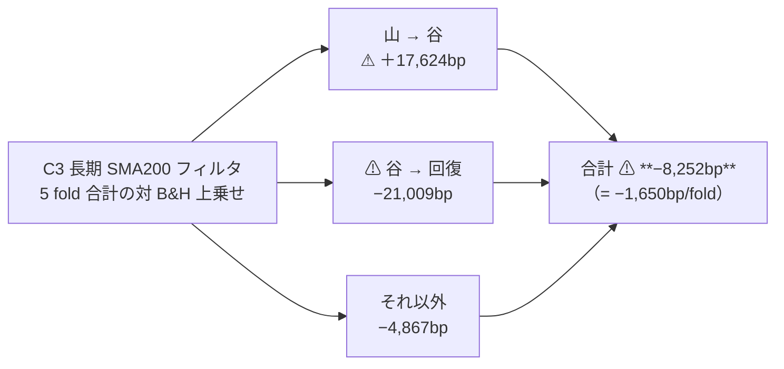
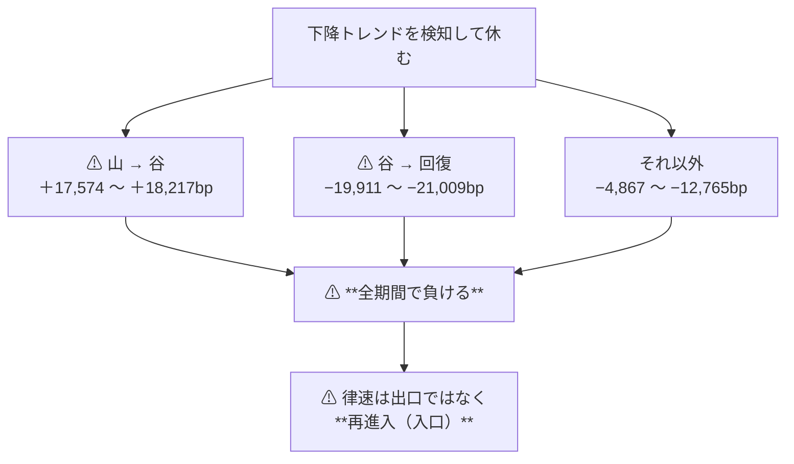

# 下降トレンドの検知の検証（長期・中期・短期）

調査日: 2026-09-12（**完了**）。派生元: [TODO の同名タスク](../../../TODO.md)（利用者の指示 2026-09-11）。
プラン: [downtrend-detection.md](../../plans/archive/downtrend-detection.md) ／ 規約: [rules.md](feature-discovery/rules.md)（13・14・**15 章**が正本）／ 台帳: [ledger.md](feature-discovery/ledger.md)。
コード: `experiments/feature-discovery/`（`ail/features/trend.py`・`ail/detectors/scale.py`・`config/experiment/trend_scales_1995.toml`）。

> ⚠ **これは投資助言ではなく調査資料である。** 特定の銘柄・売買を推奨しない。
> ⚠ **資金は動かしていない**（2026-08-27 の方針）。取得済みの日足だけを使った。
> ⚠ **数字はすべて【実測 2026-09-12】**。良い数字は根拠「中」が上限（rules.md 11 章 規約 3）。

## 0. ここまでで分かったこと

⚠ **下降トレンドは検知できた。検知できても儲からなかった。**
古典フィルタ（移動平均）は **12 回の下げ相場の 12 回とも**、山 → 谷の損失を**半分前後に減らした**。
⚠ **それでも全期間では B&H に負ける。** ⚠ **谷 → 回復で取り損ねる額が、下げで避けた額を上回るからである。**

> この図の主張: ⚠ **負けの原因は「下げを見つけられないこと」ではない。** 見つけて避けた ＋17,624bp を、⚠ **回復で −21,009bp、平常時で −4,867bp 取り損ねて打ち消している。**

| 問い | 答え |
| --- | --- |
| 下降トレンドは検知できたか | ✅ **できた。** 古典フィルタは **12/12 のエピソードで上乗せが正**（C1 ＋17,574 ／ C2 ＋18,217 ／ C3 ＋17,624bp）。山 → 谷の損失を 1/2〜1/3 に圧縮している（§5） |
| ⚠ では儲かったか | ⚠ **儲からない。** ⚠ **21 試行のどれも B&H を超えない**（採る 0・保留 3・落とす 18）。古典フィルタは **−1,650〜−3,020bp/fold** で大負け（§3） |
| なぜか | ⚠ **谷 → 回復の取り損ねが、下げで避けた額より大きい**（§4）。⚠ **出口の信号ではなく入口（再進入）の信号が律速である** |
| スケールは効いたか | ⚠ **長いほどマシ**（古典フィルタで C3 −1,650 ＞ C2 −2,542 ＞ C1 −3,020bp/fold）。⚠ **どれも負けなので「効いた」ではない** |
| 学習したゲートはどうか | ⚠ **B&H に退化した。** 保有日率 0.90〜1.00 で、⚠ **12 回の下げのうち 10 回は 1 日も休まなかった**（§5）。短期ゲートは θ=50・55 で ⚠ **B&H と 1 日も違わない** |
| 合成（14-6 a）は単独スケールに勝ったか | ⚠ **勝たない。** θ=55 では D4 ＋10.6 ＜ D2 ＋101.3bp。⚠ **平均は最良を薄めるだけだった**（プラン §6 の予想 3 どおり） |
| ⚠ 乱択ゲート（14-6 b）との比較は | ⚠ **古典フィルタは「でたらめに同じ日数休む」より悪い**（C1 −1,557 ／ C2 −1,255 ／ C3 −804bp/fold）。⚠ **休む日の選び方が、全期間で見ると逆に効いている** |
| 配線は信用できるか | ✅ **leak 対照が全部の軸で跳ねた**（上乗せ ＋16,844bp・5/5・t 8.15・10/10 bin・12/12 エピソード・DSR 1.000。§2-2） |
| 門（14-5）は | ⚠ **7 本とも門前**（AUC 0.491〜0.512）。⚠ **回すと事前に決めて回し、21 試行として数えた**（§2-1） |
| n_trials | **139 → 160**（台帳が数えた【実測】） |

⚠ **これは「効かないことの証明」ではなく「この設定では効かなかった」である。** 限界は §7。

## 1. 何を検証したか

⚠ **動かした軸は 1 つだけ — 予測の対象。** 既存 24 試行は「明日の符号」を当てにいって較正の傾き a ≈ 0
（＝ 確率に情報が無い）だった（[threshold-trading.md §2](threshold-trading.md)）。⚠ **ここでは「先 W 営業日の符号」を対象にした。**

> この図の主張: ⚠ **検証の後ろ（閾値・状態機械・判定）は 13 章のまま 1 行も変えていない。** 差し替えたのは買い% の作り方だけ。

| 決めごと | 中身 | どこで決めたか |
| --- | --- | --- |
| スケール | 窓 W ∈ {20, 60, 200} 営業日だけで定義。⚠ **3 つに同じ 6 列**（移動平均乖離・傾き・高値からの下落・上げ日率・ボラ・累積リターン） | [rules.md 15-2](feature-discovery/rules.md) |
| 学習の対象 | ⚠ **先 W 営業日の累積対数リターン `y_fwd_W`。** 買い% = P(y_fwd_W > 0) の Platt 較正 | 15-3 |
| 損益の対象 | ⚠ **今までどおり 1 日の `y`**（シミュレータは 13-4 のまま） | 15-3 |
| 下げ幅 | ⚠ **置かない**（符号だけ）。手で置いた数値は 1 つずつが自由度（14-9） | 15-3 |
| パージ | ⚠ **300 暦日**（営業日 200 本を暦で覆う。⚠ **営業日のまま当てると 3 割足りない**） | 15-4 |
| 閾値・形式 | θ ∈ {50, 55, 60}・(A) 共通 1 本だけ | 13-3・13-6 |
| モデル | Ridge 1 本（⚠ **モデルは別の処置。軸を 2 つ同時に動かさない**） | プラン §7 |

検知器 7 本（⚠ **7 × 3 閾値 = 21 試行**）:

| # | 手法 | 中身 | 学習 |
| ---: | --- | --- | :-: |
| 1〜3 | `D1 / D2 / D3 ゲート（20 / 60 / 200 日・学習）` | そのスケールの 6 列 → Ridge → Platt 較正 | ✅ 訓練分割の内側 |
| 4 | `D4 合成ゲート（3スケール平均）` | D1・D2・D3 の買い% の**単純平均**（⚠ 重みを手で置かない） | ✅ |
| 5〜7 | `C1 / C2 / C3 SMA20 / 60 / 200 フィルタ` | ⚠ **終値が移動平均より上なら 100、下なら 0** | ❌（公表された規則） |

表（`trend_scales_1995`）【実測】:

| 量 | 値 | ⚠ 注 |
| --- | ---: | --- |
| 期間 ／ 行 ／ 銘柄 ／ 特徴量 | 1995-08-31 〜 2025-11-18 ／ 410,404 ／ 63 ／ 53 | ⚠ **両端が削れる** — 頭は 200 本の助走、尻は `y_fwd_200` の 200 本 |
| 検証期間 ／ 検証日数 | 2000-09-08 〜 2025-11-18 ／ **6,336 日** | 最初の 1/6 は訓練（14-4 と同じ形） |
| fold ／ 1 fold の日数 | 5 ／ **1,267 日** | ⚠ **14-7 の「ラベルの 6 倍以上」= 1,200 日を満たす**（余裕は 67 日しかない） |
| fold ごとの銘柄 | 54 / 58 / 61 / 63 / 63 | ⚠ **早い fold ほどパネルが痩せる**（12-1） |
| 上がる割合（学習の対象） | y_fwd_20 0.578 ／ y_fwd_60 0.618 ／ **y_fwd_200 0.684** | ⚠ **長いスケールほど「休め」が出にくい**（基準率が高い） |
| B&H の純利 | **4,220.2bp/fold ＝ 3.33bp/日** | ⚠ 期間が違うので他の表と直接比べない（13-8） |

## 2. 配線【実測 2026-09-12】

### 2-1. ⚠ 門は 7 本とも門前だった（それでも回した）

| 手法 | holdout AUC | 買い% 幅（点） | 門 |
| --- | ---: | ---: | :-: |
| D1 短期ゲート（20日） | 0.502 | ⚠ **0.0008** | ⚠ 門前 |
| D2 中期ゲート（60日） | 0.512 | 10.6 | ⚠ 門前 |
| D3 長期ゲート（200日） | 0.509 | 6.3 | ⚠ 門前 |
| D4 合成ゲート | 0.511 | 5.8 | ⚠ 門前 |
| C1 / C2 / C3 SMA フィルタ | 0.491 / 0.492 / 0.496 | 100.0 | ⚠ 門前 |
| （参考）leak 表の D1〜D4 | **0.527〜0.588** | **100.0** | ✅ 通過 |

⚠ **回すと決めたのは結果を見る前である**（[プラン §2-6](../../plans/archive/downtrend-detection.md)。rules.md 14-5 規律 3 の形）。理由は 2 つ。

| # | 理由 |
| ---: | --- |
| 1 | ⚠ **門の AUC は大きさを見ない。** 順位だけの指標なので、⚠ **下げ日の「大きさ」に乗るレジームの効果を落としうる**（門は 1 日地平の確率手法のために作られた指標である） |
| 2 | ⚠ **数える側に倒した。** 回した 21 試行は全部 n_trials に数えた（139 → 160）。⚠ **門で落として数えないほうが DSR は甘くなる** |

⚠ **結果として、門の判断は当たっていた**（21 試行のうち「採る」は 0）。⚠ **ただし当たっていたのは結論だけで、理由は違う** — 門は「確率に情報が無い」と言ったが、§4 が示すのは「情報はあるが取り出せない」である。

### 2-2. leak 対照 — ⚠ 全部の軸で跳ねた（rules.md 13-10）

| 量（最良手法 × θ=50） | leak 表 | 本番の表 |
| --- | ---: | ---: |
| 対 B&H 上乗せ | ⚠ **＋16,843.8bp/fold** | ＋39.9bp/fold |
| fold の符号 | ✅ **5/5 ＋＋＋＋＋** t=8.15 | 2/5 ＋＋000 t=1.63 |
| 10 bin の符号（14-3） | ✅ **10/10** | 3/10 |
| 乱択ゲートとの差（14-6 b） | ✅ **＋18,427.6bp** 5/5 | −16.7bp 1/5 |
| エピソードの上乗せ（14-8） | ✅ **12/12 回が正・合計 ＋46,964bp** | 2/12 回・合計 ＋655bp |
| DSR | 1.000 | 0.325 |

✅ **較正 → 閾値 → 状態機械 → 診断の配線は健全で、§3 の数字は「測れている」。**
⚠ **スケールごとに答えの列を混ぜて初めて跳ねる**（1 日先の答えだけでは 200 日先の符号をほとんど教えない）。これは `ail/features/labels.py` の `LEAK_fwd_{W}` で担保した。

## 3. 結果 — 21 試行の全表【実測 2026-09-12】

⚠ **3 閾値とも載せる**（良かった閾値だけ報告しない。rules.md 13-3 の 3）。B&H の純利は 4,220.21bp/fold。

| 手法 | θ | 純利bp | 上乗せbp | t | 符号 | 取引/fold | 保有日率 | ⚠ 乱択ゲート差bp | 判定 |
| --- | ---: | ---: | ---: | ---: | :-: | ---: | ---: | ---: | :-: |
| D2 中期ゲート（60日） | 55 | ＋4321.5 | **＋101.3** | 0.92 | 3/5 | 92 | 0.94 | ＋34.6 | **保留** |
| D4 合成ゲート | 50 | ＋4260.1 | **＋39.9** | 1.63 | 2/5 | 193 | 0.96 | −16.7 | **保留** |
| D4 合成ゲート | 55 | ＋4230.8 | **＋10.6** | 0.60 | 1/5 | 61 | 0.97 | ＋19.0 | **保留** |
| D1 短期ゲート（20日） | 50 | ＋4220.2 | ⚠ **0.0** | — | 0/5 | 60 | **1.00** | 0.0 | 落とす |
| D1 短期ゲート（20日） | 55 | ＋4220.2 | ⚠ **0.0** | — | 0/5 | 60 | **1.00** | 0.0 | 落とす |
| D3 長期ゲート（200日） | 60 | ＋4155.1 | −65.1 | −1.23 | 1/5 | 60 | 0.91 | −146.7 | 落とす |
| D4 合成ゲート | 60 | ＋4106.4 | −113.8 | −1.50 | 0/5 | 58 | 0.95 | −81.1 | 落とす |
| D2 中期ゲート（60日） | 50 | ＋4100.9 | −119.3 | −1.67 | 2/5 | 316 | 0.94 | −147.3 | 落とす |
| D3 長期ゲート（200日） | 55 | ＋4055.6 | −164.7 | −1.55 | 0/5 | 65 | 0.90 | −136.6 | 落とす |
| D3 長期ゲート（200日） | 50 | ＋4049.6 | −170.6 | −1.08 | 1/5 | 173 | 0.90 | −194.5 | 落とす |
| D2 中期ゲート（60日） | 60 | ＋3961.0 | −259.2 | −1.66 | 0/5 | 70 | 0.92 | −245.7 | 落とす |
| C3 長期 SMA200 | 50/55/60 | ＋2569.8 | **−1650.4** | −2.23 | 1/5 | 1,261 | 0.66 | ⚠ **−804.4** | 落とす |
| D1 短期ゲート（20日） | 60 | ＋2565.9 | −1654.3 | −1.28 | 1/5 | 25 | 0.40 | 0.0 | 落とす |
| C2 中期 SMA60 | 50/55/60 | ＋1678.3 | **−2541.9** | −4.12 | 0/5 | 2,469 | 0.60 | ⚠ **−1255.2** | 落とす |
| C1 短期 SMA20 | 50/55/60 | ＋1200.1 | **−3020.1** | −4.70 | 0/5 | 4,454 | 0.57 | ⚠ **−1556.8** | 落とす |
| （基準）直前リターンの符号 | 50/55/60 | −1482.2 | −5702.4 | — | — | 18,837 | 0.52 | — | 基準線 |

| # | 読み方 |
| ---: | --- |
| 1 | ⚠ **学習したゲートは B&H に退化した。** 保有日率 0.90〜1.00 で、⚠ **D1 は θ=50・55 で B&H と 1 日も違わない**（上乗せがちょうど 0.0）。門の「買い% 幅 0.0008 点」がそのまま出た形 |
| 2 | ⚠ **古典フィルタだけがよく休む**（保有日率 0.57〜0.66）。⚠ **そして大きく負ける。** 休みが多いほど負けが大きい（C1 ＜ C2 ＜ C3） |
| 3 | ⚠ **θ を上げても同じ**（古典フィルタは買い% が 0/100 なので θ で結果が変わらない。学習ゲートは θ=60 で全部悪化）。⚠ **「θ が高いほど良い」は今回も出ていない**（13-10 の検査） |
| 4 | ⚠ **保留 3 行はどれも t < 2・符号が割れる雑音。** 検出限界（§6-2）の 5〜7 分の 1 の大きさで、⚠ **「採るの一歩手前」ではない**（11 章 規約 2） |
| 5 | ⚠ **乱択ゲート差が負 ＝ 「でたらめに同じ日数休む」より悪い。** 古典フィルタ 3 本ともこれに当たる（§4 が理由） |

## 4. ⚠ 本書の核 — 下げでは勝ち、回復で倍返しされる【実測 2026-09-12】

⚠ **B&H の累積曲線から山 → 谷が 10% 以上の区間を拾い**（12 回。§5）、検証期間 6,336 日を
**山 → 谷（1,481 日）／ 谷 → 回復（2,258 日）／ それ以外（2,597 日）** に分けて上乗せを足し合わせた。

| 手法（θ） | 全期間 | ⚠ 山 → 谷 | ⚠ 谷 → 回復 | それ以外 | 休んだ日率 |
| --- | ---: | ---: | ---: | ---: | ---: |
| C1 短期 SMA20（50） | −15,101 | ⚠ **＋17,574** | ⚠ **−19,911** | −12,765 | 42.9% |
| C2 中期 SMA60（50） | −12,710 | ⚠ **＋18,217** | ⚠ **−20,245** | −10,682 | 39.7% |
| C3 長期 SMA200（50） | −8,252 | ⚠ **＋17,624** | ⚠ **−21,009** | −4,867 | 34.3% |
| D2 中期ゲート（55） | ＋506 | ＋1,079 | −626 | ＋53 | 5.5% |
| D4 合成ゲート（50） | ＋199 | ＋655 | −494 | ＋38 | 4.1% |

（数字は 5 fold 合計の対 B&H 上乗せ bp）

> この図の主張: ⚠ **どのスケールでも符号は同じ。** 下げで取り、回復で倍返しされ、平常時にも削られる。

| # | 読み方 |
| ---: | --- |
| 1 | ⚠ **「下げが見つけられない」という問題ではない。** 3 スケールとも山 → 谷で ＋17,500bp 以上を取っている。⚠ **スケールを変えてもこの額はほとんど動かない**（＋17,574 / ＋18,217 / ＋17,623） |
| 2 | ⚠ **負けの本体は谷 → 回復である。** ⚠ **移動平均が上向くまで戻れないので、一番強い戻りを外から見ている。** 回復の日数（2,258 日）は下げの日数（1,481 日）の 1.5 倍あり、しかも 1 日あたりの上げが大きい |
| 3 | ⚠ **山・谷・回復の日付は後から決めたもの**（B&H の実現した曲線から拾った）。⚠ **「下げのときだけ休む」は、下げの区間を知っていて初めて言える** — だから §3 の判定が正しく、この分解は診断である（14-8） |
| 4 | ⚠ **学習ゲートは休まないので、この表でもほとんど動かない**（休んだ日率 4〜6%）。⚠ **B&H に退化したことの裏面である** |
| 5 | ⚠ **生存バイアスがこの向きを強めている**（12-1）。⚠ **63 銘柄は 2026 年の時価総額上位で、12 回の下げは 12 回とも回復した。** ⚠ **回復しなかった銘柄は 1 本も入っていない**ので、「休む」は構造的に不利である |

## 5. エピソード表（rules.md 14-8）【実測 2026-09-12】

⚠ **成果物であって採否には使わない。** ⚠ **実効標本はエピソードの回数（12 回）で、検定にならない。**

⚠ **C3 長期 SMA200 フィルタ**（最もよく休んだ手法）。上乗せは山 → 谷の区間だけ:

| # | 山 | 谷 | 回復 | 日数 | B&H bp | C3 bp | 上乗せ bp | C3 の保有日率 |
| ---: | --- | --- | --- | ---: | ---: | ---: | ---: | ---: |
| 1 | 2000-09-08 | 2002-10-08 | 2005-11-09 | 520 | −6,090 | −2,641 | **＋3,450** | 0.40 |
| 2 | 2006-05-04 | 2006-07-13 | 2006-09-19 | 48 | −1,024 | −684 | ＋340 | 0.57 |
| 3 | 2007-10-30 | 2009-03-06 | 2011-04-26 | 339 | −7,285 | −2,042 | ⚠ **＋5,244** | 0.27 |
| 4 | 2011-05-09 | 2011-09-30 | 2012-02-15 | 101 | −2,001 | −1,058 | ＋943 | 0.56 |
| 5 | 2012-03-23 | 2012-05-31 | 2012-09-13 | 47 | −1,212 | −962 | ＋249 | 0.84 |
| 6 | 2015-07-17 | 2015-08-24 | 2015-10-27 | 26 | −1,278 | −631 | ＋647 | 0.62 |
| 7 | 2015-12-03 | 2016-02-10 | 2016-04-12 | 46 | −1,470 | −722 | ＋747 | 0.42 |
| 8 | 2018-01-25 | 2018-03-29 | 2018-07-24 | 44 | −1,129 | −1,035 | ＋93 | 0.73 |
| 9 | 2018-09-28 | 2018-12-21 | 2019-04-04 | 58 | −2,077 | −1,132 | ＋945 | 0.53 |
| 10 | 2020-02-18 | 2020-03-20 | 2020-08-11 | 23 | −4,032 | −1,941 | **＋2,091** | 0.41 |
| 11 | 2021-12-31 | 2022-10-11 | 2024-01-18 | 195 | −3,116 | −1,260 | **＋1,856** | 0.33 |
| 12 | 2025-02-18 | 2025-04-07 | 2025-07-22 | 34 | −2,008 | −990 | ＋1,018 | 0.49 |
| | | | | | | | ⚠ **12/12 が正・合計 ＋17,624** | |

⚠ **学習ゲート（D4 合成・θ=50）は同じ 12 回で 2 回しか動かない**: 2000-09〜2002-10 で ＋626bp、2007-10〜2009-03 で ＋28bp、⚠ **残り 10 回は保有日率 1.00（1 日も休まない）**。

| # | 読み方 |
| ---: | --- |
| 1 | ⚠ **検知そのものは働いている。** 26 日の急落（2020-03）でも 520 日の長い下げ（2000-02）でも、⚠ **同じ 1 本の規則で損失を半分前後に圧縮した** |
| 2 | ⚠ **大きい下げほど効く**（2008 年 ＋5,244bp・2020 年 ＋2,091bp）。⚠ **これは「大きさに乗る効果」であって、門の AUC が見ない種類のものである**（§2-1 の理由 1 が当たっていた） |
| 3 | ⚠ **それでも §4 のとおり、回復で取り返されて全期間では負ける。** ⚠ **この表だけを見て「効いた」と読んではいけない** — 14-8 が「採否に使わない」と書いているのはこの形の誤読を防ぐためである |
| 4 | ⚠ **12 回はすべて回復している**（回復日が全部埋まっている）。⚠ **生存バイアスの直接の現れ**であり、エピソード表の読みに素直に効く（12-1） |

## 6. 検査【実測 2026-09-12】

### 6-1. 診断列（rules.md 14-3）と乱択ゲート（14-6 b）

| 手法 × θ | 10 bin の符号 | 乱択ゲート差 | 実効系列数 | DSR |
| --- | :-: | ---: | ---: | ---: |
| D4 合成 × 50 | 3/10 ＋−＋＋000000 | −16.7bp 1/5 | 63 → **4.19 本** | 0.325 |
| D2 中期 × 55 | 4/10 ＋−−−＋000＋＋ | ＋34.6bp 3/5 | 同上 | 0.344 |
| D3 長期 × 60 | 2/10 ＋−−0＋−0000 | −146.7bp 0/5 | 同上 | 0.332 |

⚠ **DSR は n_trials 160・n_obs 6,336 で 0.32〜0.34。** 慣例の 0.95 に遠い。
⚠ **銘柄別 bp の「勝ち 60/63」は独立な 60 勝ではない**（実効系列数 4.19 本）。中央値 ＋17,064bp は B&H のドリフトの写しである（13-7）。

### 6-2. 検出限界 — この物差しで測れる大きさだったか（14-2）

| 手法 | 日次上乗せの σ | 非ゼロ日率 | 検出限界（符号 5/5・確率 0.8） | 実測の上乗せ |
| --- | ---: | ---: | ---: | ---: |
| C3 長期 SMA200 | 87.8bp/日 | 0.996 | 4.22bp/日 ＝ **5,346bp/fold** | ⚠ **−1,650bp/fold** |
| C2 中期 SMA60 | 89.0bp/日 | 0.999 | 4.27bp/日 ＝ 5,415bp/fold | −2,542bp/fold |
| D2 中期ゲート | 11.7bp/日 | 0.312 | 0.56bp/日 ＝ **711bp/fold** | ＋101bp/fold |
| D4 合成ゲート | 9.1bp/日 | 0.211 | 0.44bp/日 ＝ 556bp/fold | ＋40bp/fold |

| # | 読み方 |
| ---: | --- |
| 1 | ⚠ **古典フィルタは「勝っていたら測れなかった」大きさで負けた。** σ が 88bp/日と大きいので限界が 5,346bp/fold まで上がる。⚠ **負けのほうは t = −2.2〜−4.7 で確からしい**（悪い数字は結論・11 章 規約 2） |
| 2 | ⚠ **学習ゲートは σ が小さい**（B&H とほとんど同じ動きをするから）ので限界も低い（556〜711bp/fold）。⚠ **それでも実測の ＋40〜＋101bp は限界の 1/7〜1/5 で、雑音の中にある** |
| 3 | ⚠ **プラン §1 の見立て（レジーム級なら限界の上に出うる）は半分当たった。** ⚠ **下げの区間だけを見れば ＋17,624bp で限界のはるか上**だが、⚠ **全期間では回復の取り損ねに打ち消されて限界の下に沈む**（§4） |

### 6-3. 既存の記録を壊していないこと

| # | 確かめたこと | 結果 |
| ---: | --- | --- |
| 1 | 台帳の既存 245 行が 1 行も消えないか | ✅ **1 行も消えていない**（生成文の「落とした 102 行」→「120 行」だけが動いた） |
| 2 | n_trials の増え方が見積りどおりか | ✅ **139 → 160**（＋21 ＝ 7 手法 × 3 閾値。leak と基準線は数えない） |
| 3 | 判定の内訳 | 落とす 102 → **120**（＋18）／ 保留 37 → **40**（＋3）／ ⚠ **採る 0 → 0** |
| 4 | 既存の表・既存の実行に触っていないか | ✅ **`trend` 層は新しい層で、既存の実験の `feature_layers` に入らない。** 既存の表は 1 列も増えていない |
| 5 | pytest | ✅ **223 件 pass**（新規 10 件 ＋ 先読みの検査に `trend` とスケールのラベルを追加） |

## 7. 判定と限界【実測 2026-09-12】

| 問い | 答え |
| --- | --- |
| 21 試行の行き先 | **落とす 18 ／ 保留 3 ／ 採る 0**。保留はどれも t < 2・符号が割れ、検出限界の 1/5 以下 |
| 利用者の問い「下降トレンドは取れるか」 | ⚠ **取れる。ただし取っても勝てない。** 長期・中期・短期のどのスケールでも下げの圧縮は効き（12/12）、⚠ **回復の取り損ねが上回る** |
| 「保有期間を長くして上昇を拾う」という当初の見立ては | ⚠ **半分正しい。** 長いスケールほど負けが小さい（C3 ＞ C2 ＞ C1）が、⚠ **一番長い ＝ 一度も休まない（B&H）が最良**という並びであり、⚠ **「休む」こと自体がこの標本では不利である** |
| E8 のどの型か | ⚠ **新しい型。** X2（コストで消える）でも X9（標本不足）でもない — ⚠ **予測はできていて、売買規則に落とすところで消える**。⚠ **コストは効いていない**: C3 のコストは **108.6bp/fold**（粗利 2,678.4 − 純利 2,569.8）で、⚠ **負けの 1,650bp/fold の 7% にしかならない**。C1 でも 383.1bp で負けの 13%【実測】 |
| ⚠ 消せない限界 | ⚠ **生存バイアス**（12-1）。⚠ **12 回の下げが 12 回とも回復する標本で「休む」を測っている。** 上場廃止・長期低迷の銘柄が 1 本も無いので、⚠ **本書の結論は「休む」に厳しい側に偏っている** |
| 〃 | ⚠ **fold の余裕が 67 日しかない**（1,267 日 対 14-7 の下限 1,200 日）。⚠ **これ以上長いスケールは、この期間では検証できない** |
| 〃 | 終値執行・コスト片道 2.5bp 固定・1 会場のデータ（12 章の限界 7・8 のまま） |
| n_trials | ⚠ **139 → 160**。DSR の基準はそのぶん厳しくなった（正しい向き） |
| 次に動かすなら | ⚠ **出口ではなく入口。** §4 が名指ししたのは ⚠ **「谷で再進入する信号」**である。下げの検知は既に働いているので、⚠ **同じ 6 列で「回復の始まり」を当てにいくのが、この結果が指している唯一の方向**【推測】 |

> この図の主張: ⚠ **次の一手は「もっと良い下げ検知」ではない。** そこは既に働いている。

## 8. ⚠ 回さなかったもの（と理由）

| 候補 | 扱い | ⚠ 理由 |
| --- | --- | --- |
| triple-barrier ／ トレンドスキャニングのラベル | 見送り | ⚠ **下げ幅・倍率という手で置く数値が要る**（14-9 の向きと逆）。⚠ **§4 の分解を見るかぎり、ラベルを凝っても「回復で取り返される」ところは動かない**【推測】 |
| HMM ／ 変化点検知 | 見送り | 状態数・事前分布の自由度で n_trials が跳ねる。⚠ **出口の精度を上げる方向であり、§7 の律速に当たらない**【推測】 |
| ボラティリティ・ゲート単独 | ⚠ **各スケールの 6 列に `vol` として入れた**（単独の手法にはしない） | 同じ枠の中で効くかを先に見た |
| 12 か月モメンタム | 見送り | ⚠ **`own_trend200_ret` が同じ情報**（200 営業日 ≈ 10 か月） |
| (B) 銘柄別 | 見送り | 全 12 試行で (A) 以下という実測（threshold-trading §4） |
| LightGBM ほかのモデル | 見送り | ⚠ **モデルは別の処置。** ⚠ **足すと 21 試行がもう 1 組増える**（n_trials 160 → 181） |
| 空売り | ⚠ **枠の外** | 13-4 の状態機械は買い専用（0 か 1）。⚠ **売りを入れるのは検証方式の変更であり、別の処置である** |
