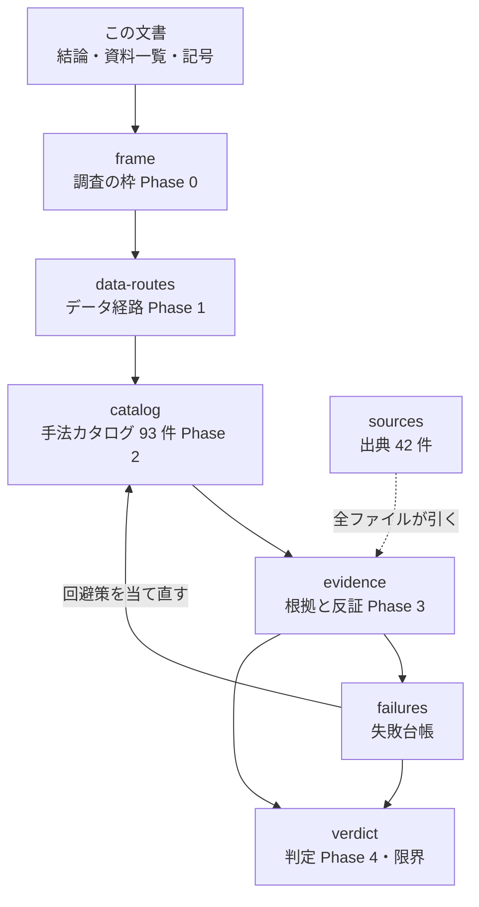

# E8: 上昇・下降のシグナルの手法カタログと失敗台帳

調査日: 2026-09-08。対象: [online-tradable-assets.md](../online-tradable-assets.md) の **E8（譲渡益を繰り返し実現する運用）**。
プラン: [docs/plans/archive/market-signal-methods.md](../../plans/archive/market-signal-methods.md)

**この 1 枚が入口である。** 結論と、⚠ **どのファイルに何があるか**をここに置き、中身は [`e8-signal-methods/`](e8-signal-methods/) の 7 本にぶら下げてある。

> ⚠ **これは投資助言ではなく調査資料である。** [trading-tax.md](../trading-tax.md) と同じ扱いで、特定の銘柄・売買を推奨しない。
> ⚠ **年 1000% は利用者が置いた「目標」であって、本書の予測ではない。**
> ⚠ **2026-08-27 の方針どおり資金は動かしていない。** 本書で【実測】と書けるのは、tastytrade の **API の挙動**（過去の足が取れるか）だけである。

## 0. 結論

**93 件の手法に属性と根拠の強さを付け、5 つの反証ゲートを通した。年 1000%（税引後 11 倍）に届く行は 1 件も無い。到達できた最良は税引後 年 22〜37%【推測】で、達成率 0.022〜0.037（目標の 1/45〜1/27）である。**

⚠ **そして上限を作っているのは手法選びでも、回転数でもなかった。** 失敗の型ごとに数えると **X12（方向を当てていない）29 件・X5（過剰適合）17 件・X7（publication decay）11 件**で、
⚠ **コストと税で落ちたのは 9 件しかない**（[§6-3](e8-signal-methods/failures.md)）。そして**残った手法をどれだけ良く組んでも目標に届かない理由**は、型の件数ではなく次の 1 本の算術にある。

> ⚠ **資金の増え方の上限は「シャープレシオの 2 乗 ÷ 2」で頭打ちになる。** 目標に必要なのは対数成長率 2.65/年、
> つまり**コストと税を引いた後のシャープレシオ 2.30 を、フルケリー（＝ 途中で資産が半分になる確率が 5 割の張り方）で回し続けること**である。

| 見方 | 数字 | 出どころ |
| --- | ---: | --- |
| 年 1000% ＝ 税引後 11 倍に要る対数成長率 | **2.65 /年** | ln(14.2)。[§1-3](e8-signal-methods/frame.md)【推測（算術）】 |
| それに要るシャープレシオ（フルケリー時） | **2.30** | √(2 × 2.65)。[§5-3](e8-signal-methods/evidence.md)【推測（算術）】 |
| 公表されている最良の長期記録（Medallion 1988〜2018） | 年 **63.3%** ＝ 対数成長率 **0.49** | Cornell (2020)【公表値】 |
| **目標 ÷ 史上最高の記録** | **5.4 倍** | 2.65 ÷ 0.49 |
| 本書で到達した最良（段 3・先物・半ケリー） | 税引後 年 **22〜37%** | [§5-3](e8-signal-methods/evidence.md)【推測】 |

⚠ **つまり年 1000% は「まだ見つかっていない手法」の問題ではなく、「30 年続いた史上最高の記録の 5.4 倍」という水準の問題である。** カタログを何件に増やしても、この 1 行は動かない。

### 0-1. それでも E8 は候補として残る

⚠ **目標に届かないことと、E8 が E1・E2 に劣ることは別である。**

| 候補 | 税引後の年間収入（$100,000） | 根拠の強さ | ⚠ 代償 |
| --- | ---: | --- | --- |
| E2 米国債 10 年 | **$3,542** | 強（[online-tradable-assets.md §4](../online-tradable-assets.md)） | ほぼ無い |
| E1 SCHD 高配当株 ETF | **$2,601** | 強（同上） | 株価変動 |
| **E8 本書の最良（段 3・分散したトレンド追随・半ケリー）** | **$22,000〜37,000**【推測】 | **中** | ⚠ 最大ドローダウン 30〜50%・週 5〜15 時間・手数料 月 $172〜179 |
| **E8 同（段 1・現物のみ・買い持ちだけ）** | **$8,700**【推測】 | 中 | ⚠ ほぼ市場並み。手間の割に上乗せが小さい |

⚠ **段 1（現物のみ）では市場平均とほとんど変わらない。** 上の差を作っているのは手法ではなく**商品の段**（空売りの脚が持てるか、§1256 の税率が使えるか）である。

### 0-2. 副産物として確定した 3 つ

| # | 何が分かったか | どこに効くか |
| --- | --- | --- |
| 1 | ⚠ **tastytrade の口座で個別銘柄の過去の足が取れる**（SPY 日足 **8,003 本・1993-10-31 から**【実測 2026-09-08】） | プランは「取れないなら断面（J）とペア取引（B5）を落とす」としていたが、**取れたので落とさなかった**。[§2](e8-signal-methods/data-routes.md) |
| 2 | ⚠ **PDT（パターンデイトレーダー）の $25,000 規制は 2026-06-04 に廃止された** | 「T+1 決済が回転数の上限になるか」は**信用口座では最初から効かず、いまは指定そのものが無い**。現金口座の 90 日凍結（Reg T 220.8(c)）だけが残る。[§1-6](e8-signal-methods/frame.md) |
| 3 | ⚠ **1 分足の記号は `{=m}`。`{=1m}` は誤りではなく「静かに 0 件」を返す** | 自動売買で足を取るときに効く落とし穴。[§2-1](e8-signal-methods/data-routes.md) |

## 資料一覧

> この図の主張: 上から順に **枠を決める → データを確かめる → 並べる → 絞る → 落ちたものを配る → 判定する**。⚠ **失敗台帳だけはカタログへ戻る**（回避策を当て直すため）。

| # | ファイル | 中身 | 行 |
| ---: | --- | --- | ---: |
| 1 | [調査の枠（Phase 0）](e8-signal-methods/frame.md) | 入力の線引き ／ カタログの列 ／ **年 1000% の物差し** ／ 回転数とコスト ／ 破産確率 ／ ⚠ **回転数に法的な上限はあるか** ／ 商品の段 | 128 |
| 2 | [使えるデータ経路（Phase 1）](e8-signal-methods/data-routes.md) | ⚠ **tastytrade の口座から個別銘柄の日足が 1993 年まで取れた**【実測】／ 経路の一覧 ／ ここで落ちる系統 | 70 |
| 3 | [手法カタログ（Phase 2）](e8-signal-methods/catalog.md) | ⚠ **本体。12 系統 93 件**の表（属性 6 つ ＋ 失敗の型）／ 周回の記録 | 195 |
| 4 | [根拠の強さと反証（Phase 3）](e8-signal-methods/evidence.md) | 強 / 中 / 弱 の 3 段 ／ **年 1000% 級の実在** ／ publication decay ／ **5 ゲートで 46 → 4 件** ／ ⚠ **達成率** | 182 |
| 5 | [失敗台帳](e8-signal-methods/failures.md) | 台帳 14 件 ／ 回避策 12 本の再検査 ／ ⚠ **型ごとの件数** | 91 |
| 6 | [判定と限界（Phase 4）](e8-signal-methods/verdict.md) | 達成率で並べる ／ 条件が変わったらどこを見るか ／ ⚠ **この調査の限界** ／ 再現の仕方 | 75 |
| 7 | [出典](e8-signal-methods/sources.md) | 規制・制度 6 件 ／ 査読論文・総説 36 件 ／ プロジェクト内の参照 | 74 |
| | **合計** | | **815** |

## 目的別の読む順

自分の目的に一番近い行だけ読めばよい。所要時間は通読の目安。

| 目的 | 読む順 | 所要 |
| --- | --- | --- |
| **A. 結論だけ知りたい** | この文書の §0 だけ | 3 分 |
| **B. なぜ届かないのかを納得したい** | この文書 §0 → [根拠と反証 §5-3](e8-signal-methods/evidence.md)（**成長率の上限**）→ [判定 §7-2](e8-signal-methods/verdict.md) | 15 分 |
| **C. 手法を探しにきた** | [カタログ](e8-signal-methods/catalog.md) の該当系統 → その行の**失敗の型**を下の**記号の早見表**で引く → [失敗台帳 §6-1](e8-signal-methods/failures.md) で落ちた根拠を見る | 20 分 |
| **D. 前提が変わったので見直したい** | [判定 §7-3](e8-signal-methods/verdict.md)（**どこから見直すか**の表）→ [失敗台帳 §6-3](e8-signal-methods/failures.md)（型ごとの件数） | 10 分 |
| **E. データが取れるかを知りたい** | [データ経路 §2-1](e8-signal-methods/data-routes.md)（tastytrade の実測）→ [経路の一覧 §2-2](e8-signal-methods/data-routes.md) | 8 分 |
| **F. 主張の裏付けを疑いたい** | [出典](e8-signal-methods/sources.md) → [根拠と反証 §4-2](e8-signal-methods/evidence.md)（**年 1000% 級は実在するか**）→ [限界 §9-1](e8-signal-methods/verdict.md) | 25 分 |

⚠ **C を選んだ場合の注意**: カタログの表は**属性が横展開の抽出キー**になっている（粒度 L0 → X1、回転数 ≥ 250 → X2 …）。
1 行だけ見て判断せず、[失敗台帳](e8-signal-methods/failures.md) で**同じ型の行がどう扱われたか**まで見ること。

## 記号の早見表

各ファイルを開く前に、ここだけ見ておけば表が読める。

| 列 | 値 |
| --- | --- |
| **当て**（当てにいくもの） | **方向**（上がるか下がるか）／ **幅**（どれだけ動くか）／ **転換点**（いつ切り替わるか）／ **相対**（どちらが強いか）／ **フィルタ**（単体では売買しない）／ **道具**（シグナルではない） |
| **粒**（要る粒度） | **L0** tick・板 ／ **L1** 分足 ／ **L2** 日足 ／ **L3** 週次〜（[market-data-availability.md §1-2](../market-data-availability.md) の階梯） |
| **回転** | 年あたりの往復。⚠ **≥ 250 は X2 の抽出対象、≤ 12 は X9 の抽出対象** |
| **資源** | **表** 表計算で足りる ／ **C** 手元の CPU ／ **G** ⚠ GPU・低遅延の設備 |
| **現**（現物で組めるか） | **○** ／ **⚠** 片脚だけ ／ **✕** 空売り・デリバティブが要る。⚠ **⚠ と ✕ は X8 の抽出対象** |
| **拠**（根拠の強さ） | **強** 査読 ＋ 独立再現 ＋ 監査済み成績（15 件）／ **中** 査読または監査済み成績（59 件）／ **弱** 二次情報のみ（19 件。⚠ **候補にしない**） |

### 失敗の型 X1〜X12（と、落ちた件数）

⚠ **件数の偏りそのものが結論になる。** 内訳の根拠は [失敗台帳 §6-3](e8-signal-methods/failures.md)。

| 型 | 中身 | 横展開のキー（同じ型に当たる行の抽出条件） | 件数 |
| --- | --- | --- | ---: |
| **X12** | 方向を当てていない（幅・フィルタ・道具） | 当て = 幅 / フィルタ / 道具 | **29** |
| **X5** | 過剰適合（パラメータ数・多重検定・データ覗き） | **パラメータ ≥ 3**、F 系全般 | **17** |
| **X7** | publication decay（公表後に効果が縮む） | A・B・G・I 系（教科書的な帯） | **11** |
| **X1** | データが無い（方針の内側で履歴が取れない） | 粒度 = **L0**、価格の外の情報が要る行 | 7 |
| **X2** | コストで消える（回転数 × c が優位性を上回る） | **回転数 ≥ 250** | 7 |
| **X10** | 定義・別名（実は既存の行と同じ） | 同じ系統の近接行 | 6 |
| **X6** | 先読み・生存バイアス | 独立再現の無い行、G 系 | 3 |
| **X8** | 実行の制約（空売り不可・往復 1,885 ms・設備） | **現物 = ⚠ / ✕**、L0 | 3 |
| **X3** | 税で消える（短期 24 / 40.8%・wash sale） | **保有 < 1 年** | 2 |
| **X9** | 標本不足（検定力が無い） | **回転数 ≤ 12** | 2 |
| **X11** | 破産確率（要るベット比率が許容を超える） | K3・K4 に依存する行 | 1 |
| **X4** | 容量・流動性 | 高ボラ・小型で板が薄い行 | ⚠ **0** |
| — | 生存・道具（A4・J1・F3・F9） | — | 4 |
| — | ⚠ 根拠が弱で除外（G5） | — | 1 |
| | | | **93** |

### 系統の記号 A〜L

| 記号 | 系統 | 件数 | 記号 | 系統 | 件数 |
| --- | --- | ---: | --- | --- | ---: |
| **A** | トレンド・モメンタム | 10 | **G** | パターン認識・類似検索 | 7 |
| **B** | 平均回帰 | 8 | **H** | 板・マイクロストラクチャ | 8 |
| **C** | ボラティリティ・レジーム | 8 | **I** | カレンダー・季節性 | 6 |
| **D** | 時系列モデル | 9 | **J** | 断面・ネットワーク | 6 |
| **E** | 変化点・異常検知 | 6 | **K** | 執行・資金管理 | 8 |
| **F** | 機械学習 | 10 | **L** | 検証手法（メタ） | 7 |

⚠ **K と L はシグナルではない**（達成率を作る側）が、同じ表に並べてある。理由は [カタログ](e8-signal-methods/catalog.md) の冒頭。
