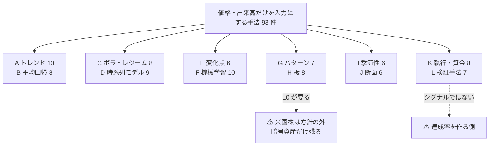

# 3. 手法カタログ（Phase 2・12 系統 93 件）

本書の本体。93 件に属性（当てにいくもの・粒度・回転数・計算資源・現物可否・根拠の強さ・失敗の型）を付けた表と、周回の記録。

入口: [E8 の記録](../e8-signal-methods.md) ／ 前: [2. 使えるデータ経路（Phase 1）](data-routes.md) ／ 次: [根拠の強さと反証（Phase 3・周回 6〜7）](evidence.md)

> この図の主張: 系統は 12。上 4 つが値動きそのもの、中 4 つが統計・学習、下 4 つが場・時間・資金の扱い。⚠ **K と L はシグナルではないが達成率を作る側**なので同じ表に並べる。

**列の読み方**: 当て = 当てにいくもの（方向 / 幅 / 転換点 / 相対 / フィルタ）／ 粒 = 要る粒度 ／ 回転 = 年あたりの往復 ／ 資源 = 表 表計算・C CPU・G GPU/低遅延 ／ 現 = 現物で組めるか ／ 拠 = 根拠の強さ ／ 型 = 失敗の型（[§6-1](failures.md)。「—」は生存）。**数値はすべて【推測】**、出典のある事実は「見どころ」に書く。

## A. トレンド・モメンタム（10）

| ID | 手法 | 当て | 粒 | 回転 | 資源 | 現 | 拠 | 型 | ⚠ 見どころ |
| --- | --- | --- | --- | ---: | --- | --- | --- | --- | --- |
| A1 | 移動平均クロス（SMA/EMA） | 方向 | L2 | 4〜24 | 表 | ○ | 中 | **X7** | Brock ら (1992) が有意を報告 → Sullivan ら (1999) がデータスヌーピング補正で**有意性は残るが 1987 年以降は消える**と報告。Bajgrowicz-Scaillet (2012) は**低い取引コストで完全に相殺**される |
| A2 | MACD | 方向 | L2 | 12〜50 | 表 | ○ | 弱 | **X10**→A1 | 2 本の指数移動平均の差＝ A1 の再パラメータ化。**独立した手法として数えない** |
| A3 | ドンチャン・チャネル / タートル | 方向 | L2 | 10〜30 | 表 | ○ | 中 | **X7** | A7 の特別な場合。勝率が低く連敗が深い＝ **X11 の副因** |
| A4 | 時系列モメンタム（TSMOM 12-1 か月） | 方向 | L2 | 4〜12 | 表 | ⚠ | **強** | **—（生存）** | Moskowitz-Ooi-Pedersen (2012) が **58 銘柄の先物**で確認。Hurst-Ooi-Pedersen (2017) が **1880〜2016 の 67 市場**で「**どの 10 年も正**」と独立再現。⚠ **証拠は先物（段 3）で、現物だけでは片脚** |
| A5 | RSI の順張り運用 | 方向 | L2 | 20〜60 | 表 | ○ | 弱 | **X10**→A1 | 同じ指標を B2 は逆向きに使う。⚠ **両方が儲かる説明が付かない**＝ パラメータ探索の産物 |
| A6 | ROC・KAMA（適応平滑） | 方向 | L2 | 12〜50 | 表 | ○ | 弱 | **X5** | 平滑のパラメータが 3 個以上。Zakamulin は移動平均系の公表成績が**データマイニングで汚染**されていると報告 |
| A7 | ブレイクアウト（N 日高値 ＋ 出来高） | 方向 | L2＋出来高 | 10〜50 | 表 | ○ | 中 | **X7** | A1 と同じ帯。⚠ 高ボラ資産では 1 回の利幅が大きいので [§5](evidence.md) で個別に見た |
| A8 | トレンド強度フィルタ（ADX・R²） | フィルタ | L2 | — | C | ○ | 中 | **X12** | 単体では売買しない。⚠ **期待収益を動かさず分散だけ動かす** |
| A9 | 52 週高値までの距離 | 方向 | L2＋個別多数 | 12〜24 | C | ⚠ | 中 | **X7**・X8 | 断面の情報が要る（J1 と接続）。McLean-Pontiff (2016) の decay 対象に入る帯 |
| A10 | オープニングレンジ・ブレイクアウト（ORB） | 方向 | L1 | 250 | C | ○ | 中 | **X2**・X3 | 日次で建てて日次で閉じる＝ 回転 250 ＋ 全部短期課税。[§1-4](frame.md) で必要優位性 1.06%/取引 |

## B. 平均回帰（8）

| ID | 手法 | 当て | 粒 | 回転 | 資源 | 現 | 拠 | 型 | ⚠ 見どころ |
| --- | --- | --- | --- | ---: | --- | --- | --- | --- | --- |
| B1 | ボリンジャーバンド逆張り | 方向・幅 | L2 | 30〜120 | 表 | ○ | 弱 | **X5** | 移動平均 ＋ 標準偏差の倍率 ＝ B3 の別名。パラメータ 3 個 |
| B2 | RSI・ストキャスの逆張り | 方向 | L2 | 30〜150 | 表 | ○ | 弱 | **X10**→B3 | A5 と同じ指標・逆向き |
| B3 | z-score・移動平均乖離 | 方向 | L2 | 30〜150 | 表 | ○ | 中 | **X2** | B1・B2・B6 の一般形として**この行に寄せた**。回転 ≥ 250 に近く [§1-4](frame.md) で落ちる |
| B4 | 短期反転（1 日〜1 週） | 方向 | L2 | 100〜250 | C | ○ | **中** | **X2** | Avramov-Chordia-Goyal (2006): 反転は**流動性の低い高回転銘柄で最大**だが、⚠ **利益は取引コストより小さい**と明記 |
| B5 | ペア取引・共和分 | 相対 | L2＋個別多数 | 20〜100 | C | ⚠ | **中** | **X7**・X8 | Gatev ら (2006) が年 11% 超過を報告 → Do-Faff (2010) が **月 0.86%（1962-88）→ 0.37%（89-02）→ 0.24%（03-09）** と減衰を報告 |
| B6 | Ornstein-Uhlenbeck 過程の当てはめ | 方向 | L2〜L1 | 30〜150 | C | ⚠ | 中 | **X10**→B3 | B3 の連続時間版。推定の分だけパラメータが増える |
| B7 | VWAP・当日基準値からの乖離 | 方向 | L1〜L0 | 100〜1,000 | C | ○ | 弱 | **X2** | 回転が速く [§1-4](frame.md) の表で真っ先に落ちる |
| B8 | オーバーナイト・ギャップの埋め | 方向 | L2 | 100〜250 | 表 | ○ | 中 | **X2**・X3 | I3 と同じ現象の別の切り口。⚠ **寄り付きで建てて引けで閉じる**ので執行コストが読みにくい |

## C. ボラティリティ・レジーム（8）

| ID | 手法 | 当て | 粒 | 回転 | 資源 | 現 | 拠 | 型 | ⚠ 見どころ |
| --- | --- | --- | --- | ---: | --- | --- | --- | --- | --- |
| C1 | ATR・実現ボラでフィルタ | フィルタ | L2 | — | 表 | ○ | 中 | **X12** | 単体では売買しない |
| C2 | GARCH 族（GARCH・EGARCH・GJR） | 幅 | L2 | — | C | ○ | **強** | **X12** | Hansen-Lunde (2005) が **330 個の ARCH 系**を比較し「**GARCH(1,1) を out-of-sample で上回るものは無い**」。⚠ **当たるのは幅であって方向ではない** |
| C3 | ボラ収縮からの膨張（squeeze） | 転換点 | L2 | 10〜40 | 表 | ○ | 弱 | **X5** | A7 と組む前提。単体の査読証拠が見つからない |
| C4 | ボラティリティ・ターゲティング | フィルタ | L2 | 12〜50 | 表 | ○ | 中 | **X12** | Moreira-Muir (2017) はシャープ 1.441 → 1.735 を報告するが、⚠ **後続の広い標本（103 戦略）では系統的な改善が確認できない**という反証がある。**期待収益ではなくリスク調整の改善** |
| C5 | レジーム切替（マルコフ切替・HMM） | 転換点 | L2 | 4〜24 | C | ○ | 中 | **X5** | Hamilton (1989) が方法論を確立。⚠ **状態数と初期値で結果が動く**＝ パラメータ ≥ 3 |
| C6 | 実現ボラと VIX 系指数の関係 | 幅 | L2＋`VIXCLS` | 12〜50 | 表 | ○ | 中 | **X12** | ⚠ VIX は FRED から無登録で取れる（9,566 行 1990〜）。方向は当てない |
| C7 | 日内ボラの U 字（時間帯フィルタ） | フィルタ | L1 | — | C | ○ | 中 | **X12** | 執行（K 系）と接続する |
| C8 | 分散リスクプレミアム（VIX − 実現ボラ） | 幅 | L2＋`VIXCLS` | 12〜50 | C | ✕ | 中 | **X8** | ⚠ **収穫にはオプションの売りが要る**＝ 段 3。現物では組めない |

## D. 時系列モデル（9）

| ID | 手法 | 当て | 粒 | 回転 | 資源 | 現 | 拠 | 型 | ⚠ 見どころ |
| --- | --- | --- | --- | ---: | --- | --- | --- | --- | --- |
| D1 | ARIMA / SARIMA | 方向 | L2 | 12〜250 | C | ○ | 中 | **X5** | ⚠ 価格系列は単位根に近く、差分を取ると自己相関がほぼ消える |
| D2 | VAR・グレンジャー因果 | 方向 | L2＋複数系列 | 12〜50 | C | ○ | 中 | **X5** | 系列数の 2 乗でパラメータが増える。J3 と接続 |
| D3 | 状態空間・カルマンフィルタ | 道具 | L2 | 12〜250 | C | ○ | 中 | **X12** | B5 のヘッジ比の推定に使う。⚠ **それ自体はシグナルではない** |
| D4 | 分散比検定・自己相関検定 | 道具 | L2 | — | 表 | ○ | 強 | **X12** | 「効率性の検定」であって売買規則ではない |
| D5 | ハースト指数・フラクタル次元 | フィルタ | L2 | — | C | ○ | 中 | **X10**→A8 | Lo (1991) が修正 R/S で「⚠ **短期の自己相関を考慮すると長期記憶の証拠は無い**」と報告 |
| D6 | スペクトル解析・ウェーブレット | 方向 | L2〜L1 | — | C | ○ | 弱 | **X5** | 周期の実在は要検定。窓と基底の選択で結果が動く |
| D7 | 長期記憶（ARFIMA）・分数差分 | 方向 | L2 | — | C | ○ | 弱 | **X5** | D5 と同じ理由で前提が弱い |
| D8 | エントロピー・情報量（近似・順列） | 道具 | L2 | — | C | ○ | 中 | **X12** | 予測可能性の**測り方**。売買規則にならない |
| D9 | HAR-RV（実現ボラの階層自己回帰） | 幅 | L1 | — | C | ○ | **強** | **X12** | Corsi (2009) 以来、実現ボラ予測の標準の基準線。⚠ **方向は当てない** |

## E. 変化点・異常検知（6）

| ID | 手法 | 当て | 粒 | 回転 | 資源 | 現 | 拠 | 型 | ⚠ 見どころ |
| --- | --- | --- | --- | ---: | --- | --- | --- | --- | --- |
| E1 | CUSUM・ページ検定 | 転換点 | L2〜L1 | 12〜100 | 表 | ○ | 中 | **X12** | 閾値 1 つで済む＝ **X5 に強い**。⚠ ただし「変化した」だけで**向きは出ない** |
| E2 | ベイズ変化点検知 | 転換点 | L2 | 12〜100 | C | ○ | 中 | **X5** | 事前分布の選択が結果を決める |
| E3 | ジャンプ検定（BNS・Lee-Mykland） | 転換点 | L1〜L0 | 20〜200 | C | ○ | **強** | **X12**・X9 | Lee-Mykland (2008) は**個別株のジャンプが決算発表と結び付く**と報告。⚠ **決算は [§1-1](frame.md) で外した入力**なので、価格だけでは「起きた」ことしか分からない |
| E4 | 異常検知（Isolation Forest・LOF） | 転換点 | L2〜L0 | 20〜200 | C | ○ | 弱 | **X12** | 異常＝収益機会とは限らない |
| E5 | マトリクスプロファイル（モチーフ・ディスコード） | 転換点 | L2〜L1 | 12〜100 | C | ○ | 中 | **X10**→G3 | Yeh ら (ICDM 2016) の全対類似結合。**類似検索の実装であって金融の主張ではない** |
| E6 | 出来高急増の検知（相対出来高・スパイク） | 転換点 | L2＋出来高 | 20〜150 | 表 | ○ | 中 | **X7** | ⚠ **暗号資産では Kraken の約定から作れて標本も多い**ので [§5](evidence.md) で個別に見た |

## F. 機械学習（10）

⚠ **F 系は全行が X5（過剰適合）の抽出対象**（パラメータ ≥ 3）。ここでは「その上で何が残るか」を見る。

| ID | 手法 | 当て | 粒 | 回転 | 資源 | 現 | 拠 | 型 | ⚠ 見どころ |
| --- | --- | --- | --- | ---: | --- | --- | --- | --- | --- |
| F1 | 勾配ブースティング（XGBoost・LightGBM） | 方向 | L2〜L0 | 任意 | C | ○ | 中 | **X5** | Gu-Kelly-Xiu (2020) は**木とニューラルネットが最良**と報告。⚠ ただし特徴量に**会計情報を含む**。価格だけに絞ると情報が薄くなる |
| F2 | ランダムフォレスト | 方向 | L2 | 任意 | C | ○ | 中 | **X5** | F1 の比較用 |
| F3 | 線形・正則化（Lasso・Ridge・ElasticNet） | 方向 | L2 | 任意 | 表 | ○ | 中 | **—（基準線）** | ⚠ **必ず置く単純な基準線**。これを超えない複雑なモデルは採らない |
| F4 | SVM・カーネル法 | 方向 | L2 | 任意 | C | ○ | 弱 | **X5** | 標本数と次元の釣り合いが取れない |
| F5 | LSTM / GRU | 方向 | L1〜L2 | 任意 | G | ○ | 中 | **X5** | ⚠ 計算資源 ＋ 過剰適合 |
| F6 | Transformer 系の時系列モデル | 方向 | L1〜L2 | 任意 | G | ○ | 弱 | **X5** | ⚠ GPU が要る。価格だけの標本では層を支えられない |
| F7 | CNN（チャート画像・特徴写像） | 方向 | L2 | 任意 | G | ○ | 中 | **X5** | G1 のパターンを学習で代替する |
| F8 | 強化学習（建玉の決定を直接学習） | 方向 | L1〜L0 | 任意 | G | ○ | 弱 | **X5** | ⚠ 報酬に手数料・税を入れないと無意味 |
| F9 | メタラベリング・三重障壁 | 方向 | L2〜L0 | 任意 | C | ○ | 中 | **—（道具）** | López de Prado (2018)。⚠ **一次シグナルの品質を上げる道具**で、単体のシグナルではない |
| F10 | アンサンブル・モデル平均 | 方向 | L2 | 任意 | C | ○ | 中 | **X5** | Gu ら (2020) の最良もアンサンブル。⚠ **平均しても元の情報量は増えない** |

## G. パターン認識・類似検索（7）

| ID | 手法 | 当て | 粒 | 回転 | 資源 | 現 | 拠 | 型 | ⚠ 見どころ |
| --- | --- | --- | --- | ---: | --- | --- | --- | --- | --- |
| G1 | チャートパターンの自動検出 | 転換点 | L2 | 10〜50 | C | ○ | **中** | **X6**・X5 | Lo-Mamaysky-Wang (2000) が**カーネル回帰で自動化**し「**追加的な情報はある**」と報告。⚠ ただし同論文が「**統計的異常の検出に最適な形と、売買益に最適な形は別**」と明記 |
| G2 | ローソク足パターン | 転換点 | L2 | 20〜100 | 表 | ○ | **中** | **X7** | Marshall-Young-Rose (2006) がブートストラップ検定で **DJIA 構成銘柄では価値なし**と報告（1992〜2001、35 銘柄） |
| G3 | 類似日検索（DTW・k-NN アナログ法） | 方向 | L2 | 20〜100 | C | ○ | 弱 | **X6** | ⚠ **先読みが入りやすい**（正規化・スケーリングに未来の値が混じる） |
| G4 | フラクタル・スイング分解（Zigzag） | 転換点 | L2 | 10〜50 | 表 | ○ | 弱 | **X6** | ⚠ **転換点の確定に未来の足が要る**。ラベル付けには使えるがシグナルにはならない |
| G5 | 波動理論・フィボナッチ | 転換点 | L2 | 10〜50 | 表 | ○ | **弱** | **弱で除外** | ⚠ **根拠が弱の代表**。査読された肯定的な検証が見つからない。**達成率がいくら高くても採らない**（[§1-2](frame.md) の線引き） |
| G6 | 市場プロファイル・出来高分布（VPOC） | 転換点 | L1〜L0 | 20〜150 | C | ○ | 弱 | **X1** | 板（H 系）と同じデータが要る |
| G7 | ラウンドナンバー（きりの良い価格）効果 | 転換点 | L2 | 12〜50 | 表 | ○ | 中 | **X7**・X9 | 効果量が小さく、スプレッドと同じ桁 |

## H. 板・マイクロストラクチャ（8）

⚠ **米国株では全行が X1（過去の板が方針の内側で手に入らない）。** 暗号資産（Kraken）でだけ試せるが、⚠ **発注の往復 1,885 ms** が壁になる（X8）。

| ID | 手法 | 当て | 粒 | 回転 | 資源 | 現 | 拠 | 型 | ⚠ 見どころ |
| --- | --- | --- | --- | ---: | --- | --- | --- | --- | --- |
| H1 | オーダーフロー不均衡（OFI） | 方向 | **L0** | 1,000〜 | G | ○ | **強** | **X1**・X8 | Cont-Kukanov-Stoikov (2014) が **50 銘柄**で「短時間の値動きは主に OFI で決まり、**関係は線形で傾きは板の厚みに反比例**」と報告。⚠ **予測の地平が秒未満** |
| H2 | 板の厚み・不均衡（book imbalance） | 方向 | **L0** | 1,000〜 | G | ○ | 中 | **X1**・X8 | H1 の静的版 |
| H3 | 約定の偏り（テープ・サイズ分布） | 方向 | **L0** | 500〜 | C | ○ | 中 | **X8** | ⚠ 暗号資産なら無登録で取れる（Kraken）。⚠ 往復 1,885 ms が効く |
| H4 | VPIN・毒性フロー | 幅 | **L0** | — | C | ○ | 中 | **X12** | Easley ら (2012) が提案 → Andersen-Bondarenko (2014) が「⚠ **将来のボラに対する追加的な予測力は無く、フラッシュクラッシュ前に極値も付けていない**」と反証。⚠ **論争が決着していない** |
| H5 | Hawkes 過程（約定の自己励起） | 幅 | **L0** | — | G | ○ | 中 | **X1**・X12 | Bacry ら (2015) の総説。⚠ 用途はボラ推定・執行で、**方向の予測ではない** |
| H6 | キューポジション・約定確率 | 執行 | **L0** | — | G | ⚠ | 中 | **X12** | ⚠ **執行寄り**。個人の指値では推定が難しい |
| H7 | 板の消失・見せ板の検出 | 転換点 | **L0** | — | G | ○ | 弱 | **X1** | ⚠ データ入手が方針の外 |
| H8 | 注文フローの持続性（長期記憶） | 方向 | **L0** | — | C | ○ | 中 | **X1**・X12 | 注文の符号に強い自己相関があることは確立しているが、⚠ **価格には織り込まれている**（だから執行の設計に効く） |

## I. カレンダー・季節性（6）

| ID | 手法 | 当て | 粒 | 回転 | 資源 | 現 | 拠 | 型 | ⚠ 見どころ |
| --- | --- | --- | --- | ---: | --- | --- | --- | --- | --- |
| I1 | 曜日効果（週末効果） | 方向 | L2 | 12〜250 | 表 | ○ | 中 | **X7** | ⚠ **publication decay の代表**。Schwert (2003) が「French (1980) 以降、消えたか大きく減衰した」と報告 |
| I2 | 月末・月初（リバランス需要） | 方向 | L2 | 12〜24 | 表 | ○ | 中 | **X9**・X7 | 需給の説明が付く分だけ強いが、年 12〜24 回では検定力が足りない |
| I3 | オーバーナイト vs 日中の分解 | 方向 | L2 | 250 | C | ○ | **強** | **X2**・X3 | Lou-Polk-Skouras (2019): 日中の勝ち組を買い負け組を売る建玉は**日中 α ＋2.41%/月・オーバーナイト α −1.77%/月**。⚠ **回転 250 ＋ 空売りが要る** |
| I4 | 年内の季節性（sell in May 等） | 方向 | L2 | 2〜4 | 表 | ○ | 弱 | **X9** | 年 2〜4 回＝ 30 年で標本 60〜120。⚠ **検定にならない** |
| I5 | 満期・指数入替に伴う需給 | 方向 | L2 | 4〜12 | C | ○ | 中 | **X1** | ⚠ **入替の予定は価格の外の情報**（[§1-1](frame.md) で外した） |
| I6 | 祝日前効果 | 方向 | L2 | 8〜10 | 表 | ○ | 中 | **X7**・X9 | 減衰・反転が報告されている帯。年 8〜10 回 |

## J. 断面・ネットワーク（6）

⚠ **[§2-1](data-routes.md) でデータが取れたので、J 系は「検証できない」では落ちない。** 落ちるとすれば**空売りの脚**である。

| ID | 手法 | 当て | 粒 | 回転 | 資源 | 現 | 拠 | 型 | ⚠ 見どころ |
| --- | --- | --- | --- | ---: | --- | --- | --- | --- | --- |
| J1 | 断面モメンタム（相対強弱のランキング） | 相対 | L2＋個別多数 | 12〜50 | C | ⚠ | **強** | **—（生存・条件付き）** | Jegadeesh-Titman (1993) 以来の最大の再現群。⚠ **Daniel-Moskowitz (2016) が「モメンタム・クラッシュ」を報告** — 市場が下げた後に高ボラで起きる。⚠ **段 1（買いだけ）では上位 10% を買うだけ＝片脚** |
| J2 | 主成分分析による統計的裁定 | 相対 | L2＋個別多数 | 20〜100 | C | ✕ | 中 | **X7**・X8 | Avellaneda-Lee (2010): PCA 版のシャープは **2003〜2007 で 0.9**、ETF 版は 1997〜2007 で 1.1 で「**2002 年以降に劣化**」。⚠ 空売りが必須 |
| J3 | リードラグ（先行する銘柄・指数） | 方向 | L2＋個別多数 | 20〜150 | C | ○ | 中 | **X2**・X5 | 多重検定の塊（N² 通りの組み合わせ）。D2 と接続 |
| J4 | 相関クラスタリング・グラフ | フィルタ | L2＋個別多数 | — | C | ○ | 中 | **X12** | 銘柄選択のフィルタ |
| J5 | 指数と構成銘柄の乖離（ETF 裁定） | 相対 | L2＋個別多数 | 20〜100 | G | ✕ | 中 | **X8**・X4 | ⚠ **設定・交換（creation/redemption）の権利が要る＝ AP（指定参加者）の領域** |
| J6 | 相関行列の RMT フィルタ | フィルタ | L2＋個別多数 | — | C | ○ | 中 | **X12** | 推定誤差を落とす道具。⚠ **期待収益は動かさない** |

## K. 執行・資金管理（8）— シグナルではないが達成率を作る

| ID | 手法 | 効き方 | 粒 | 資源 | 現 | 拠 | 型 | ⚠ 見どころ |
| --- | --- | --- | --- | --- | --- | --- | --- | --- |
| K1 | 指値 vs 成行・時間帯の選択 | コスト減 | L1〜L0 | C | ○ | 中 | **X12** | ⚠ **c を 10bp → 5bp にできれば [§1-4](frame.md) の必要優位性が 0.15% → 0.10% になる**。⚠ **本書で最大の回避策**（[§6-2](failures.md) の回避策 R1） |
| K2 | 分割執行（TWAP・VWAP） | コスト減 | L1 | C | ○ | 中 | **X12** | ⚠ 元手 $100,000 では 1 回の注文が板を動かさないので**効きが小さい** |
| K3 | ポジションサイジング（固定比率・ボラ調整） | 達成率・破産確率 | — | 表 | ○ | 中 | **X12** | [§1-5](frame.md) に直結 |
| K4 | ケリー基準・部分ケリー | 同上 | — | 表 | ○ | **強** | **X11** | ⚠ **本書の判定はここで決まる**（[§5-3](evidence.md)）。MacLean-Thorp-Ziemba: フルケリーは**長期の成長は最大だが短期は非常にリスクが高い**。⚠ **目標が高いと最適を超えて張る誘因が出る＝ 成長率が下がって破産確率だけ上がる** |
| K5 | 損切り・トレーリングストップ | 分布の形 | L2〜L1 | 表 | ○ | 中 | **X3** | ⚠ **wash sale と相互作用**する（前後 30 日・計 61 日。Pub 550） |
| K6 | 利益確定の規則（時間・幅・目標） | 同上 | L2 | 表 | ○ | 中 | **X3** | 保有 1 年超で税率が 24% → 15% に落ちる（[trading-tax.md §6-1](../../trading-tax.md)）。⚠ **年 1000% の目標とは両立しない** |
| K7 | 銘柄の流動性フィルタ（出来高・スプレッド） | コスト減 | L2〜L0 | 表 | ○ | 中 | **X12** | ⚠ **高ボラ資産ほどスプレッドが広い**ので、X4 の回避策と衝突する |
| K8 | 発注遅延の織り込み | コスト減 | L1〜L0 | C | ○ | **強** | **X12** | ⚠ 【実測】dry-run 877 ms・発注 1,885 ms・取消 387 ms・約定まで 6.8 秒（[tastytrade-api-sample.md](../tastytrade-api-sample.md)）。**H 系が成立しない直接の理由** |

## L. 検証手法（7）— カタログの信頼性を決める

| ID | 手法 | 何のため | 拠 | 型 | ⚠ 見どころ |
| --- | --- | --- | --- | --- | --- |
| L1 | ウォークフォワード検証 | 先読みの排除 | 中 | **X12** | 窓の決め方で結果が動く |
| L2 | パージ・エンバーゴ付き交差検証 | 系列相関による漏れの排除 | 中 | **X12** | López de Prado (2018)。F9 と対 |
| L3 | デフレーテッド・シャープレシオ | 多重検定の補正 | **強** | **X12** | Bailey-López de Prado (2014)。⚠ **年 1000% を謳う数字の検算に使う** |
| L4 | リアリティチェック・SPA 検定 | 「最良の手法」の有意性 | **強** | **X12** | White (2000)・Hansen (2005)。Sullivan ら (1999) が技術的売買規則に適用した |
| L5 | ブートストラップ・並べ替え検定 | 標本の少なさへの対処 | 強 | **X12** | 回転数が低い手法ほど重要（I4・I2） |
| L6 | 取引コスト・税を入れた再計算 | 公表値との差 | **強** | **X12** | ⚠ **本書の判定はここで決まる**（[§1-4](frame.md) ＋ [trading-tax.md](../../trading-tax.md)） |
| L7 | FDR による多重検定の制御 | 偽発見率の管理 | **強** | **X12** | Bajgrowicz-Scaillet (2012) が技術的売買規則に適用し、⚠ **事前に最良の規則を選ぶことはできなかった**と報告 |

## 3-1. 周回の記録

| 周 | 系統 | 起点 | 確定 | 新規 | ⚠ 出来事 |
| ---: | --- | ---: | ---: | ---: | --- |
| 1 | A・B | 15 | **18** | **+3** | A9（52 週高値）・A10（ORB）・B8（ギャップの埋め）を追加。A2・A5・B2 に **X10** を付けた |
| 2 | C・D・E | 21 | **23** | **+2** | C8（分散リスクプレミアム）・D9（HAR-RV）を追加。D5 → A8、E5 → G3 の **X10** |
| 3 | F・G | 15 | **17** | **+2** | F10（アンサンブル）・G7（ラウンドナンバー）を追加 |
| 4 | H・I・J | 17 | **20** | **+3** | H8（注文フローの持続性）・I6（祝日前）・J6（RMT フィルタ）を追加。⚠ **[§2-1](data-routes.md) の実測で J 系の X1 が消えた** |
| 5 | K・L | 13 | **15** | **+2** | K8（発注遅延）・L7（FDR）を追加 |
| | **合計** | **81** | **93** | **+12** | |

⚠ **広げる側の終了条件（2 周連続で新規 3 件未満）は周回 2〜3 で満たした。** それでも **5 まで回したのは、系統 H〜L がまだ 1 度も当たっていなかったから**である。
⚠ **「新規が出ない」と「その系統を見ていない」は別なので、条件だけで止めなかった。**
