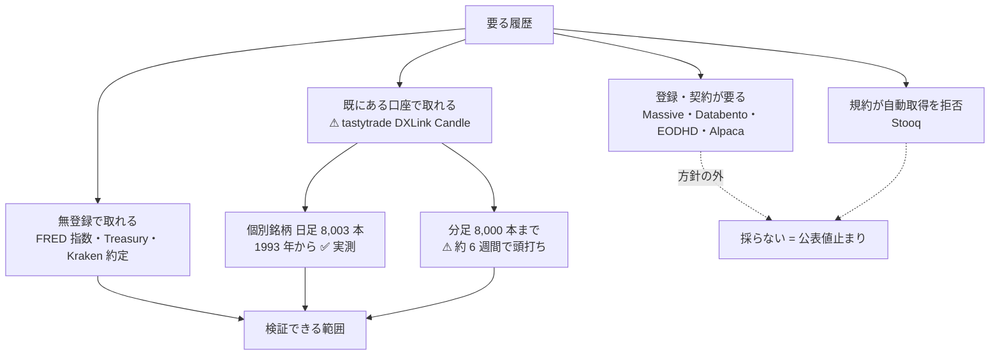

# 2. 使えるデータ経路（Phase 1）

方針の内側で何の履歴が取れるか。⚠ **tastytrade の口座から個別銘柄の日足が 1993 年まで取れた**【実測 2026-09-08】。

入口: [E8 の記録](../e8-signal-methods.md) ／ 前: [1. 調査の枠（Phase 0）](frame.md) ／ 次: [3. 手法カタログ（Phase 2・12 系統 93 件）](catalog.md)

> この図の主張: プランは「個別銘柄の履歴は方針の内側で取れない」と見ていたが、⚠ **既にある tastytrade の口座から取れた**。取れない系統は板（H）だけに縮んだ。

## 2-1. ⚠ tastytrade で過去の足が取れた【実測 2026-09-08】

`experiments/tastytrade-api-sample/candle_probe.py` で測った（読み取り専用。発注系には触れていない）。
相場データは本番の資格情報でしか出ないので prod で回した。DXLink の `Candle` イベントを `fromTime` 付きで購読する。

| 購読 | 遡って要求した期間 | 返ってきた本数 | 最も古い足 | 最新 | 初回イベントまで |
| --- | --- | ---: | --- | --- | ---: |
| `SPY{=d}`（日足） | 約 33 年 | **8,003 本** | **1993-10-31** | 2026-09-08 | 1,040 ms |
| `AAPL{=d}`（日足） | 10 年 | 2,519 本 | 2016-09-10 | 2026-09-08 | 1,029 ms |
| `SPY{=w}`（週足） | 10 年 | 530 本 | 2016-09-10 | 2026-09-07 | 797 ms |
| `SPY{=h}`（時間足） | 60 日 | 985 本 | 2026-07-10 | 2026-09-08 | 720 ms |
| `SPY{=m}`（**1 分足**） | 2 年 | **8,001 本** | **2026-07-27** | 2026-09-08 | 793 ms |
| `SPY{=5m}`（5 分足） | 30 日 | 5,483 本 | 2026-08-09 | 2026-09-08 | 789 ms |
| `SPY{=15m}` | 3 日 | 86 本 | 2026-09-05 | 2026-09-08 | 867 ms |
| ⚠ `SPY{=1m}` | 3 日 | **0 本** | — | — | — |

**分かった 4 つ**

| # | 中身 | 効くところ |
| --- | --- | --- |
| 1 | ⚠ **1 購読あたり約 8,000 本で頭打ち**（日足 8,003 / 1 分足 8,001）。日足なら 32 年分だが、**1 分足では約 6 週間**しか遡れない | ⚠ 分足（L1）で長期の検証をするには `fromTime` を刻んで**窓を分けて何度も取る**設計が要る。**X9（標本不足）の抽出条件に「L1 以下 ＋ 長期検証が要る」を足した** |
| 2 | ⚠ **期間の値 1 は書かない。`{=m}` は 8,001 本、`{=1m}` は 0 本**。エラーも出ない | 自動売買の落とし穴。⚠ **「データが無い」と読み違える** |
| 3 | **8 銘柄の日足 10 年を 1 セッションで同時に取れた**（`AAPL`・`MSFT`・`NVDA`・`JPM`・`XOM`・`KO`・`BRK/B`・`IWM`、いずれも 2,511〜2,527 本、初回イベント 0.74〜1.14 秒） | ⚠ **断面（J 系）とペア取引（B5）は「検証できない」で落とせない**。公式ドキュメントの購読上限は `Candle` が **1 セッション 100 件**【公表値】 |
| 4 | 認証は 0.5 秒で AUTHORIZED、購読から初回データまで 0.7〜1.1 秒 | 検証のたびに取り直しても待ち時間は問題にならない |

⚠ **プランの前提が 1 つ覆った。** プランは「⚠ **無登録で個別銘柄の履歴が取れないなら、J 系（断面）と B5 は『検証できない』で落ちる**」としていたが、
**無登録ではなく「既に持っている口座」で取れた**ので、J 系と B5 は落とさなかった。**落とす理由は空売りの脚（X8）に変わった**（[§6-1](failures.md) の周回 4）。

## 2-2. 経路の一覧

| 経路 | 取れるもの | 状態 | 効く系統 |
| --- | --- | --- | --- |
| FRED `fredgraph.csv` | `SP500`・`NASDAQCOM`・`DJIA`・`VIXCLS`（日次・無登録） | ✅ 実測（2026-09-01） | A・B・C・D・I |
| Kraken `public/Trades` `public/OHLC` | 暗号資産の**約定（L0）** | ✅ 実測（2026-09-01） | E・H（⚠ **板系を試せる唯一の無登録経路**） |
| **tastytrade DXLink `Candle`** | **個別銘柄の日足 32 年・分足 6 週間** | ✅ **実測（2026-09-08。本書）** | A・B・C・D・E・F・G・I・**J** |
| tastytrade DXLink `Quote` `Trade` | 気配・約定の**リアルタイム**（過去は取れない） | ✅ 実測（[tastytrade-api-sample.md](../tastytrade-api-sample.md)） | H を**前向きに溜めるなら**可 |
| Massive・Databento・EODHD・Alpaca | 個別銘柄の tick | ⚠ 登録が要る＝方針の外 | H（【公表値】止まり） |
| Stooq | 日足 CSV | ⚠ **採らない**で確定（[market-data-availability.md §3-2](../../market-data-availability.md)） | — |

## 2-3. ⚠ この節で落ちる系統

| 系統 | 判定 | 型 |
| --- | --- | --- |
| **H 板・マイクロストラクチャ**（米国株） | ⚠ **落ちる。** 過去の板（L0）は方針の内側では取れない。`Quote`/`Trade` を**これから溜める**ことはできるが、検証に足る標本を作るのに年単位かかる | **X1** ＋ X9 |
| **H（暗号資産）** | ⚠ **条件付きで残る。** Kraken の約定は取れる。ただし発注の往復が **1,885 ms**（[実測](../tastytrade-api-sample.md)）で、板の系統が想定する時間尺度と 3 桁違う | **X8** |
| J 断面・B5 ペア | ⚠ **データでは落ちない**（§2-1）。落ちるとすれば**空売りの脚**（段 2 以上が要る） | X8（段 1 のとき） |
