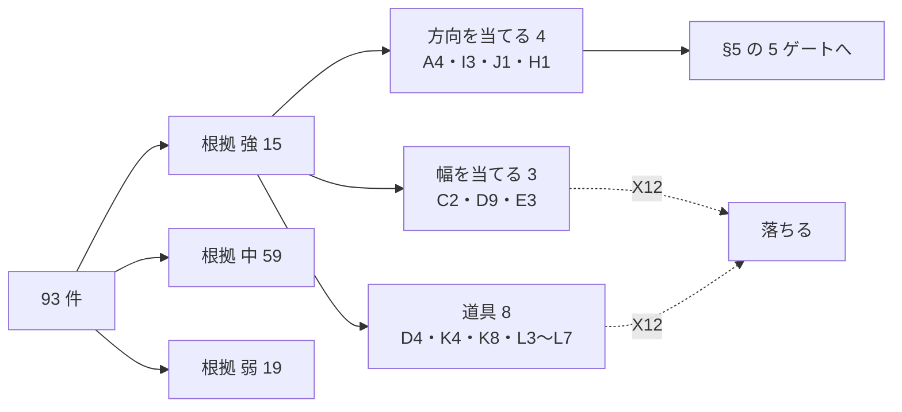
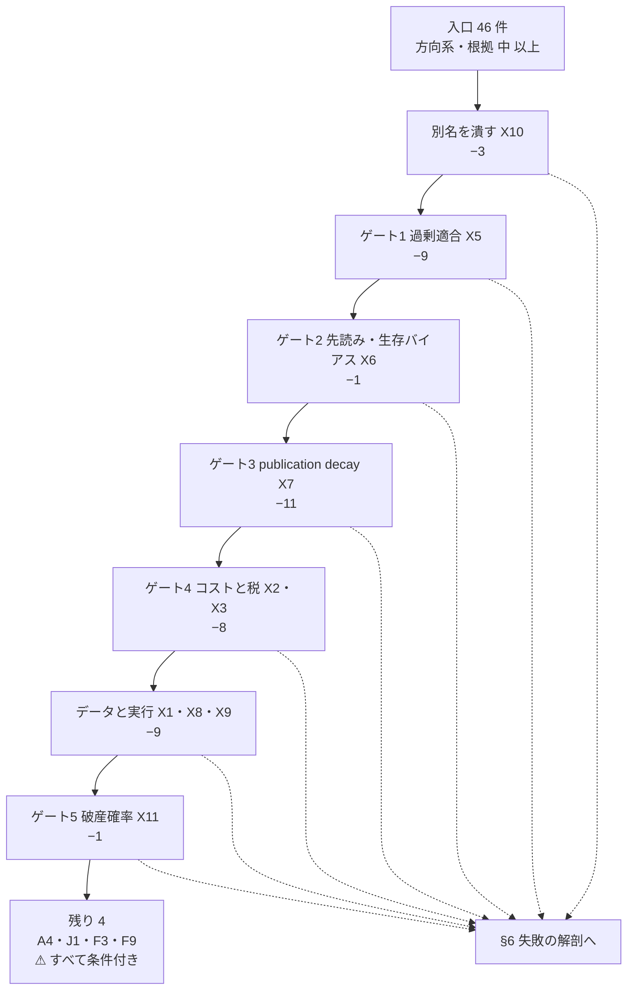
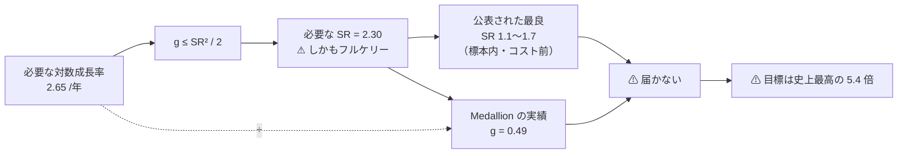

# 根拠の強さと反証（Phase 3・周回 6〜7）

93 件に 強 / 中 / 弱 を付け（§4）、5 つのゲートで 46 → 4 件に絞り、⚠ **達成率の上限が SR² / 2 で決まる**ことを出す（§5）。

入口: [E8 の記録](../e8-signal-methods.md) ／ 前: [3. 手法カタログ（Phase 2・12 系統 93 件）](catalog.md) ／ 次: [6. 失敗台帳（カタログと対の成果物）](failures.md)

## 4. 根拠の強さ（Phase 3・周回 6）

### 4-1. 3 段に分けた結果

| 根拠 | 件数 | 中身 |
| --- | ---: | --- |
| **強**（査読 ＋ 独立再現、または監査済み成績） | **15** | A4・C2・D4・D9・E3・H1・I3・J1・K4・K8・L3・L4・L5・L6・L7 |
| **中**（査読または監査済み成績が 1 本） | **59** | — |
| **弱**（二次情報のみ） | **19** | A2・A5・A6・B1・B2・B7・C3・D6・D7・E4・F4・F6・F8・G3・G4・**G5**・G6・H7 ほか |
| | **93** | |

> ⚠ **この節で一番効いた発見。** 根拠が **強** の 15 件のうち、**方向を当てにいく行は 4 件しかない**（A4 時系列モメンタム・I3 日中/オーバーナイト・J1 断面モメンタム・H1 オーダーフロー不均衡）。
> 残りは **幅**を当てる行（C2・D9・E3）か、**道具**（D4・K4・K8・L3〜L7）である。

⚠ **「価格だけを入力にする」と決めた時点で、根拠が強いまま残るのはモメンタム系だけになる。** 会計情報を使うバリュー・クオリティ系は [§1-1](frame.md) で外してあるので、この結果は入力の線引きの帰結でもある。

### 4-2. ⚠ 年 1000% 級の運用成績は実在するか

**探した範囲では、監査された公表運用成績で年 1000% を継続した記録は 1 件も見つからなかった。**

| 記録 | 年率 | 期間 | 出典の性格 |
| --- | ---: | --- | --- |
| **Renaissance Medallion**（手数料後） | **63.3%**（複利） | 1988〜2018（**30 年**） | 査読誌の論文が公表データから再構成【公表値】。⚠ **1993 年以降は外部投資家に閉じている** |
| Medallion の最良の 1 年 | 98.5%（2000 年）／ 82.4%（2008 年） | 単年 | ⚠ **年ごとの系列は二次情報の集計**で、原典の表を当たれていない【要確認】。⚠ **どの版でも単年で 100% に届いていない**という点は変わらない |
| Avellaneda-Lee の統計的裁定（シャープ） | 0.9〜1.5 | 1997〜2007 | 査読論文【公表値】。⚠ **2002 年以降に劣化**と明記 |
| Moreira-Muir のボラ調整（シャープ） | 1.441 → 1.735 | 標本内・**取引コスト無視** | 査読論文【公表値】。⚠ 後続研究が再現に失敗 |

⚠ **「単年で 1000% 出した」という主張は個人の口座では珍しくないが、本書の線引き（査読・独立再現・監査済み成績）に載るものが無い。**
[プラン §4-4](../../../plans/archive/market-signal-methods.md) の「⚠ **弱は達成率がいくら高くても採らない**」をそのまま適用し、**この帯の情報は根拠に数えていない**。

⚠ **個人の日次売買の母集団側の数字も置いておく。** Barber-Lee-Liu-Odean は台湾証券取引所の **1992〜2006 年・37 億件**の約定を使い、
デイトレーダーが**手数料込みで 1 日あたり平均 −23.9bp**、15 年のうち 14 年で集計成績が確実に負だったと報告する【公表値】。
⚠ **粗（手数料前）でも 1 日 −7bp** で、コストがそれを 3 倍に膨らませている。**[§1-4](frame.md) の「必要優位性 ＋1.06%/日」と符号すら逆である。**

### 4-3. publication decay — 公表後に効果が縮む

| 検証 | 中身 |
| --- | --- |
| McLean-Pontiff (2016)【公表値】 | 異常値の収益は**標本外で 26% 低く、公表後は 58% 低い**。差の **32 ポイントが「公表を知った投資家の売買」による**と推定 |
| Chordia-Subrahmanyam-Tong (2014)【公表値】 | 流動性が上がった近年、**米国の異常値の実行可能な収益は有意に減った** |
| Bajgrowicz-Scaillet (2012)【公表値】 | DJIA の 1897〜2011 で FDR を使っても、⚠ **将来最良になる規則を事前に選べなかった**。⚠ **標本内でも低い取引コストで成績が完全に相殺**される |
| Schwert (2003)【公表値】 | 週末効果は French (1980) 以降**消えたか大きく減衰** |
| Do-Faff (2010)【公表値】 | ペア取引の超過収益は **月 0.86% → 0.37% → 0.24%** と 3 期で減衰 |

⚠ **A・B・G・I 系は「公表されて古いほど根拠が厚いが、そのぶん減っている」という向きの揃った証拠がある。** 本書は **X7** としてこれを型に立てた。

---

## 5. 反証の 5 ゲートと達成率（Phase 3・周回 7）

### 5-1. ゲートの通り方

**入口は 46 件**（93 件のうち、当てにいくものが 方向 / 転換点 / 相対 で、かつ根拠が 中 以上の行）。⚠ **幅・フィルタ・道具（X12 の 29 件）と 根拠 弱（19 件）はここに入れない。**

> この図の主張: ゲートを順に通すと **46 → 4** になる。⚠ **1 つでも落ちたら [§6](failures.md) の解剖へ送る。**

| 段 | 落ちた件数 | 残り |
| --- | ---: | ---: |
| 入口 | — | **46** |
| 別名を潰す（X10） | 3 | 43 |
| ゲート 1 過剰適合（X5） | 9 | 34 |
| ゲート 2 先読み・生存バイアス（X6） | 1 | 33 |
| ゲート 3 publication decay（X7） | **11** | 22 |
| ゲート 4 コストと税（X2・X3） | 8 | 14 |
| データと実行（X1・X8・X9） | 9 | 5 |
| ゲート 5 破産確率（X11） | 1 | **4** |

⚠ **一番大きく削るのはゲート 3（publication decay）で 11 件**である。⚠ **「昔から知られていて根拠が厚い」ことと「いま効く」ことが、この帯では逆を向く。**

⚠ **自前の計算は反証にだけ使った。** 良い数字が出ても根拠にしていない。**悪い数字が出たときだけ落とす根拠にした**（プラン §5-1）。
年 1000% を目標にすると自前検証に過剰適合を入れる誘因が最大化するので、この非対称は最後まで崩していない。

### 5-2. 最後まで残った 4 件

| ID | 手法 | ⚠ 生き残るための条件 | 残る弱点 |
| --- | --- | --- | --- |
| **A4** | 時系列モメンタム（12-1 か月） | 回転を年 4〜12 に抑える ／ **多資産に分散する** ／ ⚠ 証拠は先物なので**段 3 が要る** | 段 1 では片脚（買いだけ）で、証拠の半分しか使えない |
| **J1** | 断面モメンタム | ⚠ **上位を買い下位を売る**（段 2 以上） ／ ⚠ **モメンタム・クラッシュ**（Daniel-Moskowitz 2016）を C4 のボラ調整で減らす | 段 1 では買いだけ。クラッシュは市場の反発時に来る＝ **分散が効かない** |
| **F3** | 正則化線形（基準線） | ⚠ **これ単体は候補ではない。** 複雑なモデルがこれを超えないなら採らない、という**門番** | 予測力そのものは弱い |
| **F9** | メタラベリング・三重障壁 | ⚠ **一次シグナル（A4・J1）に付ける道具** | 単体では方向を出さない |

⚠ **実質の候補は A4 と J1 の 2 件で、どちらも「モメンタム」である。** カタログ 93 件を回した結果として残ったのがこの 2 件だという事実そのものが、本書の主要な出力になる。

### 5-3. ⚠ 達成率 — 成長率には上限がある

**残った候補の良し悪しではなく、資金の増え方そのものに上限がある。** ここが本書の判定の中心である。

対数成長率を g、レバレッジを L、超過収益率を μ、ボラティリティを σ とすると

- g(L) = Lμ − L²σ² / 2
- これを最大にする L\* = μ / σ²（**ケリー基準**）で、そのときの **g\* = μ² / (2σ²) = SR² / 2**

> この図の主張: **どんな張り方をしても、対数成長率は SR² / 2 を超えられない。** 年 1000% はこの天井の上にある。

| 必要な水準 | 中位 24% | 上位 40.8% | 段 3（18.6%） |
| --- | ---: | ---: | ---: |
| 対数成長率 g | 2.65 | 2.88 | 2.59 |
| **必要 SR（フルケリー）** | **2.30** | **2.40** | **2.27** |
| **必要 SR（半ケリー）** | **2.66** | **2.77** | **2.63** |

⚠ **さらに段 1・2 ではレバレッジ自体に上限がある。** SEC の投資家向け解説【公表値】のとおり Reg T の当初証拠金は **50%**（＝ **最大 2 倍**）、維持証拠金は 25%。
σ = 15% の戦略でフルケリーに到達できるのは L\* = SR/σ ≤ 2、つまり **SR ≤ 0.30 のときだけ**である。⚠ **それ以上に良い戦略は、良いほど「張り足りない」状態に固定される。**

**達成率の表【推測（算術）＋ 公表値の SR】**

| 前提 | 張り方 | 対数成長率 g | 税引前 年率 | 税引後 年率 | **達成率** |
| --- | --- | ---: | ---: | ---: | ---: |
| 段 1・現物のみ・SR 0.8・σ 15%（L = 1） | レバレッジ無し | 0.109 | ＋11.5% | **＋8.7%** | **0.009** |
| 段 2・信用 2 倍・SR 0.8・σ 15% | ⚠ Reg T の上限 | 0.195 | ＋21.5% | **＋16.4%** | **0.016** |
| 段 2・信用 2 倍・SR 1.5・σ 15% | 同上 | 0.405 | ＋49.9% | **＋37.9%** | **0.038** |
| **段 3・先物・SR 0.8** | 半ケリー | 0.240 | ＋27.1% | **＋22.1%** | **0.022** |
| **段 3・先物・SR 1.0** | 半ケリー | 0.375 | ＋45.5% | **＋37.0%** | **0.037** |
| 段 3・先物・SR 1.0 | ⚠ フルケリー | 0.500 | ＋64.9% | ＋52.8% | 0.053 |
| **目標** | — | **2.65** | ＋1,320% | **＋1,000%** | **1.00** |
| 参考: Medallion（1988〜2018 の実績） | — | 0.49 | — | — | — |

⚠ **フルケリーの行を「到達した最良」とは書かない。** MacLean-Thorp-Ziemba が明記するとおり、フルケリーは
**長期の成長率は最大だが短期の成績は非常にリスクが高く、悪い結果が続けば元本の大半を失う**。[§1-5](frame.md) の許容（最大ドローダウン 50%）を超えるので **X11** を付けた。

### 5-4. 到達した最良と、上限を作っているもの

| 上限 | 数字 | どれだけ効くか |
| --- | --- | --- |
| **① 成長率の天井 g ≤ SR²/2** | 必要 SR 2.30 に対し、公表された最良の SR は 1.1〜1.7（**標本内・コスト前**） | ⚠ **決定的。** 手法を増やしても動かない |
| **② レバレッジの上限（段 1・2）** | Reg T 50% ＝ **2 倍**【公表値】 | ⚠ 段 1・2 では ① より先に効く |
| ③ 過剰適合と decay | 標本外 −26%・公表後 −58%（McLean-Pontiff） | 上の SR を**さらに割り引く** |
| ④ コストと税 | 回転 250 で年 25%、回転 5,000 で年 500%（[§1-4](frame.md)）／ 税で回収期間 ×1.32 | ⚠ **候補が高回転のときだけ効く**。残った A4・J1 は低回転なので**効きが小さい** |
| ⑤ 容量 | ⚠ **$100,000 では効かない** | 板を動かさないので、Novy-Marx-Velikov の容量の議論は本件には当たらない |

⚠ **④ が思ったより効かなかったのが、この調査で一番意外な結果である。** プランは「⚠ X2 と X3 で大半が落ちるなら、E8 は手法選びではなく回転数の設計の問題」と書いていたが、
**実際に X2・X3 で落ちたのは 9 件だけ**だった（[§6-2](failures.md)）。**回転数を下げれば済む話ではない。**
