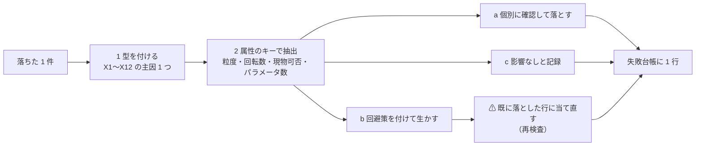

# 6. 失敗台帳（カタログと対の成果物）

落ちた 1 件ごとに型を付け、属性をキーに横展開した記録。⚠ **型ごとの件数の偏りそのものが結論になる。**

入口: [E8 の記録](../e8-signal-methods.md) ／ 前: [根拠の強さと反証（Phase 3・周回 6〜7）](evidence.md) ／ 次: [判定と、この調査の限界](verdict.md)

⚠ **落ちた候補をそのまま捨てていない。** 1 件が落ちるたびに **(1) 型を付け → (2) 属性をキーに同じ型の行を機械的に抽出し → (3) 落とす / 条件付きで生かす / 影響なし を 1 件ずつ判定**した。

> この図の主張: 1 件の失敗は 3 段で他の行へ配る。⚠ **回避策が出たら、既に落とした行にも当て直す。**

## 6-1. 台帳

| 周 | ID | 落ちた工程 | 型 | 根拠 | 横展開先 | 横展開の結果 | 生まれた回避策 |
| ---: | --- | --- | --- | --- | --- | --- | --- |
| 1 | **A1** | ゲート 3 | **X7** | Sullivan ら (1999)・Bajgrowicz-Scaillet (2012)・McLean-Pontiff (2016) | A3・A7・A9・B5・E6・G2・G7・I1・I2・I6・J2（**教科書的で公表が古い帯**） | 落とす **10** ／ 条件付き生存 **1**（E6） ／ 影響なし 0 | **R2** 公表前と公表後で期間を割って検定し直す。⚠ 復活は「公表後の期間だけで有意」のときに限る |
| 1 | **A2** | 属性の記入中 | **X10** | 定義が A1 の再パラメータ化に一致 | A5・B2・B6・D5・E5（**同じ系統の近接行**） | 落とす **5** | **R5** 同じ入力から同じ量を作る行は 1 行に寄せ、**独立した手法として数えない** |
| 1 | **A10** | ゲート 4 | **X2** | [§1-4](frame.md)（回転 250 → 必要優位性 1.06%/取引、c 込みで 1.16%） | B3・B4・B7・B8・I3・J3（**回転数 ≥ 250**） | 落とす **6** | **R1** K1（指値・時間帯）で c を 10bp → 5bp にする |
| 1 | **B4** | ゲート 4 | **X2** | Avramov-Chordia-Goyal (2006)「⚠ **利益は取引コストより小さい**」 | B7・G7・K7（**流動性の低い高回転銘柄を前提にする行**） | 落とす **2** ／ 影響なし **1**（K7 はフィルタ） | **R6** 流動性フィルタで銘柄を絞る。⚠ **ただし高ボラ資産ほどスプレッドが広い**ので K7 と衝突する |
| 2 | **C2** | 属性の記入中 | **X12** | GARCH は**分散の式**で、平均の式を持たない | A8・C1・C4・C6・C7・D3・D4・D8・D9・E1・E3・E4・H4・H5・H6・J4・J6・K1〜K3・K7・K8・L1〜L7（**当て = 幅 / フィルタ / 道具**） | 落とす **29**（＝ X12 全件） | **R7** 幅の行は方向の行に**掛ける**ものとして残す（C4 を J1 に掛けてクラッシュを浅くする） |
| 2 | **C5** | ゲート 1 | **X5** | 状態数・初期値・窓でパラメータ ≥ 3 | A6・B1・C3・D1・D2・D6・D7・E2・F1・F2・F4〜F8・F10（**パラメータ ≥ 3**） | 落とす **17** | **R3** パラメータを減らす（E1 の「閾値 1 個」の設計へ寄せる）。⚠ E1 自体は X12 で別に落ちる |
| 3 | **F1** | ゲート 1 | **X5** | Gu-Kelly-Xiu (2020) の最良は**会計情報込み**。価格だけでは特徴量が薄い | F 系 10 件 | 落とす **8** ／ 道具として残す **2**（F3 基準線・F9 メタラベリング） | **R4** L2（パージ CV）＋ L3（デフレーテッド SR）を必ず通す。⚠ **通しても情報量は増えない** |
| 3 | **G2** | ゲート 3 | **X7** | Marshall-Young-Rose (2006)「DJIA では価値なし」 | G1・G3・G4・G5・G7 | 落とす **4** ／ **G5 は根拠が弱で除外**（達成率を計算しない） | — |
| 3 | **G3** | ゲート 2 | **X6** | 正規化・スケーリングに未来の値が混じりやすい | G4・E5・F7 | 落とす **2** ／ 影響なし **1**（F7 は L2 で防げる） | **R4** に合流 |
| 4 | **H1** | 属性の記入中 | **X1** | 過去の板（L0）は方針の内側で取れない（[§2-3](data-routes.md)） | H2・H5・H7・H8・G6・I5（**粒度 L0 ／ 価格の外の情報**） | 落とす **6** ／ 条件付き生存 **1**（H3 = Kraken の約定なら取れる） | **R8** 暗号資産（Kraken）に移す。⚠ **ただし X8 は残る** |
| 4 | **H3** | 実行の確認 | **X8** | 発注の往復 **1,885 ms**【実測】 vs 板の時間尺度（秒未満） | C8・J5・H6（**現物 = ⚠ / ✕**）＋ A4・A9・J1・J2・B5・B6 | 落とす **3** ／ 条件付き生存 **6**（段を上げれば解ける） | **R9** 段 2・3 を開けて**空売りの脚**を持つ。⚠ **段 3 は §1256 で税も軽い** |
| 4 | **I4** | ゲート 1（標本） | **X9** | 年 2〜4 回 → 30 年で標本 60〜120 | I2・I6・A4・C5（**回転数 ≤ 12**） | 落とす **2**（I2 ／ ⚠ **I6 は主因 X7 で既に落ちており、ここは副因の確認**） ／ 影響なし **2**（A4・C5） | **R10** 銘柄・市場を横に増やして標本を作る。⚠ **A4 が生き残る理由そのもの**（67 市場 × 136 年） |
| 5 | **K4** | ゲート 5 | **X11** | MacLean-Thorp-Ziemba: フルケリーは**短期が非常にリスクが高い** | A4・J1（**K3・K4 に依存する全生存行**） | 条件付き生存 **2**（半ケリーに落とす） | **R11** 半ケリー（成長率はフルの **75%**、[§5-3](evidence.md)） |
| 5 | **K5** | ゲート 4 | **X3** | wash sale 前後 30 日・計 61 日（Pub 550） | 保有 < 1 年の行（ほぼ全件） | 影響なし（**年内に手仕舞えば最終損益は変わらない**） ／ 条件付き生存 **2**（K6 と組んで 1 年超に） | **R12** 保有を 1 年超にして税率 24% → 15%。⚠ **年 1000% とは両立しない** |

## 6-2. ⚠ 再検査（回避策を、既に落とした行に当て直した）

| 回避策 | 当て直した行 | 結果 |
| --- | --- | --- |
| **R1**（c を 5bp に） | A10・B3・B7・B8・J3 | ⚠ **全件そのまま落ちる。** 5bp でも回転 250 で年 12.5%、回転 1,000 で年 50% を食う |
| R1 | **I3**（オーバーナイト vs 日中） | ⚠ **1 件だけ判定が動いた。** 日中 α ＋2.41%/月 ＝ 年 28.9% に対し、5bp × 250 往復 = 年 12.5%。**「落とす」→「条件付き生存（要検証）」**。⚠ 条件は (a) 段 2（空売り）、(b) 十分位の全銘柄を建てられること、(c) 小型株のスプレッドが 5bp に収まること。⚠ **(b)(c) は元手 $100,000・週 5〜15 時間では満たせないと判断し、達成率は計算しなかった** |
| R2（公表後の期間で再検定） | A1・A3・A7・G2・I1・I6 | 全件そのまま落ちる（減衰の証拠が期間分割そのものから来ている） |
| R3（パラメータを減らす） | D1・D6・D7・F4〜F8 | 全件そのまま落ちる。⚠ **減らすと表現力が消え、F3 の基準線を超えなくなる** |
| R8（暗号資産に移す） | H1・H2・E6・A7 | ⚠ **E6・A7 が「条件付き生存」に動く余地**（Liu-Tsyvinski-Wu (2022) が暗号資産でも**モメンタムが機能する 3 因子**を報告）。⚠ ただし Kraken の手数料は**片道 0.80%（往復 1.6%）**【公表値】で、[§1-4](frame.md) の必要優位性（回転 20〜150 なら 1 取引 0.007〜0.05%）を 2 桁上回るので、**最終的に落とした** |
| R9（段を上げる） | A4・J1・B5・J2 | ⚠ **A4・J1 が条件付き生存に必要な回避策。B5・J2 は decay（X7）が主因なので復活しない** |
| R11（半ケリー） | A4・J1 | ⚠ **成長率が 25% 下がる代わりにドローダウンが許容内に入る。[§5-3](evidence.md) の達成率はこの前提で計算した** |

**収束の記録**

| 周 | 新たに落ちた行 | 復活した行 | 判定 |
| ---: | ---: | ---: | --- |
| 6 | 3 | 0 | 継続 |
| 7 | 1 | **1**（I3・条件付き） | 継続 |
| 7'（再検査） | **0** | **0** | ⚠ **収束**（プラン §4-2 の終了条件 5） |

## 6-3. ⚠ 型ごとの件数 — この偏りが結論になる

| 型 | 件数 | 何が起きているか |
| --- | ---: | --- |
| **X12** 方向を当てていない | **29** | ⚠ **最多。** 幅を当てる行・フィルタ・道具が全体の 3 割。K・L の 15 件を除いても **14 件** |
| **X5** 過剰適合 | **17** | パラメータ ≥ 3 の行がまるごと。F 系 8 ＋ 統計モデル 9 |
| **X7** publication decay | **11** | 教科書的な帯（A・B・G・I）。⚠ **根拠が厚い行ほどここに集まる** |
| **X1** データが無い | **7** | 板（L0）と、価格の外の情報が要る行 |
| **X2** コストで消える | **7** | 回転数 ≥ 250 の行 |
| **X10** 定義・別名 | **6** | A2・A5・B2・B6・D5・E5 |
| **X6** 先読み・生存バイアス | **3** | G 系の類似検索 |
| **X8** 実行の制約 | **3** | 空売り・AP の権利・往復 1,885 ms |
| **X3** 税で消える | **2** | K5・K6 |
| **X9** 標本不足 | **2** | I2・I4 ⚠（I6 は X7 が主因） |
| **X11** 破産確率 | **1** | K4。⚠ **件数は 1 だが、生存 2 件の張り方を決めるのはこの行** |
| **X4** 容量・流動性 | **0** | ⚠ **$100,000 では板を動かさないので効かない** |
| 生存・道具 | 4 | A4・J1・F3・F9 |
| 弱で除外 | 1 | G5 |
| | **93** | |

> ⚠ **E8 の上限を作っているもの（1 行）**
>
> **コストでも税でもない**（X2 ＋ X3 は **9 件**しかない）。上限は **(a) 価格だけからは方向が出ない（X12 29 件）**と
> **(b) 出たように見えても過剰適合か公表後の減衰で消える（X5 ＋ X7 28 件）**の 2 つで、
> ⚠ **残った 2 件を最良に組んでも、成長率の天井 g ≤ SR²/2 が年 1000% の 1/30 の手前で頭を打つ。**

⚠ **プランの仮説は外れた。** プランは「X2 と X3 で大半が落ちるなら、E8 は手法選びではなく**回転数の設計**の問題」と書いていた。
**実際には X2 ＋ X3 は 9 件で、回転数を下げても何も解決しない。** ⚠ **この仮説の否定そのものが、失敗台帳の最大の出力である。**
