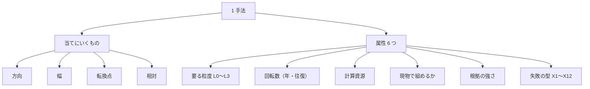
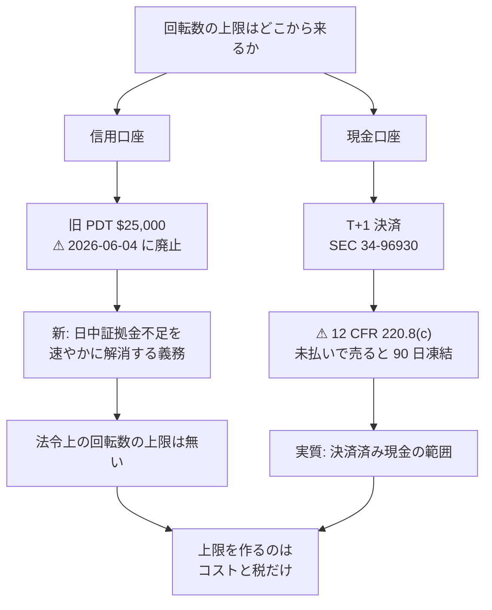

# 1. 調査の枠（Phase 0）

入力の線引き・カタログの列・年 1000% の物差し・回転数とコスト・破産確率・⚠ 法令上の上限・商品の段。**判定に使う目盛りはすべてここで決めた。**

入口: [E8 の記録](../e8-signal-methods.md) ／ 次: [2. 使えるデータ経路（Phase 1）](data-routes.md)

## 1-1. 入力の線引き（全周回で固定）

| 区分 | 採る | 外す |
| --- | --- | --- |
| 価格系 | 約定値・出来高・気配（板）・OHLCV と、そこから作る量（移動平均・ボラティリティ・相関・出来高比・約定の偏り） | — |
| 参照値 | 指数（`SP500`・`NASDAQCOM`・`VIXCLS`）・国債利回り。**市場が付けた値だから採る** | 第三者の推計値・格付・予想 |
| 企業情報 | — | 決算・ガイダンス・開示・財務指標 |
| 文章その他 | — | ニュース・SNS・センチメント・オルタナティブ |
| 自分の記録 | 自分の建玉・約定・支払った手数料 | — |

⚠ **この線引きが根拠の強さに直接効く。** 査読論文で最も強い証拠が付いている異常値の多くは会計情報を使う（バリュー・クオリティ）。
**価格だけに絞ると、根拠が強のまま残るのはモメンタム系だけ**になる（[§4-2](evidence.md)）。

## 1-2. 分類軸と属性（カタログの列）

> この図の主張: 手法は「何を当てにいくか」で 4 種に分かれ、そこに 6 つの属性が付く。⚠ **属性は横展開の抽出キーでもあるので、数値か ○ / ⚠ / ✕ で書く。**

| 列 | 値の取り方 |
| --- | --- |
| ID | 系統の記号 ＋ 連番（A1、B3 …）。系統は [§3](catalog.md) の 12 |
| 当てにいくもの | **方向 / 幅 / 転換点 / 相対** |
| 粒度 | L0 tick・板 ／ L1 分足 ／ L2 日足 ／ L3 週次〜（[market-data-availability.md §1-2](../../market-data-availability.md)） |
| 回転数 | 年あたりの往復（数値。**≥ 250 → X2 の抽出対象**、**≤ 12 → X9 の抽出対象**） |
| 計算資源 | 表計算 ／ CPU ／ ⚠ GPU・低遅延設備 |
| 現物 | ○ ／ ⚠（片脚だけ） ／ ✕（空売り・デリバティブが要る）。**⚠ と ✕ は X8 の抽出対象** |
| 根拠 | **強**（査読 ＋ 独立再現 ＋ 監査済み成績）／ **中**（査読または監査済み成績）／ **弱**（二次情報のみ。⚠ 候補にしない） |
| 型 | 失敗の型 X1〜X12（[§6-1](failures.md)）。**生存**なら「—」 |

## 1-3. 判定の物差し

年 1000%（税引後）＝ 元本の **11 倍**（$100,000 → $1,100,000）。現物は §1256 が使えないので短期 24 / 40.8% が乗る（[trading-tax.md §6-1](../../trading-tax.md)）。

| 見方 | 中位（24%） | 上位（40.8%） | 段 3（§1256・18.6%） | 算出 |
| --- | ---: | ---: | ---: | --- |
| 税引後に必要な倍率 | **11.0 倍** | 11.0 倍 | 11.0 倍 | 指定値 |
| ⚠ 税引前に必要な倍率 | **14.2 倍** | **17.9 倍** | **13.3 倍** | 1 ＋ 10 ÷ (1 − t) |
| **対数成長率（/年）** | **2.65** | **2.88** | **2.59** | ln(上の倍率) |
| 月あたり（複利・税引前） | ＋24.7% | ＋27.2% | ＋24.1% | 倍率^(1/12) |
| **営業日あたり** | **＋1.06%** | **＋1.15%** | **＋1.03%** | 倍率^(1/252) |

⚠ **段 3（先物・§1256）に寄せても、必要な対数成長率は 2.65 → 2.59 にしか下がらない。** 税は 2% しか効かない。

## 1-4. 回転数とコスト【推測（算術）】

1 往復のコストを c、年間の往復を n とすると、コストだけで年 n × c が削れる。中位（営業日 ＋1.06%）で割ると:

| 1 日の売買回数 | 年間の往復 n | 1 取引の**純**必要優位性 | c = 5bp 込みの**粗** | c = 10bp 込みの**粗** | n × c（c = 10bp） |
| ---: | ---: | ---: | ---: | ---: | ---: |
| 1 回 | 250 | 1.06% | 1.11% | 1.16% | 25% |
| 5 回 | 1,250 | 0.21% | 0.26% | 0.31% | **125%** |
| 20 回 | 5,000 | **0.05%** | **0.10%** | **0.15%** | **500%** |

⚠ **回転を上げるほど 1 取引の必要優位性は下がるが、コストが優位性と同じ桁になる。** 1 日 20 回では粗で 2〜3 倍を当て続けないと届かない。
これが **X2（コストで消える）の抽出条件を「回転数 ≥ 250」に置いた**根拠である。

⚠ **c の内訳**（[trading-fee-comparison.md](../../trading-fee-comparison.md)【公表値】）: 株・ETF のコミッションは **$0**、規制費は売り側だけで SEC §31 **$20.60/百万ドル**（= 0.2bp）＋ FINRA TAF **$0.000195/株**。
**残りはすべてスプレッドとスリッページ**で、SPY のような銘柄なら往復 1〜2bp、小型株や高ボラ銘柄なら 10bp を超える。

## 1-5. 破産確率と許容ドローダウン

| 論点 | 本書での置き方 |
| --- | --- |
| **成長率の上限** | ⚠ **対数成長率 ≤ SR² / 2**（フルケリー時の最大値）。[§5-3](evidence.md) で判定に使う |
| フルケリーの性質 | ⚠ **資産が途中で半分になる確率が 5 割**（Kelly の性質。MacLean-Thorp-Ziemba【公表値】）。「短期の成績は非常にリスクが高い」と原論文が明記する |
| 本書の許容 | **最大ドローダウン 50% を上限**とし、それを超える張り方の行は **X11** を付ける。半ケリー（成長率はフルの 75%）を既定の張り方に置く |
| 集中 | 年 11 倍には集中が要るが、集中は 1 銘柄の事故で終わる。⚠ **「期待値が最大」と「11 倍に届く確率が最大」は別の設計**である |
| 参考の下限 | 分配で置くだけなら税引後 $2,601〜$3,542（[online-tradable-assets.md §4](../../online-tradable-assets.md)）。⚠ **これを超えないなら E8 は E1/E2 に劣る** |

## 1-6. ⚠ 回転数に法的な上限はあるか — 一次情報で解決した

プランでは【未確認】としていた。**結論: 信用（margin）口座では上限が無い。現金口座にだけ 90 日の凍結が残る。**

| 論点 | 一次情報 | 判定 |
| --- | --- | --- |
| 決済サイクル | SEC が **T+2 → T+1** に短縮（Release **34-96930**、遵守日 **2024-05-28**）【公表値】 | 現金口座の回転はここで決まる |
| 現金口座の凍結 | **12 CFR 220.8(c)**: 「代金が全額支払われる前に売却・他社への引渡しが行われた場合、**取引日を超えて支払いを遅らせる特典は売却日から 90 暦日**取り消される」【公表値】 | ⚠ **現金口座では実質「決済済み現金でしか回せない」**＝ 回転数の上限になる |
| PDT の $25,000 | ⚠ **FINRA が廃止した。** Regulatory Notice **26-10**: 「新しい日中証拠金基準が、**『パターンデイトレーダー』指定のための日中取引回数要件と $25,000 の最低残高要件を含め**、旧来の日中取引証拠金要件を**全面的に置き換える**」。**発効 2026-06-04**（移行期間は 2027-10-20 まで）【公表値】 | ⚠ **上限そのものが消えた。** 代わりに「日中証拠金不足」を速やかに解消する義務が入る |

> この図の主張: 回転数を縛るのは口座の種類だけで、⚠ **信用口座を選べば法令上の上限は無い**。上限はコスト（§1-4）と税（[trading-tax.md](../../trading-tax.md)）が作る。

⚠ **元手 $100,000 は旧 PDT の $25,000 を最初から超えていたので、廃止前でも信用口座なら縛られていなかった。** 本書は以降、**信用口座を前提**に置く。

## 1-7. 商品の段

| 段 | 商品 | 税（短期） | ⚠ 制約 |
| --- | --- | --- | --- |
| **1** | 米国上場株・ETF の買い持ち、暗号資産の現物 | 24 / 40.8% | ⚠ **空売りの脚が無い**（相対 J 系が片脚になる）／ ⚠ wash sale |
| **2** | 信用・空売り・レバレッジ ETF | 24 / 40.8% | ⚠ 金利・逆日歩 ／ ⚠ **日次リバランスの減価**（SEC・FINRA の 2009-08 投資家警告: 「日々リセットするので、長期では目標から大きく乖離しうる」【公表値】） |
| **3** | 先物・オプション | **18.6 / 30.6%** | ⚠ 税は軽く wash sale の帳簿も要らないが、手数料が月 **$172〜179**、元本の毀損が速い |

⚠ **段で税区分が変わるが、§1-3 のとおり効きは小さい（2.65 → 2.59）。** 段を開ける本当の価値は**空売りの脚**にある。
