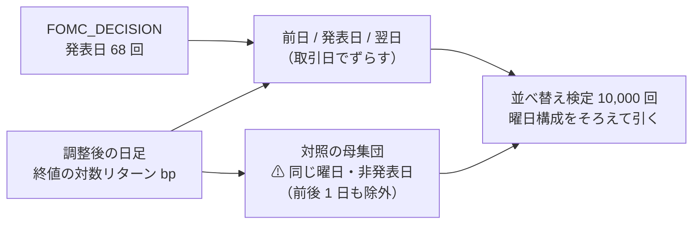

# 経済指標の発表日（暦）と株価の関連

作成: 2026-09-09 / プラン: [docs/plans/archive/econ-calendar.md](../../plans/archive/econ-calendar.md) /
コード: `experiments/feature-discovery/ail/data/sources/fomc.py` ＋ `cli/eventstudy.py`

利用者の指示（2026-09-09）: **雇用統計の発表日など経済に影響を与える状況も取得する。⚠ 重要なのは発表日と株価との関連**。

## 0. まとめ

| # | 分かったこと | 根拠 |
| ---: | --- | --- |
| 1 | ⚠ **BLS（雇用統計・CPI）は採れない** — robots.txt 自体が 403【実測】 | §1。UA 偽装で回り込まない（SPC と同じ扱い） |
| 2 | **FOMC の発表日 68 回（2018〜）を取得した**（＋予定 11 回） | §2 |
| 3 | ⚠ **発表日と株価の関連は「ある」。一番強いのは翌日の債券のボラ**（TLT の \|r\| が p = 0.0006。18 検定の Bonferroni を唯一生き残る） | §4 |
| 4 | ⚠ **前日は静か・発表日はボラが上がる**という形は 3 銘柄で揃うが、単独では有意に届かない（p 0.05〜0.12） | §4・§5 |
| 5 | ⚠ **方向（平均リターン）には使えない**。多重比較を生き残る差が無い | §4・§5 |

## 1. 規約【実測 2026-09-09】

⚠ **「取れるか」より先に「取ってよいか」で落ちる**（いつもの順番）。

| 取得元 | robots.txt | 判定 |
| --- | --- | :-: |
| ⚠ **BLS**（`www.bls.gov` ／ `download.bls.gov`） | ⚠ **robots.txt 自体が 403（Access Denied）**。連絡先入りの UA（リポジトリ URL）でも同じ。拒否ページに「ポリシーに従わないボットは禁止」と明記 | ⚠ **採らない** |
| **連邦準備制度**（`www.federalreserve.gov`） | 無し（404） | ✅ 公有 |
| **BEA**（`www.bea.gov`） | Drupal の管理系パスのみ禁止。ニュース発表は対象外 | ✅ 公有（未取得。§6） |

⚠ **雇用統計・CPI の発表日は FRED の releases API でも取れる**が、⚠ **FRED は既に「要判断」**
（[TODO「データの取得元を広げる」](../../../TODO.md)）なので、判断が付いたらそちらの経路で足す。

## 2. 取得【実測 2026-09-09】

`python3 -m cli.fetch --exog econ_calendar` → `data/raw/fomc/series/FOMC_DECISION.csv`（79 行・2018-01-31〜2027-12-08）。

| 決めごと | ⚠ 理由 |
| --- | --- |
| ⚠ **値ではなく暦**（発表日に行・値 1。行が無い日 = 発表が無い日） | 災害・地震と同じ形なので、取得・検査・manifest・管理画面の経路がそのまま使える |
| 発表日 = **会合の最終日**（声明は 14:00 ET） | 月またぎ（`Jul/Aug 31-1`）は 2 つ目の月・2 つ目の日 |
| ⚠ **予定された会合だけ。4 件を除外**（2020-03 の緊急 2 回・notation vote など） | ⚠ **緊急会合は事前に公表されない**ので、「事前に知れる暦」の性質を壊す。2020-03 の定例（03-17〜18）は緊急会合に置き換えられて開かれておらず、2020 年は 7 回になる【実測】 |
| ⚠ **未来の予定（11 回）も残す** | 暦の本質は「事前に公表されること」。検証は足がある日だけを使う |
| 過去 68 回の曜日は**水曜 65 ／ 木曜 3**【実測】 | ⚠ **これが §3 の「曜日をそろえた対照」の理由である** |

## 3. 検証の設計（event study）

⚠ **仮説（取得の前に宣言）: 政策決定の発表日は値動きの分布が変わる（ボラが上がる）。**
方向ではなく分布なので、平均リターンと**平均 |リターン|** の両方を見る。

> この図の主張: ⚠ **比べる相手は「同じ曜日の非発表日」。** 発表はほぼ水曜なので、全日と比べると曜日効果と区別できない。

- `python3 -m cli.eventstudy --symbol SPY`（`--seed 0`・並べ替え 10,000 回）
- ⚠ **p(|r|) は片側**（発表日のほうが大きい、が対立仮説）。⚠ **1 に近い値は「対照より小さい」**を意味する
- 週末またぎは取引日でずらす（金曜発表の翌日は月曜）。`tests/test_eventstudy.py` で固定

## 4. 結果【実測 2026-09-09】

単位は bp。n = 68（発表日）／ 1,978（その他）。

| 銘柄 | 日 | 平均 | 平均 \|r\| | 対照の平均 | 対照の \|r\| | p(平均) | p(\|r\|) |
| --- | --- | ---: | ---: | ---: | ---: | ---: | ---: |
| SPY | 前日 | +8.06 | 60.28 | +7.05 | 76.89 | 0.58 | ⚠ **0.97**（＝静か） |
| SPY | 発表日 | +2.06 | 88.15 | +7.63 | 76.01 | 0.89 | 0.12 |
| SPY | 翌日 | −22.25 | 95.66 | +0.76 | 80.22 | 0.10 | 0.07 |
| TLT | 前日 | +11.22 | 59.35 | −2.96 | 74.44 | 0.32 | ⚠ **0.99**（＝静か） |
| TLT | 発表日 | +21.69 | 66.88 | +1.59 | 73.19 | 0.046 | 0.81 |
| ⚠ **TLT** | ⚠ **翌日** | +1.23 | ⚠ **88.56** | +1.10 | ⚠ **68.13** | 0.91 | ⚠ **0.0006** |
| QQQ | 前日 | +10.24 | 97.56 | +10.88 | 102.08 | 0.61 | 0.64 |
| QQQ | 発表日 | +24.35 | 120.68 | +8.80 | 99.82 | 0.19 | 0.053 |
| QQQ | 翌日 | −10.70 | 125.76 | +2.72 | 107.81 | 0.54 | 0.08 |

## 5. 判定

| # | 判定 | ⚠ 読み方 |
| ---: | --- | --- |
| 1 | ⚠ **関連は「ある」。ただし多重比較（3 銘柄 × 3 日 × 2 指標 = 18 検定）を生き残るのは 1 つ** — **TLT の翌日の \|r\|**（p = 0.0006 < Bonferroni の 0.05/18 ≈ 0.0028） | ⚠ **債券は政策金利の直接の対象**なので、仮説と整合する。⚠ **翌日**に出るのは、日足の終値どうしでは「発表（14:00 ET）→ 当日終値」より「当日終値 → 翌日終値」の窓に消化が乗るためと読める【推測】 |
| 2 | ⚠ **「前日は静か・発表日は動く」という形は 3 銘柄で揃う**（前日の p(\|r\|) 0.64〜0.99、発表日 0.05〜0.12） | 単独では有意に届かない。⚠ **片側検定の後付けの読み**（前日の静けさは対立仮説の逆側）なので、断定しない |
| 3 | ⚠ **方向（平均リターン）には使えない**（最小 p = 0.046 で多重比較に沈む） | 有名な「FOMC 前日のドリフト」もこの期間・この窓では見えない |
| 4 | ⚠ **売買の示唆ではない**。分布が変わることと、コスト後に稼げることは別（rules.md 9 章） | 発表日のボラ上乗せ ≈ 12〜21bp は往復コスト（4.3〜8.9bp）と同じ桁 |

### 限界

| # | 限界 | ⚠ 効き方 |
| ---: | --- | --- |
| 1 | ⚠ **日足の終値ベース**。14:00 ET の発表をまたぐ窓が「発表日」と「翌日」に割れる | 1 分足は上限 8,000 本 ≈ 30 日で過去の発表日を覆えない（rules.md 1 章の提供元の制約） |
| 2 | n = 68。銘柄別の p は弱い | 年 8 回しか増えない。⚠ **回数を増やすには暦の種類を増やすしかない**（§6） |
| 3 | ⚠ **暦は全銘柄で同じ値**（[daily-data-sources.md §9-4](daily-data-sources.md) の限界を引き継ぐ） | 銘柄の選択には効かない。⚠ **ただし資産クラス別の反応の差（TLT だけ強い）は分かる** |
| 4 | 検定は 3 銘柄・1 暦だけ | 銘柄を増やすほど多重比較が厳しくなる（rules.md 11 章 規約 4）。増やすなら仮説を先に絞る |

## 6. 残作業

| # | 残作業 | ⚠ 注意 |
| ---: | --- | --- |
| 1 | BEA（GDP）の発表日 — 規約は ✅ 済み | ニュースアーカイブの一覧の解析が要る |
| 2 | 雇用統計・CPI の発表日 | ⚠ **FRED の判断待ちに合流**（BLS 直接は 403）。または利用者がブラウザで保存した HTML を解析する形 |
| 3 | 決算発表日（銘柄ごとの暦） | ⚠ **全銘柄同値の限界を破れる唯一の形**。取得元の規約から当たる |
| 4 | `ex_` 層への接続（「明日は発表日」「発表まで n 日」の列） | ⚠ **未来の暦を使ってよい特別な層**なので、既存の「必ずずらす」規約と混ぜない設計が要る |
