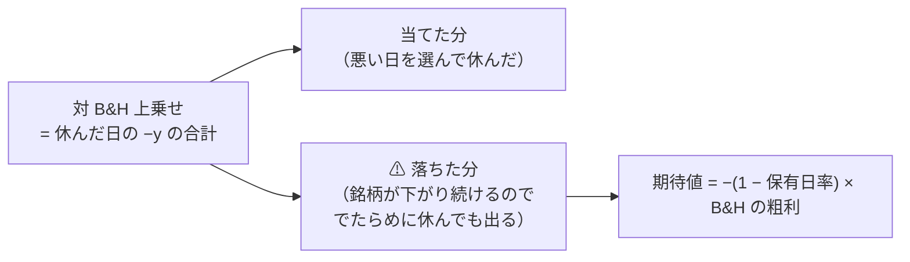

# 段 1 の後始末 — 物差しの穴と、先物を転がす ETF の扱い【実測 2026-09-12】

- プラン: [edge-drift-bias.md](../../plans/archive/edge-drift-bias.md)
- 派生元: [universe-lowcorr-trade.md](universe-lowcorr-trade.md)（段 1）
- 道具: `experiment/feature-discovery/cli/drift.py`（⚠ **保存済みの `per_symbol.csv` を読むだけ**）
- 実行（§7 で追加）: `runs/2026-09-12T17-55-31_trend_scales_1995_us70` ／ `runs/2026-09-12T17-54-55_trend_scales_1995_us70_leak`

## 1. 結論

⚠ **穴は実在する。だが段 1 の読みを覆すほどではなかった。** ⚠ **13-7 は変えない。**

| 問い | 答え |
| --- | --- |
| 上乗せに「でたらめに休んだだけ」で出る分が混ざるか | ✅ **混ざる。** UNG では ＋5,106bp のうち **＋1,592bp（31%）**がそれ |
| 引いても残るか | ✅ **残る。** UNG ＋3,515bp・USO ＋2,893bp は ⚠ **でたらめを超えている** |
| 13-7 の物差しを変えるべきか | ⚠ **変えない。** 変えると 190 試行が全部別定義になる。⚠ **診断として併記すれば足りる**（14-3 と同じ形） |
| 段 1 の結論は変わるか | ⚠ **一部変わる。** 下の §4 |

## 2. 何が混ざるのか

> この図の主張: ⚠ **上乗せは「当てた分」と「基準線が落ちた分」の和である。** 分けないと読めない。

⚠ **粗利を使うのはコストが保有日率ではなく売買回数で決まるから**（[13-4](feature-discovery/rules.md) 規約 3）。
⚠ **保有日率 1.0 なら 0**（休まないので落とす損益が無い）。⚠ **上がる銘柄では負になる**（休むと取り損ねる）。

⚠ **これは [14-6 b](feature-discovery/rules.md) の乱択ゲートと同じ問いである。** 違いは 2 つ:

| | 乱択ゲート（14-6 b） | 本書の分解 |
| --- | --- | --- |
| 何 | 種を固定して実際に回した 1 本の系列 | ⚠ **期待値の式** |
| 粒度 | ⚠ **ポートフォリオだけ** | ⚠ **銘柄ごとに出せる** |

⚠ **数字は一致しない。** ⚠ **乱択ゲートが正本で、本書は「どの銘柄で効いたか」を見るための診断である。**

## 3. 測った結果【実測 2026-09-12】

対象は段 1 の実行の最良手法（D2 中期ゲート θ=55）。5 fold 合計 bp。

| 群 | 上乗せ | ⚠ 落ちた分 | ⚠ 当てた分 |
| --- | ---: | ---: | ---: |
| 既存 63 本 | ＋22,867 | ⚠ **−14,240** | ＋37,107 |
| 追加 11 本 | ＋7,974 | ＋1,981 | ＋5,993 |
| 全体 | ＋30,841 | −12,259 | ＋43,100 |

⚠ **既存 63 本の「落ちた分」は負である。** ⚠ **株は上がるので、休むこと自体は損**であり、
⚠ **上乗せ ＋22,867 は「当てた分 ＋37,107」から「休んだ代償 −14,240」を引いた残りだった。**
⚠ **物差しの穴は株では逆向きに効いていた**（上乗せを**過小**に見せていた）。

| 銘柄（追加 11 本） | 上乗せ | 落ちた分 | ⚠ 当てた分 |
| --- | ---: | ---: | ---: |
| ⚠ **UNG** | ＋5,106 | ⚠ **＋1,592** | ⚠ **＋3,515** |
| ⚠ **USO** | ＋2,813 | −79 | ⚠ **＋2,893** |
| TLT | ＋512 | ＋66 | ＋447 |
| GLD ／ TIP ／ SHY ／ IEF | −501 ／ −83 ／ ＋221 ／ ＋407 | −506 ／ −88 ／ ＋216 ／ ＋402 | ＋5 ／ ＋5 ／ ＋5 ／ ＋5 |
| SLV ／ UUP | 0 ／ 0 | 0 ／ 0 | 0 ／ 0（⚠ **保有日率 1.00 ＝ 一度も休んでいない**） |
| DBC ／ LQD | −371 ／ −129 | ＋1 ／ ＋380 | −372 ／ −509 |

## 4. ⚠ 段 1 の読みを訂正する

⚠ **段 1 の記録（§4 の読み 2・3）は「当てたのではなく基準線が落ちているだけ」と書いた。これは言い過ぎだった。**

| 段 1 で書いたこと | ⚠ 訂正 |
| --- | --- |
| UNG の上乗せは基準線が落ちているだけ | ⚠ **31% はそうだが、69%（＋3,515bp）はでたらめを超えている** |
| USO も同じ | ⚠ **USO の「落ちた分」は −79bp でほぼゼロ。** ⚠ **＋2,813bp はほぼ全部が当てた分である** |

⚠ **変わらない結論**: 追加 11 本の当てた分 ＋5,993bp は ⚠ **UNG と USO の 2 本（合計 ＋6,408bp）に依存している**。
⚠ **残り 9 本の当てた分は合計 −415bp で負である。** ⚠ **11 本のうち 2 本でしか効いていないことは変わらない。**
⚠ **そしてその 2 本は、片道 2.5bp が成り立つか疑わしい銘柄である**（段 1 §4 の読み 4）。

## 5. 判定 — 13-7 は変えない

| 選択肢 | 判定 | 理由 |
| --- | --- | --- |
| (i) ドリフト調整した上乗せを採否に使う | ⚠ **採らない** | ⚠ **190 試行が全部別定義になる**（13-8 の橋渡し対が要る）。⚠ **払う代償に対して得るものが小さい** |
| ✅ **(ii) 変えない。診断として併記する** | ✅ **採る** | ⚠ **採否は 14-6 b の乱択ゲートが既に守っている。** 足りなかったのは ⚠ **銘柄ごとに見る道具**だけだった |

⚠ **道具は実行経路に入れていない**（`cli/drift.py` は保存済みの `per_symbol.csv` を読むだけ）。
⚠ **だから過去の実行にも遡って当てられるし、既存の 190 試行の数字は 1 つも動かない。**

⚠ **残る限界**: ⚠ **期待値の式であって実測の乱択ではない。** 休む日が「無作為」という仮定を置いている。
⚠ **実際の手法は連続して休む**ので、分散は式より大きい。⚠ **符号の判断には使えるが、検定には使わない。**

## 6. テスト

`tests/test_drift.py` 6 件。⚠ **恒等式（上乗せ ＝ 落ちた分 ＋ 当てた分）／ 保有日率 1.0 で 0 ／ 上がる銘柄では負 ／ 手法が無ければ黙らず落ちる**を縛った。

## 7. 先物を転がす ETF の規則 — ⚠ 回す前に書いた

⚠ **結果を見て UNG・USO を外すと選別になる。** ⚠ **だから成績ではなく商品の仕組みで線を引いた。**

**規則: ⚠ 裏付けが先物で、期限が来るたび乗り換える仕組みの ETF を対象から外す。**

| | 銘柄 | 裏付け |
| --- | --- | --- |
| ⚠ **外す** | USO ・ UNG ・ DBC | 先物【公表値 2026-09-12】。⚠ **転がしで目減りする** |
| ⚠ **外す** | UUP | ドル指数先物【推測】 |
| 残す | GLD ・ SLV | 現物の地金【公表値 2026-09-12】 |
| 残す | TLT ・ IEF ・ SHY ・ LQD ・ TIP | 現物の債券【推測】 |

⚠ **この規則は結果に都合よく働いていない**（そこが「規則」である証拠）:

| 外れる 4 本 | 当てた分 |
| --- | ---: |
| UNG | ⚠ **＋3,515**（勝ち） |
| USO | ⚠ **＋2,893**（勝ち） |
| DBC | −372（負け） |
| UUP | 0（引き分け） |

⚠ **勝ち 2・負け 1・引き分け 1 を一緒に外している。** ⚠ **成績で選んだなら負けだけを外すはずである。**

⚠ **外す理由は 2 つ**: (1) ⚠ **片道 2.5bp が成り立つか疑わしい**（段 1 のプランで**回す前に**挙げた 3 本がここに入る）
(2) ⚠ **転がしの目減りで B&H が壊滅し、「買って持つ人がいない基準線」になる**。

## 8. 結果 — ⚠ 広げた分の効きは全部この 4 本だった【実測 2026-09-12】

| | 63 本 | 74 本 | ⚠ **70 本**（先物型を外した） |
| --- | ---: | ---: | ---: |
| 実効系列数 | 4.192 | 5.436 | **4.988** |
| 最良手法 | D2 中期ゲート θ=55 | 同じ | 同じ |
| 対 B&H 上乗せ | ＋101.3bp/fold | ＋126.5bp/fold | ⚠ **＋101.0bp/fold** |
| t | 0.92 | 1.12 | ⚠ **0.84** |
| fold の符号 | 3/5 ＋−＋0＋ | 3/5 ＋−0＋＋ | 3/5 ＋−＋0＋ |
| leak 対照 | ＋16,844・t 8.15 | ＋16,410・t 8.37 | ✅ **＋16,122・t 7.87** |

> この図の主張: ⚠ **実効系列数は増えたのに、上乗せも t も 63 本に戻った。** 広がりの利得は先物型 4 本の中にあった。

| 群（70 本の実行） | 上乗せ | 落ちた分 | ⚠ 当てた分 |
| --- | ---: | ---: | ---: |
| 既存 63 本 | ＋21,217 | −5,206 | ＋26,423 |
| ⚠ **追加 7 本**（現物裏付け） | ＋426 | ＋468 | ⚠ **−42** |

⚠ **現物裏付けの 7 本の「当てた分」は −42bp ＝ 実質ゼロである。** ⚠ **債券でも金銀でも、この手法は効かない。**

| # | 読み方 |
| ---: | --- |
| 1 | ⚠ **74 本で見えた伸び（上乗せ ＋25bp・t ＋0.20）は、全部が先物型 4 本の寄与だった** |
| 2 | ⚠ **実効系列数は 4.99 まで増えたのに t は下がった**（0.92 → 0.84）。⚠ **[§8-0](universe-widening.md) が予言した「足した銘柄に上乗せが無ければ t は ×0.95 と下がる」がそのまま起きた**（実測 ×0.91） |
| 3 | ⚠ **したがって「低相関の銘柄を混ぜて検出力を上げる」は、この手法では成立しない。** ⚠ **混ぜる相手に上乗せが無いからである** |
| 4 | ⚠ **先物型 4 本を入れれば数字は良くなるが、それは「買って持つ人がいない基準線」に対する上乗せである** |

## 9. 台帳

| 量 | 前 | 後 |
| --- | ---: | ---: |
| n_trials | 190 | **211**（＋21） |
| 基準線の行 | 122 | 128 |

⚠ **検算**: ✅ **前の台帳 414 行のうち、数字が変わった行 0・消えた行 0**。
⚠ **us74 の 21 試行は残している**（やり直しではなく別の試行。13-9 の 3）。
