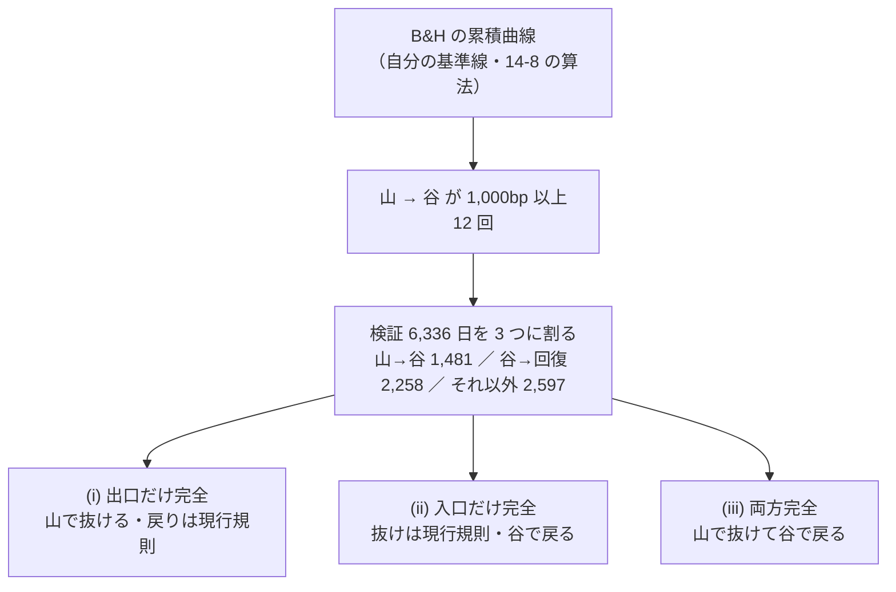
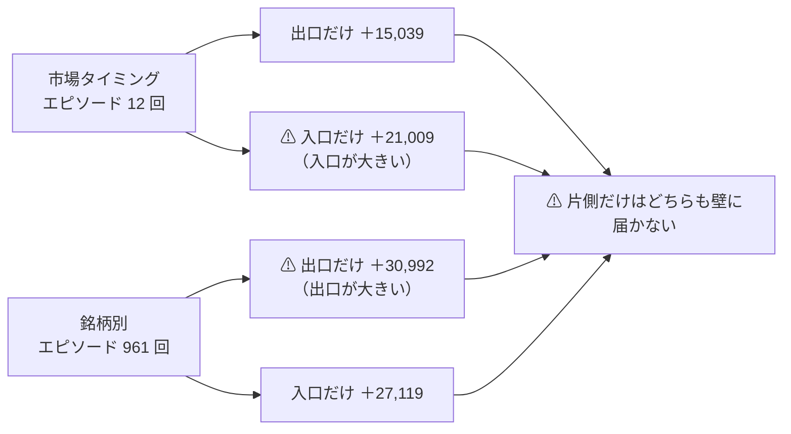
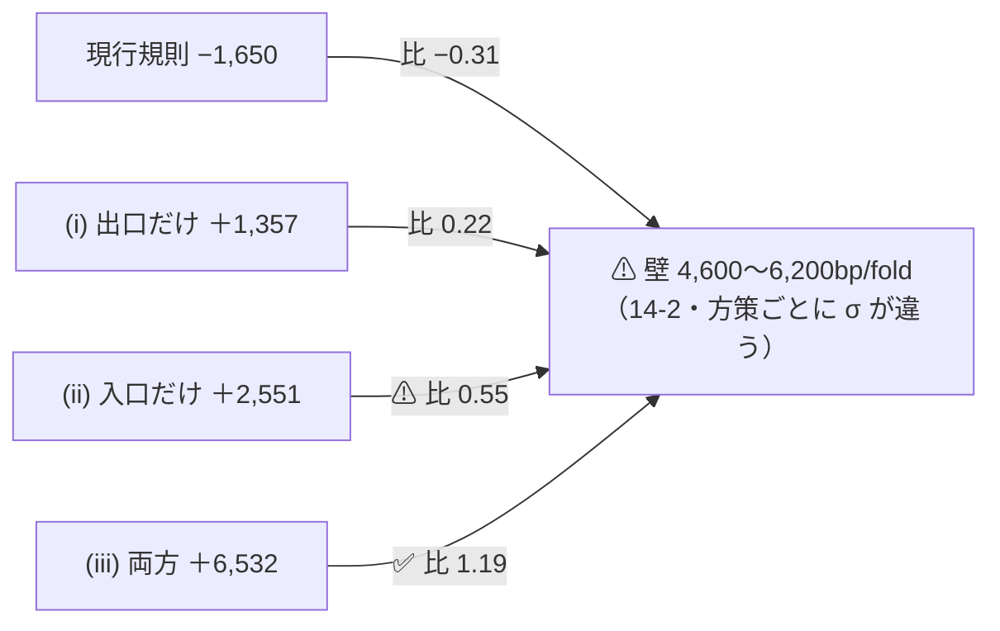
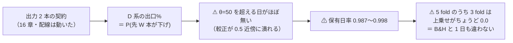

# 退出と再進入のタイミング（Phase 0 の上限見積もり ＋ Phase 1〜3 の実測）

- プラン: [downtrend-entry-timing.md](../../plans/archive/downtrend-entry-timing.md)
- 派生元: [downtrend-detection.md](downtrend-detection.md)（✅ 2026-09-12 完了）
- 規約: [rules.md 14-2](feature-discovery/rules.md)（検出限界）／ [14-8](feature-discovery/rules.md)（エピソード表）／ ⚠ **[16 章](feature-discovery/rules.md)（出力の契約を 2 本にする。本タスクで足した）**
- 読んだもの（Phase 0）: `runs/2026-09-12T15-15-12_trend_scales_1995/` の `daily.csv` ・ `result.csv` ・ `checks.json`
- 回した実行（Phase 3）: `runs/2026-09-12T18-39-58_trend_pairs_1995`（本番）／ `runs/2026-09-12T18-38-52_trend_pairs_1995_leak`（leak 対照）
- ⚠ **Phase 0 は新しい実行を作っていない**（読むだけ）。⚠ **Phase 3 で 36 試行を足した** — `n_trials` **217 → 253**
- 再現: `python3 -m cli.ceiling --run runs/2026-09-12T15-15-12_trend_scales_1995 --table data/features/trend_scales_1995/d.parquet`（上限）
  ／ `python3 -m cli.run --experiment trend_pairs_1995 --ignore-gate`（Phase 3。⚠ **表は `trend_scales_1995` のものを読む**）
- テスト: `tests/test_ceiling.py` 15 件 ＋ ⚠ **`tests/test_pairs.py` 12 件**（退化・較正の反転・状態の読み分け・毎日反転・config の 12 本）。feature-discovery 全体 **256 件 pass**

## 1. 結論

⚠ **片側だけを完璧にしても、いまの物差しでは測れない。** ⚠ **入口と出口を同時に直す構成だけが測定可能域に入る。**
⚠ **これは市場タイミング（63 銘柄を一斉に動かす）でも銘柄別でも同じで、粒度に依らない。**

⚠ **その「測定可能域に入る構成」を実際に回した結果は、落とすである**（[§9](#9-phase-13--入口と出口を別に持って回した実測-2026-09-12)）。
⚠ **上乗せは最良でも ＋29.56bp/fold ＝ 壁（2,673bp/fold）の 1.1%** で、⚠ **既存の対称構成の最良（D2 単独・＋101.26bp）に負けた。**
⚠ **配線ができていなかったのではない** — 16 章を足して入口と出口を別の窓で持てるようにし、leak 対照は跳ねた（＋12,902bp・t 7.22）。
⚠ **上限の見積もりが正しくても、その上限の 0.28% しか取れなかったということである**（要る取り分は 0.51）。

| 問い | 答え |
| --- | --- |
| 上昇トレンド（再進入）を追う価値はあるか | ✅ **ある。出口と同じ桁の価値がある**【実測】 |
| 出口と入口ではどちらが大きいか | ⚠ **粒度で逆転する。** 市場タイミングでは **入口 ＞ 出口**（＋21,009 対 ＋15,039bp）、銘柄別では **出口 ＞ 入口**（＋30,992 対 ＋27,119bp） |
| その価値は測れるか | ⚠ **片側だけでは測れない。** 完璧な入口でも符号 5/5 の壁の **0.55 倍**（市場）・**0.97 倍**（銘柄別）にしか届かない |
| では何なら測れるか | **入口と出口を同時に直す構成だけ**（壁の 1.19 倍・銘柄別なら 2.32 倍） |
| 片側だけの構成を回すべきか | ⚠ **回すべきでない**（14-2 の「回す前に測れないと判断してよい」に当たる） |

⚠ **「入口 ＞ 出口」は市場タイミングの話であって、銘柄別では逆**である点に注意する。
⚠ **どちらの粒度でも、片側だけの完璧な神託が壁に届かないという結論は変わらない**（要る取り分が 1 を超える）。

## 2. 何を計算したか — ⚠ 神託はエピソードの日付までしか知らない

> この図の主張: ⚠ **神託に「日ごとの正解」を与えない。** 山と谷の日付だけを与えるので、谷 → 回復とそれ以外の区間の上限はちょうど 0 になる。

⚠ **B&H は検証期間ずっと買い持ちなので、持っている日には上乗せが生まれない**（差はコストだけ）。
だから ⚠ **谷 → 回復とそれ以外の区間で神託が取れる上限は 0** であり、上限の全部が 山 → 谷 に載る。

現行規則は **C3 長期 SMA200 フィルタ・θ=50**（前タスクで最もよく休んだ手法）を使った。

## 3. 検算 — 記録を再現できることを先に確かめた【実測 2026-09-12】

⚠ **算法を読み違えていないことを、保存済みの記録との一致で確かめてから上限を出した。**

| 検算 | 結果 |
| --- | --- |
| エピソードの数と日付 | ✅ **12 回・日付とも [§5](downtrend-detection.md) と一致** |
| 区間の日数 | ✅ **山→谷 1,481 ／ 谷→回復 2,258 ／ それ以外 2,597（合計 6,336）** |
| [§4](downtrend-detection.md) の 3 分割 | ✅ **C1・C2・C3・D2・D4 の全部が一致**（C3 = −8,252 ／ ＋17,623 ／ −21,009 ／ −4,867） |
| fold の切れ目 | ✅ **fold 別の上乗せが `result.csv` と一致**（204.5 / −116.0 / −2,671.2 / −3,634.1 / −2,035.3） |

⚠ **fold の切れ目は日付の空きでは拾えない**（検証 fold は時間順に連続しているので空きが無い）。
`result.csv` の `検証日数` を正本にした（1,267 × 4 ＋ 1,268）。⚠ **空きで切ると先頭が 253 日になり、符号の数が変わる。**

## 4. 上限 3 種【実測 2026-09-12】

山 → 谷の下げを丸ごと避けたときの上限は **＋32,722bp**（コスト 12 往復 × 5bp を引いて ＋32,662bp）。
⚠ **現行規則はそのうち 53.9% を実際に取っている。**

| 方策 | 5 fold 合計 bp | bp/fold | bp/日 | 対現行 bp |
| --- | ---: | ---: | ---: | ---: |
| 現行規則 C3（実測） | −8,252 | −1,650 | −1.30 | 0 |
| (i) 出口だけ完全 | ＋6,786 | ＋1,357 | ＋1.07 | ＋15,039 |
| ⚠ **(ii) 入口だけ完全** | **＋12,757** | **＋2,551** | **＋2.01** | ⚠ **＋21,009** |
| (iii) 両方完全 | ＋32,662 | ＋6,532 | ＋5.15 | ＋40,914 |

⚠ **(ii) > (i)。上昇側（再進入）に残っている価値のほうが、下降側（退出）に残っている価値より大きい。**
これが追加指示「上昇トレンドを使うことに意味があるのか」への数字での答えである。

⚠ **足し算にならない**: (iii) の取り戻し ＋40,914 は (i) ＋15,039 と (ii) ＋21,009 の和より **＋4,867bp 多い**。
差はちょうど **それ以外の区間の取り損ね**（−4,867bp）であり、⚠ **片方だけ直しても平常時の空振りは消えない**ことを意味する。

## 4-1. 銘柄別の神託 — ⚠ 現行規則と同じ粒度で測り直す【実測 2026-09-12】

⚠ **上の 3 種は市場タイミングの神託**（63 銘柄を一斉に出し入れ）だが、⚠ **現行規則は銘柄ごとに動く。**
そこで ⚠ **銘柄が自分の山と谷を知っている**場合の上限も出した。表（`data/features/trend_scales_1995/`）から
各銘柄の累積を作り、**自分の 1,000bp 以上の下げ**を拾う（**961 回**。1 銘柄あたり平均 15 回）。

> この図の主張: ⚠ **粒度を変えると出口と入口の大小が入れ替わる。** ⚠ **どちらでも片側だけでは壁に届かない。**

⚠ **検算を 2 つ通してから使った**（どちらも「集計の仕方」か「規則の読み」が違えば必ずずれる）:

| 検算 | 結果 |
| --- | --- |
| 表から組み直した B&H が記録と一致するか | ✅ **6,336 日中 6,321 日が一致**（残る 15 日は fold 端の片道 2.5bp ぶん） |
| 表から組み直した C3 が記録と一致するか | ✅ **上乗せ −8,251bp**（記録 −8,252bp・差 ＋1）。⚠ **古典フィルタは「乖離が正なら持つ」だけ**なので表から完全に復元できる |

| 方策（銘柄別） | 5 fold 合計 bp | bp/fold | 対現行 bp |
| --- | ---: | ---: | ---: |
| (i) 出口だけ完全 | ＋22,741 | ＋4,548 | ⚠ **＋30,992** |
| (ii) 入口だけ完全 | ＋18,868 | ＋3,774 | ＋27,119 |
| (iii) 両方完全 | ＋52,148 | ＋10,430 | ＋60,399 |

⚠ **銘柄別では出口のほうが大きい。** 市場全体の下げは 25 年で 12 回しかないが、⚠ **銘柄ごとの下げは 961 回ある**ので、
「自分の山で抜ける」に値段が付く余地が市場タイミングよりずっと大きい。
⚠ **だから「上昇と下降のどちらが大事か」は粒度を言わずに答えられない。**

## 5. 検出限界との比較 — ⚠ ここで打ち切りが決まる

> この図の主張: ⚠ **壁（符号 5/5 を確率 0.8 で通す最小の上乗せ）を越えるのは (iii) だけ。**

| 方策 | σ 日次 bp | 壁（符号5/5）bp/fold | 壁（t≥2）bp/fold | 上乗せ bp/fold | ÷ 符号5/5 | ÷ t≥2 | P(符号5/5) |
| --- | ---: | ---: | ---: | ---: | ---: | ---: | ---: |
| 現行規則 C3 | 87.83 | 5,346 | 2,796 | −1,650 | −0.31 | −0.59 | 0.002 |
| (i) 出口だけ完全 | 101.52 | 6,179 | 3,232 | ＋1,357 | 0.22 | 0.42 | 0.113 |
| ⚠ **(ii) 入口だけ完全** | 75.73 | 4,609 | 2,411 | ＋2,551 | ⚠ **0.55** | 1.06 | ⚠ **0.389** |
| (iii) 両方完全 | 90.24 | 5,492 | 2,873 | ＋6,532 | ✅ **1.19** | 2.27 | 0.899 |
| 銘柄別 (i) 出口だけ | 98.62 | 6,003 | 3,140 | ＋4,548 | 0.76 | 1.45 | 0.599 |
| ⚠ **銘柄別 (ii) 入口だけ** | 63.61 | 3,872 | 2,025 | ＋3,774 | ⚠ **0.97** | 1.86 | 0.783 |
| 銘柄別 (iii) 両方完全 | 73.86 | 4,495 | 2,352 | ＋10,430 | ✅ **2.32** | 4.43 | 1.000 |

⚠ **σ は方策ごとに違うので、14-4 の 2,673bp/fold をそのまま借りていない**（この実行の fold 長と各方策の日次系列から計算し直した）。
⚠ **(i) の σ が一番大きい**のは、暴落日に丸ごと休むぶん上乗せの振れが大きくなるため。⚠ **(ii) の σ が一番小さい**のは、谷 → 回復の 2,258 日の上乗せがちょうど 0 になって振れが消えるため。

⚠ **神託の符号（(ii) 5/5・(iii) 5/5）を「通った」と読んではいけない。** 神託はこの標本に合わせて作ってあるので当然そうなる。
読むべきは **P(符号5/5)** のほうで、⚠ **完璧な入口でも 0.389 しかない**（5 回に 2 回しか通らない）。

### 5-1. ⚠ 神託の何 % を取れれば壁を越えるか

| 方策 | 壁（符号5/5）に要る取り分 | 壁（t≥2）に要る取り分 |
| --- | ---: | ---: |
| (i) 出口だけ | ⚠ **2.60（不可能）** | ⚠ **1.62（不可能）** |
| (ii) 入口だけ | ⚠ **1.49（不可能）** | 0.97 |
| (iii) 両方 | 0.87 | 0.55 |
| 銘柄別 (i) 出口だけ | ⚠ **1.24（不可能）** | 0.77 |
| 銘柄別 (ii) 入口だけ | ⚠ **1.02（不可能）** | 0.68 |
| ✅ **銘柄別 (iii) 両方** | **0.51** | **0.33** |

⚠ **取り分が 1 を超えるものは「神託より上手い」という意味で、定義から不可能である。**
⚠ **片側だけの 4 つが 4 つとも 1 を超えた**（市場タイミングでも銘柄別でも）。⚠ **これが打ち切りの根拠である。**

参考までに、⚠ **現行規則は市場の下げの上限のうち 53.9% を取れている。** 同じ取り分を当てはめると
市場タイミングの (ii) は ＋613bp/fold（壁の 0.13 倍）、(iii) は ＋2,757bp/fold（壁の 0.50 倍）になる【推測】。
⚠ **ただし銘柄別の神託は 961 回の下げを全部避ける話なので、この 53.9% をそのまま当てはめられない**（母数が違う）。

## 6. 判定（⚠ **Phase 0 の時点の判定**）

⚠ **2026-09-12 追記: 下の「✅ 回す候補はこれだけ」を実際に回した。結果は [§9](#9-phase-13--入口と出口を別に持って回した実測-2026-09-12) で、台帳の判定は 保留 2・落とす 34 である。**

| 型 | 判定 | 理由 |
| --- | --- | --- |
| 出口だけを良くする | ⚠ **回さない** | 完璧でも壁の 0.22 倍（銘柄別でも 0.76 倍）。⚠ **要る取り分 2.60 / 1.24 ＝ 神託超えが要る** |
| 入口だけを良くする（入口専用の検知器・退出後の待ち日数） | ⚠ **単独では回さない** | 完璧でも壁の 0.55 倍（銘柄別でも 0.97 倍）。⚠ **要る取り分 1.49 / 1.02 ＝ 同じく不可能** |
| ⚠ **入口と出口を同時に動かす**（非対称な保有帯・入口% と出口%） | ✅ **回す候補はこれだけ** | 壁の 1.19 倍（銘柄別 2.32 倍）。⚠ **要る取り分 0.87 / 0.51** |
| 建玉に段階を持たせる | ⚠ **この見積もりの対象外** | シミュレータの変更 ＝ 検証方式の変更。⚠ **橋渡し対（13-8）が要り、壁も引き直しになる** |

⚠ **銘柄別で見ると (iii) の要る取り分は 0.51（t≥2 なら 0.33）まで下がる。** ⚠ **回す価値があるとすればここだけである。**

⚠ **梯子（プラン §1-1）の 1 段目だけを開けるのでは足りない。** 非対称な保有帯は入口と出口を同時に動かせるが、
⚠ **帯をずらすだけで入口に別の時間スケールを与えられない**ので、神託の 87% には届きにくい【推測】。
⚠ **2 段目（14-1 の出力の契約を入口% と出口% に広げる）まで開ける必要がある。**

## 7. ⚠ この見積もりの限界

| # | 限界 | 向き |
| ---: | --- | --- |
| 1 | ✅ **解消した。** 市場タイミングの神託が上限を低く見積もる件は、⚠ **銘柄別の神託（§4-1）を足して塞いだ**。⚠ **表に価格が残っており、古典フィルタは学習しないので組み直せた** | — |
| 2 | ⚠ **銘柄別に組み直せるのは古典フィルタ（C1〜C3）だけ**（「乖離が正なら持つ」）。⚠ **学習ゲート（D1〜D4）は `fitted/` の係数が要る**ので同じようには組み直せない | ⚠ **現行規則を C3 に固定していることの限界。** ただし D 系は B&H に退化していて動かす余地が無い（[§5](downtrend-detection.md)） |
| 3 | ⚠ **生存バイアスが入口側の神託に直接効く**（[12-1](feature-discovery/rules.md)）。⚠ **12 回の下げが 12 回とも回復した標本**なので、「谷で戻る」神託は構造的に有利 | ⚠ **上限を高く見積もる向き。** ⚠ **入口が壁に届かないという結論は、この向きでは覆らない**（甘く見てなお届かない） |
| 4 | 山・谷・回復の日付は ⚠ **後から実現した曲線から拾ったもの**（[14-8](feature-discovery/rules.md)） | 神託の定義そのものなので織り込み済み |
| 5 | 「現実的な取り分 53.9%」は 1 つの手法の 1 つの実績から借りた【推測】 | 別の手法なら上下しうる。⚠ **結論は取り分に依らない部分（要る取り分が 1 を超える ＝ 不可能）で立てている** |
| 6 | ⚠ **壁は「符号 5/5 を確率 0.8」と「t≥2」の 2 本で、どちらも 13-7 が使う量**。⚠ **符号の壁のほうが厳しい** | t≥2 だけで見れば市場タイミングの (ii) は 1.06 倍で届く。⚠ **判定は両方を見るので「届いた」とは言えない** |

## 8. 次に決めること

| 決めること | Phase 0 の答え |
| --- | --- |
| どの型を試すか | ⚠ **入口と出口を同時に動かす型だけ。** ⚠ **入口だけ・出口だけは回さない**（4 通りとも要る取り分が 1 超） |
| 梯子の何段目まで開けるか | ⚠ **2 段目（14-1 の出力の契約）まで。** 1 段目（保有帯の非対称化）だけでは入口に別の時間スケールを与えられない |
| シミュレータを変えるか | ⚠ **変えない**（3 段目は橋渡し対が要り、壁も引き直しになる） |
| 試す構成の本数 | ⚠ **Phase 1 で事前に固定して数える**（13-3 規約 1 の警告。組み合わせで n_trials が跳ねる） |
| ⚠ **そもそも回すか** | ⚠ **利用者の裁定が要る**（下の 3 択） |

### 8-1. ⚠ 使っていない入力がある — 出来高

⚠ **表には出来高由来の列が 4 本ある**（`own_vratio_5/20/60` ＝ 出来高 ÷ 窓の平均出来高、`own_dollar_20` ＝ 売買代金の 20 日平均）。
⚠ **しかし下降トレンドの検知器は 1 本も受け取っていない。** 検知器が見るのは `trend` 層の 6 列だけで、
⚠ **その 6 列は全部終値から作られている**（高安すら使っていない。[15-2 規約 2-1](feature-discovery/rules.md)）。

| 層 | 出来高の列 | 検知器に渡るか |
| --- | --- | --- |
| `own`（35 本） | `own_vratio_5/20/60` ・ `own_dollar_20` | ⚠ **渡らない**（`scale_columns` は `own_trend{W}_` だけ拾う） |
| `trend`（18 本） | ⚠ **無い** | 渡る（6 列 × 3 スケール） |

⚠ **古典フィルタ（C1〜C3）はさらに狭く、`own_trend{W}_dist` 1 列だけで動いている。**
⚠ **入力を広げるのは「別の処置 ＝ 別の試行」**なので、Phase 1 で本数を数えるときに含める。
⚠ **ただし入力を増やしても壁は下がらない**（壁は上乗せの σ と fold 数で決まる）。⚠ **§6 の判定は変わらない。**

| 選択肢 | 中身 | ⚠ 見込み |
| --- | --- | --- |
| (a) 回す | 2 段目まで開け、入口と出口を同時に動かす構成だけを回す | ⚠ **銘柄別で要る取り分 0.51（t≥2 なら 0.33）。** 現行規則の実績 53.9% と同じ水準で、⚠ **ぎりぎり** |
| (b) 打ち切る | 14-2 を根拠に「測れない」として閉じる | ⚠ **片側だけの型は確かに測れない。** ただし (iii) 型は測定可能域に入っているので、14-2 が自動的に打ち切りを命じるわけではない |
| (c) 物差しを先に強くする | fold を増やす・期間を延ばして壁を下げてから回す | ⚠ **1995 表は raw の上限を使い切っている**（[14-4](feature-discovery/rules.md)）。⚠ **期間ではもう伸ばせない** |

---

## 9. Phase 1〜3 — 入口と出口を別に持って回した【実測 2026-09-12】

⚠ **利用者の決定（2026-09-12）は (a) 回す**（[rules.md 14-10](feature-discovery/rules.md)「空白は積極的に埋める」）。
Phase 1 で規約（[16 章](feature-discovery/rules.md)）を足し、Phase 2 で配線を作り、Phase 3 で回した。

### 9-1. 何を変えたか — ⚠ 開けたのは 2 条だけ

| 条 | 変えたこと |
| --- | --- |
| **14-1**（出力の契約） | 買い% 1 本 → ⚠ **入口% と出口% の 2 本。** 未保有の日は入口% だけ、保有中の日は出口% だけを読む（状態が読む側を決めるので優先規則は要らない） |
| **13-2 規約 1**（売り% = 100 − 買い%） | 出口% を ⚠ **別の窓のラベル**（`y_fwd_{W_out}` ≤ 0）で較正する |
| ⚠ **開けなかった条** | 13-3（θ は共通・50/55/60）・13-4（0/1 の状態機械・買い専用・片道 2.5bp）・13-7（対 B&H 上乗せ）。⚠ **検証方式を変えていないので 13-8 の橋渡し対は要らない** |

⚠ **非対称性は窓の違いからしか生まれない**（16-2）。Platt 較正はロジスティック回帰 1 変数なので、
ラベルを反転すると係数が反転するだけで σ(−a·p − b) = 1 − σ(a·p + b) が厳密に成り立つ。
⚠ **つまり同じ窓で出口を「独立に較正」しても 100 − 入口% そのもの** ＝ 対称構成は定義から退化する。
⚠ **だから対称構成は回さず、退化の検査に使った**（`tests/test_pairs.py`）。

構成は ⚠ **結果を見る前に固定した**（16-4）: 窓の順序対 **6**（20/60・20/200・60/200 ＋ ⚠ **逆向き 3 つは対照**）
× 系統 **2**（D 学習ゲート・C 古典フィルタ）× θ **3** ＝ **36 試行**。⚠ **1 本も足していない・減らしていない。**

### 9-2. 検算 — ⚠ 結果を読む前に 4 つ通した

| 検算 | 結果 |
| --- | --- |
| leak 対照（13-10・16-7 の 4） | ✅ **跳ねた。** 上乗せ **＋12,902 / ＋12,910 / ＋12,958bp**・**t 7.22 / 7.17 / 7.12**・DSR 1.000（⚠ **2 つの窓の `LEAK_fwd_` を両方混ぜて初めて跳ねる**） |
| 退化（16-1 の 4・16-2） | ✅ **出口% を省く ／ 100 − 入口% を渡す ／ 対称な窓にする の 3 通りが、1 出力の契約と 1 行も違わない**（`tests/test_pairs.py` 12 件） |
| 既存の台帳 | ✅ **手法の行は 1 行も動いていない**（690 行 → 764 行。⚠ **消えた 12 行は全部基準線で、数字は同一のまま「2 実行・一致」に変わっただけ** ＝ 別の実行が B&H を再現した） |
| `n_trials` | ✅ **217 → 253**（事前に数えた 36 と一致。判定の内訳は **保留 2・落とす 34**） |

⚠ **基準線が別の実行で 1 円も違わず再現した**（B&H ＋4,220.21bp・直前符号 −1,482.19bp）ことは、
⚠ **表も fold の切れ目もコストも動いていない**ことの証拠である。

### 9-3. 結果 — ⚠ 最良は対照側で、しかも既存の対称構成に負けた

| θ | 最良の構成 | 純利bp | 対 B&H 上乗せ | fold の符号 | t | 保有日率 | 取引/fold |
| ---: | --- | ---: | ---: | --- | ---: | ---: | ---: |
| 50 | ⚠ **入口D3(200)×出口D1(20)**（逆向き） | ＋4,249.77 | **＋29.56** | 1/5 ＋−000 | 0.87 | **0.987** | 59.4 |
| 55 | ⚠ **入口D2(60)×出口D1(20)**（逆向き） | ＋4,228.64 | ＋8.44 | 2/5 ＋−＋00 | 0.80 | **0.998** | 59.8 |
| 60 | 入口D3(200)×出口D1(20)（逆向き） | ＋4,192.47 | **−27.74** | 1/5 ＋−000 | −0.56 | 0.946 | 57.8 |
| — | 基準線 B&H | ＋4,220.21 | — | — | — | 1.000 | 59.8 |
| — | ⚠ **既存の対称構成の最良**（D2 中期 60 日・θ=55） | **＋4,321.47** | ＋101.26 | 3/5 ＋−＋0＋ | — | 0.944 | 92.4 |

⚠ **仮説（入口は短期・出口は長期）の側は 9 行とも B&H 以下**だった（最良は 入口D2(60)×出口D3(200)・θ=55 の ＋4,195.91）。
⚠ **上に来たのは 3 行とも対照側（入口が長期・出口が短期）である。** ⚠ **仮説の向きは支持されなかった。**

C 系（古典フィルタ）は 6 構成 × 3 θ の 18 行が全部 B&H を大きく下回った（最良 入口C2(60)×出口C3(200) の ＋2,344.76）。
⚠ **対称な C3 単独（＋2,569.78）にも負けている。**

### 9-4. ⚠ 16-5 の検査 — 対称構成の両方に勝ったか

⚠ **非対称構成は、入口と出口に使った 2 つの対称構成の両方に勝って初めて意味がある**（[16-5](feature-discovery/rules.md)・14-6 の a）。

| 非対称構成 | 純利bp | 入口側の単独 | 出口側の単独 | 判定 |
| --- | ---: | ---: | ---: | --- |
| 入口D3(200)×出口D1(20)・θ=50 | ＋4,249.77 | D3 ＋4,049.59 | D1 ＋4,220.21 | ⚠ **両方に勝つが、D1 単独が B&H そのもの**（保有日率 1.000 ＝ 一度も出ない） |
| 入口D2(60)×出口D1(20)・θ=55 | ＋4,228.64 | ⚠ **D2 ＋4,321.47** | D1 ＋4,220.21 | ⚠ **負け。** 16-5 により意味が無い |
| 入口C2(60)×出口C3(200)・全 θ | ＋2,344.76 | C2 ＋1,678.28 | ⚠ **C3 ＋2,569.78** | ⚠ **負け** |

⚠ **16-5 を満たしたのは 1 行だけで、その 1 行の「勝った相手」は B&H と同一の構成だった。**

### 9-5. ⚠ なぜ動かなかったか — 5 fold のうち 3 fold は B&H と 1 日も違わない

> この図の主張: ⚠ **出力を 2 本にしても、学習ゲートは出口を引かなかった。** 上乗せが 0 の fold は「引き分け」ではなく「同一」である。

fold 別の上乗せ（θ=50 の最良）は **＋165.50 / −17.70 / 0.00 / 0.00 / 0.00bp**。
⚠ **後ろ 3 fold はちょうど 0** ＝ その期間は 1 日も休んでいない。⚠ **符号 1/5 は「4 回負けた」ではなく「3 回は同じものだった」**。

乱択ゲート（[14-6 b](feature-discovery/rules.md)。同じ保有日率ででたらめに休む）との比較も同じ向き:

| θ | 手法 | 乱択ゲート | 差 | 読み |
| ---: | ---: | ---: | ---: | --- |
| 50 | ＋4,249.77 | ＋4,193.99 | ＋55.77 | ⚠ **休んだ日数が 1.3% しか無いので、どちらも B&H の写し** |
| 55 | ＋4,228.64 | ＋4,196.81 | ＋31.83 | 乱択の方が符号 3/5（手法は 2/5）⚠ **＝ 分離できていない** |
| 60 | ＋4,192.47 | ＋4,190.00 | ＋2.47 | ⚠ **実質ゼロ** |

門（[14-5](feature-discovery/rules.md)。⚠ **測るが回すかは決めない**）も 12 本すべて門前だった — D 系 AUC **0.5018〜0.5123**・買い% 幅 **0.0008〜10.6 点**、C 系 AUC **0.4909〜0.4958**・幅 100 点。
⚠ **D 系の「幅 0.0008 点」は、較正後の確率が 1 点の幅も持たないという意味**で、θ を何に置いても動かない。

> ⚠ **追記（2026-09-12）: この読みは半分だけ正しかった**（[buy-pct-width-collapse.md §4](buy-pct-width-collapse.md)）。
> ⚠ **幅 0.0008 点だったのは D1 短期 20 日だけで、それは Platt の数値解が止まる不具合だった**（直した）。
> ⚠ **D2 中期・D3 長期は較正が正しく、幅も 8〜45 点ある。** ⚠ **保有日率 0.987〜0.998 の原因は幅ではなく中心の位置**で、
> ⚠ **買い% の中央値が 58.5 / 68.4% にあり θ ∈ {50,55,60} が全部その下に落ちる。**
> ⚠ **そして中心が高いこと自体は正しい** — 60 日・200 日先が上がる確率は本当に高い（ドリフト）。⚠ **θ の置き方が信号に合っていない。**
> ⚠ **本書の数字は直す前のものであり、1 つも書き換えていない**（回し直しは `trend_scales_1995` / `trend_pairs_1995` の std 行として台帳に別途ある）。

### 9-6. エピソード表（診断。⚠ 採否に使わない）

12 回の下げのうち ⚠ **上乗せが正だったのは 1 回だけ**（2000-09-08 → 2002-10-08 の ＋334.7bp。保有日率 0.902）。
⚠ **残る 11 回は保有日率 1.000 ＝ 下げの間ずっと持っていた**（上乗せちょうど 0）。
⚠ **前タスクの C3 は 12 回の 12 回とも損失を圧縮していた**（[§4](downtrend-detection.md)）。⚠ **出口を「学習ゲート」に替えた時点でその働きは消えている。**

### 9-7. 判定

| 問い | 答え |
| --- | --- |
| 入口と出口を同時に動かせるようになったか | ✅ **なった**（16 章・`ail/detectors/pair.py`・leak 対照で配線を確認） |
| それで上乗せが出たか | ⚠ **出ていない。** 最良 ＋29.56bp/fold・符号 1/5・t 0.87・DSR 0.267 |
| 壁との距離 | ⚠ **壁 2,673bp/fold の 1.1%。** 銘柄別の上限 ＋10,430bp/fold に対する取り分は **0.0028**（要るのは **0.51**） |
| 仮説（入口は短期・出口は長期）は支持されたか | ⚠ **されていない。** 上位 3 行は全部対照側（逆向き） |
| 台帳の判定 | ⚠ **保留 2 行・落とす 34 行。** ⚠ **「採る」は 0 件のまま** |
| ⚠ **この方向を続けるか** | ⚠ **続けない。** 次に動かすとしたら ⚠ **検知器の中身（出口の確率が潰れている原因）**であって、⚠ **入口と出口の組み合わせではない** |

⚠ **Phase 0 の見積もりは外れていない。** 「(iii) 型なら測定可能域に入る」は上限の話で、
⚠ **実際の手法がその上限の 0.28% しか取れなかった**というのが Phase 3 の結果である。
⚠ **上限が届くことと、手法が届くことは別である** — 14-2 の使い方としてはここが限界だと分かった。

### 9-8. ⚠ 限界

| # | 限界 | 向き |
| ---: | --- | --- |
| 1 | ⚠ **出口の確率が潰れている原因は切り分けていない**（較正か・ラベル `y_fwd_W ≤ 0` か・Ridge か・`trend` 6 列か） | ⚠ **「2 本にしても効かない」と「この検知器では効かない」を分離できていない。** ⚠ **前者と読むのは行き過ぎ** |
| 2 | ⚠ **D 系が B&H に張り付くのは前タスクからの持ち越し**（[downtrend-detection §5](downtrend-detection.md)）。16-7 の 5 で**回す前に予告していた通り**になった | 予告どおりなので驚きは無いが、⚠ **予告できていたなら先に検知器を直すべきだった** |
| 3 | ⚠ **生存バイアスは入口側に有利に効く**（12-1。12 回の下げが 12 回とも回復する標本） | ⚠ **甘い側に効いてなお届かない**ので、結論は覆らない |
| 4 | ⚠ **形式 (B) 銘柄別・出来高・他のモデルは回していない**（16-4 で動かさないと決めた軸） | ⚠ **組み合わせを増やせば n_trials が掛け算になる。** 回すなら別タスクとして数える |
| 5 | 上限（§4・§4-1）は ⚠ **古典フィルタ C3 を現行規則に置いた神託**で、今回の最良は D 系 | ⚠ **取り分 0.0028 は「C3 基準の上限」に対する比であって、D 系の天井ではない** |
