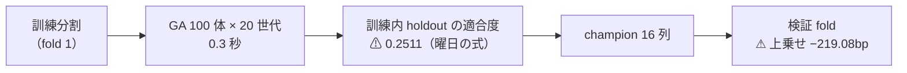
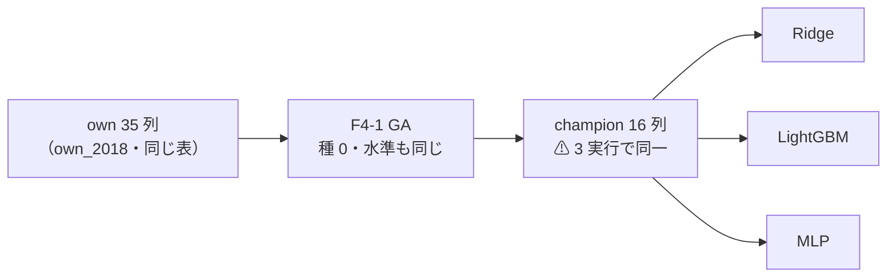

# 進化的探索の器と F4-1 記号回帰 — ⚠ **9 行とも「落とす」**【実測 2026-09-16】

> ⚠ **これは投資助言ではなく調査資料である。** 数字はすべて【実測】（2026-09-16）。

⚠ **結論は 3 つある。**

1. ⚠ **3 行（θ 3 水準）とも「落とす」。** 上乗せは **−219.08 〜 −698.59bp/fold**（t −0.82 / −1.55 / −1.71）で、⚠ **B&H（＋1,652.02bp）を超えた行は 0。**
2. ✅ **器は動いた。** キュー・失敗時の再開・leak 対照の自動追加・台帳の自動更新。⚠ **`n_trials` は事前登録どおり 589 → 592（＋3）**で、⚠ **世代 × 個体（1 fold あたり最大 2,000 体）は数えない。**
3. ⚠ **訓練内 holdout でいちばん効いたのは「曜日」だった**（`own_dow`）。⚠ **適合度 0.2511 の式が、検証では −219bp。** ⚠ **探索が強いほど、訓練の内側で効くものを確実に見つけてくる。**
4. ⚠ **モデルを替えても落ちた**（§8 の追試）。⚠ **Ridge・LightGBM・MLP の 3 モデル × θ 3 水準 ＝ 9 行とも B&H に届かない。**
   ⚠ **探索の出力（champion 16 列）は 3 モデルで 1 ビットも違わない**ので、⚠ **これは「モデルだけを替えた」比較である。** `n_trials` 592 → 598。

プラン: [evolutionary-search-runner.md](../../plans/archive/evolutionary-search-runner.md) ／ 台帳: [ledger.md](feature-discovery/ledger.md) ／ 規約: [rules.md](feature-discovery/rules.md)

---

## 0. 何をやったか

⚠ **2 つ作った。混ぜない。**

| | 作ったもの | 実体 |
| --- | --- | --- |
| **器** | 実験を並べて回し続ける仕組み | `cli/queue.py`（208 行）＋ `config/queue/*.toml` ＋ `runs/queue/*.json` |
| **中身** | 進化的探索（記号回帰） | `ail/search/evolve.py`（⚠ **`transform` の口**）＋ `config/experiment/trade_own_gp_a.toml` |

| 実行 | 中身 | 時間 |
| --- | --- | ---: |
| `2026-09-16T10-18-18_trade_own_gp_a` | 本番（GA ＋ 全部使う ＋ 基準線 2 本） | 10.2 秒 |
| `2026-09-16T10-18-31_trade_own_gp_a_leak` | ⚠ **leak 対照**（器が自動で並べた） | 8.2 秒 |

この図の主張: ⚠ **落ちたのは「探索の失敗」ではない。訓練の内側では確かに効いた。効きが検証まで届かなかった。**

---

## 1. 結果 — ⚠ **3 行とも落とす**

⚠ **判定は対 B&H の上乗せ**（[13-7](feature-discovery/rules.md)）。B&H は **＋1,652.02bp/fold**。

| θ | 純利bp/fold | ⚠ 上乗せ | t | 取引回数/fold | 保有日率 | DSR | 判定 |
| ---: | ---: | ---: | ---: | ---: | ---: | ---: | --- |
| 50 | ＋1,432.94 | **−219.08** | −0.82 | 1,505 | 0.722 | 0.078 | 落とす |
| 55 | ＋1,267.84 | **−384.17** | −1.55 | 105 | 0.610 | 0.064 | 落とす |
| 60 | ＋953.42 | **−698.59** | −1.71 | 44 | 0.432 | 0.035 | 落とす |

⚠ **純利は 3 水準とも正だが、それは「買って持っただけ」で出る分である**（13-7 が純利の符号を採否に使わない理由）。
✅ **検知器の軸で起きた「保有日率 1.000」は起きていない**（[theta-placement.md §2](theta-placement.md)）。⚠ **売買は成立していて、そのうえで負けている。**

---

## 2. 探索は何を見つけたか

| fold | 世代 | 止めた理由 | 秒 | holdout 行 | 最良の式（先頭） | 適合度 |
| ---: | ---: | --- | ---: | ---: | --- | ---: |
| 1 | 20 | 世代の上限 | 0.3 | 2,246 | `own_dow ＋ (own_dow − ((own_dow ＋ own_vratio_20) − …))` | **0.2511** |
| 3 | 20 | 世代の上限 | 0.7 | 6,788 | `sqrt(own_dow) − (own_vol_60 ＋ (own_dow ＋ own_vratio_5))` | 0.1719 |
| 5 | 8 | ⚠ 改善が止まった | 0.6 | 11,321 | `own_dow × own_lower` | 0.0843 |

⚠ **3 fold とも先頭の式に `own_dow`（曜日）が入っている。** ⚠ **35 列の中で、訓練内 holdout といちばん相関したのが曜日だった。**
⚠ **適合度は fold が進むほど落ちる**（0.2511 → 0.1719 → 0.0843）。⚠ **holdout が 2,246 → 11,321 行と厚くなるほど「効いて見えるもの」が消えていく** ＝ ⚠ **小さい標本での高い適合度は、その大きさゆえである。**

---

## 3. 数え方 — ⚠ **なぜ世代 × 個体を数えないか**

⚠ **1 fold あたり最大 2,000 体（100 × 20）を作ったが、`n_trials` に数えたのは 3 である。**

| | 数える | 根拠 |
| --- | --- | --- |
| 世代 × 個体（〜2,000/fold） | ⚠ **数えない** | ⚠ **訓練分割の内側の holdout しか見ていない**ので、⚠ **偶然の最大値を作る母集団に入らない**（[14-5](feature-discovery/rules.md) の門と同型。[validation-power.md §5-4 問 2](feature-discovery/validation-power.md)） |
| champion × θ 3 水準 | ✅ **3 試行** | 検証 fold に出たのはこれだけ |

⚠ **この根拠は「そう決めた」ではなく、コードの性質として検査してある** — ⚠ **検証分割 `Xte` を別の値に差し替えても、選ばれる式と適合度が 1 文字も変わらない**（`tests/test_evolve.py`）。⚠ **探索に `Xte` が混ざっていれば、この検査は落ちる。**

---

## 4. 器（継続実行）— できること

| できること | ⚠ できないと何が起きるか |
| --- | --- |
| 途中で殺しても続きから（⚠ **済んだ実行は 2 度回さない**） | ⚠ **同じ設定が `runs/` に 2 つでき、台帳の鍵では 1 行のままなので気づけない** |
| ⚠ **本番 1 本につき leak 対照 1 本を自動で並べる** | ⚠ **手で足すと必ず忘れる**（配線の穴に気づく唯一の手） |
| 失敗しても次へ進み、⚠ **連続 3 本で止まる** | 1 本の失敗で残り全部が道連れ ／ 無限に回り続ける |
| ⚠ **時間の上限で止まる** | ⚠ **回し続ける仕組みは、放っておくと `n_trials` を無限に増やす** |
| 本番の後に台帳を吐き直し、`n_trials` を状態に残す | 数え落としに気づけない |
| ⚠ **実験名は走り出す前に全部確かめる** ／ `--dry-run` | 3 本目で「名前が違う」で止まる |

---

## 5. 検算

| # | 見たもの | 結果 |
| ---: | --- | --- |
| 1 | ⚠ **leak 対照** | ✅ **跳ねた**（上乗せ **＋22,193.78bp**・t **17.14**・DSR 1.000）＝ 配線は生きている |
| 2 | 既存の台帳の行 | ✅ **数字が変わった手法の行 0・消えた行 0**（増えたのは F4-1 の 3 行だけ） |
| 3 | B&H の再現 | ✅ **15 実行とも ＋1,652.02bp で一致**（1 バイトも動かない） |
| 4 | `n_trials` | ✅ **589 → 592**（⚠ **事前登録どおり ＋3**）。台帳 945 → 948 行・落とす 511 → 514 |
| 5 | テスト | ✅ **352 件 pass**（器 11 件 ＋ 探索 9 件 ＋ 既存 332 件） |
| 6 | カタログ | ✅ **実装 20 → 21 件・未実施 6 → 5 件**（F4-1 が §3 から落ちた） |

---

## 6. 費用【実測】

| | 時間 |
| --- | ---: |
| GA 1 fold（100 体 × 最大 20 世代） | **0.3〜0.9 秒** |
| 本番 1 本（5 fold × 門 ＋ 本番） | **10.2 秒** |
| leak 対照 1 本 | **8.2 秒** |

⚠ **想定より 2 桁速かった**（プランは「数十分〜数時間」と見積もっていた）。⚠ **式の評価が numpy のベクトル演算 1 回で済むため。**
⚠ **だから「門で 2 度回る」ことも問題にならなかった。**

---

## 7. 限界と次の一手

- ⚠ **曜日（`own_dow`）が先頭に来たことをどう読むか。** 曜日は実在する列だが、⚠ **これが効くという一次情報はこちらに無い**。⚠ **落とす結果なので今回は追わない**（追うなら「曜日だけ」を回して 1 行足す）
- ⚠ **適合度の指標（Spearman |ρ|）を替えれば別の式が出る。** ⚠ **替えた数だけ `n_trials` が増える**（[14-9](feature-discovery/rules.md)）。⚠ **替えるなら回す前に決める**
- ✅ **モデルの軸は 2026-09-16 に埋めた**（§8。LightGBM・MLP。⚠ **6 行とも落とす**）。⚠ **残る自由度は表と形式**（own_2018 × (A) のまま）。⚠ **「記号回帰は効かない」ではなく「この条件では効かない」**は変わらない
- ✅ **器は GA 専用ではない。** 既存の config を並べるだけでも使える（⚠ **手間「大」の残り 2 件 — F4-3 tsfresh・F5-3 行列プロファイル — もこの器から回せる**）

---

## 8. 追試 — ⚠ **モデルを替えても落ちた**（2026-09-16）

プラン: [ga-models-lgbm-mlp.md](../../plans/archive/ga-models-lgbm-mlp.md)。⚠ **§7 が挙げた限界「1 モデルでしか回していない」を埋めるための追試である。**
⚠ **回す理由は「効くはず」ではない**（[14-10 規約 4](feature-discovery/rules.md)）。

### 8-1. ⚠ **これは「モデルだけを替えた」比較である**

> この図の主張: ⚠ **GA はモデルの前段にあるので、モデルを替えても探索は同じ答えを出す。** ⚠ **だから差はモデルだけのものだと言い切れる。**

⚠ **「同一」は目視ではなく突き合わせで確かめた**【実測】: 5 fold ぶんの式と適合度を並べた SHA-256 が 3 実行とも `ddc24aa257b474d3…` で一致する。

| fold | 世代 | 止めた理由 | 秒 | 最良の適合度 | champion |
| ---: | ---: | --- | ---: | ---: | ---: |
| 1 | 20 | 世代の上限 | 0.3 | 0.2511 | 16 列 |
| 2 | 20 | 世代の上限 | 0.5 | 0.1558 | 16 列 |
| 3 | 20 | 世代の上限 | 0.7 | 0.1719 | 16 列 |
| 4 | 10 | ⚠ 改善が止まった | 0.4 | 0.1526 | 16 列 |
| 5 | 8 | ⚠ 改善が止まった | 0.6 | 0.0843 | 16 列 |

⚠ **3 モデルともこの表が 1 文字も違わない。** ⚠ **打ち切りも 3 種類とも同じところで効いている。**

### 8-2. 結果 — ⚠ **9 行とも落とす**

⚠ **判定は対 B&H 上乗せの符号**（[13-7](feature-discovery/rules.md)）。B&H は **＋1,652.02bp/fold**（⚠ **15 実行と同じ値で一致**）。

| モデル | θ | 純利bp/fold | ⚠ 上乗せ | t | fold の符号 | 取引/fold | 保有日率 | 判定 |
| --- | ---: | ---: | ---: | ---: | :-: | ---: | ---: | --- |
| Ridge | 50 | ＋1,432.94 | **−219.08** | −0.82 | 2/5 −＋−−＋ | 1,505.0 | 0.722 | 落とす |
| Ridge | 55 | ＋1,267.84 | **−384.17** | −1.55 | 1/5 −＋−−− | 105.2 | 0.610 | 落とす |
| Ridge | 60 | ＋953.42 | **−698.59** | −1.71 | 1/5 ＋−−−− | 44.0 | 0.432 | 落とす |
| ⚠ **LightGBM** | 50 | ＋1,540.71 | **−111.30** | −0.79 | 2/5 −0−＋＋ | 1,265.8 | 0.729 | 落とす |
| ⚠ **LightGBM** | 55 | ＋844.46 | **−807.56** | −1.87 | ⚠ **0/5 −−−−−** | 867.4 | 0.346 | 落とす |
| ⚠ **LightGBM** | 60 | ＋453.18 | **−1,198.84** | ⚠ **−2.98** | ⚠ **0/5 −−−−−** | 667.0 | 0.255 | 落とす |
| ⚠ **MLP** | 50 | ＋1,366.07 | **−285.94** | −1.35 | 1/5 ＋0−−0 | 1,399.8 | 0.754 | 落とす |
| ⚠ **MLP** | 55 | ＋1,076.24 | **−575.78** | −1.41 | 1/5 −＋−−− | 294.2 | 0.578 | 落とす |
| ⚠ **MLP** | 60 | ＋959.64 | **−692.37** | −1.49 | 1/5 −−＋−− | 73.2 | 0.554 | 落とす |

⚠ **いちばん惜しいのは LightGBM の θ=50（−111.30bp）で、それでも負けている。** ⚠ **そして同じ LightGBM が θ を上げると 5 fold とも負ける**（t −2.98 ＝ ⚠ **この表でいちばん強い「負けている」証拠**）。

⚠ **読み違えに注意**: ⚠ **純利は 9 行とも正である。** ⚠ **それは「買って持っただけ」で出る分**であり、[13-7](feature-discovery/rules.md) が純利の符号を採否に使わない理由そのものである。

### 8-3. ⚠ **GA を通すと良くなるのか**（同じ表・同じ fold の対）

⚠ **変換なしの既存 2 本と並べる**（同じ `own_2018`・同じ 5 fold・同じ θ・同じコスト。⚠ **違うのは前段に GA が入ったかどうかだけ**）。

| モデル | θ | 変換なし | ⚠ **GA あり** | 差 |
| --- | ---: | ---: | ---: | ---: |
| LightGBM | 50 | 1,509.88 | **1,540.71** | ⚠ **＋30.83** |
| LightGBM | 55 | 1,234.76 | **844.46** | −390.30 |
| LightGBM | 60 | 397.46 | **453.18** | ＋55.72 |
| MLP | 50 | 1,583.93 | **1,366.07** | −217.86 |
| MLP | 55 | 1,122.51 | **1,076.24** | −46.27 |
| MLP | 60 | 847.96 | **959.64** | ＋111.68 |

⚠ **6 対のうち 3 つで上がり 3 つで下がる。** ⚠ **向きが揃わない ＝ 「GA を通すと良くなる」とは言えない。**
⚠ **しかも上下の幅（±30〜390bp）は B&H との差（−111〜−1,199bp）より小さい。** ⚠ **どちらに転んでも B&H は超えない。**

### 8-4. 検算

| # | 見たもの | 結果 |
| ---: | --- | --- |
| 1 | ⚠ **leak 対照 2 本** | ✅ **跳ねた**（LightGBM ＋22,192〜22,194bp・t 17.13 ／ MLP ＋22,180〜22,182bp・t 17.12）＝ 配線は生きている |
| 2 | ⚠ **探索の出力** | ✅ **3 モデルで同一**（§8-1 の SHA-256）＝ ⚠ **差はモデルだけのもの** |
| 3 | `n_trials` | ✅ **592 → 598**（⚠ **事前登録どおり ＋6**）。落とす 514 → 520・保留 78 のまま |
| 4 | B&H の再現 | ✅ **＋1,652.02bp で一致**（1 バイトも動かない） |
| 5 | 既存の台帳の行 | ✅ **数字が変わった手法の行 0・消えた行 0**（増えたのは 6 行だけ） |
| 6 | カタログ | ✅ **実装 21 件・未実施 5 件のまま**（⚠ **新しい手法は 1 つも足していない** — モデルの軸を広げただけ） |
| 7 | テスト | ✅ **352 件 pass**（⚠ **`ail/` は 1 行も変えていない**） |
| 8 | DSR | LightGBM 0.140 ／ MLP 0.060 ／ Ridge 0.078（SR0 0.0732・n_obs 1,801）。⚠ **採否には使わない**（13-7） |

### 8-5. 費用【実測】と、次に何をしないか

| | 時間 |
| --- | ---: |
| 本番 LightGBM ／ MLP | **11.2 秒 ／ 16.7 秒** |
| leak 対照 LightGBM ／ MLP | 16.2 秒 ／ 35.7 秒 |
| ⚠ **キュー 4 本ぜんぶ** | ⚠ **80 秒** |

⚠ **プランの見積もり（10 分前後）より 1 桁速かった。** ⚠ **GA が列を 35 → 16 に減らすので、モデル側の学習も軽くなる。**

- ⚠ **θ を増やさない。** ⚠ **9 行とも負けている場所で水準だけ足しても、増えるのは `n_trials` だけである**（E8 の X5）
- ⚠ **ハイパーパラメータを振らない**（[13-6 規約 3](feature-discovery/rules.md)）。⚠ **振った水準の数だけ試行が増える**
- ⚠ **残る自由度は表（own 以外の層）と形式（銘柄別）だが、どちらも「モデルの差」より小さい見込み** — ⚠ **同じ表・同じ検証方式の 15 行（GA 9 ＋ 変換なし 6）が B&H を 1 度も超えていない**
- ✅ **器の再利用は確かめられた。** ⚠ **次に同じ器から回すなら、台帳の空白（F4-3 tsfresh・F5-3 行列プロファイル）のほうが埋まる**
