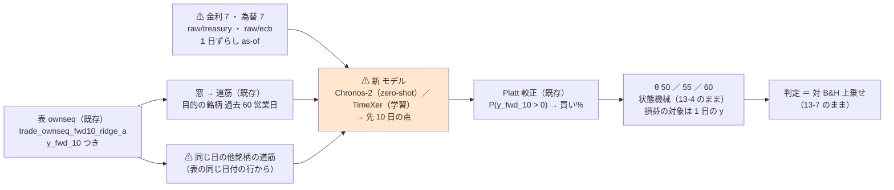
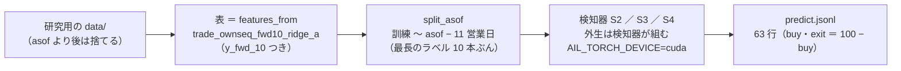

# 複数のデータから特定の銘柄のトレンドを当てる深層学習（「目的の系列 ＋ 外生系列」の型 2 本）

作成日: 2026-09-27（§0 は**回す前**に書いた。§1 以降は回した後）。派生元: [プラン new-model-trader.md §3 Phase 2-3](../../plans/new-model-trader.md)（親「titan を使って、新規の予測モデルと、複数の予測モデルを持ったトレーダーを作成する方法を確立する」の 3 つ目の実例 ＝ GPU を使う型）。
利用者の指示（2026-09-26）: **「DeepLearnigで複数のデータが入った中から特定の銘柄のトレンドの予測に使えそうなモデルを調べて」** → 調査の結果を受けて「まずは TODO 化のみ」→ 2026-09-27「『複数のデータから特定の銘柄のトレンドを当てる深層学習を机上で試す』の２つのモデルもこのタスクに含める」。
規約: [rules.md](feature-discovery/rules.md) 13・14・15 章 ／ 決めごと K5（[プラン §2](../../plans/new-model-trader.md)。利用者決定 2026-09-27「推す案のとおり」）。手順書: [howto-model-trader.md §1](../howto-model-trader.md)。
関連: [patchtst-threshold.md](patchtst-threshold.md)（同じ検知器の口。窓から学ぶ単変量の系列モデル。落とす）／ [tsc-threshold.md](tsc-threshold.md)（同じ窓の時系列分類器 3 本）／ [forward10-target.md](forward10-target.md)（同じ学習の対象 `y_fwd_10`・同じ表）／ [ts-trend-ai-survey.md §7](ts-trend-ai-survey.md)（前回の調査。単変量が中心）／ [feature-discovery.md §8](feature-discovery.md)（断面・リードラグの不振）。

> ⚠ **これは投資助言ではなく調査資料である。** 特定の銘柄・売買を推奨しない。
> ⚠ **資金は動かしていない**（2026-08-27 の方針）。取得済みの日足（研究用の `data/`）と外部系列（金利・為替）だけを使った。
> ⚠ **数字はすべて【実測】**（自前の検証で出したもの）。出典のある値は【公表値】と書く。良い数字は根拠「中」が上限（rules.md 11 章 規約 3）。

## 0. 事前固定（⚠ 回す前に書いた。2026-09-27）

### 0-1. 問いと、いまあるもの

| 問い | 回す前の答え |
| --- | --- |
| 「複数のデータから特定の銘柄のトレンドを当てる」深層学習は、どんな系統があるか | 調査（2026-09-26。【公表値】の取得日はすべて 2026-09-26）では 4 系統 ＝ **A 目的 ＋ 外生**（TimeXer・TFT・iTransformer・TiDE ／ TSMixer）／ **B 断面・グラフ**（MASTER・HIST・TRA・GATs・MTGNN）／ **C 基盤モデルの zero-shot ＋ 共変量**（Chronos-2・Moirai-2・TimesFM-2.5 の XReg）／ **D 線形の対照**（DLinear ＝ この案件では ownex の Ridge がその役） |
| 外部の一次評価は何と言っているか | ⚠ **否定的で揃っている。** [QuantBench（arXiv:2504.18600）](https://arxiv.org/abs/2504.18600) ＝ 木 ＋ Alpha101 の IC 2.31% ／ Sharpe 0.81 に対し LSTM IC 4.76% ／ Sharpe 0.77・GCN は IC −0.10% ／ 収益 −13.07%・「グラフ構造で一貫した改善は無い」／ [Deep TS Models for Equity Portfolios（arXiv:2606.09420）](https://arxiv.org/abs/2606.09420) ＝ CRSP 2018〜24・15 構造で費用 20bp 後の Sharpe は全モデル負・TS-Ridge が上位と拮抗 ／ [Chronos-2 の多変量金融予測（arXiv:2605.21504）](https://arxiv.org/abs/2605.21504) ＝ Mag-7 の価格水準で共変量あり MAPE 0.0706 ／ 0.0728 対 なし 0.0844 ／ 0.0834（先 21 ／ 63 日）。⚠ 測ったのは水準の誤差で、方向でもランダムウォーク対照でもない。著者が学習データに米株が混ざる先読みの可能性を注記。株と金利を混ぜると悪化 |
| この検証で何を埋めるか | ⚠ **多変量の入力は空白。** これまでの系列モデル（時系列分類器 3 本・PatchTST）は全部 **その銘柄 1 本の窓**しか見ていない。断面（`cs_`）・リードラグ（`ll_`）・外部系列（`ex_`）は表の列（＝ 手で作った要約）として Ridge ／ LightGBM に入れただけで、⚠ **ほかの系列の「道筋そのもの」を深層学習に見せた形は無い** |
| 見送るもの（理由つき） | 断面・グラフ（外部評価と [feature-discovery §8](feature-discovery.md) の両方が不振）／ TFT（TimeXer と同系で重い）／ TimesFM の XReg（線形なので Ridge と同じ）／ iTransformer（内生・外生の区別が無い。TimeXer が落ちたら次の候補） |
| できるか | ⚠ **作れる**（検知器の口 rules.md 14-1・`y_fwd_10` のラベルは既にある。PatchTST の検知器 `seqmodel.py` が雛形）。**効くかは別**で、それをここで測る |

### 0-2. 試す形（構造だけ。数値は 1 つも手で置かない ＝ rules.md 14-9）

> この図の主張: 変えるのは「モデル」と「ほかの系列を見せるか」だけ。窓・表・学習の対象・較正・θ・シミュレータ・判定は、先 10 日の形（Phase 2-1）と同じ物差しのまま。



| 決めごと | 中身 | 根拠 |
| --- | --- | --- |
| 動かす軸 | **モデル**（Chronos-2 ／ TimeXer）と、**ほかの系列を見せるか**（Chronos-2 の共変量あり ／ なし）。窓・表・学習の対象・較正・θ・シミュレータは先 10 日の形のまま | 軸を増やさない（PatchTST・forward10 と同じ） |
| 学習の対象 ／ 地平 | `y_fwd_10` ＝ log(c[t+10]) − log(c[t])。買い% ＝ P(y_fwd_10 > 0) の Platt 較正。**先 10 日** | K5（Phase 2-1 のラベルに相乗り）・rules.md 15-3 の 1 |
| 損益の対象 | ⚠ **1 日の `y` のまま**（シミュレータ 13-4 は変えない） | 15-3 の 2 |
| 目的の系列 | 過去 60 営業日の累積の道筋（`seq` 層。時系列分類器・PatchTST と同じ `tsc.window_paths`。最後の点 0） | 窓を変えると「モデルの差」として読めない |
| 共変量（Chronos-2 あり） | **他 62 銘柄**の同じ 60 日の相対価格（道筋の exp。⚠ 自分は除く）＋ **金利 7**（米財務省 1M・3M・1Y・2Y・5Y・10Y・30Y）＋ **為替 7**（ECB 参照相場 EUR 対 AUD・CAD・CHF・CNY・GBP・JPY・USD）の水準。すべて **過去だけ**（`past_covariates`。未来の共変量は無い） | プラン §3 Phase 2-3「他 62 銘柄 ＋ 金利・為替を past-only」 |
| 外生（TimeXer） | **全 63 銘柄**の道筋（⚠ 自分の枠は 0 ＝ 自分は内生の側）＋ 金利 7・為替 7 の**水準の道筋**（v[t−59+j] − v[t]。最後の点 0）。⚠ 枠の並びは銘柄名の昇順で訓練・検証で同じ | TimeXer の外生は 1 系列 1 トークン（枠の意味が固定である必要がある）。Chronos-2 は系列ごとに独立に扱うので「自分を除く」でよい |
| 外部系列の貼り方 | `ex` 層と同じ **1 日ずらしの as-of**（t − 1 日までに公表された最新の値。前の値を引き継ぐ）。取引日の暦は SPY の日足。⚠ **系列の始まりより前は最初の値で埋める**（米財務省の系列は 2018-01-02 から ＝ 2018-01-31〜03 月末の窓の金利は頭が平ら。記録に残す） | 未来を構造的に入れない（rules.md 8 章）／ パージで抜けた日付を表から取れないので暦を別に持つ |
| 表の行が無い銘柄・日 | 道筋 0（値動き無し）で埋める（XLC は 2018-09-13 から。1 日あたり 56〜63 行【実測】） | 枠の数を固定するため。⚠ 埋めた枠の数は記録に残す |
| **Chronos-2** | `amazon/chronos-2`（120M・Apache 2.0・encoder-only・分位点 21 本 0.01〜0.99）。手元の重みの版 `29ec3766d36d6f73f0696f85560a422f50e8498c`【実測 2026-09-27】。**学習しない。** 文脈 60・予測の長さ 10・**10 番目の分位点を単調に直し、線形補間で F(0) を読む → P(上) ＝ 1 − F(0)（端は 0.01 ／ 0.99 で止める）** → ロジット → Platt。⚠ **較正の推論は訓練の日付の尻だけ**（訓練の行全部は推論しない） | [HF](https://huggingface.co/amazon/chronos-2)・[arXiv:2510.15821](https://arxiv.org/abs/2510.15821)。⚠ 手で置く数値は無い（分位点の水準はモデルのもの・0 は「いまの値」） |
| **TimeXer** | 公式実装（[thuml/Time-Series-Library](https://github.com/thuml/Time-Series-Library) commit `4e938a1`・取得 2026-09-27）の `features = "MS"` を移植。**層 2 ・ 頭 8 ・ D 512 ・ F 2048 ・ ドロップアウト 0.1 ・ GELU ・ パッチ 10（窓 60 → 6 パッチ ＋ 大域 1）・ 窓ごとの正規化**。学習 **Adam ・ 1e-4 ・ MSE ・ batch 16 ・ 10 epoch ・ `type1`（epoch ごとに半減）・ 我慢 3**。パラメータ 8,449,537（外生 77 本）【実測】 | ⚠ **規則で選んだ**: 公式の外生つき予測のスクリプト `scripts/forecast_exogenous/EPF/TimeXer.sh`（[thuml/TimeXer](https://github.com/thuml/TimeXer) commit `7601190`）5 本の**多数決**（層 3・3・2・2・1 → 中央値 2 ／ D 512 は 5 本とも ／ F は 3 本が既定 2048 ／ batch は 3 本が 16）＋ `run.py` の既定（頭 8・ドロップアウト 0.1・GELU・lr 1e-4・10 epoch・我慢 3・type1）。パッチ長は ETT のスクリプト（96 ÷ 16 ＝ 6 パッチ）と同じ 6 パッチになる 10 |
| TimeXer の公式との違い | ① 予測の長さ 1 で、その 1 点 ＝ 10 営業日先の道筋の値 ＝ `y_fwd_10`（公式は連続する `pred_len` 本）② 時刻の印（`x_mark`）は入れない ③ 尺度 ＝ 内生と y を同じ 1 つの数（訓練の内生の標準偏差）で割り、外生は 1 変数ずつ訓練の標準偏差で割る（公式の StandardScaler に当たる）④ 早期打ち切りの検証は訓練分割の尻を**日付で切り 10 営業日ぶん（暦 15 日）パージ**（`date_holdout`。公式は別の検証区間）⑤ `LEAK_` 列があるときだけ、戻した後の予測に重み 0 で始まる線形の項（PatchTST と同じ） | ①: 「系列の続きを予測する」形のまま学習の対象に合わせる ／ ②: 暦は別の層 `cal` の役目 ／ ④: rules.md 15-5 |
| 較正 | 訓練の日付の末尾 10% を holdout にし、**10 営業日ぶん（暦 15 日）パージ**して Platt（`date_holdout(label_bars=10)`。`scale._fit_calibration` と同じ） | 15-5 |
| パージ | `horizon_min = 21,600` 分 ＝ 10 営業日 × 1.5 × 1,440（暦で覆う） | 14-7・15-4 |
| θ・形式・種 | θ ∈ {50, 55, 60}・(A) 共通 1 本・種 0 | 13-3・13-6 |
| 期間・銘柄 | 2018-01-31〜（own_2018 と同じ）・63 銘柄 | 実売買の 3 人・Phase 2-1 と揃える |
| 表 | ⚠ **作り直さない**: `features_from = "trade_ownseq_fwd10_ridge_a"`（own 35 ＋ seq 60 ＋ `y_fwd_10`。135,395 行・2018-01-31〜2026-08-24【実測】）。⚠ 共変量は表の列ではなく検知器が組む | 13-8。⚠ 検証結果一覧の「特徴量の層」は表のまま `own seq` になる ＝ 予測モデル名の頭は `own-seq` だが、モデルが見る系列はそれより広い（`s2-…-cov` ／ `s4-…-exo` の綴りで見分ける） |
| 基準線 | 常に上（B&H）・直前リターンの符号（既存の 2 本）＋ 乱択ゲート（14-6 b。自動）。⚠ **Chronos-2 の「共変量なし」（S3）が「共変量あり」（S2）の対照**（共変量の効きと、学習コーパスの米株の先読みを切り分ける） | 13-5・15-6・K5 |
| 数 | **Chronos-2 2 行（あり ／ なし）× θ 3 ＝ 6 ＋ TimeXer 1 × θ 3 ＝ 3 ＝ 9 検証**（＋ leak 対照 2 実行 ＝ queue が足す）。⚠ **回したものは全部 `n_trials` に数える**（736 → 745 の見込み） | K5・14-10 規約 3 |
| 門 | 測って記録するが、**門前でも回す**（既定 ＝ 診断） | 14-10 規約 2 |
| デバイス | **`AIL_TORCH_DEVICE=cuda`**（titan。本番・leak とも） | 1 実行の中で混ぜない（PatchTST §6 と同じ） |
| 採否の物差し | 13-7 のまま: 対 B&H 上乗せ > 0 かつ fold の符号 5/5 で採る ／ 正だが割れる → 保留 ／ 0 以下 → 落とす。⚠ **S2 は S3 と leak 対照を並べて読む**（S2 が S3 に勝たなければ「共変量が効いた」とは言わない） | 13-7・K5 |

⚠ **leak 対照の配線**（rules.md 13-10）: TimeXer は `LEAK_fwd_10` を重み 0 で始まる線形の項で受ける（PatchTST と同じ）。Chronos-2 は学習しないので、⚠ **`LEAK_` 列の重みを訓練の行で最小二乗**し、標準化した尺度でロジットに足す。どちらも本番の表には `LEAK_` 列が無いので、本番は公式の構造 ／ 分位点の読みそのまま。

### 0-3. 先に書く見立て（⚠ 結果を見る前）

| # | 見立て | 理由 |
| ---: | --- | --- |
| 1 | **9 検証とも「採る」にならない**【推測】 | 外部の一次評価 3 本が揃って否定的（§0-1）。同じ窓の単変量 4 本（時系列分類器 3・PatchTST）と同じ表の先 10 日 6 本がどれも採る 0。独立な標本が約 1/10 に減る先 10 日の物差しで、検出限界（14-2。符号 5/5 は ＋1,700bp/fold 級）を超える見込みは薄い |
| 2 | **leak 対照は 2 実行とも跳ねる**（上乗せ 5/5・t ≫ 2） | `LEAK_fwd_10`（答えそのもの）が線形の項 ／ 最小二乗で入る。跳ねなければ配線の穴 ＝ 結果を読まない |
| 3 | **Chronos-2 の共変量あり（S2）と なし（S3）の差は小さい**（上乗せの差が fold の σ の内）【推測】 | 文脈 60 点で 76 本の共変量から「同時点の関係」を in-context で拾うには短い。[arXiv:2605.21504](https://arxiv.org/abs/2605.21504) の改善（MAPE 0.084 → 0.071）は水準の誤差で、方向には効きにくい。株と金利を混ぜると悪化とも注記されている |
| 4 | **Chronos-2 の P(上) は 0.5 より上に寄り、買い% の幅は狭い**（門の幅 < 20 点 ＝ 門前）【推測】 | 60 点の文脈のドリフトを 10 日ぶん延ばすので、P(上) は「直近 60 日の傾き」の関数に近くなる ＝ D2 中期ゲート（60 日）と似た形で、それは効かなかった（[downtrend-detection.md](downtrend-detection.md)） |
| 5 | **TimeXer の検証 MSE は「0 と予測」を下回らない fold が多い**（PatchTST §3 と同じ）【推測】 | 8.4M パラメータを 2〜11 万行・10 epoch で学ぶ。信号の薄い y_fwd_10 では窓の平均を足し戻す正規化の作りから、予測の中心が窓の傾きに寄る |
| 6 | 保有日率は 1 日の形より高く、取引回数は少ない（先 10 日の形 §1 と同じ） | 先 10 日の予測は日をまたいで似た値になる |
| 7 | ⚠ 3〜6 が当たっても「効かない」の証明ではない。「この設定（文脈 60・共変量 76・先 10 日・63 銘柄）では効かなかった」 | 限界は §4 に書く |

### 0-4. 回すもの（コマンド。⚠ 順は手間の小さい順 ＝ 14-10 規約 4）

```bash
cd experiments/feature-discovery
# 依存（titan の .venv にだけ。13500t のイメージには入れない）: chronos-forecasting 2.3.2（transformers 5.17.0・numpy ／ pandas ／ torch は変わらない【実測 2026-09-27】）
.venv/bin/pip install chronos-forecasting
# 表は作り直さない（trade_ownseq_fwd10_ridge_a とその leak の表を features_from で読む）
AIL_TORCH_DEVICE=cuda setsid nohup .venv/bin/python -m cli.queue --config exodeep > /tmp/exodeep.log 2>&1 &   # 本番 2 ＋ leak 2
.venv/bin/python -m cli.report --catalog > ../../docs/specs/experiments/feature-discovery/ledger.md
```

| 実験名（config） | 検知器 | モデル | 表 |
| --- | --- | --- | --- |
| `trade_ownseq_fwd10_chronos_a` | `S2 Chronos-2（60日窓・先10日・共変量あり）`・`S3 Chronos-2（60日窓・先10日・共変量なし）` | `Chronos-2`（zero-shot） | `features_from = trade_ownseq_fwd10_ridge_a` |
| `trade_ownseq_fwd10_timexer_a` | `S4 TimeXer（60日窓・先10日・外生あり）` | `TimeXer` | 同じ |

コード: `ail/detectors/exomodel.py`（検知器 3 本と共変量の組み方）／ `ail/models/chronos2.py`（zero-shot の推論・分位点 → 確率）／ `ail/models/timexer.py`（公式の移植・ARCH・TRAIN）／ `ail/bootstrap.py` に import 2 行 ／ 綴り `config/names.toml`（`s2-chronos2-60-fwd10-cov`・`s3-chronos2-60-fwd10-nocov`・`s4-timexer-60-fwd10-exo`・学習器 `chronos2`・`timexer`）／ テスト `tests/test_exomodel.py`（14 本 ＋ 本物の重みは `AIL_CHRONOS_REAL=1` のときだけ 1 本）。
予測モデル名（rules.md 10-2）: `own-seq.s2-chronos2-60-fwd10-cov.chronos2.shared` ／ `own-seq.s3-chronos2-60-fwd10-nocov.chronos2.shared` ／ `own-seq.s4-timexer-60-fwd10-exo.timexer.shared`（θ は `@50` などが後ろに付く）。

⚠ **最初の実行（`2026-09-27T17-09-04_trade_ownseq_fwd10_chronos_a`）は 1 時間で止めて捨てた**（fold 2 まで）: Chronos-2 に目的を「相対価格（最後 1.0）」で渡しながら、確率を「0 を上回るか」で読んでいたため、P(上) が全行 0.99（sd 0.002）になり較正が定数になった。読みを「文脈の最後の値を引いてから 0 を読む」に直し（`chronos2.py`・テスト `test_chronos_prediction_follows_the_context_not_the_level`）、`cli.db sweep` で閉じて回し直した。⚠ この実行は検証結果一覧に行を出さない（`summary.csv` 無し）ので `n_trials` に入らない。あわせて 1 バッチの系列数を 4,096 → 1,024 に戻した（4,096 では 35 行/秒 と 2 倍以上遅かった【実測】。結果には効かない）。

### 0-5. 見積り【推測。1 ステップの実測から掛け算】

| 項目 | 実測した 1 単位 | 見積り |
| --- | ---: | ---: |
| Chronos-2 共変量あり（76 本） | 78 行/秒（RTX 3090 Ti・1 バッチ 4,096 系列・VRAM 1.3GB）【実測 2026-09-27】 | 検証の行 約 13.5 万 ＋ 較正の尻 約 3 万 ＝ 16.5 万行 → 約 35 分 |
| Chronos-2 共変量なし | 1,236 行/秒【実測】 | 約 3 分 |
| TimeXer 学習 1 ステップ（batch 16・外生 77） | 7.82ms・VRAM 2.9GB【実測】 | 最大の fold（訓練 11 万行）で 1 epoch 0.9 分 → 10 epoch 9 分。5 fold × 2 回（較正用 ＋ 本番）で約 50 分 |
| leak 対照 | 同じ | 同じ |
| **合計** | | **約 3 時間**（`time_budget_s` はその 4 倍 ＝ 43,200 秒） |

⚠ PatchTST の実測（1 時間 37 分・見積りと一致）と同じく「本番と同じ大きさで 1 ステップを測ってから掛け算」した。外れたら §6 に書く。

## 1. 一言で（2026-09-27 に回した。⚠ ここから下は結果を見て書いた）

⚠ **作れた。効かなかった。** 9 検証は **採る 0 ／ 保留 0 ／ 落とす 9**。Chronos-2 は共変量あり ／ なしとも 3 θ 全部で B&H を下回り、⚠ **共変量ありがなしに勝った θ は無い**（差は fold の σ の内）。TimeXer も 3 θ 全部で B&H を下回り、検証 MSE は 5 fold のうち 3 つで「0 と予測」より悪かった。leak 対照は 2 実行とも跳ねた（配線は通っている）。

| 問い | 答え |
| --- | --- |
| 「複数のデータから特定の銘柄のトレンドを当てる」深層学習は作れたか | ✅ **作れた。** 検知器 3 本（`S2`・`S3`・`S4`）が同じ物差しに載り、他 62 ／ 63 銘柄の道筋と金利 7・為替 7 を検知器が組んで渡す道（`exomodel.py`）が動いた。Chronos-2 は本番 46 分・TimeXer は本番 46 分（§6） |
| 儲かったか | ⚠ **儲からない。** 9 検証のどれも B&H を fold 5/5 で超えない。上乗せは Chronos-2（共変量あり）θ50 −109 ／ θ55 −147 ／ θ60 −1,173bp、（なし）−140 ／ −121 ／ −839bp、TimeXer −506 ／ −358 ／ −945bp/fold。B&H は ＋1,666bp/fold |
| ほかの系列を見せたら効いたか（K5 の問い） | ⚠ **効かなかった。** Chronos-2 の あり − なし の上乗せの差は θ50 ＋30 ／ θ55 −26 ／ θ60 −334bp で、fold の σ（数百 bp）の内。θ50・55 では**なしのほうがわずかに良い**。TimeXer（外生 77 本）は同じ窓の単変量 PatchTST（θ50 −51bp）より悪い −506bp |
| 先に書いた見立て（§0-3）は | 1「採る 0」✅ ／ 2「leak は跳ねる」✅（Chronos-2 6/6・＋5,329〜＋6,042bp・t 8.6〜11.3 ／ TimeXer 3/3・＋5,793〜＋6,030bp・t 3.4〜3.6）／ 3「あり ／ なしの差は小さい」✅ ／ 4「P(上) は上に寄り幅は狭い」△（幅は狭く門前だが、⚠ **P(上) の平均は 0.48〜0.54 でまん中**。ドリフトを延ばす形にはならなかった）／ 5「TimeXer の MSE は 0 を下回らない」✅（3/5 で比 > 1、2/5 で ≈ 1）／ 6「保有日率は高く取引は少ない」△（θ50 で 0.81〜0.85 だが取引 348 回・保有の中央値 3〜7 日 ＝ 短い売買が残る） |
| 門（14-5）は | ⚠ **3 本とも門前**（AUC 0.486〜0.512・幅 5.9〜13.9 点）。回すと事前に決めて回し、9 検証として数えた |
| n_trials | **736 → 745**（検証結果一覧が数えた【実測】。落とす 567 → 576） |

⚠ **これは「効かないことの証明」ではなく「この設定（文脈 60・共変量 76 ／ 外生 77・先 10 日・63 銘柄）では効かなかった」である。** 限界は §4。

## 2. 結果【実測】

列の読み方: 純利は fold 1 本あたりの bp（5 fold の平均・63 銘柄等加重）。上乗せ ＝ 手法 − B&H の fold 平均と fold ごとの符号（0 ＝ B&H と同じ ＝ その fold は 1 日も休まなかった）。t は fold 5 本の t。**対 乱択 ＝ 手法 − 乱択ゲート**（同じ保有日数で日付だけ壊した基準線。正なら乱択より良い。14-6 b・採否に使わない）。判定は 13-7。B&H は 5 fold で ＋2,524 ／ ＋631 ／ ＋741 ／ ＋2,240 ／ ＋2,197bp（平均 ＋1,666.4）。

### 2-1. Chronos-2（実行 `2026-09-27T18-14-01_trade_ownseq_fwd10_chronos_a` ／ leak `19-00-27_…_leak`）

| 検知器 | θ | 純利 bp/fold | ⚠ **上乗せ bp/fold** | t | fold の符号 | 取引/fold | 保有日率 | 対 乱択 | 判定 |
| --- | ---: | ---: | ---: | ---: | :---: | ---: | ---: | ---: | --- |
| S2 共変量あり | 50 | ＋1,557.1 | **−109.3** | −1.10 | − 0 − 0 − | 348 | 0.851 | ＋17 | **落とす** |
| S2 共変量あり | 55 | ＋1,519.3 | **−147.1** | −0.61 | − 0 − − ＋ | 102 | 0.827 | −71 | **落とす** |
| S2 共変量あり | 60 | ＋493.2 | ⚠ **−1,173.2** | −2.65 | − − − − − | 23 | ⚠ 0.223 | −43 | **落とす** |
| S3 共変量なし | 50 | ＋1,526.7 | **−139.8** | −1.38 | − ＋ − − ＋ | 349 | 0.811 | ＋102 | **落とす** |
| S3 共変量なし | 55 | ＋1,545.2 | **−121.2** | −0.72 | − ＋ − − ＋ | 73 | 0.795 | ＋62 | **落とす** |
| S3 共変量なし | 60 | ＋827.3 | ⚠ **−839.1** | −2.37 | ＋ − − − − | 43 | 0.538 | −133 | **落とす** |

- **fold 3（B&H ＋741bp）だけほぼ持たない**（S2 θ50 の保有 0.26・θ60 0.13 ／ S3 θ50 0.13）。ほかの fold は θ50・55 でほぼ全部持つ（保有 0.95〜1.00・上乗せ 0 か −数十 bp）＝ ⚠ **休むと損をし、休まなければ B&H と同じ** の形。θ60 は fold 2・4・5 で 1 日も建てず、B&H の上げをまるごと取り逃がす（−2,240 ／ −2,197bp）
- **共変量の効き**: 同じ θ の あり − なし ＝ θ50 ＋30.5 ／ θ55 −25.9 ／ θ60 −334.1bp。fold ごとの上乗せの σ は 200〜900bp ＝ 差はその内。⚠ **「見せた効き」は出ていない**
- 保有日数の中央値: θ50 で S2 3 日（2 日以下 43%）／ S3 5 日（38%）。θ55・60 は 78〜350 日（ほぼ持ち切り）
- P(上)（本番の検証行）: S2 平均 0.479 ／ 0.483 ／ 0.514 ／ 0.490 ／ 0.493（sd 0.12）／ S3 0.538 ／ 0.520 ／ 0.512 ／ 0.524 ／ 0.518（sd 0.17）。⚠ 見立て 4 と違い上に寄らない。共変量を見せると散らばりが**小さく**なる（0.12 対 0.17）＝ 幅がまん中に縮む
- 較正の傾き a（fold 1〜5）: S2 ＋0.300 ／ ＋0.044 ／ −0.413 ／ −0.042 ／ ＋0.065 ／ S3 ＋0.188 ／ −0.111 ／ −0.188 ／ −0.132 ／ −0.065 ＝ ⚠ **符号が fold で入れ替わる**（P(上) と y_fwd_10 の向きが安定しない ＝ 時系列分類器・PatchTST と同じ形）
- 門（訓練内 holdout・fold 中央値）: S2 AUC 0.4881・幅 13.9 点 ／ S3 AUC 0.4855・幅 5.9 点 ＝ 門前
- **leak 対照**（`LEAK_fwd_10` を訓練の行で最小二乗 ＝ 重み 1.0。1 日の `LEAK_future_ret` は 0.0）: S2 ＋5,928.9 ／ ＋6,001.6 ／ ＋6,041.6bp（t 9.9 ／ 10.5 ／ 11.3）／ S3 ＋5,328.6 ／ ＋5,572.4 ／ ＋5,635.2bp（t 8.6 ／ 9.6 ／ 10.2）。6 行とも fold 5/5 ＝ ⚠ **較正 → 閾値 → 状態機械の配線は通っている**

### 2-2. TimeXer（実行 `2026-09-27T19-46-57_trade_ownseq_fwd10_timexer_a`）

| θ | 純利 bp/fold | ⚠ **上乗せ bp/fold** | t | fold の符号 | 取引/fold | 保有日率 | 対 乱択 | 判定 |
| ---: | ---: | ---: | ---: | :---: | ---: | ---: | ---: | --- |
| 50 | ＋1,160.0 | **−506.4** | −1.42 | − ＋ − − ＋ | 569 | 0.724 | −222 | **落とす** |
| 55 | ＋1,308.1 | **−358.3** | −0.93 | − ＋ − − ＋ | 238 | 0.696 | −124 | **落とす** |
| 60 | ＋721.1 | ⚠ **−945.3** | −2.46 | − ＋ − − − | 138 | 0.524 | −273 | **落とす** |

- fold ごとの上乗せ（θ50）: −1,803 ／ ＋94 ／ −710 ／ −228 ／ ＋115bp。**fold 1 で取引 1,405 回・保有 0.78 で −1,803bp**（出力スコアが線をまたぎ続けた）・**fold 3 は保有 0.00**（1 日も建てず −710 ＝ B&H ぶん）。θ60 は fold 3・5 で 0 回
- 学習の記録（fold 1〜5・本番）: 早期打ち切りは 5 ／ 5 ／ 7 ／ 5 ／ 6 epoch 目で止まり最良は 2 ／ 2 ／ 4 ／ 2 ／ 3 epoch 目。⚠ **検証 MSE（最良）÷「0 と予測」の MSE ＝ 1.105 ／ 0.992 ／ 1.054 ／ 1.119 ／ 1.002** ＝ 3 fold で「0 と予測」より悪く、2 fold で同じ（PatchTST §3 の「10 回すべてで比 > 1」より少しだけまし）。較正用の学習も同じ形（比 1.12 ／ 1.36 ／ 1.00 ／ 1.25 ／ 0.99）
- 較正の傾き a: −30.40 ／ ＋5.68 ／ ＋1.67 ／ −12.29 ／ ＋1.05 ＝ 符号が入れ替わる。門: AUC 0.5117・幅 7.6 点（fold 別 0.587 ／ 0.466 ／ 0.512 ／ 0.514 ／ 0.480）＝ 門前
- 保有日数の中央値: θ50 7 日（2 日以下 27%・強制清算 6%）／ θ55 17 日 ／ θ60 22 日
- 尺度: 内生の標準偏差 0.082〜0.102（fold ごと）・外生 77 本・パラメータ 8,449,537・学習の行 19,059〜100,115・検証の行 2,205〜11,277（日付で切った尻）

### 2-3. TimeXer の leak 対照（`2026-09-27T20-32-59_trade_ownseq_fwd10_timexer_a_leak`）

θ50 ／ 55 ／ 60 の上乗せ **＋6,029.9 ／ ＋5,928.5 ／ ＋5,793.4bp**（fold 5/5・t 3.59 ／ 3.48 ／ 3.38・取引 1,644 ／ 1,384 ／ 1,197 回/fold）＝ ⚠ **跳ねた。配線は通っている。** 線形の項の重みは fold 1 で `LEAK_future_ret` 0.09 ／ `LEAK_fwd_10` 0.16、fold 5 で 0.27 ／ 0.78（重み 0 から学んだ）。⚠ leak の学習は早期打ち切りが働かず 10 epoch まで回った（fold 5 の検証 MSE 0.017 対「0 と予測」0.352）ので、本番の 46 分に対し **79 分 22 秒**かかった。t が Chronos-2 の leak（8.6〜11.3）より小さいのは fold ごとの上乗せの散らばりが大きいため（fold 1 ＋3,000 台〜fold 4 ＋9,000 台）で、符号は 5/5。

### 2-4. 検証結果一覧

`cli.report --catalog` で吐き直した【実測 2026-09-27 21:55】: 手法の行 736 → **745**（落とす 567 → 576・採る 0 ／ 保留 118 のまま）。新しい 9 行は全部 **落とす**。基準線の行（常に上 ／ 直前リターンの符号・`own seq`・2018-01-31）は「⚠ 14 実行・幅 14.40bp」の印になった（表の終わりが同じ実行が 2 つ増えただけ。計算の変更ではない ＝ forward10-target.md §4 と同じ理由）。 予測モデル名: `own-seq.s2-chronos2-60-fwd10-cov.chronos2.shared@θ` ／ `own-seq.s3-chronos2-60-fwd10-nocov.chronos2.shared@θ` ／ `own-seq.s4-timexer-60-fwd10-exo.timexer.shared@θ`。⚠ 名前の頭 `own-seq` は「読んだ表」で、モデルが見る系列（他銘柄・金利・為替）は綴りの `cov` ／ `exo` が示す（§0-2 の表）。

## 3. 読み

| # | 読み | 根拠 |
| ---: | --- | --- |
| 1 | **ほかの系列を見せても、60 日の文脈からは「上がるか」の情報は増えなかった。** | Chronos-2 の あり − なし の差が σ の内・θ50・55 では なし が良い。共変量を見せると P(上) の散らばりが 0.17 → 0.12 に縮む ＝ 型が「よく分からない」側に寄る。TimeXer は外生 77 本を持っても検証 MSE が「0 と予測」を下回らない |
| 2 | 基盤モデルの zero-shot も、株の日足の 60 日からは「直近の傾きの続き」以上を読めない。 | P(上) の平均は 0.48〜0.54 でまん中、幅 5.9〜13.9 点。上がる割合（0.56〜0.59）より低い ＝ ドリフトすら反映しない |
| 3 | ⚠ **外部の一次評価（§0-1）と揃った。** QuantBench・Deep TS for Equity・Chronos-2 の多変量金融の 3 本が言う「深層学習の多変量入力は線形 ／ 木を一貫して超えない」が、この案件の物差し（対 B&H・先 10 日・63 銘柄）でも同じだった | §2 |
| 4 | 学習コーパスの米株の先読み（arXiv:2605.21504 の注記）は、この結果には現れない。 | 先読みがあれば S3（共変量なし）が B&H を超える方向に出るはずで、実際は −121〜−839bp |
| 5 | 負けの主因は「休むと損をする」の形。 | θ50・55 で 4 fold は保有 0.95〜1.00 で上乗せ 0 か −数十 bp、fold 3 だけ休んで −480〜−1,022bp。乱択ゲートに対しても ±100bp で勝ち負けが割れる ＝ 休む日を当てていない |

## 4. 限界（⚠ 広げていない）

| | 状態 |
| --- | --- |
| **文脈の長さ** | 60 点だけ（`seq` 層の窓。時系列分類器・PatchTST と揃えた）。Chronos-2 は 8,192 点まで読める。⚠ **長い文脈は別の検証**（＋3 ずつ） |
| **共変量の選び方** | 他銘柄は全部・外部系列は金利と為替だけ。⚠ 気象・地震・災害・EPU は入れていない（偽薬の枠は `ex` 層の検証にある） |
| **Chronos-2 の cross-learning ／ fine-tune** | 回していない（zero-shot・`cross_learning=False`）。fine-tune は「学ぶ」型になり、別の検証 |
| **TimeXer の大きさ・学習** | 公式の多数決（D 512・F 2048・batch 16・10 epoch・我慢 3）のまま。⚠ **結果を見て大きさ・学習率を替えない**（PatchTST §7 と同じ） |
| **外部系列の頭** | treasury は 2018-01-02 から ＝ 2018-01-31〜03 月末の窓の金利は最初の値で平ら（bfill）。fold 1 の頭だけ |
| **表の行が無い枠** | XLC は 2018-09-13 から ＝ それ以前の枠は道筋 0。1 日 56〜63 行 |
| **検証結果一覧の「特徴量の層」** | `own seq`（読んだ表）。モデルが見る系列は綴り `cov` ／ `exo` で見分ける（§0-2） |
| **先読み** | 共変量は t までの行・t − 1 日までの外部系列だけ。Chronos-2 の学習コーパスに米株が混ざる可能性は消せない（読み 4） |

## 5. 手順書（howto-model-trader.md）に足す注意

| # | 注意 | どこで踏んだか |
| ---: | --- | --- |
| 1 | ⚠ **学習しないモデルでも、出力の「読み方」の単体テストを書く**（作り物の pipeline で、上がり調子の行 > 下がり調子の行 を確かめる）。契約のテスト（0〜100・行数）だけでは「全行 0.99」を通してしまう | 最初の実行を 1 時間で捨てた（§0-4 の注） |
| 2 | ⚠ **重いモデルの leak 対照テストは、網を小さくする口（`timexer_d_model`）を作って絶対の水準で測る**。8.4M パラメータのまま小さい合成データで回すと雑音が大きく、「本番との差」でも安定しない | `tests/test_exomodel.py` の 3 回の書き直し |
| 3 | 検知器が表の外（同じ日付の他の行・外部系列）から入力を組むときは、⚠ **テストの検証の行を日付の境で切る**（日の途中で切ると同じ日の他銘柄の道筋が欠けて「fit が訓練だけ」のテストが落ちる） | `_half_by_date` |
| 4 | Chronos-2 の `batch_size` は「系列の数」（目的 ＋ 共変量）。⚠ 大きくすると速くならない（4,096 で 35 行/秒・1,024 で 78 行/秒） | §6 |
| 5 | 基準線「直前リターンの符号」は `own_ret_1` を読む ＝ 合成パネルに `own_ret_1` を足す | `test_tsc._panel` と同じ |

## 6. 費用

| 項目 | 見積り（§0-5） | ⚠ 実測 |
| --- | ---: | ---: |
| Chronos-2 本番（S2 ＋ S3・5 fold） | 約 38 分 | **46 分 25 秒**（18:14:01 → 19:00:26。推論だけで 32 分 ＝ S2 292 秒/fold ＋ 較正用 29〜146 秒・S3 4 秒/fold） |
| Chronos-2 leak | 同じ | **46 分 29 秒** |
| TimeXer 本番（5 fold × 2 回） | 約 50 分 | **45 分 59 秒**（早期打ち切りが 5〜7 epoch で働いた） |
| TimeXer leak | 同じ | **79 分 22 秒**（早期打ち切りが働かず 10 epoch まで回った） |
| 捨てた最初の実行 | — | 1 時間 4 分（fold 2 まで） |
| **合計**（queue） | 約 3 時間 | **3 時間 38 分**（18:14 → 21:52）＋ 捨てた 1 時間 4 分 |
| VRAM | Chronos 5GB ／ TimeXer 3GB | Chronos 2.1GB（1,024 系列）／ 13.4GB（4,096 系列）／ TimeXer 24GB（キャッシュ込み。24,564MiB の機械で OOM なし） |
| 依存 | — | `chronos-forecasting 2.3.2`（transformers 5.17.0・einops・accelerate ほか 21 本。numpy ／ pandas ／ torch は変わらない）。titan の `.venv` だけ |

⚠ **見積りはほぼ当たった**（PatchTST と同じく 1 単位を測ってから掛け算した）。外れたのは「最初の実行を捨てる」の 1 時間。

## 7. 執行器が読める形（Phase 3。2026-09-28・titan）

> この図の主張: 深層学習 3 本も、ほかのモデルと同じ `cli.predict` の道で `predict.jsonl` の行になる。違うのは fit の時間と GPU が要ることだけ。



| 手法 | 行 | 買い% の帯 | 表 | fit ＋ 予測 | 訓練の終わり |
| --- | ---: | --- | ---: | ---: | --- |
| `S2 Chronos-2（60日窓・先10日・共変量あり）` | 63 | 51.7〜53.6 | 39 秒 | **192 秒** | 2026-08-20 |
| `S3 Chronos-2（60日窓・先10日・共変量なし）` | 63 | 47.9〜56.0 | 34 秒 | **7 秒** | 2026-08-20 |
| `S4 TimeXer（60日窓・先10日・外生あり）` | 63 | 52.0〜56.3 | 34 秒 | **685 秒（11 分 25 秒）** | 2026-08-20 |

【実測 2026-09-28・titan・`AIL_TORCH_DEVICE=cuda`・asof 2026-09-04・研究用の `data/`】。コマンドは `AIL_TORCH_DEVICE=cuda .venv/bin/python -m cli.predict --experiment <実験名> --method "<登録名>" --asof 2026-09-04 --out <道>`。

- ⚠ **`split_asof` は同日に直した**（[forward10-target.md §4 の 7](forward10-target.md)）: 訓練は asof の 10 営業日前の行（答えの端が asof の終値）を含まない ＝ `.meta.jsonl` の `purge_bars = 10`。3 本とも指紋 `32dfe9ca2613bc1b`（同じ表・同じ訓練 135,269 行）
- ⚠ **Chronos-2 は学習しないのに 192 秒かかる**のは、較正（Platt）のために訓練の尻の holdout へ推論するから（S2 は 1 行あたり 63 系列を渡す ＝ 27 倍遅い。§6）。S3 は 7 秒
- ⚠ **TimeXer は 1 日 1 回でも GPU で 11 分半**（`cli.predict` は較正用と本番用の 2 回学ぶ。早期打ち切りは働いた）。本番の `run-live.sh` は 15:45〜16:05 ET の窓に 3 人ぶんの予測を並列で 37〜38 秒【実測】で通しており、**13500t（GPU なし・イメージに torch を入れていない）でこの道は成立しない** ＝ 重みを titan で作って写す道（K7・プラン §7）を決めるまで本番に入れない。⚠ 判定は 9 検証とも「落とす」（§1）なので、いま決める必要は無い
- 道の確認だけで、行の中身（買い% の帯）から何も読まない（1 日ぶん・採否の物差しではない）

