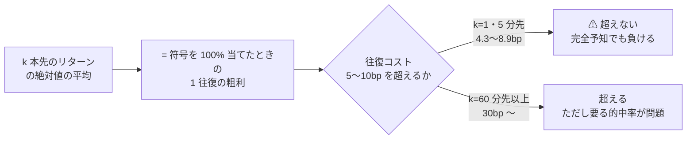
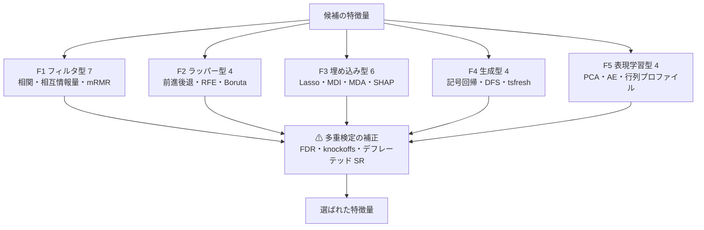
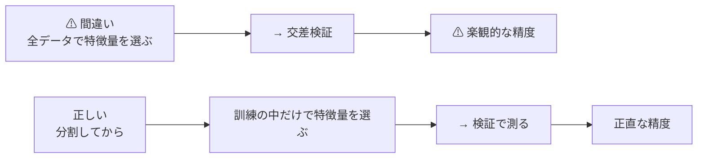
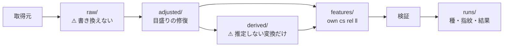
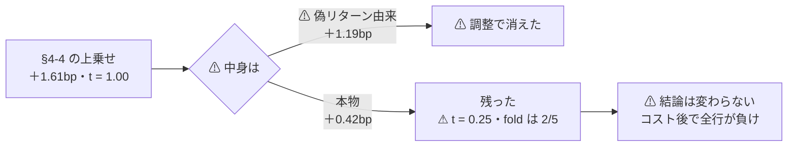
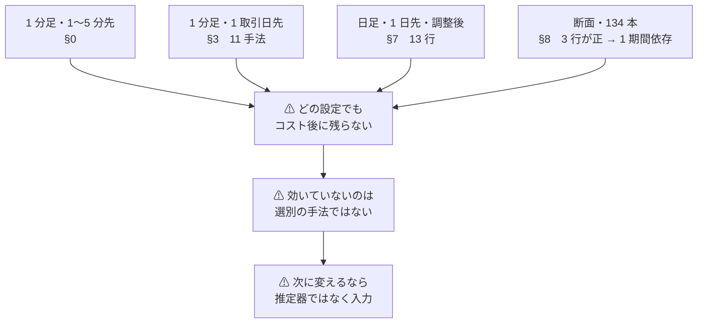

# 特徴量を見つけ出す手法の検証

調査日: 2026-09-08〜（**進行中**）。派生元: [E8 の記録](e8-signal-methods.md)。
プラン: [docs/plans/archive/feature-discovery.md](../../plans/archive/feature-discovery.md) ／ コード: `experiments/feature-discovery/`

⚠ **データと分析の規約は [rules.md](feature-discovery/rules.md) が正本**（2026-09-08 に作成）。
⚠ **§3・§4 の数字は rules.md 以前のものである**（[§6](#6-分析の構造化2026-09-08) を先に読むこと）。
⚠ **日足のやり直しは [§7](#7-日足のやり直しphase-5-調整後実測-2026-09-08)。** ⚠ **§4 ではなく §7 が日足の現在の結論である。**
⚠ **断面は [§8](#8-断面での検証phase-6実測-2026-09-08)。** ⚠ **初めて純利が正の行が出たが、3 つの検査を通らず「保留」である。**
⚠ **その正の数字は fold 1（コロナ期）に全面的に依存していた**（[§8-6](#8-6--fold-1-を外すと正の行は-1-つも残らない)）。**外すと 3 手法とも負に反転する。**

⚠ **「何を試して、どうだったか」の一覧は [ledger.md](feature-discovery/ledger.md)**（2026-09-08 に作成）。
⚠ **本書 §2 は「手法の一覧（やる前）」、台帳は「試した結果の一覧（やった後）」で別物である。**
⚠ **台帳は本書 §2 と `ail/registry.py` と `runs/` を突き合わせた生成物**なので、⚠ **§2 の表を直せば台帳も変わる。**

> ⚠ **これは投資助言ではなく調査資料である。** 特定の銘柄・売買を推奨しない。
> ⚠ **資金は動かしていない**（2026-08-27 の方針）。使ったのは既にある tastytrade の口座の**読み取りだけ**。
> ⚠ **自前の数字の扱いは E8 から引き継ぐ**（[プラン §0-1](../../plans/archive/feature-discovery.md)）。**悪い結果はそのまま結論にしてよいが、良い結果は根拠「中」が上限**で、
> デフレーテッド SR とパージ CV を通していない良い数字は報告しない。

## 0. ここまでで分かったこと

⚠ **モデルを 1 つも作る前に、算術で上限が出た。**

> この図の主張: 予測の精度を上げる前に、⚠ **そもそも「完全に当てても取れる幅」がコストを超えているか**を見る。1 分先と 5 分先では超えていない。

**63 銘柄 × 1 分足 8,000 本（計 504,000 行）で測った【実測 2026-09-08】**

| k 本先 | 完全予知の粗利 | c = 5bp で要る的中率 | c = 10bp で要る的中率 | 1 日あたりの往復 |
| ---: | ---: | ---: | ---: | ---: |
| **1** | **4.32 bp** | ⚠ **不可能** | ⚠ **不可能** | 390 |
| **5** | **8.88 bp** | **78.2%** | ⚠ **不可能** | 78 |
| 15 | 14.97 bp | 66.7% | 83.4% | 26 |
| 30 | 21.07 bp | 61.9% | 73.7% | 13 |
| 60 | 30.16 bp | 58.3% | 66.6% | 6.5 |
| 120 | 43.53 bp | 55.7% | 61.5% | 3.2 |
| 390（≒ 1 日） | 85.08 bp | **52.9%** | **55.9%** | 1.0 |

**読み方**: 的中率 p のとき 1 往復の粗利は (2p − 1) × 完全予知の粗利。これが往復コスト c を超えないと負ける。
「完全予知の粗利」は E|k 本先の対数リターン| の**63 銘柄の中央値**。コストの 5〜10bp は [E8 §1-4](e8-signal-methods/frame.md) から。

⚠ **結論の 1 行**: **1 分足で 1〜5 分先を当てにいく設計は、特徴量を何にしても成立しない。**
⚠ **符号を 100% 当てても、5 分先では往復 10bp のコストに届かない**（8.88bp）。⚠ **これは予測精度の問題ではなく、値動きの幅の問題である。**

⚠ **この数字は「悪い数字」なので、そのまま結論として使う**（[プラン §0-1](../../plans/archive/feature-discovery.md) の取り決め）。
⚠ **逆に言えば、特徴量の発見手法を試す土俵は「1 日先」以降にしかない。**

## 1. データ取得（Phase 1）

### 1-1. 経路と、実測で分かった上限

コード: `experiments/feature-discovery/ail/data/sources/tastytrade.py`（読み取り専用。発注系には触れない）。
⚠ **2026-09-08 までは `fetch.py` という 1 本のスクリプトだった**（[§6-5](#6-5-作った土台)で層に分けた）。
経路は [E8 §2-1](e8-signal-methods/data-routes.md) で確定した tastytrade の DXLink `Candle`。

| # | 実測（2026-09-08） | 効くところ |
| ---: | --- | --- |
| 1 | ⚠ **1 購読あたり 8,000 本が硬い上限**。idle 30 秒・上限 240 秒まで待っても 8,001 本で止まる | 標本の量がここで決まる |
| 2 | ⚠ **`toTime` は無視される**。90 日前〜60 日前を要求しても直近 8,000 本が返る | ⚠ **過去へ窓を刻んで遡れない** |
| 3 | `fromTime` は効く（要求した窓より深くは返らない） | 要求を短くすれば浅くはできる |
| 4 | 期間の値 1 は書かない（`{=m}` は取れるが `{=1m}` は 0 件） | 既知の落とし穴（E8 §2-1） |
| 5 | ⚠ **最後の 1 本は更新され続ける**ので同じ時刻の行が何度も届く | 時刻で畳んで最後を採る |
| 6 | ⚠ **NaN の番兵行が 1 本混じる**（各銘柄ちょうど 1 本） | ⚠ **これを最古として数えると期間を 3 倍に誤る**（実際に踏んだ。§1-3） |

### 1-2. 取れたもの

| 粒度 | 銘柄 | 行 | 1 銘柄あたり | 期間 |
| --- | ---: | ---: | ---: | --- |
| **1 分足** | **63** | **504,000** | 8,000 本 | ⚠ **銘柄で違う**（下） |

⚠ **8,000 本が同じでも、カバーする日数は銘柄で 3 倍違う。** 出来高が多い銘柄ほど 1 日の足が多く、そのぶん浅くなる。

| | 銘柄 | 期間 | 1 日あたりの足 |
| --- | --- | --- | ---: |
| 最も浅い | NVDA・TSLA・INTC | 08-31 〜 09-08（**9 日**） | 約 890 |
| 中央 | — | 約 **25 日** | — |
| 最も深い | TMO・XLRE・XLC | 08-10 〜 09-08（**30 日**） | 約 270 |
| ⚠ **全 63 銘柄が揃う共通の窓** | — | **08-31 〜 09-08 = 8.7 日** | — |

⚠ **断面（銘柄をまたぐ）の分析に使えるのは 8.7 日しかない。** これは E8 の **X9（標本不足）**そのもので、
⚠ **どんな結果が出ても「1 か月弱の標本」という限界が付く。**

### 1-3. ⚠ 踏んだ落とし穴 — 期間を 3 倍に誤った

最初に書いた集計は「全 63 銘柄が 08-09 から揃っている（30 日）」と出た。⚠ **実際は共通の窓が 8.7 日しかなかった。**

原因は、⚠ **最古の時刻を「CSV に書いた行」ではなく「feed から受けた生の辞書」から取っていた**こと。
生の辞書には各銘柄ちょうど 1 本の **NaN の番兵行**が混じっていて、それが最古になっていた。

⚠ **取得側は修正済み**（最古・最新は書いた行から取る）。⚠ **「行数が同じでも期間が同じとは限らない」ことを、集計のたびに確かめる。**

### 1-4. 特徴量とラベルの作り方

コード: `ail/features/own.py`（⚠ **2026-09-08 までは `features.py`**）。規則は 3 つだけ。

| # | 規則 |
| ---: | --- |
| 1 | ⚠ **足 i の特徴量は足 i までの情報しか使わない**（窓は必ず i で閉じる） |
| 2 | ⚠ **足 i のラベルは足 i の終値から k 本先の終値までの対数リターン** |
| 3 | ⚠ **ラベルが取れない末尾 k 本は捨てる** |

**特徴量 35 本**: リターンのラグ 7 ／ ボラティリティ 6（実現・Parkinson）／ 位置 6（移動平均乖離・レンジ内の位置）／
出来高 4 ／ 分布の形 5（歪度・尖度・自己相関）／ バーの形 3 ／ 時刻 3 ／ 足の間隔 1。

⚠ **`--leak` を付けると、わざと未来を混ぜた列を 1 本足す。** これは対照実験用で、
⚠ **この列を入れて精度が跳ね上がらなければ、検証の配線そのものが壊れている**ことを意味する（[プラン §6](../../plans/archive/feature-discovery.md) の検査 1）。

⚠ **1 分足は 81〜91% しか 1 分刻みで連続していない**（約定が無い分は足が飛ぶ）。足の間隔を特徴量に入れ、
ラベルが跨いだ実時間（`y_elapsed_min`）を残して**夜跨ぎの行を落とせる**ようにした。

## 2. 特徴量を見つけ出す手法のカタログ（Phase 2・5 系統 25 件）

> この図の主張: 見つけ方は 5 系統。⚠ **上 2 つはモデルの外で選び、真ん中はモデルが選び、下 2 つはそもそも特徴量を作り出す。**⚠ **どれを使っても、多重検定の補正だけは外せない。**

**列**: 量 = 計算量（低 / 中 / 高）／ 相関 = 特徴量どうしが相関しても壊れないか（○ / ⚠ / ✕）／ 検定 = 多重検定を自分で扱うか ／ 拠 = 根拠の強さ（E8 と同じ 強 / 中 / 弱）

### F1. フィルタ型 — モデルの外で選ぶ（7）

| ID | 手法 | 量 | 相関 | 検定 | 拠 | ⚠ 見どころ |
| --- | --- | --- | --- | --- | --- | --- |
| F1-1 | 相関（Pearson・Spearman） | 低 | ✕ | 無 | 強 | ⚠ **非線形を全く見ない**。金融では IC（情報係数）としてこの形が標準 |
| F1-2 | 相互情報量 | 中 | ⚠ | 無 | 強 | 非線形を見るが、⚠ **推定に標本が要る**（連続値のビン分割が効く） |
| F1-3 | mRMR（最小冗長・最大関連） | 中 | ○ | 無 | 強 | Peng-Long-Ding (2005)。⚠ **冗長性を明示的に引く**唯一のフィルタ |
| F1-4 | 分散しきい値 | 低 | ✕ | 無 | 弱 | ⚠ **ラベルを見ない**ので「効くか」は分からない。前処理でしかない |
| F1-5 | 単変量の仮説検定 ＋ FDR（FRESH） | 中 | ⚠ | **有** | 強 | Christ ら (2018) の tsfresh。⚠ **Benjamini-Yekutieli で偽発見率を制御する**点が他と違う |
| F1-6 | 距離相関・HSIC | 高 | ⚠ | 無 | 中 | 任意の依存を捉えるが計算量が標本の 2 乗 |
| F1-7 | 情報係数（IC）の時系列安定性 | 低 | ✕ | 無 | 中 | ⚠ **「平均 IC が正」より「IC が符号を保つ割合」のほうが実務に近い** |

### F2. ラッパー型 — モデルを回して部分集合を探す（4）

| ID | 手法 | 量 | 相関 | 検定 | 拠 | ⚠ 見どころ |
| --- | --- | --- | --- | --- | --- | --- |
| F2-1 | 前進選択・後退除去 | 高 | ○ | 無 | 中 | ⚠ **試行回数が特徴量の数だけ増える＝ 多重検定の温床** |
| F2-2 | 再帰的特徴量削減（RFE・SVM-RFE） | 高 | ⚠ | 無 | 強 | Guyon ら (2002)。⚠ **重要度の定義に依存する**ので F3 の弱点を全部引き継ぐ |
| F2-3 | Boruta | 高 | ○ | **有** | 強 | Kursa-Rudnicki (2010)。⚠ **影の特徴量（shadow）と比べる**ので「効かない」を言える数少ない手法 |
| F2-4 | 遺伝的アルゴリズムによる部分集合探索 | 高 | ○ | 無 | 弱 | ⚠ **探索空間が 2^n。過剰適合が確実に入る** |

### F3. 埋め込み型 — モデルが選ぶ（6）

| ID | 手法 | 量 | 相関 | 検定 | 拠 | ⚠ 見どころ |
| --- | --- | --- | --- | --- | --- | --- |
| F3-1 | Lasso・Elastic Net | 低 | ⚠ | 無 | 強 | ⚠ **相関した特徴量の中から 1 本だけ残す**（どれが残るかは標本次第） |
| F3-2 | 木の分岐重要度（MDI） | 低 | ✕ | 無 | 強 | ⚠ **Strobl ら (2007) が「取りうる値が多い変数に偏る」ことを示した。** 連続値の特徴量が有利になる |
| F3-3 | 並べ替え重要度（MDA） | 中 | ✕ | 無 | 強 | ⚠ **Hooker-Mentch-Zhou (2021)**: 特徴量に依存があると**モデルを外挿させるので誤診する**。「無料の重要度は無い」 |
| F3-4 | SHAP | 高 | ⚠ | 無 | 強 | Lundberg-Lee (2017)。⚠ **Kumar ら (2020) が「特徴量の重要度としては数学的に問題がある」と指摘**。⚠ **説明であって因果ではない** |
| F3-5 | クラスタ化 MDA（cMDA） | 中 | **○** | 無 | 中 | López de Prado (2020)。⚠ **相関した特徴量をまとめて並べ替える**ことで F3-3 の代替効果を消す |
| F3-6 | Model-X knockoffs | 高 | ○ | **有** | 強 | Barber-Candès (2015)・Candès ら (2018)。⚠ **有限標本で偽発見率を厳密に制御できる唯一の枠**。⚠ ただし特徴量の分布を知っている必要がある |

### F4. 生成型 — 特徴量そのものを作り出す（4）

| ID | 手法 | 量 | 相関 | 検定 | 拠 | ⚠ 見どころ |
| --- | --- | --- | --- | --- | --- | --- |
| F4-1 | 遺伝的プログラミング・記号回帰 | 高 | — | 無 | 中 | ⚠ **式そのものを探索する。** 探索が広いほど過剰適合が確実に入る |
| F4-2 | Deep Feature Synthesis（Featuretools） | 中 | — | 無 | 中 | Kanter-Veeramachaneni (2015)。⚠ **関係データ向け**で、単一の時系列では効きが限定的 |
| F4-3 | tsfresh の総当たり（794 特徴量） | 中 | — | **有** | 強 | ⚠ **生成と選別が対になっている**唯一の実装（F1-5 と対） |
| F4-4 | 多項式・交互作用の展開 | 中 | ✕ | 無 | 中 | ⚠ **次元が組み合わせで爆発**し、相関も強くなる |

### F5. 表現学習型 — 次元を落として作り直す（4）

| ID | 手法 | 量 | 相関 | 検定 | 拠 | ⚠ 見どころ |
| --- | --- | --- | --- | --- | --- | --- |
| F5-1 | PCA・主成分 | 低 | ○ | 無 | 強 | ⚠ **分散が大きい向きが予測に効くとは限らない**（ラベルを見ないため） |
| F5-2 | オートエンコーダ | 高 | ○ | 無 | 中 | ⚠ 解釈が難しく、E8 の X5（過剰適合）に直行しやすい |
| F5-3 | 行列プロファイル（モチーフ） | 中 | — | 無 | 中 | E8 の E5・G3 と同じ道具。⚠ **先読みが入りやすい** |
| F5-4 | ウェーブレット・スペクトル | 中 | ⚠ | 無 | 中 | ⚠ **基底と窓の選択で結果が動く** |

### 2-1. ⚠ 全系統に共通して外せない 1 つ

> この図の主張: ⚠ **特徴量の選別は「モデルの一部」である。** 選別を交差検証の外でやると、必ず楽観的な数字が出る。

⚠ **Ambroise-McLachlan (2002) が、全データで特徴量を選んでから交差検証すると誤差が大きく過小評価されることを示した**（遺伝子発現データ）。
⚠ **本タスクでは特徴量の選別をすべて訓練分割の内側に閉じ込める。** これは [E8 の L2（パージ交差検証）](e8-signal-methods/catalog.md)と対で使う。

⚠ **金融では系列相関があるので、普通の交差検証では足りない。** [E8 の L1〜L7](e8-signal-methods/catalog.md) をそのまま適用する:
ウォークフォワード（L1）／ パージ ＋ エンバーゴ（L2）／ デフレーテッド SR（L3）／ FDR（L7）。

## 3. 検証（Phase 3・4）— 1 日先を当てにいく

> ⚠ **この節は「ルール以前」の結果である。** ⚠ **調整前のデータで、各行が自分の履歴しか見ないプーリングで測った。**
> ⚠ **1 分足なので目盛りの誤り（[§6-2](#6-2--分割調整の確認phase-1)）は入っていない**が、断面を使っていない点は残る。
> ⚠ **消さずに残してある**（[§6](#6-分析の構造化2026-09-08)）。

[§0](#0-ここまでで分かったこと) の結果を受けて、⚠ **予測の地平は 390 本先（≒ 1 日）にした。**
1〜5 分先は完全予知でもコストに届かないので、そこで良い特徴量が見つかっても売買には使えない。

### 3-1. 検証の作り

コード: `cli/run.py` ＋ `ail/selectors/` ＋ `ail/validation/`（⚠ **2026-09-08 までは `evaluate.py` 1 本**。[§6-6](#6-6--配線が正しいことの確認) で同じ数字が出ることを確認済み）。

| # | 決めごと | 中身 |
| ---: | --- | --- |
| 1 | ⚠ **選別は訓練分割の内側だけ** | Ambroise-McLachlan (2002)。⚠ **外でやると必ず楽観的な数字が出る** |
| 2 | ⚠ **パージを入れる** | ラベルが 390 本先を跨ぐので、訓練の末尾 390 分ぶんを捨てる（[E8 L2](e8-signal-methods/catalog.md)） |
| 3 | ウォークフォワード 5 分割 | 時間で切り、過去だけで学習して未来を測る（[E8 L1](e8-signal-methods/catalog.md)） |
| 4 | モデルは Ridge に固定 | ⚠ **比べているのは「選別の手法」であってモデルではない**ため |
| 5 | ⚠ **基準線を 2 本置く** | **全部使う**（選別しない）と**乱択**（無作為に 8 本）。⚠ **これを超えない選別手法は意味が無い** |
| 6 | コストを引く | 往復 5bp（[E8 §1-4](e8-signal-methods/frame.md)） |

**データ**: 1 分足 63 銘柄・特徴量 35 本・ラベルは 390 本先の対数リターン。欠損を落として 44,206 行を使った。

### 3-2. ⚠ まず配線を検査した（わざと未来を混ぜる）

⚠ **「良い数字が出ない」ことを結論にする前に、「良い数字が出せる配線になっているか」を確かめた。**
特徴量に**未来のリターンそのもの**を 1 本混ぜて同じ検証を回した。

| 手法 | 的中率 | IC | 粗利 |
| --- | ---: | ---: | ---: |
| ⚠ **先読みの列あり**（F1-1 相関ほか 8 手法） | **99.90%** | **1.000** | **＋95.97 bp** |
| 先読みの列を拾わなかった手法（乱択・クラスタ化 MDA） | 49.0〜49.2% | 0.02〜0.03 | ＋1.4〜1.7 bp |

⚠ **跳ね上がった。検証の配線は壊れていない。** つまり以下の「効かない」という結果は、⚠ **配線の不備ではなく本当に効かないことを意味する。**

⚠ **副産物**: クラスタ化 MDA（F3-5）は**未来そのものの列を拾えなかった**。
⚠ **クラスタ単位で選ぶ設計なので、単独で圧倒的に効く特徴量が弱いクラスタに紛れると落とす。** 相関への強さと引き換えの弱点である。

### 3-3. ⚠ 結果 — 11 手法すべてが、コストを引く前から負けている

**ウォークフォワード 5 分割の平均【実測 2026-09-08】**

| 手法 | 選んだ本数 | 的中率 | IC | 粗利 bp | 純利 bp（c=5） |
| --- | ---: | ---: | ---: | ---: | ---: |
| F1-5 単変量検定 ＋ FDR | 15.0 | 0.4995 | ＋0.010 | **−1.20** | −6.20 |
| **全部使う（基準）** | 35.0 | 0.4958 | ＋0.006 | −1.54 | −6.54 |
| F3-3 並べ替え（MDA） | 8.0 | 0.4958 | −0.002 | −1.57 | −6.57 |
| F2-3 Boruta | 7.8 | 0.4950 | −0.004 | −2.15 | −7.15 |
| F1-3 mRMR | 8.0 | 0.4934 | −0.007 | −2.48 | −7.48 |
| F3-2 木の重要度（MDI） | 8.0 | 0.4928 | −0.006 | −2.75 | −7.75 |
| F1-2 相互情報量 | 8.0 | 0.4904 | −0.006 | −3.18 | −8.18 |
| F1-1 相関 | 8.0 | 0.4934 | −0.014 | −3.37 | −8.37 |
| F3-1 Lasso | 1.6 | 0.4716 | −0.020 | −3.89 | −8.89 |
| **乱択（基準）** | 8.0 | 0.4789 | ＋0.013 | −4.67 | −9.67 |
| F3-5 クラスタ化 MDA | 8.0 | 0.4649 | ＋0.015 | −7.22 | −12.22 |

⚠ **読み方**

| # | 何が言えるか |
| ---: | --- |
| 1 | ⚠ **コストを引く前（粗利）の時点で 11 手法すべてが負け。** 的中率は 46.5〜50.0% で、⚠ **50% を超えたものが 1 つも無い** |
| 2 | ⚠ **最良は「単変量検定 ＋ FDR」だが、それでも粗利 −1.20bp。** そして⚠ **2 位が「全部使う」＝ 選別しない基準線**である |
| 3 | ⚠ **どの選別手法も「全部使う」を意味のある差で上回らなかった。** ⚠ **この標本では、特徴量を選ぶ価値そのものが確認できない** |
| 4 | IC はすべて ±0.02 の中。⚠ **符号すら安定しない**（乱択とクラスタ化 MDA は IC が正なのに粗利は最下位） |
| 5 | ⚠ **選ぶ本数を絞るほど成績が悪い傾向**（Lasso 1.6 本 → −3.89bp）。⚠ **絞る根拠が標本から出ていない** |

### 3-4. ⚠ この結果の限界（誇張しないための注記）

| # | 限界 |
| ---: | --- |
| 1 | ⚠ **標本が約 1 か月しかない**（[§1-2](#1-2-取れたもの)）。⚠ **E8 の X9（標本不足）そのもので、「効かない」と「測れていない」を分けきれない** |
| 2 | ⚠ **モデルは Ridge 1 本。** 非線形モデルは試していない（比べているのが選別手法なので固定した）。⚠ **非線形なら結果が変わる可能性は残る** |
| 3 | 特徴量は自作の 35 本。⚠ **tsfresh の 794 本のような総当たり（F4-3）は試していない** |
| 4 | ⚠ **デフレーテッド SR をまだ通していない。** 今回は全部が負けなので不要だったが、⚠ **良い数字が出たときは必須**（[プラン §0-1](../../plans/archive/feature-discovery.md)） |
| 5 | 銘柄 63 の選び方は 2026-09-08 時点の時価総額上位。⚠ **当時知り得た情報ではない＝ 生存バイアスが入っている** |

⚠ **1 は本質的な限界なので、日足（1 銘柄 8,000 本 ＝ 最大 32 年）で同じ検証をやり直す。** 取得済み。

## 4. 日足でのやり直し — 標本を 1 か月から 32 年にした

> ⚠ **この節の数字は無効である。** ⚠ **提供元の分割調整に誤りがあり、63 本の偽リターンがラベルの標準偏差を 26% 膨らませていた**
> （[§6-2](#6-2--分割調整の確認phase-1)）。⚠ **やり直しは「特徴量を見つけ出す手法…」タスクの担当**で、本節は**ルール以前の記録として残す**。

[§3-4](#3-4--この結果の限界誇張しないための注記) の限界 1（標本が約 1 か月）を埋めるため、**同じ検証を日足で回し直した。**

### 4-1. 取れた日足

| 粒度 | 銘柄 | 行 | 1 銘柄の中央値 | 最も深い | ⚠ 全銘柄が揃うのは |
| --- | ---: | ---: | ---: | --- | --- |
| **日足** | **63** | **435,611** | 7,202 本 | **1994-11**（ABT・NKE・BA。29 銘柄が 8,000 本の上限に当たった） | **2018-06 以降**（XLC の上場） |

⚠ **1 分足の 504,000 行と日足の 435,611 行は、行数はほぼ同じでも意味がまるで違う。** 前者は 1 か月、後者は最大 32 年である。

### 4-2. ⚠ 「常に上」の基準線を足した

日次リターンは**上がる日が 51.4%** ある（株のドリフト）。⚠ **これを基準線に置かないと、ドリフトを拾っただけの手法が「効いている」ように見える。**
そこで **「常に上」** と **「直前リターンの符号」** の 2 本を、モデルを使わない基準線として足した。

### 4-3. 結果【実測 2026-09-08】

**日足 61,680 行・ウォークフォワード 5 分割・1 日先・コスト 5bp**

| 手法 | 選んだ本数 | 的中率 | IC | 粗利 bp | 純利 bp |
| --- | ---: | ---: | ---: | ---: | ---: |
| F1-5 単変量検定 ＋ FDR | 23.4 | 0.5089 | 0.019 | **＋4.77** | −0.23 |
| F3-1 Lasso | 5.0 | 0.5095 | 0.025 | ＋4.64 | −0.36 |
| **全部使う（基準）** | 35.0 | 0.5049 | 0.017 | ＋4.36 | −0.64 |
| F1-3 mRMR | 8.0 | 0.5055 | 0.021 | ＋4.12 | −0.88 |
| F3-5 クラスタ化 MDA | 8.0 | 0.5070 | 0.011 | ＋4.05 | −0.95 |
| F3-2 木の重要度（MDI） | 8.0 | 0.5069 | 0.019 | ＋3.63 | −1.37 |
| F1-1 相関 | 8.0 | 0.5069 | 0.021 | ＋3.42 | −1.58 |
| ⚠ **基準 常に上（ドリフト）** | 0 | **0.5156** | — | **＋3.16** | −1.84 |
| F2-3 Boruta | 7.4 | 0.5045 | 0.013 | ＋2.85 | −2.15 |
| F3-3 並べ替え（MDA） | 8.0 | 0.5068 | 0.004 | ＋2.23 | −2.77 |
| **乱択（基準）** | 8.0 | 0.5008 | 0.015 | ＋1.42 | −3.58 |
| F1-2 相互情報量 | 8.0 | 0.5080 | 0.005 | ＋1.24 | −3.76 |
| 基準 直前リターンの符号 | 0 | 0.4865 | — | **−2.22** | −7.22 |

⚠ **読み方が 1 分足のときと変わる。粗利は正になったが、結論は変わらない。**

| # | 何が言えるか |
| ---: | --- |
| 1 | ⚠ **13 行すべてがコストを引くと負け。** 最良（F1-5）でも純利 −0.23bp |
| 2 | ⚠ **粗利の大半はドリフトである。** 「常に上」だけで ＋3.16bp あり、最良の手法との差は **＋1.61bp しかない** |
| 3 | ⚠ **そして「常に上」はほとんど回転しない＝ コストを払わない。** ⚠ **実質は「買って持つ ＋3.16bp」対「毎日回して負ける全手法」**という比較になる |
| 4 | 「直前リターンの符号」は **−2.22bp**。⚠ **日次では逆張りの向き**（[E8 B4 短期反転](e8-signal-methods/catalog.md)と符合するが、それも符号を反転しただけではコストを超えない） |
| 5 | ⚠ **1 分足のときと順位が入れ替わっている**（1 分足では F3-5 が最下位、日足では 5 位）。⚠ **順位そのものが標本で動く＝ 手法の優劣を主張できない** |

### 4-4. ⚠ 上乗せは有意ではない

最良の F1-5 が「常に上」をどれだけ上回ったかを fold ごとに見る。

| fold | 1 | 2 | 3 | 4 | 5 | 平均 | t |
| --- | ---: | ---: | ---: | ---: | ---: | ---: | ---: |
| F1-5 − 常に上（bp） | ＋5.46 | ＋4.45 | **−2.37** | **−1.93** | ＋2.44 | **＋1.61** | **1.00** |

⚠ **5 分割のうち 2 回は符号が逆。** t = 1.00 で、[Harvey-Liu-Zhu (2016)](e8-signal-methods/sources.md) の
多重検定を踏まえた目安 **t > 3.0** に遠く届かない。⚠ **しかも 13 手法を試しているので、目安はさらに厳しくなる。**

⚠ **デフレーテッド SR は計算していない。** 全手法がコスト後で負けているので**通す意味が無い**ためである
（[プラン §0-1](../../plans/archive/feature-discovery.md) の取り決めでは、良い数字が出たときに必須）。

### 4-5. 判定

| 問い | 答え |
| --- | --- |
| 特徴量の選別手法に差はあったか | ⚠ **確認できなかった。** どの手法も「全部使う」「乱択」の基準線を有意に上回らず、順位は標本で入れ替わる |
| 見つけた特徴量で売買できるか | ⚠ **できない。** 1 分足でも日足でも、コストを引くと全手法が負ける |
| ⚠ どこで負けているのか | 1 分足は**値動きの幅がコストに届かない**（[§0](#0-ここまでで分かったこと)）。日足は**幅は足りるが優位性がドリフトぶんしか無い**（§4-3） |
| E8 のどの型に当たるか | **X2（コストで消える）** ＋ **X9（標本不足）**。⚠ **X5（過剰適合）ではない** — そもそも標本内でも優位性が出ていない |
| 根拠の強さ | ⚠ **「悪い数字」なのでそのまま結論にしてよい**（[プラン §0-1](../../plans/archive/feature-discovery.md)）。⚠ **ただし「効かないことの証明」ではなく「この設定では効かなかった」である** |

⚠ **E8 への書き戻し**: [E8 §9-1 の限界 1](e8-signal-methods/verdict.md)（「自前のバックテストを 1 件も回していない」）は、
本タスクで**部分的に埋まった**。⚠ **自前の検証でも E8 の結論（価格だけからは方向が出ない）と同じ向きの結果になった。**

## 5. Phase の状態

| Phase | 中身 | 状態 |
| --- | --- | --- |
| 1 | データ取得 | ✅ 1 分足 63 銘柄 504,000 行 ＋ 日足 63 銘柄 435,611 行（最大 32 年） |
| 2 | 手法のカタログ（5 系統 25 件） | ✅ §2 |
| 3 | 基準線 ＋ 予測モデル | ✅ 1 分足・1 日先で 11 手法を横並び（§3） |
| 4 | 検証と判定 | ✅ 1 分足（§3）。⚠ **日足は §4 が無効になり [§7](#7-日足のやり直しphase-5-調整後実測-2026-09-08) で測り直した** |
| 5 | ⚠ **日足のやり直し**（調整後） | ✅ [§7](#7-日足のやり直しphase-5-調整後実測-2026-09-08)。⚠ **結論は変わらず、上乗せが ＋1.61 → ＋0.42bp に落ちた** |
| — | ⚠ **分析の構造化**（別タスク） | ✅ [rules.md](feature-discovery/rules.md) ＋ 4 層の特徴量 ＋ 実行記録（§6） |
| 6 | ⚠ **断面での検証**（`cs_` `rel_` `ll_`） | ✅ [§8](#8-断面での検証phase-6実測-2026-09-08)。⚠ **初めて純利が正の行が 3 つ出たが、判定は「保留」**（fold 2/5・t 0.71・DSR 0.93） |
| — | ⚠ **試した結果の台帳**（別タスク） | ✅ [ledger.md](feature-discovery/ledger.md)。⚠ **カタログ 25 件のうち回したのは 9 件、未実施 16 件**（生成物） |
| 7 | 記録の確定 | ✅ [§9](#9-判定phase-7実測-2026-09-08)（2026-09-08 に打ち切り） |

⚠ **本タスクは 2026-09-08 に打ち切った。** ⚠ **やらなかったことは [§9-2](#9-2--やらずに閉じたもの) に残す。**

⚠ **§0 の結果を受けて、Phase 3 の予測の地平は「1 日先」を主にする。** 1〜5 分先は**コストで先に死んでいる**ので、
⚠ **そこで良い特徴量が見つかっても売買には使えない**（学術的な予測精度の話にしかならない）。

## 6. 分析の構造化（2026-09-08）

プラン: [analysis-structure.md](../../plans/archive/analysis-structure.md)。⚠ **主成果物は [rules.md](feature-discovery/rules.md)（12 章）。**
⚠ **この節は土台づくりの記録であって、手法の良し悪しの結論は出さない**（それは §3・§4 の系列の担当）。

### 6-1. なぜ構造化したか

⚠ **1 回だけ回すなら要らない。日々改善しながら回すなら要る。**
構造化する前に既に起きていた問題は 6 つあった。

| # | 起きていたこと | 放置するとどうなるか |
| ---: | --- | --- |
| 1 | ⚠ **分割調整が未確認** | ⚠ **§4 の日足の結果がまるごと汚染される**（→ 実際に汚染されていた。§6-2） |
| 2 | 生データと派生データが同じ `data/` に混在 | ⚠ **加工の誤りを遡れない** |
| 3 | ⚠ **断面（銘柄をまたぐ）の設計が無い** | ⚠ **特徴量が 35 本しかなく、選別手法の比較が成立しない** |
| 4 | ⚠ **実行の記録が残らない**（種・引数・入力の指紋・コード版） | ⚠ **昨日の数字を再現できない** |
| 5 | 特徴量の命名規約が無い | 断面を足すと列が数百になり、⚠ **どの層の特徴量かが名前から分からない** |
| 6 | ⚠ **63 系列の実質的な独立性が未測定** | 行数を標本数と読み違え、⚠ **t 値を過大に読む** |

### 6-2. ⚠ 分割調整の確認（Phase 1）

⚠ **最初の 1 手は「そもそも調整済みか」の確認だった。** 結果は **「調整済み。ただし当て方が間違っている」**。

| # | 確かめたこと | 結果 |
| ---: | --- | --- |
| 1 | NVDA の 3 回の分割日（2007-09-11 3:2 ／ 2021-07-20 4:1 ／ 2024-06-10 10:1）で終値が連続か | ✅ **連続。** ⚠ **心配していた「NVDA の −90% の偽リターン」は無かった** |
| 2 | 出来高も逆向きに直っているか | ✅ 直っている（2024-06-06 の出来高は実際の約 66M に対し約 664M ＝ ×10） |
| 3 | 配当も調整されているか | ❌ **されていない。** SPY の 1999-12-31 の終値 146.88 は S&P500 1469.25 ÷ 10 = 146.93 と一致（＝ **価格リターン**） |
| 4 | ⚠ **調整の当たり方が正しいか** | ❌ **誤りが 49 件。これが本当の問題だった** |

> この図の主張: ⚠ **誤りは「分割が当たっていない」ではなく「当たる期間がずれている」。** だから継ぎ目が往復する。

**見つかった誤りの形【実測 2026-09-08】**

| 形 | 銘柄 | 期間 | 継ぎ目 | ⚠ 見え方 |
| --- | --- | --- | ---: | --- |
| **往復する塊** | AVGO NFLX NVDA WMT XLB XLE XLK XLU XLY の 9 本 | 2022-12-30 〜 2023-10-23 の同じ 4〜6 日 | 46 | ⚠ **±70〜900% の偽リターン** |
| **片道の段** | GOOGL（20:1）／ QQQ（2:1）／ ABT（AbbVie 分離の 2.11 倍） | それ以前の全期間 | 3 | 継ぎ目 1 本だけが偽リターン |
| **直さない（要確認）** | XLE 2020-03-09 ／ XLF 2016-09-19 ほか | — | 12 | ⚠ **20% 前後の段差。一次情報で確かめるまで触らない** |
| **直さない（実際の変動）** | AAPL 2000-09-29 の −52% ほか | — | 84 | ⚠ **実在した値動き。消したら損失が消える** |

⚠ **9 本が同じ日に同じ形で壊れているのが決め手だった。** XLK と XLU と WMT が同じ日に分割することはない。

⚠ **1 分足には 1 件も無い**（|log リターン| > 0.35 が 0 件）。⚠ **汚染されているのは日足だけである。**

### 6-3. ⚠ 汚染の大きさ — §4 の日足の数字は無効

| 指標 | 値 |
| --- | ---: |
| 日足パネルの行 | 431,759 |
| ⚠ **偽リターンの行** | **63**（0.015%） |
| その 63 行が \|y\| の総和に占める割合 | 1.16% |
| ⚠ **ラベル y の標準偏差**（調整前） | **0.0260** |
| ⚠ **ラベル y の標準偏差**（調整後） | **0.0208** |

⚠ **63 行がラベルの標準偏差を 26% 膨らませていた。** ボラティリティ・z スコア・bp のすべてに効くので、
⚠ **§4 の数字（最良の上乗せ ＋1.61bp・t = 1.00）は無効**とし、⚠ **「特徴量を見つけ出す手法…」タスクの Phase 4 を `[~]` に戻した。**

⚠ **やり直しは本タスクでは行わない。** ⚠ **両方が数字を出すと、どちらが正か分からなくなる。**

### 6-4. ⚠ 本物の暴落を消さないための判別

⚠ **比率が 2:1 に近いことは分割の証拠にならない。** 一番効く判別は**出来高**である。

| 銘柄・日付 | 段差 | 売買代金 | 値幅 | 正体 |
| --- | ---: | ---: | ---: | --- |
| AAPL 2000-09-29 | 1.90 倍 | ⚠ **平年の 10.8 倍** | 1.8 倍 | ⚠ **実在の −52%**（業績警告） |
| PG 2000-03-07 | 1.51 倍（3:2 と 0.5% 違い） | ⚠ **平年の 12.7 倍** | 6.8 倍 | ⚠ **実在の −31%** |
| XLK 2022-12-30 | 2.02 倍 | 平年の 0.64 倍 | 0.84 倍 | **調整の誤り** |

⚠ **目盛りの誤りは値段だけが動いて売買代金も値幅も平年並みだが、本物の暴落は売買代金が 3〜15 倍に跳ねる。**
判別の段階は [rules.md 2-4](feature-discovery/rules.md) にある。⚠ **1.9 倍未満の段差は自動で直さない**
（XLE 2020-03-09 の原油戦争と XLF 2016-09-19 の XLRE 分離が混ざっていて、出来高だけでは分けられないため）。

### 6-5. 作った土台

> この図の主張: 層は一方通行。⚠ **下流で困っても上流を書き換えず、層を 1 枚足して直す。**

| Phase | 作ったもの | 状態 |
| --- | --- | --- |
| 1 | 分割調整の確認 | ✅ §6-2。⚠ **黒**（誤り 49 件） |
| 2 | [rules.md](feature-discovery/rules.md) 12 章 | ✅ ⚠ **これが正本** |
| 3 | `raw/` ＋ `adjusted/` ＋ `derived/` ＋ `check`（不変条件の自動検査） | ✅ 日足 63 銘柄 435,611 行・1 分足 63 銘柄 504,000 行 |
| 4 | 特徴量の 4 層（`own_` `cs_` `rel_` `ll_`）の実装 | ✅ ⚠ **35 本 → 134 本**（下） |
| 5 | 実行記録（`runs/`）と `cli/run.py` | ✅ ⚠ **旧 `evaluate.py` と 1 バイトも違わない**（下） |

**特徴量の層【実測 2026-09-08】**

| 実験 | own | cs | rel | ll | 計 | 行 |
| --- | ---: | ---: | ---: | ---: | ---: | ---: |
| `own_only_h1`（従来のプーリング） | 35 | — | — | — | **35** | 431,759 |
| `cross_section_h1`（⚠ **全銘柄で 1 銘柄を当てる**） | 35 | 26 | 13 | 60 | **134** | 96,769 |

⚠ **行が 431,759 → 96,769 に減るのは、全 63 銘柄が揃うのが 2018-06 以降だから**（XLC・XLRE の設定日）。
⚠ **`ll_leaders = "all"` にすれば `ll_` は 60 → 248 列**になる。列を増やすほど多重検定になるので FDR と対で使う。

### 6-6. ⚠ 配線が正しいことの確認

⚠ **移し替えで数字が変わっていないことを、2 つの検査で確かめた。**

| # | 検査 | 結果 |
| ---: | --- | --- |
| 1 | ⚠ **旧 `evaluate.py` と同じ入力・同じ種で同じ数字が出るか** | ✅ ⚠ **13 手法の要約が 1 バイトも違わない** |
| 2 | ⚠ **先読みの対照実験**（ラベルそのものを列に混ぜる） | ✅ ⚠ **11 手法中 9 手法が的中率 0.5089 → 0.9939・IC 1.00 に跳ねた** |
| 3 | 不変条件・調整の検算・先読みの自動検査 | ✅ `pytest -q tests` 22 件すべて通過 |

⚠ **検査 1 で「旧 CSV を読ませたとき」だけが完全一致で、`raw/` から作り直すと 3 手法が小数第 3 位でずれた。**
原因は⚠ **旧 CSV の丸め（相対 1e-12）**で、RandomForest を使う 3 手法だけが分岐の際どいところで反転したため。
⚠ **配線の不具合ではない**ことを、旧 CSV をそのまま入力にして確かめた。

⚠ **検査 2 で跳ねなかった 2 手法（クラスタ化 MDA と乱択）は、そもそも先読みの列を選ばなかった**。
⚠ **選ばれなければ使えないので、これは想定どおりである。**

⚠ **ずれの大きさの言い直し（[台帳](feature-discovery/ledger.md)が機械的に拾った）**:
「小数第 3 位」は**的中率での話**であって、⚠ **粗利では F3-3 が ＋2.23bp → ＋1.84bp（幅 0.39bp）動いている**。
⚠ **順位も 9 位 → 10 位に入れ替わる。** F2-3 は ＋2.85 → ＋2.80bp（幅 0.05bp）で小さい。
⚠ **どちらも「効かない」という結論は変えないが、`raw/` から作り直した数字と旧 CSV の数字は別物として扱う。**

### 6-7. ⚠ この土台でも消えない限界

⚠ **消せない限界は消せないまま書いておく**（[rules.md 12 章](feature-discovery/rules.md)）。

| # | 限界 |
| ---: | --- |
| 1 | ⚠ **生存バイアス。** 63 銘柄は 2026-09-08 時点の時価総額上位で選んでいて、⚠ **上場廃止・凋落した銘柄が 1 つも入っていない** |
| 2 | ⚠ **63 系列は独立ではない**（SPY は残り 48 社を丸ごと含む）。⚠ **行数を標本数と読むと t 値を過大に読む** |
| 3 | ⚠ **1 分足は 1 購読 8,000 本 ＝ 約 6 週間が上限**（`toTime` が無視されるため過去へ遡れない） |
| 4 | ⚠ **配当を含まない**（価格リターン。§6-2 の確認 3） |
| 5 | ⚠ **調整の誤りのうち 12 件は「要確認」のまま。** 一次情報で確かめるまで直していない |
| 6 | OHLC の綻びが日足 808 件（中央値 0.27%）。⚠ **止めずに数えている** |
| 7 | ⚠ **1 会場（tastytrade / dxFeed）のデータしか持っていない。** ⚠ **提供元の癖と市場の性質を分けられない**（§6-2 が良い例） |

## 7. 日足のやり直し（Phase 5）— 調整後【実測 2026-09-08】

⚠ **[§4](#4-日足でのやり直し--標本を-1-か月から-32-年にした) は調整前のデータで測っていたので無効だった**（[§6-3](#6-3--汚染の大きさ--4-の日足の数字は無効)）。
同じ検証を `adjusted/` で回し直した。⚠ **§4 は消さずに「ルール以前の結果」として残す。**

実行: `runs/2026-09-08T19-28-09_own_only_h1`（層 `adjusted`）。⚠ **比較対象の調整前は `runs/2026-09-08T17-08-20_own_only_h1`。**

> この図の主張: ⚠ **調整で消えたのは誤差ではなく、優位性そのものの 4 分の 3 だった。**

### 7-1. 何が変わったか

| | 調整前 `raw` | 調整後 `adjusted` |
| --- | ---: | ---: |
| 行 | 431,759 | 431,759 |
| 特徴量 | 35 | 35 |
| ラベル y の平均 | 4.247e-04 | 4.350e-04 |
| ⚠ **ラベル y の標準偏差** | **0.0260** | **0.0208** |

⚠ **ラベルが変わったのは 49 行だけ**（0.011%）。⚠ **すべて調整前に \|y\| > 0.25 だった行**である。

| 誤りの比 | 件数 | 銘柄 |
| ---: | ---: | --- |
| **2 倍** | **27** | AVGO NFLX WMT XLB XLE XLK XLU XLY ほか |
| **10 倍** | **14** | NVDA |
| 3 倍 | 6 | — |
| 20 倍 | 1 | GOOGL |
| 2.112 倍 | 1 | ABT（AbbVie 分離） |

⚠ **12 銘柄・49 行。** 符号は ＋26 ／ −23 で、⚠ **往復する塊は入りと出でほぼ打ち消し合う**（だから平均はほとんど動かず、標準偏差だけが膨らんでいた）。

⚠ **[§6-3](#6-3--汚染の大きさ--4-の日足の数字は無効) は「63 行」と書いている。** ⚠ **ラベルの列を 1 行ずつ突き合わせて数えると 49 行**で、
\|y\| の総和に占める割合も 1.16% → **1.06%** である。⚠ **σ の 0.0260 → 0.0208 は完全に再現した**ので結論は動かないが、
⚠ **63 の数え方は追えていない**（返り値の系列で数えたか、両端を 2 度数えた可能性）。⚠ **どちらが正かは未確定のまま残す。**

### 7-2. 結果【実測 2026-09-08】

**日足 61,680 行・ウォークフォワード 5 分割・1 日先・コスト 5bp・層 `adjusted`**

| 手法 | 選んだ本数 | 的中率 | IC | 粗利 bp | 純利 bp | 調整前からの粗利の変化 |
| --- | ---: | ---: | ---: | ---: | ---: | ---: |
| F1-5 単変量検定 ＋ FDR | 24.0 | 0.5073 | 0.018 | **＋3.58** | −1.42 | −1.19 |
| **全部使う（基準）** | 35.0 | 0.5052 | 0.018 | ＋3.45 | −1.55 | −0.91 |
| F3-5 クラスタ化 MDA | 8.0 | 0.5104 | 0.007 | ＋3.31 | −1.69 | −0.75 |
| ⚠ **基準 常に上（ドリフト）** | 0 | **0.5156** | — | **＋3.16** | −1.84 | **0.00** |
| F1-3 mRMR | 8.0 | 0.5038 | 0.018 | ＋2.75 | −2.25 | −1.38 |
| F1-1 相関 | 8.0 | 0.5069 | 0.022 | ＋2.73 | −2.27 | −0.70 |
| F3-1 Lasso | 6.2 | 0.5037 | 0.013 | ＋2.62 | −2.38 | **−2.02** |
| F3-2 木の重要度（MDI） | 8.0 | 0.5063 | 0.021 | ＋2.23 | −2.77 | −1.39 |
| F2-3 Boruta | 7.8 | 0.5062 | 0.013 | ＋2.01 | −2.99 | −0.79 |
| F3-3 並べ替え（MDA） | 8.0 | 0.5060 | 0.006 | ＋1.41 | −3.59 | −0.43 |
| **乱択（基準）** | 8.0 | 0.5006 | 0.009 | ＋0.84 | −4.16 | −0.58 |
| F1-2 相互情報量 | 8.0 | 0.5057 | 0.007 | ＋0.51 | −4.49 | −0.73 |
| 基準 直前リターンの符号 | 0 | 0.4866 | — | −1.55 | −6.55 | ＋0.67 |

⚠ **読み方**

| # | 何が言えるか |
| ---: | --- |
| 1 | ⚠ **13 行すべてがコストを引くと負け。** 最良（F1-5）でも純利 −1.42bp。⚠ **§4 の結論はそのまま生き残った** |
| 2 | ⚠ **「常に上」を超えた選別手法が 6 件 → 2 件に減った**（F1-5 と F3-5 だけ）。⚠ **調整前は優位に見えた 4 件が、偽リターンを消すと基準線の下に落ちた** |
| 3 | ⚠ **「全部使う」を超えたのは 1 件だけ**（F1-5、＋0.14bp）。調整前は 2 件。⚠ **選別する価値は、より確認しにくくなった** |
| 4 | ⚠ **最も大きく落ちたのは F3-1 Lasso（−2.02bp）で、2 位 → 7 位。** ⚠ **1 本だけ残す手法なので、偽リターンと相関した列を掴んでいた疑いがある** |
| 5 | ⚠ **「常に上」だけが 1 桁も動かない**（§7-4） |

### 7-3. ⚠ 上乗せは §4-4 の 4 分の 1 になった

最良の F1-5 が「常に上」をどれだけ上回ったかを fold ごとに見る（[§4-4](#4-4--上乗せは有意ではない) と同じ形）。

| | fold 1 | 2 | 3 | 4 | 5 | 平均 | t | 符号 |
| --- | ---: | ---: | ---: | ---: | ---: | ---: | ---: | ---: |
| 調整前（§4-4） | ＋5.46 | ＋4.45 | −2.37 | −1.93 | ＋2.44 | **＋1.61** | **1.00** | 3/5 正 |
| ⚠ **調整後** | ＋4.05 | ＋5.13 | −2.27 | −2.83 | **−1.97** | ⚠ **＋0.42** | ⚠ **0.25** | ⚠ **2/5 正** |

⚠ **上乗せは 4 分の 1 になり、fold の符号も 3/5 → 2/5 に落ちた。** t = 0.25 は
[Harvey-Liu-Zhu (2016)](e8-signal-methods/sources.md) の目安 **t > 3.0** から §4 よりさらに遠い。
⚠ **「有意ではない」という §4-4 の結論は変わらず、根拠だけが強くなった。**

⚠ **デフレーテッド SR は今回も計算していない。** ⚠ **全手法がコスト後で負けているので通す意味が無い**（規約どおり、良い数字が出たときに必須）。

### 7-4. ⚠ 「常に上」が 1 桁も動かない理由

⚠ **調整前と調整後で、「常に上」の粗利が ＋3.1608bp・的中率 0.5156 とすべての桁で一致した。**
⚠ **数字が動かないときも配線を疑う**（[rules.md 11 章](feature-discovery/rules.md) 規約 7）ので、変更行を 1 行ずつ並べて確かめた。

| 銘柄 | 日付 | 調整前の y | 調整後の y | Δ |
| --- | --- | ---: | ---: | ---: |
| XLE | 2022-12-29 | −0.6867 | ＋0.0064 | ＋log 2 |
| XLE | 2023-10-20 | ＋0.6768 | −0.0163 | −log 2 |
| XLU | 2023-01-03 | −0.6841 | ＋0.0090 | ＋log 2 |
| XLY | 2022-12-29 | −0.6959 | −0.0027 | ＋log 2 |
| XLY | 2023-04-21 | ＋0.6930 | −0.0001 | −log 2 |
| XLY | 2023-10-20 | ＋0.6943 | ＋0.0012 | −log 2 |

⚠ **間引き（1/7）を通って検証に回った変更行は 6 行だけで、すべて 2 倍の誤り（±log 2）だった。**
⚠ **＋3 本と −3 本に割れて合計が 8.9e-16 = 浮動小数の 0 になる。** 「常に上」の粗利は検証行の y の平均そのものなので、1 桁も動かない。

⚠ **打ち消し合うこと自体は偶然ではない**（往復する塊は入りと出で必ず逆符号になる）が、⚠ **6 本が過不足なく 3 対 3 になったのは偶然である。**
⚠ **49 行のうち ±log 2 は 27 行で、残る 22 行は 3 倍・10 倍・20 倍・2.112 倍**なので、⚠ **「誤りはすべて 2 倍」ではない。**

### 7-5. 判定

| 問い | 答え |
| --- | --- |
| 調整で結論は変わったか | ⚠ **変わらない。** 13 行すべてがコスト後で負ける |
| 何が変わったか | ⚠ **上乗せ ＋1.61 → ＋0.42bp、t 1.00 → 0.25、fold の符号 3/5 → 2/5。** ⚠ **基準線を超える手法が 6 件 → 2 件** |
| 順位は動いたか | ⚠ **動いた**（F3-1 Lasso が 2 位 → 7 位、F3-5 が 5 位 → 3 位）。⚠ **[§4-3](#4-3-結果実測-2026-09-08) の読み方 5「順位そのものが標本で動く」がここでも成り立つ** |
| E8 のどの型か | **X2（コストで消える）** ＋ **X9（標本不足）**。⚠ **§4-5 から変わらない** |
| 根拠の強さ | ⚠ **「悪い数字」なのでそのまま結論にしてよい。** ⚠ **調整前より根拠は強くなった**（汚染を取り除いても同じ向きに出た） |

⚠ **配線の検査は毎回通している**（[rules.md 7 章](feature-discovery/rules.md)）。
調整後の先読みの対照実験（`runs/2026-09-08T19-36-27_own_only_h1_leak`）でも **9 手法が的中率 0.9934・IC 1.00 に跳ねた。**
⚠ **クラスタ化 MDA（F3-5）は今回も先読みの列を拾わなかった**（[§3-2](#3-2--まず配線を検査したわざと未来を混ぜる) と同じ）。

## 8. 断面での検証（Phase 6）【実測 2026-09-08】

⚠ **ここまでは「各行が自分の履歴しか見ない」プーリングだった**（[§3-4](#3-4--この結果の限界誇張しないための注記) の前提 2）。
全銘柄の同じ時刻の値と、他銘柄の遅れた値を使って、⚠ **会社株 48 本の 1 日先を当てにいく。**

実行: `runs/2026-09-08T19-42-54_cross_section_h1`（層 `adjusted`・特徴量 134 本・96,769 行・k = 32・エンバーゴ 1 本）。

> この図の主張: ⚠ **初めて純利が正の行が出た。だから初めて多重検定の道具を通す必要が生じた。**

### 8-1. 何が変わったか

| | プーリング（§7） | ⚠ **断面**（本節） |
| --- | ---: | ---: |
| 特徴量 | 35（`own_` のみ） | **134**（own 35 ／ cs 26 ／ rel 13 ／ ll 60） |
| 行 | 431,759 | 96,769 |
| 予測の対象 | 63 銘柄 | ⚠ **会社株 48 本**（ETF 15 本は説明変数側） |
| 期間 | 1994-11 〜 | ⚠ **2018-06 〜**（全 63 銘柄が揃うのがここから） |
| 選ぶ本数 k | 8 | 32 |
| エンバーゴ | 0 本 | ⚠ **1 本**（同じ足の他銘柄が境目を跨ぐため） |

### 8-2. 結果【実測 2026-09-08】

| 手法 | 選んだ本数 | 的中率 | IC | 粗利 bp | ⚠ 純利 bp |
| --- | ---: | ---: | ---: | ---: | ---: |
| **F1-2 相互情報量** | 32.0 | 0.5076 | **0.052** | **＋7.30** | ⚠ **＋2.30** |
| **F3-5 クラスタ化 MDA** | 32.0 | 0.5092 | 0.020 | ＋6.45 | ⚠ **＋1.45** |
| **F3-1 Lasso** | 1.4 | 0.5084 | 0.040 | ＋5.24 | ⚠ **＋0.24** |
| ⚠ **基準 常に上（ドリフト）** | 0 | **0.5166** | — | ＋4.75 | −0.25 |
| F3-2 木の重要度（MDI） | 32.0 | 0.4999 | 0.047 | ＋2.99 | −2.01 |
| F2-3 Boruta | 43.2 | 0.5020 | 0.033 | ＋2.83 | −2.17 |
| **全部使う（基準）** | 134.0 | 0.4994 | 0.030 | ＋2.20 | −2.80 |
| F1-3 mRMR | 32.0 | 0.4989 | 0.014 | ＋2.00 | −3.00 |
| F1-1 相関 | 32.0 | 0.4994 | 0.007 | ＋1.56 | −3.44 |
| F1-5 単変量検定 ＋ FDR | 90.0 | 0.4980 | 0.015 | ＋1.26 | −3.74 |
| **乱択（基準）** | 32.0 | 0.5021 | 0.003 | ＋0.86 | −4.14 |
| F3-3 並べ替え（MDA） | 32.0 | 0.4959 | 0.037 | ＋0.78 | −4.22 |
| 基準 直前リターンの符号 | 0 | 0.4956 | — | −2.93 | −7.93 |

⚠ **本タスクで初めて純利が正の行が出た。** ⚠ **だから初めて多重検定の道具を通す義務が生じる**
（[プラン §0-1](../../plans/archive/feature-discovery.md)・[rules.md 11 章](feature-discovery/rules.md) 規約 3）。

⚠ **先に効く読み方が 1 つある。** ⚠ **F1-2 の的中率 0.5076 は「常に上」の 0.5166 より低い。**
⚠ **方向を当てる率で負けているのに粗利で勝っている**＝ 当たったときの値幅で稼いでいる。⚠ **これは少数の大きな日に依存する形である。**

### 8-3. ⚠ 検査 1 — fold ごとの符号（規約 5）

| 手法 | fold 1 | 2 | 3 | 4 | 5 | 平均 | 符号 |
| --- | ---: | ---: | ---: | ---: | ---: | ---: | ---: |
| F1-2 相互情報量 | ⚠ **＋19.52** | −5.00 | −1.49 | ＋0.71 | −2.25 | ＋2.30 | ⚠ **2/5** |
| F3-5 クラスタ化 MDA | ⚠ **＋12.18** | ＋4.51 | −4.56 | −4.31 | −0.59 | ＋1.45 | ⚠ **2/5** |
| F3-1 Lasso | ⚠ **＋11.48** | ＋0.50 | −5.91 | −2.44 | −2.45 | ＋0.24 | ⚠ **2/5** |

⚠ **3 手法とも 5 分割のうち 2 回しか正でなく、平均はすべて fold 1 だけで作られている。**
⚠ **fold 1 を外すと 3 手法とも負けである。**

| fold | 検証の期間 |
| ---: | --- |
| ⚠ **1** | ⚠ **2019-11-06 〜 2021-03-19**（コロナ暴落と回復） |
| 2 | 2021-03-19 〜 2022-07-29 |
| 3 | 2022-07-29 〜 2023-12-08 |
| 4 | 2023-12-08 〜 2025-04-24 |
| 5 | 2025-04-24 〜 2026-09-04 |

⚠ **正の数字を作っているのは、標本の中で最も値動きが大きかった 1 期間だけである。**

「常に上」に対する上乗せも同じ形になる。

| 手法 − 常に上 | fold 1 | 2 | 3 | 4 | 5 | 平均 | t | 符号 |
| --- | ---: | ---: | ---: | ---: | ---: | ---: | ---: | ---: |
| F1-2 相互情報量 | ＋15.77 | ＋1.45 | −2.93 | ＋2.99 | −4.53 | ＋2.55 | **0.71** | 3/5 |
| F3-5 クラスタ化 MDA | ＋8.43 | ＋10.96 | −6.00 | −2.03 | −2.87 | ＋1.70 | **0.51** | 2/5 |
| F3-1 Lasso | ＋7.73 | ＋6.94 | −7.35 | −0.16 | −4.73 | ＋0.49 | **0.16** | 2/5 |

⚠ **t は 0.16〜0.71 で、[Harvey-Liu-Zhu (2016)](e8-signal-methods/sources.md) の目安 t > 3.0 に遠く届かない。**

### 8-4. ⚠ 検査 2 — 行数は標本数ではない（限界 2）

⚠ **48 銘柄の同じ日のリターンは独立ではない。** ラベルの相関行列の固有値から実効本数を出した（`ail/validation/stats.py`）。

| | 値 |
| --- | ---: |
| 系列数 | 48 |
| ⚠ **実効系列数** | ⚠ **6.47** |
| t 値の割引 | ⚠ **×0.367** |
| 検証に回った行 | 80,641 |
| パネルの時刻 | 1,901 |
| ⚠ **実効的な観測数** | ⚠ **10,870**（行数の 13.5%） |

⚠ **80,641 行を標本数として読むと、t 値を 2.7 倍に過大評価する。**
⚠ **この 4 つは `runs/<実行>/checks.json` に残る**（`ail/validation/checks.py` が実行のたびに計算する）。

### 8-5. ⚠ 検査 3 — デフレーテッド SR（規約 3）

⚠ **`n_trials` は台帳が数えた手法の行数 36**（[ledger.md](feature-discovery/ledger.md)。⚠ **手法 × 粒度 × 地平 × 層をすべて数える**）。

| 手法 | 1 賭けの SR | 素の n（80,641）での DSR | ⚠ **実効 n（10,870）での DSR** |
| --- | ---: | ---: | ---: |
| F1-2 相互情報量 | 0.0346 | 1.0000 | ⚠ **0.9276** |
| F3-5 クラスタ化 MDA | 0.0305 | 1.0000 | 0.8499 |
| F3-1 Lasso | 0.0248 | 1.0000 | 0.6696 |
| ⚠ **基準 常に上（ドリフト）** | 0.0225 | 1.0000 | ⚠ **0.5786** |

⚠ **素の行数で計算すると 4 行とも 1.0000 になり、何も判別できない。** 実効標本数に直して初めて差が出る。
⚠ **最良の F1-2 でも 0.9276 で、慣例の 0.95 に届かない。**

⚠ **さらに大事な点**: ⚠ **このデフレーテッド SR は「SR > 0」を検定しているのであって、「基準線を超えたか」ではない。**
⚠ **「常に上」自身が 0.5786 を取る。** 買って持つだけの戦略と比べる検定にはなっていない。その比較は §8-3 の t = 0.71 が担い、⚠ **そちらは通っていない。**

### 8-6. ⚠ fold 1 を外すと、正の行は 1 つも残らない

⚠ **§8-3 で「平均は fold 1 だけで作られている」と書いた。** ⚠ **その確認は、追加の実行なしに既存の記録からできる。**

**fold 2〜5 の平均【実測 2026-09-08】**

| 手法 | 全 5 fold の純利 | ⚠ **fold 1 を除く純利** | 「常に上」への上乗せ（全） | ⚠ **同（fold 1 を除く）** |
| --- | ---: | ---: | ---: | ---: |
| F1-2 相互情報量 | ＋2.30 | ⚠ **−1.01** | ＋2.55 | ⚠ **−1.49** |
| F3-5 クラスタ化 MDA | ＋1.45 | ⚠ **−3.15** | ＋1.70 | ⚠ **−3.63** |
| F3-1 Lasso | ＋0.24 | ⚠ **−3.60** | ＋0.49 | ⚠ **−4.08** |
| ⚠ **基準 常に上（ドリフト）** | −0.25 | ⚠ **＋0.48** | — | — |
| 全部使う（基準） | −2.80 | −6.89 | — | — |

⚠ **3 手法とも符号が反転する。** ⚠ **そして「常に上」だけが正に転じる**（−0.25 → ＋0.48bp）。
⚠ **fold 1（2019-11〜2021-03、コロナ）を外した 4 期間では、買って持つだけが 3 手法すべてに勝つ。**

⚠ **これは「fold 1 を外したほうが正しい」という意味ではない。** ⚠ **正の数字が 1 期間に全面的に依存していることの確認**であり、
[§8-3](#8-3--検査-1--fold-ごとの符号規約-5) の読み方（2/5 しか正でない）と同じことを別の角度から言っている。
⚠ **追加の実行はしていないので、`n_trials` は 36 のまま増えていない。**

### 8-7. 判定

| 問い | 答え |
| --- | --- |
| 純利が正の手法は出たか | ⚠ **出た。3 手法**（F1-2 ＋2.30 ／ F3-5 ＋1.45 ／ F3-1 ＋0.24bp） |
| ⚠ **採ってよいか** | ⚠ **採らない。判定は「保留」。** ⚠ **fold の符号が 2/5、t = 0.16〜0.71、実効 n でのデフレーテッド SR が 0.95 未満** |
| 何が数字を作っているか | ⚠ **fold 1（2019-11 〜 2021-03、コロナ）だけ。** 外すと 3 手法とも負ける |
| 断面は効いたか | ⚠ **断言できない。** ⚠ **「全部使う」（134 本）は純利 −2.80bp で、プーリングの「全部使う」（−1.55bp）より悪い。** 列を増やしただけでは悪化する |
| 的中率は上がったか | ⚠ **上がっていない。** 3 手法とも「常に上」の 0.5166 を下回る。⚠ **勝っているのは値幅であって方向ではない** |
| 根拠の強さ | ⚠ **「中」が上限**（[プラン §0-1](../../plans/archive/feature-discovery.md)）。⚠ **良い数字なので、そのまま結論にしてはいけない** |
| ⚠ **fold 1 を外すとどうなるか** | ⚠ **3 手法とも負に反転し、「常に上」だけが正に転じる**（[§8-6](#8-6--fold-1-を外すと正の行は-1-つも残らない)）。⚠ **保留の中身は「1 期間への全面的な依存」だと確定した** |
| 残る確認 | ⚠ **`ll_leaders = "all"` で列を 248 に増やしたときに壊れないか** ／ ⚠ **地平を変えて同じ形が出るか**。⚠ **どちらも結論を覆す見込みは低い**（列を増やすほど多重検定が厳しくなり、地平を変えても [§0](#0-ここまでで分かったこと) の上限は動かない） |

⚠ **列を増やすほど多重検定になる**（[rules.md 11 章](feature-discovery/rules.md) 規約 4）。⚠ **`n_trials` は本節で 36 になった。**
⚠ **これ以上手法を並べるなら、増えた試行数をそのつどデフレーテッド SR に入れ直すこと。**

### 8-8. ⚠ 配線の検査（断面でも通した）

⚠ **正の数字が出たときこそ、先に配線を疑う。** 断面の表にもラベルそのものの列を 1 本混ぜて同じ検証を回した
（`runs/2026-09-08T20-14-41_cross_section_h1_leak`）。

| | 的中率 | IC | 粗利 bp |
| --- | ---: | ---: | ---: |
| ⚠ **先読みの列あり**（9 手法 ＋「全部使う」） | **0.9973** | **1.000** | **＋141.71** |
| 基準 常に上（ドリフト） | 0.5166 | — | ＋4.75 |
| 乱択（基準） | 0.4980 | 0.006 | −1.48 |

⚠ **跳ね上がった。** ⚠ **§8-2 の数字は「配線が壊れていて測れていない」ものではない。**
⚠ **今回は F3-5 クラスタ化 MDA も先読みの列を拾った**（[§3-2](#3-2--まず配線を検査したわざと未来を混ぜる) では拾えなかった）。
⚠ **選ぶ本数が 8 → 32 に増えたためで、手法が変わったわけではない。**

⚠ **`cs_` `rel_` `ll_` の 3 層は自動検査も通っている**（`tests/test_no_lookahead.py`。⚠ **未来を切り落としても過去の値が変わらないこと**を 4 層すべてで確かめ、
⚠ **`ll_` が必ず 1 本以上ずれていること**と ⚠ **断面が前方埋めをしないこと**を個別に検査している）。

## 9. 判定（Phase 7）【実測 2026-09-08】

⚠ **2026-09-08 に打ち切った。** ⚠ **「効かないことの証明」ではなく「この設定では効かなかった」である。**

> この図の主張: ⚠ **4 つの設定が同じ向きを指した。** ⚠ **変えるべきは選別の手法ではなく、入れる情報である。**

### 9-1. 4 つの設定の答え

| 設定 | 結果 | どこ |
| --- | --- | --- |
| 1 分足・1〜5 分先 | ⚠ **符号を 100% 当てても往復コストに届かない**（4.32〜8.88bp）。⚠ **予測精度の問題ではなく値動きの幅の問題** | [§0](#0-ここまでで分かったこと) |
| 1 分足・1 取引日先 | ⚠ **11 手法すべてがコストを引く前から負け。** 的中率は 46.5〜50.0% で 50% 超が 1 つも無い | [§3-3](#3-3--結果--11-手法すべてがコストを引く前から負けている) |
| 日足・1 日先（調整後） | ⚠ **13 行すべてがコスト後で負け。** 「常に上」への上乗せ ＋0.42bp・t = 0.25・fold 2/5 | [§7](#7-日足のやり直しphase-5-調整後実測-2026-09-08) |
| 断面（134 本） | ⚠ **初めて純利が正の行が 3 つ出たが「保留」。** ⚠ **fold 1 を外すと 3 手法とも負に反転し、買って持つだけが勝つ** | [§8](#8-断面での検証phase-6実測-2026-09-08) |

| 問い | 答え |
| --- | --- |
| 特徴量の選別手法に差はあったか | ⚠ **確認できなかった。** ⚠ **どの設定でも「全部使う」「乱択」「常に上」と有意な差が出ず、順位は標本で入れ替わる** |
| 見つけた特徴量で売買できるか | ⚠ **できない。** 4 設定すべてでコスト後に残らない |
| 断面にすると良くなったか | ⚠ **良くならなかった。** 「全部使う」は 134 本で −2.80bp と、35 本のプーリング（−1.55bp）より悪い。⚠ **列を増やしただけでは悪化する** |
| E8 のどの型か | **X2（コストで消える）** ＋ **X9（標本不足）**。⚠ **X5（過剰適合）ではない** — 標本内でも優位性が出ていない |
| 根拠の強さ | ⚠ **「悪い数字」なのでそのまま結論にしてよい。** ⚠ **データを直す前と後、プーリングと断面で結論が変わらなかったぶん、根拠は強い** |
| ⚠ **E8 への書き戻し** | [§9-1 の限界 1](e8-signal-methods/verdict.md)（自前のバックテストを 1 件も回していない）は**埋まった**。⚠ **自前の検証でも E8 の結論（価格だけからは方向が出ない）と同じ向きになった** |

⚠ **試行の総数は 36**（[台帳](feature-discovery/ledger.md)が数える）。⚠ **デフレーテッド SR を通したのは断面の 1 件だけで、0.9276 と 0.95 に届かなかった。**

### 9-2. ⚠ やらずに閉じたもの

⚠ **消さずに残す。** ⚠ **「やって落ちた」と「やっていない」を混同しないため**（[台帳 §3](feature-discovery/ledger.md) が手間つきで一覧にしている）。

| やらなかったこと | ⚠ なぜ閉じたか |
| --- | --- |
| ⚠ **カタログの残り 16 件**（F4 生成型・F5 表現学習型は 1 件も触っていない） | ⚠ **同じ仮説を、多重検定を増やしながら試すことになる。** ⚠ **どの設定でも選別手法が基準線と差を出せていないので、17 件目に期待する根拠が無い** |
| 非線形モデル（Ridge 1 本しか試していない） | ⚠ **比べていたのは選別の手法であってモデルではない。** ⚠ **モデルを替えるなら別タスクとして立てる** → ⚠ **2026-09-09 に実施した**（[gpu-models.md](gpu-models.md)）。⚠ **結論は変わらず** — own_ の正（LightGBM ＋1.52bp）はコロナ期 1 区間依存で、断面では悪化・GAN 増強も悪化 |
| `ll_leaders = "all"`（`ll_` を 60 → 248 列） | ⚠ **列を増やすほど多重検定が厳しくなる。** 断面の 134 本ですでに基準線に負けている |
| 地平を変える | ⚠ **[§0](#0-ここまでで分かったこと) の上限は地平では動かない**（幅が広がるぶん要る的中率も下がるが、コストの壁は残る） |

⚠ **次に変えるなら推定器ではなく入力である。** [E8 の失敗の型](e8-signal-methods/failures.md)で最多だったのは
**X12（方向を当てていない）29 件**で、本タスクも**価格だけからは方向が出なかった**。
⚠ **同じ価格データで推定器を替えるより、情報源を変えるほうが検証として意味がある。**
