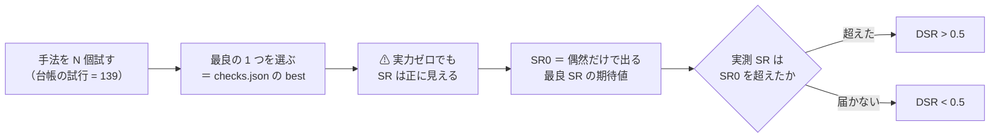
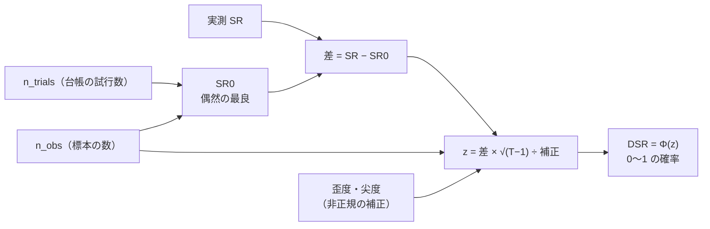
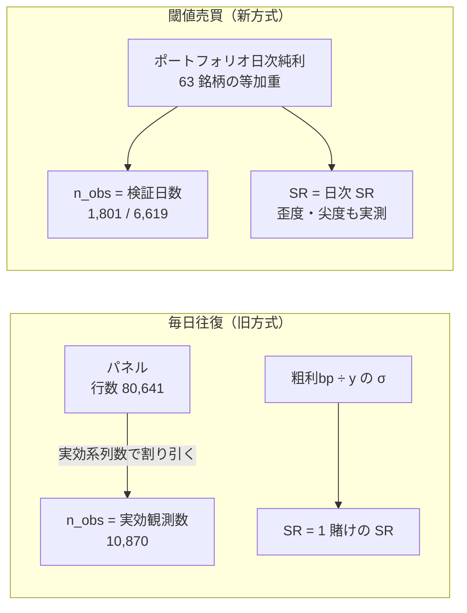
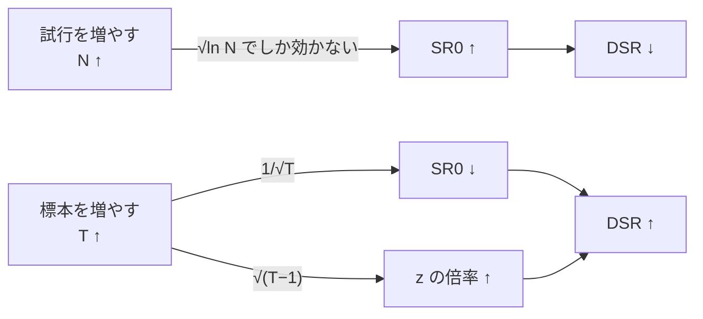
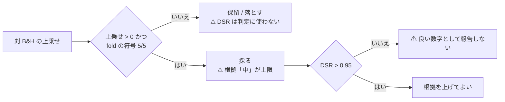

# デフレーテッド SR（DSR）の解説

作成日: 2026-09-12。`checks.json` の `dsr` と台帳・管理画面に出る DSR を読むための図解。
プラン: [dsr-explainer.md](../../../plans/archive/dsr-explainer.md) ／ 関連: [units.md](units.md)（検証の単位）・[validation-power.md](validation-power.md)（検出限界）

## 0. この頁の位置づけ — 解説であって規約ではない

⚠ **本書は解説であり、規約の正本ではない。** 定義はここに 1 つも足さない。
⚠ **本書と正本が食い違ったら、正本が勝ち、本書を直す。**

| 役割 | 正本 | ⚠ 注意 |
| --- | --- | --- |
| 規約（いつ通すか・入力を何から取るか） | [rules.md 11 章 規約 3](rules.md)・[13-7](rules.md) | ⚠ **食い違ったら rules.md が勝つ** |
| 実装（式そのもの） | `ail/validation/stats.py` の `deflated_sharpe` | ⚠ **式は 15 行しかない。** 疑ったらここを読む |
| 実装（入力の作り方） | `ail/validation/checks.py` の `_panel_checks`（毎日往復）／ `compute_trading`（閾値売買） | ⚠ **2 経路で入力の定義が違う**（§3） |
| ✅ の水準 | [dashboard.md §10-3](../../dashboard.md)（DSR > 0.95） | 実装は `dashboard/app/experiments.py` |
| 出典 | Bailey, López de Prado, "The Deflated Sharpe Ratio," *JPM* 40(5), 2014（[sources.md の 15](../e8-signal-methods/sources.md)） | 【公表値】の式。⚠ **本書の数字は自前の【実測】** |

⚠ **本書で引く数字はすべて【実測】**で、`runs/*/checks.json`（42 実行）と、その値を
⚠ **実装 `stats.deflated_sharpe` に入れ直して再現したもの**である。⚠ **新しい試行は 1 つも回していない**（回すと `n_trials` が動く）。

## 1. 何のための道具か — 「良い数字は手法を並べれば必ず出る」を数字で引く

一言でいえば、**DSR は「その SR は、何回も試したうちの当たりくじではないか」を確率で答える道具**である。

[rules.md 11 章 規約 2](rules.md) が「⚠ **良い数字は根拠『中』が上限**」と言い、規約 3 が「⚠ **DSR を通していない良い数字は報告しない**」と言う。
その規約 3 の中身がこれで、⚠ **「何回試したか」を数字に織り込む**。

> この図の主張: 手法を N 個並べれば、実力が全部ゼロでも「最良の 1 つ」の SR は正になる。DSR はその**偶然の最良（SR0）**を引いてから測る。

⚠ **N は「報告した数」ではなく「試した数」である。** 数え落とすと SR0 が小さく出て、⚠ **必ず甘くなる**（[rules.md 11 章 規約 4](rules.md)）。

## 2. 式 — 部品は 3 つだけ

実装（`ail/validation/stats.py`）はこの 3 つを順に組むだけである。

| 部品 | 式 | 意味 |
| --- | --- | --- |
| **SR** | 実測のシャープレシオ | ⚠ **年率ではない**（§3。閾値売買は日次、毎日往復は 1 賭けあたり） |
| **SR0** | `((1−γ)·Φ⁻¹(1−1/N) + γ·Φ⁻¹(1−1/(N·e))) / √T` （γ = 0.5772 はオイラー定数、N = `n_trials`、T = `n_obs`） | ⚠ **真の実力が全部ゼロの手法を N 個回したとき、最良の SR の期待値** |
| **DSR** | `Φ( (SR − SR0)·√(T−1) / √(1 − 歪度·SR + (尖度−1)/4·SR²) )` | 標準正規の累積分布 ＝ **0〜1 の確率** |

> この図の主張: DSR は「SR から SR0 を引き、標本の長さで拡大し、分布の歪みで割る」という 1 本道である。

### 2-1. SR0 は「試行数の対数」でしか増えない

⚠ **ここが直感に反する。** 試行を 5,000 倍にしても SR0 は 7 倍にしかならない（n_obs = 1,801 での【実測】）。

| n_trials | 2 | 10 | 36 | 67 | 94 | **139**（現在の台帳） | 278 | 10,000 |
| --- | ---: | ---: | ---: | ---: | ---: | ---: | ---: | ---: |
| SR0 | 0.0122 | 0.0371 | 0.0506 | 0.0562 | 0.0591 | **0.0623** | 0.0677 | 0.0910 |

目安として **SR0 ≈ √(2·ln N / T)** と覚えてよい（⚠ **実装より 1〜2 割大きめに出る**。下の【実測】）。

| T ／ N | 実装の SR0 | 近似 √(2 ln N / T) |
| --- | ---: | ---: |
| 1,801 ／ 94 | 0.0591 | 0.0710 |
| 1,801 ／ 139 | 0.0623 | 0.0740 |
| 6,619 ／ 97 | 0.0310 | 0.0372 |

⚠ **T（標本）は平方根で効き、N（試行）は対数の平方根でしか効かない。** だから⚠ **試行を減らすより標本を増やすほうが遥かに効く**（§5）。

## 3. 入力の 4 つはどこから来るか — ⚠ 2 経路で定義が違う

⚠ **同じ `dsr` という鍵でも、毎日往復（旧方式）と閾値売買（新方式・[rules.md 13 章](rules.md)）で中身が違う。**
⚠ **この 2 つの DSR を並べて比べてはいけない。**

| 入力 | 毎日往復（`_panel_checks`） | 閾値つき売買（`compute_trading`） |
| --- | --- | --- |
| **SR** | ⚠ **1 賭けあたり**。`粗利bp × 1e-4 ÷ 目的変数 y の標準偏差`。⚠ **コスト前（粗利）** | **日次**。ポートフォリオ日次**純利**系列（fold 連結）の `平均 ÷ 標準偏差`。⚠ **コスト後** |
| **n_obs** | ⚠ **実効観測数**（検証に回った行数 × 実効系列数 ÷ 系列数）。例: 80,641 行 → **10,870**（48 系列の実効 6.47 本） | ⚠ **検証日数**（例: 2018 表 1,801 日／1995 表 6,619 日）。⚠ **行数 63 × 日数 を使わない** |
| **n_trials** | 台帳が数えた試行数（`checks.n_trials_now()`） | 同左 |
| **歪度・尖度** | ⚠ **渡していない（既定 0 / 3 ＝ 正規分布と仮定）** | ⚠ **系列から実測して渡す**（例: 歪度 −1.02・尖度 30.4） |

> この図の主張: 上の段（毎日往復）と下の段（閾値売買）は、SR も n_obs も別の量である。DSR という鍵が同じなだけ。

⚠ **毎日往復の経路が歪度・尖度を渡していないのは、旧方式の記録を再計算しないと決めたためである**（[rules.md 14 章](rules.md) 冒頭）。
⚠ **本書は事実として書くだけで、直さない。** 効きの大きさは §5-3 にある（この規模の SR では 0.005 程度）。

## 4. 読み方 — 0.5 と 0.95 の意味

| DSR の値 | 意味 |
| ---: | --- |
| **0.5** | ⚠ **SR がちょうど SR0** ＝ 「偶然だけで出る最良」と同じ。⚠ **0.5 未満は「偶然の当たりくじにすら届いていない」** |
| **0.95** | 管理画面が ✅ を付ける水準（[dashboard.md §10-3](../../dashboard.md)）。⚠ **慣例であって、この値に理論的な必然はない** |
| **1.0000** | ⚠ **本番の実行では出ない。** 出たら leak（先読み）対照か、配線の壊れを疑う |

⚠ **DSR は「勝つ確率」でも「利益が出る確率」でもない。** 「真の SR が 0 より大きいと言ってよいか」を、選抜の下駄（SR0）を脱がせてから測った確からしさである。

代表的な実行の【実測】（すべて `runs/*/checks.json` の値。再現して一致を確認した）:

| 実行（最良手法） | 方式 | SR | SR0 | 差 | n_obs | n_trials | **DSR** |
| --- | --- | ---: | ---: | ---: | ---: | ---: | ---: |
| 断面 2026-09-08（F1-2 相互情報量） | 毎日往復 | 0.0346 | 0.0206 | **+0.0140** | 10,870 | 36 | **0.9276** |
| GPU LightGBM 2026-09-09 | 毎日往復 | 0.0322 | 0.0357 | −0.0035 | 4,087 | 51 | 0.4110 |
| GAN 増強 ＋ Ridge 2026-09-09 | 毎日往復 | −0.0119 | 0.0365 | −0.0484 | 4,087 | 58 | 0.0010 |
| 閾値売買 own × Ridge (A) 2026-09-10 | 閾値売買 | 0.0428 | 0.0570 | −0.0142 | 1,801 | 73 | 0.2792 |
| 同上の 1995 表 2026-09-11 | 閾値売買 | 0.0348 | 0.0310 | **+0.0038** | 6,619 | 97 | **0.6214** |
| ⚠ **leak 対照**（未来を混ぜた対照） | 閾値売買 | 0.9613 | 0.0591 | +0.9022 | 1,801 | 94 | **1.0000** |

⚠ **最高でも 0.9276（2026-09-08 の断面）で、0.95 を通した実行は 1 つも無い。**
⚠ **その 0.9276 も、いまの試行数 139 で計算し直すと 0.8318 になる**（§5-1）。

## 5. 効き方の実測 — レバーは 2 本、効きは対等ではない

> この図の主張: 試行を増やすと SR0 が上がって DSR は下がる。標本を増やすと SR0 が下がり、同時に √(T−1) が伸びるので、⚠ **DSR には二重に効く**。

### 5-1. 試行を増やすと下がる（SR は固定・n_obs = 1,801）

| n_trials | 36 | 67 | 94 | **139** | 278 | 1,000 |
| --- | ---: | ---: | ---: | ---: | ---: | ---: |
| DSR（SR = 0.0428） | 0.3736 | 0.2896 | 0.2503 | **0.2103** | 0.1524 | 0.0809 |

⚠ **同じ結果が、手法を並べただけで悪くなる。** これが「⚠ **数え落とすと必ず甘くなる**」の実体である。
2026-09-12 に直した `n_trials` の二重計上（97 と記録・正しくは 94）は、この表の刻みで **DSR 0.6214 → 0.6256** の差だった（⚠ **厳しい側にずれていた**）。

### 5-2. 標本を増やすと上がる（SR・n_trials 固定）

| n_obs | 500 | 1,801 | 4,052 | 6,619 | 20,000 |
| --- | ---: | ---: | ---: | ---: | ---: |
| SR0 | 0.1183 | 0.0623 | 0.0415 | 0.0325 | 0.0187 |
| DSR（SR = 0.0428・n_trials 139） | 0.0505 | 0.2103 | 0.5309 | 0.7922 | 0.9995 |

⚠ **検証期間の延長（[rules.md 14-4](rules.md)）が効くのはここである。** 実例が橋渡し対（同じ手法・同じモデルを 2018 表と 1995 表で回した対）で、⚠ **SR は下がったのに DSR は上がった**:

| | 2018 表 | 1995 表 |
| --- | ---: | ---: |
| SR（日次） | 0.0428 | ⚠ **0.0348（下がった）** |
| SR0 | 0.0570 | 0.0310 |
| 差（SR − SR0） | −0.0142 | **+0.0038** |
| √(T−1) | 42.4 | 81.4 |
| z | −0.585 | +0.309 |
| **DSR** | 0.2792 | **0.6214** |

⚠ **「DSR 0.279 → 0.621 は良くなった」ではない**（[validation-power.md §8-2-4](validation-power.md) の注記そのまま）。
⚠ **日数が 3.7 倍になって推定が締まっただけで、fold の符号は 1/5 のままである。**

### 5-3. 歪度・尖度の補正はほとんど効かない（この規模では）

閾値売買 own × Ridge (A) の系列は歪度 −1.02・尖度 30.4 と ⚠ **かなり非正規**だが、DSR への効きは小さい【実測】。

| 渡した値 | DSR |
| --- | ---: |
| 実測（歪度 −1.02・尖度 30.4） | 0.2792 |
| 既定（0 / 3 ＝ 正規と仮定） | 0.2738 |
| 尖度だけ正規（歪度 −1.02・尖度 3） | 0.2780 |

⚠ **補正は分母なので、差（SR − SR0）を縮める向きにしか効かない。** 差が負のときは ⚠ **DSR を 0.5 のほうへ押し上げる**（上の表で実測 > 既定 になっているのはそのため）。
⚠ **「太い裾を入れたら厳しくなる」と決めつけない。** 厳しくなるのは差が正のときだけである。

## 6. 0.95 を通すには何が要るか — 逆算

⚠ **これが一番実務的な読み方である。** 他を固定して、DSR = 0.95 に必要な SR を解く【実測（実装を二分探索）】。

| n_obs | n_trials | 要る SR（日次） | ⚠ **年率換算（×√252）** |
| ---: | ---: | ---: | ---: |
| 1,801（2018 表） | 139 | 0.1045 | ⚠ **1.66** |
| 6,619（1995 表） | 139 | 0.0535 | **0.85** |
| 20,000 | 139 | 0.0305 | 0.48 |

参考: いま実測されている閾値売買の SR は日次 0.0428（年率 0.68）・0.0348（年率 0.55）で、⚠ **leak 対照だけが日次 0.96（年率 15.3）** である。

⚠ **2018 表のままでは、年率 SR 1.66 級 ＝ 世界的なファンドの水準でないと 0.95 を通せない。**
⚠ **これは「DSR が厳しすぎる」のではなく、1,801 日では区別がつかないという意味**である（[validation-power.md §3-2](validation-power.md) の検出限界と同じことを別の量で言っている）。

## 7. この道具が答えないもの — 4 つ

| # | ⚠ 答えないこと | 代わりに何が担うか |
| ---: | --- | --- |
| 1 | ⚠ **「基準線を超えたか」** | **上乗せの列**（対 B&H の上乗せと fold の符号。[rules.md 13-7](rules.md)）。⚠ **2026-09-08 には「常に上（B&H）」自身が DSR 0.5786 を取った**【実測】 |
| 2 | ⚠ **台帳の採否（採る / 保留 / 落とす）** | `catalog.judge` は ⚠ **DSR を見ない**。判定は上乗せの符号だけで決まる。DSR は「⚠ **良い数字を報告してよいか**」の関門（11 章 規約 3） |
| 3 | ⚠ **fold の偏り** | fold ごとの符号（規約 5）。⚠ **DSR は連結した 1 本の系列しか見ないので、「fold 1 だけで作った数字」を見抜けない** |
| 4 | ⚠ **配線の壊れ** | leak 対照（[rules.md 13-10](rules.md)）。⚠ **DSR 1.0000 は「素晴らしい」ではなく「未来が混ざっている」の顔つきである** |

> この図の主張: DSR は入り口ではなく、⚠ **採る候補が出てから通す最後の関門**である。符号が割れている行は、そもそもここまで来ない。

## 8. よくある誤読

| ⚠ 誤読 | 正しい読み | 根拠 |
| --- | --- | --- |
| 「DSR が上がった ＝ 手法が良くなった」 | 標本が増えただけでも上がる。⚠ **SR が下がって DSR が上がった実例がある** | §5-2 |
| 「DSR 0.62 なら 62% の確率で儲かる」 | 儲かる確率ではない。⚠ **真の SR が正だと言ってよいかの確からしさ** | §4 |
| 「DSR が低いのは検定が厳しすぎるから」 | 試行 139 のぶんの下駄（SR0）を脱がせているだけ。⚠ **下駄を履いたまま報告するほうが誤り** | §1・§5-1 |
| 「行数が多いから標本は十分」 | ⚠ **63 系列は独立ではない。** 素の 80,641 行で計算すると 4 行とも DSR 1.0000 になり、何も判別できない | §3・[rules.md 12 章 限界 2](rules.md) |
| 「毎日往復の DSR 0.93 のほうが閾値売買の 0.62 より良い」 | ⚠ **SR も n_obs も別の量**なので比べられない。⚠ **毎日往復はコスト前の粗利で計算している** | §3 |
| 「leak の DSR 1.0 は配線が正しい証拠」 | ⚠ **半分正しい。** 跳ねること自体は検査の合格だが、⚠ **本番の表で跳ねたらまず配線を疑う** | §7 の 4・[rules.md 11 章 規約 7](rules.md) |

## 9. 実装の近似と限界

⚠ **消せない限界は、消せないまま書いておく**（[rules.md 12 章](rules.md) と同じ構え）。

| # | 近似・限界 | ⚠ 効き方 |
| ---: | --- | --- |
| 1 | ⚠ **SR0 の分散を `1/n_obs` で近似している**（原典は「試行どうしの SR のばらつき」を使う） | ⚠ **試行が互いに強く相関しているとき（本プロジェクトはそう）、本当のばらつきはもっと小さい ＝ SR0 は大きめに出る**【推測】。⚠ **向きは厳しい側なので、そのままにしてある** |
| 2 | 系列は独立でなく、DSR は 1 本に潰した系列しか見ない | fold の偏り・銘柄の偏りは別の列（fold の符号・`per_symbol`）で見るしかない |
| 3 | ⚠ **毎日往復の経路は歪度・尖度が既定値（0 / 3）のまま** | この規模では DSR 0.005 程度の差（§5-3）。⚠ **旧行は再計算しないという決定に従って残している** |
| 4 | `n_trials` の正本は台帳であり、⚠ **台帳が数え落とせば DSR は甘くなる** | 台帳の鍵（[units.md §4](units.md)）が自由度をすべて拾えているかに依存する |
| 5 | ⚠ **0.95 という水準に必然性はない**（慣例） | ⚠ **水準を後から下げるのは検証データでの最適化**になる。動かすなら事前に決める |
