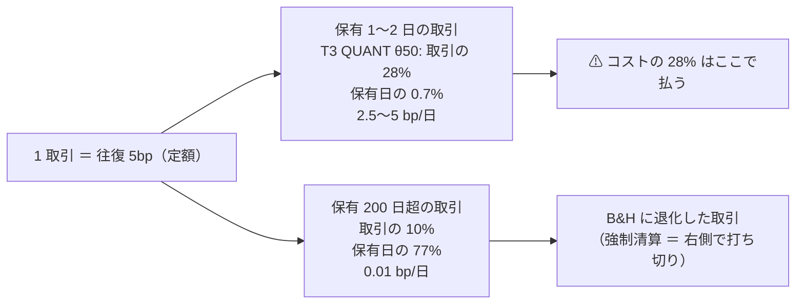

# 保有日数の分布 — 保有が短い取引ほどコストが重い、を数字にした

作成日: 2026-09-17。プラン: [holding-days-distribution.md](../../../plans/archive/holding-days-distribution.md)（[dsr.md](dsr.md) と同じ「解説であって規約ではない」形）
派生元: 利用者の疑問「保有日数の中央値など分布が知りたい。保有日数の短い取引ほど手数料が重くなってくるので」
正本: [rules.md 13-4 の 6・15-7 の 4](rules.md)（記録するもの）／ 実装 `ail/validation/simulate.py`（`hold_days`）・`cli/run.py`（`holds.csv`）・`ail/validation/checks.py`（`_holding`）

## 0. 答え（先に一言）

⚠ **閾値売買の取引は「短い側の山（1〜2 日）」と「fold を持ち切る側の山（360 日 ＝ 強制清算）」の二山で、中央値は手法と θ で 2 日から 360 日まで振れる。**
代表構成（`trade_ownseq_ridge_a`・T3 QUANT・θ=50）では **中央値 7 日（p25–p75 2–19 日）、保有 1 日の取引が 21%・2 日以下が 28%**。
⚠ **コストは 1 取引あたり定額（往復 5bp【推測】）なので、この 28% の取引が全コストの 28% を払いながら、保有日数の 0.7% しか持っていない**。
1 日あたりのコストは保有 1 日で 5bp/日 ＝ B&H のドリフト 1 日ぶん（2018 表 4.59bp/日【実測】）に匹敵する。

> この図の主張: ⚠ **同じ 5bp を、短い取引は 1〜2 日で、長い取引は数百日で払う。** 取引の数で見ると短い側に、保有日で見ると長い側に偏る。

## 1. 何を測ったか — 3 段

| 段 | 何をした | 再実行 |
| :-: | --- | :-: |
| Phase 1 | 既存 151 実行の `per_symbol.csv` ＋ `result.csv` から **銘柄 × fold の平均保有日数**（保有日率 × 検証日数 ÷ 取引回数）を集計 | 不要 |
| Phase 2 | `simulate()` に **1 取引ごとの保有日数**（`hold_days`・`entry_idx`・`forced_close`）を吐かせ、`holds.csv`（1 取引 1 行）・`per_symbol.csv` の末尾 3 列・`checks.json` の `by_threshold[θ].holding`・画面の列に載せた | ⚠ **既存の数字は 1 ビットも変えない**（指紋テスト `tests/test_trading_run.py` と、下の §3 の実物での検算） |
| Phase 3 | 代表 1 構成（`trade_ownseq_ridge_a` ＋ leak）を回し直し、正確な分布を出した | 2 本（同じ識別項目。検証結果一覧の行は増えない） |

## 2. Phase 1 — 既存 151 実行の近似【実測 2026-09-17】

⚠ **これは「1 取引ごとの分布」ではなく「銘柄 × fold の平均保有日数」の分布**（強制清算を含む・本物 79 実行・leak 72 実行は除く）。

### 2-1. 手法の種類 × θ の分位点（銘柄 × fold を標本に。日）

| 種類 | θ | n | p10 | p25 | **p50** | p75 | p90 |
| --- | ---: | ---: | ---: | ---: | ---: | ---: | ---: |
| B&H | 50〜60 | 22,641 | 359 | 360 | **360** | 361 | 1,268 |
| 直前符号 | 50〜60 | 22,641 | 1.9 | 2.0 | **2.1** | 2.2 | 2.3 |
| 全部使う | 50 | 15,012 | 1.8 | 3.9 | **26.5** | 360 | 361 |
| | 55 | 10,544 | 4.3 | 14.9 | **140.9** | 359 | 360 |
| | 60 | 6,787 | 5.0 | 18.0 | **130.0** | 332 | 359 |
| 選別 F | 50 | 10,650 | 1.7 | 6.8 | **88.5** | 360 | 1,323 |
| | 55 | 6,339 | 13.0 | 68.5 | **233.0** | 360 | 360 |
| | 60 | 3,689 | 19.6 | 67.0 | **198.0** | 343 | 529 |
| 検知器 D（先 W 日ラベル） | 50〜60 | 6,545〜7,788 | 135〜1,220 | 1,266 | **1,267** | 1,267 | 1,268 |
| 検知器 C（SMA 規則） | 50〜60 | 5,886 | 8.8 | 10.5 | **18.2** | 30.1 | 57.5 |
| 時系列分類 T/S | 50 | 1,089 | 9.2 | 70.2 | **360** | 361 | 361 |
| 入口×出口（16 章） | 50〜60 | 6,530〜7,168 | 4.7 | 6.8 | **20〜26** | 1,267 | 1,268 |
| 乱択 | 50 | 14,708 | 2.0 | 4.0 | **50.6** | 360 | 361 |

- ⚠ **p75 が 360 ／ 1,267（＝ fold 長）に貼り付く**: 銘柄 × fold の 1/4 以上が「1 取引で fold を持ち切る」B&H への退化
- 検知器 D は中央値が fold 長（1,267 日）＝ ほぼ全部が退化（[theta-placement.md §2](../theta-placement.md) の「θ ≥ 50 では出口が立たない」の別の見え方）
- 期間別: 2018 表は θ=50 で p10 1.8 日・p50 35 日、1995 表は p10 6.0 日・p50 311 日（fold が 3.7 倍長いぶん退化が伸びる）

### 2-2. 平均保有日数 ≤ 2 日の行（B&H を除く）

| 量 | 値 |
| --- | ---: |
| 行の割合 | 12.8% |
| ⚠ **コスト（粗利 − 純利）の取り分** | **28.8%** |
| 粗利の取り分 | −11.1%（合計が負） |
| 1 日あたりコストの中央値（≤ 2 日 ／ > 2 日） | 2.63 ／ 0.19 bp/日 |

帯ごと（平均保有日数の帯 × 行の割合・純利の平均・1 日あたりコストの中央値・コスト ÷ |粗利| の中央値）:

| 帯（日） | 行の割合 | 純利 bp の平均 | 1 日あたりコスト | コスト ÷ |粗利| |
| --- | ---: | ---: | ---: | ---: |
| ≤ 1.5 | 1.6% | ＋104 | 4.37 | 0.13 |
| 1.5–2 | 11.3% | ⚠ **−2,434** | 2.62 | 0.33 |
| 2–3 | 22.8% | ＋718 | 2.34 | 0.32 |
| 3–5 | 4.1% | ＋902 | 1.24 | 0.16 |
| 5–10 | 7.9% | ＋708 | 0.67 | 0.16 |
| 10–20 | 6.4% | ＋1,608 | 0.36 | 0.07 |
| 20–60 | 7.9% | ＋1,913 | 0.15 | 0.03 |
| 60–200 | 8.0% | ＋1,946 | 0.04 | 0.01 |
| > 200 | 30.1% | ＋3,311 | 0.006 | 0.002 |

⚠ **1.5–2 日の帯は「直前リターンの符号」の基準線がほぼ全部**（毎日反転。粗利も負）。手法の側で短い帯にいるのは 2–3 日の帯で、そこではコストが粗利の 1/3 を食う。

`cost_bp` の感度（算術。再実行なし。手法 ＝ 基準線以外・銘柄 × fold の平均純利 bp）:

| θ | 粗利 | 純利 @2.5bp | **純利 @5bp（config）** | 純利 @10bp |
| ---: | ---: | ---: | ---: | ---: |
| 50 | 2,175.7 | 2,111.2 | **2,046.8** | 1,918.0 |
| 55 | 1,651.0 | 1,618.2 | **1,585.3** | 1,519.6 |
| 60 | 1,263.8 | 1,235.7 | **1,207.7** | 1,151.6 |

⚠ **コストを倍にしても平均純利は 6% しか動かない**（θ=50）。⚠ **採否には使わない**（`cost_bp` を判定のために動かすのは自由度。プラン §2-2）。純利が伸びない理由の主はコストではなく、B&H に対して選日が効いていないこと（対 B&H 上乗せの符号。[reverse-trading.md](reverse-trading.md) の S も参照）。

## 3. Phase 3 — 代表構成の 1 取引ごとの分布【実測 2026-09-17】

代表: `trade_ownseq_ridge_a`（T1 MiniRocket・T2 Hydra・T3 QUANT の 3 検知器・Ridge・(A)・2018 表・fold 360 日）。⚠ **回すと決めたのは結果を見る前**（TODO に 16:55 記載。検証結果一覧で 2026-09-15 以降の `trade_*` の最上位 ＝ T3 QUANT θ=50 保留）。
新 `2026-09-17T17-22-08`（＋ leak `17-41-08`）。旧 `2026-09-15T10-38-12`（＋ leak `10-55-17`）。

### 3-1. ⚠ 検算 — 既存の数字は 1 ビットも変わっていない

| 突き合わせ | 結果 |
| --- | --- |
| `summary.csv` 15 行（本数・的中率・IC・粗利・純利・取引回数・保有日率・乱択ゲート） | **最大差 0.0**（本物・leak とも） |
| `per_symbol.csv` 4,725 行の既存 5 列 | **最大差 0.0**。既存列の並びは同じで、末尾に 4 列（保有日数中央値・最短・最長・逆売買純利bp）が足された |
| `result.csv` | 既存列は同じ並び。末尾に `逆売買純利bp`・`逆売買取引回数` |
| `checks.json` の `best` / `edge_vs_bh` | 差 0.0。DSR だけ 0.1237 → 0.1178（n_trials が 604 → 610 に増えたぶん。式は同じ） |
| 入力（行・列・銘柄・開始日・表） | 一致。`env.json` の commit は `696cf7b` ＋ 作業ツリーの変更 |

### 3-2. 1 取引ごとの保有日数（`holds.csv`・90,295 行・強制清算を含む）

| 手法 | θ | 取引数 | p10 | p25 | **中央値** | p75 | p90 | 平均 | 保有 1 日 | ≤ 2 日 | ≤ 5 日 | 強制清算 | 中央値（強制清算を除く） |
| --- | ---: | ---: | ---: | ---: | ---: | ---: | ---: | ---: | ---: | ---: | ---: | ---: | ---: |
| **T3 QUANT** | **50** | 1,867 | 1 | 2 | **7** | 19 | 278 | 47.6 | **20.9%** | **27.8%** | 42.5% | 13.5% | 6 |
| | 55 | 227 | 3 | 13 | **291** | 360 | 360 | 197.0 | 6.6% | 8.8% | 13.7% | 52.9% | 20 |
| | 60 | 125 | 18 | 85 | **174** | 178 | 337 | 164.7 | 2.4% | 2.4% | 4.8% | 84.8% | 49 |
| T1 MiniRocket | 50 | 748 | 1 | 2 | **19.5** | 292 | 361 | 120.3 | 19.7% | 27.5% | 38.9% | 32.4% | 4 |
| | 55 | 125 | 213 | 314 | **360** | 360 | 360 | 319.0 | 0 | 0 | 0 | 100% | — |
| T2 Hydra | 50 | 415 | 1 | 6 | **360** | 361 | 361 | 217.8 | 10.6% | 16.9% | 24.3% | 59.8% | 3 |
| | 55 | 119 | 223 | 304 | **360** | 360 | 360 | 314.1 | 0 | 0 | 0.8% | 100% | — |
| 基準 B&H | 50〜60 | 315 | 359 | 360 | **360** | 361 | 361 | 360.1 | 0 | 0 | 0 | 100% | — |
| 基準 直前符号 | 50〜60 | 28,571 | 1 | 1 | **2** | 3 | 4 | 2.07 | 48.1% | 73.1% | 96.2% | 0.4% | 2 |

- ⚠ **二山**: T3 QUANT θ=50 は「2〜19 日」の山と「fold を持ち切る 360 日」の山（強制清算 13.5%）。強制清算を除くと中央値 6 日（p10–p90 1–30 日）
- ⚠ **θ を上げると取引が 1 銘柄 1 fold あたり 1 回前後に減り、ほぼ全部が強制清算になる**（T1・T2 の θ=55 は 100%）。⚠ **「θ が高いほど良い」が「取引しないだけ」である**（13-10）ことの、もう 1 つの見え方
- leak 対照は中央値 2 日（p25–p75 1–3）。先読みの列は毎日の符号を当てるので売買が毎日に近づく

### 3-3. T3 QUANT θ=50 — どの帯の取引がコストを払っているか

| 帯（保有日数） | 取引 | 取引の割合 ＝ **コストの取り分** | 保有日の割合 | 1 日あたりコスト（中央値） |
| --- | ---: | ---: | ---: | ---: |
| 1 | 390 | **20.9%** | 0.4% | 5.00 bp/日 |
| 2 | 128 | 6.9% | 0.3% | 2.50 |
| 3–5 | 275 | 14.7% | 1.2% | 1.25 |
| 6–10 | 369 | 19.8% | 3.2% | 0.63 |
| 11–20 | 260 | 13.9% | 4.3% | 0.36 |
| 21–60 | 204 | 10.9% | 7.9% | 0.16 |
| 61–200 | 49 | 2.6% | 5.7% | 0.06 |
| > 200 | 192 | 10.3% | **77.0%** | 0.01 |

⚠ **保有 2 日以下の取引が全コストの 28% を払い、保有日の 0.7% しか持っていない。** 1 日あたり 2.5〜5bp は B&H のドリフト 1 日ぶん（4.59bp/日）と同じ桁で、⚠ **この帯の取引は選日で 1 日 5bp 以上稼がないとコスト負けする**。
一方、保有日の 77% は「> 200 日」の 192 取引（B&H に退化した側）が持ち、そのコストは 0.01bp/日。⚠ **手法の純利の大部分はこちらのドリフトで、選日の腕ではない**（[reverse-trading.md §3](reverse-trading.md) の S ＝ ＋158bp に対し B&H の粗利 1,652bp）。

### 3-4. Phase 1 の近似はどれだけ使えるか

| 手法 × θ | Phase 1 の近似（銘柄 × fold の平均保有日数の中央値） | Phase 3 の実測（1 取引ごとの中央値） |
| --- | ---: | ---: |
| T3 QUANT θ=50 | **360 日**（四分位 82–360） | **7 日**（2–19） |
| T3 QUANT θ=55 | 360 | 291 |
| T3 QUANT θ=60 | 175 | 174 |
| T1 MiniRocket θ=50 | 360 | 19.5 |
| T2 Hydra θ=50 | 360 | 360 |
| 直前符号 | 2.1 | 2.0 |

⚠ **近似は二山の手法で外れる。** 銘柄 × fold の平均は「持ち切った 1 取引」と「短い 10 取引」が混ざると長い側に引かれ、T3 QUANT θ=50 では 360 日 対 7 日と 50 倍違う。⚠ **§2 の Phase 1 の表は「B&H への退化がどれだけあるか」を見るものとして読み、取引の長さの分布としては読まない。** 単峰の手法（直前符号・θ=60）では一致する。

## 4. 実費の手数料について（1 節だけ）

- シミュレータの往復 5bp は【推測】（E8 §1-4 の往復値）で、tastytrade の株の売買手数料は **$0**【公表値。[trading-fee-comparison.md §4](../trading-fee-comparison.md)】。⚠ **モデルのコストは手数料ではなくスプレッド・滑りの見積り**で、保有日数で重くなるのはこの部分
- 売り側に乗る規制費（SEC Section 31 fee・FINRA Trading Activity Fee）は約定金額・株数比例の少額で、5bp に比べて桁が小さいと見込む【推測】。⚠ **料率は 2026-09-17 に公式ページを当たったが、sec.gov の Fee Rate Advisory は 2024 年 4 月までの一覧しか取れず（当年度の料率は取れない）、finra.org の TAF のページは 404 だったので【推測】のまま**。書く時点で取れたら取得日つきの【公表値】に差し替える
- ⚠ **実費の【実測】は取りにいかない**（CLAUDE.md の方針）

## 5. ⚠ 答えないこと

| | 理由 |
| --- | --- |
| `cost_bp` を変えて採否を変えること | 自由度（§2-2 の感度は算術で示すだけ） |
| 保有日数で取引を選別すること（「2 日以下の取引は建てない」など） | ⚠ **後知恵の出口規則**。やるなら 16 章の出口% と同じく事前に仮説を書いて新しい検証として数える |
| 保有日数そのものを採否に使うこと | 診断・成果物（13-4 の 6）。判定は 13-7 の対 B&H 上乗せのまま |

## 6. 費用と付随して変わったもの

- 計算: Phase 1 1 秒 ／ Phase 3 の回し直し 19 分 ＋ 18 分（本物 ＋ leak）【実測】。人手は 1 日
- 画面: vibeboard の実行タブと dashboard の詳細ページに「保有日数 中央値（p25–p75）」の列（`holding` の写し。旧実行は「—」）
- 検証結果一覧: 触っていない（同じ識別項目の再実行。行も n_trials も増えない）
- 出来高の対（[volume-trend-input.md](../volume-trend-input.md)）でも同じ列が自動で残った: θ=50 で中央値 3 日（1–6）・保有 1 日 33%
