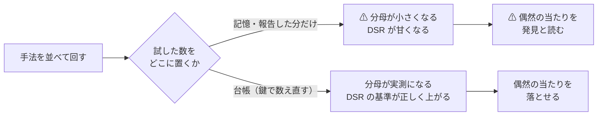
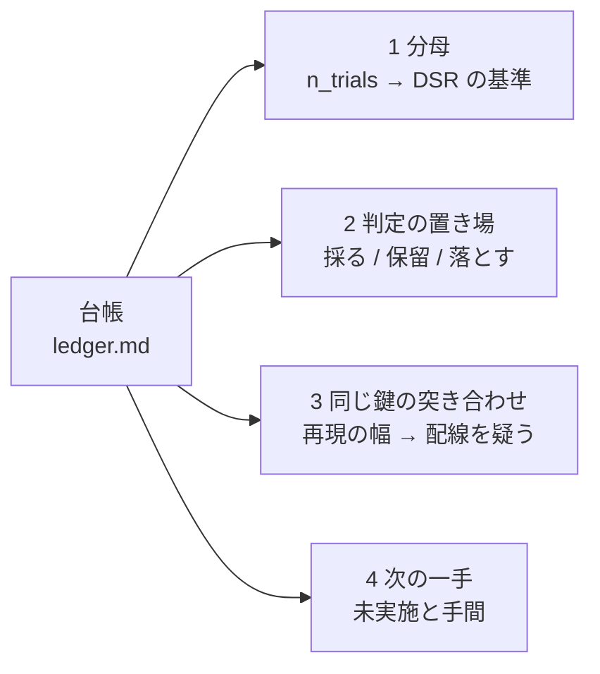
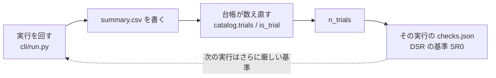

# 台帳の役割 — 何のためにあり、何を決めているか

作成日: 2026-09-12。[ledger.md](ledger.md) が何をする文書なのかの説明。
プラン: [ledger-role.md](../../../plans/archive/ledger-role.md) ／ 関連: [units.md](units.md)（単位の図解）・[dsr.md](dsr.md)（DSR の図解）

## 0. この頁の位置づけ — 解説であって規約ではない

⚠ **本書は解説であり、規約の正本ではない。** 定義はここに 1 つも足さない。
⚠ **本書と正本が食い違ったら、正本が勝ち、本書を直す。**

| 知りたいこと | 読む場所 | ⚠ 注意 |
| --- | --- | --- |
| ⚠ **何のためにあるか（役割）** | **本書** | 解説。定義は持たない |
| 行をどう読むか（単位） | [units.md](units.md) | 解説。実行 → 手法 → 試行 → fold → セル |
| 何を数え、どう判定するか（規約） | [rules.md 11 章・13-9・14 章](rules.md) | ⚠ **食い違ったら rules.md が勝つ** |
| 実装（鍵・数える線引き・畳み込み） | `ail/catalog.py`（`KEY`・`is_trial`・`judge`・`_collapse`） | 同上 |
| いまの中身（行・判定・未実施） | [ledger.md](ledger.md) | ⚠ **生成物。手で書き換えない** |

⚠ **本書の数字は 2026-09-12 生成の台帳の【実測】。** ⚠ **再生成すれば動く**（実行を足すたびに行も試行数も増える）。

## 1. なぜ要るか — 「試した数」を覚えていられないから

一言でいえば、**台帳は「何をいくつ試したか」を鍵で数え直せる形に残す装置**である。

⚠ **良い数字は手法を並べれば必ず出る**（[rules.md 11 章](rules.md) 規約 2）。だから採否は「良い数字が出たか」ではなく
「⚠ **何回試したうちの良い数字か**」で決まる。その分母が `n_trials` で、⚠ **数え落とすと必ず甘くなる**（規約 4）。

> この図の主張: 分母を人の記憶に置くと必ず小さくなる。台帳は分母を**記録から数え直せる**ようにするためにある。

⚠ **台帳は「成果の一覧」ではなく「試した回数の証拠」である。** 落とした行こそ本体で、
⚠ **落とした行を消すと分母が減る ＝ 残った行が良く見える。**

## 2. 4 つの役割

> この図の主張: 台帳は 1 つの表から 4 つの別々の仕事をしている。どれも「実行の記録」からしか作れない。

| # | 役割 | 中身 | どこが使うか |
| ---: | --- | --- | --- |
| 1 | **多重検定の分母** | 試行の行数が `n_trials`。⚠ **2026-09-12 生成で 139**（基準線 106 行は数えない） | `checks.n_trials_now()` が台帳に数えさせ、各実行の `checks.json` の DSR に入る（[dsr.md §1](dsr.md)） |
| 2 | **判定の置き場** | 行ごとに 採る / 保留 / 落とす（＋ 基準・門前）と理由。⚠ **2026-09-12 生成で採る 0・落とす 102・保留 37** | 人の記憶ではなく記録に置く。⚠ **判定は `catalog.judge` が数字から出す**（手で書かない） |
| 3 | **同じ鍵の突き合わせ** | 同じ鍵の実行を 1 行にまとめ、食い違いを「再現」列に出す | ⚠ **幅が出たら実力ではなく配線を疑う**（[rules.md 11 章](rules.md) 規約 7） |
| 4 | **次の一手** | カタログ 25 件のうち ⚠ **未実施 16 件**を手間順に並べ、「何を足せば試せるか」を 1 行で持つ | 次に何を実装するかが上から読める（`config/catalog_notes.toml`） |

⚠ **役割 2 は「成績表」ではない。** 落とした理由（E8 の失敗の型）まで残すのは、
⚠ **同じ手法を「まだ試していない」と思って回し直さない**ためでもある（回せば分母が増える）。

## 3. 生成物であることに意味がある

台帳は 3 つの正本を突き合わせた**生成物**で、⚠ **人が書ける列は 1 つしかない**（4 つ目の入力）。

| 入力 | 何の正本か | 人が触るか |
| --- | --- | --- |
| [feature-discovery.md §2](../feature-discovery.md) の表 | 手法のカタログ 25 件 | 手法を足すときだけ |
| `ail/registry.py` | 実装の有無 | 実装すれば自動で ✅ |
| `runs/*/summary.csv`（＋ `result.csv`） | 結果 | ⚠ **実行が書く。人は触らない** |
| `config/catalog_notes.toml` | ⚠ **未実施の「次の一手」と注記** | ⚠ **ここだけ人が書く** |

⚠ **数字を手で書ける欄が無い**ので、⚠ **後から都合よく動かせない。** これが台帳の一番の仕事かもしれない。
判定も理由の一部も `ail/catalog.py` が数字から出す。⚠ **気に入らない判定を書き換えるには、実行を足すしかない。**

> この図の主張: 台帳は行き止まりではなく輪になっている。⚠ **いま回す実行の DSR の基準を、これまでの台帳が決めている。**

⚠ **順序に依存がある**: `summary.csv` を書いた**あと**に数えるので、台帳は既にその実行の行を含んでいる。
⚠ **そこへ「この実行ぶん」を足すと二重に数える**（2026-09-12 に直した。§5）。

## 4. 数えるもの・数えないもの

⚠ **台帳に居ることと、分母に数えることは別である。** 線引きの正本は `catalog.is_trial`。

| 行の種類 | 台帳に載るか | ⚠ n_trials に数えるか | ⚠ 理由 |
| --- | :-: | :-: | --- |
| 選別手法（カタログ ID を持つ行） | ✅ | ✅ | 試したもの |
| ⚠ **全部使う × Ridge 以外のモデル** | ✅ | ✅ | ⚠ **モデルが処置**（選ばなくてもモデルを選んでいる） |
| 閾値売買の行（閾値 1 水準ごと） | ✅ | ✅ | ⚠ **形式と閾値は選べた自由度**（[rules.md 13-9](rules.md)） |
| 基準線（B&H・直前符号・全部使う × Ridge・乱択） | ✅ | ❌ | 比べる相手であって採否の対象ではない |
| ⚠ **門前**（前置きの門で回さなかった手法） | ✅ | ❌ | ⚠ **検証 fold の結果で選んでいない**から（[rules.md 14-5](rules.md)）。⚠ **後から回したら数える** |
| ⚠ **leak 対照**（わざと未来を混ぜた実行） | ⚠ **別表（§5）** | ❌ | ⚠ **的中率 99% の行が本体に混ざると台帳全体が嘘になる** |

⚠ **未実施（16 件）は「効かない」ではない**（[ledger.md §3](ledger.md)）。⚠ **落とした 102 行と混同しない。**

## 5. 壊れるとどうなるか — 実例 3 つ

⚠ **どれも「行の中身」ではなく「数え方」の事故である。** 台帳の役割が分母である以上、事故はいつも分母に出る。

| いつ | 何が起きたか | ⚠ 向き |
| --- | --- | --- |
| 2026-09-08 | 表と registry で手法の表記が違い（「F1-5 単変量検定 ＋ FDR」と「F1-5 検定+FDR」）、⚠ **名前で照合すると同じ試行が 2 行に割れた**。以後 ID で照合する（`catalog.canonical`） | 分母が増える方向（厳しい側）だが、⚠ **再現の幅も嘘になる** |
| 2026-09-12 | `checks.json` の `n_trials` が自分の実行ぶんを二重に数えていた（記録 97・正しくは 94） | ⚠ **厳しい側**（DSR が 0.004〜0.013 低く出ていた）。採否も画面の印も動かない |
| 2026-09-12 | 鍵に「期間」が無く、⚠ **39 行が開始日の違う表の実行を 1 行にまとめていた**。遡って埋めて 94 → 139 試行 | ⚠ **甘い側だった**（分母が 45 少なかった）。⚠ **数字は 1 つも再計算していない** — 代表 1 本に隠れていた実行が表に出ただけ |

3 つ目が効いたのは分母だけではない。⚠ **期間差が「再現の幅」に化けていた**（例: F3-1 Lasso × Ridge × own は
「4 実行・幅 3.91bp」だったが、⚠ **同じ表どうしの幅は 0.50bp**）。⚠ **幅の列は「配線を疑え」の列なので、混ぜると読み違える。**

## 6. 台帳が答えないこと

| ⚠ 答えないこと | 代わりにどこを見るか |
| --- | --- |
| ⚠ **儲かるか** | ⚠ **どこにも無い。** 台帳は「この物差しで基準線を超えたか」しか言わない（[ledger.md](ledger.md) 冒頭: 投資助言ではなく調査資料） |
| ⚠ **効かないのか、標本が足りないのか** | 分けられない（[ledger.md §6](ledger.md) の限界 2）。大きさの目安は [validation-power.md §3-2](validation-power.md) の検出限界 |
| 良い数字を信じてよいか | [dsr.md](dsr.md)。⚠ **台帳の判定式に DSR は入っていない**（判定は上乗せの符号。DSR は報告してよいかの関門） |
| ⚠ **未実施の手法が効くか** | 情報が無い。⚠ **「未実施」は判定ではない** |
| 1 分足の古い行の fold の符号 | 出せない（生データが残っていない。[ledger.md §6](ledger.md) の限界 1） |

## 7. 早見 — 何を聞かれたら、どこを見るか

| 問い | 見る場所 |
| --- | --- |
| その手法は試したか | [ledger.md §2](ledger.md) に行があるか。無ければ §3 に「未実施」で載る |
| なぜ落としたか | §2 の「判定」と「理由」 |
| その数字はどの実行か | §2 の「実行」→ §4 の一覧（⚠ **2026-09-12 生成で 44 実行**。層・行数・種・commit・入力の指紋） |
| 同じ条件で回し直したら合うか | §2 の「再現」列（⚠ **幅が出たら配線を疑う**） |
| 次に何を試すか | §3（手間の小さい順） |
| 配線は生きているか | §5 の別表（leak が跳ねているか） |
| いまの分母はいくつか | §0 の `n_trials`（⚠ **2026-09-12 生成で 139**） |
