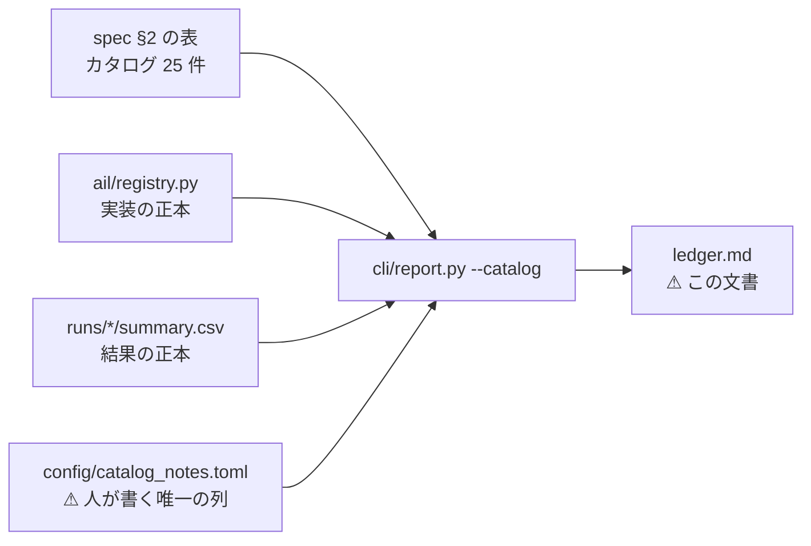
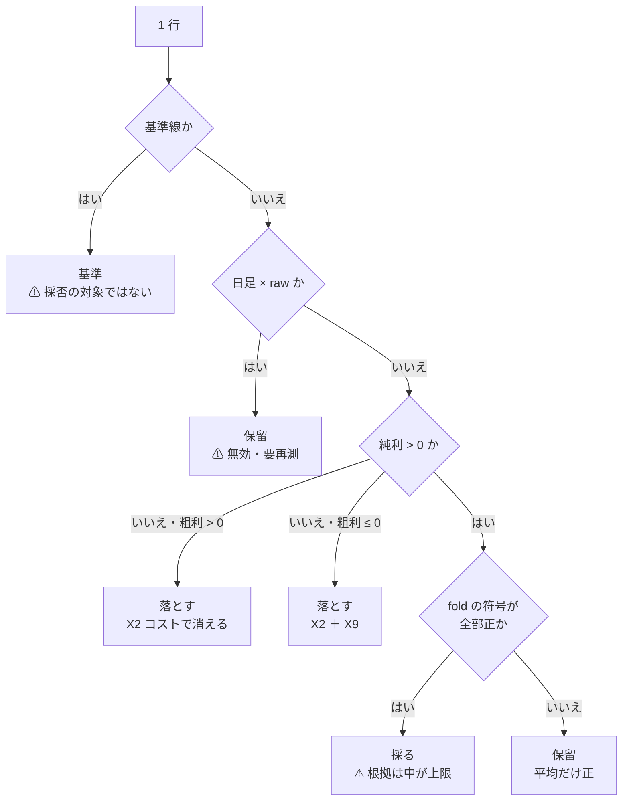

# 試した分析手法の台帳

⚠ **このファイルは生成物である。手で書き換えない。**

```bash
cd experiments/feature-discovery
./.venv/bin/python -m cli.report --catalog \
  > ../../docs/specs/experiments/feature-discovery/ledger.md
```

生成日 2026-09-09 ／ 入口: [feature-discovery.md](../feature-discovery.md) ／ 規約: [rules.md](rules.md) ／ 手法のカタログ: [feature-discovery.md §2](../feature-discovery.md#2-特徴量を見つけ出す手法のカタログphase-25-系統-25-件)

> ⚠ **これは投資助言ではなく調査資料である。** 特定の銘柄・売買を推奨しない。
> ⚠ **数字はすべて【実測】**（自前の検証で出したもの）。⚠ **良い数字は根拠「中」が上限**で、デフレーテッド SR とパージ CV を通していないものは報告しない（[rules.md 11 章](rules.md)）。

> この図の主張: ⚠ **台帳は 3 つの正本を突き合わせた生成物である。** 手で書き写す欄はひとつも無い。



## 0. ここまでの一言

⚠ **カタログ 25 件のうち、実装したのは 9 件、実際に回したのは 9 件。** 残り 16 件は**未実施**である（§3）。

⚠ **試行は 45 行（手法）＋ 18 行（基準線）。** ⚠ **「採る」は 0 件。** 落とす 32 行 ／ 保留 13 行。

⚠ **保留の内訳**: 無効・要再測（日足 × `raw`）が 9 行 ／ ⚠ **純利は正だが fold の符号が割れる**ものが 4 行。⚠ **後者は「採る」の一歩手前ではない。** ⚠ **多重検定を通していない良い数字である**（[rules.md 11 章](rules.md) 規約 2・3）。

| 何を聞かれたら | この台帳のどこで答えるか |
| --- | --- |
| その手法は試したか | §2 に行があるか。無ければ §3 に「未実施」で載っている |
| なぜ落としたか | §2 の「判定」と「理由」（⚠ **落ちた理由は E8 の失敗の型 X1〜X12 で書く**） |
| その数字はどの実行のものか | §2 の「実行」→ §4 の一覧（層・行数・種・commit・入力の指紋） |
| ⚠ **次に何を試すか** | §3。⚠ **手間の小さい順に並べてあり、上から読めば決まる** |

⚠ **多重検定に使う `n_trials` は 45**（= 手法の行数。基準線 18 行は数えない）。⚠ **[rules.md 11 章](rules.md) の規約 4 は「手法 × 粒度 × 地平 × 銘柄集合」を全部数えることを求める。この数を数え落とすと必ず甘くなる。**

## 1. 台帳の読み方

⚠ **1 行 = 1 回の試行。** 鍵は **手法 × 粒度 × 地平 × 特徴量の層 × データの層** である（[利用者の指示](../../../plans/archive/feature-discovery-ledger.md)）。
⚠ **手法ごとに 1 行にすると潰れる。** 同じ手法を条件違いで何度も試すためである。

| 列 | 中身 | ⚠ 読むときの注意 |
| --- | --- | --- |
| 実装 | `ail/registry.py` に在るか | ⚠ **無いものは「効かない」ではなく「試していない」** |
| 層 | データの層（`raw` / `adjusted`） | ⚠ **日足の `raw` は分割調整の誤りを含む＝ 無効**（[§6-3](../feature-discovery.md)） |
| 本数 | 選んだ特徴量の本数（fold の平均） | 絞るほど良いとは限らない |
| 的中率 | 符号が当たった割合 | ⚠ **株は上がる日が多い。** 基準「常に上」と必ず比べる |
| IC | 予測とラベルの相関 | ⚠ **IC が正でも粗利が最下位のことがある**（[§3-3](../feature-discovery.md)） |
| 粗利 bp | コストを引く前の 1 往復 | ⚠ **これだけを見てはいけない** |
| ⚠ **純利 bp** | ⚠ **往復コストを引いた後** | ⚠ **正でなければその手法は使えない**（[rules.md 9 章](rules.md) 規約 6） |
| fold | ⚠ **純利が正だった fold / 全 fold と符号の並び** | ⚠ **平均が正でも符号が割れるなら実力ではない**（[rules.md 11 章](rules.md) 規約 5） |
| 再現 | 同じ鍵の実行が何本あり、一致したか | ⚠ **数字が動いたら、まず配線を疑う**（規約 7） |
| 実行 | 出所の実行 ID | §4 で層・種・commit・入力の指紋が引ける |

> この図の主張: ⚠ **判定は数字から機械的に決める。** 手で「良さそう」とは書かない。



| 条件 | 判定 | 型・注記 |
| --- | --- | --- |
| 純利 > 0 かつ fold の符号が全部正 | **採る** | — |
| 純利 > 0 だが fold の符号が割れる | **保留** | ⚠ 平均だけ正（rules.md 11 章 規約 5） |
| 純利 ≤ 0 かつ 粗利 > 0 | **落とす** | **X2** コストで消える |
| 純利 ≤ 0 かつ 粗利 ≤ 0 | **落とす** | **X2 ＋ X9** コスト以前に優位性が無い |
| ⚠ 日足 × データの層が raw | **保留** | ⚠ **無効・要再測**（分割調整の誤り。§6-3） |
| 基準線の行 | **基準** | ⚠ 採否の対象ではない。手法はこれを超えて初めて意味がある |
| registry に無い | **未実施** | §3 |

⚠ **失敗の型は E8 の台帳と同じもの**（[E8 §6](../e8-signal-methods/failures.md)）。**X2** コストで消える ／ **X9** 標本不足。
⚠ **1 分足の `raw` は保留にしない。** 目盛りの誤りは日足にしか無い（[§3 の注記](../feature-discovery.md)）。

## 2. 台帳（試した結果）

⚠ **63 行。** うち手法 45 行・基準線 18 行。

| ID | 手法 | 系統 | 実装 | 層 | 粒度 | 地平 | 特徴量の層 | 本数 | 的中率 | IC | 粗利bp | 純利bp | fold | 再現 | 判定 | 理由 | 実行 |
| --- | --- | --- | :-: | :-: | --- | --- | :-: | ---: | ---: | ---: | ---: | ---: | --- | --- | :-: | --- | --- |
| F1-2 | 相互情報量 | F1 フィルタ型 | ✅ | adjusted | 日足 | 1 本（1 日） | own cs rel ll | 32.0 | 0.5076 | ＋0.0519 | ＋7.30 | **＋2.30** | 2/5 ＋−−＋− | — | **保留** | ⚠ 平均だけ正。fold の符号が割れる（rules.md 11 章 規約 5） | `2026-09-08T19-42-54_cross_section_h1` |
| F3-5 | クラスタ化 MDA（cMDA） | F3 埋め込み型 | ✅ | adjusted | 日足 | 1 本（1 日） | own cs rel ll | 32.0 | 0.5092 | ＋0.0199 | ＋6.45 | **＋1.45** | 2/5 ＋＋−−− | — | **保留** | ⚠ 平均だけ正。fold の符号が割れる（rules.md 11 章 規約 5） | `2026-09-08T19-42-54_cross_section_h1` |
| F3-1 | Lasso・Elastic Net | F3 埋め込み型 | ✅ | adjusted | 日足 | 1 本（1 日） | own ex | 1.0 | 0.5109 | ＋0.0366 | ＋5.61 | **＋0.61** | 1/5 ＋−−−− | — | **保留** | ⚠ 平均だけ正。fold の符号が割れる（rules.md 11 章 規約 5） | `2026-09-09T00-50-10_exog_h1` |
| F3-1 | Lasso・Elastic Net | F3 埋め込み型 | ✅ | adjusted | 日足 | 1 本（1 日） | own cs rel ll | 1.4 | 0.5084 | ＋0.0404 | ＋5.24 | **＋0.24** | 2/5 ＋＋−−− | — | **保留** | ⚠ 平均だけ正。fold の符号が割れる（rules.md 11 章 規約 5） | `2026-09-08T19-42-54_cross_section_h1` |
| F1-5 | 単変量の仮説検定 ＋ FDR（FRESH） | F1 フィルタ型 | ✅ | raw | 日足 | 1 本（1 日） | own | 23.4 | 0.5089 | ＋0.0193 | ＋4.77 | **−0.23** | 2/5 ＋−−−＋ | 4 実行・一致 | **保留** | ⚠ **無効・要再測**（分割調整の誤り。§6-3） | `2026-09-08T17-08-20_own_only_h1` |
| — | 常に上（ドリフト） | 基準線 | ✅ | adjusted | 日足 | 1 本（1 日） | own cs rel ll | 0.0 | 0.5166 | 0.0000 | ＋4.75 | **−0.25** | 3/5 ＋−＋−＋ | — | 基準 | ⚠ **ほとんど回転しない＝ 実際はコストを払わない** | `2026-09-08T19-42-54_cross_section_h1` |
| F3-1 | Lasso・Elastic Net | F3 埋め込み型 | ✅ | raw | 日足 | 1 本（1 日） | own | 5.0 | 0.5095 | ＋0.0250 | ＋4.64 | **−0.36** | 3/5 ＋−−＋＋ | 4 実行・一致 | **保留** | ⚠ **無効・要再測**（分割調整の誤り。§6-3） | `2026-09-08T17-08-20_own_only_h1` |
| — | 常に上（ドリフト） | 基準線 | ✅ | adjusted | 日足 | 1 本（1 日） | own ex | 0.0 | 0.5207 | 0.0000 | ＋4.62 | **−0.38** | 3/5 ＋−−＋＋ | — | 基準 | ⚠ **ほとんど回転しない＝ 実際はコストを払わない** | `2026-09-09T00-50-10_exog_h1` |
| F1-2 | 相互情報量 | F1 フィルタ型 | ✅ | adjusted | 日足 | 1 本（1 日） | own ex | 16.0 | 0.5078 | ＋0.0327 | ＋4.55 | **−0.45** | 1/5 ＋−−−− | — | **落とす** | **X2** コストで消える | `2026-09-09T00-50-10_exog_h1` |
| — | 全部使う（基準） | 基準線 | ✅ | raw | 日足 | 1 本（1 日） | own | 35.0 | 0.5049 | ＋0.0168 | ＋4.36 | **−0.64** | 1/5 −−−−＋ | 4 実行・一致 | 基準 | ⚠ **無効・要再測**（分割調整の誤り。§6-3） | `2026-09-08T17-08-20_own_only_h1` |
| F1-3 | mRMR（最小冗長・最大関連） | F1 フィルタ型 | ✅ | raw | 日足 | 1 本（1 日） | own | 8.0 | 0.5055 | ＋0.0213 | ＋4.12 | **−0.88** | 1/5 ＋−−−− | 4 実行・一致 | **保留** | ⚠ **無効・要再測**（分割調整の誤り。§6-3） | `2026-09-08T17-08-20_own_only_h1` |
| F3-5 | クラスタ化 MDA（cMDA） | F3 埋め込み型 | ✅ | raw | 日足 | 1 本（1 日） | own | 8.0 | 0.5070 | ＋0.0112 | ＋4.05 | **−0.95** | 1/5 −−−−＋ | 4 実行・一致 | **保留** | ⚠ **無効・要再測**（分割調整の誤り。§6-3） | `2026-09-08T17-08-20_own_only_h1` |
| F3-2 | 木の分岐重要度（MDI） | F3 埋め込み型 | ✅ | raw | 日足 | 1 本（1 日） | own | 8.0 | 0.5072 | ＋0.0189 | ＋3.63 | **−1.37** | 1/5 −−−＋− | 4 実行・一致 | **保留** | ⚠ **無効・要再測**（分割調整の誤り。§6-3） | `2026-09-08T17-08-20_own_only_h1` |
| F1-5 | 単変量の仮説検定 ＋ FDR（FRESH） | F1 フィルタ型 | ✅ | adjusted | 日足 | 1 本（1 日） | own | 24.0 | 0.5073 | ＋0.0180 | ＋3.58 | **−1.42** | 1/5 ＋−−−− | — | **落とす** | **X2** コストで消える | `2026-09-08T19-28-09_own_only_h1` |
| F3-5 | クラスタ化 MDA（cMDA） | F3 埋め込み型 | ✅ | adjusted | 日足 | 1 本（1 日） | own ex | 16.0 | 0.5031 | ＋0.0233 | ＋3.54 | **−1.46** | 3/5 ＋＋−−＋ | — | **落とす** | **X2** コストで消える | `2026-09-09T00-50-10_exog_h1` |
| — | 全部使う（基準） | 基準線 | ✅ | adjusted | 日足 | 1 本（1 日） | own | 35.0 | 0.5052 | ＋0.0178 | ＋3.45 | **−1.55** | 0/5 −−−−− | — | 基準 | ⚠ 採否の対象ではない | `2026-09-08T19-28-09_own_only_h1` |
| F1-1 | 相関（Pearson・Spearman） | F1 フィルタ型 | ✅ | raw | 日足 | 1 本（1 日） | own | 8.0 | 0.5069 | ＋0.0214 | ＋3.42 | **−1.58** | 0/5 −−−−− | 4 実行・一致 | **保留** | ⚠ **無効・要再測**（分割調整の誤り。§6-3） | `2026-09-08T17-08-20_own_only_h1` |
| F3-5 | クラスタ化 MDA（cMDA） | F3 埋め込み型 | ✅ | adjusted | 日足 | 1 本（1 日） | own | 8.0 | 0.5104 | ＋0.0072 | ＋3.31 | **−1.69** | 0/5 −−−−− | — | **落とす** | **X2** コストで消える | `2026-09-08T19-28-09_own_only_h1` |
| — | 常に上（ドリフト） | 基準線 | ✅ | raw | 日足 | 1 本（1 日） | own | 0.0 | 0.5156 | 0.0000 | ＋3.16 | **−1.84** | 2/5 −−＋＋− | 4 実行・一致 | 基準 | ⚠ **無効・要再測**（分割調整の誤り。§6-3） ／ ⚠ **ほとんど回転しない＝ 実際はコストを払わない** | `2026-09-08T17-08-20_own_only_h1` |
| — | 常に上（ドリフト） | 基準線 | ✅ | adjusted | 日足 | 1 本（1 日） | own | 0.0 | 0.5156 | 0.0000 | ＋3.16 | **−1.84** | 2/5 −−＋＋− | — | 基準 | ⚠ **ほとんど回転しない＝ 実際はコストを払わない** | `2026-09-08T19-28-09_own_only_h1` |
| F3-2 | 木の分岐重要度（MDI） | F3 埋め込み型 | ✅ | adjusted | 日足 | 1 本（1 日） | own cs rel ll | 32.0 | 0.4999 | ＋0.0473 | ＋2.99 | **−2.01** | 1/5 ＋−−−− | — | **落とす** | **X2** コストで消える | `2026-09-08T19-42-54_cross_section_h1` |
| F2-3 | Boruta | F2 ラッパー型 | ✅ | adjusted | 日足 | 1 本（1 日） | own cs rel ll | 43.2 | 0.5020 | ＋0.0327 | ＋2.83 | **−2.17** | 1/5 ＋−−−− | — | **落とす** | **X2** コストで消える | `2026-09-08T19-42-54_cross_section_h1` |
| F2-3 | Boruta | F2 ラッパー型 | ✅ | raw | 日足 | 1 本（1 日） | own | 8.0 | 0.5053 | ＋0.0150 | ＋2.80 | **−2.20** | 1/5 −−−−＋ | 4 実行・一致 | **保留** | ⚠ **無効・要再測**（分割調整の誤り。§6-3） | `2026-09-08T17-08-20_own_only_h1` |
| F1-3 | mRMR（最小冗長・最大関連） | F1 フィルタ型 | ✅ | adjusted | 日足 | 1 本（1 日） | own | 8.0 | 0.5038 | ＋0.0179 | ＋2.75 | **−2.25** | 1/5 ＋−−−− | — | **落とす** | **X2** コストで消える | `2026-09-08T19-28-09_own_only_h1` |
| F1-1 | 相関（Pearson・Spearman） | F1 フィルタ型 | ✅ | adjusted | 日足 | 1 本（1 日） | own | 8.0 | 0.5069 | ＋0.0223 | ＋2.73 | **−2.27** | 1/5 ＋−−−− | — | **落とす** | **X2** コストで消える | `2026-09-08T19-28-09_own_only_h1` |
| F3-1 | Lasso・Elastic Net | F3 埋め込み型 | ✅ | adjusted | 日足 | 1 本（1 日） | own | 6.2 | 0.5037 | ＋0.0128 | ＋2.62 | **−2.38** | 0/5 −−−−− | — | **落とす** | **X2** コストで消える | `2026-09-08T19-28-09_own_only_h1` |
| F3-3 | 並べ替え重要度（MDA） | F3 埋め込み型 | ✅ | adjusted | 日足 | 1 本（1 日） | own ex | 16.0 | 0.5024 | ＋0.0247 | ＋2.51 | **−2.49** | 2/5 ＋＋−−− | — | **落とす** | **X2** コストで消える | `2026-09-09T00-50-10_exog_h1` |
| F1-3 | mRMR（最小冗長・最大関連） | F1 フィルタ型 | ✅ | adjusted | 日足 | 1 本（1 日） | own ex | 16.0 | 0.4994 | ＋0.0187 | ＋2.32 | **−2.68** | 2/5 ＋−−＋− | — | **落とす** | **X2** コストで消える | `2026-09-09T00-50-10_exog_h1` |
| F3-2 | 木の分岐重要度（MDI） | F3 埋め込み型 | ✅ | adjusted | 日足 | 1 本（1 日） | own | 8.0 | 0.5063 | ＋0.0214 | ＋2.23 | **−2.77** | 0/5 −−−−− | — | **落とす** | **X2** コストで消える | `2026-09-08T19-28-09_own_only_h1` |
| — | 全部使う（基準） | 基準線 | ✅ | adjusted | 日足 | 1 本（1 日） | own cs rel ll | 134.0 | 0.4994 | ＋0.0298 | ＋2.20 | **−2.80** | 2/5 ＋＋−−− | — | 基準 | ⚠ 採否の対象ではない | `2026-09-08T19-42-54_cross_section_h1` |
| F1-5 | 単変量の仮説検定 ＋ FDR（FRESH） | F1 フィルタ型 | ✅ | adjusted | 日足 | 1 本（1 日） | own ex | 60.0 | 0.5042 | ＋0.0266 | ＋2.07 | **−2.93** | 3/5 ＋＋−＋− | — | **落とす** | **X2** コストで消える | `2026-09-09T00-50-10_exog_h1` |
| F2-3 | Boruta | F2 ラッパー型 | ✅ | adjusted | 日足 | 1 本（1 日） | own | 7.8 | 0.5062 | ＋0.0134 | ＋2.01 | **−2.99** | 1/5 ＋−−−− | — | **落とす** | **X2** コストで消える | `2026-09-08T19-28-09_own_only_h1` |
| F1-3 | mRMR（最小冗長・最大関連） | F1 フィルタ型 | ✅ | adjusted | 日足 | 1 本（1 日） | own cs rel ll | 32.0 | 0.4989 | ＋0.0136 | ＋2.00 | **−3.00** | 1/5 ＋−−−− | — | **落とす** | **X2** コストで消える | `2026-09-08T19-42-54_cross_section_h1` |
| F2-3 | Boruta | F2 ラッパー型 | ✅ | adjusted | 日足 | 1 本（1 日） | own ex | 38.2 | 0.4996 | ＋0.0191 | ＋1.98 | **−3.02** | 2/5 ＋−−−＋ | — | **落とす** | **X2** コストで消える | `2026-09-09T00-50-10_exog_h1` |
| F3-3 | 並べ替え重要度（MDA） | F3 埋め込み型 | ✅ | raw | 日足 | 1 本（1 日） | own | 8.0 | 0.5076 | ＋0.0077 | ＋1.84 | **−3.16** | 1/5 ＋−−−− | ⚠ **4 実行・幅 0.39bp** | **保留** | ⚠ **無効・要再測**（分割調整の誤り。§6-3） | `2026-09-08T17-08-20_own_only_h1` |
| F3-2 | 木の分岐重要度（MDI） | F3 埋め込み型 | ✅ | adjusted | 日足 | 1 本（1 日） | own ex | 16.0 | 0.5018 | ＋0.0139 | ＋1.57 | **−3.43** | 2/5 ＋＋−−− | — | **落とす** | **X2** コストで消える | `2026-09-09T00-50-10_exog_h1` |
| F1-1 | 相関（Pearson・Spearman） | F1 フィルタ型 | ✅ | adjusted | 日足 | 1 本（1 日） | own cs rel ll | 32.0 | 0.4994 | ＋0.0071 | ＋1.56 | **−3.44** | 1/5 −＋−−− | — | **落とす** | **X2** コストで消える | `2026-09-08T19-42-54_cross_section_h1` |
| — | 全部使う（基準） | 基準線 | ✅ | adjusted | 日足 | 1 本（1 日） | own ex | 85.0 | 0.5026 | ＋0.0139 | ＋1.46 | **−3.54** | 1/5 −−−−＋ | — | 基準 | ⚠ 採否の対象ではない | `2026-09-09T00-50-10_exog_h1` |
| — | 乱択（基準） | 基準線 | ✅ | raw | 日足 | 1 本（1 日） | own | 8.0 | 0.5008 | ＋0.0148 | ＋1.42 | **−3.58** | 0/5 −−−−− | 4 実行・一致 | 基準 | ⚠ **無効・要再測**（分割調整の誤り。§6-3） | `2026-09-08T17-08-20_own_only_h1` |
| F3-3 | 並べ替え重要度（MDA） | F3 埋め込み型 | ✅ | adjusted | 日足 | 1 本（1 日） | own | 8.0 | 0.5060 | ＋0.0058 | ＋1.41 | **−3.59** | 1/5 ＋−−−− | — | **落とす** | **X2** コストで消える | `2026-09-08T19-28-09_own_only_h1` |
| — | 乱択（基準） | 基準線 | ✅ | adjusted | 日足 | 1 本（1 日） | own ex | 16.0 | 0.5051 | ＋0.0014 | ＋1.32 | **−3.68** | 0/5 −−−−− | — | 基準 | ⚠ 採否の対象ではない | `2026-09-09T00-50-10_exog_h1` |
| F1-5 | 単変量の仮説検定 ＋ FDR（FRESH） | F1 フィルタ型 | ✅ | adjusted | 日足 | 1 本（1 日） | own cs rel ll | 90.0 | 0.4980 | ＋0.0154 | ＋1.26 | **−3.74** | 1/5 ＋−−−− | — | **落とす** | **X2** コストで消える | `2026-09-08T19-42-54_cross_section_h1` |
| F1-2 | 相互情報量 | F1 フィルタ型 | ✅ | raw | 日足 | 1 本（1 日） | own | 8.0 | 0.5080 | ＋0.0053 | ＋1.24 | **−3.76** | 0/5 −−−−− | 4 実行・一致 | **保留** | ⚠ **無効・要再測**（分割調整の誤り。§6-3） | `2026-09-08T17-08-20_own_only_h1` |
| — | 乱択（基準） | 基準線 | ✅ | adjusted | 日足 | 1 本（1 日） | own cs rel ll | 32.0 | 0.5021 | ＋0.0031 | ＋0.86 | **−4.14** | 2/5 −−−＋＋ | — | 基準 | ⚠ 採否の対象ではない | `2026-09-08T19-42-54_cross_section_h1` |
| — | 乱択（基準） | 基準線 | ✅ | adjusted | 日足 | 1 本（1 日） | own | 8.0 | 0.5006 | ＋0.0093 | ＋0.84 | **−4.16** | 0/5 −−−−− | — | 基準 | ⚠ 採否の対象ではない | `2026-09-08T19-28-09_own_only_h1` |
| F3-3 | 並べ替え重要度（MDA） | F3 埋め込み型 | ✅ | adjusted | 日足 | 1 本（1 日） | own cs rel ll | 32.0 | 0.4959 | ＋0.0369 | ＋0.78 | **−4.22** | 1/5 ＋−−−− | — | **落とす** | **X2** コストで消える | `2026-09-08T19-42-54_cross_section_h1` |
| F1-2 | 相互情報量 | F1 フィルタ型 | ✅ | adjusted | 日足 | 1 本（1 日） | own | 8.0 | 0.5057 | ＋0.0067 | ＋0.51 | **−4.49** | 0/5 −−−−− | — | **落とす** | **X2** コストで消える | `2026-09-08T19-28-09_own_only_h1` |
| F1-1 | 相関（Pearson・Spearman） | F1 フィルタ型 | ✅ | adjusted | 日足 | 1 本（1 日） | own ex | 16.0 | 0.4967 | ＋0.0096 | ＋0.41 | **−4.59** | 1/5 ＋−−−− | — | **落とす** | **X2** コストで消える | `2026-09-09T00-50-10_exog_h1` |
| — | 直前リターンの符号 | 基準線 | ✅ | adjusted | 日足 | 1 本（1 日） | own | 0.0 | 0.4866 | 0.0000 | −1.55 | **−6.55** | 0/5 −−−−− | — | 基準 | ⚠ 採否の対象ではない | `2026-09-08T19-28-09_own_only_h1` |
| — | 直前リターンの符号 | 基準線 | ✅ | raw | 日足 | 1 本（1 日） | own | 0.0 | 0.4865 | 0.0000 | −2.22 | **−7.22** | 0/5 −−−−− | 4 実行・一致 | 基準 | ⚠ **無効・要再測**（分割調整の誤り。§6-3） | `2026-09-08T17-08-20_own_only_h1` |
| — | 直前リターンの符号 | 基準線 | ✅ | adjusted | 日足 | 1 本（1 日） | own cs rel ll | 0.0 | 0.4956 | 0.0000 | −2.93 | **−7.93** | 0/5 −−−−− | — | 基準 | ⚠ 採否の対象ではない | `2026-09-08T19-42-54_cross_section_h1` |
| — | 直前リターンの符号 | 基準線 | ✅ | adjusted | 日足 | 1 本（1 日） | own ex | 0.0 | 0.4950 | 0.0000 | −3.03 | **−8.03** | 0/5 −−−−− | — | 基準 | ⚠ 採否の対象ではない | `2026-09-09T00-50-10_exog_h1` |
| F1-5 | 単変量の仮説検定 ＋ FDR（FRESH） | F1 フィルタ型 | ✅ | raw | 1 分足 | 390 本（1 取引日） | own | 15.0 | 0.4995 | ＋0.0100 | −1.20 | **−6.20** | — | — | **落とす** | **X2 ＋ X9** コスト以前に優位性が無い | `legacy-min1-h390` |
| — | 全部使う（基準） | 基準線 | ✅ | raw | 1 分足 | 390 本（1 取引日） | own | 35.0 | 0.4958 | ＋0.0060 | −1.54 | **−6.54** | — | — | 基準 | ⚠ 採否の対象ではない | `legacy-min1-h390` |
| F3-3 | 並べ替え重要度（MDA） | F3 埋め込み型 | ✅ | raw | 1 分足 | 390 本（1 取引日） | own | 8.0 | 0.4958 | −0.0020 | −1.57 | **−6.57** | — | — | **落とす** | **X2 ＋ X9** コスト以前に優位性が無い | `legacy-min1-h390` |
| F2-3 | Boruta | F2 ラッパー型 | ✅ | raw | 1 分足 | 390 本（1 取引日） | own | 7.8 | 0.4950 | −0.0040 | −2.15 | **−7.15** | — | — | **落とす** | **X2 ＋ X9** コスト以前に優位性が無い | `legacy-min1-h390` |
| F1-3 | mRMR（最小冗長・最大関連） | F1 フィルタ型 | ✅ | raw | 1 分足 | 390 本（1 取引日） | own | 8.0 | 0.4934 | −0.0070 | −2.48 | **−7.48** | — | — | **落とす** | **X2 ＋ X9** コスト以前に優位性が無い | `legacy-min1-h390` |
| F3-2 | 木の分岐重要度（MDI） | F3 埋め込み型 | ✅ | raw | 1 分足 | 390 本（1 取引日） | own | 8.0 | 0.4928 | −0.0060 | −2.75 | **−7.75** | — | — | **落とす** | **X2 ＋ X9** コスト以前に優位性が無い | `legacy-min1-h390` |
| F1-2 | 相互情報量 | F1 フィルタ型 | ✅ | raw | 1 分足 | 390 本（1 取引日） | own | 8.0 | 0.4904 | −0.0060 | −3.18 | **−8.18** | — | — | **落とす** | **X2 ＋ X9** コスト以前に優位性が無い | `legacy-min1-h390` |
| F1-1 | 相関（Pearson・Spearman） | F1 フィルタ型 | ✅ | raw | 1 分足 | 390 本（1 取引日） | own | 8.0 | 0.4934 | −0.0140 | −3.37 | **−8.37** | — | — | **落とす** | **X2 ＋ X9** コスト以前に優位性が無い | `legacy-min1-h390` |
| F3-1 | Lasso・Elastic Net | F3 埋め込み型 | ✅ | raw | 1 分足 | 390 本（1 取引日） | own | 1.6 | 0.4716 | −0.0200 | −3.89 | **−8.89** | — | — | **落とす** | **X2 ＋ X9** コスト以前に優位性が無い | `legacy-min1-h390` |
| — | 乱択（基準） | 基準線 | ✅ | raw | 1 分足 | 390 本（1 取引日） | own | 8.0 | 0.4789 | ＋0.0130 | −4.67 | **−9.67** | — | — | 基準 | ⚠ 採否の対象ではない | `legacy-min1-h390` |
| F3-5 | クラスタ化 MDA（cMDA） | F3 埋め込み型 | ✅ | raw | 1 分足 | 390 本（1 取引日） | own | 8.0 | 0.4649 | ＋0.0150 | −7.22 | **−12.22** | — | — | **落とす** | **X2 ＋ X9** コスト以前に優位性が無い | `legacy-min1-h390` |

⚠ **「常に上（ドリフト）」の純利は割り引いて読む。** ⚠ **ほとんど回転しないので、実際には往復コストを毎回払わない**（[rules.md 9 章](rules.md)）。
⚠ **fold が「—」の行は、fold ごとの生データが残っていない**（旧配線の `evaluate.py` は構造化のときに消えた）。⚠ **再測するまで埋まらない。**

## 3. まだ試していない手法（16 件）

⚠ **空白にしない。** ⚠ **「効かなかった」のではなく「まだ回していない」ことを明示する行である。**

⚠ **手間の小さい順に並べてある**（小 → 中 → 大 → 見送り。同じ手間なら根拠の強い順）。⚠ **13 件は「まだ試していない」、3 件は「試さないと決めた」**（⚠ **理由は「次の一手」に書いてある**）。

| ID | 手法 | 系統 | 実装 | 拠 | ⚠ 手間 | 状態 | ⚠ 次の一手（何が要るか） |
| --- | --- | --- | :-: | :-: | :-: | :-: | --- |
| F2-2 | 再帰的特徴量削減（RFE・SVM-RFE） | F2 ラッパー型 | ⚠ 無 | 強 | **小** | **未実施** | `ail/selectors/wrapper.py` に 10 行（`sklearn.feature_selection.RFE`）。⚠ **重要度の定義に依存する**ので F3-2 / F3-3 の弱点をそのまま引き継ぐ |
| F5-1 | PCA・主成分 | F5 表現学習型 | ⚠ 無 | 強 | **小** | **未実施** | `ail/selectors/representation.py` に 10 行。⚠ **必ず訓練分割の内側で fit する**（rules.md 3 章の B・9 章の規約 4）。⚠ **`fitted/` に成分を残す** |
| F1-7 | 情報係数（IC）の時系列安定性 | F1 フィルタ型 | ⚠ 無 | 中 | **小** | **未実施** | `ail/selectors/filter.py` に 15 行。⚠ **訓練分割をさらに時間で割って IC の符号の一致率を測る。** 既に持っている fold の枠をそのまま使える |
| F1-4 | 分散しきい値 | F1 フィルタ型 | ⚠ 無 | 弱 | **小** | **未実施** | `ail/selectors/filter.py` に 10 行。⚠ **ラベルを見ないので単独では判定できない。** 前処理として他の手法の前に挟む形でしか意味が無い |
| F3-4 | SHAP | F3 埋め込み型 | ⚠ 無 | 強 | **中** | **未実施** | `ail/selectors/embedded.py` ＋ `shap`。⚠ **木モデルが要る**ので `ail/models/trees.py` の実装が先。⚠ **説明であって因果ではない**（Kumar ら 2020） |
| F3-6 | Model-X knockoffs | F3 埋め込み型 | ⚠ 無 | 強 | **中** | **未実施** | `ail/selectors/embedded.py` ＋ `knockpy`。⚠ **偽発見率を厳密に制御できる唯一の枠。** ⚠ **特徴量の分布を仮定する**ので、まず `own_` 35 本の分布を見る |
| F1-6 | 距離相関・HSIC | F1 フィルタ型 | ⚠ 無 | 中 | **中** | **未実施** | `ail/selectors/filter.py` ＋ `dcor`。⚠ **計算量が標本の 2 乗**なので、6 万行では部分標本が要る（fold ごとに 5,000 行を抜くなど） |
| F2-1 | 前進選択・後退除去 | F2 ラッパー型 | ⚠ 無 | 中 | **中** | **未実施** | `ail/selectors/wrapper.py` に 30 行。⚠ **35 本で前進選択は 35 × 8 回モデルを回す。** 1 fold あたりの時間を先に測る |
| F4-4 | 多項式・交互作用の展開 | F4 生成型 | ⚠ 無 | 中 | **中** | **未実施** | `ail/features/own.py` に 15 行。⚠ **35 本の 2 次で 630 列。** 断面（`cross_section_h1`）と足すと列が爆発するので、⚠ **own だけで先に試す** |
| F5-4 | ウェーブレット・スペクトル | F5 表現学習型 | ⚠ 無 | 中 | **中** | **未実施** | `ail/features/own.py` に 20 行（`pywt`）。⚠ **基底と窓の選択で結果が動く＝ 多重検定が増える。** ⚠ **試す組み合わせの数を先に決めて `n_trials` に数える** |
| F4-3 | tsfresh の総当たり（794 特徴量） | F4 生成型 | ⚠ 無 | 強 | **大** | **未実施** | `ail/features/tsfresh.py`（新規）＋ `ail/bootstrap.py` に 1 行。⚠ **794 本 × 63 銘柄の計算時間を先に測る。** F1-5（実装済み）と対で使う設計なので、⚠ **選別側は既にある** |
| F4-1 | 遺伝的プログラミング・記号回帰 | F4 生成型 | ⚠ 無 | 中 | **大** | **未実施** | `ail/selectors/generative.py` ＋ `gplearn`。⚠ **式そのものを探索する＝ n_trials が数えられなくなる。** ⚠ **デフレーテッド SR を通す前提でないと回さない** |
| F5-3 | 行列プロファイル（モチーフ） | F5 表現学習型 | ⚠ 無 | 中 | **大** | **未実施** | `ail/features/matrixprofile.py`（新規）＋ `stumpy`。⚠ **先読みが入りやすい**（rules.md 7 章）。⚠ **`cli/build.py --leak` の対照実験を必ず通す** |
| F4-2 | Deep Feature Synthesis（Featuretools） | F4 生成型 | ⚠ 無 | 中 | **見送り** | **⚠ 見送り** | 見送り。⚠ **Featuretools は関係データ向け**で、単一の時系列では効きが限定的（spec §2 の F4-2）。⚠ **決算・板を入れるなら再検討する** |
| F5-2 | オートエンコーダ | F5 表現学習型 | ⚠ 無 | 中 | **見送り** | **⚠ 見送り** | 見送り。⚠ **標本 6 万行で 35 本を圧縮しても情報は増えない。** ⚠ **F5-1（PCA）が効かないなら AE も効かない**と考え、PCA の結果を見てから判断する |
| F2-4 | 遺伝的アルゴリズムによる部分集合探索 | F2 ラッパー型 | ⚠ 無 | 弱 | **見送り** | **⚠ 見送り** | 見送り。⚠ **探索空間 2^35 に対して標本が足りない**（E8 の X5）。⚠ **先に F2-1 で「探索を広げると悪化する」ことを確かめてから判断する** |

⚠ **「次の一手」だけは人が書く**（`config/catalog_notes.toml`）。⚠ **1 か所に閉じてある。**

**系統ごとの進み具合**

| 系統 | カタログ | 実装 | 回した | ⚠ 未実施 |
| --- | ---: | ---: | ---: | ---: |
| F1 フィルタ型 | 7 | 4 | 4 | 3 |
| F2 ラッパー型 | 4 | 1 | 1 | 3 |
| F3 埋め込み型 | 6 | 4 | 4 | 2 |
| F4 生成型 | 4 | 0 | 0 | 4 |
| F5 表現学習型 | 4 | 0 | 0 | 4 |

⚠ **F4（生成型）と F5（表現学習型）は 1 件も触っていない。** ⚠ **「特徴量を選ぶ」手法しか試しておらず、「特徴量を作る」側は空である。**

## 4. 実行の一覧（出所）

⚠ **数字が動いたら、まず入力の指紋と種と commit を見る**（[rules.md 11 章](rules.md) 規約 7）。

| 実行 | 出所 | 粒度 | 層 | 行 | 特徴量 | 銘柄 | 種 | commit | 入力の指紋 | 先読み |
| --- | --- | --- | :-: | ---: | ---: | ---: | :-: | --- | --- | :-: |
| `2026-09-08T16-35-25_own_only_h1` | runs/ | 日足 | raw | 431,759 | 35 | 63 | 0 | `821e6bf` | `1e23e5797da43a1f` | — |
| `2026-09-08T16-42-04__repro_oldcsv` | runs/ | 日足 | raw | 431,759 | 35 | 63 | 0 | `821e6bf` | `1e23e5797da43a1f` | — |
| `2026-09-08T16-49-05_own_only_h1_leak` | runs/ | 日足 | adjusted | 431,759 | 36 | 63 | 0 | `821e6bf` | `1e23e5797da43a1f` | ⚠ **あり** |
| `2026-09-08T17-08-20_own_only_h1` | runs/ | 日足 | raw | 431,759 | 35 | 63 | 0 | `821e6bf` | `1e23e5797da43a1f` | — |
| `2026-09-08T19-28-09_own_only_h1` | runs/ | 日足 | adjusted | 431,759 | 35 | 63 | 0 | `2548d3d` | `1e23e5797da43a1f` | — |
| `2026-09-08T19-36-27_own_only_h1_leak` | runs/ | 日足 | adjusted | 431,759 | 36 | 63 | 0 | `2548d3d` | `1e23e5797da43a1f` | ⚠ **あり** |
| `2026-09-08T19-42-54_cross_section_h1` | runs/ | 日足 | adjusted | 96,769 | 134 | 48 | 0 | `2548d3d` | `1e23e5797da43a1f` | — |
| `2026-09-08T20-14-41_cross_section_h1_leak` | runs/ | 日足 | adjusted | 96,769 | 135 | 48 | 0 | `2548d3d` | `1e23e5797da43a1f` | ⚠ **あり** |
| `2026-09-09T00-50-10_exog_h1` | runs/ | 日足 | adjusted | 135,962 | 85 | 63 | 0 | `4eefd16` | `3d14e78ac1f1d330` | — |
| `2026-09-09T00-58-46_exog_h1_leak` | runs/ | 日足 | adjusted | 135,962 | 86 | 63 | 0 | `4eefd16` | `3d14e78ac1f1d330` | ⚠ **あり** |
| `legacy-min1-h390` | ⚠ 旧配線 §3-3 | 1 分足 | raw | 44,206 | 35 | 63 | 0 | — | — | — |
| `legacy-daily-h1` | ⚠ 旧配線 §4-3 | 日足 | raw | 61,680 | 35 | 63 | 0 | — | — | — |

⚠ **`runs/` は git 管理外である。** ⚠ **この台帳を同じ内容で再生成できるのは、その実行を持っている手元だけ**である（clone しただけの環境では旧配線の行しか出ない）。

## 5. ⚠ 配線の検査（台帳の対象外）

⚠ **わざと未来の値を混ぜた実行は、台帳の本体に入れない。** ⚠ **的中率 99% の行が混ざると、台帳全体が嘘になる。**
⚠ **ここが跳ね上がらなければ、§2 の「効かない」は「配線が壊れていて測れていない」と読むべきである**（[rules.md 7 章](rules.md)）。

| ID | 手法 | 層 | 粒度 | 的中率 | IC | 粗利bp | 純利bp | 実行 |
| --- | --- | :-: | --- | ---: | ---: | ---: | ---: | --- |
| F1-1 | 相関（Pearson・Spearman） | adjusted | 日足 | 0.9973 | ＋1.0000 | ＋141.71 | ＋136.71 | `2026-09-08T20-14-41_cross_section_h1_leak` |
| F1-2 | 相互情報量 | adjusted | 日足 | 0.9973 | ＋1.0000 | ＋141.71 | ＋136.71 | `2026-09-08T20-14-41_cross_section_h1_leak` |
| F1-3 | mRMR（最小冗長・最大関連） | adjusted | 日足 | 0.9973 | ＋1.0000 | ＋141.71 | ＋136.71 | `2026-09-08T20-14-41_cross_section_h1_leak` |
| F1-5 | 単変量の仮説検定 ＋ FDR（FRESH） | adjusted | 日足 | 0.9973 | ＋1.0000 | ＋141.71 | ＋136.71 | `2026-09-08T20-14-41_cross_section_h1_leak` |
| F2-3 | Boruta | adjusted | 日足 | 0.9973 | ＋1.0000 | ＋141.71 | ＋136.71 | `2026-09-08T20-14-41_cross_section_h1_leak` |
| F3-1 | Lasso・Elastic Net | adjusted | 日足 | 0.9973 | ＋1.0000 | ＋141.71 | ＋136.71 | `2026-09-08T20-14-41_cross_section_h1_leak` |
| F3-2 | 木の分岐重要度（MDI） | adjusted | 日足 | 0.9973 | ＋1.0000 | ＋141.71 | ＋136.71 | `2026-09-08T20-14-41_cross_section_h1_leak` |
| F3-3 | 並べ替え重要度（MDA） | adjusted | 日足 | 0.9973 | ＋1.0000 | ＋141.71 | ＋136.71 | `2026-09-08T20-14-41_cross_section_h1_leak` |
| F3-5 | クラスタ化 MDA（cMDA） | adjusted | 日足 | 0.9973 | ＋1.0000 | ＋141.71 | ＋136.71 | `2026-09-08T20-14-41_cross_section_h1_leak` |
| — | 全部使う（基準） | adjusted | 日足 | 0.9973 | ＋1.0000 | ＋141.71 | ＋136.71 | `2026-09-08T20-14-41_cross_section_h1_leak` |
| F1-1 | 相関（Pearson・Spearman） | adjusted | 日足 | 0.9967 | ＋1.0000 | ＋130.63 | ＋125.63 | `2026-09-09T00-58-46_exog_h1_leak` |
| F1-2 | 相互情報量 | adjusted | 日足 | 0.9967 | ＋1.0000 | ＋130.63 | ＋125.63 | `2026-09-09T00-58-46_exog_h1_leak` |
| F1-3 | mRMR（最小冗長・最大関連） | adjusted | 日足 | 0.9967 | ＋1.0000 | ＋130.63 | ＋125.63 | `2026-09-09T00-58-46_exog_h1_leak` |
| F1-5 | 単変量の仮説検定 ＋ FDR（FRESH） | adjusted | 日足 | 0.9967 | ＋1.0000 | ＋130.63 | ＋125.63 | `2026-09-09T00-58-46_exog_h1_leak` |
| F2-3 | Boruta | adjusted | 日足 | 0.9967 | ＋1.0000 | ＋130.63 | ＋125.63 | `2026-09-09T00-58-46_exog_h1_leak` |
| F3-1 | Lasso・Elastic Net | adjusted | 日足 | 0.9967 | ＋1.0000 | ＋130.63 | ＋125.63 | `2026-09-09T00-58-46_exog_h1_leak` |
| F3-2 | 木の分岐重要度（MDI） | adjusted | 日足 | 0.9967 | ＋1.0000 | ＋130.63 | ＋125.63 | `2026-09-09T00-58-46_exog_h1_leak` |
| F3-3 | 並べ替え重要度（MDA） | adjusted | 日足 | 0.9967 | ＋1.0000 | ＋130.63 | ＋125.63 | `2026-09-09T00-58-46_exog_h1_leak` |
| — | 全部使う（基準） | adjusted | 日足 | 0.9967 | ＋1.0000 | ＋130.63 | ＋125.63 | `2026-09-09T00-58-46_exog_h1_leak` |
| F1-1 | 相関（Pearson・Spearman） | adjusted | 日足 | 0.9934 | ＋1.0000 | ＋121.62 | ＋116.62 | `2026-09-08T19-36-27_own_only_h1_leak` |
| F1-2 | 相互情報量 | adjusted | 日足 | 0.9934 | ＋1.0000 | ＋121.62 | ＋116.62 | `2026-09-08T19-36-27_own_only_h1_leak` |
| F1-3 | mRMR（最小冗長・最大関連） | adjusted | 日足 | 0.9934 | ＋1.0000 | ＋121.62 | ＋116.62 | `2026-09-08T19-36-27_own_only_h1_leak` |
| F1-5 | 単変量の仮説検定 ＋ FDR（FRESH） | adjusted | 日足 | 0.9934 | ＋1.0000 | ＋121.62 | ＋116.62 | `2026-09-08T19-36-27_own_only_h1_leak` |
| F2-3 | Boruta | adjusted | 日足 | 0.9934 | ＋1.0000 | ＋121.62 | ＋116.62 | `2026-09-08T19-36-27_own_only_h1_leak` |
| F3-1 | Lasso・Elastic Net | adjusted | 日足 | 0.9934 | ＋1.0000 | ＋121.62 | ＋116.62 | `2026-09-08T19-36-27_own_only_h1_leak` |
| F3-2 | 木の分岐重要度（MDI） | adjusted | 日足 | 0.9934 | ＋1.0000 | ＋121.62 | ＋116.62 | `2026-09-08T19-36-27_own_only_h1_leak` |
| F3-3 | 並べ替え重要度（MDA） | adjusted | 日足 | 0.9934 | ＋1.0000 | ＋121.62 | ＋116.62 | `2026-09-08T19-36-27_own_only_h1_leak` |
| — | 全部使う（基準） | adjusted | 日足 | 0.9934 | ＋1.0000 | ＋121.62 | ＋116.62 | `2026-09-08T19-36-27_own_only_h1_leak` |
| — | 常に上（ドリフト） | adjusted | 日足 | 0.5166 | 0.0000 | ＋4.75 | −0.25 | `2026-09-08T20-14-41_cross_section_h1_leak` |
| — | 常に上（ドリフト） | adjusted | 日足 | 0.5207 | 0.0000 | ＋4.62 | −0.38 | `2026-09-09T00-58-46_exog_h1_leak` |
| — | 常に上（ドリフト） | adjusted | 日足 | 0.5156 | 0.0000 | ＋3.16 | −1.84 | `2026-09-08T19-36-27_own_only_h1_leak` |
| F3-5 | クラスタ化 MDA（cMDA） | adjusted | 日足 | 0.5030 | ＋0.0139 | ＋2.26 | −2.74 | `2026-09-08T19-36-27_own_only_h1_leak` |
| — | 乱択（基準） | adjusted | 日足 | 0.4990 | ＋0.0027 | ＋0.73 | −4.27 | `2026-09-08T19-36-27_own_only_h1_leak` |
| — | 乱択（基準） | adjusted | 日足 | 0.5029 | ＋0.0110 | ＋0.44 | −4.56 | `2026-09-09T00-58-46_exog_h1_leak` |
| F3-5 | クラスタ化 MDA（cMDA） | adjusted | 日足 | 0.4965 | ＋0.0004 | −0.24 | −5.24 | `2026-09-09T00-58-46_exog_h1_leak` |
| — | 乱択（基準） | adjusted | 日足 | 0.4980 | ＋0.0055 | −1.48 | −6.48 | `2026-09-08T20-14-41_cross_section_h1_leak` |
| — | 直前リターンの符号 | adjusted | 日足 | 0.4866 | 0.0000 | −1.55 | −6.55 | `2026-09-08T19-36-27_own_only_h1_leak` |
| — | 直前リターンの符号 | adjusted | 日足 | 0.4956 | 0.0000 | −2.93 | −7.93 | `2026-09-08T20-14-41_cross_section_h1_leak` |
| — | 直前リターンの符号 | adjusted | 日足 | 0.4950 | 0.0000 | −3.03 | −8.03 | `2026-09-09T00-58-46_exog_h1_leak` |

⚠ **先読みの列を拾わなかった手法がある**: **F3-5 クラスタ化 MDA（cMDA）**（的中率 0.5030） ／ **F3-5 クラスタ化 MDA（cMDA）**（的中率 0.4965）。⚠ **単独で圧倒的に効く 1 本を落とす設計だということである**（[§3-2](../feature-discovery.md)）。

## 6. ⚠ この台帳で埋まらないもの

| # | 限界 | ⚠ 効き方 |
| ---: | --- | --- |
| 1 | ⚠ **1 分足（旧配線）の fold ごとの符号は出せない** | 生データが残っていない。⚠ **「平均は負」しか言えず、「毎回負け」とは言えない** |
| 2 | ⚠ **判定は数字だけで決める** | ⚠ **標本不足（X9）と「本当に効かない」を分けられない**（[§3-4 の限界 1](../feature-discovery.md)） |
| 3 | ⚠ **「未実施」は「効かない」ではない** | ⚠ **16 件は情報が無いだけである。**⚠ **落とした 32 行と混同しない** |
| 4 | ⚠ **デフレーテッド SR を 1 件も通していない** | 今は「採る」が 0 件なので不要。⚠ **正の純利が 1 行でも出たら、その時点で必須になる**（`ail/validation/stats.py`） |
| 5 | 古い実行の「層」は自己申告 | `cli/build.py` の sidecar は**それ以降の実行にしか効かない** |

