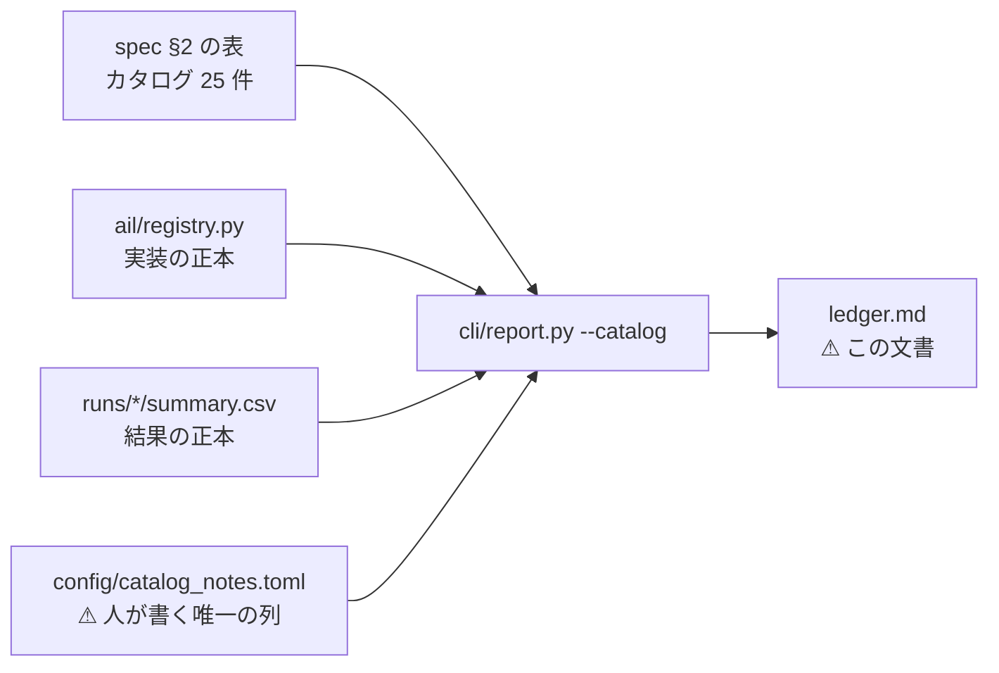
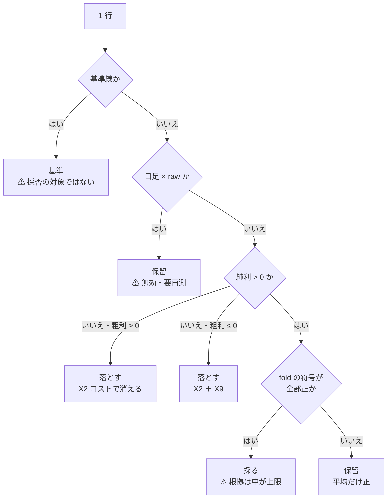

# 試した分析手法の台帳

⚠ **このファイルは生成物である。手で書き換えない。**

```bash
cd experiments/feature-discovery
./.venv/bin/python -m cli.report --catalog \
  > ../../docs/specs/experiments/feature-discovery/ledger.md
```

生成日 2026-09-19 ／ 入口: [feature-discovery.md](../feature-discovery.md) ／ 規約: [rules.md](rules.md) ／ 手法のカタログ: [feature-discovery.md §2](../feature-discovery.md#2-特徴量を見つけ出す手法のカタログphase-25-系統-25-件)

> ⚠ **これは投資助言ではなく調査資料である。** 特定の銘柄・売買を推奨しない。
> ⚠ **数字はすべて【実測】**（自前の検証で出したもの）。⚠ **良い数字は根拠「中」が上限**で、デフレーテッド SR とパージ CV を通していないものは報告しない（[rules.md 11 章](rules.md)）。

> この図の主張: ⚠ **台帳は 3 つの正本を突き合わせた生成物である。** 手で書き写す欄はひとつも無い。



## 0. ここまでの一言

⚠ **カタログ 26 件のうち、実装したのは 23 件、実際に回したのは 23 件。** 残り 3 件は**未実施**である（§3）。

⚠ **試行は 622 行（手法）＋ 398 行（基準線）。** ⚠ **「採る」は 0 件。** 落とす 543 行 ／ 保留 79 行。

⚠ **保留の内訳**: 無効・要再測（日足 × `raw`）が 27 行 ／ ⚠ **純利は正だが fold の符号が割れる**ものが 52 行。⚠ **後者は「採る」の一歩手前ではない。** ⚠ **多重検定を通していない良い数字である**（[rules.md 11 章](rules.md) 規約 2・3）。

⚠ **保留のうち 77 行は「閉じる」の注記つき**（再測しない。理由は各行の理由列と [validation-power.md §6-2](validation-power.md)。検出限界の 2 桁下で、この物差しでは白黒つかない大きさ。⚠ **判定の列は変えない** — [rules.md 14 章](rules.md)）。

| 何を聞かれたら | この台帳のどこで答えるか |
| --- | --- |
| その手法は試したか | §2 に行があるか。無ければ §3 に「未実施」で載っている |
| なぜ落としたか | §2 の「判定」と「理由」（⚠ **落ちた理由は E8 の失敗の型 X1〜X12 で書く**） |
| その数字はどの実行のものか | §2 の「実行」→ §4 の一覧（層・行数・種・commit・入力の指紋） |
| ⚠ **次に何を試すか** | §3。⚠ **手間の小さい順に並べてあり、上から読めば決まる** |

⚠ **多重検定に使う `n_trials` は 622**（= 試行の行数。基準線 398 行は数えない。⚠ **「全部使う × Ridge 以外のモデル」はモデルが処置なので試行として数える** — [plans/archive/gpu-models.md §3-4](../../../plans/archive/gpu-models.md)）。⚠ **[rules.md 11 章](rules.md) の規約 4 は「手法 × 粒度 × 地平 × 銘柄集合」を全部数えることを求める。この数を数え落とすと必ず甘くなる。**

## 1. 台帳の読み方

単位（実行 → 手法 → 試行 → fold → セル）の関係は [units.md](units.md) に図解がある（初見はそちらを先に読む）。

⚠ **1 行 = 1 回の試行。** 鍵は **手法 × モデル × 粒度 × 地平 × 特徴量の層 × データの層 × 期間 × 検証方式 × 形式 × 較正 × 閾値** である（[利用者の指示](../../../plans/archive/feature-discovery-ledger.md)。⚠ **モデルは 2026-09-09 に鍵へ足した** — それまでは Ridge 1 本。⚠ **検証方式・形式・閾値は 2026-09-10 に足した** — 旧実行は（毎日往復・共通・—）として読むので既存の行は割れない。[rules.md 13-9](rules.md)。⚠ **期間は 2026-09-11 に足し、2026-09-12 に記録の無い実行へも遡って当てた**（利用者の決定。[rules.md 14-4](rules.md)） — ⚠ **39 行が割れて 94 → 139 試行**になった。⚠ **数字は 1 つも再計算していない**: 代表 1 本に隠れていた実行が表に出ただけである。⚠ **較正は 2026-09-12 に足した** — Platt の数値解が止まっていた不具合の処置で、⚠ **既存の実行は記録を持たないので全部「旧」に寄り、行はどれも割れない**（[rules.md 13-2](rules.md) の 6））。
⚠ **手法ごとに 1 行にすると潰れる。** 同じ手法を条件違いで何度も試すためである。

| 列 | 中身 | ⚠ 読むときの注意 |
| --- | --- | --- |
| 実装 | `ail/registry.py` に在るか | ⚠ **無いものは「効かない」ではなく「試していない」** |
| 層 | データの層（`raw` / `adjusted`） | ⚠ **日足の `raw` は分割調整の誤りを含む＝ 無効**（[§6-3](../feature-discovery.md)） |
| 期間 | 使った表の開始日（その実行が読んだ表の最古の日） | ⚠ **開始日が違えば別の試行**（同じ鍵にまとめると期間差が「再現の幅」に化ける）。実行が記録していなければ表の実物から遡って読む。⚠ **「—」は遡れなかったという意味** — 表が消えている・行数が実行の記録と合わない（＝ 作り直された表）・行数の記録が無い（[rules.md 14-4](rules.md)） |
| 本数 | 選んだ特徴量の本数（fold の平均） | 絞るほど良いとは限らない |
| 的中率 | 符号が当たった割合 | ⚠ **株は上がる日が多い。** 基準「常に上」と必ず比べる |
| IC | 予測とラベルの相関 | ⚠ **IC が正でも粗利が最下位のことがある**（[§3-3](../feature-discovery.md)） |
| 粗利 bp | コストを引く前の 1 往復 | ⚠ **これだけを見てはいけない** |
| ⚠ **純利 bp** | ⚠ **往復コストを引いた後** | ⚠ **正でなければその手法は使えない**（[rules.md 9 章](rules.md) 規約 6） |
| fold | ⚠ **純利が正だった fold / 全 fold と符号の並び** | ⚠ **平均が正でも符号が割れるなら実力ではない**（[rules.md 11 章](rules.md) 規約 5） |
| 検証方式 | 毎日往復（旧）／ 閾値売買（[rules.md 13 章](rules.md)） | ⚠ **新旧の純利 bp は別の物差しで、直接比べない**（13-8）。閾値売買の純利は fold のポートフォリオ累計 |
| 形式 | 共通（63 銘柄で 1 モデル）／ 銘柄別（銘柄ごとに 1 本） | 閾値売買だけ。違うのは fit の範囲だけ（13-6） |
| 較正 | Platt をどう解いたか。⚠ **旧**（〜2026-09-12。⚠ **数値解が 1 反復で止まっていた**）／ **std**（標準化して解く）／ **—**（較正を通らない＝ 毎日往復） | ⚠ **旧の行の買い% はほぼ定数**（幅 0.00002 点）で、θ を跨がず「ずっと持つ / ずっと休む」に潰れている（[buy-pct-width-collapse.md](../buy-pct-width-collapse.md)）。⚠ **旧行は再計算しない・消さない。回し直した分は別の試行として数える** |
| 閾値 | θ（%）。買い% > θ で建て、売り% > θ で手仕舞う | ⚠ **1 水準 = 1 試行**（13-9）。3 水準とも載せる（良かった閾値だけ報告しない） |
| 再現 | 同じ鍵の実行が何本あり、一致したか | ⚠ **数字が動いたら、まず配線を疑う**（規約 7） |
| 実行 | 出所の実行 ID | §4 で層・種・commit・入力の指紋が引ける |

> この図の主張: ⚠ **判定は数字から機械的に決める。** 手で「良さそう」とは書かない。



| 条件 | 判定 | 型・注記 |
| --- | --- | --- |
| 純利 > 0 かつ fold の符号が全部正 | **採る** | — |
| 純利 > 0 だが fold の符号が割れる | **保留** | ⚠ 平均だけ正（rules.md 11 章 規約 5） |
| 純利 ≤ 0 かつ 粗利 > 0 | **落とす** | **X2** コストで消える |
| 純利 ≤ 0 かつ 粗利 ≤ 0 | **落とす** | **X2 ＋ X9** コスト以前に優位性が無い |
| ⚠ 日足 × データの層が raw | **保留** | ⚠ **無効・要再測**（分割調整の誤り。§6-3） |
| 基準線の行 | **基準** | ⚠ 採否の対象ではない。手法はこれを超えて初めて意味がある |
| 閾値売買: 門を通らない（訓練内 holdout の AUC ＜ 0.52 または 買い% 幅 ＜ 20 点） | **門前** | ⚠ **検証を回さない・n_trials に数えない**（rules.md 14-5） |
| 閾値売買: 上乗せ > 0 かつ fold の上乗せ符号が全部正 | **採る** | ⚠ DSR を通すまでは根拠「中」が上限（rules.md 13-7） |
| 閾値売買: 上乗せ > 0 だが符号が割れる | **保留** | ⚠ 平均だけ正（rules.md 13-7） |
| 閾値売買: 上乗せ ≤ 0 | **落とす** | ⚠ **基準線以下 ＝ 何も学んでいない**（rules.md 13-7） |
| registry に無い | **未実施** | §3 |

⚠ **失敗の型は E8 の台帳と同じもの**（[E8 §6](../e8-signal-methods/failures.md)）。**X2** コストで消える ／ **X9** 標本不足。
⚠ **1 分足の `raw` は保留にしない。** 目盛りの誤りは日足にしか無い（[§3 の注記](../feature-discovery.md)）。

## 2. 台帳（試した結果）

⚠ **1020 行。** うち手法 622 行・基準線 398 行。

| ID | 手法 | 系統 | 実装 | モデル | 層 | 期間 | 粒度 | 地平 | 特徴量の層 | 検証方式 | 形式 | 較正 | 閾値 | 本数 | 的中率 | IC | 粗利bp | 純利bp | fold | 再現 | 判定 | 理由 | 実行 |
| --- | --- | --- | :-: | :-: | :-: | :-: | --- | --- | :-: | :-: | :-: | :-: | ---: | ---: | ---: | ---: | ---: | ---: | --- | --- | :-: | --- | --- |
| — | 乱択（基準） | 基準線 | ✅ | Ridge | adjusted | 1995-02-10 | 日足 | 1 本（1 日） | own cal | 閾値売買 | 共通 | std | 50 | 16.0 | 0.5186 | ＋0.0226 | ＋5770.96 | **＋5384.80** | 3/5 ＋＋−＋− | — | 基準 | ⚠ 採否の対象ではない | `2026-09-19T09-26-46_trade_owncal_1995_ridge_a` |
| F1-7 | 情報係数（IC）の時系列安定性 | F1 フィルタ型 | ✅ | Ridge | adjusted | 1995-02-10 | 日足 | 1 本（1 日） | own | 閾値売買 | 共通 | std | 50 | 16.0 | 0.5189 | ＋0.0223 | ＋6151.03 | **＋5344.35** | 3/5 ＋＋−−＋ | — | **保留** | ⚠ 上乗せの平均だけ正（+728.46bp）。fold の符号が割れる（rules.md 13-7） ／ ⚠ **閉じる（2026-09-16・代表済み）**: 同じ手法の 2018 表の対が「落とす」で実測済み（[selectors-small-four.md](../selectors-small-four.md)）。⚠ **1995 表は fold が 1,267〜1,324 日で上乗せの桁が違う**ので直接比べない（rules.md 14-4） | `2026-09-12T20-39-38_sel_small4_1995` |
| — | 乱択（基準） | 基準線 | ✅ | Ridge | adjusted | 1995-08-31 | 日足 | 1 本（1 日） | own trend | 閾値売買 | 共通 | std | 50 | 16.0 | 0.5194 | ＋0.0281 | ＋5658.98 | **＋5258.51** | 2/5 ＋＋−0− | — | 基準 | ⚠ 採否の対象ではない | `2026-09-17T17-25-38_trade_owntrend_1995_ridge_a` |
| F2-2 | 再帰的特徴量削減（RFE・SVM-RFE） | F2 ラッパー型 | ✅ | Ridge | adjusted | 1995-02-10 | 日足 | 1 本（1 日） | own | 閾値売買 | 共通 | std | 50 | 16.0 | 0.5192 | ＋0.0236 | ＋5790.71 | **＋5194.00** | 3/5 ＋＋−−＋ | — | **保留** | ⚠ 上乗せの平均だけ正（+578.12bp）。fold の符号が割れる（rules.md 13-7） ／ ⚠ **閉じる（2026-09-16・代表済み）**: 同じ手法の 2018 表の対が「落とす」で実測済み（[selectors-small-four.md](../selectors-small-four.md)）。⚠ **1995 表は fold が 1,267〜1,324 日で上乗せの桁が違う**ので直接比べない（rules.md 14-4） | `2026-09-12T20-39-38_sel_small4_1995` |
| F2-2 | 再帰的特徴量削減（RFE・SVM-RFE） | F2 ラッパー型 | ✅ | Ridge | adjusted | 1995-02-10 | 日足 | 1 本（1 日） | own | 閾値売買 | 共通 | 旧 | 50 | 16.0 | 0.5180 | ＋0.0237 | ＋5290.95 | **＋5143.31** | 1/5 ＋0000 | — | **保留** | ⚠ 上乗せの平均だけ正（+527.42bp）。fold の符号が割れる（rules.md 13-7） ／ ⚠ **閉じる（2026-09-16・代表済み）**: 同じ手法の 2018 表の対が「落とす」で実測済み（[selectors-small-four.md](../selectors-small-four.md)）。⚠ **1995 表は fold が 1,267〜1,324 日で上乗せの桁が違う**ので直接比べない（rules.md 14-4） | `2026-09-12T19-53-59_sel_small4_1995` |
| — | 全部使う（基準） | 基準線 | ✅ | Ridge | adjusted | 1995-02-10 | 日足 | 1 本（1 日） | own | 閾値売買 | 共通 | 旧 | 50 | 35.0 | 0.5175 | ＋0.0243 | ＋5111.35 | **＋4999.98** | 1/5 ＋0000 | 3 実行・一致 | **保留** | ⚠ 上乗せの平均だけ正（+384.10bp）。fold の符号が割れる（rules.md 13-7） ／ ⚠ **閉じる（2026-09-16・代表済み）**: 同じ手法の 2018 表の対が「落とす」で実測済み（[selectors-small-four.md](../selectors-small-four.md)）。⚠ **1995 表は fold が 1,267〜1,324 日で上乗せの桁が違う**ので直接比べない（rules.md 14-4） | `2026-09-12T19-53-59_sel_small4_1995` |
| F1-4 | 分散しきい値 | F1 フィルタ型 | ✅ | Ridge | adjusted | 1995-02-10 | 日足 | 1 本（1 日） | own | 閾値売買 | 共通 | 旧 | 50 | 33.0 | 0.5175 | ＋0.0243 | ＋5111.35 | **＋4999.98** | 1/5 ＋0000 | — | **保留** | ⚠ 上乗せの平均だけ正（+384.10bp）。fold の符号が割れる（rules.md 13-7） ／ ⚠ **閉じる（2026-09-16・代表済み）**: 同じ手法の 2018 表の対が「落とす」で実測済み（[selectors-small-four.md](../selectors-small-four.md)）。⚠ **1995 表は fold が 1,267〜1,324 日で上乗せの桁が違う**ので直接比べない（rules.md 14-4） | `2026-09-12T19-53-59_sel_small4_1995` |
| — | 乱択（基準） | 基準線 | ✅ | Ridge | adjusted | 1995-02-10 | 日足 | 1 本（1 日） | own | 閾値売買 | 共通 | std | 50 | 16.0 | 0.5167 | ＋0.0211 | ＋4837.67 | **＋4806.56** | 3/5 ＋＋−−＋ | 2 実行・一致 | 基準 | ⚠ 採否の対象ではない | `2026-09-12T20-40-06_trade_own_1995_ridge_a` |
| — | 全部使う（基準） | 基準線 | ✅ | Ridge | adjusted | 1995-02-10 | 日足 | 1 本（1 日） | own cal | 閾値売買 | 共通 | std | 50 | 41.0 | 0.5172 | ＋0.0240 | ＋5415.85 | **＋4794.27** | 3/5 ＋＋−−＋ | — | **保留** | ⚠ 上乗せの平均だけ正（+178.38bp）。fold の符号が割れる（rules.md 13-7） | `2026-09-19T09-26-46_trade_owncal_1995_ridge_a` |
| — | 常に上（ドリフト） | 基準線 | ✅ | — | adjusted | 1995-08-31 | 日足 | 1 本（1 日） | own trend | 閾値売買 | 共通 | std | 50 | 0.0 | 0.5164 | 0.0000 | ＋4629.99 | **＋4624.84** | 0/5 00000 | ⚠ **3 実行・幅 404.63bp** | 基準 | ⚠ 新方式では期初買い・期末売り（B&H）。上乗せの基準 | `2026-09-17T17-25-38_trade_owntrend_1995_ridge_a` |
| — | 常に上（ドリフト） | 基準線 | ✅ | — | adjusted | 1995-08-31 | 日足 | 1 本（1 日） | own trend | 閾値売買 | 共通 | std | 55 | 0.0 | 0.5164 | 0.0000 | ＋4629.99 | **＋4624.84** | 0/5 00000 | ⚠ **3 実行・幅 404.63bp** | 基準 | ⚠ 新方式では期初買い・期末売り（B&H）。上乗せの基準 | `2026-09-17T17-25-38_trade_owntrend_1995_ridge_a` |
| — | 常に上（ドリフト） | 基準線 | ✅ | — | adjusted | 1995-08-31 | 日足 | 1 本（1 日） | own trend | 閾値売買 | 共通 | std | 60 | 0.0 | 0.5164 | 0.0000 | ＋4629.99 | **＋4624.84** | 0/5 00000 | ⚠ **3 実行・幅 404.63bp** | 基準 | ⚠ 新方式では期初買い・期末売り（B&H）。上乗せの基準 | `2026-09-17T17-25-38_trade_owntrend_1995_ridge_a` |
| — | 常に上（ドリフト） | 基準線 | ✅ | — | adjusted | 1995-08-31 | 日足 | 1 本（1 日） | own trend trendvol | 閾値売買 | 共通 | std | 50 | 0.0 | 0.5164 | 0.0000 | ＋4626.29 | **＋4621.12** | 0/5 00000 | — | 基準 | ⚠ 新方式では期初買い・期末売り（B&H）。上乗せの基準 | `2026-09-17T17-26-18_trade_owntrendvol_1995_ridge_a` |
| — | 常に上（ドリフト） | 基準線 | ✅ | — | adjusted | 1995-08-31 | 日足 | 1 本（1 日） | own trend trendvol | 閾値売買 | 共通 | std | 60 | 0.0 | 0.5164 | 0.0000 | ＋4626.29 | **＋4621.12** | 0/5 00000 | — | 基準 | ⚠ 新方式では期初買い・期末売り（B&H）。上乗せの基準 | `2026-09-17T17-26-18_trade_owntrendvol_1995_ridge_a` |
| — | 常に上（ドリフト） | 基準線 | ✅ | — | adjusted | 1995-08-31 | 日足 | 1 本（1 日） | own trend trendvol | 閾値売買 | 共通 | std | 55 | 0.0 | 0.5164 | 0.0000 | ＋4626.29 | **＋4621.12** | 0/5 00000 | — | 基準 | ⚠ 新方式では期初買い・期末売り（B&H）。上乗せの基準 | `2026-09-17T17-26-18_trade_owntrendvol_1995_ridge_a` |
| — | 常に上（ドリフト） | 基準線 | ✅ | — | adjusted | 1995-02-10 | 日足 | 1 本（1 日） | own | 閾値売買 | 共通 | 旧 | 60 | 0.0 | 0.5158 | 0.0000 | ＋4621.04 | **＋4615.89** | 0/5 00000 | 4 実行・一致 | 基準 | ⚠ 新方式では期初買い・期末売り（B&H）。上乗せの基準 | `2026-09-12T19-54-41_pca_1995` |
| — | 常に上（ドリフト） | 基準線 | ✅ | — | adjusted | 1995-02-10 | 日足 | 1 本（1 日） | own | 閾値売買 | 共通 | 旧 | 50 | 0.0 | 0.5158 | 0.0000 | ＋4621.04 | **＋4615.89** | 0/5 00000 | 4 実行・一致 | 基準 | ⚠ 新方式では期初買い・期末売り（B&H）。上乗せの基準 | `2026-09-12T19-54-41_pca_1995` |
| — | 常に上（ドリフト） | 基準線 | ✅ | — | adjusted | 1995-02-10 | 日足 | 1 本（1 日） | own | 閾値売買 | 共通 | 旧 | 55 | 0.0 | 0.5158 | 0.0000 | ＋4621.04 | **＋4615.89** | 0/5 00000 | 4 実行・一致 | 基準 | ⚠ 新方式では期初買い・期末売り（B&H）。上乗せの基準 | `2026-09-12T19-54-41_pca_1995` |
| — | 常に上（ドリフト） | 基準線 | ✅ | — | adjusted | 1995-02-10 | 日足 | 1 本（1 日） | own | 閾値売買 | 共通 | std | 55 | 0.0 | 0.5158 | 0.0000 | ＋4621.04 | **＋4615.89** | 0/5 00000 | 3 実行・一致 | 基準 | ⚠ 新方式では期初買い・期末売り（B&H）。上乗せの基準 | `2026-09-12T20-40-06_trade_own_1995_ridge_a` |
| — | 常に上（ドリフト） | 基準線 | ✅ | — | adjusted | 1995-02-10 | 日足 | 1 本（1 日） | own | 閾値売買 | 共通 | std | 50 | 0.0 | 0.5158 | 0.0000 | ＋4621.04 | **＋4615.89** | 0/5 00000 | 3 実行・一致 | 基準 | ⚠ 新方式では期初買い・期末売り（B&H）。上乗せの基準 | `2026-09-12T20-40-06_trade_own_1995_ridge_a` |
| — | 常に上（ドリフト） | 基準線 | ✅ | — | adjusted | 1995-02-10 | 日足 | 1 本（1 日） | own | 閾値売買 | 共通 | std | 60 | 0.0 | 0.5158 | 0.0000 | ＋4621.04 | **＋4615.89** | 0/5 00000 | 3 実行・一致 | 基準 | ⚠ 新方式では期初買い・期末売り（B&H）。上乗せの基準 | `2026-09-12T20-40-06_trade_own_1995_ridge_a` |
| — | 常に上（ドリフト） | 基準線 | ✅ | — | adjusted | 1995-02-10 | 日足 | 1 本（1 日） | own cal | 閾値売買 | 共通 | std | 50 | 0.0 | 0.5158 | 0.0000 | ＋4621.04 | **＋4615.89** | 0/5 00000 | — | 基準 | ⚠ 新方式では期初買い・期末売り（B&H）。上乗せの基準 | `2026-09-19T09-26-46_trade_owncal_1995_ridge_a` |
| — | 常に上（ドリフト） | 基準線 | ✅ | — | adjusted | 1995-02-10 | 日足 | 1 本（1 日） | own cal | 閾値売買 | 共通 | std | 55 | 0.0 | 0.5158 | 0.0000 | ＋4621.04 | **＋4615.89** | 0/5 00000 | — | 基準 | ⚠ 新方式では期初買い・期末売り（B&H）。上乗せの基準 | `2026-09-19T09-26-46_trade_owncal_1995_ridge_a` |
| — | 常に上（ドリフト） | 基準線 | ✅ | — | adjusted | 1995-02-10 | 日足 | 1 本（1 日） | own cal | 閾値売買 | 共通 | std | 60 | 0.0 | 0.5158 | 0.0000 | ＋4621.04 | **＋4615.89** | 0/5 00000 | — | 基準 | ⚠ 新方式では期初買い・期末売り（B&H）。上乗せの基準 | `2026-09-19T09-26-46_trade_owncal_1995_ridge_a` |
| — | 全部使う（基準） | 基準線 | ✅ | Ridge | adjusted | 1995-02-10 | 日足 | 1 本（1 日） | own | 閾値売買 | 共通 | std | 50 | 35.0 | 0.5160 | ＋0.0242 | ＋5248.99 | **＋4611.49** | 3/5 ＋＋−−＋ | 2 実行・一致 | **落とす** | ⚠ **基準線以下 ＝ 何も学んでいない**（対 B&H 上乗せ -4.39bp ≤ 0。rules.md 13-7） | `2026-09-12T20-40-06_trade_own_1995_ridge_a` |
| F1-4 | 分散しきい値 | F1 フィルタ型 | ✅ | Ridge | adjusted | 1995-02-10 | 日足 | 1 本（1 日） | own | 閾値売買 | 共通 | std | 50 | 33.0 | 0.5160 | ＋0.0242 | ＋5248.99 | **＋4611.49** | 3/5 ＋＋−−＋ | — | **落とす** | ⚠ **基準線以下 ＝ 何も学んでいない**（対 B&H 上乗せ -4.39bp ≤ 0。rules.md 13-7） | `2026-09-12T20-39-38_sel_small4_1995` |
| — | 乱択（基準） | 基準線 | ✅ | Ridge | adjusted | 1995-02-10 | 日足 | 1 本（1 日） | own | 閾値売買 | 共通 | 旧 | 50 | 16.0 | 0.5162 | ＋0.0211 | ＋4557.87 | **＋4553.80** | 0/5 −0000 | 3 実行・一致 | 基準 | ⚠ 採否の対象ではない | `2026-09-12T19-53-59_sel_small4_1995` |
| F1-7 | 情報係数（IC）の時系列安定性 | F1 フィルタ型 | ✅ | Ridge | adjusted | 1995-02-10 | 日足 | 1 本（1 日） | own | 閾値売買 | 共通 | 旧 | 50 | 16.0 | 0.5162 | ＋0.0223 | ＋4557.87 | **＋4553.80** | 0/5 −0000 | — | **落とす** | ⚠ **基準線以下 ＝ 何も学んでいない**（対 B&H 上乗せ -62.09bp ≤ 0。rules.md 13-7） | `2026-09-12T19-53-59_sel_small4_1995` |
| F5-1 | PCA・主成分 | F5 表現学習型 | ✅ | Ridge | adjusted | 1995-02-10 | 日足 | 1 本（1 日） | own | 閾値売買 | 共通 | 旧 | 50 | 16.0 | 0.5162 | ＋0.0174 | ＋4557.87 | **＋4553.80** | 0/5 −0000 | — | **落とす** | ⚠ **基準線以下 ＝ 何も学んでいない**（対 B&H 上乗せ -62.09bp ≤ 0。rules.md 13-7） | `2026-09-12T19-54-41_pca_1995` |
| — | 全部使う（基準） | 基準線 | ✅ | Ridge | adjusted | 1995-08-31 | 日足 | 1 本（1 日） | own trend trendvol | 閾値売買 | 共通 | std | 50 | 65.0 | 0.5163 | ＋0.0233 | ＋5009.06 | **＋4508.73** | 3/5 ＋＋−−＋ | — | **落とす** | ⚠ **基準線以下 ＝ 何も学んでいない**（対 B&H 上乗せ -112.39bp ≤ 0。rules.md 13-7） | `2026-09-17T17-26-18_trade_owntrendvol_1995_ridge_a` |
| F5-1 | PCA・主成分 | F5 表現学習型 | ✅ | Ridge | adjusted | 1995-02-10 | 日足 | 1 本（1 日） | own | 閾値売買 | 共通 | std | 50 | 16.0 | 0.5139 | ＋0.0174 | ＋5030.18 | **＋4466.49** | 2/5 ＋＋−−− | — | **落とす** | ⚠ **基準線以下 ＝ 何も学んでいない**（対 B&H 上乗せ -149.40bp ≤ 0。rules.md 13-7） | `2026-09-12T20-39-58_pca_1995` |
| — | 全部使う（基準） | 基準線 | ✅ | Ridge | adjusted | 1995-08-31 | 日足 | 1 本（1 日） | own trend | 閾値売買 | 共通 | std | 50 | 53.0 | 0.5163 | ＋0.0239 | ＋4909.03 | **＋4374.72** | 3/5 ＋＋−−＋ | — | **落とす** | ⚠ **基準線以下 ＝ 何も学んでいない**（対 B&H 上乗せ -250.12bp ≤ 0。rules.md 13-7） | `2026-09-17T17-25-38_trade_owntrend_1995_ridge_a` |
| — | D2 中期ゲート（60日・学習） | 検知器 | ✅ | Ridge | adjusted | 1995-08-31 | 日足 | 1 本（1 日） | own trend | 閾値売買 | 共通 | 旧 | 55 | 6.0 | 0.5159 | −0.0038 | ＋4329.80 | **＋4321.47** | 3/5 ＋−＋0＋ | — | **保留** | ⚠ 上乗せの平均だけ正（+101.26bp）。fold の符号が割れる（rules.md 13-7） ／ ⚠ **閉じる（2026-09-16・軸を閉じた）**: 検知器（D 系）の軸は 2026-09-13 に閉じた。⚠ **検定できる器で測ったら同じ保有日率の乱択ゲートに負けた**（[theta-placement.md §6-1](../theta-placement.md)）【実測】。⚠ **再測しても物差しが変わらない** | `2026-09-12T15-15-12_trend_scales_1995` |
| — | D2 中期ゲート（60日・学習） | 検知器 | ✅ | Ridge | adjusted | 1995-08-31 | 日足 | 1 本（1 日） | own trend | 閾値売買 | 共通 | std | 55 | 6.0 | 0.5159 | −0.0038 | ＋4329.10 | **＋4320.78** | 3/5 ＋−＋0＋ | — | **保留** | ⚠ 上乗せの平均だけ正（+100.57bp）。fold の符号が割れる（rules.md 13-7） ／ ⚠ **閉じる（2026-09-16・軸を閉じた）**: 検知器（D 系）の軸は 2026-09-13 に閉じた。⚠ **検定できる器で測ったら同じ保有日率の乱択ゲートに負けた**（[theta-placement.md §6-1](../theta-placement.md)）【実測】。⚠ **再測しても物差しが変わらない** | `2026-09-12T20-40-14_trend_scales_1995` |
| — | D4 合成ゲート（3スケール平均） | 検知器 | ✅ | Ridge | adjusted | 1995-08-31 | 日足 | 1 本（1 日） | own trend | 閾値売買 | 共通 | 旧 | 50 | 18.0 | 0.5163 | −0.0033 | ＋4278.29 | **＋4260.06** | 2/5 ＋＋000 | — | **保留** | ⚠ 上乗せの平均だけ正（+39.85bp）。fold の符号が割れる（rules.md 13-7） ／ ⚠ **閉じる（2026-09-16・軸を閉じた）**: 検知器（D 系）の軸は 2026-09-13 に閉じた。⚠ **検定できる器で測ったら同じ保有日率の乱択ゲートに負けた**（[theta-placement.md §6-1](../theta-placement.md)）【実測】。⚠ **再測しても物差しが変わらない** | `2026-09-12T15-15-12_trend_scales_1995` |
| — | 入口D3(200)×出口D1(20)（学習） | 検知器 | ✅ | Ridge | adjusted | 1995-08-31 | 日足 | 1 本（1 日） | own trend | 閾値売買 | 共通 | 旧 | 50 | 12.0 | 0.5154 | −0.0013 | ＋4254.90 | **＋4249.77** | 1/5 ＋−000 | — | **保留** | ⚠ 上乗せの平均だけ正（+29.56bp）。fold の符号が割れる（rules.md 13-7） ／ ⚠ **閉じる（2026-09-16・軸を閉じた）**: 検知器（D 系）の軸は 2026-09-13 に閉じた。⚠ **検定できる器で測ったら同じ保有日率の乱択ゲートに負けた**（[theta-placement.md §6-1](../theta-placement.md)）【実測】。⚠ **再測しても物差しが変わらない** | `2026-09-12T18-39-58_trend_pairs_1995` |
| — | 入口D3(200)×出口D1(20)（学習） | 検知器 | ✅ | Ridge | adjusted | 1995-08-31 | 日足 | 1 本（1 日） | own trend | 閾値売買 | 共通 | std | 50 | 12.0 | 0.5154 | −0.0040 | ＋4245.50 | **＋4239.99** | 1/5 ＋−0−0 | — | **保留** | ⚠ 上乗せの平均だけ正（+19.78bp）。fold の符号が割れる（rules.md 13-7） ／ ⚠ **閉じる（2026-09-16・軸を閉じた）**: 検知器（D 系）の軸は 2026-09-13 に閉じた。⚠ **検定できる器で測ったら同じ保有日率の乱択ゲートに負けた**（[theta-placement.md §6-1](../theta-placement.md)）【実測】。⚠ **再測しても物差しが変わらない** | `2026-09-12T20-40-37_trend_pairs_1995` |
| — | D4 合成ゲート（3スケール平均） | 検知器 | ✅ | Ridge | adjusted | 1995-08-31 | 日足 | 1 本（1 日） | own trend | 閾値売買 | 共通 | std | 55 | 18.0 | 0.5162 | −0.0014 | ＋4244.86 | **＋4239.48** | 1/5 ＋−000 | — | **保留** | ⚠ 上乗せの平均だけ正（+19.28bp）。fold の符号が割れる（rules.md 13-7） ／ ⚠ **閉じる（2026-09-16・軸を閉じた）**: 検知器（D 系）の軸は 2026-09-13 に閉じた。⚠ **検定できる器で測ったら同じ保有日率の乱択ゲートに負けた**（[theta-placement.md §6-1](../theta-placement.md)）【実測】。⚠ **再測しても物差しが変わらない** | `2026-09-12T20-40-14_trend_scales_1995` |
| — | D4 合成ゲート（3スケール平均） | 検知器 | ✅ | Ridge | adjusted | 1995-08-31 | 日足 | 1 本（1 日） | own trend | 閾値売買 | 共通 | std | 50 | 18.0 | 0.5162 | −0.0014 | ＋4252.51 | **＋4234.94** | 2/5 ＋＋000 | — | **保留** | ⚠ 上乗せの平均だけ正（+14.73bp）。fold の符号が割れる（rules.md 13-7） ／ ⚠ **閉じる（2026-09-16・軸を閉じた）**: 検知器（D 系）の軸は 2026-09-13 に閉じた。⚠ **検定できる器で測ったら同じ保有日率の乱択ゲートに負けた**（[theta-placement.md §6-1](../theta-placement.md)）【実測】。⚠ **再測しても物差しが変わらない** | `2026-09-12T20-40-14_trend_scales_1995` |
| — | D4 合成ゲート（3スケール平均） | 検知器 | ✅ | Ridge | adjusted | 1995-08-31 | 日足 | 1 本（1 日） | own trend | 閾値売買 | 共通 | 旧 | 55 | 18.0 | 0.5163 | −0.0033 | ＋4236.07 | **＋4230.78** | 1/5 ＋−000 | — | **保留** | ⚠ 上乗せの平均だけ正（+10.57bp）。fold の符号が割れる（rules.md 13-7） ／ ⚠ **閉じる（2026-09-16・軸を閉じた）**: 検知器（D 系）の軸は 2026-09-13 に閉じた。⚠ **検定できる器で測ったら同じ保有日率の乱択ゲートに負けた**（[theta-placement.md §6-1](../theta-placement.md)）【実測】。⚠ **再測しても物差しが変わらない** | `2026-09-12T15-15-12_trend_scales_1995` |
| — | 入口D2(60)×出口D1(20)（学習） | 検知器 | ✅ | Ridge | adjusted | 1995-08-31 | 日足 | 1 本（1 日） | own trend | 閾値売買 | 共通 | 旧 | 55 | 12.0 | 0.5159 | −0.0038 | ＋4233.81 | **＋4228.64** | 2/5 ＋−＋00 | — | **保留** | ⚠ 上乗せの平均だけ正（+8.44bp）。fold の符号が割れる（rules.md 13-7） ／ ⚠ **閉じる（2026-09-16・軸を閉じた）**: 検知器（D 系）の軸は 2026-09-13 に閉じた。⚠ **検定できる器で測ったら同じ保有日率の乱択ゲートに負けた**（[theta-placement.md §6-1](../theta-placement.md)）【実測】。⚠ **再測しても物差しが変わらない** | `2026-09-12T18-39-58_trend_pairs_1995` |
| — | D1 短期ゲート（20日・学習） | 検知器 | ✅ | Ridge | adjusted | 1995-08-31 | 日足 | 1 本（1 日） | own trend | 閾値売買 | 共通 | std | 50 | 6.0 | 0.5162 | ＋0.0018 | ＋4232.01 | **＋4226.52** | 2/5 0＋0＋0 | — | **保留** | ⚠ 上乗せの平均だけ正（+6.32bp）。fold の符号が割れる（rules.md 13-7） ／ ⚠ **閉じる（2026-09-16・軸を閉じた）**: 検知器（D 系）の軸は 2026-09-13 に閉じた。⚠ **検定できる器で測ったら同じ保有日率の乱択ゲートに負けた**（[theta-placement.md §6-1](../theta-placement.md)）【実測】。⚠ **再測しても物差しが変わらない** | `2026-09-12T20-40-14_trend_scales_1995` |
| — | 入口D2(60)×出口D1(20)（学習） | 検知器 | ✅ | Ridge | adjusted | 1995-08-31 | 日足 | 1 本（1 日） | own trend | 閾値売買 | 共通 | std | 55 | 12.0 | 0.5159 | −0.0038 | ＋4230.57 | **＋4225.35** | 2/5 ＋−＋−0 | — | **保留** | ⚠ 上乗せの平均だけ正（+5.14bp）。fold の符号が割れる（rules.md 13-7） ／ ⚠ **閉じる（2026-09-16・軸を閉じた）**: 検知器（D 系）の軸は 2026-09-13 に閉じた。⚠ **検定できる器で測ったら同じ保有日率の乱択ゲートに負けた**（[theta-placement.md §6-1](../theta-placement.md)）【実測】。⚠ **再測しても物差しが変わらない** | `2026-09-12T20-40-37_trend_pairs_1995` |
| — | 常に上（ドリフト） | 基準線 | ✅ | — | adjusted | 1995-08-31 | 日足 | 1 本（1 日） | own trend | 閾値売買 | 共通 | 旧 | 50 | 0.0 | 0.5162 | 0.0000 | ＋4225.38 | **＋4220.21** | 0/5 00000 | 2 実行・一致 | 基準 | ⚠ 新方式では期初買い・期末売り（B&H）。上乗せの基準 | `2026-09-12T18-39-58_trend_pairs_1995` |
| — | D1 短期ゲート（20日・学習） | 検知器 | ✅ | Ridge | adjusted | 1995-08-31 | 日足 | 1 本（1 日） | own trend | 閾値売買 | 共通 | 旧 | 50 | 6.0 | 0.5162 | ＋0.0210 | ＋4225.38 | **＋4220.21** | 0/5 00000 | — | **落とす** | ⚠ **基準線以下 ＝ 何も学んでいない**（対 B&H 上乗せ +0.00bp ≤ 0。rules.md 13-7） | `2026-09-12T15-15-12_trend_scales_1995` |
| — | 常に上（ドリフト） | 基準線 | ✅ | — | adjusted | 1995-08-31 | 日足 | 1 本（1 日） | own trend | 閾値売買 | 共通 | 旧 | 55 | 0.0 | 0.5162 | 0.0000 | ＋4225.38 | **＋4220.21** | 0/5 00000 | 2 実行・一致 | 基準 | ⚠ 新方式では期初買い・期末売り（B&H）。上乗せの基準 | `2026-09-12T18-39-58_trend_pairs_1995` |
| — | 常に上（ドリフト） | 基準線 | ✅ | — | adjusted | 1995-08-31 | 日足 | 1 本（1 日） | own trend | 閾値売買 | 共通 | 旧 | 60 | 0.0 | 0.5162 | 0.0000 | ＋4225.38 | **＋4220.21** | 0/5 00000 | 2 実行・一致 | 基準 | ⚠ 新方式では期初買い・期末売り（B&H）。上乗せの基準 | `2026-09-12T18-39-58_trend_pairs_1995` |
| — | D1 短期ゲート（20日・学習） | 検知器 | ✅ | Ridge | adjusted | 1995-08-31 | 日足 | 1 本（1 日） | own trend | 閾値売買 | 共通 | 旧 | 55 | 6.0 | 0.5162 | ＋0.0210 | ＋4225.38 | **＋4220.21** | 0/5 00000 | — | **落とす** | ⚠ **基準線以下 ＝ 何も学んでいない**（対 B&H 上乗せ +0.00bp ≤ 0。rules.md 13-7） | `2026-09-12T15-15-12_trend_scales_1995` |
| — | 入口D2(60)×出口D1(20)（学習） | 検知器 | ✅ | Ridge | adjusted | 1995-08-31 | 日足 | 1 本（1 日） | own trend | 閾値売買 | 共通 | std | 50 | 12.0 | 0.5159 | −0.0038 | ＋4225.05 | **＋4219.53** | 1/5 −＋0−0 | — | **落とす** | ⚠ **基準線以下 ＝ 何も学んでいない**（対 B&H 上乗せ -0.68bp ≤ 0。rules.md 13-7） | `2026-09-12T20-40-37_trend_pairs_1995` |
| — | 入口D2(60)×出口D1(20)（学習） | 検知器 | ✅ | Ridge | adjusted | 1995-08-31 | 日足 | 1 本（1 日） | own trend | 閾値売買 | 共通 | 旧 | 50 | 12.0 | 0.5159 | −0.0038 | ＋4220.31 | **＋4215.13** | 1/5 −＋000 | — | **落とす** | ⚠ **基準線以下 ＝ 何も学んでいない**（対 B&H 上乗せ -5.07bp ≤ 0。rules.md 13-7） | `2026-09-12T18-39-58_trend_pairs_1995` |
| — | D1 短期ゲート（20日・学習） | 検知器 | ✅ | Ridge | adjusted | 1995-08-31 | 日足 | 1 本（1 日） | own trend | 閾値売買 | 共通 | std | 55 | 6.0 | 0.5162 | ＋0.0018 | ＋4220.20 | **＋4214.99** | 1/5 0−0＋0 | — | **落とす** | ⚠ **基準線以下 ＝ 何も学んでいない**（対 B&H 上乗せ -5.21bp ≤ 0。rules.md 13-7） | `2026-09-12T20-40-14_trend_scales_1995` |
| — | 入口D2(60)×出口D3(200)（学習） | 検知器 | ✅ | Ridge | adjusted | 1995-08-31 | 日足 | 1 本（1 日） | own trend | 閾値売買 | 共通 | std | 55 | 12.0 | 0.5159 | −0.0038 | ＋4245.43 | **＋4197.65** | 1/5 −＋−00 | — | **落とす** | ⚠ **基準線以下 ＝ 何も学んでいない**（対 B&H 上乗せ -22.56bp ≤ 0。rules.md 13-7） | `2026-09-12T20-40-37_trend_pairs_1995` |
| — | 入口D2(60)×出口D3(200)（学習） | 検知器 | ✅ | Ridge | adjusted | 1995-08-31 | 日足 | 1 本（1 日） | own trend | 閾値売買 | 共通 | 旧 | 55 | 12.0 | 0.5159 | −0.0038 | ＋4243.63 | **＋4195.91** | 1/5 −＋−00 | — | **落とす** | ⚠ **基準線以下 ＝ 何も学んでいない**（対 B&H 上乗せ -24.29bp ≤ 0。rules.md 13-7） | `2026-09-12T18-39-58_trend_pairs_1995` |
| — | 入口D3(200)×出口D1(20)（学習） | 検知器 | ✅ | Ridge | adjusted | 1995-08-31 | 日足 | 1 本（1 日） | own trend | 閾値売買 | 共通 | 旧 | 60 | 12.0 | 0.5154 | −0.0013 | ＋4197.43 | **＋4192.47** | 1/5 ＋−000 | — | **落とす** | ⚠ **基準線以下 ＝ 何も学んでいない**（対 B&H 上乗せ -27.74bp ≤ 0。rules.md 13-7） | `2026-09-12T18-39-58_trend_pairs_1995` |
| — | 入口D3(200)×出口D1(20)（学習） | 検知器 | ✅ | Ridge | adjusted | 1995-08-31 | 日足 | 1 本（1 日） | own trend | 閾値売買 | 共通 | std | 60 | 12.0 | 0.5154 | −0.0040 | ＋4193.35 | **＋4188.37** | 1/5 ＋−0−0 | — | **落とす** | ⚠ **基準線以下 ＝ 何も学んでいない**（対 B&H 上乗せ -31.84bp ≤ 0。rules.md 13-7） | `2026-09-12T20-40-37_trend_pairs_1995` |
| — | D3 長期ゲート（200日・学習） | 検知器 | ✅ | Ridge | adjusted | 1995-08-31 | 日足 | 1 本（1 日） | own trend | 閾値売買 | 共通 | std | 60 | 6.0 | 0.5154 | −0.0040 | ＋4169.34 | **＋4164.22** | 1/5 ＋−−00 | — | **落とす** | ⚠ **基準線以下 ＝ 何も学んでいない**（対 B&H 上乗せ -55.98bp ≤ 0。rules.md 13-7） | `2026-09-12T20-40-14_trend_scales_1995` |
| — | 入口D3(200)×出口D2(60)（学習） | 検知器 | ✅ | Ridge | adjusted | 1995-08-31 | 日足 | 1 本（1 日） | own trend | 閾値売買 | 共通 | 旧 | 55 | 12.0 | 0.5154 | −0.0013 | ＋4164.83 | **＋4155.62** | 1/5 −−00＋ | — | **落とす** | ⚠ **基準線以下 ＝ 何も学んでいない**（対 B&H 上乗せ -64.59bp ≤ 0。rules.md 13-7） | `2026-09-12T18-39-58_trend_pairs_1995` |
| — | D3 長期ゲート（200日・学習） | 検知器 | ✅ | Ridge | adjusted | 1995-08-31 | 日足 | 1 本（1 日） | own trend | 閾値売買 | 共通 | 旧 | 60 | 6.0 | 0.5154 | −0.0013 | ＋4160.26 | **＋4155.12** | 1/5 ＋−−00 | — | **落とす** | ⚠ **基準線以下 ＝ 何も学んでいない**（対 B&H 上乗せ -65.09bp ≤ 0。rules.md 13-7） | `2026-09-12T15-15-12_trend_scales_1995` |
| — | 入口D3(200)×出口D2(60)（学習） | 検知器 | ✅ | Ridge | adjusted | 1995-08-31 | 日足 | 1 本（1 日） | own trend | 閾値売買 | 共通 | 旧 | 60 | 12.0 | 0.5154 | −0.0013 | ＋4157.87 | **＋4152.50** | 1/5 −−00＋ | — | **落とす** | ⚠ **基準線以下 ＝ 何も学んでいない**（対 B&H 上乗せ -67.71bp ≤ 0。rules.md 13-7） | `2026-09-12T18-39-58_trend_pairs_1995` |
| — | 入口D3(200)×出口D2(60)（学習） | 検知器 | ✅ | Ridge | adjusted | 1995-08-31 | 日足 | 1 本（1 日） | own trend | 閾値売買 | 共通 | std | 60 | 12.0 | 0.5154 | −0.0040 | ＋4157.02 | **＋4151.66** | 1/5 −−00＋ | — | **落とす** | ⚠ **基準線以下 ＝ 何も学んでいない**（対 B&H 上乗せ -68.55bp ≤ 0。rules.md 13-7） | `2026-09-12T20-40-37_trend_pairs_1995` |
| — | 入口D3(200)×出口D1(20)（学習） | 検知器 | ✅ | Ridge | adjusted | 1995-08-31 | 日足 | 1 本（1 日） | own trend | 閾値売買 | 共通 | 旧 | 55 | 12.0 | 0.5154 | −0.0013 | ＋4153.92 | **＋4148.89** | 0/5 −−000 | — | **落とす** | ⚠ **基準線以下 ＝ 何も学んでいない**（対 B&H 上乗せ -71.32bp ≤ 0。rules.md 13-7） | `2026-09-12T18-39-58_trend_pairs_1995` |
| — | 入口D3(200)×出口D2(60)（学習） | 検知器 | ✅ | Ridge | adjusted | 1995-08-31 | 日足 | 1 本（1 日） | own trend | 閾値売買 | 共通 | std | 55 | 12.0 | 0.5154 | −0.0040 | ＋4156.11 | **＋4146.96** | 1/5 −−00＋ | — | **落とす** | ⚠ **基準線以下 ＝ 何も学んでいない**（対 B&H 上乗せ -73.24bp ≤ 0。rules.md 13-7） | `2026-09-12T20-40-37_trend_pairs_1995` |
| — | 入口D1(20)×出口D2(60)（学習） | 検知器 | ✅ | Ridge | adjusted | 1995-08-31 | 日足 | 1 本（1 日） | own trend | 閾値売買 | 共通 | 旧 | 55 | 12.0 | 0.5162 | ＋0.0210 | ＋4234.94 | **＋4141.01** | 2/5 −＋00＋ | — | **落とす** | ⚠ **基準線以下 ＝ 何も学んでいない**（対 B&H 上乗せ -79.19bp ≤ 0。rules.md 13-7） | `2026-09-12T18-39-58_trend_pairs_1995` |
| — | 入口D3(200)×出口D1(20)（学習） | 検知器 | ✅ | Ridge | adjusted | 1995-08-31 | 日足 | 1 本（1 日） | own trend | 閾値売買 | 共通 | std | 55 | 12.0 | 0.5154 | −0.0040 | ＋4142.31 | **＋4137.23** | 0/5 −−0−0 | — | **落とす** | ⚠ **基準線以下 ＝ 何も学んでいない**（対 B&H 上乗せ -82.98bp ≤ 0。rules.md 13-7） | `2026-09-12T20-40-37_trend_pairs_1995` |
| — | 入口D1(20)×出口D2(60)（学習） | 検知器 | ✅ | Ridge | adjusted | 1995-08-31 | 日足 | 1 本（1 日） | own trend | 閾値売買 | 共通 | std | 55 | 12.0 | 0.5162 | ＋0.0018 | ＋4230.23 | **＋4137.10** | 2/5 −＋00＋ | — | **落とす** | ⚠ **基準線以下 ＝ 何も学んでいない**（対 B&H 上乗せ -83.10bp ≤ 0。rules.md 13-7） | `2026-09-12T20-40-37_trend_pairs_1995` |
| — | D4 合成ゲート（3スケール平均） | 検知器 | ✅ | Ridge | adjusted | 1995-08-31 | 日足 | 1 本（1 日） | own trend | 閾値売買 | 共通 | std | 60 | 18.0 | 0.5162 | −0.0014 | ＋4131.86 | **＋4126.86** | 0/5 −−−00 | — | **落とす** | ⚠ **基準線以下 ＝ 何も学んでいない**（対 B&H 上乗せ -93.35bp ≤ 0。rules.md 13-7） | `2026-09-12T20-40-14_trend_scales_1995` |
| — | D4 合成ゲート（3スケール平均） | 検知器 | ✅ | Ridge | adjusted | 1995-08-31 | 日足 | 1 本（1 日） | own trend | 閾値売買 | 共通 | 旧 | 60 | 18.0 | 0.5163 | −0.0033 | ＋4111.41 | **＋4106.41** | 0/5 −−−00 | — | **落とす** | ⚠ **基準線以下 ＝ 何も学んでいない**（対 B&H 上乗せ -113.80bp ≤ 0。rules.md 13-7） | `2026-09-12T15-15-12_trend_scales_1995` |
| — | D2 中期ゲート（60日・学習） | 検知器 | ✅ | Ridge | adjusted | 1995-08-31 | 日足 | 1 本（1 日） | own trend | 閾値売買 | 共通 | 旧 | 50 | 6.0 | 0.5159 | −0.0038 | ＋4130.79 | **＋4100.90** | 2/5 −−＋＋− | — | **落とす** | ⚠ **基準線以下 ＝ 何も学んでいない**（対 B&H 上乗せ -119.31bp ≤ 0。rules.md 13-7） | `2026-09-12T15-15-12_trend_scales_1995` |
| — | D2 中期ゲート（60日・学習） | 検知器 | ✅ | Ridge | adjusted | 1995-08-31 | 日足 | 1 本（1 日） | own trend | 閾値売買 | 共通 | std | 50 | 6.0 | 0.5159 | −0.0038 | ＋4125.38 | **＋4095.52** | 2/5 −−＋＋− | — | **落とす** | ⚠ **基準線以下 ＝ 何も学んでいない**（対 B&H 上乗せ -124.69bp ≤ 0。rules.md 13-7） | `2026-09-12T20-40-14_trend_scales_1995` |
| — | 入口D3(200)×出口D2(60)（学習） | 検知器 | ✅ | Ridge | adjusted | 1995-08-31 | 日足 | 1 本（1 日） | own trend | 閾値売買 | 共通 | std | 50 | 12.0 | 0.5154 | −0.0040 | ＋4126.23 | **＋4082.59** | 2/5 −−＋＋− | — | **落とす** | ⚠ **基準線以下 ＝ 何も学んでいない**（対 B&H 上乗せ -137.62bp ≤ 0。rules.md 13-7） | `2026-09-12T20-40-37_trend_pairs_1995` |
| — | 入口D3(200)×出口D2(60)（学習） | 検知器 | ✅ | Ridge | adjusted | 1995-08-31 | 日足 | 1 本（1 日） | own trend | 閾値売買 | 共通 | 旧 | 50 | 12.0 | 0.5154 | −0.0013 | ＋4121.82 | **＋4077.93** | 2/5 −−＋＋− | — | **落とす** | ⚠ **基準線以下 ＝ 何も学んでいない**（対 B&H 上乗せ -142.28bp ≤ 0。rules.md 13-7） | `2026-09-12T18-39-58_trend_pairs_1995` |
| — | D3 長期ゲート（200日・学習） | 検知器 | ✅ | Ridge | adjusted | 1995-08-31 | 日足 | 1 本（1 日） | own trend | 閾値売買 | 共通 | std | 55 | 6.0 | 0.5154 | −0.0040 | ＋4064.62 | **＋4058.90** | 0/5 −−−00 | — | **落とす** | ⚠ **基準線以下 ＝ 何も学んでいない**（対 B&H 上乗せ -161.31bp ≤ 0。rules.md 13-7） | `2026-09-12T20-40-14_trend_scales_1995` |
| — | D3 長期ゲート（200日・学習） | 検知器 | ✅ | Ridge | adjusted | 1995-08-31 | 日足 | 1 本（1 日） | own trend | 閾値売買 | 共通 | 旧 | 55 | 6.0 | 0.5154 | −0.0013 | ＋4061.28 | **＋4055.56** | 0/5 −−−00 | — | **落とす** | ⚠ **基準線以下 ＝ 何も学んでいない**（対 B&H 上乗せ -164.65bp ≤ 0。rules.md 13-7） | `2026-09-12T15-15-12_trend_scales_1995` |
| — | D3 長期ゲート（200日・学習） | 検知器 | ✅ | Ridge | adjusted | 1995-08-31 | 日足 | 1 本（1 日） | own trend | 閾値売買 | 共通 | 旧 | 50 | 6.0 | 0.5154 | −0.0013 | ＋4065.92 | **＋4049.59** | 1/5 −＋−00 | — | **落とす** | ⚠ **基準線以下 ＝ 何も学んでいない**（対 B&H 上乗せ -170.62bp ≤ 0。rules.md 13-7） | `2026-09-12T15-15-12_trend_scales_1995` |
| — | D3 長期ゲート（200日・学習） | 検知器 | ✅ | Ridge | adjusted | 1995-08-31 | 日足 | 1 本（1 日） | own trend | 閾値売買 | 共通 | std | 50 | 6.0 | 0.5154 | −0.0040 | ＋4065.84 | **＋4049.47** | 1/5 −＋−00 | — | **落とす** | ⚠ **基準線以下 ＝ 何も学んでいない**（対 B&H 上乗せ -170.73bp ≤ 0。rules.md 13-7） | `2026-09-12T20-40-14_trend_scales_1995` |
| — | 入口D1(20)×出口D2(60)（学習） | 検知器 | ✅ | Ridge | adjusted | 1995-08-31 | 日足 | 1 本（1 日） | own trend | 閾値売買 | 共通 | 旧 | 50 | 12.0 | 0.5162 | ＋0.0210 | ＋4197.62 | **＋3999.87** | 2/5 −−＋＋− | — | **落とす** | ⚠ **基準線以下 ＝ 何も学んでいない**（対 B&H 上乗せ -220.34bp ≤ 0。rules.md 13-7） | `2026-09-12T18-39-58_trend_pairs_1995` |
| — | 入口D1(20)×出口D2(60)（学習） | 検知器 | ✅ | Ridge | adjusted | 1995-08-31 | 日足 | 1 本（1 日） | own trend | 閾値売買 | 共通 | std | 50 | 12.0 | 0.5162 | ＋0.0018 | ＋4185.02 | **＋3987.79** | 2/5 −−＋＋− | — | **落とす** | ⚠ **基準線以下 ＝ 何も学んでいない**（対 B&H 上乗せ -232.41bp ≤ 0。rules.md 13-7） | `2026-09-12T20-40-37_trend_pairs_1995` |
| — | 入口D2(60)×出口D1(20)（学習） | 検知器 | ✅ | Ridge | adjusted | 1995-08-31 | 日足 | 1 本（1 日） | own trend | 閾値売買 | 共通 | 旧 | 60 | 12.0 | 0.5159 | −0.0038 | ＋3987.74 | **＋3982.62** | 1/5 ＋−−0− | — | **落とす** | ⚠ **基準線以下 ＝ 何も学んでいない**（対 B&H 上乗せ -237.59bp ≤ 0。rules.md 13-7） | `2026-09-12T18-39-58_trend_pairs_1995` |
| — | 入口D2(60)×出口D1(20)（学習） | 検知器 | ✅ | Ridge | adjusted | 1995-08-31 | 日足 | 1 本（1 日） | own trend | 閾値売買 | 共通 | std | 60 | 12.0 | 0.5159 | −0.0038 | ＋3980.29 | **＋3975.15** | 1/5 ＋−−−− | — | **落とす** | ⚠ **基準線以下 ＝ 何も学んでいない**（対 B&H 上乗せ -245.05bp ≤ 0。rules.md 13-7） | `2026-09-12T20-40-37_trend_pairs_1995` |
| — | 入口D1(20)×出口D3(200)（学習） | 検知器 | ✅ | Ridge | adjusted | 1995-08-31 | 日足 | 1 本（1 日） | own trend | 閾値売買 | 共通 | 旧 | 55 | 12.0 | 0.5162 | ＋0.0210 | ＋4170.81 | **＋3974.18** | 0/5 −−−00 | — | **落とす** | ⚠ **基準線以下 ＝ 何も学んでいない**（対 B&H 上乗せ -246.03bp ≤ 0。rules.md 13-7） | `2026-09-12T18-39-58_trend_pairs_1995` |
| — | 入口D1(20)×出口D3(200)（学習） | 検知器 | ✅ | Ridge | adjusted | 1995-08-31 | 日足 | 1 本（1 日） | own trend | 閾値売買 | 共通 | std | 55 | 12.0 | 0.5162 | ＋0.0018 | ＋4168.81 | **＋3972.32** | 0/5 −−−00 | — | **落とす** | ⚠ **基準線以下 ＝ 何も学んでいない**（対 B&H 上乗せ -247.89bp ≤ 0。rules.md 13-7） | `2026-09-12T20-40-37_trend_pairs_1995` |
| — | D2 中期ゲート（60日・学習） | 検知器 | ✅ | Ridge | adjusted | 1995-08-31 | 日足 | 1 本（1 日） | own trend | 閾値売買 | 共通 | std | 60 | 6.0 | 0.5159 | −0.0038 | ＋3971.93 | **＋3965.74** | 1/5 ＋−−0− | — | **落とす** | ⚠ **基準線以下 ＝ 何も学んでいない**（対 B&H 上乗せ -254.47bp ≤ 0。rules.md 13-7） | `2026-09-12T20-40-14_trend_scales_1995` |
| — | D2 中期ゲート（60日・学習） | 検知器 | ✅ | Ridge | adjusted | 1995-08-31 | 日足 | 1 本（1 日） | own trend | 閾値売買 | 共通 | 旧 | 60 | 6.0 | 0.5159 | −0.0038 | ＋3967.19 | **＋3960.99** | 0/5 −−−0− | — | **落とす** | ⚠ **基準線以下 ＝ 何も学んでいない**（対 B&H 上乗せ -259.22bp ≤ 0。rules.md 13-7） | `2026-09-12T15-15-12_trend_scales_1995` |
| — | 入口D2(60)×出口D3(200)（学習） | 検知器 | ✅ | Ridge | adjusted | 1995-08-31 | 日足 | 1 本（1 日） | own trend | 閾値売買 | 共通 | 旧 | 60 | 12.0 | 0.5159 | −0.0038 | ＋3960.72 | **＋3952.10** | 0/5 −−−0− | — | **落とす** | ⚠ **基準線以下 ＝ 何も学んでいない**（対 B&H 上乗せ -268.11bp ≤ 0。rules.md 13-7） | `2026-09-12T18-39-58_trend_pairs_1995` |
| — | 入口D2(60)×出口D3(200)（学習） | 検知器 | ✅ | Ridge | adjusted | 1995-08-31 | 日足 | 1 本（1 日） | own trend | 閾値売買 | 共通 | std | 60 | 12.0 | 0.5159 | −0.0038 | ＋3957.44 | **＋3948.85** | 0/5 −−−0− | — | **落とす** | ⚠ **基準線以下 ＝ 何も学んでいない**（対 B&H 上乗せ -271.35bp ≤ 0。rules.md 13-7） | `2026-09-12T20-40-37_trend_pairs_1995` |
| — | D2 中期ゲート（60日・学習） | 検知器 | ✅ | Ridge | adjusted | 1995-08-31 | 日足 | 1 本（1 日） | own trend | 閾値売買 | 共通 | 旧 | 55 | 6.0 | 0.5150 | −0.0044 | ＋3946.83 | **＋3938.72** | 3/5 ＋−＋0＋ | — | **保留** | ⚠ 上乗せの平均だけ正（+100.99bp）。fold の符号が割れる（rules.md 13-7） ／ ⚠ **閉じる（2026-09-16・軸を閉じた）**: 検知器（D 系）の軸は 2026-09-13 に閉じた。⚠ **検定できる器で測ったら同じ保有日率の乱択ゲートに負けた**（[theta-placement.md §6-1](../theta-placement.md)）【実測】。⚠ **再測しても物差しが変わらない** | `2026-09-12T17-55-31_trend_scales_1995_us70` |
| — | D2 中期ゲート（60日・学習） | 検知器 | ✅ | Ridge | adjusted | 1995-08-31 | 日足 | 1 本（1 日） | own trend | 閾値売買 | 共通 | std | 55 | 6.0 | 0.5151 | −0.0044 | ＋3943.69 | **＋3935.59** | 3/5 ＋−＋0＋ | — | **保留** | ⚠ 上乗せの平均だけ正（+97.85bp）。fold の符号が割れる（rules.md 13-7） ／ ⚠ **閉じる（2026-09-16・軸を閉じた）**: 検知器（D 系）の軸は 2026-09-13 に閉じた。⚠ **検定できる器で測ったら同じ保有日率の乱択ゲートに負けた**（[theta-placement.md §6-1](../theta-placement.md)）【実測】。⚠ **再測しても物差しが変わらない** | `2026-09-13T09-02-27_trend_scales_1995_us70` |
| — | 入口D2(60)×出口D3(200)（学習） | 検知器 | ✅ | Ridge | adjusted | 1995-08-31 | 日足 | 1 本（1 日） | own trend | 閾値売買 | 共通 | std | 50 | 12.0 | 0.5159 | −0.0038 | ＋4077.61 | **＋3900.04** | 0/5 −−−00 | — | **落とす** | ⚠ **基準線以下 ＝ 何も学んでいない**（対 B&H 上乗せ -320.16bp ≤ 0。rules.md 13-7） | `2026-09-12T20-40-37_trend_pairs_1995` |
| — | 入口D2(60)×出口D3(200)（学習） | 検知器 | ✅ | Ridge | adjusted | 1995-08-31 | 日足 | 1 本（1 日） | own trend | 閾値売買 | 共通 | 旧 | 50 | 12.0 | 0.5159 | −0.0038 | ＋4076.31 | **＋3899.03** | 0/5 −−−00 | — | **落とす** | ⚠ **基準線以下 ＝ 何も学んでいない**（対 B&H 上乗せ -321.18bp ≤ 0。rules.md 13-7） | `2026-09-12T18-39-58_trend_pairs_1995` |
| — | D4 合成ゲート（3スケール平均） | 検知器 | ✅ | Ridge | adjusted | 1995-08-31 | 日足 | 1 本（1 日） | own trend | 閾値売買 | 共通 | 旧 | 50 | 18.0 | 0.5153 | −0.0035 | ＋3894.73 | **＋3877.13** | 2/5 ＋＋000 | — | **保留** | ⚠ 上乗せの平均だけ正（+39.40bp）。fold の符号が割れる（rules.md 13-7） ／ ⚠ **閉じる（2026-09-16・軸を閉じた）**: 検知器（D 系）の軸は 2026-09-13 に閉じた。⚠ **検定できる器で測ったら同じ保有日率の乱択ゲートに負けた**（[theta-placement.md §6-1](../theta-placement.md)）【実測】。⚠ **再測しても物差しが変わらない** | `2026-09-12T17-55-31_trend_scales_1995_us70` |
| — | D4 合成ゲート（3スケール平均） | 検知器 | ✅ | Ridge | adjusted | 1995-08-31 | 日足 | 1 本（1 日） | own trend | 閾値売買 | 共通 | std | 50 | 18.0 | 0.5152 | −0.0013 | ＋3883.68 | **＋3866.56** | 2/5 ＋＋000 | — | **保留** | ⚠ 上乗せの平均だけ正（+28.82bp）。fold の符号が割れる（rules.md 13-7） ／ ⚠ **閉じる（2026-09-16・軸を閉じた）**: 検知器（D 系）の軸は 2026-09-13 に閉じた。⚠ **検定できる器で測ったら同じ保有日率の乱択ゲートに負けた**（[theta-placement.md §6-1](../theta-placement.md)）【実測】。⚠ **再測しても物差しが変わらない** | `2026-09-13T09-02-27_trend_scales_1995_us70` |
| — | D4 合成ゲート（3スケール平均） | 検知器 | ✅ | Ridge | adjusted | 1995-08-31 | 日足 | 1 本（1 日） | own trend | 閾値売買 | 共通 | std | 55 | 18.0 | 0.5152 | −0.0013 | ＋3866.43 | **＋3861.10** | 1/5 ＋−000 | — | **保留** | ⚠ 上乗せの平均だけ正（+23.37bp）。fold の符号が割れる（rules.md 13-7） ／ ⚠ **閉じる（2026-09-16・軸を閉じた）**: 検知器（D 系）の軸は 2026-09-13 に閉じた。⚠ **検定できる器で測ったら同じ保有日率の乱択ゲートに負けた**（[theta-placement.md §6-1](../theta-placement.md)）【実測】。⚠ **再測しても物差しが変わらない** | `2026-09-13T09-02-27_trend_scales_1995_us70` |
| — | D4 合成ゲート（3スケール平均） | 検知器 | ✅ | Ridge | adjusted | 1995-08-31 | 日足 | 1 本（1 日） | own trend | 閾値売買 | 共通 | 旧 | 55 | 18.0 | 0.5153 | −0.0035 | ＋3857.17 | **＋3851.93** | 1/5 ＋−000 | — | **保留** | ⚠ 上乗せの平均だけ正（+14.20bp）。fold の符号が割れる（rules.md 13-7） ／ ⚠ **閉じる（2026-09-16・軸を閉じた）**: 検知器（D 系）の軸は 2026-09-13 に閉じた。⚠ **検定できる器で測ったら同じ保有日率の乱択ゲートに負けた**（[theta-placement.md §6-1](../theta-placement.md)）【実測】。⚠ **再測しても物差しが変わらない** | `2026-09-12T17-55-31_trend_scales_1995_us70` |
| — | 常に上（ドリフト） | 基準線 | ✅ | — | adjusted | 1995-08-31 | 日足 | 1 本（1 日） | own trend | 閾値売買 | 共通 | 旧 | 50 | 0.0 | 0.5154 | 0.0000 | ＋3842.96 | **＋3837.73** | 0/5 00000 | — | 基準 | ⚠ 新方式では期初買い・期末売り（B&H）。上乗せの基準 | `2026-09-12T17-55-31_trend_scales_1995_us70` |
| — | D1 短期ゲート（20日・学習） | 検知器 | ✅ | Ridge | adjusted | 1995-08-31 | 日足 | 1 本（1 日） | own trend | 閾値売買 | 共通 | 旧 | 50 | 6.0 | 0.5154 | ＋0.0209 | ＋3842.96 | **＋3837.73** | 0/5 00000 | — | **落とす** | ⚠ **基準線以下 ＝ 何も学んでいない**（対 B&H 上乗せ +0.00bp ≤ 0。rules.md 13-7） | `2026-09-12T17-55-31_trend_scales_1995_us70` |
| — | 常に上（ドリフト） | 基準線 | ✅ | — | adjusted | 1995-08-31 | 日足 | 1 本（1 日） | own trend | 閾値売買 | 共通 | 旧 | 55 | 0.0 | 0.5154 | 0.0000 | ＋3842.96 | **＋3837.73** | 0/5 00000 | — | 基準 | ⚠ 新方式では期初買い・期末売り（B&H）。上乗せの基準 | `2026-09-12T17-55-31_trend_scales_1995_us70` |
| — | 常に上（ドリフト） | 基準線 | ✅ | — | adjusted | 1995-08-31 | 日足 | 1 本（1 日） | own trend | 閾値売買 | 共通 | 旧 | 60 | 0.0 | 0.5154 | 0.0000 | ＋3842.96 | **＋3837.73** | 0/5 00000 | — | 基準 | ⚠ 新方式では期初買い・期末売り（B&H）。上乗せの基準 | `2026-09-12T17-55-31_trend_scales_1995_us70` |
| — | D1 短期ゲート（20日・学習） | 検知器 | ✅ | Ridge | adjusted | 1995-08-31 | 日足 | 1 本（1 日） | own trend | 閾値売買 | 共通 | 旧 | 55 | 6.0 | 0.5154 | ＋0.0209 | ＋3842.96 | **＋3837.73** | 0/5 00000 | — | **落とす** | ⚠ **基準線以下 ＝ 何も学んでいない**（対 B&H 上乗せ +0.00bp ≤ 0。rules.md 13-7） | `2026-09-12T17-55-31_trend_scales_1995_us70` |
| — | 常に上（ドリフト） | 基準線 | ✅ | — | adjusted | 1995-08-31 | 日足 | 1 本（1 日） | own trend | 閾値売買 | 共通 | std | 50 | 0.0 | 0.5154 | 0.0000 | ＋3842.96 | **＋3837.73** | 0/5 00000 | — | 基準 | ⚠ 新方式では期初買い・期末売り（B&H）。上乗せの基準 | `2026-09-13T09-02-27_trend_scales_1995_us70` |
| — | 常に上（ドリフト） | 基準線 | ✅ | — | adjusted | 1995-08-31 | 日足 | 1 本（1 日） | own trend | 閾値売買 | 共通 | std | 60 | 0.0 | 0.5154 | 0.0000 | ＋3842.96 | **＋3837.73** | 0/5 00000 | — | 基準 | ⚠ 新方式では期初買い・期末売り（B&H）。上乗せの基準 | `2026-09-13T09-02-27_trend_scales_1995_us70` |
| — | 常に上（ドリフト） | 基準線 | ✅ | — | adjusted | 1995-08-31 | 日足 | 1 本（1 日） | own trend | 閾値売買 | 共通 | std | 55 | 0.0 | 0.5154 | 0.0000 | ＋3842.96 | **＋3837.73** | 0/5 00000 | — | 基準 | ⚠ 新方式では期初買い・期末売り（B&H）。上乗せの基準 | `2026-09-13T09-02-27_trend_scales_1995_us70` |
| — | D1 短期ゲート（20日・学習） | 検知器 | ✅ | Ridge | adjusted | 1995-08-31 | 日足 | 1 本（1 日） | own trend | 閾値売買 | 共通 | std | 55 | 6.0 | 0.5154 | −0.0060 | ＋3820.64 | **＋3815.30** | 0/5 0−000 | — | **落とす** | ⚠ **基準線以下 ＝ 何も学んでいない**（対 B&H 上乗せ -22.43bp ≤ 0。rules.md 13-7） | `2026-09-13T09-02-27_trend_scales_1995_us70` |
| — | D3 長期ゲート（200日・学習） | 検知器 | ✅ | Ridge | adjusted | 1995-08-31 | 日足 | 1 本（1 日） | own trend | 閾値売買 | 共通 | std | 60 | 6.0 | 0.5145 | ＋0.0003 | ＋3811.80 | **＋3806.74** | 1/5 ＋−−00 | — | **落とす** | ⚠ **基準線以下 ＝ 何も学んでいない**（対 B&H 上乗せ -30.99bp ≤ 0。rules.md 13-7） | `2026-09-13T09-02-27_trend_scales_1995_us70` |
| — | D3 長期ゲート（200日・学習） | 検知器 | ✅ | Ridge | adjusted | 1995-08-31 | 日足 | 1 本（1 日） | own trend | 閾値売買 | 共通 | 旧 | 60 | 6.0 | 0.5145 | ＋0.0003 | ＋3809.94 | **＋3804.88** | 1/5 ＋−−00 | — | **落とす** | ⚠ **基準線以下 ＝ 何も学んでいない**（対 B&H 上乗せ -32.85bp ≤ 0。rules.md 13-7） | `2026-09-12T17-55-31_trend_scales_1995_us70` |
| — | D1 短期ゲート（20日・学習） | 検知器 | ✅ | Ridge | adjusted | 1995-08-31 | 日足 | 1 本（1 日） | own trend | 閾値売買 | 共通 | std | 50 | 6.0 | 0.5154 | −0.0060 | ＋3776.67 | **＋3770.41** | 0/5 0−0−0 | — | **落とす** | ⚠ **基準線以下 ＝ 何も学んでいない**（対 B&H 上乗せ -67.33bp ≤ 0。rules.md 13-7） | `2026-09-13T09-02-27_trend_scales_1995_us70` |
| — | 入口D1(20)×出口D3(200)（学習） | 検知器 | ✅ | Ridge | adjusted | 1995-08-31 | 日足 | 1 本（1 日） | own trend | 閾値売買 | 共通 | 旧 | 50 | 12.0 | 0.5162 | ＋0.0210 | ＋4078.17 | **＋3754.57** | 1/5 −＋−00 | — | **落とす** | ⚠ **基準線以下 ＝ 何も学んでいない**（対 B&H 上乗せ -465.64bp ≤ 0。rules.md 13-7） | `2026-09-12T18-39-58_trend_pairs_1995` |
| — | D2 中期ゲート（60日・学習） | 検知器 | ✅ | Ridge | adjusted | 1995-08-31 | 日足 | 1 本（1 日） | own trend | 閾値売買 | 共通 | std | 50 | 6.0 | 0.5151 | −0.0044 | ＋3765.49 | **＋3736.58** | 2/5 −−＋＋− | — | **落とす** | ⚠ **基準線以下 ＝ 何も学んでいない**（対 B&H 上乗せ -101.15bp ≤ 0。rules.md 13-7） | `2026-09-13T09-02-27_trend_scales_1995_us70` |
| — | 入口D1(20)×出口D3(200)（学習） | 検知器 | ✅ | Ridge | adjusted | 1995-08-31 | 日足 | 1 本（1 日） | own trend | 閾値売買 | 共通 | std | 50 | 12.0 | 0.5162 | ＋0.0018 | ＋4059.43 | **＋3735.92** | 1/5 −＋−00 | — | **落とす** | ⚠ **基準線以下 ＝ 何も学んでいない**（対 B&H 上乗せ -484.28bp ≤ 0。rules.md 13-7） | `2026-09-12T20-40-37_trend_pairs_1995` |
| — | D2 中期ゲート（60日・学習） | 検知器 | ✅ | Ridge | adjusted | 1995-08-31 | 日足 | 1 本（1 日） | own trend | 閾値売買 | 共通 | 旧 | 50 | 6.0 | 0.5150 | −0.0044 | ＋3755.28 | **＋3726.30** | 2/5 −−＋＋− | — | **落とす** | ⚠ **基準線以下 ＝ 何も学んでいない**（対 B&H 上乗せ -111.44bp ≤ 0。rules.md 13-7） | `2026-09-12T17-55-31_trend_scales_1995_us70` |
| — | D3 長期ゲート（200日・学習） | 検知器 | ✅ | Ridge | adjusted | 1995-08-31 | 日足 | 1 本（1 日） | own trend | 閾値売買 | 共通 | 旧 | 55 | 6.0 | 0.5145 | ＋0.0003 | ＋3730.39 | **＋3724.77** | 1/5 −＋−00 | — | **落とす** | ⚠ **基準線以下 ＝ 何も学んでいない**（対 B&H 上乗せ -112.97bp ≤ 0。rules.md 13-7） | `2026-09-12T17-55-31_trend_scales_1995_us70` |
| — | D3 長期ゲート（200日・学習） | 検知器 | ✅ | Ridge | adjusted | 1995-08-31 | 日足 | 1 本（1 日） | own trend | 閾値売買 | 共通 | std | 55 | 6.0 | 0.5145 | ＋0.0003 | ＋3728.79 | **＋3723.17** | 1/5 −＋−00 | — | **落とす** | ⚠ **基準線以下 ＝ 何も学んでいない**（対 B&H 上乗せ -114.56bp ≤ 0。rules.md 13-7） | `2026-09-13T09-02-27_trend_scales_1995_us70` |
| — | D4 合成ゲート（3スケール平均） | 検知器 | ✅ | Ridge | adjusted | 1995-08-31 | 日足 | 1 本（1 日） | own trend | 閾値売買 | 共通 | 旧 | 60 | 18.0 | 0.5153 | −0.0035 | ＋3724.98 | **＋3720.02** | 0/5 −−−00 | — | **落とす** | ⚠ **基準線以下 ＝ 何も学んでいない**（対 B&H 上乗せ -117.71bp ≤ 0。rules.md 13-7） | `2026-09-12T17-55-31_trend_scales_1995_us70` |
| — | D4 合成ゲート（3スケール平均） | 検知器 | ✅ | Ridge | adjusted | 1995-08-31 | 日足 | 1 本（1 日） | own trend | 閾値売買 | 共通 | std | 60 | 18.0 | 0.5152 | −0.0013 | ＋3722.20 | **＋3717.24** | 0/5 −−−00 | — | **落とす** | ⚠ **基準線以下 ＝ 何も学んでいない**（対 B&H 上乗せ -120.50bp ≤ 0。rules.md 13-7） | `2026-09-13T09-02-27_trend_scales_1995_us70` |
| — | D3 長期ゲート（200日・学習） | 検知器 | ✅ | Ridge | adjusted | 1995-08-31 | 日足 | 1 本（1 日） | own trend | 閾値売買 | 共通 | 旧 | 50 | 6.0 | 0.5145 | ＋0.0003 | ＋3727.94 | **＋3711.89** | 1/5 −＋−00 | — | **落とす** | ⚠ **基準線以下 ＝ 何も学んでいない**（対 B&H 上乗せ -125.84bp ≤ 0。rules.md 13-7） | `2026-09-12T17-55-31_trend_scales_1995_us70` |
| — | D3 長期ゲート（200日・学習） | 検知器 | ✅ | Ridge | adjusted | 1995-08-31 | 日足 | 1 本（1 日） | own trend | 閾値売買 | 共通 | std | 50 | 6.0 | 0.5145 | ＋0.0003 | ＋3725.24 | **＋3709.20** | 1/5 −＋−00 | — | **落とす** | ⚠ **基準線以下 ＝ 何も学んでいない**（対 B&H 上乗せ -128.54bp ≤ 0。rules.md 13-7） | `2026-09-13T09-02-27_trend_scales_1995_us70` |
| — | 乱択（基準） | 基準線 | ✅ | Ridge | adjusted | 1995-08-31 | 日足 | 1 本（1 日） | own trend trendvol | 閾値売買 | 共通 | std | 50 | 16.0 | 0.5125 | ＋0.0248 | ＋3992.59 | **＋3702.83** | 1/5 ＋−−−− | — | 基準 | ⚠ 採否の対象ではない | `2026-09-17T17-26-18_trade_owntrendvol_1995_ridge_a` |
| — | D2 中期ゲート（60日・学習） | 検知器 | ✅ | Ridge | adjusted | 1995-08-31 | 日足 | 1 本（1 日） | own trend | 閾値売買 | 共通 | 旧 | 55 | 6.0 | 0.5143 | −0.0022 | ＋3573.55 | **＋3565.14** | 3/5 ＋−0＋＋ | — | **保留** | ⚠ 上乗せの平均だけ正（+126.53bp）。fold の符号が割れる（rules.md 13-7） ／ ⚠ **閉じる（2026-09-16・軸を閉じた）**: 検知器（D 系）の軸は 2026-09-13 に閉じた。⚠ **検定できる器で測ったら同じ保有日率の乱択ゲートに負けた**（[theta-placement.md §6-1](../theta-placement.md)）【実測】。⚠ **再測しても物差しが変わらない** | `2026-09-12T17-35-16_trend_scales_1995_us74` |
| — | D2 中期ゲート（60日・学習） | 検知器 | ✅ | Ridge | adjusted | 1995-08-31 | 日足 | 1 本（1 日） | own trend | 閾値売買 | 共通 | std | 55 | 6.0 | 0.5144 | −0.0022 | ＋3567.90 | **＋3559.51** | 3/5 ＋−0＋＋ | — | **保留** | ⚠ 上乗せの平均だけ正（+120.90bp）。fold の符号が割れる（rules.md 13-7） ／ ⚠ **閉じる（2026-09-16・軸を閉じた）**: 検知器（D 系）の軸は 2026-09-13 に閉じた。⚠ **検定できる器で測ったら同じ保有日率の乱択ゲートに負けた**（[theta-placement.md §6-1](../theta-placement.md)）【実測】。⚠ **再測しても物差しが変わらない** | `2026-09-13T09-02-03_trend_scales_1995_us74` |
| — | D4 合成ゲート（3スケール平均） | 検知器 | ✅ | Ridge | adjusted | 1995-08-31 | 日足 | 1 本（1 日） | own trend | 閾値売買 | 共通 | 旧 | 50 | 18.0 | 0.5145 | −0.0029 | ＋3505.23 | **＋3487.47** | 3/5 ＋＋00＋ | — | **保留** | ⚠ 上乗せの平均だけ正（+48.86bp）。fold の符号が割れる（rules.md 13-7） ／ ⚠ **閉じる（2026-09-16・軸を閉じた）**: 検知器（D 系）の軸は 2026-09-13 に閉じた。⚠ **検定できる器で測ったら同じ保有日率の乱択ゲートに負けた**（[theta-placement.md §6-1](../theta-placement.md)）【実測】。⚠ **再測しても物差しが変わらない** | `2026-09-12T17-35-16_trend_scales_1995_us74` |
| — | D4 合成ゲート（3スケール平均） | 検知器 | ✅ | Ridge | adjusted | 1995-08-31 | 日足 | 1 本（1 日） | own trend | 閾値売買 | 共通 | std | 50 | 18.0 | 0.5144 | −0.0040 | ＋3489.91 | **＋3472.64** | 3/5 ＋＋00＋ | — | **保留** | ⚠ 上乗せの平均だけ正（+34.03bp）。fold の符号が割れる（rules.md 13-7） ／ ⚠ **閉じる（2026-09-16・軸を閉じた）**: 検知器（D 系）の軸は 2026-09-13 に閉じた。⚠ **検定できる器で測ったら同じ保有日率の乱択ゲートに負けた**（[theta-placement.md §6-1](../theta-placement.md)）【実測】。⚠ **再測しても物差しが変わらない** | `2026-09-13T09-02-03_trend_scales_1995_us74` |
| — | D4 合成ゲート（3スケール平均） | 検知器 | ✅ | Ridge | adjusted | 1995-08-31 | 日足 | 1 本（1 日） | own trend | 閾値売買 | 共通 | std | 55 | 18.0 | 0.5144 | −0.0040 | ＋3467.33 | **＋3461.98** | 1/5 ＋−000 | — | **保留** | ⚠ 上乗せの平均だけ正（+23.37bp）。fold の符号が割れる（rules.md 13-7） ／ ⚠ **閉じる（2026-09-16・軸を閉じた）**: 検知器（D 系）の軸は 2026-09-13 に閉じた。⚠ **検定できる器で測ったら同じ保有日率の乱択ゲートに負けた**（[theta-placement.md §6-1](../theta-placement.md)）【実測】。⚠ **再測しても物差しが変わらない** | `2026-09-13T09-02-03_trend_scales_1995_us74` |
| — | D4 合成ゲート（3スケール平均） | 検知器 | ✅ | Ridge | adjusted | 1995-08-31 | 日足 | 1 本（1 日） | own trend | 閾値売買 | 共通 | 旧 | 55 | 18.0 | 0.5145 | −0.0029 | ＋3458.08 | **＋3452.81** | 1/5 ＋−000 | — | **保留** | ⚠ 上乗せの平均だけ正（+14.20bp）。fold の符号が割れる（rules.md 13-7） ／ ⚠ **閉じる（2026-09-16・軸を閉じた）**: 検知器（D 系）の軸は 2026-09-13 に閉じた。⚠ **検定できる器で測ったら同じ保有日率の乱択ゲートに負けた**（[theta-placement.md §6-1](../theta-placement.md)）【実測】。⚠ **再測しても物差しが変わらない** | `2026-09-12T17-35-16_trend_scales_1995_us74` |
| — | 常に上（ドリフト） | 基準線 | ✅ | — | adjusted | 1995-08-31 | 日足 | 1 本（1 日） | own trend | 閾値売買 | 共通 | 旧 | 50 | 0.0 | 0.5146 | 0.0000 | ＋3443.87 | **＋3438.61** | 0/5 00000 | — | 基準 | ⚠ 新方式では期初買い・期末売り（B&H）。上乗せの基準 | `2026-09-12T17-35-16_trend_scales_1995_us74` |
| — | D1 短期ゲート（20日・学習） | 検知器 | ✅ | Ridge | adjusted | 1995-08-31 | 日足 | 1 本（1 日） | own trend | 閾値売買 | 共通 | 旧 | 50 | 6.0 | 0.5146 | ＋0.0181 | ＋3443.87 | **＋3438.61** | 0/5 00000 | — | **落とす** | ⚠ **基準線以下 ＝ 何も学んでいない**（対 B&H 上乗せ +0.00bp ≤ 0。rules.md 13-7） | `2026-09-12T17-35-16_trend_scales_1995_us74` |
| — | 常に上（ドリフト） | 基準線 | ✅ | — | adjusted | 1995-08-31 | 日足 | 1 本（1 日） | own trend | 閾値売買 | 共通 | 旧 | 55 | 0.0 | 0.5146 | 0.0000 | ＋3443.87 | **＋3438.61** | 0/5 00000 | — | 基準 | ⚠ 新方式では期初買い・期末売り（B&H）。上乗せの基準 | `2026-09-12T17-35-16_trend_scales_1995_us74` |
| — | 常に上（ドリフト） | 基準線 | ✅ | — | adjusted | 1995-08-31 | 日足 | 1 本（1 日） | own trend | 閾値売買 | 共通 | 旧 | 60 | 0.0 | 0.5146 | 0.0000 | ＋3443.87 | **＋3438.61** | 0/5 00000 | — | 基準 | ⚠ 新方式では期初買い・期末売り（B&H）。上乗せの基準 | `2026-09-12T17-35-16_trend_scales_1995_us74` |
| — | D1 短期ゲート（20日・学習） | 検知器 | ✅ | Ridge | adjusted | 1995-08-31 | 日足 | 1 本（1 日） | own trend | 閾値売買 | 共通 | 旧 | 55 | 6.0 | 0.5146 | ＋0.0181 | ＋3443.87 | **＋3438.61** | 0/5 00000 | — | **落とす** | ⚠ **基準線以下 ＝ 何も学んでいない**（対 B&H 上乗せ +0.00bp ≤ 0。rules.md 13-7） | `2026-09-12T17-35-16_trend_scales_1995_us74` |
| — | 常に上（ドリフト） | 基準線 | ✅ | — | adjusted | 1995-08-31 | 日足 | 1 本（1 日） | own trend | 閾値売買 | 共通 | std | 50 | 0.0 | 0.5146 | 0.0000 | ＋3443.87 | **＋3438.61** | 0/5 00000 | — | 基準 | ⚠ 新方式では期初買い・期末売り（B&H）。上乗せの基準 | `2026-09-13T09-02-03_trend_scales_1995_us74` |
| — | 常に上（ドリフト） | 基準線 | ✅ | — | adjusted | 1995-08-31 | 日足 | 1 本（1 日） | own trend | 閾値売買 | 共通 | std | 60 | 0.0 | 0.5146 | 0.0000 | ＋3443.87 | **＋3438.61** | 0/5 00000 | — | 基準 | ⚠ 新方式では期初買い・期末売り（B&H）。上乗せの基準 | `2026-09-13T09-02-03_trend_scales_1995_us74` |
| — | 常に上（ドリフト） | 基準線 | ✅ | — | adjusted | 1995-08-31 | 日足 | 1 本（1 日） | own trend | 閾値売買 | 共通 | std | 55 | 0.0 | 0.5146 | 0.0000 | ＋3443.87 | **＋3438.61** | 0/5 00000 | — | 基準 | ⚠ 新方式では期初買い・期末売り（B&H）。上乗せの基準 | `2026-09-13T09-02-03_trend_scales_1995_us74` |
| — | D1 短期ゲート（20日・学習） | 検知器 | ✅ | Ridge | adjusted | 1995-08-31 | 日足 | 1 本（1 日） | own trend | 閾値売買 | 共通 | std | 55 | 6.0 | 0.5145 | −0.0058 | ＋3417.40 | **＋3412.04** | 0/5 0−−00 | — | **落とす** | ⚠ **基準線以下 ＝ 何も学んでいない**（対 B&H 上乗せ -26.57bp ≤ 0。rules.md 13-7） | `2026-09-13T09-02-03_trend_scales_1995_us74` |
| — | D3 長期ゲート（200日・学習） | 検知器 | ✅ | Ridge | adjusted | 1995-08-31 | 日足 | 1 本（1 日） | own trend | 閾値売買 | 共通 | std | 60 | 6.0 | 0.5135 | −0.0039 | ＋3402.41 | **＋3397.32** | 1/5 ＋−00− | — | **落とす** | ⚠ **基準線以下 ＝ 何も学んでいない**（対 B&H 上乗せ -41.29bp ≤ 0。rules.md 13-7） | `2026-09-13T09-02-03_trend_scales_1995_us74` |
| — | D3 長期ゲート（200日・学習） | 検知器 | ✅ | Ridge | adjusted | 1995-08-31 | 日足 | 1 本（1 日） | own trend | 閾値売買 | 共通 | 旧 | 60 | 6.0 | 0.5135 | −0.0039 | ＋3401.06 | **＋3395.97** | 1/5 ＋−00− | — | **落とす** | ⚠ **基準線以下 ＝ 何も学んでいない**（対 B&H 上乗せ -42.64bp ≤ 0。rules.md 13-7） | `2026-09-12T17-35-16_trend_scales_1995_us74` |
| — | D2 中期ゲート（60日・学習） | 検知器 | ✅ | Ridge | adjusted | 1995-08-31 | 日足 | 1 本（1 日） | own trend | 閾値売買 | 共通 | 旧 | 60 | 6.0 | 0.5150 | −0.0044 | ＋3383.06 | **＋3377.23** | 1/5 ＋−−0− | — | **落とす** | ⚠ **基準線以下 ＝ 何も学んでいない**（対 B&H 上乗せ -460.50bp ≤ 0。rules.md 13-7） | `2026-09-12T17-55-31_trend_scales_1995_us70` |
| — | D1 短期ゲート（20日・学習） | 検知器 | ✅ | Ridge | adjusted | 1995-08-31 | 日足 | 1 本（1 日） | own trend | 閾値売買 | 共通 | std | 50 | 6.0 | 0.5145 | −0.0058 | ＋3381.71 | **＋3375.37** | 1/5 0−＋00 | — | **落とす** | ⚠ **基準線以下 ＝ 何も学んでいない**（対 B&H 上乗せ -63.24bp ≤ 0。rules.md 13-7） | `2026-09-13T09-02-03_trend_scales_1995_us74` |
| — | D2 中期ゲート（60日・学習） | 検知器 | ✅ | Ridge | adjusted | 1995-08-31 | 日足 | 1 本（1 日） | own trend | 閾値売買 | 共通 | std | 60 | 6.0 | 0.5151 | −0.0044 | ＋3379.86 | **＋3374.05** | 1/5 ＋−−0− | — | **落とす** | ⚠ **基準線以下 ＝ 何も学んでいない**（対 B&H 上乗せ -463.68bp ≤ 0。rules.md 13-7） | `2026-09-13T09-02-27_trend_scales_1995_us70` |
| — | D2 中期ゲート（60日・学習） | 検知器 | ✅ | Ridge | adjusted | 1995-08-31 | 日足 | 1 本（1 日） | own trend | 閾値売買 | 共通 | std | 50 | 6.0 | 0.5144 | −0.0022 | ＋3403.86 | **＋3373.57** | 2/5 −−0＋＋ | — | **落とす** | ⚠ **基準線以下 ＝ 何も学んでいない**（対 B&H 上乗せ -65.04bp ≤ 0。rules.md 13-7） | `2026-09-13T09-02-03_trend_scales_1995_us74` |
| — | D2 中期ゲート（60日・学習） | 検知器 | ✅ | Ridge | adjusted | 1995-08-31 | 日足 | 1 本（1 日） | own trend | 閾値売買 | 共通 | 旧 | 50 | 6.0 | 0.5143 | −0.0022 | ＋3400.68 | **＋3370.34** | 2/5 −−0＋＋ | — | **落とす** | ⚠ **基準線以下 ＝ 何も学んでいない**（対 B&H 上乗せ -68.27bp ≤ 0。rules.md 13-7） | `2026-09-12T17-35-16_trend_scales_1995_us74` |
| — | D3 長期ゲート（200日・学習） | 検知器 | ✅ | Ridge | adjusted | 1995-08-31 | 日足 | 1 本（1 日） | own trend | 閾値売買 | 共通 | 旧 | 50 | 6.0 | 0.5135 | −0.0039 | ＋3325.03 | **＋3308.83** | 1/5 −＋−0− | — | **落とす** | ⚠ **基準線以下 ＝ 何も学んでいない**（対 B&H 上乗せ -129.78bp ≤ 0。rules.md 13-7） | `2026-09-12T17-35-16_trend_scales_1995_us74` |
| — | D3 長期ゲート（200日・学習） | 検知器 | ✅ | Ridge | adjusted | 1995-08-31 | 日足 | 1 本（1 日） | own trend | 閾値売買 | 共通 | std | 50 | 6.0 | 0.5135 | −0.0039 | ＋3322.71 | **＋3306.51** | 1/5 −＋−0− | — | **落とす** | ⚠ **基準線以下 ＝ 何も学んでいない**（対 B&H 上乗せ -132.10bp ≤ 0。rules.md 13-7） | `2026-09-13T09-02-03_trend_scales_1995_us74` |
| — | D3 長期ゲート（200日・学習） | 検知器 | ✅ | Ridge | adjusted | 1995-08-31 | 日足 | 1 本（1 日） | own trend | 閾値売買 | 共通 | 旧 | 55 | 6.0 | 0.5135 | −0.0039 | ＋3312.04 | **＋3306.38** | 0/5 −−−0− | — | **落とす** | ⚠ **基準線以下 ＝ 何も学んでいない**（対 B&H 上乗せ -132.23bp ≤ 0。rules.md 13-7） | `2026-09-12T17-35-16_trend_scales_1995_us74` |
| — | D3 長期ゲート（200日・学習） | 検知器 | ✅ | Ridge | adjusted | 1995-08-31 | 日足 | 1 本（1 日） | own trend | 閾値売買 | 共通 | std | 55 | 6.0 | 0.5135 | −0.0039 | ＋3311.62 | **＋3305.96** | 0/5 −−−0− | — | **落とす** | ⚠ **基準線以下 ＝ 何も学んでいない**（対 B&H 上乗せ -132.65bp ≤ 0。rules.md 13-7） | `2026-09-13T09-02-03_trend_scales_1995_us74` |
| — | D4 合成ゲート（3スケール平均） | 検知器 | ✅ | Ridge | adjusted | 1995-08-31 | 日足 | 1 本（1 日） | own trend | 閾値売買 | 共通 | std | 60 | 18.0 | 0.5144 | −0.0040 | ＋3252.35 | **＋3247.37** | 0/5 −−−0− | — | **落とす** | ⚠ **基準線以下 ＝ 何も学んでいない**（対 B&H 上乗せ -191.24bp ≤ 0。rules.md 13-7） | `2026-09-13T09-02-03_trend_scales_1995_us74` |
| — | D4 合成ゲート（3スケール平均） | 検知器 | ✅ | Ridge | adjusted | 1995-08-31 | 日足 | 1 本（1 日） | own trend | 閾値売買 | 共通 | 旧 | 60 | 18.0 | 0.5145 | −0.0029 | ＋3219.05 | **＋3214.07** | 0/5 −−−0− | — | **落とす** | ⚠ **基準線以下 ＝ 何も学んでいない**（対 B&H 上乗せ -224.54bp ≤ 0。rules.md 13-7） | `2026-09-12T17-35-16_trend_scales_1995_us74` |
| — | 乱択（基準） | 基準線 | ✅ | Ridge | adjusted | 1995-08-31 | 日足 | 1 本（1 日） | own trend trendvol | 閾値売買 | 共通 | std | 55 | 16.0 | 0.5125 | ＋0.0248 | ＋3071.64 | **＋3063.94** | 0/5 −−−−− | — | 基準 | ⚠ 採否の対象ではない | `2026-09-17T17-26-18_trade_owntrendvol_1995_ridge_a` |
| F1-7 | 情報係数（IC）の時系列安定性 | F1 フィルタ型 | ✅ | Ridge | adjusted | 1995-02-10 | 日足 | 1 本（1 日） | own | 閾値売買 | 共通 | std | 55 | 16.0 | 0.5189 | ＋0.0223 | ＋3065.96 | **＋3037.83** | 2/5 ＋−−−＋ | — | **落とす** | ⚠ **基準線以下 ＝ 何も学んでいない**（対 B&H 上乗せ -1578.06bp ≤ 0。rules.md 13-7） | `2026-09-12T20-39-38_sel_small4_1995` |
| F2-2 | 再帰的特徴量削減（RFE・SVM-RFE） | F2 ラッパー型 | ✅ | Ridge | adjusted | 1995-02-10 | 日足 | 1 本（1 日） | own | 閾値売買 | 共通 | std | 55 | 16.0 | 0.5192 | ＋0.0236 | ＋2950.23 | **＋2919.41** | 3/5 ＋＋＋−− | — | **落とす** | ⚠ **基準線以下 ＝ 何も学んでいない**（対 B&H 上乗せ -1696.48bp ≤ 0。rules.md 13-7） | `2026-09-12T20-39-38_sel_small4_1995` |
| — | 全部使う（基準） | 基準線 | ✅ | Ridge | adjusted | 1995-02-10 | 日足 | 1 本（1 日） | own cal | 閾値売買 | 共通 | std | 55 | 41.0 | 0.5172 | ＋0.0240 | ＋2881.16 | **＋2864.21** | 3/5 ＋＋＋−− | — | **落とす** | ⚠ **基準線以下 ＝ 何も学んでいない**（対 B&H 上乗せ -1751.68bp ≤ 0。rules.md 13-7） | `2026-09-19T09-26-46_trade_owncal_1995_ridge_a` |
| F1-4 | 分散しきい値 | F1 フィルタ型 | ✅ | Ridge | adjusted | 1995-02-10 | 日足 | 1 本（1 日） | own | 閾値売買 | 共通 | std | 55 | 33.0 | 0.5160 | ＋0.0242 | ＋2838.74 | **＋2824.68** | 2/5 ＋−＋−− | — | **落とす** | ⚠ **基準線以下 ＝ 何も学んでいない**（対 B&H 上乗せ -1791.21bp ≤ 0。rules.md 13-7） | `2026-09-12T20-39-38_sel_small4_1995` |
| — | 全部使う（基準） | 基準線 | ✅ | Ridge | adjusted | 1995-02-10 | 日足 | 1 本（1 日） | own | 閾値売買 | 共通 | std | 55 | 35.0 | 0.5160 | ＋0.0242 | ＋2838.74 | **＋2824.68** | 2/5 ＋−＋−− | 2 実行・一致 | **落とす** | ⚠ **基準線以下 ＝ 何も学んでいない**（対 B&H 上乗せ -1791.21bp ≤ 0。rules.md 13-7） | `2026-09-12T20-40-06_trade_own_1995_ridge_a` |
| F5-1 | PCA・主成分 | F5 表現学習型 | ✅ | Ridge | adjusted | 1995-02-10 | 日足 | 1 本（1 日） | own | 閾値売買 | 共通 | std | 55 | 16.0 | 0.5139 | ＋0.0174 | ＋2826.39 | **＋2816.03** | 1/5 ＋−−−− | — | **落とす** | ⚠ **基準線以下 ＝ 何も学んでいない**（対 B&H 上乗せ -1799.86bp ≤ 0。rules.md 13-7） | `2026-09-12T20-39-58_pca_1995` |
| — | D1 短期ゲート（20日・学習） | 検知器 | ✅ | Ridge | adjusted | 1995-08-31 | 日足 | 1 本（1 日） | own trend | 閾値売買 | 共通 | std | 60 | 6.0 | 0.5162 | ＋0.0018 | ＋2705.94 | **＋2703.01** | 3/5 ＋−−＋＋ | — | **落とす** | ⚠ **基準線以下 ＝ 何も学んでいない**（対 B&H 上乗せ -1517.19bp ≤ 0。rules.md 13-7） | `2026-09-12T20-40-14_trend_scales_1995` |
| — | 入口D1(20)×出口D2(60)（学習） | 検知器 | ✅ | Ridge | adjusted | 1995-08-31 | 日足 | 1 本（1 日） | own trend | 閾値売買 | 共通 | std | 60 | 12.0 | 0.5162 | ＋0.0018 | ＋2701.02 | **＋2698.01** | 2/5 ＋−−0＋ | — | **落とす** | ⚠ **基準線以下 ＝ 何も学んでいない**（対 B&H 上乗せ -1522.20bp ≤ 0。rules.md 13-7） | `2026-09-12T20-40-37_trend_pairs_1995` |
| — | 乱択（基準） | 基準線 | ✅ | Ridge | adjusted | 1995-08-31 | 日足 | 1 本（1 日） | own trend | 閾値売買 | 共通 | std | 55 | 16.0 | 0.5194 | ＋0.0281 | ＋2702.05 | **＋2694.90** | 1/5 −＋−−− | — | 基準 | ⚠ 採否の対象ではない | `2026-09-17T17-25-38_trade_owntrend_1995_ridge_a` |
| — | 乱択（基準） | 基準線 | ✅ | Ridge | adjusted | 1995-02-10 | 日足 | 1 本（1 日） | own cal | 閾値売買 | 共通 | std | 55 | 16.0 | 0.5186 | ＋0.0226 | ＋2635.99 | **＋2627.38** | 2/5 −＋−−＋ | — | 基準 | ⚠ 採否の対象ではない | `2026-09-19T09-26-46_trade_owncal_1995_ridge_a` |
| — | 入口D1(20)×出口D3(200)（学習） | 検知器 | ✅ | Ridge | adjusted | 1995-08-31 | 日足 | 1 本（1 日） | own trend | 閾値売買 | 共通 | std | 60 | 12.0 | 0.5162 | ＋0.0018 | ＋2626.92 | **＋2623.67** | 1/5 −−−0＋ | — | **落とす** | ⚠ **基準線以下 ＝ 何も学んでいない**（対 B&H 上乗せ -1596.54bp ≤ 0。rules.md 13-7） | `2026-09-12T20-40-37_trend_pairs_1995` |
| — | 全部使う（基準） | 基準線 | ✅ | Ridge | adjusted | 1995-08-31 | 日足 | 1 本（1 日） | own trend | 閾値売買 | 共通 | std | 55 | 53.0 | 0.5163 | ＋0.0239 | ＋2582.01 | **＋2575.47** | 1/5 −−＋−− | — | **落とす** | ⚠ **基準線以下 ＝ 何も学んでいない**（対 B&H 上乗せ -2049.37bp ≤ 0。rules.md 13-7） | `2026-09-17T17-25-38_trade_owntrend_1995_ridge_a` |
| — | C3 長期 SMA200 フィルタ | 検知器 | ✅ | Ridge | adjusted | 1995-08-31 | 日足 | 1 本（1 日） | own trend | 閾値売買 | 共通 | 旧 | 50 | 0.0 | 0.5090 | −0.0037 | ＋2678.41 | **＋2569.78** | 1/5 ＋−−−− | — | **落とす** | ⚠ **基準線以下 ＝ 何も学んでいない**（対 B&H 上乗せ -1650.43bp ≤ 0。rules.md 13-7） | `2026-09-12T15-15-12_trend_scales_1995` |
| — | C3 長期 SMA200 フィルタ | 検知器 | ✅ | Ridge | adjusted | 1995-08-31 | 日足 | 1 本（1 日） | own trend | 閾値売買 | 共通 | 旧 | 60 | 0.0 | 0.5090 | −0.0037 | ＋2678.41 | **＋2569.78** | 1/5 ＋−−−− | — | **落とす** | ⚠ **基準線以下 ＝ 何も学んでいない**（対 B&H 上乗せ -1650.43bp ≤ 0。rules.md 13-7） | `2026-09-12T15-15-12_trend_scales_1995` |
| — | C3 長期 SMA200 フィルタ | 検知器 | ✅ | Ridge | adjusted | 1995-08-31 | 日足 | 1 本（1 日） | own trend | 閾値売買 | 共通 | 旧 | 55 | 0.0 | 0.5090 | −0.0037 | ＋2678.41 | **＋2569.78** | 1/5 ＋−−−− | — | **落とす** | ⚠ **基準線以下 ＝ 何も学んでいない**（対 B&H 上乗せ -1650.43bp ≤ 0。rules.md 13-7） | `2026-09-12T15-15-12_trend_scales_1995` |
| — | C3 長期 SMA200 フィルタ | 検知器 | ✅ | Ridge | adjusted | 1995-08-31 | 日足 | 1 本（1 日） | own trend | 閾値売買 | 共通 | std | 50 | 0.0 | 0.5090 | −0.0037 | ＋2678.41 | **＋2569.78** | 1/5 ＋−−−− | — | **落とす** | ⚠ **基準線以下 ＝ 何も学んでいない**（対 B&H 上乗せ -1650.43bp ≤ 0。rules.md 13-7） | `2026-09-12T20-40-14_trend_scales_1995` |
| — | C3 長期 SMA200 フィルタ | 検知器 | ✅ | Ridge | adjusted | 1995-08-31 | 日足 | 1 本（1 日） | own trend | 閾値売買 | 共通 | std | 55 | 0.0 | 0.5090 | −0.0037 | ＋2678.41 | **＋2569.78** | 1/5 ＋−−−− | — | **落とす** | ⚠ **基準線以下 ＝ 何も学んでいない**（対 B&H 上乗せ -1650.43bp ≤ 0。rules.md 13-7） | `2026-09-12T20-40-14_trend_scales_1995` |
| — | C3 長期 SMA200 フィルタ | 検知器 | ✅ | Ridge | adjusted | 1995-08-31 | 日足 | 1 本（1 日） | own trend | 閾値売買 | 共通 | std | 60 | 0.0 | 0.5090 | −0.0037 | ＋2678.41 | **＋2569.78** | 1/5 ＋−−−− | — | **落とす** | ⚠ **基準線以下 ＝ 何も学んでいない**（対 B&H 上乗せ -1650.43bp ≤ 0。rules.md 13-7） | `2026-09-12T20-40-14_trend_scales_1995` |
| — | 入口D1(20)×出口D2(60)（学習） | 検知器 | ✅ | Ridge | adjusted | 1995-08-31 | 日足 | 1 本（1 日） | own trend | 閾値売買 | 共通 | 旧 | 60 | 12.0 | 0.5162 | ＋0.0210 | ＋2569.82 | **＋2567.77** | 2/5 ＋−−0＋ | — | **落とす** | ⚠ **基準線以下 ＝ 何も学んでいない**（対 B&H 上乗せ -1652.43bp ≤ 0。rules.md 13-7） | `2026-09-12T18-39-58_trend_pairs_1995` |
| — | D1 短期ゲート（20日・学習） | 検知器 | ✅ | Ridge | adjusted | 1995-08-31 | 日足 | 1 本（1 日） | own trend | 閾値売買 | 共通 | 旧 | 60 | 6.0 | 0.5162 | ＋0.0210 | ＋2567.93 | **＋2565.92** | 1/5 ＋−−00 | — | **落とす** | ⚠ **基準線以下 ＝ 何も学んでいない**（対 B&H 上乗せ -1654.29bp ≤ 0。rules.md 13-7） | `2026-09-12T15-15-12_trend_scales_1995` |
| — | 入口D1(20)×出口D3(200)（学習） | 検知器 | ✅ | Ridge | adjusted | 1995-08-31 | 日足 | 1 本（1 日） | own trend | 閾値売買 | 共通 | 旧 | 60 | 12.0 | 0.5162 | ＋0.0210 | ＋2567.93 | **＋2565.92** | 1/5 ＋−−00 | — | **落とす** | ⚠ **基準線以下 ＝ 何も学んでいない**（対 B&H 上乗せ -1654.29bp ≤ 0。rules.md 13-7） | `2026-09-12T18-39-58_trend_pairs_1995` |
| — | D1 短期ゲート（20日・学習） | 検知器 | ✅ | Ridge | adjusted | 1995-08-31 | 日足 | 1 本（1 日） | own trend | 閾値売買 | 共通 | std | 60 | 6.0 | 0.5154 | −0.0060 | ＋2539.17 | **＋2535.86** | 2/5 ＋−−0＋ | — | **落とす** | ⚠ **基準線以下 ＝ 何も学んでいない**（対 B&H 上乗せ -1301.87bp ≤ 0。rules.md 13-7） | `2026-09-13T09-02-27_trend_scales_1995_us70` |
| — | 全部使う（基準） | 基準線 | ✅ | Ridge | adjusted | 1995-08-31 | 日足 | 1 本（1 日） | own trend trendvol | 閾値売買 | 共通 | std | 55 | 65.0 | 0.5163 | ＋0.0233 | ＋2474.18 | **＋2468.74** | 1/5 −−＋−− | — | **落とす** | ⚠ **基準線以下 ＝ 何も学んでいない**（対 B&H 上乗せ -2152.38bp ≤ 0。rules.md 13-7） | `2026-09-17T17-26-18_trade_owntrendvol_1995_ridge_a` |
| — | D1 短期ゲート（20日・学習） | 検知器 | ✅ | Ridge | adjusted | 1995-08-31 | 日足 | 1 本（1 日） | own trend | 閾値売買 | 共通 | 旧 | 60 | 6.0 | 0.5154 | ＋0.0209 | ＋2360.42 | **＋2358.40** | 1/5 ＋−−00 | — | **落とす** | ⚠ **基準線以下 ＝ 何も学んでいない**（対 B&H 上乗せ -1479.33bp ≤ 0。rules.md 13-7） | `2026-09-12T17-55-31_trend_scales_1995_us70` |
| — | 入口C2(60)×出口C3(200)（古典） | 検知器 | ✅ | Ridge | adjusted | 1995-08-31 | 日足 | 1 本（1 日） | own trend | 閾値売買 | 共通 | 旧 | 50 | 0.0 | 0.5014 | −0.0068 | ＋2686.08 | **＋2344.76** | 0/5 −−−−− | — | **落とす** | ⚠ **基準線以下 ＝ 何も学んでいない**（対 B&H 上乗せ -1875.45bp ≤ 0。rules.md 13-7） | `2026-09-12T18-39-58_trend_pairs_1995` |
| — | 入口C2(60)×出口C3(200)（古典） | 検知器 | ✅ | Ridge | adjusted | 1995-08-31 | 日足 | 1 本（1 日） | own trend | 閾値売買 | 共通 | 旧 | 55 | 0.0 | 0.5014 | −0.0068 | ＋2686.08 | **＋2344.76** | 0/5 −−−−− | — | **落とす** | ⚠ **基準線以下 ＝ 何も学んでいない**（対 B&H 上乗せ -1875.45bp ≤ 0。rules.md 13-7） | `2026-09-12T18-39-58_trend_pairs_1995` |
| — | 入口C2(60)×出口C3(200)（古典） | 検知器 | ✅ | Ridge | adjusted | 1995-08-31 | 日足 | 1 本（1 日） | own trend | 閾値売買 | 共通 | 旧 | 60 | 0.0 | 0.5014 | −0.0068 | ＋2686.08 | **＋2344.76** | 0/5 −−−−− | — | **落とす** | ⚠ **基準線以下 ＝ 何も学んでいない**（対 B&H 上乗せ -1875.45bp ≤ 0。rules.md 13-7） | `2026-09-12T18-39-58_trend_pairs_1995` |
| — | 入口C2(60)×出口C3(200)（古典） | 検知器 | ✅ | Ridge | adjusted | 1995-08-31 | 日足 | 1 本（1 日） | own trend | 閾値売買 | 共通 | std | 50 | 0.0 | 0.5014 | −0.0068 | ＋2686.08 | **＋2344.76** | 0/5 −−−−− | — | **落とす** | ⚠ **基準線以下 ＝ 何も学んでいない**（対 B&H 上乗せ -1875.45bp ≤ 0。rules.md 13-7） | `2026-09-12T20-40-37_trend_pairs_1995` |
| — | 入口C2(60)×出口C3(200)（古典） | 検知器 | ✅ | Ridge | adjusted | 1995-08-31 | 日足 | 1 本（1 日） | own trend | 閾値売買 | 共通 | std | 55 | 0.0 | 0.5014 | −0.0068 | ＋2686.08 | **＋2344.76** | 0/5 −−−−− | — | **落とす** | ⚠ **基準線以下 ＝ 何も学んでいない**（対 B&H 上乗せ -1875.45bp ≤ 0。rules.md 13-7） | `2026-09-12T20-40-37_trend_pairs_1995` |
| — | 入口C2(60)×出口C3(200)（古典） | 検知器 | ✅ | Ridge | adjusted | 1995-08-31 | 日足 | 1 本（1 日） | own trend | 閾値売買 | 共通 | std | 60 | 0.0 | 0.5014 | −0.0068 | ＋2686.08 | **＋2344.76** | 0/5 −−−−− | — | **落とす** | ⚠ **基準線以下 ＝ 何も学んでいない**（対 B&H 上乗せ -1875.45bp ≤ 0。rules.md 13-7） | `2026-09-12T20-40-37_trend_pairs_1995` |
| — | D1 短期ゲート（20日・学習） | 検知器 | ✅ | Ridge | adjusted | 1995-08-31 | 日足 | 1 本（1 日） | own trend | 閾値売買 | 共通 | std | 60 | 6.0 | 0.5145 | −0.0058 | ＋2340.55 | **＋2337.24** | 1/5 ＋−−00 | — | **落とす** | ⚠ **基準線以下 ＝ 何も学んでいない**（対 B&H 上乗せ -1101.37bp ≤ 0。rules.md 13-7） | `2026-09-13T09-02-03_trend_scales_1995_us74` |
| — | C3 長期 SMA200 フィルタ | 検知器 | ✅ | Ridge | adjusted | 1995-08-31 | 日足 | 1 本（1 日） | own trend | 閾値売買 | 共通 | 旧 | 50 | 0.0 | 0.5084 | −0.0026 | ＋2437.02 | **＋2326.27** | 1/5 ＋−−−− | — | **落とす** | ⚠ **基準線以下 ＝ 何も学んでいない**（対 B&H 上乗せ -1511.46bp ≤ 0。rules.md 13-7） | `2026-09-12T17-55-31_trend_scales_1995_us70` |
| — | C3 長期 SMA200 フィルタ | 検知器 | ✅ | Ridge | adjusted | 1995-08-31 | 日足 | 1 本（1 日） | own trend | 閾値売買 | 共通 | 旧 | 55 | 0.0 | 0.5084 | −0.0026 | ＋2437.02 | **＋2326.27** | 1/5 ＋−−−− | — | **落とす** | ⚠ **基準線以下 ＝ 何も学んでいない**（対 B&H 上乗せ -1511.46bp ≤ 0。rules.md 13-7） | `2026-09-12T17-55-31_trend_scales_1995_us70` |
| — | C3 長期 SMA200 フィルタ | 検知器 | ✅ | Ridge | adjusted | 1995-08-31 | 日足 | 1 本（1 日） | own trend | 閾値売買 | 共通 | 旧 | 60 | 0.0 | 0.5084 | −0.0026 | ＋2437.02 | **＋2326.27** | 1/5 ＋−−−− | — | **落とす** | ⚠ **基準線以下 ＝ 何も学んでいない**（対 B&H 上乗せ -1511.46bp ≤ 0。rules.md 13-7） | `2026-09-12T17-55-31_trend_scales_1995_us70` |
| — | C3 長期 SMA200 フィルタ | 検知器 | ✅ | Ridge | adjusted | 1995-08-31 | 日足 | 1 本（1 日） | own trend | 閾値売買 | 共通 | std | 50 | 0.0 | 0.5084 | −0.0026 | ＋2437.02 | **＋2326.27** | 1/5 ＋−−−− | — | **落とす** | ⚠ **基準線以下 ＝ 何も学んでいない**（対 B&H 上乗せ -1511.46bp ≤ 0。rules.md 13-7） | `2026-09-13T09-02-27_trend_scales_1995_us70` |
| — | C3 長期 SMA200 フィルタ | 検知器 | ✅ | Ridge | adjusted | 1995-08-31 | 日足 | 1 本（1 日） | own trend | 閾値売買 | 共通 | std | 55 | 0.0 | 0.5084 | −0.0026 | ＋2437.02 | **＋2326.27** | 1/5 ＋−−−− | — | **落とす** | ⚠ **基準線以下 ＝ 何も学んでいない**（対 B&H 上乗せ -1511.46bp ≤ 0。rules.md 13-7） | `2026-09-13T09-02-27_trend_scales_1995_us70` |
| — | C3 長期 SMA200 フィルタ | 検知器 | ✅ | Ridge | adjusted | 1995-08-31 | 日足 | 1 本（1 日） | own trend | 閾値売買 | 共通 | std | 60 | 0.0 | 0.5084 | −0.0026 | ＋2437.02 | **＋2326.27** | 1/5 ＋−−−− | — | **落とす** | ⚠ **基準線以下 ＝ 何も学んでいない**（対 B&H 上乗せ -1511.46bp ≤ 0。rules.md 13-7） | `2026-09-13T09-02-27_trend_scales_1995_us70` |
| — | D2 中期ゲート（60日・学習） | 検知器 | ✅ | Ridge | adjusted | 1995-08-31 | 日足 | 1 本（1 日） | own trend | 閾値売買 | 共通 | std | 60 | 6.0 | 0.5144 | −0.0022 | ＋2294.83 | **＋2289.71** | 2/5 ＋−−0＋ | — | **落とす** | ⚠ **基準線以下 ＝ 何も学んでいない**（対 B&H 上乗せ -1148.90bp ≤ 0。rules.md 13-7） | `2026-09-13T09-02-03_trend_scales_1995_us74` |
| — | D2 中期ゲート（60日・学習） | 検知器 | ✅ | Ridge | adjusted | 1995-08-31 | 日足 | 1 本（1 日） | own trend | 閾値売買 | 共通 | 旧 | 60 | 6.0 | 0.5143 | −0.0022 | ＋2220.70 | **＋2215.60** | 2/5 ＋−−0＋ | — | **落とす** | ⚠ **基準線以下 ＝ 何も学んでいない**（対 B&H 上乗せ -1223.01bp ≤ 0。rules.md 13-7） | `2026-09-12T17-35-16_trend_scales_1995_us74` |
| — | 入口C1(20)×出口C3(200)（古典） | 検知器 | ✅ | Ridge | adjusted | 1995-08-31 | 日足 | 1 本（1 日） | own trend | 閾値売買 | 共通 | 旧 | 50 | 0.0 | 0.4971 | −0.0076 | ＋2710.96 | **＋2214.60** | 0/5 −−−−− | — | **落とす** | ⚠ **基準線以下 ＝ 何も学んでいない**（対 B&H 上乗せ -2005.61bp ≤ 0。rules.md 13-7） | `2026-09-12T18-39-58_trend_pairs_1995` |
| — | 入口C1(20)×出口C3(200)（古典） | 検知器 | ✅ | Ridge | adjusted | 1995-08-31 | 日足 | 1 本（1 日） | own trend | 閾値売買 | 共通 | 旧 | 60 | 0.0 | 0.4971 | −0.0076 | ＋2710.96 | **＋2214.60** | 0/5 −−−−− | — | **落とす** | ⚠ **基準線以下 ＝ 何も学んでいない**（対 B&H 上乗せ -2005.61bp ≤ 0。rules.md 13-7） | `2026-09-12T18-39-58_trend_pairs_1995` |
| — | 入口C1(20)×出口C3(200)（古典） | 検知器 | ✅ | Ridge | adjusted | 1995-08-31 | 日足 | 1 本（1 日） | own trend | 閾値売買 | 共通 | 旧 | 55 | 0.0 | 0.4971 | −0.0076 | ＋2710.96 | **＋2214.60** | 0/5 −−−−− | — | **落とす** | ⚠ **基準線以下 ＝ 何も学んでいない**（対 B&H 上乗せ -2005.61bp ≤ 0。rules.md 13-7） | `2026-09-12T18-39-58_trend_pairs_1995` |
| — | 入口C1(20)×出口C3(200)（古典） | 検知器 | ✅ | Ridge | adjusted | 1995-08-31 | 日足 | 1 本（1 日） | own trend | 閾値売買 | 共通 | std | 50 | 0.0 | 0.4971 | −0.0076 | ＋2710.96 | **＋2214.60** | 0/5 −−−−− | — | **落とす** | ⚠ **基準線以下 ＝ 何も学んでいない**（対 B&H 上乗せ -2005.61bp ≤ 0。rules.md 13-7） | `2026-09-12T20-40-37_trend_pairs_1995` |
| — | 入口C1(20)×出口C3(200)（古典） | 検知器 | ✅ | Ridge | adjusted | 1995-08-31 | 日足 | 1 本（1 日） | own trend | 閾値売買 | 共通 | std | 60 | 0.0 | 0.4971 | −0.0076 | ＋2710.96 | **＋2214.60** | 0/5 −−−−− | — | **落とす** | ⚠ **基準線以下 ＝ 何も学んでいない**（対 B&H 上乗せ -2005.61bp ≤ 0。rules.md 13-7） | `2026-09-12T20-40-37_trend_pairs_1995` |
| — | 入口C1(20)×出口C3(200)（古典） | 検知器 | ✅ | Ridge | adjusted | 1995-08-31 | 日足 | 1 本（1 日） | own trend | 閾値売買 | 共通 | std | 55 | 0.0 | 0.4971 | −0.0076 | ＋2710.96 | **＋2214.60** | 0/5 −−−−− | — | **落とす** | ⚠ **基準線以下 ＝ 何も学んでいない**（対 B&H 上乗せ -2005.61bp ≤ 0。rules.md 13-7） | `2026-09-12T20-40-37_trend_pairs_1995` |
| — | C3 長期 SMA200 フィルタ | 検知器 | ✅ | Ridge | adjusted | 1995-08-31 | 日足 | 1 本（1 日） | own trend | 閾値売買 | 共通 | 旧 | 50 | 0.0 | 0.5084 | −0.0007 | ＋2299.59 | **＋2188.99** | 2/5 ＋＋−−− | — | **落とす** | ⚠ **基準線以下 ＝ 何も学んでいない**（対 B&H 上乗せ -1249.62bp ≤ 0。rules.md 13-7） | `2026-09-12T17-35-16_trend_scales_1995_us74` |
| — | C3 長期 SMA200 フィルタ | 検知器 | ✅ | Ridge | adjusted | 1995-08-31 | 日足 | 1 本（1 日） | own trend | 閾値売買 | 共通 | 旧 | 60 | 0.0 | 0.5084 | −0.0007 | ＋2299.59 | **＋2188.99** | 2/5 ＋＋−−− | — | **落とす** | ⚠ **基準線以下 ＝ 何も学んでいない**（対 B&H 上乗せ -1249.62bp ≤ 0。rules.md 13-7） | `2026-09-12T17-35-16_trend_scales_1995_us74` |
| — | C3 長期 SMA200 フィルタ | 検知器 | ✅ | Ridge | adjusted | 1995-08-31 | 日足 | 1 本（1 日） | own trend | 閾値売買 | 共通 | 旧 | 55 | 0.0 | 0.5084 | −0.0007 | ＋2299.59 | **＋2188.99** | 2/5 ＋＋−−− | — | **落とす** | ⚠ **基準線以下 ＝ 何も学んでいない**（対 B&H 上乗せ -1249.62bp ≤ 0。rules.md 13-7） | `2026-09-12T17-35-16_trend_scales_1995_us74` |
| — | C3 長期 SMA200 フィルタ | 検知器 | ✅ | Ridge | adjusted | 1995-08-31 | 日足 | 1 本（1 日） | own trend | 閾値売買 | 共通 | std | 50 | 0.0 | 0.5084 | −0.0007 | ＋2299.59 | **＋2188.99** | 2/5 ＋＋−−− | — | **落とす** | ⚠ **基準線以下 ＝ 何も学んでいない**（対 B&H 上乗せ -1249.62bp ≤ 0。rules.md 13-7） | `2026-09-13T09-02-03_trend_scales_1995_us74` |
| — | C3 長期 SMA200 フィルタ | 検知器 | ✅ | Ridge | adjusted | 1995-08-31 | 日足 | 1 本（1 日） | own trend | 閾値売買 | 共通 | std | 55 | 0.0 | 0.5084 | −0.0007 | ＋2299.59 | **＋2188.99** | 2/5 ＋＋−−− | — | **落とす** | ⚠ **基準線以下 ＝ 何も学んでいない**（対 B&H 上乗せ -1249.62bp ≤ 0。rules.md 13-7） | `2026-09-13T09-02-03_trend_scales_1995_us74` |
| — | C3 長期 SMA200 フィルタ | 検知器 | ✅ | Ridge | adjusted | 1995-08-31 | 日足 | 1 本（1 日） | own trend | 閾値売買 | 共通 | std | 60 | 0.0 | 0.5084 | −0.0007 | ＋2299.59 | **＋2188.99** | 2/5 ＋＋−−− | — | **落とす** | ⚠ **基準線以下 ＝ 何も学んでいない**（対 B&H 上乗せ -1249.62bp ≤ 0。rules.md 13-7） | `2026-09-13T09-02-03_trend_scales_1995_us74` |
| — | 乱択（基準） | 基準線 | ✅ | Ridge | adjusted | 1995-08-31 | 日足 | 1 本（1 日） | own trend trendvol | 閾値売買 | 共通 | std | 60 | 16.0 | 0.5125 | ＋0.0248 | ＋2181.78 | **＋2179.15** | 0/5 −−−−− | — | 基準 | ⚠ 採否の対象ではない | `2026-09-17T17-26-18_trade_owntrendvol_1995_ridge_a` |
| — | D1 短期ゲート（20日・学習） | 検知器 | ✅ | Ridge | adjusted | 1995-08-31 | 日足 | 1 本（1 日） | own trend | 閾値売買 | 共通 | 旧 | 60 | 6.0 | 0.5146 | ＋0.0181 | ＋2167.88 | **＋2165.87** | 1/5 ＋−−00 | — | **落とす** | ⚠ **基準線以下 ＝ 何も学んでいない**（対 B&H 上乗せ -1272.74bp ≤ 0。rules.md 13-7） | `2026-09-12T17-35-16_trend_scales_1995_us74` |
| — | T3 QUANT（60日窓） | 検知器 | ✅ | Ridge | adjusted | 2018-01-31 | 日足 | 1 本（1 日） | own seq | 閾値売買 | 共通 | std | 50 | 60.0 | 0.5219 | ＋0.0070 | ＋1743.57 | **＋1713.93** | 2/5 ＋＋−−0 | 2 実行・一致 | **保留** | ⚠ 上乗せの平均だけ正（+61.92bp）。fold の符号が割れる（rules.md 13-7） ／ ⚠ **閉じる（2026-09-16・中身を確かめた）**: 5 fold のうち 4 fold が「全部持つ」か「全部休む」に倒れ、⚠ **平均を正にしたのは fold 2 の ＋589.93bp の 1 本だけ**（[tsc-threshold.md §2](../tsc-threshold.md)）【実測】 | `2026-09-17T17-22-08_trade_ownseq_ridge_a` |
| — | 全部使う（基準） | 基準線 | ✅ | LightGBM | adjusted | 2018-01-31 | 日足 | 1 本（1 日） | own cs rel ex | 閾値売買 | 共通 | std | 55 | 124.0 | 0.5157 | ＋0.0182 | ＋1718.85 | **＋1699.33** | 2/5 0−−＋＋ | ⚠ **3 実行・幅 123.40bp** | **保留** | ⚠ 上乗せの平均だけ正（+48.72bp）。fold の符号が割れる（rules.md 13-7） | `2026-09-17T16-58-20_trade_ownex_lgbm_a` |
| F2-2 | 再帰的特徴量削減（RFE・SVM-RFE） | F2 ラッパー型 | ✅ | Ridge | adjusted | 1995-02-10 | 日足 | 1 本（1 日） | own | 閾値売買 | 共通 | std | 60 | 16.0 | 0.5192 | ＋0.0236 | ＋1694.58 | **＋1688.66** | 0/5 −−−−− | — | **落とす** | ⚠ **基準線以下 ＝ 何も学んでいない**（対 B&H 上乗せ -2927.23bp ≤ 0。rules.md 13-7） | `2026-09-12T20-39-38_sel_small4_1995` |
| — | 乱択（基準） | 基準線 | ✅ | LightGBM+GAN増強 | adjusted | 2018-01-31 | 日足 | 1 本（1 日） | own cs rel ex | 閾値売買 | 共通 | std | 50 | 32.0 | 0.5161 | ＋0.0036 | ＋1699.17 | **＋1679.44** | 3/5 ＋0−＋＋ | ⚠ **2 実行・幅 154.41bp** | 基準 | ⚠ 採否の対象ではない | `2026-09-17T21-57-14_trade_ownex_lgbmgan_a` |
| — | C2 中期 SMA60 フィルタ | 検知器 | ✅ | Ridge | adjusted | 1995-08-31 | 日足 | 1 本（1 日） | own trend | 閾値売買 | 共通 | 旧 | 50 | 0.0 | 0.5014 | −0.0068 | ＋1890.38 | **＋1678.28** | 0/5 −−−−− | — | **落とす** | ⚠ **基準線以下 ＝ 何も学んでいない**（対 B&H 上乗せ -2541.93bp ≤ 0。rules.md 13-7） | `2026-09-12T15-15-12_trend_scales_1995` |
| — | C2 中期 SMA60 フィルタ | 検知器 | ✅ | Ridge | adjusted | 1995-08-31 | 日足 | 1 本（1 日） | own trend | 閾値売買 | 共通 | 旧 | 60 | 0.0 | 0.5014 | −0.0068 | ＋1890.38 | **＋1678.28** | 0/5 −−−−− | — | **落とす** | ⚠ **基準線以下 ＝ 何も学んでいない**（対 B&H 上乗せ -2541.93bp ≤ 0。rules.md 13-7） | `2026-09-12T15-15-12_trend_scales_1995` |
| — | C2 中期 SMA60 フィルタ | 検知器 | ✅ | Ridge | adjusted | 1995-08-31 | 日足 | 1 本（1 日） | own trend | 閾値売買 | 共通 | 旧 | 55 | 0.0 | 0.5014 | −0.0068 | ＋1890.38 | **＋1678.28** | 0/5 −−−−− | — | **落とす** | ⚠ **基準線以下 ＝ 何も学んでいない**（対 B&H 上乗せ -2541.93bp ≤ 0。rules.md 13-7） | `2026-09-12T15-15-12_trend_scales_1995` |
| — | C2 中期 SMA60 フィルタ | 検知器 | ✅ | Ridge | adjusted | 1995-08-31 | 日足 | 1 本（1 日） | own trend | 閾値売買 | 共通 | std | 50 | 0.0 | 0.5014 | −0.0068 | ＋1890.38 | **＋1678.28** | 0/5 −−−−− | — | **落とす** | ⚠ **基準線以下 ＝ 何も学んでいない**（対 B&H 上乗せ -2541.93bp ≤ 0。rules.md 13-7） | `2026-09-12T20-40-14_trend_scales_1995` |
| — | C2 中期 SMA60 フィルタ | 検知器 | ✅ | Ridge | adjusted | 1995-08-31 | 日足 | 1 本（1 日） | own trend | 閾値売買 | 共通 | std | 60 | 0.0 | 0.5014 | −0.0068 | ＋1890.38 | **＋1678.28** | 0/5 −−−−− | — | **落とす** | ⚠ **基準線以下 ＝ 何も学んでいない**（対 B&H 上乗せ -2541.93bp ≤ 0。rules.md 13-7） | `2026-09-12T20-40-14_trend_scales_1995` |
| — | C2 中期 SMA60 フィルタ | 検知器 | ✅ | Ridge | adjusted | 1995-08-31 | 日足 | 1 本（1 日） | own trend | 閾値売買 | 共通 | std | 55 | 0.0 | 0.5014 | −0.0068 | ＋1890.38 | **＋1678.28** | 0/5 −−−−− | — | **落とす** | ⚠ **基準線以下 ＝ 何も学んでいない**（対 B&H 上乗せ -2541.93bp ≤ 0。rules.md 13-7） | `2026-09-12T20-40-14_trend_scales_1995` |
| — | 入口C1(20)×出口C2(60)（古典） | 検知器 | ✅ | Ridge | adjusted | 1995-08-31 | 日足 | 1 本（1 日） | own trend | 閾値売買 | 共通 | 旧 | 55 | 0.0 | 0.4971 | −0.0076 | ＋2125.80 | **＋1664.93** | 0/5 −−−−− | — | **落とす** | ⚠ **基準線以下 ＝ 何も学んでいない**（対 B&H 上乗せ -2555.28bp ≤ 0。rules.md 13-7） | `2026-09-12T18-39-58_trend_pairs_1995` |
| — | 入口C1(20)×出口C2(60)（古典） | 検知器 | ✅ | Ridge | adjusted | 1995-08-31 | 日足 | 1 本（1 日） | own trend | 閾値売買 | 共通 | 旧 | 50 | 0.0 | 0.4971 | −0.0076 | ＋2125.80 | **＋1664.93** | 0/5 −−−−− | — | **落とす** | ⚠ **基準線以下 ＝ 何も学んでいない**（対 B&H 上乗せ -2555.28bp ≤ 0。rules.md 13-7） | `2026-09-12T18-39-58_trend_pairs_1995` |
| — | 入口C1(20)×出口C2(60)（古典） | 検知器 | ✅ | Ridge | adjusted | 1995-08-31 | 日足 | 1 本（1 日） | own trend | 閾値売買 | 共通 | 旧 | 60 | 0.0 | 0.4971 | −0.0076 | ＋2125.80 | **＋1664.93** | 0/5 −−−−− | — | **落とす** | ⚠ **基準線以下 ＝ 何も学んでいない**（対 B&H 上乗せ -2555.28bp ≤ 0。rules.md 13-7） | `2026-09-12T18-39-58_trend_pairs_1995` |
| — | 入口C1(20)×出口C2(60)（古典） | 検知器 | ✅ | Ridge | adjusted | 1995-08-31 | 日足 | 1 本（1 日） | own trend | 閾値売買 | 共通 | std | 55 | 0.0 | 0.4971 | −0.0076 | ＋2125.80 | **＋1664.93** | 0/5 −−−−− | — | **落とす** | ⚠ **基準線以下 ＝ 何も学んでいない**（対 B&H 上乗せ -2555.28bp ≤ 0。rules.md 13-7） | `2026-09-12T20-40-37_trend_pairs_1995` |
| — | 入口C1(20)×出口C2(60)（古典） | 検知器 | ✅ | Ridge | adjusted | 1995-08-31 | 日足 | 1 本（1 日） | own trend | 閾値売買 | 共通 | std | 50 | 0.0 | 0.4971 | −0.0076 | ＋2125.80 | **＋1664.93** | 0/5 −−−−− | — | **落とす** | ⚠ **基準線以下 ＝ 何も学んでいない**（対 B&H 上乗せ -2555.28bp ≤ 0。rules.md 13-7） | `2026-09-12T20-40-37_trend_pairs_1995` |
| — | 入口C1(20)×出口C2(60)（古典） | 検知器 | ✅ | Ridge | adjusted | 1995-08-31 | 日足 | 1 本（1 日） | own trend | 閾値売買 | 共通 | std | 60 | 0.0 | 0.4971 | −0.0076 | ＋2125.80 | **＋1664.93** | 0/5 −−−−− | — | **落とす** | ⚠ **基準線以下 ＝ 何も学んでいない**（対 B&H 上乗せ -2555.28bp ≤ 0。rules.md 13-7） | `2026-09-12T20-40-37_trend_pairs_1995` |
| — | 全部使う（基準） | 基準線 | ✅ | Ridge | adjusted | 2018-01-31 | 日足 | 1 本（1 日） | own | 閾値売買 | 共通 | 旧 | 50 | 35.0 | 0.5215 | −0.0020 | ＋1679.23 | **＋1664.80** | 1/5 0＋−00 | — | **保留** | ⚠ 上乗せの平均だけ正（+12.79bp）。fold の符号が割れる（rules.md 13-7） ／ ⚠ **閉じる（2026-09-11・再測しない）**: t 0.13・DSR 0.279 の雑音。検出限界（符号 5/5 ≈ +1,700bp/fold 級）の 2 桁下（[validation-power.md §6-2](validation-power.md)） | `2026-09-10T20-04-53_trade_own_ridge_a` |
| — | 乱択（基準） | 基準線 | ✅ | Ridge | adjusted | 2018-01-31 | 日足 | 1 本（1 日） | own cs rel ex | 閾値売買 | 共通 | 旧 | 50 | 32.0 | 0.5157 | ＋0.0050 | ＋1731.33 | **＋1664.49** | 1/5 0＋−00 | — | 基準 | ⚠ 採否の対象ではない | `2026-09-10T20-05-45_trade_ownex_ridge_a` |
| F1-7 | 情報係数（IC）の時系列安定性 | F1 フィルタ型 | ✅ | Ridge | adjusted | 1995-02-10 | 日足 | 1 本（1 日） | own | 閾値売買 | 共通 | std | 60 | 16.0 | 0.5189 | ＋0.0223 | ＋1658.39 | **＋1654.70** | 1/5 ＋−−−− | — | **落とす** | ⚠ **基準線以下 ＝ 何も学んでいない**（対 B&H 上乗せ -2961.19bp ≤ 0。rules.md 13-7） | `2026-09-12T20-39-38_sel_small4_1995` |
| — | 常に上（ドリフト） | 基準線 | ✅ | — | adjusted | 2018-01-31 | 日足 | 1 本（1 日） | own | 閾値売買 | 共通 | 旧 | 60 | 0.0 | 0.5216 | 0.0000 | ＋1657.02 | **＋1652.02** | 0/5 00000 | 2 実行・一致 | 基準 | ⚠ 新方式では期初買い・期末売り（B&H）。上乗せの基準 | `2026-09-10T20-05-14_trade_own_lgbm_a` |
| — | 常に上（ドリフト） | 基準線 | ✅ | — | adjusted | 2018-01-31 | 日足 | 1 本（1 日） | own | 閾値売買 | 共通 | 旧 | 50 | 0.0 | 0.5216 | 0.0000 | ＋1657.02 | **＋1652.02** | 0/5 00000 | 2 実行・一致 | 基準 | ⚠ 新方式では期初買い・期末売り（B&H）。上乗せの基準 | `2026-09-10T20-05-14_trade_own_lgbm_a` |
| — | 常に上（ドリフト） | 基準線 | ✅ | — | adjusted | 2018-01-31 | 日足 | 1 本（1 日） | own | 閾値売買 | 共通 | 旧 | 55 | 0.0 | 0.5216 | 0.0000 | ＋1657.02 | **＋1652.02** | 0/5 00000 | 2 実行・一致 | 基準 | ⚠ 新方式では期初買い・期末売り（B&H）。上乗せの基準 | `2026-09-10T20-05-14_trade_own_lgbm_a` |
| — | 常に上（ドリフト） | 基準線 | ✅ | — | adjusted | 2018-01-31 | 日足 | 1 本（1 日） | own | 閾値売買 | 銘柄別 | 旧 | 50 | 0.0 | 0.5216 | 0.0000 | ＋1657.02 | **＋1652.02** | 0/5 00000 | 2 実行・一致 | 基準 | ⚠ 新方式では期初買い・期末売り（B&H）。上乗せの基準 | `2026-09-10T20-05-20_trade_own_lgbm_b` |
| — | 常に上（ドリフト） | 基準線 | ✅ | — | adjusted | 2018-01-31 | 日足 | 1 本（1 日） | own | 閾値売買 | 銘柄別 | 旧 | 60 | 0.0 | 0.5216 | 0.0000 | ＋1657.02 | **＋1652.02** | 0/5 00000 | 2 実行・一致 | 基準 | ⚠ 新方式では期初買い・期末売り（B&H）。上乗せの基準 | `2026-09-10T20-05-20_trade_own_lgbm_b` |
| — | 常に上（ドリフト） | 基準線 | ✅ | — | adjusted | 2018-01-31 | 日足 | 1 本（1 日） | own | 閾値売買 | 銘柄別 | 旧 | 55 | 0.0 | 0.5216 | 0.0000 | ＋1657.02 | **＋1652.02** | 0/5 00000 | 2 実行・一致 | 基準 | ⚠ 新方式では期初買い・期末売り（B&H）。上乗せの基準 | `2026-09-10T20-05-20_trade_own_lgbm_b` |
| — | 常に上（ドリフト） | 基準線 | ✅ | — | adjusted | 2018-01-31 | 日足 | 1 本（1 日） | own | 閾値売買 | 共通 | std | 50 | 0.0 | 0.5216 | 0.0000 | ＋1657.02 | **＋1652.02** | 0/5 00000 | 17 実行・一致 | 基準 | ⚠ 新方式では期初買い・期末売り（B&H）。上乗せの基準 | `2026-09-16T11-18-37_trade_own_gp_mlp_a` |
| — | 常に上（ドリフト） | 基準線 | ✅ | — | adjusted | 2018-01-31 | 日足 | 1 本（1 日） | own | 閾値売買 | 共通 | std | 60 | 0.0 | 0.5216 | 0.0000 | ＋1657.02 | **＋1652.02** | 0/5 00000 | 17 実行・一致 | 基準 | ⚠ 新方式では期初買い・期末売り（B&H）。上乗せの基準 | `2026-09-16T11-18-37_trade_own_gp_mlp_a` |
| — | 常に上（ドリフト） | 基準線 | ✅ | — | adjusted | 2018-01-31 | 日足 | 1 本（1 日） | own | 閾値売買 | 共通 | std | 55 | 0.0 | 0.5216 | 0.0000 | ＋1657.02 | **＋1652.02** | 0/5 00000 | 17 実行・一致 | 基準 | ⚠ 新方式では期初買い・期末売り（B&H）。上乗せの基準 | `2026-09-16T11-18-37_trade_own_gp_mlp_a` |
| — | 常に上（ドリフト） | 基準線 | ✅ | — | adjusted | 2018-01-31 | 日足 | 1 本（1 日） | own | 閾値売買 | 銘柄別 | std | 50 | 0.0 | 0.5216 | 0.0000 | ＋1657.02 | **＋1652.02** | 0/5 00000 | 9 実行・一致 | 基準 | ⚠ 新方式では期初買い・期末売り（B&H）。上乗せの基準 | `2026-09-14T06-20-48_trade_own_mlpgan16k_b` |
| — | 常に上（ドリフト） | 基準線 | ✅ | — | adjusted | 2018-01-31 | 日足 | 1 本（1 日） | own | 閾値売買 | 銘柄別 | std | 60 | 0.0 | 0.5216 | 0.0000 | ＋1657.02 | **＋1652.02** | 0/5 00000 | 9 実行・一致 | 基準 | ⚠ 新方式では期初買い・期末売り（B&H）。上乗せの基準 | `2026-09-14T06-20-48_trade_own_mlpgan16k_b` |
| — | 常に上（ドリフト） | 基準線 | ✅ | — | adjusted | 2018-01-31 | 日足 | 1 本（1 日） | own | 閾値売買 | 銘柄別 | std | 55 | 0.0 | 0.5216 | 0.0000 | ＋1657.02 | **＋1652.02** | 0/5 00000 | 9 実行・一致 | 基準 | ⚠ 新方式では期初買い・期末売り（B&H）。上乗せの基準 | `2026-09-14T06-20-48_trade_own_mlpgan16k_b` |
| — | 常に上（ドリフト） | 基準線 | ✅ | — | adjusted | 2018-01-31 | 日足 | 1 本（1 日） | own seq | 閾値売買 | 共通 | std | 50 | 0.0 | 0.5216 | 0.0000 | ＋1657.02 | **＋1652.02** | 0/5 00000 | 6 実行・一致 | 基準 | ⚠ 新方式では期初買い・期末売り（B&H）。上乗せの基準 | `2026-09-17T17-22-08_trade_ownseq_ridge_a` |
| — | 常に上（ドリフト） | 基準線 | ✅ | — | adjusted | 2018-01-31 | 日足 | 1 本（1 日） | own seq | 閾値売買 | 共通 | std | 55 | 0.0 | 0.5216 | 0.0000 | ＋1657.02 | **＋1652.02** | 0/5 00000 | 6 実行・一致 | 基準 | ⚠ 新方式では期初買い・期末売り（B&H）。上乗せの基準 | `2026-09-17T17-22-08_trade_ownseq_ridge_a` |
| — | 常に上（ドリフト） | 基準線 | ✅ | — | adjusted | 2018-01-31 | 日足 | 1 本（1 日） | own seq | 閾値売買 | 共通 | std | 60 | 0.0 | 0.5216 | 0.0000 | ＋1657.02 | **＋1652.02** | 0/5 00000 | 6 実行・一致 | 基準 | ⚠ 新方式では期初買い・期末売り（B&H）。上乗せの基準 | `2026-09-17T17-22-08_trade_ownseq_ridge_a` |
| — | 常に上（ドリフト） | 基準線 | ✅ | — | adjusted | 2018-01-31 | 日足 | 1 本（1 日） | own cal | 閾値売買 | 共通 | std | 50 | 0.0 | 0.5216 | 0.0000 | ＋1657.02 | **＋1652.02** | 0/5 00000 | 2 実行・一致 | 基準 | ⚠ 新方式では期初買い・期末売り（B&H）。上乗せの基準 | `2026-09-19T09-26-21_trade_owncal_lgbm_a` |
| — | 常に上（ドリフト） | 基準線 | ✅ | — | adjusted | 2018-01-31 | 日足 | 1 本（1 日） | own cal | 閾値売買 | 共通 | std | 60 | 0.0 | 0.5216 | 0.0000 | ＋1657.02 | **＋1652.02** | 0/5 00000 | 2 実行・一致 | 基準 | ⚠ 新方式では期初買い・期末売り（B&H）。上乗せの基準 | `2026-09-19T09-26-21_trade_owncal_lgbm_a` |
| — | 常に上（ドリフト） | 基準線 | ✅ | — | adjusted | 2018-01-31 | 日足 | 1 本（1 日） | own cal | 閾値売買 | 共通 | std | 55 | 0.0 | 0.5216 | 0.0000 | ＋1657.02 | **＋1652.02** | 0/5 00000 | 2 実行・一致 | 基準 | ⚠ 新方式では期初買い・期末売り（B&H）。上乗せの基準 | `2026-09-19T09-26-21_trade_owncal_lgbm_a` |
| — | 常に上（ドリフト） | 基準線 | ✅ | — | adjusted | 2018-01-31 | 日足 | 1 本（1 日） | own cs rel ex | 閾値売買 | 共通 | 旧 | 60 | 0.0 | 0.5174 | 0.0000 | ＋1656.01 | **＋1650.62** | 0/5 00000 | 2 実行・一致 | 基準 | ⚠ 新方式では期初買い・期末売り（B&H）。上乗せの基準 | `2026-09-10T20-05-56_trade_ownex_lgbm_a` |
| — | 常に上（ドリフト） | 基準線 | ✅ | — | adjusted | 2018-01-31 | 日足 | 1 本（1 日） | own cs rel ex | 閾値売買 | 共通 | 旧 | 50 | 0.0 | 0.5174 | 0.0000 | ＋1656.01 | **＋1650.62** | 0/5 00000 | 2 実行・一致 | 基準 | ⚠ 新方式では期初買い・期末売り（B&H）。上乗せの基準 | `2026-09-10T20-05-56_trade_ownex_lgbm_a` |
| — | 常に上（ドリフト） | 基準線 | ✅ | — | adjusted | 2018-01-31 | 日足 | 1 本（1 日） | own cs rel ex | 閾値売買 | 共通 | 旧 | 55 | 0.0 | 0.5174 | 0.0000 | ＋1656.01 | **＋1650.62** | 0/5 00000 | 2 実行・一致 | 基準 | ⚠ 新方式では期初買い・期末売り（B&H）。上乗せの基準 | `2026-09-10T20-05-56_trade_ownex_lgbm_a` |
| — | 常に上（ドリフト） | 基準線 | ✅ | — | adjusted | 2018-01-31 | 日足 | 1 本（1 日） | own cs rel ex | 閾値売買 | 銘柄別 | 旧 | 50 | 0.0 | 0.5174 | 0.0000 | ＋1656.01 | **＋1650.62** | 0/5 00000 | 2 実行・一致 | 基準 | ⚠ 新方式では期初買い・期末売り（B&H）。上乗せの基準 | `2026-09-10T20-06-03_trade_ownex_lgbm_b` |
| — | 常に上（ドリフト） | 基準線 | ✅ | — | adjusted | 2018-01-31 | 日足 | 1 本（1 日） | own cs rel ex | 閾値売買 | 銘柄別 | 旧 | 60 | 0.0 | 0.5174 | 0.0000 | ＋1656.01 | **＋1650.62** | 0/5 00000 | 2 実行・一致 | 基準 | ⚠ 新方式では期初買い・期末売り（B&H）。上乗せの基準 | `2026-09-10T20-06-03_trade_ownex_lgbm_b` |
| — | 常に上（ドリフト） | 基準線 | ✅ | — | adjusted | 2018-01-31 | 日足 | 1 本（1 日） | own cs rel ex | 閾値売買 | 銘柄別 | 旧 | 55 | 0.0 | 0.5174 | 0.0000 | ＋1656.01 | **＋1650.62** | 0/5 00000 | 2 実行・一致 | 基準 | ⚠ 新方式では期初買い・期末売り（B&H）。上乗せの基準 | `2026-09-10T20-06-03_trade_ownex_lgbm_b` |
| — | 常に上（ドリフト） | 基準線 | ✅ | — | adjusted | 2018-01-31 | 日足 | 1 本（1 日） | own cs rel ex | 閾値売買 | 共通 | std | 50 | 0.0 | 0.5174 | 0.0000 | ＋1656.01 | **＋1650.62** | 0/5 00000 | 19 実行・一致 | 基準 | ⚠ 新方式では期初買い・期末売り（B&H）。上乗せの基準 | `2026-09-18T01-51-19_trade_ownex_mlpgan_a` |
| — | 常に上（ドリフト） | 基準線 | ✅ | — | adjusted | 2018-01-31 | 日足 | 1 本（1 日） | own cs rel ex | 閾値売買 | 共通 | std | 60 | 0.0 | 0.5174 | 0.0000 | ＋1656.01 | **＋1650.62** | 0/5 00000 | 19 実行・一致 | 基準 | ⚠ 新方式では期初買い・期末売り（B&H）。上乗せの基準 | `2026-09-18T01-51-19_trade_ownex_mlpgan_a` |
| — | 常に上（ドリフト） | 基準線 | ✅ | — | adjusted | 2018-01-31 | 日足 | 1 本（1 日） | own cs rel ex | 閾値売買 | 共通 | std | 55 | 0.0 | 0.5174 | 0.0000 | ＋1656.01 | **＋1650.62** | 0/5 00000 | 19 実行・一致 | 基準 | ⚠ 新方式では期初買い・期末売り（B&H）。上乗せの基準 | `2026-09-18T01-51-19_trade_ownex_mlpgan_a` |
| — | 常に上（ドリフト） | 基準線 | ✅ | — | adjusted | 2018-01-31 | 日足 | 1 本（1 日） | own cs rel ex | 閾値売買 | 銘柄別 | std | 50 | 0.0 | 0.5174 | 0.0000 | ＋1656.01 | **＋1650.62** | 0/5 00000 | 18 実行・一致 | 基準 | ⚠ 新方式では期初買い・期末売り（B&H）。上乗せの基準 | `2026-09-19T02-00-49_trade_ownex_mlpgan_b` |
| — | 常に上（ドリフト） | 基準線 | ✅ | — | adjusted | 2018-01-31 | 日足 | 1 本（1 日） | own cs rel ex | 閾値売買 | 銘柄別 | std | 60 | 0.0 | 0.5174 | 0.0000 | ＋1656.01 | **＋1650.62** | 0/5 00000 | 18 実行・一致 | 基準 | ⚠ 新方式では期初買い・期末売り（B&H）。上乗せの基準 | `2026-09-19T02-00-49_trade_ownex_mlpgan_b` |
| — | 常に上（ドリフト） | 基準線 | ✅ | — | adjusted | 2018-01-31 | 日足 | 1 本（1 日） | own cs rel ex | 閾値売買 | 銘柄別 | std | 55 | 0.0 | 0.5174 | 0.0000 | ＋1656.01 | **＋1650.62** | 0/5 00000 | 18 実行・一致 | 基準 | ⚠ 新方式では期初買い・期末売り（B&H）。上乗せの基準 | `2026-09-19T02-00-49_trade_ownex_mlpgan_b` |
| — | 乱択（基準） | 基準線 | ✅ | Ridge | adjusted | 2018-01-31 | 日足 | 1 本（1 日） | own | 閾値売買 | 共通 | 旧 | 50 | 16.0 | 0.5214 | −0.0058 | ＋1661.50 | **＋1645.98** | 1/5 0＋−00 | — | 基準 | ⚠ 採否の対象ではない | `2026-09-10T20-04-53_trade_own_ridge_a` |
| — | 入口C3(200)×出口C2(60)（古典） | 検知器 | ✅ | Ridge | adjusted | 1995-08-31 | 日足 | 1 本（1 日） | own trend | 閾値売買 | 共通 | 旧 | 55 | 0.0 | 0.5090 | −0.0037 | ＋2163.76 | **＋1637.24** | 0/5 −−−−− | — | **落とす** | ⚠ **基準線以下 ＝ 何も学んでいない**（対 B&H 上乗せ -2582.96bp ≤ 0。rules.md 13-7） | `2026-09-12T18-39-58_trend_pairs_1995` |
| — | 入口C3(200)×出口C2(60)（古典） | 検知器 | ✅ | Ridge | adjusted | 1995-08-31 | 日足 | 1 本（1 日） | own trend | 閾値売買 | 共通 | 旧 | 60 | 0.0 | 0.5090 | −0.0037 | ＋2163.76 | **＋1637.24** | 0/5 −−−−− | — | **落とす** | ⚠ **基準線以下 ＝ 何も学んでいない**（対 B&H 上乗せ -2582.96bp ≤ 0。rules.md 13-7） | `2026-09-12T18-39-58_trend_pairs_1995` |
| — | 入口C3(200)×出口C2(60)（古典） | 検知器 | ✅ | Ridge | adjusted | 1995-08-31 | 日足 | 1 本（1 日） | own trend | 閾値売買 | 共通 | 旧 | 50 | 0.0 | 0.5090 | −0.0037 | ＋2163.76 | **＋1637.24** | 0/5 −−−−− | — | **落とす** | ⚠ **基準線以下 ＝ 何も学んでいない**（対 B&H 上乗せ -2582.96bp ≤ 0。rules.md 13-7） | `2026-09-12T18-39-58_trend_pairs_1995` |
| — | 入口C3(200)×出口C2(60)（古典） | 検知器 | ✅ | Ridge | adjusted | 1995-08-31 | 日足 | 1 本（1 日） | own trend | 閾値売買 | 共通 | std | 55 | 0.0 | 0.5090 | −0.0037 | ＋2163.76 | **＋1637.24** | 0/5 −−−−− | — | **落とす** | ⚠ **基準線以下 ＝ 何も学んでいない**（対 B&H 上乗せ -2582.96bp ≤ 0。rules.md 13-7） | `2026-09-12T20-40-37_trend_pairs_1995` |
| — | 入口C3(200)×出口C2(60)（古典） | 検知器 | ✅ | Ridge | adjusted | 1995-08-31 | 日足 | 1 本（1 日） | own trend | 閾値売買 | 共通 | std | 60 | 0.0 | 0.5090 | −0.0037 | ＋2163.76 | **＋1637.24** | 0/5 −−−−− | — | **落とす** | ⚠ **基準線以下 ＝ 何も学んでいない**（対 B&H 上乗せ -2582.96bp ≤ 0。rules.md 13-7） | `2026-09-12T20-40-37_trend_pairs_1995` |
| — | 入口C3(200)×出口C2(60)（古典） | 検知器 | ✅ | Ridge | adjusted | 1995-08-31 | 日足 | 1 本（1 日） | own trend | 閾値売買 | 共通 | std | 50 | 0.0 | 0.5090 | −0.0037 | ＋2163.76 | **＋1637.24** | 0/5 −−−−− | — | **落とす** | ⚠ **基準線以下 ＝ 何も学んでいない**（対 B&H 上乗せ -2582.96bp ≤ 0。rules.md 13-7） | `2026-09-12T20-40-37_trend_pairs_1995` |
| F1-1 | 相関（Pearson・Spearman） | F1 フィルタ型 | ✅ | LightGBM | adjusted | 2018-01-31 | 日足 | 1 本（1 日） | own | 閾値売買 | 共通 | std | 50 | 16.0 | 0.5210 | −0.0072 | ＋1636.85 | **＋1622.05** | 2/5 0＋−−＋ | — | **落とす** | ⚠ **基準線以下 ＝ 何も学んでいない**（対 B&H 上乗せ -29.97bp ≤ 0。rules.md 13-7） | `2026-09-15T09-48-15_trade_own_lgbm_sel7_a` |
| — | 全部使う（基準） | 基準線 | ✅ | LightGBM+GAN増強(batch16k) | adjusted | 2018-01-31 | 日足 | 1 本（1 日） | own | 閾値売買 | 共通 | std | 50 | 35.0 | 0.5211 | ＋0.0227 | ＋1626.44 | **＋1615.31** | 2/5 0＋−0＋ | — | **落とす** | ⚠ **基準線以下 ＝ 何も学んでいない**（対 B&H 上乗せ -36.70bp ≤ 0。rules.md 13-7） | `2026-09-14T10-13-52_trade_own_lgbmgan16k_a` |
| — | 全部使う（基準） | 基準線 | ✅ | LightGBM | adjusted | 2018-06-27 | 日足 | 1 本（1 日） | own cs rel ll | 閾値売買 | 共通 | std | 50 | 134.0 | 0.5139 | ＋0.0054 | ＋1732.27 | **＋1610.23** | 3/5 ＋＋＋−0 | — | **保留** | ⚠ 上乗せの平均だけ正（+64.54bp）。fold の符号が割れる（rules.md 13-7） ／ ⚠ **閉じる（2026-09-16・代表済み）**: θ 3 水準で符号が揃わないことが記録で実測済み（[midcap-targets §4](../midcap-targets.md)・[mlp-threshold-trading §8](../mlp-threshold-trading.md)）。⚠ **再測は ＋3 試行を払って同じ検出限界の下で同じ答えを得るだけ** | `2026-09-13T12-08-05_trade_cs_lgbm_a` |
| F1-2 | 相互情報量 | F1 フィルタ型 | ✅ | LightGBM | adjusted | 2018-01-31 | 日足 | 1 本（1 日） | own | 閾値売買 | 共通 | std | 50 | 16.0 | 0.5209 | −0.0003 | ＋1608.60 | **＋1603.50** | 2/5 0＋−0＋ | — | **落とす** | ⚠ **基準線以下 ＝ 何も学んでいない**（対 B&H 上乗せ -48.51bp ≤ 0。rules.md 13-7） | `2026-09-15T09-48-15_trade_own_lgbm_sel7_a` |
| — | S1 PatchTST（60日窓） | 検知器 | ✅ | PatchTST | adjusted | 2018-01-31 | 日足 | 1 本（1 日） | own seq | 閾値売買 | 共通 | std | 50 | 60.0 | 0.5202 | −0.0146 | ＋1635.56 | **＋1600.90** | 2/5 ＋＋−−− | — | **落とす** | ⚠ **基準線以下 ＝ 何も学んでいない**（対 B&H 上乗せ -51.11bp ≤ 0。rules.md 13-7） | `2026-09-15T14-04-35_trade_ownseq_patchtst_a` |
| — | 乱択（基準） | 基準線 | ✅ | Ridge+GAN増強(batch16k) | adjusted | 2018-01-31 | 日足 | 1 本（1 日） | own cs rel ex | 閾値売買 | 共通 | std | 50 | 32.0 | 0.5152 | −0.0002 | ＋1703.32 | **＋1599.69** | 2/5 0−＋−＋ | ⚠ **2 実行・幅 453.24bp** | 基準 | ⚠ 採否の対象ではない | `2026-09-17T16-58-51_trade_ownex_ridgegan16k_a` |
| F3-1 | Lasso・Elastic Net（実装は 0 本→先頭列） | F3 埋め込み型 | ✅ | LightGBM | adjusted | 2018-01-31 | 日足 | 1 本（1 日） | own | 閾値売買 | 共通 | std | 50 | 1.0 | 0.5207 | ＋0.0154 | ＋1605.20 | **＋1598.28** | 0/5 00−−0 | — | **落とす** | ⚠ **基準線以下 ＝ 何も学んでいない**（対 B&H 上乗せ -53.74bp ≤ 0。rules.md 13-7） | `2026-09-13T10-43-55_sel_lgbm_two` |
| — | 乱択（基準） | 基準線 | ✅ | LightGBM | adjusted | 2018-01-31 | 日足 | 1 本（1 日） | own | 閾値売買 | 共通 | 旧 | 50 | 16.0 | 0.5208 | −0.0147 | ＋1601.23 | **＋1597.23** | 0/5 00−00 | — | 基準 | ⚠ 採否の対象ではない | `2026-09-10T20-05-14_trade_own_lgbm_a` |
| — | 全部使う（基準） | 基準線 | ✅ | LightGBM | adjusted | 2018-01-31 | 日足 | 1 本（1 日） | own | 閾値売買 | 共通 | 旧 | 50 | 35.0 | 0.5208 | ＋0.0071 | ＋1601.23 | **＋1597.23** | 0/5 00−00 | — | **落とす** | ⚠ **基準線以下 ＝ 何も学んでいない**（対 B&H 上乗せ -54.78bp ≤ 0。rules.md 13-7） | `2026-09-10T20-05-14_trade_own_lgbm_a` |
| F3-5 | クラスタ化 MDA（cMDA） | F3 埋め込み型 | ✅ | LightGBM | adjusted | 2018-01-31 | 日足 | 1 本（1 日） | own | 閾値売買 | 共通 | std | 50 | 16.0 | 0.5209 | ＋0.0032 | ＋1598.70 | **＋1590.00** | 1/5 00−＋− | — | **落とす** | ⚠ **基準線以下 ＝ 何も学んでいない**（対 B&H 上乗せ -62.01bp ≤ 0。rules.md 13-7） | `2026-09-15T09-48-15_trade_own_lgbm_sel7_a` |
| — | T2 Hydra（60日窓） | 検知器 | ✅ | Ridge | adjusted | 2018-01-31 | 日足 | 1 本（1 日） | own seq | 閾値売買 | 共通 | std | 50 | 60.0 | 0.5206 | −0.0058 | ＋1594.79 | **＋1588.20** | 1/5 0＋−−0 | 2 実行・一致 | **落とす** | ⚠ **基準線以下 ＝ 何も学んでいない**（対 B&H 上乗せ -63.81bp ≤ 0。rules.md 13-7） | `2026-09-17T17-22-08_trade_ownseq_ridge_a` |
| — | 乱択（基準） | 基準線 | ✅ | LightGBM | adjusted | 2018-01-31 | 日足 | 1 本（1 日） | own | 閾値売買 | 共通 | std | 50 | 16.0 | 0.5207 | −0.0194 | ＋1608.78 | **＋1588.10** | 1/5 0＋−−− | 3 実行・一致 | 基準 | ⚠ 採否の対象ではない | `2026-09-15T09-48-15_trade_own_lgbm_sel7_a` |
| F5-1 | PCA・主成分 | F5 表現学習型 | ✅ | Ridge | adjusted | 1995-02-10 | 日足 | 1 本（1 日） | own | 閾値売買 | 共通 | std | 60 | 16.0 | 0.5139 | ＋0.0174 | ＋1590.00 | **＋1587.22** | 0/5 −−−−− | — | **落とす** | ⚠ **基準線以下 ＝ 何も学んでいない**（対 B&H 上乗せ -3028.67bp ≤ 0。rules.md 13-7） | `2026-09-12T20-39-58_pca_1995` |
| — | 全部使う（基準） | 基準線 | ✅ | LightGBM | adjusted | 2018-01-31 | 日足 | 1 本（1 日） | own cs rel ex | 閾値売買 | 共通 | std | 50 | 124.0 | 0.5157 | ＋0.0182 | ＋1647.20 | **＋1585.57** | 2/5 0＋−＋− | ⚠ **3 実行・幅 133.72bp** | **落とす** | ⚠ **基準線以下 ＝ 何も学んでいない**（対 B&H 上乗せ -65.05bp ≤ 0。rules.md 13-7） | `2026-09-17T16-58-20_trade_ownex_lgbm_a` |
| — | 全部使う（基準） | 基準線 | ✅ | MLP | adjusted | 2018-01-31 | 日足 | 1 本（1 日） | own | 閾値売買 | 共通 | std | 50 | 35.0 | 0.5191 | ＋0.0378 | ＋1669.14 | **＋1583.93** | 2/5 0＋−−＋ | — | **落とす** | ⚠ **基準線以下 ＝ 何も学んでいない**（対 B&H 上乗せ -68.09bp ≤ 0。rules.md 13-7） | `2026-09-13T09-59-21_trade_own_mlp_a` |
| — | 全部使う（基準） | 基準線 | ✅ | LightGBM+GAN増強 | adjusted | 2018-01-31 | 日足 | 1 本（1 日） | own | 閾値売買 | 共通 | std | 50 | 35.0 | 0.5208 | ＋0.0224 | ＋1595.87 | **＋1583.05** | 1/5 0＋−−− | — | **落とす** | ⚠ **基準線以下 ＝ 何も学んでいない**（対 B&H 上乗せ -68.96bp ≤ 0。rules.md 13-7） | `2026-09-13T20-04-11_trade_own_lgbmgan_a` |
| — | 乱択（基準） | 基準線 | ✅ | LightGBM | adjusted | 2018-01-31 | 日足 | 1 本（1 日） | own cs rel ex | 閾値売買 | 共通 | 旧 | 50 | 32.0 | 0.5156 | ＋0.0233 | ＋1587.22 | **＋1583.02** | 0/5 00−00 | — | 基準 | ⚠ 採否の対象ではない | `2026-09-10T20-05-56_trade_ownex_lgbm_a` |
| — | 全部使う（基準） | 基準線 | ✅ | LightGBM | adjusted | 2018-01-31 | 日足 | 1 本（1 日） | own cs rel ex | 閾値売買 | 共通 | 旧 | 50 | 124.0 | 0.5156 | ＋0.0130 | ＋1587.22 | **＋1583.02** | 0/5 00−00 | — | **落とす** | ⚠ **基準線以下 ＝ 何も学んでいない**（対 B&H 上乗せ -67.59bp ≤ 0。rules.md 13-7） | `2026-09-10T20-05-56_trade_ownex_lgbm_a` |
| — | T1 MiniRocket（60日窓） | 検知器 | ✅ | Ridge | adjusted | 2018-01-31 | 日足 | 1 本（1 日） | own seq | 閾値売買 | 共通 | std | 50 | 60.0 | 0.5203 | ＋0.0035 | ＋1579.19 | **＋1567.32** | 1/5 0＋−−0 | 2 実行・一致 | **落とす** | ⚠ **基準線以下 ＝ 何も学んでいない**（対 B&H 上乗せ -84.70bp ≤ 0。rules.md 13-7） | `2026-09-17T17-22-08_trade_ownseq_ridge_a` |
| F2-1 | 前進選択・後退除去 | F2 ラッパー型 | ✅ | Ridge | adjusted | 2018-01-31 | 日足 | 1 本（1 日） | own | 閾値売買 | 共通 | std | 50 | 16.0 | 0.5200 | ＋0.0235 | ＋1625.44 | **＋1561.68** | 1/5 −−＋−0 | — | **落とす** | ⚠ **基準線以下 ＝ 何も学んでいない**（対 B&H 上乗せ -90.34bp ≤ 0。rules.md 13-7） | `2026-09-15T22-19-27_trade_own_ridge_sel4_a` |
| — | 常に上（ドリフト） | 基準線 | ✅ | — | adjusted | 2018-06-27 | 日足 | 1 本（1 日） | own cs rel ll | 閾値売買 | 共通 | std | 55 | 0.0 | 0.5166 | 0.0000 | ＋1550.68 | **＋1545.68** | 0/5 00000 | — | 基準 | ⚠ 新方式では期初買い・期末売り（B&H）。上乗せの基準 | `2026-09-13T12-08-05_trade_cs_lgbm_a` |
| — | 常に上（ドリフト） | 基準線 | ✅ | — | adjusted | 2018-06-27 | 日足 | 1 本（1 日） | own cs rel ll | 閾値売買 | 共通 | std | 50 | 0.0 | 0.5166 | 0.0000 | ＋1550.68 | **＋1545.68** | 0/5 00000 | — | 基準 | ⚠ 新方式では期初買い・期末売り（B&H）。上乗せの基準 | `2026-09-13T12-08-05_trade_cs_lgbm_a` |
| — | 常に上（ドリフト） | 基準線 | ✅ | — | adjusted | 2018-06-27 | 日足 | 1 本（1 日） | own cs rel ll | 閾値売買 | 共通 | std | 60 | 0.0 | 0.5166 | 0.0000 | ＋1550.68 | **＋1545.68** | 0/5 00000 | — | 基準 | ⚠ 新方式では期初買い・期末売り（B&H）。上乗せの基準 | `2026-09-13T12-08-05_trade_cs_lgbm_a` |
| — | 全部使う（基準） | 基準線 | ✅ | MLP+GAN増強 | adjusted | 2018-01-31 | 日足 | 1 本（1 日） | own cs rel ex | 閾値売買 | 共通 | std | 50 | 124.0 | 0.5139 | −0.0032 | ＋1605.47 | **＋1542.22** | 2/5 ＋−−−＋ | ⚠ **2 実行・幅 298.22bp** | **落とす** | ⚠ **基準線以下 ＝ 何も学んでいない**（対 B&H 上乗せ -108.39bp ≤ 0。rules.md 13-7） | `2026-09-18T01-51-19_trade_ownex_mlpgan_a` |
| F4-1 | 遺伝的プログラミング・記号回帰 | F4 生成型 | ✅ | LightGBM | adjusted | 2018-01-31 | 日足 | 1 本（1 日） | own | 閾値売買 | 共通 | std | 50 | 16.0 | 0.5176 | ＋0.0067 | ＋1641.18 | **＋1540.71** | 2/5 −0−＋＋ | — | **落とす** | ⚠ **基準線以下 ＝ 何も学んでいない**（対 B&H 上乗せ -111.30bp ≤ 0。rules.md 13-7） | `2026-09-16T11-18-07_trade_own_gp_lgbm_a` |
| F2-3 | Boruta | F2 ラッパー型 | ✅ | LightGBM | adjusted | 2018-01-31 | 日足 | 1 本（1 日） | own | 閾値売買 | 共通 | std | 50 | 17.8 | 0.5202 | −0.0256 | ＋1549.17 | **＋1533.74** | 0/5 00−0− | — | **落とす** | ⚠ **基準線以下 ＝ 何も学んでいない**（対 B&H 上乗せ -118.28bp ≤ 0。rules.md 13-7） | `2026-09-15T09-48-15_trade_own_lgbm_sel7_a` |
| F3-3 | 並べ替え重要度（MDA） | F3 埋め込み型 | ✅ | LightGBM | adjusted | 2018-01-31 | 日足 | 1 本（1 日） | own | 閾値売買 | 共通 | std | 50 | 16.0 | 0.5205 | −0.0133 | ＋1540.36 | **＋1525.52** | 0/5 0−−−− | — | **落とす** | ⚠ **基準線以下 ＝ 何も学んでいない**（対 B&H 上乗せ -126.49bp ≤ 0。rules.md 13-7） | `2026-09-13T10-43-55_sel_lgbm_two` |
| — | 乱択（基準） | 基準線 | ✅ | MLP+GAN増強(batch16k) | adjusted | 2018-01-31 | 日足 | 1 本（1 日） | own cs rel ex | 閾値売買 | 共通 | std | 55 | 32.0 | 0.5151 | ＋0.0012 | ＋1527.17 | **＋1523.62** | 1/5 −−−−＋ | ⚠ **2 実行・幅 229.97bp** | 基準 | ⚠ 採否の対象ではない | `2026-09-17T17-39-29_trade_ownex_mlpgan16k_a` |
| F5-4 | ウェーブレット・スペクトル | F5 表現学習型 | ✅ | Ridge | adjusted | 2018-01-31 | 日足 | 1 本（1 日） | own seq | 閾値売買 | 共通 | std | 50 | 114.0 | 0.5199 | −0.0023 | ＋1653.74 | **＋1513.21** | 1/5 0＋−−0 | — | **落とす** | ⚠ **基準線以下 ＝ 何も学んでいない**（対 B&H 上乗せ -138.81bp ≤ 0。rules.md 13-7） | `2026-09-15T22-50-47_trade_ownseq_wave_a` |
| — | 乱択（基準） | 基準線 | ✅ | Ridge+GAN増強 | adjusted | 2018-01-31 | 日足 | 1 本（1 日） | own cs rel ex | 閾値売買 | 共通 | std | 50 | 32.0 | 0.5138 | −0.0194 | ＋1591.69 | **＋1510.78** | 1/5 0＋−−− | ⚠ **2 実行・幅 248.98bp** | 基準 | ⚠ 採否の対象ではない | `2026-09-17T17-59-57_trade_ownex_ridgegan_a` |
| — | 乱択（基準） | 基準線 | ✅ | MLP+GAN増強(batch16k) | adjusted | 2018-01-31 | 日足 | 1 本（1 日） | own cs rel ex | 閾値売買 | 共通 | std | 50 | 32.0 | 0.5151 | ＋0.0012 | ＋1560.48 | **＋1510.38** | 2/5 ＋＋−−− | ⚠ **2 実行・幅 149.60bp** | 基準 | ⚠ 採否の対象ではない | `2026-09-17T17-39-29_trade_ownex_mlpgan16k_a` |
| — | 全部使う（基準） | 基準線 | ✅ | LightGBM | adjusted | 2018-01-31 | 日足 | 1 本（1 日） | own | 閾値売買 | 共通 | std | 50 | 35.0 | 0.5199 | −0.0028 | ＋1537.93 | **＋1509.88** | 1/5 0＋−−− | 3 実行・一致 | **落とす** | ⚠ **基準線以下 ＝ 何も学んでいない**（対 B&H 上乗せ -142.14bp ≤ 0。rules.md 13-7） | `2026-09-15T09-48-15_trade_own_lgbm_sel7_a` |
| — | 全部使う（基準） | 基準線 | ✅ | Ridge+GAN増強(batch16k) | adjusted | 2018-01-31 | 日足 | 1 本（1 日） | own | 閾値売買 | 共通 | std | 50 | 35.0 | 0.5198 | −0.0038 | ＋1530.77 | **＋1507.05** | 0/5 00−−− | — | **落とす** | ⚠ **基準線以下 ＝ 何も学んでいない**（対 B&H 上乗せ -144.97bp ≤ 0。rules.md 13-7） | `2026-09-14T10-08-43_trade_own_ridgegan16k_a` |
| F1-2 | 相互情報量 | F1 フィルタ型 | ✅ | Ridge | adjusted | 2018-01-31 | 日足 | 1 本（1 日） | own | 閾値売買 | 共通 | std | 50 | 16.0 | 0.5195 | ＋0.0317 | ＋1562.03 | **＋1503.50** | 1/5 −＋−−− | — | **落とす** | ⚠ **基準線以下 ＝ 何も学んでいない**（対 B&H 上乗せ -148.51bp ≤ 0。rules.md 13-7） | `2026-09-15T09-42-43_trade_own_ridge_sel7_a` |
| — | 乱択（基準） | 基準線 | ✅ | Ridge | adjusted | 2018-01-31 | 日足 | 1 本（1 日） | own cs rel ex | 閾値売買 | 共通 | std | 55 | 32.0 | 0.5104 | ＋0.0037 | ＋1515.21 | **＋1500.39** | 3/5 ＋＋−−＋ | ⚠ **2 実行・幅 20.49bp** | 基準 | ⚠ 採否の対象ではない | `2026-09-17T16-50-48_trade_ownex_ridge_a` |
| F3-4 | SHAP | F3 埋め込み型 | ✅ | Ridge | adjusted | 2018-01-31 | 日足 | 1 本（1 日） | own | 閾値売買 | 共通 | std | 50 | 16.0 | 0.5189 | ＋0.0097 | ＋1598.83 | **＋1493.93** | 2/5 −＋−−＋ | — | **落とす** | ⚠ **基準線以下 ＝ 何も学んでいない**（対 B&H 上乗せ -158.09bp ≤ 0。rules.md 13-7） | `2026-09-15T22-19-27_trade_own_ridge_sel4_a` |
| — | C2 中期 SMA60 フィルタ | 検知器 | ✅ | Ridge | adjusted | 1995-08-31 | 日足 | 1 本（1 日） | own trend | 閾値売買 | 共通 | 旧 | 50 | 0.0 | 0.5011 | −0.0060 | ＋1706.28 | **＋1492.53** | 0/5 −−−−− | — | **落とす** | ⚠ **基準線以下 ＝ 何も学んでいない**（対 B&H 上乗せ -2345.20bp ≤ 0。rules.md 13-7） | `2026-09-12T17-55-31_trend_scales_1995_us70` |
| — | C2 中期 SMA60 フィルタ | 検知器 | ✅ | Ridge | adjusted | 1995-08-31 | 日足 | 1 本（1 日） | own trend | 閾値売買 | 共通 | 旧 | 60 | 0.0 | 0.5011 | −0.0060 | ＋1706.28 | **＋1492.53** | 0/5 −−−−− | — | **落とす** | ⚠ **基準線以下 ＝ 何も学んでいない**（対 B&H 上乗せ -2345.20bp ≤ 0。rules.md 13-7） | `2026-09-12T17-55-31_trend_scales_1995_us70` |
| — | C2 中期 SMA60 フィルタ | 検知器 | ✅ | Ridge | adjusted | 1995-08-31 | 日足 | 1 本（1 日） | own trend | 閾値売買 | 共通 | 旧 | 55 | 0.0 | 0.5011 | −0.0060 | ＋1706.28 | **＋1492.53** | 0/5 −−−−− | — | **落とす** | ⚠ **基準線以下 ＝ 何も学んでいない**（対 B&H 上乗せ -2345.20bp ≤ 0。rules.md 13-7） | `2026-09-12T17-55-31_trend_scales_1995_us70` |
| — | C2 中期 SMA60 フィルタ | 検知器 | ✅ | Ridge | adjusted | 1995-08-31 | 日足 | 1 本（1 日） | own trend | 閾値売買 | 共通 | std | 50 | 0.0 | 0.5011 | −0.0060 | ＋1706.28 | **＋1492.53** | 0/5 −−−−− | — | **落とす** | ⚠ **基準線以下 ＝ 何も学んでいない**（対 B&H 上乗せ -2345.20bp ≤ 0。rules.md 13-7） | `2026-09-13T09-02-27_trend_scales_1995_us70` |
| — | C2 中期 SMA60 フィルタ | 検知器 | ✅ | Ridge | adjusted | 1995-08-31 | 日足 | 1 本（1 日） | own trend | 閾値売買 | 共通 | std | 60 | 0.0 | 0.5011 | −0.0060 | ＋1706.28 | **＋1492.53** | 0/5 −−−−− | — | **落とす** | ⚠ **基準線以下 ＝ 何も学んでいない**（対 B&H 上乗せ -2345.20bp ≤ 0。rules.md 13-7） | `2026-09-13T09-02-27_trend_scales_1995_us70` |
| — | C2 中期 SMA60 フィルタ | 検知器 | ✅ | Ridge | adjusted | 1995-08-31 | 日足 | 1 本（1 日） | own trend | 閾値売買 | 共通 | std | 55 | 0.0 | 0.5011 | −0.0060 | ＋1706.28 | **＋1492.53** | 0/5 −−−−− | — | **落とす** | ⚠ **基準線以下 ＝ 何も学んでいない**（対 B&H 上乗せ -2345.20bp ≤ 0。rules.md 13-7） | `2026-09-13T09-02-27_trend_scales_1995_us70` |
| — | 乱択（基準） | 基準線 | ✅ | LightGBM+GAN増強 | adjusted | 2018-01-31 | 日足 | 1 本（1 日） | own | 閾値売買 | 共通 | std | 50 | 16.0 | 0.5205 | −0.0196 | ＋1499.40 | **＋1492.26** | 0/5 −−−0− | — | 基準 | ⚠ 採否の対象ではない | `2026-09-13T20-04-11_trade_own_lgbmgan_a` |
| — | 全部使う（基準） | 基準線 | ✅ | Ridge | adjusted | 1995-02-10 | 日足 | 1 本（1 日） | own cal | 閾値売買 | 共通 | std | 60 | 41.0 | 0.5172 | ＋0.0240 | ＋1494.68 | **＋1491.66** | 0/5 −−−−− | — | **落とす** | ⚠ **基準線以下 ＝ 何も学んでいない**（対 B&H 上乗せ -3124.22bp ≤ 0。rules.md 13-7） | `2026-09-19T09-26-46_trade_owncal_1995_ridge_a` |
| F4-4 | 多項式・交互作用の展開 | F4 生成型 | ✅ | Ridge | adjusted | 2018-01-31 | 日足 | 1 本（1 日） | own | 閾値売買 | 共通 | std | 50 | 665.0 | 0.5211 | ＋0.0003 | ＋1525.33 | **＋1484.58** | 2/5 −＋−−＋ | — | **落とす** | ⚠ **基準線以下 ＝ 何も学んでいない**（対 B&H 上乗せ -167.44bp ≤ 0。rules.md 13-7） | `2026-09-15T22-50-23_trade_own_poly_a` |
| F3-6 | Model-X knockoffs | F3 埋め込み型 | ✅ | Ridge | adjusted | 2018-01-31 | 日足 | 1 本（1 日） | own | 閾値売買 | 共通 | std | 50 | 1.0 | 0.5188 | −0.0148 | ＋1521.17 | **＋1481.24** | 0/5 −0−−0 | — | **落とす** | ⚠ **基準線以下 ＝ 何も学んでいない**（対 B&H 上乗せ -170.78bp ≤ 0。rules.md 13-7） | `2026-09-15T22-19-27_trade_own_ridge_sel4_a` |
| — | 乱択（基準） | 基準線 | ✅ | Ridge+GAN増強 | adjusted | 2018-01-31 | 日足 | 1 本（1 日） | own | 閾値売買 | 共通 | std | 55 | 16.0 | 0.5154 | −0.0005 | ＋1491.81 | **＋1480.52** | 2/5 ＋−−−＋ | — | 基準 | ⚠ 採否の対象ではない | `2026-09-13T20-02-59_trade_own_ridgegan_a` |
| F1-5 | 単変量の仮説検定 ＋ FDR（FRESH） | F1 フィルタ型 | ✅ | LightGBM | adjusted | 2018-01-31 | 日足 | 1 本（1 日） | own | 閾値売買 | 共通 | std | 50 | 27.8 | 0.5201 | −0.0149 | ＋1495.33 | **＋1473.42** | 1/5 0＋−−− | — | **落とす** | ⚠ **基準線以下 ＝ 何も学んでいない**（対 B&H 上乗せ -178.60bp ≤ 0。rules.md 13-7） | `2026-09-15T09-48-15_trade_own_lgbm_sel7_a` |
| F1-5 | 単変量の仮説検定 ＋ FDR（FRESH） | F1 フィルタ型 | ✅ | Ridge | adjusted | 2018-01-31 | 日足 | 1 本（1 日） | own | 閾値売買 | 共通 | std | 50 | 27.8 | 0.5189 | ＋0.0008 | ＋1560.21 | **＋1471.68** | 2/5 −＋−−＋ | — | **落とす** | ⚠ **基準線以下 ＝ 何も学んでいない**（対 B&H 上乗せ -180.34bp ≤ 0。rules.md 13-7） | `2026-09-15T09-42-43_trade_own_ridge_sel7_a` |
| F3-2 | 木の分岐重要度（MDI） | F3 埋め込み型 | ✅ | LightGBM | adjusted | 2018-01-31 | 日足 | 1 本（1 日） | own | 閾値売買 | 共通 | std | 50 | 16.0 | 0.5196 | −0.0233 | ＋1474.44 | **＋1455.67** | 1/5 0＋−−− | — | **落とす** | ⚠ **基準線以下 ＝ 何も学んでいない**（対 B&H 上乗せ -196.34bp ≤ 0。rules.md 13-7） | `2026-09-15T09-48-15_trade_own_lgbm_sel7_a` |
| — | 乱択（基準） | 基準線 | ✅ | LightGBM+GAN増強(batch16k) | adjusted | 2018-01-31 | 日足 | 1 本（1 日） | own cs rel ex | 閾値売買 | 共通 | std | 50 | 32.0 | 0.5134 | ＋0.0057 | ＋1542.08 | **＋1451.11** | 1/5 ＋−−0− | ⚠ **2 実行・幅 279.89bp** | 基準 | ⚠ 採否の対象ではない | `2026-09-17T17-17-59_trade_ownex_lgbmgan16k_a` |
| — | 乱択（基準） | 基準線 | ✅ | MLP | adjusted | 2018-01-31 | 日足 | 1 本（1 日） | own | 閾値売買 | 共通 | std | 55 | 16.0 | 0.5161 | −0.0323 | ＋1456.69 | **＋1449.65** | 1/5 −−−−＋ | — | 基準 | ⚠ 採否の対象ではない | `2026-09-13T09-59-21_trade_own_mlp_a` |
| F4-1 | 遺伝的プログラミング・記号回帰 | F4 生成型 | ✅ | Ridge | adjusted | 2018-01-31 | 日足 | 1 本（1 日） | own | 閾値売買 | 共通 | std | 50 | 16.0 | 0.5170 | ＋0.0318 | ＋1552.39 | **＋1432.94** | 2/5 −＋−−＋ | — | **落とす** | ⚠ **基準線以下 ＝ 何も学んでいない**（対 B&H 上乗せ -219.08bp ≤ 0。rules.md 13-7） | `2026-09-16T10-18-18_trade_own_gp_a` |
| — | 乱択（基準） | 基準線 | ✅ | LightGBM | adjusted | 2018-01-31 | 日足 | 1 本（1 日） | own cs rel ex | 閾値売買 | 共通 | std | 50 | 32.0 | 0.5130 | −0.0077 | ＋1541.94 | **＋1432.56** | 2/5 −＋−＋0 | ⚠ **3 実行・幅 115.99bp** | 基準 | ⚠ 採否の対象ではない | `2026-09-17T16-58-20_trade_ownex_lgbm_a` |
| — | 乱択（基準） | 基準線 | ✅ | LightGBM | adjusted | 2018-01-31 | 日足 | 1 本（1 日） | own cal | 閾値売買 | 共通 | std | 50 | 16.0 | 0.5191 | ＋0.0128 | ＋1468.07 | **＋1428.02** | 0/5 −0−−− | — | 基準 | ⚠ 採否の対象ではない | `2026-09-19T09-26-21_trade_owncal_lgbm_a` |
| — | 乱択（基準） | 基準線 | ✅ | MLP+GAN増強 | adjusted | 2018-01-31 | 日足 | 1 本（1 日） | own cs rel ex | 閾値売買 | 共通 | std | 55 | 32.0 | 0.5134 | −0.0177 | ＋1431.08 | **＋1422.35** | 1/5 −−−−＋ | ⚠ **2 実行・幅 332.54bp** | 基準 | ⚠ 採否の対象ではない | `2026-09-18T01-51-19_trade_ownex_mlpgan_a` |
| F3-3 | 並べ替え重要度（MDA） | F3 埋め込み型 | ✅ | LightGBM | adjusted | 2018-06-27 | 日足 | 1 本（1 日） | own cs rel ll | 閾値売買 | 共通 | std | 50 | 32.0 | 0.5130 | ＋0.0168 | ＋1499.47 | **＋1415.05** | 2/5 ＋−−＋− | — | **落とす** | ⚠ **基準線以下 ＝ 何も学んでいない**（対 B&H 上乗せ -130.63bp ≤ 0。rules.md 13-7） | `2026-09-13T12-08-05_trade_cs_lgbm_a` |
| — | 全部使う（基準） | 基準線 | ✅ | Ridge | adjusted | 2018-01-31 | 日足 | 1 本（1 日） | own cal | 閾値売買 | 共通 | std | 50 | 41.0 | 0.5185 | −0.0025 | ＋1488.32 | **＋1402.01** | 2/5 −＋−−＋ | — | **落とす** | ⚠ **基準線以下 ＝ 何も学んでいない**（対 B&H 上乗せ -250.01bp ≤ 0。rules.md 13-7） | `2026-09-19T09-26-04_trade_owncal_ridge_a` |
| F1-3 | mRMR（最小冗長・最大関連） | F1 フィルタ型 | ✅ | LightGBM | adjusted | 2018-01-31 | 日足 | 1 本（1 日） | own | 閾値売買 | 共通 | std | 50 | 16.0 | 0.5188 | ＋0.0141 | ＋1452.13 | **＋1383.82** | 2/5 ＋＋−−− | — | **落とす** | ⚠ **基準線以下 ＝ 何も学んでいない**（対 B&H 上乗せ -268.20bp ≤ 0。rules.md 13-7） | `2026-09-15T09-48-15_trade_own_lgbm_sel7_a` |
| — | 全部使う（基準） | 基準線 | ✅ | Ridge | adjusted | 2018-01-31 | 日足 | 1 本（1 日） | own | 閾値売買 | 共通 | std | 50 | 35.0 | 0.5184 | −0.0021 | ＋1467.52 | **＋1381.12** | 2/5 −＋−−＋ | 3 実行・一致 | **落とす** | ⚠ **基準線以下 ＝ 何も学んでいない**（対 B&H 上乗せ -270.89bp ≤ 0。rules.md 13-7） | `2026-09-15T22-19-27_trade_own_ridge_sel4_a` |
| — | 乱択（基準） | 基準線 | ✅ | Ridge | adjusted | 2018-01-31 | 日足 | 1 本（1 日） | own cal | 閾値売買 | 共通 | std | 50 | 16.0 | 0.5195 | −0.0066 | ＋1467.95 | **＋1380.78** | 2/5 −＋−−＋ | — | 基準 | ⚠ 採否の対象ではない | `2026-09-19T09-26-04_trade_owncal_ridge_a` |
| — | C2 中期 SMA60 フィルタ | 検知器 | ✅ | Ridge | adjusted | 1995-08-31 | 日足 | 1 本（1 日） | own trend | 閾値売買 | 共通 | 旧 | 50 | 0.0 | 0.5012 | −0.0045 | ＋1591.13 | **＋1377.28** | 0/5 −−−−− | — | **落とす** | ⚠ **基準線以下 ＝ 何も学んでいない**（対 B&H 上乗せ -2061.33bp ≤ 0。rules.md 13-7） | `2026-09-12T17-35-16_trend_scales_1995_us74` |
| — | C2 中期 SMA60 フィルタ | 検知器 | ✅ | Ridge | adjusted | 1995-08-31 | 日足 | 1 本（1 日） | own trend | 閾値売買 | 共通 | 旧 | 60 | 0.0 | 0.5012 | −0.0045 | ＋1591.13 | **＋1377.28** | 0/5 −−−−− | — | **落とす** | ⚠ **基準線以下 ＝ 何も学んでいない**（対 B&H 上乗せ -2061.33bp ≤ 0。rules.md 13-7） | `2026-09-12T17-35-16_trend_scales_1995_us74` |
| — | C2 中期 SMA60 フィルタ | 検知器 | ✅ | Ridge | adjusted | 1995-08-31 | 日足 | 1 本（1 日） | own trend | 閾値売買 | 共通 | 旧 | 55 | 0.0 | 0.5012 | −0.0045 | ＋1591.13 | **＋1377.28** | 0/5 −−−−− | — | **落とす** | ⚠ **基準線以下 ＝ 何も学んでいない**（対 B&H 上乗せ -2061.33bp ≤ 0。rules.md 13-7） | `2026-09-12T17-35-16_trend_scales_1995_us74` |
| — | C2 中期 SMA60 フィルタ | 検知器 | ✅ | Ridge | adjusted | 1995-08-31 | 日足 | 1 本（1 日） | own trend | 閾値売買 | 共通 | std | 50 | 0.0 | 0.5012 | −0.0045 | ＋1591.13 | **＋1377.28** | 0/5 −−−−− | — | **落とす** | ⚠ **基準線以下 ＝ 何も学んでいない**（対 B&H 上乗せ -2061.33bp ≤ 0。rules.md 13-7） | `2026-09-13T09-02-03_trend_scales_1995_us74` |
| — | C2 中期 SMA60 フィルタ | 検知器 | ✅ | Ridge | adjusted | 1995-08-31 | 日足 | 1 本（1 日） | own trend | 閾値売買 | 共通 | std | 60 | 0.0 | 0.5012 | −0.0045 | ＋1591.13 | **＋1377.28** | 0/5 −−−−− | — | **落とす** | ⚠ **基準線以下 ＝ 何も学んでいない**（対 B&H 上乗せ -2061.33bp ≤ 0。rules.md 13-7） | `2026-09-13T09-02-03_trend_scales_1995_us74` |
| — | C2 中期 SMA60 フィルタ | 検知器 | ✅ | Ridge | adjusted | 1995-08-31 | 日足 | 1 本（1 日） | own trend | 閾値売買 | 共通 | std | 55 | 0.0 | 0.5012 | −0.0045 | ＋1591.13 | **＋1377.28** | 0/5 −−−−− | — | **落とす** | ⚠ **基準線以下 ＝ 何も学んでいない**（対 B&H 上乗せ -2061.33bp ≤ 0。rules.md 13-7） | `2026-09-13T09-02-03_trend_scales_1995_us74` |
| F5-3 | 行列プロファイル（モチーフ） | F5 表現学習型 | ✅ | Ridge | adjusted | 2018-01-31 | 日足 | 1 本（1 日） | own seq | 閾値売買 | 共通 | std | 50 | 40.0 | 0.5179 | −0.0023 | ＋1463.07 | **＋1376.44** | 2/5 −＋−−＋ | — | **落とす** | ⚠ **基準線以下 ＝ 何も学んでいない**（対 B&H 上乗せ -275.58bp ≤ 0。rules.md 13-7） | `2026-09-16T15-21-36_trade_ownseq_mp_a` |
| — | 乱択（基準） | 基準線 | ✅ | MLP+GAN増強 | adjusted | 2018-01-31 | 日足 | 1 本（1 日） | own cs rel ex | 閾値売買 | 共通 | std | 50 | 32.0 | 0.5134 | −0.0177 | ＋1437.38 | **＋1376.01** | 1/5 −＋−−− | ⚠ **2 実行・幅 253.16bp** | 基準 | ⚠ 採否の対象ではない | `2026-09-18T01-51-19_trade_ownex_mlpgan_a` |
| — | 乱択（基準） | 基準線 | ✅ | Ridge+GAN増強(batch16k) | adjusted | 2018-01-31 | 日足 | 1 本（1 日） | own cs rel ex | 閾値売買 | 共通 | std | 55 | 32.0 | 0.5152 | −0.0002 | ＋1377.94 | **＋1369.72** | 1/5 0＋−−− | ⚠ **2 実行・幅 99.13bp** | 基準 | ⚠ 採否の対象ではない | `2026-09-17T16-58-51_trade_ownex_ridgegan16k_a` |
| F4-1 | 遺伝的プログラミング・記号回帰 | F4 生成型 | ✅ | MLP | adjusted | 2018-01-31 | 日足 | 1 本（1 日） | own | 閾値売買 | 共通 | std | 50 | 16.0 | 0.5154 | ＋0.0272 | ＋1477.19 | **＋1366.07** | 1/5 ＋0−−0 | — | **落とす** | ⚠ **基準線以下 ＝ 何も学んでいない**（対 B&H 上乗せ -285.94bp ≤ 0。rules.md 13-7） | `2026-09-16T11-18-37_trade_own_gp_mlp_a` |
| F1-6 | 距離相関・HSIC | F1 フィルタ型 | ✅ | Ridge | adjusted | 2018-01-31 | 日足 | 1 本（1 日） | own | 閾値売買 | 共通 | std | 50 | 16.0 | 0.5191 | ＋0.0052 | ＋1418.28 | **＋1354.38** | 1/5 −＋−−− | — | **落とす** | ⚠ **基準線以下 ＝ 何も学んでいない**（対 B&H 上乗せ -297.63bp ≤ 0。rules.md 13-7） | `2026-09-15T22-19-27_trade_own_ridge_sel4_a` |
| — | 全部使う（基準） | 基準線 | ✅ | LightGBM+GAN増強 | adjusted | 2018-01-31 | 日足 | 1 本（1 日） | own cs rel ex | 閾値売買 | 共通 | std | 50 | 124.0 | 0.5080 | −0.0042 | ＋1426.52 | **＋1352.04** | 2/5 ＋−−−＋ | ⚠ **2 実行・幅 471.57bp** | **落とす** | ⚠ **基準線以下 ＝ 何も学んでいない**（対 B&H 上乗せ -298.58bp ≤ 0。rules.md 13-7） | `2026-09-17T21-57-14_trade_ownex_lgbmgan_a` |
| F3-2 | 木の分岐重要度（MDI） | F3 埋め込み型 | ✅ | Ridge | adjusted | 2018-01-31 | 日足 | 1 本（1 日） | own | 閾値売買 | 共通 | std | 50 | 16.0 | 0.5184 | −0.0062 | ＋1442.22 | **＋1351.27** | 1/5 −＋−−0 | — | **落とす** | ⚠ **基準線以下 ＝ 何も学んでいない**（対 B&H 上乗せ -300.74bp ≤ 0。rules.md 13-7） | `2026-09-15T09-42-43_trade_own_ridge_sel7_a` |
| — | 乱択（基準） | 基準線 | ✅ | MLP+GAN増強(batch16k) | adjusted | 2018-01-31 | 日足 | 1 本（1 日） | own | 閾値売買 | 共通 | std | 50 | 16.0 | 0.5172 | ＋0.0026 | ＋1414.10 | **＋1346.99** | 2/5 −＋−−＋ | — | 基準 | ⚠ 採否の対象ではない | `2026-09-14T10-41-43_trade_own_mlpgan16k_a` |
| — | 全部使う（基準） | 基準線 | ✅ | Ridge | adjusted | 2018-06-27 | 日足 | 1 本（1 日） | own cs ll | 閾値売買 | 共通 | std | 50 | 313.0 | 0.5156 | ＋0.0271 | ＋1511.65 | **＋1337.92** | 3/5 ＋＋−＋− | — | **保留** | ⚠ 上乗せの平均だけ正（+149.07bp）。fold の符号が割れる（rules.md 13-7） ／ ⚠ **閉じる（2026-09-16・代表済み）**: θ 3 水準で符号が揃わないことが記録で実測済み（[midcap-targets §4](../midcap-targets.md)・[mlp-threshold-trading §8](../mlp-threshold-trading.md)）。⚠ **再測は ＋3 試行を払って同じ検出限界の下で同じ答えを得るだけ** | `2026-09-13T09-02-55_midcap_cs` |
| F2-3 | Boruta | F2 ラッパー型 | ✅ | Ridge | adjusted | 2018-01-31 | 日足 | 1 本（1 日） | own | 閾値売買 | 共通 | std | 50 | 17.8 | 0.5188 | −0.0063 | ＋1419.87 | **＋1337.48** | 2/5 −＋−−＋ | — | **落とす** | ⚠ **基準線以下 ＝ 何も学んでいない**（対 B&H 上乗せ -314.53bp ≤ 0。rules.md 13-7） | `2026-09-15T09-42-43_trade_own_ridge_sel7_a` |
| — | 乱択（基準） | 基準線 | ✅ | LightGBM+GAN増強(batch16k) | adjusted | 2018-01-31 | 日足 | 1 本（1 日） | own | 閾値売買 | 共通 | std | 55 | 16.0 | 0.5194 | −0.0211 | ＋1342.44 | **＋1331.65** | 0/5 −−−−− | — | 基準 | ⚠ 採否の対象ではない | `2026-09-14T10-13-52_trade_own_lgbmgan16k_a` |
| — | 全部使う（基準） | 基準線 | ✅ | MLP | adjusted | 2018-01-31 | 日足 | 1 本（1 日） | own cs rel ex | 閾値売買 | 共通 | std | 55 | 124.0 | 0.5109 | ＋0.0250 | ＋1343.17 | **＋1330.76** | 1/5 0−−−＋ | ⚠ **2 実行・幅 7.97bp** | **落とす** | ⚠ **基準線以下 ＝ 何も学んでいない**（対 B&H 上乗せ -319.85bp ≤ 0。rules.md 13-7） | `2026-09-17T17-10-00_trade_ownex_mlp_a` |
| — | 乱択（基準） | 基準線 | ✅ | Ridge | adjusted | 1995-02-10 | 日足 | 1 本（1 日） | own | 閾値売買 | 共通 | std | 55 | 16.0 | 0.5167 | ＋0.0211 | ＋1328.65 | **＋1327.01** | 0/5 −−−−− | 2 実行・一致 | 基準 | ⚠ 採否の対象ではない | `2026-09-12T20-40-06_trade_own_1995_ridge_a` |
| F3-5 | クラスタ化 MDA（cMDA） | F3 埋め込み型 | ✅ | Ridge | adjusted | 2018-01-31 | 日足 | 1 本（1 日） | own | 閾値売買 | 共通 | std | 50 | 16.0 | 0.5193 | −0.0015 | ＋1391.57 | **＋1321.05** | 2/5 −＋−−＋ | — | **落とす** | ⚠ **基準線以下 ＝ 何も学んでいない**（対 B&H 上乗せ -330.97bp ≤ 0。rules.md 13-7） | `2026-09-15T09-42-43_trade_own_ridge_sel7_a` |
| — | 全部使う（基準） | 基準線 | ✅ | Ridge | adjusted | 2018-06-27 | 日足 | 1 本（1 日） | own cs ll | 閾値売買 | 共通 | 旧 | 50 | 313.0 | 0.5151 | ＋0.0271 | ＋1481.38 | **＋1308.77** | 2/5 ＋＋−0− | — | **保留** | ⚠ 上乗せの平均だけ正（+119.93bp）。fold の符号が割れる（rules.md 13-7） ／ ⚠ **閉じる（2026-09-16・代表済み）**: θ 3 水準で符号が揃わないことが記録で実測済み（[midcap-targets §4](../midcap-targets.md)・[mlp-threshold-trading §8](../mlp-threshold-trading.md)）。⚠ **再測は ＋3 試行を払って同じ検出限界の下で同じ答えを得るだけ** | `2026-09-12T18-15-15_midcap_cs` |
| F1-3 | mRMR（最小冗長・最大関連） | F1 フィルタ型 | ✅ | Ridge | adjusted | 2018-01-31 | 日足 | 1 本（1 日） | own | 閾値売買 | 共通 | std | 50 | 16.0 | 0.5176 | −0.0097 | ＋1412.37 | **＋1306.03** | 2/5 −＋−−＋ | — | **落とす** | ⚠ **基準線以下 ＝ 何も学んでいない**（対 B&H 上乗せ -345.99bp ≤ 0。rules.md 13-7） | `2026-09-15T09-42-43_trade_own_ridge_sel7_a` |
| F1-4 | 分散しきい値 | F1 フィルタ型 | ✅ | Ridge | adjusted | 1995-02-10 | 日足 | 1 本（1 日） | own | 閾値売買 | 共通 | std | 60 | 33.0 | 0.5160 | ＋0.0242 | ＋1309.24 | **＋1305.77** | 0/5 −−−−− | — | **落とす** | ⚠ **基準線以下 ＝ 何も学んでいない**（対 B&H 上乗せ -3310.11bp ≤ 0。rules.md 13-7） | `2026-09-12T20-39-38_sel_small4_1995` |
| — | 全部使う（基準） | 基準線 | ✅ | Ridge | adjusted | 1995-02-10 | 日足 | 1 本（1 日） | own | 閾値売買 | 共通 | std | 60 | 35.0 | 0.5160 | ＋0.0242 | ＋1309.24 | **＋1305.77** | 0/5 −−−−− | 2 実行・一致 | **落とす** | ⚠ **基準線以下 ＝ 何も学んでいない**（対 B&H 上乗せ -3310.11bp ≤ 0。rules.md 13-7） | `2026-09-12T20-40-06_trade_own_1995_ridge_a` |
| — | 乱択（基準） | 基準線 | ✅ | LightGBM | adjusted | 2018-06-27 | 日足 | 1 本（1 日） | own cs rel ll | 閾値売買 | 共通 | std | 50 | 32.0 | 0.5132 | −0.0302 | ＋1497.12 | **＋1275.43** | 1/5 −−＋−0 | — | 基準 | ⚠ 採否の対象ではない | `2026-09-13T12-08-05_trade_cs_lgbm_a` |
| — | 全部使う（基準） | 基準線 | ✅ | MLP+GAN増強 | adjusted | 2018-01-31 | 日足 | 1 本（1 日） | own | 閾値売買 | 共通 | std | 55 | 35.0 | 0.5144 | −0.0033 | ＋1284.62 | **＋1272.37** | 1/5 −−−−＋ | — | **落とす** | ⚠ **基準線以下 ＝ 何も学んでいない**（対 B&H 上乗せ -379.65bp ≤ 0。rules.md 13-7） | `2026-09-14T00-43-13_trade_own_mlpgan_a` |
| F4-1 | 遺伝的プログラミング・記号回帰 | F4 生成型 | ✅ | Ridge | adjusted | 2018-01-31 | 日足 | 1 本（1 日） | own | 閾値売買 | 共通 | std | 55 | 16.0 | 0.5170 | ＋0.0318 | ＋1276.19 | **＋1267.84** | 1/5 −＋−−− | — | **落とす** | ⚠ **基準線以下 ＝ 何も学んでいない**（対 B&H 上乗せ -384.17bp ≤ 0。rules.md 13-7） | `2026-09-16T10-18-18_trade_own_gp_a` |
| — | 全部使う（基準） | 基準線 | ✅ | Ridge+GAN増強 | adjusted | 2018-01-31 | 日足 | 1 本（1 日） | own cs rel ex | 閾値売買 | 共通 | std | 50 | 124.0 | 0.5114 | ＋0.0052 | ＋1445.76 | **＋1264.06** | 1/5 ＋−−−− | ⚠ **2 実行・幅 67.42bp** | **落とす** | ⚠ **基準線以下 ＝ 何も学んでいない**（対 B&H 上乗せ -386.55bp ≤ 0。rules.md 13-7） | `2026-09-17T17-59-57_trade_ownex_ridgegan_a` |
| F4-3 | tsfresh の総当たり（794 特徴量） | F4 生成型 | ✅ | Ridge | adjusted | 2018-01-31 | 日足 | 1 本（1 日） | own seq | 閾値売買 | 共通 | std | 50 | 326.2 | 0.5188 | −0.0040 | ＋1377.55 | **＋1263.85** | 1/5 −＋−−− | — | **落とす** | ⚠ **基準線以下 ＝ 何も学んでいない**（対 B&H 上乗せ -388.17bp ≤ 0。rules.md 13-7） | `2026-09-16T13-19-04_trade_ownseq_tsf_a` |
| — | 乱択（基準） | 基準線 | ✅ | LightGBM+GAN増強(batch16k) | adjusted | 2018-01-31 | 日足 | 1 本（1 日） | own | 閾値売買 | 共通 | std | 50 | 16.0 | 0.5194 | −0.0211 | ＋1284.64 | **＋1263.33** | 1/5 −＋−−− | — | 基準 | ⚠ 採否の対象ではない | `2026-09-14T10-13-52_trade_own_lgbmgan16k_a` |
| F1-1 | 相関（Pearson・Spearman） | F1 フィルタ型 | ✅ | Ridge | adjusted | 2018-01-31 | 日足 | 1 本（1 日） | own | 閾値売買 | 共通 | std | 50 | 16.0 | 0.5169 | ＋0.0050 | ＋1368.92 | **＋1262.22** | 2/5 −＋−−＋ | — | **落とす** | ⚠ **基準線以下 ＝ 何も学んでいない**（対 B&H 上乗せ -389.80bp ≤ 0。rules.md 13-7） | `2026-09-15T09-42-43_trade_own_ridge_sel7_a` |
| — | 全部使う（基準） | 基準線 | ✅ | Ridge+GAN増強 | adjusted | 2018-01-31 | 日足 | 1 本（1 日） | own | 閾値売買 | 共通 | std | 50 | 35.0 | 0.5141 | ＋0.0008 | ＋1353.06 | **＋1252.18** | 2/5 −＋−−＋ | — | **落とす** | ⚠ **基準線以下 ＝ 何も学んでいない**（対 B&H 上乗せ -399.83bp ≤ 0。rules.md 13-7） | `2026-09-13T20-02-59_trade_own_ridgegan_a` |
| F1-2 | 相互情報量 | F1 フィルタ型 | ✅ | Ridge | adjusted | 2018-01-31 | 日足 | 1 本（1 日） | own | 閾値売買 | 共通 | std | 55 | 16.0 | 0.5195 | ＋0.0317 | ＋1254.00 | **＋1249.73** | 2/5 ＋−−−＋ | — | **落とす** | ⚠ **基準線以下 ＝ 何も学んでいない**（対 B&H 上乗せ -402.29bp ≤ 0。rules.md 13-7） | `2026-09-15T09-42-43_trade_own_ridge_sel7_a` |
| — | 乱択（基準） | 基準線 | ✅ | Ridge | adjusted | 2018-01-31 | 日足 | 1 本（1 日） | own cs rel ex | 閾値売買 | 共通 | std | 50 | 32.0 | 0.5104 | ＋0.0037 | ＋1428.65 | **＋1239.09** | 1/5 −＋−−− | ⚠ **2 実行・幅 16.29bp** | 基準 | ⚠ 採否の対象ではない | `2026-09-17T16-50-48_trade_ownex_ridge_a` |
| — | 全部使う（基準） | 基準線 | ✅ | LightGBM | adjusted | 2018-01-31 | 日足 | 1 本（1 日） | own | 閾値売買 | 共通 | std | 55 | 35.0 | 0.5199 | −0.0028 | ＋1243.51 | **＋1234.76** | 2/5 0＋−−＋ | 3 実行・一致 | **落とす** | ⚠ **基準線以下 ＝ 何も学んでいない**（対 B&H 上乗せ -417.25bp ≤ 0。rules.md 13-7） | `2026-09-15T09-48-15_trade_own_lgbm_sel7_a` |
| — | 全部使う（基準） | 基準線 | ✅ | LightGBM | adjusted | 2018-01-31 | 日足 | 1 本（1 日） | own cal | 閾値売買 | 共通 | std | 50 | 41.0 | 0.5189 | −0.0132 | ＋1271.49 | **＋1234.53** | 1/5 −＋−−− | — | **落とす** | ⚠ **基準線以下 ＝ 何も学んでいない**（対 B&H 上乗せ -417.49bp ≤ 0。rules.md 13-7） | `2026-09-19T09-26-21_trade_owncal_lgbm_a` |
| — | 乱択（基準） | 基準線 | ✅ | Ridge+GAN増強(batch16k) | adjusted | 2018-01-31 | 日足 | 1 本（1 日） | own | 閾値売買 | 共通 | std | 50 | 16.0 | 0.5179 | −0.0058 | ＋1307.09 | **＋1215.73** | 2/5 −＋−−＋ | — | 基準 | ⚠ 採否の対象ではない | `2026-09-14T10-08-43_trade_own_ridgegan16k_a` |
| — | 全部使う（基準） | 基準線 | ✅ | Ridge | adjusted | 2018-01-31 | 日足 | 1 本（1 日） | own cs rel ex | 閾値売買 | 共通 | std | 50 | 124.0 | 0.5110 | ＋0.0142 | ＋1395.06 | **＋1212.06** | 2/5 ＋＋−−0 | ⚠ **2 実行・幅 22.76bp** | **落とす** | ⚠ **基準線以下 ＝ 何も学んでいない**（対 B&H 上乗せ -438.56bp ≤ 0。rules.md 13-7） | `2026-09-17T16-50-48_trade_ownex_ridge_a` |
| — | 乱択（基準） | 基準線 | ✅ | LightGBM+GAN増強(batch16k) | adjusted | 2018-01-31 | 日足 | 1 本（1 日） | own cs rel ex | 閾値売買 | 共通 | std | 55 | 32.0 | 0.5134 | ＋0.0057 | ＋1229.97 | **＋1210.09** | 1/5 ＋−−0− | ⚠ **2 実行・幅 251.53bp** | 基準 | ⚠ 採否の対象ではない | `2026-09-17T17-17-59_trade_ownex_lgbmgan16k_a` |
| F1-3 | mRMR（最小冗長・最大関連） | F1 フィルタ型 | ✅ | Ridge | adjusted | 2018-01-31 | 日足 | 1 本（1 日） | own | 閾値売買 | 共通 | std | 55 | 16.0 | 0.5176 | −0.0097 | ＋1222.07 | **＋1209.80** | 1/5 −＋−−− | — | **落とす** | ⚠ **基準線以下 ＝ 何も学んでいない**（対 B&H 上乗せ -442.21bp ≤ 0。rules.md 13-7） | `2026-09-15T09-42-43_trade_own_ridge_sel7_a` |
| — | C1 短期 SMA20 フィルタ | 検知器 | ✅ | Ridge | adjusted | 1995-08-31 | 日足 | 1 本（1 日） | own trend | 閾値売買 | 共通 | 旧 | 60 | 0.0 | 0.4971 | −0.0076 | ＋1583.20 | **＋1200.08** | 0/5 −−−−− | — | **落とす** | ⚠ **基準線以下 ＝ 何も学んでいない**（対 B&H 上乗せ -3020.13bp ≤ 0。rules.md 13-7） | `2026-09-12T15-15-12_trend_scales_1995` |
| — | C1 短期 SMA20 フィルタ | 検知器 | ✅ | Ridge | adjusted | 1995-08-31 | 日足 | 1 本（1 日） | own trend | 閾値売買 | 共通 | 旧 | 50 | 0.0 | 0.4971 | −0.0076 | ＋1583.20 | **＋1200.08** | 0/5 −−−−− | — | **落とす** | ⚠ **基準線以下 ＝ 何も学んでいない**（対 B&H 上乗せ -3020.13bp ≤ 0。rules.md 13-7） | `2026-09-12T15-15-12_trend_scales_1995` |
| — | C1 短期 SMA20 フィルタ | 検知器 | ✅ | Ridge | adjusted | 1995-08-31 | 日足 | 1 本（1 日） | own trend | 閾値売買 | 共通 | 旧 | 55 | 0.0 | 0.4971 | −0.0076 | ＋1583.20 | **＋1200.08** | 0/5 −−−−− | — | **落とす** | ⚠ **基準線以下 ＝ 何も学んでいない**（対 B&H 上乗せ -3020.13bp ≤ 0。rules.md 13-7） | `2026-09-12T15-15-12_trend_scales_1995` |
| — | C1 短期 SMA20 フィルタ | 検知器 | ✅ | Ridge | adjusted | 1995-08-31 | 日足 | 1 本（1 日） | own trend | 閾値売買 | 共通 | std | 60 | 0.0 | 0.4971 | −0.0076 | ＋1583.20 | **＋1200.08** | 0/5 −−−−− | — | **落とす** | ⚠ **基準線以下 ＝ 何も学んでいない**（対 B&H 上乗せ -3020.13bp ≤ 0。rules.md 13-7） | `2026-09-12T20-40-14_trend_scales_1995` |
| — | C1 短期 SMA20 フィルタ | 検知器 | ✅ | Ridge | adjusted | 1995-08-31 | 日足 | 1 本（1 日） | own trend | 閾値売買 | 共通 | std | 50 | 0.0 | 0.4971 | −0.0076 | ＋1583.20 | **＋1200.08** | 0/5 −−−−− | — | **落とす** | ⚠ **基準線以下 ＝ 何も学んでいない**（対 B&H 上乗せ -3020.13bp ≤ 0。rules.md 13-7） | `2026-09-12T20-40-14_trend_scales_1995` |
| — | C1 短期 SMA20 フィルタ | 検知器 | ✅ | Ridge | adjusted | 1995-08-31 | 日足 | 1 本（1 日） | own trend | 閾値売買 | 共通 | std | 55 | 0.0 | 0.4971 | −0.0076 | ＋1583.20 | **＋1200.08** | 0/5 −−−−− | — | **落とす** | ⚠ **基準線以下 ＝ 何も学んでいない**（対 B&H 上乗せ -3020.13bp ≤ 0。rules.md 13-7） | `2026-09-12T20-40-14_trend_scales_1995` |
| F3-1 | Lasso・Elastic Net（実装は 0 本→先頭列） | F3 埋め込み型 | ✅ | LightGBM | adjusted | 2018-06-27 | 日足 | 1 本（1 日） | own cs rel ll | 閾値売買 | 共通 | std | 50 | 1.4 | 0.5115 | ＋0.0011 | ＋1316.96 | **＋1199.49** | 1/5 0−−−＋ | — | **落とす** | ⚠ **基準線以下 ＝ 何も学んでいない**（対 B&H 上乗せ -346.19bp ≤ 0。rules.md 13-7） | `2026-09-13T12-08-05_trade_cs_lgbm_a` |
| — | 乱択（基準） | 基準線 | ✅ | Ridge+GAN増強 | adjusted | 2018-01-31 | 日足 | 1 本（1 日） | own | 閾値売買 | 共通 | std | 50 | 16.0 | 0.5154 | −0.0005 | ＋1303.00 | **＋1196.71** | 2/5 −＋−−＋ | — | 基準 | ⚠ 採否の対象ではない | `2026-09-13T20-02-59_trade_own_ridgegan_a` |
| — | 乱択（基準） | 基準線 | ✅ | Ridge+GAN増強 | adjusted | 2018-01-31 | 日足 | 1 本（1 日） | own cs rel ex | 閾値売買 | 共通 | std | 55 | 32.0 | 0.5138 | −0.0194 | ＋1199.86 | **＋1194.42** | 2/5 0＋−−＋ | ⚠ **2 実行・幅 297.79bp** | 基準 | ⚠ 採否の対象ではない | `2026-09-17T17-59-57_trade_ownex_ridgegan_a` |
| — | 全部使う（基準） | 基準線 | ✅ | Ridge | adjusted | 2018-01-31 | 日足 | 1 本（1 日） | own cal | 閾値売買 | 共通 | std | 55 | 41.0 | 0.5185 | −0.0025 | ＋1200.17 | **＋1192.68** | 1/5 −＋−−− | — | **落とす** | ⚠ **基準線以下 ＝ 何も学んでいない**（対 B&H 上乗せ -459.34bp ≤ 0。rules.md 13-7） | `2026-09-19T09-26-04_trade_owncal_ridge_a` |
| — | 乱択（基準） | 基準線 | ✅ | Ridge | adjusted | 2018-06-27 | 日足 | 1 本（1 日） | own cs ll | 閾値売買 | 共通 | 旧 | 50 | 16.0 | 0.5190 | −0.0043 | ＋1193.86 | **＋1188.85** | 0/5 00000 | — | 基準 | ⚠ 採否の対象ではない | `2026-09-12T18-15-15_midcap_cs` |
| — | 常に上（ドリフト） | 基準線 | ✅ | — | adjusted | 2018-06-27 | 日足 | 1 本（1 日） | own cs ll | 閾値売買 | 共通 | 旧 | 50 | 0.0 | 0.5190 | 0.0000 | ＋1193.86 | **＋1188.85** | 0/5 00000 | — | 基準 | ⚠ 新方式では期初買い・期末売り（B&H）。上乗せの基準 | `2026-09-12T18-15-15_midcap_cs` |
| — | 常に上（ドリフト） | 基準線 | ✅ | — | adjusted | 2018-06-27 | 日足 | 1 本（1 日） | own cs ll | 閾値売買 | 共通 | 旧 | 55 | 0.0 | 0.5190 | 0.0000 | ＋1193.86 | **＋1188.85** | 0/5 00000 | — | 基準 | ⚠ 新方式では期初買い・期末売り（B&H）。上乗せの基準 | `2026-09-12T18-15-15_midcap_cs` |
| — | 常に上（ドリフト） | 基準線 | ✅ | — | adjusted | 2018-06-27 | 日足 | 1 本（1 日） | own cs ll | 閾値売買 | 共通 | 旧 | 60 | 0.0 | 0.5190 | 0.0000 | ＋1193.86 | **＋1188.85** | 0/5 00000 | — | 基準 | ⚠ 新方式では期初買い・期末売り（B&H）。上乗せの基準 | `2026-09-12T18-15-15_midcap_cs` |
| — | 常に上（ドリフト） | 基準線 | ✅ | — | adjusted | 2018-06-27 | 日足 | 1 本（1 日） | own cs ll | 閾値売買 | 共通 | std | 60 | 0.0 | 0.5190 | 0.0000 | ＋1193.86 | **＋1188.85** | 0/5 00000 | — | 基準 | ⚠ 新方式では期初買い・期末売り（B&H）。上乗せの基準 | `2026-09-13T09-02-55_midcap_cs` |
| — | 常に上（ドリフト） | 基準線 | ✅ | — | adjusted | 2018-06-27 | 日足 | 1 本（1 日） | own cs ll | 閾値売買 | 共通 | std | 50 | 0.0 | 0.5190 | 0.0000 | ＋1193.86 | **＋1188.85** | 0/5 00000 | — | 基準 | ⚠ 新方式では期初買い・期末売り（B&H）。上乗せの基準 | `2026-09-13T09-02-55_midcap_cs` |
| — | 常に上（ドリフト） | 基準線 | ✅ | — | adjusted | 2018-06-27 | 日足 | 1 本（1 日） | own cs ll | 閾値売買 | 共通 | std | 55 | 0.0 | 0.5190 | 0.0000 | ＋1193.86 | **＋1188.85** | 0/5 00000 | — | 基準 | ⚠ 新方式では期初買い・期末売り（B&H）。上乗せの基準 | `2026-09-13T09-02-55_midcap_cs` |
| — | 全部使う（基準） | 基準線 | ✅ | Ridge | adjusted | 2018-01-31 | 日足 | 1 本（1 日） | own cs rel ex | 閾値売買 | 共通 | 旧 | 50 | 124.0 | 0.5102 | ＋0.0256 | ＋1357.39 | **＋1173.22** | 1/5 0＋−−0 | — | **落とす** | ⚠ **基準線以下 ＝ 何も学んでいない**（対 B&H 上乗せ -477.39bp ≤ 0。rules.md 13-7） | `2026-09-10T20-05-45_trade_ownex_ridge_a` |
| F5-3 | 行列プロファイル（モチーフ） | F5 表現学習型 | ✅ | Ridge | adjusted | 2018-01-31 | 日足 | 1 本（1 日） | own seq | 閾値売買 | 共通 | std | 55 | 40.0 | 0.5179 | −0.0023 | ＋1177.12 | **＋1168.89** | 1/5 −＋−−− | — | **落とす** | ⚠ **基準線以下 ＝ 何も学んでいない**（対 B&H 上乗せ -483.13bp ≤ 0。rules.md 13-7） | `2026-09-16T15-21-36_trade_ownseq_mp_a` |
| — | 全部使う（基準） | 基準線 | ✅ | MLP | adjusted | 2018-01-31 | 日足 | 1 本（1 日） | own cs rel ex | 閾値売買 | 共通 | std | 50 | 124.0 | 0.5109 | ＋0.0250 | ＋1292.26 | **＋1168.79** | 0/5 0−−−− | ⚠ **2 実行・幅 6.23bp** | **落とす** | ⚠ **基準線以下 ＝ 何も学んでいない**（対 B&H 上乗せ -481.82bp ≤ 0。rules.md 13-7） | `2026-09-17T17-10-00_trade_ownex_mlp_a` |
| — | 乱択（基準） | 基準線 | ✅ | LightGBM | adjusted | 2018-01-31 | 日足 | 1 本（1 日） | own | 閾値売買 | 共通 | std | 55 | 16.0 | 0.5207 | −0.0194 | ＋1172.47 | **＋1165.47** | 1/5 0−−−＋ | 3 実行・一致 | 基準 | ⚠ 採否の対象ではない | `2026-09-15T09-48-15_trade_own_lgbm_sel7_a` |
| — | 全部使う（基準） | 基準線 | ✅ | MLP | adjusted | 2018-01-31 | 日足 | 1 本（1 日） | own cs rel ex | 閾値売買 | 銘柄別 | std | 55 | 124.0 | 0.5052 | ＋0.0122 | ＋1240.38 | **＋1157.66** | 2/5 ＋−＋−− | ⚠ **2 実行・幅 16.45bp** | **落とす** | ⚠ **基準線以下 ＝ 何も学んでいない**（対 B&H 上乗せ -492.96bp ≤ 0。rules.md 13-7） | `2026-09-17T17-10-54_trade_ownex_mlp_b` |
| — | 全部使う（基準） | 基準線 | ✅ | Ridge+GAN増強 | adjusted | 2018-01-31 | 日足 | 1 本（1 日） | own cs rel ex | 閾値売買 | 共通 | std | 60 | 124.0 | 0.5114 | ＋0.0052 | ＋1158.89 | **＋1155.87** | 1/5 −−−−＋ | ⚠ **2 実行・幅 653.10bp** | **落とす** | ⚠ **基準線以下 ＝ 何も学んでいない**（対 B&H 上乗せ -494.75bp ≤ 0。rules.md 13-7） | `2026-09-17T17-59-57_trade_ownex_ridgegan_a` |
| F1-6 | 距離相関・HSIC | F1 フィルタ型 | ✅ | Ridge | adjusted | 2018-01-31 | 日足 | 1 本（1 日） | own | 閾値売買 | 共通 | std | 55 | 16.0 | 0.5191 | ＋0.0052 | ＋1158.16 | **＋1153.23** | 1/5 −−−−＋ | — | **落とす** | ⚠ **基準線以下 ＝ 何も学んでいない**（対 B&H 上乗せ -498.79bp ≤ 0。rules.md 13-7） | `2026-09-15T22-19-27_trade_own_ridge_sel4_a` |
| F3-4 | SHAP | F3 埋め込み型 | ✅ | Ridge | adjusted | 2018-01-31 | 日足 | 1 本（1 日） | own | 閾値売買 | 共通 | std | 55 | 16.0 | 0.5189 | ＋0.0097 | ＋1158.92 | **＋1150.66** | 1/5 0＋−−− | — | **落とす** | ⚠ **基準線以下 ＝ 何も学んでいない**（対 B&H 上乗せ -501.35bp ≤ 0。rules.md 13-7） | `2026-09-15T22-19-27_trade_own_ridge_sel4_a` |
| — | 全部使う（基準） | 基準線 | ✅ | Ridge | adjusted | 1995-08-31 | 日足 | 1 本（1 日） | own trend trendvol | 閾値売買 | 共通 | std | 60 | 65.0 | 0.5163 | ＋0.0233 | ＋1136.71 | **＋1135.70** | 0/5 −−−−− | — | **落とす** | ⚠ **基準線以下 ＝ 何も学んでいない**（対 B&H 上乗せ -3485.42bp ≤ 0。rules.md 13-7） | `2026-09-17T17-26-18_trade_owntrendvol_1995_ridge_a` |
| — | 入口C2(60)×出口C1(20)（古典） | 検知器 | ✅ | Ridge | adjusted | 1995-08-31 | 日足 | 1 本（1 日） | own trend | 閾値売買 | 共通 | 旧 | 50 | 0.0 | 0.5014 | −0.0068 | ＋1709.44 | **＋1130.06** | 0/5 −−−−− | — | **落とす** | ⚠ **基準線以下 ＝ 何も学んでいない**（対 B&H 上乗せ -3090.15bp ≤ 0。rules.md 13-7） | `2026-09-12T18-39-58_trend_pairs_1995` |
| — | 入口C2(60)×出口C1(20)（古典） | 検知器 | ✅ | Ridge | adjusted | 1995-08-31 | 日足 | 1 本（1 日） | own trend | 閾値売買 | 共通 | 旧 | 60 | 0.0 | 0.5014 | −0.0068 | ＋1709.44 | **＋1130.06** | 0/5 −−−−− | — | **落とす** | ⚠ **基準線以下 ＝ 何も学んでいない**（対 B&H 上乗せ -3090.15bp ≤ 0。rules.md 13-7） | `2026-09-12T18-39-58_trend_pairs_1995` |
| — | 入口C2(60)×出口C1(20)（古典） | 検知器 | ✅ | Ridge | adjusted | 1995-08-31 | 日足 | 1 本（1 日） | own trend | 閾値売買 | 共通 | 旧 | 55 | 0.0 | 0.5014 | −0.0068 | ＋1709.44 | **＋1130.06** | 0/5 −−−−− | — | **落とす** | ⚠ **基準線以下 ＝ 何も学んでいない**（対 B&H 上乗せ -3090.15bp ≤ 0。rules.md 13-7） | `2026-09-12T18-39-58_trend_pairs_1995` |
| — | 入口C2(60)×出口C1(20)（古典） | 検知器 | ✅ | Ridge | adjusted | 1995-08-31 | 日足 | 1 本（1 日） | own trend | 閾値売買 | 共通 | std | 50 | 0.0 | 0.5014 | −0.0068 | ＋1709.44 | **＋1130.06** | 0/5 −−−−− | — | **落とす** | ⚠ **基準線以下 ＝ 何も学んでいない**（対 B&H 上乗せ -3090.15bp ≤ 0。rules.md 13-7） | `2026-09-12T20-40-37_trend_pairs_1995` |
| — | 入口C2(60)×出口C1(20)（古典） | 検知器 | ✅ | Ridge | adjusted | 1995-08-31 | 日足 | 1 本（1 日） | own trend | 閾値売買 | 共通 | std | 60 | 0.0 | 0.5014 | −0.0068 | ＋1709.44 | **＋1130.06** | 0/5 −−−−− | — | **落とす** | ⚠ **基準線以下 ＝ 何も学んでいない**（対 B&H 上乗せ -3090.15bp ≤ 0。rules.md 13-7） | `2026-09-12T20-40-37_trend_pairs_1995` |
| — | 入口C2(60)×出口C1(20)（古典） | 検知器 | ✅ | Ridge | adjusted | 1995-08-31 | 日足 | 1 本（1 日） | own trend | 閾値売買 | 共通 | std | 55 | 0.0 | 0.5014 | −0.0068 | ＋1709.44 | **＋1130.06** | 0/5 −−−−− | — | **落とす** | ⚠ **基準線以下 ＝ 何も学んでいない**（対 B&H 上乗せ -3090.15bp ≤ 0。rules.md 13-7） | `2026-09-12T20-40-37_trend_pairs_1995` |
| — | 乱択（基準） | 基準線 | ✅ | MLP | adjusted | 2018-01-31 | 日足 | 1 本（1 日） | own cs rel ex | 閾値売買 | 銘柄別 | std | 55 | 32.0 | 0.5060 | ＋0.0085 | ＋1212.40 | **＋1123.67** | 1/5 −−＋−− | ⚠ **2 実行・幅 82.19bp** | 基準 | ⚠ 採否の対象ではない | `2026-09-17T17-10-54_trade_ownex_mlp_b` |
| — | 全部使う（基準） | 基準線 | ✅ | LightGBM+GAN増強 | adjusted | 2018-01-31 | 日足 | 1 本（1 日） | own cs rel ex | 閾値売買 | 共通 | std | 60 | 124.0 | 0.5080 | −0.0042 | ＋1130.32 | **＋1122.89** | 1/5 ＋−−−− | ⚠ **2 実行・幅 802.66bp** | **落とす** | ⚠ **基準線以下 ＝ 何も学んでいない**（対 B&H 上乗せ -527.72bp ≤ 0。rules.md 13-7） | `2026-09-17T21-57-14_trade_ownex_lgbmgan_a` |
| — | 全部使う（基準） | 基準線 | ✅ | MLP | adjusted | 2018-01-31 | 日足 | 1 本（1 日） | own | 閾値売買 | 共通 | std | 55 | 35.0 | 0.5191 | ＋0.0378 | ＋1134.57 | **＋1122.51** | 1/5 0＋−−− | — | **落とす** | ⚠ **基準線以下 ＝ 何も学んでいない**（対 B&H 上乗せ -529.51bp ≤ 0。rules.md 13-7） | `2026-09-13T09-59-21_trade_own_mlp_a` |
| — | 乱択（基準） | 基準線 | ✅ | Ridge | adjusted | 2018-06-27 | 日足 | 1 本（1 日） | own | 閾値売買 | 共通 | 旧 | 50 | 16.0 | 0.5189 | −0.0056 | ＋1125.20 | **＋1120.19** | 0/5 00000 | — | 基準 | ⚠ 採否の対象ではない | `2026-09-12T18-15-02_midcap_own` |
| — | 常に上（ドリフト） | 基準線 | ✅ | — | adjusted | 2018-06-27 | 日足 | 1 本（1 日） | own | 閾値売買 | 共通 | 旧 | 60 | 0.0 | 0.5189 | 0.0000 | ＋1125.20 | **＋1120.19** | 0/5 00000 | — | 基準 | ⚠ 新方式では期初買い・期末売り（B&H）。上乗せの基準 | `2026-09-12T18-15-02_midcap_own` |
| — | 常に上（ドリフト） | 基準線 | ✅ | — | adjusted | 2018-06-27 | 日足 | 1 本（1 日） | own | 閾値売買 | 共通 | 旧 | 50 | 0.0 | 0.5189 | 0.0000 | ＋1125.20 | **＋1120.19** | 0/5 00000 | — | 基準 | ⚠ 新方式では期初買い・期末売り（B&H）。上乗せの基準 | `2026-09-12T18-15-02_midcap_own` |
| — | 常に上（ドリフト） | 基準線 | ✅ | — | adjusted | 2018-06-27 | 日足 | 1 本（1 日） | own | 閾値売買 | 共通 | 旧 | 55 | 0.0 | 0.5189 | 0.0000 | ＋1125.20 | **＋1120.19** | 0/5 00000 | — | 基準 | ⚠ 新方式では期初買い・期末売り（B&H）。上乗せの基準 | `2026-09-12T18-15-02_midcap_own` |
| — | 常に上（ドリフト） | 基準線 | ✅ | — | adjusted | 2018-06-27 | 日足 | 1 本（1 日） | own | 閾値売買 | 共通 | std | 50 | 0.0 | 0.5189 | 0.0000 | ＋1125.20 | **＋1120.19** | 0/5 00000 | — | 基準 | ⚠ 新方式では期初買い・期末売り（B&H）。上乗せの基準 | `2026-09-13T09-02-50_midcap_own` |
| — | 常に上（ドリフト） | 基準線 | ✅ | — | adjusted | 2018-06-27 | 日足 | 1 本（1 日） | own | 閾値売買 | 共通 | std | 60 | 0.0 | 0.5189 | 0.0000 | ＋1125.20 | **＋1120.19** | 0/5 00000 | — | 基準 | ⚠ 新方式では期初買い・期末売り（B&H）。上乗せの基準 | `2026-09-13T09-02-50_midcap_own` |
| — | 常に上（ドリフト） | 基準線 | ✅ | — | adjusted | 2018-06-27 | 日足 | 1 本（1 日） | own | 閾値売買 | 共通 | std | 55 | 0.0 | 0.5189 | 0.0000 | ＋1125.20 | **＋1120.19** | 0/5 00000 | — | 基準 | ⚠ 新方式では期初買い・期末売り（B&H）。上乗せの基準 | `2026-09-13T09-02-50_midcap_own` |
| — | 常に上（ドリフト） | 基準線 | ✅ | — | adjusted | 2018-06-27 | 日足 | 1 本（1 日） | own ex | 閾値売買 | 共通 | std | 50 | 0.0 | 0.5189 | 0.0000 | ＋1125.20 | **＋1120.19** | 0/5 00000 | — | 基準 | ⚠ 新方式では期初買い・期末売り（B&H）。上乗せの基準 | `2026-09-17T17-20-11_midcap_ex` |
| — | 常に上（ドリフト） | 基準線 | ✅ | — | adjusted | 2018-06-27 | 日足 | 1 本（1 日） | own ex | 閾値売買 | 共通 | std | 60 | 0.0 | 0.5189 | 0.0000 | ＋1125.20 | **＋1120.19** | 0/5 00000 | — | 基準 | ⚠ 新方式では期初買い・期末売り（B&H）。上乗せの基準 | `2026-09-17T17-20-11_midcap_ex` |
| — | 常に上（ドリフト） | 基準線 | ✅ | — | adjusted | 2018-06-27 | 日足 | 1 本（1 日） | own ex | 閾値売買 | 共通 | std | 55 | 0.0 | 0.5189 | 0.0000 | ＋1125.20 | **＋1120.19** | 0/5 00000 | — | 基準 | ⚠ 新方式では期初買い・期末売り（B&H）。上乗せの基準 | `2026-09-17T17-20-11_midcap_ex` |
| — | 乱択（基準） | 基準線 | ✅ | MLP | adjusted | 2018-01-31 | 日足 | 1 本（1 日） | own | 閾値売買 | 共通 | std | 50 | 16.0 | 0.5161 | −0.0323 | ＋1190.53 | **＋1117.93** | 1/5 −−−−＋ | — | 基準 | ⚠ 採否の対象ではない | `2026-09-13T09-59-21_trade_own_mlp_a` |
| — | 入口C3(200)×出口C1(20)（古典） | 検知器 | ✅ | Ridge | adjusted | 1995-08-31 | 日足 | 1 本（1 日） | own trend | 閾値売買 | 共通 | 旧 | 60 | 0.0 | 0.5090 | −0.0037 | ＋1917.12 | **＋1116.72** | 0/5 −−−−− | — | **落とす** | ⚠ **基準線以下 ＝ 何も学んでいない**（対 B&H 上乗せ -3103.49bp ≤ 0。rules.md 13-7） | `2026-09-12T18-39-58_trend_pairs_1995` |
| — | 入口C3(200)×出口C1(20)（古典） | 検知器 | ✅ | Ridge | adjusted | 1995-08-31 | 日足 | 1 本（1 日） | own trend | 閾値売買 | 共通 | 旧 | 50 | 0.0 | 0.5090 | −0.0037 | ＋1917.12 | **＋1116.72** | 0/5 −−−−− | — | **落とす** | ⚠ **基準線以下 ＝ 何も学んでいない**（対 B&H 上乗せ -3103.49bp ≤ 0。rules.md 13-7） | `2026-09-12T18-39-58_trend_pairs_1995` |
| — | 入口C3(200)×出口C1(20)（古典） | 検知器 | ✅ | Ridge | adjusted | 1995-08-31 | 日足 | 1 本（1 日） | own trend | 閾値売買 | 共通 | 旧 | 55 | 0.0 | 0.5090 | −0.0037 | ＋1917.12 | **＋1116.72** | 0/5 −−−−− | — | **落とす** | ⚠ **基準線以下 ＝ 何も学んでいない**（対 B&H 上乗せ -3103.49bp ≤ 0。rules.md 13-7） | `2026-09-12T18-39-58_trend_pairs_1995` |
| — | 入口C3(200)×出口C1(20)（古典） | 検知器 | ✅ | Ridge | adjusted | 1995-08-31 | 日足 | 1 本（1 日） | own trend | 閾値売買 | 共通 | std | 60 | 0.0 | 0.5090 | −0.0037 | ＋1917.12 | **＋1116.72** | 0/5 −−−−− | — | **落とす** | ⚠ **基準線以下 ＝ 何も学んでいない**（対 B&H 上乗せ -3103.49bp ≤ 0。rules.md 13-7） | `2026-09-12T20-40-37_trend_pairs_1995` |
| — | 入口C3(200)×出口C1(20)（古典） | 検知器 | ✅ | Ridge | adjusted | 1995-08-31 | 日足 | 1 本（1 日） | own trend | 閾値売買 | 共通 | std | 50 | 0.0 | 0.5090 | −0.0037 | ＋1917.12 | **＋1116.72** | 0/5 −−−−− | — | **落とす** | ⚠ **基準線以下 ＝ 何も学んでいない**（対 B&H 上乗せ -3103.49bp ≤ 0。rules.md 13-7） | `2026-09-12T20-40-37_trend_pairs_1995` |
| — | 入口C3(200)×出口C1(20)（古典） | 検知器 | ✅ | Ridge | adjusted | 1995-08-31 | 日足 | 1 本（1 日） | own trend | 閾値売買 | 共通 | std | 55 | 0.0 | 0.5090 | −0.0037 | ＋1917.12 | **＋1116.72** | 0/5 −−−−− | — | **落とす** | ⚠ **基準線以下 ＝ 何も学んでいない**（対 B&H 上乗せ -3103.49bp ≤ 0。rules.md 13-7） | `2026-09-12T20-40-37_trend_pairs_1995` |
| — | 全部使う（基準） | 基準線 | ✅ | LightGBM+GAN増強(batch16k) | adjusted | 2018-01-31 | 日足 | 1 本（1 日） | own cs rel ex | 閾値売買 | 共通 | std | 60 | 124.0 | 0.5004 | −0.0067 | ＋1118.53 | **＋1113.18** | 1/5 0−−−＋ | ⚠ **2 実行・幅 635.88bp** | **落とす** | ⚠ **基準線以下 ＝ 何も学んでいない**（対 B&H 上乗せ -537.44bp ≤ 0。rules.md 13-7） | `2026-09-17T17-17-59_trade_ownex_lgbmgan16k_a` |
| — | 全部使う（基準） | 基準線 | ✅ | Ridge | adjusted | 2018-01-31 | 日足 | 1 本（1 日） | own | 閾値売買 | 共通 | std | 55 | 35.0 | 0.5184 | −0.0021 | ＋1119.96 | **＋1111.85** | 1/5 −＋−−− | 3 実行・一致 | **落とす** | ⚠ **基準線以下 ＝ 何も学んでいない**（対 B&H 上乗せ -540.17bp ≤ 0。rules.md 13-7） | `2026-09-15T22-19-27_trade_own_ridge_sel4_a` |
| F3-1b | Lasso（本数を固定・lasso_path） | F3 埋め込み型 | ✅ | LightGBM | adjusted | 2018-06-27 | 日足 | 1 本（1 日） | own cs rel ll | 閾値売買 | 共通 | std | 50 | 32.0 | 0.5078 | −0.0064 | ＋1276.07 | **＋1107.64** | 2/5 −＋−−＋ | — | **落とす** | ⚠ **基準線以下 ＝ 何も学んでいない**（対 B&H 上乗せ -438.05bp ≤ 0。rules.md 13-7） | `2026-09-13T12-08-05_trade_cs_lgbm_a` |
| — | 全部使う（基準） | 基準線 | ✅ | MLP+GAN増強(batch16k) | adjusted | 2018-01-31 | 日足 | 1 本（1 日） | own cs rel ex | 閾値売買 | 共通 | std | 50 | 124.0 | 0.5065 | ＋0.0033 | ＋1206.06 | **＋1104.94** | 0/5 0−−−− | ⚠ **2 実行・幅 65.90bp** | **落とす** | ⚠ **基準線以下 ＝ 何も学んでいない**（対 B&H 上乗せ -545.67bp ≤ 0。rules.md 13-7） | `2026-09-17T17-39-29_trade_ownex_mlpgan16k_a` |
| — | 乱択（基準） | 基準線 | ✅ | LightGBM+GAN増強(batch16k) | adjusted | 2018-01-31 | 日足 | 1 本（1 日） | own | 閾値売買 | 共通 | std | 60 | 16.0 | 0.5194 | −0.0211 | ＋1107.59 | **＋1101.26** | 1/5 ＋−−−− | — | 基準 | ⚠ 採否の対象ではない | `2026-09-14T10-13-52_trade_own_lgbmgan16k_a` |
| — | 全部使う（基準） | 基準線 | ✅ | MLP+GAN増強 | adjusted | 2018-01-31 | 日足 | 1 本（1 日） | own | 閾値売買 | 共通 | std | 50 | 35.0 | 0.5144 | −0.0033 | ＋1201.33 | **＋1101.12** | 1/5 −＋−−− | — | **落とす** | ⚠ **基準線以下 ＝ 何も学んでいない**（対 B&H 上乗せ -550.90bp ≤ 0。rules.md 13-7） | `2026-09-14T00-43-13_trade_own_mlpgan_a` |
| — | 乱択（基準） | 基準線 | ✅ | MLP+GAN増強 | adjusted | 2018-01-31 | 日足 | 1 本（1 日） | own | 閾値売買 | 共通 | std | 55 | 16.0 | 0.5111 | −0.0078 | ＋1118.26 | **＋1100.61** | 1/5 −−−−＋ | — | 基準 | ⚠ 採否の対象ではない | `2026-09-14T00-43-13_trade_own_mlpgan_a` |
| — | 全部使う（基準） | 基準線 | ✅ | Ridge | adjusted | 2018-01-31 | 日足 | 1 本（1 日） | own cs rel ex | 閾値売買 | 共通 | std | 55 | 124.0 | 0.5110 | ＋0.0142 | ＋1121.06 | **＋1098.53** | 1/5 0＋−−− | ⚠ **2 実行・幅 3.31bp** | **落とす** | ⚠ **基準線以下 ＝ 何も学んでいない**（対 B&H 上乗せ -552.08bp ≤ 0。rules.md 13-7） | `2026-09-17T16-50-48_trade_ownex_ridge_a` |
| — | 乱択（基準） | 基準線 | ✅ | Ridge | adjusted | 2018-01-31 | 日足 | 1 本（1 日） | own | 閾値売買 | 共通 | std | 50 | 16.0 | 0.5159 | −0.0060 | ＋1193.37 | **＋1095.97** | 2/5 −＋−−＋ | 3 実行・一致 | 基準 | ⚠ 採否の対象ではない | `2026-09-15T22-19-27_trade_own_ridge_sel4_a` |
| — | 全部使う（基準） | 基準線 | ✅ | Ridge | adjusted | 2018-01-31 | 日足 | 1 本（1 日） | own cs rel ex | 閾値売買 | 共通 | 旧 | 55 | 124.0 | 0.5102 | ＋0.0256 | ＋1119.12 | **＋1095.51** | 0/5 0−−−− | — | **落とす** | ⚠ **基準線以下 ＝ 何も学んでいない**（対 B&H 上乗せ -555.10bp ≤ 0。rules.md 13-7） | `2026-09-10T20-05-45_trade_ownex_ridge_a` |
| — | 全部使う（基準） | 基準線 | ✅ | Ridge+GAN増強 | adjusted | 2018-01-31 | 日足 | 1 本（1 日） | own cs rel ex | 閾値売買 | 共通 | std | 55 | 124.0 | 0.5114 | ＋0.0052 | ＋1115.56 | **＋1095.47** | 3/5 ＋＋−−＋ | ⚠ **2 実行・幅 162.91bp** | **落とす** | ⚠ **基準線以下 ＝ 何も学んでいない**（対 B&H 上乗せ -555.15bp ≤ 0。rules.md 13-7） | `2026-09-17T17-59-57_trade_ownex_ridgegan_a` |
| — | 全部使う（基準） | 基準線 | ✅ | LightGBM | adjusted | 2018-01-31 | 日足 | 1 本（1 日） | own cs rel ex | 閾値売買 | 銘柄別 | std | 50 | 124.0 | 0.5088 | ＋0.0075 | ＋1253.71 | **＋1091.77** | 0/5 −−−−− | ⚠ **2 実行・幅 69.08bp** | **落とす** | ⚠ **基準線以下 ＝ 何も学んでいない**（対 B&H 上乗せ -558.85bp ≤ 0。rules.md 13-7） | `2026-09-17T17-07-31_trade_ownex_lgbm_b` |
| — | 乱択（基準） | 基準線 | ✅ | Ridge | adjusted | 2018-01-31 | 日足 | 1 本（1 日） | own cal | 閾値売買 | 共通 | std | 55 | 16.0 | 0.5195 | −0.0066 | ＋1096.28 | **＋1088.58** | 1/5 −＋−−− | — | 基準 | ⚠ 採否の対象ではない | `2026-09-19T09-26-04_trade_owncal_ridge_a` |
| — | 全部使う（基準） | 基準線 | ✅ | MLP+GAN増強(batch16k) | adjusted | 2018-01-31 | 日足 | 1 本（1 日） | own | 閾値売買 | 共通 | std | 55 | 35.0 | 0.5160 | −0.0116 | ＋1083.89 | **＋1081.16** | 1/5 −−−−＋ | — | **落とす** | ⚠ **基準線以下 ＝ 何も学んでいない**（対 B&H 上乗せ -570.86bp ≤ 0。rules.md 13-7） | `2026-09-14T10-41-43_trade_own_mlpgan16k_a` |
| F4-1 | 遺伝的プログラミング・記号回帰 | F4 生成型 | ✅ | MLP | adjusted | 2018-01-31 | 日足 | 1 本（1 日） | own | 閾値売買 | 共通 | std | 55 | 16.0 | 0.5154 | ＋0.0272 | ＋1099.59 | **＋1076.24** | 1/5 −＋−−− | — | **落とす** | ⚠ **基準線以下 ＝ 何も学んでいない**（対 B&H 上乗せ -575.78bp ≤ 0。rules.md 13-7） | `2026-09-16T11-18-37_trade_own_gp_mlp_a` |
| — | 全部使う（基準） | 基準線 | ✅ | MLP | adjusted | 2018-01-31 | 日足 | 1 本（1 日） | own cs rel ex | 閾値売買 | 銘柄別 | std | 50 | 124.0 | 0.5052 | ＋0.0122 | ＋1230.71 | **＋1073.23** | 1/5 ＋−−−− | ⚠ **2 実行・幅 15.14bp** | **落とす** | ⚠ **基準線以下 ＝ 何も学んでいない**（対 B&H 上乗せ -577.38bp ≤ 0。rules.md 13-7） | `2026-09-17T17-10-54_trade_ownex_mlp_b` |
| — | C1 短期 SMA20 フィルタ | 検知器 | ✅ | Ridge | adjusted | 1995-08-31 | 日足 | 1 本（1 日） | own trend | 閾値売買 | 共通 | 旧 | 60 | 0.0 | 0.4967 | −0.0067 | ＋1457.03 | **＋1072.91** | 0/5 −−−−− | — | **落とす** | ⚠ **基準線以下 ＝ 何も学んでいない**（対 B&H 上乗せ -2764.82bp ≤ 0。rules.md 13-7） | `2026-09-12T17-55-31_trend_scales_1995_us70` |
| — | C1 短期 SMA20 フィルタ | 検知器 | ✅ | Ridge | adjusted | 1995-08-31 | 日足 | 1 本（1 日） | own trend | 閾値売買 | 共通 | 旧 | 50 | 0.0 | 0.4967 | −0.0067 | ＋1457.03 | **＋1072.91** | 0/5 −−−−− | — | **落とす** | ⚠ **基準線以下 ＝ 何も学んでいない**（対 B&H 上乗せ -2764.82bp ≤ 0。rules.md 13-7） | `2026-09-12T17-55-31_trend_scales_1995_us70` |
| — | C1 短期 SMA20 フィルタ | 検知器 | ✅ | Ridge | adjusted | 1995-08-31 | 日足 | 1 本（1 日） | own trend | 閾値売買 | 共通 | 旧 | 55 | 0.0 | 0.4967 | −0.0067 | ＋1457.03 | **＋1072.91** | 0/5 −−−−− | — | **落とす** | ⚠ **基準線以下 ＝ 何も学んでいない**（対 B&H 上乗せ -2764.82bp ≤ 0。rules.md 13-7） | `2026-09-12T17-55-31_trend_scales_1995_us70` |
| — | C1 短期 SMA20 フィルタ | 検知器 | ✅ | Ridge | adjusted | 1995-08-31 | 日足 | 1 本（1 日） | own trend | 閾値売買 | 共通 | std | 60 | 0.0 | 0.4967 | −0.0067 | ＋1457.03 | **＋1072.91** | 0/5 −−−−− | — | **落とす** | ⚠ **基準線以下 ＝ 何も学んでいない**（対 B&H 上乗せ -2764.82bp ≤ 0。rules.md 13-7） | `2026-09-13T09-02-27_trend_scales_1995_us70` |
| — | C1 短期 SMA20 フィルタ | 検知器 | ✅ | Ridge | adjusted | 1995-08-31 | 日足 | 1 本（1 日） | own trend | 閾値売買 | 共通 | std | 50 | 0.0 | 0.4967 | −0.0067 | ＋1457.03 | **＋1072.91** | 0/5 −−−−− | — | **落とす** | ⚠ **基準線以下 ＝ 何も学んでいない**（対 B&H 上乗せ -2764.82bp ≤ 0。rules.md 13-7） | `2026-09-13T09-02-27_trend_scales_1995_us70` |
| — | C1 短期 SMA20 フィルタ | 検知器 | ✅ | Ridge | adjusted | 1995-08-31 | 日足 | 1 本（1 日） | own trend | 閾値売買 | 共通 | std | 55 | 0.0 | 0.4967 | −0.0067 | ＋1457.03 | **＋1072.91** | 0/5 −−−−− | — | **落とす** | ⚠ **基準線以下 ＝ 何も学んでいない**（対 B&H 上乗せ -2764.82bp ≤ 0。rules.md 13-7） | `2026-09-13T09-02-27_trend_scales_1995_us70` |
| — | 全部使う（基準） | 基準線 | ✅ | Ridge | adjusted | 2018-06-27 | 日足 | 1 本（1 日） | own ex | 閾値売買 | 共通 | std | 50 | 91.0 | 0.5184 | −0.0114 | ＋1145.87 | **＋1071.15** | 3/5 ＋＋−−＋ | — | **落とす** | ⚠ **基準線以下 ＝ 何も学んでいない**（対 B&H 上乗せ -49.04bp ≤ 0。rules.md 13-7） | `2026-09-17T17-20-11_midcap_ex` |
| F2-1 | 前進選択・後退除去 | F2 ラッパー型 | ✅ | Ridge | adjusted | 2018-01-31 | 日足 | 1 本（1 日） | own | 閾値売買 | 共通 | std | 55 | 16.0 | 0.5200 | ＋0.0235 | ＋1072.30 | **＋1066.56** | 2/5 −＋＋−− | — | **落とす** | ⚠ **基準線以下 ＝ 何も学んでいない**（対 B&H 上乗せ -585.46bp ≤ 0。rules.md 13-7） | `2026-09-15T22-19-27_trade_own_ridge_sel4_a` |
| — | 全部使う（基準） | 基準線 | ✅ | MLP+GAN増強(batch16k) | adjusted | 2018-01-31 | 日足 | 1 本（1 日） | own | 閾値売買 | 銘柄別 | std | 50 | 35.0 | 0.5115 | ＋0.0065 | ＋1194.37 | **＋1065.95** | 0/5 −−−−− | — | **落とす** | ⚠ **基準線以下 ＝ 何も学んでいない**（対 B&H 上乗せ -586.07bp ≤ 0。rules.md 13-7） | `2026-09-14T06-20-48_trade_own_mlpgan16k_b` |
| — | 全部使う（基準） | 基準線 | ✅ | Ridge+GAN増強(batch16k) | adjusted | 2018-01-31 | 日足 | 1 本（1 日） | own cs rel ex | 閾値売買 | 共通 | std | 50 | 124.0 | 0.5101 | −0.0251 | ＋1263.62 | **＋1065.63** | 0/5 −−−−0 | ⚠ **2 実行・幅 105.98bp** | **落とす** | ⚠ **基準線以下 ＝ 何も学んでいない**（対 B&H 上乗せ -584.99bp ≤ 0。rules.md 13-7） | `2026-09-17T16-58-51_trade_ownex_ridgegan16k_a` |
| — | 全部使う（基準） | 基準線 | ✅ | LightGBM+GAN増強 | adjusted | 2018-01-31 | 日足 | 1 本（1 日） | own cs rel ex | 閾値売買 | 共通 | std | 55 | 124.0 | 0.5080 | −0.0042 | ＋1083.48 | **＋1065.34** | 1/5 ＋−−−− | ⚠ **2 実行・幅 272.97bp** | **落とす** | ⚠ **基準線以下 ＝ 何も学んでいない**（対 B&H 上乗せ -585.28bp ≤ 0。rules.md 13-7） | `2026-09-17T21-57-14_trade_ownex_lgbmgan_a` |
| — | 全部使う（基準） | 基準線 | ✅ | LightGBM | adjusted | 2018-01-31 | 日足 | 1 本（1 日） | own cs rel ex | 閾値売買 | 銘柄別 | 旧 | 50 | 124.0 | 0.5079 | ＋0.0028 | ＋1137.95 | **＋1058.41** | 0/5 −−−−− | — | **落とす** | ⚠ **基準線以下 ＝ 何も学んでいない**（対 B&H 上乗せ -592.20bp ≤ 0。rules.md 13-7） | `2026-09-10T20-06-03_trade_ownex_lgbm_b` |
| — | 全部使う（基準） | 基準線 | ✅ | LightGBM | adjusted | 2018-01-31 | 日足 | 1 本（1 日） | own cs rel ex | 閾値売買 | 銘柄別 | std | 55 | 124.0 | 0.5088 | ＋0.0075 | ＋1141.17 | **＋1051.62** | 1/5 −−＋−− | ⚠ **2 実行・幅 117.51bp** | **落とす** | ⚠ **基準線以下 ＝ 何も学んでいない**（対 B&H 上乗せ -598.99bp ≤ 0。rules.md 13-7） | `2026-09-17T17-07-31_trade_ownex_lgbm_b` |
| — | 乱択（基準） | 基準線 | ✅ | MLP+GAN増強(batch16k) | adjusted | 2018-01-31 | 日足 | 1 本（1 日） | own | 閾値売買 | 共通 | std | 55 | 16.0 | 0.5172 | ＋0.0026 | ＋1064.64 | **＋1049.67** | 0/5 −−−−− | — | 基準 | ⚠ 採否の対象ではない | `2026-09-14T10-41-43_trade_own_mlpgan16k_a` |
| F1-5 | 単変量の仮説検定 ＋ FDR（FRESH） | F1 フィルタ型 | ✅ | Ridge | adjusted | 2018-01-31 | 日足 | 1 本（1 日） | own | 閾値売買 | 共通 | std | 55 | 27.8 | 0.5189 | ＋0.0008 | ＋1056.73 | **＋1048.16** | 1/5 −＋−−− | — | **落とす** | ⚠ **基準線以下 ＝ 何も学んでいない**（対 B&H 上乗せ -603.85bp ≤ 0。rules.md 13-7） | `2026-09-15T09-42-43_trade_own_ridge_sel7_a` |
| — | 全部使う（基準） | 基準線 | ✅ | MLP | adjusted | 2018-01-31 | 日足 | 1 本（1 日） | own cs rel ex | 閾値売買 | 銘柄別 | std | 60 | 124.0 | 0.5052 | ＋0.0122 | ＋1109.06 | **＋1042.07** | 2/5 ＋−＋−− | ⚠ **2 実行・幅 6.82bp** | **落とす** | ⚠ **基準線以下 ＝ 何も学んでいない**（対 B&H 上乗せ -608.54bp ≤ 0。rules.md 13-7） | `2026-09-17T17-10-54_trade_ownex_mlp_b` |
| — | 乱択（基準） | 基準線 | ✅ | LightGBM | adjusted | 2018-01-31 | 日足 | 1 本（1 日） | own cal | 閾値売買 | 共通 | std | 55 | 16.0 | 0.5191 | ＋0.0128 | ＋1043.59 | **＋1033.71** | 1/5 −−＋−− | — | 基準 | ⚠ 採否の対象ではない | `2026-09-19T09-26-21_trade_owncal_lgbm_a` |
| — | 乱択（基準） | 基準線 | ✅ | MLP+GAN増強(batch16k) | adjusted | 2018-01-31 | 日足 | 1 本（1 日） | own | 閾値売買 | 銘柄別 | std | 50 | 16.0 | 0.5103 | ＋0.0038 | ＋1147.99 | **＋1032.87** | 0/5 −−−−− | — | 基準 | ⚠ 採否の対象ではない | `2026-09-14T06-20-48_trade_own_mlpgan16k_b` |
| — | 全部使う（基準） | 基準線 | ✅ | MLP+GAN増強(batch16k) | adjusted | 2018-01-31 | 日足 | 1 本（1 日） | own | 閾値売買 | 共通 | std | 50 | 35.0 | 0.5160 | −0.0116 | ＋1100.35 | **＋1029.58** | 2/5 −＋−−＋ | — | **落とす** | ⚠ **基準線以下 ＝ 何も学んでいない**（対 B&H 上乗せ -622.44bp ≤ 0。rules.md 13-7） | `2026-09-14T10-41-43_trade_own_mlpgan16k_a` |
| F5-4 | ウェーブレット・スペクトル | F5 表現学習型 | ✅ | Ridge | adjusted | 2018-01-31 | 日足 | 1 本（1 日） | own seq | 閾値売買 | 共通 | std | 55 | 114.0 | 0.5199 | −0.0023 | ＋1037.50 | **＋1028.62** | 1/5 0＋−−− | — | **落とす** | ⚠ **基準線以下 ＝ 何も学んでいない**（対 B&H 上乗せ -623.39bp ≤ 0。rules.md 13-7） | `2026-09-15T22-50-47_trade_ownseq_wave_a` |
| — | 全部使う（基準） | 基準線 | ✅ | Ridge+GAN増強(batch16k) | adjusted | 2018-01-31 | 日足 | 1 本（1 日） | own cs rel ex | 閾値売買 | 銘柄別 | std | 55 | 124.0 | 0.5051 | ＋0.0054 | ＋1072.46 | **＋1026.92** | 0/5 −−−−− | ⚠ **2 実行・幅 47.49bp** | **落とす** | ⚠ **基準線以下 ＝ 何も学んでいない**（対 B&H 上乗せ -623.69bp ≤ 0。rules.md 13-7） | `2026-09-18T05-44-11_trade_ownex_ridgegan16k_b` |
| — | 全部使う（基準） | 基準線 | ✅ | Ridge | adjusted | 1995-08-31 | 日足 | 1 本（1 日） | own trend | 閾値売買 | 共通 | std | 60 | 53.0 | 0.5163 | ＋0.0239 | ＋1018.13 | **＋1017.06** | 0/5 −−−−− | — | **落とす** | ⚠ **基準線以下 ＝ 何も学んでいない**（対 B&H 上乗せ -3607.78bp ≤ 0。rules.md 13-7） | `2026-09-17T17-25-38_trade_owntrend_1995_ridge_a` |
| F4-3 | tsfresh の総当たり（794 特徴量） | F4 生成型 | ✅ | Ridge | adjusted | 2018-01-31 | 日足 | 1 本（1 日） | own seq | 閾値売買 | 共通 | std | 55 | 326.2 | 0.5188 | −0.0040 | ＋1020.33 | **＋1013.93** | 1/5 −＋−−− | — | **落とす** | ⚠ **基準線以下 ＝ 何も学んでいない**（対 B&H 上乗せ -638.08bp ≤ 0。rules.md 13-7） | `2026-09-16T13-19-04_trade_ownseq_tsf_a` |
| — | 全部使う（基準） | 基準線 | ✅ | Ridge | adjusted | 2018-01-31 | 日足 | 1 本（1 日） | own cs rel ex | 閾値売買 | 銘柄別 | std | 55 | 124.0 | 0.5068 | ＋0.0068 | ＋1052.98 | **＋1011.42** | 0/5 −−−−− | ⚠ **2 実行・幅 29.24bp** | **落とす** | ⚠ **基準線以下 ＝ 何も学んでいない**（対 B&H 上乗せ -639.19bp ≤ 0。rules.md 13-7） | `2026-09-17T16-51-05_trade_ownex_ridge_b` |
| — | 乱択（基準） | 基準線 | ✅ | MLP+GAN増強(batch16k) | adjusted | 2018-01-31 | 日足 | 1 本（1 日） | own | 閾値売買 | 銘柄別 | std | 55 | 16.0 | 0.5103 | ＋0.0038 | ＋1032.32 | **＋1005.41** | 0/5 −−−−− | — | 基準 | ⚠ 採否の対象ではない | `2026-09-14T06-20-48_trade_own_mlpgan16k_b` |
| — | 全部使う（基準） | 基準線 | ✅ | Ridge+GAN増強 | adjusted | 2018-01-31 | 日足 | 1 本（1 日） | own | 閾値売買 | 共通 | std | 55 | 35.0 | 0.5141 | ＋0.0008 | ＋1015.85 | **＋1004.69** | 0/5 −−−−− | — | **落とす** | ⚠ **基準線以下 ＝ 何も学んでいない**（対 B&H 上乗せ -647.33bp ≤ 0。rules.md 13-7） | `2026-09-13T20-02-59_trade_own_ridgegan_a` |
| — | 乱択（基準） | 基準線 | ✅ | Ridge | adjusted | 2018-01-31 | 日足 | 1 本（1 日） | own cs rel ex | 閾値売買 | 銘柄別 | std | 50 | 32.0 | 0.5083 | ＋0.0034 | ＋1160.68 | **＋1004.11** | 0/5 −−−−− | ⚠ **2 実行・幅 4.38bp** | 基準 | ⚠ 採否の対象ではない | `2026-09-17T16-51-05_trade_ownex_ridge_b` |
| — | 乱択（基準） | 基準線 | ✅ | MLP | adjusted | 2018-01-31 | 日足 | 1 本（1 日） | own cs rel ex | 閾値売買 | 共通 | std | 55 | 32.0 | 0.5089 | ＋0.0004 | ＋1023.35 | **＋1003.95** | 0/5 0−−−− | ⚠ **2 実行・幅 30.11bp** | 基準 | ⚠ 採否の対象ではない | `2026-09-17T17-10-00_trade_ownex_mlp_a` |
| F3-2 | 木の分岐重要度（MDI） | F3 埋め込み型 | ✅ | Ridge | adjusted | 2018-01-31 | 日足 | 1 本（1 日） | own | 閾値売買 | 共通 | std | 55 | 16.0 | 0.5184 | −0.0062 | ＋1011.19 | **＋1003.40** | 0/5 −−−−− | — | **落とす** | ⚠ **基準線以下 ＝ 何も学んでいない**（対 B&H 上乗せ -648.62bp ≤ 0。rules.md 13-7） | `2026-09-15T09-42-43_trade_own_ridge_sel7_a` |
| F4-4 | 多項式・交互作用の展開 | F4 生成型 | ✅ | Ridge | adjusted | 2018-01-31 | 日足 | 1 本（1 日） | own | 閾値売買 | 共通 | std | 55 | 665.0 | 0.5211 | ＋0.0003 | ＋1007.45 | **＋1001.15** | 1/5 −−−−＋ | — | **落とす** | ⚠ **基準線以下 ＝ 何も学んでいない**（対 B&H 上乗せ -650.87bp ≤ 0。rules.md 13-7） | `2026-09-15T22-50-23_trade_own_poly_a` |
| — | 全部使う（基準） | 基準線 | ✅ | Ridge | adjusted | 2018-01-31 | 日足 | 1 本（1 日） | own cs rel ex | 閾値売買 | 銘柄別 | std | 50 | 124.0 | 0.5068 | ＋0.0068 | ＋1110.54 | **＋1000.53** | 0/5 −−−−− | ⚠ **2 実行・幅 11.63bp** | **落とす** | ⚠ **基準線以下 ＝ 何も学んでいない**（対 B&H 上乗せ -650.09bp ≤ 0。rules.md 13-7） | `2026-09-17T16-51-05_trade_ownex_ridge_b` |
| — | 乱択（基準） | 基準線 | ✅ | MLP | adjusted | 2018-01-31 | 日足 | 1 本（1 日） | own cs rel ex | 閾値売買 | 共通 | std | 50 | 32.0 | 0.5089 | ＋0.0004 | ＋1134.31 | **＋999.50** | 0/5 −0−−− | ⚠ **2 実行・幅 5.87bp** | 基準 | ⚠ 採否の対象ではない | `2026-09-17T17-10-00_trade_ownex_mlp_a` |
| — | 全部使う（基準） | 基準線 | ✅ | Ridge+GAN増強(batch16k) | adjusted | 2018-01-31 | 日足 | 1 本（1 日） | own cs rel ex | 閾値売買 | 共通 | std | 55 | 124.0 | 0.5101 | −0.0251 | ＋1020.93 | **＋995.65** | 0/5 0−−−− | ⚠ **2 実行・幅 54.20bp** | **落とす** | ⚠ **基準線以下 ＝ 何も学んでいない**（対 B&H 上乗せ -654.97bp ≤ 0。rules.md 13-7） | `2026-09-17T16-58-51_trade_ownex_ridgegan16k_a` |
| — | 乱択（基準） | 基準線 | ✅ | Ridge | adjusted | 2018-01-31 | 日足 | 1 本（1 日） | own | 閾値売買 | 共通 | std | 55 | 16.0 | 0.5159 | −0.0060 | ＋1006.08 | **＋994.65** | 1/5 −＋−−− | 3 実行・一致 | 基準 | ⚠ 採否の対象ではない | `2026-09-15T22-19-27_trade_own_ridge_sel4_a` |
| — | 全部使う（基準） | 基準線 | ✅ | MLP+GAN増強(batch16k) | adjusted | 2018-01-31 | 日足 | 1 本（1 日） | own cs rel ex | 閾値売買 | 銘柄別 | std | 50 | 124.0 | 0.5057 | ＋0.0081 | ＋1163.97 | **＋992.13** | 0/5 −−−−− | ⚠ **2 実行・幅 4.94bp** | **落とす** | ⚠ **基準線以下 ＝ 何も学んでいない**（対 B&H 上乗せ -658.48bp ≤ 0。rules.md 13-7） | `2026-09-18T12-07-04_trade_ownex_mlpgan16k_b` |
| — | 乱択（基準） | 基準線 | ✅ | Ridge | adjusted | 2018-01-31 | 日足 | 1 本（1 日） | own cs rel ex | 閾値売買 | 銘柄別 | 旧 | 50 | 32.0 | 0.5081 | ＋0.0033 | ＋1128.25 | **＋991.51** | 0/5 −−−−− | — | 基準 | ⚠ 採否の対象ではない | `2026-09-10T20-05-49_trade_ownex_ridge_b` |
| F1-1 | 相関（Pearson・Spearman） | F1 フィルタ型 | ✅ | Ridge | adjusted | 2018-01-31 | 日足 | 1 本（1 日） | own | 閾値売買 | 共通 | std | 55 | 16.0 | 0.5169 | ＋0.0050 | ＋1002.44 | **＋990.51** | 1/5 −＋−−− | — | **落とす** | ⚠ **基準線以下 ＝ 何も学んでいない**（対 B&H 上乗せ -661.51bp ≤ 0。rules.md 13-7） | `2026-09-15T09-42-43_trade_own_ridge_sel7_a` |
| — | 常に上（ドリフト） | 基準線 | ✅ | — | adjusted | 2018-09-10 | 日足 | 1 本（1 日） | own ex | 閾値売買 | 共通 | std | 50 | 0.0 | 0.5179 | 0.0000 | ＋995.50 | **＋990.49** | 0/5 00000 | — | 基準 | ⚠ 新方式では期初買い・期末売り（B&H）。上乗せの基準 | `2026-09-15T19-49-55_midcap_ex` |
| — | 常に上（ドリフト） | 基準線 | ✅ | — | adjusted | 2018-09-10 | 日足 | 1 本（1 日） | own ex | 閾値売買 | 共通 | std | 60 | 0.0 | 0.5179 | 0.0000 | ＋995.50 | **＋990.49** | 0/5 00000 | — | 基準 | ⚠ 新方式では期初買い・期末売り（B&H）。上乗せの基準 | `2026-09-15T19-49-55_midcap_ex` |
| — | 常に上（ドリフト） | 基準線 | ✅ | — | adjusted | 2018-09-10 | 日足 | 1 本（1 日） | own ex | 閾値売買 | 共通 | std | 55 | 0.0 | 0.5179 | 0.0000 | ＋995.50 | **＋990.49** | 0/5 00000 | — | 基準 | ⚠ 新方式では期初買い・期末売り（B&H）。上乗せの基準 | `2026-09-15T19-49-55_midcap_ex` |
| — | 常に上（ドリフト） | 基準線 | ✅ | — | adjusted | 2018-09-10 | 日足 | 1 本（1 日） | own | 閾値売買 | 共通 | std | 50 | 0.0 | 0.5179 | 0.0000 | ＋995.50 | **＋990.49** | 0/5 00000 | — | 基準 | ⚠ 新方式では期初買い・期末売り（B&H）。上乗せの基準 | `2026-09-15T19-50-01_midcap_own_s1809` |
| — | 常に上（ドリフト） | 基準線 | ✅ | — | adjusted | 2018-09-10 | 日足 | 1 本（1 日） | own | 閾値売買 | 共通 | std | 60 | 0.0 | 0.5179 | 0.0000 | ＋995.50 | **＋990.49** | 0/5 00000 | — | 基準 | ⚠ 新方式では期初買い・期末売り（B&H）。上乗せの基準 | `2026-09-15T19-50-01_midcap_own_s1809` |
| — | 常に上（ドリフト） | 基準線 | ✅ | — | adjusted | 2018-09-10 | 日足 | 1 本（1 日） | own | 閾値売買 | 共通 | std | 55 | 0.0 | 0.5179 | 0.0000 | ＋995.50 | **＋990.49** | 0/5 00000 | — | 基準 | ⚠ 新方式では期初買い・期末売り（B&H）。上乗せの基準 | `2026-09-15T19-50-01_midcap_own_s1809` |
| — | 乱択（基準） | 基準線 | ✅ | LightGBM+GAN増強(batch16k) | adjusted | 2018-01-31 | 日足 | 1 本（1 日） | own cs rel ex | 閾値売買 | 共通 | std | 60 | 32.0 | 0.5134 | ＋0.0057 | ＋994.32 | **＋988.94** | 1/5 ＋−−−− | ⚠ **2 実行・幅 129.09bp** | 基準 | ⚠ 採否の対象ではない | `2026-09-17T17-17-59_trade_ownex_lgbmgan16k_a` |
| — | 全部使う（基準） | 基準線 | ✅ | MLP+GAN増強 | adjusted | 2018-01-31 | 日足 | 1 本（1 日） | own cs rel ex | 閾値売買 | 共通 | std | 55 | 124.0 | 0.5139 | −0.0032 | ＋993.77 | **＋987.73** | 0/5 −−−−− | ⚠ **2 実行・幅 592.95bp** | **落とす** | ⚠ **基準線以下 ＝ 何も学んでいない**（対 B&H 上乗せ -662.88bp ≤ 0。rules.md 13-7） | `2026-09-18T01-51-19_trade_ownex_mlpgan_a` |
| — | 全部使う（基準） | 基準線 | ✅ | Ridge | adjusted | 2018-01-31 | 日足 | 1 本（1 日） | own cs rel ex | 閾値売買 | 銘柄別 | 旧 | 50 | 124.0 | 0.5065 | ＋0.0070 | ＋1089.85 | **＋985.05** | 0/5 −−−−− | — | **落とす** | ⚠ **基準線以下 ＝ 何も学んでいない**（対 B&H 上乗せ -665.57bp ≤ 0。rules.md 13-7） | `2026-09-10T20-05-49_trade_ownex_ridge_b` |
| — | 全部使う（基準） | 基準線 | ✅ | MLP+GAN増強 | adjusted | 2018-01-31 | 日足 | 1 本（1 日） | own | 閾値売買 | 銘柄別 | std | 50 | 35.0 | 0.5102 | ＋0.0060 | ＋1106.23 | **＋981.09** | 0/5 −−−−− | — | **落とす** | ⚠ **基準線以下 ＝ 何も学んでいない**（対 B&H 上乗せ -670.93bp ≤ 0。rules.md 13-7） | `2026-09-13T13-46-31_trade_own_mlpgan_b` |
| — | 乱択（基準） | 基準線 | ✅ | Ridge+GAN増強(batch16k) | adjusted | 2018-01-31 | 日足 | 1 本（1 日） | own | 閾値売買 | 共通 | std | 55 | 16.0 | 0.5179 | −0.0058 | ＋990.69 | **＋978.46** | 1/5 −＋−−− | — | 基準 | ⚠ 採否の対象ではない | `2026-09-14T10-08-43_trade_own_ridgegan16k_a` |
| — | 乱択（基準） | 基準線 | ✅ | MLP+GAN増強 | adjusted | 2018-01-31 | 日足 | 1 本（1 日） | own | 閾値売買 | 銘柄別 | std | 50 | 16.0 | 0.5088 | ＋0.0047 | ＋1093.63 | **＋978.16** | 0/5 −−−−− | — | 基準 | ⚠ 採否の対象ではない | `2026-09-13T13-46-31_trade_own_mlpgan_b` |
| F1-1 | 相関（Pearson・Spearman） | F1 フィルタ型 | ✅ | LightGBM | adjusted | 2018-01-31 | 日足 | 1 本（1 日） | own | 閾値売買 | 共通 | std | 55 | 16.0 | 0.5210 | −0.0072 | ＋981.35 | **＋977.42** | 0/5 0−−−− | — | **落とす** | ⚠ **基準線以下 ＝ 何も学んでいない**（対 B&H 上乗せ -674.60bp ≤ 0。rules.md 13-7） | `2026-09-15T09-48-15_trade_own_lgbm_sel7_a` |
| — | 乱択（基準） | 基準線 | ✅ | MLP+GAN増強 | adjusted | 2018-01-31 | 日足 | 1 本（1 日） | own | 閾値売買 | 銘柄別 | std | 55 | 16.0 | 0.5088 | ＋0.0047 | ＋1003.62 | **＋975.46** | 0/5 −−−−− | — | 基準 | ⚠ 採否の対象ではない | `2026-09-13T13-46-31_trade_own_mlpgan_b` |
| F2-3 | Boruta | F2 ラッパー型 | ✅ | Ridge | adjusted | 2018-01-31 | 日足 | 1 本（1 日） | own | 閾値売買 | 共通 | std | 55 | 17.8 | 0.5188 | −0.0063 | ＋981.61 | **＋974.41** | 0/5 −−−−− | — | **落とす** | ⚠ **基準線以下 ＝ 何も学んでいない**（対 B&H 上乗せ -677.61bp ≤ 0。rules.md 13-7） | `2026-09-15T09-42-43_trade_own_ridge_sel7_a` |
| — | 全部使う（基準） | 基準線 | ✅ | Ridge+GAN増強(batch16k) | adjusted | 2018-01-31 | 日足 | 1 本（1 日） | own | 閾値売買 | 共通 | std | 55 | 35.0 | 0.5198 | −0.0038 | ＋975.47 | **＋973.23** | 1/5 0−−−＋ | — | **落とす** | ⚠ **基準線以下 ＝ 何も学んでいない**（対 B&H 上乗せ -678.78bp ≤ 0。rules.md 13-7） | `2026-09-14T10-08-43_trade_own_ridgegan16k_a` |
| — | 乱択（基準） | 基準線 | ✅ | Ridge | adjusted | 2018-01-31 | 日足 | 1 本（1 日） | own cs rel ex | 閾値売買 | 銘柄別 | std | 55 | 32.0 | 0.5083 | ＋0.0034 | ＋1024.17 | **＋971.01** | 0/5 −−−−− | ⚠ **2 実行・幅 21.28bp** | 基準 | ⚠ 採否の対象ではない | `2026-09-17T16-51-05_trade_ownex_ridge_b` |
| — | 全部使う（基準） | 基準線 | ✅ | Ridge+GAN増強(batch16k) | adjusted | 2018-01-31 | 日足 | 1 本（1 日） | own | 閾値売買 | 銘柄別 | std | 55 | 35.0 | 0.5058 | ＋0.0033 | ＋1002.18 | **＋970.12** | 0/5 −−−−− | — | **落とす** | ⚠ **基準線以下 ＝ 何も学んでいない**（対 B&H 上乗せ -681.90bp ≤ 0。rules.md 13-7） | `2026-09-14T06-20-47_trade_own_ridgegan16k_b` |
| F3-5 | クラスタ化 MDA（cMDA） | F3 埋め込み型 | ✅ | LightGBM | adjusted | 2018-01-31 | 日足 | 1 本（1 日） | own | 閾値売買 | 共通 | std | 55 | 16.0 | 0.5209 | ＋0.0032 | ＋967.85 | **＋965.59** | 1/5 0−−−＋ | — | **落とす** | ⚠ **基準線以下 ＝ 何も学んでいない**（対 B&H 上乗せ -686.42bp ≤ 0。rules.md 13-7） | `2026-09-15T09-48-15_trade_own_lgbm_sel7_a` |
| F3-3 | 並べ替え重要度（MDA） | F3 埋め込み型 | ✅ | LightGBM | adjusted | 2018-01-31 | 日足 | 1 本（1 日） | own | 閾値売買 | 共通 | std | 55 | 16.0 | 0.5205 | −0.0133 | ＋965.88 | **＋961.66** | 1/5 0−−−＋ | — | **落とす** | ⚠ **基準線以下 ＝ 何も学んでいない**（対 B&H 上乗せ -690.36bp ≤ 0。rules.md 13-7） | `2026-09-13T10-43-55_sel_lgbm_two` |
| — | 乱択（基準） | 基準線 | ✅ | MLP | adjusted | 2018-01-31 | 日足 | 1 本（1 日） | own cs rel ex | 閾値売買 | 共通 | std | 60 | 32.0 | 0.5089 | ＋0.0004 | ＋967.24 | **＋961.61** | 1/5 ＋−−−− | ⚠ **2 実行・幅 42.78bp** | 基準 | ⚠ 採否の対象ではない | `2026-09-17T17-10-00_trade_ownex_mlp_a` |
| F4-1 | 遺伝的プログラミング・記号回帰 | F4 生成型 | ✅ | MLP | adjusted | 2018-01-31 | 日足 | 1 本（1 日） | own | 閾値売買 | 共通 | std | 60 | 16.0 | 0.5154 | ＋0.0272 | ＋965.45 | **＋959.64** | 1/5 −−＋−− | — | **落とす** | ⚠ **基準線以下 ＝ 何も学んでいない**（対 B&H 上乗せ -692.37bp ≤ 0。rules.md 13-7） | `2026-09-16T11-18-37_trade_own_gp_mlp_a` |
| — | 乱択（基準） | 基準線 | ✅ | Ridge | adjusted | 2018-01-31 | 日足 | 1 本（1 日） | own cs rel ex | 閾値売買 | 共通 | std | 60 | 32.0 | 0.5104 | ＋0.0037 | ＋961.64 | **＋958.11** | 1/5 ＋−−−− | ⚠ **2 実行・幅 58.38bp** | 基準 | ⚠ 採否の対象ではない | `2026-09-17T16-50-48_trade_ownex_ridge_a` |
| — | 全部使う（基準） | 基準線 | ✅ | Ridge | adjusted | 2018-01-31 | 日足 | 1 本（1 日） | own cs rel ex | 閾値売買 | 銘柄別 | 旧 | 55 | 124.0 | 0.5065 | ＋0.0070 | ＋999.32 | **＋957.78** | 0/5 −−−−− | — | **落とす** | ⚠ **基準線以下 ＝ 何も学んでいない**（対 B&H 上乗せ -692.83bp ≤ 0。rules.md 13-7） | `2026-09-10T20-05-49_trade_ownex_ridge_b` |
| F4-1 | 遺伝的プログラミング・記号回帰 | F4 生成型 | ✅ | Ridge | adjusted | 2018-01-31 | 日足 | 1 本（1 日） | own | 閾値売買 | 共通 | std | 60 | 16.0 | 0.5170 | ＋0.0318 | ＋956.91 | **＋953.42** | 1/5 ＋−−−− | — | **落とす** | ⚠ **基準線以下 ＝ 何も学んでいない**（対 B&H 上乗せ -698.59bp ≤ 0。rules.md 13-7） | `2026-09-16T10-18-18_trade_own_gp_a` |
| — | 全部使う（基準） | 基準線 | ✅ | MLP | adjusted | 2018-01-31 | 日足 | 1 本（1 日） | own cs rel ex | 閾値売買 | 共通 | std | 60 | 124.0 | 0.5109 | ＋0.0250 | ＋953.84 | **＋950.04** | 0/5 −−−−− | ⚠ **2 実行・幅 1.94bp** | **落とす** | ⚠ **基準線以下 ＝ 何も学んでいない**（対 B&H 上乗せ -700.57bp ≤ 0。rules.md 13-7） | `2026-09-17T17-10-00_trade_ownex_mlp_a` |
| — | 全部使う（基準） | 基準線 | ✅ | Ridge+GAN増強 | adjusted | 2018-01-31 | 日足 | 1 本（1 日） | own cs rel ex | 閾値売買 | 銘柄別 | std | 55 | 124.0 | 0.5039 | ＋0.0035 | ＋993.36 | **＋947.28** | 0/5 −−−−− | ⚠ **2 実行・幅 12.63bp** | **落とす** | ⚠ **基準線以下 ＝ 何も学んでいない**（対 B&H 上乗せ -703.33bp ≤ 0。rules.md 13-7） | `2026-09-18T15-17-40_trade_ownex_ridgegan_b` |
| — | 全部使う（基準） | 基準線 | ✅ | MLP+GAN増強(batch16k) | adjusted | 2018-01-31 | 日足 | 1 本（1 日） | own cs rel ex | 閾値売買 | 銘柄別 | std | 55 | 124.0 | 0.5057 | ＋0.0081 | ＋1013.44 | **＋946.82** | 0/5 −−−−− | ⚠ **2 実行・幅 68.00bp** | **落とす** | ⚠ **基準線以下 ＝ 何も学んでいない**（対 B&H 上乗せ -703.80bp ≤ 0。rules.md 13-7） | `2026-09-18T12-07-04_trade_ownex_mlpgan16k_b` |
| — | 全部使う（基準） | 基準線 | ✅ | LightGBM+GAN増強(batch16k) | adjusted | 2018-01-31 | 日足 | 1 本（1 日） | own | 閾値売買 | 共通 | std | 55 | 35.0 | 0.5211 | ＋0.0227 | ＋949.87 | **＋946.24** | 1/5 0−−−＋ | — | **落とす** | ⚠ **基準線以下 ＝ 何も学んでいない**（対 B&H 上乗せ -705.78bp ≤ 0。rules.md 13-7） | `2026-09-14T10-13-52_trade_own_lgbmgan16k_a` |
| — | 乱択（基準） | 基準線 | ✅ | Ridge | adjusted | 1995-02-10 | 日足 | 1 本（1 日） | own cal | 閾値売買 | 共通 | std | 60 | 16.0 | 0.5186 | ＋0.0226 | ＋945.52 | **＋943.95** | 1/5 ＋−−−− | — | 基準 | ⚠ 採否の対象ではない | `2026-09-19T09-26-46_trade_owncal_1995_ridge_a` |
| — | 乱択（基準） | 基準線 | ✅ | LightGBM+GAN増強 | adjusted | 2018-01-31 | 日足 | 1 本（1 日） | own | 閾値売買 | 共通 | std | 55 | 16.0 | 0.5205 | −0.0196 | ＋945.62 | **＋942.83** | 1/5 −−−−＋ | — | 基準 | ⚠ 採否の対象ではない | `2026-09-13T20-04-11_trade_own_lgbmgan_a` |
| — | 乱択（基準） | 基準線 | ✅ | Ridge | adjusted | 2018-01-31 | 日足 | 1 本（1 日） | own cs rel ex | 閾値売買 | 銘柄別 | std | 60 | 32.0 | 0.5083 | ＋0.0034 | ＋964.51 | **＋939.06** | 0/5 −−−−− | ⚠ **2 実行・幅 0.99bp** | 基準 | ⚠ 採否の対象ではない | `2026-09-17T16-51-05_trade_ownex_ridge_b` |
| — | 全部使う（基準） | 基準線 | ✅ | LightGBM+GAN増強(batch16k) | adjusted | 2018-01-31 | 日足 | 1 本（1 日） | own cs rel ex | 閾値売買 | 共通 | std | 55 | 124.0 | 0.5004 | −0.0067 | ＋944.24 | **＋935.24** | 0/5 0−−−− | ⚠ **2 実行・幅 32.67bp** | **落とす** | ⚠ **基準線以下 ＝ 何も学んでいない**（対 B&H 上乗せ -715.37bp ≤ 0。rules.md 13-7） | `2026-09-17T17-17-59_trade_ownex_lgbmgan16k_a` |
| F1-5 | 単変量の仮説検定 ＋ FDR（FRESH） | F1 フィルタ型 | ✅ | LightGBM | adjusted | 2018-01-31 | 日足 | 1 本（1 日） | own | 閾値売買 | 共通 | std | 55 | 27.8 | 0.5201 | −0.0149 | ＋938.68 | **＋931.17** | 0/5 0−−−− | — | **落とす** | ⚠ **基準線以下 ＝ 何も学んでいない**（対 B&H 上乗せ -720.85bp ≤ 0。rules.md 13-7） | `2026-09-15T09-48-15_trade_own_lgbm_sel7_a` |
| — | 全部使う（基準） | 基準線 | ✅ | LightGBM | adjusted | 2018-01-31 | 日足 | 1 本（1 日） | own cal | 閾値売買 | 共通 | std | 60 | 41.0 | 0.5189 | −0.0132 | ＋935.39 | **＋929.20** | 1/5 ＋−−−− | — | **落とす** | ⚠ **基準線以下 ＝ 何も学んでいない**（対 B&H 上乗せ -722.81bp ≤ 0。rules.md 13-7） | `2026-09-19T09-26-21_trade_owncal_lgbm_a` |
| F1-3 | mRMR（最小冗長・最大関連） | F1 フィルタ型 | ✅ | LightGBM | adjusted | 2018-01-31 | 日足 | 1 本（1 日） | own | 閾値売買 | 共通 | std | 55 | 16.0 | 0.5188 | ＋0.0141 | ＋934.01 | **＋923.56** | 1/5 0−＋−− | — | **落とす** | ⚠ **基準線以下 ＝ 何も学んでいない**（対 B&H 上乗せ -728.46bp ≤ 0。rules.md 13-7） | `2026-09-15T09-48-15_trade_own_lgbm_sel7_a` |
| — | 乱択（基準） | 基準線 | ✅ | MLP+GAN増強 | adjusted | 2018-01-31 | 日足 | 1 本（1 日） | own | 閾値売買 | 共通 | std | 50 | 16.0 | 0.5111 | −0.0078 | ＋1019.01 | **＋920.40** | 2/5 −＋−−＋ | — | 基準 | ⚠ 採否の対象ではない | `2026-09-14T00-43-13_trade_own_mlpgan_a` |
| — | C1 短期 SMA20 フィルタ | 検知器 | ✅ | Ridge | adjusted | 1995-08-31 | 日足 | 1 本（1 日） | own trend | 閾値売買 | 共通 | 旧 | 60 | 0.0 | 0.4969 | −0.0058 | ＋1300.50 | **＋916.52** | 0/5 −−−−− | — | **落とす** | ⚠ **基準線以下 ＝ 何も学んでいない**（対 B&H 上乗せ -2522.09bp ≤ 0。rules.md 13-7） | `2026-09-12T17-35-16_trend_scales_1995_us74` |
| — | C1 短期 SMA20 フィルタ | 検知器 | ✅ | Ridge | adjusted | 1995-08-31 | 日足 | 1 本（1 日） | own trend | 閾値売買 | 共通 | 旧 | 50 | 0.0 | 0.4969 | −0.0058 | ＋1300.50 | **＋916.52** | 0/5 −−−−− | — | **落とす** | ⚠ **基準線以下 ＝ 何も学んでいない**（対 B&H 上乗せ -2522.09bp ≤ 0。rules.md 13-7） | `2026-09-12T17-35-16_trend_scales_1995_us74` |
| — | C1 短期 SMA20 フィルタ | 検知器 | ✅ | Ridge | adjusted | 1995-08-31 | 日足 | 1 本（1 日） | own trend | 閾値売買 | 共通 | 旧 | 55 | 0.0 | 0.4969 | −0.0058 | ＋1300.50 | **＋916.52** | 0/5 −−−−− | — | **落とす** | ⚠ **基準線以下 ＝ 何も学んでいない**（対 B&H 上乗せ -2522.09bp ≤ 0。rules.md 13-7） | `2026-09-12T17-35-16_trend_scales_1995_us74` |
| — | C1 短期 SMA20 フィルタ | 検知器 | ✅ | Ridge | adjusted | 1995-08-31 | 日足 | 1 本（1 日） | own trend | 閾値売買 | 共通 | std | 60 | 0.0 | 0.4969 | −0.0058 | ＋1300.50 | **＋916.52** | 0/5 −−−−− | — | **落とす** | ⚠ **基準線以下 ＝ 何も学んでいない**（対 B&H 上乗せ -2522.09bp ≤ 0。rules.md 13-7） | `2026-09-13T09-02-03_trend_scales_1995_us74` |
| — | C1 短期 SMA20 フィルタ | 検知器 | ✅ | Ridge | adjusted | 1995-08-31 | 日足 | 1 本（1 日） | own trend | 閾値売買 | 共通 | std | 50 | 0.0 | 0.4969 | −0.0058 | ＋1300.50 | **＋916.52** | 0/5 −−−−− | — | **落とす** | ⚠ **基準線以下 ＝ 何も学んでいない**（対 B&H 上乗せ -2522.09bp ≤ 0。rules.md 13-7） | `2026-09-13T09-02-03_trend_scales_1995_us74` |
| — | C1 短期 SMA20 フィルタ | 検知器 | ✅ | Ridge | adjusted | 1995-08-31 | 日足 | 1 本（1 日） | own trend | 閾値売買 | 共通 | std | 55 | 0.0 | 0.4969 | −0.0058 | ＋1300.50 | **＋916.52** | 0/5 −−−−− | — | **落とす** | ⚠ **基準線以下 ＝ 何も学んでいない**（対 B&H 上乗せ -2522.09bp ≤ 0。rules.md 13-7） | `2026-09-13T09-02-03_trend_scales_1995_us74` |
| — | 全部使う（基準） | 基準線 | ✅ | MLP+GAN増強 | adjusted | 2018-01-31 | 日足 | 1 本（1 日） | own | 閾値売買 | 銘柄別 | std | 55 | 35.0 | 0.5102 | ＋0.0060 | ＋947.21 | **＋916.06** | 0/5 −−−−− | — | **落とす** | ⚠ **基準線以下 ＝ 何も学んでいない**（対 B&H 上乗せ -735.96bp ≤ 0。rules.md 13-7） | `2026-09-13T13-46-31_trade_own_mlpgan_b` |
| — | 全部使う（基準） | 基準線 | ✅ | LightGBM+GAN増強 | adjusted | 2018-01-31 | 日足 | 1 本（1 日） | own | 閾値売買 | 共通 | std | 55 | 35.0 | 0.5208 | ＋0.0224 | ＋921.88 | **＋915.53** | 0/5 0−−−− | — | **落とす** | ⚠ **基準線以下 ＝ 何も学んでいない**（対 B&H 上乗せ -736.49bp ≤ 0。rules.md 13-7） | `2026-09-13T20-04-11_trade_own_lgbmgan_a` |
| — | 乱択（基準） | 基準線 | ✅ | MLP | adjusted | 2018-01-31 | 日足 | 1 本（1 日） | own cs rel ex | 閾値売買 | 銘柄別 | std | 50 | 32.0 | 0.5060 | ＋0.0085 | ＋1083.21 | **＋914.66** | 0/5 −−−−− | ⚠ **2 実行・幅 78.96bp** | 基準 | ⚠ 採否の対象ではない | `2026-09-17T17-10-54_trade_ownex_mlp_b` |
| — | 乱択（基準） | 基準線 | ✅ | LightGBM | adjusted | 2018-01-31 | 日足 | 1 本（1 日） | own cs rel ex | 閾値売買 | 共通 | std | 60 | 32.0 | 0.5130 | −0.0077 | ＋973.97 | **＋914.12** | 0/5 −−−−− | ⚠ **3 実行・幅 103.24bp** | 基準 | ⚠ 採否の対象ではない | `2026-09-17T16-58-20_trade_ownex_lgbm_a` |
| — | 乱択（基準） | 基準線 | ✅ | LightGBM+GAN増強 | adjusted | 2018-01-31 | 日足 | 1 本（1 日） | own cs rel ex | 閾値売買 | 共通 | std | 55 | 32.0 | 0.5161 | ＋0.0036 | ＋920.68 | **＋913.03** | 1/5 ＋−−−− | ⚠ **2 実行・幅 386.25bp** | 基準 | ⚠ 採否の対象ではない | `2026-09-17T21-57-14_trade_ownex_lgbmgan_a` |
| — | 全部使う（基準） | 基準線 | ✅ | Ridge+GAN増強(batch16k) | adjusted | 2018-01-31 | 日足 | 1 本（1 日） | own cs rel ex | 閾値売買 | 銘柄別 | std | 50 | 124.0 | 0.5051 | ＋0.0054 | ＋1029.76 | **＋910.30** | 0/5 −−−−− | ⚠ **2 実行・幅 15.20bp** | **落とす** | ⚠ **基準線以下 ＝ 何も学んでいない**（対 B&H 上乗せ -740.32bp ≤ 0。rules.md 13-7） | `2026-09-18T05-44-11_trade_ownex_ridgegan16k_b` |
| — | 全部使う（基準） | 基準線 | ✅ | Ridge+GAN増強 | adjusted | 2018-01-31 | 日足 | 1 本（1 日） | own | 閾値売買 | 銘柄別 | std | 55 | 35.0 | 0.5063 | ＋0.0025 | ＋944.23 | **＋909.35** | 0/5 −−−−− | — | **落とす** | ⚠ **基準線以下 ＝ 何も学んでいない**（対 B&H 上乗せ -742.66bp ≤ 0。rules.md 13-7） | `2026-09-13T13-46-30_trade_own_ridgegan_b` |
| — | 全部使う（基準） | 基準線 | ✅ | Ridge | adjusted | 2018-09-10 | 日足 | 1 本（1 日） | own | 閾値売買 | 共通 | std | 55 | 35.0 | 0.5116 | −0.0032 | ＋912.33 | **＋909.13** | 1/5 ＋−−−− | — | **落とす** | ⚠ **基準線以下 ＝ 何も学んでいない**（対 B&H 上乗せ -81.35bp ≤ 0。rules.md 13-7） | `2026-09-15T19-50-01_midcap_own_s1809` |
| F3-2 | 木の分岐重要度（MDI） | F3 埋め込み型 | ✅ | LightGBM | adjusted | 2018-01-31 | 日足 | 1 本（1 日） | own | 閾値売買 | 共通 | std | 55 | 16.0 | 0.5196 | −0.0233 | ＋916.34 | **＋908.37** | 1/5 0−−−＋ | — | **落とす** | ⚠ **基準線以下 ＝ 何も学んでいない**（対 B&H 上乗せ -743.64bp ≤ 0。rules.md 13-7） | `2026-09-15T09-48-15_trade_own_lgbm_sel7_a` |
| — | 全部使う（基準） | 基準線 | ✅ | MLP+GAN増強(batch16k) | adjusted | 2018-01-31 | 日足 | 1 本（1 日） | own | 閾値売買 | 銘柄別 | std | 55 | 35.0 | 0.5115 | ＋0.0065 | ＋936.94 | **＋905.89** | 0/5 −−−−− | — | **落とす** | ⚠ **基準線以下 ＝ 何も学んでいない**（対 B&H 上乗せ -746.12bp ≤ 0。rules.md 13-7） | `2026-09-14T06-20-48_trade_own_mlpgan16k_b` |
| — | 乱択（基準） | 基準線 | ✅ | MLP | adjusted | 2018-01-31 | 日足 | 1 本（1 日） | own | 閾値売買 | 銘柄別 | std | 50 | 16.0 | 0.5063 | ＋0.0021 | ＋1020.90 | **＋891.31** | 0/5 −−−−− | — | 基準 | ⚠ 採否の対象ではない | `2026-09-13T09-59-47_trade_own_mlp_b` |
| — | 乱択（基準） | 基準線 | ✅ | LightGBM+GAN増強 | adjusted | 2018-01-31 | 日足 | 1 本（1 日） | own cs rel ex | 閾値売買 | 共通 | std | 60 | 32.0 | 0.5161 | ＋0.0036 | ＋893.70 | **＋889.29** | 1/5 ＋−−−− | ⚠ **2 実行・幅 118.84bp** | 基準 | ⚠ 採否の対象ではない | `2026-09-17T21-57-14_trade_ownex_lgbmgan_a` |
| — | 乱択（基準） | 基準線 | ✅ | Ridge | adjusted | 2018-01-31 | 日足 | 1 本（1 日） | own | 閾値売買 | 銘柄別 | std | 55 | 16.0 | 0.5073 | ＋0.0017 | ＋930.51 | **＋887.11** | 0/5 −−−−− | — | 基準 | ⚠ 採否の対象ではない | `2026-09-13T08-57-41_trade_own_ridge_b` |
| F3-5 | クラスタ化 MDA（cMDA） | F3 埋め込み型 | ✅ | Ridge | adjusted | 2018-01-31 | 日足 | 1 本（1 日） | own | 閾値売買 | 共通 | std | 55 | 16.0 | 0.5193 | −0.0015 | ＋886.20 | **＋878.25** | 0/5 −−−−− | — | **落とす** | ⚠ **基準線以下 ＝ 何も学んでいない**（対 B&H 上乗せ -773.77bp ≤ 0。rules.md 13-7） | `2026-09-15T09-42-43_trade_own_ridge_sel7_a` |
| — | 全部使う（基準） | 基準線 | ✅ | LightGBM+GAN増強 | adjusted | 2018-01-31 | 日足 | 1 本（1 日） | own | 閾値売買 | 銘柄別 | std | 55 | 35.0 | 0.5055 | ＋0.0009 | ＋921.07 | **＋874.26** | 1/5 −−＋−− | — | **落とす** | ⚠ **基準線以下 ＝ 何も学んでいない**（対 B&H 上乗せ -777.75bp ≤ 0。rules.md 13-7） | `2026-09-13T13-46-31_trade_own_lgbmgan_b` |
| — | 全部使う（基準） | 基準線 | ✅ | LightGBM+GAN増強(batch16k) | adjusted | 2018-01-31 | 日足 | 1 本（1 日） | own | 閾値売買 | 銘柄別 | std | 50 | 35.0 | 0.5059 | ＋0.0005 | ＋980.91 | **＋873.44** | 0/5 −−−−− | — | **落とす** | ⚠ **基準線以下 ＝ 何も学んでいない**（対 B&H 上乗せ -778.57bp ≤ 0。rules.md 13-7） | `2026-09-14T06-20-47_trade_own_lgbmgan16k_b` |
| — | 全部使う（基準） | 基準線 | ✅ | Ridge | adjusted | 2018-06-27 | 日足 | 1 本（1 日） | own cs ll | 閾値売買 | 共通 | std | 55 | 313.0 | 0.5156 | ＋0.0271 | ＋878.83 | **＋869.66** | 2/5 ＋＋−−− | — | **落とす** | ⚠ **基準線以下 ＝ 何も学んでいない**（対 B&H 上乗せ -319.18bp ≤ 0。rules.md 13-7） | `2026-09-13T09-02-55_midcap_cs` |
| F2-3 | Boruta | F2 ラッパー型 | ✅ | LightGBM | adjusted | 2018-01-31 | 日足 | 1 本（1 日） | own | 閾値売買 | 共通 | std | 55 | 17.8 | 0.5202 | −0.0256 | ＋873.39 | **＋868.36** | 0/5 0−−−− | — | **落とす** | ⚠ **基準線以下 ＝ 何も学んでいない**（対 B&H 上乗せ -783.66bp ≤ 0。rules.md 13-7） | `2026-09-15T09-48-15_trade_own_lgbm_sel7_a` |
| — | 全部使う（基準） | 基準線 | ✅ | Ridge | adjusted | 2018-09-10 | 日足 | 1 本（1 日） | own ex | 閾値売買 | 共通 | std | 50 | 91.0 | 0.5137 | ＋0.0061 | ＋960.57 | **＋860.83** | 1/5 −0−＋0 | — | **落とす** | ⚠ **基準線以下 ＝ 何も学んでいない**（対 B&H 上乗せ -129.66bp ≤ 0。rules.md 13-7） | `2026-09-15T19-49-55_midcap_ex` |
| — | 乱択（基準） | 基準線 | ✅ | Ridge | adjusted | 2018-01-31 | 日足 | 1 本（1 日） | own cs rel ex | 閾値売買 | 銘柄別 | 旧 | 60 | 32.0 | 0.5081 | ＋0.0033 | ＋884.57 | **＋859.33** | 0/5 −−−−− | — | 基準 | ⚠ 採否の対象ではない | `2026-09-10T20-05-49_trade_ownex_ridge_b` |
| — | 乱択（基準） | 基準線 | ✅ | Ridge | adjusted | 2018-01-31 | 日足 | 1 本（1 日） | own cs rel ex | 閾値売買 | 銘柄別 | 旧 | 55 | 32.0 | 0.5081 | ＋0.0033 | ＋910.58 | **＋858.15** | 0/5 −−−−− | — | 基準 | ⚠ 採否の対象ではない | `2026-09-10T20-05-49_trade_ownex_ridge_b` |
| — | 乱択（基準） | 基準線 | ✅ | Ridge+GAN増強(batch16k) | adjusted | 2018-01-31 | 日足 | 1 本（1 日） | own cs rel ex | 閾値売買 | 銘柄別 | std | 55 | 32.0 | 0.5062 | −0.0065 | ＋907.20 | **＋855.09** | 0/5 −−−−− | ⚠ **2 実行・幅 52.01bp** | 基準 | ⚠ 採否の対象ではない | `2026-09-18T05-44-11_trade_ownex_ridgegan16k_b` |
| — | 全部使う（基準） | 基準線 | ✅ | LightGBM+GAN増強 | adjusted | 2018-01-31 | 日足 | 1 本（1 日） | own | 閾値売買 | 銘柄別 | std | 50 | 35.0 | 0.5055 | ＋0.0009 | ＋959.92 | **＋853.77** | 0/5 −−−−− | — | **落とす** | ⚠ **基準線以下 ＝ 何も学んでいない**（対 B&H 上乗せ -798.25bp ≤ 0。rules.md 13-7） | `2026-09-13T13-46-31_trade_own_lgbmgan_b` |
| — | 全部使う（基準） | 基準線 | ✅ | Ridge | adjusted | 2018-06-27 | 日足 | 1 本（1 日） | own cs ll | 閾値売買 | 共通 | 旧 | 55 | 313.0 | 0.5151 | ＋0.0271 | ＋856.42 | **＋848.23** | 2/5 ＋＋−−− | — | **落とす** | ⚠ **基準線以下 ＝ 何も学んでいない**（対 B&H 上乗せ -340.62bp ≤ 0。rules.md 13-7） | `2026-09-12T18-15-15_midcap_cs` |
| — | 全部使う（基準） | 基準線 | ✅ | MLP | adjusted | 2018-01-31 | 日足 | 1 本（1 日） | own | 閾値売買 | 共通 | std | 60 | 35.0 | 0.5191 | ＋0.0378 | ＋852.42 | **＋847.96** | 1/5 ＋−−−− | — | **落とす** | ⚠ **基準線以下 ＝ 何も学んでいない**（対 B&H 上乗せ -804.05bp ≤ 0。rules.md 13-7） | `2026-09-13T09-59-21_trade_own_mlp_a` |
| F4-1 | 遺伝的プログラミング・記号回帰 | F4 生成型 | ✅ | LightGBM | adjusted | 2018-01-31 | 日足 | 1 本（1 日） | own | 閾値売買 | 共通 | std | 55 | 16.0 | 0.5176 | ＋0.0067 | ＋913.30 | **＋844.46** | 0/5 −−−−− | — | **落とす** | ⚠ **基準線以下 ＝ 何も学んでいない**（対 B&H 上乗せ -807.56bp ≤ 0。rules.md 13-7） | `2026-09-16T11-18-07_trade_own_gp_lgbm_a` |
| — | 乱択（基準） | 基準線 | ✅ | LightGBM | adjusted | 2018-01-31 | 日足 | 1 本（1 日） | own cs rel ex | 閾値売買 | 銘柄別 | 旧 | 50 | 32.0 | 0.5051 | −0.0032 | ＋923.72 | **＋842.89** | 0/5 −−−−− | — | 基準 | ⚠ 採否の対象ではない | `2026-09-10T20-06-03_trade_ownex_lgbm_b` |
| — | 乱択（基準） | 基準線 | ✅ | LightGBM | adjusted | 2018-01-31 | 日足 | 1 本（1 日） | own | 閾値売買 | 銘柄別 | 旧 | 50 | 16.0 | 0.5055 | −0.0020 | ＋915.53 | **＋841.73** | 0/5 −−−−− | — | 基準 | ⚠ 採否の対象ではない | `2026-09-10T20-05-20_trade_own_lgbm_b` |
| — | 全部使う（基準） | 基準線 | ✅ | MLP+GAN増強 | adjusted | 2018-01-31 | 日足 | 1 本（1 日） | own cs rel ex | 閾値売買 | 銘柄別 | std | 55 | 124.0 | 0.5047 | ＋0.0026 | ＋906.31 | **＋839.38** | 0/5 −−−−− | ⚠ **2 実行・幅 118.75bp** | **落とす** | ⚠ **基準線以下 ＝ 何も学んでいない**（対 B&H 上乗せ -811.24bp ≤ 0。rules.md 13-7） | `2026-09-19T02-00-49_trade_ownex_mlpgan_b` |
| — | 全部使う（基準） | 基準線 | ✅ | Ridge+GAN増強(batch16k) | adjusted | 2018-01-31 | 日足 | 1 本（1 日） | own | 閾値売買 | 銘柄別 | std | 50 | 35.0 | 0.5058 | ＋0.0033 | ＋961.67 | **＋837.11** | 0/5 −−−−− | — | **落とす** | ⚠ **基準線以下 ＝ 何も学んでいない**（対 B&H 上乗せ -814.91bp ≤ 0。rules.md 13-7） | `2026-09-14T06-20-47_trade_own_ridgegan16k_b` |
| — | 乱択（基準） | 基準線 | ✅ | LightGBM | adjusted | 2018-01-31 | 日足 | 1 本（1 日） | own cs rel ex | 閾値売買 | 銘柄別 | std | 50 | 32.0 | 0.5053 | ＋0.0018 | ＋1005.32 | **＋835.19** | 1/5 −−＋−− | ⚠ **2 実行・幅 5.71bp** | 基準 | ⚠ 採否の対象ではない | `2026-09-17T17-07-31_trade_ownex_lgbm_b` |
| — | 乱択（基準） | 基準線 | ✅ | Ridge+GAN増強 | adjusted | 2018-01-31 | 日足 | 1 本（1 日） | own | 閾値売買 | 銘柄別 | std | 55 | 16.0 | 0.5077 | −0.0067 | ＋876.04 | **＋834.99** | 0/5 −−−−− | — | 基準 | ⚠ 採否の対象ではない | `2026-09-13T13-46-30_trade_own_ridgegan_b` |
| — | 全部使う（基準） | 基準線 | ✅ | MLP+GAN増強 | adjusted | 2018-01-31 | 日足 | 1 本（1 日） | own | 閾値売買 | 共通 | std | 60 | 35.0 | 0.5144 | −0.0033 | ＋838.04 | **＋833.88** | 1/5 −−−−＋ | — | **落とす** | ⚠ **基準線以下 ＝ 何も学んでいない**（対 B&H 上乗せ -818.13bp ≤ 0。rules.md 13-7） | `2026-09-14T00-43-13_trade_own_mlpgan_a` |
| — | 乱択（基準） | 基準線 | ✅ | Ridge | adjusted | 2018-06-27 | 日足 | 1 本（1 日） | own | 閾値売買 | 共通 | std | 50 | 16.0 | 0.5150 | −0.0029 | ＋893.81 | **＋832.46** | 1/5 −−−−＋ | — | 基準 | ⚠ 採否の対象ではない | `2026-09-13T09-02-50_midcap_own` |
| — | 乱択（基準） | 基準線 | ✅ | MLP | adjusted | 2018-01-31 | 日足 | 1 本（1 日） | own cs rel ex | 閾値売買 | 銘柄別 | std | 60 | 32.0 | 0.5060 | ＋0.0085 | ＋893.79 | **＋822.46** | 1/5 −−＋−− | ⚠ **2 実行・幅 62.72bp** | 基準 | ⚠ 採否の対象ではない | `2026-09-17T17-10-54_trade_ownex_mlp_b` |
| — | 全部使う（基準） | 基準線 | ✅ | LightGBM | adjusted | 2018-01-31 | 日足 | 1 本（1 日） | own cs rel ex | 閾値売買 | 銘柄別 | std | 60 | 124.0 | 0.5088 | ＋0.0075 | ＋886.08 | **＋820.87** | 0/5 −−−−− | ⚠ **2 実行・幅 92.72bp** | **落とす** | ⚠ **基準線以下 ＝ 何も学んでいない**（対 B&H 上乗せ -829.74bp ≤ 0。rules.md 13-7） | `2026-09-17T17-07-31_trade_ownex_lgbm_b` |
| — | 乱択（基準） | 基準線 | ✅ | MLP+GAN増強 | adjusted | 2018-01-31 | 日足 | 1 本（1 日） | own cs rel ex | 閾値売買 | 銘柄別 | std | 50 | 32.0 | 0.5070 | ＋0.0001 | ＋965.64 | **＋815.33** | 0/5 −−−−− | ⚠ **2 実行・幅 148.10bp** | 基準 | ⚠ 採否の対象ではない | `2026-09-19T02-00-49_trade_ownex_mlpgan_b` |
| — | 乱択（基準） | 基準線 | ✅ | LightGBM+GAN増強(batch16k) | adjusted | 2018-01-31 | 日足 | 1 本（1 日） | own | 閾値売買 | 銘柄別 | std | 50 | 16.0 | 0.5048 | −0.0006 | ＋925.54 | **＋806.30** | 0/5 −−−−− | — | 基準 | ⚠ 採否の対象ではない | `2026-09-14T06-20-47_trade_own_lgbmgan16k_b` |
| — | 乱択（基準） | 基準線 | ✅ | LightGBM+GAN増強(batch16k) | adjusted | 2018-01-31 | 日足 | 1 本（1 日） | own | 閾値売買 | 銘柄別 | std | 55 | 16.0 | 0.5048 | −0.0006 | ＋845.64 | **＋805.77** | 0/5 −−−−− | — | 基準 | ⚠ 採否の対象ではない | `2026-09-14T06-20-47_trade_own_lgbmgan16k_b` |
| — | 乱択（基準） | 基準線 | ✅ | MLP+GAN増強(batch16k) | adjusted | 2018-01-31 | 日足 | 1 本（1 日） | own | 閾値売買 | 銘柄別 | std | 60 | 16.0 | 0.5103 | ＋0.0038 | ＋815.67 | **＋804.93** | 0/5 −−−−− | — | 基準 | ⚠ 採否の対象ではない | `2026-09-14T06-20-48_trade_own_mlpgan16k_b` |
| — | 全部使う（基準） | 基準線 | ✅ | MLP | adjusted | 2018-01-31 | 日足 | 1 本（1 日） | own | 閾値売買 | 銘柄別 | std | 50 | 35.0 | 0.5064 | ＋0.0034 | ＋950.25 | **＋804.01** | 0/5 −−−−− | — | **落とす** | ⚠ **基準線以下 ＝ 何も学んでいない**（対 B&H 上乗せ -848.01bp ≤ 0。rules.md 13-7） | `2026-09-13T09-59-47_trade_own_mlp_b` |
| — | 乱択（基準） | 基準線 | ✅ | Ridge | adjusted | 2018-01-31 | 日足 | 1 本（1 日） | own cs rel ex | 閾値売買 | 共通 | 旧 | 55 | 32.0 | 0.5157 | ＋0.0050 | ＋808.68 | **＋803.67** | 1/5 0＋−−− | — | 基準 | ⚠ 採否の対象ではない | `2026-09-10T20-05-45_trade_ownex_ridge_a` |
| — | 全部使う（基準） | 基準線 | ✅ | MLP+GAN増強 | adjusted | 2018-01-31 | 日足 | 1 本（1 日） | own cs rel ex | 閾値売買 | 銘柄別 | std | 50 | 124.0 | 0.5047 | ＋0.0026 | ＋968.18 | **＋802.44** | 0/5 −−−−− | ⚠ **2 実行・幅 143.73bp** | **落とす** | ⚠ **基準線以下 ＝ 何も学んでいない**（対 B&H 上乗せ -848.18bp ≤ 0。rules.md 13-7） | `2026-09-19T02-00-49_trade_ownex_mlpgan_b` |
| — | 全部使う（基準） | 基準線 | ✅ | MLP+GAN増強(batch16k) | adjusted | 2018-01-31 | 日足 | 1 本（1 日） | own cs rel ex | 閾値売買 | 銘柄別 | std | 60 | 124.0 | 0.5057 | ＋0.0081 | ＋834.77 | **＋798.78** | 0/5 −−−−− | ⚠ **2 実行・幅 51.55bp** | **落とす** | ⚠ **基準線以下 ＝ 何も学んでいない**（対 B&H 上乗せ -851.83bp ≤ 0。rules.md 13-7） | `2026-09-18T12-07-04_trade_ownex_mlpgan16k_b` |
| — | 乱択（基準） | 基準線 | ✅ | Ridge+GAN増強(batch16k) | adjusted | 2018-01-31 | 日足 | 1 本（1 日） | own | 閾値売買 | 銘柄別 | std | 55 | 16.0 | 0.5079 | −0.0077 | ＋829.09 | **＋792.70** | 0/5 −−−−− | — | 基準 | ⚠ 採否の対象ではない | `2026-09-14T06-20-47_trade_own_ridgegan16k_b` |
| — | 全部使う（基準） | 基準線 | ✅ | LightGBM+GAN増強(batch16k) | adjusted | 2018-01-31 | 日足 | 1 本（1 日） | own | 閾値売買 | 共通 | std | 60 | 35.0 | 0.5211 | ＋0.0227 | ＋792.92 | **＋790.90** | 1/5 ＋−−−− | — | **落とす** | ⚠ **基準線以下 ＝ 何も学んでいない**（対 B&H 上乗せ -861.11bp ≤ 0。rules.md 13-7） | `2026-09-14T10-13-52_trade_own_lgbmgan16k_a` |
| — | 乱択（基準） | 基準線 | ✅ | Ridge | adjusted | 2018-06-27 | 日足 | 1 本（1 日） | own ex | 閾値売買 | 共通 | std | 60 | 16.0 | 0.5123 | ＋0.0049 | ＋792.69 | **＋790.12** | 1/5 ＋−−−− | — | 基準 | ⚠ 採否の対象ではない | `2026-09-17T17-20-11_midcap_ex` |
| — | 全部使う（基準） | 基準線 | ✅ | Ridge | adjusted | 2018-01-31 | 日足 | 1 本（1 日） | own cs rel ex | 閾値売買 | 共通 | std | 60 | 124.0 | 0.5110 | ＋0.0142 | ＋792.73 | **＋788.45** | 1/5 ＋−−−− | ⚠ **2 実行・幅 24.26bp** | **落とす** | ⚠ **基準線以下 ＝ 何も学んでいない**（対 B&H 上乗せ -862.17bp ≤ 0。rules.md 13-7） | `2026-09-17T16-50-48_trade_ownex_ridge_a` |
| — | T3 QUANT（60日窓） | 検知器 | ✅ | Ridge | adjusted | 2018-01-31 | 日足 | 1 本（1 日） | own seq | 閾値売買 | 共通 | std | 60 | 60.0 | 0.5219 | ＋0.0070 | ＋789.02 | **＋787.03** | 1/5 ＋−−−− | 2 実行・一致 | **落とす** | ⚠ **基準線以下 ＝ 何も学んでいない**（対 B&H 上乗せ -864.98bp ≤ 0。rules.md 13-7） | `2026-09-17T17-22-08_trade_ownseq_ridge_a` |
| — | 乱択（基準） | 基準線 | ✅ | LightGBM | adjusted | 2018-01-31 | 日足 | 1 本（1 日） | own cs rel ex | 閾値売買 | 共通 | std | 55 | 32.0 | 0.5130 | −0.0077 | ＋854.52 | **＋786.22** | 0/5 −−−−− | ⚠ **3 実行・幅 72.01bp** | 基準 | ⚠ 採否の対象ではない | `2026-09-17T16-58-20_trade_ownex_lgbm_a` |
| — | 全部使う（基準） | 基準線 | ✅ | LightGBM | adjusted | 2018-01-31 | 日足 | 1 本（1 日） | own cal | 閾値売買 | 共通 | std | 55 | 41.0 | 0.5189 | −0.0132 | ＋799.97 | **＋785.32** | 0/5 −−−−− | — | **落とす** | ⚠ **基準線以下 ＝ 何も学んでいない**（対 B&H 上乗せ -866.69bp ≤ 0。rules.md 13-7） | `2026-09-19T09-26-21_trade_owncal_lgbm_a` |
| — | 全部使う（基準） | 基準線 | ✅ | Ridge | adjusted | 2018-01-31 | 日足 | 1 本（1 日） | own | 閾値売買 | 銘柄別 | 旧 | 50 | 35.0 | 0.5047 | ＋0.0021 | ＋878.40 | **＋785.27** | 0/5 −−−−− | — | **落とす** | ⚠ **基準線以下 ＝ 何も学んでいない**（対 B&H 上乗せ -866.75bp ≤ 0。rules.md 13-7） | `2026-09-10T20-05-08_trade_own_ridge_b` |
| — | 乱択（基準） | 基準線 | ✅ | Ridge+GAN増強(batch16k) | adjusted | 2018-01-31 | 日足 | 1 本（1 日） | own cs rel ex | 閾値売買 | 銘柄別 | std | 60 | 32.0 | 0.5062 | −0.0065 | ＋807.22 | **＋782.40** | 1/5 −−＋−− | ⚠ **2 実行・幅 3.09bp** | 基準 | ⚠ 採否の対象ではない | `2026-09-18T05-44-11_trade_ownex_ridgegan16k_b` |
| — | 乱択（基準） | 基準線 | ✅ | LightGBM | adjusted | 2018-01-31 | 日足 | 1 本（1 日） | own | 閾値売買 | 銘柄別 | std | 50 | 16.0 | 0.5044 | ＋0.0021 | ＋929.53 | **＋782.09** | 0/5 −−−−− | — | 基準 | ⚠ 採否の対象ではない | `2026-09-13T08-57-55_trade_own_lgbm_b` |
| — | 全部使う（基準） | 基準線 | ✅ | MLP+GAN増強 | adjusted | 2018-01-31 | 日足 | 1 本（1 日） | own cs rel ex | 閾値売買 | 銘柄別 | std | 60 | 124.0 | 0.5047 | ＋0.0026 | ＋817.11 | **＋781.71** | 0/5 −−−−− | ⚠ **2 実行・幅 18.93bp** | **落とす** | ⚠ **基準線以下 ＝ 何も学んでいない**（対 B&H 上乗せ -868.91bp ≤ 0。rules.md 13-7） | `2026-09-19T02-00-49_trade_ownex_mlpgan_b` |
| — | 全部使う（基準） | 基準線 | ✅ | LightGBM | adjusted | 2018-01-31 | 日足 | 1 本（1 日） | own | 閾値売買 | 銘柄別 | 旧 | 50 | 35.0 | 0.5053 | ＋0.0003 | ＋841.08 | **＋779.80** | 0/5 −−−−− | — | **落とす** | ⚠ **基準線以下 ＝ 何も学んでいない**（対 B&H 上乗せ -872.22bp ≤ 0。rules.md 13-7） | `2026-09-10T20-05-20_trade_own_lgbm_b` |
| — | 乱択（基準） | 基準線 | ✅ | LightGBM | adjusted | 2018-01-31 | 日足 | 1 本（1 日） | own cal | 閾値売買 | 共通 | std | 60 | 16.0 | 0.5191 | ＋0.0128 | ＋782.87 | **＋778.05** | 1/5 ＋−−−− | — | 基準 | ⚠ 採否の対象ではない | `2026-09-19T09-26-21_trade_owncal_lgbm_a` |
| — | 乱択（基準） | 基準線 | ✅ | MLP+GAN増強(batch16k) | adjusted | 2018-01-31 | 日足 | 1 本（1 日） | own cs rel ex | 閾値売買 | 銘柄別 | std | 55 | 32.0 | 0.5060 | −0.0024 | ＋818.63 | **＋777.19** | 0/5 −−−−− | ⚠ **2 実行・幅 2.76bp** | 基準 | ⚠ 採否の対象ではない | `2026-09-18T12-07-04_trade_ownex_mlpgan16k_b` |
| — | 全部使う（基準） | 基準線 | ✅ | Ridge+GAN増強 | adjusted | 2018-01-31 | 日足 | 1 本（1 日） | own cs rel ex | 閾値売買 | 銘柄別 | std | 50 | 124.0 | 0.5039 | ＋0.0035 | ＋897.55 | **＋773.41** | 0/5 −−−−− | ⚠ **2 実行・幅 120.21bp** | **落とす** | ⚠ **基準線以下 ＝ 何も学んでいない**（対 B&H 上乗せ -877.20bp ≤ 0。rules.md 13-7） | `2026-09-18T15-17-40_trade_ownex_ridgegan_b` |
| — | 乱択（基準） | 基準線 | ✅ | LightGBM+GAN増強 | adjusted | 2018-01-31 | 日足 | 1 本（1 日） | own | 閾値売買 | 銘柄別 | std | 50 | 16.0 | 0.5035 | −0.0013 | ＋876.53 | **＋773.21** | 0/5 −−−−− | — | 基準 | ⚠ 採否の対象ではない | `2026-09-13T13-46-31_trade_own_lgbmgan_b` |
| — | 乱択（基準） | 基準線 | ✅ | Ridge+GAN増強 | adjusted | 2018-01-31 | 日足 | 1 本（1 日） | own | 閾値売買 | 銘柄別 | std | 60 | 16.0 | 0.5077 | −0.0067 | ＋787.91 | **＋770.43** | 0/5 −−−−− | — | 基準 | ⚠ 採否の対象ではない | `2026-09-13T13-46-30_trade_own_ridgegan_b` |
| — | 全部使う（基準） | 基準線 | ✅ | MLP | adjusted | 2018-01-31 | 日足 | 1 本（1 日） | own | 閾値売買 | 銘柄別 | std | 55 | 35.0 | 0.5064 | ＋0.0034 | ＋830.06 | **＋768.11** | 0/5 −−−−− | — | **落とす** | ⚠ **基準線以下 ＝ 何も学んでいない**（対 B&H 上乗せ -883.91bp ≤ 0。rules.md 13-7） | `2026-09-13T09-59-47_trade_own_mlp_b` |
| — | 乱択（基準） | 基準線 | ✅ | Ridge | adjusted | 1995-08-31 | 日足 | 1 本（1 日） | own trend | 閾値売買 | 共通 | std | 60 | 16.0 | 0.5194 | ＋0.0281 | ＋769.48 | **＋768.10** | 0/5 −−−−− | — | 基準 | ⚠ 採否の対象ではない | `2026-09-17T17-25-38_trade_owntrend_1995_ridge_a` |
| — | 全部使う（基準） | 基準線 | ✅ | Ridge | adjusted | 2018-01-31 | 日足 | 1 本（1 日） | own | 閾値売買 | 銘柄別 | std | 55 | 35.0 | 0.5048 | ＋0.0015 | ＋796.62 | **＋767.54** | 0/5 −−−−− | — | **落とす** | ⚠ **基準線以下 ＝ 何も学んでいない**（対 B&H 上乗せ -884.48bp ≤ 0。rules.md 13-7） | `2026-09-13T08-57-41_trade_own_ridge_b` |
| — | 乱択（基準） | 基準線 | ✅ | MLP+GAN増強 | adjusted | 2018-01-31 | 日足 | 1 本（1 日） | own | 閾値売買 | 銘柄別 | std | 60 | 16.0 | 0.5088 | ＋0.0047 | ＋776.39 | **＋764.07** | 0/5 −−−−− | — | 基準 | ⚠ 採否の対象ではない | `2026-09-13T13-46-31_trade_own_mlpgan_b` |
| — | 乱択（基準） | 基準線 | ✅ | LightGBM+GAN増強 | adjusted | 2018-01-31 | 日足 | 1 本（1 日） | own cs rel ex | 閾値売買 | 銘柄別 | std | 55 | 32.0 | 0.5030 | −0.0030 | ＋817.88 | **＋758.41** | 0/5 −−−−− | ⚠ **2 実行・幅 57.25bp** | 基準 | ⚠ 採否の対象ではない | `2026-09-18T20-37-53_trade_ownex_lgbmgan_b` |
| — | 全部使う（基準） | 基準線 | ✅ | Ridge | adjusted | 2018-01-31 | 日足 | 1 本（1 日） | own | 閾値売買 | 銘柄別 | std | 50 | 35.0 | 0.5048 | ＋0.0015 | ＋871.60 | **＋757.90** | 0/5 −−−−− | — | **落とす** | ⚠ **基準線以下 ＝ 何も学んでいない**（対 B&H 上乗せ -894.11bp ≤ 0。rules.md 13-7） | `2026-09-13T08-57-41_trade_own_ridge_b` |
| — | 乱択（基準） | 基準線 | ✅ | MLP+GAN増強 | adjusted | 2018-01-31 | 日足 | 1 本（1 日） | own cs rel ex | 閾値売買 | 銘柄別 | std | 55 | 32.0 | 0.5070 | ＋0.0001 | ＋798.54 | **＋757.60** | 0/5 −−−−− | ⚠ **2 実行・幅 138.49bp** | 基準 | ⚠ 採否の対象ではない | `2026-09-19T02-00-49_trade_ownex_mlpgan_b` |
| — | 乱択（基準） | 基準線 | ✅ | Ridge+GAN増強 | adjusted | 2018-01-31 | 日足 | 1 本（1 日） | own cs rel ex | 閾値売買 | 銘柄別 | std | 55 | 32.0 | 0.5059 | −0.0058 | ＋813.14 | **＋756.44** | 0/5 −−−−− | ⚠ **2 実行・幅 112.09bp** | 基準 | ⚠ 採否の対象ではない | `2026-09-18T15-17-40_trade_ownex_ridgegan_b` |
| — | 乱択（基準） | 基準線 | ✅ | Ridge | adjusted | 2018-09-10 | 日足 | 1 本（1 日） | own | 閾値売買 | 共通 | std | 55 | 16.0 | 0.5117 | −0.0076 | ＋758.36 | **＋755.22** | 1/5 ＋−−−− | — | 基準 | ⚠ 採否の対象ではない | `2026-09-15T19-50-01_midcap_own_s1809` |
| — | 乱択（基準） | 基準線 | ✅ | Ridge | adjusted | 2018-01-31 | 日足 | 1 本（1 日） | own | 閾値売買 | 銘柄別 | 旧 | 50 | 16.0 | 0.5068 | ＋0.0016 | ＋868.13 | **＋753.02** | 0/5 −−−−− | — | 基準 | ⚠ 採否の対象ではない | `2026-09-10T20-05-08_trade_own_ridge_b` |
| — | 乱択（基準） | 基準線 | ✅ | MLP | adjusted | 2018-01-31 | 日足 | 1 本（1 日） | own | 閾値売買 | 銘柄別 | std | 55 | 16.0 | 0.5063 | ＋0.0021 | ＋816.74 | **＋752.77** | 0/5 −−−−− | — | 基準 | ⚠ 採否の対象ではない | `2026-09-13T09-59-47_trade_own_mlp_b` |
| — | 乱択（基準） | 基準線 | ✅ | Ridge+GAN増強 | adjusted | 2018-01-31 | 日足 | 1 本（1 日） | own cs rel ex | 閾値売買 | 銘柄別 | std | 60 | 32.0 | 0.5059 | −0.0058 | ＋779.55 | **＋752.50** | 0/5 −−−−− | ⚠ **2 実行・幅 8.58bp** | 基準 | ⚠ 採否の対象ではない | `2026-09-18T15-17-40_trade_ownex_ridgegan_b` |
| — | 乱択（基準） | 基準線 | ✅ | MLP+GAN増強 | adjusted | 2018-01-31 | 日足 | 1 本（1 日） | own cs rel ex | 閾値売買 | 共通 | std | 60 | 32.0 | 0.5134 | −0.0177 | ＋752.89 | **＋749.77** | 0/5 −−−−− | ⚠ **2 実行・幅 10.31bp** | 基準 | ⚠ 採否の対象ではない | `2026-09-18T01-51-19_trade_ownex_mlpgan_a` |
| — | 全部使う（基準） | 基準線 | ✅ | LightGBM+GAN増強(batch16k) | adjusted | 2018-01-31 | 日足 | 1 本（1 日） | own cs rel ex | 閾値売買 | 共通 | std | 50 | 124.0 | 0.5004 | −0.0067 | ＋928.76 | **＋747.97** | 2/5 ＋−＋−− | ⚠ **2 実行・幅 353.66bp** | **落とす** | ⚠ **基準線以下 ＝ 何も学んでいない**（対 B&H 上乗せ -902.64bp ≤ 0。rules.md 13-7） | `2026-09-17T17-17-59_trade_ownex_lgbmgan16k_a` |
| — | 全部使う（基準） | 基準線 | ✅ | MLP+GAN増強(batch16k) | adjusted | 2018-01-31 | 日足 | 1 本（1 日） | own cs rel ex | 閾値売買 | 共通 | std | 55 | 124.0 | 0.5065 | ＋0.0033 | ＋777.53 | **＋746.83** | 0/5 0−−−− | ⚠ **2 実行・幅 521.28bp** | **落とす** | ⚠ **基準線以下 ＝ 何も学んでいない**（対 B&H 上乗せ -903.79bp ≤ 0。rules.md 13-7） | `2026-09-17T17-39-29_trade_ownex_mlpgan16k_a` |
| — | 全部使う（基準） | 基準線 | ✅ | Ridge+GAN増強 | adjusted | 2018-01-31 | 日足 | 1 本（1 日） | own | 閾値売買 | 銘柄別 | std | 60 | 35.0 | 0.5063 | ＋0.0025 | ＋762.59 | **＋746.81** | 0/5 −−−−− | — | **落とす** | ⚠ **基準線以下 ＝ 何も学んでいない**（対 B&H 上乗せ -905.21bp ≤ 0。rules.md 13-7） | `2026-09-13T13-46-30_trade_own_ridgegan_b` |
| — | 乱択（基準） | 基準線 | ✅ | MLP+GAN増強 | adjusted | 2018-01-31 | 日足 | 1 本（1 日） | own | 閾値売買 | 共通 | std | 60 | 16.0 | 0.5111 | −0.0078 | ＋749.81 | **＋745.07** | 1/5 −−−−＋ | — | 基準 | ⚠ 採否の対象ではない | `2026-09-14T00-43-13_trade_own_mlpgan_a` |
| — | 乱択（基準） | 基準線 | ✅ | LightGBM+GAN増強 | adjusted | 2018-01-31 | 日足 | 1 本（1 日） | own | 閾値売買 | 銘柄別 | std | 55 | 16.0 | 0.5035 | −0.0013 | ＋781.51 | **＋744.82** | 0/5 −−−−− | — | 基準 | ⚠ 採否の対象ではない | `2026-09-13T13-46-31_trade_own_lgbmgan_b` |
| — | 全部使う（基準） | 基準線 | ✅ | LightGBM+GAN増強 | adjusted | 2018-01-31 | 日足 | 1 本（1 日） | own cs rel ex | 閾値売買 | 銘柄別 | std | 55 | 124.0 | 0.5032 | ＋0.0001 | ＋822.01 | **＋741.91** | 0/5 −−−−− | ⚠ **2 実行・幅 49.86bp** | **落とす** | ⚠ **基準線以下 ＝ 何も学んでいない**（対 B&H 上乗せ -908.70bp ≤ 0。rules.md 13-7） | `2026-09-18T20-37-53_trade_ownex_lgbmgan_b` |
| — | 全部使う（基準） | 基準線 | ✅ | Ridge+GAN増強(batch16k) | adjusted | 2018-01-31 | 日足 | 1 本（1 日） | own cs rel ex | 閾値売買 | 銘柄別 | std | 60 | 124.0 | 0.5051 | ＋0.0054 | ＋772.10 | **＋741.71** | 0/5 −−−−− | ⚠ **2 実行・幅 29.90bp** | **落とす** | ⚠ **基準線以下 ＝ 何も学んでいない**（対 B&H 上乗せ -908.90bp ≤ 0。rules.md 13-7） | `2026-09-18T05-44-11_trade_ownex_ridgegan16k_b` |
| F1-3 | mRMR（最小冗長・最大関連） | F1 フィルタ型 | ✅ | LightGBM | adjusted | 2018-01-31 | 日足 | 1 本（1 日） | own | 閾値売買 | 共通 | std | 60 | 16.0 | 0.5188 | ＋0.0141 | ＋745.48 | **＋740.04** | 2/5 ＋−＋−− | — | **落とす** | ⚠ **基準線以下 ＝ 何も学んでいない**（対 B&H 上乗せ -911.98bp ≤ 0。rules.md 13-7） | `2026-09-15T09-48-15_trade_own_lgbm_sel7_a` |
| — | 全部使う（基準） | 基準線 | ✅ | MLP+GAN増強 | adjusted | 2018-01-31 | 日足 | 1 本（1 日） | own | 閾値売買 | 銘柄別 | std | 60 | 35.0 | 0.5102 | ＋0.0060 | ＋751.91 | **＋738.26** | 0/5 −−−−− | — | **落とす** | ⚠ **基準線以下 ＝ 何も学んでいない**（対 B&H 上乗せ -913.75bp ≤ 0。rules.md 13-7） | `2026-09-13T13-46-31_trade_own_mlpgan_b` |
| — | 全部使う（基準） | 基準線 | ✅ | LightGBM | adjusted | 2018-01-31 | 日足 | 1 本（1 日） | own | 閾値売買 | 銘柄別 | std | 50 | 35.0 | 0.5036 | ＋0.0009 | ＋867.51 | **＋736.81** | 0/5 −−−−− | — | **落とす** | ⚠ **基準線以下 ＝ 何も学んでいない**（対 B&H 上乗せ -915.21bp ≤ 0。rules.md 13-7） | `2026-09-13T08-57-55_trade_own_lgbm_b` |
| — | 全部使う（基準） | 基準線 | ✅ | MLP+GAN増強 | adjusted | 2018-01-31 | 日足 | 1 本（1 日） | own cs rel ex | 閾値売買 | 共通 | std | 60 | 124.0 | 0.5139 | −0.0032 | ＋737.61 | **＋735.49** | 1/5 ＋−−−− | ⚠ **2 実行・幅 761.41bp** | **落とす** | ⚠ **基準線以下 ＝ 何も学んでいない**（対 B&H 上乗せ -915.12bp ≤ 0。rules.md 13-7） | `2026-09-18T01-51-19_trade_ownex_mlpgan_a` |
| — | 乱択（基準） | 基準線 | ✅ | MLP+GAN増強(batch16k) | adjusted | 2018-01-31 | 日足 | 1 本（1 日） | own cs rel ex | 閾値売買 | 銘柄別 | std | 60 | 32.0 | 0.5060 | −0.0024 | ＋754.74 | **＋733.57** | 0/5 −−−−− | ⚠ **2 実行・幅 65.76bp** | 基準 | ⚠ 採否の対象ではない | `2026-09-18T12-07-04_trade_ownex_mlpgan16k_b` |
| — | 全部使う（基準） | 基準線 | ✅ | MLP+GAN増強(batch16k) | adjusted | 2018-01-31 | 日足 | 1 本（1 日） | own | 閾値売買 | 銘柄別 | std | 60 | 35.0 | 0.5115 | ＋0.0065 | ＋743.58 | **＋730.95** | 0/5 −−−−− | — | **落とす** | ⚠ **基準線以下 ＝ 何も学んでいない**（対 B&H 上乗せ -921.06bp ≤ 0。rules.md 13-7） | `2026-09-14T06-20-48_trade_own_mlpgan16k_b` |
| — | T3 QUANT（60日窓） | 検知器 | ✅ | Ridge | adjusted | 2018-01-31 | 日足 | 1 本（1 日） | own seq | 閾値売買 | 共通 | std | 55 | 60.0 | 0.5219 | ＋0.0070 | ＋733.67 | **＋730.07** | 1/5 0＋−−− | 2 実行・一致 | **落とす** | ⚠ **基準線以下 ＝ 何も学んでいない**（対 B&H 上乗せ -921.95bp ≤ 0。rules.md 13-7） | `2026-09-17T17-22-08_trade_ownseq_ridge_a` |
| — | 乱択（基準） | 基準線 | ✅ | Ridge | adjusted | 2018-01-31 | 日足 | 1 本（1 日） | own | 閾値売買 | 銘柄別 | std | 50 | 16.0 | 0.5073 | ＋0.0017 | ＋875.05 | **＋726.39** | 0/5 −−−−− | — | 基準 | ⚠ 採否の対象ではない | `2026-09-13T08-57-41_trade_own_ridge_b` |
| — | 全部使う（基準） | 基準線 | ✅ | LightGBM+GAN増強(batch16k) | adjusted | 2018-01-31 | 日足 | 1 本（1 日） | own | 閾値売買 | 銘柄別 | std | 55 | 35.0 | 0.5059 | ＋0.0005 | ＋774.72 | **＋725.51** | 0/5 −−−−− | — | **落とす** | ⚠ **基準線以下 ＝ 何も学んでいない**（対 B&H 上乗せ -926.50bp ≤ 0。rules.md 13-7） | `2026-09-14T06-20-47_trade_own_lgbmgan16k_b` |
| — | 全部使う（基準） | 基準線 | ✅ | Ridge | adjusted | 2018-01-31 | 日足 | 1 本（1 日） | own cs rel ex | 閾値売買 | 銘柄別 | std | 60 | 124.0 | 0.5068 | ＋0.0068 | ＋752.93 | **＋725.12** | 0/5 −−−−− | ⚠ **2 実行・幅 20.96bp** | **落とす** | ⚠ **基準線以下 ＝ 何も学んでいない**（対 B&H 上乗せ -925.50bp ≤ 0。rules.md 13-7） | `2026-09-17T16-51-05_trade_ownex_ridge_b` |
| — | 全部使う（基準） | 基準線 | ✅ | Ridge+GAN増強 | adjusted | 2018-01-31 | 日足 | 1 本（1 日） | own | 閾値売買 | 銘柄別 | std | 50 | 35.0 | 0.5063 | ＋0.0025 | ＋856.19 | **＋723.68** | 0/5 −−−−− | — | **落とす** | ⚠ **基準線以下 ＝ 何も学んでいない**（対 B&H 上乗せ -928.33bp ≤ 0。rules.md 13-7） | `2026-09-13T13-46-30_trade_own_ridgegan_b` |
| — | 全部使う（基準） | 基準線 | ✅ | Ridge+GAN増強 | adjusted | 2018-01-31 | 日足 | 1 本（1 日） | own cs rel ex | 閾値売買 | 銘柄別 | std | 60 | 124.0 | 0.5039 | ＋0.0035 | ＋753.67 | **＋723.36** | 0/5 −−−−− | ⚠ **2 実行・幅 1.70bp** | **落とす** | ⚠ **基準線以下 ＝ 何も学んでいない**（対 B&H 上乗せ -927.26bp ≤ 0。rules.md 13-7） | `2026-09-18T15-17-40_trade_ownex_ridgegan_b` |
| — | 全部使う（基準） | 基準線 | ✅ | LightGBM+GAN増強 | adjusted | 2018-01-31 | 日足 | 1 本（1 日） | own cs rel ex | 閾値売買 | 銘柄別 | std | 60 | 124.0 | 0.5032 | ＋0.0001 | ＋767.94 | **＋721.96** | 0/5 −−−−− | ⚠ **2 実行・幅 7.23bp** | **落とす** | ⚠ **基準線以下 ＝ 何も学んでいない**（対 B&H 上乗せ -928.65bp ≤ 0。rules.md 13-7） | `2026-09-18T20-37-53_trade_ownex_lgbmgan_b` |
| — | 乱択（基準） | 基準線 | ✅ | Ridge+GAN増強(batch16k) | adjusted | 2018-01-31 | 日足 | 1 本（1 日） | own cs rel ex | 閾値売買 | 銘柄別 | std | 50 | 32.0 | 0.5062 | −0.0065 | ＋878.55 | **＋716.03** | 0/5 −−−−− | ⚠ **2 実行・幅 42.67bp** | 基準 | ⚠ 採否の対象ではない | `2026-09-18T05-44-11_trade_ownex_ridgegan16k_b` |
| — | 乱択（基準） | 基準線 | ✅ | LightGBM | adjusted | 2018-01-31 | 日足 | 1 本（1 日） | own | 閾値売買 | 銘柄別 | std | 55 | 16.0 | 0.5044 | ＋0.0021 | ＋799.13 | **＋715.40** | 0/5 −−−−− | — | 基準 | ⚠ 採否の対象ではない | `2026-09-13T08-57-55_trade_own_lgbm_b` |
| — | 全部使う（基準） | 基準線 | ✅ | Ridge+GAN増強(batch16k) | adjusted | 2018-01-31 | 日足 | 1 本（1 日） | own | 閾値売買 | 銘柄別 | std | 60 | 35.0 | 0.5058 | ＋0.0033 | ＋728.38 | **＋713.40** | 0/5 −−−−− | — | **落とす** | ⚠ **基準線以下 ＝ 何も学んでいない**（対 B&H 上乗せ -938.62bp ≤ 0。rules.md 13-7） | `2026-09-14T06-20-47_trade_own_ridgegan16k_b` |
| — | 乱択（基準） | 基準線 | ✅ | Ridge | adjusted | 2018-09-10 | 日足 | 1 本（1 日） | own ex | 閾値売買 | 共通 | std | 50 | 16.0 | 0.5115 | ＋0.0053 | ＋835.27 | **＋711.05** | 2/5 ＋0−＋− | — | 基準 | ⚠ 採否の対象ではない | `2026-09-15T19-49-55_midcap_ex` |
| — | 乱択（基準） | 基準線 | ✅ | Ridge+GAN増強 | adjusted | 2018-01-31 | 日足 | 1 本（1 日） | own | 閾値売買 | 銘柄別 | std | 50 | 16.0 | 0.5077 | −0.0067 | ＋846.63 | **＋710.78** | 0/5 −−−−− | — | 基準 | ⚠ 採否の対象ではない | `2026-09-13T13-46-30_trade_own_ridgegan_b` |
| — | 全部使う（基準） | 基準線 | ✅ | Ridge | adjusted | 2018-01-31 | 日足 | 1 本（1 日） | own | 閾値売買 | 共通 | std | 60 | 35.0 | 0.5184 | −0.0021 | ＋711.05 | **＋708.29** | 1/5 ＋−−−− | 3 実行・一致 | **落とす** | ⚠ **基準線以下 ＝ 何も学んでいない**（対 B&H 上乗せ -943.72bp ≤ 0。rules.md 13-7） | `2026-09-15T22-19-27_trade_own_ridge_sel4_a` |
| F1-2 | 相互情報量 | F1 フィルタ型 | ✅ | LightGBM | adjusted | 2018-01-31 | 日足 | 1 本（1 日） | own | 閾値売買 | 共通 | std | 55 | 16.0 | 0.5209 | −0.0003 | ＋707.58 | **＋705.78** | 0/5 0−−−− | — | **落とす** | ⚠ **基準線以下 ＝ 何も学んでいない**（対 B&H 上乗せ -946.23bp ≤ 0。rules.md 13-7） | `2026-09-15T09-48-15_trade_own_lgbm_sel7_a` |
| — | 乱択（基準） | 基準線 | ✅ | Ridge+GAN増強(batch16k) | adjusted | 2018-01-31 | 日足 | 1 本（1 日） | own | 閾値売買 | 共通 | std | 60 | 16.0 | 0.5179 | −0.0058 | ＋706.60 | **＋702.44** | 0/5 −−−−− | — | 基準 | ⚠ 採否の対象ではない | `2026-09-14T10-08-43_trade_own_ridgegan16k_a` |
| F1-5 | 単変量の仮説検定 ＋ FDR（FRESH） | F1 フィルタ型 | ✅ | Ridge | adjusted | 2018-01-31 | 日足 | 1 本（1 日） | own | 閾値売買 | 共通 | std | 60 | 27.8 | 0.5189 | ＋0.0008 | ＋705.23 | **＋702.33** | 1/5 ＋−−−− | — | **落とす** | ⚠ **基準線以下 ＝ 何も学んでいない**（対 B&H 上乗せ -949.69bp ≤ 0。rules.md 13-7） | `2026-09-15T09-42-43_trade_own_ridge_sel7_a` |
| — | 乱択（基準） | 基準線 | ✅ | Ridge | adjusted | 2018-09-10 | 日足 | 1 本（1 日） | own | 閾値売買 | 共通 | std | 50 | 16.0 | 0.5117 | −0.0076 | ＋769.69 | **＋702.29** | 0/5 00−−− | — | 基準 | ⚠ 採否の対象ではない | `2026-09-15T19-50-01_midcap_own_s1809` |
| — | 乱択（基準） | 基準線 | ✅ | Ridge+GAN増強 | adjusted | 2018-01-31 | 日足 | 1 本（1 日） | own cs rel ex | 閾値売買 | 銘柄別 | std | 50 | 32.0 | 0.5059 | −0.0058 | ＋866.66 | **＋701.59** | 0/5 −−−−− | ⚠ **2 実行・幅 1.77bp** | 基準 | ⚠ 採否の対象ではない | `2026-09-18T15-17-40_trade_ownex_ridgegan_b` |
| — | 全部使う（基準） | 基準線 | ✅ | Ridge | adjusted | 2018-01-31 | 日足 | 1 本（1 日） | own cs rel ex | 閾値売買 | 銘柄別 | 旧 | 60 | 124.0 | 0.5065 | ＋0.0070 | ＋728.20 | **＋700.45** | 0/5 −−−−− | — | **落とす** | ⚠ **基準線以下 ＝ 何も学んでいない**（対 B&H 上乗せ -950.17bp ≤ 0。rules.md 13-7） | `2026-09-10T20-05-49_trade_ownex_ridge_b` |
| — | 乱択（基準） | 基準線 | ✅ | Ridge | adjusted | 2018-01-31 | 日足 | 1 本（1 日） | own | 閾値売買 | 銘柄別 | 旧 | 55 | 16.0 | 0.5068 | ＋0.0016 | ＋740.33 | **＋699.35** | 0/5 −−−−− | — | 基準 | ⚠ 採否の対象ではない | `2026-09-10T20-05-08_trade_own_ridge_b` |
| — | 乱択（基準） | 基準線 | ✅ | Ridge | adjusted | 2018-01-31 | 日足 | 1 本（1 日） | own | 閾値売買 | 銘柄別 | std | 60 | 16.0 | 0.5073 | ＋0.0017 | ＋716.66 | **＋697.82** | 0/5 −−−−− | — | 基準 | ⚠ 採否の対象ではない | `2026-09-13T08-57-41_trade_own_ridge_b` |
| — | 全部使う（基準） | 基準線 | ✅ | Ridge | adjusted | 2018-01-31 | 日足 | 1 本（1 日） | own | 閾値売買 | 共通 | 旧 | 55 | 35.0 | 0.5215 | −0.0020 | ＋699.97 | **＋697.29** | 1/5 0＋−−− | — | **落とす** | ⚠ **基準線以下 ＝ 何も学んでいない**（対 B&H 上乗せ -954.73bp ≤ 0。rules.md 13-7） | `2026-09-10T20-04-53_trade_own_ridge_a` |
| F5-3 | 行列プロファイル（モチーフ） | F5 表現学習型 | ✅ | Ridge | adjusted | 2018-01-31 | 日足 | 1 本（1 日） | own seq | 閾値売買 | 共通 | std | 60 | 40.0 | 0.5179 | −0.0023 | ＋697.67 | **＋694.88** | 1/5 ＋−−−− | — | **落とす** | ⚠ **基準線以下 ＝ 何も学んでいない**（対 B&H 上乗せ -957.14bp ≤ 0。rules.md 13-7） | `2026-09-16T15-21-36_trade_ownseq_mp_a` |
| — | 乱択（基準） | 基準線 | ✅ | LightGBM+GAN増強 | adjusted | 2018-01-31 | 日足 | 1 本（1 日） | own cs rel ex | 閾値売買 | 銘柄別 | std | 50 | 32.0 | 0.5030 | −0.0030 | ＋817.03 | **＋691.19** | 0/5 −−−−− | ⚠ **2 実行・幅 63.08bp** | 基準 | ⚠ 採否の対象ではない | `2026-09-18T20-37-53_trade_ownex_lgbmgan_b` |
| — | 全部使う（基準） | 基準線 | ✅ | LightGBM+GAN増強(batch16k) | adjusted | 2018-01-31 | 日足 | 1 本（1 日） | own cs rel ex | 閾値売買 | 銘柄別 | std | 55 | 124.0 | 0.5044 | −0.0032 | ＋778.37 | **＋690.98** | 0/5 −−−−− | ⚠ **2 実行・幅 65.36bp** | **落とす** | ⚠ **基準線以下 ＝ 何も学んでいない**（対 B&H 上乗せ -959.63bp ≤ 0。rules.md 13-7） | `2026-09-18T08-54-59_trade_ownex_lgbmgan16k_b` |
| — | 全部使う（基準） | 基準線 | ✅ | LightGBM | adjusted | 2018-01-31 | 日足 | 1 本（1 日） | own | 閾値売買 | 銘柄別 | std | 55 | 35.0 | 0.5036 | ＋0.0009 | ＋762.35 | **＋690.25** | 0/5 −−−−− | — | **落とす** | ⚠ **基準線以下 ＝ 何も学んでいない**（対 B&H 上乗せ -961.77bp ≤ 0。rules.md 13-7） | `2026-09-13T08-57-55_trade_own_lgbm_b` |
| — | 乱択（基準） | 基準線 | ✅ | Ridge | adjusted | 2018-01-31 | 日足 | 1 本（1 日） | own | 閾値売買 | 共通 | 旧 | 55 | 16.0 | 0.5214 | −0.0058 | ＋684.40 | **＋681.39** | 1/5 0＋−−− | — | 基準 | ⚠ 採否の対象ではない | `2026-09-10T20-04-53_trade_own_ridge_a` |
| — | 乱択（基準） | 基準線 | ✅ | Ridge | adjusted | 2018-01-31 | 日足 | 1 本（1 日） | own cal | 閾値売買 | 共通 | std | 60 | 16.0 | 0.5195 | −0.0066 | ＋683.78 | **＋680.91** | 0/5 −−−−− | — | 基準 | ⚠ 採否の対象ではない | `2026-09-19T09-26-04_trade_owncal_ridge_a` |
| — | 全部使う（基準） | 基準線 | ✅ | Ridge | adjusted | 2018-01-31 | 日足 | 1 本（1 日） | own | 閾値売買 | 銘柄別 | 旧 | 55 | 35.0 | 0.5047 | ＋0.0021 | ＋704.09 | **＋676.08** | 0/5 −−−−− | — | **落とす** | ⚠ **基準線以下 ＝ 何も学んでいない**（対 B&H 上乗せ -975.93bp ≤ 0。rules.md 13-7） | `2026-09-10T20-05-08_trade_own_ridge_b` |
| — | 乱択（基準） | 基準線 | ✅ | Ridge+GAN増強(batch16k) | adjusted | 2018-01-31 | 日足 | 1 本（1 日） | own | 閾値売買 | 銘柄別 | std | 50 | 16.0 | 0.5079 | −0.0077 | ＋808.68 | **＋673.97** | 0/5 −−−−− | — | 基準 | ⚠ 採否の対象ではない | `2026-09-14T06-20-47_trade_own_ridgegan16k_b` |
| — | 乱択（基準） | 基準線 | ✅ | MLP+GAN増強 | adjusted | 2018-01-31 | 日足 | 1 本（1 日） | own cs rel ex | 閾値売買 | 銘柄別 | std | 60 | 32.0 | 0.5070 | ＋0.0001 | ＋693.26 | **＋672.82** | 0/5 −−−−− | ⚠ **2 実行・幅 35.46bp** | 基準 | ⚠ 採否の対象ではない | `2026-09-19T02-00-49_trade_ownex_mlpgan_b` |
| — | 全部使う（基準） | 基準線 | ✅ | LightGBM | adjusted | 2018-01-31 | 日足 | 1 本（1 日） | own cs rel ex | 閾値売買 | 銘柄別 | 旧 | 55 | 124.0 | 0.5079 | ＋0.0028 | ＋732.39 | **＋671.98** | 0/5 −−−−− | — | **落とす** | ⚠ **基準線以下 ＝ 何も学んでいない**（対 B&H 上乗せ -978.63bp ≤ 0。rules.md 13-7） | `2026-09-10T20-06-03_trade_ownex_lgbm_b` |
| — | 全部使う（基準） | 基準線 | ✅ | MLP+GAN増強(batch16k) | adjusted | 2018-01-31 | 日足 | 1 本（1 日） | own cs rel ex | 閾値売買 | 共通 | std | 60 | 124.0 | 0.5065 | ＋0.0033 | ＋680.11 | **＋670.12** | 1/5 ＋−−−− | ⚠ **2 実行・幅 690.90bp** | **落とす** | ⚠ **基準線以下 ＝ 何も学んでいない**（対 B&H 上乗せ -980.50bp ≤ 0。rules.md 13-7） | `2026-09-17T17-39-29_trade_ownex_mlpgan16k_a` |
| — | 乱択（基準） | 基準線 | ✅ | LightGBM | adjusted | 2018-01-31 | 日足 | 1 本（1 日） | own cs rel ex | 閾値売買 | 銘柄別 | std | 55 | 32.0 | 0.5053 | ＋0.0018 | ＋763.29 | **＋665.46** | 1/5 −−＋−− | ⚠ **2 実行・幅 73.48bp** | 基準 | ⚠ 採否の対象ではない | `2026-09-17T17-07-31_trade_ownex_lgbm_b` |
| F2-3 | Boruta | F2 ラッパー型 | ✅ | Ridge | adjusted | 2018-01-31 | 日足 | 1 本（1 日） | own | 閾値売買 | 共通 | std | 60 | 17.8 | 0.5188 | −0.0063 | ＋667.29 | **＋664.72** | 0/5 −−−−− | — | **落とす** | ⚠ **基準線以下 ＝ 何も学んでいない**（対 B&H 上乗せ -987.30bp ≤ 0。rules.md 13-7） | `2026-09-15T09-42-43_trade_own_ridge_sel7_a` |
| — | 乱択（基準） | 基準線 | ✅ | LightGBM | adjusted | 2018-06-27 | 日足 | 1 本（1 日） | own cs rel ll | 閾値売買 | 共通 | std | 60 | 32.0 | 0.5132 | −0.0302 | ＋692.05 | **＋663.68** | 1/5 −−＋−− | — | 基準 | ⚠ 採否の対象ではない | `2026-09-13T12-08-05_trade_cs_lgbm_a` |
| — | 乱択（基準） | 基準線 | ✅ | LightGBM+GAN増強 | adjusted | 2018-01-31 | 日足 | 1 本（1 日） | own | 閾値売買 | 共通 | std | 60 | 16.0 | 0.5205 | −0.0196 | ＋663.79 | **＋662.29** | 1/5 ＋−−−− | — | 基準 | ⚠ 採否の対象ではない | `2026-09-13T20-04-11_trade_own_lgbmgan_a` |
| — | S1 PatchTST（60日窓） | 検知器 | ✅ | PatchTST | adjusted | 2018-01-31 | 日足 | 1 本（1 日） | own seq | 閾値売買 | 共通 | std | 55 | 60.0 | 0.5202 | −0.0146 | ＋666.56 | **＋662.13** | 0/5 0−−−− | — | **落とす** | ⚠ **基準線以下 ＝ 何も学んでいない**（対 B&H 上乗せ -989.89bp ≤ 0。rules.md 13-7） | `2026-09-15T14-04-35_trade_ownseq_patchtst_a` |
| — | 全部使う（基準） | 基準線 | ✅ | Ridge+GAN増強 | adjusted | 2018-01-31 | 日足 | 1 本（1 日） | own | 閾値売買 | 共通 | std | 60 | 35.0 | 0.5141 | ＋0.0008 | ＋665.25 | **＋661.76** | 0/5 −−−−− | — | **落とす** | ⚠ **基準線以下 ＝ 何も学んでいない**（対 B&H 上乗せ -990.26bp ≤ 0。rules.md 13-7） | `2026-09-13T20-02-59_trade_own_ridgegan_a` |
| — | 乱択（基準） | 基準線 | ✅ | MLP+GAN増強(batch16k) | adjusted | 2018-01-31 | 日足 | 1 本（1 日） | own cs rel ex | 閾値売買 | 銘柄別 | std | 50 | 32.0 | 0.5060 | −0.0024 | ＋806.72 | **＋657.66** | 0/5 −−−−− | ⚠ **2 実行・幅 31.44bp** | 基準 | ⚠ 採否の対象ではない | `2026-09-18T12-07-04_trade_ownex_mlpgan16k_b` |
| — | 全部使う（基準） | 基準線 | ✅ | Ridge | adjusted | 2018-06-27 | 日足 | 1 本（1 日） | own ex | 閾値売買 | 共通 | std | 55 | 91.0 | 0.5184 | −0.0114 | ＋667.33 | **＋657.61** | 1/5 −＋−−− | — | **落とす** | ⚠ **基準線以下 ＝ 何も学んでいない**（対 B&H 上乗せ -462.58bp ≤ 0。rules.md 13-7） | `2026-09-17T17-20-11_midcap_ex` |
| F1-3 | mRMR（最小冗長・最大関連） | F1 フィルタ型 | ✅ | Ridge | adjusted | 2018-01-31 | 日足 | 1 本（1 日） | own | 閾値売買 | 共通 | std | 60 | 16.0 | 0.5176 | −0.0097 | ＋660.07 | **＋656.03** | 0/5 −−−−− | — | **落とす** | ⚠ **基準線以下 ＝ 何も学んでいない**（対 B&H 上乗せ -995.99bp ≤ 0。rules.md 13-7） | `2026-09-15T09-42-43_trade_own_ridge_sel7_a` |
| — | 全部使う（基準） | 基準線 | ✅ | LightGBM+GAN増強(batch16k) | adjusted | 2018-01-31 | 日足 | 1 本（1 日） | own cs rel ex | 閾値売買 | 銘柄別 | std | 50 | 124.0 | 0.5044 | −0.0032 | ＋834.13 | **＋650.75** | 0/5 −−−−− | ⚠ **2 実行・幅 264.93bp** | **落とす** | ⚠ **基準線以下 ＝ 何も学んでいない**（対 B&H 上乗せ -999.87bp ≤ 0。rules.md 13-7） | `2026-09-18T08-54-59_trade_ownex_lgbmgan16k_b` |
| — | 全部使う（基準） | 基準線 | ✅ | LightGBM+GAN増強(batch16k) | adjusted | 2018-01-31 | 日足 | 1 本（1 日） | own cs rel ex | 閾値売買 | 銘柄別 | std | 60 | 124.0 | 0.5044 | −0.0032 | ＋700.69 | **＋650.56** | 0/5 −−−−− | ⚠ **2 実行・幅 152.20bp** | **落とす** | ⚠ **基準線以下 ＝ 何も学んでいない**（対 B&H 上乗せ -1000.06bp ≤ 0。rules.md 13-7） | `2026-09-18T08-54-59_trade_ownex_lgbmgan16k_b` |
| — | 全部使う（基準） | 基準線 | ✅ | LightGBM | adjusted | 2018-01-31 | 日足 | 1 本（1 日） | own cs rel ex | 閾値売買 | 共通 | std | 60 | 124.0 | 0.5157 | ＋0.0182 | ＋651.74 | **＋645.01** | 0/5 −−−−− | ⚠ **3 実行・幅 136.19bp** | **落とす** | ⚠ **基準線以下 ＝ 何も学んでいない**（対 B&H 上乗せ -1005.61bp ≤ 0。rules.md 13-7） | `2026-09-17T16-58-20_trade_ownex_lgbm_a` |
| — | 全部使う（基準） | 基準線 | ✅ | LightGBM | adjusted | 2018-06-27 | 日足 | 1 本（1 日） | own cs rel ll | 閾値売買 | 共通 | std | 55 | 134.0 | 0.5139 | ＋0.0054 | ＋672.49 | **＋643.34** | 1/5 −＋−−− | — | **落とす** | ⚠ **基準線以下 ＝ 何も学んでいない**（対 B&H 上乗せ -902.34bp ≤ 0。rules.md 13-7） | `2026-09-13T12-08-05_trade_cs_lgbm_a` |
| — | 全部使う（基準） | 基準線 | ✅ | Ridge | adjusted | 2018-01-31 | 日足 | 1 本（1 日） | own cal | 閾値売買 | 共通 | std | 60 | 41.0 | 0.5185 | −0.0025 | ＋645.88 | **＋643.33** | 0/5 −−−−− | — | **落とす** | ⚠ **基準線以下 ＝ 何も学んでいない**（対 B&H 上乗せ -1008.69bp ≤ 0。rules.md 13-7） | `2026-09-19T09-26-04_trade_owncal_ridge_a` |
| — | 全部使う（基準） | 基準線 | ✅ | LightGBM+GAN増強 | adjusted | 2018-01-31 | 日足 | 1 本（1 日） | own | 閾値売買 | 銘柄別 | std | 60 | 35.0 | 0.5055 | ＋0.0009 | ＋670.03 | **＋641.34** | 0/5 −−−−− | — | **落とす** | ⚠ **基準線以下 ＝ 何も学んでいない**（対 B&H 上乗せ -1010.67bp ≤ 0。rules.md 13-7） | `2026-09-13T13-46-31_trade_own_lgbmgan_b` |
| — | 全部使う（基準） | 基準線 | ✅ | MLP | adjusted | 2018-01-31 | 日足 | 1 本（1 日） | own | 閾値売買 | 銘柄別 | std | 60 | 35.0 | 0.5064 | ＋0.0034 | ＋680.87 | **＋635.52** | 0/5 −−−−− | — | **落とす** | ⚠ **基準線以下 ＝ 何も学んでいない**（対 B&H 上乗せ -1016.50bp ≤ 0。rules.md 13-7） | `2026-09-13T09-59-47_trade_own_mlp_b` |
| F3-2 | 木の分岐重要度（MDI） | F3 埋め込み型 | ✅ | Ridge | adjusted | 2018-01-31 | 日足 | 1 本（1 日） | own | 閾値売買 | 共通 | std | 60 | 16.0 | 0.5184 | −0.0062 | ＋636.84 | **＋634.09** | 0/5 −−−−− | — | **落とす** | ⚠ **基準線以下 ＝ 何も学んでいない**（対 B&H 上乗せ -1017.93bp ≤ 0。rules.md 13-7） | `2026-09-15T09-42-43_trade_own_ridge_sel7_a` |
| F2-1 | 前進選択・後退除去 | F2 ラッパー型 | ✅ | Ridge | adjusted | 2018-01-31 | 日足 | 1 本（1 日） | own | 閾値売買 | 共通 | std | 60 | 16.0 | 0.5200 | ＋0.0235 | ＋630.81 | **＋628.75** | 1/5 ＋−−−− | — | **落とす** | ⚠ **基準線以下 ＝ 何も学んでいない**（対 B&H 上乗せ -1023.27bp ≤ 0。rules.md 13-7） | `2026-09-15T22-19-27_trade_own_ridge_sel4_a` |
| — | 全部使う（基準） | 基準線 | ✅ | LightGBM+GAN増強(batch16k) | adjusted | 2018-01-31 | 日足 | 1 本（1 日） | own | 閾値売買 | 銘柄別 | std | 60 | 35.0 | 0.5059 | ＋0.0005 | ＋656.75 | **＋628.66** | 0/5 −−−−− | — | **落とす** | ⚠ **基準線以下 ＝ 何も学んでいない**（対 B&H 上乗せ -1023.35bp ≤ 0。rules.md 13-7） | `2026-09-14T06-20-47_trade_own_lgbmgan16k_b` |
| F3-6 | Model-X knockoffs | F3 埋め込み型 | ✅ | Ridge | adjusted | 2018-01-31 | 日足 | 1 本（1 日） | own | 閾値売買 | 共通 | std | 55 | 1.0 | 0.5188 | −0.0148 | ＋626.12 | **＋623.94** | 0/5 −−−−− | — | **落とす** | ⚠ **基準線以下 ＝ 何も学んでいない**（対 B&H 上乗せ -1028.07bp ≤ 0。rules.md 13-7） | `2026-09-15T22-19-27_trade_own_ridge_sel4_a` |
| — | 乱択（基準） | 基準線 | ✅ | Ridge | adjusted | 2018-06-27 | 日足 | 1 本（1 日） | own ex | 閾値売買 | 共通 | std | 55 | 16.0 | 0.5123 | ＋0.0049 | ＋630.04 | **＋622.47** | 0/5 −−−−− | — | 基準 | ⚠ 採否の対象ではない | `2026-09-17T17-20-11_midcap_ex` |
| — | 全部使う（基準） | 基準線 | ✅ | Ridge | adjusted | 2018-09-10 | 日足 | 1 本（1 日） | own | 閾値売買 | 共通 | std | 50 | 35.0 | 0.5116 | −0.0032 | ＋680.52 | **＋620.32** | 1/5 −0−−＋ | — | **落とす** | ⚠ **基準線以下 ＝ 何も学んでいない**（対 B&H 上乗せ -370.17bp ≤ 0。rules.md 13-7） | `2026-09-15T19-50-01_midcap_own_s1809` |
| — | 乱択（基準） | 基準線 | ✅ | Ridge+GAN増強(batch16k) | adjusted | 2018-01-31 | 日足 | 1 本（1 日） | own | 閾値売買 | 銘柄別 | std | 60 | 16.0 | 0.5079 | −0.0077 | ＋633.71 | **＋618.44** | 0/5 −−−−− | — | 基準 | ⚠ 採否の対象ではない | `2026-09-14T06-20-47_trade_own_ridgegan16k_b` |
| — | 全部使う（基準） | 基準線 | ✅ | Ridge | adjusted | 2018-09-10 | 日足 | 1 本（1 日） | own ex | 閾値売買 | 共通 | std | 55 | 91.0 | 0.5137 | ＋0.0061 | ＋616.18 | **＋607.48** | 1/5 −＋−−− | — | **落とす** | ⚠ **基準線以下 ＝ 何も学んでいない**（対 B&H 上乗せ -383.01bp ≤ 0。rules.md 13-7） | `2026-09-15T19-49-55_midcap_ex` |
| — | 全部使う（基準） | 基準線 | ✅ | LightGBM+GAN増強 | adjusted | 2018-01-31 | 日足 | 1 本（1 日） | own | 閾値売買 | 共通 | std | 60 | 35.0 | 0.5208 | ＋0.0224 | ＋604.54 | **＋601.06** | 1/5 −−−−＋ | — | **落とす** | ⚠ **基準線以下 ＝ 何も学んでいない**（対 B&H 上乗せ -1050.96bp ≤ 0。rules.md 13-7） | `2026-09-13T20-04-11_trade_own_lgbmgan_a` |
| — | 乱択（基準） | 基準線 | ✅ | MLP | adjusted | 2018-01-31 | 日足 | 1 本（1 日） | own | 閾値売買 | 銘柄別 | std | 60 | 16.0 | 0.5063 | ＋0.0021 | ＋645.74 | **＋600.74** | 0/5 −−−−− | — | 基準 | ⚠ 採否の対象ではない | `2026-09-13T09-59-47_trade_own_mlp_b` |
| F3-4 | SHAP | F3 埋め込み型 | ✅ | Ridge | adjusted | 2018-01-31 | 日足 | 1 本（1 日） | own | 閾値売買 | 共通 | std | 60 | 16.0 | 0.5189 | ＋0.0097 | ＋600.21 | **＋597.61** | 0/5 −−−−− | — | **落とす** | ⚠ **基準線以下 ＝ 何も学んでいない**（対 B&H 上乗せ -1054.41bp ≤ 0。rules.md 13-7） | `2026-09-15T22-19-27_trade_own_ridge_sel4_a` |
| — | 乱択（基準） | 基準線 | ✅ | Ridge | adjusted | 2018-06-27 | 日足 | 1 本（1 日） | own ex | 閾値売買 | 共通 | std | 50 | 16.0 | 0.5123 | ＋0.0049 | ＋695.70 | **＋591.96** | 1/5 −＋−0− | — | 基準 | ⚠ 採否の対象ではない | `2026-09-17T17-20-11_midcap_ex` |
| — | 乱択（基準） | 基準線 | ✅ | Ridge+GAN増強 | adjusted | 2018-01-31 | 日足 | 1 本（1 日） | own | 閾値売買 | 共通 | std | 60 | 16.0 | 0.5154 | −0.0005 | ＋591.67 | **＋588.19** | 0/5 −−−−− | — | 基準 | ⚠ 採否の対象ではない | `2026-09-13T20-02-59_trade_own_ridgegan_a` |
| — | 乱択（基準） | 基準線 | ✅ | Ridge | adjusted | 2018-01-31 | 日足 | 1 本（1 日） | own | 閾値売買 | 共通 | std | 60 | 16.0 | 0.5159 | −0.0060 | ＋583.89 | **＋579.77** | 0/5 −−−−− | 3 実行・一致 | 基準 | ⚠ 採否の対象ではない | `2026-09-15T22-19-27_trade_own_ridge_sel4_a` |
| F3-1 | Lasso・Elastic Net（実装は 0 本→先頭列） | F3 埋め込み型 | ✅ | LightGBM | adjusted | 2018-01-31 | 日足 | 1 本（1 日） | own | 閾値売買 | 共通 | std | 60 | 1.0 | 0.5207 | ＋0.0154 | ＋575.45 | **＋574.04** | 2/5 ＋−＋−− | — | **落とす** | ⚠ **基準線以下 ＝ 何も学んでいない**（対 B&H 上乗せ -1077.98bp ≤ 0。rules.md 13-7） | `2026-09-13T10-43-55_sel_lgbm_two` |
| — | 乱択（基準） | 基準線 | ✅ | LightGBM+GAN増強(batch16k) | adjusted | 2018-01-31 | 日足 | 1 本（1 日） | own | 閾値売買 | 銘柄別 | std | 60 | 16.0 | 0.5048 | −0.0006 | ＋595.93 | **＋573.65** | 0/5 −−−−− | — | 基準 | ⚠ 採否の対象ではない | `2026-09-14T06-20-47_trade_own_lgbmgan16k_b` |
| — | 乱択（基準） | 基準線 | ✅ | LightGBM+GAN増強(batch16k) | adjusted | 2018-01-31 | 日足 | 1 本（1 日） | own cs rel ex | 閾値売買 | 銘柄別 | std | 55 | 32.0 | 0.5019 | −0.0074 | ＋625.13 | **＋571.17** | 0/5 −−−−− | ⚠ **2 実行・幅 55.07bp** | 基準 | ⚠ 採否の対象ではない | `2026-09-18T08-54-59_trade_ownex_lgbmgan16k_b` |
| — | 乱択（基準） | 基準線 | ✅ | Ridge | adjusted | 2018-06-27 | 日足 | 1 本（1 日） | own | 閾値売買 | 共通 | std | 55 | 16.0 | 0.5150 | −0.0029 | ＋579.99 | **＋569.85** | 1/5 ＋−−−− | — | 基準 | ⚠ 採否の対象ではない | `2026-09-13T09-02-50_midcap_own` |
| — | 全部使う（基準） | 基準線 | ✅ | Ridge | adjusted | 2018-06-27 | 日足 | 1 本（1 日） | own | 閾値売買 | 共通 | 旧 | 50 | 35.0 | 0.5136 | −0.0149 | ＋614.81 | **＋566.63** | 0/5 −0000 | — | **落とす** | ⚠ **基準線以下 ＝ 何も学んでいない**（対 B&H 上乗せ -553.56bp ≤ 0。rules.md 13-7） | `2026-09-12T18-15-02_midcap_own` |
| — | 乱択（基準） | 基準線 | ✅ | MLP+GAN増強(batch16k) | adjusted | 2018-01-31 | 日足 | 1 本（1 日） | own cs rel ex | 閾値売買 | 共通 | std | 60 | 32.0 | 0.5151 | ＋0.0012 | ＋561.56 | **＋560.22** | 0/5 −−−−− | ⚠ **2 実行・幅 59.20bp** | 基準 | ⚠ 採否の対象ではない | `2026-09-17T17-39-29_trade_ownex_mlpgan16k_a` |
| — | 乱択（基準） | 基準線 | ✅ | LightGBM+GAN増強 | adjusted | 2018-01-31 | 日足 | 1 本（1 日） | own cs rel ex | 閾値売買 | 銘柄別 | std | 60 | 32.0 | 0.5030 | −0.0030 | ＋593.49 | **＋557.64** | 0/5 −−−−− | ⚠ **2 実行・幅 45.88bp** | 基準 | ⚠ 採否の対象ではない | `2026-09-18T20-37-53_trade_ownex_lgbmgan_b` |
| — | T1 MiniRocket（60日窓） | 検知器 | ✅ | Ridge | adjusted | 2018-01-31 | 日足 | 1 本（1 日） | own seq | 閾値売買 | 共通 | std | 55 | 60.0 | 0.5203 | ＋0.0035 | ＋558.89 | **＋556.91** | 0/5 0−−−− | 2 実行・一致 | **落とす** | ⚠ **基準線以下 ＝ 何も学んでいない**（対 B&H 上乗せ -1095.11bp ≤ 0。rules.md 13-7） | `2026-09-17T17-22-08_trade_ownseq_ridge_a` |
| — | 乱択（基準） | 基準線 | ✅ | MLP+GAN増強(batch16k) | adjusted | 2018-01-31 | 日足 | 1 本（1 日） | own | 閾値売買 | 共通 | std | 60 | 16.0 | 0.5172 | ＋0.0026 | ＋561.32 | **＋556.88** | 0/5 −−−−− | — | 基準 | ⚠ 採否の対象ではない | `2026-09-14T10-41-43_trade_own_mlpgan16k_a` |
| F1-2 | 相互情報量 | F1 フィルタ型 | ✅ | Ridge | adjusted | 2018-01-31 | 日足 | 1 本（1 日） | own | 閾値売買 | 共通 | std | 60 | 16.0 | 0.5195 | ＋0.0317 | ＋556.76 | **＋555.30** | 1/5 ＋−−−− | — | **落とす** | ⚠ **基準線以下 ＝ 何も学んでいない**（対 B&H 上乗せ -1096.72bp ≤ 0。rules.md 13-7） | `2026-09-15T09-42-43_trade_own_ridge_sel7_a` |
| — | 乱択（基準） | 基準線 | ✅ | LightGBM | adjusted | 2018-01-31 | 日足 | 1 本（1 日） | own | 閾値売買 | 銘柄別 | std | 60 | 16.0 | 0.5044 | ＋0.0021 | ＋613.59 | **＋553.25** | 0/5 −−−−− | — | 基準 | ⚠ 採否の対象ではない | `2026-09-13T08-57-55_trade_own_lgbm_b` |
| — | 乱択（基準） | 基準線 | ✅ | LightGBM | adjusted | 2018-01-31 | 日足 | 1 本（1 日） | own cs rel ex | 閾値売買 | 共通 | 旧 | 55 | 32.0 | 0.5156 | ＋0.0233 | ＋553.89 | **＋552.89** | 0/5 0−−−− | — | 基準 | ⚠ 採否の対象ではない | `2026-09-10T20-05-56_trade_ownex_lgbm_a` |
| — | 全部使う（基準） | 基準線 | ✅ | LightGBM | adjusted | 2018-01-31 | 日足 | 1 本（1 日） | own cs rel ex | 閾値売買 | 共通 | 旧 | 55 | 124.0 | 0.5156 | ＋0.0130 | ＋553.89 | **＋552.89** | 0/5 0−−−− | — | **落とす** | ⚠ **基準線以下 ＝ 何も学んでいない**（対 B&H 上乗せ -1097.73bp ≤ 0。rules.md 13-7） | `2026-09-10T20-05-56_trade_ownex_lgbm_a` |
| — | 全部使う（基準） | 基準線 | ✅ | LightGBM+GAN増強 | adjusted | 2018-01-31 | 日足 | 1 本（1 日） | own cs rel ex | 閾値売買 | 銘柄別 | std | 50 | 124.0 | 0.5032 | ＋0.0001 | ＋723.73 | **＋550.36** | 0/5 −−−−− | ⚠ **2 実行・幅 249.30bp** | **落とす** | ⚠ **基準線以下 ＝ 何も学んでいない**（対 B&H 上乗せ -1100.25bp ≤ 0。rules.md 13-7） | `2026-09-18T20-37-53_trade_ownex_lgbmgan_b` |
| — | 全部使う（基準） | 基準線 | ✅ | Ridge | adjusted | 2018-01-31 | 日足 | 1 本（1 日） | own | 閾値売買 | 銘柄別 | std | 60 | 35.0 | 0.5048 | ＋0.0015 | ＋561.28 | **＋547.17** | 0/5 −−−−− | — | **落とす** | ⚠ **基準線以下 ＝ 何も学んでいない**（対 B&H 上乗せ -1104.84bp ≤ 0。rules.md 13-7） | `2026-09-13T08-57-41_trade_own_ridge_b` |
| F4-4 | 多項式・交互作用の展開 | F4 生成型 | ✅ | Ridge | adjusted | 2018-01-31 | 日足 | 1 本（1 日） | own | 閾値売買 | 共通 | std | 60 | 665.0 | 0.5211 | ＋0.0003 | ＋545.08 | **＋542.78** | 0/5 −−−−− | — | **落とす** | ⚠ **基準線以下 ＝ 何も学んでいない**（対 B&H 上乗せ -1109.23bp ≤ 0。rules.md 13-7） | `2026-09-15T22-50-23_trade_own_poly_a` |
| — | 乱択（基準） | 基準線 | ✅ | LightGBM+GAN増強 | adjusted | 2018-01-31 | 日足 | 1 本（1 日） | own | 閾値売買 | 銘柄別 | std | 60 | 16.0 | 0.5035 | −0.0013 | ＋561.45 | **＋540.86** | 0/5 −−−−− | — | 基準 | ⚠ 採否の対象ではない | `2026-09-13T13-46-31_trade_own_lgbmgan_b` |
| — | 全部使う（基準） | 基準線 | ✅ | LightGBM | adjusted | 2018-01-31 | 日足 | 1 本（1 日） | own | 閾値売買 | 銘柄別 | std | 60 | 35.0 | 0.5036 | ＋0.0009 | ＋592.00 | **＋538.85** | 0/5 −−−−− | — | **落とす** | ⚠ **基準線以下 ＝ 何も学んでいない**（対 B&H 上乗せ -1113.16bp ≤ 0。rules.md 13-7） | `2026-09-13T08-57-55_trade_own_lgbm_b` |
| — | 乱択（基準） | 基準線 | ✅ | LightGBM | adjusted | 2018-01-31 | 日足 | 1 本（1 日） | own | 閾値売買 | 銘柄別 | 旧 | 55 | 16.0 | 0.5055 | −0.0020 | ＋572.61 | **＋523.80** | 0/5 −−−−− | — | 基準 | ⚠ 採否の対象ではない | `2026-09-10T20-05-20_trade_own_lgbm_b` |
| — | T2 Hydra（60日窓） | 検知器 | ✅ | Ridge | adjusted | 2018-01-31 | 日足 | 1 本（1 日） | own seq | 閾値売買 | 共通 | std | 55 | 60.0 | 0.5206 | −0.0058 | ＋525.52 | **＋523.63** | 0/5 0−−−− | 2 実行・一致 | **落とす** | ⚠ **基準線以下 ＝ 何も学んでいない**（対 B&H 上乗せ -1128.38bp ≤ 0。rules.md 13-7） | `2026-09-17T17-22-08_trade_ownseq_ridge_a` |
| F3-6 | Model-X knockoffs | F3 埋め込み型 | ✅ | Ridge | adjusted | 2018-01-31 | 日足 | 1 本（1 日） | own | 閾値売買 | 共通 | std | 60 | 1.0 | 0.5188 | −0.0148 | ＋517.74 | **＋516.58** | 0/5 −−−−− | — | **落とす** | ⚠ **基準線以下 ＝ 何も学んでいない**（対 B&H 上乗せ -1135.43bp ≤ 0。rules.md 13-7） | `2026-09-15T22-19-27_trade_own_ridge_sel4_a` |
| — | 全部使う（基準） | 基準線 | ✅ | Ridge | adjusted | 2018-01-31 | 日足 | 1 本（1 日） | own | 閾値売買 | 銘柄別 | 旧 | 60 | 35.0 | 0.5047 | ＋0.0021 | ＋521.22 | **＋507.39** | 0/5 −−−−− | — | **落とす** | ⚠ **基準線以下 ＝ 何も学んでいない**（対 B&H 上乗せ -1144.62bp ≤ 0。rules.md 13-7） | `2026-09-10T20-05-08_trade_own_ridge_b` |
| — | 全部使う（基準） | 基準線 | ✅ | Ridge | adjusted | 2018-06-27 | 日足 | 1 本（1 日） | own | 閾値売買 | 共通 | std | 50 | 35.0 | 0.5126 | −0.0091 | ＋559.79 | **＋504.61** | 0/5 −−−−0 | — | **落とす** | ⚠ **基準線以下 ＝ 何も学んでいない**（対 B&H 上乗せ -615.58bp ≤ 0。rules.md 13-7） | `2026-09-13T09-02-50_midcap_own` |
| — | 乱択（基準） | 基準線 | ✅ | LightGBM | adjusted | 2018-01-31 | 日足 | 1 本（1 日） | own cs rel ex | 閾値売買 | 銘柄別 | std | 60 | 32.0 | 0.5053 | ＋0.0018 | ＋565.47 | **＋493.20** | 1/5 −−＋−− | ⚠ **2 実行・幅 3.96bp** | 基準 | ⚠ 採否の対象ではない | `2026-09-17T17-07-31_trade_ownex_lgbm_b` |
| — | 乱択（基準） | 基準線 | ✅ | LightGBM | adjusted | 2018-01-31 | 日足 | 1 本（1 日） | own | 閾値売買 | 共通 | 旧 | 55 | 16.0 | 0.5208 | −0.0147 | ＋491.98 | **＋490.98** | 0/5 0−−−− | — | 基準 | ⚠ 採否の対象ではない | `2026-09-10T20-05-14_trade_own_lgbm_a` |
| — | 全部使う（基準） | 基準線 | ✅ | LightGBM | adjusted | 2018-01-31 | 日足 | 1 本（1 日） | own | 閾値売買 | 共通 | 旧 | 55 | 35.0 | 0.5208 | ＋0.0071 | ＋491.98 | **＋490.98** | 0/5 0−−−− | — | **落とす** | ⚠ **基準線以下 ＝ 何も学んでいない**（対 B&H 上乗せ -1161.03bp ≤ 0。rules.md 13-7） | `2026-09-10T20-05-14_trade_own_lgbm_a` |
| — | 全部使う（基準） | 基準線 | ✅ | LightGBM | adjusted | 2018-01-31 | 日足 | 1 本（1 日） | own cs rel ex | 閾値売買 | 銘柄別 | 旧 | 60 | 124.0 | 0.5079 | ＋0.0028 | ＋535.72 | **＋485.22** | 0/5 −−−−− | — | **落とす** | ⚠ **基準線以下 ＝ 何も学んでいない**（対 B&H 上乗せ -1165.40bp ≤ 0。rules.md 13-7） | `2026-09-10T20-06-03_trade_ownex_lgbm_b` |
| — | 乱択（基準） | 基準線 | ✅ | Ridge | adjusted | 2018-01-31 | 日足 | 1 本（1 日） | own | 閾値売買 | 銘柄別 | 旧 | 60 | 16.0 | 0.5068 | ＋0.0016 | ＋494.00 | **＋476.17** | 0/5 −−−−− | — | 基準 | ⚠ 採否の対象ではない | `2026-09-10T20-05-08_trade_own_ridge_b` |
| — | 乱択（基準） | 基準線 | ✅ | Ridge | adjusted | 2018-06-27 | 日足 | 1 本（1 日） | own | 閾値売買 | 共通 | std | 60 | 16.0 | 0.5150 | −0.0029 | ＋475.64 | **＋473.56** | 0/5 −−−−− | — | 基準 | ⚠ 採否の対象ではない | `2026-09-13T09-02-50_midcap_own` |
| F3-2 | 木の分岐重要度（MDI） | F3 埋め込み型 | ✅ | LightGBM | adjusted | 2018-01-31 | 日足 | 1 本（1 日） | own | 閾値売買 | 共通 | std | 60 | 16.0 | 0.5196 | −0.0233 | ＋461.92 | **＋458.03** | 1/5 −−−−＋ | — | **落とす** | ⚠ **基準線以下 ＝ 何も学んでいない**（対 B&H 上乗せ -1193.99bp ≤ 0。rules.md 13-7） | `2026-09-15T09-48-15_trade_own_lgbm_sel7_a` |
| — | 全部使う（基準） | 基準線 | ✅ | LightGBM | adjusted | 2018-01-31 | 日足 | 1 本（1 日） | own | 閾値売買 | 銘柄別 | 旧 | 55 | 35.0 | 0.5053 | ＋0.0003 | ＋502.27 | **＋457.28** | 0/5 −−−−− | — | **落とす** | ⚠ **基準線以下 ＝ 何も学んでいない**（対 B&H 上乗せ -1194.73bp ≤ 0。rules.md 13-7） | `2026-09-10T20-05-20_trade_own_lgbm_b` |
| F4-1 | 遺伝的プログラミング・記号回帰 | F4 生成型 | ✅ | LightGBM | adjusted | 2018-01-31 | 日足 | 1 本（1 日） | own | 閾値売買 | 共通 | std | 60 | 16.0 | 0.5176 | ＋0.0067 | ＋506.11 | **＋453.18** | 0/5 −−−−− | — | **落とす** | ⚠ **基準線以下 ＝ 何も学んでいない**（対 B&H 上乗せ -1198.84bp ≤ 0。rules.md 13-7） | `2026-09-16T11-18-07_trade_own_gp_lgbm_a` |
| F2-3 | Boruta | F2 ラッパー型 | ✅ | LightGBM | adjusted | 2018-01-31 | 日足 | 1 本（1 日） | own | 閾値売買 | 共通 | std | 60 | 17.8 | 0.5202 | −0.0256 | ＋438.41 | **＋436.19** | 0/5 −−−−− | — | **落とす** | ⚠ **基準線以下 ＝ 何も学んでいない**（対 B&H 上乗せ -1215.83bp ≤ 0。rules.md 13-7） | `2026-09-15T09-48-15_trade_own_lgbm_sel7_a` |
| F3-1 | Lasso・Elastic Net（実装は 0 本→先頭列） | F3 埋め込み型 | ✅ | LightGBM | adjusted | 2018-01-31 | 日足 | 1 本（1 日） | own | 閾値売買 | 共通 | std | 55 | 1.0 | 0.5207 | ＋0.0154 | ＋432.43 | **＋430.51** | 0/5 −−−−− | — | **落とす** | ⚠ **基準線以下 ＝ 何も学んでいない**（対 B&H 上乗せ -1221.51bp ≤ 0。rules.md 13-7） | `2026-09-13T10-43-55_sel_lgbm_two` |
| F4-3 | tsfresh の総当たり（794 特徴量） | F4 生成型 | ✅ | Ridge | adjusted | 2018-01-31 | 日足 | 1 本（1 日） | own seq | 閾値売買 | 共通 | std | 60 | 326.2 | 0.5188 | −0.0040 | ＋429.93 | **＋427.36** | 0/5 −−−−− | — | **落とす** | ⚠ **基準線以下 ＝ 何も学んでいない**（対 B&H 上乗せ -1224.66bp ≤ 0。rules.md 13-7） | `2026-09-16T13-19-04_trade_ownseq_tsf_a` |
| — | 乱択（基準） | 基準線 | ✅ | LightGBM+GAN増強(batch16k) | adjusted | 2018-01-31 | 日足 | 1 本（1 日） | own cs rel ex | 閾値売買 | 銘柄別 | std | 60 | 32.0 | 0.5019 | −0.0074 | ＋454.66 | **＋423.86** | 0/5 −−−−− | ⚠ **2 実行・幅 23.56bp** | 基準 | ⚠ 採否の対象ではない | `2026-09-18T08-54-59_trade_ownex_lgbmgan16k_b` |
| F3-3 | 並べ替え重要度（MDA） | F3 埋め込み型 | ✅ | LightGBM | adjusted | 2018-01-31 | 日足 | 1 本（1 日） | own | 閾値売買 | 共通 | std | 60 | 16.0 | 0.5205 | −0.0133 | ＋418.17 | **＋417.04** | 0/5 −−−−− | — | **落とす** | ⚠ **基準線以下 ＝ 何も学んでいない**（対 B&H 上乗せ -1234.97bp ≤ 0。rules.md 13-7） | `2026-09-13T10-43-55_sel_lgbm_two` |
| — | 全部使う（基準） | 基準線 | ✅ | LightGBM | adjusted | 2018-06-27 | 日足 | 1 本（1 日） | own cs rel ll | 閾値売買 | 共通 | std | 60 | 134.0 | 0.5139 | ＋0.0054 | ＋423.16 | **＋414.50** | 0/5 −−−−− | — | **落とす** | ⚠ **基準線以下 ＝ 何も学んでいない**（対 B&H 上乗せ -1131.19bp ≤ 0。rules.md 13-7） | `2026-09-13T12-08-05_trade_cs_lgbm_a` |
| — | 全部使う（基準） | 基準線 | ✅ | Ridge | adjusted | 2018-09-10 | 日足 | 1 本（1 日） | own ex | 閾値売買 | 共通 | std | 60 | 91.0 | 0.5137 | ＋0.0061 | ＋404.87 | **＋403.78** | 1/5 −＋−−− | — | **落とす** | ⚠ **基準線以下 ＝ 何も学んでいない**（対 B&H 上乗せ -586.71bp ≤ 0。rules.md 13-7） | `2026-09-15T19-49-55_midcap_ex` |
| — | 全部使う（基準） | 基準線 | ✅ | LightGBM | adjusted | 2018-01-31 | 日足 | 1 本（1 日） | own | 閾値売買 | 共通 | std | 60 | 35.0 | 0.5199 | −0.0028 | ＋401.30 | **＋397.46** | 0/5 −−−−− | 3 実行・一致 | **落とす** | ⚠ **基準線以下 ＝ 何も学んでいない**（対 B&H 上乗せ -1254.56bp ≤ 0。rules.md 13-7） | `2026-09-15T09-48-15_trade_own_lgbm_sel7_a` |
| — | 乱択（基準） | 基準線 | ✅ | LightGBM | adjusted | 2018-01-31 | 日足 | 1 本（1 日） | own | 閾値売買 | 共通 | std | 60 | 16.0 | 0.5207 | −0.0194 | ＋388.41 | **＋385.08** | 0/5 −−−−− | 3 実行・一致 | 基準 | ⚠ 採否の対象ではない | `2026-09-15T09-48-15_trade_own_lgbm_sel7_a` |
| — | 乱択（基準） | 基準線 | ✅ | Ridge | adjusted | 2018-09-10 | 日足 | 1 本（1 日） | own ex | 閾値売買 | 共通 | std | 60 | 16.0 | 0.5115 | ＋0.0053 | ＋392.80 | **＋384.48** | 2/5 −＋＋−− | — | 基準 | ⚠ 採否の対象ではない | `2026-09-15T19-49-55_midcap_ex` |
| F3-5 | クラスタ化 MDA（cMDA） | F3 埋め込み型 | ✅ | Ridge | adjusted | 2018-01-31 | 日足 | 1 本（1 日） | own | 閾値売買 | 共通 | std | 60 | 16.0 | 0.5193 | −0.0015 | ＋386.96 | **＋383.77** | 0/5 −−−−− | — | **落とす** | ⚠ **基準線以下 ＝ 何も学んでいない**（対 B&H 上乗せ -1268.25bp ≤ 0。rules.md 13-7） | `2026-09-15T09-42-43_trade_own_ridge_sel7_a` |
| — | 乱択（基準） | 基準線 | ✅ | LightGBM | adjusted | 2018-01-31 | 日足 | 1 本（1 日） | own cs rel ex | 閾値売買 | 銘柄別 | 旧 | 55 | 32.0 | 0.5051 | −0.0032 | ＋439.27 | **＋382.75** | 0/5 −−−−− | — | 基準 | ⚠ 採否の対象ではない | `2026-09-10T20-06-03_trade_ownex_lgbm_b` |
| — | 全部使う（基準） | 基準線 | ✅ | MLP+GAN増強(batch16k) | adjusted | 2018-01-31 | 日足 | 1 本（1 日） | own | 閾値売買 | 共通 | std | 60 | 35.0 | 0.5160 | −0.0116 | ＋378.37 | **＋377.53** | 0/5 −−−−− | — | **落とす** | ⚠ **基準線以下 ＝ 何も学んでいない**（対 B&H 上乗せ -1274.49bp ≤ 0。rules.md 13-7） | `2026-09-14T10-41-43_trade_own_mlpgan16k_a` |
| — | 乱択（基準） | 基準線 | ✅ | Ridge+GAN増強 | adjusted | 2018-01-31 | 日足 | 1 本（1 日） | own cs rel ex | 閾値売買 | 共通 | std | 60 | 32.0 | 0.5138 | −0.0194 | ＋377.70 | **＋376.95** | 0/5 −−−−− | ⚠ **2 実行・幅 774.15bp** | 基準 | ⚠ 採否の対象ではない | `2026-09-17T17-59-57_trade_ownex_ridgegan_a` |
| F3-1b | Lasso（本数を固定・lasso_path） | F3 埋め込み型 | ✅ | LightGBM | adjusted | 2018-06-27 | 日足 | 1 本（1 日） | own cs rel ll | 閾値売買 | 共通 | std | 55 | 32.0 | 0.5078 | −0.0064 | ＋415.32 | **＋368.10** | 1/5 −＋−−− | — | **落とす** | ⚠ **基準線以下 ＝ 何も学んでいない**（対 B&H 上乗せ -1177.59bp ≤ 0。rules.md 13-7） | `2026-09-13T12-08-05_trade_cs_lgbm_a` |
| F1-1 | 相関（Pearson・Spearman） | F1 フィルタ型 | ✅ | Ridge | adjusted | 2018-01-31 | 日足 | 1 本（1 日） | own | 閾値売買 | 共通 | std | 60 | 16.0 | 0.5169 | ＋0.0050 | ＋366.36 | **＋362.37** | 0/5 −−−−− | — | **落とす** | ⚠ **基準線以下 ＝ 何も学んでいない**（対 B&H 上乗せ -1289.64bp ≤ 0。rules.md 13-7） | `2026-09-15T09-42-43_trade_own_ridge_sel7_a` |
| — | 乱択（基準） | 基準線 | ✅ | LightGBM+GAN増強(batch16k) | adjusted | 2018-01-31 | 日足 | 1 本（1 日） | own cs rel ex | 閾値売買 | 銘柄別 | std | 50 | 32.0 | 0.5019 | −0.0074 | ＋477.61 | **＋345.78** | 0/5 −−−−− | ⚠ **2 実行・幅 161.52bp** | 基準 | ⚠ 採否の対象ではない | `2026-09-18T08-54-59_trade_ownex_lgbmgan16k_b` |
| — | 全部使う（基準） | 基準線 | ✅ | Ridge | adjusted | 2018-06-27 | 日足 | 1 本（1 日） | own | 閾値売買 | 共通 | std | 60 | 35.0 | 0.5126 | −0.0091 | ＋335.63 | **＋332.75** | 0/5 −−−−− | — | **落とす** | ⚠ **基準線以下 ＝ 何も学んでいない**（対 B&H 上乗せ -787.44bp ≤ 0。rules.md 13-7） | `2026-09-13T09-02-50_midcap_own` |
| F1-6 | 距離相関・HSIC | F1 フィルタ型 | ✅ | Ridge | adjusted | 2018-01-31 | 日足 | 1 本（1 日） | own | 閾値売買 | 共通 | std | 60 | 16.0 | 0.5191 | ＋0.0052 | ＋333.94 | **＋331.93** | 0/5 −−−−− | — | **落とす** | ⚠ **基準線以下 ＝ 何も学んでいない**（対 B&H 上乗せ -1320.09bp ≤ 0。rules.md 13-7） | `2026-09-15T22-19-27_trade_own_ridge_sel4_a` |
| F3-1b | Lasso（本数を固定・lasso_path） | F3 埋め込み型 | ✅ | LightGBM | adjusted | 2018-06-27 | 日足 | 1 本（1 日） | own cs rel ll | 閾値売買 | 共通 | std | 60 | 32.0 | 0.5078 | −0.0064 | ＋327.72 | **＋304.85** | 1/5 −＋−−− | — | **落とす** | ⚠ **基準線以下 ＝ 何も学んでいない**（対 B&H 上乗せ -1240.84bp ≤ 0。rules.md 13-7） | `2026-09-13T12-08-05_trade_cs_lgbm_a` |
| — | 乱択（基準） | 基準線 | ✅ | LightGBM | adjusted | 2018-01-31 | 日足 | 1 本（1 日） | own | 閾値売買 | 銘柄別 | 旧 | 60 | 16.0 | 0.5055 | −0.0020 | ＋339.87 | **＋304.39** | 0/5 −−−−− | — | 基準 | ⚠ 採否の対象ではない | `2026-09-10T20-05-20_trade_own_lgbm_b` |
| F1-5 | 単変量の仮説検定 ＋ FDR（FRESH） | F1 フィルタ型 | ✅ | LightGBM | adjusted | 2018-01-31 | 日足 | 1 本（1 日） | own | 閾値売買 | 共通 | std | 60 | 27.8 | 0.5201 | −0.0149 | ＋286.82 | **＋283.58** | 0/5 −−−−− | — | **落とす** | ⚠ **基準線以下 ＝ 何も学んでいない**（対 B&H 上乗せ -1368.43bp ≤ 0。rules.md 13-7） | `2026-09-15T09-48-15_trade_own_lgbm_sel7_a` |
| — | 乱択（基準） | 基準線 | ✅ | Ridge | adjusted | 2018-09-10 | 日足 | 1 本（1 日） | own ex | 閾値売買 | 共通 | std | 55 | 16.0 | 0.5115 | ＋0.0053 | ＋297.93 | **＋268.21** | 1/5 −＋−−− | — | 基準 | ⚠ 採否の対象ではない | `2026-09-15T19-49-55_midcap_ex` |
| — | 全部使う（基準） | 基準線 | ✅ | LightGBM | adjusted | 2018-01-31 | 日足 | 1 本（1 日） | own | 閾値売買 | 銘柄別 | 旧 | 60 | 35.0 | 0.5053 | ＋0.0003 | ＋299.62 | **＋264.11** | 0/5 −−−−− | — | **落とす** | ⚠ **基準線以下 ＝ 何も学んでいない**（対 B&H 上乗せ -1387.91bp ≤ 0。rules.md 13-7） | `2026-09-10T20-05-20_trade_own_lgbm_b` |
| — | 全部使う（基準） | 基準線 | ✅ | Ridge | adjusted | 2018-06-27 | 日足 | 1 本（1 日） | own | 閾値売買 | 共通 | 旧 | 60 | 35.0 | 0.5136 | −0.0149 | ＋258.79 | **＋256.35** | 0/5 −−−−− | — | **落とす** | ⚠ **基準線以下 ＝ 何も学んでいない**（対 B&H 上乗せ -863.84bp ≤ 0。rules.md 13-7） | `2026-09-12T18-15-02_midcap_own` |
| — | 乱択（基準） | 基準線 | ✅ | LightGBM | adjusted | 2018-01-31 | 日足 | 1 本（1 日） | own cs rel ex | 閾値売買 | 銘柄別 | 旧 | 60 | 32.0 | 0.5051 | −0.0032 | ＋292.26 | **＋247.68** | 0/5 −−−−− | — | 基準 | ⚠ 採否の対象ではない | `2026-09-10T20-06-03_trade_ownex_lgbm_b` |
| — | 乱択（基準） | 基準線 | ✅ | Ridge | adjusted | 2018-06-27 | 日足 | 1 本（1 日） | own cs ll | 閾値売買 | 共通 | std | 60 | 16.0 | 0.5082 | −0.0032 | ＋253.26 | **＋242.31** | 0/5 −−−−− | — | 基準 | ⚠ 採否の対象ではない | `2026-09-13T09-02-55_midcap_cs` |
| — | 全部使う（基準） | 基準線 | ✅ | Ridge+GAN増強(batch16k) | adjusted | 2018-01-31 | 日足 | 1 本（1 日） | own cs rel ex | 閾値売買 | 共通 | std | 60 | 124.0 | 0.5101 | −0.0251 | ＋230.54 | **＋226.40** | 0/5 −−−−− | ⚠ **2 実行・幅 18.70bp** | **落とす** | ⚠ **基準線以下 ＝ 何も学んでいない**（対 B&H 上乗せ -1424.22bp ≤ 0。rules.md 13-7） | `2026-09-17T16-58-51_trade_ownex_ridgegan16k_a` |
| F2-2 | 再帰的特徴量削減（RFE・SVM-RFE） | F2 ラッパー型 | ✅ | Ridge | adjusted | 1995-02-10 | 日足 | 1 本（1 日） | own | 閾値売買 | 共通 | 旧 | 55 | 16.0 | 0.5180 | ＋0.0237 | ＋237.98 | **＋223.26** | 1/5 ＋−−−− | — | **落とす** | ⚠ **基準線以下 ＝ 何も学んでいない**（対 B&H 上乗せ -4392.63bp ≤ 0。rules.md 13-7） | `2026-09-12T19-53-59_sel_small4_1995` |
| — | 全部使う（基準） | 基準線 | ✅ | Ridge | adjusted | 1995-02-10 | 日足 | 1 本（1 日） | own | 閾値売買 | 共通 | 旧 | 55 | 35.0 | 0.5175 | ＋0.0243 | ＋198.89 | **＋192.02** | 1/5 ＋−−−− | 3 実行・一致 | **落とす** | ⚠ **基準線以下 ＝ 何も学んでいない**（対 B&H 上乗せ -4423.86bp ≤ 0。rules.md 13-7） | `2026-09-12T19-53-59_sel_small4_1995` |
| F1-4 | 分散しきい値 | F1 フィルタ型 | ✅ | Ridge | adjusted | 1995-02-10 | 日足 | 1 本（1 日） | own | 閾値売買 | 共通 | 旧 | 55 | 33.0 | 0.5175 | ＋0.0243 | ＋198.89 | **＋192.02** | 1/5 ＋−−−− | — | **落とす** | ⚠ **基準線以下 ＝ 何も学んでいない**（対 B&H 上乗せ -4423.86bp ≤ 0。rules.md 13-7） | `2026-09-12T19-53-59_sel_small4_1995` |
| F3-1 | Lasso・Elastic Net（実装は 0 本→先頭列） | F3 埋め込み型 | ✅ | LightGBM | adjusted | 2018-06-27 | 日足 | 1 本（1 日） | own cs rel ll | 閾値売買 | 共通 | std | 60 | 1.4 | 0.5115 | ＋0.0011 | ＋192.89 | **＋191.04** | 1/5 −＋−−− | — | **落とす** | ⚠ **基準線以下 ＝ 何も学んでいない**（対 B&H 上乗せ -1354.65bp ≤ 0。rules.md 13-7） | `2026-09-13T12-08-05_trade_cs_lgbm_a` |
| — | 全部使う（基準） | 基準線 | ✅ | Ridge | adjusted | 2018-06-27 | 日足 | 1 本（1 日） | own ex | 閾値売買 | 共通 | std | 60 | 91.0 | 0.5184 | −0.0114 | ＋192.79 | **＋189.60** | 0/5 −−−−− | — | **落とす** | ⚠ **基準線以下 ＝ 何も学んでいない**（対 B&H 上乗せ -930.59bp ≤ 0。rules.md 13-7） | `2026-09-17T17-20-11_midcap_ex` |
| — | 全部使う（基準） | 基準線 | ✅ | Ridge | adjusted | 2018-06-27 | 日足 | 1 本（1 日） | own | 閾値売買 | 共通 | 旧 | 55 | 35.0 | 0.5136 | −0.0149 | ＋171.99 | **＋164.46** | 0/5 −−−−− | — | **落とす** | ⚠ **基準線以下 ＝ 何も学んでいない**（対 B&H 上乗せ -955.74bp ≤ 0。rules.md 13-7） | `2026-09-12T18-15-02_midcap_own` |
| F3-3 | 並べ替え重要度（MDA） | F3 埋め込み型 | ✅ | LightGBM | adjusted | 2018-06-27 | 日足 | 1 本（1 日） | own cs rel ll | 閾値売買 | 共通 | std | 55 | 32.0 | 0.5130 | ＋0.0168 | ＋177.58 | **＋160.27** | 0/5 −−−−− | — | **落とす** | ⚠ **基準線以下 ＝ 何も学んでいない**（対 B&H 上乗せ -1385.41bp ≤ 0。rules.md 13-7） | `2026-09-13T12-08-05_trade_cs_lgbm_a` |
| — | 乱択（基準） | 基準線 | ✅ | LightGBM | adjusted | 2018-06-27 | 日足 | 1 本（1 日） | own cs rel ll | 閾値売買 | 共通 | std | 55 | 32.0 | 0.5132 | −0.0302 | ＋214.17 | **＋157.48** | 0/5 −−−−− | — | 基準 | ⚠ 採否の対象ではない | `2026-09-13T12-08-05_trade_cs_lgbm_a` |
| — | 全部使う（基準） | 基準線 | ✅ | Ridge | adjusted | 2018-06-27 | 日足 | 1 本（1 日） | own | 閾値売買 | 共通 | std | 55 | 35.0 | 0.5126 | −0.0091 | ＋160.59 | **＋151.00** | 0/5 −−−−− | — | **落とす** | ⚠ **基準線以下 ＝ 何も学んでいない**（対 B&H 上乗せ -969.19bp ≤ 0。rules.md 13-7） | `2026-09-13T09-02-50_midcap_own` |
| — | 乱択（基準） | 基準線 | ✅ | MLP | adjusted | 2018-01-31 | 日足 | 1 本（1 日） | own | 閾値売買 | 共通 | std | 60 | 16.0 | 0.5161 | −0.0323 | ＋151.76 | **＋150.45** | 0/5 −−−−− | — | 基準 | ⚠ 採否の対象ではない | `2026-09-13T09-59-21_trade_own_mlp_a` |
| — | 全部使う（基準） | 基準線 | ✅ | Ridge | adjusted | 2018-06-27 | 日足 | 1 本（1 日） | own cs ll | 閾値売買 | 共通 | 旧 | 60 | 313.0 | 0.5151 | ＋0.0271 | ＋146.29 | **＋144.27** | 0/5 −−−−− | — | **落とす** | ⚠ **基準線以下 ＝ 何も学んでいない**（対 B&H 上乗せ -1044.58bp ≤ 0。rules.md 13-7） | `2026-09-12T18-15-15_midcap_cs` |
| — | 全部使う（基準） | 基準線 | ✅ | Ridge | adjusted | 2018-06-27 | 日足 | 1 本（1 日） | own cs ll | 閾値売買 | 共通 | std | 60 | 313.0 | 0.5156 | ＋0.0271 | ＋146.29 | **＋144.27** | 0/5 −−−−− | — | **落とす** | ⚠ **基準線以下 ＝ 何も学んでいない**（対 B&H 上乗せ -1044.58bp ≤ 0。rules.md 13-7） | `2026-09-13T09-02-55_midcap_cs` |
| F3-5 | クラスタ化 MDA（cMDA） | F3 埋め込み型 | ✅ | LightGBM | adjusted | 2018-01-31 | 日足 | 1 本（1 日） | own | 閾値売買 | 共通 | std | 60 | 16.0 | 0.5209 | ＋0.0032 | ＋139.87 | **＋139.66** | 0/5 −−−−− | — | **落とす** | ⚠ **基準線以下 ＝ 何も学んでいない**（対 B&H 上乗せ -1512.36bp ≤ 0。rules.md 13-7） | `2026-09-15T09-48-15_trade_own_lgbm_sel7_a` |
| — | 乱択（基準） | 基準線 | ✅ | Ridge | adjusted | 1995-02-10 | 日足 | 1 本（1 日） | own | 閾値売買 | 共通 | std | 60 | 16.0 | 0.5167 | ＋0.0211 | ＋134.73 | **＋134.66** | 0/5 −−−−− | 2 実行・一致 | 基準 | ⚠ 採否の対象ではない | `2026-09-12T20-40-06_trade_own_1995_ridge_a` |
| — | 乱択（基準） | 基準線 | ✅ | Ridge | adjusted | 2018-06-27 | 日足 | 1 本（1 日） | own cs ll | 閾値売買 | 共通 | std | 55 | 16.0 | 0.5082 | −0.0032 | ＋149.71 | **＋109.46** | 1/5 −−＋−− | — | 基準 | ⚠ 採否の対象ではない | `2026-09-13T09-02-55_midcap_cs` |
| — | 全部使う（基準） | 基準線 | ✅ | Ridge | adjusted | 2018-01-31 | 日足 | 1 本（1 日） | own cs rel ex | 閾値売買 | 共通 | 旧 | 60 | 124.0 | 0.5102 | ＋0.0256 | ＋110.30 | **＋106.88** | 0/5 −−−−− | — | **落とす** | ⚠ **基準線以下 ＝ 何も学んでいない**（対 B&H 上乗せ -1543.74bp ≤ 0。rules.md 13-7） | `2026-09-10T20-05-45_trade_ownex_ridge_a` |
| F1-1 | 相関（Pearson・Spearman） | F1 フィルタ型 | ✅ | LightGBM | adjusted | 2018-01-31 | 日足 | 1 本（1 日） | own | 閾値売買 | 共通 | std | 60 | 16.0 | 0.5210 | −0.0072 | ＋99.92 | **＋98.65** | 0/5 −−−−− | — | **落とす** | ⚠ **基準線以下 ＝ 何も学んでいない**（対 B&H 上乗せ -1553.37bp ≤ 0。rules.md 13-7） | `2026-09-15T09-48-15_trade_own_lgbm_sel7_a` |
| — | 乱択（基準） | 基準線 | ✅ | Ridge+GAN増強(batch16k) | adjusted | 2018-01-31 | 日足 | 1 本（1 日） | own cs rel ex | 閾値売買 | 共通 | std | 60 | 32.0 | 0.5152 | −0.0002 | ＋97.15 | **＋95.90** | 0/5 −−−−− | ⚠ **2 実行・幅 235.01bp** | 基準 | ⚠ 採否の対象ではない | `2026-09-17T16-58-51_trade_ownex_ridgegan16k_a` |
| — | S1 PatchTST（60日窓） | 検知器 | ✅ | PatchTST | adjusted | 2018-01-31 | 日足 | 1 本（1 日） | own seq | 閾値売買 | 共通 | std | 60 | 60.0 | 0.5202 | −0.0146 | ＋85.04 | **＋83.61** | 0/5 −−−−− | — | **落とす** | ⚠ **基準線以下 ＝ 何も学んでいない**（対 B&H 上乗せ -1568.40bp ≤ 0。rules.md 13-7） | `2026-09-15T14-04-35_trade_ownseq_patchtst_a` |
| — | 全部使う（基準） | 基準線 | ✅ | Ridge | adjusted | 2018-09-10 | 日足 | 1 本（1 日） | own | 閾値売買 | 共通 | std | 60 | 35.0 | 0.5116 | −0.0032 | ＋81.23 | **＋80.63** | 1/5 −＋−−− | — | **落とす** | ⚠ **基準線以下 ＝ 何も学んでいない**（対 B&H 上乗せ -909.86bp ≤ 0。rules.md 13-7） | `2026-09-15T19-50-01_midcap_own_s1809` |
| — | 乱択（基準） | 基準線 | ✅ | Ridge | adjusted | 2018-06-27 | 日足 | 1 本（1 日） | own cs ll | 閾値売買 | 共通 | std | 50 | 16.0 | 0.5082 | −0.0032 | ＋275.42 | **＋54.77** | 1/5 −0−＋− | — | 基準 | ⚠ 採否の対象ではない | `2026-09-13T09-02-55_midcap_cs` |
| F5-4 | ウェーブレット・スペクトル | F5 表現学習型 | ✅ | Ridge | adjusted | 2018-01-31 | 日足 | 1 本（1 日） | own seq | 閾値売買 | 共通 | std | 60 | 114.0 | 0.5199 | −0.0023 | ＋56.14 | **＋54.48** | 0/5 −−−−− | — | **落とす** | ⚠ **基準線以下 ＝ 何も学んでいない**（対 B&H 上乗せ -1597.54bp ≤ 0。rules.md 13-7） | `2026-09-15T22-50-47_trade_ownseq_wave_a` |
| — | 乱択（基準） | 基準線 | ✅ | Ridge | adjusted | 2018-01-31 | 日足 | 1 本（1 日） | own cs rel ex | 閾値売買 | 共通 | 旧 | 60 | 32.0 | 0.5157 | ＋0.0050 | ＋47.57 | **＋47.32** | 0/5 −−−−− | — | 基準 | ⚠ 採否の対象ではない | `2026-09-10T20-05-45_trade_ownex_ridge_a` |
| F3-1 | Lasso・Elastic Net（実装は 0 本→先頭列） | F3 埋め込み型 | ✅ | LightGBM | adjusted | 2018-06-27 | 日足 | 1 本（1 日） | own cs rel ll | 閾値売買 | 共通 | std | 55 | 1.4 | 0.5115 | ＋0.0011 | ＋28.37 | **＋21.80** | 0/5 −−−−− | — | **落とす** | ⚠ **基準線以下 ＝ 何も学んでいない**（対 B&H 上乗せ -1523.88bp ≤ 0。rules.md 13-7） | `2026-09-13T12-08-05_trade_cs_lgbm_a` |
| — | 乱択（基準） | 基準線 | ✅ | Ridge | adjusted | 2018-09-10 | 日足 | 1 本（1 日） | own | 閾値売買 | 共通 | std | 60 | 16.0 | 0.5117 | −0.0076 | ＋19.18 | **＋18.74** | 1/5 −＋−−− | — | 基準 | ⚠ 採否の対象ではない | `2026-09-15T19-50-01_midcap_own_s1809` |
| F2-2 | 再帰的特徴量削減（RFE・SVM-RFE） | F2 ラッパー型 | ✅ | Ridge | adjusted | 1995-02-10 | 日足 | 1 本（1 日） | own | 閾値売買 | 共通 | 旧 | 60 | 16.0 | 0.5180 | ＋0.0237 | ＋17.89 | **＋15.03** | 0/5 −−−−− | — | **落とす** | ⚠ **基準線以下 ＝ 何も学んでいない**（対 B&H 上乗せ -4600.85bp ≤ 0。rules.md 13-7） | `2026-09-12T19-53-59_sel_small4_1995` |
| — | 全部使う（基準） | 基準線 | ✅ | Ridge+GAN増強(batch16k) | adjusted | 2018-01-31 | 日足 | 1 本（1 日） | own | 閾値売買 | 共通 | std | 60 | 35.0 | 0.5198 | −0.0038 | ＋13.39 | **＋13.31** | 0/5 −−−−− | — | **落とす** | ⚠ **基準線以下 ＝ 何も学んでいない**（対 B&H 上乗せ -1638.70bp ≤ 0。rules.md 13-7） | `2026-09-14T10-08-43_trade_own_ridgegan16k_a` |
| F3-3 | 並べ替え重要度（MDA） | F3 埋め込み型 | ✅ | LightGBM | adjusted | 2018-06-27 | 日足 | 1 本（1 日） | own cs rel ll | 閾値売買 | 共通 | std | 60 | 32.0 | 0.5130 | ＋0.0168 | ＋20.92 | **＋12.94** | 0/5 −−−−− | — | **落とす** | ⚠ **基準線以下 ＝ 何も学んでいない**（対 B&H 上乗せ -1532.74bp ≤ 0。rules.md 13-7） | `2026-09-13T12-08-05_trade_cs_lgbm_a` |
| F3-1 | Lasso・Elastic Net（実装は 0 本→先頭列） | F3 埋め込み型 | ✅ | Ridge | adjusted | 2018-06-15 | 日足 | 1 本（1 日） | own ex | 毎日往復 | 共通 | — | — | 1.2 | 0.5100 | ＋0.0232 | ＋7.59 | **＋2.59** | 1/5 ＋−−−− | 2 実行・一致 | **保留** | ⚠ 平均だけ正。fold の符号が割れる（rules.md 11 章 規約 5） ／ ⚠ **閉じる（2026-09-11・再測しない）**: 検出限界の 2 桁下で、再現幅（4.81bp）が平均（+2.59bp）を上回る（[validation-power.md §6-2](validation-power.md)） | `2026-09-17T12-50-35_impact_ex_2018` |
| F1-2 | 相互情報量 | F1 フィルタ型 | ✅ | Ridge | adjusted | 2018-06-15 | 日足 | 1 本（1 日） | own ex | 毎日往復 | 共通 | — | — | 16.0 | 0.5133 | ＋0.0446 | ＋7.53 | **＋2.53** | 2/5 ＋−−＋− | 2 実行・一致 | **保留** | ⚠ 平均だけ正。fold の符号が割れる（rules.md 11 章 規約 5） ／ ⚠ **閉じる（2026-09-11・再測しない）**: 検出限界の 2 桁下で、再現幅（4.35bp）が平均（+2.60bp）を上回る（[validation-power.md §6-2](validation-power.md)） | `2026-09-17T12-50-35_impact_ex_2018` |
| F1-2 | 相互情報量 | F1 フィルタ型 | ✅ | Ridge | adjusted | 2018-06-27 | 日足 | 1 本（1 日） | own cs rel ll | 毎日往復 | 共通 | — | — | 32.0 | 0.5076 | ＋0.0519 | ＋7.30 | **＋2.30** | 2/5 ＋−−＋− | — | **保留** | ⚠ 平均だけ正。fold の符号が割れる（rules.md 11 章 規約 5） ／ ⚠ **閉じる（2026-09-11・再測しない）**: 検出限界の 2 桁下（[validation-power.md §6-2](validation-power.md)） | `2026-09-08T19-42-54_cross_section_h1` |
| F3-2 | 木の分岐重要度（MDI） | F3 埋め込み型 | ✅ | Ridge | adjusted | 2018-06-15 | 日足 | 1 本（1 日） | own ex | 毎日往復 | 共通 | — | — | 16.0 | 0.5115 | ＋0.0291 | ＋7.02 | **＋2.02** | 1/5 ＋−−−− | ⚠ **2 実行・幅 0.56bp** | **保留** | ⚠ 平均だけ正。fold の符号が割れる（rules.md 11 章 規約 5） ／ ⚠ **閉じる（2026-09-11・再測しない）**: 検出限界の 2 桁下で、再現幅（6.92bp）が平均（+2.59bp）を上回る（[validation-power.md §6-2](validation-power.md)） | `2026-09-17T12-50-35_impact_ex_2018` |
| — | 全部使う（基準） | 基準線 | ✅ | LightGBM | adjusted | 2018-05-21 | 日足 | 1 本（1 日） | own | 毎日往復 | 共通 | — | — | 35.0 | 0.5208 | ＋0.0295 | ＋6.52 | **＋1.52** | 3/5 ＋−＋−＋ | — | **保留** | ⚠ 平均だけ正。fold の符号が割れる（rules.md 11 章 規約 5） ／ ⚠ **閉じる（2026-09-11・代表済み）**: 同じ表・同じモデルの閾値売買の対で「落とす」が実測済み（上乗せ −54.8bp・0/5。[threshold-trading.md §3](../threshold-trading.md)・[validation-power.md §6-2](validation-power.md)） | `2026-09-09T17-27-16_gpu_lgbm_2018` |
| F2-3 | Boruta | F2 ラッパー型 | ✅ | Ridge | adjusted | 2018-06-15 | 日足 | 1 本（1 日） | own ex | 毎日往復 | 共通 | — | — | 25.0 | 0.5097 | ＋0.0274 | ＋6.51 | **＋1.51** | 1/5 ＋−−−− | 2 実行・一致 | **保留** | ⚠ 平均だけ正。fold の符号が割れる（rules.md 11 章 規約 5） ／ ⚠ **閉じる（2026-09-11・再測しない）**: 検出限界の 2 桁下で、再現幅（4.62bp）が平均（+1.60bp）を上回る（[validation-power.md §6-2](validation-power.md)） | `2026-09-17T12-50-35_impact_ex_2018` |
| F1-1 | 相関（Pearson・Spearman） | F1 フィルタ型 | ✅ | Ridge | adjusted | 2018-06-15 | 日足 | 1 本（1 日） | own ex | 毎日往復 | 共通 | — | — | 16.0 | 0.5050 | ＋0.0280 | ＋6.45 | **＋1.45** | 2/5 ＋−−＋− | 2 実行・一致 | **保留** | ⚠ 平均だけ正。fold の符号が割れる（rules.md 11 章 規約 5） ／ ⚠ **閉じる（2026-09-11・再測しない）**: 検出限界の 2 桁下で、再現幅（6.04bp）が平均（+1.45bp）を上回る（[validation-power.md §6-2](validation-power.md)） | `2026-09-17T12-50-35_impact_ex_2018` |
| F3-5 | クラスタ化 MDA（cMDA） | F3 埋め込み型 | ✅ | Ridge | adjusted | 2018-06-27 | 日足 | 1 本（1 日） | own cs rel ll | 毎日往復 | 共通 | — | — | 32.0 | 0.5092 | ＋0.0199 | ＋6.45 | **＋1.45** | 2/5 ＋＋−−− | — | **保留** | ⚠ 平均だけ正。fold の符号が割れる（rules.md 11 章 規約 5） ／ ⚠ **閉じる（2026-09-11・再測しない）**: 検出限界の 2 桁下（[validation-power.md §6-2](validation-power.md)） | `2026-09-08T19-42-54_cross_section_h1` |
| F3-3 | 並べ替え重要度（MDA） | F3 埋め込み型 | ✅ | LightGBM | adjusted | 2018-05-21 | 日足 | 1 本（1 日） | own | 毎日往復 | 共通 | — | — | 16.0 | 0.5200 | ＋0.0286 | ＋6.35 | **＋1.35** | 3/5 ＋−＋−＋ | — | **保留** | ⚠ 平均だけ正。fold の符号が割れる（rules.md 11 章 規約 5） ／ ⚠ **閉じる（2026-09-11・再測しない）**: 旧 fold の符号列が同表の LightGBM × 全部使う と同一で、その閾値売買の対（落とす）が代表【推測】。大きさは検出限界の 2 桁下（[validation-power.md §6-2](validation-power.md)） | `2026-09-09T17-27-16_gpu_lgbm_2018` |
| — | 全部使う（基準） | 基準線 | ✅ | MLP | adjusted | 2018-05-21 | 日足 | 1 本（1 日） | own | 毎日往復 | 共通 | — | — | 35.0 | 0.5118 | ＋0.0326 | ＋5.99 | **＋0.99** | 2/5 ＋−−−＋ | — | **保留** | ⚠ 平均だけ正。fold の符号が割れる（rules.md 11 章 規約 5） ／ ⚠ **閉じる（2026-09-11・再測しない）**: own で LightGBM と同型の実測があり追試しないと決定済み【推測】。大きさは検出限界の 2 桁下（[validation-power.md §6-2](validation-power.md)） | `2026-09-09T17-27-42_gpu_mlp_2018` |
| F3-1 | Lasso・Elastic Net（実装は 0 本→先頭列） | F3 埋め込み型 | ✅ | Ridge | adjusted | 2018-01-31 | 日足 | 1 本（1 日） | own ex | 毎日往復 | 共通 | — | — | 1.0 | 0.5109 | ＋0.0366 | ＋5.61 | **＋0.61** | 1/5 ＋−−−− | ⚠ **7 実行・幅 2.84bp** | **保留** | ⚠ 平均だけ正。fold の符号が割れる（rules.md 11 章 規約 5） ／ ⚠ **閉じる（2026-09-16・検出限界の 2 桁下）**: ＋0.61bp はコスト 5bp の 1 桁下で、⚠ **同じ表の閾値売買の対で「落とす」が実測済み**（[daily-data-sources §9-2](../daily-data-sources.md)） | `2026-09-17T12-53-27_exog_h1` |
| F3-1 | Lasso・Elastic Net（実装は 0 本→先頭列） | F3 埋め込み型 | ✅ | Ridge | adjusted | 2018-01-31 | 日足 | 1 本（1 日） | own | 毎日往復 | 共通 | — | — | 1.0 | 0.5109 | ＋0.0366 | ＋5.61 | **＋0.61** | 1/5 ＋−−−− | — | **保留** | ⚠ 平均だけ正。fold の符号が割れる（rules.md 11 章 規約 5） ／ ⚠ **閉じる（2026-09-16・検出限界の 2 桁下）**: ＋0.61bp はコスト 5bp の 1 桁下で、⚠ **同じ表の閾値売買の対で「落とす」が実測済み**（[daily-data-sources §9-2](../daily-data-sources.md)） | `2026-09-09T10-13-41_own_2018` |
| F3-3 | 並べ替え重要度（MDA） | F3 埋め込み型 | ✅ | Ridge | adjusted | 2018-06-15 | 日足 | 1 本（1 日） | own ex | 毎日往復 | 共通 | — | — | 16.0 | 0.5102 | ＋0.0243 | ＋5.61 | **＋0.61** | 1/5 ＋−−−− | 2 実行・一致 | **保留** | ⚠ 平均だけ正。fold の符号が割れる（rules.md 11 章 規約 5） ／ ⚠ **閉じる（2026-09-11・再測しない）**: 検出限界の 2 桁下で、再現幅（3.13bp）が平均（+0.64bp）を上回る（[validation-power.md §6-2](validation-power.md)） | `2026-09-17T12-50-35_impact_ex_2018` |
| F1-5 | 単変量の仮説検定 ＋ FDR（FRESH） | F1 フィルタ型 | ✅ | Ridge | adjusted | 2018-06-15 | 日足 | 1 本（1 日） | own ex | 毎日往復 | 共通 | — | — | 41.0 | 0.5039 | ＋0.0290 | ＋5.47 | **＋0.47** | 1/5 ＋−−−− | ⚠ **2 実行・幅 0.20bp** | **保留** | ⚠ 平均だけ正。fold の符号が割れる（rules.md 11 章 規約 5） ／ ⚠ **閉じる（2026-09-11・再測しない）**: 検出限界の 2 桁下で、再現幅（4.53bp）が平均（+0.27bp）を上回る（[validation-power.md §6-2](validation-power.md)） | `2026-09-17T12-50-35_impact_ex_2018` |
| F1-3 | mRMR（最小冗長・最大関連） | F1 フィルタ型 | ✅ | Ridge | adjusted | 2018-06-15 | 日足 | 1 本（1 日） | own ex | 毎日往復 | 共通 | — | — | 16.0 | 0.4997 | ＋0.0122 | ＋5.38 | **＋0.38** | 1/5 ＋−−−− | 2 実行・一致 | **保留** | ⚠ 平均だけ正。fold の符号が割れる（rules.md 11 章 規約 5） ／ ⚠ **閉じる（2026-09-11・再測しない）**: 検出限界の 2 桁下で、再現幅（5.04bp）が平均（+0.42bp）を上回る（[validation-power.md §6-2](validation-power.md)） | `2026-09-17T12-50-35_impact_ex_2018` |
| F3-1 | Lasso・Elastic Net（実装は 0 本→先頭列） | F3 埋め込み型 | ✅ | LightGBM | adjusted | 2018-06-27 | 日足 | 1 本（1 日） | own cs rel ll | 毎日往復 | 共通 | — | — | 1.4 | 0.5150 | −0.0009 | ＋5.30 | **＋0.30** | 3/5 ＋−−＋＋ | — | **保留** | ⚠ 平均だけ正。fold の符号が割れる（rules.md 11 章 規約 5） ／ ⚠ **閉じる（2026-09-11・再測しない）**: 検出限界の 2 桁下（[validation-power.md §6-2](validation-power.md)） | `2026-09-09T17-33-20_gpu_lgbm_cs` |
| F3-1 | Lasso・Elastic Net（実装は 0 本→先頭列） | F3 埋め込み型 | ✅ | Ridge | adjusted | 2018-06-27 | 日足 | 1 本（1 日） | own cs rel ll | 毎日往復 | 共通 | — | — | 1.4 | 0.5084 | ＋0.0404 | ＋5.24 | **＋0.24** | 2/5 ＋＋−−− | — | **保留** | ⚠ 平均だけ正。fold の符号が割れる（rules.md 11 章 規約 5） ／ ⚠ **閉じる（2026-09-11・再測しない）**: 検出限界の 2 桁下（[validation-power.md §6-2](validation-power.md)） | `2026-09-08T19-42-54_cross_section_h1` |
| — | 常に上（ドリフト） | 基準線 | ✅ | — | adjusted | — | 日足 | 1 本（1 日） | own | 毎日往復 | 共通 | — | — | 0.0 | 0.5211 | 0.0000 | ＋5.02 | **＋0.02** | 3/5 ＋−＋−＋ | — | 基準 | ⚠ **ほとんど回転しない＝ 実際はコストを払わない** | `2026-09-09T12-22-33_own_impact_2018` |
| — | 常に上（ドリフト） | 基準線 | ✅ | — | adjusted | 2018-05-21 | 日足 | 1 本（1 日） | own | 毎日往復 | 共通 | — | — | 0.0 | 0.5211 | 0.0000 | ＋5.02 | **＋0.02** | 3/5 ＋−＋−＋ | 4 実行・一致 | 基準 | ⚠ **ほとんど回転しない＝ 実際はコストを払わない** | `2026-09-09T19-30-37_gpu_lgbm_gan_2018` |
| — | 乱択（基準） | 基準線 | ✅ | LightGBM | adjusted | 2018-01-31 | 日足 | 1 本（1 日） | own | 閾値売買 | 共通 | 旧 | 60 | 16.0 | 0.5208 | −0.0147 | 0.00 | **0.00** | 0/5 −−−−− | — | 基準 | ⚠ 採否の対象ではない | `2026-09-10T20-05-14_trade_own_lgbm_a` |
| — | 全部使う（基準） | 基準線 | ✅ | LightGBM | adjusted | 2018-01-31 | 日足 | 1 本（1 日） | own | 閾値売買 | 共通 | 旧 | 60 | 35.0 | 0.5208 | ＋0.0071 | 0.00 | **0.00** | 0/5 −−−−− | — | **落とす** | ⚠ **基準線以下 ＝ 何も学んでいない**（対 B&H 上乗せ -1652.02bp ≤ 0。rules.md 13-7） | `2026-09-10T20-05-14_trade_own_lgbm_a` |
| — | 乱択（基準） | 基準線 | ✅ | LightGBM | adjusted | 2018-01-31 | 日足 | 1 本（1 日） | own cs rel ex | 閾値売買 | 共通 | 旧 | 60 | 32.0 | 0.5156 | ＋0.0233 | 0.00 | **0.00** | 0/5 −−−−− | — | 基準 | ⚠ 採否の対象ではない | `2026-09-10T20-05-56_trade_ownex_lgbm_a` |
| — | 全部使う（基準） | 基準線 | ✅ | LightGBM | adjusted | 2018-01-31 | 日足 | 1 本（1 日） | own cs rel ex | 閾値売買 | 共通 | 旧 | 60 | 124.0 | 0.5156 | ＋0.0130 | 0.00 | **0.00** | 0/5 −−−−− | — | **落とす** | ⚠ **基準線以下 ＝ 何も学んでいない**（対 B&H 上乗せ -1650.62bp ≤ 0。rules.md 13-7） | `2026-09-10T20-05-56_trade_ownex_lgbm_a` |
| — | 乱択（基準） | 基準線 | ✅ | Ridge | adjusted | 1995-02-10 | 日足 | 1 本（1 日） | own | 閾値売買 | 共通 | 旧 | 60 | 16.0 | 0.5162 | ＋0.0211 | 0.00 | **0.00** | 0/5 −−−−− | 3 実行・一致 | 基準 | ⚠ 採否の対象ではない | `2026-09-12T19-53-59_sel_small4_1995` |
| — | 乱択（基準） | 基準線 | ✅ | Ridge | adjusted | 1995-02-10 | 日足 | 1 本（1 日） | own | 閾値売買 | 共通 | 旧 | 55 | 16.0 | 0.5162 | ＋0.0211 | 0.00 | **0.00** | 0/5 −−−−− | 3 実行・一致 | 基準 | ⚠ 採否の対象ではない | `2026-09-12T19-53-59_sel_small4_1995` |
| — | 乱択（基準） | 基準線 | ✅ | Ridge | adjusted | 2018-06-27 | 日足 | 1 本（1 日） | own | 閾値売買 | 共通 | 旧 | 55 | 16.0 | 0.5189 | −0.0056 | 0.00 | **0.00** | 0/5 −−−−− | — | 基準 | ⚠ 採否の対象ではない | `2026-09-12T18-15-02_midcap_own` |
| — | 乱択（基準） | 基準線 | ✅ | Ridge | adjusted | 2018-06-27 | 日足 | 1 本（1 日） | own | 閾値売買 | 共通 | 旧 | 60 | 16.0 | 0.5189 | −0.0056 | 0.00 | **0.00** | 0/5 −−−−− | — | 基準 | ⚠ 採否の対象ではない | `2026-09-12T18-15-02_midcap_own` |
| — | 乱択（基準） | 基準線 | ✅ | Ridge | adjusted | 2018-06-27 | 日足 | 1 本（1 日） | own cs ll | 閾値売買 | 共通 | 旧 | 55 | 16.0 | 0.5190 | −0.0043 | 0.00 | **0.00** | 0/5 −−−−− | — | 基準 | ⚠ 採否の対象ではない | `2026-09-12T18-15-15_midcap_cs` |
| — | 乱択（基準） | 基準線 | ✅ | Ridge | adjusted | 2018-06-27 | 日足 | 1 本（1 日） | own cs ll | 閾値売買 | 共通 | 旧 | 60 | 16.0 | 0.5190 | −0.0043 | 0.00 | **0.00** | 0/5 −−−−− | — | 基準 | ⚠ 採否の対象ではない | `2026-09-12T18-15-15_midcap_cs` |
| F1-7 | 情報係数（IC）の時系列安定性 | F1 フィルタ型 | ✅ | Ridge | adjusted | 1995-02-10 | 日足 | 1 本（1 日） | own | 閾値売買 | 共通 | 旧 | 55 | 16.0 | 0.5162 | ＋0.0223 | 0.00 | **0.00** | 0/5 −−−−− | — | **落とす** | ⚠ **基準線以下 ＝ 何も学んでいない**（対 B&H 上乗せ -4615.89bp ≤ 0。rules.md 13-7） | `2026-09-12T19-53-59_sel_small4_1995` |
| F1-7 | 情報係数（IC）の時系列安定性 | F1 フィルタ型 | ✅ | Ridge | adjusted | 1995-02-10 | 日足 | 1 本（1 日） | own | 閾値売買 | 共通 | 旧 | 60 | 16.0 | 0.5162 | ＋0.0223 | 0.00 | **0.00** | 0/5 −−−−− | — | **落とす** | ⚠ **基準線以下 ＝ 何も学んでいない**（対 B&H 上乗せ -4615.89bp ≤ 0。rules.md 13-7） | `2026-09-12T19-53-59_sel_small4_1995` |
| F5-1 | PCA・主成分 | F5 表現学習型 | ✅ | Ridge | adjusted | 1995-02-10 | 日足 | 1 本（1 日） | own | 閾値売買 | 共通 | 旧 | 60 | 16.0 | 0.5162 | ＋0.0174 | 0.00 | **0.00** | 0/5 −−−−− | — | **落とす** | ⚠ **基準線以下 ＝ 何も学んでいない**（対 B&H 上乗せ -4615.89bp ≤ 0。rules.md 13-7） | `2026-09-12T19-54-41_pca_1995` |
| F5-1 | PCA・主成分 | F5 表現学習型 | ✅ | Ridge | adjusted | 1995-02-10 | 日足 | 1 本（1 日） | own | 閾値売買 | 共通 | 旧 | 55 | 16.0 | 0.5162 | ＋0.0174 | 0.00 | **0.00** | 0/5 −−−−− | — | **落とす** | ⚠ **基準線以下 ＝ 何も学んでいない**（対 B&H 上乗せ -4615.89bp ≤ 0。rules.md 13-7） | `2026-09-12T19-54-41_pca_1995` |
| F1-2 | 相互情報量 | F1 フィルタ型 | ✅ | LightGBM | adjusted | 2018-01-31 | 日足 | 1 本（1 日） | own | 閾値売買 | 共通 | std | 60 | 16.0 | 0.5209 | −0.0003 | 0.00 | **0.00** | 0/5 −−−−− | — | **落とす** | ⚠ **基準線以下 ＝ 何も学んでいない**（対 B&H 上乗せ -1652.02bp ≤ 0。rules.md 13-7） | `2026-09-15T09-48-15_trade_own_lgbm_sel7_a` |
| F3-1 | Lasso・Elastic Net（実装は 0 本→先頭列） | F3 埋め込み型 | ✅ | LightGBM | adjusted | 2018-05-21 | 日足 | 1 本（1 日） | own | 毎日往復 | 共通 | — | — | 1.0 | 0.5207 | ＋0.0038 | ＋4.92 | **−0.08** | 2/5 ＋−−−＋ | — | **落とす** | **X2** コストで消える | `2026-09-09T17-27-16_gpu_lgbm_2018` |
| — | 全部使う（基準） | 基準線 | ✅ | Ridge | adjusted | 2018-06-15 | 日足 | 1 本（1 日） | own ex | 毎日往復 | 共通 | — | — | 59.0 | 0.5036 | ＋0.0334 | ＋4.79 | **−0.21** | 1/5 ＋−−−− | 2 実行・一致 | 基準 | ⚠ 採否の対象ではない | `2026-09-17T12-50-35_impact_ex_2018` |
| F1-5 | 単変量の仮説検定 ＋ FDR（FRESH） | F1 フィルタ型 | ✅ | Ridge | raw | 1995-02-10 | 日足 | 1 本（1 日） | own | 毎日往復 | 共通 | — | — | 23.4 | 0.5089 | ＋0.0193 | ＋4.77 | **−0.23** | 2/5 ＋−−−＋ | 2 実行・一致 | **保留** | ⚠ **無効・要再測**（分割調整の誤り。§6-3） ／ ⚠ **閉じる（2026-09-16・代表済み）**: 分割調整の誤りを含む raw の表の行。⚠ **調整後の再実行（`2026-09-08T19-28-09_own_only_h1`）が同じ 13 手法を全部含み、全部「落とす」**【実測】。⚠ **raw の表は作り直せないので再測しても同じ数字は出ない**（[validation-power §6-3](validation-power.md)） | `2026-09-08T17-08-20_own_only_h1` |
| F1-5 | 単変量の仮説検定 ＋ FDR（FRESH） | F1 フィルタ型 | ✅ | Ridge | raw | — | 日足 | 1 本（1 日） | own | 毎日往復 | 共通 | — | — | 23.4 | 0.5089 | ＋0.0193 | ＋4.77 | **−0.23** | 2/5 ＋−−−＋ | — | **保留** | ⚠ **無効・要再測**（分割調整の誤り。§6-3） ／ ⚠ **閉じる（2026-09-16・代表済み）**: 分割調整の誤りを含む raw の表の行。⚠ **調整後の再実行（`2026-09-08T19-28-09_own_only_h1`）が同じ 13 手法を全部含み、全部「落とす」**【実測】。⚠ **raw の表は作り直せないので再測しても同じ数字は出ない**（[validation-power §6-3](validation-power.md)） | `2026-09-08T16-42-04__repro_oldcsv` |
| F1-5 | 単変量の仮説検定 ＋ FDR（FRESH） | F1 フィルタ型 | ✅ | Ridge | raw | — | 日足 | 1 本（1 日） | own | 毎日往復 | 共通 | — | — | 23.4 | 0.5089 | ＋0.0190 | ＋4.77 | **−0.23** | — | — | **保留** | ⚠ **無効・要再測**（分割調整の誤り。§6-3） ／ ⚠ **閉じる（2026-09-16・代表済み）**: 分割調整の誤りを含む raw の表の行。⚠ **調整後の再実行（`2026-09-08T19-28-09_own_only_h1`）が同じ 13 手法を全部含み、全部「落とす」**【実測】。⚠ **raw の表は作り直せないので再測しても同じ数字は出ない**（[validation-power §6-3](validation-power.md)） | `legacy-daily-h1` |
| — | 常に上（ドリフト） | 基準線 | ✅ | — | adjusted | 2018-06-27 | 日足 | 1 本（1 日） | own cs rel ll | 毎日往復 | 共通 | — | — | 0.0 | 0.5166 | 0.0000 | ＋4.75 | **−0.25** | 3/5 ＋−＋−＋ | 2 実行・一致 | 基準 | ⚠ **ほとんど回転しない＝ 実際はコストを払わない** | `2026-09-09T17-33-20_gpu_lgbm_cs` |
| — | 常に上（ドリフト） | 基準線 | ✅ | — | adjusted | 2018-06-15 | 日足 | 1 本（1 日） | own | 毎日往復 | 共通 | — | — | 0.0 | 0.5201 | 0.0000 | ＋4.74 | **−0.26** | 3/5 ＋−＋−＋ | 2 実行・一致 | 基準 | ⚠ **ほとんど回転しない＝ 実際はコストを払わない** | `2026-09-17T12-48-22_own_impact_2018` |
| — | 常に上（ドリフト） | 基準線 | ✅ | — | adjusted | 2018-06-15 | 日足 | 1 本（1 日） | own ex | 毎日往復 | 共通 | — | — | 0.0 | 0.5201 | 0.0000 | ＋4.74 | **−0.26** | 3/5 ＋−＋−＋ | 2 実行・一致 | 基準 | ⚠ **ほとんど回転しない＝ 実際はコストを払わない** | `2026-09-17T12-50-35_impact_ex_2018` |
| — | 常に上（ドリフト） | 基準線 | ✅ | — | adjusted | 2018-06-15 | 日足 | 1 本（1 日） | own im | 毎日往復 | 共通 | — | — | 0.0 | 0.5201 | 0.0000 | ＋4.74 | **−0.26** | 3/5 ＋−＋−＋ | 6 実行・一致 | 基準 | ⚠ **ほとんど回転しない＝ 実際はコストを払わない** | `2026-09-17T12-53-04_impact_2018` |
| F3-1 | Lasso・Elastic Net（実装は 0 本→先頭列） | F3 埋め込み型 | ✅ | Ridge | raw | 1995-02-10 | 日足 | 1 本（1 日） | own | 毎日往復 | 共通 | — | — | 5.0 | 0.5095 | ＋0.0250 | ＋4.64 | **−0.36** | 3/5 ＋−−＋＋ | 2 実行・一致 | **保留** | ⚠ **無効・要再測**（分割調整の誤り。§6-3） ／ ⚠ **閉じる（2026-09-16・代表済み）**: 分割調整の誤りを含む raw の表の行。⚠ **調整後の再実行（`2026-09-08T19-28-09_own_only_h1`）が同じ 13 手法を全部含み、全部「落とす」**【実測】。⚠ **raw の表は作り直せないので再測しても同じ数字は出ない**（[validation-power §6-3](validation-power.md)） | `2026-09-08T17-08-20_own_only_h1` |
| F3-1 | Lasso・Elastic Net（実装は 0 本→先頭列） | F3 埋め込み型 | ✅ | Ridge | raw | — | 日足 | 1 本（1 日） | own | 毎日往復 | 共通 | — | — | 5.0 | 0.5095 | ＋0.0250 | ＋4.64 | **−0.36** | 3/5 ＋−−＋＋ | — | **保留** | ⚠ **無効・要再測**（分割調整の誤り。§6-3） ／ ⚠ **閉じる（2026-09-16・代表済み）**: 分割調整の誤りを含む raw の表の行。⚠ **調整後の再実行（`2026-09-08T19-28-09_own_only_h1`）が同じ 13 手法を全部含み、全部「落とす」**【実測】。⚠ **raw の表は作り直せないので再測しても同じ数字は出ない**（[validation-power §6-3](validation-power.md)） | `2026-09-08T16-42-04__repro_oldcsv` |
| F3-1 | Lasso・Elastic Net（実装は 0 本→先頭列） | F3 埋め込み型 | ✅ | Ridge | raw | — | 日足 | 1 本（1 日） | own | 毎日往復 | 共通 | — | — | 5.0 | 0.5095 | ＋0.0250 | ＋4.64 | **−0.36** | — | — | **保留** | ⚠ **無効・要再測**（分割調整の誤り。§6-3） ／ ⚠ **閉じる（2026-09-16・代表済み）**: 分割調整の誤りを含む raw の表の行。⚠ **調整後の再実行（`2026-09-08T19-28-09_own_only_h1`）が同じ 13 手法を全部含み、全部「落とす」**【実測】。⚠ **raw の表は作り直せないので再測しても同じ数字は出ない**（[validation-power §6-3](validation-power.md)） | `legacy-daily-h1` |
| — | 常に上（ドリフト） | 基準線 | ✅ | — | adjusted | 2018-01-31 | 日足 | 1 本（1 日） | own ex | 毎日往復 | 共通 | — | — | 0.0 | 0.5207 | 0.0000 | ＋4.62 | **−0.38** | 3/5 ＋−−＋＋ | 7 実行・一致 | 基準 | ⚠ **ほとんど回転しない＝ 実際はコストを払わない** | `2026-09-17T12-53-27_exog_h1` |
| — | 常に上（ドリフト） | 基準線 | ✅ | — | adjusted | 2018-01-31 | 日足 | 1 本（1 日） | own | 毎日往復 | 共通 | — | — | 0.0 | 0.5207 | 0.0000 | ＋4.62 | **−0.38** | 3/5 ＋−−＋＋ | — | 基準 | ⚠ **ほとんど回転しない＝ 実際はコストを払わない** | `2026-09-09T10-13-41_own_2018` |
| — | 乱択（基準） | 基準線 | ✅ | LightGBM+GAN増強 | adjusted | 2018-05-21 | 日足 | 1 本（1 日） | own | 毎日往復 | 共通 | — | — | 16.0 | 0.5103 | ＋0.0322 | ＋4.61 | **−0.39** | 2/5 ＋−＋−− | — | 基準 | ⚠ 採否の対象ではない | `2026-09-09T19-30-37_gpu_lgbm_gan_2018` |
| F1-2 | 相互情報量 | F1 フィルタ型 | ✅ | Ridge | adjusted | 2018-01-31 | 日足 | 1 本（1 日） | own ex | 毎日往復 | 共通 | — | — | 16.0 | 0.5078 | ＋0.0327 | ＋4.55 | **−0.45** | 1/5 ＋−−−− | ⚠ **7 実行・幅 1.30bp** | **落とす** | **X2** コストで消える | `2026-09-17T12-53-27_exog_h1` |
| — | 全部使う（基準） | 基準線 | ✅ | Ridge | raw | — | 日足 | 1 本（1 日） | own | 毎日往復 | 共通 | — | — | 35.0 | 0.5049 | ＋0.0170 | ＋4.36 | **−0.64** | — | — | 基準 | ⚠ **無効・要再測**（分割調整の誤り。§6-3） | `legacy-daily-h1` |
| — | 全部使う（基準） | 基準線 | ✅ | Ridge | raw | 1995-02-10 | 日足 | 1 本（1 日） | own | 毎日往復 | 共通 | — | — | 35.0 | 0.5049 | ＋0.0168 | ＋4.36 | **−0.64** | 1/5 −−−−＋ | 2 実行・一致 | 基準 | ⚠ **無効・要再測**（分割調整の誤り。§6-3） | `2026-09-08T17-08-20_own_only_h1` |
| — | 全部使う（基準） | 基準線 | ✅ | Ridge | raw | — | 日足 | 1 本（1 日） | own | 毎日往復 | 共通 | — | — | 35.0 | 0.5049 | ＋0.0168 | ＋4.36 | **−0.64** | 1/5 −−−−＋ | — | 基準 | ⚠ **無効・要再測**（分割調整の誤り。§6-3） | `2026-09-08T16-42-04__repro_oldcsv` |
| F3-3 | 並べ替え重要度（MDA） | F3 埋め込み型 | ✅ | Ridge | adjusted | — | 日足 | 1 本（1 日） | own | 毎日往復 | 共通 | — | — | 16.0 | 0.5038 | ＋0.0280 | ＋4.23 | **−0.77** | 1/5 ＋−−−− | — | **落とす** | **X2** コストで消える | `2026-09-09T12-22-33_own_impact_2018` |
| F3-3 | 並べ替え重要度（MDA） | F3 埋め込み型 | ✅ | Ridge | adjusted | 2018-06-15 | 日足 | 1 本（1 日） | own | 毎日往復 | 共通 | — | — | 16.0 | 0.5036 | ＋0.0250 | ＋4.13 | **−0.87** | 1/5 ＋−−−− | 2 実行・一致 | **落とす** | **X2** コストで消える | `2026-09-17T12-48-22_own_impact_2018` |
| F1-3 | mRMR（最小冗長・最大関連） | F1 フィルタ型 | ✅ | Ridge | raw | 1995-02-10 | 日足 | 1 本（1 日） | own | 毎日往復 | 共通 | — | — | 8.0 | 0.5055 | ＋0.0213 | ＋4.12 | **−0.88** | 1/5 ＋−−−− | 2 実行・一致 | **保留** | ⚠ **無効・要再測**（分割調整の誤り。§6-3） ／ ⚠ **閉じる（2026-09-16・代表済み）**: 分割調整の誤りを含む raw の表の行。⚠ **調整後の再実行（`2026-09-08T19-28-09_own_only_h1`）が同じ 13 手法を全部含み、全部「落とす」**【実測】。⚠ **raw の表は作り直せないので再測しても同じ数字は出ない**（[validation-power §6-3](validation-power.md)） | `2026-09-08T17-08-20_own_only_h1` |
| F1-3 | mRMR（最小冗長・最大関連） | F1 フィルタ型 | ✅ | Ridge | raw | — | 日足 | 1 本（1 日） | own | 毎日往復 | 共通 | — | — | 8.0 | 0.5055 | ＋0.0213 | ＋4.12 | **−0.88** | 1/5 ＋−−−− | — | **保留** | ⚠ **無効・要再測**（分割調整の誤り。§6-3） ／ ⚠ **閉じる（2026-09-16・代表済み）**: 分割調整の誤りを含む raw の表の行。⚠ **調整後の再実行（`2026-09-08T19-28-09_own_only_h1`）が同じ 13 手法を全部含み、全部「落とす」**【実測】。⚠ **raw の表は作り直せないので再測しても同じ数字は出ない**（[validation-power §6-3](validation-power.md)） | `2026-09-08T16-42-04__repro_oldcsv` |
| F1-3 | mRMR（最小冗長・最大関連） | F1 フィルタ型 | ✅ | Ridge | raw | — | 日足 | 1 本（1 日） | own | 毎日往復 | 共通 | — | — | 8.0 | 0.5055 | ＋0.0210 | ＋4.12 | **−0.88** | — | — | **保留** | ⚠ **無効・要再測**（分割調整の誤り。§6-3） ／ ⚠ **閉じる（2026-09-16・代表済み）**: 分割調整の誤りを含む raw の表の行。⚠ **調整後の再実行（`2026-09-08T19-28-09_own_only_h1`）が同じ 13 手法を全部含み、全部「落とす」**【実測】。⚠ **raw の表は作り直せないので再測しても同じ数字は出ない**（[validation-power §6-3](validation-power.md)） | `legacy-daily-h1` |
| F3-5 | クラスタ化 MDA（cMDA） | F3 埋め込み型 | ✅ | Ridge | raw | 1995-02-10 | 日足 | 1 本（1 日） | own | 毎日往復 | 共通 | — | — | 8.0 | 0.5070 | ＋0.0112 | ＋4.05 | **−0.95** | 1/5 −−−−＋ | 2 実行・一致 | **保留** | ⚠ **無効・要再測**（分割調整の誤り。§6-3） ／ ⚠ **閉じる（2026-09-16・代表済み）**: 分割調整の誤りを含む raw の表の行。⚠ **調整後の再実行（`2026-09-08T19-28-09_own_only_h1`）が同じ 13 手法を全部含み、全部「落とす」**【実測】。⚠ **raw の表は作り直せないので再測しても同じ数字は出ない**（[validation-power §6-3](validation-power.md)） | `2026-09-08T17-08-20_own_only_h1` |
| F3-5 | クラスタ化 MDA（cMDA） | F3 埋め込み型 | ✅ | Ridge | raw | — | 日足 | 1 本（1 日） | own | 毎日往復 | 共通 | — | — | 8.0 | 0.5070 | ＋0.0112 | ＋4.05 | **−0.95** | 1/5 −−−−＋ | — | **保留** | ⚠ **無効・要再測**（分割調整の誤り。§6-3） ／ ⚠ **閉じる（2026-09-16・代表済み）**: 分割調整の誤りを含む raw の表の行。⚠ **調整後の再実行（`2026-09-08T19-28-09_own_only_h1`）が同じ 13 手法を全部含み、全部「落とす」**【実測】。⚠ **raw の表は作り直せないので再測しても同じ数字は出ない**（[validation-power §6-3](validation-power.md)） | `2026-09-08T16-42-04__repro_oldcsv` |
| F3-5 | クラスタ化 MDA（cMDA） | F3 埋め込み型 | ✅ | Ridge | raw | — | 日足 | 1 本（1 日） | own | 毎日往復 | 共通 | — | — | 8.0 | 0.5070 | ＋0.0110 | ＋4.05 | **−0.95** | — | — | **保留** | ⚠ **無効・要再測**（分割調整の誤り。§6-3） ／ ⚠ **閉じる（2026-09-16・代表済み）**: 分割調整の誤りを含む raw の表の行。⚠ **調整後の再実行（`2026-09-08T19-28-09_own_only_h1`）が同じ 13 手法を全部含み、全部「落とす」**【実測】。⚠ **raw の表は作り直せないので再測しても同じ数字は出ない**（[validation-power §6-3](validation-power.md)） | `legacy-daily-h1` |
| F3-5 | クラスタ化 MDA（cMDA） | F3 埋め込み型 | ✅ | Ridge | adjusted | 2018-06-15 | 日足 | 1 本（1 日） | own ex | 毎日往復 | 共通 | — | — | 16.0 | 0.5041 | ＋0.0114 | ＋4.02 | **−0.98** | 1/5 ＋−−−− | 2 実行・一致 | **落とす** | **X2** コストで消える | `2026-09-17T12-50-35_impact_ex_2018` |
| — | 乱択（基準） | 基準線 | ✅ | LightGBM | adjusted | 2018-06-27 | 日足 | 1 本（1 日） | own cs rel ll | 毎日往復 | 共通 | — | — | 32.0 | 0.5142 | −0.0052 | ＋4.01 | **−0.99** | 3/5 ＋−＋−＋ | — | 基準 | ⚠ 採否の対象ではない | `2026-09-09T17-33-20_gpu_lgbm_cs` |
| F3-3 | 並べ替え重要度（MDA） | F3 埋め込み型 | ✅ | Ridge | adjusted | 2018-06-15 | 日足 | 1 本（1 日） | own im | 毎日往復 | 共通 | — | — | 16.0 | 0.5033 | ＋0.0247 | ＋4.01 | **−0.99** | 1/5 ＋−−−− | ⚠ **6 実行・幅 0.29bp** | **落とす** | **X2** コストで消える | `2026-09-17T12-53-04_impact_2018` |
| — | 全部使う（基準） | 基準線 | ✅ | LightGBM+GAN増強 | adjusted | 2018-05-21 | 日足 | 1 本（1 日） | own | 毎日往復 | 共通 | — | — | 35.0 | 0.5153 | ＋0.0149 | ＋3.92 | **−1.08** | 3/5 ＋−＋−＋ | — | **落とす** | **X2** コストで消える | `2026-09-09T19-30-37_gpu_lgbm_gan_2018` |
| F2-3 | Boruta | F2 ラッパー型 | ✅ | Ridge | adjusted | — | 日足 | 1 本（1 日） | own | 毎日往復 | 共通 | — | — | 14.2 | 0.5037 | ＋0.0334 | ＋3.67 | **−1.33** | 1/5 ＋−−−− | — | **落とす** | **X2** コストで消える | `2026-09-09T12-22-33_own_impact_2018` |
| — | 乱択（基準） | 基準線 | ✅ | LightGBM | adjusted | 2018-05-21 | 日足 | 1 本（1 日） | own | 毎日往復 | 共通 | — | — | 16.0 | 0.5169 | ＋0.0237 | ＋3.65 | **−1.35** | 2/5 ＋−＋−− | — | 基準 | ⚠ 採否の対象ではない | `2026-09-09T17-27-16_gpu_lgbm_2018` |
| F3-2 | 木の分岐重要度（MDI） | F3 埋め込み型 | ✅ | Ridge | raw | — | 日足 | 1 本（1 日） | own | 毎日往復 | 共通 | — | — | 8.0 | 0.5069 | ＋0.0190 | ＋3.63 | **−1.37** | — | — | **保留** | ⚠ **無効・要再測**（分割調整の誤り。§6-3） ／ ⚠ **閉じる（2026-09-16・代表済み）**: 分割調整の誤りを含む raw の表の行。⚠ **調整後の再実行（`2026-09-08T19-28-09_own_only_h1`）が同じ 13 手法を全部含み、全部「落とす」**【実測】。⚠ **raw の表は作り直せないので再測しても同じ数字は出ない**（[validation-power §6-3](validation-power.md)） | `legacy-daily-h1` |
| F3-2 | 木の分岐重要度（MDI） | F3 埋め込み型 | ✅ | Ridge | raw | — | 日足 | 1 本（1 日） | own | 毎日往復 | 共通 | — | — | 8.0 | 0.5069 | ＋0.0193 | ＋3.63 | **−1.37** | 1/5 −−−＋− | — | **保留** | ⚠ **無効・要再測**（分割調整の誤り。§6-3） ／ ⚠ **閉じる（2026-09-16・代表済み）**: 分割調整の誤りを含む raw の表の行。⚠ **調整後の再実行（`2026-09-08T19-28-09_own_only_h1`）が同じ 13 手法を全部含み、全部「落とす」**【実測】。⚠ **raw の表は作り直せないので再測しても同じ数字は出ない**（[validation-power §6-3](validation-power.md)） | `2026-09-08T16-42-04__repro_oldcsv` |
| F3-2 | 木の分岐重要度（MDI） | F3 埋め込み型 | ✅ | Ridge | raw | 1995-02-10 | 日足 | 1 本（1 日） | own | 毎日往復 | 共通 | — | — | 8.0 | 0.5072 | ＋0.0189 | ＋3.63 | **−1.37** | 1/5 −−−＋− | 2 実行・一致 | **保留** | ⚠ **無効・要再測**（分割調整の誤り。§6-3） ／ ⚠ **閉じる（2026-09-16・代表済み）**: 分割調整の誤りを含む raw の表の行。⚠ **調整後の再実行（`2026-09-08T19-28-09_own_only_h1`）が同じ 13 手法を全部含み、全部「落とす」**【実測】。⚠ **raw の表は作り直せないので再測しても同じ数字は出ない**（[validation-power §6-3](validation-power.md)） | `2026-09-08T17-08-20_own_only_h1` |
| F1-5 | 単変量の仮説検定 ＋ FDR（FRESH） | F1 フィルタ型 | ✅ | Ridge | adjusted | 1995-02-10 | 日足 | 1 本（1 日） | own | 毎日往復 | 共通 | — | — | 24.0 | 0.5073 | ＋0.0180 | ＋3.58 | **−1.42** | 1/5 ＋−−−− | — | **落とす** | **X2** コストで消える | `2026-09-08T19-28-09_own_only_h1` |
| F3-5 | クラスタ化 MDA（cMDA） | F3 埋め込み型 | ✅ | Ridge | adjusted | 2018-01-31 | 日足 | 1 本（1 日） | own ex | 毎日往復 | 共通 | — | — | 16.0 | 0.5031 | ＋0.0233 | ＋3.54 | **−1.46** | 3/5 ＋＋−−＋ | ⚠ **7 実行・幅 2.73bp** | **落とす** | **X2** コストで消える | `2026-09-17T12-53-27_exog_h1` |
| — | 全部使う（基準） | 基準線 | ✅ | Ridge | adjusted | 1995-02-10 | 日足 | 1 本（1 日） | own | 毎日往復 | 共通 | — | — | 35.0 | 0.5052 | ＋0.0178 | ＋3.45 | **−1.55** | 0/5 −−−−− | — | 基準 | ⚠ 採否の対象ではない | `2026-09-08T19-28-09_own_only_h1` |
| F1-1 | 相関（Pearson・Spearman） | F1 フィルタ型 | ✅ | Ridge | raw | 1995-02-10 | 日足 | 1 本（1 日） | own | 毎日往復 | 共通 | — | — | 8.0 | 0.5069 | ＋0.0214 | ＋3.42 | **−1.58** | 0/5 −−−−− | 2 実行・一致 | **保留** | ⚠ **無効・要再測**（分割調整の誤り。§6-3） ／ ⚠ **閉じる（2026-09-16・代表済み）**: 分割調整の誤りを含む raw の表の行。⚠ **調整後の再実行（`2026-09-08T19-28-09_own_only_h1`）が同じ 13 手法を全部含み、全部「落とす」**【実測】。⚠ **raw の表は作り直せないので再測しても同じ数字は出ない**（[validation-power §6-3](validation-power.md)） | `2026-09-08T17-08-20_own_only_h1` |
| F1-1 | 相関（Pearson・Spearman） | F1 フィルタ型 | ✅ | Ridge | raw | — | 日足 | 1 本（1 日） | own | 毎日往復 | 共通 | — | — | 8.0 | 0.5069 | ＋0.0214 | ＋3.42 | **−1.58** | 0/5 −−−−− | — | **保留** | ⚠ **無効・要再測**（分割調整の誤り。§6-3） ／ ⚠ **閉じる（2026-09-16・代表済み）**: 分割調整の誤りを含む raw の表の行。⚠ **調整後の再実行（`2026-09-08T19-28-09_own_only_h1`）が同じ 13 手法を全部含み、全部「落とす」**【実測】。⚠ **raw の表は作り直せないので再測しても同じ数字は出ない**（[validation-power §6-3](validation-power.md)） | `2026-09-08T16-42-04__repro_oldcsv` |
| F1-1 | 相関（Pearson・Spearman） | F1 フィルタ型 | ✅ | Ridge | raw | — | 日足 | 1 本（1 日） | own | 毎日往復 | 共通 | — | — | 8.0 | 0.5069 | ＋0.0210 | ＋3.42 | **−1.58** | — | — | **保留** | ⚠ **無効・要再測**（分割調整の誤り。§6-3） ／ ⚠ **閉じる（2026-09-16・代表済み）**: 分割調整の誤りを含む raw の表の行。⚠ **調整後の再実行（`2026-09-08T19-28-09_own_only_h1`）が同じ 13 手法を全部含み、全部「落とす」**【実測】。⚠ **raw の表は作り直せないので再測しても同じ数字は出ない**（[validation-power §6-3](validation-power.md)） | `legacy-daily-h1` |
| F3-2 | 木の分岐重要度（MDI） | F3 埋め込み型 | ✅ | Ridge | adjusted | — | 日足 | 1 本（1 日） | own | 毎日往復 | 共通 | — | — | 16.0 | 0.5029 | ＋0.0233 | ＋3.42 | **−1.58** | 1/5 ＋−−−− | — | **落とす** | **X2** コストで消える | `2026-09-09T12-22-33_own_impact_2018` |
| — | 乱択（基準） | 基準線 | ✅ | Ridge | adjusted | 2018-06-15 | 日足 | 1 本（1 日） | own ex | 毎日往復 | 共通 | — | — | 16.0 | 0.5038 | ＋0.0259 | ＋3.41 | **−1.59** | 1/5 ＋−−−− | 2 実行・一致 | 基準 | ⚠ 採否の対象ではない | `2026-09-17T12-50-35_impact_ex_2018` |
| F3-5 | クラスタ化 MDA（cMDA） | F3 埋め込み型 | ✅ | Ridge | adjusted | 1995-02-10 | 日足 | 1 本（1 日） | own | 毎日往復 | 共通 | — | — | 8.0 | 0.5104 | ＋0.0072 | ＋3.31 | **−1.69** | 0/5 −−−−− | — | **落とす** | **X2** コストで消える | `2026-09-08T19-28-09_own_only_h1` |
| F3-2 | 木の分岐重要度（MDI） | F3 埋め込み型 | ✅ | Ridge | adjusted | 2018-06-15 | 日足 | 1 本（1 日） | own im | 毎日往復 | 共通 | — | — | 16.0 | 0.5016 | ＋0.0226 | ＋3.20 | **−1.80** | 1/5 ＋−−−− | ⚠ **6 実行・幅 1.01bp** | **落とす** | **X2** コストで消える | `2026-09-17T12-53-04_impact_2018` |
| — | 常に上（ドリフト） | 基準線 | ✅ | — | raw | 1995-02-10 | 日足 | 1 本（1 日） | own | 毎日往復 | 共通 | — | — | 0.0 | 0.5156 | 0.0000 | ＋3.16 | **−1.84** | 2/5 −−＋＋− | 2 実行・一致 | 基準 | ⚠ **無効・要再測**（分割調整の誤り。§6-3） ／ ⚠ **ほとんど回転しない＝ 実際はコストを払わない** | `2026-09-08T17-08-20_own_only_h1` |
| — | 常に上（ドリフト） | 基準線 | ✅ | — | raw | — | 日足 | 1 本（1 日） | own | 毎日往復 | 共通 | — | — | 0.0 | 0.5156 | 0.0000 | ＋3.16 | **−1.84** | 2/5 −−＋＋− | — | 基準 | ⚠ **無効・要再測**（分割調整の誤り。§6-3） ／ ⚠ **ほとんど回転しない＝ 実際はコストを払わない** | `2026-09-08T16-42-04__repro_oldcsv` |
| — | 常に上（ドリフト） | 基準線 | ✅ | — | adjusted | 1995-02-10 | 日足 | 1 本（1 日） | own | 毎日往復 | 共通 | — | — | 0.0 | 0.5156 | 0.0000 | ＋3.16 | **−1.84** | 2/5 −−＋＋− | — | 基準 | ⚠ **ほとんど回転しない＝ 実際はコストを払わない** | `2026-09-08T19-28-09_own_only_h1` |
| — | 常に上（ドリフト） | 基準線 | ✅ | — | raw | — | 日足 | 1 本（1 日） | own | 毎日往復 | 共通 | — | — | 0.0 | 0.5156 | — | ＋3.16 | **−1.84** | — | — | 基準 | ⚠ **無効・要再測**（分割調整の誤り。§6-3） ／ ⚠ **ほとんど回転しない＝ 実際はコストを払わない** | `legacy-daily-h1` |
| F3-2 | 木の分岐重要度（MDI） | F3 埋め込み型 | ✅ | Ridge | adjusted | 2018-06-15 | 日足 | 1 本（1 日） | own | 毎日往復 | 共通 | — | — | 16.0 | 0.5015 | ＋0.0234 | ＋3.12 | **−1.88** | 1/5 ＋−−−− | 2 実行・一致 | **落とす** | **X2** コストで消える | `2026-09-17T12-48-22_own_impact_2018` |
| F2-3 | Boruta | F2 ラッパー型 | ✅ | Ridge | adjusted | 2018-01-31 | 日足 | 1 本（1 日） | own ex | 毎日往復 | 共通 | — | — | 38.6 | 0.5012 | ＋0.0203 | ＋3.00 | **−2.00** | 2/5 ＋−−−＋ | ⚠ **7 実行・幅 1.50bp** | **落とす** | **X2** コストで消える | `2026-09-17T12-53-27_exog_h1` |
| F3-2 | 木の分岐重要度（MDI） | F3 埋め込み型 | ✅ | Ridge | adjusted | 2018-06-27 | 日足 | 1 本（1 日） | own cs rel ll | 毎日往復 | 共通 | — | — | 32.0 | 0.4999 | ＋0.0473 | ＋2.99 | **−2.01** | 1/5 ＋−−−− | — | **落とす** | **X2** コストで消える | `2026-09-08T19-42-54_cross_section_h1` |
| F2-3 | Boruta | F2 ラッパー型 | ✅ | Ridge | raw | — | 日足 | 1 本（1 日） | own | 毎日往復 | 共通 | — | — | 7.4 | 0.5045 | ＋0.0130 | ＋2.85 | **−2.15** | — | — | **保留** | ⚠ **無効・要再測**（分割調整の誤り。§6-3） ／ ⚠ **閉じる（2026-09-16・代表済み）**: 分割調整の誤りを含む raw の表の行。⚠ **調整後の再実行（`2026-09-08T19-28-09_own_only_h1`）が同じ 13 手法を全部含み、全部「落とす」**【実測】。⚠ **raw の表は作り直せないので再測しても同じ数字は出ない**（[validation-power §6-3](validation-power.md)） | `legacy-daily-h1` |
| F2-3 | Boruta | F2 ラッパー型 | ✅ | Ridge | raw | — | 日足 | 1 本（1 日） | own | 毎日往復 | 共通 | — | — | 7.4 | 0.5045 | ＋0.0130 | ＋2.85 | **−2.15** | 1/5 −−−−＋ | — | **保留** | ⚠ **無効・要再測**（分割調整の誤り。§6-3） ／ ⚠ **閉じる（2026-09-16・代表済み）**: 分割調整の誤りを含む raw の表の行。⚠ **調整後の再実行（`2026-09-08T19-28-09_own_only_h1`）が同じ 13 手法を全部含み、全部「落とす」**【実測】。⚠ **raw の表は作り直せないので再測しても同じ数字は出ない**（[validation-power §6-3](validation-power.md)） | `2026-09-08T16-42-04__repro_oldcsv` |
| F2-3 | Boruta | F2 ラッパー型 | ✅ | Ridge | adjusted | 2018-06-27 | 日足 | 1 本（1 日） | own cs rel ll | 毎日往復 | 共通 | — | — | 43.2 | 0.5020 | ＋0.0327 | ＋2.83 | **−2.17** | 1/5 ＋−−−− | — | **落とす** | **X2** コストで消える | `2026-09-08T19-42-54_cross_section_h1` |
| F2-3 | Boruta | F2 ラッパー型 | ✅ | Ridge | raw | 1995-02-10 | 日足 | 1 本（1 日） | own | 毎日往復 | 共通 | — | — | 8.0 | 0.5053 | ＋0.0150 | ＋2.80 | **−2.20** | 1/5 −−−−＋ | 2 実行・一致 | **保留** | ⚠ **無効・要再測**（分割調整の誤り。§6-3） ／ ⚠ **閉じる（2026-09-16・代表済み）**: 分割調整の誤りを含む raw の表の行。⚠ **調整後の再実行（`2026-09-08T19-28-09_own_only_h1`）が同じ 13 手法を全部含み、全部「落とす」**【実測】。⚠ **raw の表は作り直せないので再測しても同じ数字は出ない**（[validation-power §6-3](validation-power.md)） | `2026-09-08T17-08-20_own_only_h1` |
| F1-3 | mRMR（最小冗長・最大関連） | F1 フィルタ型 | ✅ | Ridge | adjusted | 1995-02-10 | 日足 | 1 本（1 日） | own | 毎日往復 | 共通 | — | — | 8.0 | 0.5038 | ＋0.0179 | ＋2.75 | **−2.25** | 1/5 ＋−−−− | — | **落とす** | **X2** コストで消える | `2026-09-08T19-28-09_own_only_h1` |
| F1-1 | 相関（Pearson・Spearman） | F1 フィルタ型 | ✅ | Ridge | adjusted | 1995-02-10 | 日足 | 1 本（1 日） | own | 毎日往復 | 共通 | — | — | 8.0 | 0.5069 | ＋0.0223 | ＋2.73 | **−2.27** | 1/5 ＋−−−− | — | **落とす** | **X2** コストで消える | `2026-09-08T19-28-09_own_only_h1` |
| F1-3 | mRMR（最小冗長・最大関連） | F1 フィルタ型 | ✅ | Ridge | adjusted | 2018-01-31 | 日足 | 1 本（1 日） | own ex | 毎日往復 | 共通 | — | — | 16.0 | 0.4986 | ＋0.0213 | ＋2.68 | **−2.32** | 2/5 ＋−−＋− | ⚠ **7 実行・幅 2.30bp** | **落とす** | **X2** コストで消える | `2026-09-17T12-53-27_exog_h1` |
| F3-1 | Lasso・Elastic Net（実装は 0 本→先頭列） | F3 埋め込み型 | ✅ | Ridge | adjusted | 1995-02-10 | 日足 | 1 本（1 日） | own | 毎日往復 | 共通 | — | — | 6.2 | 0.5037 | ＋0.0128 | ＋2.62 | **−2.38** | 0/5 −−−−− | — | **落とす** | **X2** コストで消える | `2026-09-08T19-28-09_own_only_h1` |
| F3-1 | Lasso・Elastic Net（実装は 0 本→先頭列） | F3 埋め込み型 | ✅ | MLP | adjusted | 2018-05-21 | 日足 | 1 本（1 日） | own | 毎日往復 | 共通 | — | — | 1.0 | 0.5083 | −0.0033 | ＋2.61 | **−2.39** | 1/5 ＋−−−− | — | **落とす** | **X2** コストで消える | `2026-09-09T17-27-42_gpu_mlp_2018` |
| F2-3 | Boruta | F2 ラッパー型 | ✅ | Ridge | adjusted | 2018-06-15 | 日足 | 1 本（1 日） | own im | 毎日往復 | 共通 | — | — | 11.8 | 0.5020 | ＋0.0226 | ＋2.59 | **−2.41** | 1/5 ＋−−−− | ⚠ **6 実行・幅 1.33bp** | **落とす** | **X2** コストで消える | `2026-09-17T12-53-04_impact_2018` |
| F3-3 | 並べ替え重要度（MDA） | F3 埋め込み型 | ✅ | Ridge | adjusted | 2018-01-31 | 日足 | 1 本（1 日） | own ex | 毎日往復 | 共通 | — | — | 16.0 | 0.5024 | ＋0.0247 | ＋2.51 | **−2.49** | 2/5 ＋＋−−− | ⚠ **7 実行・幅 0.98bp** | **落とす** | **X2** コストで消える | `2026-09-17T12-53-27_exog_h1` |
| F2-3 | Boruta | F2 ラッパー型 | ✅ | Ridge | adjusted | 2018-06-15 | 日足 | 1 本（1 日） | own | 毎日往復 | 共通 | — | — | 11.2 | 0.5028 | ＋0.0220 | ＋2.46 | **−2.54** | 1/5 ＋−−−− | 2 実行・一致 | **落とす** | **X2** コストで消える | `2026-09-17T12-48-22_own_impact_2018` |
| F3-1 | Lasso・Elastic Net（実装は 0 本→先頭列） | F3 埋め込み型 | ✅ | Ridge | adjusted | 2018-06-15 | 日足 | 1 本（1 日） | own im | 毎日往復 | 共通 | — | — | 1.2 | 0.5001 | ＋0.0030 | ＋2.40 | **−2.60** | 1/5 ＋−−−− | ⚠ **6 実行・幅 1.00bp** | **落とす** | **X2** コストで消える | `2026-09-17T12-53-04_impact_2018` |
| F3-5 | クラスタ化 MDA（cMDA） | F3 埋め込み型 | ✅ | Ridge | adjusted | — | 日足 | 1 本（1 日） | own | 毎日往復 | 共通 | — | — | 16.0 | 0.5045 | ＋0.0212 | ＋2.40 | **−2.60** | 1/5 ＋−−−− | — | **落とす** | **X2** コストで消える | `2026-09-09T12-22-33_own_impact_2018` |
| F3-3 | 並べ替え重要度（MDA） | F3 埋め込み型 | ✅ | LightGBM | adjusted | 2018-06-27 | 日足 | 1 本（1 日） | own cs rel ll | 毎日往復 | 共通 | — | — | 32.0 | 0.5095 | −0.0163 | ＋2.30 | **−2.70** | 1/5 ＋−−−− | — | **落とす** | **X2** コストで消える | `2026-09-09T17-33-20_gpu_lgbm_cs` |
| F3-5 | クラスタ化 MDA（cMDA） | F3 埋め込み型 | ✅ | Ridge | adjusted | 2018-06-15 | 日足 | 1 本（1 日） | own im | 毎日往復 | 共通 | — | — | 16.0 | 0.5037 | ＋0.0197 | ＋2.25 | **−2.75** | 1/5 ＋−−−− | ⚠ **6 実行・幅 0.12bp** | **落とす** | **X2** コストで消える | `2026-09-17T12-53-04_impact_2018` |
| F3-2 | 木の分岐重要度（MDI） | F3 埋め込み型 | ✅ | Ridge | adjusted | 1995-02-10 | 日足 | 1 本（1 日） | own | 毎日往復 | 共通 | — | — | 8.0 | 0.5063 | ＋0.0214 | ＋2.23 | **−2.77** | 0/5 −−−−− | — | **落とす** | **X2** コストで消える | `2026-09-08T19-28-09_own_only_h1` |
| F3-3 | 並べ替え重要度（MDA） | F3 埋め込み型 | ✅ | Ridge | raw | — | 日足 | 1 本（1 日） | own | 毎日往復 | 共通 | — | — | 8.0 | 0.5068 | ＋0.0035 | ＋2.23 | **−2.77** | 1/5 ＋−−−− | — | **保留** | ⚠ **無効・要再測**（分割調整の誤り。§6-3） ／ ⚠ **閉じる（2026-09-16・代表済み）**: 分割調整の誤りを含む raw の表の行。⚠ **調整後の再実行（`2026-09-08T19-28-09_own_only_h1`）が同じ 13 手法を全部含み、全部「落とす」**【実測】。⚠ **raw の表は作り直せないので再測しても同じ数字は出ない**（[validation-power §6-3](validation-power.md)） | `2026-09-08T16-42-04__repro_oldcsv` |
| F3-3 | 並べ替え重要度（MDA） | F3 埋め込み型 | ✅ | Ridge | raw | — | 日足 | 1 本（1 日） | own | 毎日往復 | 共通 | — | — | 8.0 | 0.5068 | ＋0.0040 | ＋2.23 | **−2.77** | — | — | **保留** | ⚠ **無効・要再測**（分割調整の誤り。§6-3） ／ ⚠ **閉じる（2026-09-16・代表済み）**: 分割調整の誤りを含む raw の表の行。⚠ **調整後の再実行（`2026-09-08T19-28-09_own_only_h1`）が同じ 13 手法を全部含み、全部「落とす」**【実測】。⚠ **raw の表は作り直せないので再測しても同じ数字は出ない**（[validation-power §6-3](validation-power.md)） | `legacy-daily-h1` |
| — | 全部使う（基準） | 基準線 | ✅ | Ridge | adjusted | 2018-06-27 | 日足 | 1 本（1 日） | own cs rel ll | 毎日往復 | 共通 | — | — | 134.0 | 0.4994 | ＋0.0298 | ＋2.20 | **−2.80** | 2/5 ＋＋−−− | — | 基準 | ⚠ 採否の対象ではない | `2026-09-08T19-42-54_cross_section_h1` |
| F3-1 | Lasso・Elastic Net（実装は 0 本→先頭列） | F3 埋め込み型 | ✅ | Ridge | adjusted | 2018-06-15 | 日足 | 1 本（1 日） | own | 毎日往復 | 共通 | — | — | 2.2 | 0.5018 | ＋0.0043 | ＋2.20 | **−2.80** | 1/5 ＋−−−− | 2 実行・一致 | **落とす** | **X2** コストで消える | `2026-09-17T12-48-22_own_impact_2018` |
| F2-3 | Boruta | F2 ラッパー型 | ✅ | Ridge | adjusted | 1995-02-10 | 日足 | 1 本（1 日） | own | 毎日往復 | 共通 | — | — | 7.8 | 0.5062 | ＋0.0134 | ＋2.01 | **−2.99** | 1/5 ＋−−−− | — | **落とす** | **X2** コストで消える | `2026-09-08T19-28-09_own_only_h1` |
| F1-3 | mRMR（最小冗長・最大関連） | F1 フィルタ型 | ✅ | Ridge | adjusted | 2018-06-27 | 日足 | 1 本（1 日） | own cs rel ll | 毎日往復 | 共通 | — | — | 32.0 | 0.4989 | ＋0.0136 | ＋2.00 | **−3.00** | 1/5 ＋−−−− | — | **落とす** | **X2** コストで消える | `2026-09-08T19-42-54_cross_section_h1` |
| F1-5 | 単変量の仮説検定 ＋ FDR（FRESH） | F1 フィルタ型 | ✅ | Ridge | adjusted | 2018-01-31 | 日足 | 1 本（1 日） | own ex | 毎日往復 | 共通 | — | — | 60.0 | 0.5033 | ＋0.0258 | ＋1.89 | **−3.11** | 3/5 ＋＋−＋− | ⚠ **7 実行・幅 1.50bp** | **落とす** | **X2** コストで消える | `2026-09-17T12-53-27_exog_h1` |
| F3-3 | 並べ替え重要度（MDA） | F3 埋め込み型 | ✅ | Ridge | raw | 1995-02-10 | 日足 | 1 本（1 日） | own | 毎日往復 | 共通 | — | — | 8.0 | 0.5076 | ＋0.0077 | ＋1.84 | **−3.16** | 1/5 ＋−−−− | 2 実行・一致 | **保留** | ⚠ **無効・要再測**（分割調整の誤り。§6-3） ／ ⚠ **閉じる（2026-09-16・代表済み）**: 分割調整の誤りを含む raw の表の行。⚠ **調整後の再実行（`2026-09-08T19-28-09_own_only_h1`）が同じ 13 手法を全部含み、全部「落とす」**【実測】。⚠ **raw の表は作り直せないので再測しても同じ数字は出ない**（[validation-power §6-3](validation-power.md)） | `2026-09-08T17-08-20_own_only_h1` |
| F3-5 | クラスタ化 MDA（cMDA） | F3 埋め込み型 | ✅ | Ridge | adjusted | 2018-06-15 | 日足 | 1 本（1 日） | own | 毎日往復 | 共通 | — | — | 16.0 | 0.5017 | ＋0.0184 | ＋1.72 | **−3.28** | 1/5 ＋−−−− | 2 実行・一致 | **落とす** | **X2** コストで消える | `2026-09-17T12-48-22_own_impact_2018` |
| F3-3 | 並べ替え重要度（MDA） | F3 埋め込み型 | ✅ | Ridge | adjusted | 2018-01-31 | 日足 | 1 本（1 日） | own | 毎日往復 | 共通 | — | — | 16.0 | 0.5015 | ＋0.0231 | ＋1.71 | **−3.29** | 1/5 ＋−−−− | — | **落とす** | **X2** コストで消える | `2026-09-09T10-13-41_own_2018` |
| F3-1 | Lasso・Elastic Net（実装は 0 本→先頭列） | F3 埋め込み型 | ✅ | Ridge | adjusted | — | 日足 | 1 本（1 日） | own | 毎日往復 | 共通 | — | — | 1.0 | 0.5017 | ＋0.0042 | ＋1.70 | **−3.30** | 0/5 −−−−− | — | **落とす** | **X2** コストで消える | `2026-09-09T12-22-33_own_impact_2018` |
| — | 乱択（基準） | 基準線 | ✅ | Ridge | adjusted | 2018-06-15 | 日足 | 1 本（1 日） | own im | 毎日往復 | 共通 | — | — | 16.0 | 0.5011 | ＋0.0172 | ＋1.66 | **−3.34** | 1/5 ＋−−−− | ⚠ **6 実行・幅 1.60bp** | 基準 | ⚠ 採否の対象ではない | `2026-09-17T12-53-04_impact_2018` |
| F1-1 | 相関（Pearson・Spearman） | F1 フィルタ型 | ✅ | Ridge | adjusted | 2018-06-27 | 日足 | 1 本（1 日） | own cs rel ll | 毎日往復 | 共通 | — | — | 32.0 | 0.4994 | ＋0.0071 | ＋1.56 | **−3.44** | 1/5 −＋−−− | — | **落とす** | **X2** コストで消える | `2026-09-08T19-42-54_cross_section_h1` |
| — | 全部使う（基準） | 基準線 | ✅ | Ridge | adjusted | 2018-01-31 | 日足 | 1 本（1 日） | own ex | 毎日往復 | 共通 | — | — | 85.0 | 0.5026 | ＋0.0132 | ＋1.47 | **−3.53** | 1/5 −−−−＋ | ⚠ **7 実行・幅 3.38bp** | 基準 | ⚠ 採否の対象ではない | `2026-09-17T12-53-27_exog_h1` |
| F1-2 | 相互情報量 | F1 フィルタ型 | ✅ | Ridge | adjusted | 2018-06-15 | 日足 | 1 本（1 日） | own | 毎日往復 | 共通 | — | — | 16.0 | 0.5014 | ＋0.0153 | ＋1.44 | **−3.56** | 1/5 ＋−−−− | 2 実行・一致 | **落とす** | **X2** コストで消える | `2026-09-17T12-48-22_own_impact_2018` |
| F1-2 | 相互情報量 | F1 フィルタ型 | ✅ | Ridge | adjusted | 2018-06-15 | 日足 | 1 本（1 日） | own im | 毎日往復 | 共通 | — | — | 16.0 | 0.5014 | ＋0.0153 | ＋1.44 | **−3.56** | 1/5 ＋−−−− | 6 実行・一致 | **落とす** | **X2** コストで消える | `2026-09-17T12-53-04_impact_2018` |
| — | 乱択（基準） | 基準線 | ✅ | Ridge | raw | — | 日足 | 1 本（1 日） | own | 毎日往復 | 共通 | — | — | 8.0 | 0.5008 | ＋0.0150 | ＋1.42 | **−3.58** | — | — | 基準 | ⚠ **無効・要再測**（分割調整の誤り。§6-3） | `legacy-daily-h1` |
| — | 乱択（基準） | 基準線 | ✅ | Ridge | raw | 1995-02-10 | 日足 | 1 本（1 日） | own | 毎日往復 | 共通 | — | — | 8.0 | 0.5008 | ＋0.0148 | ＋1.42 | **−3.58** | 0/5 −−−−− | 2 実行・一致 | 基準 | ⚠ **無効・要再測**（分割調整の誤り。§6-3） | `2026-09-08T17-08-20_own_only_h1` |
| — | 乱択（基準） | 基準線 | ✅ | Ridge | raw | — | 日足 | 1 本（1 日） | own | 毎日往復 | 共通 | — | — | 8.0 | 0.5008 | ＋0.0148 | ＋1.42 | **−3.58** | 0/5 −−−−− | — | 基準 | ⚠ **無効・要再測**（分割調整の誤り。§6-3） | `2026-09-08T16-42-04__repro_oldcsv` |
| F3-3 | 並べ替え重要度（MDA） | F3 埋め込み型 | ✅ | Ridge | adjusted | 1995-02-10 | 日足 | 1 本（1 日） | own | 毎日往復 | 共通 | — | — | 8.0 | 0.5060 | ＋0.0058 | ＋1.41 | **−3.59** | 1/5 ＋−−−− | — | **落とす** | **X2** コストで消える | `2026-09-08T19-28-09_own_only_h1` |
| F1-5 | 単変量の仮説検定 ＋ FDR（FRESH） | F1 フィルタ型 | ✅ | Ridge | adjusted | 2018-06-27 | 日足 | 1 本（1 日） | own cs rel ll | 毎日往復 | 共通 | — | — | 90.0 | 0.4980 | ＋0.0154 | ＋1.26 | **−3.74** | 1/5 ＋−−−− | — | **落とす** | **X2** コストで消える | `2026-09-08T19-42-54_cross_section_h1` |
| F1-2 | 相互情報量 | F1 フィルタ型 | ✅ | Ridge | raw | — | 日足 | 1 本（1 日） | own | 毎日往復 | 共通 | — | — | 8.0 | 0.5080 | ＋0.0050 | ＋1.24 | **−3.76** | — | — | **保留** | ⚠ **無効・要再測**（分割調整の誤り。§6-3） ／ ⚠ **閉じる（2026-09-16・代表済み）**: 分割調整の誤りを含む raw の表の行。⚠ **調整後の再実行（`2026-09-08T19-28-09_own_only_h1`）が同じ 13 手法を全部含み、全部「落とす」**【実測】。⚠ **raw の表は作り直せないので再測しても同じ数字は出ない**（[validation-power §6-3](validation-power.md)） | `legacy-daily-h1` |
| F1-2 | 相互情報量 | F1 フィルタ型 | ✅ | Ridge | raw | 1995-02-10 | 日足 | 1 本（1 日） | own | 毎日往復 | 共通 | — | — | 8.0 | 0.5080 | ＋0.0053 | ＋1.24 | **−3.76** | 0/5 −−−−− | 2 実行・一致 | **保留** | ⚠ **無効・要再測**（分割調整の誤り。§6-3） ／ ⚠ **閉じる（2026-09-16・代表済み）**: 分割調整の誤りを含む raw の表の行。⚠ **調整後の再実行（`2026-09-08T19-28-09_own_only_h1`）が同じ 13 手法を全部含み、全部「落とす」**【実測】。⚠ **raw の表は作り直せないので再測しても同じ数字は出ない**（[validation-power §6-3](validation-power.md)） | `2026-09-08T17-08-20_own_only_h1` |
| F1-2 | 相互情報量 | F1 フィルタ型 | ✅ | Ridge | raw | — | 日足 | 1 本（1 日） | own | 毎日往復 | 共通 | — | — | 8.0 | 0.5080 | ＋0.0053 | ＋1.24 | **−3.76** | 0/5 −−−−− | — | **保留** | ⚠ **無効・要再測**（分割調整の誤り。§6-3） ／ ⚠ **閉じる（2026-09-16・代表済み）**: 分割調整の誤りを含む raw の表の行。⚠ **調整後の再実行（`2026-09-08T19-28-09_own_only_h1`）が同じ 13 手法を全部含み、全部「落とす」**【実測】。⚠ **raw の表は作り直せないので再測しても同じ数字は出ない**（[validation-power §6-3](validation-power.md)） | `2026-09-08T16-42-04__repro_oldcsv` |
| F2-3 | Boruta | F2 ラッパー型 | ✅ | Ridge | adjusted | 2018-01-31 | 日足 | 1 本（1 日） | own | 毎日往復 | 共通 | — | — | 12.0 | 0.5051 | ＋0.0228 | ＋1.19 | **−3.81** | 1/5 ＋−−−− | — | **落とす** | **X2** コストで消える | `2026-09-09T10-13-41_own_2018` |
| F3-2 | 木の分岐重要度（MDI） | F3 埋め込み型 | ✅ | Ridge | adjusted | 2018-01-31 | 日足 | 1 本（1 日） | own ex | 毎日往復 | 共通 | — | — | 16.0 | 0.5010 | ＋0.0192 | ＋1.16 | **−3.84** | 3/5 ＋＋−＋− | ⚠ **7 実行・幅 3.07bp** | **落とす** | **X2** コストで消える | `2026-09-17T12-53-27_exog_h1` |
| F1-2 | 相互情報量 | F1 フィルタ型 | ✅ | Ridge | adjusted | — | 日足 | 1 本（1 日） | own | 毎日往復 | 共通 | — | — | 16.0 | 0.5009 | ＋0.0176 | ＋1.14 | **−3.86** | 1/5 ＋−−−− | — | **落とす** | **X2** コストで消える | `2026-09-09T12-22-33_own_impact_2018` |
| F1-5 | 単変量の仮説検定 ＋ FDR（FRESH） | F1 フィルタ型 | ✅ | Ridge | adjusted | 2018-06-15 | 日足 | 1 本（1 日） | own im | 毎日往復 | 共通 | — | — | 25.4 | 0.4989 | ＋0.0162 | ＋1.11 | **−3.89** | 1/5 ＋−−−− | ⚠ **6 実行・幅 0.34bp** | **落とす** | **X2** コストで消える | `2026-09-17T12-53-04_impact_2018` |
| — | 乱択（基準） | 基準線 | ✅ | MLP | adjusted | 2018-05-21 | 日足 | 1 本（1 日） | own | 毎日往復 | 共通 | — | — | 16.0 | 0.4991 | ＋0.0177 | ＋1.03 | **−3.97** | 0/5 −−−−− | — | 基準 | ⚠ 採否の対象ではない | `2026-09-09T17-27-42_gpu_mlp_2018` |
| — | 乱択（基準） | 基準線 | ✅ | Ridge | adjusted | 2018-01-31 | 日足 | 1 本（1 日） | own | 毎日往復 | 共通 | — | — | 16.0 | 0.4982 | ＋0.0217 | ＋1.01 | **−3.99** | 0/5 −−−−− | — | 基準 | ⚠ 採否の対象ではない | `2026-09-09T10-13-41_own_2018` |
| F1-3 | mRMR（最小冗長・最大関連） | F1 フィルタ型 | ✅ | Ridge | adjusted | 2018-06-15 | 日足 | 1 本（1 日） | own im | 毎日往復 | 共通 | — | — | 16.0 | 0.4946 | ＋0.0026 | ＋0.93 | **−4.07** | 0/5 −−−−− | ⚠ **6 実行・幅 0.97bp** | **落とす** | **X2** コストで消える | `2026-09-17T12-53-04_impact_2018` |
| — | 乱択（基準） | 基準線 | ✅ | Ridge | adjusted | 2018-01-31 | 日足 | 1 本（1 日） | own ex | 毎日往復 | 共通 | — | — | 16.0 | 0.5038 | ＋0.0006 | ＋0.93 | **−4.07** | 0/5 −−−−− | ⚠ **7 実行・幅 0.88bp** | 基準 | ⚠ 採否の対象ではない | `2026-09-17T12-53-27_exog_h1` |
| — | 全部使う（基準） | 基準線 | ✅ | Ridge | adjusted | 2018-01-31 | 日足 | 1 本（1 日） | own | 毎日往復 | 共通 | — | — | 35.0 | 0.4957 | ＋0.0201 | ＋0.90 | **−4.10** | 0/5 −−−−− | — | 基準 | ⚠ 採否の対象ではない | `2026-09-09T10-13-41_own_2018` |
| — | 乱択（基準） | 基準線 | ✅ | Ridge | adjusted | 2018-06-27 | 日足 | 1 本（1 日） | own cs rel ll | 毎日往復 | 共通 | — | — | 32.0 | 0.5021 | ＋0.0031 | ＋0.86 | **−4.14** | 2/5 −−−＋＋ | — | 基準 | ⚠ 採否の対象ではない | `2026-09-08T19-42-54_cross_section_h1` |
| — | 乱択（基準） | 基準線 | ✅ | Ridge | adjusted | 1995-02-10 | 日足 | 1 本（1 日） | own | 毎日往復 | 共通 | — | — | 8.0 | 0.5006 | ＋0.0093 | ＋0.84 | **−4.16** | 0/5 −−−−− | — | 基準 | ⚠ 採否の対象ではない | `2026-09-08T19-28-09_own_only_h1` |
| F1-2 | 相互情報量 | F1 フィルタ型 | ✅ | Ridge | adjusted | 2018-01-31 | 日足 | 1 本（1 日） | own | 毎日往復 | 共通 | — | — | 16.0 | 0.4990 | ＋0.0165 | ＋0.83 | **−4.17** | 1/5 −−−−＋ | — | **落とす** | **X2** コストで消える | `2026-09-09T10-13-41_own_2018` |
| F3-2 | 木の分岐重要度（MDI） | F3 埋め込み型 | ✅ | Ridge | adjusted | 2018-01-31 | 日足 | 1 本（1 日） | own | 毎日往復 | 共通 | — | — | 16.0 | 0.4991 | ＋0.0167 | ＋0.81 | **−4.19** | 1/5 ＋−−−− | — | **落とす** | **X2** コストで消える | `2026-09-09T10-13-41_own_2018` |
| F1-5 | 単変量の仮説検定 ＋ FDR（FRESH） | F1 フィルタ型 | ✅ | Ridge | adjusted | — | 日足 | 1 本（1 日） | own | 毎日往復 | 共通 | — | — | 23.0 | 0.4980 | ＋0.0153 | ＋0.79 | **−4.21** | 1/5 ＋−−−− | — | **落とす** | **X2** コストで消える | `2026-09-09T12-22-33_own_impact_2018` |
| F3-3 | 並べ替え重要度（MDA） | F3 埋め込み型 | ✅ | Ridge | adjusted | 2018-06-27 | 日足 | 1 本（1 日） | own cs rel ll | 毎日往復 | 共通 | — | — | 32.0 | 0.4959 | ＋0.0369 | ＋0.78 | **−4.22** | 1/5 ＋−−−− | — | **落とす** | **X2** コストで消える | `2026-09-08T19-42-54_cross_section_h1` |
| F1-1 | 相関（Pearson・Spearman） | F1 フィルタ型 | ✅ | Ridge | adjusted | 2018-06-15 | 日足 | 1 本（1 日） | own | 毎日往復 | 共通 | — | — | 16.0 | 0.4953 | ＋0.0082 | ＋0.77 | **−4.23** | 1/5 ＋−−−− | 2 実行・一致 | **落とす** | **X2** コストで消える | `2026-09-17T12-48-22_own_impact_2018` |
| F1-1 | 相関（Pearson・Spearman） | F1 フィルタ型 | ✅ | Ridge | adjusted | 2018-06-15 | 日足 | 1 本（1 日） | own im | 毎日往復 | 共通 | — | — | 16.0 | 0.4953 | ＋0.0073 | ＋0.76 | **−4.24** | 1/5 ＋−−−− | ⚠ **6 実行・幅 0.66bp** | **落とす** | **X2** コストで消える | `2026-09-17T12-53-04_impact_2018` |
| — | 全部使う（基準） | 基準線 | ✅ | Ridge | adjusted | 2018-06-15 | 日足 | 1 本（1 日） | own im | 毎日往復 | 共通 | — | — | 47.0 | 0.4964 | ＋0.0159 | ＋0.73 | **−4.27** | 1/5 ＋−−−− | ⚠ **6 実行・幅 0.42bp** | 基準 | ⚠ 採否の対象ではない | `2026-09-17T12-53-04_impact_2018` |
| F1-1 | 相関（Pearson・Spearman） | F1 フィルタ型 | ✅ | Ridge | adjusted | — | 日足 | 1 本（1 日） | own | 毎日往復 | 共通 | — | — | 16.0 | 0.4961 | ＋0.0093 | ＋0.69 | **−4.31** | 1/5 ＋−−−− | — | **落とす** | **X2** コストで消える | `2026-09-09T12-22-33_own_impact_2018` |
| F1-3 | mRMR（最小冗長・最大関連） | F1 フィルタ型 | ✅ | Ridge | adjusted | 2018-01-31 | 日足 | 1 本（1 日） | own | 毎日往復 | 共通 | — | — | 16.0 | 0.4949 | ＋0.0129 | ＋0.65 | **−4.35** | 1/5 ＋−−−− | — | **落とす** | **X2** コストで消える | `2026-09-09T10-13-41_own_2018` |
| — | 全部使う（基準） | 基準線 | ✅ | Ridge | adjusted | — | 日足 | 1 本（1 日） | own | 毎日往復 | 共通 | — | — | 35.0 | 0.4964 | ＋0.0166 | ＋0.65 | **−4.35** | 1/5 ＋−−−− | — | 基準 | ⚠ 採否の対象ではない | `2026-09-09T12-22-33_own_impact_2018` |
| — | 全部使う（基準） | 基準線 | ✅ | Ridge | adjusted | 2018-01-31 | 日足 | 1 本（1 日） | own | 閾値売買 | 共通 | 旧 | 60 | 35.0 | 0.5215 | −0.0020 | −4.06 | **−4.39** | 0/5 −−−−− | — | **落とす** | ⚠ **基準線以下 ＝ 何も学んでいない**（対 B&H 上乗せ -1656.41bp ≤ 0。rules.md 13-7） | `2026-09-10T20-04-53_trade_own_ridge_a` |
| — | 全部使う（基準） | 基準線 | ✅ | Ridge | adjusted | 2018-06-15 | 日足 | 1 本（1 日） | own | 毎日往復 | 共通 | — | — | 35.0 | 0.4961 | ＋0.0145 | ＋0.58 | **−4.42** | 1/5 ＋−−−− | 2 実行・一致 | 基準 | ⚠ 採否の対象ではない | `2026-09-17T12-48-22_own_impact_2018` |
| F1-5 | 単変量の仮説検定 ＋ FDR（FRESH） | F1 フィルタ型 | ✅ | Ridge | adjusted | 2018-06-15 | 日足 | 1 本（1 日） | own | 毎日往復 | 共通 | — | — | 23.2 | 0.4974 | ＋0.0137 | ＋0.55 | **−4.45** | 1/5 ＋−−−− | 2 実行・一致 | **落とす** | **X2** コストで消える | `2026-09-17T12-48-22_own_impact_2018` |
| F1-3 | mRMR（最小冗長・最大関連） | F1 フィルタ型 | ✅ | Ridge | adjusted | 2018-06-15 | 日足 | 1 本（1 日） | own | 毎日往復 | 共通 | — | — | 16.0 | 0.4955 | ＋0.0042 | ＋0.51 | **−4.49** | 1/5 ＋−−−− | 2 実行・一致 | **落とす** | **X2** コストで消える | `2026-09-17T12-48-22_own_impact_2018` |
| F1-2 | 相互情報量 | F1 フィルタ型 | ✅ | Ridge | adjusted | 1995-02-10 | 日足 | 1 本（1 日） | own | 毎日往復 | 共通 | — | — | 8.0 | 0.5057 | ＋0.0067 | ＋0.51 | **−4.49** | 0/5 −−−−− | — | **落とす** | **X2** コストで消える | `2026-09-08T19-28-09_own_only_h1` |
| — | 全部使う（基準） | 基準線 | ✅ | LightGBM | adjusted | 2018-06-27 | 日足 | 1 本（1 日） | own cs rel ll | 毎日往復 | 共通 | — | — | 134.0 | 0.5075 | −0.0165 | ＋0.49 | **−4.51** | 1/5 ＋−−−− | — | **落とす** | **X2** コストで消える | `2026-09-09T17-33-20_gpu_lgbm_cs` |
| — | 乱択（基準） | 基準線 | ✅ | Ridge | adjusted | — | 日足 | 1 本（1 日） | own | 毎日往復 | 共通 | — | — | 16.0 | 0.5004 | ＋0.0138 | ＋0.45 | **−4.55** | 0/5 −−−−− | — | 基準 | ⚠ 採否の対象ではない | `2026-09-09T12-22-33_own_impact_2018` |
| F3-5 | クラスタ化 MDA（cMDA） | F3 埋め込み型 | ✅ | Ridge | adjusted | 2018-01-31 | 日足 | 1 本（1 日） | own | 毎日往復 | 共通 | — | — | 16.0 | 0.4989 | ＋0.0193 | ＋0.42 | **−4.58** | 0/5 −−−−− | — | **落とす** | **X2** コストで消える | `2026-09-09T10-13-41_own_2018` |
| F1-5 | 単変量の仮説検定 ＋ FDR（FRESH） | F1 フィルタ型 | ✅ | Ridge | adjusted | 2018-01-31 | 日足 | 1 本（1 日） | own | 毎日往復 | 共通 | — | — | 24.4 | 0.4955 | ＋0.0139 | ＋0.41 | **−4.59** | 0/5 −−−−− | — | **落とす** | **X2** コストで消える | `2026-09-09T10-13-41_own_2018` |
| F3-1 | Lasso・Elastic Net（実装は 0 本→先頭列） | F3 埋め込み型 | ✅ | LightGBM+GAN増強 | adjusted | 2018-05-21 | 日足 | 1 本（1 日） | own | 毎日往復 | 共通 | — | — | 1.0 | 0.4987 | ＋0.0092 | ＋0.26 | **−4.74** | 1/5 −−＋−− | — | **落とす** | **X2** コストで消える | `2026-09-09T19-30-37_gpu_lgbm_gan_2018` |
| F1-1 | 相関（Pearson・Spearman） | F1 フィルタ型 | ✅ | Ridge | adjusted | 2018-01-31 | 日足 | 1 本（1 日） | own ex | 毎日往復 | 共通 | — | — | 16.0 | 0.4962 | ＋0.0096 | ＋0.10 | **−4.90** | 1/5 ＋−−−− | ⚠ **7 実行・幅 2.03bp** | **落とす** | **X2** コストで消える | `2026-09-17T12-53-27_exog_h1` |
| — | 乱択（基準） | 基準線 | ✅ | Ridge | adjusted | 2018-06-15 | 日足 | 1 本（1 日） | own | 毎日往復 | 共通 | — | — | 16.0 | 0.4991 | ＋0.0102 | ＋0.02 | **−4.98** | 0/5 −−−−− | 2 実行・一致 | 基準 | ⚠ 採否の対象ではない | `2026-09-17T12-48-22_own_impact_2018` |
| — | 乱択（基準） | 基準線 | ✅ | Ridge+GAN増強 | adjusted | 2018-05-21 | 日足 | 1 本（1 日） | own | 毎日往復 | 共通 | — | — | 16.0 | 0.4968 | ＋0.0122 | −0.23 | **−5.23** | 0/5 −−−−− | — | 基準 | ⚠ 採否の対象ではない | `2026-09-09T17-58-19_gpu_ridge_gan_2018` |
| F1-1 | 相関（Pearson・Spearman） | F1 フィルタ型 | ✅ | Ridge | adjusted | 2018-01-31 | 日足 | 1 本（1 日） | own | 毎日往復 | 共通 | — | — | 16.0 | 0.4935 | ＋0.0067 | −0.40 | **−5.40** | 0/5 −−−−− | — | **落とす** | **X2 ＋ X9** コスト以前に優位性が無い | `2026-09-09T10-13-41_own_2018` |
| F3-3 | 並べ替え重要度（MDA） | F3 埋め込み型 | ✅ | MLP | adjusted | 2018-05-21 | 日足 | 1 本（1 日） | own | 毎日往復 | 共通 | — | — | 16.0 | 0.4983 | ＋0.0053 | −0.96 | **−5.96** | 0/5 −−−−− | — | **落とす** | **X2 ＋ X9** コスト以前に優位性が無い | `2026-09-09T17-27-42_gpu_mlp_2018` |
| F1-3 | mRMR（最小冗長・最大関連） | F1 フィルタ型 | ✅ | Ridge | adjusted | — | 日足 | 1 本（1 日） | own | 毎日往復 | 共通 | — | — | 16.0 | 0.4956 | ＋0.0014 | −1.01 | **−6.01** | 0/5 −−−−− | — | **落とす** | **X2 ＋ X9** コスト以前に優位性が無い | `2026-09-09T12-22-33_own_impact_2018` |
| — | 全部使う（基準） | 基準線 | ✅ | Ridge+GAN増強 | adjusted | 2018-05-21 | 日足 | 1 本（1 日） | own | 毎日往復 | 共通 | — | — | 35.0 | 0.4913 | ＋0.0009 | −1.02 | **−6.02** | 1/5 −−−−＋ | — | **落とす** | **X2 ＋ X9** コスト以前に優位性が無い | `2026-09-09T17-58-19_gpu_ridge_gan_2018` |
| — | 直前リターンの符号 | 基準線 | ✅ | — | adjusted | 1995-02-10 | 日足 | 1 本（1 日） | own | 毎日往復 | 共通 | — | — | 0.0 | 0.4866 | 0.0000 | −1.55 | **−6.55** | 0/5 −−−−− | — | 基準 | ⚠ 採否の対象ではない | `2026-09-08T19-28-09_own_only_h1` |
| — | T2 Hydra（60日窓） | 検知器 | ✅ | Ridge | adjusted | 2018-01-31 | 日足 | 1 本（1 日） | own seq | 閾値売買 | 共通 | std | 60 | 60.0 | 0.5206 | −0.0058 | −7.03 | **−7.07** | 0/5 −−−−− | 2 実行・一致 | **落とす** | ⚠ **基準線以下 ＝ 何も学んでいない**（対 B&H 上乗せ -1659.09bp ≤ 0。rules.md 13-7） | `2026-09-17T17-22-08_trade_ownseq_ridge_a` |
| — | 直前リターンの符号 | 基準線 | ✅ | — | raw | 1995-02-10 | 日足 | 1 本（1 日） | own | 毎日往復 | 共通 | — | — | 0.0 | 0.4865 | 0.0000 | −2.22 | **−7.22** | 0/5 −−−−− | 2 実行・一致 | 基準 | ⚠ **無効・要再測**（分割調整の誤り。§6-3） | `2026-09-08T17-08-20_own_only_h1` |
| — | 直前リターンの符号 | 基準線 | ✅ | — | raw | — | 日足 | 1 本（1 日） | own | 毎日往復 | 共通 | — | — | 0.0 | 0.4865 | 0.0000 | −2.22 | **−7.22** | 0/5 −−−−− | — | 基準 | ⚠ **無効・要再測**（分割調整の誤り。§6-3） | `2026-09-08T16-42-04__repro_oldcsv` |
| — | 直前リターンの符号 | 基準線 | ✅ | — | raw | — | 日足 | 1 本（1 日） | own | 毎日往復 | 共通 | — | — | 0.0 | 0.4865 | — | −2.22 | **−7.22** | — | — | 基準 | ⚠ **無効・要再測**（分割調整の誤り。§6-3） | `legacy-daily-h1` |
| F3-1 | Lasso・Elastic Net（実装は 0 本→先頭列） | F3 埋め込み型 | ✅ | Ridge+GAN増強 | adjusted | 2018-05-21 | 日足 | 1 本（1 日） | own | 毎日往復 | 共通 | — | — | 1.0 | 0.4942 | −0.0026 | −2.35 | **−7.35** | 1/5 −−＋−− | — | **落とす** | **X2 ＋ X9** コスト以前に優位性が無い | `2026-09-09T17-58-19_gpu_ridge_gan_2018` |
| — | 直前リターンの符号 | 基準線 | ✅ | — | adjusted | 2018-06-27 | 日足 | 1 本（1 日） | own cs rel ll | 毎日往復 | 共通 | — | — | 0.0 | 0.4956 | 0.0000 | −2.93 | **−7.93** | 0/5 −−−−− | 2 実行・一致 | 基準 | ⚠ 採否の対象ではない | `2026-09-09T17-33-20_gpu_lgbm_cs` |
| — | 直前リターンの符号 | 基準線 | ✅ | — | adjusted | 2018-01-31 | 日足 | 1 本（1 日） | own ex | 毎日往復 | 共通 | — | — | 0.0 | 0.4950 | 0.0000 | −3.03 | **−8.03** | 0/5 −−−−− | 7 実行・一致 | 基準 | ⚠ 採否の対象ではない | `2026-09-17T12-53-27_exog_h1` |
| — | 直前リターンの符号 | 基準線 | ✅ | — | adjusted | 2018-01-31 | 日足 | 1 本（1 日） | own | 毎日往復 | 共通 | — | — | 0.0 | 0.4950 | 0.0000 | −3.03 | **−8.03** | 0/5 −−−−− | — | 基準 | ⚠ 採否の対象ではない | `2026-09-09T10-13-41_own_2018` |
| — | 直前リターンの符号 | 基準線 | ✅ | — | adjusted | — | 日足 | 1 本（1 日） | own | 毎日往復 | 共通 | — | — | 0.0 | 0.4953 | 0.0000 | −3.20 | **−8.20** | 0/5 −−−−− | — | 基準 | ⚠ 採否の対象ではない | `2026-09-09T12-22-33_own_impact_2018` |
| — | 直前リターンの符号 | 基準線 | ✅ | — | adjusted | 2018-05-21 | 日足 | 1 本（1 日） | own | 毎日往復 | 共通 | — | — | 0.0 | 0.4953 | 0.0000 | −3.20 | **−8.20** | 0/5 −−−−− | 4 実行・一致 | 基準 | ⚠ 採否の対象ではない | `2026-09-09T19-30-37_gpu_lgbm_gan_2018` |
| — | 直前リターンの符号 | 基準線 | ✅ | — | adjusted | 2018-06-15 | 日足 | 1 本（1 日） | own | 毎日往復 | 共通 | — | — | 0.0 | 0.4954 | 0.0000 | −3.22 | **−8.22** | 0/5 −−−−− | 2 実行・一致 | 基準 | ⚠ 採否の対象ではない | `2026-09-17T12-48-22_own_impact_2018` |
| — | 直前リターンの符号 | 基準線 | ✅ | — | adjusted | 2018-06-15 | 日足 | 1 本（1 日） | own ex | 毎日往復 | 共通 | — | — | 0.0 | 0.4954 | 0.0000 | −3.22 | **−8.22** | 0/5 −−−−− | 2 実行・一致 | 基準 | ⚠ 採否の対象ではない | `2026-09-17T12-50-35_impact_ex_2018` |
| — | 直前リターンの符号 | 基準線 | ✅ | — | adjusted | 2018-06-15 | 日足 | 1 本（1 日） | own im | 毎日往復 | 共通 | — | — | 0.0 | 0.4954 | 0.0000 | −3.22 | **−8.22** | 0/5 −−−−− | 6 実行・一致 | 基準 | ⚠ 採否の対象ではない | `2026-09-17T12-53-04_impact_2018` |
| — | 全部使う（基準） | 基準線 | ✅ | Ridge | adjusted | 1995-02-10 | 日足 | 1 本（1 日） | own | 閾値売買 | 共通 | 旧 | 60 | 35.0 | 0.5175 | ＋0.0243 | −7.20 | **−8.55** | 0/5 −−−−− | 3 実行・一致 | **落とす** | ⚠ **基準線以下 ＝ 何も学んでいない**（対 B&H 上乗せ -4624.44bp ≤ 0。rules.md 13-7） | `2026-09-12T19-53-59_sel_small4_1995` |
| F1-4 | 分散しきい値 | F1 フィルタ型 | ✅ | Ridge | adjusted | 1995-02-10 | 日足 | 1 本（1 日） | own | 閾値売買 | 共通 | 旧 | 60 | 33.0 | 0.5175 | ＋0.0243 | −7.20 | **−8.55** | 0/5 −−−−− | — | **落とす** | ⚠ **基準線以下 ＝ 何も学んでいない**（対 B&H 上乗せ -4624.44bp ≤ 0。rules.md 13-7） | `2026-09-12T19-53-59_sel_small4_1995` |
| — | 乱択（基準） | 基準線 | ✅ | Ridge | adjusted | 2018-01-31 | 日足 | 1 本（1 日） | own | 閾値売買 | 共通 | 旧 | 60 | 16.0 | 0.5214 | −0.0058 | −9.03 | **−9.47** | 0/5 −−−−− | — | 基準 | ⚠ 採否の対象ではない | `2026-09-10T20-04-53_trade_own_ridge_a` |
| — | T1 MiniRocket（60日窓） | 検知器 | ✅ | Ridge | adjusted | 2018-01-31 | 日足 | 1 本（1 日） | own seq | 閾値売買 | 共通 | std | 60 | 60.0 | 0.5203 | ＋0.0035 | −51.74 | **−51.86** | 0/5 −−−−− | 2 実行・一致 | **落とす** | ⚠ **基準線以下 ＝ 何も学んでいない**（対 B&H 上乗せ -1703.88bp ≤ 0。rules.md 13-7） | `2026-09-17T17-22-08_trade_ownseq_ridge_a` |
| — | 直前リターンの符号 | 基準線 | ✅ | — | adjusted | 2018-01-31 | 日足 | 1 本（1 日） | own cs rel ex | 閾値売買 | 共通 | 旧 | 50 | 0.0 | 0.4978 | −0.0104 | ＋336.15 | **−117.23** | 1/5 −−＋−− | 2 実行・一致 | 基準 | ⚠ 採否の対象ではない | `2026-09-10T20-05-56_trade_ownex_lgbm_a` |
| — | 直前リターンの符号 | 基準線 | ✅ | — | adjusted | 2018-01-31 | 日足 | 1 本（1 日） | own cs rel ex | 閾値売買 | 共通 | 旧 | 55 | 0.0 | 0.4978 | −0.0104 | ＋336.15 | **−117.23** | 1/5 −−＋−− | 2 実行・一致 | 基準 | ⚠ 採否の対象ではない | `2026-09-10T20-05-56_trade_ownex_lgbm_a` |
| — | 直前リターンの符号 | 基準線 | ✅ | — | adjusted | 2018-01-31 | 日足 | 1 本（1 日） | own cs rel ex | 閾値売買 | 共通 | 旧 | 60 | 0.0 | 0.4978 | −0.0104 | ＋336.15 | **−117.23** | 1/5 −−＋−− | 2 実行・一致 | 基準 | ⚠ 採否の対象ではない | `2026-09-10T20-05-56_trade_ownex_lgbm_a` |
| — | 直前リターンの符号 | 基準線 | ✅ | — | adjusted | 2018-01-31 | 日足 | 1 本（1 日） | own cs rel ex | 閾値売買 | 銘柄別 | 旧 | 50 | 0.0 | 0.4978 | −0.0104 | ＋336.15 | **−117.23** | 1/5 −−＋−− | 2 実行・一致 | 基準 | ⚠ 採否の対象ではない | `2026-09-10T20-06-03_trade_ownex_lgbm_b` |
| — | 直前リターンの符号 | 基準線 | ✅ | — | adjusted | 2018-01-31 | 日足 | 1 本（1 日） | own cs rel ex | 閾値売買 | 銘柄別 | 旧 | 55 | 0.0 | 0.4978 | −0.0104 | ＋336.15 | **−117.23** | 1/5 −−＋−− | 2 実行・一致 | 基準 | ⚠ 採否の対象ではない | `2026-09-10T20-06-03_trade_ownex_lgbm_b` |
| — | 直前リターンの符号 | 基準線 | ✅ | — | adjusted | 2018-01-31 | 日足 | 1 本（1 日） | own cs rel ex | 閾値売買 | 銘柄別 | 旧 | 60 | 0.0 | 0.4978 | −0.0104 | ＋336.15 | **−117.23** | 1/5 −−＋−− | 2 実行・一致 | 基準 | ⚠ 採否の対象ではない | `2026-09-10T20-06-03_trade_ownex_lgbm_b` |
| — | 直前リターンの符号 | 基準線 | ✅ | — | adjusted | 2018-01-31 | 日足 | 1 本（1 日） | own cs rel ex | 閾値売買 | 共通 | std | 50 | 0.0 | 0.4978 | −0.0104 | ＋336.15 | **−117.23** | 1/5 −−＋−− | 19 実行・一致 | 基準 | ⚠ 採否の対象ではない | `2026-09-18T01-51-19_trade_ownex_mlpgan_a` |
| — | 直前リターンの符号 | 基準線 | ✅ | — | adjusted | 2018-01-31 | 日足 | 1 本（1 日） | own cs rel ex | 閾値売買 | 共通 | std | 55 | 0.0 | 0.4978 | −0.0104 | ＋336.15 | **−117.23** | 1/5 −−＋−− | 19 実行・一致 | 基準 | ⚠ 採否の対象ではない | `2026-09-18T01-51-19_trade_ownex_mlpgan_a` |
| — | 直前リターンの符号 | 基準線 | ✅ | — | adjusted | 2018-01-31 | 日足 | 1 本（1 日） | own cs rel ex | 閾値売買 | 共通 | std | 60 | 0.0 | 0.4978 | −0.0104 | ＋336.15 | **−117.23** | 1/5 −−＋−− | 19 実行・一致 | 基準 | ⚠ 採否の対象ではない | `2026-09-18T01-51-19_trade_ownex_mlpgan_a` |
| — | 直前リターンの符号 | 基準線 | ✅ | — | adjusted | 2018-01-31 | 日足 | 1 本（1 日） | own cs rel ex | 閾値売買 | 銘柄別 | std | 50 | 0.0 | 0.4978 | −0.0104 | ＋336.15 | **−117.23** | 1/5 −−＋−− | 18 実行・一致 | 基準 | ⚠ 採否の対象ではない | `2026-09-19T02-00-49_trade_ownex_mlpgan_b` |
| — | 直前リターンの符号 | 基準線 | ✅ | — | adjusted | 2018-01-31 | 日足 | 1 本（1 日） | own cs rel ex | 閾値売買 | 銘柄別 | std | 55 | 0.0 | 0.4978 | −0.0104 | ＋336.15 | **−117.23** | 1/5 −−＋−− | 18 実行・一致 | 基準 | ⚠ 採否の対象ではない | `2026-09-19T02-00-49_trade_ownex_mlpgan_b` |
| — | 直前リターンの符号 | 基準線 | ✅ | — | adjusted | 2018-01-31 | 日足 | 1 本（1 日） | own cs rel ex | 閾値売買 | 銘柄別 | std | 60 | 0.0 | 0.4978 | −0.0104 | ＋336.15 | **−117.23** | 1/5 −−＋−− | 18 実行・一致 | 基準 | ⚠ 採否の対象ではない | `2026-09-19T02-00-49_trade_ownex_mlpgan_b` |
| — | 直前リターンの符号 | 基準線 | ✅ | — | adjusted | 2018-06-27 | 日足 | 1 本（1 日） | own cs rel ll | 閾値売買 | 共通 | std | 50 | 0.0 | 0.4983 | −0.0096 | ＋307.50 | **−124.05** | 0/5 −−−−− | — | 基準 | ⚠ 採否の対象ではない | `2026-09-13T12-08-05_trade_cs_lgbm_a` |
| — | 直前リターンの符号 | 基準線 | ✅ | — | adjusted | 2018-06-27 | 日足 | 1 本（1 日） | own cs rel ll | 閾値売買 | 共通 | std | 55 | 0.0 | 0.4983 | −0.0096 | ＋307.50 | **−124.05** | 0/5 −−−−− | — | 基準 | ⚠ 採否の対象ではない | `2026-09-13T12-08-05_trade_cs_lgbm_a` |
| — | 直前リターンの符号 | 基準線 | ✅ | — | adjusted | 2018-06-27 | 日足 | 1 本（1 日） | own cs rel ll | 閾値売買 | 共通 | std | 60 | 0.0 | 0.4983 | −0.0096 | ＋307.50 | **−124.05** | 0/5 −−−−− | — | 基準 | ⚠ 採否の対象ではない | `2026-09-13T12-08-05_trade_cs_lgbm_a` |
| — | 直前リターンの符号 | 基準線 | ✅ | — | adjusted | 2018-01-31 | 日足 | 1 本（1 日） | own | 閾値売買 | 共通 | 旧 | 50 | 0.0 | 0.4974 | −0.0127 | ＋287.86 | **−165.74** | 1/5 −−＋−− | 2 実行・一致 | 基準 | ⚠ 採否の対象ではない | `2026-09-10T20-05-14_trade_own_lgbm_a` |
| — | 直前リターンの符号 | 基準線 | ✅ | — | adjusted | 2018-01-31 | 日足 | 1 本（1 日） | own | 閾値売買 | 共通 | 旧 | 55 | 0.0 | 0.4974 | −0.0127 | ＋287.86 | **−165.74** | 1/5 −−＋−− | 2 実行・一致 | 基準 | ⚠ 採否の対象ではない | `2026-09-10T20-05-14_trade_own_lgbm_a` |
| — | 直前リターンの符号 | 基準線 | ✅ | — | adjusted | 2018-01-31 | 日足 | 1 本（1 日） | own | 閾値売買 | 共通 | 旧 | 60 | 0.0 | 0.4974 | −0.0127 | ＋287.86 | **−165.74** | 1/5 −−＋−− | 2 実行・一致 | 基準 | ⚠ 採否の対象ではない | `2026-09-10T20-05-14_trade_own_lgbm_a` |
| — | 直前リターンの符号 | 基準線 | ✅ | — | adjusted | 2018-01-31 | 日足 | 1 本（1 日） | own | 閾値売買 | 銘柄別 | 旧 | 50 | 0.0 | 0.4974 | −0.0127 | ＋287.86 | **−165.74** | 1/5 −−＋−− | 2 実行・一致 | 基準 | ⚠ 採否の対象ではない | `2026-09-10T20-05-20_trade_own_lgbm_b` |
| — | 直前リターンの符号 | 基準線 | ✅ | — | adjusted | 2018-01-31 | 日足 | 1 本（1 日） | own | 閾値売買 | 銘柄別 | 旧 | 55 | 0.0 | 0.4974 | −0.0127 | ＋287.86 | **−165.74** | 1/5 −−＋−− | 2 実行・一致 | 基準 | ⚠ 採否の対象ではない | `2026-09-10T20-05-20_trade_own_lgbm_b` |
| — | 直前リターンの符号 | 基準線 | ✅ | — | adjusted | 2018-01-31 | 日足 | 1 本（1 日） | own | 閾値売買 | 銘柄別 | 旧 | 60 | 0.0 | 0.4974 | −0.0127 | ＋287.86 | **−165.74** | 1/5 −−＋−− | 2 実行・一致 | 基準 | ⚠ 採否の対象ではない | `2026-09-10T20-05-20_trade_own_lgbm_b` |
| — | 直前リターンの符号 | 基準線 | ✅ | — | adjusted | 2018-01-31 | 日足 | 1 本（1 日） | own | 閾値売買 | 共通 | std | 50 | 0.0 | 0.4974 | −0.0127 | ＋287.86 | **−165.74** | 1/5 −−＋−− | 17 実行・一致 | 基準 | ⚠ 採否の対象ではない | `2026-09-16T11-18-37_trade_own_gp_mlp_a` |
| — | 直前リターンの符号 | 基準線 | ✅ | — | adjusted | 2018-01-31 | 日足 | 1 本（1 日） | own | 閾値売買 | 共通 | std | 55 | 0.0 | 0.4974 | −0.0127 | ＋287.86 | **−165.74** | 1/5 −−＋−− | 17 実行・一致 | 基準 | ⚠ 採否の対象ではない | `2026-09-16T11-18-37_trade_own_gp_mlp_a` |
| — | 直前リターンの符号 | 基準線 | ✅ | — | adjusted | 2018-01-31 | 日足 | 1 本（1 日） | own | 閾値売買 | 共通 | std | 60 | 0.0 | 0.4974 | −0.0127 | ＋287.86 | **−165.74** | 1/5 −−＋−− | 17 実行・一致 | 基準 | ⚠ 採否の対象ではない | `2026-09-16T11-18-37_trade_own_gp_mlp_a` |
| — | 直前リターンの符号 | 基準線 | ✅ | — | adjusted | 2018-01-31 | 日足 | 1 本（1 日） | own | 閾値売買 | 銘柄別 | std | 50 | 0.0 | 0.4974 | −0.0127 | ＋287.86 | **−165.74** | 1/5 −−＋−− | 9 実行・一致 | 基準 | ⚠ 採否の対象ではない | `2026-09-14T06-20-48_trade_own_mlpgan16k_b` |
| — | 直前リターンの符号 | 基準線 | ✅ | — | adjusted | 2018-01-31 | 日足 | 1 本（1 日） | own | 閾値売買 | 銘柄別 | std | 55 | 0.0 | 0.4974 | −0.0127 | ＋287.86 | **−165.74** | 1/5 −−＋−− | 9 実行・一致 | 基準 | ⚠ 採否の対象ではない | `2026-09-14T06-20-48_trade_own_mlpgan16k_b` |
| — | 直前リターンの符号 | 基準線 | ✅ | — | adjusted | 2018-01-31 | 日足 | 1 本（1 日） | own | 閾値売買 | 銘柄別 | std | 60 | 0.0 | 0.4974 | −0.0127 | ＋287.86 | **−165.74** | 1/5 −−＋−− | 9 実行・一致 | 基準 | ⚠ 採否の対象ではない | `2026-09-14T06-20-48_trade_own_mlpgan16k_b` |
| — | 直前リターンの符号 | 基準線 | ✅ | — | adjusted | 2018-01-31 | 日足 | 1 本（1 日） | own seq | 閾値売買 | 共通 | std | 50 | 0.0 | 0.4974 | −0.0127 | ＋287.86 | **−165.74** | 1/5 −−＋−− | 6 実行・一致 | 基準 | ⚠ 採否の対象ではない | `2026-09-17T17-22-08_trade_ownseq_ridge_a` |
| — | 直前リターンの符号 | 基準線 | ✅ | — | adjusted | 2018-01-31 | 日足 | 1 本（1 日） | own seq | 閾値売買 | 共通 | std | 55 | 0.0 | 0.4974 | −0.0127 | ＋287.86 | **−165.74** | 1/5 −−＋−− | 6 実行・一致 | 基準 | ⚠ 採否の対象ではない | `2026-09-17T17-22-08_trade_ownseq_ridge_a` |
| — | 直前リターンの符号 | 基準線 | ✅ | — | adjusted | 2018-01-31 | 日足 | 1 本（1 日） | own seq | 閾値売買 | 共通 | std | 60 | 0.0 | 0.4974 | −0.0127 | ＋287.86 | **−165.74** | 1/5 −−＋−− | 6 実行・一致 | 基準 | ⚠ 採否の対象ではない | `2026-09-17T17-22-08_trade_ownseq_ridge_a` |
| — | 直前リターンの符号 | 基準線 | ✅ | — | adjusted | 2018-01-31 | 日足 | 1 本（1 日） | own cal | 閾値売買 | 共通 | std | 50 | 0.0 | 0.4974 | −0.0127 | ＋287.86 | **−165.74** | 1/5 −−＋−− | 2 実行・一致 | 基準 | ⚠ 採否の対象ではない | `2026-09-19T09-26-21_trade_owncal_lgbm_a` |
| — | 直前リターンの符号 | 基準線 | ✅ | — | adjusted | 2018-01-31 | 日足 | 1 本（1 日） | own cal | 閾値売買 | 共通 | std | 55 | 0.0 | 0.4974 | −0.0127 | ＋287.86 | **−165.74** | 1/5 −−＋−− | 2 実行・一致 | 基準 | ⚠ 採否の対象ではない | `2026-09-19T09-26-21_trade_owncal_lgbm_a` |
| — | 直前リターンの符号 | 基準線 | ✅ | — | adjusted | 2018-01-31 | 日足 | 1 本（1 日） | own cal | 閾値売買 | 共通 | std | 60 | 0.0 | 0.4974 | −0.0127 | ＋287.86 | **−165.74** | 1/5 −−＋−− | 2 実行・一致 | 基準 | ⚠ 採否の対象ではない | `2026-09-19T09-26-21_trade_owncal_lgbm_a` |
| — | 直前リターンの符号 | 基準線 | ✅ | — | adjusted | 2018-06-27 | 日足 | 1 本（1 日） | own cs ll | 閾値売買 | 共通 | 旧 | 50 | 0.0 | 0.4955 | −0.0085 | ＋258.95 | **−173.39** | 1/5 −＋−−− | — | 基準 | ⚠ 採否の対象ではない | `2026-09-12T18-15-15_midcap_cs` |
| — | 直前リターンの符号 | 基準線 | ✅ | — | adjusted | 2018-06-27 | 日足 | 1 本（1 日） | own cs ll | 閾値売買 | 共通 | 旧 | 55 | 0.0 | 0.4955 | −0.0085 | ＋258.95 | **−173.39** | 1/5 −＋−−− | — | 基準 | ⚠ 採否の対象ではない | `2026-09-12T18-15-15_midcap_cs` |
| — | 直前リターンの符号 | 基準線 | ✅ | — | adjusted | 2018-06-27 | 日足 | 1 本（1 日） | own cs ll | 閾値売買 | 共通 | 旧 | 60 | 0.0 | 0.4955 | −0.0085 | ＋258.95 | **−173.39** | 1/5 −＋−−− | — | 基準 | ⚠ 採否の対象ではない | `2026-09-12T18-15-15_midcap_cs` |
| — | 直前リターンの符号 | 基準線 | ✅ | — | adjusted | 2018-06-27 | 日足 | 1 本（1 日） | own cs ll | 閾値売買 | 共通 | std | 50 | 0.0 | 0.4955 | −0.0085 | ＋258.95 | **−173.39** | 1/5 −＋−−− | — | 基準 | ⚠ 採否の対象ではない | `2026-09-13T09-02-55_midcap_cs` |
| — | 直前リターンの符号 | 基準線 | ✅ | — | adjusted | 2018-06-27 | 日足 | 1 本（1 日） | own cs ll | 閾値売買 | 共通 | std | 55 | 0.0 | 0.4955 | −0.0085 | ＋258.95 | **−173.39** | 1/5 −＋−−− | — | 基準 | ⚠ 採否の対象ではない | `2026-09-13T09-02-55_midcap_cs` |
| — | 直前リターンの符号 | 基準線 | ✅ | — | adjusted | 2018-06-27 | 日足 | 1 本（1 日） | own cs ll | 閾値売買 | 共通 | std | 60 | 0.0 | 0.4955 | −0.0085 | ＋258.95 | **−173.39** | 1/5 −＋−−− | — | 基準 | ⚠ 採否の対象ではない | `2026-09-13T09-02-55_midcap_cs` |
| — | 直前リターンの符号 | 基準線 | ✅ | — | adjusted | 2018-06-27 | 日足 | 1 本（1 日） | own | 閾値売買 | 共通 | 旧 | 50 | 0.0 | 0.4952 | −0.0101 | ＋71.07 | **−364.24** | 0/5 −−−−− | — | 基準 | ⚠ 採否の対象ではない | `2026-09-12T18-15-02_midcap_own` |
| — | 直前リターンの符号 | 基準線 | ✅ | — | adjusted | 2018-06-27 | 日足 | 1 本（1 日） | own | 閾値売買 | 共通 | 旧 | 55 | 0.0 | 0.4952 | −0.0101 | ＋71.07 | **−364.24** | 0/5 −−−−− | — | 基準 | ⚠ 採否の対象ではない | `2026-09-12T18-15-02_midcap_own` |
| — | 直前リターンの符号 | 基準線 | ✅ | — | adjusted | 2018-06-27 | 日足 | 1 本（1 日） | own | 閾値売買 | 共通 | 旧 | 60 | 0.0 | 0.4952 | −0.0101 | ＋71.07 | **−364.24** | 0/5 −−−−− | — | 基準 | ⚠ 採否の対象ではない | `2026-09-12T18-15-02_midcap_own` |
| — | 直前リターンの符号 | 基準線 | ✅ | — | adjusted | 2018-06-27 | 日足 | 1 本（1 日） | own | 閾値売買 | 共通 | std | 50 | 0.0 | 0.4952 | −0.0101 | ＋71.07 | **−364.24** | 0/5 −−−−− | — | 基準 | ⚠ 採否の対象ではない | `2026-09-13T09-02-50_midcap_own` |
| — | 直前リターンの符号 | 基準線 | ✅ | — | adjusted | 2018-06-27 | 日足 | 1 本（1 日） | own | 閾値売買 | 共通 | std | 55 | 0.0 | 0.4952 | −0.0101 | ＋71.07 | **−364.24** | 0/5 −−−−− | — | 基準 | ⚠ 採否の対象ではない | `2026-09-13T09-02-50_midcap_own` |
| — | 直前リターンの符号 | 基準線 | ✅ | — | adjusted | 2018-06-27 | 日足 | 1 本（1 日） | own | 閾値売買 | 共通 | std | 60 | 0.0 | 0.4952 | −0.0101 | ＋71.07 | **−364.24** | 0/5 −−−−− | — | 基準 | ⚠ 採否の対象ではない | `2026-09-13T09-02-50_midcap_own` |
| — | 直前リターンの符号 | 基準線 | ✅ | — | adjusted | 2018-06-27 | 日足 | 1 本（1 日） | own ex | 閾値売買 | 共通 | std | 50 | 0.0 | 0.4952 | −0.0101 | ＋71.07 | **−364.24** | 0/5 −−−−− | — | 基準 | ⚠ 採否の対象ではない | `2026-09-17T17-20-11_midcap_ex` |
| — | 直前リターンの符号 | 基準線 | ✅ | — | adjusted | 2018-06-27 | 日足 | 1 本（1 日） | own ex | 閾値売買 | 共通 | std | 55 | 0.0 | 0.4952 | −0.0101 | ＋71.07 | **−364.24** | 0/5 −−−−− | — | 基準 | ⚠ 採否の対象ではない | `2026-09-17T17-20-11_midcap_ex` |
| — | 直前リターンの符号 | 基準線 | ✅ | — | adjusted | 2018-06-27 | 日足 | 1 本（1 日） | own ex | 閾値売買 | 共通 | std | 60 | 0.0 | 0.4952 | −0.0101 | ＋71.07 | **−364.24** | 0/5 −−−−− | — | 基準 | ⚠ 採否の対象ではない | `2026-09-17T17-20-11_midcap_ex` |
| — | 直前リターンの符号 | 基準線 | ✅ | — | adjusted | 2018-09-10 | 日足 | 1 本（1 日） | own ex | 閾値売買 | 共通 | std | 50 | 0.0 | 0.4953 | −0.0101 | ＋8.68 | **−416.30** | 1/5 −＋−−− | — | 基準 | ⚠ 採否の対象ではない | `2026-09-15T19-49-55_midcap_ex` |
| — | 直前リターンの符号 | 基準線 | ✅ | — | adjusted | 2018-09-10 | 日足 | 1 本（1 日） | own ex | 閾値売買 | 共通 | std | 55 | 0.0 | 0.4953 | −0.0101 | ＋8.68 | **−416.30** | 1/5 −＋−−− | — | 基準 | ⚠ 採否の対象ではない | `2026-09-15T19-49-55_midcap_ex` |
| — | 直前リターンの符号 | 基準線 | ✅ | — | adjusted | 2018-09-10 | 日足 | 1 本（1 日） | own ex | 閾値売買 | 共通 | std | 60 | 0.0 | 0.4953 | −0.0101 | ＋8.68 | **−416.30** | 1/5 −＋−−− | — | 基準 | ⚠ 採否の対象ではない | `2026-09-15T19-49-55_midcap_ex` |
| — | 直前リターンの符号 | 基準線 | ✅ | — | adjusted | 2018-09-10 | 日足 | 1 本（1 日） | own | 閾値売買 | 共通 | std | 50 | 0.0 | 0.4953 | −0.0101 | ＋8.68 | **−416.30** | 1/5 −＋−−− | — | 基準 | ⚠ 採否の対象ではない | `2026-09-15T19-50-01_midcap_own_s1809` |
| — | 直前リターンの符号 | 基準線 | ✅ | — | adjusted | 2018-09-10 | 日足 | 1 本（1 日） | own | 閾値売買 | 共通 | std | 55 | 0.0 | 0.4953 | −0.0101 | ＋8.68 | **−416.30** | 1/5 −＋−−− | — | 基準 | ⚠ 採否の対象ではない | `2026-09-15T19-50-01_midcap_own_s1809` |
| — | 直前リターンの符号 | 基準線 | ✅ | — | adjusted | 2018-09-10 | 日足 | 1 本（1 日） | own | 閾値売買 | 共通 | std | 60 | 0.0 | 0.4953 | −0.0101 | ＋8.68 | **−416.30** | 1/5 −＋−−− | — | 基準 | ⚠ 採否の対象ではない | `2026-09-15T19-50-01_midcap_own_s1809` |
| — | 直前リターンの符号 | 基準線 | ✅ | — | adjusted | 1995-08-31 | 日足 | 1 本（1 日） | own trend | 閾値売買 | 共通 | std | 50 | 0.0 | 0.4901 | −0.0162 | ＋369.16 | **−1289.06** | 0/5 −−−−− | ⚠ **3 実行・幅 193.13bp** | 基準 | ⚠ 採否の対象ではない | `2026-09-17T17-25-38_trade_owntrend_1995_ridge_a` |
| — | 直前リターンの符号 | 基準線 | ✅ | — | adjusted | 1995-08-31 | 日足 | 1 本（1 日） | own trend | 閾値売買 | 共通 | std | 55 | 0.0 | 0.4901 | −0.0162 | ＋369.16 | **−1289.06** | 0/5 −−−−− | ⚠ **3 実行・幅 193.13bp** | 基準 | ⚠ 採否の対象ではない | `2026-09-17T17-25-38_trade_owntrend_1995_ridge_a` |
| — | 直前リターンの符号 | 基準線 | ✅ | — | adjusted | 1995-08-31 | 日足 | 1 本（1 日） | own trend | 閾値売買 | 共通 | std | 60 | 0.0 | 0.4901 | −0.0162 | ＋369.16 | **−1289.06** | 0/5 −−−−− | ⚠ **3 実行・幅 193.13bp** | 基準 | ⚠ 採否の対象ではない | `2026-09-17T17-25-38_trade_owntrend_1995_ridge_a` |
| — | 直前リターンの符号 | 基準線 | ✅ | — | adjusted | 1995-08-31 | 日足 | 1 本（1 日） | own trend trendvol | 閾値売買 | 共通 | std | 50 | 0.0 | 0.4901 | −0.0162 | ＋366.30 | **−1292.03** | 0/5 −−−−− | — | 基準 | ⚠ 採否の対象ではない | `2026-09-17T17-26-18_trade_owntrendvol_1995_ridge_a` |
| — | 直前リターンの符号 | 基準線 | ✅ | — | adjusted | 1995-08-31 | 日足 | 1 本（1 日） | own trend trendvol | 閾値売買 | 共通 | std | 55 | 0.0 | 0.4901 | −0.0162 | ＋366.30 | **−1292.03** | 0/5 −−−−− | — | 基準 | ⚠ 採否の対象ではない | `2026-09-17T17-26-18_trade_owntrendvol_1995_ridge_a` |
| — | 直前リターンの符号 | 基準線 | ✅ | — | adjusted | 1995-08-31 | 日足 | 1 本（1 日） | own trend trendvol | 閾値売買 | 共通 | std | 60 | 0.0 | 0.4901 | −0.0162 | ＋366.30 | **−1292.03** | 0/5 −−−−− | — | 基準 | ⚠ 採否の対象ではない | `2026-09-17T17-26-18_trade_owntrendvol_1995_ridge_a` |
| — | 直前リターンの符号 | 基準線 | ✅ | — | adjusted | 1995-02-10 | 日足 | 1 本（1 日） | own | 閾値売買 | 共通 | 旧 | 50 | 0.0 | 0.4902 | −0.0158 | ＋366.82 | **−1321.89** | 0/5 −−−−− | 4 実行・一致 | 基準 | ⚠ 採否の対象ではない | `2026-09-12T19-54-41_pca_1995` |
| — | 直前リターンの符号 | 基準線 | ✅ | — | adjusted | 1995-02-10 | 日足 | 1 本（1 日） | own | 閾値売買 | 共通 | 旧 | 55 | 0.0 | 0.4902 | −0.0158 | ＋366.82 | **−1321.89** | 0/5 −−−−− | 4 実行・一致 | 基準 | ⚠ 採否の対象ではない | `2026-09-12T19-54-41_pca_1995` |
| — | 直前リターンの符号 | 基準線 | ✅ | — | adjusted | 1995-02-10 | 日足 | 1 本（1 日） | own | 閾値売買 | 共通 | 旧 | 60 | 0.0 | 0.4902 | −0.0158 | ＋366.82 | **−1321.89** | 0/5 −−−−− | 4 実行・一致 | 基準 | ⚠ 採否の対象ではない | `2026-09-12T19-54-41_pca_1995` |
| — | 直前リターンの符号 | 基準線 | ✅ | — | adjusted | 1995-02-10 | 日足 | 1 本（1 日） | own | 閾値売買 | 共通 | std | 50 | 0.0 | 0.4902 | −0.0158 | ＋366.82 | **−1321.89** | 0/5 −−−−− | 3 実行・一致 | 基準 | ⚠ 採否の対象ではない | `2026-09-12T20-40-06_trade_own_1995_ridge_a` |
| — | 直前リターンの符号 | 基準線 | ✅ | — | adjusted | 1995-02-10 | 日足 | 1 本（1 日） | own | 閾値売買 | 共通 | std | 55 | 0.0 | 0.4902 | −0.0158 | ＋366.82 | **−1321.89** | 0/5 −−−−− | 3 実行・一致 | 基準 | ⚠ 採否の対象ではない | `2026-09-12T20-40-06_trade_own_1995_ridge_a` |
| — | 直前リターンの符号 | 基準線 | ✅ | — | adjusted | 1995-02-10 | 日足 | 1 本（1 日） | own | 閾値売買 | 共通 | std | 60 | 0.0 | 0.4902 | −0.0158 | ＋366.82 | **−1321.89** | 0/5 −−−−− | 3 実行・一致 | 基準 | ⚠ 採否の対象ではない | `2026-09-12T20-40-06_trade_own_1995_ridge_a` |
| — | 直前リターンの符号 | 基準線 | ✅ | — | adjusted | 1995-02-10 | 日足 | 1 本（1 日） | own cal | 閾値売買 | 共通 | std | 50 | 0.0 | 0.4902 | −0.0158 | ＋366.82 | **−1321.89** | 0/5 −−−−− | — | 基準 | ⚠ 採否の対象ではない | `2026-09-19T09-26-46_trade_owncal_1995_ridge_a` |
| — | 直前リターンの符号 | 基準線 | ✅ | — | adjusted | 1995-02-10 | 日足 | 1 本（1 日） | own cal | 閾値売買 | 共通 | std | 55 | 0.0 | 0.4902 | −0.0158 | ＋366.82 | **−1321.89** | 0/5 −−−−− | — | 基準 | ⚠ 採否の対象ではない | `2026-09-19T09-26-46_trade_owncal_1995_ridge_a` |
| — | 直前リターンの符号 | 基準線 | ✅ | — | adjusted | 1995-02-10 | 日足 | 1 本（1 日） | own cal | 閾値売買 | 共通 | std | 60 | 0.0 | 0.4902 | −0.0158 | ＋366.82 | **−1321.89** | 0/5 −−−−− | — | 基準 | ⚠ 採否の対象ではない | `2026-09-19T09-26-46_trade_owncal_1995_ridge_a` |
| — | 直前リターンの符号 | 基準線 | ✅ | — | adjusted | 1995-08-31 | 日足 | 1 本（1 日） | own trend | 閾値売買 | 共通 | 旧 | 50 | 0.0 | 0.4897 | −0.0165 | ＋135.12 | **−1482.19** | 0/5 −−−−− | 2 実行・一致 | 基準 | ⚠ 採否の対象ではない | `2026-09-12T18-39-58_trend_pairs_1995` |
| — | 直前リターンの符号 | 基準線 | ✅ | — | adjusted | 1995-08-31 | 日足 | 1 本（1 日） | own trend | 閾値売買 | 共通 | 旧 | 55 | 0.0 | 0.4897 | −0.0165 | ＋135.12 | **−1482.19** | 0/5 −−−−− | 2 実行・一致 | 基準 | ⚠ 採否の対象ではない | `2026-09-12T18-39-58_trend_pairs_1995` |
| — | 直前リターンの符号 | 基準線 | ✅ | — | adjusted | 1995-08-31 | 日足 | 1 本（1 日） | own trend | 閾値売買 | 共通 | 旧 | 60 | 0.0 | 0.4897 | −0.0165 | ＋135.12 | **−1482.19** | 0/5 −−−−− | 2 実行・一致 | 基準 | ⚠ 採否の対象ではない | `2026-09-12T18-39-58_trend_pairs_1995` |
| — | 直前リターンの符号 | 基準線 | ✅ | — | adjusted | 1995-08-31 | 日足 | 1 本（1 日） | own trend | 閾値売買 | 共通 | 旧 | 50 | 0.0 | 0.4886 | −0.0161 | ＋62.93 | **−1557.80** | 0/5 −−−−− | — | 基準 | ⚠ 採否の対象ではない | `2026-09-12T17-55-31_trend_scales_1995_us70` |
| — | 直前リターンの符号 | 基準線 | ✅ | — | adjusted | 1995-08-31 | 日足 | 1 本（1 日） | own trend | 閾値売買 | 共通 | 旧 | 55 | 0.0 | 0.4886 | −0.0161 | ＋62.93 | **−1557.80** | 0/5 −−−−− | — | 基準 | ⚠ 採否の対象ではない | `2026-09-12T17-55-31_trend_scales_1995_us70` |
| — | 直前リターンの符号 | 基準線 | ✅ | — | adjusted | 1995-08-31 | 日足 | 1 本（1 日） | own trend | 閾値売買 | 共通 | 旧 | 60 | 0.0 | 0.4886 | −0.0161 | ＋62.93 | **−1557.80** | 0/5 −−−−− | — | 基準 | ⚠ 採否の対象ではない | `2026-09-12T17-55-31_trend_scales_1995_us70` |
| — | 直前リターンの符号 | 基準線 | ✅ | — | adjusted | 1995-08-31 | 日足 | 1 本（1 日） | own trend | 閾値売買 | 共通 | std | 50 | 0.0 | 0.4886 | −0.0161 | ＋62.93 | **−1557.80** | 0/5 −−−−− | — | 基準 | ⚠ 採否の対象ではない | `2026-09-13T09-02-27_trend_scales_1995_us70` |
| — | 直前リターンの符号 | 基準線 | ✅ | — | adjusted | 1995-08-31 | 日足 | 1 本（1 日） | own trend | 閾値売買 | 共通 | std | 55 | 0.0 | 0.4886 | −0.0161 | ＋62.93 | **−1557.80** | 0/5 −−−−− | — | 基準 | ⚠ 採否の対象ではない | `2026-09-13T09-02-27_trend_scales_1995_us70` |
| — | 直前リターンの符号 | 基準線 | ✅ | — | adjusted | 1995-08-31 | 日足 | 1 本（1 日） | own trend | 閾値売買 | 共通 | std | 60 | 0.0 | 0.4886 | −0.0161 | ＋62.93 | **−1557.80** | 0/5 −−−−− | — | 基準 | ⚠ 採否の対象ではない | `2026-09-13T09-02-27_trend_scales_1995_us70` |
| — | 直前リターンの符号 | 基準線 | ✅ | — | adjusted | 1995-08-31 | 日足 | 1 本（1 日） | own trend | 閾値売買 | 共通 | 旧 | 50 | 0.0 | 0.4888 | −0.0155 | −82.40 | **−1702.42** | 0/5 −−−−− | — | 基準 | ⚠ 採否の対象ではない | `2026-09-12T17-35-16_trend_scales_1995_us74` |
| — | 直前リターンの符号 | 基準線 | ✅ | — | adjusted | 1995-08-31 | 日足 | 1 本（1 日） | own trend | 閾値売買 | 共通 | 旧 | 55 | 0.0 | 0.4888 | −0.0155 | −82.40 | **−1702.42** | 0/5 −−−−− | — | 基準 | ⚠ 採否の対象ではない | `2026-09-12T17-35-16_trend_scales_1995_us74` |
| — | 直前リターンの符号 | 基準線 | ✅ | — | adjusted | 1995-08-31 | 日足 | 1 本（1 日） | own trend | 閾値売買 | 共通 | 旧 | 60 | 0.0 | 0.4888 | −0.0155 | −82.40 | **−1702.42** | 0/5 −−−−− | — | 基準 | ⚠ 採否の対象ではない | `2026-09-12T17-35-16_trend_scales_1995_us74` |
| — | 直前リターンの符号 | 基準線 | ✅ | — | adjusted | 1995-08-31 | 日足 | 1 本（1 日） | own trend | 閾値売買 | 共通 | std | 50 | 0.0 | 0.4888 | −0.0155 | −82.40 | **−1702.42** | 0/5 −−−−− | — | 基準 | ⚠ 採否の対象ではない | `2026-09-13T09-02-03_trend_scales_1995_us74` |
| — | 直前リターンの符号 | 基準線 | ✅ | — | adjusted | 1995-08-31 | 日足 | 1 本（1 日） | own trend | 閾値売買 | 共通 | std | 55 | 0.0 | 0.4888 | −0.0155 | −82.40 | **−1702.42** | 0/5 −−−−− | — | 基準 | ⚠ 採否の対象ではない | `2026-09-13T09-02-03_trend_scales_1995_us74` |
| — | 直前リターンの符号 | 基準線 | ✅ | — | adjusted | 1995-08-31 | 日足 | 1 本（1 日） | own trend | 閾値売買 | 共通 | std | 60 | 0.0 | 0.4888 | −0.0155 | −82.40 | **−1702.42** | 0/5 −−−−− | — | 基準 | ⚠ 採否の対象ではない | `2026-09-13T09-02-03_trend_scales_1995_us74` |
| F1-5 | 単変量の仮説検定 ＋ FDR（FRESH） | F1 フィルタ型 | ✅ | Ridge | raw | — | 1 分足 | 390 本（1 取引日） | own | 毎日往復 | 共通 | — | — | 15.0 | 0.4995 | ＋0.0100 | −1.20 | **−6.20** | — | — | **落とす** | **X2 ＋ X9** コスト以前に優位性が無い | `legacy-min1-h390` |
| — | 全部使う（基準） | 基準線 | ✅ | Ridge | raw | — | 1 分足 | 390 本（1 取引日） | own | 毎日往復 | 共通 | — | — | 35.0 | 0.4958 | ＋0.0060 | −1.54 | **−6.54** | — | — | 基準 | ⚠ 採否の対象ではない | `legacy-min1-h390` |
| F3-3 | 並べ替え重要度（MDA） | F3 埋め込み型 | ✅ | Ridge | raw | — | 1 分足 | 390 本（1 取引日） | own | 毎日往復 | 共通 | — | — | 8.0 | 0.4958 | −0.0020 | −1.57 | **−6.57** | — | — | **落とす** | **X2 ＋ X9** コスト以前に優位性が無い | `legacy-min1-h390` |
| F2-3 | Boruta | F2 ラッパー型 | ✅ | Ridge | raw | — | 1 分足 | 390 本（1 取引日） | own | 毎日往復 | 共通 | — | — | 7.8 | 0.4950 | −0.0040 | −2.15 | **−7.15** | — | — | **落とす** | **X2 ＋ X9** コスト以前に優位性が無い | `legacy-min1-h390` |
| F1-3 | mRMR（最小冗長・最大関連） | F1 フィルタ型 | ✅ | Ridge | raw | — | 1 分足 | 390 本（1 取引日） | own | 毎日往復 | 共通 | — | — | 8.0 | 0.4934 | −0.0070 | −2.48 | **−7.48** | — | — | **落とす** | **X2 ＋ X9** コスト以前に優位性が無い | `legacy-min1-h390` |
| F3-2 | 木の分岐重要度（MDI） | F3 埋め込み型 | ✅ | Ridge | raw | — | 1 分足 | 390 本（1 取引日） | own | 毎日往復 | 共通 | — | — | 8.0 | 0.4928 | −0.0060 | −2.75 | **−7.75** | — | — | **落とす** | **X2 ＋ X9** コスト以前に優位性が無い | `legacy-min1-h390` |
| F1-2 | 相互情報量 | F1 フィルタ型 | ✅ | Ridge | raw | — | 1 分足 | 390 本（1 取引日） | own | 毎日往復 | 共通 | — | — | 8.0 | 0.4904 | −0.0060 | −3.18 | **−8.18** | — | — | **落とす** | **X2 ＋ X9** コスト以前に優位性が無い | `legacy-min1-h390` |
| F1-1 | 相関（Pearson・Spearman） | F1 フィルタ型 | ✅ | Ridge | raw | — | 1 分足 | 390 本（1 取引日） | own | 毎日往復 | 共通 | — | — | 8.0 | 0.4934 | −0.0140 | −3.37 | **−8.37** | — | — | **落とす** | **X2 ＋ X9** コスト以前に優位性が無い | `legacy-min1-h390` |
| F3-1 | Lasso・Elastic Net（実装は 0 本→先頭列） | F3 埋め込み型 | ✅ | Ridge | raw | — | 1 分足 | 390 本（1 取引日） | own | 毎日往復 | 共通 | — | — | 1.6 | 0.4716 | −0.0200 | −3.89 | **−8.89** | — | — | **落とす** | **X2 ＋ X9** コスト以前に優位性が無い | `legacy-min1-h390` |
| — | 乱択（基準） | 基準線 | ✅ | Ridge | raw | — | 1 分足 | 390 本（1 取引日） | own | 毎日往復 | 共通 | — | — | 8.0 | 0.4789 | ＋0.0130 | −4.67 | **−9.67** | — | — | 基準 | ⚠ 採否の対象ではない | `legacy-min1-h390` |
| F3-5 | クラスタ化 MDA（cMDA） | F3 埋め込み型 | ✅ | Ridge | raw | — | 1 分足 | 390 本（1 取引日） | own | 毎日往復 | 共通 | — | — | 8.0 | 0.4649 | ＋0.0150 | −7.22 | **−12.22** | — | — | **落とす** | **X2 ＋ X9** コスト以前に優位性が無い | `legacy-min1-h390` |

⚠ **「常に上（ドリフト）」の純利は割り引いて読む。** ⚠ **ほとんど回転しないので、実際には往復コストを毎回払わない**（[rules.md 9 章](rules.md)）。
⚠ **fold が「—」の行は、fold ごとの生データが残っていない**（旧配線の `evaluate.py` は構造化のときに消えた）。⚠ **再測するまで埋まらない。**
⚠ **検証方式が「閾値売買」の行の fold は、対 B&H 上乗せの符号**（rules.md 13-7。純利の符号では「買って持っただけ」と区別できない）。⚠ **新旧の純利 bp は別の物差しで、直接比べない**（rules.md 13-8）。

## 3. まだ試していない手法（3 件）

⚠ **空白にしない。** ⚠ **「効かなかった」のではなく「まだ回していない」ことを明示する行である。**

⚠ **手間の小さい順に並べてある**（小 → 中 → 大 → 見送り。同じ手間なら根拠の強い順）。⚠ **0 件は「まだ試していない」、3 件は「試さないと決めた」**（⚠ **理由は「次の一手」に書いてある**）。

| ID | 手法 | 系統 | 実装 | 拠 | ⚠ 手間 | 状態 | ⚠ 次の一手（何が要るか） |
| --- | --- | --- | :-: | :-: | :-: | :-: | --- |
| F4-2 | Deep Feature Synthesis（Featuretools） | F4 生成型 | ⚠ 無 | 中 | **見送り** | **⚠ 見送り** | ⚠ **見送りのまま（2026-09-16 に再判断）。** ⚠ **Featuretools は関係データ向け**で、単一の時系列では効きが限定的（spec §2 の F4-2）。⚠ **同じ F4 系統の F4-4（多項式・665 列）を回したが成績は動かなかった**（[ledger-blanks-six.md](../../../docs/specs/experiments/ledger-blanks-six.md)）＝ ⚠ **列を機械的に増やす方向に見込みが無いことの実測が 1 つ増えた。** ⚠ **決算・板を入れるなら再検討する** |
| F5-2 | オートエンコーダ | F5 表現学習型 | ⚠ 無 | 中 | **見送り** | **⚠ 見送り** | ⚠ **見送りのまま（2026-09-16 に再判断）。** ⚠ **PCA は 16 成分で分散の 91.47% を説明したのに売買は乱択と 1 ビットも違わなかった**（[selectors-small-four.md §2-3](../../../docs/specs/experiments/selectors-small-four.md)）。⚠ **さらに F5-4（ウェーブレットで窓を 79 係数に）も落とす**【実測 2026-09-16】＝ ⚠ **表現を作り替える方向の実測が 2 つとも否定的。** 非線形の圧縮に賭ける根拠が無い |
| F2-4 | 遺伝的アルゴリズムによる部分集合探索 | F2 ラッパー型 | ⚠ 無 | 弱 | **見送り** | **⚠ 見送り** | ⚠ **見送りのまま（2026-09-16 に再判断）。** ⚠ **前提だった F2-1 を回した**（[ledger-blanks-six.md](../../../docs/specs/experiments/ledger-blanks-six.md)）: 1 fold あたり約 440 通りを探索して θ=50 では「全部使う」を上回ったが（−90.34 対 −270.89bp）、⚠ **θ=55・60 では負け、B&H は 3 θ とも超えない**【実測】。⚠ **440 通りで超えないものを 2^35 通り探しても、増えるのは多重検定だけである**（E8 の X5） |

⚠ **「次の一手」だけは人が書く**（`config/catalog_notes.toml`）。⚠ **1 か所に閉じてある。**

**系統ごとの進み具合**

| 系統 | カタログ | 実装 | 回した | ⚠ 未実施 |
| --- | ---: | ---: | ---: | ---: |
| F1 フィルタ型 | 7 | 7 | 7 | 0 |
| F2 ラッパー型 | 4 | 3 | 3 | 1 |
| F3 埋め込み型 | 7 | 7 | 7 | 0 |
| F4 生成型 | 4 | 3 | 3 | 1 |
| F5 表現学習型 | 4 | 3 | 3 | 1 |

⚠ **どの系統も 1 件以上は回した。** ⚠ **ただし「回した」は「効いた」ではない**（判定の列を見ること）。

## 4. 実行の一覧（出所）

⚠ **数字が動いたら、まず入力の指紋と種と commit を見る**（[rules.md 11 章](rules.md) 規約 7）。

| 実行 | 出所 | 粒度 | モデル | 層 | 行 | 特徴量 | 銘柄 | 種 | commit | 入力の指紋 | 先読み |
| --- | --- | --- | :-: | :-: | ---: | ---: | ---: | :-: | --- | --- | :-: |
| `2026-09-08T16-35-25_own_only_h1` | runs/ | 日足 | Ridge | raw | 431,759 | 35 | 63 | 0 | `821e6bf` | `1e23e5797da43a1f` | — |
| `2026-09-08T16-42-04__repro_oldcsv` | runs/ | 日足 | Ridge | raw | 431,759 | 35 | 63 | 0 | `821e6bf` | `1e23e5797da43a1f` | — |
| `2026-09-08T16-49-05_own_only_h1_leak` | runs/ | 日足 | Ridge | adjusted | 431,759 | 36 | 63 | 0 | `821e6bf` | `1e23e5797da43a1f` | ⚠ **あり** |
| `2026-09-08T17-08-20_own_only_h1` | runs/ | 日足 | Ridge | raw | 431,759 | 35 | 63 | 0 | `821e6bf` | `1e23e5797da43a1f` | — |
| `2026-09-08T19-28-09_own_only_h1` | runs/ | 日足 | Ridge | adjusted | 431,759 | 35 | 63 | 0 | `2548d3d` | `1e23e5797da43a1f` | — |
| `2026-09-08T19-36-27_own_only_h1_leak` | runs/ | 日足 | Ridge | adjusted | 431,759 | 36 | 63 | 0 | `2548d3d` | `1e23e5797da43a1f` | ⚠ **あり** |
| `2026-09-08T19-42-54_cross_section_h1` | runs/ | 日足 | Ridge | adjusted | 96,769 | 134 | 48 | 0 | `2548d3d` | `1e23e5797da43a1f` | — |
| `2026-09-08T20-14-41_cross_section_h1_leak` | runs/ | 日足 | Ridge | adjusted | 96,769 | 135 | 48 | 0 | `2548d3d` | `1e23e5797da43a1f` | ⚠ **あり** |
| `2026-09-09T00-50-10_exog_h1` | runs/ | 日足 | Ridge | adjusted | 135,962 | 85 | 63 | 0 | `4eefd16` | `3d14e78ac1f1d330` | — |
| `2026-09-09T00-58-46_exog_h1_leak` | runs/ | 日足 | Ridge | adjusted | 135,962 | 86 | 63 | 0 | `4eefd16` | `3d14e78ac1f1d330` | ⚠ **あり** |
| `2026-09-09T10-13-41_own_2018` | runs/ | 日足 | Ridge | adjusted | 135,962 | 35 | 63 | 0 | `88996e7` | `3d14e78ac1f1d330` | — |
| `2026-09-09T10-18-51_real_2018` | runs/ | 日足 | Ridge | adjusted | 135,962 | 63 | 63 | 0 | `88996e7` | `3d14e78ac1f1d330` | — |
| `2026-09-09T10-28-35_placebo_2018` | runs/ | 日足 | Ridge | adjusted | 135,962 | 57 | 63 | 0 | `88996e7` | `3d14e78ac1f1d330` | — |
| `2026-09-09T10-39-59_exog_h1` | runs/ | 日足 | Ridge | adjusted | 135,962 | 85 | 63 | 0 | `88996e7` | `3d14e78ac1f1d330` | — |
| `2026-09-09T12-22-33_own_impact_2018` | runs/ | 日足 | Ridge | adjusted | 131,250 | 35 | 63 | 0 | `fa23b13` | `3d14e78ac1f1d330` | — |
| `2026-09-09T17-27-16_gpu_lgbm_2018` | runs/ | 日足 | LightGBM | adjusted | 131,250 | 35 | 63 | 0 | `bed43d7` | `3d14e78ac1f1d330` | — |
| `2026-09-09T17-27-42_gpu_mlp_2018` | runs/ | 日足 | MLP | adjusted | 131,250 | 35 | 63 | 0 | `bed43d7` | `3d14e78ac1f1d330` | — |
| `2026-09-09T17-28-23_gpu_lgbm_2018_leak` | runs/ | 日足 | LightGBM | adjusted | 131,250 | 36 | 63 | 0 | `bed43d7` | `3d14e78ac1f1d330` | ⚠ **あり** |
| `2026-09-09T17-28-40_gpu_mlp_2018_leak` | runs/ | 日足 | MLP | adjusted | 131,250 | 36 | 63 | 0 | `bed43d7` | `3d14e78ac1f1d330` | ⚠ **あり** |
| `2026-09-09T17-33-20_gpu_lgbm_cs` | runs/ | 日足 | LightGBM | adjusted | 96,769 | 134 | 48 | 0 | `bed43d7` | `3d14e78ac1f1d330` | — |
| `2026-09-09T17-35-25_gpu_lgbm_cs_leak` | runs/ | 日足 | LightGBM | adjusted | 96,769 | 135 | 48 | 0 | `bed43d7` | `3d14e78ac1f1d330` | ⚠ **あり** |
| `2026-09-09T17-58-19_gpu_ridge_gan_2018` | runs/ | 日足 | Ridge+GAN増強 | adjusted | 131,250 | 35 | 63 | 0 | `bed43d7` | `3d14e78ac1f1d330` | — |
| `2026-09-09T18-46-03_gpu_ridge_gan_2018_leak` | runs/ | 日足 | Ridge+GAN増強 | adjusted | 131,250 | 36 | 63 | 0 | `1d3c4f6` | `3d14e78ac1f1d330` | ⚠ **あり** |
| `2026-09-09T19-30-37_gpu_lgbm_gan_2018` | runs/ | 日足 | LightGBM+GAN増強 | adjusted | 131,250 | 35 | 63 | 0 | `1d3c4f6` | `3d14e78ac1f1d330` | — |
| `2026-09-09T20-14-25_gpu_lgbm_gan_2018_leak` | runs/ | 日足 | LightGBM+GAN増強 | adjusted | 131,250 | 36 | 63 | 0 | `1d3c4f6` | `3d14e78ac1f1d330` | ⚠ **あり** |
| `2026-09-10T16-18-03_own_impact_2018` | runs/ | 日足 | Ridge | adjusted | 130,134 | 35 | 63 | 0 | `eec9b63` | `3d14e78ac1f1d330` | — |
| `2026-09-10T16-18-54_impact_ex_2018` | runs/ | 日足 | Ridge | adjusted | 130,134 | 59 | 63 | 0 | `eec9b63` | `3d14e78ac1f1d330` | — |
| `2026-09-10T16-20-06_impact_2018` | runs/ | 日足 | Ridge | adjusted | 130,134 | 47 | 63 | 0 | `eec9b63` | `3d14e78ac1f1d330` | — |
| `2026-09-10T16-21-10_impact_placebo_2018` | runs/ | 日足 | Ridge | adjusted | 130,134 | 47 | 63 | 0 | `eec9b63` | `3d14e78ac1f1d330` | — |
| `2026-09-10T16-22-12_impact_both_2018` | runs/ | 日足 | Ridge | adjusted | 130,134 | 59 | 63 | 0 | `eec9b63` | `3d14e78ac1f1d330` | — |
| `2026-09-10T20-04-53_trade_own_ridge_a` | runs/ | 日足 | Ridge | adjusted | 135,962 | 35 | 63 | 0 | `cb2590b` | `3d14e78ac1f1d330` | — |
| `2026-09-10T20-05-08_trade_own_ridge_b` | runs/ | 日足 | Ridge | adjusted | 135,962 | 35 | 63 | 0 | `cb2590b` | `3d14e78ac1f1d330` | — |
| `2026-09-10T20-05-14_trade_own_lgbm_a` | runs/ | 日足 | LightGBM | adjusted | 135,962 | 35 | 63 | 0 | `cb2590b` | `3d14e78ac1f1d330` | — |
| `2026-09-10T20-05-20_trade_own_lgbm_b` | runs/ | 日足 | LightGBM | adjusted | 135,962 | 35 | 63 | 0 | `cb2590b` | `3d14e78ac1f1d330` | — |
| `2026-09-10T20-05-45_trade_ownex_ridge_a` | runs/ | 日足 | Ridge | adjusted | 101,157 | 124 | 48 | 0 | `cb2590b` | `3d14e78ac1f1d330` | — |
| `2026-09-10T20-05-49_trade_ownex_ridge_b` | runs/ | 日足 | Ridge | adjusted | 101,157 | 124 | 48 | 0 | `cb2590b` | `3d14e78ac1f1d330` | — |
| `2026-09-10T20-05-56_trade_ownex_lgbm_a` | runs/ | 日足 | LightGBM | adjusted | 101,157 | 124 | 48 | 0 | `cb2590b` | `3d14e78ac1f1d330` | — |
| `2026-09-10T20-06-03_trade_ownex_lgbm_b` | runs/ | 日足 | LightGBM | adjusted | 101,157 | 124 | 48 | 0 | `cb2590b` | `3d14e78ac1f1d330` | — |
| `2026-09-10T20-06-33_trade_own_lgbm_a_leak` | runs/ | 日足 | LightGBM | adjusted | 135,962 | 36 | 63 | 0 | `cb2590b` | `3d14e78ac1f1d330` | ⚠ **あり** |
| `2026-09-10T20-06-42_trade_own_lgbm_b_leak` | runs/ | 日足 | LightGBM | adjusted | 135,962 | 36 | 63 | 0 | `cb2590b` | `3d14e78ac1f1d330` | ⚠ **あり** |
| `2026-09-11T22-50-47_trade_own_1995_ridge_a` | runs/ | 日足 | Ridge | adjusted | 431,759 | 35 | 63 | 0 | `b3d66a0` | `3d14e78ac1f1d330` | — |
| `2026-09-11T22-53-15_trade_own_1995_ridge_a_leak` | runs/ | 日足 | Ridge | adjusted | 431,759 | 36 | 63 | 0 | `b3d66a0` | `3d14e78ac1f1d330` | ⚠ **あり** |
| `2026-09-12T15-14-18_trend_scales_1995_leak` | runs/ | 日足 | Ridge | adjusted | 410,404 | 60 | 63 | 0 | `7407eb8` | `3d14e78ac1f1d330` | ⚠ **あり** |
| `2026-09-12T15-15-12_trend_scales_1995` | runs/ | 日足 | Ridge | adjusted | 410,404 | 56 | 63 | 0 | `7407eb8` | `3d14e78ac1f1d330` | — |
| `2026-09-12T17-34-30_trend_scales_1995_us74_leak` | runs/ | 日足 | Ridge | adjusted | 466,684 | 60 | 74 | 0 | `3a86e0c` | `3d14e78ac1f1d330` | ⚠ **あり** |
| `2026-09-12T17-35-16_trend_scales_1995_us74` | runs/ | 日足 | Ridge | adjusted | 466,684 | 56 | 74 | 0 | `3a86e0c` | `3d14e78ac1f1d330` | — |
| `2026-09-12T17-54-55_trend_scales_1995_us70_leak` | runs/ | 日足 | Ridge | adjusted | 448,180 | 60 | 70 | 0 | `3a86e0c` | `3d14e78ac1f1d330` | ⚠ **あり** |
| `2026-09-12T17-55-31_trend_scales_1995_us70` | runs/ | 日足 | Ridge | adjusted | 448,180 | 56 | 70 | 0 | `3a86e0c` | `3d14e78ac1f1d330` | — |
| `2026-09-12T18-14-56_midcap_own_leak` | runs/ | 日足 | Ridge | adjusted | 98,253 | 36 | 48 | 0 | `3a86e0c` | `81ade06ba58c8e42` | ⚠ **あり** |
| `2026-09-12T18-15-02_midcap_own` | runs/ | 日足 | Ridge | adjusted | 98,253 | 35 | 48 | 0 | `3a86e0c` | `81ade06ba58c8e42` | — |
| `2026-09-12T18-15-07_midcap_cs_leak` | runs/ | 日足 | Ridge | adjusted | 96,912 | 314 | 48 | 0 | `3a86e0c` | `81ade06ba58c8e42` | ⚠ **あり** |
| `2026-09-12T18-15-15_midcap_cs` | runs/ | 日足 | Ridge | adjusted | 96,912 | 313 | 48 | 0 | `3a86e0c` | `81ade06ba58c8e42` | — |
| `2026-09-12T18-38-52_trend_pairs_1995_leak` | runs/ | 日足 | Ridge | adjusted | 410,404 | 60 | 63 | 0 | `4fe0ebd` | `81ade06ba58c8e42` | ⚠ **あり** |
| `2026-09-12T18-39-58_trend_pairs_1995` | runs/ | 日足 | Ridge | adjusted | 410,404 | 56 | 63 | 0 | `4fe0ebd` | `81ade06ba58c8e42` | — |
| `2026-09-12T19-50-18_trade_own_1995_ridge_a` | runs/ | 日足 | Ridge | adjusted | 431,759 | 35 | 63 | 0 | `45d5147` | `81ade06ba58c8e42` | — |
| `2026-09-12T19-53-09_sel_small4_1995_leak` | runs/ | 日足 | Ridge | adjusted | 431,759 | 36 | 63 | 0 | `45d5147` | `81ade06ba58c8e42` | ⚠ **あり** |
| `2026-09-12T19-53-45_pca_1995_leak` | runs/ | 日足 | Ridge | adjusted | 431,759 | 36 | 63 | 0 | `45d5147` | `81ade06ba58c8e42` | ⚠ **あり** |
| `2026-09-12T19-53-59_sel_small4_1995` | runs/ | 日足 | Ridge | adjusted | 431,759 | 35 | 63 | 0 | `45d5147` | `81ade06ba58c8e42` | — |
| `2026-09-12T19-54-41_pca_1995` | runs/ | 日足 | Ridge | adjusted | 431,759 | 35 | 63 | 0 | `45d5147` | `81ade06ba58c8e42` | — |
| `2026-09-12T20-36-56_sel_small4_1995_leak` | runs/ | 日足 | Ridge | adjusted | 431,759 | 36 | 63 | 0 | `ca3783c` | `81ade06ba58c8e42` | ⚠ **あり** |
| `2026-09-12T20-37-42_pca_1995_leak` | runs/ | 日足 | Ridge | adjusted | 431,759 | 36 | 63 | 0 | `ca3783c` | `81ade06ba58c8e42` | ⚠ **あり** |
| `2026-09-12T20-37-52_trade_own_1995_ridge_a_leak` | runs/ | 日足 | Ridge | adjusted | 431,759 | 36 | 63 | 0 | `ca3783c` | `81ade06ba58c8e42` | ⚠ **あり** |
| `2026-09-12T20-38-02_trend_scales_1995_leak` | runs/ | 日足 | Ridge | adjusted | 410,404 | 60 | 63 | 0 | `ca3783c` | `81ade06ba58c8e42` | ⚠ **あり** |
| `2026-09-12T20-38-35_trend_pairs_1995_leak` | runs/ | 日足 | Ridge | adjusted | 410,404 | 60 | 63 | 0 | `ca3783c` | `81ade06ba58c8e42` | ⚠ **あり** |
| `2026-09-12T20-39-38_sel_small4_1995` | runs/ | 日足 | Ridge | adjusted | 431,759 | 35 | 63 | 0 | `ca3783c` | `81ade06ba58c8e42` | — |
| `2026-09-12T20-39-58_pca_1995` | runs/ | 日足 | Ridge | adjusted | 431,759 | 35 | 63 | 0 | `ca3783c` | `81ade06ba58c8e42` | — |
| `2026-09-12T20-40-06_trade_own_1995_ridge_a` | runs/ | 日足 | Ridge | adjusted | 431,759 | 35 | 63 | 0 | `ca3783c` | `81ade06ba58c8e42` | — |
| `2026-09-12T20-40-14_trend_scales_1995` | runs/ | 日足 | Ridge | adjusted | 410,404 | 56 | 63 | 0 | `ca3783c` | `81ade06ba58c8e42` | — |
| `2026-09-12T20-40-37_trend_pairs_1995` | runs/ | 日足 | Ridge | adjusted | 410,404 | 56 | 63 | 0 | `ca3783c` | `81ade06ba58c8e42` | — |
| `2026-09-13T08-57-34_trade_own_ridge_a` | runs/ | 日足 | Ridge | adjusted | 135,962 | 35 | 63 | 0 | `5e486ca` | `81ade06ba58c8e42` | — |
| `2026-09-13T08-57-41_trade_own_ridge_b` | runs/ | 日足 | Ridge | adjusted | 135,962 | 35 | 63 | 0 | `5e486ca` | `81ade06ba58c8e42` | — |
| `2026-09-13T08-57-48_trade_own_lgbm_a` | runs/ | 日足 | LightGBM | adjusted | 135,962 | 35 | 63 | 0 | `5e486ca` | `81ade06ba58c8e42` | — |
| `2026-09-13T08-57-55_trade_own_lgbm_b` | runs/ | 日足 | LightGBM | adjusted | 135,962 | 35 | 63 | 0 | `5e486ca` | `81ade06ba58c8e42` | — |
| `2026-09-13T08-58-28_trade_ownex_ridge_a` | runs/ | 日足 | Ridge | adjusted | 101,157 | 124 | 48 | 0 | `5e486ca` | `81ade06ba58c8e42` | — |
| `2026-09-13T08-58-34_trade_ownex_ridge_b` | runs/ | 日足 | Ridge | adjusted | 101,157 | 124 | 48 | 0 | `5e486ca` | `81ade06ba58c8e42` | — |
| `2026-09-13T08-58-42_trade_ownex_lgbm_a` | runs/ | 日足 | LightGBM | adjusted | 101,157 | 124 | 48 | 0 | `5e486ca` | `81ade06ba58c8e42` | — |
| `2026-09-13T08-58-52_trade_ownex_lgbm_b` | runs/ | 日足 | LightGBM | adjusted | 101,157 | 124 | 48 | 0 | `5e486ca` | `81ade06ba58c8e42` | — |
| `2026-09-13T08-59-31_trade_own_ridge_a_leak` | runs/ | 日足 | Ridge | adjusted | 135,962 | 36 | 63 | 0 | `5e486ca` | `81ade06ba58c8e42` | ⚠ **あり** |
| `2026-09-13T08-59-37_trade_own_ridge_b_leak` | runs/ | 日足 | Ridge | adjusted | 135,962 | 36 | 63 | 0 | `5e486ca` | `81ade06ba58c8e42` | ⚠ **あり** |
| `2026-09-13T08-59-45_trade_own_lgbm_a_leak` | runs/ | 日足 | LightGBM | adjusted | 135,962 | 36 | 63 | 0 | `5e486ca` | `81ade06ba58c8e42` | ⚠ **あり** |
| `2026-09-13T08-59-57_trade_own_lgbm_b_leak` | runs/ | 日足 | LightGBM | adjusted | 135,962 | 36 | 63 | 0 | `5e486ca` | `81ade06ba58c8e42` | ⚠ **あり** |
| `2026-09-13T09-00-30_trade_ownex_ridge_a_leak` | runs/ | 日足 | Ridge | adjusted | 101,157 | 125 | 48 | 0 | `5e486ca` | `81ade06ba58c8e42` | ⚠ **あり** |
| `2026-09-13T09-00-36_trade_ownex_ridge_b_leak` | runs/ | 日足 | Ridge | adjusted | 101,157 | 125 | 48 | 0 | `5e486ca` | `81ade06ba58c8e42` | ⚠ **あり** |
| `2026-09-13T09-00-45_trade_ownex_lgbm_a_leak` | runs/ | 日足 | LightGBM | adjusted | 101,157 | 125 | 48 | 0 | `5e486ca` | `81ade06ba58c8e42` | ⚠ **あり** |
| `2026-09-13T09-01-06_trade_ownex_lgbm_b_leak` | runs/ | 日足 | LightGBM | adjusted | 101,157 | 125 | 48 | 0 | `5e486ca` | `81ade06ba58c8e42` | ⚠ **あり** |
| `2026-09-13T09-02-03_trend_scales_1995_us74` | runs/ | 日足 | Ridge | adjusted | 466,684 | 56 | 74 | 0 | `5e486ca` | `81ade06ba58c8e42` | — |
| `2026-09-13T09-02-27_trend_scales_1995_us70` | runs/ | 日足 | Ridge | adjusted | 448,180 | 56 | 70 | 0 | `5e486ca` | `81ade06ba58c8e42` | — |
| `2026-09-13T09-02-50_midcap_own` | runs/ | 日足 | Ridge | adjusted | 98,253 | 35 | 48 | 0 | `5e486ca` | `81ade06ba58c8e42` | — |
| `2026-09-13T09-02-55_midcap_cs` | runs/ | 日足 | Ridge | adjusted | 96,912 | 313 | 48 | 0 | `5e486ca` | `81ade06ba58c8e42` | — |
| `2026-09-13T09-03-10_trend_scales_1995_us74_leak` | runs/ | 日足 | Ridge | adjusted | 466,684 | 60 | 74 | 0 | `5e486ca` | `81ade06ba58c8e42` | ⚠ **あり** |
| `2026-09-13T09-03-45_trend_scales_1995_us70_leak` | runs/ | 日足 | Ridge | adjusted | 448,180 | 60 | 70 | 0 | `5e486ca` | `81ade06ba58c8e42` | ⚠ **あり** |
| `2026-09-13T09-04-18_midcap_own_leak` | runs/ | 日足 | Ridge | adjusted | 98,253 | 36 | 48 | 0 | `5e486ca` | `81ade06ba58c8e42` | ⚠ **あり** |
| `2026-09-13T09-04-23_midcap_cs_leak` | runs/ | 日足 | Ridge | adjusted | 96,912 | 314 | 48 | 0 | `5e486ca` | `81ade06ba58c8e42` | ⚠ **あり** |
| `2026-09-13T09-59-21_trade_own_mlp_a` | runs/ | 日足 | MLP | adjusted | 135,962 | 35 | 63 | 0 | `100d7f2` | `81ade06ba58c8e42` | — |
| `2026-09-13T09-59-47_trade_own_mlp_b` | runs/ | 日足 | MLP | adjusted | 135,962 | 35 | 63 | 0 | `100d7f2` | `81ade06ba58c8e42` | — |
| `2026-09-13T10-02-22_trade_own_mlp_a_leak` | runs/ | 日足 | MLP | adjusted | 135,962 | 36 | 63 | 0 | `100d7f2` | `81ade06ba58c8e42` | ⚠ **あり** |
| `2026-09-13T10-02-47_trade_own_mlp_b_leak` | runs/ | 日足 | MLP | adjusted | 135,962 | 36 | 63 | 0 | `100d7f2` | `81ade06ba58c8e42` | ⚠ **あり** |
| `2026-09-13T10-20-10_trade_ownex_mlp_a` | runs/ | 日足 | MLP | adjusted | 101,157 | 124 | 48 | 0 | `cc81522` | `81ade06ba58c8e42` | — |
| `2026-09-13T10-20-26_trade_ownex_mlp_b` | runs/ | 日足 | MLP | adjusted | 101,157 | 124 | 48 | 0 | `cc81522` | `81ade06ba58c8e42` | — |
| `2026-09-13T10-22-32_trade_ownex_mlp_a_leak` | runs/ | 日足 | MLP | adjusted | 101,157 | 125 | 48 | 0 | `cc81522` | `81ade06ba58c8e42` | ⚠ **あり** |
| `2026-09-13T10-22-58_trade_ownex_mlp_b_leak` | runs/ | 日足 | MLP | adjusted | 101,157 | 125 | 48 | 0 | `cc81522` | `81ade06ba58c8e42` | ⚠ **あり** |
| `2026-09-13T10-43-55_sel_lgbm_two` | runs/ | 日足 | LightGBM | adjusted | 135,962 | 35 | 63 | 0 | `fec8cf6` | `81ade06ba58c8e42` | — |
| `2026-09-13T10-44-50_sel_lgbm_two_leak` | runs/ | 日足 | LightGBM | adjusted | 135,962 | 36 | 63 | 0 | `fec8cf6` | `81ade06ba58c8e42` | ⚠ **あり** |
| `2026-09-13T12-08-05_trade_cs_lgbm_a` | runs/ | 日足 | LightGBM | adjusted | 96,769 | 134 | 48 | 0 | `203dda8` | `81ade06ba58c8e42` | — |
| `2026-09-13T12-09-58_trade_cs_lgbm_a_leak` | runs/ | 日足 | LightGBM | adjusted | 96,769 | 135 | 48 | 0 | `203dda8` | `81ade06ba58c8e42` | ⚠ **あり** |
| `2026-09-13T13-46-30_trade_own_ridgegan_b` | runs/ | 日足 | Ridge+GAN増強 | adjusted | 135,962 | 35 | 63 | 0 | `e2c90ea` | `81ade06ba58c8e42` | — |
| `2026-09-13T13-46-31_trade_own_lgbmgan_b` | runs/ | 日足 | LightGBM+GAN増強 | adjusted | 135,962 | 35 | 63 | 0 | `e2c90ea` | `81ade06ba58c8e42` | — |
| `2026-09-13T13-46-31_trade_own_mlpgan_b` | runs/ | 日足 | MLP+GAN増強 | adjusted | 135,962 | 35 | 63 | 0 | `e2c90ea` | `81ade06ba58c8e42` | — |
| `2026-09-13T13-46-31_trade_own_ridgegan_b_leak` | runs/ | 日足 | Ridge+GAN増強 | adjusted | 135,962 | 36 | 63 | 0 | `e2c90ea` | `81ade06ba58c8e42` | ⚠ **あり** |
| `2026-09-13T20-02-39_trade_own_lgbmgan_b_leak` | runs/ | 日足 | LightGBM+GAN増強 | adjusted | 135,962 | 36 | 63 | 0 | `75d341d` | `81ade06ba58c8e42` | ⚠ **あり** |
| `2026-09-13T20-02-52_trade_own_mlpgan_b_leak` | runs/ | 日足 | MLP+GAN増強 | adjusted | 135,962 | 36 | 63 | 0 | `75d341d` | `81ade06ba58c8e42` | ⚠ **あり** |
| `2026-09-13T20-02-59_trade_own_ridgegan_a` | runs/ | 日足 | Ridge+GAN増強 | adjusted | 135,962 | 35 | 63 | 0 | `75d341d` | `81ade06ba58c8e42` | — |
| `2026-09-13T20-04-11_trade_own_lgbmgan_a` | runs/ | 日足 | LightGBM+GAN増強 | adjusted | 135,962 | 35 | 63 | 0 | `75d341d` | `81ade06ba58c8e42` | — |
| `2026-09-14T00-43-13_trade_own_mlpgan_a` | runs/ | 日足 | MLP+GAN増強 | adjusted | 135,962 | 35 | 63 | 0 | `75d341d` | `81ade06ba58c8e42` | — |
| `2026-09-14T00-44-40_trade_own_ridgegan_a_leak` | runs/ | 日足 | Ridge+GAN増強 | adjusted | 135,962 | 36 | 63 | 0 | `75d341d` | `81ade06ba58c8e42` | ⚠ **あり** |
| `2026-09-14T02-16-28_trade_own_lgbmgan_a_leak` | runs/ | 日足 | LightGBM+GAN増強 | adjusted | 135,962 | 36 | 63 | 0 | `75d341d` | `81ade06ba58c8e42` | ⚠ **あり** |
| `2026-09-14T02-24-50_trade_own_mlpgan_a_leak` | runs/ | 日足 | MLP+GAN増強 | adjusted | 135,962 | 36 | 63 | 0 | `75d341d` | `81ade06ba58c8e42` | ⚠ **あり** |
| `2026-09-14T06-20-47_trade_own_lgbmgan16k_b` | runs/ | 日足 | LightGBM+GAN増強(batch16k) | adjusted | 135,962 | 35 | 63 | 0 | `75d341d` | `81ade06ba58c8e42` | — |
| `2026-09-14T06-20-47_trade_own_ridgegan16k_b` | runs/ | 日足 | Ridge+GAN増強(batch16k) | adjusted | 135,962 | 35 | 63 | 0 | `75d341d` | `81ade06ba58c8e42` | — |
| `2026-09-14T06-20-48_trade_own_mlpgan16k_b` | runs/ | 日足 | MLP+GAN増強(batch16k) | adjusted | 135,962 | 35 | 63 | 0 | `75d341d` | `81ade06ba58c8e42` | — |
| `2026-09-14T06-20-48_trade_own_ridgegan16k_b_leak` | runs/ | 日足 | Ridge+GAN増強(batch16k) | adjusted | 135,962 | 36 | 63 | 0 | `75d341d` | `81ade06ba58c8e42` | ⚠ **あり** |
| `2026-09-14T10-08-28_trade_own_lgbmgan16k_b_leak` | runs/ | 日足 | LightGBM+GAN増強(batch16k) | adjusted | 135,962 | 36 | 63 | 0 | `75d341d` | `81ade06ba58c8e42` | ⚠ **あり** |
| `2026-09-14T10-08-36_trade_own_mlpgan16k_b_leak` | runs/ | 日足 | MLP+GAN増強(batch16k) | adjusted | 135,962 | 36 | 63 | 0 | `75d341d` | `81ade06ba58c8e42` | ⚠ **あり** |
| `2026-09-14T10-08-43_trade_own_ridgegan16k_a` | runs/ | 日足 | Ridge+GAN増強(batch16k) | adjusted | 135,962 | 35 | 63 | 0 | `75d341d` | `81ade06ba58c8e42` | — |
| `2026-09-14T10-13-52_trade_own_lgbmgan16k_a` | runs/ | 日足 | LightGBM+GAN増強(batch16k) | adjusted | 135,962 | 35 | 63 | 0 | `75d341d` | `81ade06ba58c8e42` | — |
| `2026-09-14T10-41-43_trade_own_mlpgan16k_a` | runs/ | 日足 | MLP+GAN増強(batch16k) | adjusted | 135,962 | 35 | 63 | 0 | `75d341d` | `81ade06ba58c8e42` | — |
| `2026-09-14T10-45-48_trade_own_ridgegan16k_a_leak` | runs/ | 日足 | Ridge+GAN増強(batch16k) | adjusted | 135,962 | 36 | 63 | 0 | `75d341d` | `81ade06ba58c8e42` | ⚠ **あり** |
| `2026-09-14T11-13-04_trade_own_lgbmgan16k_a_leak` | runs/ | 日足 | LightGBM+GAN増強(batch16k) | adjusted | 135,962 | 36 | 63 | 0 | `75d341d` | `81ade06ba58c8e42` | ⚠ **あり** |
| `2026-09-14T11-16-30_trade_own_mlpgan16k_a_leak` | runs/ | 日足 | MLP+GAN増強(batch16k) | adjusted | 135,962 | 36 | 63 | 0 | `75d341d` | `81ade06ba58c8e42` | ⚠ **あり** |
| `2026-09-14T15-21-19_trade_ownex_lgbmgan_b` | runs/ | 日足 | LightGBM+GAN増強 | adjusted | 101,157 | 124 | 48 | 0 | `984ad75` | `81ade06ba58c8e42` | — |
| `2026-09-14T15-21-19_trade_ownex_lgbmgan_b_leak` | runs/ | 日足 | LightGBM+GAN増強 | adjusted | 101,157 | 125 | 48 | 0 | `984ad75` | `81ade06ba58c8e42` | ⚠ **あり** |
| `2026-09-14T15-21-19_trade_ownex_ridgegan_b` | runs/ | 日足 | Ridge+GAN増強 | adjusted | 101,157 | 124 | 48 | 0 | `984ad75` | `81ade06ba58c8e42` | — |
| `2026-09-14T15-21-19_trade_ownex_ridgegan_b_leak` | runs/ | 日足 | Ridge+GAN増強 | adjusted | 101,157 | 125 | 48 | 0 | `984ad75` | `81ade06ba58c8e42` | ⚠ **あり** |
| `2026-09-14T20-05-33_trade_ownex_mlpgan_b` | runs/ | 日足 | MLP+GAN増強 | adjusted | 101,157 | 124 | 48 | 0 | `a9967ff` | `81ade06ba58c8e42` | — |
| `2026-09-14T20-05-54_trade_ownex_mlpgan_b_leak` | runs/ | 日足 | MLP+GAN増強 | adjusted | 101,157 | 125 | 48 | 0 | `a9967ff` | `81ade06ba58c8e42` | ⚠ **あり** |
| `2026-09-14T20-07-00_trade_ownex_ridgegan_a` | runs/ | 日足 | Ridge+GAN増強 | adjusted | 101,157 | 124 | 48 | 0 | `a9967ff` | `81ade06ba58c8e42` | — |
| `2026-09-14T20-08-58_trade_ownex_ridgegan_a_leak` | runs/ | 日足 | Ridge+GAN増強 | adjusted | 101,157 | 125 | 48 | 0 | `a9967ff` | `81ade06ba58c8e42` | ⚠ **あり** |
| `2026-09-14T23-35-59_trade_ownex_lgbmgan_a` | runs/ | 日足 | LightGBM+GAN増強 | adjusted | 101,157 | 124 | 48 | 0 | `a9967ff` | `81ade06ba58c8e42` | — |
| `2026-09-14T23-38-06_trade_ownex_lgbmgan_a_leak` | runs/ | 日足 | LightGBM+GAN増強 | adjusted | 101,157 | 125 | 48 | 0 | `a9967ff` | `81ade06ba58c8e42` | ⚠ **あり** |
| `2026-09-15T00-50-28_trade_ownex_mlpgan_a` | runs/ | 日足 | MLP+GAN増強 | adjusted | 101,157 | 124 | 48 | 0 | `a9967ff` | `81ade06ba58c8e42` | — |
| `2026-09-15T00-53-54_trade_ownex_mlpgan_a_leak` | runs/ | 日足 | MLP+GAN増強 | adjusted | 101,157 | 125 | 48 | 0 | `a9967ff` | `81ade06ba58c8e42` | ⚠ **あり** |
| `2026-09-15T03-07-07_trade_ownex_ridgegan16k_b` | runs/ | 日足 | Ridge+GAN増強(batch16k) | adjusted | 101,157 | 124 | 48 | 0 | `a9967ff` | `81ade06ba58c8e42` | — |
| `2026-09-15T03-11-28_trade_ownex_ridgegan16k_b_leak` | runs/ | 日足 | Ridge+GAN増強(batch16k) | adjusted | 101,157 | 125 | 48 | 0 | `a9967ff` | `81ade06ba58c8e42` | ⚠ **あり** |
| `2026-09-15T04-24-59_trade_ownex_lgbmgan16k_b` | runs/ | 日足 | LightGBM+GAN増強(batch16k) | adjusted | 101,157 | 124 | 48 | 0 | `a9967ff` | `81ade06ba58c8e42` | — |
| `2026-09-15T04-30-06_trade_ownex_lgbmgan16k_b_leak` | runs/ | 日足 | LightGBM+GAN増強(batch16k) | adjusted | 101,157 | 125 | 48 | 0 | `a9967ff` | `81ade06ba58c8e42` | ⚠ **あり** |
| `2026-09-15T05-58-42_trade_ownex_mlpgan16k_b` | runs/ | 日足 | MLP+GAN増強(batch16k) | adjusted | 101,157 | 124 | 48 | 0 | `a9967ff` | `81ade06ba58c8e42` | — |
| `2026-09-15T06-03-04_trade_ownex_mlpgan16k_b_leak` | runs/ | 日足 | MLP+GAN増強(batch16k) | adjusted | 101,157 | 125 | 48 | 0 | `a9967ff` | `81ade06ba58c8e42` | ⚠ **あり** |
| `2026-09-15T07-19-47_trade_ownex_ridgegan16k_a` | runs/ | 日足 | Ridge+GAN増強(batch16k) | adjusted | 101,157 | 124 | 48 | 0 | `a9967ff` | `81ade06ba58c8e42` | — |
| `2026-09-15T07-29-00_trade_ownex_ridgegan16k_a_leak` | runs/ | 日足 | Ridge+GAN増強(batch16k) | adjusted | 101,157 | 125 | 48 | 0 | `a9967ff` | `81ade06ba58c8e42` | ⚠ **あり** |
| `2026-09-15T07-42-56_trade_ownex_lgbmgan16k_a` | runs/ | 日足 | LightGBM+GAN増強(batch16k) | adjusted | 101,157 | 124 | 48 | 0 | `a9967ff` | `81ade06ba58c8e42` | — |
| `2026-09-15T07-54-50_trade_ownex_lgbmgan16k_a_leak` | runs/ | 日足 | LightGBM+GAN増強(batch16k) | adjusted | 101,157 | 125 | 48 | 0 | `a9967ff` | `81ade06ba58c8e42` | ⚠ **あり** |
| `2026-09-15T08-08-43_trade_ownex_mlpgan16k_a` | runs/ | 日足 | MLP+GAN増強(batch16k) | adjusted | 101,157 | 124 | 48 | 0 | `a9967ff` | `81ade06ba58c8e42` | — |
| `2026-09-15T08-21-23_trade_ownex_mlpgan16k_a_leak` | runs/ | 日足 | MLP+GAN増強(batch16k) | adjusted | 101,157 | 125 | 48 | 0 | `a9967ff` | `81ade06ba58c8e42` | ⚠ **あり** |
| `2026-09-15T09-42-43_trade_own_ridge_sel7_a` | runs/ | 日足 | Ridge | adjusted | 135,962 | 35 | 63 | 0 | `a0581ce` | `81ade06ba58c8e42` | — |
| `2026-09-15T09-45-27_trade_own_ridge_sel7_a_leak` | runs/ | 日足 | Ridge | adjusted | 135,962 | 36 | 63 | 0 | `a0581ce` | `81ade06ba58c8e42` | ⚠ **あり** |
| `2026-09-15T09-48-15_trade_own_lgbm_sel7_a` | runs/ | 日足 | LightGBM | adjusted | 135,962 | 35 | 63 | 0 | `a0581ce` | `81ade06ba58c8e42` | — |
| `2026-09-15T09-51-08_trade_own_lgbm_sel7_a_leak` | runs/ | 日足 | LightGBM | adjusted | 135,962 | 36 | 63 | 0 | `a0581ce` | `81ade06ba58c8e42` | ⚠ **あり** |
| `2026-09-15T10-38-12_trade_ownseq_ridge_a` | runs/ | 日足 | Ridge | adjusted | 135,962 | 95 | 63 | 0 | `4999c61` | `81ade06ba58c8e42` | — |
| `2026-09-15T10-55-17_trade_ownseq_ridge_a_leak` | runs/ | 日足 | Ridge | adjusted | 135,962 | 96 | 63 | 0 | `4999c61` | `81ade06ba58c8e42` | ⚠ **あり** |
| `2026-09-15T14-04-35_trade_ownseq_patchtst_a` | runs/ | 日足 | PatchTST | adjusted | 135,962 | 95 | 63 | 0 | `1445678` | `81ade06ba58c8e42` | — |
| `2026-09-15T14-04-41_trade_ownseq_patchtst_a_leak` | runs/ | 日足 | PatchTST | adjusted | 135,962 | 96 | 63 | 0 | `1445678` | `81ade06ba58c8e42` | ⚠ **あり** |
| `2026-09-15T19-49-55_midcap_ex` | runs/ | 日足 | Ridge | adjusted | 95,856 | 91 | 48 | 0 | `d6a7100` | `81ade06ba58c8e42` | — |
| `2026-09-15T19-50-01_midcap_own_s1809` | runs/ | 日足 | Ridge | adjusted | 95,856 | 35 | 48 | 0 | `d6a7100` | `81ade06ba58c8e42` | — |
| `2026-09-15T19-50-06_midcap_ex_leak` | runs/ | 日足 | Ridge | adjusted | 95,856 | 92 | 48 | 0 | `d6a7100` | `81ade06ba58c8e42` | ⚠ **あり** |
| `2026-09-15T19-50-11_midcap_own_s1809_leak` | runs/ | 日足 | Ridge | adjusted | 95,856 | 36 | 48 | 0 | `d6a7100` | `81ade06ba58c8e42` | ⚠ **あり** |
| `2026-09-15T22-19-27_trade_own_ridge_sel4_a` | runs/ | 日足 | Ridge | adjusted | 135,962 | 35 | 63 | 0 | `7aec322` | `81ade06ba58c8e42` | — |
| `2026-09-15T22-34-54_trade_own_ridge_sel4_a_leak` | runs/ | 日足 | Ridge | adjusted | 135,962 | 36 | 63 | 0 | `7aec322` | `81ade06ba58c8e42` | ⚠ **あり** |
| `2026-09-15T22-50-23_trade_own_poly_a` | runs/ | 日足 | Ridge | adjusted | 135,962 | 35 | 63 | 0 | `7aec322` | `81ade06ba58c8e42` | — |
| `2026-09-15T22-50-34_trade_own_poly_a_leak` | runs/ | 日足 | Ridge | adjusted | 135,962 | 36 | 63 | 0 | `7aec322` | `81ade06ba58c8e42` | ⚠ **あり** |
| `2026-09-15T22-50-47_trade_ownseq_wave_a` | runs/ | 日足 | Ridge | adjusted | 135,962 | 95 | 63 | 0 | `7aec322` | `81ade06ba58c8e42` | — |
| `2026-09-15T22-50-54_trade_ownseq_wave_a_leak` | runs/ | 日足 | Ridge | adjusted | 135,962 | 96 | 63 | 0 | `7aec322` | `81ade06ba58c8e42` | ⚠ **あり** |
| `2026-09-16T10-18-18_trade_own_gp_a` | runs/ | 日足 | Ridge | adjusted | 135,962 | 35 | 63 | 0 | `b65452e` | `81ade06ba58c8e42` | — |
| `2026-09-16T10-18-31_trade_own_gp_a_leak` | runs/ | 日足 | Ridge | adjusted | 135,962 | 36 | 63 | 0 | `b65452e` | `81ade06ba58c8e42` | ⚠ **あり** |
| `2026-09-16T11-18-07_trade_own_gp_lgbm_a` | runs/ | 日足 | LightGBM | adjusted | 135,962 | 35 | 63 | 0 | `b65452e` | `81ade06ba58c8e42` | — |
| `2026-09-16T11-18-21_trade_own_gp_lgbm_a_leak` | runs/ | 日足 | LightGBM | adjusted | 135,962 | 36 | 63 | 0 | `b65452e` | `81ade06ba58c8e42` | ⚠ **あり** |
| `2026-09-16T11-18-37_trade_own_gp_mlp_a` | runs/ | 日足 | MLP | adjusted | 135,962 | 35 | 63 | 0 | `b65452e` | `81ade06ba58c8e42` | — |
| `2026-09-16T11-18-56_trade_own_gp_mlp_a_leak` | runs/ | 日足 | MLP | adjusted | 135,962 | 36 | 63 | 0 | `b65452e` | `81ade06ba58c8e42` | ⚠ **あり** |
| `2026-09-16T13-19-04_trade_ownseq_tsf_a` | runs/ | 日足 | Ridge | adjusted | 135,962 | 95 | 63 | 0 | `840158b` | `81ade06ba58c8e42` | — |
| `2026-09-16T14-19-42_trade_ownseq_tsf_a_leak` | runs/ | 日足 | Ridge | adjusted | 135,962 | 96 | 63 | 0 | `840158b` | `81ade06ba58c8e42` | ⚠ **あり** |
| `2026-09-16T15-21-36_trade_ownseq_mp_a` | runs/ | 日足 | Ridge | adjusted | 135,962 | 95 | 63 | 0 | `840158b` | `81ade06ba58c8e42` | — |
| `2026-09-16T15-23-30_trade_ownseq_mp_a_leak` | runs/ | 日足 | Ridge | adjusted | 135,962 | 96 | 63 | 0 | `840158b` | `81ade06ba58c8e42` | ⚠ **あり** |
| `2026-09-17T12-48-22_own_impact_2018` | runs/ | 日足 | Ridge | adjusted | 130,134 | 35 | 63 | 0 | `1b539d1` | `81ade06ba58c8e42` | — |
| `2026-09-17T12-48-23_impact_placebo_2018` | runs/ | 日足 | Ridge | adjusted | 130,134 | 47 | 63 | 0 | `1b539d1` | `81ade06ba58c8e42` | — |
| `2026-09-17T12-48-23_real_2018` | runs/ | 日足 | Ridge | adjusted | 135,962 | 63 | 63 | 0 | `1b539d1` | `81ade06ba58c8e42` | — |
| `2026-09-17T12-50-35_impact_ex_2018` | runs/ | 日足 | Ridge | adjusted | 130,134 | 59 | 63 | 0 | `1b539d1` | `81ade06ba58c8e42` | — |
| `2026-09-17T12-50-51_impact_both_2018` | runs/ | 日足 | Ridge | adjusted | 130,134 | 59 | 63 | 0 | `1b539d1` | `81ade06ba58c8e42` | — |
| `2026-09-17T12-51-03_placebo_2018` | runs/ | 日足 | Ridge | adjusted | 135,962 | 57 | 63 | 0 | `1b539d1` | `81ade06ba58c8e42` | — |
| `2026-09-17T12-53-04_impact_2018` | runs/ | 日足 | Ridge | adjusted | 130,134 | 47 | 63 | 0 | `1b539d1` | `81ade06ba58c8e42` | — |
| `2026-09-17T12-53-27_exog_h1` | runs/ | 日足 | Ridge | adjusted | 135,962 | 85 | 63 | 0 | `1b539d1` | `81ade06ba58c8e42` | — |
| `2026-09-17T12-53-32_exog_h1_leak` | runs/ | 日足 | Ridge | adjusted | 135,962 | 86 | 63 | 0 | `1b539d1` | `81ade06ba58c8e42` | ⚠ **あり** |
| `2026-09-17T16-50-48_trade_ownex_ridge_a` | runs/ | 日足 | Ridge | adjusted | 101,157 | 124 | 48 | 0 | `696cf7b` | `81ade06ba58c8e42` | — |
| `2026-09-17T16-50-58_trade_ownex_ridge_a_leak` | runs/ | 日足 | Ridge | adjusted | 101,157 | 125 | 48 | 0 | `696cf7b` | `81ade06ba58c8e42` | ⚠ **あり** |
| `2026-09-17T16-51-05_trade_ownex_ridge_b` | runs/ | 日足 | Ridge | adjusted | 101,157 | 124 | 48 | 0 | `696cf7b` | `81ade06ba58c8e42` | — |
| `2026-09-17T16-51-16_trade_ownex_ridge_b_leak` | runs/ | 日足 | Ridge | adjusted | 101,157 | 125 | 48 | 0 | `696cf7b` | `81ade06ba58c8e42` | ⚠ **あり** |
| `2026-09-17T16-51-25_trade_ownex_lgbm_a` | runs/ | 日足 | LightGBM | adjusted | 101,157 | 124 | 48 | 0 | `696cf7b` | `81ade06ba58c8e42` | — |
| `2026-09-17T16-58-20_trade_ownex_lgbm_a` | runs/ | 日足 | LightGBM | adjusted | 101,157 | 124 | 48 | 0 | `696cf7b` | `81ade06ba58c8e42` | — |
| `2026-09-17T16-58-51_trade_ownex_ridgegan16k_a` | runs/ | 日足 | Ridge+GAN増強(batch16k) | adjusted | 101,157 | 124 | 48 | 0 | `696cf7b` | `81ade06ba58c8e42` | — |
| `2026-09-17T17-07-01_trade_ownex_lgbm_a_leak` | runs/ | 日足 | LightGBM | adjusted | 101,157 | 125 | 48 | 0 | `696cf7b` | `81ade06ba58c8e42` | ⚠ **あり** |
| `2026-09-17T17-07-16_trade_ownex_ridgegan16k_a_leak` | runs/ | 日足 | Ridge+GAN増強(batch16k) | adjusted | 101,157 | 125 | 48 | 0 | `696cf7b` | `81ade06ba58c8e42` | ⚠ **あり** |
| `2026-09-17T17-07-31_trade_ownex_lgbm_b` | runs/ | 日足 | LightGBM | adjusted | 101,157 | 124 | 48 | 0 | `696cf7b` | `81ade06ba58c8e42` | — |
| `2026-09-17T17-08-27_trade_ownex_lgbm_b_leak` | runs/ | 日足 | LightGBM | adjusted | 101,157 | 125 | 48 | 0 | `696cf7b` | `81ade06ba58c8e42` | ⚠ **あり** |
| `2026-09-17T17-10-00_trade_ownex_mlp_a` | runs/ | 日足 | MLP | adjusted | 101,157 | 124 | 48 | 0 | `696cf7b` | `81ade06ba58c8e42` | — |
| `2026-09-17T17-10-15_trade_ownex_mlp_a_leak` | runs/ | 日足 | MLP | adjusted | 101,157 | 125 | 48 | 0 | `696cf7b` | `81ade06ba58c8e42` | ⚠ **あり** |
| `2026-09-17T17-10-54_trade_ownex_mlp_b` | runs/ | 日足 | MLP | adjusted | 101,157 | 124 | 48 | 0 | `696cf7b` | `81ade06ba58c8e42` | — |
| `2026-09-17T17-14-24_trade_ownex_mlp_b_leak` | runs/ | 日足 | MLP | adjusted | 101,157 | 125 | 48 | 0 | `696cf7b` | `81ade06ba58c8e42` | ⚠ **あり** |
| `2026-09-17T17-17-59_trade_ownex_lgbmgan16k_a` | runs/ | 日足 | LightGBM+GAN増強(batch16k) | adjusted | 101,157 | 124 | 48 | 0 | `696cf7b` | `81ade06ba58c8e42` | — |
| `2026-09-17T17-20-11_midcap_ex` | runs/ | 日足 | Ridge | adjusted | 98,253 | 91 | 48 | 0 | `696cf7b` | `81ade06ba58c8e42` | — |
| `2026-09-17T17-20-17_midcap_ex_leak` | runs/ | 日足 | Ridge | adjusted | 98,253 | 92 | 48 | 0 | `696cf7b` | `81ade06ba58c8e42` | ⚠ **あり** |
| `2026-09-17T17-22-08_trade_ownseq_ridge_a` | runs/ | 日足 | Ridge | adjusted | 135,962 | 95 | 63 | 0 | `696cf7b` | `81ade06ba58c8e42` | — |
| `2026-09-17T17-25-38_trade_owntrend_1995_ridge_a` | runs/ | 日足 | Ridge | adjusted | 422,941 | 53 | 63 | 0 | `696cf7b` | `81ade06ba58c8e42` | — |
| `2026-09-17T17-25-54_trade_owntrend_1995_ridge_a_leak` | runs/ | 日足 | Ridge | adjusted | 422,941 | 54 | 63 | 0 | `696cf7b` | `81ade06ba58c8e42` | ⚠ **あり** |
| `2026-09-17T17-26-18_trade_owntrendvol_1995_ridge_a` | runs/ | 日足 | Ridge | adjusted | 422,740 | 65 | 63 | 0 | `696cf7b` | `81ade06ba58c8e42` | — |
| `2026-09-17T17-26-39_trade_owntrendvol_1995_ridge_a_leak` | runs/ | 日足 | Ridge | adjusted | 422,740 | 66 | 63 | 0 | `696cf7b` | `81ade06ba58c8e42` | ⚠ **あり** |
| `2026-09-17T17-28-30_trade_ownex_lgbmgan16k_a_leak` | runs/ | 日足 | LightGBM+GAN増強(batch16k) | adjusted | 101,157 | 125 | 48 | 0 | `696cf7b` | `81ade06ba58c8e42` | ⚠ **あり** |
| `2026-09-17T17-39-29_trade_ownex_mlpgan16k_a` | runs/ | 日足 | MLP+GAN増強(batch16k) | adjusted | 101,157 | 124 | 48 | 0 | `696cf7b` | `81ade06ba58c8e42` | — |
| `2026-09-17T17-41-08_trade_ownseq_ridge_a_leak` | runs/ | 日足 | Ridge | adjusted | 135,962 | 96 | 63 | 0 | `696cf7b` | `81ade06ba58c8e42` | ⚠ **あり** |
| `2026-09-17T17-49-38_trade_ownex_mlpgan16k_a_leak` | runs/ | 日足 | MLP+GAN増強(batch16k) | adjusted | 101,157 | 125 | 48 | 0 | `696cf7b` | `81ade06ba58c8e42` | ⚠ **あり** |
| `2026-09-17T17-59-57_trade_ownex_ridgegan_a` | runs/ | 日足 | Ridge+GAN増強 | adjusted | 101,157 | 124 | 48 | 0 | `696cf7b` | `81ade06ba58c8e42` | — |
| `2026-09-17T19-58-09_trade_ownex_ridgegan_a_leak` | runs/ | 日足 | Ridge+GAN増強 | adjusted | 101,157 | 125 | 48 | 0 | `696cf7b` | `81ade06ba58c8e42` | ⚠ **あり** |
| `2026-09-17T21-57-14_trade_ownex_lgbmgan_a` | runs/ | 日足 | LightGBM+GAN増強 | adjusted | 101,157 | 124 | 48 | 0 | `696cf7b` | `81ade06ba58c8e42` | — |
| `2026-09-17T23-55-03_trade_ownex_lgbmgan_a_leak` | runs/ | 日足 | LightGBM+GAN増強 | adjusted | 101,157 | 125 | 48 | 0 | `696cf7b` | `81ade06ba58c8e42` | ⚠ **あり** |
| `2026-09-18T01-51-19_trade_ownex_mlpgan_a` | runs/ | 日足 | MLP+GAN増強 | adjusted | 101,157 | 124 | 48 | 0 | `696cf7b` | `81ade06ba58c8e42` | — |
| `2026-09-18T03-47-08_trade_ownex_mlpgan_a_leak` | runs/ | 日足 | MLP+GAN増強 | adjusted | 101,157 | 125 | 48 | 0 | `696cf7b` | `81ade06ba58c8e42` | ⚠ **あり** |
| `2026-09-18T05-44-11_trade_ownex_ridgegan16k_b` | runs/ | 日足 | Ridge+GAN増強(batch16k) | adjusted | 101,157 | 124 | 48 | 0 | `696cf7b` | `81ade06ba58c8e42` | — |
| `2026-09-18T07-19-21_trade_ownex_ridgegan16k_b_leak` | runs/ | 日足 | Ridge+GAN増強(batch16k) | adjusted | 101,157 | 125 | 48 | 0 | `696cf7b` | `81ade06ba58c8e42` | ⚠ **あり** |
| `2026-09-18T08-54-59_trade_ownex_lgbmgan16k_b` | runs/ | 日足 | LightGBM+GAN増強(batch16k) | adjusted | 101,157 | 124 | 48 | 0 | `696cf7b` | `81ade06ba58c8e42` | — |
| `2026-09-18T10-31-27_trade_ownex_lgbmgan16k_b_leak` | runs/ | 日足 | LightGBM+GAN増強(batch16k) | adjusted | 101,157 | 125 | 48 | 0 | `696cf7b` | `81ade06ba58c8e42` | ⚠ **あり** |
| `2026-09-18T12-07-04_trade_ownex_mlpgan16k_b` | runs/ | 日足 | MLP+GAN増強(batch16k) | adjusted | 101,157 | 124 | 48 | 0 | `696cf7b` | `81ade06ba58c8e42` | — |
| `2026-09-18T13-41-28_trade_ownex_mlpgan16k_b_leak` | runs/ | 日足 | MLP+GAN増強(batch16k) | adjusted | 101,157 | 125 | 48 | 0 | `696cf7b` | `81ade06ba58c8e42` | ⚠ **あり** |
| `2026-09-18T15-17-40_trade_ownex_ridgegan_b` | runs/ | 日足 | Ridge+GAN増強 | adjusted | 101,157 | 124 | 48 | 0 | `696cf7b` | `81ade06ba58c8e42` | — |
| `2026-09-18T17-58-24_trade_ownex_ridgegan_b_leak` | runs/ | 日足 | Ridge+GAN増強 | adjusted | 101,157 | 125 | 48 | 0 | `696cf7b` | `81ade06ba58c8e42` | ⚠ **あり** |
| `2026-09-18T20-37-53_trade_ownex_lgbmgan_b` | runs/ | 日足 | LightGBM+GAN増強 | adjusted | 101,157 | 124 | 48 | 0 | `696cf7b` | `81ade06ba58c8e42` | — |
| `2026-09-18T23-19-32_trade_ownex_lgbmgan_b_leak` | runs/ | 日足 | LightGBM+GAN増強 | adjusted | 101,157 | 125 | 48 | 0 | `696cf7b` | `81ade06ba58c8e42` | ⚠ **あり** |
| `2026-09-19T02-00-49_trade_ownex_mlpgan_b` | runs/ | 日足 | MLP+GAN増強 | adjusted | 101,157 | 124 | 48 | 0 | `696cf7b` | `81ade06ba58c8e42` | — |
| `2026-09-19T04-40-50_trade_ownex_mlpgan_b_leak` | runs/ | 日足 | MLP+GAN増強 | adjusted | 101,157 | 125 | 48 | 0 | `696cf7b` | `81ade06ba58c8e42` | ⚠ **あり** |
| `2026-09-19T09-26-04_trade_owncal_ridge_a` | runs/ | 日足 | Ridge | adjusted | 135,962 | 41 | 63 | 0 | `3b28a31` | `81ade06ba58c8e42` | — |
| `2026-09-19T09-26-13_trade_owncal_ridge_a_leak` | runs/ | 日足 | Ridge | adjusted | 135,962 | 42 | 63 | 0 | `3b28a31` | `81ade06ba58c8e42` | ⚠ **あり** |
| `2026-09-19T09-26-21_trade_owncal_lgbm_a` | runs/ | 日足 | LightGBM | adjusted | 135,962 | 41 | 63 | 0 | `3b28a31` | `81ade06ba58c8e42` | — |
| `2026-09-19T09-26-30_trade_owncal_lgbm_a_leak` | runs/ | 日足 | LightGBM | adjusted | 135,962 | 42 | 63 | 0 | `3b28a31` | `81ade06ba58c8e42` | ⚠ **あり** |
| `2026-09-19T09-26-46_trade_owncal_1995_ridge_a` | runs/ | 日足 | Ridge | adjusted | 431,759 | 41 | 63 | 0 | `3b28a31` | `81ade06ba58c8e42` | — |
| `2026-09-19T09-26-59_trade_owncal_1995_ridge_a_leak` | runs/ | 日足 | Ridge | adjusted | 431,759 | 42 | 63 | 0 | `3b28a31` | `81ade06ba58c8e42` | ⚠ **あり** |
| `legacy-min1-h390` | ⚠ 旧配線 §3-3 | 1 分足 | — | raw | 44,206 | 35 | 63 | 0 | — | — | — |
| `legacy-daily-h1` | ⚠ 旧配線 §4-3 | 日足 | — | raw | 61,680 | 35 | 63 | 0 | — | — | — |

⚠ **`runs/` は git 管理外である。** ⚠ **この台帳を同じ内容で再生成できるのは、その実行を持っている手元だけ**である（clone しただけの環境では旧配線の行しか出ない）。

## 5. ⚠ 配線の検査（台帳の対象外）

⚠ **わざと未来の値を混ぜた実行は、台帳の本体に入れない。** ⚠ **的中率 99% の行が混ざると、台帳全体が嘘になる。**
⚠ **ここが跳ね上がらなければ、§2 の「効かない」は「配線が壊れていて測れていない」と読むべきである**（[rules.md 7 章](rules.md)）。

| ID | 手法 | モデル | 層 | 粒度 | 的中率 | IC | 粗利bp | 純利bp | 実行 |
| --- | --- | :-: | :-: | --- | ---: | ---: | ---: | ---: | --- |
| F1-7 | 情報係数（IC）の時系列安定性 | Ridge | adjusted | 日足 | 0.9978 | ＋0.6527 | ＋87665.40 | ＋85989.51 | `2026-09-12T19-53-09_sel_small4_1995_leak` |
| — | 全部使う（基準） | Ridge | adjusted | 日足 | 0.9978 | ＋0.6527 | ＋87665.38 | ＋85989.49 | `2026-09-12T19-53-09_sel_small4_1995_leak` |
| F2-2 | 再帰的特徴量削減（RFE・SVM-RFE） | Ridge | adjusted | 日足 | 0.9978 | ＋0.6527 | ＋87665.38 | ＋85989.49 | `2026-09-12T19-53-09_sel_small4_1995_leak` |
| F1-4 | 分散しきい値 | Ridge | adjusted | 日足 | 0.9978 | ＋0.6527 | ＋87665.38 | ＋85989.49 | `2026-09-12T19-53-09_sel_small4_1995_leak` |
| — | 全部使う（基準） | Ridge | adjusted | 日足 | 0.9978 | ＋0.6527 | ＋87666.57 | ＋85981.52 | `2026-09-12T19-53-09_sel_small4_1995_leak` |
| F1-7 | 情報係数（IC）の時系列安定性 | Ridge | adjusted | 日足 | 0.9978 | ＋0.6527 | ＋87666.57 | ＋85981.52 | `2026-09-12T19-53-09_sel_small4_1995_leak` |
| F2-2 | 再帰的特徴量削減（RFE・SVM-RFE） | Ridge | adjusted | 日足 | 0.9978 | ＋0.6527 | ＋87666.57 | ＋85981.52 | `2026-09-12T19-53-09_sel_small4_1995_leak` |
| F1-4 | 分散しきい値 | Ridge | adjusted | 日足 | 0.9978 | ＋0.6527 | ＋87666.57 | ＋85981.52 | `2026-09-12T19-53-09_sel_small4_1995_leak` |
| F1-4 | 分散しきい値 | Ridge | adjusted | 日足 | 0.9979 | ＋0.6466 | ＋87666.78 | ＋85981.18 | `2026-09-12T20-36-56_sel_small4_1995_leak` |
| F2-2 | 再帰的特徴量削減（RFE・SVM-RFE） | Ridge | adjusted | 日足 | 0.9979 | ＋0.6466 | ＋87666.78 | ＋85981.18 | `2026-09-12T20-36-56_sel_small4_1995_leak` |
| — | 全部使う（基準） | Ridge | adjusted | 日足 | 0.9979 | ＋0.6466 | ＋87666.78 | ＋85981.18 | `2026-09-12T20-37-52_trade_own_1995_ridge_a_leak` |
| F1-7 | 情報係数（IC）の時系列安定性 | Ridge | adjusted | 日足 | 0.9979 | ＋0.6466 | ＋87666.78 | ＋85981.18 | `2026-09-12T20-36-56_sel_small4_1995_leak` |
| — | 全部使う（基準） | Ridge | adjusted | 日足 | 0.9979 | ＋0.6466 | ＋87666.78 | ＋85981.18 | `2026-09-19T09-26-59_trade_owncal_1995_ridge_a_leak` |
| F1-7 | 情報係数（IC）の時系列安定性 | Ridge | adjusted | 日足 | 0.9979 | ＋0.6466 | ＋87666.68 | ＋85979.49 | `2026-09-12T20-36-56_sel_small4_1995_leak` |
| — | 全部使う（基準） | Ridge | adjusted | 日足 | 0.9979 | ＋0.6466 | ＋87666.68 | ＋85979.49 | `2026-09-12T20-37-52_trade_own_1995_ridge_a_leak` |
| F2-2 | 再帰的特徴量削減（RFE・SVM-RFE） | Ridge | adjusted | 日足 | 0.9979 | ＋0.6466 | ＋87666.68 | ＋85979.49 | `2026-09-12T20-36-56_sel_small4_1995_leak` |
| F1-4 | 分散しきい値 | Ridge | adjusted | 日足 | 0.9979 | ＋0.6466 | ＋87666.68 | ＋85979.49 | `2026-09-12T20-36-56_sel_small4_1995_leak` |
| — | 全部使う（基準） | Ridge | adjusted | 日足 | 0.9979 | ＋0.6466 | ＋87666.68 | ＋85979.49 | `2026-09-19T09-26-59_trade_owncal_1995_ridge_a_leak` |
| — | 全部使う（基準） | Ridge | adjusted | 日足 | 0.9978 | ＋0.6527 | ＋87667.16 | ＋85978.62 | `2026-09-12T19-53-09_sel_small4_1995_leak` |
| F1-4 | 分散しきい値 | Ridge | adjusted | 日足 | 0.9978 | ＋0.6527 | ＋87667.16 | ＋85978.62 | `2026-09-12T19-53-09_sel_small4_1995_leak` |
| F1-7 | 情報係数（IC）の時系列安定性 | Ridge | adjusted | 日足 | 0.9978 | ＋0.6527 | ＋87667.16 | ＋85978.62 | `2026-09-12T19-53-09_sel_small4_1995_leak` |
| F2-2 | 再帰的特徴量削減（RFE・SVM-RFE） | Ridge | adjusted | 日足 | 0.9978 | ＋0.6527 | ＋87667.16 | ＋85978.62 | `2026-09-12T19-53-09_sel_small4_1995_leak` |
| F1-4 | 分散しきい値 | Ridge | adjusted | 日足 | 0.9979 | ＋0.6466 | ＋87666.68 | ＋85977.80 | `2026-09-12T20-36-56_sel_small4_1995_leak` |
| F1-7 | 情報係数（IC）の時系列安定性 | Ridge | adjusted | 日足 | 0.9979 | ＋0.6466 | ＋87666.68 | ＋85977.80 | `2026-09-12T20-36-56_sel_small4_1995_leak` |
| F2-2 | 再帰的特徴量削減（RFE・SVM-RFE） | Ridge | adjusted | 日足 | 0.9979 | ＋0.6466 | ＋87666.68 | ＋85977.80 | `2026-09-12T20-36-56_sel_small4_1995_leak` |
| — | 全部使う（基準） | Ridge | adjusted | 日足 | 0.9979 | ＋0.6466 | ＋87666.68 | ＋85977.80 | `2026-09-12T20-37-52_trade_own_1995_ridge_a_leak` |
| — | 全部使う（基準） | Ridge | adjusted | 日足 | 0.9979 | ＋0.6466 | ＋87666.68 | ＋85977.80 | `2026-09-19T09-26-59_trade_owncal_1995_ridge_a_leak` |
| F5-1 | PCA・主成分 | Ridge | adjusted | 日足 | 0.9925 | ＋0.6526 | ＋87647.32 | ＋85968.06 | `2026-09-12T19-53-45_pca_1995_leak` |
| F5-1 | PCA・主成分 | Ridge | adjusted | 日足 | 0.9925 | ＋0.6512 | ＋87647.42 | ＋85966.71 | `2026-09-12T20-37-42_pca_1995_leak` |
| F5-1 | PCA・主成分 | Ridge | adjusted | 日足 | 0.9925 | ＋0.6526 | ＋87647.99 | ＋85963.70 | `2026-09-12T19-53-45_pca_1995_leak` |
| F5-1 | PCA・主成分 | Ridge | adjusted | 日足 | 0.9925 | ＋0.6512 | ＋87648.15 | ＋85963.07 | `2026-09-12T20-37-42_pca_1995_leak` |
| F5-1 | PCA・主成分 | Ridge | adjusted | 日足 | 0.9925 | ＋0.6512 | ＋87648.14 | ＋85959.22 | `2026-09-12T20-37-42_pca_1995_leak` |
| F5-1 | PCA・主成分 | Ridge | adjusted | 日足 | 0.9925 | ＋0.6526 | ＋87647.99 | ＋85959.07 | `2026-09-12T19-53-45_pca_1995_leak` |
| — | 乱択（基準） | Ridge | adjusted | 日足 | 0.9979 | ＋0.6479 | ＋84951.13 | ＋83295.55 | `2026-09-17T17-25-54_trade_owntrend_1995_ridge_a_leak` |
| — | 全部使う（基準） | Ridge | adjusted | 日足 | 0.9979 | ＋0.6479 | ＋84951.13 | ＋83295.55 | `2026-09-17T17-25-54_trade_owntrend_1995_ridge_a_leak` |
| — | 全部使う（基準） | Ridge | adjusted | 日足 | 0.9979 | ＋0.6479 | ＋84951.42 | ＋83293.86 | `2026-09-17T17-25-54_trade_owntrend_1995_ridge_a_leak` |
| — | 乱択（基準） | Ridge | adjusted | 日足 | 0.9979 | ＋0.6479 | ＋84951.42 | ＋83293.86 | `2026-09-17T17-25-54_trade_owntrend_1995_ridge_a_leak` |
| — | 全部使う（基準） | Ridge | adjusted | 日足 | 0.9979 | ＋0.6479 | ＋84951.45 | ＋83292.05 | `2026-09-17T17-25-54_trade_owntrend_1995_ridge_a_leak` |
| — | 乱択（基準） | Ridge | adjusted | 日足 | 0.9979 | ＋0.6479 | ＋84951.45 | ＋83292.05 | `2026-09-17T17-25-54_trade_owntrend_1995_ridge_a_leak` |
| — | 全部使う（基準） | Ridge | adjusted | 日足 | 0.9991 | ＋0.6464 | ＋84946.25 | ＋83289.09 | `2026-09-17T17-26-39_trade_owntrendvol_1995_ridge_a_leak` |
| — | 乱択（基準） | Ridge | adjusted | 日足 | 0.9991 | ＋0.6464 | ＋84946.24 | ＋83289.06 | `2026-09-17T17-26-39_trade_owntrendvol_1995_ridge_a_leak` |
| — | 全部使う（基準） | Ridge | adjusted | 日足 | 0.9991 | ＋0.6464 | ＋84946.42 | ＋83288.24 | `2026-09-17T17-26-39_trade_owntrendvol_1995_ridge_a_leak` |
| — | 乱択（基準） | Ridge | adjusted | 日足 | 0.9991 | ＋0.6464 | ＋84946.42 | ＋83288.24 | `2026-09-17T17-26-39_trade_owntrendvol_1995_ridge_a_leak` |
| — | 乱択（基準） | Ridge | adjusted | 日足 | 0.9991 | ＋0.6464 | ＋84946.44 | ＋83287.07 | `2026-09-17T17-26-39_trade_owntrendvol_1995_ridge_a_leak` |
| — | 全部使う（基準） | Ridge | adjusted | 日足 | 0.9991 | ＋0.6464 | ＋84946.44 | ＋83287.07 | `2026-09-17T17-26-39_trade_owntrendvol_1995_ridge_a_leak` |
| — | 全部使う（基準） | Ridge | adjusted | 日足 | 0.9998 | ＋0.6499 | ＋26684.54 | ＋26252.04 | `2026-09-12T18-14-56_midcap_own_leak` |
| — | 全部使う（基準） | Ridge | adjusted | 日足 | 0.9997 | ＋0.6454 | ＋26684.94 | ＋26251.12 | `2026-09-13T09-04-18_midcap_own_leak` |
| — | 全部使う（基準） | Ridge | adjusted | 日足 | 0.9997 | ＋0.6454 | ＋26684.94 | ＋26251.12 | `2026-09-17T17-20-17_midcap_ex_leak` |
| — | 全部使う（基準） | Ridge | adjusted | 日足 | 0.9998 | ＋0.6499 | ＋26684.95 | ＋26250.80 | `2026-09-12T18-14-56_midcap_own_leak` |
| — | 全部使う（基準） | Ridge | adjusted | 日足 | 0.9997 | ＋0.6454 | ＋26685.01 | ＋26250.42 | `2026-09-13T09-04-18_midcap_own_leak` |
| — | 全部使う（基準） | Ridge | adjusted | 日足 | 0.9997 | ＋0.6454 | ＋26685.01 | ＋26250.42 | `2026-09-17T17-20-17_midcap_ex_leak` |
| — | 全部使う（基準） | Ridge | adjusted | 日足 | 0.9998 | ＋0.6499 | ＋26685.05 | ＋26249.69 | `2026-09-12T18-14-56_midcap_own_leak` |
| — | 全部使う（基準） | Ridge | adjusted | 日足 | 0.9997 | ＋0.6454 | ＋26685.04 | ＋26249.67 | `2026-09-13T09-04-18_midcap_own_leak` |
| — | 全部使う（基準） | Ridge | adjusted | 日足 | 0.9997 | ＋0.6454 | ＋26685.04 | ＋26249.67 | `2026-09-17T17-20-17_midcap_ex_leak` |
| — | 全部使う（基準） | Ridge | adjusted | 日足 | 0.9991 | ＋0.6519 | ＋26536.83 | ＋26106.93 | `2026-09-12T18-15-07_midcap_cs_leak` |
| — | 全部使う（基準） | Ridge | adjusted | 日足 | 0.9991 | ＋0.6519 | ＋26537.59 | ＋26105.39 | `2026-09-12T18-15-07_midcap_cs_leak` |
| — | 全部使う（基準） | Ridge | adjusted | 日足 | 0.9997 | ＋0.6448 | ＋26537.71 | ＋26105.30 | `2026-09-13T09-04-23_midcap_cs_leak` |
| — | 全部使う（基準） | Ridge | adjusted | 日足 | 0.9997 | ＋0.6448 | ＋26537.79 | ＋26104.61 | `2026-09-13T09-04-23_midcap_cs_leak` |
| — | 全部使う（基準） | Ridge | adjusted | 日足 | 0.9997 | ＋0.6448 | ＋26537.83 | ＋26104.15 | `2026-09-13T09-04-23_midcap_cs_leak` |
| — | 全部使う（基準） | Ridge | adjusted | 日足 | 0.9991 | ＋0.6519 | ＋26537.83 | ＋26104.08 | `2026-09-12T18-15-07_midcap_cs_leak` |
| — | 全部使う（基準） | Ridge | adjusted | 日足 | 0.9998 | ＋0.6443 | ＋26256.70 | ＋25832.92 | `2026-09-15T19-50-06_midcap_ex_leak` |
| — | 全部使う（基準） | Ridge | adjusted | 日足 | 0.9998 | ＋0.6443 | ＋26256.70 | ＋25832.92 | `2026-09-15T19-50-11_midcap_own_s1809_leak` |
| — | 全部使う（基準） | Ridge | adjusted | 日足 | 0.9998 | ＋0.6443 | ＋26256.74 | ＋25832.56 | `2026-09-15T19-50-06_midcap_ex_leak` |
| — | 全部使う（基準） | Ridge | adjusted | 日足 | 0.9998 | ＋0.6443 | ＋26256.74 | ＋25832.56 | `2026-09-15T19-50-11_midcap_own_s1809_leak` |
| — | 全部使う（基準） | Ridge | adjusted | 日足 | 0.9998 | ＋0.6443 | ＋26256.75 | ＋25832.11 | `2026-09-15T19-50-06_midcap_ex_leak` |
| — | 全部使う（基準） | Ridge | adjusted | 日足 | 0.9998 | ＋0.6443 | ＋26256.75 | ＋25832.11 | `2026-09-15T19-50-11_midcap_own_s1809_leak` |
| — | 全部使う（基準） | Ridge | adjusted | 日足 | 0.9997 | ＋0.6647 | ＋25972.97 | ＋25520.49 | `2026-09-17T16-50-58_trade_ownex_ridge_a_leak` |
| — | 全部使う（基準） | Ridge | adjusted | 日足 | 0.9997 | ＋0.6647 | ＋25973.01 | ＋25519.89 | `2026-09-17T16-50-58_trade_ownex_ridge_a_leak` |
| — | 全部使う（基準） | Ridge | adjusted | 日足 | 0.9997 | ＋0.6647 | ＋25973.02 | ＋25519.70 | `2026-09-17T16-50-58_trade_ownex_ridge_a_leak` |
| — | 全部使う（基準） | Ridge | adjusted | 日足 | 0.9956 | ＋0.6659 | ＋25968.99 | ＋25517.29 | `2026-09-17T16-51-16_trade_ownex_ridge_b_leak` |
| — | 全部使う（基準） | Ridge | adjusted | 日足 | 0.9956 | ＋0.6659 | ＋25969.20 | ＋25516.78 | `2026-09-17T16-51-16_trade_ownex_ridge_b_leak` |
| — | 全部使う（基準） | Ridge | adjusted | 日足 | 0.9956 | ＋0.6659 | ＋25969.25 | ＋25516.36 | `2026-09-17T16-51-16_trade_ownex_ridge_b_leak` |
| — | 全部使う（基準） | LightGBM | adjusted | 日足 | 0.9874 | ＋0.6789 | ＋25944.48 | ＋25495.34 | `2026-09-17T17-07-01_trade_ownex_lgbm_a_leak` |
| — | 全部使う（基準） | LightGBM | adjusted | 日足 | 0.9874 | ＋0.6789 | ＋25945.33 | ＋25494.03 | `2026-09-17T17-07-01_trade_ownex_lgbm_a_leak` |
| — | 全部使う（基準） | LightGBM | adjusted | 日足 | 0.9874 | ＋0.6789 | ＋25944.76 | ＋25490.95 | `2026-09-17T17-07-01_trade_ownex_lgbm_a_leak` |
| — | 全部使う（基準） | MLP | adjusted | 日足 | 0.9762 | ＋0.6866 | ＋25913.69 | ＋25465.88 | `2026-09-17T17-10-15_trade_ownex_mlp_a_leak` |
| — | 全部使う（基準） | MLP | adjusted | 日足 | 0.9762 | ＋0.6866 | ＋25909.28 | ＋25465.19 | `2026-09-17T17-10-15_trade_ownex_mlp_a_leak` |
| — | 全部使う（基準） | MLP | adjusted | 日足 | 0.9762 | ＋0.6866 | ＋25916.41 | ＋25464.75 | `2026-09-17T17-10-15_trade_ownex_mlp_a_leak` |
| — | 全部使う（基準） | LightGBM+GAN増強 | adjusted | 日足 | 0.9796 | ＋0.6872 | ＋25910.94 | ＋25461.96 | `2026-09-17T23-55-03_trade_ownex_lgbmgan_a_leak` |
| — | 全部使う（基準） | LightGBM+GAN増強 | adjusted | 日足 | 0.9796 | ＋0.6872 | ＋25906.39 | ＋25461.49 | `2026-09-17T23-55-03_trade_ownex_lgbmgan_a_leak` |
| — | 全部使う（基準） | LightGBM+GAN増強 | adjusted | 日足 | 0.9796 | ＋0.6872 | ＋25912.40 | ＋25459.80 | `2026-09-17T23-55-03_trade_ownex_lgbmgan_a_leak` |
| — | 全部使う（基準） | LightGBM+GAN増強(batch16k) | adjusted | 日足 | 0.9685 | ＋0.6930 | ＋25860.76 | ＋25410.20 | `2026-09-17T17-28-30_trade_ownex_lgbmgan16k_a_leak` |
| — | 全部使う（基準） | LightGBM+GAN増強(batch16k) | adjusted | 日足 | 0.9685 | ＋0.6930 | ＋25853.99 | ＋25408.20 | `2026-09-17T17-28-30_trade_ownex_lgbmgan16k_a_leak` |
| — | 全部使う（基準） | LightGBM+GAN増強(batch16k) | adjusted | 日足 | 0.9685 | ＋0.6930 | ＋25861.56 | ＋25406.13 | `2026-09-17T17-28-30_trade_ownex_lgbmgan16k_a_leak` |
| — | 全部使う（基準） | LightGBM+GAN増強(batch16k) | adjusted | 日足 | 0.9507 | ＋0.6884 | ＋25717.36 | ＋25268.64 | `2026-09-18T10-31-27_trade_ownex_lgbmgan16k_b_leak` |
| — | 全部使う（基準） | LightGBM+GAN増強(batch16k) | adjusted | 日足 | 0.9507 | ＋0.6884 | ＋25720.32 | ＋25266.34 | `2026-09-18T10-31-27_trade_ownex_lgbmgan16k_b_leak` |
| — | 全部使う（基準） | LightGBM+GAN増強(batch16k) | adjusted | 日足 | 0.9507 | ＋0.6884 | ＋25704.87 | ＋25261.33 | `2026-09-18T10-31-27_trade_ownex_lgbmgan16k_b_leak` |
| — | 全部使う（基準） | LightGBM+GAN増強 | adjusted | 日足 | 0.9480 | ＋0.6883 | ＋25682.57 | ＋25233.36 | `2026-09-18T23-19-32_trade_ownex_lgbmgan_b_leak` |
| — | 全部使う（基準） | LightGBM+GAN増強 | adjusted | 日足 | 0.9480 | ＋0.6883 | ＋25684.21 | ＋25229.64 | `2026-09-18T23-19-32_trade_ownex_lgbmgan_b_leak` |
| — | 全部使う（基準） | LightGBM+GAN増強 | adjusted | 日足 | 0.9480 | ＋0.6883 | ＋25672.28 | ＋25228.38 | `2026-09-18T23-19-32_trade_ownex_lgbmgan_b_leak` |
| — | 全部使う（基準） | MLP+GAN増強(batch16k) | adjusted | 日足 | 0.9445 | ＋0.7064 | ＋25652.06 | ＋25203.08 | `2026-09-17T17-49-38_trade_ownex_mlpgan16k_a_leak` |
| — | 全部使う（基準） | MLP+GAN増強(batch16k) | adjusted | 日足 | 0.9445 | ＋0.7064 | ＋25639.83 | ＋25198.64 | `2026-09-17T17-49-38_trade_ownex_mlpgan16k_a_leak` |
| — | 全部使う（基準） | MLP+GAN増強(batch16k) | adjusted | 日足 | 0.9445 | ＋0.7064 | ＋25649.85 | ＋25193.15 | `2026-09-17T17-49-38_trade_ownex_mlpgan16k_a_leak` |
| — | 全部使う（基準） | Ridge+GAN増強 | adjusted | 日足 | 0.9393 | ＋0.7053 | ＋25601.85 | ＋25157.37 | `2026-09-17T19-58-09_trade_ownex_ridgegan_a_leak` |
| — | 全部使う（基準） | Ridge+GAN増強 | adjusted | 日足 | 0.9393 | ＋0.7053 | ＋25588.13 | ＋25150.98 | `2026-09-17T19-58-09_trade_ownex_ridgegan_a_leak` |
| — | 全部使う（基準） | Ridge+GAN増強 | adjusted | 日足 | 0.9393 | ＋0.7053 | ＋25552.80 | ＋25123.62 | `2026-09-17T19-58-09_trade_ownex_ridgegan_a_leak` |
| — | 全部使う（基準） | Ridge+GAN増強(batch16k) | adjusted | 日足 | 0.9341 | ＋0.6773 | ＋25444.01 | ＋25005.17 | `2026-09-18T07-19-21_trade_ownex_ridgegan16k_b_leak` |
| — | 全部使う（基準） | Ridge+GAN増強(batch16k) | adjusted | 日足 | 0.9341 | ＋0.6773 | ＋25446.69 | ＋25003.91 | `2026-09-18T07-19-21_trade_ownex_ridgegan16k_b_leak` |
| — | 全部使う（基準） | Ridge+GAN増強(batch16k) | adjusted | 日足 | 0.9341 | ＋0.6773 | ＋25426.54 | ＋24992.08 | `2026-09-18T07-19-21_trade_ownex_ridgegan16k_b_leak` |
| — | 全部使う（基準） | MLP+GAN増強 | adjusted | 日足 | 0.9245 | ＋0.7103 | ＋25385.19 | ＋24941.96 | `2026-09-18T03-47-08_trade_ownex_mlpgan_a_leak` |
| — | 全部使う（基準） | Ridge+GAN増強(batch16k) | adjusted | 日足 | 0.9226 | ＋0.7006 | ＋25376.96 | ＋24927.82 | `2026-09-17T17-07-16_trade_ownex_ridgegan16k_a_leak` |
| — | 全部使う（基準） | MLP+GAN増強 | adjusted | 日足 | 0.9245 | ＋0.7103 | ＋25353.48 | ＋24919.76 | `2026-09-18T03-47-08_trade_ownex_mlpgan_a_leak` |
| — | 全部使う（基準） | Ridge+GAN増強(batch16k) | adjusted | 日足 | 0.9226 | ＋0.7006 | ＋25359.96 | ＋24919.67 | `2026-09-17T17-07-16_trade_ownex_ridgegan16k_a_leak` |
| — | 全部使う（基準） | Ridge+GAN増強(batch16k) | adjusted | 日足 | 0.9226 | ＋0.7006 | ＋25377.13 | ＋24919.30 | `2026-09-17T17-07-16_trade_ownex_ridgegan16k_a_leak` |
| — | 全部使う（基準） | MLP+GAN増強 | adjusted | 日足 | 0.9245 | ＋0.7103 | ＋25299.86 | ＋24876.41 | `2026-09-18T03-47-08_trade_ownex_mlpgan_a_leak` |
| — | 全部使う（基準） | Ridge+GAN増強 | adjusted | 日足 | 0.9215 | ＋0.6791 | ＋25293.41 | ＋24853.50 | `2026-09-18T17-58-24_trade_ownex_ridgegan_b_leak` |
| — | 全部使う（基準） | Ridge+GAN増強 | adjusted | 日足 | 0.9215 | ＋0.6791 | ＋25284.49 | ＋24849.97 | `2026-09-18T17-58-24_trade_ownex_ridgegan_b_leak` |
| — | 全部使う（基準） | Ridge+GAN増強 | adjusted | 日足 | 0.9215 | ＋0.6791 | ＋25255.29 | ＋24825.89 | `2026-09-18T17-58-24_trade_ownex_ridgegan_b_leak` |
| — | 全部使う（基準） | LightGBM | adjusted | 日足 | 0.9488 | ＋0.6786 | ＋25092.20 | ＋24653.09 | `2026-09-17T17-08-27_trade_ownex_lgbm_b_leak` |
| — | 全部使う（基準） | LightGBM | adjusted | 日足 | 0.9488 | ＋0.6786 | ＋25035.01 | ＋24600.66 | `2026-09-17T17-08-27_trade_ownex_lgbm_b_leak` |
| — | 全部使う（基準） | LightGBM | adjusted | 日足 | 0.9488 | ＋0.6786 | ＋25024.40 | ＋24595.01 | `2026-09-17T17-08-27_trade_ownex_lgbm_b_leak` |
| F3-1 | Lasso・Elastic Net（実装は 0 本→先頭列） | LightGBM | adjusted | 日足 | 0.9997 | ＋0.6644 | ＋24927.73 | ＋24496.22 | `2026-09-13T12-09-58_trade_cs_lgbm_a_leak` |
| F3-1b | Lasso（本数を固定・lasso_path） | LightGBM | adjusted | 日足 | 0.9997 | ＋0.6644 | ＋24927.73 | ＋24496.22 | `2026-09-13T12-09-58_trade_cs_lgbm_a_leak` |
| F3-1 | Lasso・Elastic Net（実装は 0 本→先頭列） | LightGBM | adjusted | 日足 | 0.9997 | ＋0.6644 | ＋24927.86 | ＋24496.08 | `2026-09-13T12-09-58_trade_cs_lgbm_a_leak` |
| F3-1b | Lasso（本数を固定・lasso_path） | LightGBM | adjusted | 日足 | 0.9997 | ＋0.6644 | ＋24927.86 | ＋24496.08 | `2026-09-13T12-09-58_trade_cs_lgbm_a_leak` |
| F3-1 | Lasso・Elastic Net（実装は 0 本→先頭列） | LightGBM | adjusted | 日足 | 0.9997 | ＋0.6644 | ＋24927.86 | ＋24496.08 | `2026-09-13T12-09-58_trade_cs_lgbm_a_leak` |
| F3-1b | Lasso（本数を固定・lasso_path） | LightGBM | adjusted | 日足 | 0.9997 | ＋0.6644 | ＋24927.86 | ＋24496.08 | `2026-09-13T12-09-58_trade_cs_lgbm_a_leak` |
| F3-3 | 並べ替え重要度（MDA） | LightGBM | adjusted | 日足 | 0.9936 | ＋0.6727 | ＋24915.85 | ＋24487.32 | `2026-09-13T12-09-58_trade_cs_lgbm_a_leak` |
| F3-3 | 並べ替え重要度（MDA） | LightGBM | adjusted | 日足 | 0.9936 | ＋0.6727 | ＋24916.43 | ＋24486.09 | `2026-09-13T12-09-58_trade_cs_lgbm_a_leak` |
| F3-3 | 並べ替え重要度（MDA） | LightGBM | adjusted | 日足 | 0.9936 | ＋0.6727 | ＋24917.12 | ＋24485.12 | `2026-09-13T12-09-58_trade_cs_lgbm_a_leak` |
| — | 全部使う（基準） | LightGBM | adjusted | 日足 | 0.9905 | ＋0.6727 | ＋24906.44 | ＋24477.68 | `2026-09-13T12-09-58_trade_cs_lgbm_a_leak` |
| — | 全部使う（基準） | LightGBM | adjusted | 日足 | 0.9905 | ＋0.6727 | ＋24906.84 | ＋24476.21 | `2026-09-13T12-09-58_trade_cs_lgbm_a_leak` |
| — | 全部使う（基準） | LightGBM | adjusted | 日足 | 0.9905 | ＋0.6727 | ＋24906.98 | ＋24474.60 | `2026-09-13T12-09-58_trade_cs_lgbm_a_leak` |
| — | 全部使う（基準） | LightGBM | adjusted | 日足 | 0.9980 | ＋0.6781 | ＋24295.79 | ＋23847.51 | `2026-09-10T20-06-33_trade_own_lgbm_a_leak` |
| — | 全部使う（基準） | Ridge | adjusted | 日足 | 0.9996 | ＋0.6640 | ＋24299.29 | ＋23846.62 | `2026-09-15T22-34-54_trade_own_ridge_sel4_a_leak` |
| F1-1 | 相関（Pearson・Spearman） | Ridge | adjusted | 日足 | 0.9996 | ＋0.6640 | ＋24299.29 | ＋23846.62 | `2026-09-15T09-45-27_trade_own_ridge_sel7_a_leak` |
| F1-2 | 相互情報量 | Ridge | adjusted | 日足 | 0.9996 | ＋0.6640 | ＋24299.29 | ＋23846.62 | `2026-09-15T09-45-27_trade_own_ridge_sel7_a_leak` |
| F1-3 | mRMR（最小冗長・最大関連） | Ridge | adjusted | 日足 | 0.9996 | ＋0.6640 | ＋24299.29 | ＋23846.62 | `2026-09-15T09-45-27_trade_own_ridge_sel7_a_leak` |
| F1-5 | 単変量の仮説検定 ＋ FDR（FRESH） | Ridge | adjusted | 日足 | 0.9996 | ＋0.6640 | ＋24299.29 | ＋23846.62 | `2026-09-15T09-45-27_trade_own_ridge_sel7_a_leak` |
| F3-2 | 木の分岐重要度（MDI） | Ridge | adjusted | 日足 | 0.9996 | ＋0.6640 | ＋24299.29 | ＋23846.62 | `2026-09-15T09-45-27_trade_own_ridge_sel7_a_leak` |
| F1-6 | 距離相関・HSIC | Ridge | adjusted | 日足 | 0.9996 | ＋0.6640 | ＋24299.29 | ＋23846.62 | `2026-09-15T22-34-54_trade_own_ridge_sel4_a_leak` |
| F3-4 | SHAP | Ridge | adjusted | 日足 | 0.9996 | ＋0.6640 | ＋24299.29 | ＋23846.62 | `2026-09-15T22-34-54_trade_own_ridge_sel4_a_leak` |
| F5-3 | 行列プロファイル（モチーフ） | Ridge | adjusted | 日足 | 0.9996 | ＋0.6640 | ＋24299.29 | ＋23846.62 | `2026-09-16T15-23-30_trade_ownseq_mp_a_leak` |
| — | 全部使う（基準） | Ridge | adjusted | 日足 | 0.9996 | ＋0.6640 | ＋24299.29 | ＋23846.62 | `2026-09-19T09-26-13_trade_owncal_ridge_a_leak` |
| F3-5 | クラスタ化 MDA（cMDA） | Ridge | adjusted | 日足 | 0.9996 | ＋0.6640 | ＋24299.29 | ＋23846.61 | `2026-09-15T09-45-27_trade_own_ridge_sel7_a_leak` |
| F5-4 | ウェーブレット・スペクトル | Ridge | adjusted | 日足 | 0.9995 | ＋0.6640 | ＋24299.29 | ＋23846.61 | `2026-09-15T22-50-54_trade_ownseq_wave_a_leak` |
| F4-3 | tsfresh の総当たり（794 特徴量） | Ridge | adjusted | 日足 | 0.9995 | ＋0.6640 | ＋24299.29 | ＋23846.61 | `2026-09-16T14-19-42_trade_ownseq_tsf_a_leak` |
| — | T3 QUANT（60日窓） | Ridge | adjusted | 日足 | 0.9996 | ＋0.6641 | ＋24299.30 | ＋23846.58 | `2026-09-17T17-41-08_trade_ownseq_ridge_a_leak` |
| F2-1 | 前進選択・後退除去 | Ridge | adjusted | 日足 | 0.9996 | ＋0.6640 | ＋24299.29 | ＋23846.39 | `2026-09-15T22-34-54_trade_own_ridge_sel4_a_leak` |
| — | T1 MiniRocket（60日窓） | Ridge | adjusted | 日足 | 0.9996 | ＋0.6638 | ＋24299.32 | ＋23846.37 | `2026-09-17T17-41-08_trade_ownseq_ridge_a_leak` |
| F4-4 | 多項式・交互作用の展開 | Ridge | adjusted | 日足 | 0.9996 | ＋0.6640 | ＋24299.29 | ＋23846.35 | `2026-09-15T22-50-34_trade_own_poly_a_leak` |
| F2-3 | Boruta | Ridge | adjusted | 日足 | 0.9996 | ＋0.6640 | ＋24299.29 | ＋23846.34 | `2026-09-15T09-45-27_trade_own_ridge_sel7_a_leak` |
| — | 全部使う（基準） | LightGBM | adjusted | 日足 | 0.9980 | ＋0.6781 | ＋24297.58 | ＋23846.28 | `2026-09-10T20-06-33_trade_own_lgbm_a_leak` |
| — | T2 Hydra（60日窓） | Ridge | adjusted | 日足 | 0.9997 | ＋0.6631 | ＋24299.36 | ＋23846.20 | `2026-09-17T17-41-08_trade_ownseq_ridge_a_leak` |
| F4-1 | 遺伝的プログラミング・記号回帰 | Ridge | adjusted | 日足 | 0.9997 | ＋0.6631 | ＋24299.36 | ＋23846.18 | `2026-09-16T10-18-31_trade_own_gp_a_leak` |
| — | T1 MiniRocket（60日窓） | Ridge | adjusted | 日足 | 0.9996 | ＋0.6638 | ＋24299.37 | ＋23846.07 | `2026-09-17T17-41-08_trade_ownseq_ridge_a_leak` |
| — | 全部使う（基準） | Ridge | adjusted | 日足 | 0.9996 | ＋0.6640 | ＋24299.36 | ＋23846.04 | `2026-09-15T22-34-54_trade_own_ridge_sel4_a_leak` |
| F3-5 | クラスタ化 MDA（cMDA） | Ridge | adjusted | 日足 | 0.9996 | ＋0.6640 | ＋24299.36 | ＋23846.04 | `2026-09-15T09-45-27_trade_own_ridge_sel7_a_leak` |
| F1-1 | 相関（Pearson・Spearman） | Ridge | adjusted | 日足 | 0.9996 | ＋0.6640 | ＋24299.36 | ＋23846.04 | `2026-09-15T09-45-27_trade_own_ridge_sel7_a_leak` |
| F1-5 | 単変量の仮説検定 ＋ FDR（FRESH） | Ridge | adjusted | 日足 | 0.9996 | ＋0.6640 | ＋24299.36 | ＋23846.04 | `2026-09-15T09-45-27_trade_own_ridge_sel7_a_leak` |
| F1-2 | 相互情報量 | Ridge | adjusted | 日足 | 0.9996 | ＋0.6640 | ＋24299.36 | ＋23846.04 | `2026-09-15T09-45-27_trade_own_ridge_sel7_a_leak` |
| F3-4 | SHAP | Ridge | adjusted | 日足 | 0.9996 | ＋0.6640 | ＋24299.36 | ＋23846.04 | `2026-09-15T22-34-54_trade_own_ridge_sel4_a_leak` |
| F2-1 | 前進選択・後退除去 | Ridge | adjusted | 日足 | 0.9996 | ＋0.6640 | ＋24299.36 | ＋23846.04 | `2026-09-15T22-34-54_trade_own_ridge_sel4_a_leak` |
| F1-6 | 距離相関・HSIC | Ridge | adjusted | 日足 | 0.9996 | ＋0.6640 | ＋24299.36 | ＋23846.04 | `2026-09-15T22-34-54_trade_own_ridge_sel4_a_leak` |
| F4-4 | 多項式・交互作用の展開 | Ridge | adjusted | 日足 | 0.9996 | ＋0.6640 | ＋24299.36 | ＋23846.04 | `2026-09-15T22-50-34_trade_own_poly_a_leak` |
| F5-3 | 行列プロファイル（モチーフ） | Ridge | adjusted | 日足 | 0.9996 | ＋0.6640 | ＋24299.36 | ＋23846.04 | `2026-09-16T15-23-30_trade_ownseq_mp_a_leak` |
| — | 全部使う（基準） | Ridge | adjusted | 日足 | 0.9996 | ＋0.6640 | ＋24299.36 | ＋23846.04 | `2026-09-19T09-26-13_trade_owncal_ridge_a_leak` |
| — | T3 QUANT（60日窓） | Ridge | adjusted | 日足 | 0.9996 | ＋0.6641 | ＋24299.36 | ＋23846.04 | `2026-09-17T17-41-08_trade_ownseq_ridge_a_leak` |
| F1-3 | mRMR（最小冗長・最大関連） | Ridge | adjusted | 日足 | 0.9996 | ＋0.6640 | ＋24299.36 | ＋23846.02 | `2026-09-15T09-45-27_trade_own_ridge_sel7_a_leak` |
| F3-2 | 木の分岐重要度（MDI） | Ridge | adjusted | 日足 | 0.9996 | ＋0.6640 | ＋24299.36 | ＋23846.02 | `2026-09-15T09-45-27_trade_own_ridge_sel7_a_leak` |
| F2-3 | Boruta | Ridge | adjusted | 日足 | 0.9996 | ＋0.6640 | ＋24299.36 | ＋23846.02 | `2026-09-15T09-45-27_trade_own_ridge_sel7_a_leak` |
| F5-4 | ウェーブレット・スペクトル | Ridge | adjusted | 日足 | 0.9995 | ＋0.6640 | ＋24299.36 | ＋23846.00 | `2026-09-15T22-50-54_trade_ownseq_wave_a_leak` |
| F4-3 | tsfresh の総当たり（794 特徴量） | Ridge | adjusted | 日足 | 0.9995 | ＋0.6640 | ＋24299.36 | ＋23846.00 | `2026-09-16T14-19-42_trade_ownseq_tsf_a_leak` |
| F4-1 | 遺伝的プログラミング・記号回帰 | Ridge | adjusted | 日足 | 0.9997 | ＋0.6631 | ＋24299.38 | ＋23846.00 | `2026-09-16T10-18-31_trade_own_gp_a_leak` |
| — | T2 Hydra（60日窓） | Ridge | adjusted | 日足 | 0.9997 | ＋0.6631 | ＋24299.39 | ＋23845.96 | `2026-09-17T17-41-08_trade_ownseq_ridge_a_leak` |
| F3-1 | Lasso・Elastic Net（実装は 0 本→先頭列） | LightGBM | adjusted | 日足 | 1.0000 | ＋0.6640 | ＋24299.33 | ＋23845.95 | `2026-09-13T10-44-50_sel_lgbm_two_leak` |
| F3-1 | Lasso・Elastic Net（実装は 0 本→先頭列） | LightGBM | adjusted | 日足 | 1.0000 | ＋0.6640 | ＋24299.43 | ＋23845.87 | `2026-09-13T10-44-50_sel_lgbm_two_leak` |
| F3-1 | Lasso・Elastic Net（実装は 0 本→先頭列） | LightGBM | adjusted | 日足 | 1.0000 | ＋0.6640 | ＋24299.43 | ＋23845.87 | `2026-09-13T10-44-50_sel_lgbm_two_leak` |
| F4-1 | 遺伝的プログラミング・記号回帰 | LightGBM | adjusted | 日足 | 0.9980 | ＋0.6658 | ＋24297.86 | ＋23845.80 | `2026-09-16T11-18-21_trade_own_gp_lgbm_a_leak` |
| F4-1 | 遺伝的プログラミング・記号回帰 | Ridge | adjusted | 日足 | 0.9997 | ＋0.6631 | ＋24299.40 | ＋23845.79 | `2026-09-16T10-18-31_trade_own_gp_a_leak` |
| — | T1 MiniRocket（60日窓） | Ridge | adjusted | 日足 | 0.9996 | ＋0.6638 | ＋24299.38 | ＋23845.77 | `2026-09-17T17-41-08_trade_ownseq_ridge_a_leak` |
| — | T2 Hydra（60日窓） | Ridge | adjusted | 日足 | 0.9997 | ＋0.6631 | ＋24299.39 | ＋23845.77 | `2026-09-17T17-41-08_trade_ownseq_ridge_a_leak` |
| F3-4 | SHAP | Ridge | adjusted | 日足 | 0.9996 | ＋0.6640 | ＋24299.38 | ＋23845.77 | `2026-09-15T22-34-54_trade_own_ridge_sel4_a_leak` |
| — | T3 QUANT（60日窓） | Ridge | adjusted | 日足 | 0.9996 | ＋0.6641 | ＋24299.38 | ＋23845.76 | `2026-09-17T17-41-08_trade_ownseq_ridge_a_leak` |
| — | 全部使う（基準） | Ridge | adjusted | 日足 | 0.9996 | ＋0.6640 | ＋24299.37 | ＋23845.75 | `2026-09-15T22-34-54_trade_own_ridge_sel4_a_leak` |
| F1-5 | 単変量の仮説検定 ＋ FDR（FRESH） | Ridge | adjusted | 日足 | 0.9996 | ＋0.6640 | ＋24299.37 | ＋23845.75 | `2026-09-15T09-45-27_trade_own_ridge_sel7_a_leak` |
| F5-3 | 行列プロファイル（モチーフ） | Ridge | adjusted | 日足 | 0.9996 | ＋0.6640 | ＋24299.37 | ＋23845.75 | `2026-09-16T15-23-30_trade_ownseq_mp_a_leak` |
| — | 全部使う（基準） | Ridge | adjusted | 日足 | 0.9996 | ＋0.6640 | ＋24299.37 | ＋23845.75 | `2026-09-19T09-26-13_trade_owncal_ridge_a_leak` |
| F1-1 | 相関（Pearson・Spearman） | Ridge | adjusted | 日足 | 0.9996 | ＋0.6640 | ＋24299.37 | ＋23845.75 | `2026-09-15T09-45-27_trade_own_ridge_sel7_a_leak` |
| F1-2 | 相互情報量 | Ridge | adjusted | 日足 | 0.9996 | ＋0.6640 | ＋24299.37 | ＋23845.75 | `2026-09-15T09-45-27_trade_own_ridge_sel7_a_leak` |
| F1-3 | mRMR（最小冗長・最大関連） | Ridge | adjusted | 日足 | 0.9996 | ＋0.6640 | ＋24299.37 | ＋23845.75 | `2026-09-15T09-45-27_trade_own_ridge_sel7_a_leak` |
| F1-6 | 距離相関・HSIC | Ridge | adjusted | 日足 | 0.9996 | ＋0.6640 | ＋24299.37 | ＋23845.75 | `2026-09-15T22-34-54_trade_own_ridge_sel4_a_leak` |
| F4-4 | 多項式・交互作用の展開 | Ridge | adjusted | 日足 | 0.9996 | ＋0.6640 | ＋24299.37 | ＋23845.75 | `2026-09-15T22-50-34_trade_own_poly_a_leak` |
| F3-2 | 木の分岐重要度（MDI） | Ridge | adjusted | 日足 | 0.9996 | ＋0.6640 | ＋24299.37 | ＋23845.73 | `2026-09-15T09-45-27_trade_own_ridge_sel7_a_leak` |
| F2-3 | Boruta | Ridge | adjusted | 日足 | 0.9996 | ＋0.6640 | ＋24299.37 | ＋23845.73 | `2026-09-15T09-45-27_trade_own_ridge_sel7_a_leak` |
| F3-5 | クラスタ化 MDA（cMDA） | Ridge | adjusted | 日足 | 0.9996 | ＋0.6640 | ＋24299.37 | ＋23845.73 | `2026-09-15T09-45-27_trade_own_ridge_sel7_a_leak` |
| F2-1 | 前進選択・後退除去 | Ridge | adjusted | 日足 | 0.9996 | ＋0.6640 | ＋24299.37 | ＋23845.73 | `2026-09-15T22-34-54_trade_own_ridge_sel4_a_leak` |
| F5-4 | ウェーブレット・スペクトル | Ridge | adjusted | 日足 | 0.9995 | ＋0.6640 | ＋24299.37 | ＋23845.72 | `2026-09-15T22-50-54_trade_ownseq_wave_a_leak` |
| F4-3 | tsfresh の総当たり（794 特徴量） | Ridge | adjusted | 日足 | 0.9995 | ＋0.6640 | ＋24299.37 | ＋23845.72 | `2026-09-16T14-19-42_trade_ownseq_tsf_a_leak` |
| F2-3 | Boruta | LightGBM | adjusted | 日足 | 0.9994 | ＋0.6647 | ＋24298.74 | ＋23845.55 | `2026-09-15T09-51-08_trade_own_lgbm_sel7_a_leak` |
| F2-3 | Boruta | LightGBM | adjusted | 日足 | 0.9994 | ＋0.6647 | ＋24298.73 | ＋23845.33 | `2026-09-15T09-51-08_trade_own_lgbm_sel7_a_leak` |
| F2-3 | Boruta | LightGBM | adjusted | 日足 | 0.9994 | ＋0.6647 | ＋24298.81 | ＋23845.22 | `2026-09-15T09-51-08_trade_own_lgbm_sel7_a_leak` |
| — | 全部使う（基準） | LightGBM | adjusted | 日足 | 0.9988 | ＋0.6650 | ＋24298.12 | ＋23845.05 | `2026-09-15T09-51-08_trade_own_lgbm_sel7_a_leak` |
| F4-1 | 遺伝的プログラミング・記号回帰 | LightGBM | adjusted | 日足 | 0.9980 | ＋0.6658 | ＋24297.99 | ＋23844.89 | `2026-09-16T11-18-21_trade_own_gp_lgbm_a_leak` |
| — | 全部使う（基準） | LightGBM | adjusted | 日足 | 0.9988 | ＋0.6650 | ＋24298.16 | ＋23844.80 | `2026-09-15T09-51-08_trade_own_lgbm_sel7_a_leak` |
| F1-1 | 相関（Pearson・Spearman） | LightGBM | adjusted | 日足 | 0.9977 | ＋0.6671 | ＋24296.68 | ＋23844.79 | `2026-09-15T09-51-08_trade_own_lgbm_sel7_a_leak` |
| F3-3 | 並べ替え重要度（MDA） | LightGBM | adjusted | 日足 | 0.9973 | ＋0.6690 | ＋24296.23 | ＋23844.77 | `2026-09-13T10-44-50_sel_lgbm_two_leak` |
| — | 全部使う（基準） | LightGBM | adjusted | 日足 | 0.9980 | ＋0.6781 | ＋24298.08 | ＋23844.63 | `2026-09-10T20-06-33_trade_own_lgbm_a_leak` |
| — | 全部使う（基準） | Ridge | adjusted | 日足 | 0.9965 | ＋0.6646 | ＋24296.88 | ＋23844.46 | `2026-09-13T08-59-37_trade_own_ridge_b_leak` |
| F1-3 | mRMR（最小冗長・最大関連） | LightGBM | adjusted | 日足 | 0.9972 | ＋0.6679 | ＋24295.79 | ＋23844.44 | `2026-09-15T09-51-08_trade_own_lgbm_sel7_a_leak` |
| — | 全部使う（基準） | LightGBM | adjusted | 日足 | 0.9988 | ＋0.6650 | ＋24298.21 | ＋23844.42 | `2026-09-15T09-51-08_trade_own_lgbm_sel7_a_leak` |
| F4-1 | 遺伝的プログラミング・記号回帰 | LightGBM | adjusted | 日足 | 0.9980 | ＋0.6658 | ＋24297.98 | ＋23844.33 | `2026-09-16T11-18-21_trade_own_gp_lgbm_a_leak` |
| F3-2 | 木の分岐重要度（MDI） | LightGBM | adjusted | 日足 | 0.9978 | ＋0.6673 | ＋24296.30 | ＋23844.31 | `2026-09-15T09-51-08_trade_own_lgbm_sel7_a_leak` |
| F3-5 | クラスタ化 MDA（cMDA） | LightGBM | adjusted | 日足 | 0.9967 | ＋0.6690 | ＋24295.24 | ＋23844.15 | `2026-09-15T09-51-08_trade_own_lgbm_sel7_a_leak` |
| F1-1 | 相関（Pearson・Spearman） | LightGBM | adjusted | 日足 | 0.9977 | ＋0.6671 | ＋24296.96 | ＋23844.10 | `2026-09-15T09-51-08_trade_own_lgbm_sel7_a_leak` |
| F1-2 | 相互情報量 | LightGBM | adjusted | 日足 | 0.9976 | ＋0.6660 | ＋24296.76 | ＋23844.05 | `2026-09-15T09-51-08_trade_own_lgbm_sel7_a_leak` |
| — | 全部使う（基準） | Ridge | adjusted | 日足 | 0.9965 | ＋0.6646 | ＋24296.97 | ＋23844.00 | `2026-09-13T08-59-37_trade_own_ridge_b_leak` |
| F3-3 | 並べ替え重要度（MDA） | LightGBM | adjusted | 日足 | 0.9973 | ＋0.6690 | ＋24296.53 | ＋23843.76 | `2026-09-13T10-44-50_sel_lgbm_two_leak` |
| F1-2 | 相互情報量 | LightGBM | adjusted | 日足 | 0.9976 | ＋0.6660 | ＋24296.87 | ＋23843.63 | `2026-09-15T09-51-08_trade_own_lgbm_sel7_a_leak` |
| — | 全部使う（基準） | Ridge | adjusted | 日足 | 0.9965 | ＋0.6646 | ＋24296.99 | ＋23843.49 | `2026-09-13T08-59-37_trade_own_ridge_b_leak` |
| F1-1 | 相関（Pearson・Spearman） | LightGBM | adjusted | 日足 | 0.9977 | ＋0.6671 | ＋24297.02 | ＋23843.48 | `2026-09-15T09-51-08_trade_own_lgbm_sel7_a_leak` |
| — | 全部使う（基準） | LightGBM+GAN増強 | adjusted | 日足 | 0.9951 | ＋0.6686 | ＋24295.22 | ＋23843.45 | `2026-09-14T02-16-28_trade_own_lgbmgan_a_leak` |
| F3-2 | 木の分岐重要度（MDI） | LightGBM | adjusted | 日足 | 0.9978 | ＋0.6673 | ＋24296.44 | ＋23843.41 | `2026-09-15T09-51-08_trade_own_lgbm_sel7_a_leak` |
| F1-3 | mRMR（最小冗長・最大関連） | LightGBM | adjusted | 日足 | 0.9972 | ＋0.6679 | ＋24296.02 | ＋23843.36 | `2026-09-15T09-51-08_trade_own_lgbm_sel7_a_leak` |
| F1-2 | 相互情報量 | LightGBM | adjusted | 日足 | 0.9976 | ＋0.6660 | ＋24296.98 | ＋23843.20 | `2026-09-15T09-51-08_trade_own_lgbm_sel7_a_leak` |
| F3-3 | 並べ替え重要度（MDA） | LightGBM | adjusted | 日足 | 0.9973 | ＋0.6690 | ＋24296.62 | ＋23842.98 | `2026-09-13T10-44-50_sel_lgbm_two_leak` |
| F3-5 | クラスタ化 MDA（cMDA） | LightGBM | adjusted | 日足 | 0.9967 | ＋0.6690 | ＋24295.29 | ＋23842.85 | `2026-09-15T09-51-08_trade_own_lgbm_sel7_a_leak` |
| F3-2 | 木の分岐重要度（MDI） | LightGBM | adjusted | 日足 | 0.9978 | ＋0.6673 | ＋24296.57 | ＋23842.82 | `2026-09-15T09-51-08_trade_own_lgbm_sel7_a_leak` |
| — | 全部使う（基準） | LightGBM+GAN増強 | adjusted | 日足 | 0.9951 | ＋0.6686 | ＋24295.19 | ＋23842.44 | `2026-09-14T02-16-28_trade_own_lgbmgan_a_leak` |
| F1-3 | mRMR（最小冗長・最大関連） | LightGBM | adjusted | 日足 | 0.9972 | ＋0.6679 | ＋24296.04 | ＋23842.31 | `2026-09-15T09-51-08_trade_own_lgbm_sel7_a_leak` |
| F1-5 | 単変量の仮説検定 ＋ FDR（FRESH） | LightGBM | adjusted | 日足 | 0.9970 | ＋0.6677 | ＋24294.26 | ＋23842.28 | `2026-09-15T09-51-08_trade_own_lgbm_sel7_a_leak` |
| — | 全部使う（基準） | LightGBM | adjusted | 日足 | 0.9971 | ＋0.6662 | ＋24294.82 | ＋23842.09 | `2026-09-19T09-26-30_trade_owncal_lgbm_a_leak` |
| F3-5 | クラスタ化 MDA（cMDA） | LightGBM | adjusted | 日足 | 0.9967 | ＋0.6690 | ＋24295.51 | ＋23842.02 | `2026-09-15T09-51-08_trade_own_lgbm_sel7_a_leak` |
| F1-5 | 単変量の仮説検定 ＋ FDR（FRESH） | LightGBM | adjusted | 日足 | 0.9970 | ＋0.6677 | ＋24294.53 | ＋23841.78 | `2026-09-15T09-51-08_trade_own_lgbm_sel7_a_leak` |
| — | 全部使う（基準） | LightGBM | adjusted | 日足 | 0.9971 | ＋0.6662 | ＋24294.93 | ＋23841.64 | `2026-09-19T09-26-30_trade_owncal_lgbm_a_leak` |
| — | 全部使う（基準） | LightGBM+GAN増強 | adjusted | 日足 | 0.9951 | ＋0.6686 | ＋24295.08 | ＋23841.35 | `2026-09-14T02-16-28_trade_own_lgbmgan_a_leak` |
| F1-5 | 単変量の仮説検定 ＋ FDR（FRESH） | LightGBM | adjusted | 日足 | 0.9970 | ＋0.6677 | ＋24294.64 | ＋23841.18 | `2026-09-15T09-51-08_trade_own_lgbm_sel7_a_leak` |
| — | 全部使う（基準） | LightGBM | adjusted | 日足 | 0.9971 | ＋0.6662 | ＋24294.93 | ＋23841.07 | `2026-09-19T09-26-30_trade_owncal_lgbm_a_leak` |
| — | 全部使う（基準） | LightGBM+GAN増強(batch16k) | adjusted | 日足 | 0.9917 | ＋0.6710 | ＋24289.29 | ＋23838.35 | `2026-09-14T11-13-04_trade_own_lgbmgan16k_a_leak` |
| — | 全部使う（基準） | LightGBM+GAN増強(batch16k) | adjusted | 日足 | 0.9917 | ＋0.6710 | ＋24289.88 | ＋23837.58 | `2026-09-14T11-13-04_trade_own_lgbmgan16k_a_leak` |
| — | 全部使う（基準） | LightGBM+GAN増強(batch16k) | adjusted | 日足 | 0.9917 | ＋0.6710 | ＋24289.78 | ＋23836.09 | `2026-09-14T11-13-04_trade_own_lgbmgan16k_a_leak` |
| F4-1 | 遺伝的プログラミング・記号回帰 | MLP | adjusted | 日足 | 0.9890 | ＋0.6720 | ＋24285.55 | ＋23834.33 | `2026-09-16T11-18-56_trade_own_gp_mlp_a_leak` |
| F4-1 | 遺伝的プログラミング・記号回帰 | MLP | adjusted | 日足 | 0.9890 | ＋0.6720 | ＋24285.94 | ＋23833.11 | `2026-09-16T11-18-56_trade_own_gp_mlp_a_leak` |
| F4-1 | 遺伝的プログラミング・記号回帰 | MLP | adjusted | 日足 | 0.9890 | ＋0.6720 | ＋24285.95 | ＋23831.61 | `2026-09-16T11-18-56_trade_own_gp_mlp_a_leak` |
| — | 全部使う（基準） | MLP | adjusted | 日足 | 0.9866 | ＋0.6729 | ＋24281.73 | ＋23831.41 | `2026-09-13T10-02-22_trade_own_mlp_a_leak` |
| — | 全部使う（基準） | MLP | adjusted | 日足 | 0.9866 | ＋0.6729 | ＋24282.61 | ＋23830.49 | `2026-09-13T10-02-22_trade_own_mlp_a_leak` |
| — | 全部使う（基準） | Ridge+GAN増強 | adjusted | 日足 | 0.9853 | ＋0.6685 | ＋24281.12 | ＋23830.18 | `2026-09-14T00-44-40_trade_own_ridgegan_a_leak` |
| — | 全部使う（基準） | Ridge+GAN増強 | adjusted | 日足 | 0.9853 | ＋0.6685 | ＋24281.36 | ＋23829.15 | `2026-09-14T00-44-40_trade_own_ridgegan_a_leak` |
| — | 全部使う（基準） | MLP | adjusted | 日足 | 0.9866 | ＋0.6729 | ＋24282.53 | ＋23828.84 | `2026-09-13T10-02-22_trade_own_mlp_a_leak` |
| — | 全部使う（基準） | Ridge+GAN増強 | adjusted | 日足 | 0.9853 | ＋0.6685 | ＋24281.69 | ＋23828.50 | `2026-09-14T00-44-40_trade_own_ridgegan_a_leak` |
| — | 全部使う（基準） | MLP+GAN増強 | adjusted | 日足 | 0.9768 | ＋0.6791 | ＋24249.52 | ＋23801.93 | `2026-09-14T02-24-50_trade_own_mlpgan_a_leak` |
| — | 全部使う（基準） | MLP+GAN増強 | adjusted | 日足 | 0.9768 | ＋0.6791 | ＋24250.67 | ＋23800.62 | `2026-09-14T02-24-50_trade_own_mlpgan_a_leak` |
| — | 全部使う（基準） | MLP+GAN増強 | adjusted | 日足 | 0.9768 | ＋0.6791 | ＋24250.88 | ＋23797.99 | `2026-09-14T02-24-50_trade_own_mlpgan_a_leak` |
| — | 全部使う（基準） | MLP+GAN増強(batch16k) | adjusted | 日足 | 0.9710 | ＋0.6861 | ＋24218.24 | ＋23769.46 | `2026-09-14T11-16-30_trade_own_mlpgan16k_a_leak` |
| — | 全部使う（基準） | Ridge+GAN増強(batch16k) | adjusted | 日足 | 0.9722 | ＋0.6833 | ＋24216.12 | ＋23769.11 | `2026-09-14T10-45-48_trade_own_ridgegan16k_a_leak` |
| — | 全部使う（基準） | MLP+GAN増強(batch16k) | adjusted | 日足 | 0.9710 | ＋0.6861 | ＋24213.29 | ＋23768.56 | `2026-09-14T11-16-30_trade_own_mlpgan16k_a_leak` |
| — | 全部使う（基準） | Ridge+GAN増強(batch16k) | adjusted | 日足 | 0.9722 | ＋0.6833 | ＋24218.98 | ＋23768.35 | `2026-09-14T10-45-48_trade_own_ridgegan16k_a_leak` |
| — | 全部使う（基準） | MLP+GAN増強(batch16k) | adjusted | 日足 | 0.9710 | ＋0.6861 | ＋24219.54 | ＋23766.86 | `2026-09-14T11-16-30_trade_own_mlpgan16k_a_leak` |
| — | 全部使う（基準） | Ridge+GAN増強(batch16k) | adjusted | 日足 | 0.9722 | ＋0.6833 | ＋24219.80 | ＋23765.82 | `2026-09-14T10-45-48_trade_own_ridgegan16k_a_leak` |
| — | 全部使う（基準） | Ridge+GAN増強(batch16k) | adjusted | 日足 | 0.9693 | ＋0.6730 | ＋24188.72 | ＋23739.50 | `2026-09-14T06-20-48_trade_own_ridgegan16k_b_leak` |
| — | 全部使う（基準） | Ridge+GAN増強(batch16k) | adjusted | 日足 | 0.9693 | ＋0.6730 | ＋24190.15 | ＋23738.83 | `2026-09-14T06-20-48_trade_own_ridgegan16k_b_leak` |
| — | 全部使う（基準） | Ridge+GAN増強(batch16k) | adjusted | 日足 | 0.9693 | ＋0.6730 | ＋24190.74 | ＋23737.05 | `2026-09-14T06-20-48_trade_own_ridgegan16k_b_leak` |
| — | 全部使う（基準） | LightGBM+GAN増強(batch16k) | adjusted | 日足 | 0.9642 | ＋0.6809 | ＋24171.58 | ＋23722.20 | `2026-09-14T10-08-28_trade_own_lgbmgan16k_b_leak` |
| — | 全部使う（基準） | LightGBM+GAN増強(batch16k) | adjusted | 日足 | 0.9642 | ＋0.6809 | ＋24174.15 | ＋23721.48 | `2026-09-14T10-08-28_trade_own_lgbmgan16k_b_leak` |
| — | 全部使う（基準） | LightGBM+GAN増強(batch16k) | adjusted | 日足 | 0.9642 | ＋0.6809 | ＋24172.58 | ＋23716.64 | `2026-09-14T10-08-28_trade_own_lgbmgan16k_b_leak` |
| — | 全部使う（基準） | LightGBM+GAN増強 | adjusted | 日足 | 0.9626 | ＋0.6808 | ＋24161.16 | ＋23711.64 | `2026-09-13T20-02-39_trade_own_lgbmgan_b_leak` |
| — | 全部使う（基準） | LightGBM+GAN増強 | adjusted | 日足 | 0.9626 | ＋0.6808 | ＋24156.57 | ＋23710.39 | `2026-09-13T20-02-39_trade_own_lgbmgan_b_leak` |
| — | 全部使う（基準） | LightGBM+GAN増強 | adjusted | 日足 | 0.9626 | ＋0.6808 | ＋24161.55 | ＋23708.53 | `2026-09-13T20-02-39_trade_own_lgbmgan_b_leak` |
| — | 全部使う（基準） | LightGBM | adjusted | 日足 | 0.9676 | ＋0.6816 | ＋24138.16 | ＋23689.56 | `2026-09-13T08-59-57_trade_own_lgbm_b_leak` |
| — | 全部使う（基準） | LightGBM | adjusted | 日足 | 0.9673 | ＋0.6946 | ＋24137.83 | ＋23689.24 | `2026-09-10T20-06-42_trade_own_lgbm_b_leak` |
| — | 全部使う（基準） | LightGBM | adjusted | 日足 | 0.9673 | ＋0.6946 | ＋24129.08 | ＋23685.65 | `2026-09-10T20-06-42_trade_own_lgbm_b_leak` |
| — | 全部使う（基準） | LightGBM | adjusted | 日足 | 0.9676 | ＋0.6816 | ＋24130.12 | ＋23685.15 | `2026-09-13T08-59-57_trade_own_lgbm_b_leak` |
| — | 全部使う（基準） | LightGBM | adjusted | 日足 | 0.9676 | ＋0.6816 | ＋24107.48 | ＋23667.10 | `2026-09-13T08-59-57_trade_own_lgbm_b_leak` |
| — | 全部使う（基準） | LightGBM | adjusted | 日足 | 0.9673 | ＋0.6946 | ＋24103.63 | ＋23666.66 | `2026-09-10T20-06-42_trade_own_lgbm_b_leak` |
| — | 全部使う（基準） | Ridge+GAN増強 | adjusted | 日足 | 0.9573 | ＋0.6746 | ＋24099.47 | ＋23651.65 | `2026-09-13T13-46-31_trade_own_ridgegan_b_leak` |
| — | 全部使う（基準） | Ridge+GAN増強 | adjusted | 日足 | 0.9573 | ＋0.6746 | ＋24101.28 | ＋23650.57 | `2026-09-13T13-46-31_trade_own_ridgegan_b_leak` |
| — | 全部使う（基準） | Ridge+GAN増強 | adjusted | 日足 | 0.9573 | ＋0.6746 | ＋24093.97 | ＋23648.97 | `2026-09-13T13-46-31_trade_own_ridgegan_b_leak` |
| — | 全部使う（基準） | MLP | adjusted | 日足 | 0.9358 | ＋0.6823 | ＋23807.01 | ＋23361.74 | `2026-09-13T10-02-47_trade_own_mlp_b_leak` |
| — | 全部使う（基準） | MLP | adjusted | 日足 | 0.9358 | ＋0.6823 | ＋23795.57 | ＋23355.76 | `2026-09-13T10-02-47_trade_own_mlp_b_leak` |
| — | 全部使う（基準） | MLP | adjusted | 日足 | 0.9358 | ＋0.6823 | ＋23780.10 | ＋23346.21 | `2026-09-13T10-02-47_trade_own_mlp_b_leak` |
| — | 全部使う（基準） | MLP+GAN増強(batch16k) | adjusted | 日足 | 0.9233 | ＋0.6847 | ＋23411.66 | ＋22969.91 | `2026-09-14T10-08-36_trade_own_mlpgan16k_b_leak` |
| — | 全部使う（基準） | MLP+GAN増強(batch16k) | adjusted | 日足 | 0.9233 | ＋0.6847 | ＋23387.06 | ＋22953.44 | `2026-09-14T10-08-36_trade_own_mlpgan16k_b_leak` |
| — | 全部使う（基準） | MLP+GAN増強(batch16k) | adjusted | 日足 | 0.9233 | ＋0.6847 | ＋23353.04 | ＋22927.00 | `2026-09-14T10-08-36_trade_own_mlpgan16k_b_leak` |
| — | 全部使う（基準） | MLP+GAN増強 | adjusted | 日足 | 0.9009 | ＋0.6751 | ＋22788.33 | ＋22356.25 | `2026-09-13T20-02-52_trade_own_mlpgan_b_leak` |
| — | 全部使う（基準） | MLP+GAN増強 | adjusted | 日足 | 0.9009 | ＋0.6751 | ＋22752.60 | ＋22330.39 | `2026-09-13T20-02-52_trade_own_mlpgan_b_leak` |
| — | 全部使う（基準） | MLP+GAN増強 | adjusted | 日足 | 0.9009 | ＋0.6751 | ＋22702.78 | ＋22289.30 | `2026-09-13T20-02-52_trade_own_mlpgan_b_leak` |
| — | D1 短期ゲート（20日・学習） | Ridge | adjusted | 日足 | 0.5684 | ＋0.1548 | ＋21412.75 | ＋21105.63 | `2026-09-12T15-14-18_trend_scales_1995_leak` |
| — | D1 短期ゲート（20日・学習） | Ridge | adjusted | 日足 | 0.5684 | ＋0.1548 | ＋21394.98 | ＋21082.32 | `2026-09-12T15-14-18_trend_scales_1995_leak` |
| — | D1 短期ゲート（20日・学習） | Ridge | adjusted | 日足 | 0.5684 | ＋0.1533 | ＋21394.22 | ＋21080.39 | `2026-09-12T20-38-02_trend_scales_1995_leak` |
| — | D1 短期ゲート（20日・学習） | Ridge | adjusted | 日足 | 0.5684 | ＋0.1533 | ＋21386.40 | ＋21070.73 | `2026-09-12T20-38-02_trend_scales_1995_leak` |
| — | D1 短期ゲート（20日・学習） | Ridge | adjusted | 日足 | 0.5684 | ＋0.1533 | ＋21387.98 | ＋21069.51 | `2026-09-12T20-38-02_trend_scales_1995_leak` |
| — | D1 短期ゲート（20日・学習） | Ridge | adjusted | 日足 | 0.5684 | ＋0.1548 | ＋21382.33 | ＋21063.98 | `2026-09-12T15-14-18_trend_scales_1995_leak` |
| — | 全部使う（基準） | MLP | adjusted | 日足 | 0.8061 | ＋0.6259 | ＋21342.10 | ＋20939.06 | `2026-09-17T17-14-24_trade_ownex_mlp_b_leak` |
| — | 全部使う（基準） | MLP | adjusted | 日足 | 0.8061 | ＋0.6259 | ＋21244.69 | ＋20862.85 | `2026-09-17T17-14-24_trade_ownex_mlp_b_leak` |
| — | 全部使う（基準） | MLP | adjusted | 日足 | 0.8061 | ＋0.6259 | ＋21024.61 | ＋20663.26 | `2026-09-17T17-14-24_trade_ownex_mlp_b_leak` |
| — | D1 短期ゲート（20日・学習） | Ridge | adjusted | 日足 | 0.5686 | ＋0.1528 | ＋20304.39 | ＋19997.67 | `2026-09-12T17-54-55_trend_scales_1995_us70_leak` |
| — | D1 短期ゲート（20日・学習） | Ridge | adjusted | 日足 | 0.5686 | ＋0.1528 | ＋20272.06 | ＋19960.15 | `2026-09-12T17-54-55_trend_scales_1995_us70_leak` |
| — | D1 短期ゲート（20日・学習） | Ridge | adjusted | 日足 | 0.5686 | ＋0.1504 | ＋20269.06 | ＋19953.50 | `2026-09-13T09-03-45_trend_scales_1995_us70_leak` |
| — | D1 短期ゲート（20日・学習） | Ridge | adjusted | 日足 | 0.5686 | ＋0.1504 | ＋20266.79 | ＋19948.47 | `2026-09-13T09-03-45_trend_scales_1995_us70_leak` |
| — | D1 短期ゲート（20日・学習） | Ridge | adjusted | 日足 | 0.5686 | ＋0.1504 | ＋20265.67 | ＋19946.22 | `2026-09-13T09-03-45_trend_scales_1995_us70_leak` |
| — | D1 短期ゲート（20日・学習） | Ridge | adjusted | 日足 | 0.5686 | ＋0.1528 | ＋20263.42 | ＋19944.42 | `2026-09-12T17-54-55_trend_scales_1995_us70_leak` |
| — | D1 短期ゲート（20日・学習） | Ridge | adjusted | 日足 | 0.5688 | ＋0.1532 | ＋20207.74 | ＋19901.75 | `2026-09-12T17-34-30_trend_scales_1995_us74_leak` |
| — | D1 短期ゲート（20日・学習） | Ridge | adjusted | 日足 | 0.5688 | ＋0.1532 | ＋20175.13 | ＋19863.94 | `2026-09-12T17-34-30_trend_scales_1995_us74_leak` |
| — | D1 短期ゲート（20日・学習） | Ridge | adjusted | 日足 | 0.5689 | ＋0.1510 | ＋20167.16 | ＋19852.22 | `2026-09-13T09-03-10_trend_scales_1995_us74_leak` |
| — | D1 短期ゲート（20日・学習） | Ridge | adjusted | 日足 | 0.5689 | ＋0.1510 | ＋20169.56 | ＋19851.95 | `2026-09-13T09-03-10_trend_scales_1995_us74_leak` |
| — | D1 短期ゲート（20日・学習） | Ridge | adjusted | 日足 | 0.5689 | ＋0.1510 | ＋20168.13 | ＋19849.24 | `2026-09-13T09-03-10_trend_scales_1995_us74_leak` |
| — | D1 短期ゲート（20日・学習） | Ridge | adjusted | 日足 | 0.5688 | ＋0.1532 | ＋20166.78 | ＋19848.32 | `2026-09-12T17-34-30_trend_scales_1995_us74_leak` |
| F3-6 | Model-X knockoffs | Ridge | adjusted | 日足 | 0.9037 | ＋0.5317 | ＋20116.35 | ＋19731.08 | `2026-09-15T22-34-54_trade_own_ridge_sel4_a_leak` |
| F3-6 | Model-X knockoffs | Ridge | adjusted | 日足 | 0.9037 | ＋0.5317 | ＋20025.14 | ＋19660.20 | `2026-09-15T22-34-54_trade_own_ridge_sel4_a_leak` |
| F3-6 | Model-X knockoffs | Ridge | adjusted | 日足 | 0.9037 | ＋0.5317 | ＋19823.46 | ＋19460.51 | `2026-09-15T22-34-54_trade_own_ridge_sel4_a_leak` |
| — | S1 PatchTST（60日窓） | PatchTST | adjusted | 日足 | 0.8130 | ＋0.6748 | ＋19247.56 | ＋18811.95 | `2026-09-15T14-04-41_trade_ownseq_patchtst_a_leak` |
| — | S1 PatchTST（60日窓） | PatchTST | adjusted | 日足 | 0.8130 | ＋0.6748 | ＋18932.64 | ＋18543.90 | `2026-09-15T14-04-41_trade_ownseq_patchtst_a_leak` |
| — | S1 PatchTST（60日窓） | PatchTST | adjusted | 日足 | 0.8130 | ＋0.6748 | ＋18362.15 | ＋18015.18 | `2026-09-15T14-04-41_trade_ownseq_patchtst_a_leak` |
| — | 全部使う（基準） | MLP+GAN増強(batch16k) | adjusted | 日足 | 0.7485 | ＋0.5710 | ＋18057.58 | ＋17689.00 | `2026-09-18T13-41-28_trade_ownex_mlpgan16k_b_leak` |
| — | 全部使う（基準） | MLP+GAN増強(batch16k) | adjusted | 日足 | 0.7485 | ＋0.5710 | ＋17808.34 | ＋17474.75 | `2026-09-18T13-41-28_trade_ownex_mlpgan16k_b_leak` |
| — | 全部使う（基準） | MLP+GAN増強(batch16k) | adjusted | 日足 | 0.7485 | ＋0.5710 | ＋17486.03 | ＋17180.20 | `2026-09-18T13-41-28_trade_ownex_mlpgan16k_b_leak` |
| — | 入口D1(20)×出口D2(60)（学習） | Ridge | adjusted | 日足 | 0.5684 | ＋0.1548 | ＋17706.78 | ＋17178.22 | `2026-09-12T18-38-52_trend_pairs_1995_leak` |
| — | 入口D1(20)×出口D2(60)（学習） | Ridge | adjusted | 日足 | 0.5684 | ＋0.1533 | ＋17674.72 | ＋17140.13 | `2026-09-12T20-38-35_trend_pairs_1995_leak` |
| — | 入口D1(20)×出口D2(60)（学習） | Ridge | adjusted | 日足 | 0.5684 | ＋0.1548 | ＋17663.51 | ＋17130.34 | `2026-09-12T18-38-52_trend_pairs_1995_leak` |
| — | 入口D1(20)×出口D2(60)（学習） | Ridge | adjusted | 日足 | 0.5684 | ＋0.1533 | ＋17661.28 | ＋17123.43 | `2026-09-12T20-38-35_trend_pairs_1995_leak` |
| — | 入口D1(20)×出口D2(60)（学習） | Ridge | adjusted | 日足 | 0.5684 | ＋0.1548 | ＋17660.27 | ＋17122.55 | `2026-09-12T18-38-52_trend_pairs_1995_leak` |
| — | 入口D1(20)×出口D2(60)（学習） | Ridge | adjusted | 日足 | 0.5684 | ＋0.1533 | ＋17657.29 | ＋17120.88 | `2026-09-12T20-38-35_trend_pairs_1995_leak` |
| — | 入口D2(60)×出口D1(20)（学習） | Ridge | adjusted | 日足 | 0.5405 | ＋0.0869 | ＋17699.94 | ＋17035.54 | `2026-09-12T20-38-35_trend_pairs_1995_leak` |
| — | 入口D2(60)×出口D1(20)（学習） | Ridge | adjusted | 日足 | 0.5405 | ＋0.0877 | ＋17688.57 | ＋17024.07 | `2026-09-12T18-38-52_trend_pairs_1995_leak` |
| — | 入口D2(60)×出口D1(20)（学習） | Ridge | adjusted | 日足 | 0.5405 | ＋0.0869 | ＋17673.07 | ＋17011.72 | `2026-09-12T20-38-35_trend_pairs_1995_leak` |
| — | 入口D2(60)×出口D1(20)（学習） | Ridge | adjusted | 日足 | 0.5405 | ＋0.0869 | ＋17658.96 | ＋16999.35 | `2026-09-12T20-38-35_trend_pairs_1995_leak` |
| — | 入口D2(60)×出口D1(20)（学習） | Ridge | adjusted | 日足 | 0.5405 | ＋0.0877 | ＋17657.23 | ＋16998.72 | `2026-09-12T18-38-52_trend_pairs_1995_leak` |
| — | 入口D2(60)×出口D1(20)（学習） | Ridge | adjusted | 日足 | 0.5405 | ＋0.0877 | ＋17646.79 | ＋16993.47 | `2026-09-12T18-38-52_trend_pairs_1995_leak` |
| — | D4 合成ゲート（3スケール平均） | Ridge | adjusted | 日足 | 0.5514 | ＋0.1326 | ＋16076.78 | ＋15887.21 | `2026-09-12T15-14-18_trend_scales_1995_leak` |
| — | D4 合成ゲート（3スケール平均） | Ridge | adjusted | 日足 | 0.5514 | ＋0.1320 | ＋16069.28 | ＋15865.72 | `2026-09-12T20-38-02_trend_scales_1995_leak` |
| — | D4 合成ゲート（3スケール平均） | Ridge | adjusted | 日足 | 0.5514 | ＋0.1320 | ＋16054.08 | ＋15843.44 | `2026-09-12T20-38-02_trend_scales_1995_leak` |
| — | D4 合成ゲート（3スケール平均） | Ridge | adjusted | 日足 | 0.5514 | ＋0.1326 | ＋16036.75 | ＋15833.89 | `2026-09-12T15-14-18_trend_scales_1995_leak` |
| — | D4 合成ゲート（3スケール平均） | Ridge | adjusted | 日足 | 0.5514 | ＋0.1326 | ＋16047.51 | ＋15831.66 | `2026-09-12T15-14-18_trend_scales_1995_leak` |
| — | D4 合成ゲート（3スケール平均） | Ridge | adjusted | 日足 | 0.5514 | ＋0.1320 | ＋16047.57 | ＋15830.80 | `2026-09-12T20-38-02_trend_scales_1995_leak` |
| — | D4 合成ゲート（3スケール平均） | Ridge | adjusted | 日足 | 0.5515 | ＋0.1301 | ＋15204.95 | ＋15014.11 | `2026-09-12T17-54-55_trend_scales_1995_us70_leak` |
| — | D4 合成ゲート（3スケール平均） | Ridge | adjusted | 日足 | 0.5515 | ＋0.1301 | ＋15194.14 | ＋14989.93 | `2026-09-12T17-54-55_trend_scales_1995_us70_leak` |
| — | D4 合成ゲート（3スケール平均） | Ridge | adjusted | 日足 | 0.5515 | ＋0.1292 | ＋15185.48 | ＋14978.23 | `2026-09-13T09-03-45_trend_scales_1995_us70_leak` |
| — | D4 合成ゲート（3スケール平均） | Ridge | adjusted | 日足 | 0.5515 | ＋0.1292 | ＋15180.61 | ＋14967.66 | `2026-09-13T09-03-45_trend_scales_1995_us70_leak` |
| — | D4 合成ゲート（3スケール平均） | Ridge | adjusted | 日足 | 0.5515 | ＋0.1301 | ＋15181.82 | ＋14964.88 | `2026-09-12T17-54-55_trend_scales_1995_us70_leak` |
| — | D4 合成ゲート（3スケール平均） | Ridge | adjusted | 日足 | 0.5515 | ＋0.1292 | ＋15171.04 | ＋14953.43 | `2026-09-13T09-03-45_trend_scales_1995_us70_leak` |
| — | D4 合成ゲート（3スケール平均） | Ridge | adjusted | 日足 | 0.5517 | ＋0.1306 | ＋15106.20 | ＋14912.90 | `2026-09-12T17-34-30_trend_scales_1995_us74_leak` |
| — | D4 合成ゲート（3スケール平均） | Ridge | adjusted | 日足 | 0.5517 | ＋0.1306 | ＋15099.03 | ＋14893.31 | `2026-09-12T17-34-30_trend_scales_1995_us74_leak` |
| — | D4 合成ゲート（3スケール平均） | Ridge | adjusted | 日足 | 0.5518 | ＋0.1300 | ＋15089.72 | ＋14884.13 | `2026-09-13T09-03-10_trend_scales_1995_us74_leak` |
| — | D4 合成ゲート（3スケール平均） | Ridge | adjusted | 日足 | 0.5518 | ＋0.1300 | ＋15085.27 | ＋14873.01 | `2026-09-13T09-03-10_trend_scales_1995_us74_leak` |
| — | D4 合成ゲート（3スケール平均） | Ridge | adjusted | 日足 | 0.5517 | ＋0.1306 | ＋15077.38 | ＋14860.03 | `2026-09-12T17-34-30_trend_scales_1995_us74_leak` |
| — | D4 合成ゲート（3スケール平均） | Ridge | adjusted | 日足 | 0.5518 | ＋0.1300 | ＋15070.57 | ＋14852.55 | `2026-09-13T09-03-10_trend_scales_1995_us74_leak` |
| — | 入口D3(200)×出口D1(20)（学習） | Ridge | adjusted | 日足 | 0.5258 | ＋0.0483 | ＋14352.86 | ＋13496.41 | `2026-09-12T20-38-35_trend_pairs_1995_leak` |
| — | 入口D3(200)×出口D1(20)（学習） | Ridge | adjusted | 日足 | 0.5258 | ＋0.0483 | ＋14348.66 | ＋13486.49 | `2026-09-12T20-38-35_trend_pairs_1995_leak` |
| — | 入口D3(200)×出口D1(20)（学習） | Ridge | adjusted | 日足 | 0.5258 | ＋0.0485 | ＋14347.89 | ＋13485.23 | `2026-09-12T18-38-52_trend_pairs_1995_leak` |
| — | 入口D3(200)×出口D1(20)（学習） | Ridge | adjusted | 日足 | 0.5258 | ＋0.0483 | ＋14342.31 | ＋13483.84 | `2026-09-12T20-38-35_trend_pairs_1995_leak` |
| — | 入口D3(200)×出口D1(20)（学習） | Ridge | adjusted | 日足 | 0.5258 | ＋0.0485 | ＋14329.44 | ＋13473.23 | `2026-09-12T18-38-52_trend_pairs_1995_leak` |
| — | 入口D3(200)×出口D1(20)（学習） | Ridge | adjusted | 日足 | 0.5258 | ＋0.0485 | ＋14316.11 | ＋13465.44 | `2026-09-12T18-38-52_trend_pairs_1995_leak` |
| — | D2 中期ゲート（60日・学習） | Ridge | adjusted | 日足 | 0.5405 | ＋0.0877 | ＋13274.46 | ＋13101.05 | `2026-09-12T15-14-18_trend_scales_1995_leak` |
| — | D2 中期ゲート（60日・学習） | Ridge | adjusted | 日足 | 0.5405 | ＋0.0877 | ＋13275.67 | ＋13099.26 | `2026-09-12T15-14-18_trend_scales_1995_leak` |
| — | D2 中期ゲート（60日・学習） | Ridge | adjusted | 日足 | 0.5405 | ＋0.0869 | ＋13278.51 | ＋13098.17 | `2026-09-12T20-38-02_trend_scales_1995_leak` |
| — | D2 中期ゲート（60日・学習） | Ridge | adjusted | 日足 | 0.5405 | ＋0.0877 | ＋13271.35 | ＋13090.96 | `2026-09-12T15-14-18_trend_scales_1995_leak` |
| — | D2 中期ゲート（60日・学習） | Ridge | adjusted | 日足 | 0.5405 | ＋0.0869 | ＋13266.56 | ＋13088.99 | `2026-09-12T20-38-02_trend_scales_1995_leak` |
| — | D2 中期ゲート（60日・学習） | Ridge | adjusted | 日足 | 0.5405 | ＋0.0869 | ＋13265.37 | ＋13086.46 | `2026-09-12T20-38-02_trend_scales_1995_leak` |
| — | 入口D1(20)×出口D3(200)（学習） | Ridge | adjusted | 日足 | 0.5684 | ＋0.1548 | ＋13261.15 | ＋12758.60 | `2026-09-12T18-38-52_trend_pairs_1995_leak` |
| — | 入口D1(20)×出口D3(200)（学習） | Ridge | adjusted | 日足 | 0.5684 | ＋0.1548 | ＋13242.04 | ＋12735.60 | `2026-09-12T18-38-52_trend_pairs_1995_leak` |
| — | 入口D1(20)×出口D3(200)（学習） | Ridge | adjusted | 日足 | 0.5684 | ＋0.1533 | ＋13215.83 | ＋12709.12 | `2026-09-12T20-38-35_trend_pairs_1995_leak` |
| — | 入口D1(20)×出口D3(200)（学習） | Ridge | adjusted | 日足 | 0.5684 | ＋0.1533 | ＋13213.38 | ＋12704.98 | `2026-09-12T20-38-35_trend_pairs_1995_leak` |
| — | 入口D1(20)×出口D3(200)（学習） | Ridge | adjusted | 日足 | 0.5684 | ＋0.1548 | ＋13196.85 | ＋12687.04 | `2026-09-12T18-38-52_trend_pairs_1995_leak` |
| — | 入口D1(20)×出口D3(200)（学習） | Ridge | adjusted | 日足 | 0.5684 | ＋0.1533 | ＋13192.47 | ＋12682.18 | `2026-09-12T20-38-35_trend_pairs_1995_leak` |
| — | D2 中期ゲート（60日・学習） | Ridge | adjusted | 日足 | 0.5408 | ＋0.0866 | ＋12533.30 | ＋12360.37 | `2026-09-12T17-54-55_trend_scales_1995_us70_leak` |
| — | D2 中期ゲート（60日・学習） | Ridge | adjusted | 日足 | 0.5408 | ＋0.0856 | ＋12537.20 | ＋12355.57 | `2026-09-13T09-03-45_trend_scales_1995_us70_leak` |
| — | D2 中期ゲート（60日・学習） | Ridge | adjusted | 日足 | 0.5408 | ＋0.0866 | ＋12530.85 | ＋12354.09 | `2026-09-12T17-54-55_trend_scales_1995_us70_leak` |
| — | D2 中期ゲート（60日・学習） | Ridge | adjusted | 日足 | 0.5408 | ＋0.0866 | ＋12534.06 | ＋12352.42 | `2026-09-12T17-54-55_trend_scales_1995_us70_leak` |
| — | D2 中期ゲート（60日・学習） | Ridge | adjusted | 日足 | 0.5408 | ＋0.0856 | ＋12530.56 | ＋12352.38 | `2026-09-13T09-03-45_trend_scales_1995_us70_leak` |
| — | D2 中期ゲート（60日・学習） | Ridge | adjusted | 日足 | 0.5408 | ＋0.0856 | ＋12525.55 | ＋12346.04 | `2026-09-13T09-03-45_trend_scales_1995_us70_leak` |
| — | D2 中期ゲート（60日・学習） | Ridge | adjusted | 日足 | 0.5412 | ＋0.0870 | ＋12413.54 | ＋12238.71 | `2026-09-12T17-34-30_trend_scales_1995_us74_leak` |
| — | D2 中期ゲート（60日・学習） | Ridge | adjusted | 日足 | 0.5412 | ＋0.0864 | ＋12420.38 | ＋12238.60 | `2026-09-13T09-03-10_trend_scales_1995_us74_leak` |
| — | D2 中期ゲート（60日・学習） | Ridge | adjusted | 日足 | 0.5412 | ＋0.0870 | ＋12420.09 | ＋12238.13 | `2026-09-12T17-34-30_trend_scales_1995_us74_leak` |
| — | D2 中期ゲート（60日・学習） | Ridge | adjusted | 日足 | 0.5412 | ＋0.0864 | ＋12415.35 | ＋12236.90 | `2026-09-13T09-03-10_trend_scales_1995_us74_leak` |
| — | D2 中期ゲート（60日・学習） | Ridge | adjusted | 日足 | 0.5412 | ＋0.0864 | ＋12411.52 | ＋12231.82 | `2026-09-13T09-03-10_trend_scales_1995_us74_leak` |
| — | D2 中期ゲート（60日・学習） | Ridge | adjusted | 日足 | 0.5412 | ＋0.0870 | ＋12409.28 | ＋12231.39 | `2026-09-12T17-34-30_trend_scales_1995_us74_leak` |
| — | 全部使う（基準） | MLP+GAN増強 | adjusted | 日足 | 0.6450 | ＋0.4265 | ＋11801.81 | ＋11495.59 | `2026-09-19T04-40-50_trade_ownex_mlpgan_b_leak` |
| — | 全部使う（基準） | MLP+GAN増強 | adjusted | 日足 | 0.6450 | ＋0.4265 | ＋11700.00 | ＋11444.05 | `2026-09-19T04-40-50_trade_ownex_mlpgan_b_leak` |
| — | 全部使う（基準） | MLP+GAN増強 | adjusted | 日足 | 0.6450 | ＋0.4265 | ＋11496.29 | ＋11270.70 | `2026-09-19T04-40-50_trade_ownex_mlpgan_b_leak` |
| — | 入口D3(200)×出口D2(60)（学習） | Ridge | adjusted | 日足 | 0.5258 | ＋0.0485 | ＋11438.79 | ＋10811.67 | `2026-09-12T18-38-52_trend_pairs_1995_leak` |
| — | 入口D3(200)×出口D2(60)（学習） | Ridge | adjusted | 日足 | 0.5258 | ＋0.0483 | ＋11430.20 | ＋10799.35 | `2026-09-12T20-38-35_trend_pairs_1995_leak` |
| — | 入口D3(200)×出口D2(60)（学習） | Ridge | adjusted | 日足 | 0.5258 | ＋0.0485 | ＋11425.45 | ＋10794.86 | `2026-09-12T18-38-52_trend_pairs_1995_leak` |
| — | 入口D3(200)×出口D2(60)（学習） | Ridge | adjusted | 日足 | 0.5258 | ＋0.0483 | ＋11424.20 | ＋10791.34 | `2026-09-12T20-38-35_trend_pairs_1995_leak` |
| — | 入口D3(200)×出口D2(60)（学習） | Ridge | adjusted | 日足 | 0.5258 | ＋0.0483 | ＋11423.45 | ＋10788.50 | `2026-09-12T20-38-35_trend_pairs_1995_leak` |
| — | 入口D3(200)×出口D2(60)（学習） | Ridge | adjusted | 日足 | 0.5258 | ＋0.0485 | ＋11420.27 | ＋10785.17 | `2026-09-12T18-38-52_trend_pairs_1995_leak` |
| — | 入口D2(60)×出口D3(200)（学習） | Ridge | adjusted | 日足 | 0.5405 | ＋0.0877 | ＋10932.05 | ＋10526.83 | `2026-09-12T18-38-52_trend_pairs_1995_leak` |
| — | 入口D2(60)×出口D3(200)（学習） | Ridge | adjusted | 日足 | 0.5405 | ＋0.0877 | ＋10915.99 | ＋10508.18 | `2026-09-12T18-38-52_trend_pairs_1995_leak` |
| — | 入口D2(60)×出口D3(200)（学習） | Ridge | adjusted | 日足 | 0.5405 | ＋0.0869 | ＋10915.84 | ＋10507.96 | `2026-09-12T20-38-35_trend_pairs_1995_leak` |
| — | 入口D2(60)×出口D3(200)（学習） | Ridge | adjusted | 日足 | 0.5405 | ＋0.0869 | ＋10900.70 | ＋10491.46 | `2026-09-12T20-38-35_trend_pairs_1995_leak` |
| — | 入口D2(60)×出口D3(200)（学習） | Ridge | adjusted | 日足 | 0.5405 | ＋0.0877 | ＋10892.30 | ＋10481.76 | `2026-09-12T18-38-52_trend_pairs_1995_leak` |
| — | 入口D2(60)×出口D3(200)（学習） | Ridge | adjusted | 日足 | 0.5405 | ＋0.0869 | ＋10884.25 | ＋10473.47 | `2026-09-12T20-38-35_trend_pairs_1995_leak` |
| — | D3 長期ゲート（200日・学習） | Ridge | adjusted | 日足 | 0.5258 | ＋0.0485 | ＋8730.85 | ＋8637.11 | `2026-09-12T15-14-18_trend_scales_1995_leak` |
| — | D3 長期ゲート（200日・学習） | Ridge | adjusted | 日足 | 0.5258 | ＋0.0485 | ＋8723.27 | ＋8626.96 | `2026-09-12T15-14-18_trend_scales_1995_leak` |
| — | D3 長期ゲート（200日・学習） | Ridge | adjusted | 日足 | 0.5258 | ＋0.0483 | ＋8716.23 | ＋8620.87 | `2026-09-12T20-38-02_trend_scales_1995_leak` |
| — | D3 長期ゲート（200日・学習） | Ridge | adjusted | 日足 | 0.5258 | ＋0.0483 | ＋8713.30 | ＋8616.25 | `2026-09-12T20-38-02_trend_scales_1995_leak` |
| — | D3 長期ゲート（200日・学習） | Ridge | adjusted | 日足 | 0.5258 | ＋0.0485 | ＋8712.89 | ＋8613.48 | `2026-09-12T15-14-18_trend_scales_1995_leak` |
| — | D3 長期ゲート（200日・学習） | Ridge | adjusted | 日足 | 0.5258 | ＋0.0483 | ＋8703.55 | ＋8604.10 | `2026-09-12T20-38-02_trend_scales_1995_leak` |
| — | D3 長期ゲート（200日・学習） | Ridge | adjusted | 日足 | 0.5260 | ＋0.0480 | ＋8227.88 | ＋8131.44 | `2026-09-12T17-54-55_trend_scales_1995_us70_leak` |
| — | D3 長期ゲート（200日・学習） | Ridge | adjusted | 日足 | 0.5259 | ＋0.0479 | ＋8220.87 | ＋8123.17 | `2026-09-13T09-03-45_trend_scales_1995_us70_leak` |
| — | D3 長期ゲート（200日・学習） | Ridge | adjusted | 日足 | 0.5260 | ＋0.0480 | ＋8219.19 | ＋8118.74 | `2026-09-12T17-54-55_trend_scales_1995_us70_leak` |
| — | D3 長期ゲート（200日・学習） | Ridge | adjusted | 日足 | 0.5259 | ＋0.0479 | ＋8216.76 | ＋8117.95 | `2026-09-13T09-03-45_trend_scales_1995_us70_leak` |
| — | D3 長期ゲート（200日・学習） | Ridge | adjusted | 日足 | 0.5260 | ＋0.0480 | ＋8214.83 | ＋8116.75 | `2026-09-12T17-54-55_trend_scales_1995_us70_leak` |
| — | D3 長期ゲート（200日・学習） | Ridge | adjusted | 日足 | 0.5259 | ＋0.0479 | ＋8208.84 | ＋8108.47 | `2026-09-13T09-03-45_trend_scales_1995_us70_leak` |
| — | D3 長期ゲート（200日・学習） | Ridge | adjusted | 日足 | 0.5259 | ＋0.0495 | ＋8105.83 | ＋8009.23 | `2026-09-12T17-34-30_trend_scales_1995_us74_leak` |
| — | D3 長期ゲート（200日・学習） | Ridge | adjusted | 日足 | 0.5259 | ＋0.0495 | ＋8104.85 | ＋8008.62 | `2026-09-13T09-03-10_trend_scales_1995_us74_leak` |
| — | D3 長期ゲート（200日・学習） | Ridge | adjusted | 日足 | 0.5259 | ＋0.0495 | ＋8099.84 | ＋8001.77 | `2026-09-13T09-03-10_trend_scales_1995_us74_leak` |
| — | D3 長期ゲート（200日・学習） | Ridge | adjusted | 日足 | 0.5259 | ＋0.0495 | ＋8098.01 | ＋7999.80 | `2026-09-12T17-34-30_trend_scales_1995_us74_leak` |
| — | D3 長期ゲート（200日・学習） | Ridge | adjusted | 日足 | 0.5259 | ＋0.0495 | ＋8096.86 | ＋7996.07 | `2026-09-12T17-34-30_trend_scales_1995_us74_leak` |
| — | D3 長期ゲート（200日・学習） | Ridge | adjusted | 日足 | 0.5259 | ＋0.0495 | ＋8090.05 | ＋7989.34 | `2026-09-13T09-03-10_trend_scales_1995_us74_leak` |
| — | 乱択（基準） | Ridge | adjusted | 日足 | 0.5167 | ＋0.0159 | ＋5616.40 | ＋4905.52 | `2026-09-19T09-26-59_trade_owncal_1995_ridge_a_leak` |
| — | 乱択（基準） | Ridge | adjusted | 日足 | 0.5182 | ＋0.0131 | ＋5124.17 | ＋4829.89 | `2026-09-12T20-37-52_trade_own_1995_ridge_a_leak` |
| — | 常に上（ドリフト） | — | adjusted | 日足 | 0.5164 | 0.0000 | ＋4629.99 | ＋4624.84 | `2026-09-17T17-25-54_trade_owntrend_1995_ridge_a_leak` |
| — | 常に上（ドリフト） | — | adjusted | 日足 | 0.5164 | 0.0000 | ＋4629.99 | ＋4624.84 | `2026-09-17T17-25-54_trade_owntrend_1995_ridge_a_leak` |
| — | 常に上（ドリフト） | — | adjusted | 日足 | 0.5164 | 0.0000 | ＋4629.99 | ＋4624.84 | `2026-09-17T17-25-54_trade_owntrend_1995_ridge_a_leak` |
| — | 常に上（ドリフト） | — | adjusted | 日足 | 0.5164 | 0.0000 | ＋4626.29 | ＋4621.12 | `2026-09-17T17-26-39_trade_owntrendvol_1995_ridge_a_leak` |
| — | 常に上（ドリフト） | — | adjusted | 日足 | 0.5164 | 0.0000 | ＋4626.29 | ＋4621.12 | `2026-09-17T17-26-39_trade_owntrendvol_1995_ridge_a_leak` |
| — | 常に上（ドリフト） | — | adjusted | 日足 | 0.5164 | 0.0000 | ＋4626.29 | ＋4621.12 | `2026-09-17T17-26-39_trade_owntrendvol_1995_ridge_a_leak` |
| — | 常に上（ドリフト） | — | adjusted | 日足 | 0.5158 | 0.0000 | ＋4621.04 | ＋4615.89 | `2026-09-12T19-53-45_pca_1995_leak` |
| — | 常に上（ドリフト） | — | adjusted | 日足 | 0.5158 | 0.0000 | ＋4621.04 | ＋4615.89 | `2026-09-12T19-53-45_pca_1995_leak` |
| — | 常に上（ドリフト） | — | adjusted | 日足 | 0.5158 | 0.0000 | ＋4621.04 | ＋4615.89 | `2026-09-12T19-53-45_pca_1995_leak` |
| — | 常に上（ドリフト） | — | adjusted | 日足 | 0.5158 | 0.0000 | ＋4621.04 | ＋4615.89 | `2026-09-12T20-37-52_trade_own_1995_ridge_a_leak` |
| — | 常に上（ドリフト） | — | adjusted | 日足 | 0.5158 | 0.0000 | ＋4621.04 | ＋4615.89 | `2026-09-12T20-37-52_trade_own_1995_ridge_a_leak` |
| — | 常に上（ドリフト） | — | adjusted | 日足 | 0.5158 | 0.0000 | ＋4621.04 | ＋4615.89 | `2026-09-12T20-37-52_trade_own_1995_ridge_a_leak` |
| — | 常に上（ドリフト） | — | adjusted | 日足 | 0.5158 | 0.0000 | ＋4621.04 | ＋4615.89 | `2026-09-19T09-26-59_trade_owncal_1995_ridge_a_leak` |
| — | 常に上（ドリフト） | — | adjusted | 日足 | 0.5158 | 0.0000 | ＋4621.04 | ＋4615.89 | `2026-09-19T09-26-59_trade_owncal_1995_ridge_a_leak` |
| — | 常に上（ドリフト） | — | adjusted | 日足 | 0.5158 | 0.0000 | ＋4621.04 | ＋4615.89 | `2026-09-19T09-26-59_trade_owncal_1995_ridge_a_leak` |
| — | 乱択（基準） | Ridge | adjusted | 日足 | 0.5162 | ＋0.0131 | ＋4557.87 | ＋4553.80 | `2026-09-12T19-53-09_sel_small4_1995_leak` |
| — | 常に上（ドリフト） | — | adjusted | 日足 | 0.5162 | 0.0000 | ＋4225.38 | ＋4220.21 | `2026-09-12T18-38-52_trend_pairs_1995_leak` |
| — | 常に上（ドリフト） | — | adjusted | 日足 | 0.5162 | 0.0000 | ＋4225.38 | ＋4220.21 | `2026-09-12T18-38-52_trend_pairs_1995_leak` |
| — | 常に上（ドリフト） | — | adjusted | 日足 | 0.5162 | 0.0000 | ＋4225.38 | ＋4220.21 | `2026-09-12T18-38-52_trend_pairs_1995_leak` |
| — | 常に上（ドリフト） | — | adjusted | 日足 | 0.5154 | 0.0000 | ＋3842.96 | ＋3837.73 | `2026-09-12T17-54-55_trend_scales_1995_us70_leak` |
| — | 常に上（ドリフト） | — | adjusted | 日足 | 0.5154 | 0.0000 | ＋3842.96 | ＋3837.73 | `2026-09-12T17-54-55_trend_scales_1995_us70_leak` |
| — | 常に上（ドリフト） | — | adjusted | 日足 | 0.5154 | 0.0000 | ＋3842.96 | ＋3837.73 | `2026-09-12T17-54-55_trend_scales_1995_us70_leak` |
| — | 常に上（ドリフト） | — | adjusted | 日足 | 0.5154 | 0.0000 | ＋3842.96 | ＋3837.73 | `2026-09-13T09-03-45_trend_scales_1995_us70_leak` |
| — | 常に上（ドリフト） | — | adjusted | 日足 | 0.5154 | 0.0000 | ＋3842.96 | ＋3837.73 | `2026-09-13T09-03-45_trend_scales_1995_us70_leak` |
| — | 常に上（ドリフト） | — | adjusted | 日足 | 0.5154 | 0.0000 | ＋3842.96 | ＋3837.73 | `2026-09-13T09-03-45_trend_scales_1995_us70_leak` |
| — | 常に上（ドリフト） | — | adjusted | 日足 | 0.5146 | 0.0000 | ＋3443.87 | ＋3438.61 | `2026-09-12T17-34-30_trend_scales_1995_us74_leak` |
| — | 常に上（ドリフト） | — | adjusted | 日足 | 0.5146 | 0.0000 | ＋3443.87 | ＋3438.61 | `2026-09-12T17-34-30_trend_scales_1995_us74_leak` |
| — | 常に上（ドリフト） | — | adjusted | 日足 | 0.5146 | 0.0000 | ＋3443.87 | ＋3438.61 | `2026-09-12T17-34-30_trend_scales_1995_us74_leak` |
| — | 常に上（ドリフト） | — | adjusted | 日足 | 0.5146 | 0.0000 | ＋3443.87 | ＋3438.61 | `2026-09-13T09-03-10_trend_scales_1995_us74_leak` |
| — | 常に上（ドリフト） | — | adjusted | 日足 | 0.5146 | 0.0000 | ＋3443.87 | ＋3438.61 | `2026-09-13T09-03-10_trend_scales_1995_us74_leak` |
| — | 常に上（ドリフト） | — | adjusted | 日足 | 0.5146 | 0.0000 | ＋3443.87 | ＋3438.61 | `2026-09-13T09-03-10_trend_scales_1995_us74_leak` |
| — | 乱択（基準） | Ridge | adjusted | 日足 | 0.5167 | ＋0.0159 | ＋3064.76 | ＋3047.44 | `2026-09-19T09-26-59_trade_owncal_1995_ridge_a_leak` |
| — | C3 長期 SMA200 フィルタ | Ridge | adjusted | 日足 | 0.5090 | −0.0037 | ＋2678.41 | ＋2569.78 | `2026-09-12T15-14-18_trend_scales_1995_leak` |
| — | C3 長期 SMA200 フィルタ | Ridge | adjusted | 日足 | 0.5090 | −0.0037 | ＋2678.41 | ＋2569.78 | `2026-09-12T15-14-18_trend_scales_1995_leak` |
| — | C3 長期 SMA200 フィルタ | Ridge | adjusted | 日足 | 0.5090 | −0.0037 | ＋2678.41 | ＋2569.78 | `2026-09-12T15-14-18_trend_scales_1995_leak` |
| — | C3 長期 SMA200 フィルタ | Ridge | adjusted | 日足 | 0.5090 | −0.0037 | ＋2678.41 | ＋2569.78 | `2026-09-12T20-38-02_trend_scales_1995_leak` |
| — | C3 長期 SMA200 フィルタ | Ridge | adjusted | 日足 | 0.5090 | −0.0037 | ＋2678.41 | ＋2569.78 | `2026-09-12T20-38-02_trend_scales_1995_leak` |
| — | C3 長期 SMA200 フィルタ | Ridge | adjusted | 日足 | 0.5090 | −0.0037 | ＋2678.41 | ＋2569.78 | `2026-09-12T20-38-02_trend_scales_1995_leak` |
| — | 乱択（基準） | Ridge | adjusted | 日足 | 0.5182 | ＋0.0131 | ＋2511.95 | ＋2501.60 | `2026-09-12T20-37-52_trade_own_1995_ridge_a_leak` |
| — | 入口C2(60)×出口C3(200)（古典） | Ridge | adjusted | 日足 | 0.5014 | −0.0068 | ＋2686.08 | ＋2344.76 | `2026-09-12T18-38-52_trend_pairs_1995_leak` |
| — | 入口C2(60)×出口C3(200)（古典） | Ridge | adjusted | 日足 | 0.5014 | −0.0068 | ＋2686.08 | ＋2344.76 | `2026-09-12T18-38-52_trend_pairs_1995_leak` |
| — | 入口C2(60)×出口C3(200)（古典） | Ridge | adjusted | 日足 | 0.5014 | −0.0068 | ＋2686.08 | ＋2344.76 | `2026-09-12T18-38-52_trend_pairs_1995_leak` |
| — | 入口C2(60)×出口C3(200)（古典） | Ridge | adjusted | 日足 | 0.5014 | −0.0068 | ＋2686.08 | ＋2344.76 | `2026-09-12T20-38-35_trend_pairs_1995_leak` |
| — | 入口C2(60)×出口C3(200)（古典） | Ridge | adjusted | 日足 | 0.5014 | −0.0068 | ＋2686.08 | ＋2344.76 | `2026-09-12T20-38-35_trend_pairs_1995_leak` |
| — | 入口C2(60)×出口C3(200)（古典） | Ridge | adjusted | 日足 | 0.5014 | −0.0068 | ＋2686.08 | ＋2344.76 | `2026-09-12T20-38-35_trend_pairs_1995_leak` |
| — | C3 長期 SMA200 フィルタ | Ridge | adjusted | 日足 | 0.5084 | −0.0026 | ＋2437.02 | ＋2326.27 | `2026-09-12T17-54-55_trend_scales_1995_us70_leak` |
| — | C3 長期 SMA200 フィルタ | Ridge | adjusted | 日足 | 0.5084 | −0.0026 | ＋2437.02 | ＋2326.27 | `2026-09-12T17-54-55_trend_scales_1995_us70_leak` |
| — | C3 長期 SMA200 フィルタ | Ridge | adjusted | 日足 | 0.5084 | −0.0026 | ＋2437.02 | ＋2326.27 | `2026-09-12T17-54-55_trend_scales_1995_us70_leak` |
| — | C3 長期 SMA200 フィルタ | Ridge | adjusted | 日足 | 0.5084 | −0.0026 | ＋2437.02 | ＋2326.27 | `2026-09-13T09-03-45_trend_scales_1995_us70_leak` |
| — | C3 長期 SMA200 フィルタ | Ridge | adjusted | 日足 | 0.5084 | −0.0026 | ＋2437.02 | ＋2326.27 | `2026-09-13T09-03-45_trend_scales_1995_us70_leak` |
| — | C3 長期 SMA200 フィルタ | Ridge | adjusted | 日足 | 0.5084 | −0.0026 | ＋2437.02 | ＋2326.27 | `2026-09-13T09-03-45_trend_scales_1995_us70_leak` |
| — | 入口C1(20)×出口C3(200)（古典） | Ridge | adjusted | 日足 | 0.4971 | −0.0076 | ＋2710.96 | ＋2214.60 | `2026-09-12T18-38-52_trend_pairs_1995_leak` |
| — | 入口C1(20)×出口C3(200)（古典） | Ridge | adjusted | 日足 | 0.4971 | −0.0076 | ＋2710.96 | ＋2214.60 | `2026-09-12T18-38-52_trend_pairs_1995_leak` |
| — | 入口C1(20)×出口C3(200)（古典） | Ridge | adjusted | 日足 | 0.4971 | −0.0076 | ＋2710.96 | ＋2214.60 | `2026-09-12T18-38-52_trend_pairs_1995_leak` |
| — | 入口C1(20)×出口C3(200)（古典） | Ridge | adjusted | 日足 | 0.4971 | −0.0076 | ＋2710.96 | ＋2214.60 | `2026-09-12T20-38-35_trend_pairs_1995_leak` |
| — | 入口C1(20)×出口C3(200)（古典） | Ridge | adjusted | 日足 | 0.4971 | −0.0076 | ＋2710.96 | ＋2214.60 | `2026-09-12T20-38-35_trend_pairs_1995_leak` |
| — | 入口C1(20)×出口C3(200)（古典） | Ridge | adjusted | 日足 | 0.4971 | −0.0076 | ＋2710.96 | ＋2214.60 | `2026-09-12T20-38-35_trend_pairs_1995_leak` |
| — | C3 長期 SMA200 フィルタ | Ridge | adjusted | 日足 | 0.5084 | −0.0007 | ＋2299.59 | ＋2188.99 | `2026-09-12T17-34-30_trend_scales_1995_us74_leak` |
| — | C3 長期 SMA200 フィルタ | Ridge | adjusted | 日足 | 0.5084 | −0.0007 | ＋2299.59 | ＋2188.99 | `2026-09-12T17-34-30_trend_scales_1995_us74_leak` |
| — | C3 長期 SMA200 フィルタ | Ridge | adjusted | 日足 | 0.5084 | −0.0007 | ＋2299.59 | ＋2188.99 | `2026-09-12T17-34-30_trend_scales_1995_us74_leak` |
| — | C3 長期 SMA200 フィルタ | Ridge | adjusted | 日足 | 0.5084 | −0.0007 | ＋2299.59 | ＋2188.99 | `2026-09-13T09-03-10_trend_scales_1995_us74_leak` |
| — | C3 長期 SMA200 フィルタ | Ridge | adjusted | 日足 | 0.5084 | −0.0007 | ＋2299.59 | ＋2188.99 | `2026-09-13T09-03-10_trend_scales_1995_us74_leak` |
| — | C3 長期 SMA200 フィルタ | Ridge | adjusted | 日足 | 0.5084 | −0.0007 | ＋2299.59 | ＋2188.99 | `2026-09-13T09-03-10_trend_scales_1995_us74_leak` |
| — | C2 中期 SMA60 フィルタ | Ridge | adjusted | 日足 | 0.5014 | −0.0068 | ＋1890.38 | ＋1678.28 | `2026-09-12T15-14-18_trend_scales_1995_leak` |
| — | C2 中期 SMA60 フィルタ | Ridge | adjusted | 日足 | 0.5014 | −0.0068 | ＋1890.38 | ＋1678.28 | `2026-09-12T15-14-18_trend_scales_1995_leak` |
| — | C2 中期 SMA60 フィルタ | Ridge | adjusted | 日足 | 0.5014 | −0.0068 | ＋1890.38 | ＋1678.28 | `2026-09-12T15-14-18_trend_scales_1995_leak` |
| — | C2 中期 SMA60 フィルタ | Ridge | adjusted | 日足 | 0.5014 | −0.0068 | ＋1890.38 | ＋1678.28 | `2026-09-12T20-38-02_trend_scales_1995_leak` |
| — | C2 中期 SMA60 フィルタ | Ridge | adjusted | 日足 | 0.5014 | −0.0068 | ＋1890.38 | ＋1678.28 | `2026-09-12T20-38-02_trend_scales_1995_leak` |
| — | C2 中期 SMA60 フィルタ | Ridge | adjusted | 日足 | 0.5014 | −0.0068 | ＋1890.38 | ＋1678.28 | `2026-09-12T20-38-02_trend_scales_1995_leak` |
| — | 入口C1(20)×出口C2(60)（古典） | Ridge | adjusted | 日足 | 0.4971 | −0.0076 | ＋2125.80 | ＋1664.93 | `2026-09-12T18-38-52_trend_pairs_1995_leak` |
| — | 入口C1(20)×出口C2(60)（古典） | Ridge | adjusted | 日足 | 0.4971 | −0.0076 | ＋2125.80 | ＋1664.93 | `2026-09-12T18-38-52_trend_pairs_1995_leak` |
| — | 入口C1(20)×出口C2(60)（古典） | Ridge | adjusted | 日足 | 0.4971 | −0.0076 | ＋2125.80 | ＋1664.93 | `2026-09-12T18-38-52_trend_pairs_1995_leak` |
| — | 入口C1(20)×出口C2(60)（古典） | Ridge | adjusted | 日足 | 0.4971 | −0.0076 | ＋2125.80 | ＋1664.93 | `2026-09-12T20-38-35_trend_pairs_1995_leak` |
| — | 入口C1(20)×出口C2(60)（古典） | Ridge | adjusted | 日足 | 0.4971 | −0.0076 | ＋2125.80 | ＋1664.93 | `2026-09-12T20-38-35_trend_pairs_1995_leak` |
| — | 入口C1(20)×出口C2(60)（古典） | Ridge | adjusted | 日足 | 0.4971 | −0.0076 | ＋2125.80 | ＋1664.93 | `2026-09-12T20-38-35_trend_pairs_1995_leak` |
| — | 常に上（ドリフト） | — | adjusted | 日足 | 0.5216 | 0.0000 | ＋1657.02 | ＋1652.02 | `2026-09-10T20-06-33_trade_own_lgbm_a_leak` |
| — | 常に上（ドリフト） | — | adjusted | 日足 | 0.5216 | 0.0000 | ＋1657.02 | ＋1652.02 | `2026-09-10T20-06-33_trade_own_lgbm_a_leak` |
| — | 常に上（ドリフト） | — | adjusted | 日足 | 0.5216 | 0.0000 | ＋1657.02 | ＋1652.02 | `2026-09-10T20-06-33_trade_own_lgbm_a_leak` |
| — | 常に上（ドリフト） | — | adjusted | 日足 | 0.5216 | 0.0000 | ＋1657.02 | ＋1652.02 | `2026-09-10T20-06-42_trade_own_lgbm_b_leak` |
| — | 常に上（ドリフト） | — | adjusted | 日足 | 0.5216 | 0.0000 | ＋1657.02 | ＋1652.02 | `2026-09-10T20-06-42_trade_own_lgbm_b_leak` |
| — | 常に上（ドリフト） | — | adjusted | 日足 | 0.5216 | 0.0000 | ＋1657.02 | ＋1652.02 | `2026-09-10T20-06-42_trade_own_lgbm_b_leak` |
| — | 常に上（ドリフト） | — | adjusted | 日足 | 0.5216 | 0.0000 | ＋1657.02 | ＋1652.02 | `2026-09-16T11-18-56_trade_own_gp_mlp_a_leak` |
| — | 常に上（ドリフト） | — | adjusted | 日足 | 0.5216 | 0.0000 | ＋1657.02 | ＋1652.02 | `2026-09-16T11-18-56_trade_own_gp_mlp_a_leak` |
| — | 常に上（ドリフト） | — | adjusted | 日足 | 0.5216 | 0.0000 | ＋1657.02 | ＋1652.02 | `2026-09-16T11-18-56_trade_own_gp_mlp_a_leak` |
| — | 常に上（ドリフト） | — | adjusted | 日足 | 0.5216 | 0.0000 | ＋1657.02 | ＋1652.02 | `2026-09-14T10-08-36_trade_own_mlpgan16k_b_leak` |
| — | 常に上（ドリフト） | — | adjusted | 日足 | 0.5216 | 0.0000 | ＋1657.02 | ＋1652.02 | `2026-09-14T10-08-36_trade_own_mlpgan16k_b_leak` |
| — | 常に上（ドリフト） | — | adjusted | 日足 | 0.5216 | 0.0000 | ＋1657.02 | ＋1652.02 | `2026-09-14T10-08-36_trade_own_mlpgan16k_b_leak` |
| — | 常に上（ドリフト） | — | adjusted | 日足 | 0.5216 | 0.0000 | ＋1657.02 | ＋1652.02 | `2026-09-17T17-41-08_trade_ownseq_ridge_a_leak` |
| — | 常に上（ドリフト） | — | adjusted | 日足 | 0.5216 | 0.0000 | ＋1657.02 | ＋1652.02 | `2026-09-17T17-41-08_trade_ownseq_ridge_a_leak` |
| — | 常に上（ドリフト） | — | adjusted | 日足 | 0.5216 | 0.0000 | ＋1657.02 | ＋1652.02 | `2026-09-17T17-41-08_trade_ownseq_ridge_a_leak` |
| — | 常に上（ドリフト） | — | adjusted | 日足 | 0.5216 | 0.0000 | ＋1657.02 | ＋1652.02 | `2026-09-19T09-26-30_trade_owncal_lgbm_a_leak` |
| — | 常に上（ドリフト） | — | adjusted | 日足 | 0.5216 | 0.0000 | ＋1657.02 | ＋1652.02 | `2026-09-19T09-26-30_trade_owncal_lgbm_a_leak` |
| — | 常に上（ドリフト） | — | adjusted | 日足 | 0.5216 | 0.0000 | ＋1657.02 | ＋1652.02 | `2026-09-19T09-26-30_trade_owncal_lgbm_a_leak` |
| — | 常に上（ドリフト） | — | adjusted | 日足 | 0.5174 | 0.0000 | ＋1656.01 | ＋1650.62 | `2026-09-18T03-47-08_trade_ownex_mlpgan_a_leak` |
| — | 常に上（ドリフト） | — | adjusted | 日足 | 0.5174 | 0.0000 | ＋1656.01 | ＋1650.62 | `2026-09-18T03-47-08_trade_ownex_mlpgan_a_leak` |
| — | 常に上（ドリフト） | — | adjusted | 日足 | 0.5174 | 0.0000 | ＋1656.01 | ＋1650.62 | `2026-09-18T03-47-08_trade_ownex_mlpgan_a_leak` |
| — | 常に上（ドリフト） | — | adjusted | 日足 | 0.5174 | 0.0000 | ＋1656.01 | ＋1650.62 | `2026-09-19T04-40-50_trade_ownex_mlpgan_b_leak` |
| — | 常に上（ドリフト） | — | adjusted | 日足 | 0.5174 | 0.0000 | ＋1656.01 | ＋1650.62 | `2026-09-19T04-40-50_trade_ownex_mlpgan_b_leak` |
| — | 常に上（ドリフト） | — | adjusted | 日足 | 0.5174 | 0.0000 | ＋1656.01 | ＋1650.62 | `2026-09-19T04-40-50_trade_ownex_mlpgan_b_leak` |
| — | 入口C3(200)×出口C2(60)（古典） | Ridge | adjusted | 日足 | 0.5090 | −0.0037 | ＋2163.76 | ＋1637.24 | `2026-09-12T18-38-52_trend_pairs_1995_leak` |
| — | 入口C3(200)×出口C2(60)（古典） | Ridge | adjusted | 日足 | 0.5090 | −0.0037 | ＋2163.76 | ＋1637.24 | `2026-09-12T18-38-52_trend_pairs_1995_leak` |
| — | 入口C3(200)×出口C2(60)（古典） | Ridge | adjusted | 日足 | 0.5090 | −0.0037 | ＋2163.76 | ＋1637.24 | `2026-09-12T18-38-52_trend_pairs_1995_leak` |
| — | 入口C3(200)×出口C2(60)（古典） | Ridge | adjusted | 日足 | 0.5090 | −0.0037 | ＋2163.76 | ＋1637.24 | `2026-09-12T20-38-35_trend_pairs_1995_leak` |
| — | 入口C3(200)×出口C2(60)（古典） | Ridge | adjusted | 日足 | 0.5090 | −0.0037 | ＋2163.76 | ＋1637.24 | `2026-09-12T20-38-35_trend_pairs_1995_leak` |
| — | 入口C3(200)×出口C2(60)（古典） | Ridge | adjusted | 日足 | 0.5090 | −0.0037 | ＋2163.76 | ＋1637.24 | `2026-09-12T20-38-35_trend_pairs_1995_leak` |
| — | 乱択（基準） | LightGBM | adjusted | 日足 | 0.5208 | ＋0.0221 | ＋1601.23 | ＋1597.23 | `2026-09-10T20-06-33_trade_own_lgbm_a_leak` |
| — | 乱択（基準） | MLP+GAN増強(batch16k) | adjusted | 日足 | 0.5179 | ＋0.0244 | ＋1596.70 | ＋1586.73 | `2026-09-14T11-16-30_trade_own_mlpgan16k_a_leak` |
| — | 乱択（基準） | MLP | adjusted | 日足 | 0.5154 | ＋0.0038 | ＋1660.54 | ＋1561.11 | `2026-09-17T17-10-15_trade_ownex_mlp_a_leak` |
| — | 乱択（基準） | LightGBM+GAN増強 | adjusted | 日足 | 0.5206 | ＋0.0282 | ＋1560.35 | ＋1548.35 | `2026-09-14T02-16-28_trade_own_lgbmgan_a_leak` |
| — | 常に上（ドリフト） | — | adjusted | 日足 | 0.5166 | 0.0000 | ＋1550.68 | ＋1545.68 | `2026-09-13T12-09-58_trade_cs_lgbm_a_leak` |
| — | 常に上（ドリフト） | — | adjusted | 日足 | 0.5166 | 0.0000 | ＋1550.68 | ＋1545.68 | `2026-09-13T12-09-58_trade_cs_lgbm_a_leak` |
| — | 常に上（ドリフト） | — | adjusted | 日足 | 0.5166 | 0.0000 | ＋1550.68 | ＋1545.68 | `2026-09-13T12-09-58_trade_cs_lgbm_a_leak` |
| — | 乱択（基準） | LightGBM+GAN増強(batch16k) | adjusted | 日足 | 0.5209 | ＋0.0054 | ＋1545.33 | ＋1518.18 | `2026-09-14T11-13-04_trade_own_lgbmgan16k_a_leak` |
| — | 乱択（基準） | MLP+GAN増強 | adjusted | 日足 | 0.5138 | −0.0068 | ＋1525.32 | ＋1514.42 | `2026-09-18T03-47-08_trade_ownex_mlpgan_a_leak` |
| — | 乱択（基準） | LightGBM | adjusted | 日足 | 0.5201 | ＋0.0173 | ＋1515.77 | ＋1498.14 | `2026-09-15T09-51-08_trade_own_lgbm_sel7_a_leak` |
| — | C2 中期 SMA60 フィルタ | Ridge | adjusted | 日足 | 0.5011 | −0.0060 | ＋1706.28 | ＋1492.53 | `2026-09-12T17-54-55_trend_scales_1995_us70_leak` |
| — | C2 中期 SMA60 フィルタ | Ridge | adjusted | 日足 | 0.5011 | −0.0060 | ＋1706.28 | ＋1492.53 | `2026-09-12T17-54-55_trend_scales_1995_us70_leak` |
| — | C2 中期 SMA60 フィルタ | Ridge | adjusted | 日足 | 0.5011 | −0.0060 | ＋1706.28 | ＋1492.53 | `2026-09-12T17-54-55_trend_scales_1995_us70_leak` |
| — | C2 中期 SMA60 フィルタ | Ridge | adjusted | 日足 | 0.5011 | −0.0060 | ＋1706.28 | ＋1492.53 | `2026-09-13T09-03-45_trend_scales_1995_us70_leak` |
| — | C2 中期 SMA60 フィルタ | Ridge | adjusted | 日足 | 0.5011 | −0.0060 | ＋1706.28 | ＋1492.53 | `2026-09-13T09-03-45_trend_scales_1995_us70_leak` |
| — | C2 中期 SMA60 フィルタ | Ridge | adjusted | 日足 | 0.5011 | −0.0060 | ＋1706.28 | ＋1492.53 | `2026-09-13T09-03-45_trend_scales_1995_us70_leak` |
| — | 乱択（基準） | MLP | adjusted | 日足 | 0.5154 | ＋0.0038 | ＋1489.98 | ＋1482.90 | `2026-09-17T17-10-15_trade_ownex_mlp_a_leak` |
| — | 乱択（基準） | LightGBM+GAN増強 | adjusted | 日足 | 0.5128 | ＋0.0078 | ＋1611.69 | ＋1455.74 | `2026-09-17T23-55-03_trade_ownex_lgbmgan_a_leak` |
| — | 乱択（基準） | MLP+GAN増強(batch16k) | adjusted | 日足 | 0.5128 | −0.0108 | ＋1510.00 | ＋1454.17 | `2026-09-17T17-49-38_trade_ownex_mlpgan16k_a_leak` |
| — | 乱択（基準） | Ridge | adjusted | 日足 | 0.5167 | ＋0.0159 | ＋1457.08 | ＋1453.85 | `2026-09-19T09-26-59_trade_owncal_1995_ridge_a_leak` |
| — | 乱択（基準） | LightGBM | adjusted | 日足 | 0.5194 | ＋0.0160 | ＋1489.73 | ＋1449.59 | `2026-09-19T09-26-30_trade_owncal_lgbm_a_leak` |
| — | 乱択（基準） | MLP | adjusted | 日足 | 0.5158 | ＋0.0263 | ＋1560.43 | ＋1439.93 | `2026-09-13T10-02-22_trade_own_mlp_a_leak` |
| — | 乱択（基準） | MLP+GAN増強(batch16k) | adjusted | 日足 | 0.5179 | ＋0.0244 | ＋1473.82 | ＋1405.01 | `2026-09-14T11-16-30_trade_own_mlpgan16k_a_leak` |
| — | C2 中期 SMA60 フィルタ | Ridge | adjusted | 日足 | 0.5012 | −0.0045 | ＋1591.13 | ＋1377.28 | `2026-09-12T17-34-30_trend_scales_1995_us74_leak` |
| — | C2 中期 SMA60 フィルタ | Ridge | adjusted | 日足 | 0.5012 | −0.0045 | ＋1591.13 | ＋1377.28 | `2026-09-12T17-34-30_trend_scales_1995_us74_leak` |
| — | C2 中期 SMA60 フィルタ | Ridge | adjusted | 日足 | 0.5012 | −0.0045 | ＋1591.13 | ＋1377.28 | `2026-09-12T17-34-30_trend_scales_1995_us74_leak` |
| — | C2 中期 SMA60 フィルタ | Ridge | adjusted | 日足 | 0.5012 | −0.0045 | ＋1591.13 | ＋1377.28 | `2026-09-13T09-03-10_trend_scales_1995_us74_leak` |
| — | C2 中期 SMA60 フィルタ | Ridge | adjusted | 日足 | 0.5012 | −0.0045 | ＋1591.13 | ＋1377.28 | `2026-09-13T09-03-10_trend_scales_1995_us74_leak` |
| — | C2 中期 SMA60 フィルタ | Ridge | adjusted | 日足 | 0.5012 | −0.0045 | ＋1591.13 | ＋1377.28 | `2026-09-13T09-03-10_trend_scales_1995_us74_leak` |
| — | 乱択（基準） | Ridge | adjusted | 日足 | 0.5178 | ＋0.0067 | ＋1488.89 | ＋1361.09 | `2026-09-19T09-26-13_trade_owncal_ridge_a_leak` |
| — | 乱択（基準） | Ridge | adjusted | 日足 | 0.5182 | ＋0.0004 | ＋1458.88 | ＋1358.21 | `2026-09-15T22-34-54_trade_own_ridge_sel4_a_leak` |
| — | 乱択（基準） | MLP+GAN増強 | adjusted | 日足 | 0.5115 | −0.0174 | ＋1360.50 | ＋1346.20 | `2026-09-14T02-24-50_trade_own_mlpgan_a_leak` |
| — | 乱択（基準） | LightGBM+GAN増強 | adjusted | 日足 | 0.5128 | ＋0.0078 | ＋1376.87 | ＋1343.67 | `2026-09-17T23-55-03_trade_ownex_lgbmgan_a_leak` |
| — | 乱択（基準） | Ridge | adjusted | 日足 | 0.5186 | ＋0.0198 | ＋1517.82 | ＋1327.30 | `2026-09-13T09-04-23_midcap_cs_leak` |
| — | 乱択（基準） | MLP+GAN増強 | adjusted | 日足 | 0.5138 | −0.0068 | ＋1447.26 | ＋1327.21 | `2026-09-18T03-47-08_trade_ownex_mlpgan_a_leak` |
| — | 乱択（基準） | Ridge | adjusted | 日足 | 0.5190 | ＋0.0143 | ＋1463.56 | ＋1291.83 | `2026-09-17T17-20-17_midcap_ex_leak` |
| — | 乱択（基準） | LightGBM | adjusted | 日足 | 0.5055 | −0.0304 | ＋1329.38 | ＋1287.66 | `2026-09-17T17-07-01_trade_ownex_lgbm_a_leak` |
| — | 乱択（基準） | Ridge | adjusted | 日足 | 0.5178 | ＋0.0067 | ＋1298.21 | ＋1286.85 | `2026-09-19T09-26-13_trade_owncal_ridge_a_leak` |
| — | 乱択（基準） | Ridge | adjusted | 日足 | 0.5186 | ＋0.0198 | ＋1281.33 | ＋1276.35 | `2026-09-13T09-04-23_midcap_cs_leak` |
| — | 乱択（基準） | Ridge+GAN増強(batch16k) | adjusted | 日足 | 0.5079 | ＋0.0087 | ＋1408.55 | ＋1270.43 | `2026-09-17T17-07-16_trade_ownex_ridgegan16k_a_leak` |
| — | 乱択（基準） | Ridge | adjusted | 日足 | 0.5182 | ＋0.0004 | ＋1269.42 | ＋1262.77 | `2026-09-15T22-34-54_trade_own_ridge_sel4_a_leak` |
| — | 乱択（基準） | Ridge+GAN増強(batch16k) | adjusted | 日足 | 0.5186 | −0.0103 | ＋1338.60 | ＋1247.04 | `2026-09-14T10-45-48_trade_own_ridgegan16k_a_leak` |
| — | 乱択（基準） | Ridge | adjusted | 日足 | 0.5113 | −0.0076 | ＋1311.02 | ＋1227.05 | `2026-09-17T16-50-58_trade_ownex_ridge_a_leak` |
| — | 乱択（基準） | Ridge | adjusted | 日足 | 0.5190 | ＋0.0143 | ＋1252.61 | ＋1221.83 | `2026-09-17T17-20-17_midcap_ex_leak` |
| — | C1 短期 SMA20 フィルタ | Ridge | adjusted | 日足 | 0.4971 | −0.0076 | ＋1583.20 | ＋1200.08 | `2026-09-12T15-14-18_trend_scales_1995_leak` |
| — | C1 短期 SMA20 フィルタ | Ridge | adjusted | 日足 | 0.4971 | −0.0076 | ＋1583.20 | ＋1200.08 | `2026-09-12T15-14-18_trend_scales_1995_leak` |
| — | C1 短期 SMA20 フィルタ | Ridge | adjusted | 日足 | 0.4971 | −0.0076 | ＋1583.20 | ＋1200.08 | `2026-09-12T15-14-18_trend_scales_1995_leak` |
| — | C1 短期 SMA20 フィルタ | Ridge | adjusted | 日足 | 0.4971 | −0.0076 | ＋1583.20 | ＋1200.08 | `2026-09-12T20-38-02_trend_scales_1995_leak` |
| — | C1 短期 SMA20 フィルタ | Ridge | adjusted | 日足 | 0.4971 | −0.0076 | ＋1583.20 | ＋1200.08 | `2026-09-12T20-38-02_trend_scales_1995_leak` |
| — | C1 短期 SMA20 フィルタ | Ridge | adjusted | 日足 | 0.4971 | −0.0076 | ＋1583.20 | ＋1200.08 | `2026-09-12T20-38-02_trend_scales_1995_leak` |
| — | 乱択（基準） | Ridge+GAN増強 | adjusted | 日足 | 0.5145 | ＋0.0132 | ＋1325.59 | ＋1195.43 | `2026-09-14T00-44-40_trade_own_ridgegan_a_leak` |
| — | 常に上（ドリフト） | — | adjusted | 日足 | 0.5190 | 0.0000 | ＋1193.86 | ＋1188.85 | `2026-09-12T18-15-07_midcap_cs_leak` |
| — | 常に上（ドリフト） | — | adjusted | 日足 | 0.5190 | 0.0000 | ＋1193.86 | ＋1188.85 | `2026-09-12T18-15-07_midcap_cs_leak` |
| — | 常に上（ドリフト） | — | adjusted | 日足 | 0.5190 | 0.0000 | ＋1193.86 | ＋1188.85 | `2026-09-12T18-15-07_midcap_cs_leak` |
| — | 常に上（ドリフト） | — | adjusted | 日足 | 0.5190 | 0.0000 | ＋1193.86 | ＋1188.85 | `2026-09-13T09-04-23_midcap_cs_leak` |
| — | 常に上（ドリフト） | — | adjusted | 日足 | 0.5190 | 0.0000 | ＋1193.86 | ＋1188.85 | `2026-09-13T09-04-23_midcap_cs_leak` |
| — | 常に上（ドリフト） | — | adjusted | 日足 | 0.5190 | 0.0000 | ＋1193.86 | ＋1188.85 | `2026-09-13T09-04-23_midcap_cs_leak` |
| — | 乱択（基準） | Ridge | adjusted | 日足 | 0.5193 | ＋0.0199 | ＋1267.93 | ＋1184.60 | `2026-09-12T18-15-07_midcap_cs_leak` |
| — | 乱択（基準） | Ridge+GAN増強 | adjusted | 日足 | 0.5145 | ＋0.0132 | ＋1177.65 | ＋1166.41 | `2026-09-14T00-44-40_trade_own_ridgegan_a_leak` |
| — | 乱択（基準） | Ridge | adjusted | 日足 | 0.5163 | −0.0029 | ＋1211.11 | ＋1155.97 | `2026-09-12T18-14-56_midcap_own_leak` |
| — | 乱択（基準） | Ridge+GAN増強(batch16k) | adjusted | 日足 | 0.5186 | −0.0103 | ＋1162.51 | ＋1154.32 | `2026-09-14T10-45-48_trade_own_ridgegan16k_a_leak` |
| — | 乱択（基準） | LightGBM | adjusted | 日足 | 0.5055 | −0.0304 | ＋1173.35 | ＋1150.31 | `2026-09-17T17-07-01_trade_ownex_lgbm_a_leak` |
| — | 乱択（基準） | MLP+GAN増強 | adjusted | 日足 | 0.5115 | −0.0174 | ＋1232.24 | ＋1136.49 | `2026-09-14T02-24-50_trade_own_mlpgan_a_leak` |
| — | 入口C2(60)×出口C1(20)（古典） | Ridge | adjusted | 日足 | 0.5014 | −0.0068 | ＋1709.44 | ＋1130.06 | `2026-09-12T18-38-52_trend_pairs_1995_leak` |
| — | 入口C2(60)×出口C1(20)（古典） | Ridge | adjusted | 日足 | 0.5014 | −0.0068 | ＋1709.44 | ＋1130.06 | `2026-09-12T18-38-52_trend_pairs_1995_leak` |
| — | 入口C2(60)×出口C1(20)（古典） | Ridge | adjusted | 日足 | 0.5014 | −0.0068 | ＋1709.44 | ＋1130.06 | `2026-09-12T18-38-52_trend_pairs_1995_leak` |
| — | 入口C2(60)×出口C1(20)（古典） | Ridge | adjusted | 日足 | 0.5014 | −0.0068 | ＋1709.44 | ＋1130.06 | `2026-09-12T20-38-35_trend_pairs_1995_leak` |
| — | 入口C2(60)×出口C1(20)（古典） | Ridge | adjusted | 日足 | 0.5014 | −0.0068 | ＋1709.44 | ＋1130.06 | `2026-09-12T20-38-35_trend_pairs_1995_leak` |
| — | 入口C2(60)×出口C1(20)（古典） | Ridge | adjusted | 日足 | 0.5014 | −0.0068 | ＋1709.44 | ＋1130.06 | `2026-09-12T20-38-35_trend_pairs_1995_leak` |
| — | 常に上（ドリフト） | — | adjusted | 日足 | 0.5189 | 0.0000 | ＋1125.20 | ＋1120.19 | `2026-09-12T18-14-56_midcap_own_leak` |
| — | 常に上（ドリフト） | — | adjusted | 日足 | 0.5189 | 0.0000 | ＋1125.20 | ＋1120.19 | `2026-09-12T18-14-56_midcap_own_leak` |
| — | 常に上（ドリフト） | — | adjusted | 日足 | 0.5189 | 0.0000 | ＋1125.20 | ＋1120.19 | `2026-09-12T18-14-56_midcap_own_leak` |
| — | 常に上（ドリフト） | — | adjusted | 日足 | 0.5189 | 0.0000 | ＋1125.20 | ＋1120.19 | `2026-09-13T09-04-18_midcap_own_leak` |
| — | 常に上（ドリフト） | — | adjusted | 日足 | 0.5189 | 0.0000 | ＋1125.20 | ＋1120.19 | `2026-09-13T09-04-18_midcap_own_leak` |
| — | 常に上（ドリフト） | — | adjusted | 日足 | 0.5189 | 0.0000 | ＋1125.20 | ＋1120.19 | `2026-09-13T09-04-18_midcap_own_leak` |
| — | 常に上（ドリフト） | — | adjusted | 日足 | 0.5189 | 0.0000 | ＋1125.20 | ＋1120.19 | `2026-09-17T17-20-17_midcap_ex_leak` |
| — | 常に上（ドリフト） | — | adjusted | 日足 | 0.5189 | 0.0000 | ＋1125.20 | ＋1120.19 | `2026-09-17T17-20-17_midcap_ex_leak` |
| — | 常に上（ドリフト） | — | adjusted | 日足 | 0.5189 | 0.0000 | ＋1125.20 | ＋1120.19 | `2026-09-17T17-20-17_midcap_ex_leak` |
| — | 入口C3(200)×出口C1(20)（古典） | Ridge | adjusted | 日足 | 0.5090 | −0.0037 | ＋1917.12 | ＋1116.72 | `2026-09-12T18-38-52_trend_pairs_1995_leak` |
| — | 入口C3(200)×出口C1(20)（古典） | Ridge | adjusted | 日足 | 0.5090 | −0.0037 | ＋1917.12 | ＋1116.72 | `2026-09-12T18-38-52_trend_pairs_1995_leak` |
| — | 入口C3(200)×出口C1(20)（古典） | Ridge | adjusted | 日足 | 0.5090 | −0.0037 | ＋1917.12 | ＋1116.72 | `2026-09-12T18-38-52_trend_pairs_1995_leak` |
| — | 入口C3(200)×出口C1(20)（古典） | Ridge | adjusted | 日足 | 0.5090 | −0.0037 | ＋1917.12 | ＋1116.72 | `2026-09-12T20-38-35_trend_pairs_1995_leak` |
| — | 入口C3(200)×出口C1(20)（古典） | Ridge | adjusted | 日足 | 0.5090 | −0.0037 | ＋1917.12 | ＋1116.72 | `2026-09-12T20-38-35_trend_pairs_1995_leak` |
| — | 入口C3(200)×出口C1(20)（古典） | Ridge | adjusted | 日足 | 0.5090 | −0.0037 | ＋1917.12 | ＋1116.72 | `2026-09-12T20-38-35_trend_pairs_1995_leak` |
| — | 乱択（基準） | Ridge+GAN増強(batch16k) | adjusted | 日足 | 0.5079 | ＋0.0087 | ＋1105.34 | ＋1092.30 | `2026-09-17T17-07-16_trade_ownex_ridgegan16k_a_leak` |
| — | 乱択（基準） | LightGBM | adjusted | 日足 | 0.5030 | ＋0.0020 | ＋1154.98 | ＋1080.96 | `2026-09-13T12-09-58_trade_cs_lgbm_a_leak` |
| — | C1 短期 SMA20 フィルタ | Ridge | adjusted | 日足 | 0.4967 | −0.0067 | ＋1457.03 | ＋1072.91 | `2026-09-12T17-54-55_trend_scales_1995_us70_leak` |
| — | C1 短期 SMA20 フィルタ | Ridge | adjusted | 日足 | 0.4967 | −0.0067 | ＋1457.03 | ＋1072.91 | `2026-09-12T17-54-55_trend_scales_1995_us70_leak` |
| — | C1 短期 SMA20 フィルタ | Ridge | adjusted | 日足 | 0.4967 | −0.0067 | ＋1457.03 | ＋1072.91 | `2026-09-12T17-54-55_trend_scales_1995_us70_leak` |
| — | C1 短期 SMA20 フィルタ | Ridge | adjusted | 日足 | 0.4967 | −0.0067 | ＋1457.03 | ＋1072.91 | `2026-09-13T09-03-45_trend_scales_1995_us70_leak` |
| — | C1 短期 SMA20 フィルタ | Ridge | adjusted | 日足 | 0.4967 | −0.0067 | ＋1457.03 | ＋1072.91 | `2026-09-13T09-03-45_trend_scales_1995_us70_leak` |
| — | C1 短期 SMA20 フィルタ | Ridge | adjusted | 日足 | 0.4967 | −0.0067 | ＋1457.03 | ＋1072.91 | `2026-09-13T09-03-45_trend_scales_1995_us70_leak` |
| — | 乱択（基準） | Ridge+GAN増強 | adjusted | 日足 | 0.5097 | −0.0134 | ＋1085.72 | ＋1067.90 | `2026-09-17T19-58-09_trade_ownex_ridgegan_a_leak` |
| — | 乱択（基準） | Ridge | adjusted | 日足 | 0.5151 | ＋0.0011 | ＋1139.38 | ＋1065.81 | `2026-09-13T09-04-18_midcap_own_leak` |
| — | 乱択（基準） | MLP | adjusted | 日足 | 0.5158 | ＋0.0263 | ＋1081.83 | ＋1065.41 | `2026-09-13T10-02-22_trade_own_mlp_a_leak` |
| — | 乱択（基準） | Ridge+GAN増強 | adjusted | 日足 | 0.5078 | ＋0.0037 | ＋1113.85 | ＋1064.34 | `2026-09-18T17-58-24_trade_ownex_ridgegan_b_leak` |
| — | 乱択（基準） | MLP+GAN増強 | adjusted | 日足 | 0.5138 | −0.0068 | ＋1068.88 | ＋1063.44 | `2026-09-18T03-47-08_trade_ownex_mlpgan_a_leak` |
| — | 乱択（基準） | MLP | adjusted | 日足 | 0.5075 | ＋0.0054 | ＋1226.74 | ＋1062.39 | `2026-09-17T17-14-24_trade_ownex_mlp_b_leak` |
| — | 乱択（基準） | LightGBM | adjusted | 日足 | 0.5194 | ＋0.0160 | ＋1066.30 | ＋1060.14 | `2026-09-19T09-26-30_trade_owncal_lgbm_a_leak` |
| — | 乱択（基準） | Ridge+GAN増強 | adjusted | 日足 | 0.5097 | −0.0134 | ＋1164.29 | ＋1047.15 | `2026-09-17T19-58-09_trade_ownex_ridgegan_a_leak` |
| — | 乱択（基準） | LightGBM | adjusted | 日足 | 0.5194 | ＋0.0160 | ＋1058.37 | ＋1046.81 | `2026-09-19T09-26-30_trade_owncal_lgbm_a_leak` |
| — | 乱択（基準） | MLP | adjusted | 日足 | 0.5075 | ＋0.0054 | ＋1115.56 | ＋1036.16 | `2026-09-17T17-14-24_trade_ownex_mlp_b_leak` |
| — | 乱択（基準） | Ridge | adjusted | 日足 | 0.5074 | ＋0.0064 | ＋1048.56 | ＋998.90 | `2026-09-17T16-51-16_trade_ownex_ridge_b_leak` |
| — | 乱択（基準） | MLP+GAN増強(batch16k) | adjusted | 日足 | 0.5081 | ＋0.0013 | ＋1026.33 | ＋992.31 | `2026-09-18T13-41-28_trade_ownex_mlpgan16k_b_leak` |
| — | 常に上（ドリフト） | — | adjusted | 日足 | 0.5179 | 0.0000 | ＋995.50 | ＋990.49 | `2026-09-15T19-50-06_midcap_ex_leak` |
| — | 常に上（ドリフト） | — | adjusted | 日足 | 0.5179 | 0.0000 | ＋995.50 | ＋990.49 | `2026-09-15T19-50-06_midcap_ex_leak` |
| — | 常に上（ドリフト） | — | adjusted | 日足 | 0.5179 | 0.0000 | ＋995.50 | ＋990.49 | `2026-09-15T19-50-06_midcap_ex_leak` |
| — | 常に上（ドリフト） | — | adjusted | 日足 | 0.5179 | 0.0000 | ＋995.50 | ＋990.49 | `2026-09-15T19-50-11_midcap_own_s1809_leak` |
| — | 常に上（ドリフト） | — | adjusted | 日足 | 0.5179 | 0.0000 | ＋995.50 | ＋990.49 | `2026-09-15T19-50-11_midcap_own_s1809_leak` |
| — | 常に上（ドリフト） | — | adjusted | 日足 | 0.5179 | 0.0000 | ＋995.50 | ＋990.49 | `2026-09-15T19-50-11_midcap_own_s1809_leak` |
| — | 乱択（基準） | Ridge | adjusted | 日足 | 0.5074 | ＋0.0064 | ＋1151.35 | ＋989.53 | `2026-09-17T16-51-16_trade_ownex_ridge_b_leak` |
| — | 乱択（基準） | LightGBM | adjusted | 日足 | 0.5201 | ＋0.0173 | ＋968.04 | ＋961.83 | `2026-09-15T09-51-08_trade_own_lgbm_sel7_a_leak` |
| — | 乱択（基準） | MLP+GAN増強(batch16k) | adjusted | 日足 | 0.5128 | −0.0108 | ＋942.99 | ＋940.06 | `2026-09-17T17-49-38_trade_ownex_mlpgan16k_a_leak` |
| — | 乱択（基準） | MLP+GAN増強(batch16k) | adjusted | 日足 | 0.5081 | ＋0.0013 | ＋1072.33 | ＋938.65 | `2026-09-18T13-41-28_trade_ownex_mlpgan16k_b_leak` |
| — | 乱択（基準） | Ridge+GAN増強(batch16k) | adjusted | 日足 | 0.5068 | ＋0.0040 | ＋980.30 | ＋929.82 | `2026-09-18T07-19-21_trade_ownex_ridgegan16k_b_leak` |
| — | 乱択（基準） | LightGBM+GAN増強(batch16k) | adjusted | 日足 | 0.5060 | −0.0023 | ＋1046.41 | ＋919.04 | `2026-09-18T10-31-27_trade_ownex_lgbmgan16k_b_leak` |
| — | C1 短期 SMA20 フィルタ | Ridge | adjusted | 日足 | 0.4969 | −0.0058 | ＋1300.50 | ＋916.52 | `2026-09-12T17-34-30_trend_scales_1995_us74_leak` |
| — | C1 短期 SMA20 フィルタ | Ridge | adjusted | 日足 | 0.4969 | −0.0058 | ＋1300.50 | ＋916.52 | `2026-09-12T17-34-30_trend_scales_1995_us74_leak` |
| — | C1 短期 SMA20 フィルタ | Ridge | adjusted | 日足 | 0.4969 | −0.0058 | ＋1300.50 | ＋916.52 | `2026-09-12T17-34-30_trend_scales_1995_us74_leak` |
| — | C1 短期 SMA20 フィルタ | Ridge | adjusted | 日足 | 0.4969 | −0.0058 | ＋1300.50 | ＋916.52 | `2026-09-13T09-03-10_trend_scales_1995_us74_leak` |
| — | C1 短期 SMA20 フィルタ | Ridge | adjusted | 日足 | 0.4969 | −0.0058 | ＋1300.50 | ＋916.52 | `2026-09-13T09-03-10_trend_scales_1995_us74_leak` |
| — | C1 短期 SMA20 フィルタ | Ridge | adjusted | 日足 | 0.4969 | −0.0058 | ＋1300.50 | ＋916.52 | `2026-09-13T09-03-10_trend_scales_1995_us74_leak` |
| — | 乱択（基準） | MLP | adjusted | 日足 | 0.5077 | ＋0.0014 | ＋972.23 | ＋909.89 | `2026-09-13T10-02-47_trade_own_mlp_b_leak` |
| — | 乱択（基準） | LightGBM | adjusted | 日足 | 0.5069 | ＋0.0026 | ＋988.14 | ＋906.21 | `2026-09-10T20-06-42_trade_own_lgbm_b_leak` |
| — | 乱択（基準） | Ridge+GAN増強 | adjusted | 日足 | 0.5078 | ＋0.0037 | ＋1059.62 | ＋902.39 | `2026-09-18T17-58-24_trade_ownex_ridgegan_b_leak` |
| — | 乱択（基準） | LightGBM+GAN増強 | adjusted | 日足 | 0.5206 | ＋0.0282 | ＋897.64 | ＋894.48 | `2026-09-14T02-16-28_trade_own_lgbmgan_a_leak` |
| — | 乱択（基準） | Ridge | adjusted | 日足 | 0.5072 | ＋0.0025 | ＋927.39 | ＋884.96 | `2026-09-13T08-59-37_trade_own_ridge_b_leak` |
| — | 乱択（基準） | MLP+GAN増強 | adjusted | 日足 | 0.5073 | −0.0006 | ＋1009.43 | ＋881.16 | `2026-09-19T04-40-50_trade_ownex_mlpgan_b_leak` |
| — | 乱択（基準） | Ridge | adjusted | 日足 | 0.5074 | ＋0.0064 | ＋894.14 | ＋870.65 | `2026-09-17T16-51-16_trade_ownex_ridge_b_leak` |
| — | 乱択（基準） | LightGBM+GAN増強 | adjusted | 日足 | 0.5206 | ＋0.0282 | ＋868.29 | ＋866.23 | `2026-09-14T02-16-28_trade_own_lgbmgan_a_leak` |
| — | 乱択（基準） | LightGBM+GAN増強 | adjusted | 日足 | 0.5032 | −0.0046 | ＋916.78 | ＋863.38 | `2026-09-18T23-19-32_trade_ownex_lgbmgan_b_leak` |
| — | 乱択（基準） | LightGBM+GAN増強(batch16k) | adjusted | 日足 | 0.5060 | −0.0023 | ＋920.36 | ＋857.53 | `2026-09-18T10-31-27_trade_ownex_lgbmgan16k_b_leak` |
| — | 乱択（基準） | MLP+GAN増強 | adjusted | 日足 | 0.5073 | −0.0006 | ＋878.09 | ＋846.68 | `2026-09-19T04-40-50_trade_ownex_mlpgan_b_leak` |
| — | 乱択（基準） | Ridge+GAN増強(batch16k) | adjusted | 日足 | 0.5068 | ＋0.0040 | ＋1009.63 | ＋843.86 | `2026-09-18T07-19-21_trade_ownex_ridgegan16k_b_leak` |
| — | 乱択（基準） | Ridge+GAN増強(batch16k) | adjusted | 日足 | 0.5068 | ＋0.0040 | ＋856.62 | ＋834.42 | `2026-09-18T07-19-21_trade_ownex_ridgegan16k_b_leak` |
| — | 乱択（基準） | Ridge | adjusted | 日足 | 0.5134 | ＋0.0076 | ＋965.07 | ＋823.21 | `2026-09-15T19-50-06_midcap_ex_leak` |
| — | 乱択（基準） | Ridge+GAN増強 | adjusted | 日足 | 0.5078 | ＋0.0037 | ＋840.32 | ＋817.74 | `2026-09-18T17-58-24_trade_ownex_ridgegan_b_leak` |
| — | 乱択（基準） | LightGBM | adjusted | 日足 | 0.5042 | ＋0.0022 | ＋980.60 | ＋811.91 | `2026-09-17T17-08-27_trade_ownex_lgbm_b_leak` |
| — | 乱択（基準） | LightGBM+GAN増強(batch16k) | adjusted | 日足 | 0.5060 | −0.0023 | ＋850.30 | ＋810.64 | `2026-09-18T10-31-27_trade_ownex_lgbmgan16k_b_leak` |
| — | 乱択（基準） | MLP | adjusted | 日足 | 0.5075 | ＋0.0054 | ＋868.65 | ＋806.19 | `2026-09-17T17-14-24_trade_ownex_mlp_b_leak` |
| — | 乱択（基準） | Ridge | adjusted | 日足 | 0.5186 | ＋0.0198 | ＋830.44 | ＋804.42 | `2026-09-13T09-04-23_midcap_cs_leak` |
| — | 乱択（基準） | LightGBM | adjusted | 日足 | 0.5042 | ＋0.0022 | ＋888.65 | ＋796.76 | `2026-09-17T17-08-27_trade_ownex_lgbm_b_leak` |
| — | 乱択（基準） | Ridge | adjusted | 日足 | 0.5072 | ＋0.0025 | ＋947.44 | ＋791.08 | `2026-09-13T08-59-37_trade_own_ridge_b_leak` |
| — | 乱択（基準） | Ridge+GAN増強(batch16k) | adjusted | 日足 | 0.5089 | −0.0054 | ＋920.27 | ＋786.24 | `2026-09-14T06-20-48_trade_own_ridgegan16k_b_leak` |
| — | 乱択（基準） | MLP | adjusted | 日足 | 0.5077 | ＋0.0014 | ＋927.08 | ＋786.19 | `2026-09-13T10-02-47_trade_own_mlp_b_leak` |
| — | 乱択（基準） | Ridge+GAN増強 | adjusted | 日足 | 0.5097 | −0.0134 | ＋792.73 | ＋785.64 | `2026-09-17T19-58-09_trade_ownex_ridgegan_a_leak` |
| — | 乱択（基準） | MLP | adjusted | 日足 | 0.5158 | ＋0.0263 | ＋787.22 | ＋781.46 | `2026-09-13T10-02-22_trade_own_mlp_a_leak` |
| — | 乱択（基準） | LightGBM | adjusted | 日足 | 0.5046 | ＋0.0027 | ＋866.77 | ＋778.79 | `2026-09-13T08-59-57_trade_own_lgbm_b_leak` |
| — | 乱択（基準） | LightGBM | adjusted | 日足 | 0.5046 | ＋0.0027 | ＋933.21 | ＋774.57 | `2026-09-13T08-59-57_trade_own_lgbm_b_leak` |
| — | 乱択（基準） | Ridge | adjusted | 日足 | 0.5182 | ＋0.0131 | ＋759.25 | ＋757.47 | `2026-09-12T20-37-52_trade_own_1995_ridge_a_leak` |
| — | 乱択（基準） | LightGBM+GAN増強 | adjusted | 日足 | 0.5128 | ＋0.0078 | ＋769.13 | ＋755.52 | `2026-09-17T23-55-03_trade_ownex_lgbmgan_a_leak` |
| — | 乱択（基準） | MLP+GAN増強 | adjusted | 日足 | 0.5073 | ＋0.0015 | ＋766.23 | ＋743.53 | `2026-09-13T20-02-52_trade_own_mlpgan_b_leak` |
| — | 乱択（基準） | Ridge | adjusted | 日足 | 0.5072 | ＋0.0025 | ＋752.72 | ＋736.56 | `2026-09-13T08-59-37_trade_own_ridge_b_leak` |
| — | 乱択（基準） | Ridge+GAN増強(batch16k) | adjusted | 日足 | 0.5079 | ＋0.0087 | ＋731.63 | ＋728.17 | `2026-09-17T17-07-16_trade_ownex_ridgegan16k_a_leak` |
| — | 乱択（基準） | LightGBM+GAN増強(batch16k) | adjusted | 日足 | 0.5043 | −0.0075 | ＋783.76 | ＋727.58 | `2026-09-14T10-08-28_trade_own_lgbmgan16k_b_leak` |
| — | 乱択（基準） | MLP+GAN増強(batch16k) | adjusted | 日足 | 0.5059 | ＋0.0009 | ＋756.85 | ＋727.13 | `2026-09-14T10-08-36_trade_own_mlpgan16k_b_leak` |
| — | 乱択（基準） | Ridge | adjusted | 日足 | 0.5113 | −0.0076 | ＋742.20 | ＋726.53 | `2026-09-17T16-50-58_trade_ownex_ridge_a_leak` |
| — | 乱択（基準） | MLP+GAN増強 | adjusted | 日足 | 0.5073 | ＋0.0015 | ＋825.13 | ＋715.69 | `2026-09-13T20-02-52_trade_own_mlpgan_b_leak` |
| — | 乱択（基準） | LightGBM+GAN増強 | adjusted | 日足 | 0.5032 | −0.0046 | ＋743.63 | ＋712.58 | `2026-09-18T23-19-32_trade_ownex_lgbmgan_b_leak` |
| — | 乱択（基準） | Ridge+GAN増強(batch16k) | adjusted | 日足 | 0.5089 | −0.0054 | ＋744.25 | ＋711.29 | `2026-09-14T06-20-48_trade_own_ridgegan16k_b_leak` |
| — | 乱択（基準） | Ridge+GAN増強(batch16k) | adjusted | 日足 | 0.5186 | −0.0103 | ＋713.87 | ＋711.04 | `2026-09-14T10-45-48_trade_own_ridgegan16k_a_leak` |
| — | 乱択（基準） | LightGBM+GAN増強 | adjusted | 日足 | 0.5032 | −0.0046 | ＋820.15 | ＋705.60 | `2026-09-18T23-19-32_trade_ownex_lgbmgan_b_leak` |
| — | 乱択（基準） | Ridge+GAN増強 | adjusted | 日足 | 0.5073 | −0.0071 | ＋737.21 | ＋703.80 | `2026-09-13T13-46-31_trade_own_ridgegan_b_leak` |
| — | 乱択（基準） | Ridge | adjusted | 日足 | 0.5124 | ＋0.0009 | ＋772.76 | ＋686.98 | `2026-09-15T19-50-11_midcap_own_s1809_leak` |
| — | 乱択（基準） | MLP | adjusted | 日足 | 0.5077 | ＋0.0014 | ＋729.24 | ＋686.06 | `2026-09-13T10-02-47_trade_own_mlp_b_leak` |
| — | 乱択（基準） | LightGBM+GAN増強(batch16k) | adjusted | 日足 | 0.5209 | ＋0.0054 | ＋690.26 | ＋682.56 | `2026-09-14T11-13-04_trade_own_lgbmgan16k_a_leak` |
| — | 乱択（基準） | MLP+GAN増強(batch16k) | adjusted | 日足 | 0.5081 | ＋0.0013 | ＋700.10 | ＋681.88 | `2026-09-18T13-41-28_trade_ownex_mlpgan16k_b_leak` |
| — | 乱択（基準） | LightGBM | adjusted | 日足 | 0.5055 | −0.0304 | ＋804.51 | ＋680.08 | `2026-09-17T17-07-01_trade_ownex_lgbm_a_leak` |
| — | 乱択（基準） | MLP+GAN増強(batch16k) | adjusted | 日足 | 0.5059 | ＋0.0009 | ＋689.20 | ＋677.04 | `2026-09-14T10-08-36_trade_own_mlpgan16k_b_leak` |
| — | 乱択（基準） | LightGBM+GAN増強 | adjusted | 日足 | 0.5034 | −0.0109 | ＋704.33 | ＋660.59 | `2026-09-13T20-02-39_trade_own_lgbmgan_b_leak` |
| — | 乱択（基準） | Ridge+GAN増強 | adjusted | 日足 | 0.5073 | −0.0071 | ＋794.34 | ＋660.49 | `2026-09-13T13-46-31_trade_own_ridgegan_b_leak` |
| — | 乱択（基準） | MLP+GAN増強(batch16k) | adjusted | 日足 | 0.5128 | −0.0108 | ＋659.40 | ＋657.99 | `2026-09-17T17-49-38_trade_ownex_mlpgan16k_a_leak` |
| — | 乱択（基準） | Ridge | adjusted | 日足 | 0.5182 | ＋0.0004 | ＋657.66 | ＋655.31 | `2026-09-15T22-34-54_trade_own_ridge_sel4_a_leak` |
| — | 乱択（基準） | LightGBM+GAN増強(batch16k) | adjusted | 日足 | 0.4955 | −0.0238 | ＋670.31 | ＋654.98 | `2026-09-17T17-28-30_trade_ownex_lgbmgan16k_a_leak` |
| — | 乱択（基準） | Ridge+GAN増強(batch16k) | adjusted | 日足 | 0.5089 | −0.0054 | ＋657.51 | ＋644.88 | `2026-09-14T06-20-48_trade_own_ridgegan16k_b_leak` |
| — | 乱択（基準） | Ridge+GAN増強 | adjusted | 日足 | 0.5145 | ＋0.0132 | ＋639.40 | ＋636.63 | `2026-09-14T00-44-40_trade_own_ridgegan_a_leak` |
| — | 乱択（基準） | Ridge+GAN増強 | adjusted | 日足 | 0.5073 | −0.0071 | ＋638.02 | ＋624.45 | `2026-09-13T13-46-31_trade_own_ridgegan_b_leak` |
| — | 乱択（基準） | Ridge | adjusted | 日足 | 0.5151 | ＋0.0011 | ＋635.22 | ＋624.13 | `2026-09-13T09-04-18_midcap_own_leak` |
| — | 乱択（基準） | LightGBM+GAN増強 | adjusted | 日足 | 0.5034 | −0.0109 | ＋732.01 | ＋621.12 | `2026-09-13T20-02-39_trade_own_lgbmgan_b_leak` |
| — | 乱択（基準） | MLP+GAN増強 | adjusted | 日足 | 0.5115 | −0.0174 | ＋619.47 | ＋616.68 | `2026-09-14T02-24-50_trade_own_mlpgan_a_leak` |
| — | 乱択（基準） | Ridge | adjusted | 日足 | 0.5113 | −0.0076 | ＋621.81 | ＋616.33 | `2026-09-17T16-50-58_trade_ownex_ridge_a_leak` |
| — | 乱択（基準） | MLP+GAN増強(batch16k) | adjusted | 日足 | 0.5059 | ＋0.0009 | ＋731.24 | ＋610.10 | `2026-09-14T10-08-36_trade_own_mlpgan16k_b_leak` |
| — | 乱択（基準） | MLP+GAN増強 | adjusted | 日足 | 0.5073 | ＋0.0015 | ＋616.93 | ＋608.88 | `2026-09-13T20-02-52_trade_own_mlpgan_b_leak` |
| — | 乱択（基準） | LightGBM | adjusted | 日足 | 0.5046 | ＋0.0027 | ＋668.77 | ＋606.70 | `2026-09-13T08-59-57_trade_own_lgbm_b_leak` |
| — | 乱択（基準） | MLP+GAN増強 | adjusted | 日足 | 0.5073 | −0.0006 | ＋598.35 | ＋582.17 | `2026-09-19T04-40-50_trade_ownex_mlpgan_b_leak` |
| — | 乱択（基準） | Ridge | adjusted | 日足 | 0.5178 | ＋0.0067 | ＋573.96 | ＋570.60 | `2026-09-19T09-26-13_trade_owncal_ridge_a_leak` |
| — | 乱択（基準） | Ridge | adjusted | 日足 | 0.5190 | ＋0.0143 | ＋578.43 | ＋569.87 | `2026-09-17T17-20-17_midcap_ex_leak` |
| — | 乱択（基準） | LightGBM | adjusted | 日足 | 0.5069 | ＋0.0026 | ＋620.03 | ＋569.29 | `2026-09-10T20-06-42_trade_own_lgbm_b_leak` |
| — | 乱択（基準） | Ridge | adjusted | 日足 | 0.5163 | −0.0029 | ＋552.01 | ＋542.67 | `2026-09-12T18-14-56_midcap_own_leak` |
| — | 乱択（基準） | LightGBM+GAN増強(batch16k) | adjusted | 日足 | 0.5209 | ＋0.0054 | ＋544.85 | ＋542.45 | `2026-09-14T11-13-04_trade_own_lgbmgan16k_a_leak` |
| — | 乱択（基準） | LightGBM+GAN増強(batch16k) | adjusted | 日足 | 0.5043 | −0.0075 | ＋566.36 | ＋536.56 | `2026-09-14T10-08-28_trade_own_lgbmgan16k_b_leak` |
| — | 乱択（基準） | LightGBM+GAN増強(batch16k) | adjusted | 日足 | 0.5043 | −0.0075 | ＋679.70 | ＋531.27 | `2026-09-14T10-08-28_trade_own_lgbmgan16k_b_leak` |
| — | 乱択（基準） | LightGBM+GAN増強(batch16k) | adjusted | 日足 | 0.4955 | −0.0238 | ＋638.77 | ＋529.23 | `2026-09-17T17-28-30_trade_ownex_lgbmgan16k_a_leak` |
| — | 乱択（基準） | LightGBM+GAN増強 | adjusted | 日足 | 0.5034 | −0.0109 | ＋543.09 | ＋518.62 | `2026-09-13T20-02-39_trade_own_lgbmgan_b_leak` |
| — | 乱択（基準） | LightGBM | adjusted | 日足 | 0.5042 | ＋0.0022 | ＋576.61 | ＋510.49 | `2026-09-17T17-08-27_trade_ownex_lgbm_b_leak` |
| — | 乱択（基準） | LightGBM | adjusted | 日足 | 0.5208 | ＋0.0221 | ＋491.98 | ＋490.98 | `2026-09-10T20-06-33_trade_own_lgbm_a_leak` |
| — | 乱択（基準） | MLP | adjusted | 日足 | 0.5154 | ＋0.0038 | ＋404.99 | ＋401.85 | `2026-09-17T17-10-15_trade_ownex_mlp_a_leak` |
| — | 乱択（基準） | LightGBM | adjusted | 日足 | 0.5069 | ＋0.0026 | ＋396.04 | ＋358.28 | `2026-09-10T20-06-42_trade_own_lgbm_b_leak` |
| — | 乱択（基準） | Ridge | adjusted | 日足 | 0.5163 | −0.0029 | ＋337.21 | ＋335.25 | `2026-09-12T18-14-56_midcap_own_leak` |
| — | 乱択（基準） | MLP+GAN増強(batch16k) | adjusted | 日足 | 0.5179 | ＋0.0244 | ＋311.45 | ＋309.44 | `2026-09-14T11-16-30_trade_own_mlpgan16k_a_leak` |
| — | 乱択（基準） | Ridge | adjusted | 日足 | 0.5151 | ＋0.0011 | ＋310.82 | ＋308.65 | `2026-09-13T09-04-18_midcap_own_leak` |
| — | 乱択（基準） | LightGBM+GAN増強(batch16k) | adjusted | 日足 | 0.4955 | −0.0238 | ＋290.98 | ＋288.82 | `2026-09-17T17-28-30_trade_ownex_lgbmgan16k_a_leak` |
| — | 乱択（基準） | LightGBM | adjusted | 日足 | 0.5201 | ＋0.0173 | ＋278.97 | ＋276.56 | `2026-09-15T09-51-08_trade_own_lgbm_sel7_a_leak` |
| — | 乱択（基準） | Ridge | adjusted | 日足 | 0.5134 | ＋0.0076 | ＋270.15 | ＋241.04 | `2026-09-15T19-50-06_midcap_ex_leak` |
| — | 乱択（基準） | Ridge | adjusted | 日足 | 0.5134 | ＋0.0076 | ＋212.58 | ＋202.46 | `2026-09-15T19-50-06_midcap_ex_leak` |
| — | 乱択（基準） | Ridge | adjusted | 日足 | 0.5193 | ＋0.0199 | ＋221.36 | ＋201.90 | `2026-09-12T18-15-07_midcap_cs_leak` |
| — | 乱択（基準） | LightGBM | adjusted | 日足 | 0.5030 | ＋0.0020 | ＋194.91 | ＋185.56 | `2026-09-13T12-09-58_trade_cs_lgbm_a_leak` |
| — | 乱択（基準） | LightGBM | adjusted | 日足 | 0.5030 | ＋0.0020 | ＋153.74 | ＋148.74 | `2026-09-13T12-09-58_trade_cs_lgbm_a_leak` |
| F1-1 | 相関（Pearson・Spearman） | Ridge | adjusted | 日足 | 0.9973 | ＋1.0000 | ＋141.71 | ＋136.71 | `2026-09-08T20-14-41_cross_section_h1_leak` |
| F1-2 | 相互情報量 | Ridge | adjusted | 日足 | 0.9973 | ＋1.0000 | ＋141.71 | ＋136.71 | `2026-09-08T20-14-41_cross_section_h1_leak` |
| F1-3 | mRMR（最小冗長・最大関連） | Ridge | adjusted | 日足 | 0.9973 | ＋1.0000 | ＋141.71 | ＋136.71 | `2026-09-08T20-14-41_cross_section_h1_leak` |
| F1-5 | 単変量の仮説検定 ＋ FDR（FRESH） | Ridge | adjusted | 日足 | 0.9973 | ＋1.0000 | ＋141.71 | ＋136.71 | `2026-09-08T20-14-41_cross_section_h1_leak` |
| F2-3 | Boruta | Ridge | adjusted | 日足 | 0.9973 | ＋1.0000 | ＋141.71 | ＋136.71 | `2026-09-08T20-14-41_cross_section_h1_leak` |
| F3-1 | Lasso・Elastic Net（実装は 0 本→先頭列） | Ridge | adjusted | 日足 | 0.9973 | ＋1.0000 | ＋141.71 | ＋136.71 | `2026-09-08T20-14-41_cross_section_h1_leak` |
| F3-2 | 木の分岐重要度（MDI） | Ridge | adjusted | 日足 | 0.9973 | ＋1.0000 | ＋141.71 | ＋136.71 | `2026-09-08T20-14-41_cross_section_h1_leak` |
| F3-3 | 並べ替え重要度（MDA） | Ridge | adjusted | 日足 | 0.9973 | ＋1.0000 | ＋141.71 | ＋136.71 | `2026-09-08T20-14-41_cross_section_h1_leak` |
| F3-5 | クラスタ化 MDA（cMDA） | Ridge | adjusted | 日足 | 0.9973 | ＋1.0000 | ＋141.71 | ＋136.71 | `2026-09-08T20-14-41_cross_section_h1_leak` |
| — | 全部使う（基準） | Ridge | adjusted | 日足 | 0.9973 | ＋1.0000 | ＋141.71 | ＋136.71 | `2026-09-08T20-14-41_cross_section_h1_leak` |
| F3-1 | Lasso・Elastic Net（実装は 0 本→先頭列） | LightGBM | adjusted | 日足 | 0.9973 | ＋0.9831 | ＋141.71 | ＋136.71 | `2026-09-09T17-35-25_gpu_lgbm_cs_leak` |
| F3-3 | 並べ替え重要度（MDA） | LightGBM | adjusted | 日足 | 0.9919 | ＋0.9825 | ＋141.65 | ＋136.65 | `2026-09-09T17-35-25_gpu_lgbm_cs_leak` |
| — | 全部使う（基準） | LightGBM | adjusted | 日足 | 0.9886 | ＋0.9823 | ＋141.58 | ＋136.58 | `2026-09-09T17-35-25_gpu_lgbm_cs_leak` |
| F3-1 | Lasso・Elastic Net（実装は 0 本→先頭列） | LightGBM | adjusted | 日足 | 0.9967 | ＋0.9780 | ＋131.28 | ＋126.28 | `2026-09-09T17-28-23_gpu_lgbm_2018_leak` |
| — | 全部使う（基準） | LightGBM | adjusted | 日足 | 0.9949 | ＋0.9785 | ＋131.27 | ＋126.27 | `2026-09-09T17-28-23_gpu_lgbm_2018_leak` |
| F3-1 | Lasso・Elastic Net（実装は 0 本→先頭列） | MLP | adjusted | 日足 | 0.9914 | ＋0.9997 | ＋131.26 | ＋126.26 | `2026-09-09T17-28-40_gpu_mlp_2018_leak` |
| F3-3 | 並べ替え重要度（MDA） | LightGBM | adjusted | 日足 | 0.9943 | ＋0.9783 | ＋131.26 | ＋126.26 | `2026-09-09T17-28-23_gpu_lgbm_2018_leak` |
| — | 全部使う（基準） | LightGBM+GAN増強 | adjusted | 日足 | 0.9903 | ＋0.9788 | ＋131.22 | ＋126.22 | `2026-09-09T20-14-25_gpu_lgbm_gan_2018_leak` |
| F3-3 | 並べ替え重要度（MDA） | MLP | adjusted | 日足 | 0.9863 | ＋0.9994 | ＋131.19 | ＋126.19 | `2026-09-09T17-28-40_gpu_mlp_2018_leak` |
| — | 全部使う（基準） | Ridge+GAN増強 | adjusted | 日足 | 0.9822 | ＋0.9995 | ＋131.15 | ＋126.15 | `2026-09-09T18-46-03_gpu_ridge_gan_2018_leak` |
| — | 全部使う（基準） | MLP | adjusted | 日足 | 0.9820 | ＋0.9994 | ＋131.14 | ＋126.14 | `2026-09-09T17-28-40_gpu_mlp_2018_leak` |
| F1-1 | 相関（Pearson・Spearman） | Ridge | adjusted | 日足 | 0.9967 | ＋1.0000 | ＋130.63 | ＋125.63 | `2026-09-17T12-53-32_exog_h1_leak` |
| F1-2 | 相互情報量 | Ridge | adjusted | 日足 | 0.9967 | ＋1.0000 | ＋130.63 | ＋125.63 | `2026-09-17T12-53-32_exog_h1_leak` |
| F1-3 | mRMR（最小冗長・最大関連） | Ridge | adjusted | 日足 | 0.9967 | ＋1.0000 | ＋130.63 | ＋125.63 | `2026-09-17T12-53-32_exog_h1_leak` |
| F1-5 | 単変量の仮説検定 ＋ FDR（FRESH） | Ridge | adjusted | 日足 | 0.9967 | ＋1.0000 | ＋130.63 | ＋125.63 | `2026-09-17T12-53-32_exog_h1_leak` |
| F2-3 | Boruta | Ridge | adjusted | 日足 | 0.9967 | ＋1.0000 | ＋130.63 | ＋125.63 | `2026-09-17T12-53-32_exog_h1_leak` |
| F3-1 | Lasso・Elastic Net（実装は 0 本→先頭列） | Ridge | adjusted | 日足 | 0.9967 | ＋1.0000 | ＋130.63 | ＋125.63 | `2026-09-17T12-53-32_exog_h1_leak` |
| F3-2 | 木の分岐重要度（MDI） | Ridge | adjusted | 日足 | 0.9967 | ＋1.0000 | ＋130.63 | ＋125.63 | `2026-09-17T12-53-32_exog_h1_leak` |
| F3-3 | 並べ替え重要度（MDA） | Ridge | adjusted | 日足 | 0.9967 | ＋1.0000 | ＋130.63 | ＋125.63 | `2026-09-17T12-53-32_exog_h1_leak` |
| — | 全部使う（基準） | Ridge | adjusted | 日足 | 0.9967 | ＋1.0000 | ＋130.63 | ＋125.63 | `2026-09-17T12-53-32_exog_h1_leak` |
| F1-1 | 相関（Pearson・Spearman） | Ridge | adjusted | 日足 | 0.9934 | ＋1.0000 | ＋121.62 | ＋116.62 | `2026-09-08T19-36-27_own_only_h1_leak` |
| F1-2 | 相互情報量 | Ridge | adjusted | 日足 | 0.9934 | ＋1.0000 | ＋121.62 | ＋116.62 | `2026-09-08T19-36-27_own_only_h1_leak` |
| F1-3 | mRMR（最小冗長・最大関連） | Ridge | adjusted | 日足 | 0.9934 | ＋1.0000 | ＋121.62 | ＋116.62 | `2026-09-08T19-36-27_own_only_h1_leak` |
| F1-5 | 単変量の仮説検定 ＋ FDR（FRESH） | Ridge | adjusted | 日足 | 0.9934 | ＋1.0000 | ＋121.62 | ＋116.62 | `2026-09-08T19-36-27_own_only_h1_leak` |
| F2-3 | Boruta | Ridge | adjusted | 日足 | 0.9934 | ＋1.0000 | ＋121.62 | ＋116.62 | `2026-09-08T19-36-27_own_only_h1_leak` |
| F3-1 | Lasso・Elastic Net（実装は 0 本→先頭列） | Ridge | adjusted | 日足 | 0.9934 | ＋1.0000 | ＋121.62 | ＋116.62 | `2026-09-08T19-36-27_own_only_h1_leak` |
| F3-2 | 木の分岐重要度（MDI） | Ridge | adjusted | 日足 | 0.9934 | ＋1.0000 | ＋121.62 | ＋116.62 | `2026-09-08T19-36-27_own_only_h1_leak` |
| F3-3 | 並べ替え重要度（MDA） | Ridge | adjusted | 日足 | 0.9934 | ＋1.0000 | ＋121.62 | ＋116.62 | `2026-09-08T19-36-27_own_only_h1_leak` |
| — | 全部使う（基準） | Ridge | adjusted | 日足 | 0.9934 | ＋1.0000 | ＋121.62 | ＋116.62 | `2026-09-08T19-36-27_own_only_h1_leak` |
| F3-1 | Lasso・Elastic Net（実装は 0 本→先頭列） | LightGBM+GAN増強 | adjusted | 日足 | 0.9730 | ＋0.9346 | ＋116.35 | ＋111.35 | `2026-09-09T20-14-25_gpu_lgbm_gan_2018_leak` |
| F3-1 | Lasso・Elastic Net（実装は 0 本→先頭列） | Ridge+GAN増強 | adjusted | 日足 | 0.9066 | ＋1.0000 | ＋108.42 | ＋103.42 | `2026-09-09T18-46-03_gpu_ridge_gan_2018_leak` |
| — | 乱択（基準） | Ridge | adjusted | 日足 | 0.5193 | ＋0.0199 | ＋58.00 | ＋56.02 | `2026-09-12T18-15-07_midcap_cs_leak` |
| — | 乱択（基準） | Ridge | adjusted | 日足 | 0.5124 | ＋0.0009 | ＋37.96 | ＋37.73 | `2026-09-15T19-50-11_midcap_own_s1809_leak` |
| — | 乱択（基準） | Ridge | adjusted | 日足 | 0.5124 | ＋0.0009 | ＋29.90 | ＋27.78 | `2026-09-15T19-50-11_midcap_own_s1809_leak` |
| — | 乱択（基準） | LightGBM | adjusted | 日足 | 0.5228 | ＋0.0505 | ＋7.88 | ＋2.88 | `2026-09-09T17-28-23_gpu_lgbm_2018_leak` |
| — | 常に上（ドリフト） | — | adjusted | 日足 | 0.5211 | 0.0000 | ＋5.02 | ＋0.02 | `2026-09-09T20-14-25_gpu_lgbm_gan_2018_leak` |
| — | 乱択（基準） | LightGBM | adjusted | 日足 | 0.5208 | ＋0.0221 | 0.00 | 0.00 | `2026-09-10T20-06-33_trade_own_lgbm_a_leak` |
| — | 乱択（基準） | Ridge | adjusted | 日足 | 0.5162 | ＋0.0131 | 0.00 | 0.00 | `2026-09-12T19-53-09_sel_small4_1995_leak` |
| — | 乱択（基準） | Ridge | adjusted | 日足 | 0.5162 | ＋0.0131 | 0.00 | 0.00 | `2026-09-12T19-53-09_sel_small4_1995_leak` |
| — | 常に上（ドリフト） | — | adjusted | 日足 | 0.5166 | 0.0000 | ＋4.75 | −0.25 | `2026-09-09T17-35-25_gpu_lgbm_cs_leak` |
| — | 常に上（ドリフト） | — | adjusted | 日足 | 0.5207 | 0.0000 | ＋4.62 | −0.38 | `2026-09-17T12-53-32_exog_h1_leak` |
| — | 常に上（ドリフト） | — | adjusted | 日足 | 0.5156 | 0.0000 | ＋3.16 | −1.84 | `2026-09-08T19-36-27_own_only_h1_leak` |
| — | 乱択（基準） | LightGBM+GAN増強 | adjusted | 日足 | 0.5173 | ＋0.0055 | ＋3.11 | −1.89 | `2026-09-09T20-14-25_gpu_lgbm_gan_2018_leak` |
| F3-5 | クラスタ化 MDA（cMDA） | Ridge | adjusted | 日足 | 0.5030 | ＋0.0139 | ＋2.26 | −2.74 | `2026-09-08T19-36-27_own_only_h1_leak` |
| — | 乱択（基準） | Ridge+GAN増強 | adjusted | 日足 | 0.5024 | ＋0.0213 | ＋1.81 | −3.19 | `2026-09-09T18-46-03_gpu_ridge_gan_2018_leak` |
| — | 乱択（基準） | Ridge | adjusted | 日足 | 0.4990 | ＋0.0027 | ＋0.73 | −4.27 | `2026-09-08T19-36-27_own_only_h1_leak` |
| — | 乱択（基準） | LightGBM | adjusted | 日足 | 0.5082 | −0.0148 | ＋0.67 | −4.33 | `2026-09-09T17-35-25_gpu_lgbm_cs_leak` |
| — | 乱択（基準） | Ridge | adjusted | 日足 | 0.5029 | ＋0.0110 | ＋0.44 | −4.56 | `2026-09-17T12-53-32_exog_h1_leak` |
| F3-5 | クラスタ化 MDA（cMDA） | Ridge | adjusted | 日足 | 0.4973 | ＋0.0004 | ＋0.04 | −4.96 | `2026-09-17T12-53-32_exog_h1_leak` |
| — | 乱択（基準） | MLP | adjusted | 日足 | 0.4989 | ＋0.0097 | −0.28 | −5.28 | `2026-09-09T17-28-40_gpu_mlp_2018_leak` |
| — | 乱択（基準） | Ridge | adjusted | 日足 | 0.4980 | ＋0.0055 | −1.48 | −6.48 | `2026-09-08T20-14-41_cross_section_h1_leak` |
| — | 直前リターンの符号 | — | adjusted | 日足 | 0.4866 | 0.0000 | −1.55 | −6.55 | `2026-09-08T19-36-27_own_only_h1_leak` |
| — | 直前リターンの符号 | — | adjusted | 日足 | 0.4956 | 0.0000 | −2.93 | −7.93 | `2026-09-09T17-35-25_gpu_lgbm_cs_leak` |
| — | 直前リターンの符号 | — | adjusted | 日足 | 0.4950 | 0.0000 | −3.03 | −8.03 | `2026-09-17T12-53-32_exog_h1_leak` |
| — | 直前リターンの符号 | — | adjusted | 日足 | 0.4953 | 0.0000 | −3.20 | −8.20 | `2026-09-09T20-14-25_gpu_lgbm_gan_2018_leak` |
| — | 直前リターンの符号 | — | adjusted | 日足 | 0.4978 | −0.0104 | ＋336.15 | −117.23 | `2026-09-18T03-47-08_trade_ownex_mlpgan_a_leak` |
| — | 直前リターンの符号 | — | adjusted | 日足 | 0.4978 | −0.0104 | ＋336.15 | −117.23 | `2026-09-18T03-47-08_trade_ownex_mlpgan_a_leak` |
| — | 直前リターンの符号 | — | adjusted | 日足 | 0.4978 | −0.0104 | ＋336.15 | −117.23 | `2026-09-18T03-47-08_trade_ownex_mlpgan_a_leak` |
| — | 直前リターンの符号 | — | adjusted | 日足 | 0.4978 | −0.0104 | ＋336.15 | −117.23 | `2026-09-19T04-40-50_trade_ownex_mlpgan_b_leak` |
| — | 直前リターンの符号 | — | adjusted | 日足 | 0.4978 | −0.0104 | ＋336.15 | −117.23 | `2026-09-19T04-40-50_trade_ownex_mlpgan_b_leak` |
| — | 直前リターンの符号 | — | adjusted | 日足 | 0.4978 | −0.0104 | ＋336.15 | −117.23 | `2026-09-19T04-40-50_trade_ownex_mlpgan_b_leak` |
| — | 直前リターンの符号 | — | adjusted | 日足 | 0.4983 | −0.0096 | ＋307.50 | −124.05 | `2026-09-13T12-09-58_trade_cs_lgbm_a_leak` |
| — | 直前リターンの符号 | — | adjusted | 日足 | 0.4983 | −0.0096 | ＋307.50 | −124.05 | `2026-09-13T12-09-58_trade_cs_lgbm_a_leak` |
| — | 直前リターンの符号 | — | adjusted | 日足 | 0.4983 | −0.0096 | ＋307.50 | −124.05 | `2026-09-13T12-09-58_trade_cs_lgbm_a_leak` |
| — | 直前リターンの符号 | — | adjusted | 日足 | 0.4974 | −0.0127 | ＋287.86 | −165.74 | `2026-09-10T20-06-33_trade_own_lgbm_a_leak` |
| — | 直前リターンの符号 | — | adjusted | 日足 | 0.4974 | −0.0127 | ＋287.86 | −165.74 | `2026-09-10T20-06-33_trade_own_lgbm_a_leak` |
| — | 直前リターンの符号 | — | adjusted | 日足 | 0.4974 | −0.0127 | ＋287.86 | −165.74 | `2026-09-10T20-06-33_trade_own_lgbm_a_leak` |
| — | 直前リターンの符号 | — | adjusted | 日足 | 0.4974 | −0.0127 | ＋287.86 | −165.74 | `2026-09-10T20-06-42_trade_own_lgbm_b_leak` |
| — | 直前リターンの符号 | — | adjusted | 日足 | 0.4974 | −0.0127 | ＋287.86 | −165.74 | `2026-09-10T20-06-42_trade_own_lgbm_b_leak` |
| — | 直前リターンの符号 | — | adjusted | 日足 | 0.4974 | −0.0127 | ＋287.86 | −165.74 | `2026-09-10T20-06-42_trade_own_lgbm_b_leak` |
| — | 直前リターンの符号 | — | adjusted | 日足 | 0.4974 | −0.0127 | ＋287.86 | −165.74 | `2026-09-16T11-18-56_trade_own_gp_mlp_a_leak` |
| — | 直前リターンの符号 | — | adjusted | 日足 | 0.4974 | −0.0127 | ＋287.86 | −165.74 | `2026-09-16T11-18-56_trade_own_gp_mlp_a_leak` |
| — | 直前リターンの符号 | — | adjusted | 日足 | 0.4974 | −0.0127 | ＋287.86 | −165.74 | `2026-09-16T11-18-56_trade_own_gp_mlp_a_leak` |
| — | 直前リターンの符号 | — | adjusted | 日足 | 0.4974 | −0.0127 | ＋287.86 | −165.74 | `2026-09-14T10-08-36_trade_own_mlpgan16k_b_leak` |
| — | 直前リターンの符号 | — | adjusted | 日足 | 0.4974 | −0.0127 | ＋287.86 | −165.74 | `2026-09-14T10-08-36_trade_own_mlpgan16k_b_leak` |
| — | 直前リターンの符号 | — | adjusted | 日足 | 0.4974 | −0.0127 | ＋287.86 | −165.74 | `2026-09-14T10-08-36_trade_own_mlpgan16k_b_leak` |
| — | 直前リターンの符号 | — | adjusted | 日足 | 0.4974 | −0.0127 | ＋287.86 | −165.74 | `2026-09-17T17-41-08_trade_ownseq_ridge_a_leak` |
| — | 直前リターンの符号 | — | adjusted | 日足 | 0.4974 | −0.0127 | ＋287.86 | −165.74 | `2026-09-17T17-41-08_trade_ownseq_ridge_a_leak` |
| — | 直前リターンの符号 | — | adjusted | 日足 | 0.4974 | −0.0127 | ＋287.86 | −165.74 | `2026-09-17T17-41-08_trade_ownseq_ridge_a_leak` |
| — | 直前リターンの符号 | — | adjusted | 日足 | 0.4974 | −0.0127 | ＋287.86 | −165.74 | `2026-09-19T09-26-30_trade_owncal_lgbm_a_leak` |
| — | 直前リターンの符号 | — | adjusted | 日足 | 0.4974 | −0.0127 | ＋287.86 | −165.74 | `2026-09-19T09-26-30_trade_owncal_lgbm_a_leak` |
| — | 直前リターンの符号 | — | adjusted | 日足 | 0.4974 | −0.0127 | ＋287.86 | −165.74 | `2026-09-19T09-26-30_trade_owncal_lgbm_a_leak` |
| — | 直前リターンの符号 | — | adjusted | 日足 | 0.4955 | −0.0085 | ＋258.95 | −173.39 | `2026-09-12T18-15-07_midcap_cs_leak` |
| — | 直前リターンの符号 | — | adjusted | 日足 | 0.4955 | −0.0085 | ＋258.95 | −173.39 | `2026-09-12T18-15-07_midcap_cs_leak` |
| — | 直前リターンの符号 | — | adjusted | 日足 | 0.4955 | −0.0085 | ＋258.95 | −173.39 | `2026-09-12T18-15-07_midcap_cs_leak` |
| — | 直前リターンの符号 | — | adjusted | 日足 | 0.4955 | −0.0085 | ＋258.95 | −173.39 | `2026-09-13T09-04-23_midcap_cs_leak` |
| — | 直前リターンの符号 | — | adjusted | 日足 | 0.4955 | −0.0085 | ＋258.95 | −173.39 | `2026-09-13T09-04-23_midcap_cs_leak` |
| — | 直前リターンの符号 | — | adjusted | 日足 | 0.4955 | −0.0085 | ＋258.95 | −173.39 | `2026-09-13T09-04-23_midcap_cs_leak` |
| — | 直前リターンの符号 | — | adjusted | 日足 | 0.4952 | −0.0101 | ＋71.07 | −364.24 | `2026-09-12T18-14-56_midcap_own_leak` |
| — | 直前リターンの符号 | — | adjusted | 日足 | 0.4952 | −0.0101 | ＋71.07 | −364.24 | `2026-09-12T18-14-56_midcap_own_leak` |
| — | 直前リターンの符号 | — | adjusted | 日足 | 0.4952 | −0.0101 | ＋71.07 | −364.24 | `2026-09-12T18-14-56_midcap_own_leak` |
| — | 直前リターンの符号 | — | adjusted | 日足 | 0.4952 | −0.0101 | ＋71.07 | −364.24 | `2026-09-13T09-04-18_midcap_own_leak` |
| — | 直前リターンの符号 | — | adjusted | 日足 | 0.4952 | −0.0101 | ＋71.07 | −364.24 | `2026-09-13T09-04-18_midcap_own_leak` |
| — | 直前リターンの符号 | — | adjusted | 日足 | 0.4952 | −0.0101 | ＋71.07 | −364.24 | `2026-09-13T09-04-18_midcap_own_leak` |
| — | 直前リターンの符号 | — | adjusted | 日足 | 0.4952 | −0.0101 | ＋71.07 | −364.24 | `2026-09-17T17-20-17_midcap_ex_leak` |
| — | 直前リターンの符号 | — | adjusted | 日足 | 0.4952 | −0.0101 | ＋71.07 | −364.24 | `2026-09-17T17-20-17_midcap_ex_leak` |
| — | 直前リターンの符号 | — | adjusted | 日足 | 0.4952 | −0.0101 | ＋71.07 | −364.24 | `2026-09-17T17-20-17_midcap_ex_leak` |
| — | 直前リターンの符号 | — | adjusted | 日足 | 0.4953 | −0.0101 | ＋8.68 | −416.30 | `2026-09-15T19-50-06_midcap_ex_leak` |
| — | 直前リターンの符号 | — | adjusted | 日足 | 0.4953 | −0.0101 | ＋8.68 | −416.30 | `2026-09-15T19-50-06_midcap_ex_leak` |
| — | 直前リターンの符号 | — | adjusted | 日足 | 0.4953 | −0.0101 | ＋8.68 | −416.30 | `2026-09-15T19-50-06_midcap_ex_leak` |
| — | 直前リターンの符号 | — | adjusted | 日足 | 0.4953 | −0.0101 | ＋8.68 | −416.30 | `2026-09-15T19-50-11_midcap_own_s1809_leak` |
| — | 直前リターンの符号 | — | adjusted | 日足 | 0.4953 | −0.0101 | ＋8.68 | −416.30 | `2026-09-15T19-50-11_midcap_own_s1809_leak` |
| — | 直前リターンの符号 | — | adjusted | 日足 | 0.4953 | −0.0101 | ＋8.68 | −416.30 | `2026-09-15T19-50-11_midcap_own_s1809_leak` |
| — | 直前リターンの符号 | — | adjusted | 日足 | 0.4901 | −0.0162 | ＋369.16 | −1289.06 | `2026-09-17T17-25-54_trade_owntrend_1995_ridge_a_leak` |
| — | 直前リターンの符号 | — | adjusted | 日足 | 0.4901 | −0.0162 | ＋369.16 | −1289.06 | `2026-09-17T17-25-54_trade_owntrend_1995_ridge_a_leak` |
| — | 直前リターンの符号 | — | adjusted | 日足 | 0.4901 | −0.0162 | ＋369.16 | −1289.06 | `2026-09-17T17-25-54_trade_owntrend_1995_ridge_a_leak` |
| — | 直前リターンの符号 | — | adjusted | 日足 | 0.4901 | −0.0162 | ＋366.30 | −1292.03 | `2026-09-17T17-26-39_trade_owntrendvol_1995_ridge_a_leak` |
| — | 直前リターンの符号 | — | adjusted | 日足 | 0.4901 | −0.0162 | ＋366.30 | −1292.03 | `2026-09-17T17-26-39_trade_owntrendvol_1995_ridge_a_leak` |
| — | 直前リターンの符号 | — | adjusted | 日足 | 0.4901 | −0.0162 | ＋366.30 | −1292.03 | `2026-09-17T17-26-39_trade_owntrendvol_1995_ridge_a_leak` |
| — | 直前リターンの符号 | — | adjusted | 日足 | 0.4902 | −0.0158 | ＋366.82 | −1321.89 | `2026-09-12T19-53-45_pca_1995_leak` |
| — | 直前リターンの符号 | — | adjusted | 日足 | 0.4902 | −0.0158 | ＋366.82 | −1321.89 | `2026-09-12T19-53-45_pca_1995_leak` |
| — | 直前リターンの符号 | — | adjusted | 日足 | 0.4902 | −0.0158 | ＋366.82 | −1321.89 | `2026-09-12T19-53-45_pca_1995_leak` |
| — | 直前リターンの符号 | — | adjusted | 日足 | 0.4902 | −0.0158 | ＋366.82 | −1321.89 | `2026-09-12T20-37-52_trade_own_1995_ridge_a_leak` |
| — | 直前リターンの符号 | — | adjusted | 日足 | 0.4902 | −0.0158 | ＋366.82 | −1321.89 | `2026-09-12T20-37-52_trade_own_1995_ridge_a_leak` |
| — | 直前リターンの符号 | — | adjusted | 日足 | 0.4902 | −0.0158 | ＋366.82 | −1321.89 | `2026-09-12T20-37-52_trade_own_1995_ridge_a_leak` |
| — | 直前リターンの符号 | — | adjusted | 日足 | 0.4902 | −0.0158 | ＋366.82 | −1321.89 | `2026-09-19T09-26-59_trade_owncal_1995_ridge_a_leak` |
| — | 直前リターンの符号 | — | adjusted | 日足 | 0.4902 | −0.0158 | ＋366.82 | −1321.89 | `2026-09-19T09-26-59_trade_owncal_1995_ridge_a_leak` |
| — | 直前リターンの符号 | — | adjusted | 日足 | 0.4902 | −0.0158 | ＋366.82 | −1321.89 | `2026-09-19T09-26-59_trade_owncal_1995_ridge_a_leak` |
| — | 直前リターンの符号 | — | adjusted | 日足 | 0.4897 | −0.0165 | ＋135.12 | −1482.19 | `2026-09-12T18-38-52_trend_pairs_1995_leak` |
| — | 直前リターンの符号 | — | adjusted | 日足 | 0.4897 | −0.0165 | ＋135.12 | −1482.19 | `2026-09-12T18-38-52_trend_pairs_1995_leak` |
| — | 直前リターンの符号 | — | adjusted | 日足 | 0.4897 | −0.0165 | ＋135.12 | −1482.19 | `2026-09-12T18-38-52_trend_pairs_1995_leak` |
| — | 直前リターンの符号 | — | adjusted | 日足 | 0.4886 | −0.0161 | ＋62.93 | −1557.80 | `2026-09-12T17-54-55_trend_scales_1995_us70_leak` |
| — | 直前リターンの符号 | — | adjusted | 日足 | 0.4886 | −0.0161 | ＋62.93 | −1557.80 | `2026-09-12T17-54-55_trend_scales_1995_us70_leak` |
| — | 直前リターンの符号 | — | adjusted | 日足 | 0.4886 | −0.0161 | ＋62.93 | −1557.80 | `2026-09-12T17-54-55_trend_scales_1995_us70_leak` |
| — | 直前リターンの符号 | — | adjusted | 日足 | 0.4886 | −0.0161 | ＋62.93 | −1557.80 | `2026-09-13T09-03-45_trend_scales_1995_us70_leak` |
| — | 直前リターンの符号 | — | adjusted | 日足 | 0.4886 | −0.0161 | ＋62.93 | −1557.80 | `2026-09-13T09-03-45_trend_scales_1995_us70_leak` |
| — | 直前リターンの符号 | — | adjusted | 日足 | 0.4886 | −0.0161 | ＋62.93 | −1557.80 | `2026-09-13T09-03-45_trend_scales_1995_us70_leak` |
| — | 直前リターンの符号 | — | adjusted | 日足 | 0.4888 | −0.0155 | −82.40 | −1702.42 | `2026-09-12T17-34-30_trend_scales_1995_us74_leak` |
| — | 直前リターンの符号 | — | adjusted | 日足 | 0.4888 | −0.0155 | −82.40 | −1702.42 | `2026-09-12T17-34-30_trend_scales_1995_us74_leak` |
| — | 直前リターンの符号 | — | adjusted | 日足 | 0.4888 | −0.0155 | −82.40 | −1702.42 | `2026-09-12T17-34-30_trend_scales_1995_us74_leak` |
| — | 直前リターンの符号 | — | adjusted | 日足 | 0.4888 | −0.0155 | −82.40 | −1702.42 | `2026-09-13T09-03-10_trend_scales_1995_us74_leak` |
| — | 直前リターンの符号 | — | adjusted | 日足 | 0.4888 | −0.0155 | −82.40 | −1702.42 | `2026-09-13T09-03-10_trend_scales_1995_us74_leak` |
| — | 直前リターンの符号 | — | adjusted | 日足 | 0.4888 | −0.0155 | −82.40 | −1702.42 | `2026-09-13T09-03-10_trend_scales_1995_us74_leak` |

⚠ **先読みの列を拾わなかった手法がある**: **F3-5 クラスタ化 MDA（cMDA）**（的中率 0.5030） ／ **F3-5 クラスタ化 MDA（cMDA）**（的中率 0.4973）。⚠ **単独で圧倒的に効く 1 本を落とす設計だということである**（[§3-2](../feature-discovery.md)）。

## 6. ⚠ この台帳で埋まらないもの

| # | 限界 | ⚠ 効き方 |
| ---: | --- | --- |
| 1 | ⚠ **1 分足（旧配線）の fold ごとの符号は出せない** | 生データが残っていない。⚠ **「平均は負」しか言えず、「毎回負け」とは言えない** |
| 2 | ⚠ **判定は数字だけで決める** | ⚠ **標本不足（X9）と「本当に効かない」を分けられない**（[§3-4 の限界 1](../feature-discovery.md)） |
| 3 | ⚠ **「未実施」は「効かない」ではない** | ⚠ **3 件は情報が無いだけである。**⚠ **落とした 543 行と混同しない** |
| 4 | ⚠ **デフレーテッド SR を 1 件も通していない** | 今は「採る」が 0 件なので不要。⚠ **正の純利が 1 行でも出たら、その時点で必須になる**（`ail/validation/stats.py`） |
| 5 | 古い実行の「層」は自己申告 | `cli/build.py` の sidecar は**それ以降の実行にしか効かない** |

