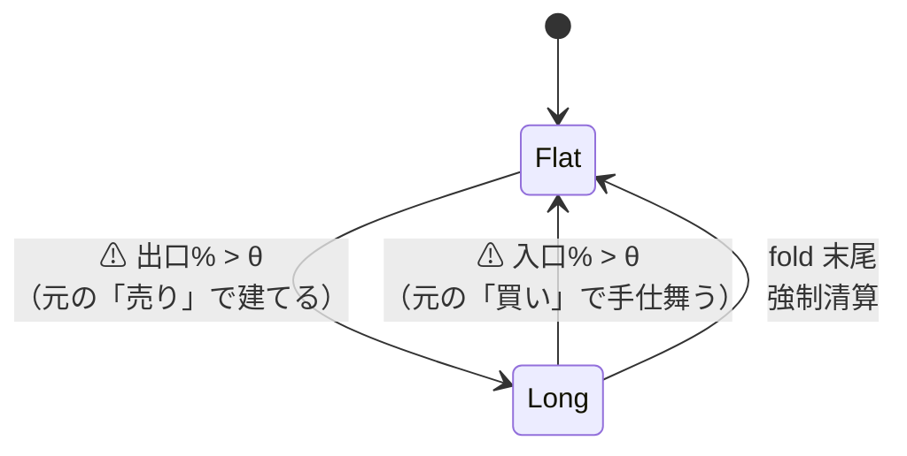

# 逆の売買（売りの合図で建て・買いの合図で手仕舞う）の数値 — 恒等式と実測

作成日: 2026-09-17。プラン: [reverse-trading-check.md](../../../plans/archive/reverse-trading-check.md)（[dsr.md](dsr.md) と同じ「解説であって規約ではない」形）
派生元: 利用者の疑問「売りの時に買い、買いの時に売りという逆の売買したときの数値を確認する」＋「通常と逆の 2 つの損益から評価軸を作れるか」。
⚠ **問いは「逆にすれば勝つか」ではなく「逆売買の数値をモデルの評価に使えるか」である**（利用者の訂正 2026-09-17。プラン §1-1 の「素朴には勝つのではないか」は Claude の読みで、本書の主眼ではない）。
正本: [rules.md 14-3 の (3)(4)](rules.md)（診断列。採否に使わない・試行に数えない）／ 実装 `cli/run.py`（`逆売買純利bp`）・`ail/validation/checks.py`（`_reverse`・`_selection_edge`）

## 0. 答え（先に一言）— 評価に使えるか

⚠ **逆売買の数値そのものは、θ ≥ 50 では元の数値から恒等式で一意に決まるので、モデルの評価に新しい情報を足さない。** 使えるのは次の 2 つで、どちらも**診断**（採否には使わない）。

| 用途 | 使えるか | 中身 |
| --- | :-: | --- |
| **配線の検査** | ✅ | 逆は元の補集合なので、leak 対照で元が跳ね上がれば逆は同じ大きさで跳ね下がる（実測: 元 ＋22,194 ／ 逆 −24,748）。跳ね下がらなければ状態機械か列の配線が壊れている。⚠ **leak 対照と同じ役目で、毎回の実行に自動で残る** |
| **選日の腕の物差し（S）** | ✅（診断のみ） | 元と逆の差から露出（保有日率）とコストを消すと **S ＝ 粗利 − 保有日率 × B&H 粗利** だけが残る。逆売買では −S。⚠ **14-6 (b) の乱択ゲートの期待値を乱数なしで厳密に出したもの**で、「休んだ日を正しく選んだか」を fold ごとの符号で読める |
| 元と逆の和・差・比を新しい採否の軸にする | ❌ | 和は腕が消え、差は露出の項が混ざり、比は分母が 0 や負を跨ぐ（§2-4）。⚠ **情報が増えないものを軸にすると「良く見える軸で語る」誘惑だけが増える**（11 章 規約 2） |
| 逆売買で B&H に勝つか | （副産物） | 正のドリフトの表では、元の純利がほぼ 0 以下のときしか勝たない（既存 921 件で 28 件、全部 θ=60）。元が休んだ日のドリフトしか拾えず、コストは 2 重。⚠ **「元が負けたから逆を採る」は後知恵なので、いずれにせよ採らない** |

代表構成（T3 QUANT θ=50）の読み: 対 B&H 上乗せは ＋61.9bp だが **S は ＋158.5bp（fold ＋＋−−−）**。⚠ **選日の腕は正の側にあるが fold で割れる**、というのが逆売買（S）から読める評価である。

> この図の主張: θ ≥ 50 では逆売買は元の**補集合**（pos_逆 ＝ 1 − pos_元）で、売買日も同じ。⚠ **状態機械のコードは触らず、入口% と出口% を入れ替えて呼ぶだけ**で表せる。だから逆の数値は元の数値の「見え方」であって、新しい測定ではない。

## 1. 恒等式 — 逆は元の補集合である

### 1-1. なぜ補集合になるか

θ ≥ 50 では入口% > θ と 出口% > θ（1 出力の契約では 100 − 入口% > θ）が同じ日に立たない（13-3 規約 2）。
元と逆の状態を (元, 逆) と書くと、遷移は次のとおり【`tests/test_trading.py` で縛った】:

| 状態 | 入口% > θ の日 | 出口% > θ の日 |
| --- | --- | --- |
| (0, 0) 両方 Flat | → (1, 0) 元が建てる | → (0, 1) 逆が建てる |
| **(1, 0)** | 何も起きない（元は Long で入口% を読まない・逆は Flat で入口% を読まない） | → **(0, 1)** 元が手仕舞い・逆が建てる |
| **(0, 1)** | → **(1, 0)** 逆が手仕舞い・元が建てる | 何も起きない |

⚠ **(1, 0) と (0, 1) は吸収状態**: 最初の合図の日以降、2 つは常に反対の状態にあり、売買する日も同じ。⚠ **2 出力の契約（出口% を別に持つ検知器）で同じ日に両方が θ を超えると (1, 1) に入るが、片方だけの合図で補集合に落ち着き、以後は出ない**（テストで確認）。

### 1-2. 恒等式（銘柄 × fold ごと。最初の合図までの区間を無視した近似）

| 量 | 恒等式 |
| --- | --- |
| 逆の粗利 | B&H の粗利 − 元の粗利 |
| 逆のコスト − 元のコスト | ⚠ **{−5, 0, ＋5} bp**（最初の建て 2.5 と強制清算 2.5 が同じ側に付けば 5、別の側なら 0。⚠ プランの「±2.5」は片方だけを見た値で、両方が同じ側に付く） |
| 逆の対 B&H 上乗せ | **− 元の純利 − 2 × 元のコスト ＋ 5bp − δ − (最初の合図までの B&H 粗利)**、δ ∈ {−5, 0, 5} |
| 元と逆の上乗せの和 | − B&H 粗利 − 2 × 元のコスト ＋ 10bp − …（⚠ ドリフトの分だけ必ず負） |

⚠ **答えの形はここで決まる**: B&H が正のドリフトを持つ表（2018 表 4.59bp/日 ／ 1995 表 3.49bp/日【実測】）では、⚠ **元の純利が 5bp − 2 × コスト より小さくない限り、逆は B&H を超えない**。元が B&H に負けている（上乗せ < 0）だけでは足りない。

## 2. Phase 1 — 既存 151 実行の算術【実測 2026-09-17】

`per_symbol.csv` の B&H 行と手法の行から §1-2 の恒等式で出した（δ と最初の合図までの区間は無視。銘柄を等加重平均して fold → 平均）。本物 79 実行・leak 72 実行。

### 2-1. 手法の種類 × θ の平均（本物）

| 種類 | θ | 元の純利 | 元の上乗せ | 逆の純利（算術） | **逆の上乗せ** | S | 保有日率 |
| --- | ---: | ---: | ---: | ---: | ---: | ---: | ---: |
| 全部使う | 50 | 1,428 | −423 | 195 | **−1,656** | ＋143 | 0.7 |
| | 55 | 943 | −908 | 863 | **−988** | ＋101 | 0.5 |
| | 60 | 535 | −1,316 | 1,294 | **−557** | ＋63 | 0.3 |
| 選別 F | 50 | 2,132 | −136 | −117 | **−2,385** | ＋202 | 0.8 |
| | 55 | 1,020 | −1,247 | 1,230 | **−1,037** | ＋32 | 0.4 |
| 検知器 D | 50 | 3,810 | −63 | 36 | **−3,837** | −32 | 0.9 |
| 時系列分類 T/S | 50 | 1,617 | −36 | 0 | **−1,653** | ＋52 | 0.8 |
| 直前符号（基準） | 50〜60 | −390 | −2,501 | 1,171 | **−940** | −885 | 0.5 |
| 乱択（基準） | 50 | 1,341 | −510 | 324 | **−1,527** | −13 | 0.7 |

⚠ **元が B&H に負けているのに、逆はもっと負ける**（θ=50 で −1,500〜−3,800bp）。逆が拾えるのは元が休んだ日のドリフトだけで、θ を上げて元の保有日率が下がるほど逆の純利は増えるが、上乗せは元の純利の符号で決まる。

### 2-2. 元の純利が負のとき（逆が B&H を超えうる唯一の場合）

| 単位 | 件数 | 元の純利 < 0 | そのうち逆の上乗せ > 0 |
| --- | ---: | ---: | ---: |
| 手法 × θ × 実行 | 921 | 242（うち 直前符号の基準線が大半） | **5**（乱択 θ60 −9.6bp ／ 全部使う θ60 −4.7bp・−32.7bp ／ T1 MiniRocket θ60 −51.9bp ／ T2 Hydra θ60 −7.1bp。⚠ **全部 θ=60 で、元の純利が 0 の近く**） |
| 手法 × θ × 実行 × fold | 4,605 | 882 | 466（⚠ 逆の上乗せ > 0 の fold の元の純利の最大は **＋2.09bp** ＝ 5 − 2 × コスト の近く） |

⚠ **逆の上乗せが正になる条件は「元の純利 ≲ 5 − 2 × コスト」であって「元が B&H に負けている」ではない。** 上の 5 件はいずれも 5 fold の平均で ＋9〜＋57bp と検出限界の 2 桁下。

### 2-3. leak 対照の逆 — 跳ね下がる（配線の検査）

| θ | 元の上乗せ（中央値） | **逆の上乗せ（中央値）** | S（中央値） |
| ---: | ---: | ---: | ---: |
| 50 | ＋9,976（平均）／ −141 | **−13,353 ／ −2,690** | ＋11,279 ／ ＋112 |

leak 858 件のうち逆の上乗せが正は 5 件。⚠ **元が跳ね上がる分だけ逆は跳ね下がる** ＝ 逆売買の列は leak 対照と同じ役目（配線の検査）をする。

### 2-4. ⚠ 利用者の問い — 2 つの損益から評価軸を作れるか

⚠ **結論: 逆の値は元の値から恒等式で決まるので、2 つを組み合わせても情報は増えない。** 候補を数字にした（`trade_ownseq_mp_a`・F5-3・θ=50。プラン §1-5）:

| 候補の軸 | 恒等式で書くと | 消えるもの | 判定 |
| --- | --- | --- | --- |
| 和（元 ＋ 逆） | B&H 粗利 − 2 × コスト | ⚠ 腕（手法の情報が消える） | ❌ |
| 差（元 − 逆） | (2h − 1) × B&H 粗利 ＋ 2 × S | コスト | ⚠ 露出の項が混ざる（＋1,561 のうち大半が保有率の項） |
| 比（元 ÷ 逆） | — | — | ❌ 分母が 0 や負を跨ぐ（中央値 −0.20・ばらつき 34.9） |
| 保有日の平均リターン − 見送り日の平均リターン | S ÷ (h(1−h)N) | ドリフト・コスト | ⚠ h → 1 で分母が潰れて暴れる（−18.7bp/日） |
| **S ＝ 粗利 − 保有日率 × B&H 粗利** | 逆では **−S** | ドリフト・コスト | ✅ 安定（＋32.3。fold −572 / ＋460 / ＋120 / ＋73 / ＋236）。⚠ **乱択ゲート（14-6 b）の期待値そのもの** |

h ＝ 保有日率、N ＝ 検証日数。⚠ **本物 504（手法 × θ × 実行。基準線を除く）のうち S > 0 は 230、S が fold 5/5 で正は 6、元の上乗せが 5/5 で正は 0。S > 0 かつ元の上乗せ < 0（「腕はあるが買って持つほうが儲かる」）が 194。**

## 3. Phase 3 — 代表構成の実測と恒等式の突き合わせ【実測 2026-09-17】

代表: `trade_ownseq_ridge_a`（T1・T2・T3 の時系列分類器・θ 3 水準。[holding-days.md §3](holding-days.md) と同じ回し直し）。⚠ **既存列は旧実行と 1 ビットも違わない**（同 §3-1）。

| θ | 手法 | 元の上乗せ | **逆の上乗せ（実測）** | 恒等式 | 差 | 元の取引 → 逆の取引 /fold | S |
| ---: | --- | ---: | ---: | ---: | ---: | ---: | ---: |
| 50 | T3 QUANT | ＋61.9 | **−1,765.3** | −1,768.2 | ＋2.9 | 373 → 337 | ＋158.5（＋＋−−−） |
| 50 | T1 MiniRocket | −84.7 | −1,583.2 | −1,586.1 | ＋2.8 | 150 → 114 | −2.2 |
| 50 | T2 Hydra | −63.8 | −1,593.4 | −1,596.4 | ＋2.9 | 83 → 46 | ＋3.2 |
| 50 | 直前符号 | −1,817.8 | −737.1 | −736.5 | −0.6 | 5,714 → 5,722 | −586.5 |
| 55 | T3 QUANT | −921.9 | −1,703.6 | −732.3 | ⚠ **−971.4** | 45 → 21 | ＋59.8 |
| 60 | T3 QUANT | −865.0 | −1,668.3 | −786.0 | ⚠ **−882.3** | 25 → 4 | ＋466.5 |
| 60 | T1 / T2 | −1,704 / −1,659 | −1,652.0 | ＋56.6 / ＋12.0 | ⚠ **−1,709 / −1,664** | 2 → 0 / 1 → 0 | −55.6 / −8.3 |

- ⚠ **θ=50 では恒等式が 3bp 以内で合う**（最初の合図までの区間が短い）。⚠ **θ ≥ 55 では 700〜1,700bp ずれる**: 元の取引が 1 銘柄 1 fold に 1 回前後しか無く、⚠ **最初の合図までの区間（両方 Flat）が fold の大部分**になる。恒等式はその区間の B&H 粗利を逆の粗利に数えてしまう。⚠ **Phase 1 の算術（§2）は θ=50 の行で読み、θ ≥ 55 の行は「逆の純利を過大に見た上限」として読む**
- 逆の取引回数が 0 の行（T1・T2 θ=60）: 元は建てて強制清算まで持ち切り、出口% が一度も θ を超えない ＝ 逆は一度も建てない。逆の上乗せ ＝ −B&H 純利 − 0（＝ −1,652）
- leak 対照: 元 ＋22,194 ／ 逆 **−24,748** ／ S ＋23,426（3 水準とも 5/5）。跳ね下がった ＝ 配線は無事
- `checks.json` には `by_threshold[θ].reverse`（純利・取引回数・対 B&H 上乗せ・恒等式との差）と `selection_edge`（S の fold ごとの値と符号）が残る

## 4. 結論の形（プラン §2-6 に先に書いた仮説 → ⚠ 結果で書き換える箇所は無かった。⚠ 主眼は §0 の「評価に使えるか」で、以下はその根拠）

1. 正のドリフトの表では、逆売買は元が休んだ日のドリフトしか拾えない。元の日の選び方の良し悪し（S）は符号を変えて同じ大きさで現れる（θ=50 で恒等式が 3bp 以内で合うことで確認）
2. コストは 2 重（売買日が同じ ＋ 最初の建てと強制清算の帰属で ±5bp）
3. よって元が B&H に負けた理由が「休んだ日のドリフトを逃した」ことにある限り、逆にしても勝てない。逆が勝つのは元の純利がほぼ 0 以下のときだけで、既存 921 件で 28 件（全部 θ=60・＋57bp 以下）
4. ⚠ **追記**: 恒等式は θ=50 の量であり、θ ≥ 55 では「最初の合図までの区間」が支配する。実測の列（Phase 2）が要る理由がこれ

## 5. ⚠ 答えないこと（プラン §2-4・§2-5）

| | 理由 |
| --- | --- |
| 逆売買を手法として採る | 「元が負けたから逆を採る」は結果を見て向きを選ぶ後知恵（13-3 規約 4 と同じ誤り）。採るなら向きを事前に書いて新しい試行として数える（16 章の出口% と同じ手順。rules.md 14-3 に明記） |
| 空売り版（ポジション −1） | 13-4 規約 2・16-1 規約 5 が禁じる（状態を 3 つにするのは検証方式の変更）。算術だけ: 空売り版の純利 ＝ −元の純利 − 2 × 元のコスト − 貸株料。対 B&H の上乗せは入替え版からさらに B&H の粗利ぶん下がる（ドリフトに逆行）。貸株料の【公表値】は取っていない（【推測】: 大型株で年率 1% 未満 ＝ 日次 0.03bp 未満） |
| 逆売買・S を採否に使う | 診断列（14-3）。判定は 13-7 の対 B&H 上乗せのまま。⚠ **軸を増やすほど「良く見える軸で語る」誘惑が増える**（11 章 規約 2） |

## 6. 費用と付随して変わったもの

- 計算: Phase 1 数秒 ／ Phase 3 は [holding-days.md](holding-days.md) の回し直しと同じ 2 本（19 分 ＋ 18 分）。状態機械 1 本ぶんの増分は 1 実行 1 秒未満
- `result.csv` に `逆売買純利bp`・`逆売買取引回数`、`per_symbol.csv` に `逆売買純利bp`（末尾）。画面には出さない（疑問への答えは文書で足りる）
- n_trials は動かない（診断列。台帳は触らない）。出来高の対（[volume-trend-input.md](../volume-trend-input.md)）では逆の列が −86,600bp に跳ね下がる leak と −4,400〜−5,500bp の本物として自動で残った
