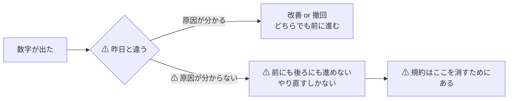
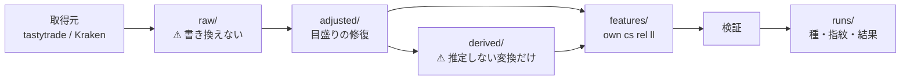
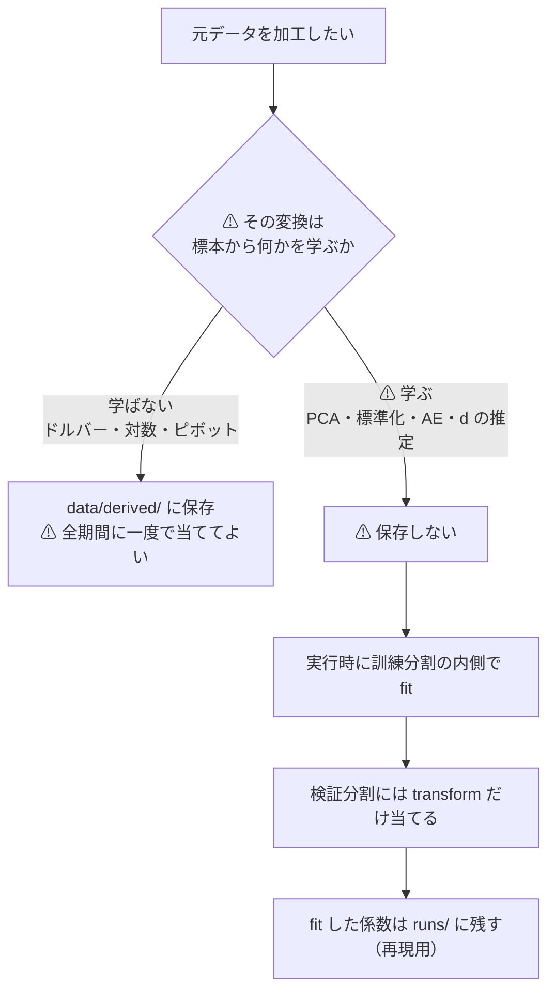
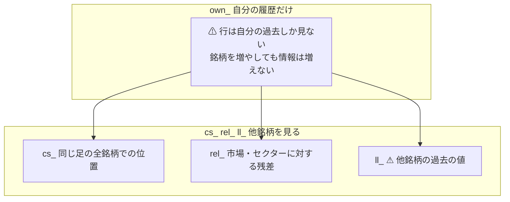

# 分析の構造化ルール

作成日: 2026-09-08。対象: `experiments/feature-discovery/`。
派生元: [特徴量を見つけ出す手法の検証](../feature-discovery.md) ／ [E8 の記録](../e8-signal-methods.md) ／ [プラン](../../../plans/archive/analysis-structure.md)

⚠ **これが規約の正本である。** コード・記録・数字の書き方が本書と食い違ったら、⚠ **本書を正としてコードを直す。**
本書を変えるときは、⚠ **「なぜ変えたか」と「変える前の結果をどう扱うか」を同時に書く。**

## 0. なぜ規約が要るのか

⚠ **1 回だけ回すなら要らない。日々改善しながら回すなら要る。**
日々改善は「昨日より良くなったか」が言えて初めて回る。⚠ **そのためには、昨日の数字が再現できなければならない。**

> この図の主張: ⚠ **規約が要るのは「良い数字を出すため」ではなく、「悪い数字を悪いと確定させるため」である。**



本書が押さえるのは 4 つだけである。

| # | 押さえること | ⚠ 破ったときに起きること |
| ---: | --- | --- |
| 1 | **加工の履歴が残る**（1〜3 章） | ⚠ **加工の誤りを遡れない。** 2026-09-08 の分割調整の誤り 49 件は、生データを残していたから特定できた |
| 2 | **未来を見ない**（6〜8 章） | ⚠ **成績が実力ではなく漏れになる。** しかも「良い数字」の形で出るので気づけない |
| 3 | **数字が再現する**（9〜10 章） | ⚠ **改善が測れない。** 「前より良くなった」が言えない |
| 4 | **数字の強さを偽らない**（11〜12 章） | ⚠ **偶然を発見と読む。** 手法を 25 件も並べれば、必ずどれかが良く見える |

---

## 1. データの層と置き場

⚠ **加工するたびに新しい層を足す。前の層は書き換えない。**

```
data/
├ raw/<取得元>/<粒度>/<SYMBOL>.csv        ⚠ 取ってきたまま。どのコードも書き換えない
├ adjusted/<粒度>/<SYMBOL>.csv            目盛りを直したもの（2 章）
├ derived/<変換名>__<引数>/<SYMBOL>.csv   推定しない変換だけ（3 章）
├ features/<実験>/<粒度>.parquet          特徴量とラベル（6〜8 章）
└ manifests/<層>_<粒度>.json              層ごとの指紋と検査結果（5 章）
```

> この図の主張: ⚠ **層は一方通行。** 下流で困っても上流を書き換えず、⚠ **層を 1 枚足して直す。**



| # | 規約 | ⚠ 理由 |
| ---: | --- | --- |
| 1 | ⚠ **`raw/` は取ってきたまま。追記はしても書き換えない** | ⚠ **加工の誤りを遡る唯一の足場**。ここを直すと「提供元が悪いのか自分が悪いのか」が永久に分からなくなる |
| 2 | 加工は必ず**新しい層**に書く | 上と同じ |
| 3 | ⚠ **`data/` は git 管理外**。消えても作り直せること | 数百 MB を git に入れない。⚠ **代わりに作り方（`config/`）を git に入れる** |
| 3-2 | ⚠ **`.gitignore` には先頭の `/` を付ける**（`/data/`、`data/` ではない） | ⚠ **`data/` と書くと `ail/data/` まで無視され、データ層のコードが丸ごと commit から漏れる**（2026-09-08 に踏んだ） |
| 4 | 層を書いたら**必ず検査して manifest を書く**（5 章） | 検査していない層は「あるだけ」で信用できない |
| 5 | 実験用の中間物を `raw/` `adjusted/` に混ぜない | 層の意味が壊れる。⚠ **`store.write_bars` は `BAR_COLUMNS` 以外を落とす** |

---

## 2. ⚠ 株式分割・配当の調整

### 2-1. まず確かめたこと（2026-09-08 の実測）

⚠ **本作業の最初の 1 手は「そもそも調整済みか」の確認だった。** 結果は **「調整済み。ただし当て方が間違っている」**。

| # | 確かめたこと | 結果 |
| ---: | --- | --- |
| 1 | NVDA の 3 回の分割日（2007-09-11 3:2 ／ 2021-07-20 4:1 ／ 2024-06-10 10:1）で終値が連続か | ✅ **連続**（分割調整は効いている） |
| 2 | 出来高も逆向きに直っているか | ✅ 直っている（2024-06-06 は実際の約 66M に対し約 664M） |
| 3 | ⚠ **配当も調整されているか** | ❌ **されていない**（SPY 1999-12-31 の終値 146.88 は S&P500 1469.25 ÷ 10 = 146.93 と一致）。⚠ **価格リターンである** |
| 4 | ⚠ **調整の当たり方が正しいか** | ❌ **誤りが 49 件**（下） |

⚠ **4 が本作業の主な発見である。** 詳細は [記録](../feature-discovery.md) の分割調整の節。

### 2-2. ⚠ 見つかった誤りの形

> この図の主張: ⚠ **誤りは「分割が当たっていない」ではなく「当たる期間がずれている」。** だから継ぎ目が往復する。


| 形 | 銘柄 | 期間 | ⚠ 見え方 |
| --- | --- | --- | --- |
| **往復する塊** | AVGO NFLX NVDA WMT XLB XLE XLK XLU XLY の 9 本 | 2022-12-30 〜 2023-10-23 の同じ 4〜6 日 | ⚠ **±70〜900% の偽リターンが 46 本** |
| **片道の段** | GOOGL（20:1）／ QQQ（2:1）／ ABT（AbbVie 分離の 2.11 倍） | それ以前の全期間 | ⚠ **継ぎ目 1 本だけが偽リターン。** 期間内のリターンは正しい |

⚠ **9 本が同じ日に同じ形で壊れているのが決め手だった。** XLK と XLU と WMT が同じ日に分割することはない。

### 2-3. 規約

| # | 規約 | ⚠ 理由・落とし穴 |
| ---: | --- | --- |
| 1 | ⚠ **`raw/` は絶対に書き換えない。** 調整は `adjusted/` に新しく書く | 加工の誤りを遡れるようにする |
| 2 | ⚠ **価格を割ったら出来高は掛ける**（10:1 なら価格 ÷10・出来高 ×10） | ⚠ **価格だけ直すと出来高の特徴量（`own_vratio_*` `own_dollar_20`）が全部おかしくなる** |
| 3 | ⚠ **出来高を直すのは「分割の比率」のときだけ** | ⚠ **スピンオフ・特別配当は株数を変えない。** ABT の 2.11 倍で出来高を掛けると嘘になる |
| 4 | 調整は**累積比率**で行い、継ぎ目**以前**の全期間に効かせる | 1 日だけ直すのは誤り |
| 5 | ⚠ **基準は一番新しい足**。そこから過去へ遡る | ⚠ **いまの値段は本番の約定と突き合わせて確かめられる**（SPY の最新終値 765.96 と 2026-09-08 の約定 $766.47） |
| 6 | ⚠ **吸着した整数比を使う。実測の段差をそのまま使わない** | ⚠ **継ぎ目を往復したあと累積比が 1 に戻らず、系列全体が数 % ずれる**（実測で 1.2% ずれた） |
| 7 | ⚠ **配当は既定では調整しない**（価格リターン）。総収益が要るときは**別の系列**として持つ | ⚠ **配当調整すると「その日の実際の値段」ではなくなり、bp のコスト計算とスプレッドの解釈がずれる** |
| 8 | ⚠ **検知は自動、確定は一次情報**。外れ値検知だけで分割と断定しない | ⚠ **本物の暴落を分割と誤認すると、実在した損失を消してしまう**（下） |
| 9 | 調整の有無・比率・出典を `adjusted/` の manifest に残す | 後から検算できるようにする |

### 2-4. ⚠ 本物の暴落を消さないための判別

⚠ **比率が 2:1 に近いことは、分割の証拠にならない。**

| 銘柄・日付 | 段差 | 売買代金 | 値幅 | 正体 |
| --- | ---: | ---: | ---: | --- |
| AAPL 2000-09-29 | 1.90 倍 | ⚠ **平年の 10.8 倍** | 1.8 倍 | ⚠ **実在の −52%**（業績警告） |
| PG 2000-03-07 | 1.51 倍（3:2 と 0.5% 違い） | ⚠ **平年の 12.7 倍** | 6.8 倍 | ⚠ **実在の −31%** |
| XLK 2022-12-30 | 2.02 倍 | 平年の 0.64 倍 | 0.84 倍 | **調整の誤り** |

⚠ **一番効く判別は出来高である。** 目盛りの誤りは値段だけが動いて売買代金も値幅も平年並みだが、
⚠ **本物の暴落は売買代金が 3〜15 倍に跳ねる。**

| 段階 | 条件 | 扱い |
| --- | --- | --- |
| 1 | 売買代金 > 平年の 2 倍 ／ 値幅 > 2.5 倍 ／ 日中の値動き > 8% のどれか | ⚠ **実際の変動。直さない** |
| 2 | 段差が **1.9 倍未満** | ⚠ **直さない（要確認）。** 一次情報で確かめるまで触らない |
| 3 | 段差が 1.9 倍以上で整数比に吸着する | **直す**（価格・出来高とも） |
| 4 | 段差が 1.9 倍以上だが整数比でない | **直す**（価格だけ。⚠ **manifest に「要確認」として残す**） |

⚠ **段階 2 を自動で直してはいけない。** 20% 前後の段差には、
XLE 2020-03-09（原油価格戦争の −20%）と XLF 2016-09-19（XLRE 分離のスピンオフ）と提供元の粗が混ざっていて、
⚠ **出来高だけでは分けられない。** 分けられないものを自動で消すと、⚠ **実在した −20% を「何も起きなかった日」に書き換える。**

---

## 3. ⚠ 手法ごとに元データを加工するとき

⚠ **加工には 2 種類あり、置き場が違う。この区別を間違えると、そこから先の数字が全部だめになる。**

> この図の主張: ⚠ **標本から何かを学ぶ変換は、キャッシュしてはいけない。** 訓練分割の内側でしか当てられない。



| 種類 | 例 | 置き場 | ⚠ 理由 |
| --- | --- | --- | --- |
| **A 推定しない** | ドルバー・ボリュームバー ／ 対数・差分 ／ 断面のピボット ／ リサンプリング ／ **分割調整** | **`data/derived/<変換名>__<引数>/`** | データだけで決まるので**先読みにならない**。⚠ **重いので手法をまたいで使い回す価値がある** |
| **B ⚠ 推定する** | 標準化 ／ PCA ／ オートエンコーダ ／ クラスタリング ／ **分数差分の次数 d** | ⚠ **保存しない**（`ail/data/transforms/fitted.py`） | ⚠ **全期間で fit してキャッシュすると、検証分割の情報が訓練に漏れる。** Ambroise-McLachlan (2002) の選別バイアスと同じ理屈が**前処理にも効く** |

⚠ **迷ったら B として扱う。** A を B にしても遅くなるだけだが、⚠ **B を A にすると数字が嘘になる。**

| # | A の保存の規約 |
| ---: | --- |
| 1 | ディレクトリ名に**変換名と引数**を入れる（`dollar_bars__thr=1e7/`）。⚠ **引数違いを別物として並存させる** |
| 2 | 入力の層（`raw` か `adjusted` か）と**入力の指紋**を manifest に残す |
| 3 | ⚠ **`raw/` からは直接作らない。** 原則 `adjusted/` を入力にする（⚠ **目盛りの断層が入ったままドルバーを切ると足の切れ目がずれる**） |
| 4 | 不変条件（5 章）を通してから使う |

⚠ **B の再現の規約**: fit した係数は `runs/<実行>/fitted/` に残す。⚠ **次の実行では読み込まずに毎回 fit し直す**（読み込むと分割をまたいで漏れる）。

---

## 4. 時刻と識別子

| # | 規約 | ⚠ 理由 |
| ---: | --- | --- |
| 1 | 時刻は **UNIX ミリ秒・UTC**（`time_ms`）。表示のときだけ現地時刻に直す | 夏時間で足がずれるのを避ける |
| 2 | ⚠ **`time_ms` は足の「開始時刻」** | ⚠ **終了時刻と混ぜると、地平 1 本ぶん先読みになる** |
| 3 | 銘柄の識別子は**取得元の書式のまま持つ**（`BRK/B`） | 発注と突き合わせるときに変換が要らない |
| 4 | ⚠ **ファイル名と列名にするときだけ `/` を `-` に置き換える**（`BRK-B`） | ⚠ **`BRK/B_d.csv` はディレクトリになってしまう** |
| 5 | 銘柄をまたいで揃えるときは**時刻の完全一致だけ**を使う | ⚠ **前方埋めをすると、休場の銘柄に「まだ起きていない値」が入る**（6〜7 章） |

---

## 5. 不変条件と検査

⚠ **取得と調整のたびに自動で通す。** 実装は `ail/data/check.py`、記録は manifest の `totals`。

| 不変条件 | 扱い | ⚠ 理由 |
| --- | --- | --- |
| 時刻が単調増加 | ⚠ **止める** | 並びが狂うと窓の意味が消える |
| 時刻の重複なし | ⚠ **止める** | 同じ足を 2 回数える |
| 価格 > 0 | ⚠ **止める** | 対数リターンが −inf になる |
| 出来高 >= 0 | ⚠ **止める** | 加重の符号が反転する |
| NaN が無い | ⚠ **止める** | ⚠ **feed の NaN 番兵行が「最古の足」になる**（2026-09-08 に踏んだ） |
| `high >= max(open,close)` ／ `low <= min(open,close)` | 数える | 提供元の粗（日足で 808 件・中央値 0.27%）。⚠ **止めると誰も回さなくなる** |
| 出来高 = 0 | 数える | 実際に商いが無い足がある |
| 目盛りの断層が残っていない | 数える | ⚠ **調整後も残るのは実際の暴落**（日足 58 件） |

⚠ **止める／数えるを分けるのが要点である。** 全部止めると検査を外したくなり、⚠ **外した検査は無いのと同じになる。**

---

## 6. 特徴量の命名と層

⚠ **名前の接頭辞が「どの層の特徴量か」を表す。** 断面を足すと列が数百〜数千になるので、
⚠ **どの層かが名前から分からないと、選別の結果を読めない。**

> この図の主張: ⚠ **`own_` だけの世界では、63 銘柄を並べても「1 銘柄の実験を 63 回」やったのと変わらない。**



| 接頭辞 | 意味 | 例 | ⚠ 注意 |
| --- | --- | --- | --- |
| `own_` | その銘柄自身の履歴だけ | `own_ret_5` `own_vol_20` | 35 本。⚠ **式を変えると過去の数字と比べられなくなる** |
| `cs_` | ⚠ **同じ足の全銘柄を見た断面** | `cs_rank_ret_1` `cs_breadth_up` | ⚠ **銘柄が揃わない足では意味が薄い。** `cs_n` を残して後で絞れるようにする |
| `rel_` | 市場・セクターに対する相対 | `rel_resid_5` `rel_beta_60` | β は**過去の窓だけ**で測る |
| `ll_` | ⚠ **他銘柄の遅れた値** | `ll_XLK_ret1_lag1` | ⚠ **必ず 1 本以上ずらす。** N² で増えるので FDR と対で使う |
| `LEAK_` | ⚠ **わざとした先読み**（対照実験専用） | `LEAK_future_ret` | ⚠ **本番の表に入れない。** 入るのは `--leak` を付けたときだけ |

| # | 規約 |
| ---: | --- |
| 1 | ⚠ **接頭辞を省略しない。** `ret_5` ではなく `own_ret_5` |
| 2 | 窓の長さは**末尾に数字**で書く（`own_vol_20`） |
| 3 | ⚠ **`cs_` は `own_` の列名から作り、`own_` の名前を引き継ぐ**（`own_ret_1` → `cs_rank_ret_1`） |
| 4 | ⚠ **特徴量ではない列は `META_COLUMNS`**（`symbol` `ts` `close` `y` `y_sign` `y_elapsed_min`）。⚠ **説明変数から必ず外す** |

---

## 7. ⚠ 先読み禁止

⚠ **これを破ると「良い数字」が出る。** 悪い数字は疑うが良い数字は疑わないので、⚠ **一番見つかりにくい壊れ方である。**

| # | 規約 | ⚠ よくある破り方 |
| ---: | --- | --- |
| 1 | ⚠ **足 i の特徴量は足 i までしか見ない。** 窓は必ず i で閉じる | `shift(-k)` ／ `center=True` の移動平均 |
| 2 | 銘柄をまたぐときは**時刻の完全一致**だけを使う | ⚠ **前方埋め**。休場の銘柄に未来が入る |
| 3 | ⚠ **`ll_` は必ず 1 本以上ずらす** | 同じ足を「予測」と呼んでしまう |
| 4 | ⚠ **標準化・PCA は訓練分割の内側で fit**（3 章の B） | 全期間で `StandardScaler().fit()` |
| 5 | ⚠ **特徴量の選別も訓練分割の内側**（9 章） | 全期間で相関を見て上位 8 本を選ぶ |
| 6 | 銘柄の集合を**後から選び直さない** | ⚠ **「いま残っている銘柄」で過去を試す**（12 章の生存バイアス） |
| 7 | ⚠ **対照実験を毎回通す** | 下 |

⚠ **対照実験（`--leak`）を毎回通す。** ラベルそのものを特徴量に混ぜた列を 1 本足して回し、
⚠ **的中率が跳ね上がらなければ検証の配線が壊れている。**
（2026-09-08 の実測: 的中率 99.9%。⚠ **これが 50% 台なら、正しい数字も信用できない。**）

---

## 8. ラベル

| # | 規約 | ⚠ 理由 |
| ---: | --- | --- |
| 1 | `y` は**足 i の終値から k 本先の終値までの対数リターン** | ⚠ **未来を見てよいのはラベルだけ** |
| 2 | ⚠ **末尾 k 本は捨てる** | ラベルが NaN になる。⚠ **層ごとに捨てると行数がずれる**ので 1 か所で捨てる |
| 3 | ⚠ **跨いだ実時間 `y_elapsed_min` を残す** | ⚠ **1 分足の「5 本先」は、夜を跨ぐと 5 分ではなく 1,000 分になる。** 後で落とせるようにする |
| 4 | 地平は**足の本数**で持ち、コストの比較は**実時間**で行う | 粒度が違う実験を並べるため |
| 5 | ⚠ **`y_sign` を説明変数に入れない** | ラベルそのもの |

---

## 9. 検証の規約

> この図の主張: ⚠ **選別を分割の外でやると、どの手法でも成績が上がる。** 上がるのは実力ではない。


| # | 規約 | ⚠ 理由 |
| ---: | --- | --- |
| 1 | ⚠ **時系列を無作為に切らない。** ウォークフォワード（増えていく窓） | 無作為に切ると訓練と検証が同じ未来を共有する |
| 2 | ⚠ **パージ**: ラベルが検証期間に食い込む訓練行を落とす（地平ぶんの実時間） | ラベルの重なりで訓練と検証が繋がる |
| 3 | ⚠ **エンバーゴ**: 断面を使うときは境目をさらに 1 本以上空ける | ⚠ **同じ足の他銘柄が境目を跨ぐ** |
| 4 | ⚠ **選別・標準化・PCA は訓練分割の内側だけ**（Ambroise-McLachlan 2002） | 外でやると必ず楽観的になる |
| 5 | ⚠ **基準線を必ず併記する** | 下 |
| 6 | ⚠ **コストを引いた純利で判断する**（往復 5〜10bp。E8 §1-4） | ⚠ **粗利が正でも純利が負なら使えない** |
| 7 | 種（`seed`）を config に書き、`runs/` に残す | 再現のため |

⚠ **必須の基準線 4 本。**

| 基準線 | 何を潰すか | ⚠ 注意 |
| --- | --- | --- |
| **常に上（ドリフト）** | ⚠ **株は上がる日のほうが多い。** 的中率 50% 超はこれだけで出る | ⚠ **ほとんど回転しないので本当はコストを払わない。** 純利を並べるときに必ず併記する |
| **直前リターンの符号** | 最も素朴なモメンタム | これに負ける「モメンタム手法」は名前だけ |
| **全部使う** | 選別しない場合 | ⚠ **これを超えられない選別に意味は無い** |
| **乱択** | でたらめに k 本選ぶ | ⚠ **これに負ける手法は選別として害** |

---

## 10. 実行の記録と設定

⚠ **1 実行 1 ディレクトリ。** `runs/<時刻>_<実験名>/` に config の写し・入力の指紋・種・コードの版・結果・ログを残す。

| ファイル | 中身 | ⚠ 無いと何が起きるか |
| --- | --- | --- |
| `config.json` | 解決後の設定 | ⚠ **「どの設定で出た数字か」が分からない** |
| `inputs.json` | 入力の指紋（層・行数・最古・最新・ハッシュ） | ⚠ **データが変わったのかコードが変わったのかが分からない** |
| `env.json` | 種・git の commit・ライブラリの版 | ⚠ **同じコードだったかが分からない** |
| `result.csv` / `summary.csv` | fold ごとの生の行 ／ まとめ | まとめだけだと「5 fold 中 2 回は符号が逆」が見えない |
| `fitted/` | 標本から学んだ係数 | ⚠ **次の実行では読み込まない**（3 章の B） |
| `log.txt` | 画面に出したものと同じ | 後から同じものが読める |

⚠ **設定はコードではなく `config/` に置く。**

| 場所 | 増やし方 |
| --- | --- |
| `config/universe/*.toml` | 銘柄の集合・セクターの対応。⚠ **書き足すだけで `rel_` の列が増える** |
| `config/dataset/*.toml` | 粒度・期間・調整の指定 |
| `config/experiment/*.toml` | ⚠ **1 実験 1 ファイル。** 選別・モデル・検証・特徴量の層をここで組む |

| # | 設定の規約 | ⚠ 理由 |
| ---: | --- | --- |
| 1 | ⚠ **TOML の平の key は、必ずテーブル見出し（`[...]`）より上に書く** | ⚠ **TOML はテーブルより後ろの key をそのテーブルに入れる。** 末尾に足すと `notes.horizon_min` になって**黙って効かない**（2026-09-08 に踏んだ） |
| 2 | ⚠ **予測の対象（`targets`）と、説明変数に使うだけの銘柄を分ける** | ⚠ **ETF はセクター相対を持てないので、対象に混ぜると `dropna` で黙って 15 本消える**（2026-09-08 に踏んだ） |
| 3 | ⚠ **銘柄で列の集合が違ったら、走る前に止める** | 上と同じ事故を「消えた後」ではなく「消える前」に見つける |
| 4 | ⚠ **`@register` は import されて初めて効く。** 新しいファイルは `ail/bootstrap.py` に 1 行足す | 足し忘れると「registry に無い」で止まる |

⚠ **手法を 1 つ足すときに触るのは葉のファイル 1 つだけ。**

```python
# ail/selectors/filter.py に追記するだけ
@register("selector", "F1-8 条件付き相互情報量")
def cmi(X, y, k, ctx):
    ...
    return columns          # 選んだ列の名前
```

⚠ **配線は触らない。** `config/experiment/*.toml` の `selectors = [...]` に名前を足せば比較に入る。
⚠ **名前の打ち間違いは走り出す前に落とす**（`resolve_experiment` が全部解決してから走る）。

---

## 11. ⚠ 数字の扱い

⚠ **E8 から引き継ぐ決定。**

| # | 規約 | ⚠ 理由 |
| ---: | --- | --- |
| 1 | ⚠ **【実測】/【公表値】/【推測】のどれかを必ず明示する** | プロジェクトの規約（CLAUDE.md） |
| 2 | ⚠ **悪い数字は結論。良い数字は根拠「中」が上限** | ⚠ **悪い数字は偶然では出にくいが、良い数字は手法を並べれば必ず出る** |
| 3 | ⚠ **デフレーテッド SR とパージ CV を通していない良い数字は報告しない** | 多重検定 |
| 4 | ⚠ **`n_trials` は試した手法の総数**（手法 × 粒度 × 地平 × 銘柄集合） | ⚠ **数え落とすと必ず甘くなる** |
| 5 | ⚠ **fold ごとの符号を必ず出す** | ⚠ **平均が正でも「5 fold 中 2 回は符号が逆」なら実力ではない** |
| 6 | ⚠ **行数を標本数と読まない**（12 章） | t 値を過大に読む |
| 7 | 数字が変わったら、⚠ **まず配線を疑う。** 結論の更新は原因が確定してから | ⚠ **配線の不具合を「改善」と読むのが一番よくある事故** |

---

## 12. ⚠ 既知の限界

⚠ **消せない限界は、消せないまま書いておく。** 書いていない限界は「無い」と読まれる。

| # | 限界 | ⚠ 数字への効き方 |
| ---: | --- | --- |
| 1 | ⚠ **生存バイアス**。銘柄 63 本は **2026-09-08 時点の時価総額上位**で選んでいる | ⚠ **上場廃止・凋落した銘柄が 1 つも入っていない。** 当時知り得ない情報で母集団を選んでいる |
| 2 | ⚠ **63 系列は独立ではない**。SPY は残り 48 社を丸ごと含み、セクター ETF も重なる | ⚠ **行数を標本数と読むと t 値を過大に読む。** 相関行列の固有値から実効本数を出して割り引く |
| 3 | ⚠ **1 購読 約 8,000 本の上限**（提供元の制約。`toTime` は無視される） | ⚠ **1 分足は約 6 週間しか遡れない。** 標本は銘柄を横に増やして作るしかない |
| 4 | ⚠ **配当を含まない**（価格リターン。2-1 の確認 3） | 高配当銘柄の長期の成績を過小に見る |
| 5 | ⚠ **調整の誤りのうち 12 件は「要確認」のまま**（2-4 の段階 2） | 20% 前後の段差。⚠ **一次情報で確かめるまで直していない** |
| 6 | OHLC の綻びが日足 808 件（中央値 0.27%） | `own_park_*` `own_pos_*` `own_body` に効く。⚠ **止めずに数えている** |
| 7 | ⚠ **コストは往復 5bp の固定値**。板の厚みも約定確率も見ていない | ⚠ **1 分足では楽観的すぎる可能性がある** |
| 8 | ⚠ **1 会場（tastytrade / dxFeed）のデータしか持っていない** | ⚠ **提供元の癖と市場の性質を分けられない**（2 章の誤りが良い例） |

---

## 付録: 本書と実装の対応

| 章 | 実装 |
| ---: | --- |
| 1 | `ail/data/store.py` |
| 2 | `ail/data/adjust.py` ／ `cli/adjust.py` |
| 3 | `ail/data/transforms/` ／ `cli/run.py` の標準化 |
| 4 | `ail/contracts.py` ／ `ail/data/store.py` の `to_filename` |
| 5 | `ail/data/check.py` ／ `cli/check.py` |
| 6 | `ail/features/{own,cross,relative,leadlag}.py` |
| 7 | `tests/test_no_lookahead.py` ／ `cli/build.py --leak` |
| 8 | `ail/features/labels.py` |
| 9 | `ail/validation/splits.py` ／ `ail/models/baselines.py` ／ `cli/run.py` |
| 10 | `ail/runs.py` ／ `ail/config.py` ／ `ail/registry.py` |
| 11 | `ail/validation/stats.py` |
| 12 | `config/universe/us63.toml` の注記 |
