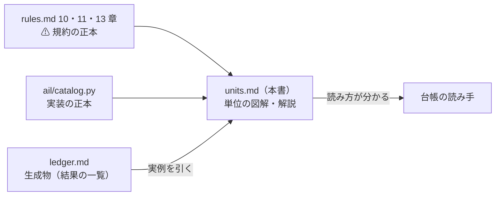
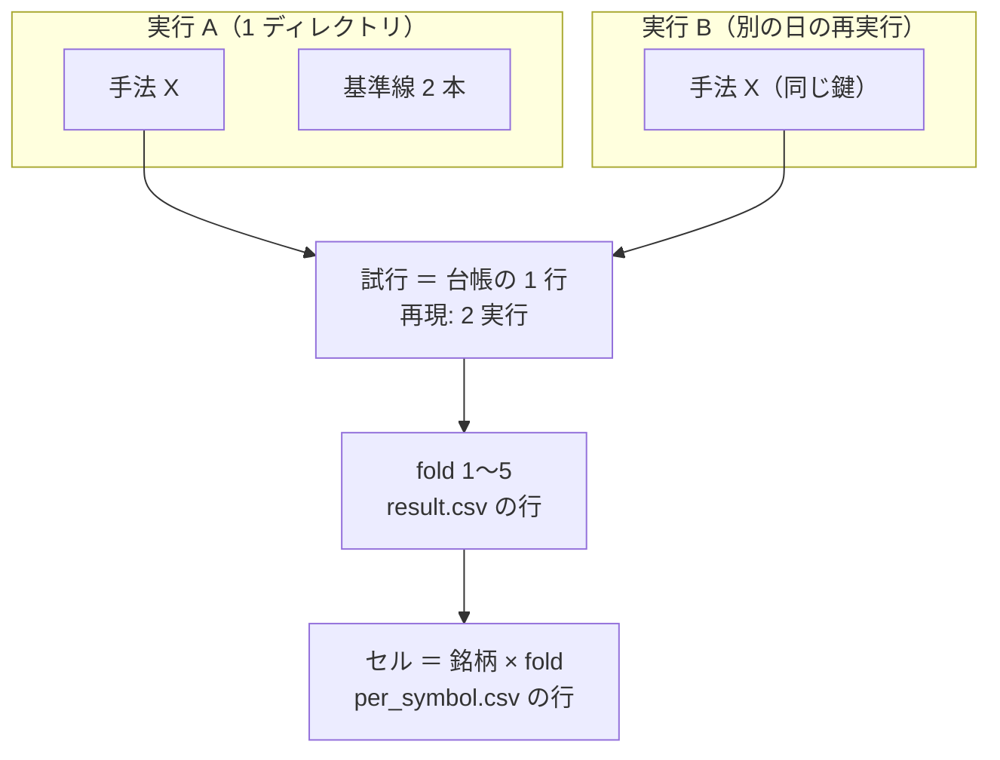
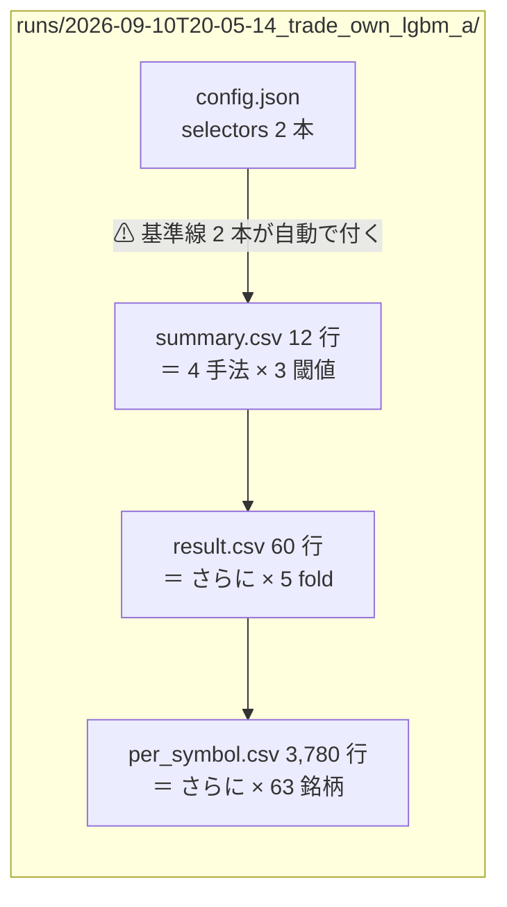
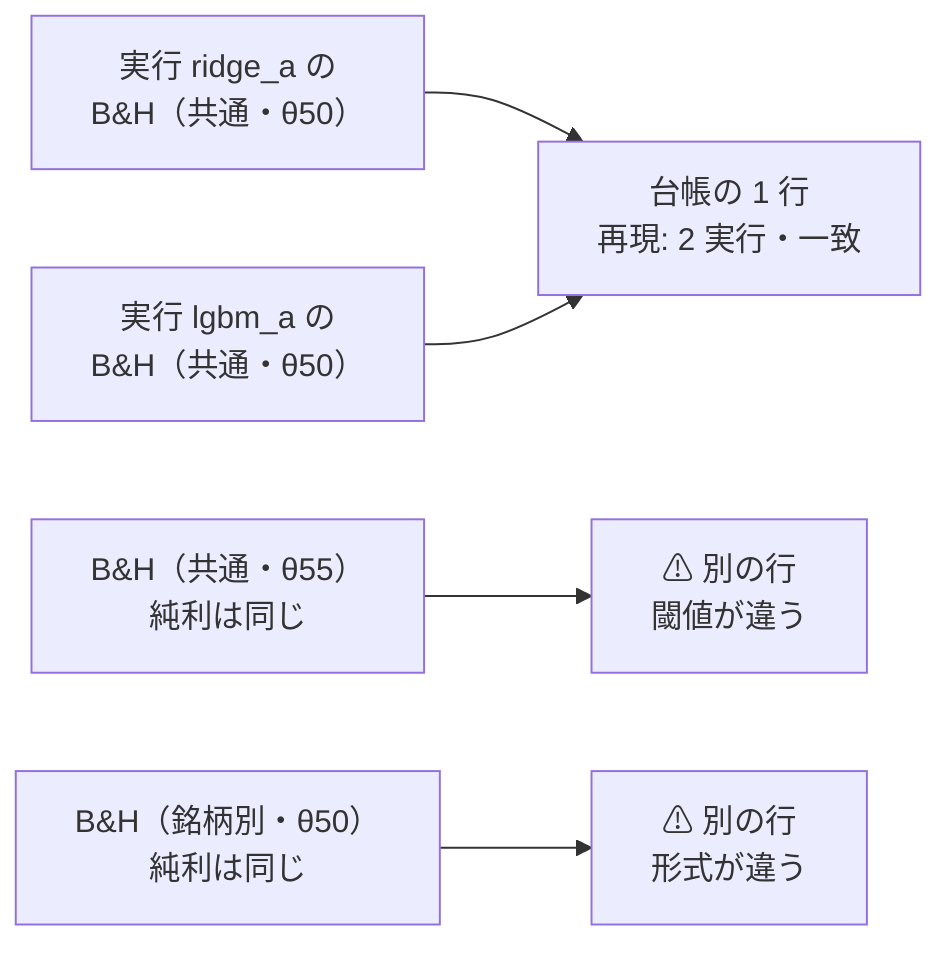
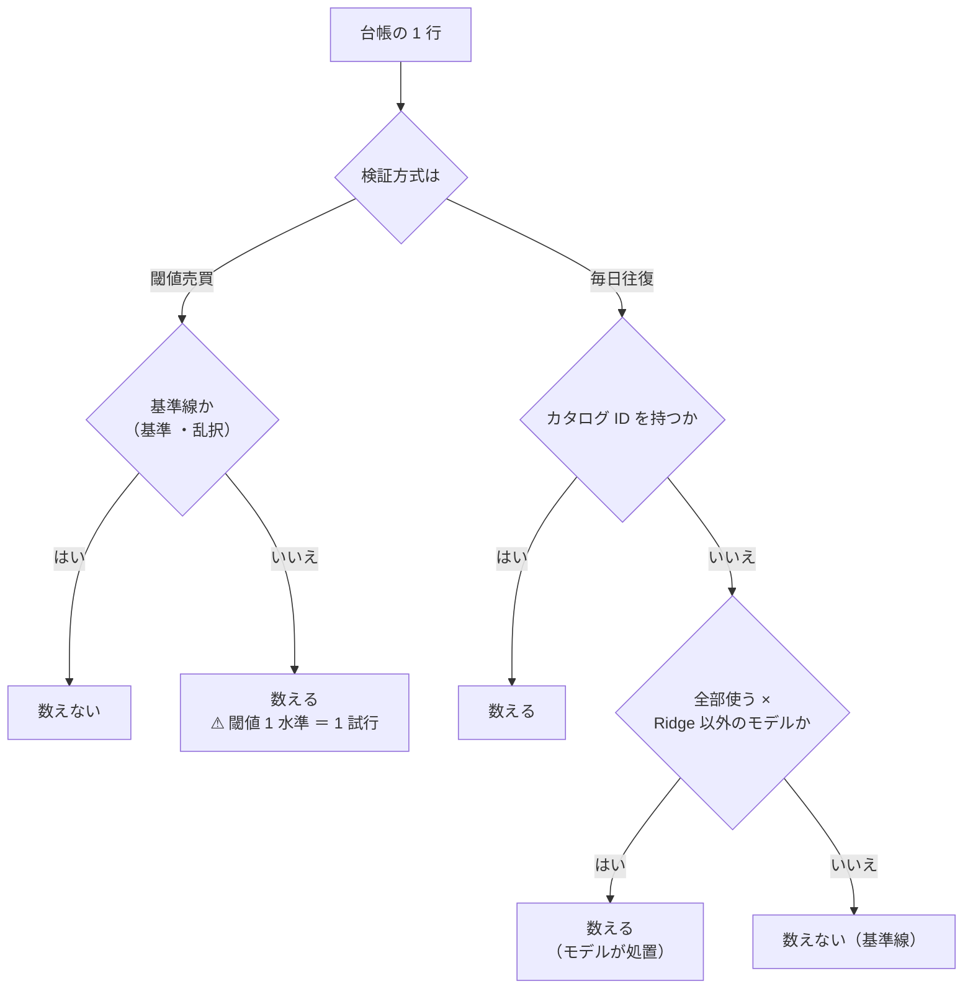
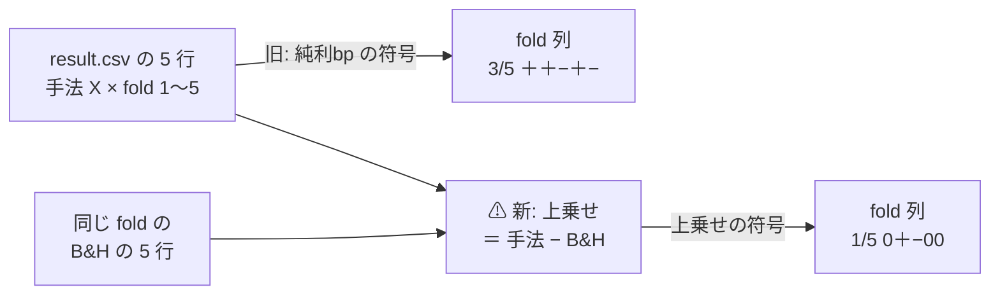
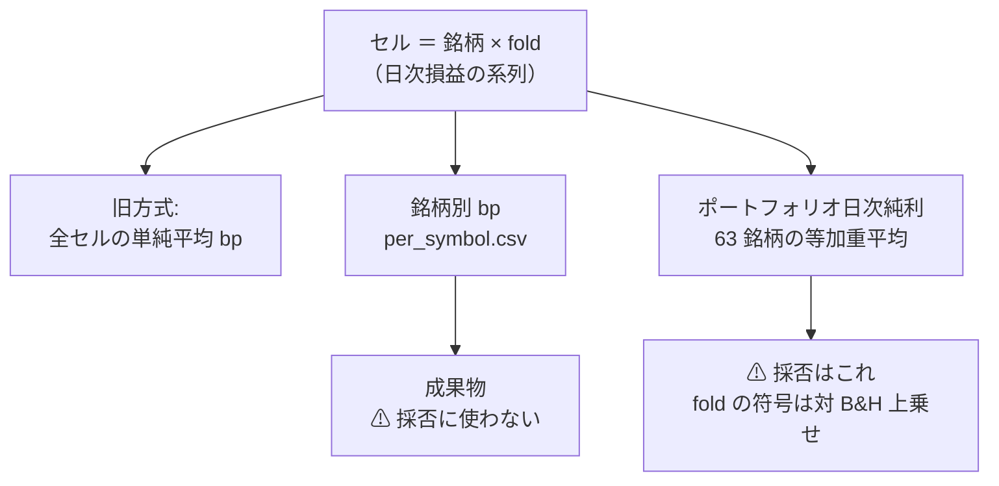
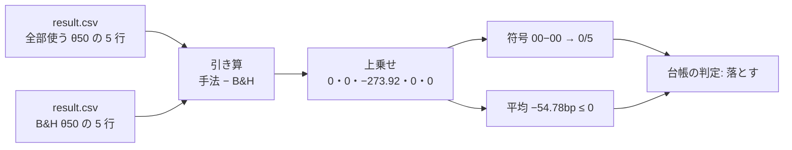
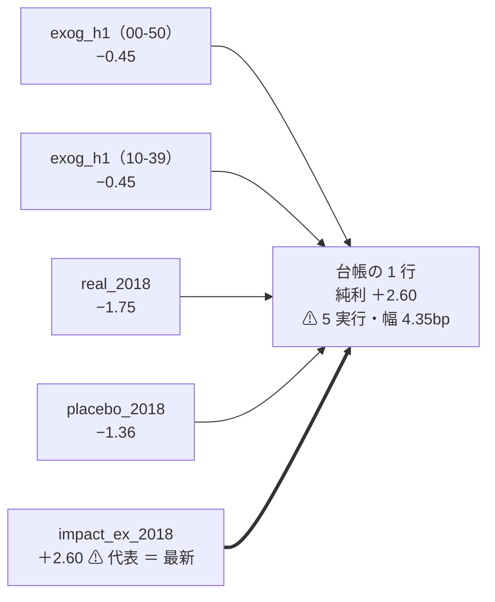

# 検証の単位 — 実行 → 手法 → 試行 → fold → セル

作成日: 2026-09-10。台帳（[ledger.md](ledger.md)）を読むための、5 つの単位の図解。
プラン: [validation-units-page.md](../../../plans/archive/validation-units-page.md) ／ 関連: [閾値つき売買の検証](../threshold-trading.md)

## 0. この頁の位置づけ — 解説であって規約ではない

⚠ **本書は解説であり、規約の正本ではない。** 定義はここに 1 つも足さない。
⚠ **本書と正本が食い違ったら、正本が勝ち、本書を直す。**

| 役割 | 正本 | ⚠ 注意 |
| --- | --- | --- |
| 規約（単位の定義・数え方） | [rules.md](rules.md) 10・11・13 章 | ⚠ **食い違ったら rules.md が勝つ** |
| 実装（鍵・数え方・畳み込み） | `ail/catalog.py`（`KEY`・`is_trial`・`_collapse`・`canonical`） | 同上 |
| 結果の一覧 | [ledger.md](ledger.md)（生成物） | ⚠ **手で書き換えない**（`cli/report.py --catalog` の出力） |

> この図の主張: 本書は正本 2 つ（規約・実装）の**読み方を教える**だけで、定義はどちらにも足さない。

⚠ **本書で引く数字はすべて【実測】で、2026-09-10 生成の台帳のもの。** 台帳を再生成すると変わる（行数・n_trials は実行を足すたびに増える）。

## 1. 全体図 — 5 つの単位はどこにあるか

| 単位 | 1 つ ＝ 何か | 記録上の実体 | 正本 |
| --- | --- | --- | --- |
| **実行** | `cli.run` を 1 回回したもの | `runs/<時刻>_<実験名>/` の 1 ディレクトリ | [rules.md §10](rules.md) |
| **手法** | 実行の中で比べた選別手法・基準線の 1 つ | その実行の `summary.csv` の行 | [rules.md §9・§10](rules.md) |
| **試行** | 台帳の 1 行。⚠ **複数の実行をまたいで、同じ鍵の手法をまとめたもの** | [ledger.md §2](ledger.md) の行（鍵 ＝ `catalog.KEY` の 9 列） | [rules.md §11・§13-9](rules.md) ／ `catalog.KEY` |
| **fold** | 試行の中のウォークフォワード分割 | `result.csv` の 1 行 ＝ 手法 × fold（× 閾値） | [rules.md §9](rules.md) |
| **セル** | 銘柄 × fold（最小の集計単位） | 新方式では `per_symbol.csv` の 1 行 | [rules.md §13-4・§13-7](rules.md) |

> この図の主張: 5 つの単位は素直な入れ子ではない。⚠ **実行 → 手法は入れ子だが、手法 → 試行は「複数の実行をまたいだ畳み込み」**である。ここが一番誤解されやすい。

この図を実在の実行 2 本で上から下まで通しで辿った実例が §8 にある（新方式を上から下へ ＝ §8-1、旧方式・5 実行の畳み込みを 1 行から分解 ＝ §8-2）。

## 2. 実行 — 1 実行 1 ディレクトリ

⚠ **1 実行 ＝ `runs/<時刻>_<実験名>/` の 1 ディレクトリ**（[rules.md §10](rules.md)）。中身は config の写し・入力の指紋・種・結果・ログで、⚠ **「どの設定・どのデータ・どのコードで出た数字か」を後から引けるようにする**ためにある。2026-09-10 生成の台帳では実行は 42 本（`runs/` 40 ＋ 旧配線 2）。

| ファイル | 中身 |
| --- | --- |
| `config.json` | 解決後の設定（`selectors`・モデル・地平・`[trading]` 節など） |
| `inputs.json` | 入力の指紋（層・行数・ハッシュ） |
| `env.json` | 種・git の commit・ライブラリの版 |
| `summary.csv` | ⚠ **1 行 ＝ 手法（× 閾値）。** 手法という単位の実体 |
| `result.csv` | ⚠ **1 行 ＝ 手法 × fold（× 閾値）。** fold という単位の実体 |
| `per_symbol.csv` | ⚠ **1 行 ＝ セル（手法 × 閾値 × fold × 銘柄）。** 閾値売買の実行だけ |
| `fitted/` ／ `log.txt` | 標本から学んだ係数（次の実行では読み込まない）／ ログ |

⚠ **1 実行には手法が複数入る。** TOML の `selectors` に書いた手法に、⚠ **基準線 2 本（常に上・直前リターンの符号）が自動で付く**（`cli/run.py` が「基準 」を付けて必ず測る。[rules.md §9](rules.md) 規約 5）。

> この図の主張: 手法は実行の「中の行」である。実例 `2026-09-10T20-05-14_trade_own_lgbm_a` では、selectors 2 本 ＋ 基準線 2 本 ＝ 4 手法が、閾値 × fold × 銘柄へ順に展開される。

⚠ **`_leak` で終わる実行（わざと未来を混ぜた対照実験）は、台帳の本体に入らない**（[rules.md §7](rules.md) 規約 7）。
台帳では [§5「配線の検査」](ledger.md)の別の表に行く（2026-09-10 生成で 81 行）。実例: `2026-09-10T20-06-33_trade_own_lgbm_a_leak` は的中率 0.9980 で、⚠ **この行が本体に混ざると台帳全体が嘘になる**。

## 3. 手法 → 試行 — 複数の実行をまたいだ畳み込み

試行は「実行の中の 1 行」ではなく、⚠ **全実行の手法の行を鍵（§4）でまとめ直した 1 行**である（`catalog._collapse`）。まとめ方は 2 方向ある。

| 向き | 規則 | 台帳での見え方 |
| --- | --- | --- |
| **まとめる** | 鍵 9 列がすべて同じ手法は、実行が何本あっても 1 試行 | 「再現」列に本数と一致・幅が出る（例: 「2 実行・一致」「⚠ 5 実行・幅 4.35bp」） |
| **割る** | ⚠ **鍵のどれか 1 列でも違えば、同じ手法名でも別試行** | 同じ手法名の行が複数並ぶ（モデル違い・層違い・閾値違い） |

実例（2026-09-10 生成の台帳・すべて【実測】）:

- **まとまる**: B&H（常に上）の own 層 × 共通 × θ50 の行は、`trade_own_ridge_a` と `trade_own_lgbm_a` の 2 実行から来て 1 行になり、「2 実行・一致」（⚠ **基準線はモデルを使わないので、モデル列が「—」に寄ってまとまる**）
- **幅が出る**: F1-2 相互情報量（own ex・毎日往復）は 5 実行から来て「⚠ 5 実行・幅 4.35bp」。⚠ **幅が出たら、まず配線を疑う**（[rules.md §11](rules.md) 規約 7）
- **割れる**: 同じ B&H が、⚠ **数値まで同一（純利 ＋1652.02bp）なのに 6 行に割れている** — 形式（共通 / 銘柄別）× 閾値（50 / 55 / 60）が鍵に入っているからで、⚠ **「行が割れる ＝ 数字が違う」ではなく「鍵が違う」**である

> この図の主張: 同じ鍵は実行をまたいで 1 行にまとまり、鍵が 1 列でも違えば（数値が同じでも）別の行に割れる。

⚠ **照合は名前ではなく ID で行う**（`catalog.canonical`）。旧配線の表と registry で表記が違う手法があり
（「F1-5 単変量検定 ＋ FDR」と「F1-5 検定+FDR」）、⚠ **名前で照合すると同じ試行が 2 行に割れる**（2026-09-08 に踏んだ）。

## 4. 鍵の 9 列 — 試行を分ける自由度

鍵は `catalog.KEY` の 9 列。⚠ **列の並びも名前も実装が正本**で、本書の表はその解説である。

| # | 列 | 中身 | 補足 |
| ---: | --- | --- | --- |
| 1 | 鍵 | 手法の照合名（カタログ ID。無ければ基準線の名前） | 「基準 」の接頭辞は外して寄せる |
| 2 | モデル | Ridge / LightGBM / MLP など | ⚠ **基準線の行は「—」**（モデルを使わない） |
| 3 | 粒度 | 日足 / 1 分足 | |
| 4 | 地平 | 「1 本（1 日）」など本数 ＋ 実時間 | |
| 5 | 特徴量の層 | own / own cs rel ll / own ex など | |
| 6 | 層 | データの層（raw / adjusted） | ⚠ **日足 × raw は無効・要再測** |
| 7 | 検証方式 | 毎日往復（旧）/ 閾値売買（新） | [rules.md 13 章](rules.md) |
| 8 | 形式 | 共通（63 銘柄 1 本）/ 銘柄別（銘柄ごと 1 本） | 閾値売買だけ（[13-6](rules.md)） |
| 9 | 閾値 | θ（50 / 55 / 60。旧方式は「—」） | ⚠ **1 水準 ＝ 1 試行**（[13-9](rules.md)） |

列は一度に決まったのではなく、処置の自由度が増えるたびに足された。⚠ **どの追加でも、旧実行は既定値で読むので既存の行は割れない**（後方互換）。

| 追加日 | 足した列 | 旧実行の読み方 |
| --- | --- | --- |
| 2026-09-08 | 鍵・粒度・地平・特徴量の層・層（台帳の新設） | — |
| 2026-09-09 | モデル | それまでは Ridge 1 本 → 旧実行は Ridge として読む |
| 2026-09-10 | 検証方式・形式・閾値（[rules.md 13-9](rules.md) の 1） | 旧実行は（毎日往復・共通・—）として読む |

## 5. 試行の数え方 — n_trials

⚠ **n_trials は多重検定の割引（デフレーテッド SR）に使う数で、数え落とすと必ず甘くなる**（[rules.md §11](rules.md) 規約 4）。
2026-09-10 生成の台帳では、⚠ **166 行のうち手法 91 行・基準線 75 行で、n_trials ＝ 91**【実測】。数えるかどうかは `catalog.is_trial` が機械的に決める。

> この図の主張: 数える / 数えないは行の中身から機械的に決まり、手では選ばない。

紛らわしい 3 つの線引き（すべて正本どおり）:

| 行 | 数えるか | ⚠ 理由 |
| --- | :-: | --- |
| 「全部使う（基準）」× LightGBM / MLP（毎日往復） | **数える** | ⚠ **モデルが処置**（選別ではなくモデルを試している。[plans/archive/gpu-models.md §3-4](../../../plans/archive/gpu-models.md)） |
| 閾値売買の「全部使う（基準）」（Ridge でも） | **数える** | ⚠ **検証方式が処置**（[rules.md 13-9](rules.md) の 4） |
| 閾値 3 水準で回した 1 手法 | **3 と数える** | ⚠ **1 fold 1 fit を 3 水準で使い回しても、選べた自由度は 3 つ**（[rules.md 13-3](rules.md) の 5） |

⚠ **基準線（B&H・直前符号・乱択）は数えない。** 採否の対象ではなく、物差しだからである。

## 6. fold — 符号パターンの出どころ

fold は試行の中のウォークフォワード分割で、時刻順に 6 等分した後ろ 5 つが検証になる（fold 1〜5。パージ・エンバーゴは [rules.md §9](rules.md)。閾値売買では切れ目を日付で決めて両形式に配る — [13-6](rules.md) の 1）。
⚠ **実体は `result.csv` の行**（1 行 ＝ 手法 × fold（× 閾値））で、台帳の「fold」列の符号パターンはここから機械的に出る。

⚠ **平均が正でも「5 fold 中 2 回は符号が逆」なら実力ではない**（[rules.md §11](rules.md) 規約 5）。それを 1 目で見せるのが符号パターンである。

> この図の主張: fold の符号は result.csv の 5 行から機械的に出る。⚠ **新方式（閾値売買）だけ、符号を取る前に B&H との引き算が入る。**

| 検証方式 | 符号を取る量 | 実例（2026-09-10 生成の台帳・【実測】） |
| --- | --- | --- |
| 毎日往復（旧） | fold の純利 bp | F1-2 相互情報量（own ex）: 「3/5 ＋＋−＋−」→ 平均は正でも割れているので**保留** |
| 閾値売買（新） | ⚠ **fold の対 B&H 上乗せ** | 全部使う × Ridge（own・共通・θ50）: 上乗せ ＋12.79bp・「1/5 0＋−00」→ **保留** |

⚠ **新方式で純利の符号を使わないのは、B&H でも純利が正になりうる（ドリフト）から**（[rules.md 13-7](rules.md)）。
純利の符号では「買って持っただけ」と区別できない。「0」は上乗せがちょうど 0 の fold（B&H と同額 — 取引がほぼ無い場合に出る）。

## 7. セルと試行の下の量 — 同じセルから 2 つの量が出る

セルは最小の集計単位 ＝ 銘柄 × fold。新方式では `per_symbol.csv` の 1 行がセル（手法 × 閾値 × fold × 銘柄。実例の実行では 63 銘柄 × 5 fold × 4 手法 × 3 閾値 ＝ 3,780 行）。

> この図の主張: 同じセルから 2 通りの集計が出るが、⚠ **採否に使えるのはポートフォリオ側だけ**である。

| 量 | 定義 | 使いみち | ⚠ 注意 |
| --- | --- | --- | --- |
| （旧）純利 bp | 全セルの単純平均 | 旧方式の判定の量 | ⚠ **新旧の純利 bp は別の物差しで、直接比べない**（[rules.md 13-8](rules.md)） |
| 銘柄別 bp | セルごとの累計純利 bp（[rules.md 13-4](rules.md) の 5） | **成果物**。中央値・四分位・勝ち銘柄数を summary に載せる | ⚠ **採否に使わない。** 63 銘柄は独立でなく（SPY は 48 社を丸ごと含む）、63 本で測ると多重検定になる |
| ポートフォリオ日次純利 | 63 銘柄の日次純利 bp の等加重平均（1 本の系列） | ⚠ **採否はこれ。** fold の符号・t は対 B&H の上乗せで見る（§6） | ⚠ **標本数は「検証日数」で数える**（行数 63 × 日数を使わない。[rules.md 13-7](rules.md)） |

⚠ **銘柄別 bp の正は手法の手柄ではない**ことに注意する。実測では B&H の中央値とほぼ同じ ＝ ドリフトの写しだった（[threshold-trading.md §6](../threshold-trading.md)）。

## 8. 実例 — 実在の 2 本で 5 つの単位を通しで辿る

§1〜§7 は単位ごとに別々の実例を引いた。本節は逆に、実在の実行を**上から下まで通しで**辿って体感に落とす。
⚠ **数字はすべて【実測】**（2026-09-10 生成の台帳と、`runs/` に実在するファイル）。台帳を再生成すると「再現」列などは変わる。

パターンは「単位の見え方が変わる」2 本を選んだ。

| | パターン A（§8-1） | パターン B（§8-2） |
| --- | --- | --- |
| 入口 | 実行 `2026-09-10T20-05-14_trade_own_lgbm_a` | 台帳の 1 行「F1-2 相互情報量 × own ex」 |
| 検証方式 × モデル | 閾値売買（新）× LightGBM | 毎日往復（旧）× Ridge |
| 辿る向き | 実行 → 台帳（上から下へ展開） | 台帳 → 実行（1 行を 5 実行へ分解） |
| 試行 | ⚠ **1 実行だけ**（「再現」列は「—」） | ⚠ **5 実行の畳み込み**（幅 4.35bp） |
| セル | per_symbol.csv 3,780 行がある | ⚠ **無い**（旧方式はセルを記録しない） |

### 8-1. パターン A — 新方式の 1 実行を上から下へ（trade_own_lgbm_a）

**実行**: `runs/2026-09-10T20-05-14_trade_own_lgbm_a/` の 1 ディレクトリ（§2 のじょうご図と同じ実行）。config.json の要点と、鍵（§4）への効き方:

| config.json の項 | 値 | 鍵のどの列になるか |
| --- | --- | --- |
| `model` | LightGBM | モデル |
| `feature_layers` | `["own"]` | 特徴量の層 |
| `selectors` | 全部使う（基準）・乱択（基準）の 2 本 | ＋ 基準線 2 本 ＝ **4 手法**（§2） |
| `trading` 節 | style=threshold・thresholds=50/55/60・form=shared | 検証方式（閾値売買）・閾値・形式（共通） |

**手法**: summary.csv は 12 行 ＝ 4 手法 × 3 閾値（⚠ 新方式では 1 行 ＝ 手法 × 閾値）。θ50 の 4 行:

| summary.csv の行（θ50 だけ抜粋） | 純利bp | IC | 取引回数 | 保有日率 |
| --- | ---: | ---: | ---: | ---: |
| 基準 常に上（ドリフト）＝ B&H | ＋1652.02 | 0.0 | 63 | 1.0 |
| 全部使う（基準）（35 本） | ＋1597.23 | ＋0.0071 | 50.4 | 0.8 |
| 乱択（基準）（16 本） | ＋1597.23 | −0.0147 | 50.4 | 0.8 |
| 基準 直前リターンの符号 | −165.74 | −0.0127 | 5714.2 | 0.52 |

読むときの注 2 つ:

- ⚠ **基準線の行は θ が変わっても同じ数字**（θ は手法側の足切りで、基準線は同じ売買が θ ごとに並ぶだけ）。台帳で B&H が「数値まで同一の 6 行」に割れるのはこのためである（§3）
- ⚠ **乱択が全部使うと同数値なのは、取引回数・保有日率まで同一 ＝ 同じ売買をしたから。** 選ぶ特徴量が違えば IC は違う（＋0.0071 と −0.0147）が、確率が θ50 のどちら側かまで同じなら売買は同じになる。手法の行は予測の行ではなく**売買の結果の行**である

**試行**: この実行の 12 行はすべて台帳へ行くが、⚠ **試行として数えるのは全部使う × 3 閾値 ＝ 3 行だけ**（§5: 閾値売買では乱択・「基準 」は数えない。閾値 1 水準 ＝ 1 試行）。3 行とも同じ鍵の実行が他に無いので「再現」列は「—」＝ 1 実行だけの試行。いっぽう同じ実行の B&H（own・共通）は `trade_own_ridge_a` と鍵が一致し（⚠ モデル列が「—」に寄る）、「2 実行・一致」へ畳み込まれる（§3 の実例そのもの）。

**fold**: result.csv 60 行（さらに × 5 fold）から、全部使う θ50 の 5 行と B&H θ50 の 5 行を並べる。⚠ 新方式の符号は対 B&H 上乗せ（§6）。

| fold | 全部使う 純利bp（取引回数） | B&H 純利bp | 上乗せ | 符号 |
| ---: | ---: | ---: | ---: | :-: |
| 1 | ＋2454.91（63） | ＋2454.91 | 0 | 0 |
| 2 | ＋933.92（63） | ＋933.92 | 0 | 0 |
| 3 | 0.00（⚠ **0**） | ＋273.92 | **−273.92** | − |
| 4 | ＋2391.72（63） | ＋2391.72 | 0 | 0 |
| 5 | ＋2205.60（63） | ＋2205.60 | 0 | 0 |

⚠ **fold 1・2・4・5 は B&H と数字が完全一致**している。取引 63 ＝ 63 銘柄 × 1 往復・保有日率 1.0、つまり LightGBM は毎日「上」と言い続けて期初に買い、持ちっぱなし ＝ B&H と同じ売買しかしていない。**fold 3 だけは全 63 銘柄を 1 日も買わず** 0 で、B&H が ＋273.92 の fold を丸ごと見送った。

> この図の主張: 台帳の「0/5 00−00」と「−54.78bp」は、result.csv の 10 行の引き算から機械的に出る。

台帳の該当行（2026-09-10 生成・【実測】）: 全部使う（基準）× LightGBM × own × 閾値売買 × 共通 × θ50 ＝ 純利 ＋1597.23bp・fold「0/5 00−00」・判定 **落とす**「⚠ 基準線以下 ＝ 何も学んでいない（対 B&H 上乗せ −54.78bp ≤ 0）」。⚠ **純利 ＋1597bp が正でも、それはドリフト（B&H ＋1652bp）の写しである**（§6 で「純利の符号を使わない」理由の実物）。

**セル**: per_symbol.csv 3,780 行 ＝ 4 手法 × 3 閾値 × 5 fold × 63 銘柄。全部使う θ50 の AAPL を fold 1 と 3 で並べると、fold の中身が銘柄単位でも同じ形だと分かる:

| per_symbol.csv の行 | 純利bp | 取引回数 | 保有日率 | 見送り日数 |
| --- | ---: | ---: | ---: | ---: |
| 全部使う・θ50・fold 1・AAPL | ＋8835.12 | 1 | 1.0 | 0 |
| 全部使う・θ50・fold 3・AAPL | 0.00 | 0 | 0.0 | 359 |

⚠ **セルの ＋8835bp を手法の手柄と読まない**（B&H の同じセルも ＋8835.12bp ＝ 同じ売買）。採否はセルではなくポートフォリオ日次純利で行う（§7）。

### 8-2. パターン B — 旧方式・台帳の 1 行を 5 実行へ分解する（F1-2 相互情報量 × own ex）

今度は逆向きに、台帳の 1 行から出発して下へ降りる。台帳の該当行（2026-09-10 生成・【実測】）:

F1-2 相互情報量 × Ridge × own ex × 毎日往復 ＝ 純利 **＋2.60bp**・fold「3/5 ＋＋−＋−」・再現「⚠ **5 実行・幅 4.35bp**」・判定 **保留**。

**試行 → 実行**: この 1 行に畳み込まれた 5 実行を `runs/` から引く:

| 実行 | 特徴量プール（inputs.json の `features`） | F1-2 の純利bp |
| --- | --- | ---: |
| `2026-09-09T00-50-10_exog_h1` | 85 本 | −0.45 |
| `2026-09-09T10-39-59_exog_h1` | 85 本（同じ特徴量ファイル） | −0.45（完全一致） |
| `2026-09-09T10-18-51_real_2018` | 63 本（外生は為替・イールドだけ） | −1.75 |
| `2026-09-09T10-28-35_placebo_2018` | 57 本（外生は気象・地震の偽薬） | −1.36 |
| `2026-09-10T16-18-54_impact_ex_2018` | 59 本 | **＋2.60** ← ⚠ **代表** |

> この図の主張: 台帳の代表値は一番新しい実行の数字で、残り 4 本は「再現」列の幅にしか現れない。

読むときの注 3 つ:

- **幅 4.35bp ＝ 最大 ＋2.60 − 最小 −1.75**。`catalog._collapse` は幅 0.1bp 以下なら「一致」、超えると ⚠ 印を付ける。exog_h1 の 2 本どうしなら「一致」だが、5 本まとめると幅が出る
- ⚠ **幅の出どころは鍵の粗さである**。鍵の「特徴量の層」は own ex という**名前**で、プールの中身（85〜57 本）までは見ない。だから外生列の中身が違う実行が同じ試行に畳み込まれる。⚠ **幅が出たら、まず配線を疑う**（[rules.md §11](rules.md) 規約 7）——疑う先は、この表のように各実行の inputs.json を並べたものである
- **代表は新配線の一番新しい実行**（`catalog._collapse`）。台帳の純利 ＋2.60・的中率 0.5133 は `impact_ex_2018` の summary.csv の 1 行**そのまま**で、5 本の平均ではない

**実行 → 手法**: 代表 `2026-09-10T16-18-54_impact_ex_2018` の config.json は selectors 11 本（F1〜F3 系 9 ＋ 全部使う・乱択）で、⚠ **`trading` 節が無い → 旧方式**（鍵は 毎日往復・共通・— として読む。§4）。summary.csv は 13 行 ＝ 13 手法（⚠ **閾値の列そのものが無い。1 行 ＝ 手法**）。F1-2 相互情報量はその先頭行（純利の降順で 13 手法中 1 位）。

**fold**: result.csv 65 行（13 手法 × 5 fold）から F1-2 の 5 行:

| fold | 1 | 2 | 3 | 4 | 5 |
| --- | ---: | ---: | ---: | ---: | ---: |
| 純利bp | ＋13.25 | ＋0.08 | −2.18 | ＋1.92 | −0.09 |
| 符号 | ＋ | ＋ | − | ＋ | − |

→ 台帳の「3/5 ＋＋−＋−」はこの 5 行から出る。⚠ 旧方式の符号は純利そのもの（B&H との引き算は入らない。§6）。平均 ＋2.60bp は fold 1 の ＋13.25 が引っ張った数字で、⚠ **平均だけ正 → 保留**（[rules.md §11](rules.md) 規約 5）。

**セル**: この実行に per_symbol.csv は**無い**。旧方式の純利 bp は全セル（銘柄 × fold）の単純平均で、⚠ **セルは集計の途中で消えて記録に残らない**（§7）。セルを実ファイルで触れるのは新方式（パターン A）だけである。

## 付録: 台帳を読むときの早見

| 台帳で見るもの | 対応する単位 | 本書 |
| --- | --- | --- |
| §2 の 1 行 | 試行 | §3・§4 |
| 「再現」列 | 試行 ← 実行の畳み込み | §3 |
| 「fold」列の符号パターン | fold | §6 |
| 「実行」列 → §4 の一覧 | 実行 | §2 |
| §5 の別の表 | leak 実行（本体に入れない） | §2 |
| n_trials | 試行の数え方 | §5 |
| 通しの実例で体感したい | 全単位 | §8（新方式 8-1 ／ 旧方式・畳み込み 8-2） |
